# [[elisp:sacha-emacs-export][Export this file asynchronously]]
# [[elisp:(sacha-emacs-export 'sync)][Export this file synchronously]]
#+TITLE: Sacha Chua's Emacs configuration
#+OPTIONS: toc:nil h:4 html-style:nil html-postamble:nil
#+SETUPFILE: ~/vendor/org-html-themes/org/theme-readtheorg-sachac.setup
#+STARTUP: showeverything
#+PROPERTY: header-args+   :results silent :exports code :eval never-export
#+PROPERTY: header-args:emacs-lisp+   :tangle yes :results silent :exports code :eval never-export :lexical t
#+ELEVENTY_COLLECTIONS: _posts
#+ELEVENTY_BASE_DIR: ~/proj/static-blog/
#+FILETAGS: :emacs:
#+ELEVENTY_CATEGORIES+: emacs
#+ELEVENTY_LAYOUT: layouts/post
#+ELEVENTY_BASE_URL: https://sachachua.com

Last exported:  {{{time(%Y-%m-%d)}}}

#+TOC: headlines 4

* About this file
:PROPERTIES:
:CUSTOM_ID: babel-init
:END:
<<babel-init>>

This is my personal config. It's really long, but that's partly
because I sometimes leave blog posts in it as commentary, and also
because I've got a lot of little customizations that I might not even
remember. =) If you want to see a table of contents and other
useful niceties, go to https://sachachua.com/dotemacs . Other links for
this page: [[https://raw.githubusercontent.com/sachac/.emacs.d/gh-pages/Sacha.org][Org Mode version]], [[https://codeberg.org/sachac/.emacs.d][Codeberg repository]], [[http://github.com/sachac/.emacs.d/][Github repository]]

If you're new to Emacs Lisp, you probably don't want to copy and paste
large chunks of this code. Instead, copy small parts of it (always
making sure to copy a complete set of parentheses) into your
~*scratch*~ buffer or some other buffer in ~emacs-lisp-mode~. Use ~M-x
eval-buffer~ to evaluate the code and see if you like the way that
Emacs behaves. See [[https://www.gnu.org/software/emacs/manual/html_mono/eintr.html][An Introduction to Programming in Emacs Lisp]] for
more details on Emacs Lisp. You can also find the manual by using ~C-h
i~ (~info~) and choosing "Emacs Lisp Intro".

I've installed a lot of packages. See the [[dotemacs:add-package-sources][package sources]] section to
add the repositories to your configuration. When you see ~use-package~
and a package name you might like, you can use ~M-x package-install~
to install the package of that name.

If you're viewing the Org file, you can open source code blocks (those
are the ones in ~begin_src~) in a separate buffer by moving your point
inside them and typing ~C-c '~ (~org-edit-special~). This opens another
buffer in =emacs-lisp-mode=, so you can use =M-x eval-buffer= to load
the changes. If you want to explore how functions work, use =M-x
edebug-defun= to set up debugging for that function, and then call it.
You can learn more about edebug in the [[http://www.gnu.org/software/emacs/manual/html_node/elisp/Edebug.html][Emacs Lisp]] manual.

I like using ~(setq ...)~ more than Customize because I can neatly
organize my configuration that way. Ditto for ~use-package~ - I mostly
use it to group together package-related config without lots of
~with-eval-after-load~ calls, and it also makes declaring keybindings
easier.

[[https://protesilaos.com/emacs/dotemacs#h:74c3a9e1-6852-4307-b7ba-925d8d2f61ff][Nudged by Prot's configuration]], I think I'm going to slowly start splitting off my code into modules that define functions and files that set behaviours.

[[dotemacs:index-of-sections-by-module][Index of sections by module]]

Here's my early-init.el:

#+begin_src emacs-lisp :tangle "~/.config/emacs/early-init.el" :eval never-export
(setq load-path (cl-remove-if (lambda (p) (string-match-p "lisp/org$" p)) load-path))
(add-to-list 'load-path "~/vendor/org-mode/lisp")
(add-to-list 'load-path "~/vendor/org-mode/contrib/lisp")
(load "~/vendor/org-mode/lisp/org-loaddefs.el" nil t)
(setq user-lisp-directory "~/sync/emacs/lisp")
#+end_src

Here's my init.el:

#+begin_src emacs-lisp :tangle "~/.config/emacs/init.el" :eval never-export
(load-file "~/sync/emacs/Sacha.el")
(load-file "~/sync/cloud/.emacs.secrets")
(load custom-file t)
(put 'narrow-to-region 'disabled nil)
(put 'list-timers 'disabled nil)
(server-mode 1)
#+end_src

Sacha.el is what =M-x org-babel-tangle= (=C-c C-v t=) produces.

*A note about Org updates:* I like running Org Mode from checked-out
source code instead of package.el. I add the Lisp directories to my
=load-path=, and I also use the =:load-path= option in my first
=use-package org= call to set the load path. One of those is probably
doing the trick and the other one is redundant, but maybe it's a
belt-and-suspenders sort of thing. Using the git checkout also makes
upgrading Org easy. All I have to do is =git pull; make=, and stuff
happens in an external Emacs process. Since I create =Sacha.el= via
=org-babel-tangle=, my Emacs config can load =Sacha.el= without
loading Org first.

** Debugging tips
:PROPERTIES:
:CUSTOM_ID: about-this-file-debugging-tips
:END:

If things break, I can use:

- ~check-parens~ to look for mismatched parentheses
- package:bug-hunter to bisect my configuration
- ~trace-function-background~ to get information printed to a buffer
- ~profiler-start~ to find out more about slow functions

** Starting up
:PROPERTIES:
:CUSTOM_ID: starting-up
:END:

Here's how we start:

#+NAME: startup
#+begin_src emacs-lisp  :comments no
;; -*- lexical-binding: t -*-
;; This sets up the load path so that we can override it
(setq warning-suppress-log-types '((package reinitialization)))  (package-initialize)
(add-to-list 'load-path "/usr/local/share/emacs/site-lisp")
(setq custom-file "~/.config/emacs/custom-settings.el")
(setq use-package-always-ensure t)
#+END_SRC

Memoize is handy for improving the performance when I use slow functions multiple times.

#+begin_src emacs-lisp
(use-package memoize)
#+end_src

** Emacs initialization
:PROPERTIES:
:CUSTOM_ID: emacs-initialization
:END:
*** Add package sources
:PROPERTIES:
:CUSTOM_ID: add-package-sources
:END:

#+BEGIN_SRC emacs-lisp
(unless (assoc-default "melpa" package-archives)
  (add-to-list 'package-archives '("melpa" . "https://melpa.org/packages/") t))
(unless (assoc-default "nongnu" package-archives)
  (add-to-list 'package-archives '("nongnu" . "https://elpa.nongnu.org/nongnu/") t))
#+END_SRC

Use =M-x package-refresh-contents= to reload the list of packages
after adding these for the first time.
*** Review packages when upgrading
:PROPERTIES:
:CUSTOM_ID: about-this-file-emacs-initialization-review-packages-when-upgrading
:END:
Emacs 31 onwards:

#+begin_src emacs-lisp
  (setq package-review-policy t
        package-review-diff-command '("git" "diff" "--no-index" "--color=never" "--diff-filter=d"))
  (add-to-list 'display-buffer-alist
               '("\\`\\*Package Review Diff:"
                 (display-buffer-full-frame)))
#+end_src

*** Add my elisp directory and other files
:PROPERTIES:
:CUSTOM_ID: add-sacha-elisp-directory-and-other-files
:END:

Sometimes I load files outside the package system. As long as they're
in a directory in my =load-path=, Emacs can find them.

#+NAME: package-setup
#+BEGIN_SRC emacs-lisp
(add-to-list 'load-path "~/elisp")
(setq use-package-verbose t)
(setq use-package-always-ensure t)
(require 'use-package)
(use-package quelpa)
(use-package quelpa-use-package)
(quelpa-use-package-activate-advice)
(setq load-prefer-newer t)
#+END_SRC

** Personal information
:PROPERTIES:
:CUSTOM_ID: personal-information
:END:

#+BEGIN_SRC emacs-lisp
(setq user-full-name "Sacha Chua"
      user-mail-address "sacha@sachachua.com")
#+END_SRC
** System information
:PROPERTIES:
:CUSTOM_ID: system-information
:END:

#+NAME: system-info
#+begin_src emacs-lisp
  (defvar sacha-laptop-p (or (equal (system-name) "sacha-x230") (equal (system-name) "sacha-p52")))
  (defvar sacha-server-p (and (equal (system-name) "localhost") (equal user-login-name "sacha")))
  (defvar sacha-phone-p (not (null (getenv "ANDROID_ROOT")))
    "If non-nil, GNU Emacs is running on Termux.")
  (when sacha-phone-p (setq gnutls-algorithm-priority "NORMAL:-VERS-TLS1.3"))
  (global-auto-revert-mode)  ; simplifies syncing
#+end_src

** Reload
:PROPERTIES:
:CUSTOM_ID: reload
:END:

#+begin_src emacs-lisp :tangle "lisp/sacha-emacs.el"
;;;###autoload
(defun sacha-reload-emacs-configuration ()
  (interactive)
  (load-file "~/proj/.emacs.d/Sacha.el"))
#+end_src

** Backups
:PROPERTIES:
:CUSTOM_ID: backups
:END:

This is one of the things people usually want to change right away. By default, Emacs saves backup files in the current directory. These are the files ending in =~= that are cluttering up your directory lists. The following code stashes them all in =~/.config/emacs/backups=, where I can find them with =C-x C-f= (=find-file=) if I really need to.

#+BEGIN_SRC emacs-lisp
  (setq backup-directory-alist '(("\\.env$" . nil)
                                                                                                                           ("." . "~/.config/emacs/backups")))
  (with-eval-after-load 'tramp
          (setq tramp-backup-directory-alist nil))
#+END_SRC

Disk space is cheap. Save lots.

#+BEGIN_SRC emacs-lisp
  (setq delete-old-versions -1)
  (setq version-control t)
  (setq vc-make-backup-files t)
  (setq auto-save-file-name-transforms '((".*" "~/.config/emacs/auto-save-list/" t)))
#+END_SRC
*** Obscure Emacs package appreciation: backup-walker
:PROPERTIES:
:EXPORT_DATE: 2025-09-18T09:19:03-0400
:EXPORT_ELEVENTY_PERMALINK: /blog/2025/09/obscure-emacs-package-appreciation-backup-walker/
:EXPORT_ELEVENTY_FILE_NAME: blog/2025/09/obscure-emacs-package-appreciation-backup-walker/
:EXPORT_MASTODON: https://social.sachachua.com/@sacha/statuses/01K5EHNVSHPHMAXFQPZYWJ1D1H
:CUSTOM_ID: about-this-file-backups-obscure-emacs-package-appreciation-backup-walker
:END:

The [[https://www.emacswiki.org/emacs/Carnival][Emacs Carnival]] theme for September is [[https://goritskov.com/posts/obscure_packages.html][obscure
packages]], which made me think of how the
[[https://github.com/lewang/backup-walker][backup-walker]] package saved me from having to
write some code all over again. Something went
wrong when I was editing my config in Org Mode. I
probably accidentally deleted a subtree due to
over-enthusiastic speed commands. (... Maybe I
should make my ~k~ shortcut for
[[dotemacs:org-mode-keyboard-shortcuts-speed-commands-org-mode-cutting-the-current-list-item-including-nested-lists-with-a-speed-command][~sacha-org-cut-subtree-or-list-item~]] only work in my
Inbox.org, posts.org, and news.org files.) Chunks of my
[[https://sachachua.com/dotemacs/index.html][literate Emacs configuration]] were gone, including
the code that defined [[dotemacs:sacha-org-insert-link-dwim][~sacha-org-insert-link-dwim~]].
Before I noticed, I'd already exported my (now
slightly shorter) Emacs configuration file with
~org-babel-tangle~ and restarted Emacs. I couldn't
recover the definition from memory using
[[dotemacs:inserting-code][~symbol-function~]]. I couldn't use [[package:vundo][vundo]] to browse
the Emacs undo tree. As usual, I'd been neglecting
to commit my config changes to Git, so I couldn't
restore a previous version. Oops.

Well, not the first time I've needed to rewrite
code from scratch because of a brain hiccup. I
started to reimplement the function. Then I
remembered that I had other backups. I have a 2 TB
SSD in my laptop, and I had configured Emacs to
neatly save numbered backups in a separate
directory, keeping all the versions without
deleting any of the old ones.

#+begin_src emacs-lisp
  (setq backup-directory-alist '(("\\.env$" . nil)
                                                                                                                           ("." . "~/.config/emacs/backups")))
  (with-eval-after-load 'tramp
          (setq tramp-backup-directory-alist nil))
  (setq delete-old-versions -1)
  (setq version-control t)
  (setq auto-save-file-name-transforms '((".*" "~/.config/emacs/auto-save-list/" t)))
#+end_src

At the moment, there are about 12,633 files adding
up to 3 GB. Totally worth it for peace of
mind. I could probably use grep to search for the
function, but it wasn't easy to see what changed
between versions.

I had learned about backup-walker in the process
of writing about [[https://sachachua.com/blog/2025/06/thinking-about-time-travel-with-the-emacs-text-editor-and-org-mode/][Thinking about time travel with
the Emacs text editor, Org Mode, and backups]]. So I
used [[https://github.com/lewang/backup-walker][backup-walker]] to flip through my file's
numbered backups in much the same way that
[[package:git-timemachine][git-timemachine]] lets you flip through Git versions
of a file. After ~M-x backup-walker-start~, I
tapped ~p~ to go through the previous backups. The
diff it showed me made it easy to check with ~C-s~
(~isearch-forward~) if this was the version I was
looking for. When I found the change, I pressed
RET to load the version with the function in it.
Once I found it, it was easy to restore that
section. I also restored a couple of other
sections that I'd accidentally deleted too, like
the custom [[dotemacs:org-mode-publishing-plain-text][plain text publishing backend]] I use to
export Emacs News with less punctuation. It took
maybe 5 minutes to figure this out. Hooray for
backup-walker!

Note that the backup-walker diff was the other way
around from what I expected. It goes "diff new
old" instead of "diff old new", so the green
regions marked with ~+~ indicate stuff that was
*removed* by the newer version (compared to the
one a little older than it) and the red regions
marked with ~-~ indicate stuff that was added.
This could be useful if you think backwards in
time, kind of like the [[https://www.gnu.org/software/emacs/manual/html_node/elisp/Antinews.html][Emacs Antinews]] file, but my
mind doesn't quite work that way. I wanted it to
look like a regular diff, with the additions in
newer versions marked with ~+~. Emacs being Emacs,
I changed it. Here's an example showing what it
looks like now:

#+CAPTION: backup-walker diffs going the direction I want them to: additions (+) marked in green, deletions (-) in red
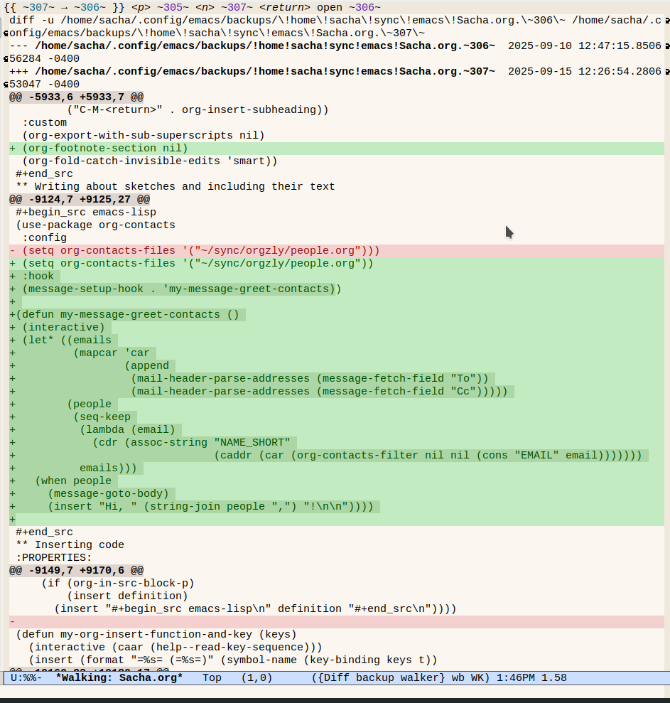

The following code makes it behave the way I
expect:

#+begin_src emacs-lisp :tangle "lisp/sacha-navigate.el"
(defvar backup-walker-data-alist)
(declare-function diff-no-select "diff" (old new &optional switches noasync bufname))
(declare-function backup-walker-get-version "backup-walker")
;;;###autoload
(defun sacha-backup-walker-refresh ()
  (let* ((index (cdr (assq :index backup-walker-data-alist)))
         (suffixes (cdr (assq :backup-suffix-list backup-walker-data-alist)))
         (prefix (cdr (assq :backup-prefix backup-walker-data-alist)))
         (right-file (concat prefix (nth index suffixes)))
         (right-version (format "%i" (backup-walker-get-version right-file)))
         diff-buf left-file left-version)
    (if (eq index 0)
        (setq left-file (cdr (assq :original-file backup-walker-data-alist))
              left-version "orig")
      (setq left-file (concat prefix (nth (1- index) suffixes))
            left-version (format "%i" (backup-walker-get-version left-file))))
    ;; we change this to go the other way here
    (setq diff-buf (diff-no-select right-file left-file nil 'noasync))
    (setq buffer-read-only nil)
    (delete-region (point-min) (point-max))
    (insert-buffer-substring diff-buf)
    (set-buffer-modified-p nil)
    (setq buffer-read-only t)
    (force-mode-line-update)
    (setq header-line-format
          (concat (format "{{ ~%s~ → ~%s~ }} "
                          (propertize left-version 'face 'font-lock-variable-name-face)
                          (propertize right-version 'face 'font-lock-variable-name-face))
                  (if (nth (1+ index) suffixes)
                      (concat (propertize "<p>" 'face 'italic)
                              " ~"
                              (propertize (int-to-string
                                           (backup-walker-get-version (nth (1+ index) suffixes)))
                                          'face 'font-lock-keyword-face)
                              "~ ")
                    "")
                  (if (eq index 0)
                      ""
                    (concat (propertize "<n>" 'face 'italic)
                            " ~"
                            (propertize (int-to-string (backup-walker-get-version (nth (1- index) suffixes)))
                                        'face 'font-lock-keyword-face)
                            "~ "))
                  (propertize "<return>" 'face 'italic)
                  " open ~"
                  (propertize (propertize (int-to-string (backup-walker-get-version right-file))
                                          'face 'font-lock-keyword-face))
                  "~"))
    (kill-buffer diff-buf)))
#+end_src

#+begin_src emacs-lisp
  (with-eval-after-load 'backup-walker
    (advice-add 'backup-walker-refresh :override #'sacha-backup-walker-refresh))
#+end_src

~backup-walker~ is not actually a real package in
the sense of ~M-x package-install~, but
fortunately, recent Emacs makes it easier to
install from a repository. I needed to
install it from
[[https://github.com/lewang/backup-walker]]. It was
written so long ago that I needed to
~defalias~ some functions that were removed in
Emacs 26.1. Here's the use-package snippet from my
configuration:

#+begin_src emacs-lisp
  (use-package backup-walker
          :vc (:url "https://github.com/lewang/backup-walker")
          :commands backup-walker-start
          :init
          (defalias 'string-to-int 'string-to-number)  ; removed in 26.1
          (defalias 'display-buffer-other-window 'display-buffer))
#+end_src

So there's an obscure package recommendation:
[[https://github.com/lewang/backup-walker][backup-walker]]. It hasn't been updated for more
than a decade, and it's not even installable the
regular way, but it's still handy.

I can imagine all sorts of ways this workflow
could be even better. It might be nice to dust off
backup-walker off, switch out the obsolete
functions, add an option for the diff direction,
and maybe sort things out so that you can reverse
the diff, split hunks, and apply hunks to your
original file. And maybe a way to walk the backup
history for changes in a specific region? I
suppose someone could make a spiffy
[[https://github.com/magit/transient][Transient]]-based user interface to modernize it.
But it's fine, it works. Maybe there's a more
modern equivalent, but I didn't see anything in a
quick search of ~M-x list-packages~ ~/ N~
(~package-menu-filter-by-name-or-description~) for
"backup~, except maybe [[https://elpa.gnu.org/packages/vc-backup.html][vc-backup]].[fn:vc-backup-repo:vc-backup: The [[https://git.sr.ht/~pkal/vc-backup][original
repo]] is missing, but you can read it via [[https://gitweb.git.savannah.gnu.org/gitweb/?p=emacs/elpa.git;a=blob_plain;f=vc-backup.el;hb=refs/heads/externals/vc-backup][ELPA's
copy]]. Update: It's over on [[https://codeberg.org/pkal/vc-backup.el][Codeberg]] now, and presumably the info on ELPA will be updated soon.] Is there a general-purpose VC equivalent to
git-timemachine? That might be useful.

I should really be saving things in proper version
control, but this was a good backup. That reminds
me: I should backup my backup backups. I had
initially excluded my ~~/.config~ directory from
[[https://www.borgbackup.org/][borgbackup]] because of the extra bits and bobs that
I wouldn't need when restoring from backup (like
all the Emacs packages I'd just re-download). But
my file backups... Yeah, that's worth it. I
changed my ~--exclude-from~ to ~--patterns-from~
and changing my [[https://manpages.debian.org/testing/borgbackup/borg-patterns.1.en.html][borg-patterns]] file to look like
this:

#+begin_example
+ /home/sacha/.config/emacs/backups
- /home/sacha/.config/*
# ... other rules
#+end_example

May backup-walker save you from a future oops!
** History
:PROPERTIES:
:CUSTOM_ID: history
:END:

From http://www.wisdomandwonder.com/wp-content/uploads/2014/03/C3F.html and https://emacsredux.com/blog/2026/04/07/stealing-from-the-best-emacs-configs/
#+BEGIN_SRC emacs-lisp
(setq savehist-file "~/.config/emacs/savehist")
(savehist-mode 1)
(setq history-length t)
(setq history-delete-duplicates t)
(setq savehist-save-minibuffer-history 1)
(setq savehist-additional-variables
      '(kill-ring
        search-ring
        sacha-stream-number
        regexp-search-ring))
(add-hook 'savehist-save-hook
          (lambda ()
            (setq kill-ring
                  (mapcar #'substring-no-properties
                          (cl-remove-if-not #'stringp kill-ring)))))
#+END_SRC

** Disabling the toolbar
:PROPERTIES:
:ID:       440c0b9a-9068-450b-89a3-a20c8ec1f447
:DRILL_LAST_INTERVAL: 3.86
:DRILL_REPEATS_SINCE_FAIL: 2
:DRILL_TOTAL_REPEATS: 1
:DRILL_FAILURE_COUNT: 0
:DRILL_AVERAGE_QUALITY: 3.0
:DRILL_EASE: 2.36
:DRILL_LAST_QUALITY: 3
:DRILL_LAST_REVIEWED: [2013-02-27 Wed 23:14]
:CUSTOM_ID: windows-configuration
:END:

When you're starting out, the tool bar can be very helpful. [[http://sachachua.com/blog/2014/03/emacs-basics-using-mouse/][(Emacs Basics: Using the Mouse]]). Eventually, you may want to reclaim that extra little bit of screenspace. The following code turns that thing off. (Although I changed my mind about the menu - I want that again.)

#+BEGIN_SRC emacs-lisp
  (tool-bar-mode -1)
#+END_SRC
** Change "yes or no" to "y or n"
:PROPERTIES:
:CUSTOM_ID: change-yes-or-no-to-y-or-n
:END:

Lazy people like me never want to type "yes" when "y" will suffice.

https://emacsredux.com/blog/2026/03/15/use-short-answers/

#+BEGIN_SRC emacs-lisp
  (setopt use-short-answers t)
#+END_SRC

** Minibuffer editing - more space!
:PROPERTIES:
:CUSTOM_ID: minibuffer-editing-more-space
:END:

Sometimes you want to be able to do fancy things with the text
that you're entering into the minibuffer. Sometimes you just want
to be able to read it, especially when it comes to lots of text.
This binds =C-M-e= in a minibuffer) so that you can edit the
contents of the minibuffer before submitting it.

#+BEGIN_SRC emacs-lisp
  (use-package miniedit
    :commands minibuffer-edit
    :init (miniedit-install))
#+END_SRC

** Killing text
:PROPERTIES:
:CUSTOM_ID: killing-text
:END:

    #+begin_src emacs-lisp
      (setq kill-ring-max 1000)
    #+end_src

From https://github.com/itsjeyd/emacs-config/blob/emacs24/init.el

#+BEGIN_SRC emacs-lisp :tangle lisp/sacha-navigate.el
;;;###autoload
(defun sacha-kill-single-line-if-region-is-inactive (beg end &optional region)
  "Wrap around `kill-region' so that we kill a single line."
  (interactive (progn
                 (let ((beg (mark kill-region-dwim))
                       (end (point)))
                   (cond
                    ((and kill-region-dwim (not (use-region-p)))
                     (list beg end kill-region-dwim))
                    ((not (and beg end))
                     (user-error "The mark is not set now, so there is no region"))
                    ((list beg end 'region))))))
  (if (or (region-active-p)
          (derived-mode-p 'minibuffer-mode))
      (kill-region beg end region)
    (kill-region
     (line-beginning-position)
     (line-beginning-position 2))))

(ert-deftest sacha-kill-single-line-if-region-is-inactive ()
  "Tests `sacha-kill-single-line-if-region-is-inactive'."
  (should
   (equal
    (with-temp-buffer
      (insert "Hello there\nWorld\n")
      (goto-char (point-min))
      (sacha-kill-single-line-if-region-is-inactive nil nil)
      (setq text (buffer-string)))
    "World\n")))
#+END_SRC

If I use =M-w= (=kill-ring-save=) without a region, I usually mean the current symbol.

#+begin_src emacs-lisp :tangle lisp/sacha-navigate.el :lexical t
;;;###autoload
(defun sacha-copy-symbol-if-region-is-inactive (beg end &optional region)
  "Wrap around `kill-ring-save' so that we kill a single line."
  (interactive (list (mark) (point) 'region))
  (if (region-active-p)
      (kill-ring-save beg end region)
    (let ((bounds (or (bounds-of-thing-at-point 'symbol)
                      (bounds-of-thing-at-point 'word))))
      (kill-new (filter-buffer-substring (car bounds) (cdr bounds))))))
#+end_src
#+begin_src emacs-lisp
(keymap-global-set "M-w" #'sacha-copy-symbol-if-region-is-inactive)
#+end_src

* Keybindings
:PROPERTIES:
:CUSTOM_ID: keybindings
:END:

#+begin_src emacs-lisp
  (repeat-mode 1)
#+end_src

** Embark                                                           :embark:
:PROPERTIES:
:CUSTOM_ID: embark
:END:
#+begin_src emacs-lisp
  (use-package embark
    :after org
    :load-path "~/vendor/embark"
    :config
          (setq embark-prompter 'embark-keymap-prompter)
          (add-to-list 'embark-target-finders 'sacha-embark-org-element)
          (add-to-list 'embark-target-finders 'sacha-embark-subed-timestamp)
          (add-to-list 'embark-target-injection-hooks '(sacha-journal-post embark--allow-edit))
          (with-eval-after-load 'subed
            (defvar-keymap embark-subed-timestamp-actions
              :doc "Subed timestamp actions"
              :parent subed-mode-map
              "." #'sacha-subed-set-timestamp-to-mpv-position
              "w" #'sacha-subed-copy-timestamp-dwim
              "<up>" #'sacha-subed-adjust-timestamp/sacha-subed-adjust-timestamp-up
              "f" #'sacha-waveform-subed-show-after-time
              "<down>" #'sacha-subed-adjust-timestamp/sacha-subed-adjust-timestamp-down))
          (defvar-keymap embark-sketch-actions
            :doc "Org Mode sketch-related actions"
            :parent org-mode-map
            "o" #'sacha-sketch-insert-file-as-link
                  "i" #'sacha-sketch-insert-file-as-link
            "v" #'sacha-geeqie-view)
          (defvar-keymap embark-journal-actions
            :doc "Journal"
            "e" #'sacha-journal-edit)
          (add-to-list 'embark-keymap-alist '(sketch . embark-sketch-actions))
          (add-to-list 'embark-keymap-alist '(subed-timestamp . embark-subed-timestamp-actions))
          (add-to-list 'embark-keymap-alist '(journal . embark-journal-actions))
          :bind
          (("C-." . embark-act)
           :map vertico-map
           (("M-e" . embark-export))
           :map minibuffer-local-map
           (("C-c e" . embark-act)
                  ("M-e" . embark-export)
            ("C-;" . embark-act)
                  ("C-<tab>" . embark-select)
                  ("C-S-<tab>" . (lambda () (interactive) (embark-select) (vertico-next))))
           :map embark-collect-mode-map
           (("C-c e" . embark-act)
            ("C-;" . embark-act)
                  ("C-<tab>" . embark-select))
           :map embark-general-map
           (("j" . sacha-journal-post)
            ("m" . sacha-stream-message)
            ("M-w" . (lambda (s) (interactive "MString: ") (kill-new s))))
           :map embark-symbol-map
           ("r" . erefactor-rename-symbol-in-buffer)
           :map embark-url-map
           ("c" . sacha-caption-show)
           ))
  (with-eval-after-load 'embark-org
    (define-key embark-org-src-block-map
           "i" #'sacha-org-fix-block-indentation))
	 #+end_src

This allows me to use C-h with completion in general.

#+begin_src emacs-lisp
  (setq prefix-help-command 'embark-prefix-help-command)
#+end_src

Things I'm getting used to using:

- ~C-. c~ on an Org Mode source block to copy the contents

In addition to the entries below, I also have Embark-related code in other places in my config:

- [[dotemacs:org-refile-insert-link][Insert a link to an Org Mode heading from an org-refile prompt]]
- [[dotemacs:consult-omni][consult-omni]]
- [[dotemacs:quickly-jump-to-positions][Quickly jump to positions]]
- [[dotemacs:org-mode-publishing-11ty-static-site-generation-linking-to-blog-posts-making-it-easier-to-add-a-category-to-a-blog-post][Making it easier to add a category to a blog post]]
- [[dotemacs:embark-11ty][embark-11ty]]
- [[dotemacs:git-projects][Using an Emacs Lisp macro to define quick custom Org Mode links to project files; plus URLs and search]] (2024)
- [[dotemacs:web-link][Copy web link]]
- [[dotemacs:org-mode-links-using-an-emacs-lisp-macro-to-define-quick-custom-org-mode-links-to-project-files-plus-urls-and-search-quickly-search-sacha-code][Quickly search my code]]
- [[dotemacs:org-mode-links-using-an-emacs-lisp-macro-to-define-quick-custom-org-mode-links-to-project-files-plus-urls-and-search-quickly-search-sacha-code-tip-from-omar-embark-around-action-hooks][Tip from Omar: embark-around-action-hooks]]
- [[dotemacs:edit-list][Edit list]]
- [[dotemacs:spookfox-babel][Running the current Org Mode Babel Javascript block from Emacs using Spookfox]] (2024)
- [[dotemacs:act-on-current-message-with-embark][Act on current message with Embark]]

*** Using Embark and qrencode to show a QR code for the Org Mode link at point :emacs:org:
:PROPERTIES:
:CUSTOM_ID: embark-qr
:EXPORT_DATE: 2024-01-10T15:46:11-0500
:EXPORT_ELEVENTY_PERMALINK: /blog/2024/01/using-embark-and-qrencode-to-show-a-qr-code-for-the-org-mode-link-at-point/
:EXPORT_ELEVENTY_FILE_NAME: blog/2024/01/using-embark-and-qrencode-to-show-a-qr-code-for-the-org-mode-link-at-point/
:EXPORT_MODIFIED: 2024-01-12T07:31:44-0500
:END:

#+begin_update
[2024-01-12]: Added some code to display the QR code on the right side.
#+end_update

John Kitchin includes [[https://www.youtube.com/watch?v=rGGAr1AWkTc][little QR codes in his videos]]. I
thought that was a neat touch that makes it easier for
people to jump to a link while they're watching. I'd like to
make it easier to show QR codes too. The following code lets
me show a QR code for the Org link at point. Since many of
my links use custom Org link types that aren't that useful
for people to scan, the code reuses the link resolution code
from [[dotemacs:web-link]] so that I can get the regular
~https:~ link.

#+begin_src emacs-lisp :tangle "lisp/sacha-misc.el"
;;;###autoload
  (defun sacha-org-link-qr (url)
          "Display a QR code for URL in a buffer."
          (let ((buf (save-window-excursion (qrencode--encode-to-buffer (sacha-org-stored-link-as-url url)))))
                  (if (> (frame-width) 80)
                                  (display-buffer-in-side-window buf '((side . right)))
                          (display-buffer buf))))
#+end_src

#+begin_src emacs-lisp
  (use-package qrencode
          :defer t
          :commands qrencode--encode-to-buffer
          :config
          (with-eval-after-load 'embark-org
                  (define-key embark-org-link-map (kbd "q") #'sacha-org-link-qr)))
#+end_src

#+CAPTION: Screenshot of QR code for the link at point
#+ATTR_HTML: :data-link t
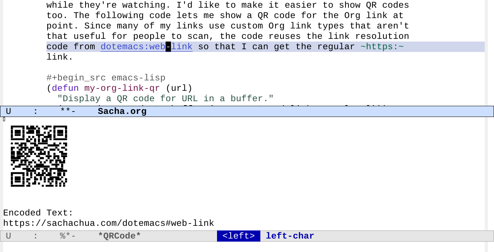

*** TODO Using Embark to act on video
:PROPERTIES:
:CUSTOM_ID: embark-video
:END:

#+begin_src emacs-lisp :tangle "lisp/sacha-embark.el"
;;;###autoload
(defun sacha-embark-video ()
  "Match video."
  (let ((extensions "youtu\\.?be\\|\\(webm\\|mp4\\|flv\\)$"))
    (or (if-let* ((link (and (derived-mode-p 'org-mode)
														 (org-element-context))))
						(when (eq (org-element-type link) 'link)
							(cond
							 ((string-match extensions (org-element-property :path link))
								(cons 'video (org-element-property :raw-link link))))))
				(and (url-get-url-at-point)
						 (string-match extensions (url-get-url-at-point))
						 (cons 'video (url-get-url-at-point)))
				(and (derived-mode-p 'dired-mode)
						 (string-match extensions (dired-get-filename))
						 (cons 'video (dired-get-filename))))))

;;;###autoload
(defun sacha-embark-video-edit-youtube (url)
  "Go to the YouTube edit page for VIDEO."
  (interactive "MURL: ")
	(when (or (string-match "youtu\\.?be\\(?:\\.com\\)?/\\(?:live/\\|watch/\\)?\\([-A-Za-z0-9_]+\\)" url)
            (string-match "watch\\?v=\\([-A-Za-z0-9_]+\\)" url))
    (browse-url (format "https://studio.youtube.com/video/%s/edit" (match-string 1 url)))))
#+end_src

#+begin_src emacs-lisp
  (with-eval-after-load 'embark
          (add-to-list 'embark-target-finders 'sacha-embark-video)
          (defvar-keymap sacha-embark-video-actions
                  :doc "video"
                  "d" #'sacha-deepgram-recognize-audio
                  "$" #'sacha-deepgram-cost
                  "m" #'mpv-play
                  "w" #'embark-copy-as-kill
                  "c" #'sacha-caption-show
									"e" #'sacha-embark-video-edit-youtube
                  "t" #'sacha-audio-text
                  "W" #'waveform-show)
          (add-to-list 'embark-keymap-alist '(video . sacha-embark-video-actions)))
#+end_src


*** Using Embark to act on audio
:PROPERTIES:
:CUSTOM_ID: embark-audio
:END:

#+begin_src emacs-lisp :tangle "lisp/sacha-embark.el"
;;;###autoload
(defun sacha-embark-audio ()
  "Match audio."
  (let ((extensions "m4a\\|mp3\\|wav\\|ogg\\|opus"))
    (if-let ((link (and (derived-mode-p 'org-mode)
                        (org-element-context))))
        (when (eq (org-element-type link) 'link)
          (cond
           ((string-match extensions (org-element-property :path link))
            (cons 'audio (org-element-property :path link)))))
      (when (and (derived-mode-p 'dired-mode)
                 (string-match extensions (dired-get-filename)))
        (cons 'audio (dired-get-filename))))))

;;;###autoload
(defun sacha-audio-text (file &optional insert)
  "Get the text for FILE audio.
  If called interactively, copy to the kill ring."
  (interactive (list (read-file-name "Audio: ")))
  (let (text)
    (cond
     ((file-exists-p (concat (file-name-sans-extension file) ".txt"))
      (with-temp-buffer
        (insert-file-contents (concat (file-name-sans-extension file) ".txt"))
        (setq text (buffer-string))))
     ;; no txt yet, is there a vtt?
     ((file-exists-p (concat (file-name-sans-extension file) ".vtt"))
      (setq text (subed-subtitle-list-text
                  (subed-parse-file (concat (file-name-sans-extension file) ".vtt")))))
     ;; no VTT, let's recognize it
     (t
      (sacha-deepgram-recognize-audio file)
      (when (file-exists-p (concat (file-name-sans-extension file) ".vtt"))
        (setq text (subed-subtitle-list-text
                    (subed-parse-file (concat (file-name-sans-extension file) ".vtt")))))))
    (when text
      (when (called-interactively-p 'any)
        (if insert
            (insert text "\n")
          (kill-new text)))
      text)))

;;;###autoload
(defun sacha-open-in-audacity (file)
  (interactive "FFile: ")
  (start-process "audacity" nil "audacity" file))
#+end_src

#+begin_src emacs-lisp
(with-eval-after-load 'embark
  (add-to-list 'embark-target-finders 'sacha-embark-audio)
  (defvar-keymap sacha-embark-audio-actions
    :doc "audio"
    "a" #'sacha-open-in-audacity
    "d" #'sacha-deepgram-recognize-audio
    "$" #'sacha-deepgram-cost
    "D" #'sacha-audio-braindump-reprocess
    "m" #'mpv-play
    "w" #'sacha-audio-text
    "W" #'waveform-show)
  (add-to-list 'embark-keymap-alist '(audio . sacha-embark-audio-actions)))
#+end_src

*** Using Embark to insert files as Org INCLUDEs
:PROPERTIES:
:CUSTOM_ID: using-embark-to-insert-files-as-org-includes
:END:

#+begin_src emacs-lisp :tangle "lisp/sacha-org.el"
;;;###autoload
(defun sacha-insert-file-as-org-include (file)
  (interactive "fFile: ")
  (set-text-properties 0 (length file) nil file)
  (let ((mode (assoc-default file auto-mode-alist 'string-match)))
    (insert
     (org-link-make-string (concat "file:" file) (concat "Download " (file-name-nondirectory file))) "\n"
     "#+begin_my_details " (file-name-nondirectory file) "\n"
     (format "#+INCLUDE: %s" (prin1-to-string file))
     (if mode
         (concat " src " (replace-regexp-in-string "-mode$" "" (symbol-name mode)))
       "")
     "\n"
     "#+end_my_details\n")))

;;;###autoload
(defun sacha-transform-org-link-to-include ()
  (interactive)
  (let ((link (org-element-lineage (org-element-context) '(link) t))
        (mode (assoc-default (org-element-property :path link) auto-mode-alist 'string-match)))
    (when link
      (delete-region (org-element-property :begin link)
                     (org-element-property :end link))
      (sacha-insert-file-as-org-include (org-element-property :path link)))))
#+end_src

#+begin_src emacs-lisp
(with-eval-after-load 'embark
  (define-key embark-file-map "O" #'sacha-insert-file-as-org-include))
#+end_src
*** Using Embark to offer context-sensitive actions for Org elements
:PROPERTIES:
:CUSTOM_ID: using-embark-to-offer-context-sensitive-actions-for-org-elements
:END:

#+NAME: embark
#+begin_src emacs-lisp :tangle "lisp/sacha-embark.el"
;;;###autoload
(defun sacha-embark-org-element ()
  "Target an Org Mode element at point."
  (save-window-excursion
    (save-excursion
      (save-restriction
        (when (derived-mode-p 'org-agenda-mode)
          (org-goto-marker-or-bmk (org-get-at-bol 'org-marker))
          (org-back-to-heading))
        (when (derived-mode-p 'org-mode)
          (let* ((context ;; Borrowed from org-open-at-point
                  ;; Only consider supported types, even if they are not the
                  ;; closest one.
                  (org-element-lineage (org-element-context)
                                       '(headline src-block link) t))
                 (type (org-element-type context))
                 (value (org-element-property :value context)))
            (cond ((eq type 'headline)
                   (cons 'org-heading (org-element-property :title context)))
                  ;; src-block and link can be handled by embark-org
                  )))))))

;;;###autoload
(defun sacha-embark-org-src-block-copy-noweb-reference (element)
  (kill-new (if (org-element-property element :parameters)
                (format "<<%s(%s)>>" (org-element-property element :name)
                        (org-element-property element :parameters))
              (format "<<%s>>" (org-element-property element :parameters)))))
#+end_src

#+begin_src emacs-lisp
(with-eval-after-load 'embark-org
  (keymap-set embark-org-src-block-map "N" #'sacha-embark-org-src-block-copy-noweb-reference))
#+end_src

*** Whichkey and Embark
:PROPERTIES:
:CUSTOM_ID: whichkey-embark
:END:

From https://github.com/oantolin/embark/wiki/Additional-Configuration#use-which-key-like-a-key-menu-prompt

#+begin_src emacs-lisp :tangle "lisp/sacha-embark.el"
;;;###autoload
(defun embark-which-key-indicator ()
  "An embark indicator that displays keymaps using which-key.
  The which-key help message will show the type and value of the
  current target followed by an ellipsis if there are further
  targets."
  (lambda (&optional keymap targets prefix)
    (if (null keymap)
        (which-key--hide-popup-ignore-command)
      (which-key--show-keymap
       (if (eq (plist-get (car targets) :type) 'embark-become)
           "Become"
         (format "Act on %s '%s'%s"
                 (plist-get (car targets) :type)
                 (embark--truncate-target (plist-get (car targets) :target))
                 (if (cdr targets) "…" "")))
       (if prefix
           (pcase (lookup-key keymap prefix 'accept-default)
             ((and (pred keymapp) km) km)
             (_ (key-binding prefix 'accept-default)))
         keymap)
       nil nil t (lambda (binding)
                   (not (string-suffix-p "-argument" (cdr binding))))))))

;;;###autoload
(defun embark-hide-which-key-indicator (fn &rest args)
  "Hide the which-key indicator immediately when using the completing-read prompter."
  (which-key--hide-popup-ignore-command)
  (let ((embark-indicators
         (remq #'embark-which-key-indicator embark-indicators)))
    (apply fn args)))
#+end_src

#+begin_src emacs-lisp
(setq embark-indicators
      '(embark-which-key-indicator
        embark-highlight-indicator
        embark-isearch-highlight-indicator))

(with-eval-after-load 'embark
  (advice-add #'embark-completing-read-prompter
              :around #'embark-hide-which-key-indicator))
#+end_src

**** DONE Changing the which-key labels for shortcuts             :embark:
CLOSED: [2025-01-06 Mon 13:50] SCHEDULED: <2025-01-05 Sun>
:PROPERTIES:
:CUSTOM_ID: which-key-replacements
:CREATED:  [2025-01-04 Sat 21:11]
:END:
:LOGBOOK:
- State "DONE"       from "TODO"       [2025-01-06 Mon 13:50]
:END:

It's hard to remember keyboard shortcuts, so I'm
glad that Emacs 30 now includes which-key by
default. You still need to enable
~which-key-mode~, but once you do, if you pause in
the middle of a keyboard combination like
~C-c ...~, you'll see a menu of shortcuts.

I've been exploring more context menus with [[https://github.com/oantolin/embark][Embark]]. Using the [[https://github.com/oantolin/embark/wiki/Additional-Configuration#use-which-key-like-a-key-menu-prompt][suggested configuration from Embark's wiki]], I have it set up so that I can use ~C-.~ (~embark-act~) to open or cycle through different context-sensitive keymaps, with a ~which-key~ display when I pause, and completion on the commands in the keymap if I use ~C-h~.

I want to make the ~which-key~ menu a little
easier to scan: shorter function names, more
logical grouping, and less visual noise. I think
I'm on the right track with these which-key
tweaks.

#+CAPTION: Screenshot of which-key with some tweaks
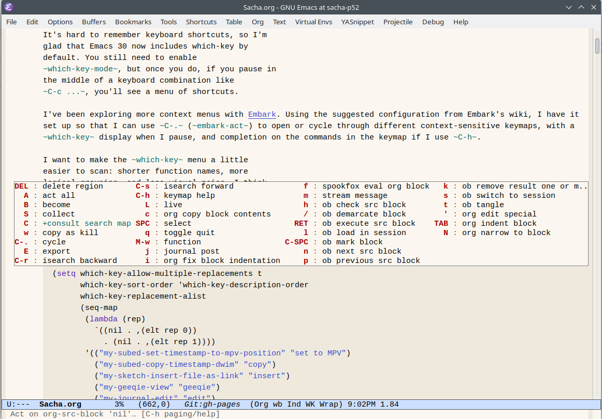

#+begin_src emacs-lisp :eval never-export :results none :exports code
  (with-eval-after-load 'which-key
          (setopt which-key-allow-multiple-replacements t
                                  which-key-sort-order 'which-key-description-order
                                  which-key-replacement-alist
                                  (seq-map
                                   (lambda (rep)
                                           `((nil . ,(elt rep 0))
                                                   . (nil . ,(elt rep 1))))
                                   '(("sacha-subed-set-timestamp-to-mpv-position" "set to MPV")
                                           ("sacha-embark-org-copy-exported-url" "⭐🗐🔗 copy exported URL")
                                           ("sacha-subed-copy-timestamp-dwim" "copy")
                                           ("sacha-sketch-insert-file-as-link" "insert")
                                           ("sacha-geeqie-view" "geeqie")
                                           ("sacha-journal-edit" "edit")
                                           ("sacha-org-link-qr" "qr")
                                           ("sacha-image-open-in-" "")
                                           ("org-babel-" "ob-")
                                           ("next" "🠆")
                                           ("previous" "🠄")
                                           ("sacha-image-" "")
                                           ("sacha-embark-org-blog-" "")
                                           ("embark-collect" "⇶ collect")
                                           ("sacha-embark-org-" "")
                                           ("sacha-" "")
                                           ("embark-" "")
                                           ("embark-act-all" "all")
                                           ("embark-become" "become")
                                           ("embark-collect" "collect")
                                           ("-" " ")))))
#+end_src

Changing ~which-key-sort-order~ to sort by
description seems to do a reasonable job of
grouping things somewhat logically. The sorting
happens before replacement, so the result might
not look sorted once my replacements are done. If
I want to tweak it further, I could ~defalias~
commands and then put them into the keymaps with
replacements, or maybe look into overriding
~which-key--get-bindings~. Also, these
replacements are not used by
~embark-completing-read-prompter~, but maybe I can
wrap some advice around
~embark--formatted-bindings~ in order to change that.

*** Embark and images   :image:
:PROPERTIES:
:CATEGORY: Sacha
:EXPORT_MODIFIED: 2024-09-25T14:31:49-0400
:CUSTOM_ID: embark-image
:END:

#+begin_update
[2024-09-25]: added attachment handling
#+end_update

#+begin_src emacs-lisp :tangle "lisp/sacha-sketch.el"
;;;###autoload
(defun sacha-sketch-insert-file-as-link (f)
  (interactive (list (sacha-complete-sketch-filename)))
  (cond
   ((derived-mode-p 'org-mode)
    (insert (org-link-make-string (concat "sketch:" (file-name-nondirectory f))) "\n"))
   ((or (derived-mode-p 'html-mode) (derived-mode-p 'web-mode))
    (insert ""))
   (t (insert f))))
#+end_src

#+begin_src emacs-lisp :tangle "lisp/sacha-embark.el"
;;;###autoload
(defun sacha-embark-image ()
  "Match images."
  (let ((extensions "\\(png\\|jpg\\|svg\\|gif\\|jpeg\\)\\'"))
    (cond
     ((derived-mode-p 'org-mode)
      (when-let* ((link (org-element-context)))
        (when (eq (org-element-type link) 'link)
          (cond
           ((string= "attachment" (org-element-property :type link))
            (cons 'image (expand-file-name (org-element-property :path link)
                                           (org-attach-dir))))
           ((string-match "sketch" (org-element-property :type link))
            (cons 'image (sacha-get-sketch-filename (org-element-property :path link))))
           ((string-match extensions (org-element-property :path link))
            (cons 'image (org-element-property :path link)))))))
     ((and (derived-mode-p 'dired-mode)
           (string-match extensions (dired-get-filename)))
      (cons 'image (dired-get-filename)))
     ((derived-mode-p 'subed-mode)
      (when-let* ((filename (thing-at-point 'filename)))
        (when (string-match (concat "file:\\(.+\\." extensions "\\)") filename)
          (cons 'image (match-string 1 filename)))))
     ((and (buffer-file-name)
           (string-match extensions (buffer-file-name)))
      (cons 'image (buffer-file-name))))))
  (with-eval-after-load 'embark
          (add-to-list 'embark-target-finders 'sacha-embark-image))
#+end_src

I want to:

- open images in an annotation program, maybe [[https://github.com/phase1geo/Annotator][com.github.phase1geo.annotator]]
- open images in [[https://krita.org/en/][Krita]]
- replace with latest screenshot
- copy text to kill ring
- insert text as details block

#+begin_src emacs-lisp :tangle "lisp/sacha-image.el"
;;;###autoload
(defun sacha-image-open-in-annotator (file)
  (interactive "FImage: ")
  (start-process "annotator" nil "com.github.phase1geo.annotator" (expand-file-name file)))

;;;###autoload
(defun sacha-image-open-in-krita (file)
  (interactive "FImage: ")
  (start-process "krita" nil "krita" "--nosplash" (expand-file-name file)))

;;;###autoload
(defun sacha-image-open-in-inkscape (file)
  (interactive "FImage: ")
  (start-process "inkscape" nil "inkscape" (expand-file-name file)))

;;;###autoload
(defun sacha-image-open-in-gimp (file)
  (interactive "FImage: ")
  (start-process "gimp" nil "gimp" (expand-file-name file)))

;;;###autoload
(defun sacha-open-in-firefox (file)
  (interactive "FItem: ")
  (start-process "firefox" nil "firefox" (if (string-match "^http" file) file (expand-file-name file))))

(defvar sacha-image-autocrop-border 10)

;;;###autoload
(defun sacha-image-autocrop (filename &optional border)
  (interactive "FFile: ")
  (setq border (or border sacha-image-autocrop-border))
  (let ((args (append '("-trim")
                      (if border `("-bordercolor" "#FFFFFF" "-border" ,(number-to-string border)))
                      (list "+repage" (expand-file-name filename)))))
    (apply #'call-process "mogrify" nil sacha-debug-buffer nil args)
    filename))
#+end_src
*** Converting handwriting to text
:PROPERTIES:
:CUSTOM_ID: keybindings-embark-converting-handwriting-to-text
:END:

#+begin_src emacs-lisp :tangle "lisp/sacha-image.el"
;;;###autoload
(defun sacha-image-recognize (file)
  "Returns the text."
  (interactive "FFile: ")
  (if (file-exists-p (concat (file-name-sans-extension file) ".txt"))
      (with-temp-buffer
        (insert-file-contents (concat (file-name-sans-extension file) ".txt"))
        (buffer-string))
    (let* ((data
            (json-parse-string
             (if (file-exists-p (concat (file-name-sans-extension file) ".json"))
                 (with-temp-buffer
                   (insert-file-contents (concat (file-name-sans-extension file) ".json"))
                   (buffer-string))
               (when (string= (file-name-extension file) "pdf")
                 (setq file (sacha-sketch-convert-pdf file)))
               (when (string= (file-name-extension file) "svg")
                 (call-process "inkscape" nil sacha-debug-buffer nil "--export-type=png" "--export-dpi=96" "--export-background-opacity=1" "--pdf-poppler" (expand-file-name file)))
               (catch 'done
                 (dolist (ext '(".png" ".jpg" ".jpeg"))
                   (when (file-exists-p (concat (file-name-sans-extension file) ext))
                     (with-temp-file (concat (file-name-sans-extension file) ".json")
                       (call-process "gcloud" nil t nil "ml" "vision" "detect-document"
                                     (expand-file-name (concat (file-name-sans-extension file) ext)))
                       (throw 'done (buffer-string)))))))
             :object-type 'alist))
           (text
            (if (assoc-default 'responses data)
                (assoc-default 'text (assoc-default 'fullTextAnnotation (elt (assoc-default 'responses data) 0)))
              (assoc-default 'description (elt (assoc-default 'textAnnotations data) 0)))))
      (with-temp-file (concat (file-name-sans-extension file) ".txt")
        (insert text))
      text)))
#+end_src

*** Renaming and storing
:PROPERTIES:
:CUSTOM_ID: keybindings-embark-renaming-and-storing
:END:

#+begin_src emacs-lisp :tangle "lisp/sacha-image.el"
;;;###autoload
(defun sacha-image-rename-current-image-based-on-id (id)
  (interactive
   (let ((filename (if (derived-mode-p 'image-mode)
                       (buffer-file-name)
                     (dired-get-filename))))
     (list
      (if (string-match "[0-9][0-9][0-9][0-9]-[0-9][0-9]-[0-9][0-9]-[0-9][0-9]" filename)
          (match-string 0 filename)
        (read-string "ID: ")))))
  (let* ((data (sacha-journal-get-by-zidstring id))
         (old-file (if (derived-mode-p 'image-mode)
                       (buffer-file-name)
                     (dired-get-filename)))
         (ext (file-name-extension old-file))
         (new-prefix (concat id " " (plist-get data :Note)))
         (text (plist-get data :Other))
         new-file)
    (when (and text (not (string= (string-trim text) "")))
      (with-temp-file (concat (file-name-sans-extension old-file) ".txt")
        (insert text)))
    (when (derived-mode-p 'image-mode)
      (kill-buffer))
    (setq new-file
          (sacha-image-store (sacha-rename-file-set old-file
                                              new-prefix t)
                          t))
    (when (derived-mode-p 'image-mode)
      (find-file new-file))
    (find-file (concat (file-name-sans-extension new-file) ".txt"))))

;;;###autoload
(defun sacha-image-recognize-get-new-filename (file)
  (interactive "FFile: ")
  (if-let* ((text (sacha-image-recognize file))
            (id (and (string-match "[0-9][0-9][0-9][0-9]-[0-9][0-9]-[0-9][0-9]-[0-9][0-9]" text)
                     (match-string 0 text)))
            (data (and id (sacha-journal-get-by-zidstring id))))
      (expand-file-name
       (concat id " " (plist-get data :Note) "." (file-name-extension file))
       (file-name-directory file))
    file))

;;;###autoload
(defun sacha-image-recognize-and-rename (file)
  (interactive "FFile: ")
  (let ((new-name (expand-file-name (sacha-image-recognize-get-new-filename file)
                                    (file-name-directory file))))
    (rename-file file new-name t)
    new-name))

;;;###autoload
(defun sacha-image-tags (file)
  (setq file (file-name-base file))
  (cond
   ((string-match "#\\([^ ]+\\)" file)
    (let ((start-pos 0))
      (cl-loop for match-pos = (string-match "#\\([^ \\.]+\\)" file start-pos)
               while match-pos
               collect (match-string 1 file)
               do (setf start-pos (1+ match-pos)))))
   ((string-match " -- \\(.+\\)" file)
    (split-string (match-string 1 file) " "))))

;;;###autoload
(defun sacha-image-name-without-tags (file)
  (replace-regexp-in-string " -- \\([^\\.]+\\)" (replace-regexp-in-string " #\\([^\\.]+\\)" "" file)))

;;;###autoload
(defun sacha-image-rename-set (old-name new-name &optional tags do-copy)
  (when (or (not (string= old-name new-name)) tags)
    (when tags
      (setq new-name (concat (sacha-image-name-without-tags new-name)
                             " -- "
                             (string-join tags " ")
                             (file-name-extension new-name))))
    (dolist (file (sacha-file-set old-name))
      (funcall
       (if do-copy
           'copy-file
         'rename-file)
       file
       (concat (file-name-sans-extension new-name) "." (file-name-extension file))
       t)))
  new-name)

;;;###autoload
(defun sacha-image-store (file &optional do-move)
  "Copy or move this image into public or private sketches as needed."
  (interactive (list (if (derived-mode-p 'image-mode)
                         (buffer-file-name)
                       (dired-get-filename))
                     t))
  (unless (string-match "^[0-9][0-9][0-9][0-9]-[0-9][0-9]-[0-9][0-9]-[0-9][0-9] " (file-name-nondirectory file))
    (setq file (sacha-image-recognize-and-rename file)))
  (if (string-match "^[0-9][0-9][0-9][0-9]-[0-9][0-9]-[0-9][0-9]-[0-9][0-9] " (file-name-nondirectory file))
      (let ((private (member "private" (sacha-image-tags file))))
        (sacha-image-rename-set
         file
         (expand-file-name
          (file-name-nondirectory file)
          (if private
              sacha-private-sketches-directory
            (car sacha-sketch-directories)))))
    file))

;;;###autoload
(defun sacha-image-copy-text (file)
  (interactive "FImage: ")
  (kill-new (sacha-image-recognize file)))

;;;###autoload
(defun sacha-image-insert-text-as-details (file)
  (interactive "FImage: ")
  (when (and (derived-mode-p 'org-mode)
             (eq (org-element-type (org-element-context)) 'link))
    (goto-char (org-element-end (org-element-context))))
  (insert "\n#+begin_my_details\n" (sacha-image-recognize file) "\n#+end_my_details\n"))

;;;###autoload
(defun sacha-image-thumbnail (path)
  (interactive "FImage: ")
  (let* ((filename (expand-file-name (concat "thumb-" (file-name-nondirectory path))
                                     (file-name-directory path))))
    (call-process "convert" nil nil nil path "-thumbnail" "500x" filename)
    (kill-new filename)
    filename))
#+end_src

#+begin_src emacs-lisp :tangle "lisp/sacha-org.el"
;;;###autoload
(defun sacha-org-svg-copy-links (filename)
  (interactive (list (read-file-name "SVG: " nil
                                     nil
                                     (lambda (f)
                                       (or (string-match "\\.svg$" f)
                                           (file-directory-p f))))))
  (let ((dom (car (xml-parse-file filename))))
    (kill-new
     (mapconcat
      (lambda (elem)
        (concat "- " (org-link-make-string
                      (dom-attr elem 'href)
                      (or (dom-attr elem 'title)
                          (dom-text (dom-by-tag elem 'title))))))
      (dom-by-tag dom 'a)
      "\n"))))
#+end_src

#+begin_src emacs-lisp
(with-eval-after-load 'embark
  (defvar-keymap sacha-embark-image-actions
    :doc "Images"
    "k" #'sacha-image-open-in-krita
    "a" #'sacha-image-open-in-annotator
    "i" #'sacha-image-open-in-inkscape
    "w" #'sacha-image-copy-text
    "c" #'sacha-image-autocrop
    "]" #'sacha-image-rotate-clockwise
    "[" #'sacha-image-rotate-counterclockwise
    "g" #'sacha-image-open-in-gimp
    "f" #'sacha-open-in-firefox
    "s" #'sacha-image-store
    "r" #'sacha-image-recognize-and-rename
    "t" #'sacha-org-sketch-open-text-file
    "T" #'sacha-image-thumbnail
    "L" #'sacha-org-svg-copy-links
    "C" #'sacha-image-recolor
    "d" #'sacha-image-insert-text-as-details)
  (add-to-list 'embark-keymap-alist '(image . sacha-embark-image-actions)))
#+end_src
*** Embark and subed
:PROPERTIES:
:CUSTOM_ID: embark-subed
:END:

#+begin_src emacs-lisp  :tangle "lisp/sacha-subed.el"
;;;###autoload
(defun sacha-subed-set-timestamp-to-mpv-position (&optional rest)
  (interactive)
  (skip-chars-backward "0-9:,.")
  (when (looking-at "\\(\\([0-9]+\\):\\)?\\([0-9]+\\):\\([0-9]+\\)\\.\\([0-9]+\\)")
    (replace-match (save-match-data (subed-msecs-to-timestamp subed-mpv-playback-position)) t t)))

;;;###autoload
(defun sacha-subed-adjust-timestamp (offset)
  (interactive (list -100))
  (save-excursion
    (skip-chars-backward "0-9:,.")
    (when (looking-at subed-vtt--regexp-timestamp)
      (let ((new-ts (+ (subed-vtt--timestamp-to-msecs (match-string 0)) offset)))
        (replace-match (save-match-data
                         (subed-vtt--msecs-to-timestamp new-ts)))
        (sacha-waveform-subed-show-after-time)
        new-ts))))

;;;###autoload
(defun sacha-subed-adjust-timestamp-up (offset)
  (interactive (list 100))
  (subed-mpv-jump (sacha-subed-adjust-timestamp (- offset))))

;;;###autoload
(defun sacha-subed-adjust-timestamp-down (offset)
  (interactive (list -100))
  (subed-mpv-jump (sacha-subed-adjust-timestamp (- offset))))

;;;###autoload
(defun sacha-subed-copy-timestamp-from-previous ()
  (interactive)
  (let ((ms (save-excursion (subed-backward-subtitle-time-stop) (subed-subtitle-msecs-stop))))
    (subed-set-subtitle-time-start ms)))
;;;###autoload
(defun sacha-subed-copy-timestamp-to-next ()
  (interactive)
  (let ((ms (subed-subtitle-msecs-stop)))
    (save-excursion
      (subed-forward-subtitle-time-stop) (subed-set-subtitle-time-start ms))))
;;;###autoload
(defun sacha-subed-copy-timestamp-dwim ()
  (interactive)
  (save-excursion
    (skip-chars-backward "0-9:,.")
    (if (bolp)
        (sacha-subed-copy-timestamp-from-previous)
      (sacha-subed-copy-timestamp-to-next))))
#+end_src

#+begin_src emacs-lisp :tangle "lisp/sacha-embark.el"
;;;###autoload
(defun sacha-embark-subed-timestamp ()
  (save-excursion
    (skip-chars-backward "0-9:,.")
    (when (looking-at "\\(\\([0-9]+\\):\\)?\\([0-9]+\\):\\([0-9]+\\)\\.\\([0-9]+\\)")
      (list 'subed-timestamp
            (propertize
             (match-string 0)
             'ms (compile-media-timestamp-to-msecs (match-string 0))
             'position (if (bolp) 'start 'stop))))))
#+end_src

#+begin_src emacs-lisp
(defhydra sacha-subed-adjust-timestamp ()
  ("<up>" sacha-subed-adjust-timestamp-up "Up" :exit nil)
  ("<down>" sacha-subed-adjust-timestamp-down "Down" :exit nil))
#+end_src

*** Embark, symbols, and casual-symbol-overlay
:PROPERTIES:
:CUSTOM_ID: casual-symbol-overlay
:END:

Link: http://yummymelon.com/devnull/announcing-casual-symbol-overlay.html

#+begin_src emacs-lisp
  (use-package casual-symbol-overlay
          :if sacha-laptop-p
          :after embark
          :init
          (with-eval-after-load 'embark
                  (keymap-set embark-symbol-map "z" #'casual-symbol-overlay-tmenu)))
#+end_src
*** Embark and erefactor-rename-symbol-in-buffer
:PROPERTIES:
:CUSTOM_ID: keybindings-embark-embark-and-erefactor-rename-symbol-in-buffer
:END:

[[https://github.com/oantolin/embark][Embark]] automatically passes the Embark target as the first value for an interactive prompt, which interferes with ~erefactor-rename-symbol-in-buffer~.

#+begin_src emacs-lisp :tangle "lisp/sacha-embark.el"
;;;###autoload
(defun sacha-embark-erefactor-rename-symbol-in-buffer (old-name new-name)
  (interactive (let* ((old-name (read-string "Symbol: "))
                      (new-name (read-string (format "%s -> New name: " old-name)
                                             old-name
                                             'erefactor--read-symbol-history)))
                 (list old-name new-name)))
  (erefactor-rename-symbol-in-buffer old-name new-name))
#+end_src

#+begin_src emacs-lisp
(with-eval-after-load 'embark
  (keymap-set embark-command-map "r" #'sacha-embark-erefactor-rename-symbol-in-buffer)
  (keymap-set embark-symbol-map "r" #'sacha-embark-erefactor-rename-symbol-in-buffer))
#+end_src
*** Embark and Org Mode timestamps
:PROPERTIES:
:CUSTOM_ID: keybindings-embark-embark-and-org-mode-timestamps
:END:

#+begin_src emacs-lisp
(defvar-keymap sacha-embark-org-timestamp-map
	:parent embark-general-map
	:doc "Keymap for Org timestamps."
	"W" #'sacha-org-timestamp-in-time-zones)
(with-eval-after-load 'embark
	(add-to-list 'embark-keymap-alist '(org-timestamp . sacha-embark-org-timestamp-map)))
#+end_src
** Extended command list
   CLOSED: [2022-01-03 Mon 21:01]
   :PROPERTIES:
   :CREATED:  [2021-04-27 Tue 23:09]
   :CUSTOM_ID: keybindings-extended-command-list
   :END:

This code allows me to select a command from a short list of functions so that I can prompt my memory better. I wonder if this makes sense considering transient and hydra make keyboard shortcuts easier.

#+begin_src emacs-lisp :eval no :tangle no
(sacha-execute-extended-command-from-list nil '(org-capture consult-buffer))
#+end_src

#+begin_src emacs-lisp  :tangle "lisp/sacha-complete.el"
;;; Mostly the same as my/read-extended-command-from-list
;;;###autoload
(defun sacha-read-extended-command-from-list (list)
  "Read command name to invoke in `execute-extended-command'."
  (minibuffer-with-setup-hook
      (lambda ()
        (add-hook 'post-self-insert-hook
                  (lambda ()
                    (setq execute-extended-command--last-typed
                          (minibuffer-contents)))
                  nil 'local)
        (setq-local minibuffer-default-add-function
                    (lambda ()
                      ;; Get a command name at point in the original buffer
                      ;; to propose it after M-n.
                      (let ((def (with-current-buffer
                                     (window-buffer (minibuffer-selected-window))
                                   (and (commandp (function-called-at-point))
                                        (format "%S" (function-called-at-point)))))
                            (all (sort (minibuffer-default-add-completions)
                                       #'string<)))
                        (if def
                            (cons def (delete def all))
                          all)))))
    ;; Read a string, completing from and restricting to the set of
    ;; all defined commands.  Don't provide any initial input.
    ;; Save the command read on the extended-command history list.
    (completing-read
     (concat (cond
              ((eq current-prefix-arg '-) "- ")
              ((and (consp current-prefix-arg)
                    (eq (car current-prefix-arg) 4)) "C-u ")
              ((and (consp current-prefix-arg)
                    (integerp (car current-prefix-arg)))
               (format "%d " (car current-prefix-arg)))
              ((integerp current-prefix-arg)
               (format "%d " current-prefix-arg)))
             ;; This isn't strictly correct if `execute-extended-command'
             ;; is bound to anything else (e.g. [menu]).
             ;; It could use (key-description (this-single-command-keys)),
             ;; but actually a prompt other than "M-x" would be confusing,
             ;; because "M-x" is a well-known prompt to read a command
             ;; and it serves as a shorthand for "Extended command: ".
             "M-x ")
     (lambda (string pred action)
       (if (and suggest-key-bindings (eq action 'metadata))
           '(metadata
             (affixation-function . read-extended-command--affixation)
             (category . command))
         (complete-with-action action list string pred)))
     #'commandp t nil 'extended-command-history)))

;;; Mostly the same as execute-extended-command
;;;###autoload
(defun sacha-execute-extended-command-from-list (prefixarg &optional command-name typed)
  ;; Based on Fexecute_extended_command in keyboard.c of Emacs.
  ;; Aaron S. Hawley <aaron.s.hawley(at)gmail.com> 2009-08-24
  "Read a command name, then read the arguments and call the command.
   To pass a prefix argument to the command you are
   invoking, give a prefix argument to `execute-extended-command'."
  (declare (interactive-only command-execute))
  ;; FIXME: Remember the actual text typed by the user before completion,
  ;; so that we don't later on suggest the same shortening.
  (interactive
   (let ((execute-extended-command--last-typed nil))
     (list current-prefix-arg
           (if (and command-name (listp command-name))
               (sacha-read-extended-command-from-list command-name)
             (read-extended-command))
           execute-extended-command--last-typed)))
  ;; Emacs<24 calling-convention was with a single `prefixarg' argument.
  (when (listp command-name)
    (let ((current-prefix-arg prefixarg) ; for prompt
          (execute-extended-command--last-typed nil))
      (setq command-name
            (if command-name
                (sacha-read-extended-command-from-list command-name)
              (read-extended-command)))
      (setq typed execute-extended-command--last-typed)))
  (let* ((function (and (stringp command-name) (intern-soft command-name)))
         (binding (and suggest-key-bindings
                       (not executing-kbd-macro)
                       (where-is-internal function overriding-local-map t))))
    (unless (commandp function)
      (error "`%s' is not a valid command name" command-name))
    ;; Some features, such as novice.el, rely on this-command-keys
    ;; including M-x COMMAND-NAME RET.
    (set--this-command-keys (concat "\M-x" (symbol-name function) "\r"))
    (setq this-command function)
    ;; Normally `real-this-command' should never be changed, but here we really
    ;; want to pretend that M-x <cmd> RET is nothing more than a "key
    ;; binding" for <cmd>, so the command the user really wanted to run is
    ;; `function' and not `execute-extended-command'.  The difference is
    ;; visible in cases such as M-x <cmd> RET and then C-x z (bug#11506).
    (setq real-this-command function)
    (let ((prefix-arg prefixarg))
      (command-execute function 'record))
    ;; If enabled, show which key runs this command.
    ;; But first wait, and skip the message if there is input.
    (let* ((waited
            ;; If this command displayed something in the echo area;
            ;; wait a few seconds, then display our suggestion message.
            ;; FIXME: Wait *after* running post-command-hook!
            ;; FIXME: If execute-extended-command--shorter were
            ;; faster, we could compute the result here first too.
            (when (and suggest-key-bindings
                       (or binding
                           (and extended-command-suggest-shorter typed)))
              (sit-for (cond
                        ((zerop (length (current-message))) 0)
                        ((numberp suggest-key-bindings) suggest-key-bindings)
                        (t 2))))))
      (when (and waited (not (consp unread-command-events)))
        (unless (or (not extended-command-suggest-shorter)
                    binding executing-kbd-macro (not (symbolp function))
                    (<= (length (symbol-name function)) 2))
          ;; There's no binding for CMD.  Let's try and find the shortest
          ;; string to use in M-x.
          ;; FIXME: Can be slow.  Cache it maybe?
          (while-no-input
            (setq binding (execute-extended-command--shorter
                           (symbol-name function) typed))))
        (when binding
          (with-temp-message
              (format-message "You can run the command `%s' with %s"
                              function
                              (if (stringp binding)
                                  (concat "M-x " binding " RET")
                                (key-description binding)))
            (sit-for (if (numberp suggest-key-bindings)
                         suggest-key-bindings
                       2))))))))
 #+end_src

 #+RESULTS:
 :results:
 sacha-execute-extended-command-from-list
 :end:

** Menus
:PROPERTIES:
:CUSTOM_ID: menus
:END:

Handy when I'm in tablet mode.

#+begin_src emacs-lisp
  (define-key-after global-map [menu-bar sacha-menu] (cons "Shortcuts" (make-sparse-keymap "Custom shortcuts")) 'tools)
  (define-key global-map [menu-bar sacha-menu journal] '("Show journal entries" . sacha-show-missing-journal-entries))
  (define-key global-map [menu-bar sacha-menu agenda] '("Org agenda" . (lambda () (interactive) (org-agenda nil "a"))))
  (define-key global-map [menu-bar sacha-menu audio] '("Process audio" . (lambda () (interactive) (shell-command "~/bin/process-audio &"))))
  (define-key global-map [menu-bar sacha-menu new-index-card] '("New index card" . (lambda () (interactive)
                                                                                  (sacha-org-sketch-edit (sacha-prepare-index-card-template)))))
#+end_src
** Context menus
:PROPERTIES:
:CUSTOM_ID: context-menus
:END:

#+begin_src emacs-lisp
  (add-hook 'text-mode-hook 'context-menu-mode)
  (with-eval-after-load 'dired
          (add-hook 'dired-mode-hook 'context-menu-mode))
  (add-hook 'shell-mode-hook 'context-menu-mode)
#+end_src

** Repeatable commands
:PROPERTIES:
:CUSTOM_ID: repeatable-commands
:END:

Based on http://oremacs.com/2015/01/14/repeatable-commands/ . Modified to
accept =nil= as the first value if you don't want the keymap to run a
command by default, and to use =kbd= for the keybinding definitions.

#+BEGIN_SRC emacs-lisp :tangle "lisp/sacha-emacs.el"
;;;###autoload
(defun sacha-def-rep-command (alist)
  "Return a lambda that calls the first function of ALIST.
        It sets the transient map to all functions of ALIST,
        allowing you to repeat those functions as needed."
  (let ((keymap (make-sparse-keymap))
        (func (cdar alist)))
    (mapc (lambda (x)
            (when x
              (define-key keymap (kbd (car x)) (cdr x))))
          alist)
    (lambda (arg)
      (interactive "p")
      (when func
        (funcall func arg))
      (set-transient-map keymap t))))
#+end_src
** Hydra keyboard shortcuts
:PROPERTIES:
:CUSTOM_ID: hydras
:END:

package:hydra offers customizable shortcuts. package:transient is another option.

#+BEGIN_SRC emacs-lisp
  (use-package hydra :commands defhydra)
  (use-package use-package-hydra)
  (if sacha-laptop-p
      (use-package hydra-posframe
                          :defer t
                          :if sacha-laptop-p :after hydra
                          :vc (:url "https://github.com/Ladicle/hydra-posframe")
                          ))
#+END_SRC

#+BEGIN_SRC emacs-lisp
  (with-eval-after-load 'hydra
    (defhydra sacha-window-movement ()
      ("<left>" windmove-left)
      ("<right>" windmove-right)
      ("<down>" windmove-down)
      ("<up>" windmove-up)
      ("y" other-window "other")
      ("h" switch-window "switch-window")
      ("b" consult-buffer "buffer")
      ("f" find-file "file")
      ("F" find-file-other-window "other file")
      ("v" (progn (split-window-right) (windmove-right)))
      ("o" delete-other-windows :color blue)
      ("a" ace-window)
      ("s" ace-swap-window)
      ("d" delete-window "delete")
      ("D" ace-delete-window "ace delete")
      ("i" ace-maximize-window "maximize")
       ("q" nil)))
  #+END_SRC

  #+BEGIN_SRC emacs-lisp
    (with-eval-after-load 'hydra
      (defhydra sacha-shortcuts (:exit t)
        ("j" sacha-helm-journal "Journal")
        ("C" sacha-resolve-orgzly-syncthing "Conflicts")
        ("n" sacha-capture-timestamped-note "Note")
        ("c" emacs-news-org-categorize/body "Categorize")
        ("d" emacs-news-check-duplicates "Dupe")
        ("s" save-buffer "Save")
        ("f" sacha-file-shortcuts/body "File shortcut")
        ("+" text-scale-increase "Increase")
        ("-" text-scale-decrease "Decrease")
                    ("G" gif-screencast-start-or-stop "GIF screencast")
        ("g" sacha-geeqie/body "Geeqie")
        ("r" sacha-record-ffmpeg-toggle-recording "Record screen")
        ("l" (sacha-toggle-or-create "*scratch*" (lambda () (switch-to-buffer (startup--get-buffer-create-scratch)))) "Lisp")
        ("e" eshell-toggle "Eshell")
        ("w" sacha-engine-dmode-hydra/body "Search web")
        ("E" sacha-emacs-news/body "Emacs News"))
            (keymap-global-set "<f5>" #'sacha-shortcuts/body)
      (defhydra sacha-emacs-news (:exit t)
        "Emacs News"
        ("f" (find-file "~/sync/emacs-news/index.org") "News")
        ("C" (find-file "~/proj/emacs-calendar/README.org") "Calendar")
        ("C" (find-file "/ssh:web:/var/www/emacslife.com/calendar/README.org" "Calendar on server"))
        ("d" emacs-news-check-duplicates "Dupe")
        ("c" emacs-news-org-categorize/body "Categorize")
        ("h" (sacha-org-update-link-description "HN") "Link HN")
        ("i" (sacha-org-update-link-description "Irreal") "Link Irreal")
        ("m" sacha-share-emacs-news "Mail")
        ("t" (browse-url "https://tweetdeck.twitter.com") "Twitter")))
  #+END_SRC

#+BEGIN_SRC emacs-lisp :tangle "lisp/sacha-org.el"
;;;###autoload
(defun sacha-org-update-link-description (description)
  "Update the current link's DESCRIPTION."
  (interactive "MDescription: ")
  (let (link)
    (save-excursion
      (cond
       ((org-in-regexp org-link-bracket-re 1)
        (setq link (org-link-unescape (match-string-no-properties 1)))
        (delete-region (match-beginning 0) (match-end 0))
        (insert (org-link-make-string link description))
        (sit-for 0))
       ((or (org-in-regexp org-link-angle-re)
            (org-in-regexp org-link-plain-re))
        (setq link (org-unbracket-string "<" ">" (match-string 0)))
        (delete-region (match-beginning 0) (match-end 0))
        (insert (org-link-make-string link description))
        (sit-for 0))))))
#+END_SRC

#+BEGIN_SRC emacs-lisp
(defalias 'sacha-org-insert-link 'sacha-org-insert-link-dwim)
#+END_SRC

#+BEGIN_SRC emacs-lisp :tangle "lisp/sacha-navigate.el"
;;;###autoload
(defun sacha-switch-to-previous-buffer ()
  "Switch to previously open buffer.
        Repeated invocations toggle between the two most recently open buffers."
  (interactive)
  (switch-to-buffer (other-buffer (current-buffer) 1)))
#+END_SRC

#+BEGIN_SRC emacs-lisp :tangle "lisp/sacha-org.el"
;;;###autoload
(defun sacha-org-check-agenda ()
  "Peek at agenda."
  (interactive)
  (cond
   ((derived-mode-p 'org-agenda-mode)
    (if (window-parent) (delete-window) (bury-buffer)))
   ((get-buffer "*Org Agenda*")
    (switch-to-buffer-other-window "*Org Agenda*"))
   (t (org-agenda nil "a"))))
#+END_SRC

From https://github.com/abo-abo/hydra/wiki/Nesting-Hydras :

#+BEGIN_SRC emacs-lisp :tangle "lisp/sacha-hydra.el"
(defvar hydra-stack nil)

(defun sacha-hydra-push (expr)
  (push `(lambda () ,expr) hydra-stack))

(defun sacha-hydra-pop ()
  (interactive)
  (let ((x (pop hydra-stack)))
    (when x (funcall x))))

(defun sacha-hydra-go-and-push (expr)
  (push hydra-curr-body-fn hydra-stack)
  (prin1 hydra-stack)
  (funcall expr))

;; example (progn (hydra-b/body) (hydra-push '(hydra-a/body)))
;; or   ("q" hydra-pop "exit")
#+END_SRC

*** Emacs Hydra: Allow completion when I can't remember the command name
     :PROPERTIES:
     :CREATED:  [2021-04-25 Sun 21:45]
     :Effort:   0:30
     :QUANTIFIED: Emacs
     :EXPORT_DATE: 2021-04-25
     :EXPORT_MODIFIED: 2021-04-29
     :EXPORT_ELEVENTY_PERMALINK: /blog/2021/04/emacs-hydra-allow-completion-when-i-can-t-remember-the-command-name/
     :EXPORT_ELEVENTY_FILE_NAME: blog/2021/04/emacs-hydra-allow-completion-when-i-can-t-remember-the-command-name/
     :CUSTOM_ID: hydra-completion
     :END:
   :LOGBOOK:
   :END:
2021-04-29: Added the ability to complete using an arbitrary Hydra.

   So it turns out that I'm pretty much zonked after a day with the
   kiddo and have a hard time remembering keystrokes or speed-reading
   [[dotemacs:hydra-lispy][my Hydra cheat sheets]]. I want to be able to use M-x-like completion
   in my Hydra so that I can type a few characters and then maybe see
   the shortcuts there. Here's what it looks like:

#+CAPTION: Hydra completion
[[https://sachachua.com/blog/2021/04/emacs-hydra-allow-completion-when-i-can-t-remember-the-command-name/Screenshot_20210425_232535.png]]

#+begin_src emacs-lisp :results none :tangle "lisp/sacha-hydra.el"
(defun sacha-hydra-format-head (h)
  (let ((key-binding (elt h 0))
        (hint (elt h 2))
        (cmd (and (elt h 1) (prin1-to-string (elt h 1)))))
    (if cmd
        (format "%s (%s) - %s" hint key-binding cmd)
      (format "%s (%s)" hint key-binding))))

(defun sacha-hydra-heads-to-candidates (base)
  (mapcar (lambda (h)
            (cons (sacha-hydra-format-head h) (hydra--head-name h base)))
          (symbol-value (intern (concat (symbol-name base) "/heads")))))

;;;###autoload
(defun sacha-hydra-execute-extended (&optional _ hydra-base)
  (interactive (list current-prefix-arg nil))
  (hydra-keyboard-quit)
  (let* ((candidates (sacha-hydra-heads-to-candidates
                      (or hydra-base
                          (intern
                           (replace-regexp-in-string "/body$" ""
                                                     (symbol-name hydra-curr-body-fn))))))
         (command-name (completing-read "Cmd: " candidates))
         (bind (assoc-default command-name candidates 'string=)))
    (cond
     ((null bind) nil)
     ((hydra--callablep bind) (call-interactively bind)))))
 #+end_src

   This is how I add it to all my hydras:

   #+begin_src emacs-lisp :results none
     (with-eval-after-load 'hydra
       (define-key hydra-base-map (kbd "<tab>") #'sacha-hydra-execute-extended))
   #+end_src

   #+RESULTS:
   :results:
   sacha-hydra-execute-extended
   :end:

   Proooobably works? Very rough. Might be useful for those fuzzy-brain days.

** which-key and which-key-posframe
:PROPERTIES:
:CUSTOM_ID: which-key-and-which-key-posframe
:END:

It's hard to remember keyboard shortcuts.

#+BEGIN_SRC emacs-lisp
  (use-package which-key
    :init (which-key-mode 1)
    :config
    (setq which-key-show-prefix 'top))
  (use-package which-key-posframe :if sacha-laptop-p :init (which-key-posframe-mode 1))
#+END_SRC

Sometimes ~C-h~ gets weird and calls ~which-key-C-h-dispatch~, probably from a transient map that got confused.

#+begin_src emacs-lisp  :tangle "lisp/sacha-emacs.el"
;;;###autoload
(defun sacha-reset-transients ()
  (interactive)
  (setq overriding-terminal-local-map nil))
(keymap-global-set "s-x" #'sacha-reset-transients)
#+end_src
** Casual
:PROPERTIES:
:CUSTOM_ID: keybindings-casual
:END:

#+begin_src emacs-lisp
  (use-package casual
          :load-path "~/vendor/casual/lisp")
#+end_src
** Foot pedal
:PROPERTIES:
:CUSTOM_ID: keybindings-foot-pedal
:END:

#+begin_src emacs-lisp :tangle "lisp/sacha-tts.el"
  (defun sacha-speechd-speak-sentence-and-advance ()
    "Speak the current sentence and move forward."
    (interactive)
    (call-interactively #'speechd-speak-read-sentence)
    (forward-sentence))

  (defun sacha-speechd-repeat-sentence ()
    "Speak the current sentence and move forward."
    (interactive)
    (backward-sentence)
    (call-interactively #'speechd-speak-read-sentence)
    (forward-sentence))
#+end_src

#+begin_src emacs-lisp
  ;(keymap-global-set "S-<f1>" #'sacha-speechd-repeat-sentence)
  ;(keymap-global-set "S-<f3>" #'sacha-speechd-speak-sentence-and-advance)
#+end_src
* Completion
:PROPERTIES:
:CUSTOM_ID: completion
:END:

https://emacsredux.com/blog/2026/04/04/read-extended-command-predicate/
#+begin_src emacs-lisp
(setq read-extended-command-predicate
      #'command-completion-default-include-p)
#+end_src

#+begin_src emacs-lisp
  (global-completion-preview-mode 1)

  (use-package vertico
          :config
          (vertico-mode +1)
          (vertico-multiform-mode)
          (with-eval-after-load 'vertico-multiform
                  (add-to-list 'vertico-multiform-categories '(embark-keybinding grid))))
#+end_src

#+begin_src emacs-lisp
  (use-package prescient :config (prescient-persist-mode +1))
                                          ;(use-package company-prescient :init (company-prescient-mode +1))
#+end_src
*** Emacs completion and handling accented characters with orderless  :emacs:
:PROPERTIES:
:EXPORT_DATE: 2026-02-26T15:10:16-0500
:EXPORT_ELEVENTY_PERMALINK: /blog/2026/02/emacs-completion-and-handling-accented-characters-with-orderless/
:EXPORT_ELEVENTY_FILE_NAME: blog/2026/02/emacs-completion-and-handling-accented-characters-with-orderless/
:CUSTOM_ID: completion-emacs-completion-and-handling-accented-characters-with-orderless
:EXPORT_MASTODON: https://social.sachachua.com/@sacha/statuses/01KJDS8GC5JRWBN53YDYJERHW7
:END:

I like using the [[package:orderless][orderless]] completion package for Emacs because it allows me to specify different parts of a completion candidate than any order I want. Because I'm learning French, I want commands like =consult-line= (which uses minibuffer completion) and =completion-at-point= (which uses in-buffer completion) to also match candidates where the words might have accented characters. For example, instead of having to type "utilisé" with the accented é, I want to type "utilise" and have it match both "utilise" and "utilisé".

#+begin_src emacs-lisp :tangle "lisp/sacha-complete.el"
(defvar sacha-orderless-accent-replacements
  '(("a" . "[aàáâãäå]")
    ("e" . "[eèéêë]")
    ("i" . "[iìíîï]")
    ("o" . "[oòóôõöœ]")
    ("u" . "[uùúûü]")
    ("c" . "[cç]")
    ("n" . "[nñ]"))) ; in case anyone needs ñ for Spanish

;;;###autoload
(defun sacha-orderless-accent-dispatch (pattern &rest _)
  (seq-reduce
   (lambda (prev val)
     (replace-regexp-in-string (car val) (cdr val) prev))
   sacha-orderless-accent-replacements
   pattern))
#+end_src

#+begin_src emacs-lisp
  (use-package orderless
          :custom
          (completion-styles '(orderless basic))
          (completion-category-overrides '((file (styles basic partial-completion))))
    (orderless-style-dispatchers '(sacha-orderless-accent-dispatch orderless-affix-dispatch)))
#+end_src

#+CAPTION: Screenshot of consult-line showing matching against accented characters
[[file:~/recordings/2026-02-26_15-06-59.png][file:~/recordings/2026-02-26_15-06-59.png]]

#+CAPTION: Screenshot of completion-at-point matching "fev" with "février"
[[file:~/recordings/2026-02-26_15-08-34.png][file:~/recordings/2026-02-26_15-08-34.png]]

This is an entry for [[https://sachachua.com/blog/2026/01/emacs-carnival-february-2026-completion/][Emacs Carnival February 2026: Completion]].

** Consult
:PROPERTIES:
:CUSTOM_ID: consult
:END:
#+begin_src emacs-lisp
  (use-package consult
    :load-path "~/vendor/consult"
    :after projectile
    :bind (("C-x r x" . consult-register)
           ("C-x r b" . consult-bookmark)
           ("C-c k" . consult-kmacro)
           ("C-x M-:" . consult-complex-command) ;; orig. repeat-complet-command
           ("C-x 4 b" . consult-buffer-other-window) ;; orig. switch-to-buffer-other-window
           ("C-x 5 b" . consult-buffer-other-frame)
           ("M-#" . consult-register-load)
           ("M-'" . consult-register-store) ;; orig. abbrev-prefix-mark (unrelated)
           ("C-M-#" . consult-register)
           ("M-g o" . consult-outline)
           ("M-g h" . consult-org-heading)
           ("M-g a" . consult-org-agenda)
           ("M-g m" . consult-mark)
           ("C-x b" . consult-buffer)
           ("M-g M-g" . consult-goto-line) ;; orig. goto-line
           ("M-g o" . consult-outline)
           ("M-g m" . consult-mark)
           ("M-g k" . consult-global-mark)
           ("M-g i" . consult-imenu)
           ("M-g I" . consult-project-imenu)
           ("M-g e" . consult-error)
           ;; M-s bindings (search-map)
           ("M-s f" . consult-find)
           ("M-s i" . consult-info)
           ("M-s L" . consult-locate)
           ("M-s g" . consult-grep)
           ("M-s G" . consult-git-grep)
           ("M-s r" . consult-ripgrep)
           ("M-s l" . consult-line)
           ("M-s m" . consult-multi-occur)
           ("M-s k" . consult-keep-lines)
           ("M-s u" . consult-focus-lines)
           ;; Isearch integration
           ("M-s e" . consult-isearch)
           ("M-g l" . consult-line)
           ("M-g L" . ace-link)
           ("M-s m" . consult-multi-occur)
           ("C-x c o" . consult-multi-occur)
           ("C-x c SPC" . consult-mark)
           :map isearch-mode-map
           ("M-e" . consult-isearch) ;; orig. isearch-edit-string
           ("M-s e" . consult-isearch) ;; orig. isearch-edit-string
           ("M-s l" . consult-line))
    :init
    (setq register-preview-delay 0
          register-preview-function #'consult-register-format)
    :custom
    consult-preview-key '(:debounce 0.2 any)
    consult-narrow-key "<"
    consult-preview-excluded-files '("\\`/[^/|:]+:"
                                     "\\.gpg\\'")
    :config
    (setq consult-project-root-function #'projectile-project-root))
#+end_src

*** Completing blog posts
:PROPERTIES:
:CUSTOM_ID: completing-blog-posts
:END:

#+begin_src emacs-lisp :tangle "lisp/sacha-blog.el"
(defalias 'sacha-complete-blog-post-url #'sacha-org-blog-complete)

;;;###autoload
(defun sacha-blog-posts (&optional start end filter-fn)
  (let ((json-object-type 'alist)
        (data (json-read-file "~/proj/static-blog/_site/blog/all/index.json")))
    (if (or start end)
        (seq-filter
         (lambda (o)
           (and (or (null start) (not (string< (alist-get 'date o) start)))
                (or (null end) (string< (alist-get 'date o) end))
                (or (null filter-fn) (funcall filter-fn o))))
         data)
      data)))

;;;###autoload
(defun sacha-blog-edit-html (url)
  (interactive (list (sacha-org-blog-complete)))
  (let ((base (replace-regexp-in-string
               (concat "^" (regexp-quote sacha-blog-base-url))
               ""
               url))
        (filename (sacha-11ty-html-filename url)))
    (if filename
        (find-file filename)
      (error "Could not find file."))))

;;;###autoload
(defun sacha-blog-edit-json (url)
  (interactive (list (sacha-org-blog-complete)))
  (let* ((filename (sacha-11ty-html-filename url))
         (json (and filename (concat (file-name-sans-extension filename) ".11tydata.json"))))
    (if json
        (find-file json)
      (error "Could not find file."))))

;;;###autoload
(defun sacha-view-blog-post-locally (url)
  (interactive (list (sacha-org-blog-complete)))
  (browse-url
   (replace-regexp-in-string
    (concat "^" (regexp-quote sacha-blog-base-url))
    "https://localhost:8080/"
    url)))

;;;###autoload
(defun sacha-insert-blog-post-url (url)
  (interactive (list (sacha-complete-blog-post-url)))
  (insert url))

;;;###autoload
(defun sacha-blog-title (url)
  (let ((base (replace-regexp-in-string
               (concat "^" (regexp-quote sacha-blog-base-url))
               "/"
               url)))
    (alist-get 'title
               (seq-find (lambda (o)
                           (string= (alist-get 'permalink o) base))
                         (sacha-blog-posts)))))

;;;###autoload
(defun sacha-insert-blog-post-link (url)
  (interactive (list (sacha-complete-blog-post-url)))
  (if (derived-mode-p 'org-mode)
      (insert (org-link-make-string
               url
               (sacha-blog-title url)))
    (insert url)))
#+end_src

*** Completing sketches  :image:
:PROPERTIES:
:CUSTOM_ID: completing-sketches
:END:

#+name: sacha-image--state
#+begin_src emacs-lisp :lexical t :tangle "lisp/sacha-sketch.el"
(declare-function 'sacha-geeqie-view "Sacha.el")

(defvar sacha-sketch-preview 'text
  "*Preview sketches.
  'text means show the associated text.
  'geeqie means open image in Geeqie.
  t means open image in Emacs.")

(defun sacha-image--state ()
  "Manage preview window and cleanup."
  ;; These functions are closures captured when the state is initialized by consult--read
  (let ((preview (consult--buffer-preview))
        (open (consult--temporary-files)))
    ;; The returned lambda is the actual preview function called by Consult
    (lambda (action cand)
      (unless cand
        (funcall open))
      (when sacha-sketch-preview
        (let ((filename (cond
                         ((and (eq sacha-sketch-preview 'text)
                               (listp cand)
                               (alist-get 'source_path cand))
                          (alist-get 'source_path cand))
                         ((and (listp cand)
                               (alist-get 'source_path cand))
                          (sacha-image-filename (file-name-base (alist-get 'source_path cand))))
                         (t cand))))
          (when filename
            (pcase sacha-sketch-preview
              ('geeqie (sacha-geeqie-view (list filename)))
              (_ (funcall preview action
                          (and cand
                               (eq action 'preview)
                               (funcall open filename)))))))))))
#+end_src

#+begin_src emacs-lisp :lexical t :tangle "lisp/sacha-sketch.el"
;;;###autoload
(defun sacha-complete-sketch-filename (&optional filter)
  (interactive)
  (consult--read (sacha-sketches filter)
                 :sort nil
                 :state (sacha-image--state)
                 :prompt "Sketch: "
                 :category 'sketch))

(defun sacha-date-from-filename (filename)
  (let ((f (file-name-nondirectory filename)))
    (if (string-match "^[-0-9]+" f)
        (replace-regexp-in-string "[^0-9]" "" (match-string 0 f))
      nil)))

(defvar sacha-sketches nil "Cache for sketch filenames.")

;;;###autoload
(defun sacha-sketches (&optional filter)
  (interactive)
  (let (results)
    (setq results
          (apply 'append (mapcar (lambda (dir)
                                   (directory-files dir t "\\.\\(jpe?g\\|png\\|svg\\)$"))
                                 sacha-sketch-directories)))
    (when filter
      (setq results (seq-filter (lambda (o) (string-match filter o))
                                results)))
    (sort
     results
     (lambda (a b)
       (string< (concat (or (sacha-date-from-filename b) "0") (file-name-nondirectory b))
                (concat (or (sacha-date-from-filename a) "0") (file-name-nondirectory a)))))))

;;;###autoload
(defun sacha-find-sketch (file)
  (interactive (list (sacha-complete-sketch-filename)))
  (find-file file))

;;;###autoload
(defun sacha-sketch-prepare-post (file)
  (interactive (list (sacha-complete-sketch-filename)))
  (insert (org-link-make-string (concat "sketchFull:" (file-name-base file))))
  (let ((text (sacha-sketch-text file)))
    (when text
      (insert (format "\n\n#+begin_my_src \"Text from %s\"\n%s\n#")))))

(defun sacha-sketch-text (file)
  (cond
   ((file-exists-p (concat (file-name-sans-extension file) ".txt"))
    (with-temp-buffer
      (insert-file-contents (concat (file-name-sans-extension file) ".txt"))
      (buffer-string)))
   ((file-exists-p (concat (file-name-sans-extension file) ".json"))
    (let ((json-object-type 'alist))
      (assoc-default 'description (elt (assoc-default 'textAnnotations (json-read-file (concat (file-name-sans-extension file) ".json"))) 0))))
   (t (error "Can't find text."))))

;;;###autoload
(defun sacha-sketch-insert-text (file)
  (interactive "FFile: ")
  (let ((text (sacha-sketch-text file)))
    (insert (or text ""))))
#+end_src

*** Consult directory navigation
:PROPERTIES:
:CUSTOM_ID: consult-directory-navigation
:END:

     #+begin_src emacs-lisp
       (use-package consult-dir
              :ensure t
              :bind (("C-x C-d" . consult-dir)
                     :map minibuffer-local-completion-map
                     ("C-x C-d" . consult-dir)
                     ("C-x C-j" . consult-dir-jump-file)))
     #+end_src

#+begin_src emacs-lisp :tangle lisp/sacha-eshell.el
;; https://karthinks.com/software/jumping-directories-in-eshell/
;;;###autoload
(defun eshell/z (&optional regexp)
  "Navigate to a previously visited directory in eshell, or to
       any directory proferred by `consult-dir'."
  (let ((eshell-dirs (delete-dups
                      (mapcar 'abbreviate-file-name
                              (ring-elements eshell-last-dir-ring)))))
    (cond
     ((and (not regexp) (featurep 'consult-dir))
      (let* ((consult-dir--source-eshell `(:name "Eshell"
                                                 :narrow ?e
                                                 :category file
                                                 :face consult-file
                                                 :items ,eshell-dirs))
             (consult-dir-sources (cons consult-dir--source-eshell
                                        consult-dir-sources)))
        (eshell/cd (substring-no-properties
                    (consult-dir--pick "Switch directory: ")))))
     (t (eshell/cd (if regexp (eshell-find-previous-directory regexp)
                     (completing-read "cd: " eshell-dirs)))))))
#+end_src

*** Using projects as a source for consult-buffer
:PROPERTIES:
:CUSTOM_ID: using-projects-as-a-source-for-consult-buffer
:END:

#+begin_src emacs-lisp
  (use-package consult
    :after projectile
    :defines consult-buffer-sources
    :config
    (projectile-load-known-projects)
    (setq sacha-consult-source-projectile-projects
          `(:name "Projectile projects"
                  :narrow   ?P
                  :category project
                  :action   ,#'projectile-switch-project-by-name
                  :items    ,projectile-known-projects))
    (add-to-list 'consult-buffer-sources 'sacha-consult-source-projectile-projects 'append))
    #+end_src
*** consult-omni
:PROPERTIES:
:CUSTOM_ID: consult-omni
:END:

For some reason, installing [[https://github.com/armindarvish/consult-omni][consult-omni]] using the ~:vc~ keyword was giving me problems, so I checked it out from Github instead.

I also needed to create a Google custom search JSON API key at https://developers.google.com/custom-search/v1/introduction .

#+begin_src emacs-lisp :tangle lisp/sacha-org.el
  (defun sacha-insert-or-replace-link (url &optional title)
          "Insert a link, wrap the current region in a link, or replace the current link."
          (interactive (list (read-string "URL: ")))
          (cond
           ((derived-mode-p 'org-mode)
                  (cond
                   ((org-in-regexp org-link-bracket-re 1)
                          (when (match-end 2) (setq title (match-string-no-properties 2)))
                          (delete-region (match-beginning 0) (match-end 0)))
                   ((org-in-regexp org-link-any-re 1)
                          (delete-region (match-beginning 0) (match-end 0)))
                   ((region-active-p)
                          (setq title (buffer-substring-no-properties (region-beginning) (region-end)))
                          (delete-region (region-beginning) (region-end))))
                  ;; update link
                  (insert (org-link-make-string url title)))
           ((derived-mode-p 'org-mode)		 ; not in a link
                  (insert (org-link-make-string url title)))
           ((and (region-active-p) (derived-mode-p 'markdown-mode))
                  (setq title (buffer-substring-no-properties (region-beginning) (region-end)))
                  (delete-region (region-beginning) (region-end))
                  (insert (format "[%s](%s)" title url)))
           ((derived-mode-p 'markdown-mode)
                  (insert (format "[%s](%s)" title url)))
           ((and (region-active-p) (string-match (regexp-quote "*new toot*") (buffer-name)))
                  (setq title (buffer-substring-no-properties (region-beginning) (region-end)))
                  (delete-region (region-beginning) (region-end))
                  (insert (format "[%s](%s)" title url)))
           ((string-match (regexp-quote "*new toot*") (buffer-name))
                  (insert (format "[%s](%s)" (read-string "Title: " (sacha-page-title url))
                                                                                  url)))
           (t
                  (insert (format "%s (%s)" title url)))))

  ;; override the embark actions
  (defun sacha-consult-omni-embark-copy-url-as-kill (cand)
          "Don't add spaces."
          (when-let ((s (and (stringp cand) (get-text-property 0 :url cand))))
                  (kill-new (string-trim s))))

  (defun sacha-consult-omni-embark-insert-url (cand)
          "Don't add spaces."
          (when-let ((s (and (stringp cand) (get-text-property 0 :url cand))))
                  (insert (string-trim s))))

  (defun sacha-consult-omni-embark-copy-title-as-kill (cand)
          "Don't add spaces."
          (when-let ((s (and (stringp cand) (get-text-property 0 :title cand))))
                  (kill-new (string-trim s))))

  (defun sacha-consult-omni-embark-insert-title (cand)
          "Don't add spaces."
          (when-let ((s (and (stringp cand) (get-text-property 0 :title cand))))
                  (insert (string-trim s))))

  (defun sacha-consult-omni-embark-insert-link (cand)
          "Don't add spaces."
          (let ((url (and (stringp cand) (get-text-property 0 :url cand)))
                                  (title (and (stringp cand) (get-text-property 0 :title cand))))
                  (sacha-insert-or-replace-link url title)))

  (use-package consult-omni
          :defer t
          :commands consult-omni
          :load-path "~/vendor/consult-omni"
    :after (consult embark)
    :custom
    (consult-omni-show-preview t) ;;; show previews
    (consult-omni-preview-key "C-o") ;;; set the preview key to C-o
    :config
          (add-to-list 'load-path "~/vendor/consult-omni/sources")
    (require 'consult-omni-sources)
    (require 'consult-omni-embark)
    (setq consult-omni-sources-modules-to-load (list 'consult-omni-wikipedia 'consult-omni-google))
    (consult-omni-sources-load-modules)
          (setq consult-omni-dynamic-input-debounce 1.0)
          (setq consult-omni-dynamic-refresh-delay consult-omni-dynamic-input-debounce)
    (setq consult-omni-default-interactive-command #'consult-omni-multi)
          (setq consult-omni-multi-sources
                                  '(consult-omni--source-google
                                          consult-omni--source-sacha-org-bookmarks
                                          consult-omni--source-blog))
          :bind
          (("M-g w" . consult-omni)
           ("M-g f" . consult-omni-sacha-org-bookmarks)
           :map consult-omni-embark-general-actions-map
           ("i l" .  #'sacha-consult-omni-embark-insert-link)
           ("i u" .  #'sacha-consult-omni-embark-insert-url)
           ("i t" .  #'sacha-consult-omni-embark-insert-title)
           ("w u" . #'sacha-consult-omni-embark-copy-url-as-kill)
           ("w t" . #'sacha-consult-omni-embark-copy-title-as-kill)))
  #+end_src
**** SOMEDAY Using web searches and bookmarks to quickly link placeholders in Org Mode :org:emacs:
:PROPERTIES:
:CREATED:  [2025-07-17 Thu 09:22]
:EXPORT_DATE: 2025-07-22T19:52:42-0400
:EXPORT_ELEVENTY_PERMALINK: /blog/2025/07/finding-unlinked-text/
:EXPORT_ELEVENTY_FILE_NAME: blog/2025/07/finding-unlinked-text/
:ID:       20250722T195840.414416
:CUSTOM_ID: completion-consult-consult-omni-using-web-searches-and-bookmarks-to-quickly-link-placeholders-in-org-mode
:EXPORT_MASTODON: https://social.sachachua.com/@sacha/statuses/01K0TJXVX3W9QY2RYZ8XPD2FRR
:EXPORT_MODIFIED: 2025-09-22T15:03:54-0400
:END:

#+begin_update
- [2025-09-22]: Fix bug in ~sacha-org-in-bracketed-text-link-p~.
- [2025-07-23]: Handle Org link updates from the middle of a link.
#+end_update

I want to make it easy to write with more hyperlinks. This lets me [[https://sachachua.com/blog/2013/12/update-developing-thoughts-further/][develop thoughts over time]], building them out of small chunks that I can squeeze into my day. It also makes it easy for you to dig into things that pique your curiosity without wading through lots of irrelevant details. Looking up the right URLs as I go along tends to disrupt my train of thought. I want to make it easier to write down my thoughts first and then go back and add the URLs. I might have 5 links in a post. I might have 15. Sounds like an automation opportunity.

If I use double square brackets around text to indicate where I want to add links, [[https://www.orgzlyrevived.com/][Orgzly Revived]] and [[https://orgmode.org/][Org Mode]] both display those as links, so I can preview what the paragraph might feel like. They're valid links. Org Mode prompts me to create new headings if I follow them. I never use these types of links to point to headings, though. Since I only use custom IDs for links, any =[[some text]]= links must be a placeholder waiting for a URL. I want to turn =[[some text]]= into something like =[[https://example.com][some text]]= in the Org Mode markup, which gets exported as a hyperlink like this: [[https://example.com][some text]]. To figure out the target, I might search the web, my blog, or my bookmarks, or use the custom link types I've defined for Org Mode with their own completion functions.

Most of my targets can be found with a web search. I can do that with [[https://github.com/armindarvish/consult-omni][consult-omni]] with a default search based on the link text, prioritizing my [[dotemacs:completion-consult-consult-omni-bookmarks][bookmarks]] and [[https://sachachua.com/blog/2025/07/finding-sacha-blog-posts-with-consult-omni/][blog posts]]. Then I don't even have to retype the search keywords.

#+begin_src emacs-lisp :tangle "lisp/sacha-org.el"
;; we're in a bracketed link with no description and the target doesn't look like a link;
;; likely I've actually added the text for the description and now we need to include the link
(defun sacha-org-in-bracketed-text-link-p ()
  (when (and (derived-mode-p 'org-mode) org-link-bracket-re)
    (let* ((bracket-pos (org-in-regexp org-link-bracket-re))
           (bracket-target (and bracket-pos (match-string 1)))
           (bracket-desc (and bracket-pos (match-string 2))))
      (and bracket-pos bracket-target
           (null bracket-desc)
           ;; try to trigger only when the target is plain text and doesn't have a protocol
           (not (string-match ":" bracket-target))))))

;;;###autoload
(defun sacha-org-set-link-target-with-search ()
  "Replace the current link's target with a web search.
  Assume the target is actually supposed to be the description.  For
  example, if the link is [[some text]], do a web search for 'some text',
  prompt for the link to use as the target, and move 'some text' to the
  description."
  (interactive)
  (let* ((bracket-pos (org-in-regexp org-link-bracket-re))
         (bracket-target (and bracket-pos (match-string 1)))
         (bracket-desc (match-string 2))
         result)
    (when (sacha-org-in-bracketed-text-link-p)
      (let ((link (consult-omni bracket-target nil nil t)))
        (cond
         ((get-text-property 0 :url link)
          (setq result (org-link-make-string (get-text-property 0 :url link)
                                             bracket-target)))
         ((string-match ":" link) ; might be a URL
          (setq result (org-link-make-string link bracket-target))))
        (when result
          (delete-region (car bracket-pos) (cdr bracket-pos))
          (insert result)
          result)))))
#+end_src

This is what that looks like:

#+begin_media-post
[[video:https://sachachua.com/blog/2025/07/finding-unlinked-text/2025-07-21_23.58.10.webm?caption=Screencast: filling in a link URL based on the text]]
#+end_media-post

consult-omni shows me the title, first part of the URL, and a few words from the page. ~C-o~ in consult-omni previews search results, which could be handy.

Sometimes a web search isn't the fastest way to find something. Some links might be to my Emacs configuration, project files, or other things for which I've written custom Org link types. I can store links to those and insert them, or I can choose those with completion.

#+begin_src emacs-lisp :tangle lisp/sacha-org.el
;;;###autoload
  (defun sacha-org-set-link-target-with-org-completion ()
          "Replace the current link's target with `org-insert-link' completion.
  Assume the target is actually supposed to be the description.  For
  example, if the link is [[some text]], do a web search for 'some text',
  prompt for the link to use as the target, and move 'some text' to the
  description."
          (interactive)
          (let* ((bracket-pos (org-in-regexp org-link-bracket-re))
                                   (bracket-target (match-string 1))
                                   (bracket-desc (match-string 2))
                                   result)
                  (when (and bracket-pos bracket-target
                                                           (null bracket-desc)
                                                           ;; try to trigger only when the target is plain text and doesn't have a protocol
                                                           (not (string-match ":" bracket-target))
                                                           (org-element-lineage (org-element-context) '(link) t)) ; ignore text in code blocks, etc.
                          ;; we're in a bracketed link with no description and the target doesn't look like a link;
                          ;; likely I've actually added the text for the description and now we need to include the link.
                          ;; This is a hack so that we don't have to delete the link until the new link has been inserted
                          ;; since org-insert-link doesn' tbreak out the link prompting code into a smaller function.
                          (let ((org-link-bracket-re "{{{}}}"))
                                  (goto-char (cdr bracket-pos))
                                  (org-insert-link nil nil bracket-target))
                          (delete-region (car bracket-pos) (cdr bracket-pos)))))
#+end_src

Here's an example:

#+begin_media-post
[[video:https://sachachua.com/blog/2025/07/finding-unlinked-text/2025-07-21_23.59.47.webm?caption=Screencast showing how to specify a link with completion]]
#+end_media-post

If I decide a web search isn't the best way to find the target, I can use ~<up>~ and ~RET~ to get out of the consult-omni web search and then go to the usual Org link completion interface.

#+begin_src emacs-lisp :tangle lisp/sacha-org.el
;;;###autoload
  (defun sacha-org-set-link-target-dwim ()
          (interactive)
          (or (sacha-org-set-link-target-with-search)
                          (sacha-org-set-link-target-with-org-completion)))
#+end_src

If I can't find the page either way, I can use ~C-g~ to cancel the prompt, look around some more, and get the URL. When I go back to the web search prompt for the link target, I can press ~<up> RET~ to switch to the Org completion mode, and then paste in the URL with ~C-y~ or type it in. Not elegant, but it will do.

I can now look for untargeted links and process each one. The ~(undo-boundary)~ in the function means I can undo one link at a time if I need to.

#+begin_src emacs-lisp :tangle lisp/sacha-org.el
;;;###autoload
  (defun sacha-org-scan-for-untargeted-links ()
          "Look for [[some text]] and prompt for the actual targets."
          (interactive)
          (while (re-search-forward org-link-bracket-re nil t)
                  (when (and
                                           (not (match-string 2))
                                           (and (match-string 1) (not (string-match ":" (match-string 1))))
                                           (org-element-lineage (org-element-context) '(link) t)) ; ignore text in code blocks, etc.
                          (undo-boundary)
                          (sacha-org-set-link-target-dwim))))
#+end_src

#+begin_media-post
Here's how that works:

[[video:https://sachachua.com/blog/2025/07/finding-unlinked-text/2025-07-22_07.55.26.webm?caption=Screencast showing how I can scan through the text for untargeted links and update them]]

#+begin_my_details Play by play
1. vtime:0:00:00 I started with a search for "build thoughts out of smaller chunks" and deleted the default text to put in "developing" so that I could select my post on developing thoughts further.
2. vtime:0:00:08 I linked to Orgzly Revived from my bookmarks.
3. vtime:0:00:10 I selected the Org Mode website from the Google search results.
4. vtime:0:00:12 I selected the consult-omni Github page from the search results.
5. vtime:0:00:18 I used ~<up> RET~ to skip the web search instead of selecting a candidate, and then I selected the bookmarks section of my configuration using Org link completion.
6. vtime:0:00:25 I changed the search query and selected the post about using consult-omni with blog posts.
7. vtime:0:00:31 I chose the p-search Github repository from the Google search results.
#+end_my_details
#+end_media-post

If ~sacha-org-scan-for-untargeted-links~ doesn't find anything, then the post is probably ready to go (at least in terms of links). That might help avoid accidentally posting placeholders. I'm going to experiment with going back to the default of having ~org-export-with-broken-links~ be ~nil~ again, so that's another safety net that should catch placeholders before they get published.

***** Next steps
:PROPERTIES:
:CUSTOM_ID: completion-consult-consult-omni-using-web-searches-and-bookmarks-to-quickly-link-placeholders-in-org-mode-next-steps
:END:

I can look at the code for the web search and add the same kind of preview function for my bookmarks and blog posts.

I can modify my ~C-c C-l~ binding ([[dotemacs:org-links][sacha-org-insert-link-dwim]]) to have the same kind of behaviour: do a web/bookmark/blog search first, and fall back to Org link completion.

Someday it might be nice to add a font-locking rule so that links without proper targets can be shown in a different colour. ~org-export-with-broken-links~ and ~org-link-search~ both know about these types of links, so there might be a way to figure out font-locking.

I might not use the exact words from the title, so it would be good to be able to specify additional keywords and rank by relevance. The [[https://github.com/zkry/p-search][p-search]] talk from EmacsConf 2024 showed a possible approach that I haven't dug into yet. If I want to get really fancy, it would be neat to use the embedding of the link text to look up the most similar things (blog posts, bookmarks) and use that as the default.

I'm looking forward to experimenting with this. I think it will simplify linking to things when I'm editing my drafts on my computer. That way, it might be easier for me to write about whatever nifty idea I'm curious about while helping people pick up whatever background information they need to make sense of it all.
**** Bookmarks
:PROPERTIES:
:CUSTOM_ID: completion-consult-consult-omni-bookmarks
:END:

I've been putting my bookmarks in an Org file. Let's add [[dotemacs:org-bookmarks][my bookmarks]] as a consult-omni source.

#+begin_src emacs-lisp :tangle lisp/sacha-consult.el
;;;###autoload
  (defun sacha-consult-omni-bookmarks-builder (input &rest args &key callback &allow-other-keys)
          (let* ((quoted (when input (regexp-quote input)))
                                   (list (sacha-org-bookmarks))
                                   (candidates
                                          (mapcar
                                           (lambda (o)
                                                   (propertize
                                                          (concat (plist-get o :title) "\s"
                                                                                          (plist-get o :url))
                                                          :source "Bookmarks"
                                                          :on-callback 'sacha-consult-org-bookmark-visit
                                                          :title (plist-get o :title)
                                                          :url (plist-get o :url)))
                                           (if quoted
                                                           (seq-filter
                                                                  (lambda (o)
                                                                          (string-match quoted (concat (plist-get o :title) " - " (plist-get o :title))))
                                                                  list)
                                                   list))))
                  (when callback (funcall callback candidates))
                  candidates))

;;;###autoload
  (defun sacha-consult-org-bookmark-visit (o)
          (browse-url (get-text-property 0 :url o)))

  ;; (consult--multi (list sacha-consult--source-org-bookmark))
  (with-eval-after-load 'consult-omni
    (consult-omni-define-source
           "My Org bookmarks"
     :narrow-char ?b
     :type 'sync
           :request #'sacha-consult-omni-bookmarks-builder
           :on-return 'sacha-consult-org-bookmark-visit
           :group #'consult-omni--group-function
     :min-input 1
     :require-match t))
#+end_src
**** DONE Finding my blog posts with consult-omni                  :emacs:
CLOSED: [2025-07-21 Mon 23:37]
:PROPERTIES:
:CUSTOM_ID: completion-consult-consult-omni-blog-posts
:Effort:   0:30
:EXPORT_DATE: 2025-07-21T23:12:28-0400
:EXPORT_ELEVENTY_PERMALINK: /blog/2025/07/finding-sacha-blog-posts-with-consult-omni/
:EXPORT_ELEVENTY_FILE_NAME: blog/2025/07/finding-sacha-blog-posts-with-consult-omni/
:EXPORT_MASTODON: https://social.sachachua.com/@sacha/statuses/01K0R38KMPAKMCTEBHM2VS69TX
:EXPORT_MODIFIED: 2025-07-22T20:31:36-0400
:END:
:LOGBOOK:
- State "DONE"       from "STARTED"    [2025-07-21 Mon 23:37]
CLOCK: [2025-07-21 Mon 22:27]--[2025-07-21 Mon 23:16] =>  0:49
:END:

Sometimes I just want to quickly get to a blog post by title. I use [[https://sachachua.com/blog/2024/10/yay-emacs-inserting-links-with-consult-omni/][consult-omni]] for quick web searches that I can jump to or insert as a link. Sure, I can limit this search to my blog by specifying site:sachachua.com or using the code I wrote to [[dotemacs:searching-sacha-blog][search my blog, notes, and sketches with consult-ripgrep and consult-omni]], but the search sometimes gets confused by other text on the page. When I [[https://sachachua.com/blog/category/11ty/][publish my blog with Eleventy]], I also create a JSON file with [[https://sachachua.com/blog/all/index.json][all my blog post URLs and titles]]. Here's how I can use that data as a consult-omni source.

#+begin_src emacs-lisp :tangle lisp/sacha-consult.el
;;;###autoload
  (defun sacha-consult-omni-blog-data ()
          (let ((base (replace-regexp-in-string "/$" "" sacha-blog-base-url))
                                  (json-object-type 'alist)
                                  (json-array-type 'list))
                  (mapcar
                   (lambda (o)
                           (list :url (concat base (alist-get 'permalink o))
                                                   :title (alist-get 'title o)
                                                   :date (alist-get 'date o)))
                   (sort (json-read-file "~/sync/static-blog/_site/blog/all/index.json")
                                           (lambda (a b)
                                                   (string< (or (alist-get 'date b) "")
                                                                                          (or (alist-get 'date a) "")))))))
  (unless (get 'sacha-consult-omni-blog-data :memoize-original-function)
          (memoize #'sacha-consult-omni-blog-data "5 minutes"))

;;;###autoload
  (defun sacha-consult-omni-blog-titles-builder (input &rest args &key callback &allow-other-keys)
          (let* ((quoted (when input (regexp-quote input)))
                                   (list
                                          (if quoted
                                                          (seq-filter
                                                           (lambda (o)
                                                                   ;; TODO: Someday figure out orderless?
                                                                   (string-match quoted (concat (plist-get o :title) " - " (plist-get o :title))))
                                                           (sacha-consult-omni-blog-data))
                                                  (sacha-consult-omni-blog-data)))
                                   (candidates
                                          (mapcar
                                           (lambda (o)
                                                   (propertize
                                                          (concat (plist-get o :title))
                                                          :source "Blog"
                                                          :date (plist-get o :date)
                                                          :title (plist-get o :title)
                                                          :url (plist-get o :url)))
                                           (if quoted (seq-take list 3) list))))
                  (when callback (funcall callback candidates))
                  candidates))

;;;###autoload
  (defun sacha-consult-omni-blog-annotation (s)
          (format " (%s)"
                                          (propertize (substring (or (get-text-property 0 :date s) "") 0 4)
                                                                                          'face 'completions-annotations)))

  (with-eval-after-load 'consult-omni
    (consult-omni-define-source
           "Blog"
           :narrow-char ?b
     :type 'sync
           :request #'sacha-consult-omni-blog-titles-builder
           :on-return 'sacha-consult-org-bookmark-visit
     :group #'consult-omni--group-function
           :annotate #'sacha-consult-omni-blog-annotation
     :min-input 3
           :sort nil
     :require-match t))
#+end_src

Here's what it looks like by itself when I call ~consult-omni-sacha-blog~:

#+CAPTION: Screenshot of a search through my blog post titles
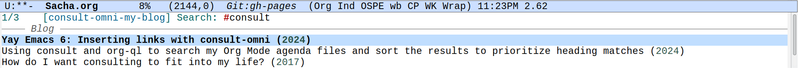

Then I can add it as one of the sources used by ~consult-omni~:

#+begin_src emacs-lisp :tangle no :eval no
	(setq consult-omni-multi-sources
				'(consult-omni--source-google
					consult-omni--source-sacha-org-bookmarks
					consult-omni--source-blog))
#+end_src

Here's what it looks like when I call ~consult-omni~ to search my bookmarks, blog posts, and Google results at the same time.

#+CAPTION: Screenshot of a consult-omni search with multiple sources
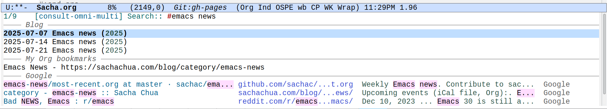

Then I can press ~RET~ to open the blog post in my browser or ~C-. i l~ to [[dotemacs:consult-omni][insert the link using Embark]] (~sacha-consult-omni-embark-insert-link~).

Related:
- [[dotemacs:completion-consult-consult-omni-bookmarks][consult-omni--source-sacha-org-bookmarks]]
- [[dotemacs:completing-blog-posts][Completing blog posts]] (Org link type with completion)
- [[https://sachachua.com/blog/2025/07/finding-unlinked-text/#completion-consult-consult-omni-using-web-searches-and-bookmarks-to-quickly-link-placeholders-in-org-mode][Using web searches and bookmarks to quickly link placeholders in Org Mode]]

_Next steps:_ I want to find out how to get ~:sort nil~ to be respected so that more recent blog posts are listed first. Also, it might be fun to define a similar source for the sections of my Emacs configuration, like the way I can use my [[dotemacs:links-to-sacha-config][dotemacs: Org Mode link type with completion]].

*** STARTED Searching my blog, notes, and sketches with consult-ripgrep and consult-omni
:PROPERTIES:
:CREATED: [2024-11-05 Tue 09:17]
:Effort:   0:30
:QUANTIFIED: Emacs
:CUSTOM_ID: searching-sacha-blog
:END:
:LOGBOOK:
CLOCK: [2024-11-05 Tue 13:05]--[2024-11-05 Tue 14:07] =>  1:02
CLOCK: [2024-11-05 Tue 09:18]--[2024-11-05 Tue 11:02] =>  1:44
:END:


#+begin_src emacs-lisp :tangle lisp/sacha-navigate.el
;;;###autoload
  (defun sacha-search-notes ()
          (interactive)
          (consult-ripgrep '("~/sync/orgzly" "~/sync/static-blog/blog" "~/sync/sketches" "~/sync/topics")))
;;;###autoload
  (defun sacha-search-public-notes ()
          (interactive)
          (consult-ripgrep '("~/sync/static-blog/blog" "~/sync/sketches" "~/sync/topics")))
#+end_src

#+begin_src emacs-lisp :lexical t :tangle lisp/sacha-consult.el
;;;###autoload
  (cl-defun sacha-consult-omni--google-blog-fetch-results (input &rest args &key callback &allow-other-keys)
    "Fetches search results for INPUT from “Google Custom Search” service.
  Narrows to `sacha-blog-base-url'.

  Refer to URL `https://programmablesearchengine.google.com/about/' and
  URL `https://developers.google.com/custom-search/' for more info."
    (pcase-let* ((`(,query . ,opts)
                  (consult-omni--split-command input (seq-difference args (list :callback callback))))
                 (opts (car-safe opts))
                 (count (plist-get opts :count))
                 (page (plist-get opts :page))
                 (filter (plist-get opts :filter))
                 (count (or (and count (integerp (read count)) (string-to-number count))
                            consult-omni-default-count))
                 (page (or (and page (integerp (read page)) (string-to-number page))
                           consult-omni-default-page))
                 (filter (or (and (integerp filter) filter)
                             (and filter (string-to-number (format "%s" filter)))
                             1))
                 (filter (if (member filter '(0 1)) filter 1))
                 (count (min count 10))
                 (page (+ (* page count) 1))
                 (page (min page (- 100 count)))
                 (params `(("q" . ,(format "site:%s+%s"
                                           (url-encode-url sacha-blog-base-url)
                                           (replace-regexp-in-string " " "+" query)))
                           ("key" . ,(consult-omni-expand-variable-function consult-omni-google-customsearch-key))
                           ("cx" . ,(consult-omni-expand-variable-function consult-omni-google-customsearch-cx))
                           ("gl" . "en")
                           ("filter" . ,(format "%s" filter))
                           ("num" . ,(format "%s" count))
                           ("start" . ,(format "%s" page))))
                 (headers '(("Accept" . "application/json")
                            ("Accept-Encoding" . "gzip")
                            ("User-Agent" . "consult-omni (gzip)"))))
      (consult-omni--fetch-url
       consult-omni-google-customsearch-api-url consult-omni-http-retrieve-backend
       :encoding 'utf-8
       :params params
       :headers headers
       :parser #'consult-omni--json-parse-buffer
       :callback
       (lambda (attrs)
         (let* ((raw-results (gethash "items" attrs))
                (annotated-results
                 (mapcar (lambda (item)
                           (let*
                               ((source "Google")
                                (url (format "%s" (gethash "link" item)))
                                (title (format "%s" (gethash "title" item)))
                                (snippet (string-trim (format "%s" (gethash "snippet" item))))
                                (search-url (consult-omni--make-url-string consult-omni-google-search-url params '("key" "cx" "gl")))
                                (decorated (funcall consult-omni-default-format-candidate :source source :query query :url url :search-url search-url :title title :snippet snippet)))
                             (propertize decorated
                                         :source source
                                         :title title
                                         :url url
                                         :search-url search-url
                                         :query query
                                         :snippet snippet)))
                         raw-results)))
           (when (and annotated-results (functionp callback))
             (funcall callback annotated-results))
           annotated-results)))))

  (use-package consult-omni
          :load-path "~/vendor/consult-omni"
          :after (consult embark)
          :config
    (consult-omni-define-source
     "Google my blog"
     :narrow-char ?b
     :type 'dynamic
     :require-match nil
     :face 'consult-omni-engine-title-face
     :request #'sacha-consult-omni--google-blog-fetch-results
     :on-new (apply-partially #'consult-omni-external-search-with-engine "Google")
     :preview-key consult-omni-preview-key
     :search-hist 'consult-omni--search-history
     :select-hist 'consult-omni--selection-history
     :enabled (lambda () (bound-and-true-p consult-omni-google-customsearch-key))
     :group #'consult-omni--group-function
     :sort t
     :interactive consult-omni-intereactive-commands-type
     :annotate nil))
#+end_src

To get more results, I can add parameters like ~-- --count 10~ and ~--page 2~. I wonder if there's an easier keyboard shortcut for paginating through results...

Let's try these shortcuts...

#+begin_src emacs-lisp :results silent
  (keymap-global-set "M-g b" #'sacha-search-public-notes)
  (keymap-global-set "M-g N" #'sacha-search-notes)
  (keymap-global-set "M-g B" #'consult-omni-google-sacha-blog)
#+end_src

** Marginalia
:PROPERTIES:
:CUSTOM_ID: marginalia
:END:
[[https://www.reddit.com/r/emacs/comments/196pvtx/comment/khxa8ip/?share_id=-4IBSwNFQR_-Gd744ZcrH&utm_content=2&utm_medium=android_app&utm_name=androidcss&utm_source=share&utm_term=2][Marginalia - add function name for aliases]]

#+begin_src emacs-lisp :tangle lisp/sacha-complete.el
(eval-when-compile (require 'marginalia))
;;;###autoload
(defun sacha-marginalia-annotate-variable (cand)
  "Annotate variable CAND with its documentation string.
Omit values when streaming."
  (when-let* ((sym (intern-soft cand)))
    (marginalia--fields
     ((marginalia--symbol-class sym) :face 'marginalia-type)
     ((or (documentation-property sym 'variable-documentation)
          (marginalia--definition-prefix sym))
      :truncate 1.0 :face 'marginalia-documentation))))
#+end_src
#+begin_src emacs-lisp
(use-package marginalia
  :vc (:url "https://github.com/minad/marginalia")
  :init
  (marginalia-mode)
  :bind (:map minibuffer-local-completion-map
              ("M-m" . marginalia-cycle))
  :config
  (add-to-list 'marginalia-prompt-categories '("sketch" . sketch))
  (add-to-list 'marginalia-censor-variables "-api-key")
  (add-to-list 'marginalia-censor-variables "-private")
  (cl-pushnew #'marginalia-annotate-symbol-with-alias
              (alist-get 'command marginalia-annotators))
  (cl-pushnew #'marginalia-annotate-symbol-with-alias
              (alist-get 'function marginalia-annotators))
  (cl-pushnew #'marginalia-annotate-symbol-with-alias
              (alist-get 'symbol marginalia-annotators)))
#+end_src

#+begin_src emacs-lisp :tangle lisp/sacha-complete.el
;;;###autoload
  (defun marginalia-annotate-alias (cand)
    "Annotate CAND with the function it aliases."
    (when-let ((sym (intern-soft cand))
               (alias (car (last (function-alias-p sym))))
               (name (and (symbolp alias) (symbol-name alias))))
      (format " (%s)" name)))

;;;###autoload
  (defun marginalia-annotate-symbol-with-alias (cand)
    "Annotate symbol CAND with its documentation string.
      Similar to `marginalia-annotate-symbol'."
    (when-let (sym (intern-soft cand))
      (concat
       (marginalia-annotate-binding cand)
       (marginalia--fields
        ((marginalia-annotate-alias cand) :face 'marginalia-function)
        ((marginalia--symbol-class sym) :face 'marginalia-type)
        ((cond
          ((fboundp sym) (marginalia--function-doc sym))
          ((facep sym) (documentation-property sym 'face-documentation))
          (t (documentation-property sym 'variable-documentation)))
         :truncate 1.0 :face 'marginalia-documentation)))))
#+end_src
*** Marginalia and annotating journal entries
:PROPERTIES:
:CUSTOM_ID: marginalia-and-annotating-journal-entries
:END:

The following code annotates journal entries with their categories.

#+begin_src emacs-lisp :tangle lisp/sacha-complete.el
;;;###autoload
  (defun sacha-marginalia-annotate-journal (cand)
    (when-let ((o (cdr (assoc cand sacha-journal-search-cache))))
      (marginalia--fields
       ((plist-get o :Category)
        :face 'marginalia-documentation
        :truncate 13))))

  (use-package marginalia
    :config
    (add-to-list 'marginalia-annotators '(journal sacha-marginalia-annotate-journal builtin none)))
#+end_src

** Cargo-culted stuff
:PROPERTIES:
:CUSTOM_ID: cargo-culted-stuff
:END:

#+begin_src emacs-lisp :tangle lisp/sacha-misc.el
;;;###autoload
  (defun sacha-store-action-key+cmd (cmd)
    (setq keycast--this-command-keys (this-single-command-keys) keycast--this-command cmd))
;;;###autoload
  (defun sacha-force-keycast-update (&rest _)
    (force-mode-line-update t))
#+end_src

#+begin_src emacs-lisp
  (use-package keycast
    :if sacha-laptop-p
    :after embark
          :defer t
    :config (dolist (cmd '(embark-act embark-act-noexit embark-become))
              (advice-add cmd
                          :before #'sacha-force-keycast-update)))

  (use-package
    embark
    :config
                                          ;(setq embark-prompter 'embark-completing-read-prompter)
    (advice-add 'embark-keymap-prompter :filter-return #'sacha-store-action-key+cmd)
    (add-to-list 'embark-target-injection-hooks '(sacha-stream-message embark--allow-edit)))
    #+end_src
* Appearance
:PROPERTIES:
:CUSTOM_ID: appearance
:END:
** color-theme sometimes comes across lists. Odd!
:PROPERTIES:
:CUSTOM_ID: color-theme-sometimes-comes-across-lists-odd
:END:

#+begin_src emacs-lisp
  (defadvice face-attribute (around sacha activate)
    (if (symbolp (ad-get-arg 0))
        ad-do-it))
#+end_src

** Display
:PROPERTIES:
:CUSTOM_ID: display
:END:

#+begin_src emacs-lisp :tangle lisp/sacha-appearance.el
;;;###autoload
  (defun sanityinc/adjust-opacity (frame incr)
    (let* ((oldalpha (or (frame-parameter frame 'alpha) 100))
           (newalpha (+ incr oldalpha)))
      (when (and (<= frame-alpha-lower-limit newalpha) (>= 100 newalpha))
        (modify-frame-parameters frame (list (cons 'alpha newalpha))))))
#+end_src

#+begin_src emacs-lisp
  (keymap-global-set "C-M-8" (lambda () (interactive) (sanityinc/adjust-opacity nil -2)))
  (keymap-global-set "C-M-9" (lambda () (interactive) (sanityinc/adjust-opacity nil 2)))
  (keymap-global-set "C-M-0" (lambda () (interactive) (modify-frame-parameters nil `((alpha . 100)))))
#+end_src

From https://protesilaos.com/codelog/2024-11-28-basic-emacs-configuration/:

#+begin_src emacs-lisp
  (add-to-list 'display-buffer-alist
               '("\\`\\*\\(Warnings\\|Compile-Log\\)\\*\\'"
                 (display-buffer-no-window)
                 (allow-no-window . t)))
#+end_src
** Color theme
:PROPERTIES:
:CUSTOM_ID: color-theme
:END:
*** Set up a color scheme
:PROPERTIES:
:CUSTOM_ID: set-up-a-light-on-dark-color-scheme
:END:

#+BEGIN_SRC emacs-lisp :tangle lisp/sacha-appearance.el
;;;###autoload
  (defun sacha-setup-color-theme ()
    (interactive)
    (when (display-graphic-p)
      (load-theme (car modus-themes-to-toggle) t)))
#+END_SRC

#+BEGIN_SRC emacs-lisp
  (use-package modus-themes
          :vc (:url "https://github.com/protesilaos/modus-themes")
          :init (setq modus-themes-to-toggle '(modus-operandi-tinted modus-vivendi-tinted))
          :config (sacha-setup-color-theme))
#+END_SRC

I sometimes need to switch to a lighter background for screenshots.
For that, I use =modus-operandi-tinted=.
*** Making highlight-sexp follow modus-themes-toggle           :elisp:emacs:
:PROPERTIES:
:EXPORT_DATE: 2023-01-26T10:25:38-0500
:EXPORT_ELEVENTY_PERMALINK: /blog/2023/01/making-highlight-sexp-follow-modus-themes-toggle/
:EXPORT_ELEVENTY_FILE_NAME: blog/2023/01/making-highlight-sexp-follow-modus-themes-toggle/
:CUSTOM_ID: making-highlight-sexp-follow-modus-themes-toggle
:END:

#+begin_update
[2023-01-27 Fri] Prot just added a [[https://github.com/protesilaos/modus-themes/commit/0ca79257ef941ff5f9ec34f5d76eed2ff35d7752][modus-themes-get-color-value]]
function. Yay! Also, it turns out that I need to update the overlay in
all the buffers.
#+end_update

I'm experimenting with using the ~highlight-sexp~ minor mode to
highlight my current s-expression, since I sometimes get confused
about what I'm modifying with smartparens. The highlight-sexp
background colour is hardcoded in the variable
~hl-sexp-background-color~, and will probably look terrible if you use
a light background. I wanted it to adapt when I use
~modus-themes-toggle~. Here's how that works:

#+begin_src emacs-lisp :tangle lisp/sacha-appearance.el
(defun sacha-hl-sexp-update-overlay ()
  (when (overlayp hl-sexp-overlay)
    (overlay-put
     hl-sexp-overlay
     'face
     `(:background
       ,(modus-themes-get-color-value 'bg-inactive)))))
(defun sacha-hl-sexp-update-all-overlays (&rest args)
  (dolist (buf (buffer-list))
    (with-current-buffer buf
      (when highlight-sexp-mode
        (sacha-hl-sexp-update-overlay)))))
#+end_src

#+begin_src emacs-lisp
  (use-package highlight-sexp
    :vc (:url "https://github.com/daimrod/highlight-sexp")
    :after modus-themes
    :hook
    ((emacs-lisp-mode . highlight-sexp-mode)
           (modus-themes-after-load-theme . sacha-hl-sexp-update-all-overlays))
          :config
          (advice-add 'hl-sexp-create-overlay :after 'sacha-hl-sexp-update-overlay))
#+end_src

This is what it looks like:

#+CAPTION: Animation of highlight-sexp toggling along with modus-themes-toggle
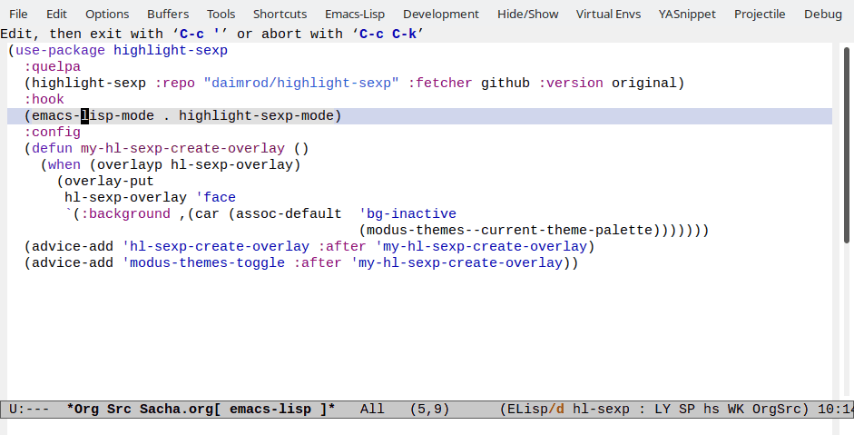

** Modeline
:PROPERTIES:
:CUSTOM_ID: modeline
:END:
*** Time in the modeline
:PROPERTIES:
:CUSTOM_ID: time-in-the-modeline
:END:

I like having the clock.

#+begin_src emacs-lisp
  (display-time-mode 1)
#+end_src

*** Diminish mode names in modeline
:PROPERTIES:
:CUSTOM_ID: diminish
:END:
#+begin_src emacs-lisp
  (use-package diminish :ensure t)
#+end_src

*** Highlight the active modeline using colours from modus-themes    :emacs:
:PROPERTIES:
:EXPORT_DATE: 2024-01-01T08:15:01-0500
:EXPORT_ELEVENTY_PERMALINK: /blog/2024/01/highlight-the-active-modeline-using-colours-from-modus-themes/
:EXPORT_ELEVENTY_FILE_NAME: blog/2024/01/highlight-the-active-modeline-using-colours-from-modus-themes/
:CUSTOM_ID: highlight-the-active-modeline-using-colours-from-modus-themes
:END:

I wanted to experiment with [[https://irreal.org/blog/?p=11867#comment-6354017310][Ignacio Paz Posse's snippet]] for colouring the mode line of the active window ever so slightly different to make it easier to see where the active window is. I usually have ~global-hl-line-mode~ turned on, so that highlight is another indicator, but let's see how this tweak feels. I modified the code so that it uses the theme colours from the currently-selected Modus themes, since I trust Prot's colour choices more than I trust mine. Thanks to Irreal for sharing Ignacio's comment!

#+begin_src emacs-lisp :tangle lisp/sacha-appearance.el
;;;###autoload
  (defun sacha-update-active-mode-line-colors ()
          (set-face-attribute
           'mode-line nil
           :foreground (modus-themes-get-color-value 'fg-mode-line-active)
           :background (modus-themes-get-color-value 'bg-blue-subtle)))
#+end_src

#+begin_src emacs-lisp
  (use-package modus-themes
          :hook
          (modus-themes-after-load-theme . sacha-update-active-mode-line-colors))
#+end_src

#+begin_columns
#+begin_column50
#+CAPTION: with dark mode
#+ATTR_HTML: :data-link t
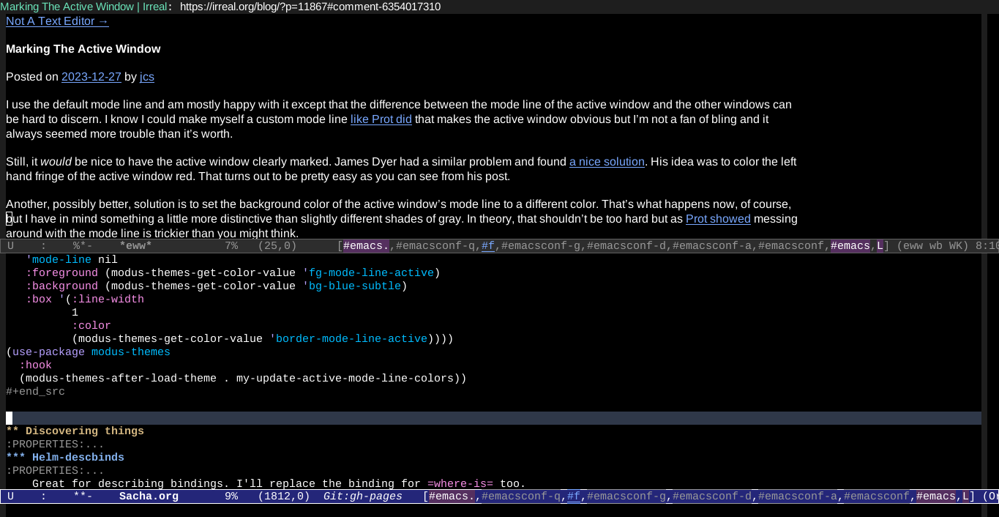
#+end_column50
#+begin_column50
#+CAPTION: with light mode
#+ATTR_HTML: :data-link t
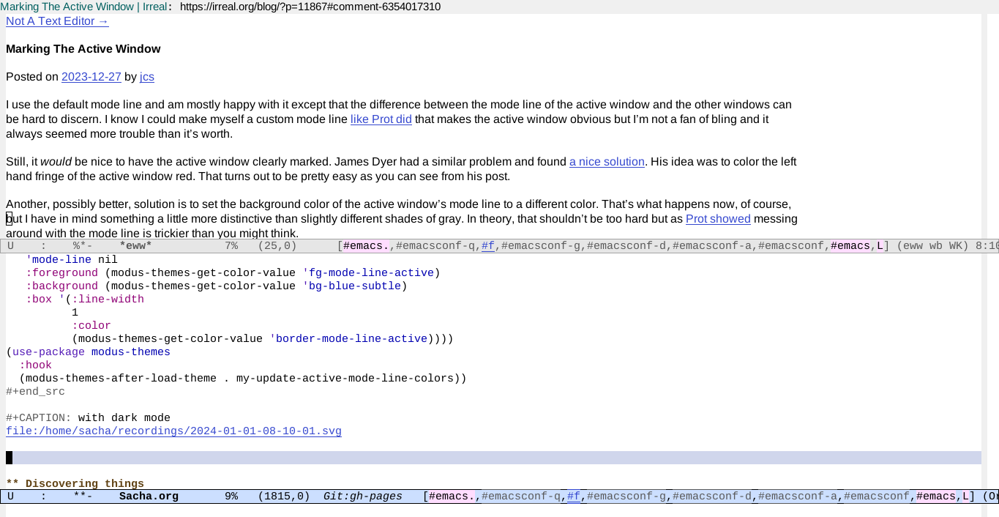
#+end_column50
#+end_columns

** Quickly adding face properties to regions                         :emacs:
:PROPERTIES:
:CUSTOM_ID: face-text
:EXPORT_DATE: 2024-09-19T20:25:35-0400
:EXPORT_ELEVENTY_PERMALINK: /blog/2024/09/quickly-adding-face-properties-to-regions/
:EXPORT_ELEVENTY_FILE_NAME: blog/2024/09/quickly-adding-face-properties-to-regions/
:EXPORT_MODIFIED: 2024-09-20T07:38:17-0400
:END:

#+begin_update
- [2024-09-20 Fri]: Set the first frame of the animated GIF to a reasonable backup image.
- [2024-09-20]: Add ~:init-value nil~ to the mode.
#+end_update

#+CAPTION: Screencast of modifying face properties
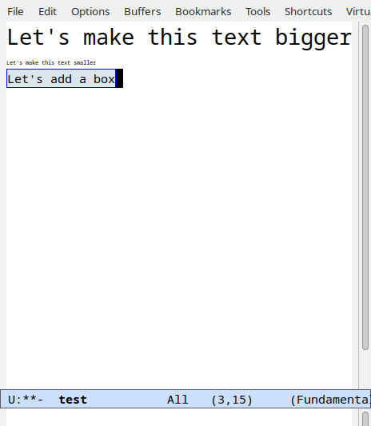

Sometimes I just want to make some text look a
little fancier in the buffer so that I can make a
thumbnail or display a message. This
~sacha-add-face-text-property~ function lets me
select a region and temporarily change its height,
make it bold, or do other things. It will work in
~text-mode~ or ~enriched-mode~ buffers (not Org
Mode or programming buffers like ~*scratch*~, as
those do a lot of font-locking).

#+begin_src emacs-lisp :tangle lisp/sacha-appearance.el
;;;###autoload
  (defun sacha-add-face-text-property (start end attribute value)
          (interactive
           (let ((attribute (intern
                                                                                   (completing-read
                                                                                          "Attribute: "
                                                                                          (mapcar (lambda (o) (symbol-name (car o)))
                                                                                                                          face-attribute-name-alist)))))
                   (list (point)
                                           (mark)
                                           attribute
                                           (read-face-attribute '(()) attribute))))
          (add-face-text-property start end (list attribute value)))
#+end_src

~enriched-mode~ has some keyboard shortcuts for
face attributes (~M-o b~ for bold, ~M-o i~ for
italic). I can add some keyboard shortcuts for
other properties even if they can't be saved in
~text/enriched~ format.

#+begin_src emacs-lisp :results silent :tangle lisp/sacha-appearance.el
;;;###autoload
  (defun sacha-face-text-larger (start end)
          (interactive "r")
          (add-face-text-property
           start end
           (list :height (floor (+ 50 (car (alist-get :height (get-text-property start 'face) '(100))))))))
;;;###autoload
  (defun sacha-face-text-smaller (start end)
          (interactive "r")
          (add-face-text-property
           start end
           (list :height (floor (- (car (alist-get :height (get-text-property start 'face) '(100))) 50)))))
#+end_src

What's an easy way to make this keyboard shortcut
available during the rare times I want it? I know,
maybe I'll make a quick minor mode so I don't
have to dedicate those keyboard shortcuts all the
time. ~repeat-mode~ lets me change the size by
repeating just the last keystroke.

#+begin_src emacs-lisp :results silent
  (defvar-keymap sacha-face-text-property-mode-map
          "M-o p" #'sacha-add-face-text-property
    "M-o +" #'sacha-face-text-larger
          "M-o -" #'sacha-face-text-smaller)
  (define-minor-mode sacha-face-text-property-mode
    "Make it easy to modify face properties."
    :init-value nil
    (repeat-mode 1))
  (defvar-keymap sacha-face-text-property-mode-repeat-map
          :repeat t
          "+" #'sacha-face-text-larger
          "-" #'sacha-face-text-smaller)
  (dolist (cmd '(sacha-face-text-larger sacha-face-text-smaller))
    (put cmd 'repeat-map 'sacha-face-text-property-mode-repeat-map))
#+end_src
* Navigation
:PROPERTIES:
:CUSTOM_ID: navigation
:END:

#+begin_src emacs-lisp
(transient-mark-mode 1)
(minibuffer-regexp-mode 1)
(keymap-global-set "C-x !" #'delete-other-windows-vertically)
#+end_src

#+begin_src emacs-lisp :tangle lisp/sacha-navigate.el
(defun sacha-close-other-buffers ()
  (interactive)
  (mapc (lambda (buf)
          (unless (buffer-modified-p buf)
            (kill-buffer buf)))
        (delete (current-buffer)
                (buffer-list))))
#+end_src
** Going to the last change
:PROPERTIES:
:CUSTOM_ID: navigation-going-to-the-last-change
:END:

#+begin_src emacs-lisp
(use-package goto-chg
	:bind
	(("C-(" . goto-last-change)
	 ("C-)" . goto-last-change-reverse)))
#+end_src

** Substitution
:PROPERTIES:
:CUSTOM_ID: navigation-substitution
:END:

#+begin_src emacs-lisp
(use-package substitute
  :bind ("C-;" . substitute-target-in-buffer)
	:hook
	(substitute-post-replace . #'substitute-report-operation)
	)
#+end_src
** Expand region
:PROPERTIES:
:CUSTOM_ID: navigation-expand-region
:END:
#+begin_src emacs-lisp
  (use-package expand-region
    :bind ("C-=" . er/expand-region)
          )
#+end_src
** selected.el: Special keymap when the region is active
:PROPERTIES:
:CUSTOM_ID: navigation-selected
:END:

[2026-03-31 Tue] I removed the binding for "s" from the linked config so that it doesn't interfere with staging partial hunks in Magit.

I like context-sensitive keyboard shortcuts, so when I came across [[https://github.com/Kungsgeten/selected.el/issues/11][this selected.el config]] in the process of preparing Emacs News, I wanted to give it a try. It provides a special keymap when the region is active.

#+NAME: selected-config
#+begin_src emacs-lisp
  (use-package ctrlf
    ;:init (ctrlf-mode +1)   ; I'm also getting used to isearch-lazy-count, though.
    )
  (use-package selected
    :init (selected-global-mode 1)
    :bind (:map selected-keymap
                            ("q" . selected-off)
                            ("u" . upcase-dwim)
                            ("d" . downcase-dwim)
                            ("w" . kill-ring-save)
                            ("n" . next-line)
                            ("p" . previous-line)
                            ("f" . forward-char)
                            ("b" . backward-char)
                            ("F" . forward-word)
                            ("B" . backward-word)
                            ("a" . beginning-of-visual-line)
                            ("e" . end-of-visual-line)
                            ("{" . backward-paragraph)
                            ("}" . forward-paragraph)
                            ("(" . backward-sentence)
                            (")" . forward-sentence)
                            ("r" . ctrlf-backward-fuzzy)
                            ("[" . scroll-down-line)
                            ("]" . scroll-up-line)
                            ("M" . rectangle-mark-mode)
                            ("R" . replace-rectangle)
                            ("x" . exchange-point-and-mark)))
#+end_src

** Copy and append string
:PROPERTIES:
:CUSTOM_ID: navigation-copy-and-append-string
:END:

#+begin_src emacs-lisp :tangle lisp/sacha-misc.el
  (defvar sacha-copy-append-string nil "String to append when copying.")
;;;###autoload
  (defun sacha-copy-and-append (beg end append)
          (interactive
           (list
                  (if (region-active-p) (region-beginning) (point-min))
                  (if (region-active-p) (region-end) (point-max))
                  (if current-prefix-arg (read-string "Append: ")
                          sacha-copy-append-string)))
          (when append
                  (setq sacha-copy-append-string append))
          (kill-new (concat (buffer-substring beg end) append)))
#+end_src

** PDF view
:PROPERTIES:
:CUSTOM_ID: pdf
:END:
*** TOBLOG Copy text from current PDFview page in other window
:PROPERTIES:
:Effort:   0:15
:QUANTIFIED: Emacs
:CUSTOM_ID: pdf-copy
:END:
:LOGBOOK:
- State "DONE"       from "STARTED"    [2024-10-23 Wed 08:08]
CLOCK: [2024-10-23 Wed 08:03]--[2024-10-23 Wed 08:08] =>  0:05
:END:

This makes it easier to pick up text from my annotated PDFs.

#+begin_src emacs-lisp :tangle lisp/sacha-misc.el
;;;###autoload
  (defun sacha-pdf-view-insert-current-page-text ()
          (interactive)
          (let (text)
                  (catch 'found
                          (walk-window-tree
                           (lambda (win)
                                   (with-selected-window win
                                           (when (derived-mode-p 'pdf-view-mode)
                                                   (setq text
                                                                           (pdf-info-gettext (pdf-view-current-page)
                                                                                                                                                   (list 0 0 1 1)))
                                                   (throw 'found text))))))
                  (when text (save-excursion (insert text)))))
#+end_src
** Links
:PROPERTIES:
:CUSTOM_ID: navigation-links
:END:

#+begin_src emacs-lisp
  (use-package ace-link)
#+end_src
** Manage windows
:PROPERTIES:
:CUSTOM_ID: navigation-manage-windows
:END:

https://emacsredux.com/blog/2026/04/07/stealing-from-the-best-emacs-configs/
#+begin_src emacs-lisp
(setq window-combination-resize t)
#+end_src
*** Rotate windows
:PROPERTIES:
:CUSTOM_ID: navigation-manage-windows-rotate-windows
:END:

#+begin_src emacs-lisp
(keymap-global-set "M-r" #'window-layout-transpose) ; Emacs 31: override move-to-window-line-top-bottom
(keymap-global-set "M-S-r" #'rotate-windows-back) ; Emacs 31
#+end_src

*** Jump between windows
:PROPERTIES:
:CUSTOM_ID: navigation-jumping-between-windows
:END:

#+begin_src emacs-lisp
  (use-package ace-window
          :config
          (setq aw-keys '(?a ?o ?e ?u ?h ?t ?n ?s))
          :bind
          ("M-o" . 'ace-window)
          ("C-x o" . 'ace-window)
          )
#+end_src
*** Focus on the current window
:PROPERTIES:
:CUSTOM_ID: navigation-focus-on-the-current-window
:END:

From https://emacsredux.com/blog/2026/04/07/stealing-from-the-best-emacs-configs/

#+begin_src emacs-lisp :tangle lisp/sacha-navigate.el
;;;###autoload
(defun sacha-toggle-delete-other-windows ()
  "Delete other windows in frame if any, or restore previous window config.

From https://emacsredux.com/blog/2026/04/07/stealing-from-the-best-emacs-configs/
and Steve Purcell's configuration."
  (interactive)
  (if (and winner-mode
           (equal (selected-window) (next-window)))
      (winner-undo)
    (delete-other-windows)))
#+end_src

#+begin_src emacs-lisp
(keymap-global-set "C-x 1" #'sacha-toggle-delete-other-windows)
#+end_src


*** Winner mode - undo and redo window configuration
:PROPERTIES:
:CUSTOM_ID: winner-mode-undo-and-redo-window-configuration
:END:

=winner-mode= lets you use =C-c <left>= and =C-c <right>= to switch between window configurations. This is handy when something has popped up a buffer that you want to look at briefly before returning to whatever you were working on. When you're done, press =C-c <left>=.

#+BEGIN_SRC emacs-lisp
(use-package winner
  :init
  (winner-mode 1))
#+END_SRC

** TODO Get the hang of using vundo
    :PROPERTIES:
    :CREATED:  [2024-10-14 Mon 10:40]
    :CUSTOM_ID: navigation-get-the-hang-of-using-vundo
    :END:

#+begin_src emacs-lisp
  (use-package vundo)
#+end_src
[[https://mastodon.online/@arialdo/113282285763018537]]
** Get scroll-other-window to work with PDFs
:PROPERTIES:
:CUSTOM_ID: navigation-get-scroll-other-window-to-work-with-pdfs
:END:

Thanks to [[https://www.reddit.com/r/emacs/comments/10pkhko/how_to_navigate_to_previousnext_pdf_page_in/][Reddit: How to navigate to previous/next PDF page in DocView from another window split without moving into it?]]

#+begin_src emacs-lisp
  (use-package scroll-other-window
          :vc (:url "https://gist.github.com/politza/3f46785742e6e12ba0d1a849f853d0b9")
          :commands sow-mode
          :init (sow-mode 1))
#+end_src
** Manage positions
:PROPERTIES:
:CUSTOM_ID: navigation-manage-positions
:END:
*** Save place between sessions
:PROPERTIES:
:CUSTOM_ID: navigation-manage-positions-save-place-between-sessions
:END:

Based on [[https://emacsredux.com/blog/2026/04/07/stealing-from-the-best-emacs-configs/][Stealing from the Best Emacs Configs | Emacs Redux]]

#+begin_src emacs-lisp
(save-place-mode 1)
(advice-add 'save-place-find-file-hook
            :after (lambda (&rest _) (when buffer-file-name (ignore-errors (recenter)))))
#+end_src

*** Quickly jump to positions                                      :embark:
:PROPERTIES:
:ID:       56f173e7-d2a2-4589-84d7-c6b435c8a5f8
:DRILL_LAST_INTERVAL: 0.0
:DRILL_REPEATS_SINCE_FAIL: 1
:DRILL_TOTAL_REPEATS: 3
:DRILL_FAILURE_COUNT: 2
:DRILL_AVERAGE_QUALITY: 1.667
:DRILL_EASE: 2.36
:DRILL_LAST_QUALITY: 0
:DRILL_LAST_REVIEWED: [2013-03-13 Wed 09:50]
:CUSTOM_ID: quickly-jump-to-positions
:END:

Quickly jump to a position in the current view.

- https://karthinks.com/software/avy-can-do-anything/
- https://www.reddit.com/r/emacs/comments/r6px3r/avy_can_do_anything_youre_using_avy_wrong/

#+begin_src emacs-lisp :tangle lisp/sacha-embark.el
;;;###autoload
    (defun avy-action-exchange (pt)
      "Exchange sexp at PT with the one at point."
      (set-mark pt)
      (transpose-sexps 0))
;;;###autoload
    (defun avy-action-embark (pt)
      (save-excursion
        (goto-char pt)
        (embark-act))
      (select-window
       (cdr (ring-ref avy-ring 0)))
      t)
#+end_src

#+begin_src emacs-lisp :tangle lisp/sacha-avy.el
;;;###autoload
(defun sacha-avy-action-copy-whole-line (pt)
	"From https://karthinks.com/software/avy-can-do-anything/"
  (save-excursion
    (goto-char pt)
    (cl-destructuring-bind (start . end)
        (bounds-of-thing-at-point 'line)
      (copy-region-as-kill start end)))
  (select-window
   (cdr
    (ring-ref avy-ring 0)))
  t)

;;;###autoload
(defun sacha-avy-action-yank-whole-line (pt)
	"From https://karthinks.com/software/avy-can-do-anything/"
  (sacha-avy-action-copy-whole-line pt)
  (save-excursion (yank))
  t)
#+end_src

#+begin_src emacs-lisp
(use-package avy
  :if sacha-laptop-p
  :config
  (add-to-list 'avy-dispatch-alist '(?e . avy-action-exchange))
  (setf (alist-get ?. avy-dispatch-alist) 'avy-action-embark)
  (setf (alist-get ?W avy-dispatch-alist) 'sacha-avy-action-copy-whole-line)
  (setf (alist-get ?Y avy-dispatch-alist) 'sacha-avy-action-yank-whole-line)
	(setf (alist-get ?w avy-dispatch-alist) 'avy-action-copy)
	(with-eval-after-load 'lispy
		(keymap-set lispy-mode-map
								"M-j" #'avy-goto-char-timer))
  :bind
  ("M-j" . avy-goto-char-timer)
	)

(use-package avy-zap
  :if sacha-laptop-p
  :config
  (setq avy-zap-forward-only t)
  (setq avy-keys '(?a ?o ?e ?u ?i ?d ?h ?t ?n ?s))
  :bind
  (("M-z" . avy-zap-up-to-char-dwim)
   ("M-Z" . avy-zap-to-char-dwim)))
#+end_src

** TODO Sort files in read-file-name
:PROPERTIES:
:CUSTOM_ID: sort-read-file-name
:END:

Updated version of
https://emacs.stackexchange.com/questions/55502/list-files-in-directory-in-reverse-order-of-date - added cycle-sort-function and sorting by modification date.

#+begin_src emacs-lisp :tangle lisp/sacha-navigate.el
  (defcustom file-name-completions-sort-function #'files-sort-modification-time
    "Function for sorting the completion list of file names.
  The function takes the list of file names as argument
  and returns the sorted list."
    :type '(choice (function :tag "Sort Function") (const :tag "Natural Order" nil))
    :group 'files)

;;;###autoload
  (defun files-sort-access-time (files)
    "Sort FILES list with respect to access time."
    (sort
     files
     (lambda (fn1 fn2)
       (time-less-p
        (file-attribute-access-time (file-attributes fn2))
        (file-attribute-access-time (file-attributes fn1))))))

;;;###autoload
  (defun files-sort-modification-time (files)
    "Sort FILES list with respect to modification time."
    (sort
     files
           :key (lambda (f) (file-attribute-modification-time (file-attributes f)))
           :lessp #'time-less-p
           :reverse t))

;;;###autoload
  (defun ad-completion-file-name-table (fun string pred action)
    "Add 'display-sort-function' to metadata.
  If the completion action is metadata, add
  `file-name-completions-sort-function' as display-sort-function.
  Otherwise call FUN with STRING, PRED and ACTION as arguments."
    (if (and (functionp file-name-completions-sort-function)
                                           (eq action 'metadata))
        `(metadata
                                  (category . file)
                                  (cycle-sort-function . identity)
                                  (display-sort-function . ,file-name-completions-sort-function))
      (funcall fun string pred action)))
#+end_src

#+begin_src emacs-lisp
  (advice-add 'completion-file-name-table :around #'ad-completion-file-name-table)
#+end_src

#+RESULTS:
:results:
nil
:end:
** Downloaded files
:PROPERTIES:
:CUSTOM_ID: navigation-downloaded-files
:END:

#+begin_src emacs-lisp :tangle lisp/sacha-org.el
  (defvar sacha-download-dir "~/Downloads")
;;;###autoload
  (defun sacha-open-latest-download ()
    (interactive)
    (find-file (sacha-latest-file sacha-download-dir)))

;;;###autoload
  (defun sacha-attach-and-link-latest-download ()
    (interactive)
    (org-attach-attach (sacha-latest-file sacha-download-dir) nil 'cp)
    (org-insert-link nil (caar org-stored-links)))

;;;###autoload
  (defun sacha-link-latest-download ()
    (interactive)
    (org-insert-link nil (concat "file:" (sacha-latest-file sacha-download-dir))
                                                                           (file-name-nondirectory (sacha-latest-file sacha-download-dir))))

;;;###autoload
  (defun sacha-include-latest-download ()
          (interactive)
          (sacha-insert-file-as-org-include (sacha-latest-file sacha-download-dir)))

;;;###autoload
  (defun sacha-copy-latest-download (dest &optional force)
    (interactive "FDestination: ")
    (copy-file (sacha-latest-file sacha-download-dir) dest force))
;;;###autoload
  (defun sacha-download-dired ()
          (interactive)
          (dired sacha-download-dir "-lt"))
#+end_src
*** Replace with latest download
:PROPERTIES:
:CUSTOM_ID: navigation-downloaded-files-replace-with-latest-download
:END:

#+begin_src emacs-lisp :tangle lisp/sacha-misc.el
;;;###autoload
  (defun sacha-replace-with-latest-download ()
    "Replace file contents with latest download."
    (interactive)
    (widen)
    (erase-buffer)
    (insert-file-contents (sacha-latest-file sacha-download-dir)))
#+end_src
** Searching
:PROPERTIES:
:CUSTOM_ID: searching
:END:

https://emacsredux.com/blog/2026/03/15/isearch-lazy-count/
#+begin_src emacs-lisp
  (setopt isearch-lazy-count t)
#+end_src

I should get the hang of using =helm-org-rifle= and =ripgrep=.

#+begin_src emacs-lisp :tangle lisp/sacha-org.el
;;;###autoload
  (defun sacha-helm-org-rifle-org-directory ()
    (interactive)
    (helm-org-rifle-directories (list org-directory) t))
;;;###autoload
  (defun sacha-consult-recoll-without-emacs-news ()
    (interactive)
    (consult-recoll--open (consult-recoll--search "-\"Emacs News\" ")))
#+end_src

#+begin_src emacs-lisp
  (use-package helm-org-rifle
    :bind
    ("M-g r r" . helm-org-rifle)
    ("M-g r a" . helm-org-rifle-org-agenda-files)
    ("M-g r o" . helm-org-rifle-org-directory)
    )

  (use-package consult-recoll
    :config
    (setq consult-recoll-search-flags nil)
    :bind
    ("M-s S" . consult-recoll))
#+end_src
*** Deleting things
:PROPERTIES:
:CUSTOM_ID: deleting-things
:END:

From Steve Purcell, who linked to http://www.emacswiki.org/emacs/ZapToISearch
#+begin_src emacs-lisp :tangle lisp/sacha-navigate.el
;;;###autoload
  (defun zap-to-isearch (rbeg rend)
    "Kill the region between the mark and the closest portion of
        the isearch match string. The behaviour is meant to be analogous
        to zap-to-char; let's call it zap-to-isearch. The deleted region
        does not include the isearch word. This is meant to be bound only
        in isearch mode.  The point of this function is that oftentimes
        you want to delete some portion of text, one end of which happens
        to be an active isearch word. The observation to make is that if
        you use isearch a lot to move the cursor around (as you should,
        it is much more efficient than using the arrows), it happens a
        lot that you could just delete the active region between the mark
        and the point, not include the isearch word."
    (interactive "r")
    (when (not mark-active)
      (error "Mark is not active"))
    (let* ((isearch-bounds (list isearch-other-end (point)))
           (ismin (apply 'min isearch-bounds))
           (ismax (apply 'max isearch-bounds))
           )
      (if (< (mark) ismin)
          (kill-region (mark) ismin)
        (if (> (mark) ismax)
            (kill-region ismax (mark))
          (error "Internal error in isearch kill function.")))
      (isearch-exit)
      ))

  (define-key isearch-mode-map [(meta z)] 'zap-to-isearch)
#+end_src
*** Transient for isearch
:PROPERTIES:
:CUSTOM_ID: navigation-searching-transient-for-isearch
:END:

From https://github.com/kickingvegas/cclisp/blob/fae13b5adb6cb667af23070d000f9bd91b6ba3d8/cc-isearch-menu.el#L96

#+begin_src emacs-lisp
  (require 'transient)
  (transient-define-prefix cc/isearch-menu ()
    "isearch Menu"
    [["Edit Search String"
      ("e"
       "Edit the search string (recursive)"
       isearch-edit-string
       :transient nil)
      ("w"
       "Pull next word or character word from buffer"
       isearch-yank-word-or-char
       :transient nil)
      ("s"
       "Pull next symbol or character from buffer"
       isearch-yank-symbol-or-char
       :transient nil)
      ("l"
       "Pull rest of line from buffer"
       isearch-yank-line
       :transient nil)
      ("y"
       "Pull string from kill ring"
       isearch-yank-kill
       :transient nil)
      ("t"
       "Pull thing from buffer"
       isearch-forward-thing-at-point
       :transient nil)]

     ["Replace"
      ("q"
       "Start ‘query-replace’"
       isearch-query-replace
       :if-nil buffer-read-only
       :transient nil)
      ("x"
       "Start ‘query-replace-regexp’"
       isearch-query-replace-regexp
       :if-nil buffer-read-only
       :transient nil)]]

    [["Toggle"
      ("X"
       "Regexp searching"
       isearch-toggle-regexp
       :transient nil)
      ("S"
       "Symbol searching"
       isearch-toggle-symbol
       :transient nil)
      ("W"
       "Word searching"
       isearch-toggle-word
       :transient nil)
      ("F"
       "Case fold"
       isearch-toggle-case-fold
       :transient nil)
      ("L"
       "Lax whitespace"
       isearch-toggle-lax-whitespace
       :transient nil)]

     ["Misc"
      ("o"
       "occur"
       isearch-occur
       :transient nil)
      ("h"
       "highlight"
       isearch-highlight-regexp
       :transient nil)
      ("H"
       "highlight lines"
       isearch-highlight-lines-matching-regexp
       :transient nil)]])

  (define-key isearch-mode-map (kbd "M-S") 'cc/isearch-menu)
#+end_src
*** Search invisible text
:PROPERTIES:
:CUSTOM_ID: navigation-searching-search-invisible-text
:END:

#+begin_src emacs-lisp
  (setq isearch-invisible t
                          search-invisible t)
#+end_src
*** Occur
:PROPERTIES:
:CUSTOM_ID: navigation-searching-occur
:END:

From https://emacs.ch/@bram85/111724372485640053:
#+begin_src emacs-lisp
  (with-eval-after-load 'occur
          (keymap-set occur-mode-map "C-x C-q" #'occur-edit-mode))
#+end_src
** Ediff
:PROPERTIES:
:CUSTOM_ID: ediff
:END:

http://yummymelon.com/devnull/surprise-and-emacs-defaults.html
#+begin_src emacs-lisp
(setq ediff-split-window-function 'split-window-horizontally)
(setq ediff-window-setup-function 'ediff-setup-windows-plain)
(add-hook 'ediff-before-setup-hook #'sacha-store-pre-ediff-winconfig)
(add-hook 'ediff-quit-hook #'sacha-restore-pre-ediff-winconfig)
#+end_src

#+begin_src emacs-lisp :tangle lisp/sacha-navigate.el
(defvar sacha-ediff-last-windows nil)

;;;###autoload
(defun sacha-store-pre-ediff-winconfig ()
  "Store `current-window-configuration' in variable `sacha-ediff-last-windows'."
  (setq sacha-ediff-last-windows (current-window-configuration)))

;;;###autoload
(defun sacha-restore-pre-ediff-winconfig ()
  "Restore window configuration to stored value in `sacha-ediff-last-windows'."
  (set-window-configuration sacha-ediff-last-windows))
#+end_src
** Hideshow
:PROPERTIES:
:CUSTOM_ID: hideshow
:END:

From https://karthinks.com/software/simple-folding-with-hideshow/ :

#+begin_src emacs-lisp
  (use-package hideshow
    :hook
    (prog-mode . hs-minor-mode)
    :bind
    ("C-<tab>" . hs-cycle)
    ("C-<iso-lefttab>" . hs-global-cycle)
    ("C-S-<tab>" . hs-global-cycle))
#+end_src

#+begin_src emacs-lisp :tangle lisp/sacha-navigate.el
;;;###autoload
  (defun hs-cycle (&optional level)
    (interactive "p")
    (let (message-log-max
          (inhibit-message t))
      (if (= level 1)
          (pcase last-command
            ('hs-cycle
             (hs-hide-level 1)
             (setq this-command 'hs-cycle-children))
            ('hs-cycle-children
             ;; TODO: Fix this case. `hs-show-block' needs to be
             ;; called twice to open all folds of the parent
             ;; block.
             (save-excursion (hs-show-block))
             (hs-show-block)
             (setq this-command 'hs-cycle-subtree))
            ('hs-cycle-subtree
             (hs-hide-block))
            (_
             (if (not (hs-already-hidden-p))
                 (hs-hide-block)
               (hs-hide-level 1)
               (setq this-command 'hs-cycle-children))))
        (hs-hide-level level)
        (setq this-command 'hs-hide-level))))

;;;###autoload
  (defun hs-global-cycle ()
      (interactive)
      (pcase last-command
        ('hs-global-cycle
         (save-excursion (hs-show-all))
         (setq this-command 'hs-global-show))
        (_ (hs-hide-all))))
#+end_src
** Pop to mark
:PROPERTIES:
:CUSTOM_ID: pop-to-mark
:END:

Handy way of getting back to previous places.

#+BEGIN_SRC emacs-lisp
  (keymap-global-set "C-x p" 'pop-to-mark-command)
  (setq set-mark-command-repeat-pop t)
#+END_SRC

** Helm-swoop - quickly finding lines
:PROPERTIES:
:CUSTOM_ID: helm-swoop-quickly-finding-lines
:END:

This promises to be a fast way to find things. Let's bind it to =Ctrl-Shift-S= to see if I can get used to that...

#+BEGIN_SRC emacs-lisp
  (use-package helm-swoop
    :if sacha-laptop-p
    :bind
    (("C-S-s" . helm-swoop)
     ("M-i" . helm-swoop)
     ("M-s M-s" . helm-swoop)
     ("M-I" . helm-swoop-back-to-last-point)
     ("C-c M-i" . helm-multi-swoop)
     ("C-x M-i" . helm-multi-swoop-all)
     )
    :config
    (progn
      (define-key isearch-mode-map (kbd "M-i") 'helm-swoop-from-isearch)
      (define-key helm-swoop-map (kbd "M-i") 'helm-multi-swoop-all-from-helm-swoop))
    )
#+END_SRC

** Highlight the current line while still being able to easily customize/describe underlying faces
:PROPERTIES:
:CUSTOM_ID: highlight-line-mode
:EXPORT_DATE: 2024-09-17T12:14:19-0400
:EXPORT_ELEVENTY_PERMALINK: /blog/2024/09/highlight-the-current-line-while-still-being-able-to-easily-customize-describe-underlying-faces/
:EXPORT_ELEVENTY_FILE_NAME: blog/2024/09/highlight-the-current-line-while-still-being-able-to-easily-customize-describe-underlying-faces/
:END:

I use ~hl-line-mode~ to highlight the current line.

#+begin_src emacs-lisp
  (add-hook 'prog-mode-hook 'hl-line-mode)
  (add-hook 'text-mode-hook 'hl-line-mode)
#+end_src

However, I don't want ~hl-line~ to interfere with the default face suggested by ~customize-face~, which is returned by ~face-at-point~.

#+begin_src emacs-lisp :tangle lisp/sacha-appearance.el
(defun sacha-suggest-other-faces (func &rest args)
  "Disable `hl-line-mode' when choosing a face."
  (if hl-line-mode
      (progn
        (hl-line-mode -1)
        (prog1 (apply func args)
          (hl-line-mode 1)))
    (apply func args)))
#+end_src

#+begin_src emacs-lisp
  (advice-add #'face-at-point :around #'sacha-suggest-other-faces)
#+end_src

Now I can use ~customize-face~ and ~describe-face~ without ~hl-line~ interfering all the time.

** Windmove - switching between windows
:PROPERTIES:
:CUSTOM_ID: windmove-switching-between-windows
:END:

Windmove lets you move between windows with something more natural than cycling through =C-x o= (=other-window=).
Windmove doesn't behave well with Org, so we need to use different keybindings.

#+BEGIN_SRC emacs-lisp
  (use-package windmove
    :bind
    (("<f2> <right>" . windmove-right)
     ("<f2> <left>" . windmove-left)
     ("<f2> <up>" . windmove-up)
     ("<f2> <down>" . windmove-down)
     ))
#+END_SRC

** Frequently-accessed files
:PROPERTIES:
:CUSTOM_ID: frequently-accessed-files
:END:
Registers allow you to jump to a file or other location quickly. To
jump to a register, use =C-x r j= followed by the letter of the
register. Using registers for all these file shortcuts is probably a bit of a waste since I can easily define my own keymap, but since I rarely go beyond register A anyway. Also, I might as well add shortcuts for refiling.

#+BEGIN_SRC emacs-lisp
(setq bookmark-watch-bookmark-file 'silent)
(setq sacha-file-shortcuts
      '(("C" "~/proj/emacs-calendar/README.org" "Emacs calendar")
        ("e" "~/sync/emacs/Sacha.org" "Config")
        ("E" "~/sync/emacs-news/index.org" "Emacs News")
        ("f" "~/sync/orgzly/journal-fr.org" "French journal")
        ("F" "~/sync/orgzly/french.org" "French")
        ("I" "~/sync/orgzly/computer-inbox.org" "Computer inbox")
        ("i" "~/sync/orgzly/Inbox.org" "Phone inbox")
        ("o" "~/sync/orgzly/organizer.org" "Main org file")
        ("s" "~/proj/stream/index.org" "Yay Emacs")
        ("b" "~/sync/orgzly/business.org" "Business")
        ("P" "/ssh:web:/home/sacha/planet/data/feeds.json" "Planet Emacsen")
        ("p" "~/sync/orgzly/posts.org" "Posts")
        ("m" "~/sync/web/beginner-map.org" "Map")
        ("n" "~/sync/topics/now.org" "Now")
        ("N" "/ssh:web|sudo::/etc/nginx/sites-available" "Nginx sites")
        ("w" "~/sync/topics/workflows.org" "Workflows")
        ("W" "~/Dropbox/public/sharing/blog.org" "Blog index")
        ("1" "~/proj/static-blog/" "Static blog")
        ("r" "~/sync/orgzly/reference.org" "Reference")
        ("R" "~/personal/reviews.org" "Reviews")
        ("v" "~/proj/emacstv.github.io/videos.org" "Videos")
        ("g" "~/proj/sachac.github.io/evil-plans/index.org" "Evil plans")))

(sacha-navigate-set-up-file-shortcuts)
#+END_SRC

#+BEGIN_SRC emacs-lisp :tangle lisp/sacha-navigate.el
(require 'bookmark)
(defvar sacha-org-refile-map (make-sparse-keymap))

(defmacro sacha-defshortcut (key file &optional label)
  `(progn
     (set-register ,(string-to-char key) (cons 'file ,file))
     (bookmark-store ,file (list (cons 'filename ,file)
                                 (cons 'position 1)
                                 (cons 'front-context-string "")) nil)
     (define-key sacha-org-refile-map
                 ,key
                 ,(if label
                      `(cons ,label
                             (lambda (prefix)
                               (interactive "p")
                               (let ((org-refile-targets '(((,file) :maxlevel . 6)))
                                     (current-prefix-arg (or current-prefix-arg '(4))))
                                 (call-interactively 'org-refile))))
                    `(lambda (prefix)
                       (interactive "p")
                       (let ((org-refile-targets '(((,file) :maxlevel . 6)))
                             (current-prefix-arg (or current-prefix-arg '(4))))
                         (call-interactively 'org-refile)))))))
(defmacro defshortcuts (name body &optional docstring &rest heads)
  (declare (indent defun) (doc-string 3))
  (cond ((stringp docstring))
        (t
         (setq heads (cons docstring heads))
         (setq docstring "")))
  ;; unwrap
  (when (and (= (length heads) 1) (stringp (car (car (car heads)))))
    (setq heads (car heads)))
  (list
   'progn

   (cons 'progn
         (mapcar (lambda (h) (list 'sacha-defshortcut (string-to-char (elt h 0)) (elt h 1)))
                 heads))))

(defmacro defshortcuts+ (name body &optional docstring &rest heads)
  (declare (indent defun) (doc-string 3))
  (cond ((stringp docstring))
        (t
         (setq heads (cons docstring heads))
         (setq docstring "")))
  (list
   'progn
   (append `(defhydra+ ,name (:exit t))
           (mapcar (lambda (h)
                     (list (elt h 0) (list 'find-file (elt h 1)) (elt h 2)))
                   heads))
   (cons 'progn
         (mapcar (lambda (h) (list 'sacha-defshortcut (string-to-char (elt h 0)) (elt h 1)))
                 heads))))

(defvar sacha-file-shortcuts nil
  "List of ((character filename label) ...).")

;;;###autoload
(defun sacha-navigate-set-up-file-shortcuts ()
  (interactive)
  (mapcar (lambda (o)
            (eval `(sacha-defshortcut ,(elt o 0) ,(elt o 1))))
          sacha-file-shortcuts))
#+end_src

Let's borrow Prot's way of working with registers too.

#+begin_src emacs-lisp
(use-package prot-register
  :load-path "~/vendor/prot-dotfiles/emacs/.emacs.d/prot-lisp"
	:commands (prot-register-add-dwim)
	:bind
	(("C-, a" . prot-register-add-dwim)))
#+end_src

** C-g improvement
:PROPERTIES:
:CUSTOM_ID: navigation-c-g-improvement
:END:

From https://protesilaos.com/codelog/2024-11-28-basic-emacs-configuration/
#+begin_src emacs-lisp :tangle lisp/sacha-misc.el
;;;###autoload
  (defun prot/keyboard-quit-dwim ()
    "Do-What-I-Mean behaviour for a general `keyboard-quit'.

  The generic `keyboard-quit' does not do the expected thing when
  the minibuffer is open.  Whereas we want it to close the
  minibuffer, even without explicitly focusing it.

  The DWIM behaviour of this command is as follows:

  - When the region is active, disable it.
  - When a minibuffer is open, but not focused, close the minibuffer.
  - When the Completions buffer is selected, close it.
  - In every other case use the regular `keyboard-quit'."
    (interactive)
    (cond
     ((region-active-p)
      (keyboard-quit))
     ((derived-mode-p 'completion-list-mode)
      (delete-completion-window))
     ((> (minibuffer-depth) 0)
      (abort-recursive-edit))
     (t
      (keyboard-quit))))

  (define-key global-map (kbd "C-g") #'prot/keyboard-quit-dwim)
#+end_src
** Smartscan
:PROPERTIES:
:CUSTOM_ID: smartscan
:END:

From https://github.com/itsjeyd/emacs-config/blob/emacs24/init.el, this makes =M-n= and =M-p= look for the symbol at point.
#+BEGIN_SRC emacs-lisp
  (use-package smartscan
    :if sacha-laptop-p
    :defer t
    :config (global-smartscan-mode t))
#+END_SRC

** Dired
:PROPERTIES:
:CUSTOM_ID: dired
:END:

#+begin_src emacs-lisp
  (setq dired-listing-switches "-altr")
  (setq dired-dwim-target 'dired-dwim-target-next)
#+end_src

From http://www.masteringemacs.org/articles/2011/03/25/working-multiple-files-dired/

#+BEGIN_SRC emacs-lisp
  (require 'find-dired)
  (setq find-ls-option '("-print0 | xargs -0 ls -ld" . "-ld"))
#+END_SRC

From https://protesilaos.com/codelog/2024-11-28-basic-emacs-configuration/

#+begin_src emacs-lisp
  (use-package dired-subtree
    :ensure t
    :after dired
    :bind
    ( :map dired-mode-map
      ("<tab>" . dired-subtree-toggle)
      ("TAB" . dired-subtree-toggle)
      ("<backtab>" . dired-subtree-remove)
      ("S-TAB" . dired-subtree-remove))
    :config
    (setq dired-subtree-use-backgrounds nil))
#+end_src
*** Using image-dired to browse the latest screenshots from multiple directories  :image:org:link:
:PROPERTIES:
:CUSTOM_ID: image-dired-screenshots
:EXPORT_DATE: 2025-01-02T08:24:06-0500
:EXPORT_ELEVENTY_PERMALINK: /blog/2025/01/using-image-dired-to-browse-the-latest-screenshots-from-multiple-directories/
:EXPORT_ELEVENTY_FILE_NAME: blog/2025/01/using-image-dired-to-browse-the-latest-screenshots-from-multiple-directories/
:EXPORT_MODIFIED: 2025-01-06T10:23:22-0500
:END:

#+begin_update
[2025-01-06]: [[https://lists.gnu.org/archive/html/emacs-devel/2025-01/msg00064.html][Patch in progress]], Stefan Kangas is looking into it.
#+end_update

Since A+ and I play lots of Minecraft together, I
figured it's a good opportunity to slowly get her
into the idea of documenting learning. Besides, I
can always practise it myself. Screenshots are
handy for that. In Minecraft Java, ~F1~ hides the
usual heads-up display, and ~F2~ takes the
screenshot. Usually, when I start taking
screenshots. A+ starts taking screenshots too. I
want to build on her enthusiasm by including her
screenshots in notes. To make it easy to
incorporate her pictures into our notes, I've
shared her [[https://gdlauncher.com/][GDLauncher]] folder and her Videos folder
with my computer using [[https://docs.syncthing.net/][Syncthing]] so that I can
grab any screenshots or videos that she's taken.

In Emacs, [[http://www.gnu.org/s/emacs/manual/html_node/emacs/Image_002dDired.html][image-dired]] makes it easy to see
thumbnails. The neat thing is that it doesn't just
work with a single directory. Just like Dired, you
can give it a cons cell with a directory in the
first part and a list of files in the second part
as the first argument to the function, and it will
display those files. This means I can use
~directory-files-recursively~ to make a list of
files, sort it to show most recent screenshots
first, limit it to the most recent items, and then
display a buffer with thumbnails.
~image-dired-show-all-from-dir~ reports a small
error when you do this (I need to send a patch
[[https://lists.gnu.org/archive/html/emacs-devel/2025-01/msg00064.html][upstream]]), so we hush it with ~condition-case~ in
~sacha-show-combined-screenshots~.

#+name: screenshots
#+begin_src emacs-lisp :tangle lisp/sacha-image.el
  (defvar sacha-screenshot-dirs
          '("~/recordings"
                  "~/.var/app/org.prismlauncher.PrismLauncher/data/PrismLauncher/instances/"
                  "~/sync/gdlauncher-instances/"
                  ))
  (defvar sacha-recent-screenshot-limit 50)

;;;###autoload
  (defun sacha-combined-screenshots (&optional limit)
          (seq-take
           (sort
                  (seq-mapcat (lambda (dir)
                                                                          (directory-files-recursively dir "[0-9][0-9][0-9][0-9]-.*\\.\\(png\\|webm\\|gif\\|svg\\|mkv\\)"))
                                                                  sacha-screenshot-dirs)
                  :key (lambda (o) (file-attribute-modification-time (file-attributes o)))
                  :reverse t)
           (or limit sacha-recent-screenshot-limit)))

;;;###autoload
  (defun sacha-latest-screenshot ()
          (car (sacha-combined-screenshots)))

;;;###autoload
  (defun sacha-show-combined-screenshots (&optional limit)
          "Show thumbnails for combined screenshots."
          (interactive (list (when current-prefix-arg (read-number "Limit: "))))
          (condition-case nil
                          ;; ignore errors from image-dired trying to set default-directory
                          (image-dired-show-all-from-dir
                           (cons (car sacha-screenshot-dirs) (sacha-combined-screenshots limit)))
                  (error nil)))
#+end_src

#+CAPTION: The result of ~sacha-show-combined-screenshots~
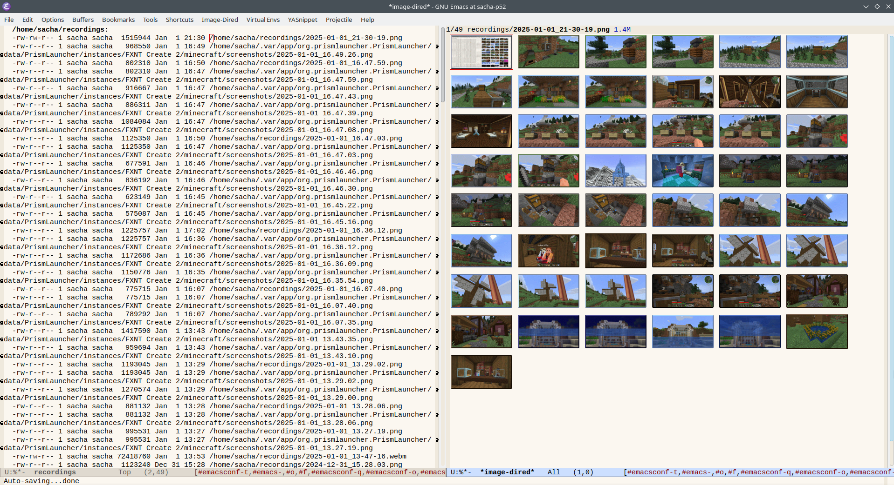

In the ~*image-dired*~ buffer created by
~sacha-show-combined-screenshots~, I can use ~m~
(~image-dired-mark-thumb-original-file~) to mark
images and ~C-u w~
(~image-dired-copy-filename-as-kill~) to copy
their absolute paths.

To make it easier to create links to a file by
using ~org-store-link~ (which I've bound to ~C-c
l~) and ~org-insert-link~ (~C-c C-l~ in an Org
buffer), I can define a link-storing function that
takes the original filename:

#+NAME: sacha-org-image-dired-store-link
#+begin_src emacs-lisp :tangle lisp/sacha-org.el
;;;###autoload
(defun sacha-org-image-dired-store-link ()
  (when (and (derived-mode-p 'image-dired-thumbnail-mode)
             (get-text-property (point) 'original-file-name))
    (org-link-store-props
     :link (concat "file:" (get-text-property (point) 'original-file-name)))))
#+end_src

#+begin_src emacs-lisp :tangle lisp/sacha-org.el
(with-eval-after-load 'org
  (org-link-set-parameters
   "image-dired"
   :store #'sacha-org-image-dired-store-link))
#+end_src

To make it easier to insert the marked links that
have been copied as absolute paths:

#+begin_src emacs-lisp :tangle lisp/sacha-org.el
;;;###autoload
(defun sacha-org-yank-file-links-from-kill-ring ()
  (interactive)
  (dolist (file (read (concat "(" (current-kill 0) ")")))
    (insert (org-link-make-string (concat "file:" file)) "\n")))
#+end_src

I usually want to copy those files to another
directory anyway. I have a
~sacha-org-copy-linked-files~ function in [[dotemacs:copy-linked-file-and-change-link][Copy linked
file and change link]] that copies the files and
rewrites the Org links. This means that I can copy
my notes to an index.org in a directory I share
with A+, save the images to an ~images~
subdirectory, and export the index.html so that
she can read the notes any time she likes.

*** peep-dired
:PROPERTIES:
:CUSTOM_ID: peep-dired
:END:

Allow my use of =C-x C-q= while in peep-dired mode.

#+begin_src emacs-lisp  :tangle no
(use-package peep-dired
  :if sacha-laptop-p
  :bind (:map peep-dired-mode-map
              ("SPC" . nil)
              ("<backspace>" . nil)))
#+end_src

*** Saving photos
:PROPERTIES:
:CUSTOM_ID: saving-photos
:END:

#+begin_src emacs-lisp :tangle lisp/sacha-image.el
;;;###autoload
(defun sacha-save-photo (name)
  (interactive "MName: ")
  (let* ((file (dired-get-filename))
         new-name)
    (cond
     ((string-match "CameraZOOM-\\([0-9][0-9][0-9][0-9]\\)\\([0-9][0-9]\\)\\([0-9][0-9]\\)\\([0-9][0-9]\\)\\([0-9][0-9]\\)\\([0-9][0-9]\\)\\([0-9][0-9][0-9]\\)" file)
      (setq new-name
            (format "%s-%s-%s %s.%s.%s.%s %s.jpg"
                    (match-string 1 file)
                    (match-string 2 file)
                    (match-string 3 file)
                    (match-string 4 file)
                    (match-string 5 file)
                    (match-string 6 file)
                    (match-string 7 file)
                    name)))
     ((string-match "\\([0-9][0-9][0-9][0-9]\\)[\\.-]\\([0-9][0-9]\\)[\\.-]\\([0-9][0-9]\\)[\\.- ]\\([0-9][0-9]\\)\\.\\([0-9][0-9]\\)\\.\\([0-9][0-9]\\)" file)
      (setq new-name
            (format "%s-%s-%s %s.%s.%s %s.jpg"
                    (match-string 1 file)
                    (match-string 2 file)
                    (match-string 3 file)
                    (match-string 4 file)
                    (match-string 5 file)
                    (match-string 6 file)
                    name)))
     (t (setq new-name (concat (file-name-sans-extension (file-name-nondirectory file)) " " name ".jpg"))))
    (when (string-match "A-" name)
      (copy-file file (expand-file-name new-name sacha-kid-photo-directory)))
    (rename-file file (expand-file-name new-name "~/archives/2016/photos/selected/"))))
;;;###autoload
(defun sacha-backup-media ()
  (interactive)
  (mapcar (lambda (file)
            (rename-file
             file
             (expand-file-name
              (file-name-nondirectory file)
              (cond
               ((string-match "mp4" file) "~/archives/2016/videos/")
               ((string-match "mp3\\|wav" file) "~/archives/2016/audio/")
               (t "~/archives/2016/photos/backup/")))))
          (dired-get-marked-files)))
#+end_src

#+begin_src emacs-lisp
(with-eval-after-load 'dired
	(keymap-set dired-mode-map "b" 'sacha-save-photo)
	(keymap-set dired-mode-map "r" 'sacha-backup-media))
#+end_src

** Move to beginning of line
:PROPERTIES:
:CUSTOM_ID: move-to-beginning-of-line
:END:
Copied from http://emacsredux.com/blog/2013/05/22/smarter-navigation-to-the-beginning-of-a-line/

#+BEGIN_SRC emacs-lisp :tangle lisp/sacha-navigate.el
(defun sacha-smarter-move-beginning-of-line (arg)
  "Move point back to indentation of beginning of line.

        Move point to the first non-whitespace character on this line.
        If point is already there, move to the beginning of the line.
        Effectively toggle between the first non-whitespace character and
        the beginning of the line.

        If ARG is not nil or 1, move forward ARG - 1 lines first.  If
        point reaches the beginning or end of the buffer, stop there."
  (interactive "^p")
  (setq arg (or arg 1))

  ;; Move lines first
  (when (/= arg 1)
    (let ((line-move-visual nil))
      (forward-line (1- arg))))

  (let ((orig-point (point)))
    (back-to-indentation)
    (when (= orig-point (point))
      (move-beginning-of-line 1))))
#+END_SRC

#+BEGIN_SRC emacs-lisp
  ;; remap C-a to `smarter-move-beginning-of-line'
  (global-set-key [remap move-beginning-of-line]
                  'sacha-smarter-move-beginning-of-line)
#+END_SRC

** Recent files
:PROPERTIES:
:CUSTOM_ID: recent-files
:END:

#+BEGIN_SRC emacs-lisp
  (require 'recentf)
  (setq recentf-max-saved-items 200
        recentf-max-menu-items 15)
  (recentf-mode)
#+END_SRC

** Open files externally
:PROPERTIES:
:CUSTOM_ID: open-files-externally
:END:

Copied from Prelude: http://emacsredux.com/blog/2013/03/27/open-file-in-external-program/

#+begin_src emacs-lisp :tangle lisp/sacha-navigate.el
(defun sacha-open-with (arg)
  "Open visited file in default external program.

        With a prefix ARG always prompt for command to use."
  (interactive "P")
  (when buffer-file-name
    (shell-command (concat
                    (cond
                     ((and (not arg) (eq system-type 'darwin)) "open")
                     ((and (not arg) (member system-type '(gnu gnu/linux gnu/kfreebsd))) "xdg-open")
                     (t (read-shell-command "Open current file with: ")))
                    " "
                    (shell-quote-argument buffer-file-name)))))
#+end_src

Don't use docview for PDFs.

#+begin_src emacs-lisp
(with-eval-after-load 'org
  (add-to-list 'org-file-apps '("pdf" . "evince %s")))
#+end_src


** Emacs: Toggle a buffer for quick reference
:PROPERTIES:
:CUSTOM_ID: toggle
:END:

I want to quickly bring up some notes and then tuck them away again. I took the idea from [[https://www.reddit.com/r/emacs/comments/l4v1ux/one_of_the_most_useful_small_lisp_functions_in_sacha-][this Reddit thread]] and modified it so that I can specify a function name for later use and filenames for easy reference.

#+begin_src emacs-lisp :tangle lisp/sacha-navigate.el :lexical t
;;;###autoload
(defun sacha-toggle-or-create (buffer-name &optional buffer-create-fn switch-cont)
  "Raises or hides BUFFER-NAME.
If BUFFER-CREATE-FN is specified, use that when creating a function.
Use SWITCH-CONT for additional setup if needed."
  (interactive)
  (let ((target-buf
         (if (file-exists-p buffer-name)
             (find-file-noselect buffer-name)
           (get-buffer buffer-name))))
    (cond
     ((equal (current-buffer) target-buf)
      (bury-buffer))
     (target-buf
      (switch-to-buffer target-buf)
      (when switch-cont (funcall switch-cont)))
     (t (if buffer-create-fn
            (funcall buffer-create-fn)
          (switch-to-buffer
           (get-buffer-create buffer-name)))
        (when switch-cont (funcall switch-cont))))))

;;;###autoload
(defmacro sacha-make-toggle-buffer-function (function-name buffer-name &optional buffer-create-fn switch-cont)
  "Makes a toggle-function to have raise-or-create behaviour.

Creates a toggle-function that executes BUFFER-CREATE-FN if a
buffer named BUFFER-NAME doesn't exist, switches to the buffer
named BUFFER-NAME if it exists, and switches to the previous
buffer if we are currently visiting buffer BUFFER-NAME.

The SWITCH-CONT argument is a function which, if given, is called
after the buffer has been created or switched to.  This allows
running further actions that setup the state of the buffer or
modify it.

Based on https://www.reddit.com/r/emacs/comments/l4v1ux/one_of_the_most_useful_small_lisp_functions_in_my/"
  (declare (debug t))
  `(defun ,function-name ()
     ,(format "Toggle %s." buffer-name)
     (interactive)
     (sacha-toggle-or-create
      ,buffer-name
      ,buffer-create-fn
      ,switch-cont)))
       #+end_src

Now for some shortcuts to quickly bring up my livestream notes, my current focus, or a shell.

#+begin_src emacs-lisp
(keymap-global-set
 "C-z"
 (sacha-make-toggle-buffer-function
  sacha-toggle-live
  "~/sync/topics/live.org"))
(keymap-global-set
 "C-S-z"
 (sacha-make-toggle-buffer-function
  sacha-toggle-now
  "~/sync/topics/now.org"))
(keymap-global-set
 "C-x C-z"
 (sacha-make-toggle-buffer-function
  sacha-toggle-eshell
  "*eshell*"
  (lambda () (eshell) (end-of-buffer))
  (lambda ()
    (eshell/cd default-directory)
		(end-of-buffer))))
#+end_src

** link-hint
:PROPERTIES:
:CUSTOM_ID: link-hint
:END:

This should make it easier to jump to a link.

#+begin_src emacs-lisp
  (use-package link-hint
    :bind
    ("M-g u" . link-hint-open-link)
    ("M-g U" . link-hint-open-multiple-links))
#+end_src
** Bookmarks
:PROPERTIES:
:CUSTOM_ID: bookmarks
:END:
http://yummymelon.com/devnull/using-bookmarks-in-emacs-like-you-do-in-web-browsers.html

#+begin_src emacs-lisp
  (easy-menu-define cc/bookmarks-menu nil
    "Keymap for CC Bookmarks Menu"
    '("Bookmarks"
      ["Edit Bookmarks" list-bookmarks
       :help "Display a list of existing bookmarks."]
      ["--" nil]
      ["Add Bookmark…" bookmark-set-no-overwrite
       :help "Set a bookmark named NAME at the current location."]
      ["---" nil]
      ["Jump to Bookmark…" bookmark-jump
       :help "Jump to bookmark"]))
  (easy-menu-add-item global-map '(menu-bar)
                      cc/bookmarks-menu
                      "Tools")
  (defhydra+ sacha-shortcuts (:exit t)
          ("b" bookmark-jump "Jump to bookmark")
          ("B" bookmark-set-no-overwrite "Set bookmark"))
#+end_src


** Dogears
:PROPERTIES:
:CUSTOM_ID: dogears
:END:

    https://github.com/alphapapa/dogears.el

    #+begin_src emacs-lisp
      (use-package dogears
        ;; These bindings are optional, of course:
        :bind (:map global-map
                    ("M-g d" . dogears-go)
                    ("M-g M-b" . dogears-back)
                    ("M-g M-f" . dogears-forward)
                    ("M-g M-d" . dogears-list)
                    ("M-g M-D" . dogears-sidebar)))
              #+end_src
** Randomness for serendipity
:PROPERTIES:
:CUSTOM_ID: random
:END:

#+BEGIN_SRC emacs-lisp :tangle lisp/sacha-navigate.el
;;;###autoload
(defun sacha-goto-random-char ()
  (interactive)
  (goto-char (random (point-max))))
#+END_SRC

*** Building a today-I-learned habit, and displaying the documentation for random Emacs commands :emacs:
:PROPERTIES:
:ID:       o2b:f3c021e8-8b7a-4bd2-a035-3de1eaa206a2
:POST_DATE: [2016-02-19 Fri 17:11]
:POSTID:   28623
:BLOG:     sacha
:CUSTOM_ID: building-a-today-i-learned-habit-and-displaying-the-documentation-for-random-emacs-commands
:END:

I'd like to build a habit of regularly learning one small thing each
day in one of three domains: tech, life, and learning. My measurable
output would probably be in the form of index cards, tweets, blog
posts, and notes (in org-capture, Dropbox, or Evernote). I can get
input from various sources like blog posts, videos, books, webpages,
and so on.

A little bit of randomness might be useful for learning more about
Emacs. Emacswiki has a [[http://www.emacswiki.org/emacs?action=random][random page]] function, but the chunks are often
a little large or irrelevant. On the other hand, displaying a random
command from the packages that I already have loaded into my Emacs -
that might be a good way to discover interesting things.

I started by looking at =apropos-command=, which led me to
=apropos-internal=, which is a C function that referred to =obarray=.
Using =obarray= by itself didn't work (suspiciously few elements, so I
often ended up looking at emms-related functions). I eventually found
[[http://www.gnu.org/software/emacs/manual/html_node/elisp/Creating-Symbols.html][mapatoms]], which seems to do a better job at listing an appreciable
number of interactive functions. I filtered the list to include only
documented functions that had not been marked as obsolete: 8,415 in
my current Emacs, which should be plenty to go through. =)

#+begin_src emacs-lisp :tangle lisp/sacha-fun.el
;;;###autoload
(defun sacha-describe-random-interactive-function ()
  (interactive)
  "Show the documentation for a random interactive function.
       Consider only documented, non-obsolete functions."
  (let (result)
    (mapatoms
     (lambda (s)
       (when (and (commandp s)
                  (documentation s t)
                  (null (get s 'byte-obsolete-info)))
         (setq result (cons s result)))))
    (describe-function (elt result (random (length result))))))
#+end_src

I've added this to a [[https://www.emacswiki.org/emacs/KeyChord][key-chord]] + [[https://github.com/abo-abo/hydra][hydra]] keymap as a repeatable
function, so I can type =hh= to start my Hydra and then type =r= as
many times as I want in order to show the documentation for a random
interactive function. If you're curious about that, you can see the
[[http://sachachua.com/dotemacs#key-chord][key-chord section of my config]].

Anyway, today I learned more about =obarray= and =mapatoms= - they're
not interactive functions, but they were handy for building this
little bit of code. We'll see how it goes! =)

*** Shuffling lines
:PROPERTIES:
:CUSTOM_ID: shuffling-lines
:END:

#+begin_src emacs-lisp :tangle lisp/sacha-fun.el
;;;###autoload
(defun sacha-shuffle-lines-in-region (beg end)
  "Randomize the order of lines from BEG to END."
  (interactive "r")
  (let ((list (split-string (buffer-substring beg end) "[\r\n]+")))
    (delete-region beg end)
    (insert (string-join (seq-sort-by (lambda (_) (random)) #'<= list) "\n"))))
#+end_src


** Network: TRAMP and editing files over SSH
:PROPERTIES:
:CUSTOM_ID: network-tramp-and-editing-files-over-ssh
:END:
Emacs lets you edit files on remote servers, which is pretty darn
cool. On Windows, these things help a little.

#+begin_src emacs-lisp
  (when (eq system-type 'windows-nt)
    (setq tramp-default-method "plink")
    (setq tramp-auto-save-directory "c:\\sacha\\tmp"))
#+end_src

tramp-hlo is a new package that might improve TRAMP performance by using shell scripts instead of lots of little TRAMP calls.
#+begin_src emacs-lisp
  (use-package tramp-hlo
      :ensure t
      :config
      (tramp-hlo-setup))
#+end_src
** Touch gestures
:PROPERTIES:
:CUSTOM_ID: touch
:END:
[2024-02-01 Thu]
Based on https://kitchingroup.cheme.cmu.edu/blog/2014/08/31/Using-Mac-gestures-in-Emacs/ . This switches with a debouncing function, so you only change one at a time.

#+begin_src emacs-lisp :tangle lisp/sacha-navigate.el
(defvar sacha-navigate-swipe-debounce t "Non-nil means allow swiping.")

;;;###autoload
(defun sacha-navigate-previous-buffer-debounced ()
  (interactive)
  (when sacha-navigate-swipe-debounce
    (previous-buffer)
    (setq sacha-navigate-swipe-debounce nil)
    (run-at-time "1 sec" nil (lambda () (setq sacha-navigate-swipe-debounce t)))))

;;;###autoload
(defun sacha-navigate-next-buffer-debounced ()
  (interactive)
  (when sacha-navigate-swipe-debounce
    (next-buffer)
    (setq sacha-navigate-swipe-debounce nil)
    (run-at-time "1 sec" nil (lambda ()
                               (setq sacha-navigate-swipe-debounce t)))))
#+end_src

#+begin_src emacs-lisp
(keymap-global-set "<triple-wheel-right>" 'sacha-navigate-previous-buffer-debounced)
(keymap-global-set "<triple-wheel-left>" 'sacha-navigate-next-buffer-debounced)
#+end_src
** Applications
:PROPERTIES:
:CUSTOM_ID: navigation-applications
:END:
#+begin_src emacs-lisp :tangle lisp/sacha-navigate.el
;;;###autoload
(defun sacha-navigate-focus-or-launch (app &optional start)
  "Switch to the specified APP or START it."
  (interactive)
	(apply
	 'call-process
	 "~/bin/focus_or_launch" nil t nil
	 (delq nil
				 (list
					app start))))
#+end_src

Ex: (sacha-navigate-focus-or-launch "obs")
* Reading
:PROPERTIES:
:CUSTOM_ID: reading
:END:

#+begin_src emacs-lisp
  (use-package pdf-tools
    :if sacha-laptop-p
    :config
    (pdf-tools-install)
    (setq pdf-view-resize-factor 1.1)
    (setq-default pdf-view-display-size 'fit-page)
          :defer t
    )
#+end_src


* Writing and editing
:PROPERTIES:
:CUSTOM_ID: writing-and-editing
:END:

#+begin_src emacs-lisp
  (keymap-global-set "M-c" #'sacha-capitalize-dwim)
  (setq-default fill-column 50)
  (keymap-global-set "M-o" #'join-line)
  (keymap-global-set "M-T" #'transpose-sentences)  ; https://www.matem.unam.mx/~omar/apropos-emacs.html#writing-experience
#+end_src

https://emacsredux.com/blog/2026/04/07/stealing-from-the-best-emacs-configs/
#+begin_src emacs-lisp
(setq-default bidi-display-reordering 'left-to-right
              bidi-paragraph-direction 'left-to-right)
(setq bidi-inhibit-bpa t)
(setq redisplay-skip-fontification-on-input t)
(setq save-interprogram-paste-before-kill t)
(setq kill-do-not-save-duplicates t)
#+end_src

#+begin_src emacs-lisp :tangle lisp/sacha-misc.el
  (defun sacha-capitalize-dwim ()
    "Capitalize the previous word if typing and at the end of a word."
    (interactive)
    (if (region-active-p)
        (capitalize-region (region-beginning) (region-end))
      (when (and (not (bolp))
                 (looking-back "\\w" 1)
                 (eq last-command 'self-insert-command))
        (backward-word))
      (capitalize-word 1)))

  (defun sacha-copy-filename ()
    "Copy the current buffer file name to the clipboard."
    (interactive)
    (cond
     ((derived-mode-p 'dired-mode) (dired-copy-filename-as-kill 0))
     (t (kill-new (buffer-file-name)))))
#+end_src

#+begin_src emacs-lisp
  ;; Bind it to the original M-c key
  (global-set-key (kbd "M-c") 'sacha-capitalize-dwim)
#+end_src
** Learning French  :french:
:PROPERTIES:
:CUSTOM_ID: multimedia-learning-french
:END:

#+begin_src emacs-lisp
  (use-package learn-lang :load-path "~/proj/learn-lang"
    :preface (load "~/proj/learn-lang/learn-lang-autoloads.el" nil t)
    :config
    (setq learn-lang-language "fr")
    (setq learn-lang-tatoeba-files
          '(("fr" . "~/proj/french/tatoeba-fr-en.tsv")))
    )
#+end_src

#+begin_src emacs-lisp
  (setq search-default-mode 'char-fold-to-regexp)

  (defvar-keymap sacha-learn-lang-map
    :prefix t
    "l" (cons "lookup" #'sacha-learn-lang-lexique-complete-word)
    "w" (cons "wordref" #'sacha-learn-lang-wordreference-lookup)
    "c" (cons "conj" #'sacha-learn-lang-conjugate)
    "f" (cons "→ fr" #'sacha-learn-lang-consult-en-fr)
    "s" (cons "say" #'sacha-learn-lang-say-word-at-point)
    "x" (cons "example" #'learn-lang-tatoeba-consult)
    "t" (cons "→ en" #'sacha-learn-lang-translate-dwim))

  (with-eval-after-load 'org
    (keymap-set org-mode-map "C-," 'sacha-learn-lang-map)
    (keymap-set org-mode-map "C-c u" 'sacha-learn-lang-map))

  (with-eval-after-load 'message
    (keymap-set message-mode-map "C-," 'sacha-learn-lang-map)
    )

  (with-eval-after-load 'flyspell
    (keymap-set flyspell-mode-map "C-," 'sacha-learn-lang-map))


  ;; (use-package wiktionary-bro
  ;;   :config
  ;;   (setq wiktionary-bro-language "fr")
  ;;   )

  (use-package flycheck-grammalecte
    :config
    (setq flycheck-grammalecte-report-apos nil)
    (setq flycheck-grammalecte-report-nbsp nil)
    (setq flycheck-grammalecte-report-esp nil)
    (with-eval-after-load 'flycheck
      (flycheck-grammalecte-setup)))
#+end_src

#+begin_src emacs-lisp :tangle lisp/sacha-learn-lang.el
;;;###autoload
  (defun sacha-learn-lang-chrome-speech-new-session ()
    (interactive)
    (sacha-speech-chrome-new-session "french" "fr-FR"))
#+end_src
*** Practice pronunciation
:PROPERTIES:
:CUSTOM_ID: writing-and-editing-learning-french-practice-pronunciation
:END:
#+begin_src emacs-lisp :tangle lisp/sacha-learn-lang.el
  (defvar sacha-learn-lang-practice-dir "~/proj/french/audio")
  (defvar sacha-learn-lang-practice-temp (expand-file-name "temp.wav" sacha-learn-lang-practice-dir))
;;;###autoload
  (defun sacha-learn-lang-practice-line ()
    (interactive)
    (sit-for 1)
    (let* ((date (format-time-string "%Y-%m-%d-%H-%M-%S"))
           (filename
            (expand-file-name
             (concat date " "
                     (string-trim
                      (buffer-substring (line-beginning-position)
                                        (line-end-position)))
                     ".opus")
             sacha-learn-lang-practice-dir))
           (process (start-process "arecord"
                                   (get-buffer-create "*record*")
                                   "arecord" "-D" "hw:2,0" "-t" "wav" "-f" "cd"
                                   sacha-learn-lang-practice-temp)))
      (read-key "Press a key")
      (kill-process process)
      (call-process "ffmpeg" nil (get-buffer-create "*record*") nil
                    "-y"
                    "-i"
                    sacha-learn-lang-practice-temp
                    "-af" "silenceremove=start_periods=1:start_duration=0:start_threshold=-60dB,areverse,silenceremove=start_periods=1:start_duration=0:start_threshold=-60dB,areverse,loudnorm=I=-16:LRA=11:TP=-1.5"
                    filename)
      (mpv-play filename)))

;;;###autoload
  (defun sacha-learn-lang-practice-replay ()
    (interactive)
    (mpv-play (sacha-latest-file sacha-learn-lang-practice-dir)))

;;;###autoload
  (defun sacha-learn-lang-practice-transcribe ()
    (interactive)
    (let* ((default-directory sacha-learn-lang-practice-dir)
           (file (sacha-latest-file sacha-learn-lang-practice-dir "\\.opus\\|\\.m4a\\|\\.webm")))
      ;; (call-process "/bin/bash" nil nil nil "/home/sacha/bin/whisperx" (expand-file-name file))
      (message "%s"
               (with-temp-buffer
                 (insert-file-contents (concat (file-name-sans-extension file) ".txt"))
                 (string-trim (buffer-string))))))

;;;###autoload
  (defun sacha-learn-lang-practice-play-current-reference (&optional beg end)
    "Play the current segment."
    (interactive)
    (when (derived-mode-p 'subed-mode)
      (let ((comment (subed-subtitle-comment)))
        (cond
         ((string-match "#\\+REFERENCE: \\(.+\\) +\\(.+?\\) +--> +\\([^ ]+\\)" comment)
          (let ((file (expand-file-name (match-string 1 comment)))
                (start (match-string 2 comment))
                (stop (match-string 3 comment)))
            (call-process "mpv" nil nil nil
                          file
                          (format "--start=%.3f" (/ (subed-timestamp-to-msecs start) 1000.0))
                          (format "--end=%.3f" (/ (subed-timestamp-to-msecs stop) 1000.0)))))
         ((string-match "#\\+REFERENCE: \\(.+\\)" comment)
          (call-process "mpv" nil nil nil (match-string 1 comment)))
        (t (let ((start
                 (if beg (save-excursion
                           (goto-char beg)
                           (subed-subtitle-msecs-start))
                   (subed-subtitle-msecs-start)))
                (stop
                 (if beg (save-excursion
                           (goto-char end)
                           (subed-subtitle-msecs-stop))
                   (subed-subtitle-msecs-stop))))
            (call-process "mpv" nil nil nil (subed-media-file)
                          (format "--start=%.3f" (/ start 1000.0))
                          (format "--end=%.3f" (/ stop 1000.0)))))))))

;;;###autoload
  (defun sacha-learn-lang-practice-record-loop (&optional extra)
    (interactive
     (list (cond
            ((and (derived-mode-p 'subed-mode)
                  (region-active-p))
             (subed-subtitle-list-text
              (subed-subtitle-list
               (region-beginning)
               (region-end))))
            ((region-active-p)
             (concat
              " "
              (string-trim
               (buffer-substring (region-beginning) (region-end)))))
            ((derived-mode-p 'subed-mode)
             (concat " " (subed-subtitle-text))))))
    (let* ((date (format-time-string "%Y-%m-%d-%H-%M-%S"))
           (key-prompt "%d (SPC to review, RET get feedback, q to quit, any other key to retry")
           (filename
            (expand-file-name
             (concat date
                     (if extra
                         (concat " "
                                 (string-trim (replace-regexp-in-string
                                               "[\\?]+" " "
                                               (car
                                                (split-string
                                                 extra "\n")))))
                       "")

                     ".opus")
             sacha-learn-lang-practice-dir))
           done
           char
           (count 0)
           process)
      (while (not done)
        (when (derived-mode-p 'subed-mode)
          (if (region-active-p)
              (sacha-learn-lang-practice-play-current-reference (region-beginning) (region-end))
            (sacha-learn-lang-practice-play-current-reference)))
        (setq count (1+ count))
        (setq process (start-process "ffmpeg"
                                     (get-buffer-create "*record*")
                                     "ffmpeg" "-y" "-f" "pulse" "-i" "alsa_input.usb-Blue_Microphones_Yeti_Stereo_Microphone_REV8-00.analog-stereo"
                                     sacha-learn-lang-practice-temp))
        (setq char
              (read-key (format key-prompt
                                count)))
        (while char
          (pcase char
            (?\  (when (process-live-p process)
                   (sit-for 1)
                   (kill-process process))
                 (sacha-learn-lang-practice-play-current-reference)
                 (call-process "mpv" nil nil nil sacha-learn-lang-practice-temp)
                 (setq char
                       (read-key (format "%d (SPC to review, RET get feedback, q to quit, any other key to retry"
                                         count))))
            (13 (when (process-live-p process)
                  (sit-for 1)
                  (kill-process process))
                (setq done 'feedback)
                (setq char nil))
            (?w            ; transcribe with Whisper
             (sacha-learn-lang-practice-transcribe))
            (?q
             (when (process-live-p process) (kill-process process))
             (setq done 'ignore)
             (setq char nil))
            (_
             (when (process-live-p process) (kill-process process))
             (setq char nil)))))
        (when (member done '(keep feedback))
          (call-process "ffmpeg" nil (get-buffer-create "*record*") nil
                        "-y"
                        "-i"
                        sacha-learn-lang-practice-temp
                        "-af" "loudnorm=I=-16:LRA=11:TP=-1.5"
                        ;; "-af" "silenceremove=start_periods=1:start_duration=0:start_threshold=-100dB,areverse,silenceremove=start_periods=1:start_duration=0:start_threshold=-100dB,areverse,loudnorm=I=-16:LRA=11:TP=-1.5"
                        filename)
          (when (eq done 'feedback)
            (sacha-learn-lang-get-audio-feedback filename extra t)))))
#+end_src
*** Start the process for transcribing the latest recording
:PROPERTIES:
:CUSTOM_ID: writing-and-editing-learning-french-start-the-process-for-transcribing-the-latest-recording
:END:

#+begin_src emacs-lisp :tangle lisp/sacha-learn-lang.el
;;;###autoload
  (defun sacha-learn-lang-process-latest-recording (annotation)
    (interactive "MAnnotation: ")
    (let* ((file (sacha-latest-file sacha-recordings-dir))
           (audio (expand-file-name
                   (concat (file-name-base file) "-" annotation ".opus")
                   "~/sync/recordings/")))
      (make-process :name "whisperx"
                    :buffer (get-buffer-create "*whisperx*")
                    :command (list
                              "bash"
                              "-c"
                              (format
                               "ffmpeg -y -i %s %s; cd ~/sync/recordings; ~/bin/whisperx %s"
                               (shell-quote-argument file)
                               (shell-quote-argument audio)
                               (shell-quote-argument audio))))
      (message "Started %s" audio)))
#+end_src
*** Emacs Lisp and NodeJS: Getting the bolded words from a section of a Google Document :js:emacs:
:PROPERTIES:
:EXPORT_DATE: 2026-03-10T14:21:24-0400
:EXPORT_ELEVENTY_PERMALINK: /blog/2026/03/emacs-lisp-and-nodejs-getting-the-bolded-words-from-a-section-of-a-google-document/
:EXPORT_ELEVENTY_FILE_NAME: blog/2026/03/emacs-lisp-and-nodejs-getting-the-bolded-words-from-a-section-of-a-google-document/
:EXPORT_MODIFIED: 2026-03-12T11:01:23-0400
:CUSTOM_ID: writing-and-editing-learning-french-emacs-lisp-and-nodejs-getting-the-bolded-words-from-a-section-of-a-google-document
:END:

#+begin_update
- [2026-03-13]: Cleaned up links from Google
- [2026-03-12]: Simplified getting a section or finding the bolded text by using the Org Mode format instead.
#+end_update

During the sessions with my French tutor, I share a Google document so that we can mark the words where I need to practice my pronunciation some more or tweak the wording. Using Ctrl+B to make the word as bold is an easy way to make it jump out.

I used to copy these changes into my Org Mode notes manually, but today I thought I'd try automating some of it.

First, I need a script to download the HTML for a specified Google document. This is probably easier to do with the NodeJS library rather than with oauth2.el and =url-retrieve-synchronously= because of various authentication things.

#+INCLUDE: ~/bin/download-google-doc-html.cjs src js

Then I can wrap a little bit of Emacs Lisp around it.

#+begin_src emacs-lisp :tangle lisp/sacha-google.el
  (defvar sacha-google-doc-download-command
    (list "nodejs" (expand-file-name "~/bin/download-google-doc-html.cjs")))

;;;###autoload
  (defun sacha-google-doc-html (doc-id)
    (when (string-match "https://docs\\.google\\.com/document/d/\\(.+?\\)/" doc-id)
      (setq doc-id (match-string 1 doc-id)))
    (with-temp-buffer
      (apply #'call-process (car sacha-google-doc-download-command)
             nil t nil (append (cdr sacha-google-doc-download-command) (list doc-id)))
      (buffer-string)))

(require 'dom)
;;;###autoload
(defun sacha-google-doc-clean-html (html)
  "Remove links on spaces, replace Google links."
  (let ((dom (with-temp-buffer
               (insert html)
               (libxml-parse-html-region))))
    (dom-search
     dom
     (lambda (o)
       (when (eq (dom-tag o) 'a)
         (when (and (dom-attr o 'href)
                    (string-match "https://\\(www\\.\\)?google\\.com/url\\?q=" (dom-attr o 'href)))
           (let* ((parsed (url-path-and-query
                           (url-generic-parse-url (dom-attr o 'href))))
                  (params (url-parse-query-string (cdr parsed))))
             (dom-set-attribute o 'href (car (assoc-default "q" params #'string=)))))
         (let ((text (string= (string-trim (dom-text o)) "")))
           (when (string= text "")
             (setf (car o) 'span))))
       (when (and
              (string-match "font-weight:700" (or (dom-attr o 'style) ""))
              (not (string-match "font-style:normal" (or (dom-attr o 'style) ""))))
         (setf (car o) 'strong))
       (when (dom-attr o 'style)
         (dom-remove-attribute o 'style))))
    ;; bold text is actually represented as font-weight:700 instead
    (with-temp-buffer
      (svg-print dom)
      (buffer-string))))

;;;###autoload
  (defun sacha-google-doc-org (doc-id)
    "Return DOC-ID in Org Mode format."
    (pandoc-convert-stdio (sacha-google-doc-clean-html (sacha-google-doc-html doc-id)) "html" "org"))
#+end_src

I have lots of sections in that document, including past journal entries, so I want to get a specific section by name.

#+begin_src emacs-lisp :tangle lisp/sacha-org.el
;;;###autoload
  (defun sacha-org-get-subtree-by-name (org-text heading-name)
    "Return ORG-TEXT subtree for HEADING-NAME."
    (with-temp-buffer
      (insert org-text)
      (org-mode)
      (goto-char (point-min))
      (while (re-search-forward " " nil t)
        (replace-match " "))
      (goto-char (point-min))
      (let ((org-trust-scanner-tags t))
        (car (delq nil
                   (org-map-entries
                    (lambda ()
                      (when (string= (org-entry-get (point) "ITEM") heading-name)
                        (buffer-substring (point) (org-end-of-subtree))))))))))
#+end_src

Now I can get the bolded words from a section of my notes, with just a sentence for context. I use pandoc to convert it to Org Mode syntax.

#+begin_src emacs-lisp :results silent :tangle lisp/sacha-learn-lang.el
  (defvar sacha-learn-lang-words-for-review-context-function 'sentence-at-point)
  (defvar sacha-learn-lang-tutor-notes-url nil)
;;;###autoload
  (defun sacha-learn-lang-tutor-notes (section-name)
    (sacha-org-get-subtree-by-name
     (sacha-google-doc-org sacha-learn-lang-tutor-notes-url)
     section-name))

;;;###autoload
  (defun sacha-learn-lang-words-for-review (section)
    "List the bolded words for review in SECTION."
    (let* ((section (sacha-learn-lang-tutor-notes section))
           results)
      (with-temp-buffer
        (insert section)
        (org-mode)
        (goto-char (point-min))
        (org-map-entries
         (lambda ()
           (org-end-of-meta-data t)
           (unless (looking-at org-heading-regexp)
             (let ((end (save-excursion (org-end-of-subtree))))
               (while (re-search-forward "\\*[^* ].*?\\*" end t)
                 (cl-pushnew
                  (replace-regexp-in-string
                   "[ \n ]+" " "
                   (funcall sacha-learn-lang-words-for-review-context-function))
                  results
                  :test 'string=)))))))
      (nreverse results)))
#+end_src

For example, when I run it on my [[https://sachachua.com/blog/2026/03/la-semaine-du-2-mars-au-8-mars/#entr-es-de-journal-la-semaine-du-2-mars-au-8-mars-dimanche-8-mars-sur-l-intelligence-artificielle][notes on artificial intelligence]], this is the list of bolded words and the sentences that contain them.

#+begin_src emacs-lisp :results list replace :tangle no :exports both
(sacha-learn-lang-words-for-review "Sur l'intelligence artificielle")
#+end_src

#+RESULTS:
:results:
- Je l'ai aussi utilisée pour faire des *recherches*.
- Je peux consacrer une petite partie de mon *budget* à des essais, mais je ne veux pas travailler davantage pour rentabiliser une dépense plus importante.
- Je n'ai pas le temps de concentration nécessaire pour justifier l'investissement dans mon propre matériel, et *sinon*, les progrès sont trop rapides pour m'engager dans une configuration spécifique.
- J'ai une conscience *aiguë* des limites cognitives ou physiques à cause des difficultés *de santé* de ma mère et de ma sœur, et de mes expériences avec mes limitations à cause du fait que je suis la personne principalement en charge de ma fille.
- Je lis très vite, mais je n'ai pas assez de patience pour les longs *contenus* vidéo ou audio.
- Je n'aime pas les textes qui *contiennent* beaucoup de remplissage.
- Beaucoup de gens ont une réaction forte contre l'IA pour plusieurs raisons qui *incluent* le battage médiatique excessif dont elle fait l'objet, son utilisation à mauvais escient, et *l'inondation de banalité* qu'elle produit.
- *Je* réécris souvent la majorité du logiciel à l'exception d'un ou deux morceaux parce que ce code ne me convient pas.
- Je ne veux pas l'utiliser pour les *correctifs* que je veux soumettre à d'autres projets parce que le *code* ne me semble pas correct et je ne veux pas *gaspiller* le temps d'autres bénévoles.
- J'aime pouvoir lui donner trois dépôts git et des instructions pour générer un logiciel à partir d'un dépôt pour *un autre* via le troisième dépôt.
- Mais je ne veux pas le *publier* avant de réécrire et tout comprendre.
- Sans l'IA, je pourrais peut-être apprendre plus lentement avec l'aide *d'Internet*, qui a beaucoup de ressources comme[[https://vitrinelinguistique.oqlf.gouv.qc.ca/][ ]][[https://vitrinelinguistique.oqlf.gouv.qc.ca/][Vitrine linguistique]].
- Je veux profiter davantage, apprendre davantage avec *l'aide* de vraies personnes, complétée par l'aide de l'IA.
- J'adore les sous-titres simultanés, mais je n'ai pas toujours trouvé une méthode ou un système qui me *convienne*.
:end:

I can then go into the WhisperX transcription JSON file and replay those parts for closer review.

I can also tweak the context function to give me less information. For example, to limit it to the containing phrase, I can do this:

#+begin_src emacs-lisp :results list :tangle lisp/sacha-misc.el
;;;###autoload
  (defun sacha-split-string-keep-delimiters (string delimiter)
    (when string
      (let (results pos)
        (with-temp-buffer
          (insert string)
          (goto-char (point-min))
          (setq pos (point-min))
          (while (re-search-forward delimiter nil t)
            (push (buffer-substring pos (match-beginning 0)) results)
            (setq pos (match-beginning 0)))
          (push (buffer-substring pos (point-max)) results)
          (nreverse results)))))

  (ert-deftest sacha-split-string-keep-delimiters ()
   (should
    (equal (sacha-split-string-keep-delimiters
            "Beaucoup de gens ont une réaction forte contre l'IA pour plusieurs raisons qui *incluent* le battage médiatique excessif dont elle fait l'objet, son utilisation à mauvais escient, et *l'inondation de banalité* qu'elle produit."
            ", \\| que \\| qui \\| qu'ils? \\| qu'elles? \\| qu'on "
            )
   )))
#+end_src

#+begin_src emacs-lisp :results list :tangle lisp/sacha-learn-lang.el
;;;###autoload
  (defun sacha-learn-lang-words-for-review-phrase-context (&optional s)
    (setq s (replace-regexp-in-string " " " " (or s (sentence-at-point))))
    (string-join
     (seq-keep
      (lambda (s)
        (when (string-match "\\*" s)
          (replace-regexp-in-string "^, " "" s)))
      (sacha-split-string-keep-delimiters s ", \\| parce que \\| que \\| qui \\| qu'ils? \\| qu'elles? \\| qu'on \\| pour "))
     " ... "))

  (ert-deftest sacha-learn-lang-words-for-review-phrase-context ()
    (should
     (equal (sacha-learn-lang-words-for-review-phrase-context
             "Je peux consacrer une petite partie de mon *budget* à des essais, mais je ne veux pas travailler davantage pour rentabiliser une dépense plus importante.")
            "Je peux consacrer une petite partie de mon *budget* à des essais")))
#+end_src

#+begin_src emacs-lisp :results list replace :eval never-export :tangle no :exports both
(let ((sacha-learn-lang-words-for-review-context-function 'sacha-learn-lang-words-for-review-phrase-context))
  (sacha-learn-lang-words-for-review "Sur l'intelligence artificielle"))
#+end_src

#+RESULTS:
:results:
- pour faire des *recherches*.
- Je peux consacrer une petite partie de mon *budget* à des essais
- et *sinon*
- J'ai une conscience *aiguë* des limites cognitives ou physiques à cause des difficultés *de santé* de ma mère et de ma sœur
- pour les longs *contenus* vidéo ou audio.
- Je n'aime pas les textes qui *contiennent* beaucoup de remplissage.
- qui *incluent* le battage médiatique excessif dont elle fait l'objet ... et *l'inondation de banalité*
- *Je* réécris souvent la majorité du logiciel à l'exception d'un ou deux morceaux
- pour les *correctifs* ... parce que le *code* ne me semble pas correct et je ne veux pas *gaspiller* le temps d'autres bénévoles.
- pour *un autre* via le troisième dépôt.
- Mais je ne veux pas le *publier* avant de réécrire et tout comprendre.
- je pourrais peut-être apprendre plus lentement avec l'aide *d'Internet*
- apprendre davantage avec *l'aide* de vraies personnes, complétée par l'aide de l'IA.
- qui me *convienne*.
- que la capacité de lui donner plus de contrôle dans une boucle de *feedback* rapide(??)
- qu'elle me permet de saisir plus d'idées plus vite (avant de les oublier) et d'analyser les transcriptions sans avoir à réécouter tous les *enregistrements*.
- Beaucoup de raisons peuvent empêcher une *personne* de taper.
- qui sont souvent mauvais et[[https://lr0.org/blog/p/gpt/][ ]][[https://lr0.org/blog/p/gpt/][qui enlèvent l'expérience]] de rencontrer *d'autres* *personnes*
- J'aime *suivre* les liens où je peux en apprendre davantage.
- Je veux extraire mes fonctions personnelles dans des bibliothèques de *reconnaissance* vocale et d'apprentissage des langues ... parce que mon *attention* est facile à détourner.
:end:

Now that I have a function for retrieving the HTML or Org Mode for a section, I can use that to wdiff against my current text to more easily spot wording changes.

#+begin_src emacs-lisp :tangle lisp/sacha-learn-lang.el
;;;###autoload
  (defun sacha-learn-lang-tutor-notes-wdiff-org ()
    (interactive)
    (let ((section (org-entry-get (point) "ITEM")))
      (sacha-wdiff-strings
       (replace-regexp-in-string
        " " " "
        (sacha-org-subtree-text-without-blocks))
       (replace-regexp-in-string
        org-link-bracket-re
        "\\2"
        (replace-regexp-in-string
         " " " "
         (sacha-learn-lang-tutor-notes section))))))
#+end_src

Related:
- =sacha-wdiff-strings= is in [[dotemacs:wdiff][Wdiff]]
- =sacha-org-subtree-text-without-blocks= is in [[dotemacs:org-mode-publishing-counting-words-without-blocks][Counting words without blocks]]

Screenshot:

#+CAPTION: wdiff
[[file:~/recordings/2026-03-12_11-28-24.png][file:~/recordings/2026-03-12_11-28-24.png]]

*** Emacs and French: Focus flycheck-grammalecte on the narrowed part of the buffer
CLOSED: [2026-02-01 Sun 11:23]
:PROPERTIES:
:CREATED: [2026-01-30 Fri 21:03]
:Effort:   0:30
:QUANTIFIED: Emacs
:EXPORT_DATE: 2026-01-30T22:22:49-0500
:EXPORT_ELEVENTY_PERMALINK: /blog/2026/01/emacs-and-french-focus-flycheck-grammalecte-on-the-narrowed-part-of-the-buffer/
:EXPORT_ELEVENTY_FILE_NAME: blog/2026/01/emacs-and-french-focus-flycheck-grammalecte-on-the-narrowed-part-of-the-buffer/
:EXPORT_MODIFIED: 2026-04-11T09:01:47-0400
:CUSTOM_ID: writing-and-editing-learning-french-emacs-and-french-focus-flycheck-grammalecte-on-the-narrowed-part-of-the-buffer
:END:
:LOGBOOK:
- State "DONE"       from "STARTED"    [2026-02-01 Sun 11:23]
CLOCK: [2026-01-30 Fri 21:03]--[2026-02-01 Sun 11:23] => 38:20
:END:

After learning about French spellcheck and grammar checking from [[https://eeame-97718b.frama.io/jours/jour11/][Emacs expliqué à mes enfants]], I added [[https://github.com/milouse/flycheck-grammalecte][flycheck-grammalecte]] to my config. Nudged by [[https://mastodon.zaclys.com/@lann/115974248832191444][@lann@mastodon.zaclys.com]], I finally got around to figuring out why my setup sometimes worked and sometimes didn't. When I checked ~flycheck-verify-setup~, I noticed that grammalecte kept getting disabled. A little digging around showed me that it was getting disabled because of too many errors. That was because it was trying to work on my whole file instead of just the portion that I [[https://www.gnu.org/software/emacs/manual/html_node/emacs/Narrowing.html][narrowed]] to with ~org-narrow-to-subtree~ (ooh, just noticed an ~org-toggle-narrow-to-subtree~ command). I like having all of my French journal entries in one file because I can use ~consult-line~ (which I've bound to ~M-g l~) to quickly look up examples of where else I've used a word. So I needed to define a checker that runs only on the narrowed part of the buffer.

#+begin_update
[2026-04-11]: Now at [[learn-lang:learn-lang-flycheck-grammalecte-narrowed.el][learn-lang-flycheck-grammalecte-narrowed-setup]].
#+end_update
#+begin_src emacs-lisp :lexical t :silent t

#+end_src

After I use ~sacha-flycheck-grammalecte-setup~, I can use ~flycheck-select-checker~ to select ~sacha-grammalecte-narrowed~ and then use ~flycheck-buffer~ to run it. Then it will underline all the number/gender agreement issues I usually have. It's nice that I can practise editing my text with this script before I run the text through an LLM (also via flycheck) for feedback on wording.

#+CAPTION: Screenshot of grammalecte providing grammar feedback
[[file:~/recordings/2026-01-30_22-20-20.png][file:~/recordings/2026-01-30_22-20-20.png]]
*** Speech synthesis
:PROPERTIES:
:CUSTOM_ID: writing-and-editing-learning-french-speech-synthesis
:END:
**** gtts-cli
:PROPERTIES:
:CUSTOM_ID: writing-and-editing-learning-french-gtts-cli
:END:
libsox-fmt-mp3
gtts-cli "rendez-vous" -l fr | play -t mp3 -

Update [2026-03-08 Sun]: Moved to learn-lang:learn-lang-tts.el and [[learn-lang:learn-lang-phonemes.el]]

#+begin_src emacs-lisp
  (use-package learn-lang-tts :load-path "~/proj/learn-lang"
    :config
    (setq learn-lang-tts-kokoro-cli-executable "~/.local/bin/kokoro-tts --model /home/sacha/vendor/kokoro-onnx/kokoro-v1.0.onnx --voices /home/sacha/vendor/kokoro-onnx/voices-v1.0.bin"))
#+end_src

#+begin_src emacs-lisp :tangle lisp/sacha-learn-lang.el
#+end_src

#+RESULTS:
:results:
sacha-learn-lang-shadow
:end:


**** DONE Azure
CLOSED: [2026-03-24 Tue 09:30] DEADLINE: <2026-03-07 Sat>
:PROPERTIES:
:CREATED:  [2026-02-06 Fri 13:54]
:CUSTOM_ID: writing-and-editing-learning-french-speech-synthesis-azure
:END:
:LOGBOOK:
- State "DONE"       from "TODO"       [2026-03-24 Tue 09:30]
:END:

Moved to https://codeberg.org/sachac/learn-lang/src/branch/main/learn-lang-tts.el

*** Add shadowing with tts to subed-record                   :emacs:stream:
:PROPERTIES:
:CUSTOM_ID: writing-and-editing-learning-french-add-shadowing-with-tts-to-subed-record
:END:

#+begin_src emacs-lisp
  (setq learn-lang-subed-record-reference-dir "~/proj/french/reference/")

  (with-eval-after-load 'subed-record
    (add-hook 'subed-record-finished-hook 'sacha-subed-record-normalize-current))
#+end_src

#+begin_src emacs-lisp :tangle lisp/sacha-subed-record.el
;;;###autoload
  (defun sacha-subed-record-normalize-current (file)
    (interactive (list (subed-media-file)))
    (let ((temp-file (make-temp-file file nil (concat "." (file-name-extension file)))))
      (make-process
       :name "normalize"
       :buffer (get-buffer-create "*normalize*")
       :command (list
                 (expand-file-name "~/bin/normalize")
                 (expand-file-name file)
                 temp-file)
       :sentinel
       (lambda (process event)
         (when (string-match "finished" event)
           (rename-file temp-file file t)
           (message "Normalized %s" file))))))
#+end_src

#+RESULTS:
:results:
| sacha-learn-lang-say-current-subtitle-and-reset-subed-record   |
:end:

*** Make it easy to add reference links
:PROPERTIES:
:CUSTOM_ID: writing-and-editing-learning-french-make-it-easy-to-add-reference-links
:END:

#+begin_src emacs-lisp :tangle lisp/sacha-subed-record.el
  (defvar-local sacha-subed-record-references nil)
;;;###autoload
  (defun sacha-subed-record-load-references (file &optional skip-insert)
    "Load the references from FILE (media)."
    (interactive (list (read-file-name "Media file: ")
                       current-prefix-arg))
    (dolist (cue (subed-parse-file (concat (file-name-sans-extension file) ".vtt")))
      (push
       (list
        (learn-lang-subed-record-simplify (elt cue 3))
        file
        (elt cue 1)
        (elt cue 2))
       sacha-subed-record-references))
    (unless skip-insert
      (sacha-subed-insert-references)))

;;;###autoload
  (defun sacha-subed-record-insert-reference ()
    (interactive)
    (when-let* ((rec (alist-get (learn-lang-subed-record-simplify (subed-subtitle-text))
                               sacha-subed-record-references
                               nil nil #'string=)))
      (subed-record-set-directive
       "#+REFERENCE"
       (format "%s %s --> %s"
               (elt rec 0)
               (subed-msecs-to-timestamp (elt rec 1))
               (subed-msecs-to-timestamp (elt rec 2))))))

;;;###autoload
  (defun sacha-subed-insert-references ()
    (interactive)
    (subed-for-each-subtitle (point-min) (point-max) t
      (sacha-subed-record-insert-reference)))
#+end_src
*** Word timestamps
:PROPERTIES:
:CUSTOM_ID: writing-and-editing-learning-french-word-timestamps
:END:

#+begin_src emacs-lisp :tangle lisp/sacha-learn-lang.el
;;;###autoload
  (defun sacha-learn-lang-word-timestamps ()
    "Add timestamps using the MFA French model."
    (interactive)
    (let ((subed-align-mfa-dictionary "french_mfa")
          (subed-align-mfa-acoustic-model "french_mfa"))
      (subed-align-mfa-set-word-data
       (subed-media-file)
       nil nil
       (lambda (&rest _)
         (subed-word-data-add-word-timestamps)))))
#+end_src

*** AI feedback
:PROPERTIES:
:CUSTOM_ID: writing-and-editing-learning-french-ai-feedback
:END:
#+begin_src emacs-lisp :tangle lisp/sacha-learn-lang.el
;;;###autoload
  (defun sacha-learn-lang-get-audio-feedback (filename &optional extra-text display)
    (interactive (list (if current-prefix-arg
                           (read-file-name "File: " sacha-learn-lang-practice-dir nil t nil
                                           (lambda (filename) (string-match "\\.m4a$" filename)))
                         (sacha-latest-file sacha-learn-lang-practice-dir "\\(\\.m4a\\|\\.webm\\)$"))
                       (if (region-active-p)
                           (buffer-substring (region-beginning) (region-end)))
                       t))
    (let* ((data
            (replace-regexp-in-string
             "\n" ""
             (shell-command-to-string (concat "base64 " (shell-quote-argument filename)))))
           (text
            (concat "Give me feedback in English on this recording of beginner French practice. I am a female A0/A1 speaker. Focus first on major mispronunciations, and provide English phonetic transcriptions for those words using italicized parenthetical notes.

  Return your response using Org Mode syntax using only list items, not headings. Do not put it in a code block, just return Org Mode text. For example, *bold*. Score it out of 10.

  Example output:

  - Pronunciation (7 /10)
    - travaillé /(trah vay yay)/
  "
                    (if extra-text
                        (concat "\n\n###\n\n" extra-text)
                      "")))
           (json-array-type 'vector)
           (json-object-type 'alist)
           (body (json-encode
                  `(("contents"
                     (("parts" .
                       ((("text" . ,text))
                        (("inline_data" .
                          (("mime_type" . "audio/mp4")
                           ("data" . ,data))))
                        )))))))
           result)
      (setq
       result
       (plz 'post "https://generativelanguage.googleapis.com/v1beta/models/gemini-2.5-flash:generateContent"
         :headers
         `(("Content-Type" . "application/json")
           ("X-goog-api-key" . ,sacha-gemini-api-key))
         :as #'json-read
         :body body))
      (when display
        (with-current-buffer (get-buffer-create "*Feedback*")
          (org-mode)
          (goto-char (point-min))
          (let* ((text (map-nested-elt result '(candidates 0 content parts 0 text)))
                 (score (when (string-match "Pronunciation (\\(.+\\))" text) (match-string 1 text))))
            (insert "* " (org-link-make-string
                          (concat "audio:"
                                  (replace-regexp-in-string
                                   (rx line-start
                                       (literal (getenv "HOME")))
                                   "~"
                                   filename))
                          "me:") "  "
                          (or score "")
                          "\n"
                          text
                          "\n\n"))
          (display-buffer (current-buffer))
          (with-selected-window (get-buffer-window (current-buffer))
            (goto-char (point-min))
            (recenter-top-bottom 0))))
      (map-nested-elt result '(candidates 0 content parts 0 text))))
#+end_src


#+NAME: sacha-org-copy-clean-version
#+begin_src emacs-lisp :lexical t :eval t :tangle lisp/sacha-org.el
;;;###autoload
  (defun sacha-org-copy-clean-version (text)
    "Copy BEG to END without strike-throughs."
    (interactive (list (if (region-active-p) (buffer-substring (region-beginning) (region-end))
                         (sentence-at-point))))
    (let ((result
           (mapconcat (lambda (o)
                               (if (stringp o)
                                   o
                                 (car (org-element-contents o))))
                             (seq-remove (lambda (o)
                                           (and (listp o)
                                                (member (org-element-type o)
                                                        '(strike-through macro))))
                                         (org-element-parse-secondary-string
                                          text '(paragraph bold strike-through macro)))
                             " ")))
             (setq result
               (replace-regexp-in-string
                "  +" " "
                (replace-regexp-in-string " [\\.,]" "\\1" result)))
      (when (called-interactively-p 'any)
        (message "%s" result)
        (kill-new result))
      result))
#+end_src


*** Using flycheck to display AI grammar feedback from gptel as I learn French
:PROPERTIES:
:CUSTOM_ID: writing-and-editing-learning-french-using-flycheck-to-display-ai-grammar-feedback-from-gptel-as-i-learn-french
:END:

#+CAPTION: Screenshot of flycheck showing grammar feedback from gptel
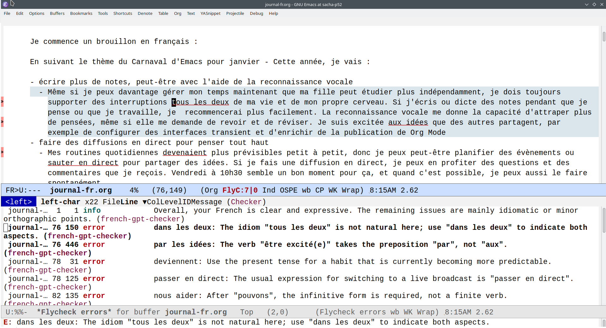

This is now in [[learn-lang:learn-lang-flycheck-gptel.el]] . I can call =learn-lang-flycheck-gptel-setup= to check the buffer for errors using whatever model I've configured in gptel.

*** Process audio files
:PROPERTIES:
:CUSTOM_ID: writing-and-editing-learning-french-process-audio-files
:END:
#+begin_src emacs-lisp :tangle lisp/sacha-multimedia.el
;;;###autoload
  (defun sacha-audio-clip (source start-time end-time destination text)
    (interactive
     (let ((s (and (region-active-p) (buffer-substring (region-beginning) (region-end)))))
       (if (and s
                (string-match "\\(\\(?:\\(?:[0-9]+\\):\\)?\\(?:[0-9]+\\):\\(?:[0-9]+\\)\\(?:\\.\\(?:[0-9]+\\)\\)?\\)[ \n\t]+\\(\\(?:\\(?:[0-9]+\\):\\)?\\(?:[0-9]+\\):\\(?:[0-9]+\\)\\(?:\\.\\(?:[0-9]+\\)\\)?\\)" s))
           (let ((start (match-string 1 s))
                 (end (match-string 2 s)))
             (list
              (read-file-name "Source: " nil nil t)
              start
              end
              (read-file-name "Destination: ")
              (read-string "Text: ")))
         (list (read-file-name "Source: " nil nil t)
               (read-string "Start time: ")
               (read-string "End time: ")
               (read-file-name "Destination: ")
               (read-string "Text: ")))))
    (let ((result (call-process "ffmpeg" nil (get-buffer-create "*ffmpeg*") nil
                                "-y" ; Overwrite output file without asking
                                "-i" (expand-file-name source) ; Input file
                                "-ss" start-time ; Start time (e.g., 00:00:10)
                                "-to" end-time ; End time/Stop time
                                (expand-file-name destination))))
      (when result
        (when (region-active-p) (delete-region (region-beginning) (region-end)))
        (insert (org-link-make-string
                 (concat "audio:" (replace-regexp-in-string (getenv "HOME") "~" destination))
                 text)))))
#+end_src
*** Save journal entries for analysis
:PROPERTIES:
:CUSTOM_ID: writing-and-editing-learning-french-save-journal-entries-for-analysis
:END:
#+begin_src emacs-lisp :tangle lisp/sacha-learn-lang.el
;;;###autoload
  (defun sacha-learn-lang-write-journal-entries-for-subtree ()
    (interactive)
    (org-map-entries
     (lambda ()
       (when (org-entry-get (point) "DATE")
         (let ((text (replace-regexp-in-string "{.+?}" "" (sacha-org-subtree-text-without-blocks))))
           (with-temp-file (expand-file-name (concat (org-entry-get (point) "DATE") ".txt")
                                             "~/proj/french/journal")
             (insert text)))))
     nil 'tree))
#+end_src
*** TODO Load en-fr dictionary
:PROPERTIES:
:CREATED: [2025-12-27 Sat 15:21]
:CUSTOM_ID: writing-and-editing-learning-french-load-en-fr-dictionary
:END:

https://github.com/thierryvolpiatto/dic-en-fr-fr-en

#+begin_src emacs-lisp :tangle lisp/sacha-learn-lang.el
(defvar sacha-learn-lang-en-fr-dictionary-file "~/proj/french/dic-en-fr.iso")
(defvar sacha-learn-lang-dictionary nil)
;;;###autoload
(defun sacha-learn-lang-load-dict ()
  (interactive)
  (with-temp-buffer
    (insert-file-contents sacha-learn-lang-en-fr-dictionary-file)
    (goto-char (point-min))
    (while (looking-at "^# ") (forward-line 1))
    (setq sacha-learn-lang-dictionary
          (seq-keep (lambda (s)
                      (when (string-match "^\\(.+?\\) {\\(.+?\\)}\\(?: /\\(.+?\\)/\\)?\\(?: (\\(.+?\\))\\)?\\( SEE: .+?\\)? ::\\(?: \\(.+?\\) *\\({.+}.*\\)?\\)?$" s)
                        (let ((headword (match-string 1 s))
                              (head-type (match-string 2 s))
                              (def (match-string 4 s))
                              (see (match-string 5 s))
                              (translation (match-string 6 s))
                              (types (match-string 7 s)))
                          (cons
                           (propertize (format "%s {%s} - %s - %s :: %s"
                                               headword
                                               head-type
                                               (or see translation)
                                               (or def "")
                                               (or types ""))
                                       'gender
                                       (cond
                                         ((null types) nil)
                                         ((string-match "^{m}" types) "m")
                                         ((string-match "^{f}" types) "f")))
                           translation))))
                    (split-string (buffer-substring (point) (point-max)) "\n")))
    (seq-take sacha-learn-lang-dictionary 10)))

;;;###autoload
(defun sacha-learn-lang-consult-en-fr ()
  (interactive)
  (unless sacha-learn-lang-dictionary (sacha-learn-lang-load-dict))
  (insert
   (consult--read
    (consult--dynamic-collection
        (lambda (input)
          (let (match-start
                match-any
                exact
                (search (regexp-quote input)))
            (seq-map (lambda (o)
                       (setf (car o)
                             (propertize
                              (car o)
                              'face
                              (list
                               :background
                               (pcase (get-text-property 0 'gender (car o))
                                 ('nil nil)
                                 ("m" (modus-themes-get-color-value 'bg-blue-subtle))
                                 ("f" (modus-themes-get-color-value 'bg-magenta-subtle))))))
                       (cond
                        ((string-match (concat "^" search " - ") (car o))
                         (push o exact))
                        ((string-match (concat "^" search) (car o))
                         (push o match-start))
                        ((string-match search (car o))
                         (push o match-any))))
                     sacha-learn-lang-dictionary)
            (append
             (nreverse exact)
             (nreverse match-start)
             (nreverse match-any)
             nil))))
    :sort nil
    :lookup #'consult--lookup-cdr)))
#+end_src

#+RESULTS:
:results:
sacha-learn-lang-consult-en-fr
:end:

https://github.com/emacsmirror/wordreference
*** Conjugation
:PROPERTIES:
:CUSTOM_ID: writing-and-editing-learning-french-conjugation
:END:

- http://rali.iro.umontreal.ca/rali/?q=en/node/1238
- https://github.com/RosaeNLG/rosaenlg

  #+begin_src emacs-lisp :tangle lisp/sacha-learn-lang.el
;;;###autoload
    (defun sacha-learn-lang-conjugate-grammalecte (input)
      "Query Grammalecte for INPUT."
      (interactive (list (sacha-learn-lang-lexique-complete-word)))
      (grammalecte-conjugate-verb input))

    (defvar sacha-learn-lang-verbe-db "~/vendor/verbe-conjugaison-academie-francaise/output/verbs.db")

;;;###autoload
    (defun sacha-learn-lang-conjugate (input &optional all-forms)
      (interactive (list (sacha-learn-lang-lexique-complete-word)
                         (null current-prefix-arg)))
      (let* ((db (sqlite-open sacha-learn-lang-verbe-db))
             (lemme (elt (car (sacha-learn-lang-lexique-lookup-db-exact input)) 1))
             (value
              (consult--read
               (if all-forms
                   (mapcar (lambda (row)
                             (cons (string-join
                                    (list
                                     (elt row 0)
                                     (elt row 1)
                                     (elt row 2)
                                     (elt row 4)
                                     (elt row 3))
                                    " - ")
                                   (elt row 0)))
                           (sqlite-select db
                                          "SELECT
        conjugaison, voix, mode, temps, personne
    FROM verbes v
    JOIN conjugaisons c
    ON v.id = c.verbe_id WHERE v.infinitif = ?
    ORDER BY temps, mode, personne" (list lemme)))
                 (mapcar (lambda (row)
                             (cons (string-join
                                    (list
                                     (elt row 0)
                                     (elt row 4)
                                     (elt row 3))
                                    " - ")
                                   (elt row 0)))

                           (sqlite-select db
                                          "SELECT
        conjugaison, voix, mode, temps, personne
    FROM verbes v
    JOIN conjugaisons c
    ON v.id = c.verbe_id WHERE v.infinitif = ?
    AND temps in (?, ?)
    AND mode=?
    ORDER BY temps, mode, personne"
                                          (list input "present" "passe_compose"  "indicatif"))))
               :prompt "Verbe: "
               :lookup 'consult--lookup-cdr)))
        (sqlite-close db)
        (when (called-interactively-p 'any)
          (when (word-at-point)
              (delete-region (save-excursion
                               (skip-syntax-backward "w")
                               (point))
                             (save-excursion
                               (skip-syntax-forward "w")
                               (point))))
          (insert value))
        value))
  #+end_src
*** Looking up words via wordreference
:PROPERTIES:
:CUSTOM_ID: writing-and-editing-learning-french-looking-up-words-via-wordreference
:END:

There's also a package:wordreference.

#+begin_src emacs-lisp :tangle lisp/sacha-learn-lang.el
  (defvar sacha-learn-lang-wordreference-cache nil)

;;;###autoload
  (defun sacha-learn-lang-wordreference-completing-read ()
    (interactive)
    (consult--read
     (consult--dynamic-collection
         (lambda (input)
           (message "input: %s" input)
           (with-current-buffer
               (url-retrieve-synchronously
                (concat "https://www.wordreference.com/autocomplete?dict=enfr&query="
                        (url-hexify-string input)))
                               (set-buffer-multibyte t)
             (goto-char (point-min))
             (re-search-forward "^$" nil t)
             (prog1
                 (mapcar (lambda (row)
                           (let ((fields (split-string row "\t")))
                             (propertize
                              (format "%s (%s)"
                                      (car fields)
                                      (cadr fields))
                              'consult--candidate
                              fields)))
                         (split-string
                          (string-trim (buffer-substring (point) (point-max))) "\n"))
               (kill-buffer (current-buffer))))))
     :sort nil
     :initial (symbol-name (symbol-at-point))
     :history 'sacha-learn-lang-wordreference-lookup-history
     :prompt "Word: "
     :category 'word))

  (defvar-keymap sacha-learn-lang-wordreference-keymap
    "v" #'sacha-spookfox-scroll-down
    "V" #'sacha-spookfox-scroll-up
    "c" #'sacha-learn-lang-conjugate-last-word
    "l" #'sacha-learn-lang-wordreference-lookup)

  (defvar sacha-learn-lang-wordreference-lookup-history nil)
;;;###autoload
  (defun sacha-learn-lang-wordreference-lookup (word)
    (interactive (list (sacha-learn-lang-wordreference-completing-read)))
    (let (language)
      (if (string-match " (\\(en\\|fr\\))" word)
          (setq language (match-string 1 word)
                word (replace-match "" nil t word 0)))
      (setq word (replace-regexp-in-string "^#" "" word))
      (browse-url
       (format "https://www.wordreference.com/%s/%s"
               (if (string= language "fr")
                   "fren"
                 "enfr")
               (url-hexify-string word))))
    (set-transient-map sacha-learn-lang-wordreference-keymap t))

;;;###autoload
  (defun sacha-learn-lang-conjugate-last-word ()
    (interactive)
    (grammalecte-conjugate-verb
     (replace-regexp-in-string " (.+)" ""
                               (car sacha-learn-lang-wordreference-lookup-history))))

;;;###autoload
  (defun sacha-learn-lang-wordreference-conjugate (word)
    (interactive (list (sacha-learn-lang-wordreference-completing-read)))
    (browse-url (concat "https://www.wordreference.com/conj/frverbs.aspx?v="
                        (url-hexify-string (if (listp word) (car word) word)))))

;;;###autoload
  (defun sacha-learn-lang-reverso (s)
    (interactive (list (if (region-active-p)
                           (buffer-substring (region-beginning) (region-end))
                         (word-at-point))))
    (browse-url (concat "https://www.reverso.net/text-translation#sl=fra&tl=eng&text="
                        (url-hexify-string s))))
#+end_src
*** Lexique
:PROPERTIES:
:CUSTOM_ID: writing-and-editing-learning-french-lexique
:END:
http://www.lexique.org/databases/Lexique383/

#+begin_src emacs-lisp :tangle lisp/sacha-learn-lang.el
  (defvar sacha-learn-lang-lexique-db "~/proj/french/lexique.db" "SQLite3 DB")
#+end_src

How to load the TSV into SQLite:

#+begin_src python :tangle no :eval no
import pandas as pd
import sqlite3
df = pd.read_csv('lexique383.tsv', sep='\t')
conn = sqlite3.connect('lexique.db')
df.to_sql('lexique', conn, if_exists='replace', index=False)
conn.close()
#+end_src

Adding an unaccented version for easier lookup:

#+begin_src sql :eval no
ALTER TABLE lexique ADD COLUMN ortho_flat TEXT;

-- Update it (you can use your Python logic to strip accents)
-- Or use SQLite's built-in REPLACE for common French chars:
UPDATE lexique SET ortho_flat =
  REPLACE(REPLACE(REPLACE(REPLACE(REPLACE(REPLACE(REPLACE(LOWER(ortho), 'é', 'e'), 'è', 'e'), 'ê', 'e'), 'à', 'a'), 'ç', 'c'), 'ô', 'o'), 'î', 'i');

-- Index the flat column
CREATE INDEX idx_ortho_flat ON lexique(ortho_flat);
#+end_src

Emacs Lisp functions for finding things:

#+begin_src emacs-lisp :tangle lisp/sacha-learn-lang.el
  (defvar sacha-learn-lang-csv-path "/home/sacha/proj/french/french_vocabulary_list.csv")
  (defvar sacha-learn-lang-known-lemmas nil)
;;;###autoload
  (defun sacha-learn-lang-lexique-lookup-db-exact (input)
    "Query the Lexique SQLite database for INPUT."
    (let ((db (sqlite-open sacha-learn-lang-lexique-db)))
      (prog1 (sqlite-select db
                            "SELECT ortho, lemme, genre, nombre, phon, syll, infover FROM lexique
                      WHERE ortho=? ORDER BY freqfilms2 DESC LIMIT 1"
                            (list input))
        (sqlite-close db))))

;;;###autoload
  (defun sacha-learn-lang-lexique-lookup-db-flat (input)
    "Query the Lexique SQLite database for INPUT."
    (let ((db (sqlite-open sacha-learn-lang-lexique-db)))
      (prog1 (sqlite-select db
                            "SELECT ortho, lemme, genre, nombre, phon, syll, infover FROM lexique
                      WHERE ortho_flat LIKE ? OR ortho LIKE ? ORDER BY freqfilms2 DESC LIMIT 50"
                            (list (concat (downcase input) "%")
                                  (concat (downcase input) "%")))
        (sqlite-close db))))

;;;###autoload
  (defun sacha-learn-lang-lexique-lookup-db-lemma (input)
    "Query the Lexique SQLite database for INPUT."
    (let ((db (sqlite-open sacha-learn-lang-lexique-db)))
      (prog1 (sqlite-select db
                            "SELECT ortho, lemme, genre, nombre, infover, phon, syll, ortho_flat FROM lexique
                      WHERE lemme LIKE ? ORDER BY freqfilms2 DESC LIMIT 50"
                            (list (concat input "%")))
        (sqlite-close db))))

;;;###autoload
  (defun sacha-learn-lang-lexique-complete-word ()
    (interactive)
    (let* ((selection
            (consult--read
             (consult--dynamic-collection
                 (lambda (input)
                   (modus-themes-with-colors
                     (mapcar (lambda (row)
                               (let ((word (nth 0 row))
                                     (gender (nth 2 row))
                                     (number (nth 3 row))
                                     (ipa (sacha-learn-lang-lexique-to-ipa (nth 5 row)))
                                     (infover (nth 6 row)))
                                 ;; Format the string for the completion buffer
                                 (cons
                                  (propertize
                                   (format "%-20s [%s] (%s)" word ipa
                                           (string-join
                                            (delq nil (list gender number infover))
                                            ", "))
                                   'consult--candidate word
                                   'face
                                   `(:background

                                     ,(pcase gender
                                        ("m" bg-blue-subtle)
                                        ("f" bg-magenta-subtle))))
                                  word)))
                             (sacha-learn-lang-lexique-lookup-db-flat input)))))
             :prompt "French word: "
             :initial (word-at-point)
             :sort nil
             :lookup #'consult--lookup-cdr
             :category 'french-word)))
      (when selection
        (when (called-interactively-p 'any)
          (when (word-at-point)
            (delete-region (save-excursion
                             (skip-syntax-backward "w")
                             (point))
                           (save-excursion
                             (skip-syntax-forward "w")
                             (point))))
          (insert selection))
        selection)))
#+end_src

*** STARTED Write a completion-at-point function for French
:PROPERTIES:
:Effort:   0:30
:QUANTIFIED: Emacs
:CUSTOM_ID: writing-and-editing-learning-french-write-a-completion-at-point-function-for-french
:END:
:LOGBOOK:
CLOCK: [2026-01-13 Tue 19:48]--[2026-01-14 Wed 09:33] => 13:45
:END:

#+begin_src emacs-lisp :tangle lisp/sacha-learn-lang.el
;;;###autoload
  (defun sacha-learn-lang-lexique-completion-at-point ()
    (let ((bounds (bounds-of-thing-at-point 'word)))
      (when bounds
        (list (car bounds)
              (cdr bounds)
              (mapcar (lambda (row)
                        (let ((word (nth 0 row))
                              (gender (nth 2 row))
                              (number (nth 3 row))
                              (ipa (sacha-learn-lang-lexique-to-ipa (nth 5 row)))
                              (infover (nth 6 row)))
                          word))
                      (sacha-learn-lang-lexique-lookup-db-flat
                       (buffer-substring-no-properties
                        (car bounds)
                        (cdr bounds))))
              :exclusive 'no))))
  (with-eval-after-load 'org
    (add-hook 'org-mode-hook
              (lambda ()
                (when (and (buffer-file-name) (string-match "journal-fr\\|french" (buffer-file-name)))
                  (add-hook 'completion-at-point-functions 'sacha-learn-lang-lexique-completion-at-point)))))
#+end_src
*** Highlight and count new words in journal entries
:PROPERTIES:
:CUSTOM_ID: writing-and-editing-learning-french-highlight-and-count-new-words-in-journal-entries
:END:
#+begin_src emacs-lisp :tangle lisp/sacha-learn-lang.el
;;;###autoload
  (defun sacha-learn-lang-load-known-lemmas ()
    "Parse the CSV and return a hash table of lemma -> info."
    (let* ((known (make-hash-table :test 'equal))
           (data (cdr (pcsv-parse-file sacha-learn-lang-csv-path))))
      (mapc
       (lambda (o)
         (unless (gethash (elt o 2) known)
           (puthash (elt o 2) o known))
         (unless (gethash (elt o 0) known)
           (puthash (elt o 0) o known)))
       data)
      (setq sacha-learn-lang-known-lemmas known)))

  (defvar sacha-learn-lang-ignore
    (with-temp-buffer
      (insert-file-contents "~/proj/french/ignored.txt")
      (split-string (string-trim (buffer-string)) "\n")))

;;;###autoload
  (defun sacha-learn-lang-lexique-to-ipa (s)
    (mapconcat (lambda (c)
                 (pcase c
                   (?O "ɔ")
                   (?E "ɛ")
                   (?° "ə")
                   (?2 "ø")
                   (?9 "œ")
                   (?S "ʃ")
                   (?5 "ɛ̃")
                   (?Z "ʒ")
                   (?@ "ɑ̃")
                   (?1 "œ̃")
                   (?§ "ɔ̃")
                   (?8 "ɥ")
                   (?R "ʁ")
                   (_ (char-to-string c))))
                 s ""))

  (defvar sacha-learn-lang-show-pronunciation t "*Non-nil means show pronunciation.")

;;;###autoload
  (defun sacha-learn-lang-highlight-new-words-in-subtree ()
    "Highlight words in the current subtree based on lexique.db and CSV data."
    (interactive)
    (save-excursion
      (sacha-learn-lang-remove-new-word-highlights)
      (if (org-entry-get-with-inheritance "DATE")
          (let* ((subtree-date (org-entry-get-with-inheritance "DATE"))
                 (known-lemmas (or sacha-learn-lang-known-lemmas (sacha-learn-lang-load-known-lemmas)))
                 (seen-so-far (make-hash-table :test 'equal))
                 (beg (save-excursion (org-back-to-heading t) (org-end-of-meta-data t) (point)))
                 (end (save-excursion (org-end-of-subtree t) (point)))
                 (count-new 0)
                 (count-words 0))
            (save-excursion
              (goto-char beg)
              (while (and (< (point) end) (re-search-forward "\\b[[:alpha:]-]+\\b" end t))
                (let* ((word (match-string 0))
                       (info (and (or
                                   (not (car (gethash (downcase word) known-lemmas)))
                                   (not (string>
                                         subtree-date
                                         (car (gethash (downcase word) known-lemmas)))))
                                   (car (sacha-learn-lang-lexique-lookup-db-exact (downcase word))))))
                  (setq count-words (1+ count-words))
                  (when info
                    (let* ((lemma (elt info 1))
                           (gender (elt info 2))
                           (syll (propertize (concat " (" (elt info 5) ")")
                                             'face
                                             'modus-themes-fg-cyan-faint
                                             'keymap
                                             sacha-learn-lang-overlay-map
                                             ))
                           (csv-date (car (gethash lemma known-lemmas)))
                           (is-new (and (or (null csv-date)
                                            (and subtree-date (not (string> subtree-date
                                                                            csv-date))))
                                        (not (gethash lemma seen-so-far))
                                        (not (member lemma sacha-learn-lang-ignore)))))
                      (when is-new
                        (puthash lemma (list subtree-date word lemma) seen-so-far)
                        (puthash lemma (list subtree-date word lemma) sacha-learn-lang-known-lemmas)
                        (puthash word (list subtree-date word lemma) sacha-learn-lang-known-lemmas)
                        (setq count-new (1+ count-new))
                        (let ((ov (make-overlay (match-beginning 0) (match-end 0)))
                              (face (cond
                                     ((string-equal gender "m") 'modus-themes-subtle-blue)
                                     ((string-equal gender "f") 'modus-themes-subtle-magenta)
                                     (t 'modus-themes-subtle-green))))
                          (overlay-put ov 'sacha-learn-lang-highlight t)
                          (overlay-put ov 'word word)
                          (overlay-put ov 'evaporate t)
                          (when sacha-learn-lang-show-pronunciation
                            (overlay-put ov 'after-string (sacha-learn-lang-lexique-to-ipa syll)))
                          (overlay-put ov 'face face)))))))
              (org-back-to-heading)
              (let ((ov (make-overlay (line-beginning-position) (line-end-position))))
                (overlay-put ov 'after-string (format " + %d = %d" count-new count-words))
                (overlay-put ov 'sacha-learn-lang-highlight t))
              (when (called-interactively-p 'any)
                (message "%d total words, %d new lemmas" count-words count-new))
              (cons count-new count-words)))
        (let ((data (org-map-entries #'sacha-learn-lang-highlight-new-words-in-subtree "DATE={.}" 'tree)))
          (org-back-to-heading)
          (let ((ov (make-overlay (line-beginning-position) (line-end-position))))
            (overlay-put ov 'evaporate t)
            (overlay-put ov 'after-string
                         (format " + %d = %d"
                                 (apply '+ (mapcar 'car data))
                                 (apply '+ (mapcar 'cdr data))))
            (overlay-put ov 'sacha-learn-lang-highlight t))))))

;;;###autoload
    (defun sacha-learn-lang-remove-new-word-highlights ()
      "Remove all word highlights created by `sacha-learn-lang-highlight-new-words-in-subtree'."
      (interactive)
      (let ((beg (save-excursion (org-back-to-heading t) (point)))
            (end (save-excursion (org-end-of-subtree t) (point))))
        (remove-overlays beg end 'sacha-learn-lang-highlight t)))
#+end_src
*** Doublecheck with Google Translate
:PROPERTIES:
:CUSTOM_ID: writing-and-editing-learning-french-doublecheck-with-google-translate
:END:

Now in [[learn-lang:learn-lang-translate.el][learn-lang-translate-dwim]].

*** Correct encoding errors
:PROPERTIES:
:CUSTOM_ID: writing-and-editing-learning-french-correct-encoding-errors
:END:

#+begin_src emacs-lisp :tangle lisp/sacha-learn-lang.el
;;;###autoload
  (defun sacha-learn-lang-repair-french-encoding-full ()
    "Repair double and single encoded UTF-8 sequences, including uppercase."
    (interactive)
    (save-excursion
      (let ((case-fold-search t)
      (pairs '(("é" . "é") ("É" . "É")
               ("à" . "à") ("À" . "À")
               ("è" . "è")
               ("ê" . "ê")
               ("Ç" . "Ç")
               ("ç" . "ç")
               ("û" . "û")
               ("è" . "è") ("È" . "È")
               ("ç" . "ç") ("Ç" . "Ç")
               ("é" . "é")    ("É" . "É")
               ("à" . "à")    ("À" . "À")
               ("’" . "'"))))
        (dolist (pair pairs)
          (goto-char (point-min))
          ;; 'nil' for literal search, 't' for case-sensitivity
          (while (search-forward (car pair) nil t)
            (replace-match (cdr pair) t))))))
#+end_src

** Spellcheck
:PROPERTIES:
:CUSTOM_ID: writing-and-editing-spellcheck
:END:

#+begin_export emacs-lisp
(use-package flyspell
:bind (:map flyspell-mode-map
     ("C-." . embark-act)))
#+end_export

** gif-screencast
:PROPERTIES:
:CUSTOM_ID: gif-screencast
:END:

Animated GIFs make it easy to demonstrate things,
and [[package:gif-screencast][gif-screencast]] makes it easy to record a
screencast with each command getting its own GIF
frame. In my config, I have ~s-s~ (super-s, or the
Windows key + s) bound to
~gif-screencast-start-or-stop~. I like adding
animated GIFs to my blog posts and videos.

Not all interfaces can display animated GIFs. For
example, some people read my blog in [[package:elfeed][elfeed]] or in
a console Emacs and can see only the first frame
of a GIF. It makes sense to select the a frame to
use as the fallback for the animated GIF, much
like videos can have thumbnails.

When I stop gif-screencast, I want to pick a frame
and use it as the first frame. Let's see if this works...

#+begin_src emacs-lisp :tangle lisp/sacha-multimedia.el
;;;###autoload
  (defun sacha-gif-screencast-start-or-stop-and-choose-thumbnail ()
          "Start a screencast or pause recording."
          (interactive)
          (if gif-screencast-mode
                          (progn
                                  (gif-screencast-toggle-pause)
                                  (dired gif-screencast-screenshot-directory)
                                  (revert-buffer)
                                  (dired gif-screencast-screenshot-directory)
                                  (image-dired gif-screencast-screenshot-directory))
                  (gif-screencast)))
#+end_src

Actually, what I want to do is a more general
case: be able to delete frames, copy frames to the
beginning, eventually move frames around, etc.,
and then generate the GIF based on the contents of
that directory.

#+begin_src emacs-lisp :tangle lisp/sacha-multimedia.el
;;;###autoload
  (defun sacha-gif-screencast-copy-image-to-first-frame (file)
          (interactive (list (dired-get-filename)))
    ;; Determine the timestamp of the first file in this directory
          (copy-file
           file
           (expand-file-name
                  (format-time-string
                   "screen-%F-%T-%3N.png"
                   (time-subtract
                          (sacha-gif-screencast-timestamp-from-filename
                           (car (directory-files gif-screencast-screenshot-directory nil ".png")))
                          (seconds-to-time 0.001)))
                  gif-screencast-screenshot-directory)))

;;;###autoload
  (defun sacha-gif-screencast-timestamp-from-filename (file)
          (setq file (replace-regexp-in-string "^screen-" "" (file-name-base file)))
          (time-add (date-to-time (format "%s %s" (substring file 0 10) (substring file 11 19)))
                                                  (float-time (/ (string-to-number (substring file 20 23)) 1000.0))))
  (cl-assert
   (string= (format-time-string "test-%F-%T-%3N" (sacha-gif-screencast-timestamp-from-filename "screen-2024-09-20-13:18:08-024.png"))
                                          "test-2024-09-20-13:18:08-024"))

;;;###autoload
  (defun sacha-gif-screencast-update-frames-from-directory ()
          (interactive)
          (let* ((files (directory-files gif-screencast-screenshot-directory nil ".png"))
                                   (start-time (sacha-gif-screencast-timestamp-from-filename (car files))))
                  (setq gif-screencast--frames
                                          (mapcar (lambda (o)
                                                                                  (make-gif-screencast-frame
                                                                                   :timestamp (sacha-gif-screencast-timestamp-from-filename o)
                                                                                   :filename o))
                                                                          files))
                  (gif-screencast-mode 0)
                  (gif-screencast--finish)))
#+end_src

Someday it could be pretty cool to have an SVG where I can see the frames on a timeline and then drag them around. In the meantime, let's see how this works out.

#+begin_src emacs-lisp
  (use-package gif-screencast
          :bind
          ("s-S" . sacha-gif-screencast-start-or-stop-and-choose-thumbnail)
          :config
          (setq gif-screencast-output-directory sacha-recordings-dir))

  (use-package giffy
          :vc (:url "https://github.com/larsmagne/giffy")
          :defer t)
#+end_src


** Sentences end with a single space
:PROPERTIES:
:CUSTOM_ID: sentences-end-with-a-single-space
:END:

In my world, sentences end with a single space. This makes
sentence navigation commands work for me.

#+BEGIN_SRC emacs-lisp
  (setq sentence-end-double-space nil)
#+END_SRC
** Writeroom
:PROPERTIES:
:CUSTOM_ID: writeroom
:END:

#+begin_src emacs-lisp
  (use-package writeroom-mode
          :defer t
          :commands writeroom-mode
          :config
          (setq writeroom-global-effects (remove 'writeroom-set-fullscreen
                                                                                                                                                                   writeroom-global-effects)))
#+end_src
** Try redacting                                              :emacs:config:
:PROPERTIES:
:CUSTOM_ID: try-redacting
:END:

#+begin_src emacs-lisp :tangle lisp/sacha-stream.el
;;;###autoload
  (defun sacha-redact (s)
          "Replace S with x characters."
          (make-string (length s) ?x))

;;;###autoload
  (defun sacha-redact-region (beg end &optional func)
          "Redact from BEG to END."
          (interactive "r")
          (let ((overlay (make-overlay beg end)))
                  (overlay-put overlay 'redact t)
      (overlay-put overlay 'evaporate t)
                  (overlay-put overlay 'display
                                                                   (cond
                                                                          ((functionp func)
                                                                           (funcall func))
                                                                          ((stringp func)
                                                                           func)
                                                                          (t (make-string (- end beg) ?x))))))

;;;###autoload
  (defun sacha-redact-regexp-replacement (regexp replacement &optional beg end)
    "Redact buffer content matching regexp."
    (interactive (list (read-regexp "Redact regexp: " 'regexp-history-last)
                                                                                   (read-string "Replacement (ex: \\1 \\,(sacha-redact \\2)): ")))
          (setq beg (or beg (point-min)))
          (setq end (or end (point-max)))
          (when (stringp replacement)
                  (setq replacement (query-replace-compile-replacement replacement t)))
          (save-excursion
      (goto-char beg)
      (while (re-search-forward regexp end t)
                          (sacha-redact-region
                           (match-beginning 0) (match-end 0)
                           (with-temp-buffer
                                   (insert (match-string 0))
                                   (goto-char (point-min))

                                   )
                           (replace-regexp-in-string regexp replacement (match-string 0))))))

;;;###autoload
  (defun sacha-redact-regexp (regexp &optional beg end func)
    "Redact buffer content matching regexp."
    (interactive (list (string-trim (read-regexp "Redact regexp: " 'regexp-history-last))))
          (save-excursion
      (goto-char (or beg (point-min)))
      (while (re-search-forward regexp (or end (point-max)) t)
                          (sacha-redact-region (match-beginning 0) (match-end 0) func))))

;;;###autoload
  (defun sacha-unredact ()
          (interactive)
          (mapc 'delete-overlay
                                  (seq-filter (lambda (overlay) (overlay-get overlay 'redact))
                                                                                  (overlays-in (point-min) (point-max)))))

;;;###autoload
  (defun sacha-redact-email-string (s)
          (replace-regexp-in-string
           "\\([-+_~a-zA-Z0-9][-+_.~:a-zA-Z0-9]*\\)@\\([-a-zA-Z0-9]+[-.a-zA-Z0-9]*\\)"
           (lambda (sub)
                   (concat
                          (make-string (length (match-string 1 sub)) ?x)
                          "@"
                          (make-string (length (match-string 2 sub)) ?x)))
           s))

;;;###autoload
  (defun sacha-redact-emails (&rest _)
          (interactive)
          (sacha-redact-regexp
           "\\([-+_~a-zA-Z0-9][-+_.~:a-zA-Z0-9]*\\)@\\([-a-zA-Z0-9]+[-.a-zA-Z0-9]*\\)"
           nil nil
           (lambda () (sacha-redact-email-string (match-string 0)))))

;;;###autoload
  (defun sacha-redact-emacsconf-org ()
          (interactive)
          (sacha-redact-regexp-replacement
           "\\(^:EMAIL:[ \t]+\\)\\(.+\\)"
           "\\1 \\,(sacha-redact \\2)"
           ))
;;;###autoload
  (defun sacha-redact-tabulated-list-in-rectangle (regexp beg end)
          ;; tabulated columns use substrings with display properties
          ;; so we should skip any characters that have text-property-any 'display
          (interactive (list (read-regexp "Redact regexp: " 'regexp-history-last)
                                                                                   (min (point) (mark))
                                                                                   (max (point) (mark))))
          (apply-on-rectangle
           (lambda (start-col end-col)
                   (let ((start-pos (and (move-to-column start-col) (point)))
                                           (end-pos (and (move-to-column end-col) (point)))
                                           display-prop)
                           (save-restriction
                                   (narrow-to-region start-pos end-pos)
                                   (goto-char start-pos)
                                   (setq display-prop (text-property-search-forward 'display))
                                   (if display-prop
                                                   (while display-prop
                                                           (sacha-redact-regexp regexp start-pos (prop-match-beginning display-prop))
                                                           (setq start-pos (prop-match-end display-prop))
                                                           (setq display-prop (text-property-search-forward 'display)))
                                           (sacha-redact-regexp regexp start-pos end-pos)))))
           beg end))

;;;###autoload
  (defun sacha-redact-regexp-in-rectangle (regexp beg end)
    (interactive (list (read-regexp "Redact regexp: " 'regexp-history-last)
                                                                                   (min (point) (mark))
                                                                                   (max (point) (mark))))
          (apply-on-rectangle (lambda (start-col end-col)
                                                                                                  (sacha-redact-regexp regexp
                                                                                                                                                                          (and (move-to-column start-col) (point))
                                                                                                                                                                          (and (move-to-column end-col) (point))))
                                                                                          beg end))
#+end_src

#+begin_src emacs-lisp
(with-eval-after-load 'notmuch
  (advice-add
   #'notmuch-show
   :after #'sacha-redact-emails))
#+end_src

** DONE Audio braindump workflow tweaks: Adding Org Mode hyperlinks to recordings based on keywords  :audio:writing:
CLOSED: [2023-12-22 Fri 17:15]
:PROPERTIES:
:CUSTOM_ID: transcript-keywords
:EXPORT_DATE: 2023-12-22T16:47:57-0500
:EXPORT_ELEVENTY_PERMALINK: /blog/2023/12/audio-braindump-workflow-tweaks-adding-org-mode-hyperlinks-to-recordings-based-on-keywords/
:EXPORT_ELEVENTY_FILE_NAME: blog/2023/12/audio-braindump-workflow-tweaks-adding-org-mode-hyperlinks-to-recordings-based-on-keywords/
:END:
:LOGBOOK:
- State "DONE"       from "TOBLOG"     [2023-12-22 Fri 17:15]
:END:

#+begin_update
[2023-12-24 Sun] Added a quick video!
#+end_update

[[video:https://sachachua.com/blog/2023/12/audio-braindump-workflow-tweaks-adding-org-mode-hyperlinks-to-recordings-based-on-keywords/2023-12-22-audio-workflow.webm]]

#+begin_my_details Summary sketch
[[sketchFull:2023-12-15-01 Audio braindump workflow tweaks #emacs #orgmode #subed.png]]
#+end_my_details

Audio recording is handy for capturing thoughts as I wait, walk around, or do chores. But my wireless earbuds don't have a good mic, I rarely got back to reviewing the wall of text, and I don't trust speech recognition to catch all my words.

Here's a new brain-dumping workflow that I've been experimenting with, though. I use a lapel mic to record in my phone. Google Recorder gives me an audio file as well as a rough transcript right away.

#+begin_my_details Animated GIF showing Google Recorder's real-time transcript
#+ATTR_HTML: :style max-height:80vh

#+end_my_details

I copy those with Syncthing.

#+begin_comment
[[file:~/sync/Phone/Screenshot_20231214-181616.png]]
#+end_comment

If I use keywords like "start" or "stop" along with things like "topic", "reminder", or "summary", then I can put those on separate lines automatically (~sacha-audio-braindump-prepare-alignment-breaks~).

#+begin_example
...
News. Miscellaneous little tasks that he doing. I do want to
finish that blog post about the playlist Just so that it's out.
Something else that people can, you know, refer to or that I can refer
to. Uh, And at some point I want to think about, This second brain
stuff.
So, right now, What's my current state? Uh,
START CHAPTER second brain STOP CHAPTER
Right now, I dumped everything into originally. In my inbox, if I come
across an interesting website. As usually in my phone. So then I share
it. As. Something links at those or four none. Uh, into my inbox.
...
#+end_example

#+begin_comment
#+ATTR_HTML: :data-link t
#+CAPTION: Keywords
[[file:/home/sacha/recordings/2023-12-16-09-45-42.svg]]
#+end_comment

I use ~subed-align~ to get the timestamps, and add the headings.

#+begin_src subed-vtt :eval no
00:20:18.680 --> 00:20:24.679
So, right now, What's my current state? Uh,

NOTE CHAPTER: second brain

00:20:24.680 --> 00:20:30.719
START CHAPTER second brain STOP CHAPTER
#+end_src

#+begin_comment Timestamps after alignment
#+ATTR_HTML: :data-link t
#+CAPTION: Timestamps after alignment
[[file:/home/sacha/recordings/2023-12-16-09-46-07.svg]]
#+end_comment

I can then create an Org Mode TODO item with a quick hyperlinked summary as well as my transcript.

#+CAPTION: Summary with headings and links
#+ATTR_HTML: :style max-height:80vh :data-link t
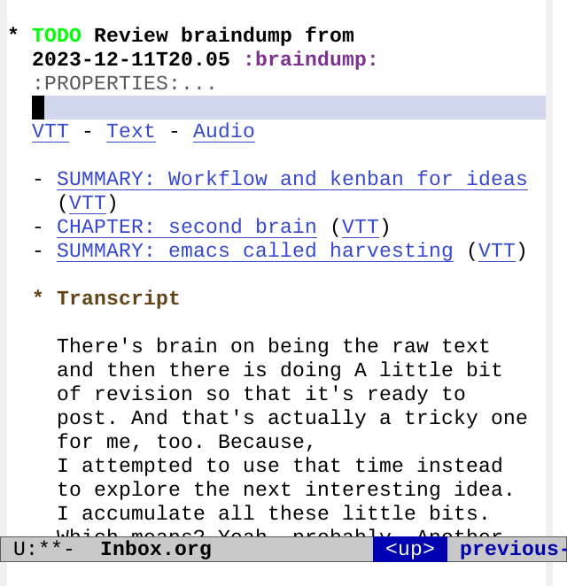

I can jump to the audio if there are misrecognized words.

#+begin_my_details Screenshot of jumping to the audio
#+CAPTION: Following the link to the chapter in the VTT file
#+ATTR_HTML: :style max-height:80vh :data-link t
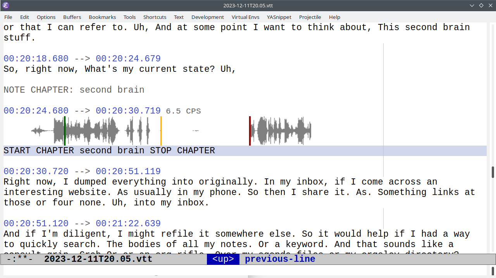
#+end_my_details

I can use subed-waveform to tweak the start and end times. (~subed-waveform-show-current~, then left-clicking to set the start or right-clicking to set the end, or using keybindings to adjust the start/stop).

Someday I'll write code to send sections to a better speech
recognition engine or to AI. In the meantime, this is pretty good.

Here's how the code works:

*** Recognizing keyword phrases
:PROPERTIES:
:CUSTOM_ID: recognizing-keyword-phrases
:END:

There are several things I want to do while dictating.

- I want to mark different topics so that it's easy to find the section where I was talking about something.
- I might want to set tags or priorities, or even schedule something (today, tomorrow, next week, next month).
- I can also use commands to trigger different things, like sending the section to a better speech recognition engine.

By analyzing the text, I might be able to make my own command system.

So far, for starting keywords, I can use "start", "begin", or "open".
I pair that with one of these part keywords:

- "section", "chapter", "topic", "summary": I use these pretty interchangeably at the moment. I want them to make a new Org heading.
- "next steps": could be handy for being able to quickly see what to do next
- "reminder":
- "interruption": don't know what I'll use this for yet, but it might be useful to note this.
- "tag", "keyword": maybe use this to add tags to the current section?

Then the code can extract the text until the matching "stop/close/end
<part>", assuming it happens within 50 words or so.
(~sacha-audio-braindump-close-keyword-distance-words~)

Sometimes keywords get misrecognized. "Begin summary" sometimes
becomes "again summary" or "the game summary". I could try "open" and
"close". Commercial dictation programs like Dragon NaturallySpeaking
use "open" and "close" for punctuation, so that would probably work
fine. "Start" works well, but "end" doesn't because it can confused
with "and".

Sometimes an extra word sneaks in, either because I say it or because
the speech recognition tries too hard to guess. "Begin reminder" ends
up as "Begin a reminder." I changed from using regular expressions
that searched for just start-keyword + part-keyword to one that looked
for the start of the keyword phrase and then looked for the next
keyword within the next X words. (~sacha-audio-braindump-scan-for-part-keyword~)

#+begin_src emacs-lisp :summary "Recognizing phrases" :tangle lisp/sacha-transcribe.el
  (defvar sacha-audio-braindump-open-keywords '("start" "begin" "open"))
  (defvar sacha-audio-braindump-close-keywords '("stop" "end" "close"))
  (defvar sacha-audio-braindump-part-keywords '("summary" "chapter" "topic"
                                                                                                                                                          "section"
                                                                                                                                   "action" "idea" "journal" "reminder"
                                                                                                                                   "command" "interruption" "note"
                                                                                                                                   "next step" "next steps" "tags" "tag" "keywords" "keyword"))

  (defvar sacha-audio-braindump-part-keyword-distance-words 2 "Number of words to scan for part keyword.")
  (defvar sacha-audio-braindump-close-keyword-distance-words 50 "number of words to scan for stop keyword.
  Put the keywords on the same line if found.")
;;;###autoload
  (defun sacha-audio-braindump-scan-for-part-keyword (before-part &optional part-keywords within-distance before-distance)
          "Look for BEFORE-PART followed by PART-KEYWORDS.
  There might be WITHIN-DISTANCE words between BEFORE-PART and PART-KEYWORDS,
  and the pair might be within BEFORE-DISTANCE from point.
  Distances are in words.
  Return (start end before-part part) if found, nil otherwise."
          (setq before-part (pcase before-part
                                                                                          ('start sacha-audio-braindump-open-keywords)
                                                                                          ('stop sacha-audio-braindump-close-keywords)
                                                                                          ('nil (append sacha-audio-braindump-open-keywords sacha-audio-braindump-close-keywords))

                                                                                          (_ before-part)))
          (if (stringp before-part) (setq before-part (list before-part)))
          (setq part-keywords (or part-keywords sacha-audio-braindump-part-keywords))
          (when (stringp part-keywords) (setq part-keywords (list part-keywords)))
          (setq within-distance (or within-distance sacha-audio-braindump-part-keyword-distance-words))
          (setq before-distance (if (eq before-distance t)
                                                                                                                  (point-max)
                                                                                                          (or before-distance sacha-audio-braindump-close-keyword-distance-words)))
          (let (result
                                  start end
                                  (before-point (save-excursion (forward-word before-distance) (point)))
                                  before-word
                                  part-word)
                  (save-excursion
                          (when (looking-at (regexp-opt before-part))
                                  (setq before-word (match-string 0) start (match-beginning 0))
                                  (when (re-search-forward (regexp-opt part-keywords) (save-excursion (forward-word within-distance) (point)) t)
                                          (setq result (list start (match-end 0) before-word (match-string 0)))))
                          (while (and (not result)
                                                                          (re-search-forward (regexp-opt before-part) before-point t))
                                  (setq before-word (match-string 0) start (match-beginning 0))
                                  (when (re-search-forward (regexp-opt part-keywords) (save-excursion (forward-word within-distance) (point)) t)
                                          (setq result (list start (match-end 0) before-word (match-string 0)))))
                          (when result (goto-char (elt result 1)))
                          result)))

  (ert-deftest sacha-audio-braindump-scan-for-part-keyword ()
          (with-temp-buffer
                  (insert "some text start a reminder hello world stop there and do something stop reminder more text")
                  (goto-char (point-min))
                  (let ((result (sacha-audio-braindump-scan-for-part-keyword 'start nil)))
                          (expect (elt result 2) :to-equal "start")
                          (expect (elt result 3) :to-equal "reminder"))
                  (let ((result (sacha-audio-braindump-scan-for-part-keyword 'stop "reminder")))
                          (expect (elt result 2) :to-equal "stop")
                          (expect (elt result 3) :to-equal "reminder"))))
#+end_src

*** Splitting the lines based on keywords and oopses
:PROPERTIES:
:CUSTOM_ID: splitting-the-lines-based-on-keywords-and-oopses
:END:

Now I can use that to scan through the text. I want to put commands on
their own lines so that ~subed-align~ will get the timestamp for that
segment and so that the commands are easier to parse.

I also want to detect "oops" and split things up so that the start of
that line matches my correction after the "oops". I use
[[https://sachachua.com/dotemacs/index.html#split-up-oops-better][sacha-subed-split-oops]] for that, which I should write about in another
post. By putting the oops fragment on its own line, I can use
~subed-align~ to get a timestamp for just that segment. Then I can
either use ~flush-lines~ to get rid of anything with "oops" in it. I
can even remove the subtitle and use ~subed-record-compile-media~ to
compile audio/video without that segment, if I want to use the audio
without rerecording it.

#+begin_example
And the way I can help is by jotting words down in a mind map,
typing her sentences. Oops
typing, her sentences And generating, follow-up questions.
#+end_example

I also all-caps the keyword phrases so that they're easier to see when
skimming the text file.

#+begin_src emacs-lisp :summary "Alignment breaks" :tangle lisp/sacha-transcribe.el
;;;###autoload
  (defun sacha-audio-braindump-prepare-alignment-breaks ()
          "Split lines in preparation for forced alignment with aeneas.

  Split \"oops\" so that it's at the end of the line and the
  previous line starts with roughly the same words as the next
  line, for easier removal.

  Add a linebreak before \"begin/start\" followed by
  `sacha-audio-braindump-part-keywords'.

  Add a linebreak after \"stop\" followed by
  `sacha-audio-braindump-part-keywords'.

  Look for begin keyword ... stop keyword with at most
  `sacha-audio-braindump-part-keyword-distance-words' between them and put them on one
  line. If begin or stop has been misrecognized, try the best guess."
          (interactive)
          (let ((case-fold-search t) result close-result)
                  (sacha-split-oops)
                  ;; break "begin/start keyword"
                  (goto-char (point-min))
                  (while (setq result (sacha-audio-braindump-scan-for-part-keyword 'start nil nil t))
                          (goto-char (car result))
                          (delete-region (car result) (elt result 1))
                          (insert "\n" (upcase (concat (elt result 2) " " (elt result 3))) "\n"))
                  ;; break stop
                  (goto-char (point-min))
                  (while (setq result (sacha-audio-braindump-scan-for-part-keyword 'stop nil nil t))
                          (goto-char (car result))
                          (delete-region (car result) (elt result 1))
                          (insert (upcase (concat (elt result 2) " " (elt result 3))) "\n"))
                  ;; try to get start and end sections on one line
                  (goto-char (point-min))
                  (while (setq result (sacha-audio-braindump-scan-for-part-keyword 'start nil nil t))
                          (goto-char (elt result 1))
                          (setq stop-result (sacha-audio-braindump-scan-for-part-keyword 'stop (elt result 3)))
                          (if stop-result
                                          (progn
                                                  (goto-char (car stop-result))
                                                  (while (re-search-backward " *\n+ *" (car result) t)
                                                          (replace-match " ")))
                                  ;; no stop keyword; is the keyword around? maybe it was just misrecognized
                                  (if (re-search-forward (elt result 3)
                                                                                                                           (save-excursion
                                                                                                                                   (forward-word sacha-audio-braindump-close-keyword-distance-words)
                                                                                                                                   (point))
                                                                                                                           t)
                                                  (save-excursion
                                                          (goto-char (match-beginning 0))
                                                          (save-excursion
                                                                  (insert " STOP "))
                                                          (while (re-search-backward " *\n+ *" (car result) t)
                                                                  (replace-match " ")))
                                          (when (looking-at "\n+ *")
                                                  (replace-match " ")))))
                  ;; Check for stops without starts
                  (goto-char (point-min))
                  (while (setq result (sacha-audio-braindump-scan-for-part-keyword 'stop nil nil t))
                          (goto-char (car result))
                          (save-excursion
                                  (unless (re-search-backward (elt result 3) (line-beginning-position) t)
                                          (when (re-search-backward
                                                                   (elt result 3)
                                                                   (save-excursion (backward-word sacha-audio-braindump-close-keyword-distance-words)
                                                                                                                                   (point))
                                                                   t)
                                                  (replace-match (concat "\nSTART " (elt result 3))))))
                          (goto-char (cadr result)))
                  ;; remove empty lines
                  (goto-char (point-min))
                  (when (looking-at "\n+") (replace-match ""))
                  (while (re-search-forward "\n\n+" nil t)
                          (replace-match "\n"))
                  (goto-char (point-min))
                  (while (re-search-forward " *\n *" nil t)
                          (replace-match "\n"))))

  (ert-deftest sacha-audio-braindump-prepare-alignment-breaks ()
          (with-temp-buffer
                  (insert "some text start a reminder hello world stop there and do something stop reminder more text")
                  (goto-char (point-min))
                  (sacha-audio-braindump-prepare-alignment-breaks)
                  (expect (buffer-string) :to-equal
                                                  "some text
  START REMINDER hello world stop there and do something STOP REMINDER
  more text")))
#+end_src

*** Preparing the VTT subtitles
:PROPERTIES:
:CUSTOM_ID: preparing-the-vtt-subtitles
:END:

~subed-align~ gives me a VTT subtitle file with timestamps and text. I
add NOTE comments with the keywords and make ~subed:~ links to the
timestamps using the ~ol-subed.el~ that I just added.

#+begin_src emacs-lisp :summary "Putting keyword phrases in comments" :tangle lisp/sacha-transcribe.el
;;;###autoload
  (defun sacha-audio-braindump-get-subtitle-note-based-on-keywords (sub-text)
          (let ((case-fold-search t))
                  (when (string-match (concat "^"
                                                                                                                                  (regexp-opt sacha-audio-braindump-open-keywords)
                                                                                                                                  " \\(" (regexp-opt sacha-audio-braindump-part-keywords) "\\) \\(.+?\\)\\( "
                                                                                                                                  (regexp-opt sacha-audio-braindump-close-keywords) " "
                                                                                                                                  (regexp-opt sacha-audio-braindump-part-keywords) "\\)?$")
                                                                                                  sub-text)
                          (concat (match-string 1 sub-text) ": " (match-string 2 sub-text)))))
  (ert-deftest sacha-audio-braindump-get-subtitle-note-based-on-keywords ()
          (expect (sacha-audio-braindump-get-subtitle-note-based-on-keywords "BEGIN NEXT STEPS . Think about how dictation helps me practice slower speed. CLOSE NEXT STEPS")
                                          :to-equal "NEXT STEPS: . Think about how dictation helps me practice slower speed.")
          (expect (sacha-audio-braindump-get-subtitle-note-based-on-keywords "START SUMMARY hello world STOP SUMMARY")
                                          :to-equal "SUMMARY: hello world")
          (expect (sacha-audio-braindump-get-subtitle-note-based-on-keywords "START CHAPTER hello world again")
                                          :to-equal "CHAPTER: hello world again")
          )
#+end_src

*** Formatting the subtitles into Org Mode subtrees
:PROPERTIES:
:CUSTOM_ID: formatting-the-subtitles-into-org-mode-subtrees
:END:

The last step is to take the list of subtitles and format it into the subtree.

#+begin_src emacs-lisp :summary "Formatting the subtree" :tangle lisp/sacha-transcribe.el
;; todo: sort the completion? https://emacs.stackexchange.com/questions/55502/list-files-in-directory-in-reverse-order-of-date
;;
;;;###autoload
(defun sacha-audio-braindump-insert-subtitles-as-org-tree (vtt-filename)
  (interactive (list (read-file-name "VTT: " (expand-file-name "./" sacha-phone-recording-dir) nil t nil
                                     (lambda (s) (string-match "\\.vtt$" s)))))
  (let* ((subtitles
          (mapcar (lambda (sub)
                    (unless (elt sub 4)
                      (setf (elt sub 4)
                            (sacha-audio-braindump-get-subtitle-note-based-on-keywords (elt sub 3))))
                    sub)
                  (subed-parse-file vtt-filename)))
         (start-date (sacha-audio-braindump-get-file-start-time vtt-filename))
         chapters tags
         start-of-entry)
    (setq start-of-entry (point))
    (insert (format "* TODO Review braindump from %s  :braindump:\n\n" (file-name-base vtt-filename)))
    (org-entry-put (point) "CREATED"
                   (concat "[" (format-time-string
                                (cdr org-timestamp-formats)
                                (sacha-audio-braindump-get-file-start-time
                                 (file-name-nondirectory vtt-filename))) "]"))
    (insert
     (format "%s - %s - %s\n"
             (org-link-make-string (concat "file:" (file-name-sans-extension vtt-filename) ".vtt")
                                   "VTT")
             (org-link-make-string (concat "file:" (file-name-sans-extension vtt-filename) ".txt")
                                   "Text")
             (org-link-make-string (concat "file:" (file-name-sans-extension vtt-filename) ".m4a")
                                   "Audio")))
    (save-excursion
      (insert "** Transcript\n")
      ;; add each subtitle; add an ID in case we change the title
      (mapc
       (lambda (sub)
         (when (elt sub 4)
           (let ((note (sacha-audio-braindump-get-subtitle-note-based-on-keywords (elt sub 3))))
             (insert (concat "*** "
                             note " "
                             (org-link-make-string
                              (format "subed:%s::%s"
                                      vtt-filename
                                      (sacha-msecs-to-timestamp (elt sub 1)))
                              "VTT")
                             "\n\n"))
             (org-entry-put (point) "CREATED"
                            (concat "[" (format-time-string
                                         (cdr org-timestamp-formats)
                                         (time-add start-date
                                                   (seconds-to-time (/ (elt sub 1) 1000.0)))) "]"))
             (org-entry-put (point) "START" (sacha-msecs-to-timestamp (elt sub 2)))
             (when (elt sub 4)
               (when (string-match "command: .*recognize" (elt sub 4))
                 (save-excursion
                   ;; TODO: scope this to just the section someday
                   (goto-char start-of-entry)
                   (org-set-tags (append (list "recognize") (org-get-tags)))))
               (when (string-match "command: .*outline" (elt sub 4))
                 (save-excursion
                   (goto-char start-of-entry)
                   (org-set-tags (append (list "outline") (org-get-tags)))))
               (when (string-match "^time" (elt sub 4))
                 (insert "[" (org-format-time-string (cdr org-timestamp-formats)
                                                     (time-add start-date (seconds-to-time (/ (elt sub 1) 1000))))
                         "]\n"))
               (when (string-match "command: .+\\(high\\|low\\)" (elt sub 4))
                 (save-excursion
                   (goto-char start-of-entry)
                   (org-priority (if (string= (downcase (match-string 1)) "high") ?A ?C))))
               (when (string-match "\\(?:tags?\\|keywords?\\): \\(.+\\)" (elt sub 4))
                 (save-excursion
                   (goto-char start-of-entry)
                   (org-set-tags (append (split-string (match-string 1) " ") (org-get-tags))))))
             (add-to-list 'chapters
                          (format "- %s (%s)"
                                  (org-link-make-string (concat "id:" (org-id-get-create))
                                                        note)
                                  (org-link-make-string
                                   (format "subed:%s::%s"
                                           vtt-filename
                                           (sacha-msecs-to-timestamp (elt sub 1)))
                                   "VTT")))))
         (insert (elt sub 3) "\n"))
       subtitles))
    (when chapters
      (insert (string-join (nreverse chapters) "\n") "\n"))))
#+end_src

#+begin_src emacs-lisp :summary "Formatting the subtree" :tangle lisp/sacha-misc.el
;;;###autoload
(defun sacha-file-start-time (filename &optional base-date)
  "Return the local time based on FILENAME."
  (setq filename (file-name-base filename))
  (cond
   ((string-match "^\\([0-9][0-9][0-9][0-9]-[0-9][0-9]-[0-9][0-9]\\)[-T]\\([0-9][0-9][\\.-][0-9][0-9]\\(?:[\\.-][0-9][0-9]\\)?\\)" filename)
    (date-to-time (concat (match-string 1 filename) "T"
                          (replace-regexp-in-string "[\\.-]" ":" (match-string 2 filename)))))
   ((string-match "^\\(?:Copy of \\)?\\([^ ][^ ][^ ]\\)[^ ]+ at \\([0-9]+\\)-\\([0-9]+\\)" filename)
    (let* ((day (match-string 1 filename))
           (hour (match-string 2 filename))
           (min (match-string 3 filename))
           (changed-time (or base-date (file-attribute-modification-time
                                        (file-attributes filename))))
           (decoded-time (decode-time changed-time)))
      ;; get the day on or before changed-time
      (if (string= (format-time-string "%a" changed-time) day)
          (encode-time (append
                        (list
                         0
                         (string-to-number min)
                         (string-to-number hour))
                        (seq-drop decoded-time 3)))
        ;; synchronized maybe within the week after
        (let ((org-read-date-prefer-future nil))
          (org-read-date t t
                         (concat "--" day " " hour ":" min)
                         nil changed-time)))))))

(ert-deftest sacha-file-start-time ()
  (should
   (equal (format-time-string "%Y-%m-%d %H:%M:%S"
                              (sacha-file-start-time "2024-01-05-09-46-59.flv"))
          "2024-01-05 09:46:59"))
  (should
   (equal (format-time-string "%Y-%m-%d %H:%M:%S"
                              (sacha-file-start-time "2024-01-08T12.49.vtt"))
          "2024-01-08 12:49:00"))
  (should
   (equal (format-time-string "%Y-%m-%d %H:%M:%S"
                              (sacha-file-start-time "Sunday at 15-30.vtt"
                                                  (date-to-time "2023-01-12")))
          "2023-01-08 15:30:00"))
  (should
   (time-equal-p (sacha-file-start-time "Sunday at 12-49.txt")
                 (org-read-date t t "-sun 12:49"))))
#+end_src

#+begin_src emacs-lisp :tangle lisp/sacha-transcribe.el
(defalias 'sacha-audio-braindump-get-file-start-time #'sacha-file-start-time)
#+end_src
*** Process a single transcript from the raw text file
:PROPERTIES:
:CUSTOM_ID: process-a-single-transcript-from-the-raw-text-file
:END:

So now we put that all together: rename the file using the calculated
start time, prepare the alignment breaks, align the file to get the
timestamps, and add the subtree to an Org file.

#+begin_src emacs-lisp :summary "Making the TODO" :tangle lisp/sacha-transcribe.el
  (defvar sacha-audio-braindump-file "~/sync/orgzly/braindump.org")

;;;###autoload
  (defun sacha-audio-braindump-make-todo (text-file &optional force)
          "Add TEXT-FILE as a TODO."
          (interactive (list (buffer-file-name) current-prefix-arg))
          ;; rename the files to use the timestamps
          (unless (string-match "^[0-9][0-9][0-9][0-9]-[0-9][0-9]-[0-9][0-9]"
                                                                                                  (file-name-base text-file))
                  (setq text-file (sacha-audio-braindump-rename-files-based-on-time text-file)))
          (let* ((recording (concat (file-name-sans-extension text-file) ".m4a"))
                                   (start (sacha-audio-braindump-get-file-start-time text-file))
                                   (vtt (concat (file-name-sans-extension text-file) ".vtt"))
                                   chapters
                                   (title (concat "Review braindump " text-file))
                                   existing)
                  ;; check if already exists
                  (with-current-buffer (find-file-noselect sacha-audio-braindump-file)
                          (save-excursion
                                  (goto-char (point-min))
                                  (setq existing (org-find-exact-headline-in-buffer title))))
                  (if (and existing (not force))
                                  (progn
                                          (message "Going to existing heading")
                                          (org-goto-marker-or-bmk existing))
                          (if (or (null sacha-audio-braindump-last-processed-time)
                                                          (time-less-p sacha-audio-braindump-last-processed-time start))
                                          (customize-save-variable 'sacha-audio-braindump-last-processed-time start))
                          (find-file text-file)
                          (sacha-audio-braindump-prepare-alignment-breaks)
                          (save-buffer)
                          (when (file-exists-p vtt) (delete-file vtt))
                          (when (get-file-buffer vtt) (kill-buffer (get-file-buffer vtt)))
                          (subed-align recording text-file "VTT")
                          (when (get-file-buffer vtt) (kill-buffer (get-file-buffer vtt)))
                          (find-file sacha-audio-braindump-file)
                          (goto-char (point-min))
                          (if existing
                                          (progn
                                                  (org-goto-marker-or-bmk existing)
                                                  (delete-region (point) (org-end-of-subtree)))
                                  (org-next-visible-heading 1))
                          (sacha-audio-braindump-insert-subtitles-as-org-tree vtt))))
#+end_src
*** Process multiple files
:PROPERTIES:
:CUSTOM_ID: process-multiple-files
:END:

I want to process multiple files in one batch.

#+begin_src emacs-lisp :tangle lisp/sacha-transcribe.el
;;;###autoload
  (defun sacha-audio-braindump-process (files &optional force)
          (interactive (list (cond
                                                                                          ((and (derived-mode-p 'dired-mode)
                                                                                                                  (dired-get-marked-files))
                                                                                           (dired-get-marked-files))
                                                                                          ((derived-mode-p 'dired-mode)
                                                                                           (list (dired-get-filename)))
                                                                                          ((string-match "\\.txt$" (buffer-file-name))
                                                                                           (list (buffer-file-name)))
                                                                                          (t (read-file-name "Transcript: ")))
                                                                                   current-prefix-arg))
          (mapc (lambda (f)
                                          (when (string-match "txt" f)
                                                  (sacha-audio-braindump-make-todo f force))) files))
#+end_src

It would be nice to have it automatically keep track of the latest one
that's been processed, maybe via ~customize-save-variable~. This still
needs some tinkering with.

#+begin_src emacs-lisp :summary "Processing new files" :tangle lisp/sacha-transcribe.el
  (defcustom sacha-audio-braindump-last-processed-time nil
          "The timestamp of the last processed transcript."
          :group 'sacha
          :type '(repeat integer))

;;;###autoload
  (defun sacha-audio-braindump-process-since-last ()
          (interactive)
          (let ((files
                                   (seq-filter
                                          (lambda (f)
                                                  (or (null sacha-audio-braindump-last-processed-time)
                                                                  (time-less-p sacha-audio-braindump-last-processed-time
                                                                                                                   (sacha-audio-braindump-get-file-start-time f))))
                                          (directory-files sacha-phone-recording-dir 'full " at [0-9][0-9]-[0-9][0-9]\\.txt\\|^[0-9][0-9][0-9][0-9]-[0-9][0-9]-[0-9][0-9]T[0-9][0-9]\\.[0-9][0-9]\\.txt"))))
                  (mapc (lambda (f)
                                                  (sacha-audio-braindump-make-todo f)
                                                  (let ((start (sacha-audio-braindump-get-file-start-time f)))
                                                          (if (time-less-p sacha-audio-braindump-last-processed-time start)
                                                                          (setq sacha-audio-braindump-last-processed-time start))))
                                          files))
          (customize-save-variable 'sacha-audio-braindump-last-processed-time sacha-audio-braindump-last-processed-time))

;;;###autoload
  (defun sacha-audio-braindump-new-filename (text-file &optional base-date)
          (if (string-match "^[0-9][0-9][0-9][0-9]" text-file)
                          text-file			; no change, already uses date
                  (let* ((base (file-name-base text-file))
                                           (start (sacha-audio-braindump-get-file-start-time base base-date))
                                           (rest (if (string-match "^\\([-0-9T\\.]+\\|\\(?:.+? at [0-9][0-9]-[0-9][0-9]\\)\\)\\( .+\\)" base)
                                                                                   (match-string 2 base)
                                                                           ""))
                                           (new-base (format-time-string "%Y-%m-%dT%H.%M" start)))
                          (concat new-base rest "." (file-name-extension text-file)))))

  (ert-deftest sacha-audio-braindump-new-filename ()
   (should
          (equal (sacha-audio-braindump-new-filename "Wednesday at 18-58.txt" (date-to-time "2023-01-01"))
                                   "2022-12-28T18.58.txt"))
   (should
          (equal (sacha-audio-braindump-new-filename "Wednesday at 18-58 extra text.txt" (date-to-time "2023-01-01"))
                                   "2022-12-28T18.58 extra text.txt")))

;;;###autoload
  (defun sacha-audio-braindump-rename-files-based-on-time (text-file)
          "Rename TEXT-FILE based on date. Return the new text file."
          (interactive (list (if (derived-mode-p 'dired-mode) (dired-get-filename)
                                                                                           (buffer-file-name))))
          (if (string-match "^[0-9][0-9][0-9][0-9]" text-file)
                          text-file			; no change, already uses date
                  (let ((new-name (sacha-audio-braindump-new-filename (file-name-nondirectory text-file))))
                          (if (file-exists-p (expand-file-name new-name
                                                                                                                                                                           (file-name-directory text-file)))
                                          (error "%s already exists" new-base)
                                  (dolist (ext '(".txt" ".m4a" ".vtt"))
                                          (if (file-exists-p (concat (file-name-sans-extension text-file) ext))
                                                          (rename-file (concat (file-name-sans-extension text-file) ext)
                                                                                                           (expand-file-name (concat (file-name-sans-extension new-name) ext)
                                                                                                                                                                                   (file-name-directory text-file)))))
                                  (expand-file-name new-name
                                                                                                          (file-name-directory text-file))))))
#+end_src
*** Ideas for next steps
:PROPERTIES:
:CUSTOM_ID: ideas-for-next-steps
:END:

- Make the commands process things even more automatically.
- Experiment with just sending everything to OpenAI Whisper instead of conditionally sending it based on the keywords (which might not be recognized).
- See if I want to reuse more sentences or move them around.
- Find out where people who have thought about dictation keywords have their notes; probably don't have to reinvent the wheel here


** DONE Updating my audio braindump workflow to take advantage of WhisperX :speechtotext:org:
CLOSED: [2024-11-19 Tue 09:08] SCHEDULED: <2024-11-19 Tue>
:PROPERTIES:
:CREATED: [2024-11-17 Sun 08:24]
:EXPORT_DATE: 2024-11-19T08:33:59-0500
:EXPORT_ELEVENTY_PERMALINK: /blog/2024/11/updating-sacha-audio-braindump-workflow-to-take-advantage-of-whisperx/
:EXPORT_ELEVENTY_FILE_NAME: blog/2024/11/updating-sacha-audio-braindump-workflow-to-take-advantage-of-whisperx/
:CUSTOM_ID: writing-and-editing-updating-sacha-audio-braindump-workflow-to-take-advantage-of-whisperx
:END:
:LOGBOOK:
- State "DONE"       from              [2024-11-19 Tue 09:08]
:END:

I get word timestamps for free when I transcribe
with [[https://github.com/m-bain/whisperX][WhisperX]], so I can skip the Aeneas alignment
step. That means I can update my [[https://sachachua.com/blog/2023/12/audio-braindump-workflow-tweaks-adding-org-mode-hyperlinks-to-recordings-based-on-keywords/][previous code for
handling audio braindumps]] . Breaking the transcript up into sections  Also, I recently
updated [[subed:subed-word-data.el][subed-word-data]] to [[https://sachachua.com/blog/2024/11/yay-emacs-7-using-word-timing-in-caption-editing-with-subed-word-data/][colour words based on
their transcription score]], which draws my
attention to things that might be uncertain.

Here's what it looks like when I have the post,
the transcript, and the annotated PDF.

#+CAPTION: Screenshot of draft, transcript, and PDF
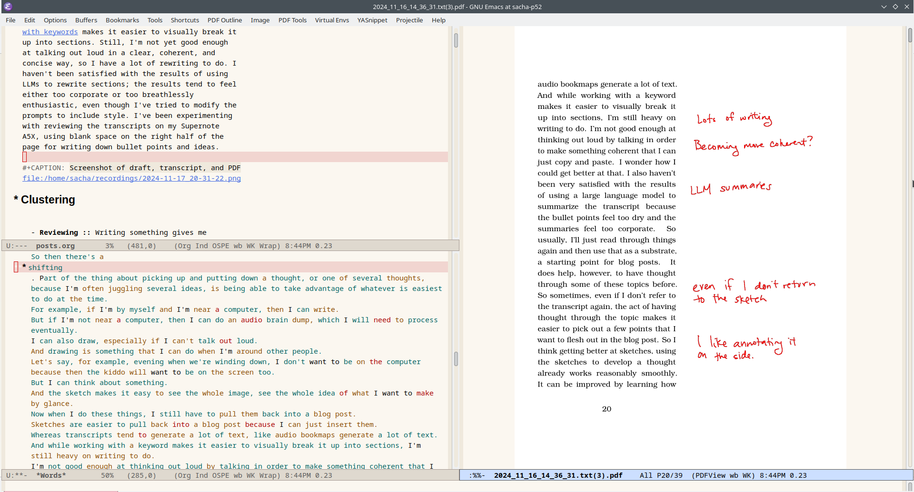

Here's what I needed to implement ~sacha-audio-braindump-from-whisperx-json~ (plus some code from  [[https://sachachua.com/blog/2023/12/audio-braindump-workflow-tweaks-adding-org-mode-hyperlinks-to-recordings-based-on-keywords/][my previous audio braindump workflow]]):

#+begin_src emacs-lisp :tangle lisp/sacha-transcribe.el
;;;###autoload
  (defun sacha-whisperx-word-list (file)
          (let* ((json-object-type 'alist)
                                   (jmson-array-type 'list))
                  (seq-mapcat (lambda (seg)
                                                                          (alist-get 'words seg))
                                                                  (alist-get 'segments (json-read-file file)))))

  ;; (seq-take (sacha-whisperx-word-list (sacha-latest-file "~/sync/recordings" "\\.json")) 10)
;;;###autoload
  (defun sacha-whisperx-insert-word-list (words)
          "Inserts WORDS with text properties."
          (require 'subed-word-data)
          (mapc (lambda (word)
                                                  (let ((start (point)))
                                                          (insert
                                                           (alist-get 'word word))
                                                          (subed-word-data--add-word-properties start (point) word)
                                                          (insert " ")))
                                  words))

;;;###autoload
  (defun sacha-audio-braindump-turn-sections-into-headings ()
          (interactive)
          (goto-char (point-min))
          (while (re-search-forward "START SECTION \\(.+?\\) STOP SECTION" nil t)
                  (replace-match
                   (save-match-data
                           (format
                                  "\n*** %s\n"
                                  (save-match-data (string-trim (replace-regexp-in-string "^[,\\.]\\|[,\\.]$" "" (match-string 1))))))
                   nil t)
                  (let ((prop-match (save-excursion (text-property-search-forward 'subed-word-data-start))))
                          (when prop-match
                                  (org-entry-put (point) "START" (format-seconds "%02h:%02m:%02s" (prop-match-value prop-match)))))))

;;;###autoload
  (defun sacha-audio-braindump-split-sentences ()
          (interactive)
          (goto-char (point-min))
          (while (re-search-forward "[a-z]\\. " nil t)
                  (replace-match (concat (string-trim (match-string 0)) "\n") )))

;;;###autoload
  (defun sacha-audio-braindump-restructure ()
          (interactive)
          (goto-char (point-min))
          (sacha-subed-fix-common-errors)
          (org-mode)
          (sacha-audio-braindump-prepare-alignment-breaks)
          (sacha-audio-braindump-turn-sections-into-headings)
          (sacha-audio-braindump-split-sentences)
          (goto-char (point-min))
          (sacha-remove-filler-words-at-start))

;;;###autoload
  (defun sacha-audio-braindump-from-whisperx-json (file)
          (interactive (list (read-file-name "JSON: " "~/sync/recordings/" nil nil nil (lambda (f) (string-match "\\.json\\'" f)))))
          ;; put them all into a buffer
          (with-current-buffer (get-buffer-create "*Words*")
                  (erase-buffer)
                  (fundamental-mode)
                  (sacha-whisperx-insert-word-list (sacha-whisperx-word-list file))
                  (sacha-audio-braindump-restructure)
                  (goto-char (point-min))
                  (switch-to-buffer (current-buffer))))

;;;###autoload
  (defun sacha-audio-braindump-process-text (file)
          (interactive (list (read-file-name "Text: " "~/sync/recordings/" nil nil nil (lambda (f) (string-match "\\.txt\\'" f)))))
          (with-current-buffer (find-file-noselect file)
                  (sacha-audio-braindump-restructure)
                  (save-buffer)))
  ;; (sacha-audio-braindump-from-whisperx-json (sacha-latest-file "~/sync/recordings" "\\.json"))
#+end_src

Ideas for next steps:

- I can change my processing script to split up the Whisper TXT into sections and automatically make the PDF with nice sections.
- I can add reminders and other callouts. I can style them, and I can copy reminders into a different section for easier processing.
- I can look into extracting PDF annotations so that I can jump to the next highlight or copy highlighted text.

** Markdown
:PROPERTIES:
:CUSTOM_ID: markdown
:END:
#+begin_src emacs-lisp
  (use-package markdown-mode
    :if sacha-laptop-p
    :mode ("\\.\\(njk\\|md\\)\\'" . markdown-mode))
#+end_src
** Screenshot
:PROPERTIES:
:CUSTOM_ID: screenshot
:END:

Based on https://www.reddit.com/r/emacs/comments/idz35e/emacs_27_can_take_svg_screenshots_of_itself/
#+begin_src emacs-lisp :tangle lisp/sacha-image.el
(defvar sacha-screenshot-hook nil "Functions to run after a screenshot. Called with the filename as the arg.")

;;;###autoload
(defun sacha-screenshot (&optional filename current-screen caption)
  "Save a screenshot of the current frame as an SVG image.
Saves to a temp file and puts the filename in the kill ring.
Prompt for a caption afterwards."
  (interactive (list nil t))
  (if current-screen
      (setq filename (sacha-screenshot-current-screen filename))
    (setq filename (or filename
                       (expand-file-name
                        (format-time-string "%Y-%m-%d-%H-%M-%S.svg")
                        sacha-recordings-dir)))
    (with-temp-file filename
      (insert (x-export-frames nil 'svg))))
  (when (called-interactively-p 'any)
    (unless caption
      (save-window-excursion
        (with-current-buffer (find-file-noselect filename) (display-buffer (current-buffer)))
        (setq caption (read-string "Caption: "))))
    (when (and caption (not (string= caption "")))
      (let ((new-filename (concat
                           (file-name-sans-extension filename)
                           " " caption
                           "." (file-name-extension filename))))
        (rename-file filename new-filename t)
        (setq filename new-filename)))
    (kill-new filename)
    (message filename))
  (run-hook-with-args 'sacha-screenshot-hook filename)
  filename)

;;;###autoload
(defun sacha-screenshot-current-screen (&optional filename)
  (interactive)
  (let ((new-file
         (or filename
             (expand-file-name
              (format-time-string "%Y-%m-%d-%H-%M-%S.png")
              sacha-recordings-dir))))
    (call-process
     "spectacle"
     nil nil nil
      "-b" "-m" "-n" "-o" new-file)
    new-file))
(defun sacha-save-screenshot (filename)
  (org-capture-string filename "S"))
#+end_src

#+begin_src emacs-lisp
(add-hook 'sacha-screenshot-hook 'sacha-save-screenshot)
(keymap-global-set "C-c s" #'sacha-screenshot)
(keymap-global-set "s-s" #'sacha-screenshot)
#+end_src

** Avoiding weasel words
:PROPERTIES:
:CUSTOM_ID: avoiding-weasel-words
:END:
#+BEGIN_SRC emacs-lisp
  (use-package artbollocks-mode
    :if sacha-laptop-p
    :defer t
    :load-path  "~/elisp/artbollocks-mode"
    :config
    (progn
      (setq artbollocks-weasel-words-regex
            (concat "\\b" (regexp-opt
                           '("one of the"
                             "should"
                             "just"
                             "sort of"
                             "a lot"
                             "probably"
                             "maybe"
                             "perhaps"
                             "I think"
                             "really"
                             "pretty"
                             "nice"
                             "action"
                             "utilize"
                             "leverage") t) "\\b"))
      ;; Don't show the art critic words, or at least until I figure
      ;; out my own jargon
      (setq artbollocks-jargon nil)))
#+END_SRC
** Emacs: Cycle through different paragraph formats: all on one line, wrapped, max one sentence per line, one sentence per line
:PROPERTIES:
:CUSTOM_ID: unfill-paragraph
:CREATED:  [2025-09-22 Mon 10:49]
:EXPORT_DATE: 2025-09-22T10:58:21-0400
:EXPORT_ELEVENTY_PERMALINK: /blog/2025/09/emacs-cycle-through-different-paragraph-formats-all-on-one-line-wrapped-max-one-sentence-per-line-one-sentence-per-line/
:EXPORT_ELEVENTY_FILE_NAME: blog/2025/09/emacs-cycle-through-different-paragraph-formats-all-on-one-line-wrapped-max-one-sentence-per-line-one-sentence-per-line/
:EXPORT_MASTODON: https://social.sachachua.com/@sacha/statuses/01K5S0MCXC3084BA8TF56JSAAY
:EXPORT_MODIFIED: 2025-09-30T13:54:53-0400
:END:
:LOGBOOK:
- Note taken on [2025-09-22 Mon 10:49] \\
  test
:END:

#+begin_update
[2025-09-30]: Add ~move-to-left-margin~ to work around bug when using ~fill-paragraph-semlf~ at the end of a paragraph.
#+end_update

I came across [[https://schauderbasis.de/posts/reformat_paragraph/][Schauderbasis - reformat paragraph]] via [[https://mastodon.social/@EFLS/115213084454613209][@EFLS@mastodon.social]]. Now I want ~M-q~ to cycle through different ways of wrapping text:
- all on one line
- at most one sentence per line (don't even try to keep it within ~fill-column~).
- at most one sentence per line (although still wrapping at ~fill-column~)
- according to ~fill-column~

[[video:https://sachachua.com/blog/2025/09/emacs-cycle-through-different-paragraph-formats-all-on-one-line-wrapped-max-one-sentence-per-line-one-sentence-per-line/sacha-reformat-paragraph-or-region.webm?caption=Screencast cycling through different paragraph formats]]

Now that [[https://cgit.git.savannah.gnu.org/cgit/emacs.git/commit?id=1682a6b606097d24050efc318f74d738c3881fb4][semantic linefeeds are part of core Emacs]] (as of 2025-06-14), the code for cycling through different paragraph formats can be pretty short. Most of it is actually just the logic for cycling through different commands. That might come in handy elsewhere. There's an [[package:unfill][unfill]] package as well, but since the code for unfilling a paragraph is very simple, I'll just include that part.

Note that ~fill-paragraph-semlf~ pays attention to ~sentence-end-double-space~, and it doesn't handle comments yet. I also have some code to check if I'm in a comment and skip those filling methods if needed.

This might encourage me to write shorter sentences.
I can move sentences around with ~M-Shift-up~ and ~M-Shift-down~ in Org Mode, which is pretty handy.
Also, one sentence per line makes diffs easier to read.
But wrapped text is annoying to edit in Orgzly Revived on my phone, because the wrapping makes a very ragged edge on a narrow screen.
I might unwrap things that I want to edit there.
With a little bit of tweaking to skip source blocks, I can narrow to the subtree, select my whole buffer, and cycle the formatting however I like.

#+BEGIN_SRC emacs-lisp :tangle lisp/sacha-writing.el
  (defvar sacha-repeat-counter '()
    "How often `sacha-repeat-next' was called in a row using the same command.
  This is an alist of (cat count list) so we can use it for different functions.")

;;;###autoload
  (defun sacha-unfill-paragraph ()
    "Replace newline chars in current paragraph by single spaces.
  This command does the inverse of `fill-paragraph'."
    (interactive)
    (let ((fill-column most-positive-fixnum))
      (fill-paragraph)))

;;;###autoload
  (defun sacha-fill-paragraph-semlf-long ()
          (interactive)
          (let ((fill-column most-positive-fixnum))
                  (fill-paragraph-semlf)))

;;;###autoload
  (defun sacha-repeat-next (category &optional element-list reset)
          "Return the next element for CATEGORY.
  Initialize with ELEMENT-LIST if this is the first time."
          (let* ((counter
                                          (or (assoc category sacha-repeat-counter)
                                                          (progn
                                                                  (push (list category -1 element-list)
                                                                                          sacha-repeat-counter)
                                                                  (assoc category sacha-repeat-counter)))))
                  (setf (elt (cdr counter) 0)
                                          (mod
                                           (if reset 0 (1+ (elt (cdr counter) 0)))
                                           (length (elt (cdr counter) 1))))
                  (elt (elt (cdr counter) 1) (elt (cdr counter) 0))))

;;;###autoload
  (defun sacha-in-prefixed-comment-p ()
    (or (member 'font-lock-comment-delimiter-face (face-at-point nil t))
                          (member 'font-lock-comment-face (face-at-point nil t))
                          (save-excursion
                                  (beginning-of-line)
                                  (comment-search-forward (line-end-position) t))))

  ;; It might be nice to figure out what state we're
  ;; in and then cycle to the next one if we're just
  ;; working with a single paragraph. In the
  ;; meantime, just going by repeats is fine.
;;;###autoload
  (defun sacha-reformat-paragraph-or-region ()
    "Cycles the paragraph between three states: filled/unfilled/fill-sentences.
  If a region is selected, handle all paragraphs within that region."
    (interactive)
          (let ((func (sacha-repeat-next 'sacha-reformat-paragraph
                                                                                                                          '(sacha-fill-paragraph-semlf-long
                                  fill-paragraph-semlf
                                  fill-paragraph
                                  sacha-unfill-paragraph)
                                                                                                                          (not (eq this-command last-command))))
                                  (deactivate-mark nil))
                  (if (region-active-p)
                                  (save-restriction
                                          (save-excursion
                                                  (narrow-to-region (region-beginning) (region-end))
                                                  (goto-char (point-min))
                                                  (while (not (eobp))
                                                          (skip-syntax-forward " ")
                                                          (let ((elem (and (derived-mode-p 'org-mode)
                                                                                                                           (org-element-context))))
                                                                  (cond
                                                                   ((eq (org-element-type elem) 'headline)
                                                                          (org-forward-paragraph))
                                                                   ((member (org-element-type elem)
                                                                                                          '(src-block export-block headline property-drawer))
                                                                          (goto-char
                                                                           (org-element-end (org-element-context))))
                                                                   (t
                                                                          (funcall func)
                                                                          (if fill-forward-paragraph-function
                                                                                          (funcall fill-forward-paragraph-function)
                                                                                  (forward-paragraph))))))))
                          (save-excursion
                                  (move-to-left-margin)
                                  (funcall func)))))

  (keymap-global-set "M-q" #'sacha-reformat-paragraph-or-region)
#+END_SRC

Sometimes I use [[https://github.com/joostkremers/writeroom-mode][writeroom-mode]] to make the lines look even narrower, with lots of margin on the side.

Related:

- [[https://chrismaiorana.com/one-sentence-per-line/][Text Editor Judo: One Sentence Per Line - The Daily Macro]] - in Org Mode, one sentence pe line lets you drag sentences around with M-Shift-up and M-Shift-down
- [[https://sive.rs/1s][Writing one sentence per line | Derek Sivers]] ([[https://news.ycombinator.com/item?id=31808093][HN]])
- [[https://rhodesmill.org/brandon/2012/one-sentence-per-line/][Semantic Linefeeds]]
- [[https://lists.gnu.org/archive/html/emacs-devel/2025-03/msg00035.html][Fill paragraph using semantic linefeeds]]
** Visual line
:PROPERTIES:
:CUSTOM_ID: writing-and-editing-visual-line
:END:

#+begin_src emacs-lisp
  (global-visual-line-mode)
  (add-hook 'minibuffer-mode-hook (lambda () (visual-line-mode -1)))
#+end_src
** Unicode
:PROPERTIES:
:CUSTOM_ID: unicode
:END:

#+BEGIN_SRC emacs-lisp
  (defmacro sacha-insert-unicode (unicode-name)
    `(lambda () (interactive)
       (insert-char (cdr (assoc-string ,unicode-name (ucs-names))))))
  (keymap-global-set "C-x 8 s" (sacha-insert-unicode "ZERO WIDTH SPACE"))
  (keymap-global-set "C-x 8 S" (sacha-insert-unicode "SNOWMAN"))
#+END_SRC

** Clean up spaces
:PROPERTIES:
:CUSTOM_ID: clean-up-spaces
:END:

#+BEGIN_SRC emacs-lisp
  (keymap-global-set "M-SPC" 'cycle-spacing)
#+END_SRC

** Expand
:PROPERTIES:
:CUSTOM_ID: expand
:END:

#+BEGIN_SRC emacs-lisp
  (setq save-abbrevs 'silently)
  (keymap-global-set "M-/" 'hippie-expand)
#+END_SRC

From https://github.com/purcell/emacs.d/blob/master/lisp/init-auto-complete.el - Exclude very large buffers from dabbrev
#+BEGIN_SRC emacs-lisp :tangle lisp/sacha-complete.el
;;;###autoload
  (defun sanityinc/dabbrev-friend-buffer (other-buffer)
    (< (buffer-size other-buffer) (* 1 1024 1024)))
  (setq dabbrev-friend-buffer-function 'sanityinc/dabbrev-friend-buffer)
#+END_SRC

#+BEGIN_SRC emacs-lisp
  (setq hippie-expand-try-functions-list
        '(yas-hippie-try-expand
          try-expand-all-abbrevs
          try-complete-file-name-partially
          try-complete-file-name
          try-expand-dabbrev
          try-expand-dabbrev-from-kill
          try-expand-dabbrev-all-buffers
          try-expand-list
          try-expand-line
          try-complete-lisp-symbol-partially
          try-complete-lisp-symbol))
#+end_src
** Write about keybindings
:PROPERTIES:
:CUSTOM_ID: write-about-keybindings
:END:

#+begin_src emacs-lisp :tangle lisp/sacha-org.el
  ;; hmm, doesn't quite work for looking things up yet. I basically want a programmatic where-is for a specific keymap
  (defvar sacha-keybinding-maps '(subed-mode-map subed-waveform-minor-mode-map subed-waveform-svg-map))
;;;###autoload
  (defun sacha-copy-keybinding (symbol)
          (interactive (list (find-function-read)))
          (when (listp symbol)
                  (setq symbol (car symbol)))
          (let (result keys)
                  (map-keymap
                   (lambda (event def)
                           (cond ((and (symbolp def))
                                                          (push (list def event) result))
                                                   ((and (listp def) (eq 'keymap (car def)))
                                                          (apply 'append
                                                                                   (map-keymap
                                                                                          (lambda (event def)
                                                                                                  (when (and (symbolp def))
                                                                                                          (push (list def event) result)))
                                                                                          def)))))
                   subed-mode-map)
                  (setq keys (assoc-default symbol result))
                  (when keys
                          (kill-new (key-description keys))
                          (message "%s" (key-description keys)))))
#+end_src
** Transcripts from my phone  :audio:editing:
:PROPERTIES:
:CUSTOM_ID: transcripts-from-sacha-phone
:END:

#+begin_src emacs-lisp :tangle lisp/sacha-multimedia.el
  (defvar sacha-audio-braindump-dir "~/sync/Phone")
;;;###autoload
  (defun sacha-open-latest-braindump ()
    (interactive)
    (find-file (sacha-latest-file sacha-audio-braindump-dir "\\.txt"))
    (kill-new (buffer-string)))

;;;###autoload
  (defun sacha-insert-latest-braindump ()
    (interactive)
    (insert-file-contents (sacha-latest-file sacha-audio-braindump-dir "\\.txt")))
;;;###autoload
  (defun sacha-audio-braindump-dired ()
          (interactive)
          (dired sacha-audio-braindump-dir "-lt"))
  (defalias 'sacha-phone-dired #'sacha-audio-braindump-dired)
#+end_src
** Speech recognition  :audio:SpeechRecognition:
:PROPERTIES:
:CUSTOM_ID: speech-recognition
:END:

#+begin_src emacs-lisp
  (use-package caser
    :bind
    ("M-D" . caser-dashcase-dwim))
#+end_src
*** Map lang-gptel feedback from the logbook to KwizIQ topics          :ai:
:PROPERTIES:
:CUSTOM_ID: writing-and-editing-speech-recognition-map-lang-gptel-feedback-from-the-logbook-to-kwiziq-topics
:END:

#+begin_src emacs-lisp :tangle lisp/sacha-learn-lang.el
;;;###autoload
(defun sacha-org-collect-logbook-contents ()
  "Collect contents of all LOGBOOK drawers in the current subtree.
Returns them concatenated as a string."
  (save-excursion
    (org-back-to-heading t)
    (let ((subtree-end (save-excursion (org-end-of-subtree t t)))
          contents
          elem)
      (while (re-search-forward "^[ \t]*:LOGBOOK:[ \t]*$" subtree-end t)
        (setq elem (org-element-at-point))
        (push (buffer-substring-no-properties
               (org-element-contents-begin elem)
               (org-element-contents-end elem))
              contents))
      (string-join (nreverse contents) "\n"))))

;;;###autoload
(defun sacha-org-get-subtree (link)
  (save-window-excursion
		(save-excursion
			(org-link-open-from-string link)
	    (buffer-substring-no-properties (point) (progn (org-end-of-subtree) (point))))))

;;;###autoload
(defun sacha-learn-lang-gptel-analyze-feedback ()
  (interactive)
  (with-current-buffer (get-buffer-create "*Feedback*")
    (erase-buffer)
    (org-mode))
  (gptel-request
      (json-encode
       `(("feedback on previous mistakes" . ,(sacha-org-collect-logbook-contents))
         ("topic links" . ,(sacha-org-get-subtree "[[file:~/sync/orgzly/organizer.org::#kwiziq-a2]]"))
         ("prompt" . "Analyze the feedback on previous mistakes. Map them to the different topics and create a frequency table where column A has a link to the topic and column B has the number of errors in that category. For anything that doesn't match, summarize them in a separate list called Other. Also create a 10-item quiz covering the most important points. Hide answers like this: [[answer:the answer goes here][___]] Use Org Mode syntax.")))
    :callback (lambda (response info)
                (with-current-buffer (get-buffer-create "*Feedback*")
                  (insert response)
                  (goto-char (point-min))
                  (pop-to-buffer (current-buffer))))))
#+end_src

Hmm, I think it messes up ROT13, so I need a different way of obscuring answers. Maybe it can do Org Mode links. I might need to do that myself somehow.

Example:

**** Fréquence des erreurs par catégorie
:PROPERTIES:
:CUSTOM_ID: writing-and-editing-speech-recognition-map-lang-gptel-feedback-from-the-logbook-to-kwiziq-topics-fr-quence-des-erreurs-par-cat-gorie
:END:

| Thématique (KwizIQ)         | Nombre d'erreurs |
|-----------------------------+------------------|
| [[https://french.kwiziq.com/revision/grammar/topics/nouns-articles][Nouns & Articles]]            |               18 |
| [[https://french.kwiziq.com/revision/grammar/topics/adjectives-adverbs][Adjectives & Adverbs]]        |               14 |
| [[https://french.kwiziq.com/revision/grammar/topics/verbs-tenses-conjugation][Verbs Tenses & Conjugation]]  |               12 |
| [[https://french.kwiziq.com/revision/grammar/topics/prepositions-conjunctions][Prepositions & Conjunctions]] |               11 |
| [[https://french.kwiziq.com/revision/grammar/topics/pronouns][Pronouns]]                    |                9 |
| [[https://french.kwiziq.com/revision/grammar/topics/idioms-idiomatic-usage-and-structures][Idioms & Structures]]         |                7 |
| [[https://french.kwiziq.com/revision/grammar/topics/numbers-time-date][Numbers, Time & Date]]        |                8 |

**** Other
:PROPERTIES:
:CUSTOM_ID: writing-and-editing-speech-recognition-map-lang-gptel-feedback-from-the-logbook-to-kwiziq-topics-other
:END:
- **Terminologie Technique :** Confusion entre API (Interface) et AFI (Phonétique).
- **Anglicismes :** "Possiblement" au lieu de "peut-être", "retour" au lieu de "commentaire".
- **Orthographe :** "Minutieux", "fonctionnalité", "nécessaire".
- **Typographie :** Utilisation de l'espace comme séparateur de milliers (31 000) au lieu de la virgule ou du point.

**** Quiz de révision (10 questions)
:PROPERTIES:
:CUSTOM_ID: writing-and-editing-speech-recognition-map-lang-gptel-feedback-from-the-logbook-to-kwiziq-topics-quiz-de-r-vision-10-questions
:END:

Hmm, let me try filling in this quiz...

1. Complétez : "J'évite que ma voix ne se fatigue (fatiguer)." (Subjonctif présent)
2. Quel est l'antonyme de "plus de" dans une comparaison de quantité ?    moins de
3. Corrigez : "C'est une bonne occasion de documenter mon processus."
4. Traduisez "251 hours" en lettres (attention au genre d'heure). deux cents cinquante une heure
5. Corrigez : "Ces souvenirs me rappellent certains moments" (Ajoutez le pronom manquant). ??
6. Choisissez : On joue *du* piano mais on joue au tennis.
7. Quelle est la forme correcte : "Une fois que j'ai fini mes enregistrements, je les écoute" (Habitude présente).
8. Corrigez l'accord : "La transcription est précise."
9. Traduisez "I have a lot to do" en utilisant "rien ne me presse". Rien ne me presse de faire
10. Quelle est l'abréviation correcte pour l'alphabet phonétique en français ? AFI

*** Using whisper.el to convert speech to text and save it to the currently clocked task in Org Mode or elsewhere :speech:
:PROPERTIES:
:CUSTOM_ID: multimedia-whisper
:EXPORT_DATE: 2026-01-03T20:23:57-0500
:EXPORT_ELEVENTY_PERMALINK: /blog/2026/01/using-whisper-el-to-capture-text-to-speech-in-emacs/
:EXPORT_ELEVENTY_FILE_NAME: blog/2026/01/using-whisper-el-to-capture-text-to-speech-in-emacs/
:EXPORT_MASTODON: https://social.sachachua.com/@sacha/statuses/01KE3D9XENS7FKCEJHF7SKR3TX
:EXPORT_MODIFIED: 2026-01-13T13:38:54-0500
:END:

#+begin_update
- [2026-01-30 Fri]: Major change: I switched to [[https://github.com/sachac/whisper.el/tree/whisper-insert-text-at-point-function][my fork]] of natrys/whisper.el so that I can specify functions that change the window configuration etc.
- [2026-01-13]: Change main function to ~sacha-whisper-run~, use seq-reduce to go through the functions.
- [2026-01-09]: Added code for automatically capturing screenshots, saving text, working with a list of functions.
- [2026-01-08]: Added demo, fixed some bugs.
- [2026-01-04]: Added note about difference from MELPA package, fixed :vc
#+end_update

I want to get my thoughts into the computer quickly, and talking might be a good way to do some of that. [[https://github.com/openai/whisper][OpenAI Whisper]] is reasonably good at recognizing my speech now and [[https://github.com/natrys/whisper.el][whisper.el]] gives me a convenient way to call [[https://github.com/ggml-org/whisper.cpp][whisper.cpp]] from Emacs with a single keybinding. (Note: This is not the same [[https://melpa.org/#/whisper][whisper]] package as the one on MELPA.) Here is how I have it set up for reasonable performance on my Lenovo P52 with just the CPU, no GPU.

I've bound ~<f9>~ to the command ~whisper-run~. I press ~<f9>~ to start recording, talk, and then press ~<f9>~ to stop recording. By default, it inserts the text into the buffer at the current point. I've set ~whisper-return-cursor-to-start~ to ~nil~ so that I can keep going.

#+begin_src emacs-lisp
(use-package whisper
  :vc (:url "https://github.com/natrys/whisper.el")
  :load-path "~/vendor/whisper.el"
  :config
  (setq whisper--mode-line-recording-indicator "⏺")
  (setq whisper-quantize "q4_0")
  (setq whisper-install-directory "~/vendor")
  (setq whisper--install-path (concat
     (expand-file-name (file-name-as-directory whisper-install-directory))
     "whisper.cpp/"))
  ;; Get it running with whisper-server-mode set to nil first before you switch to 'local.
  ;; If you change models,
  ;; (whisper-install-whispercpp (whisper--check-install-and-run nil "whisper-start"))
  (setq whisper-server-mode 'local)
  (setq whisper-return-cursor-to-start nil)
  ;(setq whisper--ffmpeg-input-device "alsa_input.usb-Blue_Microphones_Yeti_Stereo_Microphone_REV8-00.analog-stereo")
  (setq whisper--ffmpeg-input-device "VirtualMicSink.monitor")
  (setq whisper-language "en")
  (setq whisper-recording-timeout 3000)
  (setq whisper-before-transcription-hook nil)
  (setq whisper-use-threads (1- (num-processors)))
  (setq whisper-transcription-buffer-name-function 'whisper--simple-transcription-buffer-name)
  (add-hook 'whisper-after-transcription-hook 'sacha-subed-fix-common-errors-from-start -100)
  :bind
  (("<f9>" . whisper-run)
   ("C-<f9>" . sacha-whisper-run)
   ("S-<f2>" . whisper-run)
   ("S-<f9>" . sacha-whisper-replay)
   ("M-<f9>" . sacha-whisper-toggle-language)))
#+end_src

Let's see if we can process "Computer remind me to...":

#+begin_src emacs-lisp :tangle lisp/sacha-speech-input.el
(defvar sacha-whisper-org-reminder-template "t")

;;;###autoload
(defun sacha-whisper-org-process-reminder ()
  (let ((text (buffer-string))
        reminder)
    (when (string-match "computer[,\.]? reminds? me to \\(.+\\)" text)
      (setq reminder (match-string 1 text))
      (save-window-excursion
        (with-current-buffer (if (markerp whisper--marker) (marker-buffer whisper--marker) (current-buffer))
          (when (markerp whisper--marker) (goto-char whisper--marker))
          (org-capture nil sacha-whisper-org-reminder-template)
          (insert reminder)
          (org-capture-finalize)))
      (erase-buffer))))

#+end_src

#+begin_src emacs-lisp
(with-eval-after-load 'whisper
  (add-hook 'whisper-after-transcription-hook 'sacha-whisper-org-process-reminder 50))
#+end_src

Disk space is inexpensive and backups are great, so let's save each file using the timestamp.

#+begin_src emacs-lisp :tangle lisp/sacha-speech-input.el
(defvar sacha-whisper-dir "~/recordings/whisper/")
;;;###autoload
(defun sacha-whisper-set-temp-filename ()
  (setq whisper--temp-file (expand-file-name
                            (format-time-string "%Y-%m-%d-%H-%M-%S.wav")
                            sacha-whisper-dir)))

#+end_src

#+begin_src emacs-lisp
(with-eval-after-load 'whisper
  (add-hook 'whisper-before-transcription-hook #'sacha-whisper-set-temp-filename))
#+end_src

The technology isn't quite there yet to do real-time audio transcription so that I can see what it understands while I'm saying things, but that might be distracting anyway. If I do it in short segments, it might still be okay. I can replay the most recently recorded snippet in case it's missed something and I've forgotten what I just said.

#+begin_src emacs-lisp :tangle lisp/sacha-speech-input.el
;;;###autoload
(defun sacha-whisper-replay (&optional file)
  "Replay the last temporary recording."
  (interactive (list
                (when current-prefix-arg
                  (read-file-name "File: " sacha-whisper-dir))))
  (setq whisper--temp-file (or file whisper--temp-file))
  (mpv-play whisper--temp-file))

;;;###autoload
(defun sacha-whisper-insert-retry (&optional file)
  (interactive (list
                (when current-prefix-arg
                  (read-file-name "File: " sacha-whisper-dir))))
  (whisper--cleanup-transcription)
  (setq whisper--marker (point-marker)
        whisper--temp-file (or file whisper--temp-file))
  (whisper--transcribe-audio))
#+end_src

Il peut aussi comprendre le français.

#+begin_src emacs-lisp :tangle lisp/sacha-speech-input.el
;;;###autoload
(defun sacha-whisper-toggle-language ()
  "Set the language explicitly, since sometimes auto doesn't figure out the right one."
  (interactive)
  (setq whisper-language (if (string= whisper-language "en") "fr" "en"))
  ;; If using a server, we need to restart for the language
  (when (process-live-p whisper--server-process) (kill-process whisper--server-process))
  (message "%s" whisper-language))
#+end_src

I could use this with ~org-capture~, but that's a lot of keystrokes. My shortcut for org-capture is ~C-c r~. I need to press at least one key to set the template, ~<f9>~ to start recording, ~<f9>~ to stop recording, and ~C-c C-c~ to save it. I want to be able to capture notes to my currently clocked in task without having an Org capture buffer interrupt my display.

To clock in, I can use ~C-c C-x i~ or my ~!~ [[dotemacs:org-mode-keyboard-shortcuts-other-speed-commands][speed command]]. Bonus: the modeline displays the current task to keep me on track, and I can use ~org-clock-goto~ (which I've bound to ~C-c j~) to jump to it.

Then, when I'm looking at something else and I want to record a note, I can press ~<f9>~ to start the recording, and then ~C-<f9>~ to save it to my currently clocked task along with a link to whatever I'm looking at. (Update: Ooh, now I can save a screenshot too.)

#+begin_src emacs-lisp :tangle lisp/sacha-speech-input.el
;;;###autoload
(defun sacha-whisper-reset (text)
  (setq sacha-whisper-skip-annotation nil)
  (remove-hook 'whisper-insert-text-at-point #'sacha-whisper-org-save-to-clocked-task)
  text)
#+end_src

#+NAME: whisper-insert-text-at-point-functions
#+begin_src emacs-lisp
;; Only works with my tweaks to whisper.el
;; https://github.com/sachac/whisper.el/tree/whisper-insert-text-at-point-function
(with-eval-after-load 'whisper
  (setq whisper-insert-text-at-point
        '(sacha-whisper-handle-commands
          sacha-whisper-save-text
          sacha-whisper-save-to-file
          sacha-whisper-maybe-expand-snippet
          sacha-speech-input-quantified-track
          sacha-whisper-maybe-type
          sacha-whisper-maybe-type-with-hints
          sacha-whisper-insert
          sacha-whisper-reset)))
#+end_src

#+begin_src emacs-lisp :tangle lisp/sacha-speech-input.el
(defvar sacha-whisper-last-annotation nil "Last annotation so we can skip duplicates.")
(defvar sacha-whisper-skip-annotation nil)
(defvar sacha-whisper-target-markers nil "List of markers to send text to.")

;;;###autoload
(defun sacha-whisper-insert (text)
  (let ((markers
         (cond
          ((null sacha-whisper-target-markers)
           (list whisper--marker)) ; current point where whisper was started
          ((listp sacha-whisper-target-markers)
           sacha-whisper-target-markers)
          ((markerp sacha-whisper-target-markers)
           (list sacha-whisper-target-markers))))
        (orig-point (point))
        (orig-buffer (current-buffer)))
    (when text
      (mapcar (lambda (marker)
                (with-current-buffer (marker-buffer marker)
                  (save-restriction
                    (widen)
                    (when (markerp marker) (goto-char marker))
                    (when (and (derived-mode-p 'org-mode) (org-at-drawer-p))
                      (insert "\n"))
                    (whisper--insert-text
                     (concat
                      (if (looking-back "[ \t\n]\\|^")
                          ""
                        " ")
                      (string-trim text)))
                    ;; Move the marker forward here
                    (move-marker marker (point)))))
              markers)
      (when sacha-whisper-target-markers
        (goto-char orig-point))
      nil)))
#+end_src

#+NAME: sacha-whisper-maybe-type
#+begin_src emacs-lisp :tangle lisp/sacha-speech-input.el
;;;###autoload
(defun sacha-whisper-maybe-type (text)
  "If Emacs is not the focused app, simulate typing TEXT.
Add this function to `whisper-insert-text-at-point'."
  (when text
    (if (frame-focus-state)
        text
      (make-process :name "xdotool" :command
                    (list "xdotool" "type"
                          text))
      nil)))
#+end_src

#+begin_src emacs-lisp :tangle lisp/sacha-speech-input.el
;;;###autoload
(defun sacha-whisper-clear-markers ()
  (interactive)
  (setq sacha-whisper-target-markers nil))

;;;###autoload
(defun sacha-whisper-use-current-point (&optional add)
  (interactive (list current-prefix-arg))
  (if add
      (push (point-marker) sacha-whisper-target-markers)
    (setq sacha-whisper-target-markers (list (point-marker)))))

;;;###autoload
(defun sacha-whisper-run-at-point (&optional add)
  (interactive (list current-prefix-arg))
  (sacha-whisper-clear-markers)
  (whisper-run))

#+end_src

#+begin_src emacs-lisp
(keymap-global-set "<f9>" #'sacha-whisper-run-at-point)
(keymap-global-set "<kp-1>" #'whisper-run)
#+end_src

#+begin_src emacs-lisp :tangle lisp/sacha-speech-input.el
;;;###autoload
(defun sacha-whisper-jump-to-marker ()
  (interactive)
  (with-current-buffer (marker-buffer (car sacha-whisper-target-markers))
    (goto-char (car sacha-whisper-target-markers))))

;;;###autoload
(defun sacha-whisper-use-currently-clocked-task (&optional add)
  (interactive (list current-prefix-arg))
  (save-window-excursion
    (save-restriction
      (save-excursion
        (org-clock-goto)
        (org-end-of-meta-data)
        (org-end-of-subtree)
        (if add
            (push (point-marker) sacha-whisper-target-markers)
          (setq sacha-whisper-target-markers (list (point-marker))))))))

;;;###autoload
(defun sacha-whisper-run (&optional skip-annotation)
  (interactive (list current-prefix-arg))
  (require 'whisper)
  (add-hook 'whisper-insert-text-at-point #'sacha-whisper-org-save-to-clocked-task -10)
  (whisper-run)
  (when skip-annotation
    (setq sacha-whisper-skip-annotation t)))

;;;###autoload
(defun sacha-whisper-save-text (text)
  "Save TEXT beside `whisper--temp-file'."
  (when text
    (let ((link (org-store-link nil)))
      (with-temp-file (concat (file-name-sans-extension whisper--temp-file) ".txt")
        (when link
          (insert link "\n"))
        (insert text)))
    text))

;;;###autoload
(defun sacha-whisper-org-save-to-clocked-task (text)
  (when text
    (save-window-excursion
      (with-current-buffer (if (markerp whisper--marker) (marker-buffer whisper--marker) (current-buffer))
        (when (markerp whisper--marker) (goto-char whisper--marker))
        ;; Take a screenshot maybe
        (let* ((link (and (not sacha-whisper-skip-annotation)
                          (org-store-link nil)))
               (region (and (region-active-p) (buffer-substring (region-beginning) (region-end))))
               (screenshot-filename
                (when (or
                       (null link)
                       (not (string= sacha-whisper-last-annotation link))
                       (not (frame-focus-state))) ; not in focus, take a screenshot
                  (sacha-screenshot-current-screen (concat (file-name-sans-extension whisper--temp-file) ".png")))))
          (if (org-clocking-p)
              (save-window-excursion
                (save-restriction
                  (save-excursion
                    (org-clock-goto)
                    (org-end-of-subtree)
                    (unless (bolp)
                      (insert "\n"))
                    (insert "\n")
                    (if (and link (not (string= sacha-whisper-last-annotation link)))
                        (insert
                         (if screenshot-filename
                             (concat "(" (org-link-make-string
                                          (concat "file:" screenshot-filename)
                                          "screenshot") ") ")
                           "")
                         link
                         "\n")
                      (when screenshot-filename
                        (insert (org-link-make-string
                                 (concat "file:" screenshot-filename)
                                 "screenshot")
                                "\n")))
                    (when region
                      (insert "#+begin_example\n" region "\n#+end_example\n"))
                    (insert text "\n")
                    (setq sacha-whisper-last-annotation link)))
                (run-at-time 0.5 nil (lambda (text) (message "Added clock note: %s" text)) text))
            ;; No clocked task, prompt for a place to capture it
            (kill-new text)
            (setq org-capture-initial text)
            (call-interactively 'org-capture)
            ;; Delay the window configuration
            (let ((config (current-window-configuration)))
              (run-at-time 0.5 nil
                           (lambda (text config)
                             (set-window-configuration config)
                             (message "Copied: %s" text))
                           text config))))))))

#+end_src

#+begin_src emacs-lisp
(with-eval-after-load 'org
  (add-hook 'org-clock-in-hook #'sacha-whisper-org-clear-saved-annotation))
#+end_src

#+begin_src emacs-lisp :tangle lisp/sacha-speech-input.el
;;;###autoload
(defun sacha-whisper-org-clear-saved-annotation ()
  (setq sacha-whisper-org-last-annotation nil))
#+end_src

Here's an idea for a function that saves the recognized text with a timestamp.

#+begin_src emacs-lisp :tangle lisp/sacha-speech-input.el
(defvar sacha-whisper-notes "~/sync/stream/narration.org")
;;;###autoload
(defun sacha-whisper-save-to-file (text)
  (when text
    (let ((link (org-store-link nil)))
      (with-current-buffer (find-file-noselect sacha-whisper-notes)
        (goto-char (point-max))
        (insert "\n\n" (format-time-string "%H:%M ") text "\n" (if link (concat link "\n") ""))
        (save-buffer)
        (run-at-time 0.5 nil (lambda (text) (message "Saved to file: %s" text)) text)))
    text))
#+end_src

And now I can redo things if needed:

#+begin_src emacs-lisp :tangle lisp/sacha-speech-input.el
;;;###autoload
(defun sacha-whisper-redo ()
  (interactive)
  (setq whisper--marker (point-marker))
  (whisper--transcribe-audio))
#+end_src

I think I've just figured out my Pipewire setup so
that I can record audio in OBS while also being
able to do speech to text, without the audio
stuttering. [[https://github.com/rncbc/qpwgraph][qpwgraph]] was super helpful
for visualizing the Pipewire connections and fixing them.

#+begin_src sh :eval no :tangle "~/bin/setup-mic" :shebang "#!/bin/bash"
systemctl --user restart pipewire pipewire-pulse wireplumber
sleep 3
pactl load-module module-null-sink \
  sink_name="VirtualMicSink" sink_properties=device.description=VirtualMicSink
pactl load-module module-null-sink \
  sink_name="CombinedSink" sink_properties=device.description=CombinedSink
if pactl list short sources | grep -i pci-0000; then
  pactl load-module module-loopback \
    source="alsa_input.pci-0000_00_1f.3.analog-stereo" \
    sink="VirtualMicSink" \
    latency_msec=200 \
    adjust_time=3 \
    source_output_properties="node.description='SysToVMic' node.name='SysToVMic' media.name='SysVToMic'" \
    sink_input_properties="node.description='SysToVMic' node.name='SysToVMic' media.role='filter'"
  pactl load-module module-loopback \
    source="alsa_output.pci-0000_00_1f.3.analog-stereo.monitor" \
    sink="CombinedSink" \
    node_name="SystemOutToCombined" \
    source_output_properties="node.description='SysOutToCombined' node.name='SysOutToCombined'" \
    sink_input_properties="node.description='SysOutToCombined' node.name='SysOutToCombined' media.role='filter'" \
    latency_msec=200 adjust_time=3
fi
if pactl list short sources | grep -i yeti; then
  pactl load-module module-loopback \
    source="alsa_input.usb-Blue_Microphones_Yeti_Stereo_Microphone_REV8-00.analog-stereo" \
    sink="VirtualMicSink" \
    latency_msec=200 \
    adjust_time=3 \
    source_output_properties="node.description='YetiToVMic' node.name='YetiToVMic' media.name='YetiToVMic'" \
    sink_input_properties="node.description='YetiToVMic' node.name='YetiToVMic' media.role='filter'"
  pactl load-module module-loopback \
    source="alsa_output.usb-Blue_Microphones_Yeti_Stereo_Microphone_REV8-00.analog-stereo.monitor" \
    sink="CombinedSink" \
    source_output_properties="node.description='YetiOutToCombined' node.name='YetiOutToCombined' media.name='YetiOutToCombined'" \
    sink_input_properties="node.description='YetiOutToCombined' node.name='YetiOutToCombined' media.role='filter'" \
    latency_msec=200 adjust_time=3
fi
pactl load-module module-loopback \
  source="VirtualMicSink.monitor" \
  sink="CombinedSink" \
  source_output_properties="node.description='VMicToCombined' node.name='VMicToCombined' media.name='VMicToCombined'" \
  sink_input_properties="node.description='VMicToCombined' node.name='VMicToCombined' media.role='filter'" \
  latency_msec=200 adjust_time=3

pactl load-module module-null-sink \
  sink_name="ExtraSink1" sink_properties=device.description=ExtraSink1

pactl load-module module-loopback \
  source="ExtraSink1.monitor" \
  sink="CombinedSink" \
  source_output_properties="node.description='ExtraSink1ToCombined' node.name='ExtraSink1ToCombined' media.name='ExtraSink1ToCombined'" \
  sink_input_properties="node.description='ExtraSink1ToCombined' node.name='ExtraSink1ToCombined' media.role='filter'" \
  latency_msec=200 adjust_time=3

if pactl load-module module-remap-source \
  source_name="VirtualMic" \
  master="VirtualMicSink.monitor" \
  source_properties="device.description='VirtualMic'" 2>/dev/null; then
  pactl set-default-source VirtualMic
else
  pactl set-default-source VirtualMicSink.monitor
fi
#+end_src

Here's a demo:

#+begin_media-post
[[video:https://sachachua.com/blog/2026/01/using-whisper-el-to-capture-text-to-speech-in-emacs/2026-01-08_11.17.22.webm?caption=Screencast of using whisper.el to do speech-to-text into the current buffer, clocked-in task, or other function&captions=t]]

#+begin_my_details Transcript :open t
captions:~/recordings/2026-01-08_11.17.22.vtt
#+end_my_details
#+end_media-post

And then I define a global shortcut in KDE that runs:

#+begin_src sh :eval no :tangle no
/home/sacha/bin/xdotool-emacs key --clearmodifiers F9
#+end_src

So now I can dictate into other applications or save into Emacs.
Which suggests of course that I should get it working with C-f9 as well, if I can avoid the keyboard shortcut loop...

*** Emacs and whisper.el: Trying out different speech-to-text backends and models :emacs:SpeechRecognition:
:PROPERTIES:
:EXPORT_DATE: 2026-01-20T14:21:46-0500
:EXPORT_ELEVENTY_PERMALINK: /blog/2026/01/emacs-and-whisper-el-trying-out-different-speech-to-text-backends-and-models/
:EXPORT_ELEVENTY_FILE_NAME: blog/2026/01/emacs-and-whisper-el-trying-out-different-speech-to-text-backends-and-models/
:EXPORT_MASTODON: https://social.sachachua.com/@sacha/statuses/01KFERY839GS115F3J8Z6BNT1K
:CUSTOM_ID: writing-and-editing-speech-recognition-emacs-and-whisper-el-trying-out-different-speech-to-text-backends-and-models
:END:

I was curious about [[https://parakeettdt.com/][parakeet]] because I heard that it was faster than Whisper on the [[https://huggingface.co/spaces/hf-audio/open_asr_leaderboard][HuggingFace leaderboard]]. When I installed it and got it running on my laptop (CPU only, no GPU), it seemed like my results were a little faster than whisper.cpp with the large model, but much slower than whisper.cpp with the base model. The base model is decent for quick dictation, so I got curious about other backends and other models.

In order to try [[https://github.com/natrys/whisper.el][natrys/whisper.el]] with other backends, I needed to work around how whisper.el validates the model names and sends requests to the servers. Here's the quick and dirty code for doing so, in case you want to try it out for yourself.

#+begin_src emacs-lisp :eval never-export :tangle lisp/sacha-speech-input.el
(defvar sacha-whisper-url-format "http://%s:%d/transcribe")
;;;###autoload
(defun sacha-whisper--transcribe-via-local-server ()
  "Transcribe audio using the local whisper server."
  (message "[-] Transcribing via local server")
  (whisper--setup-mode-line :show 'transcribing)
  (whisper--ensure-server)
  (setq whisper--transcribing-process
        (whisper--process-curl-request
         (format sacha-whisper-url-format whisper-server-host whisper-server-port)
         (list "Content-Type: multipart/form-data")
         (list (concat "file=@" whisper--temp-file)
               "temperature=0.0"
               "temperature_inc=0.2"
               "response_format=json"
               (concat "model=" whisper-model)
               (concat "language=" whisper-language)))))
;;;###autoload
(defun sacha-whisper--check-model-consistency () t)
#+end_src

I moved my server code to [[speech-input:speech-input-speaches.el]].

#+begin_src emacs-lisp :eval never-export
(with-eval-after-load 'whisper
  (advice-add 'whisper--transcribe-via-local-server :override #'sacha-whisper--transcribe-via-local-server)
  (advice-add 'whisper--check-model-consistency :override #'sacha-whisper--check-model-consistency)
  (advice-add 'whisper--ensure-server :override #'speech-input-speaches-server-start)
  )
#+end_src

Then I have this function for trying things out.

#+begin_src emacs-lisp :lexical t :results silent :exports code :eval never-export :tangle no
(defun sacha-test-whisper-api (url &optional args)
  (with-temp-buffer
    (apply #'call-process "curl" nil t nil "-s"
           url
         (append (mapcan
                  (lambda (h) (list "-H" h))
                  (list "Content-Type: multipart/form-data"))
                 (mapcan
                  (lambda (h) (list "-F" h))
                  (list (concat "file=@" whisper--temp-file)
                        "temperature=0.0"
                        "temperature_inc=0.2"
                        "response_format=verbose_json"
                        (concat "language=" whisper-language)))
                 args))
    (message "%s %s" (buffer-string) url)))
#+end_src

Here's the audio file. It is around 10 seconds long. I run the benchmark 3 times and report the average time.

[[audio:https://sachachua.com/blog/2026/01/emacs-and-whisper-el-trying-out-different-speech-to-text-backends-and-models/2026-01-19-14-17-53.wav]]
[[https://sachachua.com/blog/2026/01/emacs-and-whisper-el-trying-out-different-speech-to-text-backends-and-models/2026-01-19-14-17-53.wav][Download]]

#+NAME: results
#+begin_src emacs-lisp :eval no :exports both :results replace table value :lexical t :var times=3 :summary Code for running the benchmarks :tangle no
(let ((times '3))
(mapcar
 (lambda (group)
   (let ((whisper--temp-file "/home/sacha/recordings/whisper/2026-01-19-14-17-53.wav"))
     ;; warm up the model
     (eval (cadr group))
     (list
      (format "%.3f"
              (/ (car
                  (benchmark-call (lambda () (eval (cadr group))) times))
                 times))
      (car group))))
 '(
   ("parakeet"
    (sacha-test-whisper-api
     (format "http://%s:%d/v1/audio/transcriptions" whisper-server-host 5092)))
   ("whisper.cpp base-q4_0"
    (sacha-test-whisper-api
     (format "http://%s:%d/inference" whisper-server-host 8642)))
   ("speaches whisper-base"
    (sacha-test-whisper-api
     (format "http://%s:%d/v1/audio/transcriptions" whisper-server-host 8001)
     (list "-F" "model=Systran/faster-whisper-base")))
   ("speaches whisper-base.en"
    (sacha-test-whisper-api
     (format "http://%s:%d/v1/audio/transcriptions" whisper-server-host 8001)
     (list "-F" "model=Systran/faster-whisper-base.en")))
   ("speaches whisper-small"
    (sacha-test-whisper-api
     (format "http://%s:%d/v1/audio/transcriptions" whisper-server-host 8001)
     (list "-F" "model=Systran/faster-whisper-small")))
   ("speaches whisper-small.en"
    (sacha-test-whisper-api
     (format "http://%s:%d/v1/audio/transcriptions" whisper-server-host 8001)
     (list "-F" "model=Systran/faster-whisper-small.en")))
   ("speaches lorneluo/whisper-small-ct2-int8"
    (sacha-test-whisper-api
     (format "http://%s:%d/v1/audio/transcriptions" whisper-server-host 8001)
     (list "-F" "model=lorneluo/whisper-small-ct2-int8")))
   ;; needed export TORCH_FORCE_NO_WEIGHTS_ONLY_LOAD=1
   ("whisperx-server Systran/faster-whisper-small"
    (sacha-test-whisper-api
     (format "http://%s:%d/transcribe" whisper-server-host 8002)))))
)
#+end_src

#+RESULTS: results
:results:
| 3.694 | parakeet                                     |
| 2.484 | whisper.cpp base-q4_0                        |
| 1.547 | speaches whisper-base                        |
| 1.425 | speaches whisper-base.en                     |
| 4.076 | speaches whisper-small                       |
| 3.735 | speaches whisper-small.en                    |
| 2.870 | speaches lorneluo/whisper-small-ct2-int8     |
| 4.537 | whisperx-server Systran/faster-whisper-small |
:end:

All the results above were CPU-only, no GPU acceleration.

I tried it with:
- [[https://parakeettdt.com/][parakeet]]
- [[https://huggingface.co/ggerganov/whisper.cpp][whisper.cpp]] (as [[https://github.com/natrys/whisper.el][whisper.el]] sets it up)
- [[https://github.com/speaches-ai/speaches][speaches]], which is a front-end for [[https://github.com/SYSTRAN/faster-whisper][faster-whisper]], and
- [[https://codeberg.org/aryak/whisperx-server][whisperx-server]], which is a front-end for [[https://github.com/m-bain/whisperX][whisperx]]

#+begin_update
[2026-04-05 Sun] Update: After a lot of rebooting, I figured out how to get the Nvidia P1000 GPU on my Lenovo P52 to work for up to the Whisper medium models. Large models don't fit in the 4GB of VRAM it has. Here are the benchmarking results:

#+begin_src emacs-lisp :tangle no :summary Benchmarking code :exports both
(let ((times '3))
(mapcar
 (lambda (group)
   (let ((whisper--temp-file "/tmp/2026-01-19-14-17-53.wav"))
     ;; warm up the model
     (eval (cadr group))
     (list
      (format "%.3f"
              (/ (car
                  (benchmark-call (lambda () (eval (cadr group))) times))
                 times))
      (car group))
     ))
 '(
   ("speaches whisper-tiny"
    (sacha-test-whisper-api
     (format "http://%s:%d/v1/audio/transcriptions" "localhost" 8000)
     (list "-F" "model=Systran/faster-whisper-tiny.en")))
   ("speaches whisper-base"
    (sacha-test-whisper-api
     (format "http://%s:%d/v1/audio/transcriptions" "localhost" 8000)
     (list "-F" "model=Systran/faster-whisper-base.en")))
   ("speaches whisper-small"
    (sacha-test-whisper-api
     (format "http://%s:%d/v1/audio/transcriptions" "localhost" 8000)
     (list "-F" "model=Systran/faster-whisper-small.en")))
   ("speaches whisper-medium"
    (sacha-test-whisper-api
     (format "http://%s:%d/v1/audio/transcriptions" "localhost" 8000)
     (list "-F" "model=Systran/faster-whisper-medium.en"))))))
#+end_src

#+RESULTS:
:results:
| 0.596 | speaches whisper-tiny   |
| 0.940 | speaches whisper-base   |
| 2.909 | speaches whisper-small  |
| 8.740 | speaches whisper-medium |
:end:

That probably means I can upgrade to using the small model on a regular basis. For large models, I can use the command-line tool, since the overhead of loading the model is probably small compared to the processing time. I could also run two Speaches servers (one on CPU and one on GPU), but I don't think I'll need that level yet.
#+end_update

I like how speaches lets me switch models on the fly, so maybe I can use small.en generally and switch to a different model when I want to try dictating in French. Here's how I've set it up to use the server.

#+begin_src emacs-lisp :tangle lisp/sacha-speech-input.el
(defvar sacha-speech-input-model-aliases
  '(("small" . "Systran/faster-whisper-small.en")
    ("medium" . "Systran/faster-whisper-medium.en")
    ("base" . "Systran/faster-whisper-base.en")
    ("tiny" . "Systran/faster-whisper-tiny.en")
    ("large" . "Systran/faster-whisper-large-v2")))

(defun sacha-speech-input-set-model (model-name)
  "Change the speech recognition model to MODEL-NAME.
Use `sacha-speech-input-model-aliases' for aliases."
  (interactive (list (speech-input-speaches-read-model-name)))
  (when (assoc-default model-name sacha-speech-input-model-aliases #'string=)
    (setq model-name (assoc-default model-name sacha-speech-input-model-aliases #'string=)))
  (setq whisper-model model-name)
  (setq speech-input-model model-name))
#+end_src
#+begin_src emacs-lisp
(setq whisper-server-port 8000
      whisper-model "Systran/faster-whisper-small.en"
      sacha-whisper-url-format "http://%s:%d/v1/audio/transcriptions")
#+end_src

#+RESULTS:
:results:
http://%s:%d/v1/audio/transcriptions
:end:

Benchmark notes: I have a Lenovo P52 laptop (released 2018) with an Intel Core i7-8850H (6 cores, 12 threads; 2.6 GHz base / 4.3 GHz turbo) with 64GB RAM and an SSD. It has a soldered-on Nvidia P1000 with 4GB of VRAM.


*** Queuing multiple transcriptions with whisper.el speech recognition :SpeechRecognition:emacs:
:PROPERTIES:
:Effort:   0:30
:CUSTOM_ID: writing-and-editing-speech-recognition-queue-multiple-transcriptions-with-whisper-el-speech-recognition
:EXPORT_DATE: 2026-01-23T14:50:37-0500
:EXPORT_ELEVENTY_PERMALINK: /blog/2026/01/queue-multiple-transcriptions-with-whisper-el-speech-recognition/
:EXPORT_ELEVENTY_FILE_NAME: blog/2026/01/queue-multiple-transcriptions-with-whisper-el-speech-recognition/
:EXPORT_MASTODON: https://social.sachachua.com/@sacha/statuses/01KFP6RDJ52ERX664SPP6CN7S9
:END:
:LOGBOOK:
CLOCK: [2026-01-23 Fri 14:12]--[2026-01-23 Fri 14:41] =>  0:29
CLOCK: [2026-01-23 Fri 14:12]--[2026-01-23 Fri 14:12] =>  0:00
CLOCK: [2026-01-23 Fri 12:36]--[2026-01-23 Fri 14:12] =>  1:36
CLOCK: [2026-01-23 Fri 11:02]--[2026-01-23 Fri 12:27] =>  1:25
:END:

I want to be able to talk out loud and have the ideas go into Emacs. I can do this in a number of different ways:

1. I briefly demonstrated a step-by-step approach with [[https://sachachua.com/blog/2026/01/using-whisper-el-to-capture-text-to-speech-in-emacs/][natrys/whisper.el with a single file]]. I press a keyboard shortcut to start the recording, another shortcut to stop the recording, and it transcribes it in the background. But the way whisper.el is set up is that if I press the keyboard shortcut to start recording again it will offer to interrupt the transcription process, which is not what I want. I want to just keep talking and have it process results as things come in.
2. I'm also experimenting with [[dotemacs:writing-and-editing-speech-recognition-streaming-speech-recognition-into-emacs-using-google-chrome-web-speech-api][Google Chrome's web speech API to do continuous speech recognition]], which I can get into Emacs using a web socket.
3. What I've just figured out is how to layer a semi-continuous interface for speech recognition on top of whisper.el so that while it's processing in the background, I can just press a keyboard shortcut (I'm using numpad 9 to call ~sacha-whisper-continue~) to stop the previous recording, queue it for processing, and start the next recording. If I use this keyboard shortcut to separate my thoughts, then Whisper has a much easier time making sense of the whole sentence or paragraph or whatever, instead of trying to use the sliding 30 second context window that many streaming approaches to speech recognition try to use.

Question: Did you fix the keyboard delay you've got while speech catches what you're saying?

Sometimes, when the speed recognition kicks in, my computer gets busy. When my computer gets really busy, it doesn't process my keystrokes in the right order, which is very annoying because then I have to delete the previous word and retype it. I haven't sorted that out yet, but it seems like I probably have to lower the priority on different processes. On the plus side, as I mentioned, if I dictate things instead of typing them, then I don't run into that problem at all.

Also, other notes on delays: The continuous speech recognition via Google Chrome shows up fairly quickly, but it's not very precise, and it doesn't have punctuation. Even if there's a little bit of a delay, as long as I press the sacha-whisper-continue shortcut after each thought, then I can get that text into my Emacs buffer using the nicer transcription from my selected model. There is going to be a bit of a delay for that one because it gets processed at the end of the thought. Also, I need to start thinking in complete sentences instead of just adding one cause after the other as my brain goes on all of these tangents. I think it's pretty promising. There's the continuous speech recognition via Google Chrome if I don't mind the lower accuracy and lack of punctuation, and I can still get the pretty version on the other side.

Why talk out loud? I liked the [[https://emacsconf.org/2025/talks/bookclub-tapas][Bookclub Tapas]] presentation that Maddie Sullivan did at EmacsConf 2025. Talking out loud helps me be a lot more verbose about what I'm saying, compared to typing things out or even like having to switch to my notes or interrupting my screen with an Org capture buffer. Of course I want to clean that up for  putting into a blog post, but given that my life still sometimes has random interruptions from a kiddo who must have my attention at that very minute, having that kind of record that I can at least try to reread afterwards to reconstruct what I was thinking about sounds like it might be helpful.

Still, making sense out loud is hard. I'm not actually used to talking to people that much now. This is probably a good reason for me to experiment with streaming more. Then I get the practice in talking out loud, there are backup recordings, and people can ask questions when things are unclear.

Of course, sometimes the text doesn't quite make sense because of the speech recognition errors. I can usually figure it out from the context. I save the audio as well so that I can go back and listen to it again if I really need to.

Anyway, here's the code for sending the current recording to whisper in the background and starting another recording. It assumes a lot about how things are set up. For example, I'm only testing this with a local speaches server instead of whisper.cpp. You might need to look at my other speech related configuration blog posts and sections in order to make sense of it.

#+begin_src emacs-lisp :summary Code for queuing whisper.el requests to a local server :tangle lisp/sacha-speech-input.el
(defvar sacha-whisper--queue nil)
;;;###autoload
(defun sacha-whisper-continue (&optional arg)
  "Send what we've got so far for transcription and then continue recording.
Call with \\[universal-argument] to signal that we can stop."
  (interactive "P")
  (require 'whisper)
  (if arg
      (sacha-whisper-done)
    (setq whisper--marker (point-marker) whisper--point-buffer (current-buffer))
    (when (process-live-p whisper--recording-process)
      ;; queue only if the last one is not asking for the same file
      (unless
          (string=
           (plist-get
            (car
             (last sacha-whisper--queue))
            :file)
           whisper--temp-file)
        (add-to-list
         'sacha-whisper--queue
         (list :file whisper--temp-file
               :buffer
               (format "*result: %s*" (file-name-base whisper--temp-file)))
         t))
      ;; Remove the sentinel; handle results ourselves
      (set-process-sentinel whisper--recording-process
                            (lambda (process event)
                              (sacha-whisper-process-queue)))
      (interrupt-process whisper--recording-process))
    (run-hooks 'whisper-before-transcription-hook)
    (whisper--setup-mode-line :show 'recording)
    (whisper--record-audio)))

;;;###autoload
(defun sacha-whisper-discard ()
 "Ignore the previous recording."
  (interactive)
  (when (process-live-p whisper--recording-process)
    ;; Remove the sentinel; handle results ourselves
    (set-process-sentinel whisper--recording-process
                          (lambda (process event)
                            (when (file-exists-p whisper--temp-file)
                              (delete-file whisper--temp-file))
                            (sacha-whisper-process-queue)))
    (interrupt-process whisper--recording-process)))

;;;###autoload
(defun sacha-whisper-discard-and-continue ()
 "Ignore the previous recording and continue."
  (interactive)
  (if (process-live-p whisper--recording-process)
      (progn
        ;; Remove the sentinel; handle results ourselves
        (set-process-sentinel whisper--recording-process
                              (lambda (process event)
                                (sacha-whisper-process-queue)
                                (sacha-whisper-continue)))
        (interrupt-process whisper--recording-process))
    (sacha-whisper-continue)))

;;;###autoload
(defun sacha-whisper-done ()
  (interactive)
  (when (process-live-p whisper--recording-process)
    (add-to-list
     'sacha-whisper--queue
     (list :file whisper--temp-file
           :buffer
           (format "*result: %s*" (file-name-base whisper--temp-file)))
     t)
    ;; Remove the sentinel; handle results ourselves
    (set-process-sentinel whisper--recording-process
                          (lambda (process event)
                            (sacha-whisper-process-queue)))
    (whisper--setup-mode-line :hide 'recording)
    (interrupt-process whisper--recording-process)))

;;;###autoload
(defun sacha-whisper-process-queue-result ()
  "Process the first part of the queue that already has results."
  (while (plist-get (car sacha-whisper--queue) :results)
    (let ((o (pop sacha-whisper--queue)))
      (unless sacha-whisper-target-markers
        (setq whisper--marker (point-marker)
              whisper--point-buffer (current-buffer)))
      (with-current-buffer (plist-get o :buffer)
        (erase-buffer)
        (insert (plist-get o :results)))
      ;; Only works with my fork: https://github.com/sachac/whisper.el/tree/whisper-insert-text-at-point-function
      (whisper--handle-transcription-output nil (plist-get o :buffer)))))

;;;###autoload
(defun sacha-whisper-process-queue ()
  (let (o)
    (while (setq o (seq-find (lambda (o) (and (plist-get o :file)
                                              (not (plist-get o :process))
                                              (not (plist-get o :results))))
                             sacha-whisper--queue))
      (let* ((headers (list "Content-Type: multipart/form-data"))
             (params (list (concat "file=@"
                                   (plist-get o :file))
                           "temperature=0.0"
                           "temperature_inc=0.2"
                           "response_format=json"
                           (concat "model=" whisper-model)
                           (concat "language=" whisper-language)))
             (url (format sacha-whisper-url-format whisper-server-host whisper-server-port))
             (command `("curl" "-s"
                        ,url
                        ,@(mapcan (lambda (h) (list "-H" h)) headers)
                        ,@(mapcan (lambda (p) (list "-F" p)) params))))
        (with-current-buffer (get-buffer-create (plist-get o :buffer))
          (erase-buffer))
        (plist-put
         o :process
         (make-process
          :name "whisper-curl"
          :command command
          :buffer (plist-get o :buffer)
          :coding 'utf-8
          :sentinel
          (lambda (process event)
            (with-current-buffer (process-buffer process)
              (let ((current sacha-whisper--queue-item))
                (when (and (get-buffer (plist-get current :buffer))
                           (string-equal "finished\n" event))
                  (with-current-buffer (plist-get current :buffer)
                    (goto-char (point-min))
                    (plist-put current :results
                               (or
                                (condition-case nil
                                    (gethash "text" (json-parse-buffer))
                                  (error ""))
                                "(error)"))))))
            (sacha-whisper-process-queue-result))))
        (plist-put o :command (string-join command " "))
        (with-current-buffer (process-buffer (plist-get o :process))
          (setq-local sacha-whisper--queue-item o))))))
(defvar-local sacha-whisper--queue-item nil)

;;;###autoload
(defun sacha-whisper-reprocess-queue ()
  (interactive)
  (setq whisper--marker (point-marker) whisper--point-buffer (current-buffer))
  (mapc (lambda (o)
          (when (process-live-p (plist-get o :process))
            (kill-process (plist-get o :process)))
          (when (get-buffer (plist-get o :buffer))
            (kill-buffer (plist-get o :buffer)))
          (plist-put o :process nil)
          (plist-put o :results nil))
        sacha-whisper--queue)
  (sacha-whisper-process-queue))

;;;###autoload
(defun sacha-whisper-clear-queue ()
  (interactive)
  (mapc (lambda (o)
          (when (process-live-p (plist-get o :process))
            (kill-process (plist-get o :process)))
          (when (get-buffer (plist-get o :buffer))
            (kill-buffer (plist-get o :buffer)))
          (plist-put o :process nil)
          (plist-put o :results nil))
        sacha-whisper--queue)
  (setq sacha-whisper--queue nil))

(defvar-keymap sacha-whisper-simulated-continuous-mode-map
  :doc "Keymap for sacha-minor-mode."
  "S-<f2>" #'sacha-whisper-continue
  )

(define-minor-mode sacha-whisper-simulated-continuous-mode
  "Simulate continuous speech recognition by queuing."
  :lighter "W"
  (if sacha-whisper-simulated-continuous-mode
      (message "Start speaking...")
    (message "All done.")
    (sacha-whisper-done)))

#+end_src

#+begin_src emacs-lisp :summary Code for queuing whisper.el requests to a local server
(keymap-global-set "<kp-9>" #'sacha-whisper-continue)
(keymap-global-set "<kp-8>" #'sacha-whisper-discard-and-continue)
(keymap-global-set "C-<kp-9>" #'sacha-whisper-done)
(with-eval-after-load 'sacha-whisper
  (define-key sacha-whisper-simulated-continuous-mode-map [remap whisper-run] #'sacha-whisper-continue))
#+end_src
*** Using Silero voice activity detection to automatically queue multiple transcriptions with natrys/whisper.el  :SpeechRecognition:emacs:
:PROPERTIES:
:CUSTOM_ID: writing-and-editing-speech-recognition-using-silero-voice-activity-detection-to-automatically-queue-multiple-transcriptions-with-natrys-whisper-el
:EXPORT_DATE: 2026-01-29T11:24:46-0500
:EXPORT_ELEVENTY_PERMALINK: /blog/2026/01/using-silero-voice-activity-detection-to-automatically-queue-multiple-transcriptions-with-natrys-whisper-el/
:EXPORT_ELEVENTY_FILE_NAME: blog/2026/01/using-silero-voice-activity-detection-to-automatically-queue-multiple-transcriptions-with-natrys-whisper-el/
:EXPORT_MODIFIED: 2026-03-27T19:03:01-0400
:END:

#+begin_update
[2026-03-27]: Moved code to [[https://codeberg.org/sachac/speech-input][sachac/speech-input]].
#+end_update

I can [[https://sachachua.com/blog/2026/01/queue-multiple-transcriptions-with-whisper-el-speech-recognition/][queue multiple transcriptions with whisper.el]] so that they get processed sequentially with backup audio. It catches up when I pause to think. Now I want to use [[https://pytorch.org/hub/snakers4_silero-vad_vad/][Silero voice activity detection]] to do that kind of segmentation for me automatically.

First, I need a Python server that can print out events when it notices the start or stop of a speech segment. If I print out the timestamps, I might be able to cross-reference it someday with interestingthings. For now, even just paying attention to the end of a segment is enough for what I want to do.

#+begin_my_details Python script for printing out events
#+INCLUDE: ~/proj/speech-input/vad-events.py src python
#+end_my_details

I've mode the code to [[speech-input:speech-input-vad.el]], so now I can use =speech-input-vad-start= to start monitoring speech events.

#+begin_src emacs-lisp
(use-package speech-input
  :load-path "~/proj/speech-input/"
  :preface (load "~/proj/speech-input/speech-input-autoloads.el" nil t)
  )
#+end_src

Because I added Pulse properties to the process environment, I can easily use [[https://sachachua.com/blog/2026/01/visualizing-and-managing-pipewire-audio-graphs-from-emacs/][epwgraph]] to rewire the input so that it gets the input from my VirtualMicSink instead of the default system audio device. (Someday I'll figure out how to specify that as the input automatically.)

Then I can start this process from Emacs:

#+begin_src emacs-lisp
(with-eval-after-load 'speech-input-vad
  (add-hook 'speech-input-vad-on-end-functions #'sacha-whisper-maybe-continue))
#+end_src

#+begin_src emacs-lisp :tangle lisp/sacha-speech-input.el
;;;###autoload
(defun sacha-whisper-maybe-continue ()
  (when (process-live-p whisper--recording-process)
    (sacha-whisper-continue)))
#+end_src

Now I can press my shortcut for ~sacha-whisper-continue~ to start the process. As I keep talking, it will continue to record. When I pause for more than a second between sentences, then it will send that chunk to the server for transcription without me having to press another button, while still listening for more speech.

How is this different from the streaming approach that many real-time speech recognition services offer? I think this gives me a bit more visibility into and control of the process. For my personal use, I don't need to have everything processed as quickly as possible, and I'm not trying to replicate live captions. I just want to be able to look back over the last five minutes to try to remember what I was talking about. I usually have a lot of quiet time as I think through my next steps, and it's fine to have it catch up then. I also like that I can save time-stamped audio files for later processing, divided according to the speech segments. Those might be a little bit easier to work with when I get around to compositing them into a video.

*** Slowly building speech-based commands for Emacs
:PROPERTIES:
:Effort:   0:30
:CUSTOM_ID: writing-and-editing-speech-recognition-slowly-building-speech-based-commands-for-emacs
:END:
:LOGBOOK:
CLOCK: [2026-01-29 Thu 10:46]--[2026-01-29 Thu 11:13] =>  0:27
:END:

I'd like to be able to dictate to Org Mode more fluidly, which includes being able to break thoughts up into paragraphs or add to lists. Here's a possible starting point that works with my other experiments in [[https://sachachua.com/topic/speech-recognition/][speech recognition]]

#+begin_src emacs-lisp :tangle lisp/sacha-speech-input.el
(defvar sacha-whisper-commands
  '(("scroll up" . scroll-down-command)
    ("scrolling up" . scroll-down-command)
    ("page up" . scroll-down-command)
    ("scroll down" . scroll-up-command)
    ("scroll down" . scroll-up-command)
    ("page down" . scroll-up-command)
    ("next page" . scroll-up-command)
    ("close other windows" . delete-other-windows)
    ("run the buffer" . eval-buffer)
    ("mark buffer" . mark-whole-buffer)
    ("mark paragraph" . mark-paragraph)
    ("expand" . expand-region)
    ("start emacs news" . sacha-workflow-emacs-news-start)
    ("update emacs calendar" . sacha-workflow-emacs-calendar-update)
    )
  "Commands for speech recognition.")

;;;###autoload
(defun sacha-whisper-handle-commands (text)
  ;; Let's do commands at the beginning of a speech segment for now
  (if (string-match (concat "^" (regexp-opt (mapcar 'car sacha-whisper-commands)) "\\>")
                    text)
      (progn
        (while (string-match (concat "^\\(" (regexp-opt (mapcar 'car sacha-whisper-commands)) "\\)\\>[,\\.\\?]? *")
                             text)
          (let* ((match (match-string 1 text))
                 (func (assoc-default (downcase match) sacha-whisper-commands #'string=)))
            (when func
              (message "Command: %s" match)
              (setq text (replace-match "" nil nil text))
              (cond
               ((commandp func)
                (call-interactively func))
               ((functionp func)
                (funcall func))))))
        text)
    text))

(defvar sacha-whisper-replacements
  '((" *\\<start \\(list\\|next\\) item\\>[\\.,] *" . "\n- ")
    (" *\\<start check ?box\\>[\\.,] *" . "\n- [ ] ")
    (" *start paragraph[\\.,]? *" . "\n\n")))

;;;###autoload
(defun sacha-whisper-process-replacements ()
  (goto-char (point-min))
  (when (looking-at " +") (replace-match ""))
  (let ((case-fold-search t))
    (cond
     ((re-search-forward  " *okay[,\\.]? stop recording" nil t)
      (when (process-live-p whisper--recording-process)
        (replace-match "")
        (message "Stopping.")
        (sacha-whisper-done)))))
  (dolist (rep sacha-whisper-replacements)
    (goto-char (point-min))
    (while (re-search-forward (car rep) nil t)
      (replace-match (cdr rep))))
  (goto-char (point-max))
  (insert " "))

#+end_src

#+begin_src emacs-lisp
(with-eval-after-load 'whisper
  (add-hook 'whisper-after-transcription-hook 'sacha-whisper-process-replacements 70))
#+end_src
*** Okay, track...
:PROPERTIES:
:CUSTOM_ID: writing-and-editing-speech-recognition-okay-track
:END:

#+begin_src emacs-lisp :tangle lisp/sacha-speech-input.el
(defvar sacha-quantified-common-categories
  '(("Emacs" . "Discretionary - Productive - Emacs")
    ("Child care" . "Childcare")
    ("French" . "Discretionary - French")
    ("Brigade" . "Discretionary - Productive - Bike Brigade")
    ("Consulting" . "E1 Gen")))

;;;###autoload
(defun sacha-speech-input-quantified-track (text)
  "Start tracking time."
  (if (and text
           (string-match "^ok\\(?:ay\\)?[,\\.]? track \\(.+\\)" text))
      (let ((category
             (speech-input-match-in-list
              (match-string 1 text)
              (mapcar 'car sacha-quantified-common-categories))))
        (message "Tracking %s" category)
        (quantified-track
         (assoc-default category sacha-quantified-common-categories #'string=))
        nil)
    text))
#+end_src

*** Using speech recognition for on-the-fly translations in Emacs and faking in-buffer completion for the results  :emacs:speech:
:PROPERTIES:
:CUSTOM_ID: writing-and-editing-speech-recognition-using-speech-recognition-for-translations-in-emacs-and-faking-in-buffer-completion-for-the-results
:EXPORT_DATE: 2026-02-27T15:11:58-0500
:EXPORT_ELEVENTY_PERMALINK: /blog/2026/02/using-speech-recognition-for-on-the-fly-translations-in-emacs-and-faking-in-buffer-completion-for-the-results/
:EXPORT_ELEVENTY_FILE_NAME: blog/2026/02/using-speech-recognition-for-on-the-fly-translations-in-emacs-and-faking-in-buffer-completion-for-the-results/
:EXPORT_MODIFIED: 2026-03-31T12:31:15-0400
:END:

#+begin_update
[2026-03-31]: I added the recognized text so that I can confirm what was translated. I also moved sacha-type-with-hint to [[learn-lang:learn-lang-type.el][learn-lang-type-with-hint]].
#+end_update

When I'm writing a journal entry in French, I
sometimes want to translate a phrase that I can't
look up word by word using a dictionary.
Instead of switching to a browser, I can use an
Emacs function to prompt me for text and either
insert or display the translation.

#+begin_src emacs-lisp :tangle lisp/sacha-learn-lang.el
;;;###autoload
(defun sacha-learn-lang-en-to-fr (text &optional display-only)
  (interactive (list (read-string "Text: ") current-prefix-arg))
  (let* ((url "https://translation.googleapis.com/language/translate/v2")
         (params `(("key" . ,(getenv "GOOGLE_API_KEY"))
                   ("q" . ,text)
                   ("source" . "en")
                   ("target" . "fr")
                   ("format" . "text")))
         (query-string (mapconcat
                        (lambda (pair)
                          (format "%s=%s"
                                  (url-hexify-string (car pair))
                                  (url-hexify-string (cdr pair))))
                        params
                        "&"))
         (full-url (concat url "?" query-string)))
    (let* ((response (plz 'get full-url :as #'json-read))
           (data (alist-get 'data response))
           (translations (alist-get 'translations data))
           (first-translation (car translations))
           (translated-text (alist-get 'translatedText first-translation)))
      (when (called-interactively-p 'any)
        (if display-only
            (message "%s" translated-text)
          (insert translated-text)))
      translated-text)))
#+end_src

I think it would be even nicer if I could use speech synthesis, so I can keep it a little more separate from my typing thoughts. I want to be able to say "Okay, translate ..." or "Okay, ... in French" to get a translation. I've been using [[https://github.com/sachac/whisper.el/][my fork of natrys/whisper.el]] for [[https://sachachua.com/topic/speech-recognition/][speech recognition]] in English, and I like it a lot. By adding a function to =whisper-after-transcription-hook=, I can modify the intermediate results before they're inserted into the buffer.

#+begin_src emacs-lisp :tangle lisp/sacha-speech-input.el
;;;###autoload
(defun sacha-whisper-translate ()
  (goto-char (point-min))
  (let ((case-fold-search t))
    (when (re-search-forward "okay[,\\.]? translate[,\\.]? \\(.+\\)\\|okay[,\\.]? \\(.+?\\) in French" nil t)
      (let* ((s (or (match-string 1) (match-string 2)))
             (translation (save-match-data (sacha-learn-lang-en-to-fr s))))
        (replace-match
         (propertize translation
                     'type-hint translation
                     'type-original s
                     'help-echo s))))))

#+end_src

#+begin_src emacs-lisp
(with-eval-after-load 'whisper
  (add-hook 'whisper-after-transcription-hook 'sacha-whisper-translate 70))
#+end_src

But that's too easy. I want to actually type things myself so that I get more practice. Something like an autocomplete suggestion would be handy as a way of showing me a hint at the cursor. The usual completion-at-point functions are too eager to insert things if there's only one candidate, so we'll just fake it with an overlay. This code works only with my whisper.el fork because it supports using a list of functions for =whisper-insert-text-at-point=.

#+begin_src emacs-lisp :tangle lisp/sacha-speech-input.el
;;;###autoload
(defun sacha-whisper-maybe-type-with-hints (text)
  "Add this function to `whisper-insert-text-at-point'."
  (let* ((hint (and text (org-find-text-property-in-string 'type-hint text)))
         (original (and text (org-find-text-property-in-string 'type-original text))))
    (if hint
        (progn
          (learn-lang-type-with-hint hint original)
          nil)
      text)))
#+end_src

Here's a demonstration of me saying "Okay, this is a test, in French.":

#+begin_media-post
[[video:https://sachachua.com/blog/2026/02/using-speech-recognition-for-on-the-fly-translations-in-emacs-and-faking-in-buffer-completion-for-the-results/2026-02-27-translate-and-type-with-hints.webm?caption=Screencast of using speech recognition to translate into French and provide a hint when typing]]
#+end_media-post

Since we're faking in-buffer completion here, maybe we can still get away with considering this as an entry for [[https://sachachua.com/blog/2026/01/emacs-carnival-february-2026-completion/][Emacs Carnival February 2026: Completion]] ? =)
*** Expanding yasnippets by voice in Emacs and other applications
:PROPERTIES:
:CUSTOM_ID: writing-and-editing-speech-recognition-expanding-yasnippet-by-voice
:EXPORT_DATE: 2026-03-04T11:17:40-0500
:EXPORT_ELEVENTY_PERMALINK: /blog/2026/03/expanding-yasnippet-by-voice/
:EXPORT_ELEVENTY_FILE_NAME: blog/2026/03/expanding-yasnippet-by-voice/
:EXPORT_MASTODON: https://social.sachachua.com/@sacha/statuses/01KJX14FEAVQTGMERQPV0NXJEK
:END:

[[https://github.com/joaotavora/yasnippet][Yasnippet]] is a template system for Emacs. I want to use it by voice. I'd like to be able to say things like "Okay, define interactive function" and have that expand to a matching snippet in Emacs or other applications. Here's a quick demonstration of expanding simple snippets:

#+begin_media-post
[[video:https://sachachua.com/blog/2026/03/expanding-yasnippet-by-voice/2026-03-04_12.33.19.webm?caption=Screencast of expanding snippets by voice in Emacs and in other applications&captions=t]]

#+begin_my_details Transcript
- vtime:00:00 So I've defined some yasnippets with names that I can say. Here, for example, in this menu, you can see I've got "define interactive function" and "with a buffer that I'll display." And in fundamental mode, I have some other things too. Let's give it a try.
- vtime:00:19 I press my shortcut. "Okay, define an interactive function." You can see that this is a yasnippet. Tab navigation still works.
- vtime:00:33 I can say, "OK, with a buffer that I'll display," and it expands that also.
- vtime:00:45 I can expand snippets in other applications as well, thanks to a global keyboard shortcut.
- vtime:00:50 Here, for example, I can say, "OK, my email." It inserts my email address.
- vtime:01:02 Yasnippet definitions can also execute Emacs Lisp. So I can say, "OK, date today," and have that evaluated to the actual date.
- vtime:01:21 So that's an example of using voice to expand snippets.
#+end_my_details
#+end_media-post

This is handled by the following code:

#+begin_src emacs-lisp :tangle lisp/sacha-whisper.el

(declare-function 'subed-word-data-compare-normalized-string-distance "subed-word-data")

;;;###autoload
(defun sacha-whisper-maybe-expand-snippet (text)
  "Add to `whisper-insert-text-at-point'."
  (if (and text
           (string-match
            "^ok\\(?:ay\\)?[,\\.]? \\(.+\\)" text))
    (let* ((name
            (downcase
             (string-trim
              (replace-regexp-in-string "[,\\.]" "" (match-string 1 text)))))
           (matching
            (seq-find (lambda (o)
                        (subed-word-data-compare-normalized-string-distance
                         name
                         (downcase (yas--template-name o))))
                      (yas--all-templates (yas--get-snippet-tables)))))
      (if matching
          (progn
            (if (frame-focus-state)
                (progn
                  (yas-expand-snippet matching)
                  nil)
              ;; In another application
              (with-temp-buffer
                (yas-minor-mode)
                (yas-expand-snippet matching)
                (buffer-string))))
        text))
    text))
#+end_src

This code relies on [[https://github.com/sachac/whisper.el/][my fork of whisper.el]], which lets me specify a list of functions for =whisper-insert-text-at-point=. (I haven't asked for upstream review yet because I'm still testing things, and I don't know if it actually works for anyone else yet.) It does approximate matching on the snippet name using a function from [[subed:subed-word-data.el]] which just uses =string-distance=. I could probably duplicate the function in my config, but then I'd have to update it in two places if I come up with more ideas.

The code for inserting into other functions is defined in [[https://sachachua.com/blog/2026/01/using-whisper-el-to-capture-text-to-speech-in-emacs/#multimedia-whisper][sacha-whisper-maybe-type]], which is very simple:

[[sacha-include:/home/sacha/sync/emacs/Sacha.org?name=sacha-whisper-maybe-type]]

Someday I'd like to provide alternative names for snippets. I also want to make it easy to fill in snippet fields by voice. I'd love to be able to answer minibuffer questions from =yas-choose-value=, =yas-completing-read=, and other functions by voice too. Could be fun!

Related:

- [[https://github.com/sachac/snippets][My snippets repository]]
- [[https://sachachua.com/topic/speech-recognition/][My topic page for speech recognition]]

*** Streaming speech recognition into Emacs using Google Chrome Web Speech API
:PROPERTIES:
:CUSTOM_ID: writing-and-editing-speech-recognition-streaming-speech-recognition-into-emacs-using-google-chrome-web-speech-api
:END:

#+begin_src emacs-lisp :lexical t :tangle lisp/sacha-speech-chrome.el
(defvar sacha-speech-chrome-ws nil "Websocket for connecting.")
(defvar sacha-speech-chrome-url "ws://127.0.0.1:8000/ws" "Websocket URL to connect to for captions.")
;;;###autoload
(defun sacha-speech-chrome-connect ()
  (interactive)
  (unless (websocket-p sacha-speech-chrome-ws)
    (setq sacha-speech-chrome-ws
          (websocket-open
           sacha-speech-chrome-url
           :on-message #'sacha-speech-chrome-handle))))
;;;###autoload
(defun sacha-speech-chrome-reconnect ()
  (interactive)
  (sacha-speech-chrome-disconnect)
  (sacha-speech-chrome-connect))

(defvar sacha-speech-functions '(sacha-speech-display)
  "Functions to run with the info as an argument.
The info is an alist with 'type and 'content.
The functions are called in sequence, with the first function getting the info
from the websocket message and the other functions getting the results of the
previous functions.")

(defvar-local sacha-speech-previous-final nil)

(defface sacha-chrome-caption-current
  '((t :height 200))
  "Display current caption.")

;;;###autoload
(defun sacha-speech-display (info)
  (let-alist info
    (with-current-buffer (get-buffer-create
                          (format "*Captions - %s*"
                                  .session))
      (when (and (string= .type "TEMP")
                 sacha-speech-previous-final)
        (goto-char (point-max))
        (delete-region
         (line-beginning-position)
         (line-end-position))
        (insert (propertize sacha-speech-previous-final
                            'face `(:foreground ,(modus-themes-get-color-value 'fg-dim)))
                "\n")
        (setq sacha-speech-previous-final nil))
      (when (string= .type "TEMP")
        (goto-char (point-max))
        (delete-region (line-beginning-position) (line-end-position))
        (insert .type (propertize .content 'face 'sacha-chrome-caption-current)))
      (when (string= .type "FINAL")
        (unless (string= sacha-speech-previous-final .content)
          (goto-char (point-max))
          (set-text-properties
           (line-beginning-position)
           (line-end-position)
           (list
            'face `(:foreground ,(modus-themes-get-color-value 'fg-dim))))
          (insert "\n"))
        (setq sacha-speech-previous-final .content)
        (goto-char (point-max))
        (delete-region (line-beginning-position) (line-end-position))
        (insert (propertize .content 'face 'sacha-chrome-caption-current)))))
  info)
#+end_src

#+begin_src emacs-lisp :lexical t :tangle lisp/sacha-speech-chrome.el
;;;###autoload
(defun sacha-speech-chrome-handle (_ frame)
  (let* ((info (json-parse-string (websocket-frame-text frame)
                                  :object-type 'alist)))
    (seq-reduce (lambda (prev cur)
                  (funcall cur prev))
                sacha-speech-functions info)))

;;;###autoload
(defun sacha-speech-chrome-disconnect ()
  (interactive)
  (websocket-close sacha-speech-chrome-ws)
  (setq sacha-speech-chrome-ws nil))

(defvar sacha-speech-chrome-recognition-server-process nil)
(defvar sacha-speech-chrome-dir "~/proj/emacs-web-speech")
;;;###autoload
(defun sacha-chrome-ensure-speech-recognition-server ()
  (interactive)
  (unless (process-live-p sacha-speech-chrome-recognition-server-process)
    (let ((default-directory sacha-speech-chrome-dir))
      (setq sacha-speech-chrome-recognition-server-process
            (make-process
             :name "live-captioning"
             :buffer "*live-captioning*"
             :command (list (expand-file-name ".venv/bin/python3") "app.py")))
      (sit-for 1))))

;;;###autoload
(defun sacha-chrome-stop-speech-recognition-server ()
  (interactive)
  (when (process-live-p sacha-speech-chrome-recognition-server-process)
    (kill-process sacha-speech-chrome-recognition-server-process)))

(defvar-local sacha-speech-chrome-session nil)
(defvar-local sacha-speech-chrome-user-dir nil)
(defvar-local sacha-speech-chrome-lang "en-US")
;;;###autoload
(defun sacha-speech-chrome-new-session (&optional id lang local-only)
  (interactive (list
                (file-name-base
                 (make-temp-name
                  (expand-file-name "chrome-"
                                    (temporary-file-directory))))
                sacha-speech-chrome-lang
                current-prefix-arg))
  (sacha-chrome-ensure-speech-recognition-server)
  (let* ((base-id (file-name-base id))
         (user-dir
          (if (file-exists-p
               (expand-file-name
                id
                (temporary-file-directory)))
              (make-temp-file "chrome-" t)
            ;; small race condition, but this is fine
            (expand-file-name
             id
             (temporary-file-directory))))
         process
         (process-environment
          (append
           (list
            (format
             "PULSE_SOURCE=%s"
             sacha-speech-input)
            (format
             "PULSE_PROP=node.description='%s' media.name='%s' node.name='%s'"
             base-id base-id base-id))
           process-environment)))
    ;; Hook it up to sacha-speech-input by default
    (setq process
          (make-process
           :name "chrome"
           :buffer "*chrome*"
           :command (list
                     "google-chrome"
                     "--disable-fre"
                     "--no-default-browser-check"
                     "--no-first-run"
                     (concat "--user-data-dir=" (shell-quote-argument user-dir))
                     (format "http://127.0.0.1:8000/?session=%s&lang=%s&local=%s"
                             (url-hexify-string base-id)
                             lang
                             (if local-only "1" ""))
                     (concat "--class=" (shell-quote-argument base-id)))
           :sentinel
           (lambda (process event)
             ;; Clean up afterwards
             (cond
              ((string-match "finished\\|deleted\\|exited\\|failed\\|core dumped" event)
               (with-current-buffer (process-buffer process)
                 (when sacha-speech-chrome-user-dir
                   (delete-directory sacha-speech-chrome-user-dir t))))))))
    (with-current-buffer (process-buffer process)
      (setq-local sacha-speech-chrome-user-dir user-dir))
    (switch-to-buffer (format "*Captions - %s*" base-id))
    (setq-local sacha-speech-chrome-session base-id)
    (sacha-speech-chrome-connect)))
#+end_src

Now I get to figure out how to use the buffers.

#+begin_src emacs-lisp :tangle lisp/sacha-speech-input.el
;;;###autoload
(defun sacha-speech-sessions ()
  (seq-keep (lambda (o)
              (with-current-buffer o
                (when sacha-speech-session
                  (cons sacha-speech-session o))))
            (buffer-list)))

;;;###autoload
(defun sacha-speech-clear-all ()
  (interactive)
  (dolist (session (sacha-speech-sessions))
    (sacha-speech-clear session)))

;;;###autoload
(defun sacha-speech-clear (session)
  (interactive (list (sacha-speech-select-session)))
  (with-current-buffer (cdr session)
      (erase-buffer)
      (setq-local sacha-speech-previous-final nil)))

;;;###autoload
(defun sacha-speech-select-session (&optional prompt)
  (let ((sessions (sacha-speech-sessions)))
    (if (= (length sessions) 1)
        (car sessions)
      (assoc
       (completing-read
        (or prompt "Session: ")
        (mapcar 'car sessions))
       sessions))))

(defvar-local sacha-speech-input "VirtualMicSink:input")

;;;###autoload
(defun sacha-speech-rewire (&optional id input)
  "Unhook it from all input and reconnect it to `sacha-speech-input'.
Call with \\[universal-argument] to specify the input."
  (interactive (list (sacha-speech-select-session)
                     (if current-prefix-arg
                         (epwgraph-complete-logical-node-name)
                       sacha-speech-input)))
  (with-current-buffer (cdr id)
    (setq input (or input sacha-speech-input))
    (setq-local sacha-speech-input input)
    (let* ((node-name (concat (car id) ":input"))
           (session-ports (epwgraph-get-ports-with-logical-name
                           node-name))
           (new-ports (if (stringp input)
                          (epwgraph-get-ports-with-logical-name input)
                        input))
           (old-incoming (epwgraph-get-incoming-links session-ports)))
      (epwgraph-disconnect-all-inputs-for-logical-node session-ports)
      (epwgraph-connect-logical-nodes
       (epwgraph--map-channels new-ports session-ports)))))

;;;###autoload
(defun sacha-speech-get-text-and-clear (session)
  (let (text)
    (with-current-buffer (cdr session)
      (setq text (buffer-substring-no-properties (point-min) (point-max)))
      (erase-buffer)
      (setq-local sacha-speech-previous-final nil))
    text))

;;;###autoload
(defun sacha-speech-insert-at-point (session)
  (interactive (list (sacha-speech-select-session)))
  (insert (sacha-speech-get-text-and-clear session)))

;;;###autoload
(defun sacha-speech-save-to-clocked-task (session)
  (interactive (list (sacha-speech-select-session)))
  (save-window-excursion
    (let ((link (org-store-link nil)))
      (org-clock-goto)
      (org-end-of-subtree)
      (unless (bolp)
        (insert "\n"))
      (insert "\n")
      (when link (insert link "\n"))
      (insert (sacha-speech-get-text-and-clear session) "\n"))))
#+end_src

Oooh, let's add it to an EmacsConf Etherpad...

#+begin_src emacs-lisp :tangle lisp/sacha-speech-input.el
(defvar sacha-speech-etherpads nil "Alist of (session . pad-id)")
;; (setq sacha-speech-etherpads '(("chrome-VgjMhu" . "test")))

;;;###autoload
(defun sacha-speech-append-to-etherpad (info)
  (when (and info (string= (assoc-default 'type info) "FINAL"))
    (let-alist info
      (when-let* ((pad-id (assoc-default .session sacha-speech-etherpads #'string=)))
        (emacsconf-pad-append-text pad-id (concat "\n" .content)))))
  info)

;;;###autoload
(defun sacha-speech-link-etherpad (session pad-id)
  (interactive (list
                (sacha-speech-select-session)
                (read-string "Pad ID: ")))
  (add-to-list 'sacha-speech-etherpads
               (cons (concat "#" (car session))
                     pad-id)))

;;;###autoload
(defun sacha-speech-unlink-etherpad (pad-id)
  (interactive (list (completing-read "Pad: " (mapcar 'cdr sacha-speech-etherpads))))
  (setq sacha-speech-etherpads
        (seq-remove (lambda (o)
                      (string= (cdr o) pad-id))
                    sacha-speech-etherpads)))
#+end_src

#+begin_src emacs-lisp
(with-eval-after-load 'sacha-speech
  (add-to-list 'sacha-speech-functions #'sacha-speech-append-to-etherpad))
#+end_src

And let's do the same with IRC:

#+begin_src emacs-lisp :tangle lisp/sacha-speech-input.el
(defvar sacha-speech-erc nil "Alist of (session . channel)")
;; (setq sacha-speech-erc '(("#chrome-HP7k8I" . "#emacsconf-test")))

;;;###autoload
(defun sacha-speech-send-to-erc (info)
  (when (and info (string= (assoc-default 'type info) "FINAL"))
    (let-alist info
      (when-let* ((channel (assoc-default .session sacha-speech-erc #'string=)))
        (emacsconf-erc-with-channels (list channel)
          (erc-send-message (string-trim .content))))))
  info)

;;;###autoload
(defun sacha-speech-link-erc (session channel)
  (interactive (list
                (sacha-speech-select-session)
                (read-string "Channel: ")))
  (add-to-list 'sacha-speech-erc
               (cons (concat "#" (car session))
                     channel)))

;;;###autoload
(defun sacha-speech-unlink-channel (channel)
  (interactive (list (completing-read "Channel: " (mapcar 'cdr sacha-speech-erc))))
  (setq sacha-speech-erc
        (seq-remove (lambda (o)
                      (string= (cdr o) channel))
                    sacha-speech-erc)))
#+end_src

#+begin_src emacs-lisp
(with-eval-after-load 'sacha-speech
  (add-to-list 'sacha-speech-functions #'sacha-speech-send-to-erc))
#+end_src

Ooooh! Let's run it through my common edits process as well!

#+begin_src emacs-lisp :tangle lisp/sacha-speech-input.el
;;;###autoload
(defun sacha-speech-fix-common-errors (info)
  (with-temp-buffer
    (insert (alist-get 'content info))
    (goto-char (point-min))
    (sacha-subed-fix-common-errors-from-start)
    (setf (alist-get 'content info) (buffer-string)))
  info)
#+end_src

#+begin_src emacs-lisp
(with-eval-after-load 'sacha-speech
  (add-hook 'sacha-speech-functions #'sacha-speech-fix-common-errors -100))
#+end_src

And let's try it with the markers...

#+begin_src emacs-lisp :tangle lisp/sacha-speech-input.el
;;;###autoload
(defun sacha-speech-insert-at-markers (info)
  (when (and sacha-whisper-target-markers info)
    (sacha-whisper-insert (alist-get 'content info))))
(add-hook 'sacha-speech-functions #'sacha-speech-insert-at-markers 100)

#+end_src
**** speech and subed-record
:PROPERTIES:
:CUSTOM_ID: writing-and-editing-speech-recognition-streaming-speech-recognition-into-emacs-using-google-chrome-web-speech-api-speech-and-subed-record
:END:

#+begin_src emacs-lisp :tangle lisp/sacha-speech-input.el
(defvar sacha-speech-timestamp-adjust-before 1000)
(defvar sacha-speech-timestamp-adjust-after 300)

;;;###autoload
(defun sacha-speech-subed-record-convert-timestamp (s)
  "Convert S into a relative number of milliseconds based on `subed-record-filename'."
  (floor (* (float-time (time-subtract (date-to-time s) subed-record-start-time)) 1000.0)))

;;;###autoload
(defun sacha-speech-subed-record-distance (s1 s2)
  (/
   (* 1.0
      (string-distance (downcase (replace-regexp-in-string "[^A-Za-z]"
                                                           ""
                                                           s1))
                       (downcase (replace-regexp-in-string "[^A-Za-z]"
                                                           ""
                                                           s2))))
   (max (length s1)
        (length s2))))

;;;###autoload
(defun sacha-speech-subed-record-close-enough (s1 s2)
  "Return t if it's close enough."
  (< (sacha-speech-subed-record-distance s1 s2) 0.3))

;;;###autoload
(defun sacha-speech-subed-record-update (info)
  (let ((start-ms (- (sacha-speech-subed-record-convert-timestamp
                      (alist-get 'start info))
                     sacha-speech-timestamp-adjust-before))
        (stop-ms (+ (sacha-speech-subed-record-convert-timestamp
                     (alist-get 'end info))
                    sacha-speech-timestamp-adjust-after)))
    (subed-set-subtitle-time-start start-ms)
    (subed-set-subtitle-time-stop stop-ms)
    (subed-set-subtitle-comment
	   (concat
		  (if (subed-subtitle-comment)
				  (concat (string-trim (replace-regexp-in-string
									              "#\\+AUDIO: .*\\(\n\\|$\\)?" ""
									              (subed-subtitle-comment)))
								  "\n")
			  "")
		  (format "#+AUDIO: %s" subed-record-filename)))
    (message "%.1f %s"
             (sacha-speech-subed-record-distance
              (alist-get 'content info)
              (subed-subtitle-text))
             (alist-get 'content info))))

(defvar sacha-speech-subed-ignore nil "Ignore the GTTS-CLI output.")
;;;###autoload
(defun sacha-speech-subed-record-process (info)
  (let ((text (alist-get 'content info))
        (current (subed-subtitle-text)))
    (cond
     ((sacha-speech-subed-record-close-enough text current)
      (sacha-speech-subed-record-update info)
      (subed-forward-subtitle-text)
      (sacha-learn-lang-say-current-subtitle
       (lambda ()
         (setq sacha-speech-subed-ignore nil))))
     ;; Check previous
     ((sacha-speech-subed-record-close-enough
       text
       (save-excursion
         (subed-backward-subtitle-text)
         (subed-subtitle-text)))
      (save-excursion
        (subed-backward-subtitle-text)
        (sacha-speech-subed-record-update info)))
     ;; Check next
     ((sacha-speech-subed-record-close-enough
       text
       (save-excursion
         (subed-forward-subtitle-text)
         (subed-subtitle-text)))
      (save-excursion
        (subed-forward-subtitle-text)
        (sacha-speech-subed-record-update info)))
     (t
      (sacha-speech-subed-record-update info)))))
;;;###autoload
(defun sacha-speech-subed-record (info)
  (when (and (string= (alist-get 'type info) "FINAL")
             (derived-mode-p 'subed-mode)
             (boundp 'subed-record-start-time)
             subed-record-start-time
             (not sacha-speech-subed-ignore))
    (sacha-speech-subed-record-process info))
  info)
#+end_src

#+begin_src emacs-lisp
(with-eval-after-load 'sacha-speech
(add-to-list 'sacha-speech-functions #'sacha-speech-subed-record))
#+end_src


*** Try speaches with realtime
:PROPERTIES:
:CUSTOM_ID: writing-and-editing-speech-recognition-try-speaches-with-realtime
:END:

#+begin_src emacs-lisp :tangle lisp/sacha-speech-input-speaches-realtime.el
(defvar sacha-speaches-process nil)
(defvar sacha-speaches-dir "~/vendor/speaches")
;;;###autoload
(defun sacha-speaches-start ()
  (interactive)
  (unless (process-live-p sacha-speaches-process)
    (let ((default-directory sacha-speaches-dir))
      (setq sacha-speaches-process
            (make-process
             :name "speaches-bridge"
             :buffer "*speaches-output*" ; Standard output buffer
             :command '("bash" "-c" "rec -q -t raw -r 16000 -c 1 -b 16 -e signed-integer - | uv run python3 stream.py")
             :filter #'sacha-speaches-filter
             :sentinel (lambda (proc event)
                         (when (memq (process-status proc) '(exit signal))
                           (message "Speaches process finished: %s" event)))
             :stderr "*speaches-stderr*" ; Separate buffer for Python errors/logs
             :noquery t)))
    (message "Speaches started.")))

;;;###autoload
(defun sacha-speaches-filter (proc string)
  "Accumulate STRING and call processor on complete JSON lines."
  (let ((moving-point (process-mark proc))
        results)
    (with-current-buffer (process-buffer proc)
      (save-excursion
        (goto-char moving-point)
        (insert string)
        (set-marker (process-mark proc) (point))
        (goto-char (point-min))
        (while (search-forward "\n" nil t)
          (let ((line (buffer-substring (point-min) (1- (point)))))
            (delete-region (point-min) (point))
            (unless (string-empty-p (string-trim line))
              (condition-case err
                  (let ((json-obj (json-parse-string line :object-type 'alist)))
                    (push json-obj results))
                (error (message "JSON parse error: %s" err))))))))
    (mapc #'sacha-speaches-process-logic
          (nreverse results))))

;;;###autoload
(defun sacha-speaches-process-logic (o)
  "Handle the parsed ALIST from the Speaches bridge."
  (let ((type (cdr (assoc 'type o))))
    (cond
     ((string= type "conversation.item.input_audio_transcription.completed")
      (let ((text (cdr (assoc 'transcript o))))
        (with-current-buffer (get-buffer-create "*speaches*")
          (goto-char (point-max))
          (unless (bolp) (insert "\n"))
          (insert text))))
     (t (prin1 o)))))
#+end_src

*** TOBLOG Using Emacs Lisp to send audio files to Deepgram and format VTTs :emacs:speech:
:PROPERTIES:
:CUSTOM_ID: using-emacs-lisp-to-send-audio-files-to-deepgram-and-format-vtts
:END:

I've been experimenting with Deepgram's API for speech
recognition because it can handle larger files than OpenAI
Whisper's API, so I don't have to worry about chunking my
files into 15-minute segments. It also supports diarization,
which means identifying different speakers. That's handy for
things like the EmacsConf Q&A sessions, which involve
multiple people.

I think the built-in VTT formatter doesn't handle speaker
identification, so I wrote some Emacs Lisp to send an audio
file for recognition, save the JSON, and format the results
as a VTT subtitle file. I also split the captions a little
closer to the way I like to do them, starting a new subtitle
if the line exceeds ~sacha-deepgram-length-threshold~ or
~sacha-deepgram-time-threshold~, or if we're after a punctuated
word and the current subtitle is more than halfway to the
length threshold. Someday I'll figure out how to get it to
split on prepositions.

#+begin_src emacs-lisp :tangle lisp/sacha-speech-input-deepgram.el
(defvar sacha-deepgram-length-threshold 45 "Number of characters.")
(defvar sacha-deepgram-time-threshold 10 "Number of seconds since the first word.")

;;;###autoload
(defun sacha-deepgram-recognize-audio (audio-file &optional diarize)
	"Send AUDIO-FILE to Deepgram, save the JSON, and create a VTT.
If DIARIZE is non-nil, identify speakers."
	(require 'subed)
	(interactive (list (if (auth-info-password (car (auth-source-search :host "https://api.deepgram.com")))
												 (read-file-name "Audio file: ")
											 (error "Please put deepgram API key in auth sources."))))
	(with-current-buffer (get-buffer-create "*Deepgram*")
		(erase-buffer)
		(unless (string-match "\\(opus\\|wav\\|mp3\\)$" audio-file)
			(if (file-exists-p (concat (file-name-sans-extension audio-file) ".opus"))
					(setq audio-file (concat (file-name-sans-extension audio-file) ".opus"))
				(call-process "ffmpeg" nil t t "-i" (expand-file-name audio-file)
											"-ac" "1" "-y"
											(expand-file-name (concat (file-name-sans-extension audio-file) ".opus")))
				(setq audio-file (concat (file-name-sans-extension audio-file) ".opus"))))
		(unless (file-exists-p (expand-file-name (concat (file-name-sans-extension audio-file) ".json")))
			(call-process
			 "curl" nil t t "--request" "POST" "--header"
			 (concat "Authorization: Token " (auth-info-password (car (auth-source-search :host "https://api.deepgram.com"))))
			 "--header" (concat "Content-Type: " (mailcap-file-name-to-mime-type audio-file))
			 "--data-binary" (concat "@" (expand-file-name audio-file))
			 "--url"
			 (concat
				"https://api.deepgram.com/v1/listen?punctuate=true&model=whisper-large&smart_format=true&utterances=true"
				(if diarize
						"&diarize=true"
					""))
			 "-o"
			 (expand-file-name (concat (file-name-sans-extension audio-file) ".json"))))
		(sacha-deepgram-convert-json-to-vtt (concat (file-name-sans-extension audio-file) ".json")))
	(find-file (concat (file-name-sans-extension audio-file) ".vtt")))

;;;###autoload
(defun sacha-emacsconf-extract-deepgram-recognize-qa-for-talk (talk)
	"Send the QA (or main) Opus file for TALK to Deepgram.
Save the results as JSON and VTT."
	(interactive (list (emacsconf-complete-talk-info)))
	(setq talk (emacsconf-resolve-talk talk))
	(if (or (emacsconf-talk-file talk "--answers--original.json")
					(emacsconf-talk-file talk "--original.json"))
			(message "Files already exist for %s" (plist-get talk :slug))
			(if-let ((file
								(or (emacsconf-talk-file talk "--answers--original.opus")
										(emacsconf-talk-file talk "--original.opus"))))
					(sacha-deepgram-recognize-audio file)
				(error "No file to recognize for %s" (plist-get talk :slug)))))

;;;###autoload
(defun sacha-deepgram-parse (json-file)
	"Convert JSON-FILE into a list of subtitles."
	(let* ((json-object-type 'alist)
				 (json (json-read-file json-file))
				 (words
					(assoc-default
					 'words
					 (aref (assoc-default 'alternatives (aref (let-alist json .results.channels) 0)) 0)))
				 (halfway-length (/ sacha-deepgram-length-threshold 2))
				 subtitles
				 current
				 current-length
				 last-speaker
				 last-text
				 current-text)
		(dolist (speaker (seq-group-by (lambda (o) (assoc-default 'speaker o)) words))
			(setq current-length 0 current nil)
			(dolist (word (cdr speaker))
				(let-alist word
					;; determine whether we are adding to the existing one.
					;; start a new one if length > length-threshold
					;; or time > time-threshold
					(when (or (> (+ (length .punctuated_word)
													current-length)
											 sacha-deepgram-length-threshold)
										(and (car current)
												 (> .start (+ (assoc-default 'start (car current))
																			sacha-deepgram-time-threshold))))
						;; copy the previous subtitle
						(push current subtitles)
						(setq current nil current-length 0))
					(push word current)
					(setq current-length (+ (length .punctuated_word) current-length 1))
					(when (and (string-match "[,\\.?]" .punctuated_word)
										 (> current-length halfway-length))
						(push current subtitles)
						(setq current nil current-length 0))))
			(when current (push current subtitles)))
		(seq-keep
		 (lambda (entry)
			 (setq current-text
						 (mapconcat (lambda (w) (assoc-default 'punctuated_word w))
												(reverse entry) " "))
			 (when (not (string= (downcase current-text) (or last-text "")))
				 (setq last-text (downcase current-text))
				 (list nil
							 (* (assoc-default 'start (car (last entry)) nil 0) 1000)
							 (* (assoc-default 'end (car entry) nil 0) 1000)
							 ;; add speaker tag?
							 (concat
								(if (and (assoc-default 'speaker (car entry))
												 (or (null last-speaker)
														 (not (eq last-speaker (assoc-default 'speaker (car entry))))))
										(progn
											(setq last-speaker (assoc-default 'speaker (car entry)))
											(format "[Speaker %d]: " (assoc-default 'speaker (car entry))))
									"")
								current-text
								))))
		 (sort subtitles
					 (lambda (a b)
						 ;; sort by time
						 (< (assoc-default 'start (car a) nil 0)
								(assoc-default 'start (car b) nil 0)))))))

;;;###autoload
(defun sacha-deepgram-convert-json-to-vtt (json-file &optional force)
	(interactive (list (read-file-name "JSON: ") current-prefix-arg))
	"Convert JSON-FILE into a VTT."
	(subed-create-file
	 (concat (file-name-sans-extension json-file) ".vtt")
	 (sacha-deepgram-parse json-file)
	 force))

(defconst deepgram-whisper-large-per-min 0.0048)
;;;###autoload
(defun sacha-deepgram-cost (file)
	(interactive "FFile: ")
	(let* ((whisper-large-per-min deepgram-whisper-large-per-min)
				 (nova2-streaming-per-min 0.0059)
				 (duration (/ (ceiling (/ (compile-media-get-file-duration-ms file) 1000.0)) 60))
				 (msg (format "%.1f minutes: USD %.2f batch, USD %.2f streaming"
											duration
											(* duration whisper-large-per-min)
											(* duration nova2-streaming-per-min))))
		(when (called-interactively-p 'any)
			(message "%s" msg)
			(kill-new msg))
		(list
		 duration
		 (* duration whisper-large-per-min)
		 (* duration nova2-streaming-per-min))))
#+end_src

*** TOBLOG Rerecognize this audio and reprocess it
:PROPERTIES:
:CUSTOM_ID: rerecognize
:END:

#+begin_src emacs-lisp :tangle lisp/sacha-transcribe.el
;;;###autoload
(defun sacha-audio-braindump-reprocess (audio-file)
	(interactive
	 (list
		(let ((default (cond
										((derived-mode-p 'org-mode)
										 (save-excursion
											 (org-back-to-heading)
											 (when (re-search-forward "\\[Audio\\]" nil (save-excursion (org-end-of-subtree)))
												 (org-element-property :path (org-element-context)))))
										((file-exists-p (concat (file-name-sans-extension (buffer-file-name)) ".m4a"))
										 (concat (file-name-sans-extension (buffer-file-name)) ".m4a")))))
			(read-file-name (if default (format "Audio (%s): " default)
												"Audio: ")
											nil default))))
	(save-window-excursion
		(unless (file-exists-p (concat (file-name-sans-extension audio-file) ".json"))
			(sacha-deepgram-recognize-audio audio-file))
		(with-temp-file (concat (file-name-sans-extension audio-file) ".txt")
			(insert
			 (subed-subtitle-list-text
				(sacha-deepgram-parse (concat (file-name-sans-extension audio-file) ".json"))))
			(goto-char (point-min))
			(sacha-audio-braindump-prepare-alignment-breaks))
		(with-current-buffer (find-file-noselect (concat (file-name-sans-extension audio-file) ".txt"))
			(subed-align audio-file (concat (file-name-sans-extension audio-file) ".txt") "VTT")))
	(find-file sacha-audio-braindump-braindump-file)
	(goto-char (point-min))
	(sacha-audio-braindump-insert-subtitles-as-org-tree (concat (file-name-sans-extension audio-file) ".vtt")))
#+end_src

*** Gladia
:PROPERTIES:
:CUSTOM_ID: gladia
:END:
#+begin_src emacs-lisp :tangle lisp/sacha-speech-input-gladia.el
;;;###autoload
(defun sacha-gladia-parse (json-file)
	"Convert JSON-FILE into a list of subtitles."
	(let* ((json-object-type 'alist)
				 (json (json-read-file json-file))
				 (words
					(seq-mapcat (lambda (pred) (seq-map (lambda (w)
																								(append
																								 (list
																									(cons 'speaker (when (not (string= "speaker_not_activated" (assoc-default 'speaker pred)))
																																	 (assoc-default 'speaker pred)))
																									(cons 'start (assoc-default 'time_begin pred))
																									(cons 'end (assoc-default 'time_end pred))
																									(cons 'punctuated_word (string-trim (assoc-default 'word w))))
																								 w))
																							(assoc-default 'words pred)))
											(assoc-default 'prediction json)))
				 (halfway-length (/ sacha-deepgram-length-threshold 2))
				 subtitles
				 current
				 current-length
				 last-speaker
				 last-text
				 current-text)
		(dolist (speaker (seq-group-by (lambda (o) (assoc-default 'speaker o)) words))
			(setq current-length 0 current nil)
			(dolist (word (cdr speaker))
				(let-alist word
					;; determine whether we are adding to the existing one.
					;; start a new one if length > length-threshold
					;; or time > time-threshold
					(when (or (> (+ (length .punctuated_word)
													current-length)
											 sacha-deepgram-length-threshold)
										(and (car current)
												 (> .start (+ (assoc-default 'start (car current))
																			sacha-deepgram-time-threshold))))
						;; copy the previous subtitle
						(push current subtitles)
						(setq current nil current-length 0))
					(push word current)
					(setq current-length (+ (length .punctuated_word) current-length 1))
					(when (and (string-match "[,\\.?]" .punctuated_word)
										 (> current-length halfway-length))
						(push current subtitles)
						(setq current nil current-length 0))))
			(when current (push current subtitles)))
		(seq-keep
		 (lambda (entry)
			 (setq current-text
						 (mapconcat (lambda (w) (assoc-default 'punctuated_word w))
												(nreverse entry) " "))
			 (when (not (string= (downcase current-text) (or last-text "")))
				 (setq last-text (downcase current-text))
				 (list nil
							 (* (assoc-default 'start (car entry) nil 0) 1000)
							 (* (assoc-default 'end (car (last entry)) nil 0) 1000)
							 ;; add speaker tag?
							 (concat
								(if (and (assoc-default 'speaker (car entry))
												 (or (null last-speaker)
														 (not (eq last-speaker (assoc-default 'speaker (car entry))))))
										(progn
											(setq last-speaker (assoc-default 'speaker (car entry)))
											(format "[Speaker %s]: " (assoc-default 'speaker (car entry))))
									"")
								current-text
								))))
		 (sort subtitles
					 (lambda (a b)
						 ;; sort by time
						 (< (assoc-default 'start (car a) nil 0)
								(assoc-default 'start (car b) nil 0)))))))

;;;###autoload
(defun sacha-gladia-recognize-audio (audio-file &optional diarize other-options)
	"Send AUDIO-FILE to Gladia, save the JSON, and create a VTT.
If DIARIZE is non-nil, identify speakers."
	(interactive (list (if (getenv "GLADIA_API_KEY")
												 (read-file-name "Audio file: ")
											 (error "Please specify GLADIA_API_KEY."))))
	(with-current-buffer (get-buffer-create "*recognition*")
		(erase-buffer)
		(call-process
		 "curl" nil t t "--request" "POST" "--header"
		 (concat "x-gladia-key: " (getenv "GLADIA_API_KEY"))
		 "--header" (concat "Content-Type: multipart/form-data" )
		 "--header" (concat "Accept: application/json")
		 "-F" (concat "audio=@" (expand-file-name audio-file) ";type=" (mailcap-file-name-to-mime-type audio-file))
		 "-F" (concat "toggle_noise_reduction=true&output_format=json" (or other-options "") (if diarize "&toggle_diarization=true" ""))
		 "--url" "https://api.gladia.io/audio/text/audio-transcription?toggle_noise_reduction=true&output_format=json"
		 "-o"
		 (expand-file-name (concat (file-name-sans-extension audio-file) ".json")))
		(subed-create-file
		 (concat (file-name-sans-extension audio-file) ".vtt")
		 (sacha-gladia-parse (concat (file-name-sans-extension audio-file) ".json"))))
	(find-file (concat (file-name-sans-extension audio-file) ".vtt")))
#+end_src

*** DONE Getting live speech into Emacs with Deepgram's streaming API :emacs:speech:
CLOSED: [2023-12-19 Tue 11:09]
:PROPERTIES:
:EXPORT_DATE: 2023-12-19T10:11:56-0500
:EXPORT_ELEVENTY_PERMALINK: /blog/2023/12/live-speech-with-deepgram/
:EXPORT_ELEVENTY_FILE_NAME: blog/2023/12/live-speech-with-deepgram/
:CUSTOM_ID: live-speech
:END:
:LOGBOOK:
- State "DONE"       from "TODO"       [2023-12-19 Tue 11:09]
:END:

#+begin_update
- [2023-12-26 Tue]: Reorganized code to call a list of functions and pass the recognition results. Added Etherpad. Took out the mode; will just use the functions. Related: [[blog:/blog/2023/12/yay-i-can-get-live-speech-recognition-results-from-emacs-to-etherpad/][getting live speech from Emacs into Etherpad]]
#+end_update

This is a quick demonstration of using [[https://developers.deepgram.com/reference/streaming][Deepgram's streaming API]] to do
speech recognition live. It isn't as accurate as OpenAI Whisper but
since Whisper doesn't have a streaming API, it'll do for now. I can
correct misrecognized words manually. I tend to talk really quickly,
so it displays the words per minute in my modeline. I put the words
into an Org Mode buffer so I can toggle headings with avy and cycle
visibility. When I'm done, it saves the text, JSON, and WAV for
further processing. I think it'll be handy to have a quick way to take
live notes during interviews or when I'm thinking out loud. Could be
fun!

#+CAPTION: Quick demonstration of live speech with Deepgram
[[video:https://sachachua.com/blog/2023/12/live-speech-with-deepgram/2023-12-19-live-speech.webm]]

I'm still getting some weirdness when the mode turns on when I don't
expect it, so that's something to look into. Maybe I won't use it as a
mode for now. I'll just use ~sacha-live-speech-start~ and
~sacha-live-speech-stop~.

**** General code
:PROPERTIES:
:CUSTOM_ID: general-code
:END:
#+begin_src emacs-lisp :tangle lisp/sacha-speech-input-live.el
(defvar sacha-live-speech-buffer "*Speech*")
(defvar sacha-live-speech-process nil)
(defvar sacha-live-speech-output-buffer "*Speech JSON*")

(defvar sacha-live-speech-functions
	'(sacha-live-speech-display-in-speech-buffer
		sacha-live-speech-display-wpm
		sacha-live-speech-append-to-etherpad)
	"Functions to call with one argument, the recognition results.")

;;;###autoload
(defun sacha-live-speech-start ()
	"Turn on live captions."
	(interactive)
	(with-current-buffer (get-buffer-create sacha-live-speech-buffer)
		(unless (process-live-p sacha-live-speech-process)
			(let ((default-directory "~/proj/deepgram-live"))
				(message "%s" default-directory)
				(with-current-buffer (get-buffer-create sacha-live-speech-output-buffer)
					(erase-buffer))
				(setq sacha-live-speech-recent-words nil
							sacha-live-speech-wpm-string "READY ")
				(setq sacha-deepgram-process
							(make-process
							 :command '("bash" "run.sh")
							 :name "speech"
							 :filter 'sacha-live-speech-json-filter
							 :sentinel #'sacha-live-speech-process-sentinel
							 :buffer sacha-live-speech-output-buffer)))
			(org-mode))
    (display-buffer (current-buffer))))

;;;###autoload
(defun sacha-live-speech-stop ()
	(interactive)
	(if (process-live-p sacha-live-speech-process)
			(kill-process sacha-live-speech-process))
	(setq sacha-live-speech-wpm-string nil))

;; (define-minor-mode sacha-live-speech-mode
;; 	"Show live speech and display WPM.
;; Need to check how to reliably turn this on and off."
;; 	:global t :group 'sachac
;; 	(if sacha-live-speech-mode
;; 			(sacha-live-speech-start)
;; 		(sacha-live-speech-stop)
;; 		(setq sacha-live-speech-wpm-string nil)))

;; based on subed-mpv::client-filter
;;;###autoload
(defun sacha-live-speech-handle-json (line-object)
	"Process the JSON object in LINE."
	(run-hook-with-args 'sacha-live-speech-functions (json-parse-string line :object-type 'alist)))

;;;###autoload
(defun sacha-live-speech-process-sentinel (proc event)
	(when (string-match "finished" event)
		(sacha-live-speech-stop)
		;(sacha-live-speech-mode -1)
		))

;;;###autoload
(defun sacha-live-speech-json-filter (proc string)
	(when (buffer-live-p (process-buffer proc))
		(with-current-buffer (process-buffer proc)
			(let* ((proc-mark (process-mark proc))
						 (moving (= (point) proc-mark)))
				;;  insert the output
				(save-excursion
					(goto-char proc-mark)
					(insert string)
					(set-marker proc-mark (point)))
				(if moving (goto-char proc-mark))
				;; process and remove all complete lines of JSON (lines are complete if ending with \n)
				(let ((pos (point-min)))
					(while (progn (goto-char pos)
												(end-of-line)
												(equal (following-char) ?\n))
						(let* ((end (point))
									 (line (buffer-substring pos end)))
							(delete-region pos (+ end 1))
							(with-current-buffer (get-buffer sacha-live-speech-buffer)
								(sacha-live-speech-handle-json line)))))))))
#+end_src

Python code based on [[https://developers.deepgram.com/docs/getting-started-with-the-streaming-test-suite][the Deepgram streaming test suite]]:

#+begin_my_details Very rough app.py
#+INCLUDE: ~/proj/deepgram-live/app.py src python
#+end_my_details

The Python script sends the microphone stream to Deepgram and prints
out the JSON output. The Emacs Lisp code starts an asynchronous
process and reads the JSON output, displaying the transcript and
calculating the WPM based on the words. run.sh just loads the venv for
this project (requirements.txt based on the streaming text suite) and
then runs app.py, since some of the Python library versions conflict
with other things I want to experiment with.

I also added
=sacha-live-speech-wpm-string= to my =mode-line-format= manually using
Customize, since I wanted it displayed on the left side instead of
getting lost when I turn =keycast-mode= on.

I'm still a little anxious about accidentally leaving a process
running, so I check with =ps aux | grep python3=. Eventually I'll
figure out how to make sure everything gets properly stopped when I'm
done.

Anyway, there it is!

**** Display in speech buffer
:PROPERTIES:
:CUSTOM_ID: display-in-speech-buffer
:END:

#+begin_src emacs-lisp :tangle lisp/sacha-speech-input-live.el
;;;###autoload
(defun sacha-live-speech-display-in-speech-buffer (recognition-results)
	(with-current-buffer (get-buffer-create sacha-live-speech-buffer)
		(let-alist recognition-results
			(let* ((pos (point))
						 (at-end (eobp)))
				(goto-char (point-max))
				(unless (eolp) (insert "\n"))
				(when .msg
					(insert .msg "\n"))
				(when .transcript
					(insert .transcript "\n"))
				;; scroll to the bottom if being displayed
				(if at-end
						(when (get-buffer-window (current-buffer))
							(set-window-point (get-buffer-window (current-buffer)) (point)))
					(goto-char pos))))))

;;;###autoload
(defun sacha-live-speech-toggle-heading ()
	"Toggle a line as a heading."
	(interactive)
	(with-current-buffer (get-buffer sacha-live-speech-buffer)
		(display-buffer (current-buffer))
		(with-selected-window (get-buffer-window (get-buffer sacha-live-speech-buffer))
			(let ((avy-all-windows nil))
				(avy-goto-line 1))
			(org-toggle-heading 1))))
;;;###autoload
(defun sacha-live-speech-cycle-visibility ()
	"Get a quick overview."
	(interactive)
	(with-current-buffer (get-buffer sacha-live-speech-buffer)
		(display-buffer (current-buffer))
		(if (eq org-cycle-global-status 'contents)
				(progn
					(run-hook-with-args 'org-cycle-pre-hook 'all)
					(org-fold-show-all '(headings blocks))
					(setq org-cycle-global-status 'all)
					(run-hook-with-args 'org-cycle-hook 'all))
			(run-hook-with-args 'org-cycle-pre-hook 'contents)
			(org-cycle-content)
			(setq org-cycle-global-status 'contents)
			(run-hook-with-args 'org-cycle-hook 'contents))))
#+end_src

**** Display words per minute
:PROPERTIES:
:CUSTOM_ID: display-words-per-minute
:END:
#+begin_src emacs-lisp :tangle lisp/sacha-speech-input-live.el
(defvar sacha-live-speech-wpm-window-seconds 15 "How many seconds to calculate WPM for.")
(defvar sacha-live-speech-recent-words nil "Words spoken in `sacha-live-speech-wpm-window-minutes'.")
(defvar sacha-live-speech-wpm nil "Current WPM.")
(defvar sacha-live-speech-wpm-colors  ; haven't figured out how to make these work yet
	'((180 :foreground "red")
		(170 :foreground "yellow")
		(160 :foreground "green")))
(defvar sacha-live-speech-wpm-string nil "Add this somewhere in `mode-line-format'.")
;;;###autoload
(defun sacha-live-speech-wpm-string ()
	(propertize
	 (format "%d WPM " sacha-live-speech-wpm)
	 'face
	 (cdr (seq-find (lambda (row) (> sacha-live-speech-wpm (car row))) sacha-live-speech-wpm-colors))))

;;;###autoload
(defun sacha-live-speech-display-wpm (recognition-results)
	(let-alist recognition-results
		(when .words
			;; calculate WPM
			(setq sacha-live-speech-recent-words
						(append sacha-live-speech-recent-words .words nil))
			(let ((threshold (- (assoc-default 'end (aref .words (1- (length .words))))
													sacha-live-speech-wpm-window-seconds)))
				(setq sacha-live-speech-recent-words
							(seq-filter
							 (lambda (o)
								 (>= (assoc-default 'start o)
										 threshold))
							 sacha-live-speech-recent-words))
				(setq sacha-live-speech-wpm
							(/
							 (length sacha-live-speech-recent-words)
							 (/ (- (assoc-default 'end (aref .words (1- (length .words))))
										 (assoc-default 'start (car sacha-live-speech-recent-words)))
									60.0)))
				(setq sacha-live-speech-wpm-string (sacha-live-speech-wpm-string))))))
#+end_src

**** Append to EmacsConf Etherpad
:PROPERTIES:
:CUSTOM_ID: append-to-emacsconf-etherpad
:END:

#+begin_src emacs-lisp :tangle lisp/sacha-speech-input-live.el
(defvar sacha-live-speech-etherpad-id nil)
;;;###autoload
(defun sacha-live-speech-append-to-etherpad (recognition-results)
	(when sacha-live-speech-etherpad-id
		(emacsconf-pad-append-text sacha-live-speech-etherpad-id (concat " " (assoc-default 'transcript recognition-results)))))
#+end_src
** UTF-8
:PROPERTIES:
:CUSTOM_ID: utf-8
:END:

From http://www.wisdomandwonder.com/wordpress/wp-content/uploads/2014/03/C3F.html

#+BEGIN_SRC emacs-lisp
(prefer-coding-system 'utf-8)
(when (display-graphic-p)
  (setq x-select-request-type '(UTF8_STRING COMPOUND_TEXT TEXT STRING)))
#+END_SRC
** Wdiff
:PROPERTIES:
:CUSTOM_ID: wdiff
:EXPORT_MODIFIED: 2024-10-20T08:22:22-0400
:END:

#+begin_update
[2024-10-20]: I switched to using proper font-locking, yay.
#+end_update

This uses the [[https://www.gnu.org/software/wdiff/][wdiff]] tool for word-based diffs.

#+begin_src emacs-lisp :tangle lisp/sacha-wdiff.el
(defvar sacha-wdiff-mode-font-lock-keywords
  `(("{\\+\\(.*?\\)\\+}" . 'diff-added)
    ("\\[\\-\\(.*?\\)\\-\\]" . 'diff-removed)))

(defconst sacha-wdiff-mode-font-lock-defaults
  '(sacha-wdiff-mode-font-lock-keywords t nil nil nil (font-lock-multiline . t)))

;;;###autoload
(define-derived-mode sacha-wdiff-mode fundamental-mode "Word diff" "Highlight word diffs."
	(setq-local font-lock-defaults sacha-wdiff-mode-font-lock-defaults))

;;;###autoload
(defun sacha-wdiff (old-file new-file)
	(interactive (list (read-file-name "Original: ")
										 (buffer-file-name)))
	(with-current-buffer (get-buffer-create "*wdiff*")
		(erase-buffer)
		(call-process "wdiff" nil t t (expand-file-name old-file)
									(expand-file-name new-file))
		(goto-char (point-min))
		(sacha-wdiff-mode)
		(switch-to-buffer (current-buffer))))

;;;###autoload
(defun sacha-wdiff-strings (original new)
  (let ((original-file (make-temp-file "wdiff"))
        (new-file (make-temp-file "wdiff")))
    (write-region original nil original-file)
    (write-region new nil new-file)
    (sacha-wdiff original-file new-file)
    (delete-file original-file)
    (delete-file new-file)))

;;;###autoload
(defun sacha-wdiff-org-text-with-clipboard ()
  (interactive)
  (sacha-wdiff-strings (sacha-org-subtree-text-without-blocks)
                    (car kill-ring)))

;;;###autoload
(defun sacha-wdiff-buffer-with-file ()
	(interactive)
	(let ((s (buffer-string))
				(temp-file (make-temp-file "temp")))
		(with-temp-file temp-file
			(insert s))
		(sacha-wdiff (buffer-file-name) temp-file)
		(delete-file temp-file)))

;;;###autoload
(defun sacha-wdiff-find-at-point ()
  (interactive)
  (unless (looking-at "\\[-")
    (re-search-backward "\\[-" nil t)
    (when (looking-at "\\[-\\(.+?\\)-\\] {\\+\\(.+?\\)\\+}")
      (let ((s (match-string 1))
            (rep (match-string 2)))
        (goto-char (match-end 0))
        (other-window 1)
        (if (re-search-forward (regexp-quote s) nil t)
            (progn
              (save-match-data (pulse-momentary-highlight-region (match-beginning 0)
                                                                 (match-end 0)))
              (when (save-match-data (y-or-n-p (format "Change %s to %s: " s rep)))
                (replace-match rep t t)
                t))
          (message "Could not find %s to change to %s" s rep)
          nil)))))

;;;###autoload
(defun sacha-wdiff-next ()
  (interactive)
  (other-window 1)
  (re-search-forward "{\\+\\(.+?\\)\\+}")
  (pulse-momentary-highlight-region (match-beginning 0) (match-end 0))
  (sacha-wdiff-find-at-point))

;;;###autoload
(defun sacha-wdiff-next-loop ()
  (interactive)
  (while (sacha-wdiff-next)))
#+end_src

** Denote
:PROPERTIES:
:CUSTOM_ID: writing-and-editing-denote
:END:

#+begin_src emacs-lisp
(use-package denote
	:config
	(setopt denote-directory "~/sync/Notes")
)
#+end_src
* Org Mode                                                              :org:
:PROPERTIES:
:CUSTOM_ID: org
:END:

I use [[http://www.orgmode.org][Org Mode]] to take notes, publish my blog, and do all sorts of
stuff.

#+NAME: org-package-setup
#+begin_src emacs-lisp
(defvar sacha-org-inbox-file "~/sync/orgzly/Inbox.org")
(use-package org
  :load-path ("~/vendor/org-mode/lisp" "~/vendor/org-mode/contrib/lisp")
  :preface (load "~/vendor/org-mode/lisp/org-loaddefs.el" nil t)
  :bind
  (:map org-mode-map
        ("C-M-<return>" . org-insert-subheading)
        ("M-." . sacha-org-defun-open))
	:custom
	(org-export-with-sub-superscripts nil)
	(org-footnote-section nil)
	(org-fold-catch-invisible-edits 'smart))
#+end_src
** Time zones
:PROPERTIES:
:CUSTOM_ID: org-mode-time-zones
:END:

#+begin_src emacs-lisp :tangle lisp/sacha-embark.el
(defvar sacha-time-zones nil "List of time-zones (ex: America/Toronto) to translate time to.")
;;;###autoload
(defun sacha-summarize-times (time &optional time-zones)
	"Return TIME in TIME-ZONES."
  (let (prev-day)
    (mapconcat
     (lambda (tz)
       (let ((cur-day (format-time-string "%a %b %-e" time tz))
             (cur-time (format-time-string "%H%MH %Z" time tz)))
         (if (equal prev-day cur-day)
             cur-time
           (setq prev-day cur-day)
           (concat cur-day " " cur-time))))
     (or time-zones sacha-time-zones)
     " / ")))

;;;###autoload
(defun sacha-org-timestamp-in-time-zones (&optional s)
	"Copy the current timestamp in `sacha-time-zones'."
	(interactive)
	(let* ((s (or s (org-element-property :raw-value (org-element-context))))
				 (time (org-timestamp-to-time (org-timestamp-from-string s)))
				 (result (format "%s (%s) = %s"
												 s
												 (format-time-string "%z")
												 (sacha-summarize-times time))))
		(when (called-interactively-p)
			(message "%s" result)
			(kill-new result))
		result))
#+end_src

#+begin_src emacs-lisp
(setq sacha-timezones '("US/Eastern" "US/Central" "US/Mountain" "US/Pacific" "UTC" "Europe/Paris" "Europe/Athens" "Asia/Kolkata" "Asia/Singapore" "Asia/Tokyo"))
#+end_src

** Set file property
:PROPERTIES:
:CUSTOM_ID: org-mode-set-file-property
:END:

#+begin_src emacs-lisp
;;;###autoload
(defun sacha-org-set-file-property (property value)
	"Set PROPERTY to VALUE using #+keywords."
	(save-restriction
		(save-excursion
			(widen)
			(goto-char (point-min))
			(if (re-search-forward (concat (regexp-quote (concat "#+" property)) ": \\(.+\\)") nil t)
					(replace-match value t t nil 1)
				(goto-char (point-min))
				(while (looking-at "^#")
					(forward-line 1))
				(insert "#+" property ": " value "\n")))))

(ert-deftest sacha-org-set-file-property ()
	;; Add new
	(should
	 (equal
		(with-temp-buffer
			(org-mode)
			(insert "* This is a heading")
			(sacha-org-set-file-property "MODIFIED" "2026-01-01")
			(buffer-substring-no-properties (point-min) (point-max)))
		"#+MODIFIED: 2026-01-01\n* This is a heading"))
	(should
	 ;; Replace existing
	 (equal
		(with-temp-buffer
			(org-mode)
			(insert "* This is a heading\n\n#+MODIFIED: 2025-01-01\n")
			(sacha-org-set-file-property "MODIFIED" "2026-01-01")
			(buffer-substring-no-properties (point-min) (point-max)))
		"* This is a heading\n\n#+MODIFIED: 2026-01-01\n"))
	;; Add after
	(should
	 (equal
		(with-temp-buffer
			(org-mode)
			(insert "#+OTHER: 1\n* This is a heading\n")
			(sacha-org-set-file-property "MODIFIED" "2026-01-01")
			(buffer-substring-no-properties (point-min) (point-max)))
		"#+OTHER: 1\n#+MODIFIED: 2026-01-01\n* This is a heading\n")))
#+end_src
** Automatically continue lists
:PROPERTIES:
:CUSTOM_ID: org-mode-automatically-continue-lists
:END:

[2026-04-05 Sun] Thanks to Sławomir G. for the tip! I want to tweak it slightly so that I can still add newlines to a list item if I use =C-u M-RET=.

#+begin_src emacs-lisp :tangle lisp/sacha-org.el
;;;###autoload
(defun sacha-org-autolist-allow-newlines ()
  "Insert newline conditionally."
  (when (and current-prefix-arg (org-in-item-p) org-autolist-mode)
    (insert "\n")
    t))
#+end_src

#+begin_src emacs-lisp
(use-package org-autolist
  :hook
  ((org-mode . org-autolist-mode)
   (org-metareturn . sacha-org-autolist-allow-newlines)))
#+end_src

** PDFs
:PROPERTIES:
:CUSTOM_ID: org-mode-pdfs
:END:

#+begin_src emacs-lisp
(use-package org-pdftools
  :hook (org-mode . org-pdftools-setup-link))
#+end_src

** After I jump to a task from org-clock-goto, narrow to it automatically
:PROPERTIES:
:CREATED:  [2026-01-09 Fri 11:10]
:Effort:   0:15
:QUANTIFIED: Emacs
:CUSTOM_ID: org-mode-after-i-jump-to-a-task-from-org-clock-goto-narrow-to-it-automatically
:END:
:LOGBOOK:
CLOCK: [2026-01-09 Fri 11:11]--[2026-01-09 Fri 11:19] =>  0:08
:END:

#+begin_src emacs-lisp
(with-eval-after-load 'org
  (add-hook 'org-clock-goto-hook #'org-narrow-to-subtree)
  (add-hook 'org-agenda-after-show-hook #'org-narrow-to-subtree))
#+end_src

[[file:~/sync/orgzly/Inbox.org::*Send the recognized text to a list of functions][Send the recognized text to a list of functions]]

** Find first common Org Mode heading
:PROPERTIES:
:CUSTOM_ID: org-mode-find-first-common-org-mode-heading
:END:

#+begin_src emacs-lisp :tangle lisp/sacha-org.el
;;;###autoload
(defun sacha-org-find-first-common-heading (other-buffer)
	"Go to the first top-level heading in common with OTHER-BUFFER.
This is helpful when resolving sync conflicts."
	(interactive (list (read-buffer "Other buffer: ")))
	(let ((other-headings (with-current-buffer (get-buffer other-buffer)
													(org-map-entries (lambda () (org-entry-get (point) "ITEM")) "LEVEL=1"))))
		(goto-char
		 (catch 'done
			 (org-map-entries
				(lambda ()
					(when (member (org-entry-get (point) "ITEM") other-headings)
						(throw 'done (point))))
				"LEVEL=1")))
		))
#+end_src
** Writing about sketches and including their text
:PROPERTIES:
:CUSTOM_ID: org-mode-writing-about-sketches-and-including-their-text
:END:

I use [[https://cloud.google.com/vision/docs/ocr][Google Cloud Vision]] to convert my
handwriting to text. This is handled by my
[[dotemacs:keybindings-embark-converting-handwriting-to-text][sacha-image-recognize]] function. My
[[dotemacs:supernote][sacha-sketch-process]] function extracts the
text, renames the file, recolors the image, and
opens the associated text file for further
editing. After I correct the text, I use these
functions to start writing about the sketch. They
insert the image and the text for me.

#+begin_src emacs-lisp :tangle lisp/sacha-sketch.el
;;;###autoload
(defun sacha-insert-sketch-and-text (sketch)
	(interactive (list (sacha-complete-sketch-filename)))
  (when (and (listp sketch) (alist-get 'source_path sketch))
    (setq sketch (sacha-get-image-filename (file-name-base (alist-get 'source_path sketch)))))
	(insert
	 (if (string= (file-name-extension sketch) "svg")
			 (format
				"#+begin_panzoom\n%s\n#+end_panzoom\n\n"
				(org-link-make-string (concat "file:" sketch)))
		 (concat (org-link-make-string (concat "sketchFull:" (file-name-base sketch))) "\n\n")))
	(let ((links (sacha-org-links-from-file (concat (file-name-sans-extension sketch) ".txt")))
				(subheading-level (1+ (org-current-level))))
		(insert (if links
								"#+begin_my_details Text and links from sketch\n"
							"#+begin_my_details Text from sketch\n"))
		(sacha-sketch-insert-text sketch)
		(unless (bolp) (insert "\n"))
		(insert "#+end_my_details")
		(dolist (section (seq-filter (lambda (entry) (string-match "^#" (cdr entry)))
																 links))
			(org-end-of-subtree)
			(insert "\n\n")
			(org-insert-heading nil nil subheading-level)
			(insert (car section))
			(org-entry-put (point) "CUSTOM_ID" (substring (cdr section) 1)))))

;;;###autoload
(defun sacha-write-about-sketch (sketch)
  (interactive (list (sacha-complete-sketch-filename)))
                                        ;(shell-command "make-sketch-thumbnails")
  (find-file "~/sync/orgzly/posts.org")
  (goto-char (point-min))
	(unless (org-at-heading-p) (outline-next-heading))
  (org-insert-heading nil nil t)
	(insert (string-trim (replace-regexp-in-string "^[-0-9]+ *" "" (file-name-base sketch))) "\n\n")
	(sacha-insert-sketch-and-text sketch)
	(insert "\n/Feel free to use this sketch under the [[https://creativecommons.org/licenses/by/4.0/][Creative Commons Attribution License]]./\n")
  (delete-other-windows)
  (save-excursion
    (with-selected-window (split-window-horizontally)
      (find-file sketch))))
#+end_src

** Remove open Org Mode clock entries
:PROPERTIES:
:CUSTOM_ID: org-mode-remove-open-org-mode-clock-entries
:EXPORT_DATE: 2025-03-14T10:36:04-0400
:EXPORT_ELEVENTY_PERMALINK: /blog/2025/03/remove-open-org-mode-clock-entries/
:EXPORT_ELEVENTY_FILE_NAME: blog/2025/03/remove-open-org-mode-clock-entries/
:END:

Pedro pointed out that I had some incomplete clock
entries in my Emacs configuration.
[[https://orgmode.org/manual/Resolving-idle-time.html][org-resolve-clocks]] prompts you for what to do
with each open clock entry in your Org agenda
files and whatever Org Mode files you have open.

If you don't feel like cancelling each clock with
~C~, I also wrote this function to delete all open
clocks in the current file.

#+begin_src emacs-lisp :tangle lisp/sacha-org.el
;;;###autoload
(defun sacha-org-delete-open-clocks ()
	(interactive)
	(flush-lines
	 (rx
		line-start
		(zero-or-more space)
		"CLOCK:"
		(one-or-more space)
		(regexp org-ts-regexp-inactive)
		(zero-or-more space)
		line-end)))
#+end_src

** Insert a link to an Org Mode heading from an org-refile prompt :embark:org:
:PROPERTIES:
:Effort:   0:30
:QUANTIFIED: Emacs
:CUSTOM_ID: org-refile-insert-link
:ID:       20241024T101354.312732
:EXPORT_DATE: 2024-10-24T10:17:47-0400
:EXPORT_ELEVENTY_PERMALINK: /blog/2024/10/insert-a-link-to-an-org-mode-heading-from-an-org-refile-prompt/
:EXPORT_ELEVENTY_FILE_NAME: blog/2024/10/insert-a-link-to-an-org-mode-heading-from-an-org-refile-prompt/
:END:
:LOGBOOK:
:END:

I often want to link to an Org heading from somewhere in my ~org-refile-targets~, which includes my agenda files and other things. I don't want to think about where the heading is, I just want to link to it. I could use ~C-u C-c C-w~ (~org-refile~) to go to the heading, use ~C-c l~ (my shortcut for ~org-store-link~), head back with ~org-mark-ring-goto~, and then insert it with ~C-c C-l~ (~org-insert-link~).

Or I can use this code to make an Embark command that hooks into minibuffer prompts that include "goto" or "refile", so I can link to something with ~C-. i~ right from a refile or goto query.

#+begin_src emacs-lisp :results silent :tangle lisp/sacha-embark.el
;;;###autoload
(defun sacha-embark-org-insert-link-from-path (path)
	(interactive (list (car (org-refile-get-location))))
	(let* ((extra (if org-refile-use-outline-path "/" ""))
				 (tbl (mapcar
							 (lambda (x)
								 (if (and (not (member org-refile-use-outline-path
																			 '(file full-file-path title)))
													(not (equal filename (file-truename (nth 1 x)))))
										 (cons (concat (car x) extra " ("
																	 (file-name-nondirectory (nth 1 x)) ")")
													 (cdr x))
									 (cons (concat (car x) extra) (cdr x))))
							 org-refile-target-table))
				 link)
		(insert (save-window-excursion
							(save-excursion
								(org-goto-marker-or-bmk
								 (elt
									(org-refile--get-location path tbl)
									3))
								(org-store-link nil))))))
(defvar-keymap sacha-org-path-map
	:doc "Shortcuts for working with Org paths from `org-refile'."
	"i" #'sacha-embark-org-insert-link-from-path
	"L" #'sacha-embark-org-insert-link-from-path)
#+end_src

#+begin_src emacs-lisp :results silent
(with-eval-after-load 'marginalia
	(add-to-list 'marginalia-prompt-categories '("Goto\\|Refile" . sacha-org-path)))
(with-eval-after-load 'embark
	(add-to-list 'embark-keymap-alist '(sacha-org-path . sacha-org-path-map)))
#+end_src

#+CAPTION: Screenshot of Embark menu invoked with "C-.", showing the new "i" shortcut for inserting a link
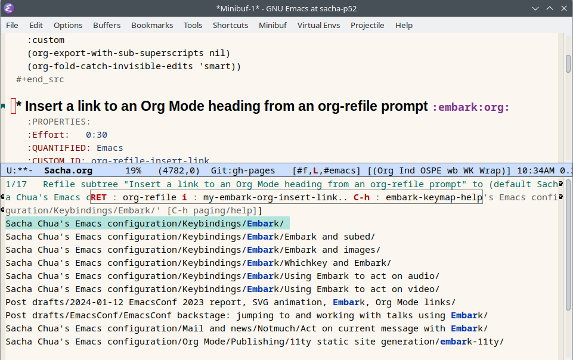

Let's make it work for ~org-heading~ too, like what we get from ~M-x consult-org-heading~:

#+begin_src emacs-lisp
(with-eval-after-load 'consult-org
	(keymap-set embark-org-heading-map "L" #'embark-org-insert-link-to))
#+end_src

There are more Embark shortcuts in my [[dotemacs:embark][Embark]] configuration.

** Org - mapping blog posts and image URLs from bulk exports         :image:
:PROPERTIES:
:CUSTOM_ID: org-mapping-blog-posts-and-image-urls-from-bulk-exports
:END:
#+begin_src emacs-lisp  :tangle no
(defun sacha-org-map-blog-and-image-urls ()
  "Extract and map blog post / image URLs."
  (interactive)
  (goto-char (point-min))
  (keep-lines "h2\\|img")
  (goto-char (point-min))
  (while (re-search-forward
          "^.*?h2.*?a href=\"\\(.*?\\)\".*$" nil t)
    (replace-match "\\1"))
  (goto-char (point-min))
  (while (re-search-forward
          "^.*?src=\"\\(.*?\\)\".*$" nil t)
    (replace-match "\\1"))
  (let (last-post current-url result)
    (goto-char (point-min))
    (while (re-search-forward "http://\\(.*\\)" nil t)
      (setq current-url (match-string 0))
      (if (string-match "/\\([^/]*?\\)\\(_thumb\\|-640x.*\\)?.png" current-url)
          (setq result (cons (concat (match-string 1 current-url) "\t" last-post) result))
        (setq last-post current-url)))
    (kill-new (mapconcat 'identity result "\n"))))
#+end_src
** Move Org Mode properties from subtree to parent
:PROPERTIES:
:CREATED:  [2024-09-16 Mon 14:04]
:CUSTOM_ID: sacha-org-move-properties-to-parent
:END:

Sometimes I set Org properties on a subtree when I meant to set them on the parent heading.
This function moves all the properties up one level.

#+begin_src emacs-lisp :tangle lisp/sacha-org.el
;;;###autoload
(defun sacha-org-move-properties-to-parent ()
  "Move entry properties to parent."
	(interactive)
	(let ((properties (org-entry-properties (point) 'standard)))
		;; delete properties from the current entry
		(mapc (lambda (prop)
						(unless (string= (car prop) "CATEGORY") (org-entry-delete (point) (car prop))))
					properties)
		;; add properties
		(outline-up-heading 1)
		(mapc (lambda (prop)
						(org-entry-put (point) (car prop) (cdr prop)))
					properties)))
#+end_src
** My files
:PROPERTIES:
:CUSTOM_ID: org-files
:END:

#<<org-files>>

Here are the Org files I use. I should probably organize them better. =)

| organizer.org        | My main Org file. Inbox for M-x org-capture, tasks, weekly reviews, etc. |
| news.org | inbox for Emacs News |
| business.org         | Business-related notes and TODOs                                         |
| people.org           | People-related tasks                                                     |
| [[http://sachachua.com/evil-plans][evil-plans/index.org]] | High-level goals                                                         |
| [[http://sachachua.com/outline][sharing/index.org]]    | Things to write about                                                    |
| decisions.org        | Pending, current, and reviewed decisions                                 |
| [[http://sachachua.com/blog/index][blog.org]]             | Topic index for my blog                                                  |
| [[http://sachachua.com/sacha-learning][learning.org]]         | Learning plan                                                            |
| outline.org          | Huge outline of notes by category                                        |
| tracking.org         | Temporary Org file for tracking various things                           |
| delegation.org       | Templates for assigning tasks - now using Google Docs instead            |
| books.org            | Huge file with book notes                                                |
| calendar.org         | Now using this with org-gcal                                             |
| ideal.org            | Planning ideal days                                                      |
| archive.org          | Archived subtrees                                                        |
| latin.org            | Latin notes                                                              |
| 101things.org        | Old goals for 101 things in 1001 days                                    |
| life.org             | Questions, processes, tools                                              |
| sewing.org           | Sewing projects, fabric tracking, etc. |

- [[http://stackoverflow.com/questions/8146313/emacs-auto-save-for-org-mode-only][emacs auto save for org-mode only - Stack Overflow]]

** Modules
:PROPERTIES:
:CUSTOM_ID: modules
:END:
Org has a whole bunch of optional modules. These are the ones I'm
currently experimenting with.
#+BEGIN_SRC emacs-lisp
(setq org-modules '(org-habit
                    org-mouse
                    org-protocol
                    org-annotate-file
                    ol-info
                    org-expiry
                    org-interactive-query
                    org-collector
                    org-panel
                    org-screen
                    org-toc))
(eval-after-load 'org
  '(org-load-modules-maybe t))
;; Prepare stuff for org-export-backends
(setq org-export-backends '(org latex icalendar html ascii))
#+END_SRC

** Keyboard shortcuts
:PROPERTIES:
:CUSTOM_ID: keyboard-shortcuts
:END:

#+BEGIN_SRC emacs-lisp
(keymap-global-set "C-c r" 'org-capture)
(keymap-global-set "C-c a" 'org-agenda)
(keymap-global-set "C-c l" 'org-store-link)
(keymap-global-set "C-c L" 'org-insert-link-global)
(keymap-global-set "C-c O" 'org-open-at-point-global)
#+END_SRC

=append-next-kill= is more useful to me than =org-table-copy-region=.

#+BEGIN_SRC emacs-lisp
(with-eval-after-load 'org
  (keymap-set org-mode-map "C-M-w" 'append-next-kill)
  (keymap-set org-mode-map "C-TAB" 'org-cycle)
  (keymap-set org-mode-map "C-c C-r" 'org-refile)
  (keymap-set org-mode-map "C-c R" 'org-reveal)
  (keymap-set org-mode-map "C-c d" 'sacha-org-move-line-to-destination)
  (keymap-set org-mode-map "C-c t s"  'sacha-split-sentence-and-capitalize)
  (keymap-set org-mode-map "C-c t -"  'sacha-split-sentence-delete-word-and-capitalize)
  (keymap-set org-mode-map "C-c t d"  'sacha-delete-word-and-capitalize)

  (keymap-set org-mode-map "C-c C-p C-p" 'sacha-org-publish-maybe)
  (keymap-set org-mode-map "C-c C-r" 'sacha-org-refile-and-jump))
#+END_SRC

I don't use the diary, but I do use the clock a lot.

#+begin_src emacs-lisp
(with-eval-after-load 'org-agenda
  (keymap-set org-agenda-mode-map "i" 'org-agenda-clock-in))
#+end_src

*** Speed commands
:PROPERTIES:
:CUSTOM_ID: speed-commands
:END:
**** Org Mode: Cutting the current list item (including nested lists) with a speed command
:PROPERTIES:
:CUSTOM_ID: org-mode-keyboard-shortcuts-speed-commands-org-mode-cutting-the-current-list-item-including-nested-lists-with-a-speed-command
:EXPORT_DATE: 2025-03-29T13:14:24-0400
:EXPORT_ELEVENTY_PERMALINK: /blog/2025/03/org-mode-cutting-the-current-list-item-including-nested-lists-with-a-speed-command/
:EXPORT_ELEVENTY_FILE_NAME: blog/2025/03/org-mode-cutting-the-current-list-item-including-nested-lists-with-a-speed-command/
:EXPORT_MODIFIED: 2025-09-17T13:14:33-0400
:END:

#+begin_update
[2025-09-17]: Limited ~sacha-org-cut-subtree-or-list-item~ to Inbox.org, posts.org, news.org.
#+end_update

Defining shortcuts in ~org-speed-commands~ is
handy because you can use these single-key
shortcuts at the beginning of a subtree. With a
little modification, they'll also work at the
beginning of list items.

#+begin_src emacs-lisp :tangle lisp/sacha-org.el
;;;###autoload
(defun sacha-org-use-speed-commands-for-headings-and-lists ()
  "Activate speed commands on list items too."
  (or (and (looking-at org-outline-regexp) (looking-back "^\**" nil))
      (save-excursion (and (looking-at (org-item-re)) (looking-back "^[ \t]*" nil)))))
#+end_src

#+begin_src emacs-lisp
(setq org-use-speed-commands 'sacha-org-use-speed-commands-for-headings-and-lists)
#+end_src

I want ~k~ to be an ~org-speed-commands~ that cuts
the current subtree or list item. This is handy
when I'm cleaning up the Mastodon toots in my
weekly review or getting rid of outline items that
I no longer need. By default, ~k~ is mapped to
~org-cut-subtree~, but it's easy to override.

#+begin_src emacs-lisp :tangle lisp/sacha-org.el
(defvar sacha-org-cut-subtree-file-regexp
  (regexp-opt '("Inbox.org" "posts.org" "news.org" "ipad.org"))
  "Only cut subtrees in files that match this regular expression.
See `sacha-org-cut-subtree-or-list-item'.")

;;;###autoload
(defun sacha-org-cut-subtree-or-list-item (&optional n)
	"Cut current subtree or list item."
	(cond
                                        ; limit this to certain files
	 ((and sacha-org-cut-subtree-file-regexp
         (not
          (string-match sacha-org-cut-subtree-file-regexp
									      (or (buffer-file-name) ""))))
		(message "Ignoring files not matching `sacha-org-cut-subtree-file-regexp'")) ; do nothing
	 ((and (looking-at org-outline-regexp) (looking-back "^\**" nil))
		(org-cut-subtree n))
	 ((looking-at (org-item-re))
		(kill-region (org-beginning-of-item) (org-end-of-item)))))
#+end_src

#+begin_src emacs-lisp
(with-eval-after-load 'org
	(setf (alist-get "k" org-speed-commands nil nil #'string=)
				#'sacha-org-cut-subtree-or-list-item))
#+end_src

So now, if I put my cursor before "1." below and press ~k~:

#+begin_src org
- this
  1. is a
    - nested
  2. list
- with levels
#+end_src

it will turn into:

- this
  2. list
- with levels

You can find out a little more about [[https://orgmode.org/manual/Speed-Keys.html][Org Mode speed commands]] in the Org manual: ~(info "(org) Speed Keys")~.

*** Other speed commands
:PROPERTIES:
:CUSTOM_ID: org-mode-keyboard-shortcuts-other-speed-commands
:END:
#+begin_src emacs-lisp
(setq org-use-effective-time t)
#+end_src

#+begin_src emacs-lisp :tangle lisp/sacha-org.el
;;;###autoload
(defun sacha-org-goto-text-start ()
  "Go to the start of the text after properties and drawers."
  (if (org-before-first-heading-p)
      (goto-char (point-min))
    (org-back-to-heading)
    (org-end-of-meta-data t)))

;;;###autoload
(defun sacha-org-subtree-text ()
  (if (derived-mode-p 'org-mode)
      (if (org-before-first-heading-p)
          (buffer-substring (point-min)
                            (save-excursion
                              (org-next-visible-heading)
                              (line-beginning-position)))
        (save-excursion
          (buffer-substring (save-excursion (org-end-of-meta-data t) (point))
                            (org-end-of-subtree))))
    (buffer-string)))

;;;###autoload
(defun sacha-org-copy-subtree-text ()
  (interactive)
  (kill-new (sacha-org-subtree-text)))

;;;###autoload
(defun sacha-org-mark-done ()
  (interactive)
  (sacha-org-with-current-task (org-todo "DONE")))
#+end_src

#+begin_src emacs-lisp :tangle lisp/sacha-journal.el
;;;###autoload
(defun sacha-org-mark-done-and-add-to-journal (&optional note category)
  (interactive (list (if current-prefix-arg
                         (read-string (format "Note (%s): " (org-get-heading t t t t)))
                       (org-get-heading t t t t))
                     (or (org-entry-get (point) "JOURNAL_CAT") (sacha-journal-read-category (sacha-journal-guess-category)))))
  (sacha-org-with-current-task
   (org-todo "DONE")
   (org-entry-put (point) "JOURNAL_CAT" category)
   (let* ((title (or note (org-get-heading t t t t)))
          (zid (org-entry-get (point) "ZIDSTRING"))
          (other (if current-prefix-arg (substring-no-properties (sacha-org-subtree-text))))
          (date (unless zid
                  (format-time-string "%Y-%m-%d %H:%M"
                                      (let ((base-date (org-read-date nil t (org-entry-get (point) "CREATED"))))
                                        (if (string-match "Yesterday " title)
                                            (progn
                                              (setq title (replace-match "" nil nil title))
                                              (org-read-date nil t "--1" nil (org-time-string-to-time (org-entry-get (point) "CREATED"))))
                                          base-date))))))
     (if zid
         (sacha-journal-update (list :ZIDString zid :Note title :Category category :Other other))
       (org-entry-put (point) "ZIDSTRING"
                      (plist-get
                       (sacha-journal-post title
                                        :Category category
                                        :Other other
                                        :Date date)
                       :ZIDString)))
     (org-back-to-heading)
     (sacha-copy-observation))))

#+end_src

#+begin_src emacs-lisp
(with-eval-after-load 'org
  (let ((listvar (if (boundp 'org-speed-commands) 'org-speed-commands
                   'org-speed-commands-user)))
    (add-to-list listvar '("A" org-archive-subtree-default))
    (add-to-list listvar '("x" org-todo "DONE"))
    (add-to-list listvar '("X" call-interactively 'sacha-org-mark-done-and-add-to-journal))
    (add-to-list listvar '("y" org-todo-yesterday "DONE"))
    (add-to-list listvar '("!" sacha-org-clock-in-and-track))
    (add-to-list listvar '("s" call-interactively 'org-schedule))
    (add-to-list listvar '("d" sacha-org-move-line-to-destination))
    (add-to-list listvar '("i" call-interactively 'org-clock-in))
    (add-to-list listvar '("o" call-interactively 'org-clock-out))
    (add-to-list listvar '("$" call-interactively 'org-archive-subtree)))
  (keymap-set org-agenda-mode-map "!" 'sacha-org-clock-in-and-track))
#+end_src

** Org navigation
:PROPERTIES:
:CUSTOM_ID: org-navigation
:END:

From http://stackoverflow.com/questions/15011703/is-there-an-emacs-org-mode-command-to-jump-to-an-org-heading
#+begin_src emacs-lisp
(setq org-goto-interface 'outline-path-completion
      org-goto-max-level 10)
(require 'imenu)
(setq org-startup-folded nil)
(setq org-startup-with-inline-images nil)
(setq org-startup-with-link-previews nil)
(keymap-global-set "C-c j" 'org-clock-goto) ;; jump to current task from anywhere
(keymap-global-set "C-c C-w" 'org-refile)
(setq org-cycle-include-plain-lists 'integrate)
(setq org-catch-invisible-edits 'show-and-error)
#+end_src

*** Link Org subtrees and navigate between them
:PROPERTIES:
:CUSTOM_ID: link-org-subtrees-and-navigate-between-them
:END:
The following code makes it easier for me to link trees with entries, as in http://sachachua.com/evil-plans

#+begin_src emacs-lisp :tangle lisp/sacha-org.el
;;;###autoload
(defun sacha-org-follow-entry-link ()
  "Follow the defined link for this entry."
  (interactive)
  (if (org-entry-get (point) "LINK")
      (org-open-link-from-string (org-entry-get (point) "LINK"))
    (org-open-at-point)))

;;;###autoload
(defun sacha-org-link-projects (location)
  "Add link properties between the current subtree and the one specified by LOCATION."
  (interactive
   (list (let ((org-refile-use-cache nil))
           (org-refile-get-location "Location"))))
  (let ((link1 (org-store-link nil)) link2)
    (save-window-excursion
      (org-refile 4 nil location)
      (setq link2 (org-store-link nil))
      (org-set-property "LINK" link1))
    (org-set-property "LINK" link2)))
#+end_src

*** Viewing, navigating, and editing the Org tree
:PROPERTIES:
:CUSTOM_ID: viewing-navigating-and-editing-the-org-tree
:END:

I often cut and paste subtrees. This makes it easier to cut
something and paste it elsewhere in the hierarchy.
#+begin_src emacs-lisp
(with-eval-after-load 'org
  (keymap-set org-mode-map "C-c k" 'org-cut-subtree)
  (setq org-yank-adjusted-subtrees t))
#+end_src

*** Finding my place on a small mobile screen with org-back-to-heading
:PROPERTIES:
:CUSTOM_ID: finding-sacha-place-on-a-small-mobile-screen-with-org-back-to-heading
:END:

As it turns out, I can use =outline-previous-heading= to go back.

#+begin_src emacs-lisp
(use-package org
  :bind (:map org-mode-map
              ("C-c b" . outline-previous-heading)
              ("C-c p" . org-display-outline-path)))
#+end_src

*** Dealing with big tables
:PROPERTIES:
:CUSTOM_ID: dealing-with-big-tables
:END:

Sometimes I forget where I am in a big table. This would be nice to turn into a minor mode someday.

#+begin_src emacs-lisp :tangle lisp/sacha-org.el
;;;###autoload
(defun sacha-org-show-row-and-column (point)
  (interactive "d")
  (save-excursion
    (goto-char point)
    (let ((row (s-trim (org-table-get nil 1)))
          (col (s-trim (org-table-get 1 nil)))
          (message-log-max nil))
      (message "%s - %s" row col))))
#+end_src

** Taking notes
:PROPERTIES:
:CUSTOM_ID: taking-notes
:END:

#+begin_src emacs-lisp
(setq org-directory "~/sync/orgzly/")
(setq org-default-notes-file "~/sync/orgzly/organizer.org")
#+end_src

*** Date trees
:PROPERTIES:
:CUSTOM_ID: date-trees
:END:

This quickly adds a same-level heading for the succeeding day.
#+begin_src emacs-lisp :tangle lisp/sacha-org.el
;;;###autoload
(defun sacha-org-insert-heading-for-next-day ()
  "Insert a same-level heading for the following day."
  (interactive)
  (let ((new-date
         (seconds-to-time
          (+ 86400.0
             (float-time
              (org-read-date nil 'to-time (elt (org-heading-components) 4)))))))
    (org-insert-heading-after-current)
    (insert (format-time-string "%Y-%m-%d\n\n" new-date))))
#+end_src

*** Templates
:PROPERTIES:
:CUSTOM_ID: templates
:END:

I use =org-capture= templates to quickly jot down tasks, ledger
entries, notes, and other semi-structured pieces of information.
#+begin_src emacs-lisp :tangle lisp/sacha-org-contacts.el
;;;###autoload
(defun sacha-org-contacts-template-email (&optional return-value)
  "Try to return the contact email for a template.
         If not found return RETURN-VALUE or something that would ask the user."
  (eval-when-compile (require 'gnus-art nil t))
  (eval-when-compile (require 'org-contacts nil t))
  (or (cadr (if (gnus-alive-p)
                (gnus-with-article-headers
                  (mail-extract-address-components
                   (or (mail-fetch-field "Reply-To") (mail-fetch-field "From") "")))))
      return-value
      (concat "%^{" org-contacts-email-property "}p")))
#+end_src

#+begin_src emacs-lisp
(defvar sacha-org-basic-task-template "* TODO %^{Task}
         :PROPERTIES:
         :Effort: %^{effort|1:00|0:05|0:15|0:30|2:00|4:00}
         :END:
         Captured %<%Y-%m-%d %H:%M>
         %?

         %i
         " "Basic task data")
(defvar sacha-ledger-file "~/cloud/ledger/current.ledger")
(with-eval-after-load 'org-capture
	(setq org-capture-templates
				(seq-uniq
				 (append

      `(("r" "Note" entry
         (file ,sacha-org-inbox-file)
         "* %?\n:PROPERTIES:\n:CREATED: %U\n:END:\n\n%i\n\n- %a"
         :prepend t)
				("t" "Task with annotation" entry
         (file ,sacha-org-inbox-file)
         "* TODO %?\n:PROPERTIES:\n:CREATED: %U\n:END:\n%a\n"
         :prepend t)
        ("i" "Interrupting task" entry
         (file ,sacha-org-inbox-file)
         "* STARTED %^{Task}\n:PROPERTIES:\n:CREATED: %U\n:END:\n%a\n"
         :clock-in :clock-resume
         :prepend t)
				("T" "Task without annotation" entry
         (file ,sacha-org-inbox-file)
         "* TODO %^{Task}\n:PROPERTIES:\n:CREATED: %U\n:END:\n\n"
         :prepend t)
        ;; From https://takeonrules.com/2022/10/16/adding-another-function-to-sacha-workflow/
        ("c" "Contents to current clocked task"
	       plain (clock)
	       "%i%?\n%a"
	       :empty-lines 1)
        ;; ("p" "Podcast log - timestamped" item
        ;;  (file+olp+datetree "~/sync/orgzly/timestamped.org")
        ;;  "%<%H:%M:%S,%3N> %^{Note}"
        ;;  :immediate-finish t)
        ;; ("b" "Plover note" table-line
        ;;  (file+headline "~/proj/plover-notes/README.org" "Brief notes")
        ;;  "| %^{Stroke} | %^{Translation} | %^{Note} |"
        ;;  :immediate-finish t)
        ;; ("c" "Plover review from clippy" table-line
        ;;  (file+headline "~/proj/plover-notes/README.org" "For review")
        ;;  "%(let ((last (sacha-clippy-last))) (format \"| %s | %s |\" (car last) (cdr last)))"
        ;;  :immediate-finish t)

        ("." "Today" entry
         (file ,sacha-org-inbox-file)
         "* TODO %^{Task}\nSCHEDULED: %t\n:PROPERTIES:\n:CREATED: %U\n:END:\n"
         :immediate-finish t)
        ("v" "Video" entry
         (file ,sacha-org-inbox-file)
         "* TODO %^{Task}  :video:\nSCHEDULED: %t\n"
         :immediate-finish t)
        ("e" "Errand" entry
         (file ,sacha-org-inbox-file)
         "* TODO %^{Task}  :errands:\n:PROPERTIES:\n:CREATED: %U\n:END:\n"
         :immediate-finish t)
        ("n" "Note" entry
         (file ,sacha-org-inbox-file)
         "* %^{Note}\n:PROPERTIES:\n:CREATED: %U\n:END:\n"
         :immediate-finish t)
        ("N" "Note" entry
         (file ,sacha-org-inbox-file)
         "* %^{Note}\n:PROPERTIES:\n:CREATED: %U\n:END:\n"
         :prepend t)
				("s" "Selection from browser" entry
				 (file ,sacha-org-inbox-file)
				 "* %a :website:\n:PROPERTIES:\n:CREATED: %U\n:END:\n#+begin_quote\n%i\n#+end_quote\n\n%?\n"
				 :prepend t)
				("S" "Screenshot" entry
				 (file ,sacha-org-inbox-file)
				 "* %i\n:PROPERTIES:\n:CREATED: %U\n:END:\n\n#+CAPTION: %(file-name-nondirectory (sacha-latest-screenshot))\n[[file:%(sacha-latest-screenshot)]]\n"
				 :prepend t)
        ("b" "Business task" entry
         (file+headline "~/personal/business.org" "Tasks")
         ,sacha-org-basic-task-template)
        ("j" "Journal entry" plain
         (file+olp+datetree "~/sync/orgzly/journal.org")
         "%K - %a\n%i\n%?\n"
         :unnarrowed t)
        ("db" "Done - Business" entry
         (file+headline "~/personal/business.org" "Tasks")
         "* DONE %^{Task}\nSCHEDULED: %^t\n%?")
        ("dp" "Done - People" entry
         (file+headline "~/personal/people.org" "Tasks")
         "* DONE %^{Task}\nSCHEDULED: %^t\n%?")
        ("dt" "Done - Task" entry
         (file+headline "~/sync/orgzly/organizer.org" "Inbox")
         "* DONE %^{Task}\nSCHEDULED: %^t\n%?")
        ("q" "Quick note" item
         (file+headline "~/sync/orgzly/organizer.org" "Quick notes"))
        ("L" "Ledger")
        ("Lc" "Cash expense" plain
         (file ,sacha-ledger-file)
         "%(ledger-read-date \"Date: \") * %^{Payee}
             Expenses:Cash
             Expenses:%^{Account}  %^{Amount}
           ")
        ("Lb" "BDO CAD" plain
         (file ,sacha-ledger-file)
         "%(ledger-read-date \"Date: \") * %^{Payee}
             Expenses:Play    $ %^{Amount}
             Assets:BDO
           ")
        ("Lp" "BDO PHP" plain
         (file ,sacha-ledger-file)
         "%(ledger-read-date \"Date: \") * %^{Payee}
             Expenses:Play    PHP %^{Amount}
             Assets:BDO
           ")
        ("B" "Book" entry
         (file+olp+datetree "~/personal/books.org" "Inbox")
         "* %^{Title}  %^g
           %i
           ,*Author(s):* %^{Author} \\\\
           ,*ISBN:* %^{ISBN}

           %?

           ,*Review on:* %^t \\
           %a
           %U"
         :clock-in :clock-resume)
        ("C" "Contact" entry (file "~/sync/orgzly/people.org")
         "* %(org-contacts-template-name)
:PROPERTIES:
:EMAIL: %(sacha-org-contacts-template-email)
:END:")
				("w" "Web" entry (file "~/sync/orgzly/Inbox.org")
				 "* %a
:PROPERTIES:
:CREATED: %U
:END:

%i
")
				("W" "Web bookmark" entry (file "~/sync/orgzly/resources.org")
				 "* %a
:PROPERTIES:
:CREATED: %U
:END:

%i
"
				 :prepend t)
				("y" "Yay Emacs" entry (file+headline "~/proj/stream/index.org" "Notes for this session")
				 "* %?\n:PROPERTIES:\n:CREATED: %U\n:END:\n

%i

%a
"))
			org-capture-templates))))
(keymap-global-set "C-M-r" 'org-capture)


;;(keymap-global-set (kbd "<f5>") 'org-capture)
#+end_src

**** Allow refiling in the middle(ish) of a capture
:PROPERTIES:
:CUSTOM_ID: allow-refiling-in-the-middle-ish-of-a-capture
:END:

This lets me use =C-c C-r= to refile a capture and then jump to the
new location. I wanted to be able to file tasks under projects so that
they could inherit the QUANTIFIED property that I use to track time
(and any Beeminder-related properties too), but I also wanted to be
able to clock in on them.

#+begin_src emacs-lisp :tangle lisp/sacha-org.el
;;;###autoload
(defun sacha-org-refile-and-jump ()
  (interactive)
  (if (derived-mode-p 'org-capture-mode)
      (org-capture-refile)
    (call-interactively 'org-refile))
  (org-refile-goto-last-stored))
#+end_src

#+begin_src emacs-lisp
(with-eval-after-load 'org-capture
  (keymap-set org-capture-mode-map "C-c C-r" 'sacha-org-refile-and-jump))
#+end_src

*** Try out this capture command
:PROPERTIES:
:CUSTOM_ID: try-out-this-capture-command
:END:

From https://takeonrules.com/2022/10/16/adding-another-function-to-sacha-workflow/, modified slightly so that it creates a new entry if we are not currently clocked in. =C-c c= is a high-value keybinding, but I haven't been using this enough. I wonder where else it makes sense to have this.

#+begin_src emacs-lisp
(use-package git-link :defer t)
(keymap-global-set "C-c c" 'jf/capture-region-contents-with-metadata)
#+end_src

#+begin_src emacs-lisp :tangle lisp/sacha-org.el
;;;###autoload
(defun sacha-org-capture-region-contents-with-metadata (start end parg)
  "Write selected text between START and END to currently clocked `org-mode' entry.

With PARG, kill the content instead.
If there is no clocked task, create it as a new note in my inbox instead.

From https://takeonrules.com/2022/10/16/adding-another-function-to-sacha-workflow/, modified slightly so that it creates a new entry if we are not currently clocked in."
  (interactive "r\nP")
  (let ((text (sacha-org-region-contents-get-with-metadata start end)))
    (if (car parg)
	      (kill-new text)
      (org-capture-string (concat "-----\n" text)
                          (if (org-clocking-p) "c"
                            "r")))))

;;;###autoload
(defun sacha-org-region-contents-get-with-metadata (start end)
  "Get the region contents between START and END and return an `org-mode' formatted string.

From https://takeonrules.com/2022/10/16/adding-another-function-to-sacha-workflow/"
  (require 'magit)
  (require 'git-link)
  (let* ((file-name (buffer-file-name (current-buffer)))
	       (org-src-mode (replace-regexp-in-string
			                  "-mode"
			                  ""
			                  (format "%s" major-mode)))
	       (func-name (which-function))
	       (type (if (derived-mode-p 'prog-mode) "SRC" "EXAMPLE"))
	       (code-snippet (buffer-substring-no-properties start end))
	       (file-base (file-name-nondirectory file-name))
	       (line-number (line-number-at-pos (region-beginning)))
	       (remote-link (when (magit-list-remotes)
			                  (progn
			                    (call-interactively 'git-link)
			                    (car kill-ring))))
	       (initial-txt (if (null func-name)
			                    (format "From [[file:%s::%s][%s]]:"
				                          file-name
				                          line-number
				                          file-base)
			                  (format "From ~%s~ (in [[file:%s::%s][%s]]):"
				                        func-name
				                        file-name
				                        line-number
				                        file-base))))
	  (format (concat "\n- Local :: %s"
			              (when remote-link (format "\n- Remote :: %s" remote-link))
			              "\n\n#+BEGIN_%s %s"
			              "\n%s"
			              "\n#+END_%s\n")
		        initial-txt
		        type
		        org-src-mode
		        code-snippet
		        type)))
#+end_src
*** Estimating WPM
:PROPERTIES:
:CUSTOM_ID: estimating-wpm
:END:

I'm curious about how fast I type some things.
#+begin_src emacs-lisp :tangle lisp/sacha-org.el
(require 'org-clock)
;;;###autoload
(defun sacha-org-entry-wpm ()
  (interactive)
  (save-restriction
    (save-excursion
      (org-narrow-to-subtree)
      (goto-char (point-min))
      (let* ((words (count-words-region (point-min) (point-max)))
             (minutes (org-clock-sum-current-item))
             (wpm (/ words minutes)))
        (message "WPM: %d (words: %d, minutes: %d)" wpm words minutes)
        (kill-new (number-to-string wpm))))))
#+end_src
** Logbook
:PROPERTIES:
:CUSTOM_ID: logbook
:END:

#+begin_src emacs-lisp :tangle lisp/sacha-org.el
;;;###autoload
(defun sacha-org-log-note (note)
  "Add NOTE to the current entry's logbook."
  (interactive "MNote: ")
  (setq org-log-note-window-configuration (current-window-configuration))
  (move-marker org-log-note-return-to (point))
  (move-marker org-log-note-marker (point))
  (setq org-log-note-purpose 'note)
  (with-temp-buffer
    (insert note)
    (org-store-log-note)))
#+end_src
** Tasks
:PROPERTIES:
:CUSTOM_ID: tasks
:END:
*** Managing tasks
:PROPERTIES:
:CUSTOM_ID: managing-tasks
:END:
**** Get things to be set to TODO when they repeat
:PROPERTIES:
:CREATED: [2024-10-24 Thu 10:42]
:Effort:   0:15
:QUANTIFIED: Emacs
:CUSTOM_ID: org-mode-tasks-managing-tasks-get-things-to-be-set-to-todo-when-they-repeat
:END:
:LOGBOOK:
- State "DONE"       from "STARTED"    [2024-10-24 Thu 10:58]
CLOCK: [2024-10-24 Thu 10:42]--[2024-10-24 Thu 10:58] =>  0:16
:END:

I use ~STARTED~ to keep track of things I've started working on, and this is updated when I clock into the task. If I have a repeating task, I want the task to be automatically reset to ~TODO~.

#+begin_src emacs-lisp
(setq org-todo-repeat-to-state "TODO")
#+end_src

**** Track TODO state
:PROPERTIES:
:CUSTOM_ID: todo-keywords
:END:
<<todo-keywords>>

The parentheses indicate keyboard shortcuts that I can use to set the
task state. =@= and =!= toggle logging. =@= prompts you for a note,
and =!= automatically logs the timestamp of the state change.

#+begin_src emacs-lisp pack
(setq org-todo-keywords
      '((sequence
         "STARTED(s)"
         "TODO(t)"  ; next action
         "TOBLOG(b)"
         "WAITING(w@/!)"
         "READY(r)"
         "SOMEDAY(.)" "BLOCKED(k@/!)" "|" "DONE(x!)" "CANCELLED(c)")
        (sequence "PROJECT" "|" "DONE(x)")
        (sequence "LEARN" "TRY" "TEACH" "|" "COMPLETE(x)")
        (sequence "TOSKETCH" "SKETCHED" "|" "POSTED")
        (sequence "TOBUY" "TOSHRINK" "TOCUT"  "TOSEW" "|" "DONE(x)")
        (sequence "TODELEGATE(-)" "DELEGATED(d)" "|" "COMPLETE(x)")))
#+end_src

#+begin_src emacs-lisp
(setq org-log-done 'time)
#+end_src

**** TODO Change Org Mode TODO keyword color based on the state and the current Modus theme
:PROPERTIES:
:CUSTOM_ID: sacha-org-todo-set-keyword-faces
:EXPORT_DATE: 2024-10-14T17:02:45-0400
:EXPORT_ELEVENTY_PERMALINK: /blog/2024/10/change-org-mode-todo-keyword-color-based-on-the-state-and-the-current-modus-theme/
:EXPORT_ELEVENTY_FILE_NAME: blog/2024/10/change-org-mode-todo-keyword-color-based-on-the-state-and-the-current-modus-theme/
:END:

I use ~modus-theme-toggle~ to switch between
~modus-vivendi-tinted~ and ~modus-operandi-tinted~
depending on whether I want a dark background or a
light one. I also customize my
~org-todo-keyword-faces~ to visually distinguish
TODO, DONE, WAITING, and SOMEDAY. This is how to
colour them based on the current Modus theme.

#+begin_src emacs-lisp :tangle lisp/sacha-appearance.el
;;;###autoload
(defun sacha-org-todo-set-keyword-faces ()
	(setq org-todo-keyword-faces
				`(("TODO" . (:foreground ,(modus-themes-get-color-value 'blue-warmer) :weight bold))
					("DONE" . (:foreground ,(modus-themes-get-color-value 'green-warmer) :weight bold))
					("WAITING" . (:foreground ,(modus-themes-get-color-value 'red-warmer) :weight bold))
					("SOMEDAY" . (:foreground ,(modus-themes-get-color-value 'fg-dim) :weight bold))))
	(when (derived-mode-p 'org-mode)
		(font-lock-fontify-buffer)))
#+end_src

#+begin_src emacs-lisp
(with-eval-after-load 'modus-themes
	(add-hook 'modus-themes-after-load-theme-hook #'sacha-org-todo-set-keyword-faces))
#+end_src

#+CAPTION: Light background
#+ATTR_HTML: :data-link t
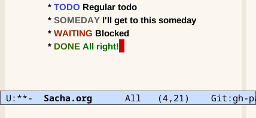

#+ATTR_HTML: :data-link t
#+CAPTION: Dark background
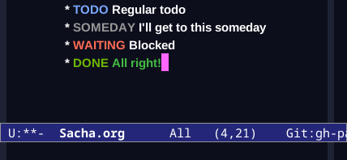


**** Projects
:PROPERTIES:
:CUSTOM_ID: projects
:END:

Projects are headings with the =:project:= tag, so we generally don't
want that tag inherited, except when we display unscheduled tasks that
don't belong to any projects.

#+begin_src emacs-lisp
(setq org-tags-exclude-from-inheritance '("project" "inboxtarget"))
#+end_src

This code makes it easy for me to focus on one project and its tasks.

#+begin_src emacs-lisp
(with-eval-after-load 'org
  (let ((listvar (if (boundp 'org-speed-commands) 'org-speed-commands
                   'org-speed-commands-user)))
    (add-to-list listvar '("N" org-narrow-to-subtree))
    (add-to-list listvar '("W" widen))
    (add-to-list listvar '("T" sacha-org-agenda-for-subtree))
    (add-to-list listvar '("b" sacha-org-bounce-to-file))))

#+end_src

#+begin_src emacs-lisp :tangle lisp/sacha-org.el
;;;###autoload
(defun sacha-org-agenda-for-subtree ()
  (interactive)
  (when (derived-mode-p 'org-agenda-mode) (org-agenda-switch-to))
  (sacha-org-with-current-task
   (let ((org-agenda-view-columns-initially t))
     (org-agenda nil "t" 'subtree))))

#+end_src

There's probably a proper way to do this, maybe with =<=. Oh, that would work nicely. =< C-c a t= too.

And sorting:

#+begin_src emacs-lisp
(with-eval-after-load 'org
  (let ((listvar (if (boundp 'org-speed-commands) 'org-speed-commands
                   'org-speed-commands-user)))
    (add-to-list listvar '("S" call-interactively 'org-sort))))
#+end_src

**** Tag tasks with GTD-ish contexts
:PROPERTIES:
:CUSTOM_ID: tag-tasks-with-gtd-ish-contexts
:END:

This defines keyboard shortcuts for those, too.

#+begin_src emacs-lisp
(setq org-tag-alist '(("work" . ?b)
                      ("home" . ?h)
                      ("writing" . ?w)
                      ("errands" . ?e)
                      ("drawing" . ?d)
                      ("coding" . ?c)
                      ("video" . ?v)
                      ("kaizen" . ?k)
                      ("phone" . ?p)
                      ("learning" . ?a)
                      ("reading" . ?r)
                      ("computer" . ?l)
                      ("quantified" . ?q)
                      ("shopping" .?s)
                      ("focus" . ?f)))
#+end_src

**** Enable filtering by effort estimates
:PROPERTIES:
:CUSTOM_ID: enable-filtering-by-effort-estimates
:END:

That way, it's easy to see short tasks that I can finish.

#+begin_src emacs-lisp
(with-eval-after-load 'org
	(add-to-list 'org-global-properties
							 '("Effort_ALL". "0:05 0:15 0:30 1:00 2:00 3:00 4:00")))
#+end_src

**** Track time
:PROPERTIES:
:CUSTOM_ID: track-time
:END:

#+begin_src emacs-lisp
(use-package org
  :init
  (progn
    (setq org-expiry-inactive-timestamps t)
    (setq org-clock-idle-time nil)
    (setq org-log-done 'time)
    (setq org-clock-auto-clock-resolution nil)
    (setq org-clock-continuously nil)
    (setq org-clock-persist t)
    (setq org-clock-in-switch-to-state "STARTED")
    (setq org-clock-in-resume nil)
    (setq org-show-notification-handler 'message)
    (setq org-clock-report-include-clocking-task t))
  :config
  (org-clock-persistence-insinuate))
#+end_src

Too many clock entries clutter up a heading.

#+begin_src emacs-lisp
(setq org-log-into-drawer "LOGBOOK")
(setq org-clock-into-drawer 1)
#+end_src

**** Habits
:PROPERTIES:
:CUSTOM_ID: habits
:END:

I like using org-habits to track consistency. My task names tend
to be a bit long, though, so I've configured the graph column to
show a little bit more to the right.

#+begin_src emacs-lisp
(setq org-habit-graph-column 80)
(setq org-habit-show-habits-only-for-today nil)
#+end_src

If you want to use habits, be sure to schedule your tasks and add a STYLE property with the value of =habit= to the tasks you want displayed.

*** Estimating tasks
:PROPERTIES:
:CUSTOM_ID: subset
:END:

From "Add an effort estimate on the fly when clocking in" on the
[[http://orgmode.org/worg/org-hacks.html][Org Hacks]] page:

#+begin_src emacs-lisp
(add-hook 'org-clock-in-prepare-hook
          'sacha-org-mode-ask-effort)
#+end_src

#+begin_src emacs-lisp :tangle lisp/sacha-org.el
;;;###autoload
(defun sacha-org-mode-ask-effort ()
  "Ask for an effort estimate when clocking in."
  (unless (org-entry-get (point) "Effort")
    (let ((effort
           (completing-read
            "Effort: "
            (org-entry-get-multivalued-property (point) "Effort"))))
      (unless (equal effort "")
        (org-set-property "Effort" effort)))))
#+end_src

# <<subset>>
*** Flexible scheduling of tasks
:PROPERTIES:
:CUSTOM_ID: flexible-scheduling-of-tasks
:END:

I (theoretically) want to be able to schedule tasks for dates like the first Saturday
of every month. Fortunately, [[http://stackoverflow.com/questions/13555385/org-mode-how-to-schedule-repeating-tasks-for-the-first-saturday-of-every-month][someone else has figured that out!]]

#+begin_src emacs-lisp
;; Get this from https://raw.github.com/chenfengyuan/elisp/master/next-spec-day.el
(load "~/elisp/next-spec-day.el" t)
#+end_src

*** Task dependencies
:PROPERTIES:
:CUSTOM_ID: task-dependencies
:END:

#+begin_src emacs-lisp
(setq org-enforce-todo-dependencies t)
(setq org-track-ordered-property-with-tag t)
(setq org-agenda-dim-blocked-tasks t)
#+end_src

*** Quick way to archive all DONE from inbox                :emacs:computer:
:PROPERTIES:
:CUSTOM_ID: quick-way-to-archive-all-done-from-inbox
:END:

#+begin_src emacs-lisp :tangle lisp/sacha-org.el
;;;###autoload
(defun sacha-org-clean-up-inbox ()
  "Archive all DONE tasks and sort the remainder by TODO order."
  (interactive)
  (with-current-buffer (find-file sacha-org-inbox-file)
    (sacha-org-archive-done-tasks 'file)
    (goto-char (point-min))
    (if (org-at-heading-p) (save-excursion (insert "\n")))
    (org-sort-entries nil ?p)
    (goto-char (point-min))
    (org-sort-entries nil ?o)
    (save-buffer)))

;;;###autoload
(defun sacha-org-archive-done-tasks (&optional scope)
  "Archive finished or cancelled tasks.
       SCOPE can be 'file or 'tree."
  (interactive)
  (org-map-entries
   (lambda ()
     (org-archive-subtree)
     (setq org-map-continue-from (outline-previous-heading)))
   "TODO=\"DONE\"|TODO=\"CANCELLED\"" (or scope (if (org-before-first-heading-p) 'file 'tree))))
#+end_src
*** Strike through DONE headlines
:PROPERTIES:
:CUSTOM_ID: strike-through-done-headlines
:END:

I wanted a quick way to visually distinguish DONE tasks from tasks I
still need to do. This [[http://lists.gnu.org/archive/html/emacs-orgmode/2007-03/msg00179.html][handy snippet from the Emacs Org-mode mailing list]] does the trick by striking through the headlines for DONE tasks.

#+begin_src emacs-lisp :tangle no :eval no
(setq org-fontify-done-headline t)
(custom-set-faces
 '(org-done ((t (:foreground "PaleGreen"
                             :weight normal
                             :strike-through t))))
 '(org-headline-done
   ((((class color) (min-colors 16) (background dark))
     (:foreground "LightSalmon" :strike-through t)))))
#+end_src

*** Checklists
:PROPERTIES:
:CUSTOM_ID: org-mode-tasks-checklists
:END:

https://orgmode.org/worg/org-contrib/org-checklist.html

#+begin_src emacs-lisp
(with-eval-after-load 'org
	(require 'org-checklist))
#+end_src
** Templates
:PROPERTIES:
:CUSTOM_ID: templates
:END:
*** Structure templates
:PROPERTIES:
:CUSTOM_ID: structure-templates
:END:

Org makes it easy to insert blocks by typing =<s[TAB]=, etc.
I hardly ever use LaTeX, but I insert a lot of Emacs Lisp blocks, so I
redefine =<l= to insert a Lisp block instead.

#+begin_src emacs-lisp
(setq org-structure-template-alist
      '(("a" . "export ascii")
        ("C" . "center")
        ("c" . "comment")
				("d" . "my_details")
        ("e" . "example")
        ("E" . "export")
        ("m" . "export md")
        ("M" . "media-post")
        ("h" . "export html")
        ("j" . "src js :spookfox t")
        ("l" . "src emacs-lisp")
        ("p" . "src python")
        ("n" . "notes")
        ("q" . "quote")
        ("s" . "src")
        ("S" . "src sh")
        ("u" . "update")
        ("v" . "verse")))
#+end_src

This lets me nest quotes. http://emacs.stackexchange.com/questions/2404/exporting-org-mode-nested-blocks-to-html

#+begin_src emacs-lisp :tangle lisp/sacha-org.el
;;;###autoload
(defun sacha-org-html-quote2 (block backend info)
  (when (org-export-derived-backend-p backend 'html)
    (when (string-match "\\`<div class=\"quote2\">" block)
      (setq block (replace-match "<blockquote>" t nil block))
      (string-match "</div>\n\\'" block)
      (setq block (replace-match "</blockquote>\n" t nil block))
      block)))
#+end_src

#+begin_src emacs-lisp
(eval-after-load 'ox
  '(add-to-list 'org-export-filter-special-block-functions 'sacha-org-html-quote2))
#+end_src

**** Demarcate, but for all blocks                            :emacs:config:
:PROPERTIES:
:CUSTOM_ID: demarcate-but-for-begin-notes
:END:

I often want to split an Org Mode block so that I can add stuff in between. This code is based on
https://scripter.co/splitting-an-org-block-into-two/ .

#+begin_src emacs-lisp :tangle lisp/sacha-org.el
;;;###autoload
(defun modi/org-split-block ()
  "Sensibly split the current Org block at point."
  (interactive)
  (if (modi/org-in-any-block-p)
      (save-match-data
        (save-restriction
          (widen)
          (let ((case-fold-search t)
                (at-bol (bolp))
                block-start
                block-end)
            (save-excursion
              (re-search-backward "^\\(?1:[[:blank:]]*#\\+begin_.+?\\)\\(?: .*\\)*$" nil nil 1)
              (setq block-start (match-string-no-properties 0))
              (setq block-end (replace-regexp-in-string
                               "begin_" "end_" ;Replaces "begin_" with "end_", "BEGIN_" with "END_"
                               (match-string-no-properties 1))))
            ;; Go to the end of current line, if not at the BOL
            (unless at-bol
              (end-of-line 1))
            (insert (concat (if at-bol "" "\n")
                            block-end
                            "\n\n"
                            block-start
                            (if at-bol "\n" "")))
            ;; Go to the line before the inserted "#+begin_ .." line
            (beginning-of-line (if at-bol -1 0)))))
    (message "Point is not in an Org block")))
(defalias 'sacha-org-demarcate-block #'modi/org-split-block)
(defalias 'sacha-org-split-block #'modi/org-split-block)


;;;###autoload
(defun modi/org-in-any-block-p ()
  "Return non-nil if the point is in any Org block.

The Org block can be *any*: src, example, verse, etc., even any
Org Special block.

This function is heavily adapted from `org-between-regexps-p'."
  (save-match-data
    (let ((pos (point))
          (case-fold-search t)
          (block-begin-re "^[[:blank:]]*#\\+begin_\\(?1:.+?\\)\\(?: .*\\)*$")
          (limit-up (save-excursion (outline-previous-heading)))
          (limit-down (save-excursion (outline-next-heading)))
          beg end)
      (save-excursion
        ;; Point is on a block when on BLOCK-BEGIN-RE or if
        ;; BLOCK-BEGIN-RE can be found before it...
        (and (or (org-in-regexp block-begin-re)
                 (re-search-backward block-begin-re limit-up :noerror))
             (setq beg (match-beginning 0))
             ;; ... and BLOCK-END-RE after it...
             (let ((block-end-re (concat "^[[:blank:]]*#\\+end_"
                                         (match-string-no-properties 1)
                                         "\\( .*\\)*$")))
               (goto-char (match-end 0))
               (re-search-forward block-end-re limit-down :noerror))
             (> (setq end (match-end 0)) pos)
             ;; ... without another BLOCK-BEGIN-RE in-between.
             (goto-char (match-beginning 0))
             (not (re-search-backward block-begin-re (1+ beg) :noerror))
             ;; Return value.
             (cons beg end))))))
#+end_src

*** Emacs chats, Emacs hangouts
:PROPERTIES:
:CUSTOM_ID: emacs-chats-emacs-hangouts
:END:


#+begin_src emacs-lisp :tangle lisp/sacha-org-yt.el
;;;###autoload
(defun sacha-org-link-youtube-time (url beg end)
  "Link times of the form h:mm to YouTube video at URL.
       Works on region defined by BEG and END."
  (interactive (list (read-string "URL: " (org-entry-get-with-inheritance "YOUTUBE")) (point) (mark)))
  (save-excursion
    (save-restriction
      (narrow-to-region beg end)
      (goto-char (point-min))
      (let ((char (if (string-match "\\?" url) "&" "?")))
        (while (re-search-forward "\\(\\([0-9]+\\):\\([0-9]+\\)\\(:\\([0-9]+\\)\\)?\\) ::" nil t)
          (replace-match
           (format "[[%s%st=%sh%sm%ss][%s]] "
                   url
                   char
                   (match-string 2)
                   (match-string 3)
                   (or (match-string 5) "0")
                   (match-string 1)) nil t))))))

;;;###autoload
(defun sacha-clean-up-google-hangout-chat ()
  (interactive)
  (save-excursion
    (while (re-search-forward "<hr.*?div class=\"Kc-Ma-m\".*?>" nil t)
      (replace-match "\n| ")))
  (save-excursion
    (while (re-search-forward "</div><div class=\"Kc-yi-m\">" nil t)
      (replace-match " | ")))
  (save-excursion
    (while (re-search-forward "</div></div><div class=\"Kc-ib\">" nil t)
      (replace-match " | ")))
  (save-excursion
    (while (re-search-forward "<a rel=\"nofollow\" target=\"_blank\" href=\"\\(.*?\\)\">\\(.*?\\)</a>" nil t)
      (replace-match "[[\\1][\\2]]")))
  (save-excursion
    (while (re-search-forward "</div></div></div></div>" nil t)
      (replace-match " |")))
  (save-excursion
    (while (re-search-forward "&nbsp;" nil t)
      (replace-match " ")))
  (save-excursion
    (while (re-search-forward "</div><div class=\"Kc-ib\">" nil t)
      (replace-match " ")))
  (save-excursion
    (while (re-search-forward "" nil t)
      (replace-match "")))
  (save-excursion
    (while (re-search-forward "<wbr>" nil t)
      (replace-match "")))
  )
#+end_src

** Org agenda
:PROPERTIES:
:CUSTOM_ID: org-agenda
:END:
*** Basic configuration
:PROPERTIES:
:CUSTOM_ID: project_subtasks
:END:
I have quite a few Org files, but I keep my agenda items and TODOs in
only a few of them them for faster scanning.

#+begin_src emacs-lisp
(defvar sacha-kid-org-file nil "Defined in secrets")
(setq sacha-org-agenda-files
      (delq nil
            (mapcar (lambda (x) (and x (file-exists-p x) x))
                    `("~/sync/orgzly/organizer.org"
											"~/sync/orgzly/ipad.org"
                      "~/sync/orgzly/Inbox.org"
                      "~/sync/orgzly/garden.org"
                      "~/sync/orgzly/decisions.org"
                      "~/sync/orgzly/computer-inbox.org"
                      "~/sync/orgzly/posts.org"
                      "~/sync/orgzly/crafts.org"
                      "~/sync/emacs/Sacha.org"
                      "~/proj/emacsconf/wiki/2025/organizers-notebook/index.org"
                      "~/proj/emacsconf/wiki/organizers-notebook/index.org"
                      "~/proj/stream/index.org"
                      "~/proj/plover-notes/README.org"
                      "~/personal/sewing.org"
                      "~/sync/orgzly/people.org"
                      "~/sync/orgzly/business.org"
                      "~/Dropbox/wsmef/trip.txt"
                      ,sacha-kid-org-file
                      "~/personal/orgzly.org"
                      "~/personal/calendar.org"
                      "~/Dropbox/tasker/summary.txt"
                      "~/Dropbox/public/sharing/index.org"
                      "~/dropbox/public/sharing/learning.org"
                      "~/proj/emacs-notes/tasks.org"
                      "~/proj/sachac.github.io/evil-plans/index.org"
                      "~/sync/orgzly/cooking.org"
                      "~/sync/orgzly/routines.org"))))
(setq org-agenda-files sacha-org-agenda-files)
(setq org-agenda-dim-blocked-tasks nil)
(add-to-list 'auto-mode-alist '("\\.txt$" . org-mode))
#+end_src


I like looking at two days at a time when I plan using the Org
agenda. I want to see my log entries, but I don't want to see
scheduled items that I've finished. I like seeing a time grid so that
I can get a sense of how appointments are spread out.

#+begin_src emacs-lisp
(setq org-agenda-span 2)
(setq org-agenda-tags-column -100) ; take advantage of the screen width
(setq org-agenda-sticky nil)
(setq org-agenda-inhibit-startup t)
(setq org-agenda-use-tag-inheritance t)
(setq org-agenda-show-log t)
(setq org-agenda-skip-scheduled-if-done t)
(setq org-agenda-skip-deadline-if-done t)
(setq org-agenda-skip-deadline-prewarning-if-scheduled 'pre-scheduled)
(setq org-agenda-time-grid
      '((daily today require-timed)
        (800 1000 1200 1400 1600 1800 2000)
        "......" "----------------"))
(setq org-columns-default-format "%14SCHEDULED %Effort{:} %1PRIORITY %TODO %50ITEM %TAGS")
#+end_src

Some other keyboard shortcuts:

#+begin_src emacs-lisp
(with-eval-after-load 'org
	(keymap-set org-agenda-mode-map "Y" 'org-agenda-todo-yesterday))
#+end_src

# <<project_subtasks>>
*** Starting my weeks on Saturday
:PROPERTIES:
:CUSTOM_ID: starting-sacha-weeks-on-saturday
:END:

I like looking at weekends as [[http://sachachua.com/blog/2010/11/week-beginnings/][week beginnings]] instead, so I want the
Org agenda to start on Saturdays.

#+begin_src emacs-lisp
(setq org-agenda-start-on-weekday 6)
#+end_src

*** Display projects with associated subtasks
:PROPERTIES:
:CUSTOM_ID: agenda_commands
:END:

I wanted a view that showed projects with a few subtasks underneath
them. Here's a sample of the output:

#+begin_example
     Headlines with TAGS match: +PROJECT
     Press `C-u r' to search again with new search string
       organizer:  Set up communication processes for Awesome Foundation Toronto
       organizer:  TODO Announce the next pitch night
       organizer:  TODO Follow up with the winner of the previous pitch night for any news to include in the updates

       organizer:  Tidy up the house so that I can find things quickly
       organizer:  TODO Inventory all the things in closets and boxes         :@home:
       organizer:  TODO Drop things off for donation                       :@errands:

       organizer:  Learn how to develop for Android devices
#+end_example

#+begin_src emacs-lisp :tangle lisp/sacha-org.el
;;;###autoload
(defun sacha-org-agenda-project-agenda ()
  "Return the project headline and up to `org-agenda-max-entries' tasks."
  (save-excursion
    (let* ((marker (org-agenda-new-marker))
           (heading
            (org-agenda-format-item "" (org-get-heading) (org-get-category) nil))
           (org-agenda-restrict t)
           (org-agenda-restrict-begin (point))
           (org-agenda-restrict-end (org-end-of-subtree 'invisible))
           ;; Find the TODO items in this subtree
           (list (org-agenda-get-day-entries (buffer-file-name) (calendar-current-date) :todo)))
      (org-add-props heading
          (list 'face 'defaults
                'done-face 'org-agenda-done
                'undone-face 'default
                'mouse-face 'highlight
                'org-not-done-regexp org-not-done-regexp
                'org-todo-regexp org-todo-regexp
                'org-complex-heading-regexp org-complex-heading-regexp
                'help-echo
                (format "mouse-2 or RET jump to org file %s"
                        (abbreviate-file-name
                         (or (buffer-file-name (buffer-base-buffer))
                             (buffer-name (buffer-base-buffer))))))
        'org-marker marker
        'org-hd-marker marker
        'org-category (org-get-category)
        'type "tagsmatch")
      (concat heading "\n"
              (org-agenda-finalize-entries list)))))

;;;###autoload
(defun sacha-org-agenda-projects-and-tasks (match)
  "Show TODOs for all `org-agenda-files' headlines matching MATCH."
  (interactive "MString: ")
  (let ((todo-only nil))
    (if org-agenda-overriding-arguments
        (setq todo-only (car org-agenda-overriding-arguments)
              match (nth 1 org-agenda-overriding-arguments)))
    (let* ((org-tags-match-list-sublevels
            org-tags-match-list-sublevels)
           (completion-ignore-case t)
           rtn rtnall files file pos matcher
           buffer)
      (when (and (stringp match) (not (string-match "\\S-" match)))
        (setq match nil))
      (when match
        (setq matcher (org-make-tags-matcher match)
              match (car matcher) matcher (cdr matcher)))
      (catch 'exit
        (if org-agenda-sticky
            (setq org-agenda-buffer-name
                  (if (stringp match)
                      (format "*Org Agenda(%s:%s)*"
                              (or org-keys (or (and todo-only "M") "m")) match)
                    (format "*Org Agenda(%s)*" (or (and todo-only "M") "m")))))
        (org-agenda-prepare (concat "TAGS " match))
        (org-compile-prefix-format 'tags)
        (org-set-sorting-strategy 'tags)
        (setq org-agenda-query-string match)
        (setq org-agenda-redo-command
              (list 'org-tags-view `(quote ,todo-only)
                    (list 'if 'current-prefix-arg nil `(quote ,org-agenda-query-string))))
        (setq files (org-agenda-files nil 'ifmode)
              rtnall nil)
        (while (setq file (pop files))
          (catch 'nextfile
            (org-check-agenda-file file)
            (setq buffer (if (file-exists-p file)
                             (org-get-agenda-file-buffer file)
                           (error "No such file %s" file)))
            (if (not buffer)
                ;; If file does not exist, error message to agenda
                (setq rtn (list
                           (format "ORG-AGENDA-ERROR: No such org-file %s" file))
                      rtnall (append rtnall rtn))
              (with-current-buffer buffer
                (unless (derived-mode-p 'org-mode)
                  (error "Agenda file %s is not in `org-mode'" file))
                (save-excursion
                  (save-restriction
                    (if org-agenda-restrict
                        (narrow-to-region org-agenda-restrict-begin
                                          org-agenda-restrict-end)
                      (widen))
                    (setq rtn (org-scan-tags 'sacha-org-agenda-project-agenda matcher todo-only))
                    (setq rtnall (append rtnall rtn))))))))
        (if org-agenda-overriding-header
            (insert (org-add-props (copy-sequence org-agenda-overriding-header)
                        nil 'face 'org-agenda-structure) "\n")
          (insert "Headlines with TAGS match: ")
          (add-text-properties (point-min) (1- (point))
                               (list 'face 'org-agenda-structure
                                     'short-heading
                                     (concat "Match: " match)))
          (setq pos (point))
          (insert match "\n")
          (add-text-properties pos (1- (point)) (list 'face 'org-warning))
          (setq pos (point))
          (unless org-agenda-multi
            (insert "Press `C-u r' to search again with new search string\n"))
          (add-text-properties pos (1- (point)) (list 'face 'org-agenda-structure)))
        (org-agenda-mark-header-line (point-min))
        (when rtnall
          (insert (mapconcat 'identity rtnall "\n") ""))
        (goto-char (point-min))
        (or org-agenda-multi (org-agenda-fit-window-to-buffer))
        (add-text-properties (point-min) (point-max)
                             `(org-agenda-type tags
                                               org-last-args (,todo-only ,match)
                                               org-redo-cmd ,org-agenda-redo-command
                                               org-series-cmd ,org-cmd))
        (org-agenda-finalize)
        (setq buffer-read-only t)))))
#+end_src

# <<agenda_commands>>

*** Org agenda custom commands
:PROPERTIES:
:CUSTOM_ID: org-agenda-custom-commands
:END:

There are quite a few custom commands here, and I often forget to use
them. =) But it's good to define them, and over time, I'll get the
hang of using these more!

| Key         | Description                                                                                    |
| .           | What am I waiting for?                                                                         |
| T           | Not really an agenda command - shows the to-do tree in the current file                        |
| b           | Shows business-related tasks                                                                   |
| o           | Shows personal tasks and miscellaneous tasks (o: organizer)                                    |
| w           | Show all tasks for the upcoming week                                                           |
| W           | Show all tasks for the upcoming week, aside from the routine ones                              |
| g ...       | Show tasks by context: b - business; c - coding; w - writing; p - phone; d - drawing, h - home |
| 0           | Show common contexts with up to 3 tasks each, so that I can choose what I feel like working on |
| ) (shift-0) | Show common contexts with all the tasks associated with them                                   |
| 9           | Show common contexts with up to 3 unscheduled tasks each                                       |
| ( (shift-9) | Show common contexts with all the unscheduled tasks associated with them                       |
| d           | Timeline for today (agenda, clock summary)                                                     |
| u           | Unscheduled tasks to do if I have free time                                                    |
| U           | Unscheduled tasks that are not part of projects                                                |
| P           | Tasks by priority                                                                              |
| p           | My projects                                                                                    |
| 2           | Projects with tasks                                                                            |

#+begin_src emacs-lisp
  (keymap-global-set "<apps> a" 'org-agenda)
  (setq sacha-org-agenda-contexts
        '((tags-todo "phone")
  	(tags-todo "work")
  	(tags-todo "drawing")
  	(tags-todo "coding")
  	(tags-todo "writing")
  	(tags-todo "computer")
  	(tags-todo "home")
  	(tags-todo "errands")))
#+end_src

#+begin_src emacs-lisp :tangle lisp/sacha-org.el
  (defvar sacha-org-agenda-contexts
    nil
    "Usual list of contexts.")
  ;;;###autoload
  (defun sacha-org-agenda-skip-scheduled ()
    (org-agenda-skip-entry-if 'scheduled 'deadline 'regexp "\n]+>"))

  ;;;###autoload
  (defun sacha-org-projects ()
    (interactive)
    (org-ql-search (org-agenda-files)
      '(and (todo "TODO" "WAITING") (ancestors (tags "project")))
      :super-groups '((:auto-parent t))))
#+end_src

#+begin_src emacs-lisp
(use-package org-super-agenda
	:init
	(org-super-agenda-mode 1))
(use-package org-ql)

(setq org-agenda-custom-commands
      `(("a" "Agenda"
         ((agenda "" ((org-agenda-span 2)))
          ;; (alltodo
          ;;  ""
          ;;  ((org-agenda-overriding-header "")
          ;;   (org-super-agenda-groups
          ;;    '((:name "Inbox, unscheduled"
          ;;             :and (:scheduled nil
					;; 														 :file-path "Inbox.org"
					;; 														 )
          ;;             :order 1)
          ;;      (:name "Important, unscheduled"
          ;;             :and (:priority "A"
          ;;                             :scheduled nil)
          ;;             :order 2)

          ;;      (:name "Project-related, unscheduled"
          ;;             :and (:tag "project" :date nil :todo ("STARTED" "WAITING" "TODO"))
          ;;             :order 3)
          ;;      (:name "Waiting"
          ;;             :and (:todo "WAITING"
          ;;                         :scheduled nil)
          ;;             :order 4)
          ;;      (:discard (:todo "SOMEDAY"
          ;;                       :category "cooking"
          ;;                       :date t))
          ;;      (:name "Unscheduled"
          ;;             :scheduled nil
          ;;             :order 5)
          ;;      (:discard (:anything t))
          ;;      )
          ;;    )))
          ;; (tags-todo "TODO=\"TODO\"-project-cooking-routine-errands-shopping-video-evilplans"
          ;;            ((org-agenda-skip-function 'sacha-org-agenda-skip-scheduled)
          ;;             (org-agenda-prefix-format "%-6e ")
          ;;             (org-agenda-overriding-header "Unscheduled TODO entries: ")
          ;;             (org-agenda-sorting-strategy '(priority-down effort-up tag-up category-keep))))
          ))
        ("e" "Emacs" tags "emacs")
				("n" "Emacs News" tags "news" ((org-agenda-files '("~/sync/orgzly/Inbox.org"
																													 "~/sync/orgzly/news.org"))))
        ("E" "Emacsconf" tags-todo "emacsconf"
				 ((org-agenda-sorting-strategy '(priority-down effort-up category-keep)))
				 )
        ("i" "Inbox" alltodo ""
         ((org-agenda-files '("~/sync/orgzly/Inbox.org" "~/sync/orgzly/computer-inbox.org"))))
        ("s" tags-todo "stream"
         ((org-agenda-sorting-strategy '(todo-state-up priority-down effort-up))))
        ("t" tags-todo "-cooking"
         ((org-agenda-sorting-strategy '(todo-state-up priority-down effort-up))))
        ("T" tags-todo "TODO=\"TODO\"-goal-routine-cooking-SCHEDULED={.+}" nil "~/cloud/agenda/nonroutine.html")
        ("f" tags-todo "focus-TODO=\"DONE\"-TODO=\"CANCELLED\"")
        ("b" todo ""
         ((org-agenda-files '("~/sync/orgzly/business.org"))))
        ("B" todo ""
         ((org-agenda-files '("~/Dropbox/books"))))
        ("x" "Column view" todo ""			; Column view
         ((org-agenda-prefix-format "")
          (org-agenda-cmp-user-defined 'sacha-org-sort-agenda-items-todo)
          (org-agenda-view-columns-initially t)
          ))
        ;; Weekly review
        ("w" "Weekly review" agenda ""
         ((org-agenda-span 7)
          (org-agenda-log-mode 1)) "~/cloud/agenda/this-week.html")
        ("W" "Weekly review sans routines" agenda ""
         ((org-agenda-span 7)
          (org-agenda-log-mode 1)
          (org-agenda-tag-filter-preset '("-routine"))) "~/cloud/agenda/this-week-nonroutine.html")
        ("2" "Bi-weekly review" agenda "" ((org-agenda-span 14) (org-agenda-log-mode 1)))
        ("5" "Quick tasks" tags-todo "EFFORT>=\"0:05\"&EFFORT<=\"0:15\"")
        ("0" "Unestimated tasks" tags-todo "EFFORT=\"\"")
        ("gb" "Business" todo ""
         ((org-agenda-files '("~/sync/orgzly/business.org"))
          (org-agenda-view-columns-initially t)))
        ("gc" "Coding" tags-todo "@coding"
         ((org-agenda-view-columns-initially t)))
        ("gw" "Writing" tags-todo "@writing"
         ((org-agenda-view-columns-initially t)))
        ("gp" "Phone" tags-todo "@phone"
         ((org-agenda-view-columns-initially t)))
        ("gd" "Drawing" tags-todo "@drawing"
         ((org-agenda-view-columns-initially t)))
        ("gh" "Home" tags-todo "@home"
         ((org-agenda-view-columns-initially t)))
        ("gk" "Kaizen" tags-todo "kaizen"
         ((org-agenda-view-columns-initially t))
         ("~/cloud/agenda/kaizen.html"))
        ("ge" "Errands" tags-todo "errands"
         ((org-agenda-view-columns-initially t))
         ("~/cloud/agenda/errands.html"))
        ("c" "Top 3 by context"
         ,sacha-org-agenda-contexts
         ((org-agenda-sorting-strategy '(priority-up effort-down))
          (org-agenda-max-entries 3)))
        ("C" "All by context"
         ,sacha-org-agenda-contexts
         ((org-agenda-sorting-strategy '(priority-down effort-down))
          (org-agenda-max-entries nil)))
        ("9" "Unscheduled top 3 by context"
         ,sacha-org-agenda-contexts
         ((org-agenda-skip-function 'sacha-org-agenda-skip-scheduled)
          (org-agenda-sorting-strategy '(priority-down effort-down))
          (org-agenda-max-entries 3)))
        ("(" "All unscheduled by context"
         ,sacha-org-agenda-contexts
         ((org-agenda-skip-function 'sacha-org-agenda-skip-scheduled)
          (org-agenda-sorting-strategy '(priority-down effort-down))
          ))
        ("d" "Timeline for today" ((agenda "" ))
         ((org-agenda-ndays 1)
          (org-agenda-show-log t)
          (org-agenda-log-mode-items '(clock closed))
          (org-agenda-clockreport-mode t)
          (org-agenda-entry-types '())))
        ("." "Waiting for" todo "WAITING")
        ("u" "Unscheduled tasks" tags-todo "-someday-TODO=\"SOMEDAY\"-TODO=\"DELEGATED\"-TODO=\"WAITING\"-project-cooking-routine"
         ((org-agenda-skip-function 'sacha-org-agenda-skip-scheduled)
          (org-agenda-view-columns-initially nil)
          (org-tags-exclude-from-inheritance '("project"))
          (org-agenda-overriding-header "Unscheduled TODO entries: ")
          (org-columns-default-format "%50ITEM %TODO %3PRIORITY %Effort{:} %TAGS")
          (org-agenda-sorting-strategy '(todo-state-up priority-down effort-up tag-up category-keep))))
        ("!" "Someday" tags-todo "TODO=\"SOMEDAY\""
         ((org-agenda-skip-function 'sacha-org-agenda-skip-scheduled)
          (org-agenda-view-columns-initially nil)
          (org-tags-exclude-from-inheritance '("project"))
          (org-agenda-overriding-header "Someday: ")
          (org-columns-default-format "%50ITEM %TODO %3PRIORITY %Effort{:} %TAGS")
          (org-agenda-sorting-strategy '(todo-state-up priority-down effort-up tag-up category-keep))))
        ("U" "Unscheduled tasks outside projects" tags-todo "-project-cooking-routine"
         ((org-agenda-skip-function 'sacha-org-agenda-skip-scheduled)
          (org-tags-exclude-from-inheritance nil)
          (org-agenda-view-columns-initially nil)
          (org-agenda-overriding-header "Unscheduled TODO entries outside projects: ")
          (org-agenda-sorting-strategy '(todo-state-up priority-down tag-up category-keep effort-down))))
        ("P" "By priority"
         ((tags-todo "+PRIORITY=\"A\"")
          (tags-todo "+PRIORITY=\"B\"")
          (tags-todo "+PRIORITY=\"\"")
          (tags-todo "+PRIORITY=\"C\""))
         ((org-agenda-prefix-format "%-10c %-10T %e ")
          (org-agenda-sorting-strategy '(priority-down tag-up category-keep effort-down))))
        ("pp" tags "+project-someday-TODO=\"DONE\"-TODO=\"SOMEDAY\"-inactive"
         ((org-tags-exclude-from-inheritance '("project"))
          (org-agenda-sorting-strategy '(priority-down tag-up category-keep effort-down))))
        ("p." tags "+project-TODO=\"DONE\""
         ((org-tags-exclude-from-inheritance '("project"))
          (org-agenda-sorting-strategy '(priority-down tag-up category-keep effort-down))))
        ("S" tags-todo "TODO=\"STARTED\"")
        ("C" "Cooking"
         ((tags "vegetables")
          (tags "chicken")
          (tags "beef")
          (tags "pork")
          (tags "other"))
         ((org-agenda-files '("~/sync/orgzly/cooking.org"))
          (org-agenda-view-columns-initially t)
          (org-agenda-sorting-strategy '(scheduled-up time-down todo-state-up)))
         )
        ("8" "List projects with tasks" sacha-org-agenda-projects-and-tasks
         "+PROJECT"
         ((org-agenda-max-entries 3)))))
#+end_src
*** Shuffling my Org Mode unscheduled tasks  :emacs:org:
:PROPERTIES:
:EXPORT_DATE: 2024-10-20T19:00:22-0400
:EXPORT_ELEVENTY_PERMALINK: /blog/2024/10/shuffling-sacha-org-mode-unscheduled-tasks/
:EXPORT_ELEVENTY_FILE_NAME: blog/2024/10/shuffling-sacha-org-mode-unscheduled-tasks/
:CUSTOM_ID: org-mode-org-agenda-shuffling-sacha-org-mode-unscheduled-tasks
:END:

I enjoyed listening to [[https://www.artofmanliness.com/character/advice/podcast-1029-treat-your-to-do-list-like-a-river-and-other-mindset-shifts-for-making-better-use-of-your-time/][Podcast #1,029: Treat Your To-Do List Like a River, and Other Mindset Shifts for Making Better Use of Your Time | The Art of Manliness]] (thanks [[https://mastodon.social/@ctietze/113300034618623731][@ctietze@mastodon.social]] for the recommendation) and checking out the [[https://www.artofmanliness.com/character/behavior/autofocus-the-productivity-system-that-treats-your-to-do-list-like-a-river/][Autofocus method]] ([[http://markforster.squarespace.com/autofocus-system/][main website with translations]]) for reviewing your TODO list without worrying too much about prioritization. I also had an opportunity to reflect on similar topics in a conversation with John Wiegley and Adam Porter about personal information management (which I'll be blogging about once John has a chance to review the draft).

This nudged me to experiment with randomizing my
unscheduled task list. I'm not trying to finish
everything on my list, I'm just mixing it up so
that I enjoy keeping things on my radar and
picking something to do. [[https://github.com/alphapapa/org-ql][org-ql]] lets me create
randomly-sorted views, so I wrote some code to
show me a shuffled list of my unscheduled TODO
tasks and SOMEDAY tasks.

#+begin_comment
[[elisp:sacha-org-ql-shuffle-todo][TODO]] - [[elisp:sacha-org-ql-shuffle-someday][SOMEDAY]]
#+end_comment

#+begin_src emacs-lisp :tangle lisp/sacha-org.el
;;;###autoload
(defun sacha-org-ql-shuffle-todo ()
	(interactive)
	(org-ql-search (org-agenda-files)
		'(and
			(todo "TODO" "STARTED")
			(not (done))
			(not (scheduled))
			(not (deadline))
			(not (ts-active))
			(not (tags "cooking")))
		:sort 'random))

;;;###autoload
(defun sacha-org-ql-shuffle-someday ()
	(interactive)
	(org-ql-search (org-agenda-files)
		'(and
			(todo "SOMEDAY")
			(not (done))
			(not (scheduled))
			(not (deadline))
			(not (ts-active))
			(not (tags "cooking")))
		:sort 'random))
#+end_src

I can't make it part of my ~org-agenda-custom-commands~ yet because of an [[https://github.com/alphapapa/org-ql/issues/79][open issue]], but having separate commands is a starting point.
It's surprisingly fun. I used ~org-agenda-follow-mode~ to quickly flip through the tasks while looking at the agenda. I've already noticed some tasks to cancel and picked some tasks to do. Could be neat!


*** Making it easier to tag inbox items
:PROPERTIES:
:CUSTOM_ID: making-it-easier-to-tag-inbox-items
:END:

#+begin_src emacs-lisp
(setq org-complete-tags-always-offer-all-agenda-tags t)
(setq org-use-fast-tag-selection nil)
#+end_src

*** Make it easy to mark a task as done
:PROPERTIES:
:CUSTOM_ID: make-it-easy-to-mark-a-task-as-done
:END:

Great for quickly going through the to-do list. Gets rid of one
extra keystroke. ;)

#+begin_src emacs-lisp :tangle lisp/sacha-org.el
;;;###autoload
(defun sacha-org-agenda-done (&optional arg)
  "Mark current TODO as done.
       This changes the line at point, all other lines in the agenda referring to
       the same tree node, and the headline of the tree node in the Org-mode file."
  (interactive "P")
  (org-agenda-todo "DONE"))
#+end_src

#+begin_src emacs-lisp
;; Override the key definition for org-exit
(define-key org-agenda-mode-map "x" 'sacha-org-agenda-done)
#+end_src

*** Make it easy to mark a task as done and create a follow-up task
:PROPERTIES:
:CUSTOM_ID: make-it-easy-to-mark-a-task-as-done-and-create-a-follow-up-task
:END:

#+begin_src emacs-lisp :tangle lisp/sacha-org.el
;;;###autoload
(defun sacha-org-agenda-mark-done-and-add-followup ()
  "Mark the current TODO as done and add another task after it.
       Creates it at the same level as the previous task, so it's better to use
       this with to-do items than with projects or headings."
  (interactive)
  (org-agenda-todo "DONE")
  (org-agenda-switch-to)
  (org-capture 0 "t"))
#+end_src

#+begin_src emacs-lisp
;; Override the key definition
(define-key org-agenda-mode-map "F" 'sacha-org-agenda-mark-done-and-add-followup)
#+end_src

*** Capture something based on the agenda
:PROPERTIES:
:CUSTOM_ID: capture-something-based-on-the-agenda
:END:

#+begin_src emacs-lisp :tangle lisp/sacha-org.el
;;;###autoload
(defun sacha-org-agenda-new ()
  "Create a new note or task at the current agenda item.
       Creates it at the same level as the previous task, so it's better to use
       this with to-do items than with projects or headings."
  (interactive)
  (org-agenda-switch-to)
  (org-capture 0))
#+end_src

#+begin_src emacs-lisp

;; New key assignment
(define-key org-agenda-mode-map "N" 'sacha-org-agenda-new)
#+end_src

*** Sorting by date and priority
:PROPERTIES:
:CUSTOM_ID: sorting-by-date-and-priority
:END:

#+begin_src emacs-lisp
(setq org-agenda-sorting-strategy
      '((agenda time-up priority-down tag-up category-keep)
        ;; (todo user-defined-up todo-state-up priority-down effort-up)
        (todo todo-state-up priority-down effort-up)
;        (tags user-defined-up)
        (search category-keep)))
(setq org-agenda-cmp-user-defined 'sacha-org-sort-agenda-items-user-defined)
#+end_src

#+begin_src emacs-lisp :tangle lisp/sacha-org.el
(require 'cl)
;;;###autoload
(defun sacha-org-get-context (txt)
  "Find the context."
  (car (member-if
        (lambda (item) (string-match "@" item))
        (get-text-property 1 'tags txt))))

;;;###autoload
(defun sacha-org-compare-dates (a b)
  "Return 1 if A should go after B, -1 if B should go after A, or 0 if a = b."
  (cond
   ((and (= a 0) (= b 0)) nil)
   ((= a 0) 1)
   ((= b 0) -1)
   ((> a b) 1)
   ((< a b) -1)
   (t nil)))

;;;###autoload
(defun sacha-org-complete-cmp (a b)
  (let* ((state-a (or (get-text-property 1 'todo-state a) ""))
         (state-b (or (get-text-property 1 'todo-state b) "")))
    (or
     (if (member state-a org-done-keywords-for-agenda) 1)
     (if (member state-b org-done-keywords-for-agenda) -1))))

;;;###autoload
(defun sacha-org-date-cmp (a b)
  (let* ((sched-a (or (get-text-property 1 'org-scheduled a) 0))
         (sched-b (or (get-text-property 1 'org-scheduled b) 0))
         (deadline-a (or (get-text-property 1 'org-deadline a) 0))
         (deadline-b (or (get-text-property 1 'org-deadline b) 0)))
    (or
     (sacha-org-compare-dates
      (sacha-org-min-date sched-a deadline-a)
      (sacha-org-min-date sched-b deadline-b)))))

;;;###autoload
(defun sacha-org-min-date (a b)
  "Return the smaller of A or B, except for 0."
  (funcall (if (and (> a 0) (> b 0)) 'min 'max) a b))

;;;###autoload
(defun sacha-org-sort-agenda-items-user-defined (a b)
  ;; compare by deadline, then scheduled date; done tasks are listed at the very bottom
  (or
   (sacha-org-complete-cmp a b)
   (sacha-org-date-cmp a b)))

;;;###autoload
(defun sacha-org-context-cmp (a b)
  "Compare CONTEXT-A and CONTEXT-B."
  (let ((context-a (sacha-org-get-context a))
        (context-b (sacha-org-get-context b)))
    (cond
     ((null context-a) +1)
     ((null context-b) -1)
     ((string< context-a context-b) -1)
     ((string< context-b context-a) +1)
     (t nil))))

;;;###autoload
(defun sacha-org-sort-agenda-items-todo (a b)
  (or
   (org-cmp-time a b)
   (sacha-org-complete-cmp a b)
   (sacha-org-context-cmp a b)
   (sacha-org-date-cmp a b)
   (org-cmp-todo-state a b)
   (org-cmp-priority a b)
   (org-cmp-effort a b)))
#+end_src

*** Preventing things from falling through the cracks
:PROPERTIES:
:CUSTOM_ID: preventing-things-from-falling-through-the-cracks
:END:
This helps me keep track of unscheduled tasks, because I sometimes
forget to assign tasks a date. I also want to keep track of stuck projects.
#+begin_src emacs-lisp :tangle lisp/sacha-org.el
;;;###autoload
(defun sacha-org-agenda-list-unscheduled (&rest ignore)
  "Create agenda view for tasks that are unscheduled and not done."
  (let* ((org-agenda-todo-ignore-with-date t)
         (org-agenda-overriding-header "List of unscheduled tasks: "))
    (org-agenda-get-todos)))
#+end_src

#+begin_src emacs-lisp
(setq org-stuck-projects
      '("+PROJECT-MAYBE-DONE"
        ("TODO")
        nil
        "\\<IGNORE\\>"))
#+end_src

*** Synchronizing with Google Calendar
:PROPERTIES:
:CUSTOM_ID: synchronizing-with-google-calendar
:END:

#+begin_src emacs-lisp :tangle no :eval no
;;;###autoload
(defun sacha-org-gcal-notify (title mes)
  (message "%s - %s" title mes))
#+end_src

#+begin_src emacs-lisp :tangle no :eval no
(use-package org-gcal
  :if sacha-laptop-p
  :load-path "~/elisp/org-gcal.el"
  :init (fset 'org-gcal-notify 'sacha-org-gcal-notify))
#+end_src
*** Projects
:PROPERTIES:
:CUSTOM_ID: projects
:END:

#+begin_src emacs-lisp :tangle lisp/sacha-org.el
;;;###autoload
(defun sacha-org-show-active-projects ()
  "Show my current projects."
  (interactive)
  (org-tags-view nil "project-inactive-someday"))
#+end_src

** Reviews
:PROPERTIES:
:CUSTOM_ID: reviews
:END:
*** Weekly review
:PROPERTIES:
:CUSTOM_ID: weekly-review
:END:

<<weekly-review>>

I regularly post [[http://sachachua.com/blog/category/weekly][weekly reviews]] to keep track of what I'm done,
remind me to plan for the upcoming week, and list blog posts,
sketches, and links. I want to try out grouping tasks by topic first,
then breaking it down into previous/next week.

#+begin_src emacs-lisp
  (use-package quantified :ensure nil :load-path "~/proj/quantified/lisp"
    :preface (load-file "~/proj/quantified/quantified-autoloads.el")
    :unless sacha-phone-p)
#+end_src

#+begin_src emacs-lisp :tangle lisp/sacha-quantified.el
(defvar sacha-weekly-review-line-regexp
  "^  \\([^:]+\\): +\\(Sched[^:]+: +\\)?TODO \\(.*?\\)\\(?:[      ]+\\(:[[:alnum:]_@#%:]+:\\)\\)?[        ]*$"
  "Regular expression matching lines to include.")
(defvar sacha-weekly-done-line-regexp
  "^  \\([^:]+\\): +.*?\\(?:Clocked\\|Closed\\):.*?\\(TODO\\|DONE\\) \\(.*?\\)\\(?:[       ]+\\(:[[:alnum:]_@#%:]+:\\)\\)?[        ]*$"
  "Regular expression matching lines to include as completed tasks.")

;;;###autoload
(defun sacha-quantified-sum (start end cat)
	"Return the number of hours from START to END in CAT."
	(quantified-parse-json
   (quantified-request
    (concat "records.json?start=" (or start "") "&end=" (or end "")
						"&order=newest&display_type=time&split=keep&category=" (url-hexify-string cat))
    (list (cons 'auth_token (quantified-token))) "GET")))

;;;###autoload
(defun sacha-quantified-average-weekly (start end category &optional insert)
  "Calculate average hours per week from START to END for CATEGORY."
  (interactive (list (org-read-date nil nil nil "Start: ")
                     (org-read-date nil nil nil "End: ")
                     (sacha-quantified-read-category)
                     current-prefix-arg))
  (let ((hours
         (/ (* 7.0 (sacha-quantified-sum start end category))
            (days-between end start))))
    (when (called-interactively-p 'any)
      (if insert
          (insert "%.1f hours" hours)
        (message "%.1f hours" hours)))
    hours))

(defvar sacha-quantified-categories nil)
;;;###autoload
(defun sacha-quantified-read-category ()
	(setq sacha-quantified-categories
				(or sacha-quantified-categories
						(quantified-parse-json
						 (quantified-request "/record_categories.json?all=1"
																 (list (cons 'auth_token (quantified-token)))
																 "GET"))))
	(completing-read
	 "Category: "
	 (mapcar (lambda (o)
						 (cons
							(alist-get 'full_name o)
							o))
					 sacha-quantified-categories)))

;;;###autoload
(defun sacha-quantified-sum (start end cat)
	"Return the number of hours from START to END in CAT."
	(interactive (list (org-read-date nil nil nil "Start: ")
										 (org-read-date nil nil nil "End: ")
										 (sacha-quantified-read-category)))
	(let* ((records
					(quantified-parse-json
					 (quantified-request
						(concat "records.json?start=" (or start "") "&end=" (or end "")
										"&order=newest&display_type=time&filter_string=" (url-hexify-string cat))
						(list (cons 'auth_token (quantified-token))) "GET")))
				 (duration (apply '+ (delq nil (mapcar (lambda (o) (alist-get 'duration o 0)) records))))
				 (hours (/ duration 3600.0)))
    (when (called-interactively-p 'any)
		  (message "%s: %.1f hour(s) in %d entries" cat hours (length records)))
    hours))

;;;###autoload
(defun sacha-quantified-get-hours (category time-summary)
  "Return the number of hours based on the time summary."
  (if (stringp category)
      (if (assoc category time-summary) (/ (cdr (assoc category time-summary)) 3600.0) 0)
    (apply '+ (mapcar (lambda (x) (sacha-quantified-get-hours x time-summary)) category))))
#+end_src

#+begin_src emacs-lisp :tangle lisp/sacha-org.el
;;;###autoload
(defun sacha-extract-tasks-from-agenda (string matchers prefix line-re)
  (with-temp-buffer
    (insert string)
    (goto-char (point-min))
    (while (re-search-forward line-re nil t)
      (let ((temp-list matchers))
        (while temp-list
          (if (save-match-data
                (string-match (car (car temp-list)) (match-string 1)))
              (progn
                (add-to-list (cdr (car temp-list)) (concat prefix (match-string 3)) t)
                (setq temp-list nil)))
          (setq temp-list (cdr temp-list)))))))

(with-eval-after-load 'ert
	(ert-deftest sacha-extract-tasks-from-agenda ()
		(let (list-a list-b (line-re "\\([^:]+\\):\\( \\)\\(.*\\)"))
			(sacha-extract-tasks-from-agenda
			 "listA: Task 1\nother: Task 2\nlistA: Task 3"
			 '(("listA" . list-a)
				 ("." . list-b))
			 "- [ ] "
			 line-re)
			(should (equal list-a '("- [ ] Task 1" "- [ ] Task 3")))
			(should (equal list-b '("- [ ] Task 2"))))))

;;;###autoload
(defun sacha-get-upcoming-tasks ()
  (save-window-excursion
    (org-agenda nil "W")
    (sacha-extract-tasks-from-agenda (buffer-string)
                                   '(("routines" . ignore)
                                     ("business" . business-next)
                                     ("people" . relationships-next)
                                     ("tasks" . emacs-next)
                                     ("." . life-next))
                                   "  - [ ] "
                                   sacha-weekly-review-line-regexp)))
;;;###autoload
(defun sacha-get-previous-tasks ()
  (let (string)
    (save-window-excursion
      (org-agenda nil "W")
      (org-agenda-later -1)
      (org-agenda-log-mode 16)
      (setq string (buffer-string))
      ;; Get any completed tasks from the current week as well
      (org-agenda-later 1)
      (org-agenda-log-mode 16)
      (setq string (concat string "\n" (buffer-string)))
      (sacha-extract-tasks-from-agenda string
                                     '(("routines" . ignore)
                                       ("business" . business)
                                       ("people" . relationships)
                                       ("tasks" . emacs)
                                       ("." . life))
                                     "  - [X] "
                                     sacha-weekly-done-line-regexp))))

;;;###autoload
(defun sacha-org-summarize-focus-areas (date)
  "Summarize previous and upcoming tasks as a list."
  (interactive (list (org-read-date-analyze (if current-prefix-arg (org-read-date) "-fri") nil '(0 0 0))))
  (let (business relationships life business-next relationships-next life-next string emacs emacs-next
                 start end time-summary biz-time ignore base-date)
    (setq base-date (apply 'encode-time date))
    (setq start (format-time-string "%Y-%m-%d" (days-to-time (- (time-to-number-of-days base-date) 6))))
    (setq end (format-time-string "%Y-%m-%d" (days-to-time (1+ (time-to-number-of-days base-date)))))
    (setq time-summary (quantified-summarize-time start end))
    (setq biz-time (sacha-quantified-get-hours "Business" time-summary))
    (sacha-get-upcoming-tasks)
    (sacha-get-previous-tasks)
    (setq string
          (concat
           (format "- *A- (Childcare)* (%.1fh - %d%% of total)\n"
                   (sacha-quantified-get-hours '("A-") time-summary)
                   (/ (sacha-quantified-get-hours '("A-") time-summary) 1.68))
           (format "- *Business* (%.1fh - %d%%)\n" biz-time (/ biz-time 1.68))
           (mapconcat 'identity business "\n") "\n"
           (mapconcat 'identity business-next "\n")
           "\n"
           (format "  - *Earn* (%.1fh - %d%% of Business)\n"
                   (sacha-quantified-get-hours "Business - Earn" time-summary)
                   (/ (sacha-quantified-get-hours "Business - Earn" time-summary) (* 0.01 biz-time)))
           (format "  - *Build* (%.1fh - %d%% of Business)\n"
                   (sacha-quantified-get-hours "Business - Build" time-summary)
                   (/ (sacha-quantified-get-hours "Business - Build" time-summary) (* 0.01 biz-time)))
           (format "  - *Connect* (%.1fh - %d%% of Business)\n"
                   (sacha-quantified-get-hours "Business - Connect" time-summary)
                   (/ (sacha-quantified-get-hours "Business - Connect" time-summary) (* 0.01 biz-time)))
           (format "- *Relationships* (%.1fh - %d%%)\n"
                   (sacha-quantified-get-hours '("Discretionary - Social"
                                              "Discretionary - Family") time-summary)
                   (/ (sacha-quantified-get-hours '("Discretionary - Social"
                                                 "Discretionary - Family") time-summary) 1.68))
           (mapconcat 'identity relationships "\n") "\n"
           (mapconcat 'identity relationships-next "\n") "\n"
           "\n"
           (format "- *Discretionary - Productive* (%.1fh - %d%%)\n"
                   (sacha-quantified-get-hours "Discretionary - Productive" time-summary)
                   (/ (sacha-quantified-get-hours "Discretionary - Productive" time-summary) 1.68))
           (format "  - *Drawing* (%.1fh)\n"
                   (sacha-quantified-get-hours '("Discretionary - Productive - Drawing")  time-summary))
           (format "  - *Emacs* (%.1fh)\n"
                   (sacha-quantified-get-hours "Discretionary - Productive - Emacs" time-summary))
           (mapconcat 'identity emacs "\n") "\n"
           (mapconcat 'identity emacs-next "\n") "\n"
           (format "  - *Coding* (%.1fh)\n"
                   (sacha-quantified-get-hours "Discretionary - Productive - Coding" time-summary))
           (mapconcat 'identity life "\n") "\n"
           (mapconcat 'identity life-next "\n") "\n"
           (format "  - *Sewing* (%.1fh)\n"
                   (sacha-quantified-get-hours "Discretionary - Productive - Sewing" time-summary))
           (format "  - *Writing* (%.1fh)\n"
                   (sacha-quantified-get-hours "Discretionary - Productive - Writing" time-summary))
           (format "- *Discretionary - Play* (%.1fh - %d%%)\n"
                   (sacha-quantified-get-hours "Discretionary - Play" time-summary)
                   (/ (sacha-quantified-get-hours "Discretionary - Play" time-summary) 1.68))
           (format "- *Personal routines* (%.1fh - %d%%)\n"
                   (sacha-quantified-get-hours "Personal" time-summary)
                   (/ (sacha-quantified-get-hours "Personal" time-summary) 1.68))
           (format "- *Unpaid work* (%.1fh - %d%%)\n"
                   (sacha-quantified-get-hours "Unpaid work" time-summary)
                   (/ (sacha-quantified-get-hours "Unpaid work" time-summary) 1.68))
           (format "- *Sleep* (%.1fh - %d%% - average of %.1f per day)\n"
                   (sacha-quantified-get-hours "Sleep" time-summary)
                   (/ (sacha-quantified-get-hours "Sleep" time-summary) 1.68)
                   (/ (sacha-quantified-get-hours "Sleep" time-summary) 7)
                   )))
    (if (called-interactively-p 'any)
        (insert string)
      string)))
#+end_src

I use this to put together a quick summary of how I spent my time.

The following code makes it easy to add a line:

#+begin_src emacs-lisp :tangle lisp/sacha-org.el
;;;###autoload
(defun sacha-org-add-line-item-task (task)
  (interactive "MTask: ")
  (org-insert-heading)
  (insert "[ ] " task)
  (let ((org-capture-entry '("t" "Tasks" entry
                             (file+headline "~/sync/orgzly/organizer.org" "Tasks")
                             "")))
    (org-capture nil "t")
    (insert "TODO " task "\nSCHEDULED: <" (org-read-date) ">")))
                                        ;(define-key org-mode-map (kbd "C-c t") 'sacha-org-add-line-item-task)

;;;###autoload
(defun sacha-org-list-from-rss (url from-date &optional to-date)
  "Convert URL to an Org list"
  (with-current-buffer (url-retrieve-synchronously url)
    (goto-char (point-min))
    (re-search-forward "<\\?xml")
    (goto-char (match-beginning 0))
    (let* ((feed (xml-parse-region (point) (point-max)))
           (is-rss (> (length (xml-get-children (car feed) 'entry)) 0)))
      (mapconcat (lambda (link)
                   (format "- %s\n"
                           (org-link-make-string (car link) (cdr link))))
                 (if is-rss
                     (mapcar
                      (lambda (entry)
                        (cons
                         (xml-get-attribute (car
                                             (or
                                              (seq-filter (lambda (x) (string= (xml-get-attribute x 'rel) "alternate"))
                                                          (xml-get-children entry 'link))
                                              (xml-get-children entry 'link))) 'href)
                         (elt (car (xml-get-children entry 'title)) 2)))
                      (-filter (lambda (entry)
                                 (let ((entry-date (elt (car (xml-get-children entry 'updated)) 2)))
                                   (and
                                    (org-string<= from-date entry-date)
                                    (or (null to-date) (string< entry-date to-date)))))
                               (xml-get-children (car feed) 'entry)))
                   (mapcar (lambda (entry)
                             (cons
                              (caddr (car (xml-get-children entry 'link)))
                              (caddr (car (xml-get-children entry 'title)))))
                           (-filter (lambda (entry)
                                      (let ((entry-time (format-time-string "%Y-%m-%d"
                                                                            (date-to-time (elt (car (xml-get-children entry 'pubDate)) 2))
                                                                            t)))
                                        (and
                                         (not (string< entry-time from-date))
                                         (or (null to-date) (string< entry-time to-date)))))
                                    (xml-get-children (car (xml-get-children (car feed) 'channel)) 'item))))
                 ""))))

#+end_src

Now we put it all together...

#+begin_src emacs-lisp :tangle lisp/sacha-org.el
;;;###autoload
  (defun sacha-org-prepare-weekly-review (&optional date skip-urls)
    "Prepare weekly review template."
    (interactive (list (org-read-date nil nil nil "Ending on Sun: " nil "-sun")))
    (let* ((post-date (current-time))
	   (base-date (apply 'encode-time (org-read-date-analyze date nil '(0 0 0))))
	   start end links prev
	   (title (format-time-string "Weekly review: Week ending %B %e, %Y" base-date))
	   (post-location (concat (format-time-string "%Y/%m/" post-date) (sacha-make-slug title))))
      (setq start (format-time-string "%Y-%m-%d 0:00" (days-to-time (- (time-to-number-of-days base-date) 6)) (current-time-zone)))
      (setq end (format-time-string "%Y-%m-%d 0:00" (days-to-time (1+ (time-to-number-of-days base-date))) (current-time-zone)))
      (setq prev (format-time-string "%Y-%m-%d 0:00" (days-to-time (- (time-to-number-of-days base-date) 7 6)) (current-time-zone)))
      (outline-next-heading)
      (insert
       "** " title "  :weekly:\n"
       (format
        ":PROPERTIES:
  :EXPORT_DATE: %s
  :EXPORT_ELEVENTY_PERMALINK: %s
  :EXPORT_ELEVENTY_FILE_NAME: %s
  :END:\n"
        (format-time-string "%Y-%m-%dT%T%z")
        (concat "/blog/" post-location "/")
        (concat "blog/" post-location))
       (sacha-org-summarize-journal-csv start end nil sacha-journal-category-map sacha-journal-categories)
       "\n\n*Blog posts*\n\n"
       (sacha-org-list-from-rss "https://sachachua.com/blog/feed" start end)
       "\n\n*Sketches*\n\n"
       (sacha-sketches-export-and-extract start end) "\n"
			 "\n\n*Toots*\n\n"
			 (sacha-mastodon-format-sacha-toots-since start)
       "\n\n#+begin_my_details Time\n"
			 (format "#+begin_src emacs-lisp :results table :exports results
(sacha-quantified-compare \"%s\" \"%s\" \"%s\" \"%s\" sacha-quantified-summary-categories \"The other week %%\" \"Last week %%\")
,#+end_src

:results:\n"  prev start start end)
       (orgtbl-to-orgtbl
        (sacha-quantified-compare prev start start end sacha-quantified-summary-categories "The other week %" "Last week %")
        nil)
			 ":end:\"\""
			 (format "\n#+begin_src emacs-lisp :exports results :results file :file time-graph.svg :output-dir /tmp\n(quantified-svg-to-text (quantified-svg-days \"%s\" \"%s\"))\n#+end_src\n\n" start end)
       "\n#+end_my_details\n\n")))

;;;###autoload
  (defun sacha-prepare-missing-weekly-reviews ()
    "Prepare missing weekly reviews based on LAST_REVIEW property."
    (interactive)
    (let ((today (substring (org-read-date nil nil ".") 0 10))
	  (date (org-entry-get (point) "LAST_REVIEW")))
      (while (string< date today)
	(setq date (substring (org-read-date nil nil "++1w" nil (org-time-string-to-time date)) 0 10))
	(unless (string< today date)
	  (save-excursion
	    (sacha-org-prepare-weekly-review date))
	  (org-entry-put (point) "LAST_REVIEW" date)))))
#+end_src

**** Sketch list
:PROPERTIES:
:CUSTOM_ID: flickr-extract
:END:

#+begin_src emacs-lisp :tangle lisp/sacha-sketch.el
;;;###autoload
(defun sacha-sketches-export-and-extract (start end &optional do-insert update-db filter)
  "Create a list of links to sketches."
  (interactive (list (org-read-date) (org-read-date) t current-prefix-arg (read-string "Filter: ")))
  (let ((value
         (mapconcat
          (lambda (filename)
            (let ((base (file-name-nondirectory filename)))
              (format "- %s\n"
                      (org-link-make-string
                       (replace-regexp-in-string "#" "%23"
                                                 (concat "sketch:" base))
                       base))))
          (let ((sacha-sketch-directories '("~/sync/sketches"))) (sacha-get-sketch-filenames-between-dates start end filter))
          "")))
    (if do-insert
        (insert value)
      value)))
#+end_src

**** Link-related convenience functions
:PROPERTIES:
:CUSTOM_ID: link-related-convenience-functions
:END:

#+begin_src emacs-lisp :tangle lisp/sacha-navigate.el
;;;###autoload
(defun kensanata/resolve-redirect (url)
  "Resolve shortened URL by launching `curl --head' and parsing the result."
  (let* ((curl (shell-command-to-string
                (format "curl --silent --head %s" url)))
         (location (when (and (string-match "^HTTP/1\.1 301" curl)
                              (string-match "^Location: \\(.*\\)" curl))
                     (match-string 1 curl))))
    (or location url)))

;;;###autoload
(defun sacha-resolve-urls-in-region (beg end)
  "Expand URLs between BEG and END."
  (interactive "r")
  (save-excursion
    (save-restriction
      (narrow-to-region beg end)
      (goto-char (point-min))
      (while (re-search-forward org-link-bracket-re nil t)
        (replace-match (save-match-data (kensanata/resolve-redirect
                                         (match-string 1))) t t nil 1))
      (goto-char (point-min))
      (while (re-search-forward org-link-re-with-space nil t)
        (replace-match (save-match-data (kensanata/resolve-redirect
                                         (match-string 0))) t t nil)))))

;;;###autoload
(defun sacha-open-urls-in-region (beg end)
  "Open URLs between BEG and END.
        TODO: Get better at detecting and opening all URLs"
  (interactive "r")
  (save-excursion
    (save-restriction
      (narrow-to-region beg end)
      (goto-char (point-min))
      (while (re-search-forward org-link-any-re nil t)
        (save-excursion
          (backward-char)
					(let ((url (match-string 0)))
						(unless (string-match "permalink.gmane.org" url)
							(browse-url url))))))))
#+end_src

#+begin_src emacs-lisp :tangle lisp/sacha-navigate.el
(add-to-list 'browse-url-handlers '("https?://yhetil.org/.*/raw" . sacha-browse-yhetil))
;;;###autoload
(defun sacha-browse-yhetil (url &rest _)
  (when (string-match "\\(https?://yhetil.org/.*\\)/raw$" url)
    (funcall browse-url-browser-function (match-string 1 url))))
#+end_src

*** Monthly reviews
:PROPERTIES:
:CUSTOM_ID: monthly-reviews
:END:

<<monthly-reviews>>

I want to be able to see what I worked on in a month so that I can write my [[http://sachachua.com/blog/category/monthly][monthly reviews]]. This code makes it easy to display a month's clocked tasks and time. I haven't been particularly thorough in tracking time before, but now that I have a shortcut that logs in Quantified Awesome as well as in Org, I should end up clocking more.

#+begin_src emacs-lisp :tangle lisp/sacha-org.el
;;;###autoload
(defun sacha-org-review-month (start-date)
  "Review the month's clocked tasks and time."
  (interactive (list (org-read-date)))
  ;; Set to the beginning of the month
  (setq start-date (concat (substring start-date 0 8) "01"))
  (let ((org-agenda-show-log t)
        (org-agenda-start-with-log-mode t)
        (org-agenda-start-with-clockreport-mode t)
        (org-agenda-clockreport-parameter-plist '(:link t :maxlevel 3)))
    (org-agenda-list nil start-date 'month)))
#+end_src

Here's a function like =sacha-org-prepare-weekly-review=:

#+begin_src emacs-lisp :tangle lisp/sacha-org.el
;;;###autoload
(defun sacha-list-blog-posts (start-date end-date)
  (seq-filter (lambda (o)
                (and (or (null start-date) (string< start-date (plist-get o :date)))
                     (or (null end-date) (string< (plist-get o :date) end-date))))
              (let ((json-object-type 'plist))
                (json-read-file "~/proj/static-blog/_site/blog/all/index.json"))))

;;;###autoload
(defun sacha-org-get-last-week ()
  "Return dates for filtering last week."
  (if (string= (format-time-string "%u") "6") ;; my week starts on Saturday
      (cons (org-read-date nil nil "-1w") (org-read-date nil nil "."))
    (cons (org-read-date nil nil "-2sat") (org-read-date nil nil "-sat"))))
;;;###autoload
(defun sacha-org-get-month (&optional date-string)
  "Return start of month containing DATE and start of following month.
       Result is (START . NEXT)."
  (let* ((date (decode-time (if (stringp date-string) (org-read-date nil t date-string) date-string)))
         (month (elt date 4))
         (year (elt date 5))
         start-date
         end-date)
    (calendar-increment-month month year 1)
    (cons
     (format "%4d-%02d-01" (elt date 5) (elt date 4))
     (format "%4d-%02d-01" year month))))
#+end_src

#+begin_src emacs-lisp :tangle lisp/sacha-quantified.el
(defvar sacha-quantified-summary-categories '("Business" "Discretionary - Play" "Unpaid work" "A+" "Discretionary - Family" "Sleep" "Discretionary - Productive" "Personal"))
;;;###autoload
(defun sacha-quantified-summarize-time-table-month (month)
	"Insert or return the table summarizing the month's time, compared with the previous month."
	(interactive (list (org-read-date nil t)))
	(let* ((date (decode-time (if (stringp month) (date-to-time month) month)))
				 (month (elt date 4))
         (year (elt date 5))
				 start-date
				 end-date
				 previous-date
				 results)
		(calendar-increment-month month year -1)
		(setq start-date (format "%4d-%02d-01 0:00" year month)
          end-date (format "%4d-%02d-01 0:00" (elt date 5) (elt date 4)))
		(calendar-increment-month month year -1)
		(setq previous-date (format "%4d-%02d-01 0:00" year month))
		(setq results (orgtbl-to-orgtbl (sacha-quantified-compare previous-date start-date start-date end-date sacha-quantified-summary-categories "Previous month %" "This month %")
																		nil))
		(when (called-interactively-p 'any)
			(insert results))
		results))
#+end_src

#+begin_src emacs-lisp :tangle lisp/sacha-org.el
;;;###autoload
(defun sacha-org-prepare-monthly-review (time)
  (interactive (list (org-read-date nil t)))
  (let* ((date (decode-time time))
         (month (elt date 4))
         (year (elt date 5))
         (post-date (current-time))
         post-location
         title
         start-date
         end-date
         previous-date
         posts
         sketches
				 time-comparison
         org-date)
    (calendar-increment-month month year -1)
		(setq start-date (format "%4d-%02d-01 0:00" year month)
          end-date (format "%4d-%02d-01 0:00" (elt date 5) (elt date 4))
          title (format-time-string "Monthly review: %B %Y" (encode-time 0 0 0 1 month year))
          post-location (concat (format-time-string "%Y/%m/" post-date) (sacha-make-slug title))
          posts (mapconcat (lambda (o) (concat "- " (org-link-make-string (concat "https://sachachua.com" (plist-get o :permalink))
                                                                          (plist-get o :title))))
                           (sacha-list-blog-posts
                            (substring start-date 0 10)
                            (substring end-date 0 10))
                           "\n")
          sketches (sacha-sketches-export-and-extract (substring start-date 0 10) (substring end-date 0 10) nil t))
    (calendar-increment-month month year -1)
    (setq previous-date (format "%4d-%02d-01 0:00" year month))
    (setq time-comparison (sacha-quantified-compare previous-date start-date start-date end-date sacha-quantified-summary-categories "Previous month %" "This month %"))
    (goto-char (line-end-position))
    (insert
     "\n\n** " title "  :monthly:review:\n"
     "*Blog posts*\n"
     posts "\n\n"
     "*Sketches*\n\n"
     sketches
     (format "*Time*\n\n#+begin_src emacs-lisp :results table :exports results\n(sacha-quantified-compare \"%s\" \"%s\" \"%s\" \"%s\" sacha-quantified-summary-categories \"Previous month %%\" \"This month %%\")\n#+end_src\n\n"
						 previous-date start-date start-date end-date)
     (orgtbl-to-orgtbl time-comparison nil)
		 (format "\n#+begin_src emacs-lisp :exports results :results file :file monthly-%s.svg :output-dir /tmp\n(quantified-svg-to-text (quantified-svg-days \"%s\" \"%s\" 'horizontal))\n#+end_src\n\n"
						 start-date
						 start-date end-date))
    (sacha-org-11ty-prepare-subtree)))

;;;###autoload
(defun sacha-org-prepare-yearly-review (year-end)
	(interactive (list (org-read-date nil t nil "Year end (exclusive): ")))
  (let* ((date (decode-time year-end))
         (month (elt date 4))
         (year (elt date 5))
				 (end-date (format-time-string "%Y-%m-%d" year-end))
				 (start-date (progn
											 (setf (elt date 5) (1- (elt date 5)))
											 (format-time-string "%Y-%m-%d" (encode-time date))))
				 (previous-date (progn
													(setf (elt date 5) (1- (elt date 5)))
													(format-time-string "%Y-%m-%d" (encode-time date))))
				 (posts (mapconcat (lambda (o)
														 (concat "- " (org-link-make-string
																					 (concat sacha-blog-base-url (plist-get o :permalink))
																					 (plist-get o :title))))
													 (sacha-list-blog-posts
														(substring start-date 0 10)
														(substring end-date 0 10))
													 "\n"))
				 (sketches (sacha-sketches-export-and-extract
										(substring start-date 0 10) (substring end-date 0 10) nil t))
				 (time (sacha-quantified-compare
								previous-date start-date start-date end-date sacha-quantified-summary-categories
								"The other year %"
								"Last year %")))
    (insert
     "*Blog posts*\n\n" posts "\n\n"
     "*Sketches*\n\n" sketches
     "*Time*\n\n"
		 (format "#+begin_src emacs-lisp :results table :exports results
(sacha-quantified-compare \"%s\" \"%s\" \"%s\" \"%s\" sacha-quantified-summary-categories \"The other year %%\" \"Last year %%\")
,#+end_src

:results:\n"  previous-date start-date start-date end-date)
		 (orgtbl-to-orgtbl time nil)
		 (format "\n#+begin_src emacs-lisp :exports results :results file :file time-graph.svg :output-dir /tmp\n(quantified-svg-to-text (quantified-svg-days \"%s\" \"%s\" 'horizontal))\n#+end_src\n\n" start-date end-date))))
#+end_src
*** Emoji summaries
:PROPERTIES:
:CUSTOM_ID: org-mode-reviews-emoji-summaries
:END:

#+begin_src emacs-lisp :tangle lisp/sacha-org.el
;;;###autoload
(defun sacha-org-emoji-summary (&optional label)
	(let (results)
		(save-excursion
			(goto-char (org-find-property "EXPORT_ELEVENTY_PERMALINK" (org-entry-get-with-inheritance "EXPORT_ELEVENTY_PERMALINK")))
			(let ((end (save-excursion (org-end-of-subtree))))
				(while (re-search-forward "^\\([0-9]+\\)\\. \\([^A-Za-z0-9]+\\) \\(.+?\\)\\(- weekly highlight\\)?\n" end t)
					(let ((day (match-string 1))
								(icon (match-string 2))
								(text (match-string 3)))

						(push
						 (if (string-match org-link-bracket-re text)
								 (format "<a href=\"%s\" title=\"%s - %s\">%s</a>"
												 (match-string 1 text)
												 (match-string 2 text)
												 day
												 icon)
							 (format "<span title=\"%s - %s\">%s</span>"
											 text
											 day
											 icon))
						 results)))))
		(format "<div class=\"emoji-summary\">%s%s</div>"
						(if label (concat label ": ") "")
						(string-join (nreverse results) ""))))
 #+end_src
** Filing
:PROPERTIES:
:CUSTOM_ID: filing
:END:
*** DONE Org Mode: Prompt for a heading and then refile it to point   :org:
CLOSED: [2024-10-31 Thu 10:56]
:PROPERTIES:
:CREATED: [2024-10-31 Thu 10:35]
:Effort:   0:30
:QUANTIFIED: Emacs
:EXPORT_DATE: 2024-10-31T10:42:20-0400
:EXPORT_ELEVENTY_PERMALINK: /blog/2024/10/org-mode-prompt-for-a-heading-and-then-refile-it-to-point/
:EXPORT_ELEVENTY_FILE_NAME: blog/2024/10/org-mode-prompt-for-a-heading-and-then-refile-it-to-point/
:CUSTOM_ID: org-mode-filing-org-mode-prompt-for-a-heading-and-then-refile-it-to-point
:END:
:LOGBOOK:
- State "DONE"       from "STARTED"    [2024-10-31 Thu 10:56]
CLOCK: [2024-10-31 Thu 10:35]--[2024-10-31 Thu 10:56] =>  0:21
:END:

I sometimes want the inverse of ~org-refile~ when
I create a subtree and think of things that should
probably go into it. This function prompts for a
heading that matches ~org-refile-targets~ and then
moves it to the current location.

#+begin_src emacs-lisp :tangle lisp/sacha-org-refile.el
;;;###autoload
(defun sacha-org-refile-to-point (refloc)
	"Prompt for a heading and refile it to point."
	(interactive (list (org-refile-get-location "Heading: ")))
	(let* ((file (nth 1 refloc))
				 (pos (nth 3 refloc)))
		(save-excursion
			(with-current-buffer (find-file-noselect file 'nowarn)
				(save-excursion
					(save-restriction
						(widen)
						(goto-char pos)
						(org-copy-subtree 1 t))))
			(org-paste-subtree nil nil nil t))))
#+end_src

*** TODO Bounce to another file                             :computer:phone:
:PROPERTIES:
:CUSTOM_ID: bounce-to-another-file
:END:

On my phone, Emacs in Termux is nice for scripting, and Orgzly is nice
for editing long text. Let's see if this function lets me quickly
bounce things around from one place to another.

#+begin_src emacs-lisp :tangle lisp/sacha-org-refile.el
;;;###autoload
(defun sacha-org-bounce-to-file (file)
  "Toggle subtree between its home file and another file.
Limitations: Reinserts entry at bottom of subtree, uses kill ring."
  (interactive (list (read-file-name "File: ")))
  (if (string= (buffer-file-name) (expand-file-name file))
      ;; Return it
      (let ((location (org-entry-get (point) "BOUNCE")))
        (when location
          (setq location (read location))
          (org-cut-subtree)
          (save-buffer)
          (with-current-buffer (find-file (car location))
            (save-restriction
              (widen)
              (goto-char (org-find-olp location))
              (org-end-of-subtree)
              (unless (bolp) (insert "\n"))
              (org-paste-subtree (length location) nil nil t)
              (save-buffer)))))
    (org-entry-put (point) "BOUNCE" (prin1-to-string (cons (buffer-file-name) (org-get-outline-path))))
    (org-cut-subtree)
    (save-buffer)
    (with-current-buffer (find-file file)
      (save-restriction
        (widen)
        (goto-char (point-max))
        (unless (bolp) (insert "\n"))
        (org-yank)
        (save-buffer)))))
#+end_src

*** Basic refiling configuration
:PROPERTIES:
:CUSTOM_ID: refiling
:END:

=org-refile= lets you organize notes by typing in the headline to file them under.

#+begin_src emacs-lisp
(setq org-reverse-note-order t) ; I want new notes prepended
(setq org-refile-use-outline-path 'title)  ; distinguish between files named the same
(setq org-outline-path-complete-in-steps nil)
(setq org-refile-allow-creating-parent-nodes 'confirm)
(setq org-refile-use-cache t)
(setq org-blank-before-new-entry nil)

(setq org-refile-targets
			'((("~/sync/orgzly/organizer.org"
					"~/sync/orgzly/routines.org"
					"~/sync/orgzly/business.org"
					"~/sync/orgzly/reference.org"
					"~/sync/orgzly/garden.org"
					"~/sync/orgzly/decisions.org"
					"~/sync/emacs/Sacha.org"
					"~/sync/orgzly/posts.org"
					"~/sync/orgzly/people.org"
					"~/sync/orgzly/resources.org"
					"~/sync/orgzly/Inbox.org"
					"~/proj/emacsconf/wiki/2023/organizers-notebook/index.org")
				 . (:maxlevel . 7))
				(("~/proj/quantified/notes.org"
					"~/proj/sketches/notes.org"
					"~/sync/static-blog/notes.org"
					"~/proj/journal/notes.org"
					"~/sync/orgzly/crafts.org"
					"~/sync/orgzly/misc.org")
				 . (:maxlevel . 2))
				(("~/sync/orgzly/news.org")
				 . (:maxlevel . 1))
				))
#+end_src


**** TEACH Jump to Org location by substring
:PROPERTIES:
:Effort:   1:00
:QUANTIFIED: Emacs
:CUSTOM_ID: jump-to-org-location-by-substring
:END:
:LOGBOOK:
CLOCK: [2015-02-05 Thu 19:48]--[2015-02-05 Thu 20:03] =>  0:15
:END:

#+begin_src emacs-lisp :tangle lisp/sacha-org-refile.el
;; Example: (org-refile 4 nil (sacha-org-refile-get-location-by-substring "Other Emacs"))
;;;###autoload
(defun sacha-org-refile-get-location-by-substring (regexp &optional file)
  "Return the refile location identified by REGEXP."
  (let ((org-refile-targets org-refile-targets) tbl)
    (setq org-refile-target-table (org-refile-get-targets)))
  (unless org-refile-target-table
    (user-error "No refile targets"))
  (cl-find regexp org-refile-target-table
           :test
           (lambda (a b)
             (and
              (string-match a (car b))
              (or (null file)
                  (string-match file (elt b 1)))))))
;;;###autoload
(defun sacha-org-refile-subtree-to (name)
  (org-refile nil nil (sacha-org-refile-get-location-exact name)))

;;;###autoload
(defun sacha-org-refile-get-location-exact (name &optional file)
  "Return the refile location identified by NAME."
  (let ((org-refile-targets org-refile-targets) tbl)
    (setq org-refile-target-table (org-refile-get-targets)))
  (unless org-refile-target-table
    (user-error "No refile targets"))
  (cl-find name org-refile-target-table
           :test (lambda (a b)
                   (and (string-equal a (car b))
                        (or (null file)
                            (string-match file (elt b 1)))))))
;; Example: (sacha-org-clock-in-refile "Off my computer")
;;;###autoload
(defun sacha-org-clock-in-refile (location &optional file)
  "Clocks into LOCATION.
        LOCATION and FILE can also be regular expressions for `sacha-org-refile-get-location-by-substring'."
  (interactive (list (sacha-org-refile-get-location)))
  (save-window-excursion
    (save-excursion
      (if (stringp location) (setq location (sacha-org-refile-get-location-by-substring location file)))
      (org-refile 4 nil location)
      (org-clock-in))))

;;;###autoload
(defun sacha-org-finish-previous-task-and-clock-in-new-one (location &optional file)
  (interactive (list (sacha-org-refile-get-location)))
  (save-window-excursion
    (org-clock-goto)
    (org-todo 'done))
  (sacha-org-clock-in-and-track-by-name location file))

;;;###autoload
(defun sacha-org-clock-in-and-track-by-name (location &optional file)
  (interactive (list (sacha-org-refile-get-location)))
  (save-window-excursion
    (save-excursion
      (if (stringp location) (setq location (sacha-org-refile-get-location-exact location file)))
      (org-refile 4 nil location)
      (sacha-org-clock-in-and-track))))
;;;###autoload
(defun sacha-org-off-sacha-computer (category)
  (interactive "MCategory: ")
  (eval-when-compile (require 'quantified nil t))
  (sacha-org-clock-in-refile "Off my computer")
  (quantified-track category))
#+end_src

**** Quick way to jump
:PROPERTIES:
:CUSTOM_ID: quick-way-to-jump
:END:

#+begin_src emacs-lisp :tangle lisp/sacha-org-refile.el
;;;###autoload
(defun sacha-org-jump ()
  (interactive)
  (let ((current-prefix-arg '(4)))
    (call-interactively 'org-refile)))
#+end_src
*** TODO Refile inbox entries to a smaller set of org-refile-targets :dotemacs:
:PROPERTIES:
:CUSTOM_ID: refile-inbox
:END:

When I'm filing things from my inbox, I want a faster refile that
considers a smaller set of entries.

#+begin_src emacs-lisp :tangle lisp/sacha-org-refile.el
;;;###autoload
(defun sacha-org-refile-to-subset (arg)
	"Refile to a smaller set of targets."
	(interactive "P")
	(let ((org-refile-targets '(("~/sync/orgzly/organizer.org" . (:tag . "inboxtarget"))
															("~/sync/orgzly/organizer.org" . (:maxlevel . 3))
															("~/sync/orgzly/resources.org" . (:maxlevel . 1))
															(nil . (:level . 1))
															("~/proj/stream/index.org" . (:maxlevel . 3))
															("~/sync/emacs/Inbox.org" . (:maxlevel . 1))
															("~/sync/emacs/Sacha.org" . (:maxlevel . 4))
															("~/sync/orgzly/people.org" . (:maxlevel . 2)))))
		(org-refile arg)))

;;;###autoload
(defun sacha-org-refile-to-target-or-subset (&optional arg)
	(interactive "P")
	(or (sacha-org-refile-current-entry-to-tag-target)
			(sacha-org-refile-to-subset arg)))

#+end_src

#+begin_src emacs-lisp
(keymap-global-set "C-c w" 'sacha-org-refile-to-target-or-subset)
#+end_src

Next steps might include filtering out private stuff, but I don't think I'll use this while streaming, so it might be okay for now.

*** DONE Automatically refiling Org Mode headings based on tags  :org:emacs:
CLOSED: [2023-12-28 Thu 15:57]
:PROPERTIES:
:CREATED:  [2023-12-11 Mon 21:29]
:CUSTOM_ID: refile-tags
:EXPORT_DATE: 2023-12-28T15:53:13-0500
:EXPORT_ELEVENTY_PERMALINK: /blog/2023/12/automatically-refiling-org-mode-headings-based-on-tags/
:EXPORT_ELEVENTY_FILE_NAME: blog/2023/12/automatically-refiling-org-mode-headings-based-on-tags/
:END:
:LOGBOOK:
- State "DONE"       from "TOBLOG"     [2023-12-28 Thu 15:57]
- State "TODO"       from "BLOCKED"    [2023-12-25 Mon 21:18]
:END:

I have lots of different things in my Org Mode inbox. Following the [[https://fortelabs.com/blog/para/][PARA]] method, I want to file them under projects, areas, resources, or archive so that I can find related things later. Actually, no, I don't /want/ to refile them. I do want to be able to:

- find all the pieces related to something when I'm ready to start working on a task
- find useful links again, especially if I can use my own words

Refiling is annoying on my phone, so I tend to wait until I'm back at
my computer. But even with ~org-refile-use-outline-path~ set to ~file~
and the ability to specify substrings, there's still a bit of
friction.

Tagging is a little easier to do on my phone. I can add a few tags
when I share a webpage or create a task.

I thought it would be nice to have something that automatically
refiles my inbox headings tagged with various tags to other subtrees
where I've set a ~:TAG_TARGET:~ property or something like that. For
example, I can set the ~TAG_TARGET~ property to ~emacsconf~ to mean
that anything tagged with ~:emacsconf:~ should get filed under there.

https://emacs.stackexchange.com/questions/36360/recursively-refiling-all-subtrees-with-tag-to-a-destination-org-mode ...

#+begin_src emacs-lisp :tangle lisp/sacha-org-refile.el
(defcustom sacha-org-refile-tag-targets nil
	"Searches and IDs."
	:group 'sacha
	:type '(repeat (cons string string string)))

#+end_src

#+begin_src emacs-lisp
(setq sacha-org-tag-target-files
		  (append '("~/sync/orgzly/news.org"
							  "~/sync/orgzly/resources.org"
							  "~/proj/stream/index.org")
						  org-agenda-files))
#+end_src

#+begin_src emacs-lisp :tangle lisp/sacha-org-refile.el
(defvar sacha-org-tag-target-files
	nil
	"Files to check for tag targets.")
;;;###autoload
(defun sacha-org-update-tag-targets ()
	(interactive)
	(let ((org-agenda-files sacha-org-tag-target-files))
		(setq sacha-org-refile-tag-targets
					(let (list)
						(org-map-entries
						 (lambda ()
							 (list (concat "+" (org-entry-get (point) "TAG_TARGET"))
										 (org-id-get-create)
										 (org-entry-get (point) "ITEM")))
						 "TAG_TARGET={.}" 'agenda))))
	(customize-save-variable 'sacha-org-refile-tag-targets sacha-org-refile-tag-targets))

;;;###autoload
(defun sacha-org-add-tag-target (tag)
	(interactive "MTag: ")
	(org-entry-put (point) "TAG_TARGET" tag)
	(push (list (concat "+" tag)
							(org-id-get-create)
							(org-entry-get (point) "ITEM"))
				sacha-org-refile-tag-targets)
	(customize-save-variable 'sacha-org-refile-tag-targets sacha-org-refile-tag-targets))

;;;###autoload
(defun sacha-org-refile-current-entry-to-tag-target (&optional arg target-marker)
	(interactive (list current-prefix-arg (cadr (sacha-org-tag-target-for-entry-at-point))))
	(unless target-marker
		(setq target-marker (cadr (sacha-org-tag-target-for-entry-at-point))))
	(when (stringp target-marker)
		(setq target-marker (org-id-find target-marker t)))
	(when target-marker
		(org-refile
		 arg nil
		 (with-current-buffer (marker-buffer target-marker)
			 (goto-char target-marker)
			 (list (org-get-heading)
						 (buffer-file-name (marker-buffer target-marker))
						 nil
						 target-marker)))))

;; Based on https://emacs.stackexchange.com/questions/36360/recursively-refiling-all-subtrees-with-tag-to-a-destination-org-mode
;;;###autoload
(defun sacha-org-refile-matches-to-heading (match target-heading-id &optional scope copy)
  "Refile all headings within SCOPE (per `org-map-entries') to TARGET-HEADING-ID."
  (if-let (target-marker (org-id-find target-heading-id t))
      (let* ((target-rfloc (with-current-buffer (marker-buffer target-marker)
                             (goto-char target-marker)
                             (list (org-get-heading)
                                   (buffer-file-name (marker-buffer target-marker))
                                   nil
                                   target-marker)))
             (headings-to-copy (org-map-entries (lambda () (point-marker)) match scope)))
        (mapc
         (lambda (heading-marker)
           (with-current-buffer (marker-buffer heading-marker)
             (goto-char heading-marker)
             (org-refile nil nil target-rfloc (when copy "Copy"))))
         (nreverse headings-to-copy))
        (message "%s %d headings!"
                 (if copy "Copied" "Refiled")
                 (length headings-to-copy)))
    (warn "Could not find target heading %S" target-heading-id)))

;;;###autoload
(defun sacha-org-tag-target-for-entry-at-point ()
	"Return the `sacha-org-refile-tag-targets' entry that matches point."
	(let ((tags	(org-get-tags (point)))
				(level (org-current-level))
				(todo (org-get-todo-state))
				matcher)
		(catch 'found
			(dolist (target sacha-org-refile-tag-targets)
				(setq matcher (cdr (org-make-tags-matcher (car target))))
				(when (funcall matcher todo tags level)
					(throw 'found target))))))

;;;###autoload
(defun sacha-org-refile-to-tag-targets ()
	(interactive)
	(dolist (rule sacha-org-refile-tag-targets)
		(sacha-org-refile-matches-to-heading (car rule) (cadr rule))))

;;;###autoload
(defun sacha-org-refile-inbox-to-tag-targets ()
	(interactive)
	(with-current-buffer (find-file-noselect sacha-org-inbox-file)
		(dolist (rule sacha-org-refile-tag-targets)
			(sacha-org-refile-matches-to-heading (car rule) (cadr rule) 'file))))
#+end_src

So when I'm ready, I can call ~sacha-org-refile-to-tag-targets~ and have
lots of things disappear from my inbox.

Next step might be to write a function that will refile just the
current subtree (either going straight to the tag target or prompting
me for a destination if there isn't a matching one), so I can look at
stuff, decide if it needs to be scheduled first or something like
that, and then send it somewhere. There must be something I can pass a
property match to and it'll tell me if it matches the current
subtree - probably something along the lines of
~org-make-tags-matcher~...

Anyway, just wanted to share this!

#+begin_comment
[[https://emacs.ch/@sachac/111565087453778459][My Mastodon toot]]
#+end_comment

*** Moving lines around
:PROPERTIES:
:CUSTOM_ID: destination
:END:

This makes it easier to reorganize lines in my weekly review.

#+begin_src emacs-lisp :tangle lisp/sacha-org-refile.el
;;;###autoload
(defun sacha-org-move-line-to-destination ()
  "Moves the current list item to DESTINATION in the current buffer.
If no DESTINATION is found, move it to the end of the list
and indent it one level."
  (interactive)
  (save-window-excursion
    (save-excursion
      (let ((string
             (buffer-substring-no-properties
              (line-beginning-position) (line-end-position)))
            (case-fold-search nil)
            found)
        (delete-region (line-beginning-position) (1+ (line-end-position)))
        (save-excursion
          (goto-char (point-min))
          (when (re-search-forward "DESTINATION" nil t)
            (insert "\n" (make-string (- (match-beginning 0) (line-beginning-position)) ?\ ) (s-trim string))
            (setq found t)))
        (unless found
          (org-end-of-item-list)
          (insert string "\n"))))))

#+end_src

#+begin_src emacs-lisp :tangle lisp/sacha-org-refile.el
;;;###autoload
(defun sacha-org-move-line-to-end-of-list ()
  "Move the current list item to the end of the list."
  (interactive)
  (save-excursion
    (let ((string (buffer-substring-no-properties (line-beginning-position)
                                                  (line-end-position))))
      (delete-region (line-beginning-position) (1+ (line-end-position)))
      (org-end-of-item-list)
      (insert string))))

#+end_src

*** Organizing my blog index
:PROPERTIES:
:CUSTOM_ID: organizing-sacha-blog-index
:END:

#+begin_src emacs-lisp :tangle lisp/sacha-org-refile.el
;;;###autoload
(defun sacha-org-file-blog-index-entries ()
  "Keep filing until I press `C-g'."
  (interactive)
  (while t
    (sacha-org-file-blog-index-entry
     (line-beginning-position) (1+ (line-end-position))
     (let ((org-refile-targets
            '(("~/proj/sharing/blog.org" . (:maxlevel . 3)))))
       (save-excursion (org-refile-get-location "Location"))))))

;;;###autoload
(defun sacha-org-file-blog-index-entry (beg end location)
  "Copy entries into blog.org."
  (interactive
   (list
    (if (region-active-p) (point) (line-beginning-position))
    (if (region-active-p) (mark) (1+ (line-end-position)))
    (let ((org-refile-targets
           '(("~/proj/sharing/blog.org" . (:maxlevel . 3)))))
      (save-excursion (org-refile-get-location "Location")))))
  (let ((s
         (replace-regexp-in-string
          "^[ \t]*- \\(\\[X\\] \\)?"
          "- [X] "
          (buffer-substring-no-properties beg end))))
    ;; if we're already in blog.org, delete the previous entry
    (if (string= buffer-file-name (expand-file-name "~/proj/sharing/blog.org"))
        (delete-region beg end))
    (save-window-excursion
      (save-excursion
        (find-file (nth 1 location))
        (save-excursion
          (save-restriction
            (widen)
            (goto-char (nth 3 location))
            (re-search-forward org-list-full-item-re nil t)
            (goto-char (line-beginning-position))
            (insert s)
            (org-update-statistics-cookies nil)))))))
#+end_src

*** Refiling Org Mode notes to headings in the same file  :org:emacs:
:PROPERTIES:
:CUSTOM_ID: quickly-refiling-org-mode-notes-to-headings-in-the-same-file
:END:

I spent some time tidying up my [[https://sachachua.com/dotemacs][Emacs
configuration]] . I used ~org-babel-demarcate-block~
to split up some long ~#+begin_src...#+end_src~
blocks and refiled sections to group them
together. I also promoted more sections to
top-level headings in order to make the most of
the side navigation provided by the [[https://github.com/fniessen/org-html-themes][Read the Org
setup file]] based on [[https://docs.readthedocs.io/en/latest/][Read the Docs]]. These functions
were helpful:

#+NAME: sacha-org-refile-in-file
#+begin_src emacs-lisp :tangle lisp/sacha-org-refile.el
;;;###autoload
(defun sacha-org-refile-in-file (&optional prefix)
  "Refile to a target within the current file."
  (interactive)
	(let ((org-refile-targets (list (cons nil '(:maxlevel . 5)))))
		(call-interactively 'org-refile)))

;;;###autoload
(defun sacha-org-refile-to-previous ()
  "Refile subtree to last position from `sacha-org-refile-in-file'."
  (interactive)
  (save-selected-window
    (when (eq major-mode 'org-agenda-mode)
      (org-agenda-switch-to))
    (org-cut-subtree)
		(save-window-excursion
			(save-excursion
				(bookmark-jump (plist-get org-bookmark-names-plist :last-refile))
				(let ((level (org-current-level)))
					(org-end-of-subtree t t)
					(org-paste-subtree))))))

#+end_src

#+begin_src emacs-lisp
(with-eval-after-load 'org
  (push '("w" call-interactively 'org-refile) org-speed-commands)
  (push '("W" call-interactively 'sacha-org-refile-in-file) org-speed-commands)
  (push '("." call-interactively 'sacha-org-refile-to-previous) org-speed-commands))
#+end_src

I usually have ~org-refile-targets~ set to a long
list of files so that I can use ~C-u C-c C-w~ to
jump to headings from anywhere, but I just wanted
to refile other things in my configuration, so it
was nice to limit the scope to just that file.

I like using ~org-speed-commands~ to give me quick
shortcuts when I'm at headings.

** Contacts
:PROPERTIES:
:CUSTOM_ID: org-contacts
:END:
#+begin_src emacs-lisp
(use-package org-contacts
	:commands org-contacts-filter
	:init
	(setq org-contacts-files '("~/sync/orgzly/people.org" "~/proj/emacsconf/2025/private/conf.org"))
	:hook
	(message-setup . sacha-message-greet-contacts))
(with-eval-after-load 'emacsconf-mail
	(advice-add #'emacsconf-mail-prepare :around #'sacha-message-greet-contacts-skip))
#+end_src

#+begin_src emacs-lisp :tangle lisp/sacha-org-contacts.el
(defvar sacha-message-greet-contacts t "Non-nil means say hi.")

;;;###autoload
(defun sacha-message-greet-contacts-skip (fn &rest args)
	(let ((sacha-message-greet-contacts nil))
		(apply fn args)))

;;;###autoload
(defun sacha-message-greet-contacts ()
	(interactive)
	(when sacha-message-greet-contacts
		(let* ((emails
						(mapcar 'car
										(append
										 (mail-header-parse-addresses (message-fetch-field "To"))
										 (mail-header-parse-addresses (message-fetch-field "Cc")))))
					 (people
						(seq-keep
						 (lambda (email)
							 (cdr (assoc-string "NAME_SHORT"
																	(caddr (car (org-contacts-filter nil nil (cons "EMAIL" email)))))))
						 emails)))
			(when people
				(message-goto-body)
				(unless (re-search-forward "^Hi, " nil t)
					(insert "Hi, " (string-join people ",") "!\n\n"))))))

#+end_src
** Inserting code
:PROPERTIES:
:CUSTOM_ID: inserting-code
:END:

#+begin_src emacs-lisp :tangle "lisp/sacha-org.el"
;;;###autoload
(defun sacha-org-insert-defun (function)
  "Inserts an Org source block with the definition for FUNCTION."
  (interactive (find-function-read))
  (let* ((buffer-point (condition-case nil (find-definition-noselect function nil) (error nil)))
         (new-buf (car buffer-point))
         (new-point (cdr buffer-point))
         definition)
    (if (and buffer-point new-point)
        (with-current-buffer new-buf ;; Try to get original definition
          (save-excursion
            (goto-char new-point)
            (setq definition (buffer-substring-no-properties (point) (save-excursion (end-of-defun) (point))))))
      ;; Fallback: Print function definition
      (setq definition (concat (prin1-to-string (symbol-function function)) "\n")))
    (if (org-in-src-block-p)
        (insert definition)
      (insert "#+begin_src emacs-lisp\n" definition "#+end_src\n"))))

;;;###autoload
(defun sacha-org-insert-function-and-key (keys)
  (interactive (caar (help--read-key-sequence)))
  (insert (format "=%s= (=%s=)" (symbol-name (key-binding keys t))
                  (key-description keys))))
#+end_src

#+begin_src emacs-lisp
(use-package org
  :hook (org-mode . org-indent-mode)
  :config
  (setq org-indent-indentation-per-level 2)
  (setq org-edit-src-content-indentation 0)
  (setq org-src-preserve-indentation t))
#+end_src
** Bookmarks
:PROPERTIES:
:CUSTOM_ID: org-bookmarks
:END:

This lets me easily insert links with completion.

#+begin_src emacs-lisp :tangle lisp/sacha-org-bookmarks.el
(defvar sacha-org-bookmark-file "~/sync/orgzly/resources.org")

;;;###autoload
(defun sacha-org-bookmarks ()
	"Returns a list of plists like this: ((:title ... :url ...) ...).
Uses the info from `sacha-org-bookmark-file'."
	(delq nil
        (with-current-buffer (find-file-noselect sacha-org-bookmark-file)
          (org-map-entries
           (lambda ()
             (let ((title (org-entry-get (point) "ITEM"))
                   (url (or (org-entry-get (point) "URL")
                            (progn
                              (let ((end (save-excursion (org-end-of-subtree))))
                                (when (and (< (point) end)
                                           (re-search-forward org-link-any-re end t))
                                  (org-element-property
                                   :raw-link
                                   (org-element-context))))))))
               (when (string-match org-link-bracket-re title)
                 (setq title (match-string 2 title)))
               (when url
                 (list :title title :url url))))))))

;;;###autoload
(defun sacha-org-bookmark-match (s)
  "Return the first bookmark that matches S."
  (setq s (downcase s))
  (plist-get (seq-find (lambda (bookmark)
                         (string= (downcase (plist-get bookmark :title))
                                  s))
                       (sacha-org-bookmarks))
             :url))

(defun sacha-org-bookmarks-for-completion ()
	(mapcar
	 (lambda (o)
		 (cons (propertize (format "%s - %s"
															 (plist-get o :title)
															 (plist-get o :url))
											 :title (plist-get o :title)
											 :url (plist-get o :url))
					 (propertize
						(plist-get o :url)
						:title (plist-get o :title)
						:url (plist-get o :url)
						'title (plist-get o :title)
						'url (plist-get o :url))))
	 (sacha-org-bookmarks)))

;;;###autoload
(defun sacha-org-bookmark-complete (&optional initial-text)
	"Complete a bookmark."
  (when (region-active-p)
    (setq initial-text (or initial-text (buffer-substring (region-beginning)
                                                          (region-end)))))
	(let ((bookmarks (sacha-org-bookmarks-for-completion)))
		(assoc-default
		 (completing-read
			"Bookmark: " bookmarks nil nil initial-text)
		 bookmarks
		 #'string=)))

;;;###autoload
(defun sacha-org-bookmark-insert-description (link &optional description)
	"Provide a default description."
	(or description
			(get-text-property 0 'title link)
			(sacha-page-title link)))

;;;###autoload
(defun sacha-org-bookmark-save-link (link title)
  "Save the current link to my resources file."
  (interactive
   (or
    (and (derived-mode-p 'org-mode)
         (let ((elem (org-element-context)))
           (when (eq (org-element-type elem) 'link)
             (list (org-element-property :raw-link elem)
                   (buffer-substring (org-element-contents-begin elem)
                                     (org-element-contents-end elem))))))
    (let* ((url (read-string "URL: "))
           (title (sacha-page-title url)))
      (list url (read-string "Title: " title)))))
  (with-current-buffer (find-file-noselect sacha-org-bookmark-file)
    (goto-char (point-max))
    (unless (bolp) (insert "\n"))
    (insert "** " title "\n" link "\n")
    (save-buffer)))
#+end_src

#+begin_src emacs-lisp
(with-eval-after-load
 'embark
 (keymap-set embark-org-link-map "s" #'sacha-org-bookmark-save-link))

(with-eval-after-load 'org
	(org-link-set-parameters
	 "bookmark"
	 :complete #'sacha-org-bookmark-complete
	 :insert-description #'sacha-org-link-insert-description))
#+end_src

** Org Babel
:PROPERTIES:
:CUSTOM_ID: org-babel
:END:

#+begin_src emacs-lisp
(setq org-edit-src-auto-save-idle-delay 5)
#+end_src

*** Make it easier to split my literate config into files
:PROPERTIES:
:CUSTOM_ID: org-mode-org-babel-make-it-easier-to-split-sacha-literate-config-into-files
:END:

#+begin_src emacs-lisp :tangle lisp/sacha-emacs.el
;;;###autoload
(defun sacha-emacs-suggest-file ()
  (let ((elem (org-element-context)))
    (seq-find (lambda (o)
                (save-excursion
                  (goto-char (org-element-begin elem))
                  (re-search-forward
                   (concat "^ *(\\(cl-\\)?defun *"
                           (regexp-quote (file-name-base o)))
                   (org-element-end elem) t)))
              (directory-files "lisp/" t "\\.el"))))

;;;###autoload
(defun sacha-emacs-split-into-file (filename)
  "Prepare this block for splitting into FILENAME."
  (interactive (list
                (let* ((default (sacha-emacs-suggest-file))
                       (relative
                        (and default
                             (file-relative-name
                              default
                              (file-name-directory (buffer-file-name))))))
                  (if default
                      (read-file-name
                       (format "File (%s): " relative)
                       "lisp/"
                       relative)
                    (read-file-name "File: " "lisp/")))))
  (let ((elem (org-element-context)))
    (save-restriction
      (narrow-to-region (org-element-begin elem)
                        (org-element-end elem))
      (goto-char (point-min))
      (forward-line)
      (while (re-search-forward "^ *(\\(cl-defun\\|defun\\|define-minor-mode\\|define-derived-mode\\) " nil t)
        (unless (save-match-data
                  (save-excursion
                    (forward-line -1)
                    (looking-at ";;;###autoload\n")))
          (replace-match
           (concat ";;;###autoload\n"
                   (match-string 0)))))

      (goto-char (point-min))
      (forward-line)
      (when (re-search-forward "^(\\(setq\\|use-package\\|with-eval-after-load\\|keymap-global-set\\|keymap-set\\|keymap-global-set\\)" nil t)
        (goto-char (match-beginning 0))
        (sacha-org-demarcate-block))
      ;; Add the tangle
      (goto-char (point-min))
      (unless (looking-at "#\\+begin_src")
        (re-search-forward "#\\+begin_src" nil t))
      (unless (save-excursion (re-search-forward ":tangle" nil (line-end-position)))
        (goto-char (line-end-position))
        (insert " :tangle " (file-relative-name filename (file-name-directory (buffer-file-name))))))))
#+end_src

Now it should be a little bit easier to jump around my source code!

*** Linking to Org Babel source in a comment, and making that always use file links  :org:
:PROPERTIES:
:CUSTOM_ID: org-babel-comments
:EXPORT_DATE: 2024-12-29T08:41:17-0500
:EXPORT_ELEVENTY_PERMALINK: /blog/2024/12/linking-to-org-babel-source-in-a-comment-and-making-that-always-use-file-links/
:EXPORT_ELEVENTY_FILE_NAME: blog/2024/12/linking-to-org-babel-source-in-a-comment-and-making-that-always-use-file-links/
:END:

I've been experimenting with these default header
args for Org Babel source blocks.

#+NAME: org-babel-default-header-args
#+begin_src emacs-lisp
(setq org-babel-default-header-args
      '((:session . "none")
        (:results . "drawer replace")
				(:comments . "link")  ;; add a link to the original source
        (:exports . "both")
        (:cache . "no")
        (:eval . "never-export") ;; explicitly evaluate blocks instead of evaluating them during export
        (:hlines . "no")
        (:tangle . "no"))) ;; I have to explicitly set up blocks for tangling
#+end_src

In particular, ~:comments link~ adds a comment
before each source block with a link to the file
it came from. This allows me to quickly jump to
the actual definition. It also lets me use
~org-babel-detangle~ to copy changes back to my
Org file.

I also have a custom link type to make it easier
to link to sections of my configuration file
([[dotemacs:links-to-sacha-config][Links to my config]]). Org Mode prompts for the
link type to use when more than one function
returns a link for storing, so that was
interrupting my tangling with lots of interactive
prompts. The following piece of advice ignores all
the custom link types when tangling the link
reference. That way, the link reference always
uses the ~file:~ link instead of offering my
custom link types.

#+begin_src emacs-lisp :lexical t :exports code
(advice-add #'org-babel-tangle--unbracketed-link
						:around (lambda (old-fun &rest args)
											(let (org-link-parameters)
												(apply old-fun args))))
#+end_src


*** DONE Org Mode: Tangle Emacs config snippets to different files and add boilerplate :emacs:org:
CLOSED: [2026-04-01 Wed 10:34]
:PROPERTIES:
:CUSTOM_ID: org-mode-org-babel-tangling-sacha-emacs-config-snippets-to-different-files-and-adding-boilerplate
:Effort:   0:30
:QUANTIFIED: Emacs
:EXPORT_DATE: 2026-04-11T10:13:19-0400
:EXPORT_ELEVENTY_PERMALINK: /blog/2026/04/org-mode-tangle-emacs-config-snippets-to-different-files-and-add-boilerplate/
:EXPORT_ELEVENTY_FILE_NAME: blog/2026/04/org-mode-tangle-emacs-config-snippets-to-different-files-and-add-boilerplate/
:END:
:LOGBOOK:
- State "DONE"       from "STARTED"    [2026-04-01 Wed 10:34]
CLOCK: [2026-04-01 Wed 09:35]--[2026-04-01 Wed 10:34] =>  0:59
:END:

I want to organize the functions in my Emacs configuration so that they are easier for me to test and so that other people can load them from my repository. Instead of copying multiple code blogs from my blog posts or my exported Emacs configuration, it would be great if people could just include a file from the repository. I don't think people copy that much from my config, but it might still be worth making it easier for people to borrow interesting functions. It would be great to have libraries of functions that people can evaluate without worrying about side effects, and then they can copy or write a shorter piece of code to use those functions.

[[https://protesilaos.com/emacs/dotemacs#h:fc1ea247-5ef6-4c4e-a807-6c7b2482af90][In Prot's configuration (The custom libraries of my configuration)]], he includes each library as in full, in a single code block, with the boilerplate description, keywords, and =(provide '...)= that make them more like other libraries in Emacs.

I'm not quite sure my little functions are at that point yet. For now, I like the way that the functions are embedded in the blog posts and notes that explain them, and the org-babel =:comments= argument can insert links back to the sections of my configuration that I can open with =org-open-at-point-global= or =org-babel-tangle-jump-to-org=.

#+begin_my_details Thinking through the options...
Org tangles blocks in order, so if I want boilerplate or if I want to add require statements, I need to have a section near the beginning of my config that sets those up for each file. Noweb references might help me with common text like the license. Likewise, if I want a =(provide ...)= line at the end of each file, I need a section near the end of the file.

If I want to specify things out of sequence, I could use Noweb. By setting =:noweb-ref some-id :tangle no= on the blocks I want to collect later, I can then tangle them in the middle of the boilerplate. Here's a brief demo:

#+begin_src org
,#+begin_src emacs-lisp :noweb yes :tangle lisp/sacha-eshell.el :comments no
;; -*- lexical-binding: t; -*-
<<sacha-eshell>>
(provide 'sacha-eshell)
,#+end_src
#+end_src

However, I'll lose the comment links that let me jump back to the part of the Org file with the original source block. This means that if I use =find-function= to jump to the definition of a function and then I want to find the outline section related to it, I have to use a function that checks if this might be my custom code and then looks in my config for "defun ...". It's a little less generic.

I wonder if I can combine multiple targets with some code that knows what it's being tangled to, so it can write slightly different text. =org-babel-tangle-single-block= currently calculates the result once and then adds it to the list for each filename, so that doesn't seem likely.

Alternatively, maybe I can use noweb or my own tangling function and add the link comments from org-babel-tangle-comments.
#+end_my_details

Aha, I can fiddle with =org-babel-post-tangle-hook= to insert the boilerplate after the blocks have been written. Then I can add the =lexical-binding: t= cookie and the structure that makes it look more like the other libraries people define and use. It's always nice when I can get away with a small change that uses an existing hook. For good measure, let's even include a list of links to the sections of my config that affect that file.

#+NAME: sacha-emacs-config-prepare-to-tangle
#+begin_src emacs-lisp :tangle lisp/sacha-emacs.el
;;;###autoload
(defun sacha-dotemacs-link-for-section-at-point (&optional combined)
  "Return the link for the current section."
  (let* ((custom-id (org-entry-get-with-inheritance "CUSTOM_ID"))
         (title (org-entry-get (point) "ITEM"))
         (url (if custom-id
                  (concat "dotemacs:" custom-id)
                (concat sacha-emacs-config-url ":-:text=" (url-hexify-string title)))))
    (if combined
        (org-link-make-string
         url
         title)
      (cons url title))))

(eval-and-compile
  (require 'org-core nil t)
  (require 'org-macs nil t)
  (require 'org-src nil t))
(declare-function 'org-babel-tangle--compute-targets "ob-tangle")
(defun sacha-org-collect-links-for-tangled-files ()
  "Return a list of ((filename (link link link link)) ...)."
  (let* ((file (buffer-file-name))
         results)
    (org-babel-map-src-blocks (buffer-file-name)
      (let* ((info (org-babel-get-src-block-info))
             (link (sacha-dotemacs-link-for-section-at-point)))
        (mapc
         (lambda (target)
           (let ((list (assoc target results #'string=)))
             (if list
                 (cl-pushnew link (cdr list) :test 'equal)
               (push (list target link) results))))
         (org-babel-tangle--compute-targets file info))))
    ;; Put it back in source order
    (nreverse
     (mapcar (lambda (o)
               (cons (car o)
                     (nreverse (cdr o))))
             results))))
(defvar sacha-emacs-config-module-links nil "Cache for links from tangled files.")

;;;###autoload
(defun sacha-emacs-config-update-module-info ()
  "Update the list of links."
  (interactive)
  (setq sacha-emacs-config-module-links
        (seq-filter
         (lambda (o)
           (string-match "sacha-" (car o)))
         (sacha-org-collect-links-for-tangled-files)))
  (setq sacha-emacs-config-modules-info
        (mapcar (lambda (group)
                  `(,(file-name-base (car group))
                    (commentary
                     .
                     ,(replace-regexp-in-string
                       "^"
                       ";; "
                       (concat
                        "Related Emacs config sections:\n\n"
                        (org-export-string-as
                         (mapconcat
                          (lambda (link)
                            (concat "- " (cdr link) "\\\\\n  " (org-link-make-string (car link)) "\n"))
                          (cdr group)
                          "\n")
                         'ascii
                         t))))))
                sacha-emacs-config-module-links)))

;;;###autoload
(defun sacha-emacs-config-prepare-to-tangle ()
  "Update module info if tangling my config."
  (when (string-match "Sacha.org" (buffer-file-name))
    (sacha-emacs-config-update-module-info)))
#+end_src

Let's set up the functions for tangling the boilerplate.

#+NAME: sacha-org-babel-post-tangle-insert-boilerplate-for-sacha-lisp
#+begin_src emacs-lisp :tangle "lisp/sacha-org-babel.el"
(defvar sacha-emacs-config-modules-dir "~/sync/emacs/lisp/")
(defvar sacha-emacs-config-modules-info nil "Alist of module info.")
(defvar sacha-emacs-config-url "https://sachachua.com/dotemacs")

;;;###autoload
(defun sacha-org-babel-post-tangle-insert-boilerplate-for-sacha-lisp ()
  (when (file-in-directory-p (buffer-file-name) sacha-emacs-config-modules-dir)
    (goto-char (point-min))
    (let ((base (file-name-base (buffer-file-name))))
      (insert (format ";;; %s.el --- %s -*- lexical-binding: t -*-

;; Author: %s <%s>
;; URL: %s

;;; License:
;;
;; This file is not part of GNU Emacs.
;;
;; This is free software; you can redistribute it and/or modify
;; it under the terms of the GNU General Public License as published by
;; the Free Software Foundation; either version 3, or (at your option)
;; any later version.
;;
;; This is distributed in the hope that it will be useful,
;; but WITHOUT ANY WARRANTY; without even the implied warranty of
;; MERCHANTABILITY or FITNESS FOR A PARTICULAR PURPOSE.  See the
;; GNU General Public License for more details.
;;
;; You should have received a copy of the GNU General Public License
;; along with GNU Emacs; see the file COPYING.  If not, write to the
;; Free Software Foundation, Inc., 51 Franklin Street, Fifth Floor,
;; Boston, MA 02110-1301, USA.

;;; Commentary:
;;
%s
;;; Code:

\n\n"
                      base
                      (or
                       (assoc-default 'description
                                      (assoc-default base sacha-emacs-config-modules-info #'string=))
                       "")
                      user-full-name
                      user-mail-address
                      sacha-emacs-config-url
                      (or
                       (assoc-default 'commentary
                                      (assoc-default base sacha-emacs-config-modules-info #'string=))
                       "")))
      (goto-char (point-max))
      (insert (format "\n(provide '%s)\n;;; %s.el ends here\n"
                      base
                      base))
      (save-buffer))))
#+end_src

#+NAME: tangle-config
#+begin_src emacs-lisp
(setq sacha-emacs-config-url "https://sachachua.com/dotemacs")
(with-eval-after-load 'org
  (add-hook 'org-babel-pre-tangle-hook #'sacha-emacs-config-prepare-to-tangle)
  (add-hook 'org-babel-post-tangle-hook #'sacha-org-babel-post-tangle-insert-boilerplate-for-sacha-lisp))
#+end_src

This also means that if I tangle my config from outside Emacs, I need to set things up a little.

#+begin_src emacs-lisp :noweb yes :eval no :tangle batch-tangle.el :lexical t
(setq load-path (cl-remove-if (lambda (p) (string-match-p "lisp/org$" p)) load-path))
(add-to-list 'load-path "~/vendor/org-mode/lisp")
(add-to-list 'load-path "~/vendor/org-mode/contrib/lisp")
(load "~/vendor/org-mode/lisp/org-loaddefs.el" nil t)
(setq user-lisp-directory "~/sync/emacs/lisp")
(add-to-list 'load-path "~/sync/emacs/lisp")
(load "~/sync/emacs/lisp/.user-lisp-autoloads.el" nil t)
(package-initialize)
(setq safe-local-variable-directories '("/home/sacha/sync/orgzly/" "/home/sacha/sync/emacs/"))
(require 'ert)
(setq sacha-exporting t)
<<sacha-emacs-config-prepare-to-tangle>>
<<sacha-org-babel-post-tangle-insert-boilerplate-for-sacha-lisp>>
<<tangle-config>>
<<org-link-dotemacs>>
#+end_src

You can see the results at [[emacsd:lisp/][.emacs.d/lisp]]. For example, the function definitions in this post are at [[emacsd:lisp/sacha-emacs.el]].

*** Org Babel: Detangle just the current block
:PROPERTIES:
:CUSTOM_ID: org-mode-org-babel-detangle-just-the-current-block
:END:

By default, Org Babel updates all the blocks tangled in the current file, which I'm a little bit nervous about. So I wrote some functions that let me narrow to just this block of code and also update just this block of code back in my literate config file.

[2026-03-31 Tue]

#+begin_src emacs-lisp :tangle "lisp/sacha-org-babel.el"
;;;###autoload
(defun sacha-org-babel-detangle-current-block ()
  "Detangle just the current block."
  (interactive)
  (save-restriction
    (sacha-org-babel-detangle-narrow-to-block)
    (org-babel-detangle)))

;;;###autoload
(defun sacha-org-babel-detangle-narrow-to-block ()
  "Narrow to just the current block."
  (interactive)
  (let ((start (if (save-excursion (re-search-backward (concat "^;; " org-link-bracket-re) nil t))
                   (match-beginning 0)
                 (point-min)))
        (end (if (save-excursion (re-search-forward (concat "^;; " org-link-bracket-re) nil t))
                 (match-end 0)
               (point-max))))
    (narrow-to-region start end)))
#+end_src
*** Format source
:PROPERTIES:
:CUSTOM_ID: format-source
:END:

[[https://apps.bram85.nl/git/bram/gists/src/commit/118c5a579a231862f4d1a548afe071e450af4e03/gists/format-org-mode-source-blocks.el][gists/format-org-mode-source-blocks.el at 118c5a579a231862f4d1a548afe071e450af4e03 - gists - Forgejo]]

#+begin_src emacs-lisp :tangle "lisp/sacha-code.el"
;;;###autoload
(defun sacha-format-all-advice ()
  (ignore-errors               ; in case there's no language support
    (format-all-buffer)))
#+end_src

#+begin_src emacs-lisp
(use-package format-all :if sacha-laptop-p :defer t)
(with-eval-after-load 'org
  (advice-add #'org-edit-src-exit :before #'sacha-format-all-advice))
#+end_src
*** Run source blocks in an Org Mode subtree by custom ID  :org:
:PROPERTIES:
:CUSTOM_ID: execute-subtree-by-custom-id
:EXPORT_DATE: 2025-06-18T15:54:18-0400
:EXPORT_ELEVENTY_PERMALINK: /blog/2025/06/run-source-blocks-in-an-org-mode-subtree-by-custom-id/
:EXPORT_ELEVENTY_FILE_NAME: blog/2025/06/run-source-blocks-in-an-org-mode-subtree-by-custom-id/
:EXPORT_MASTODON: https://social.sachachua.com/@sacha/statuses/01JY2D10DGKY5FZCSHWVWXXHK8
:END:

I like the way [[https://sachachua.com/topic/org/][Org Mode]] lets me logically group
functions into headings. If I give the heading a
[[https://www.gnu.org/software/emacs/manual/html_node/org/Internal-Links.html][~CUSTOM_ID~ property]] (which is also handy for
exporting to HTML, as it turns into an link
anchor), I can use that property to find the
subtree. Then I can use
~org-babel-execute-subtree~ to execute all source
blocks in that subtree, which means I can mix
scripting languages if I want to.

Here's the code:

#+begin_src emacs-lisp :tangle "lisp/sacha-org-babel.el"
;;;###autoload
(defun sacha-org-execute-subtree-by-custom-id (id &optional filename)
	"Prompt for a CUSTOM_ID value and execute the subtree with that ID.
If called with \\[universal-argument], prompt for a file, and then prompt for the ID."
  (interactive (if current-prefix-arg
									 (let ((file (read-file-name "Filename: ")))
										 (list
											(with-current-buffer (find-file-noselect file)
												(completing-read
												 "Custom ID: "
												 (org-property-values "CUSTOM_ID")))
											file))
								 (list
									(completing-read "Custom ID: " (org-property-values "CUSTOM_ID")))))
	(with-current-buffer (if filename (find-file-noselect filename) (current-buffer))
		(let ((pos (org-find-property "CUSTOM_ID" id)))
			(if pos
					(org-babel-execute-subtree)
				(if filename(error "Could not find %s in %s" id filename)
					(error "Could not find %s" id))))))
#+end_src

For example, in [[https://emacslife.com/calendar/#crontab][Using Org Mode, Emacs Lisp, and TRAMP to parse meetup calendar entries and generate a crontab]], I have a Emacs Lisp source
block that generates a crontab on a different
computer, and a shell source block that installs
it on that computer.

Technical notes: ~org-babel-execute-subtree~
narrows to the current subtree, so if I want
anything from the rest of the buffer, I need to
widen the focus again. Also, it's wrapped in a
~save-restriction~ and a ~save-excursion~, so
someday I might want to figure out how to handle
the cases where I want to change what I'm looking
at.

[[https://www.gnu.org/software/emacs/manual/html_node/org/External-Links.html][~elisp:~ links]] in Org Mode let me call functions
by clicking on them or following them with ~C-c
C-o~ (~org-open-at-point~). This means I can make
links that execute subtrees that might even be in
a different file. For example, I can define links
like these:
- ~[[elisp:(sacha-org-execute-subtree-by-custom-id "update" "~/sync/emacs-calendar/README.org")][Update Emacs calendar]]~
- ~[[elisp:(sacha-org-execute-subtree-by-custom-id "crontab" "~/sync/emacs-calendar/README.org")][Update Emacs meetup crontab]]~

That could be a good starting point for a
dashboard.

Related: [[dotemacs:execute-named-babel-block][Execute a single named Org Babel source block]]

*** Execute named babel block
:PROPERTIES:
:CUSTOM_ID: execute-named-babel-block
:END:

#+NAME: test
#+begin_src emacs-lisp :tangle "lisp/sacha-org-babel.el"
;;;###autoload
(defun sacha-org-execute-src-block-by-name (name)
  (interactive (list (completing-read "Block: "(org-babel-src-block-names))))
  (save-excursion
    (goto-char (point-min))
    (when (re-search-forward (format "^#\\+NAME:[ \t]+%s[ \t]*$" (regexp-quote name)) nil t)
      (org-babel-execute-src-block))))
#+end_src

*** JSON
:PROPERTIES:
:CUSTOM_ID: json
:END:

From https://isamert.net/2022/01/04/dealing-with-apis-jsons-and-databases-in-org-mode.html

#+begin_src emacs-lisp :tangle "lisp/sacha-org-babel.el"
;;;###autoload
(defun sacha-org-babel-execute:json (body params)
  (let ((jq (cdr (assoc :jq params)))
        (node (cdr (assoc :node params))))
    (cond
     (jq
      (with-temp-buffer
        ;; Insert the JSON into the temp buffer
        (insert body)
        ;; Run jq command on the whole buffer, and replace the buffer
        ;; contents with the result returned from jq
        (shell-command-on-region (point-min) (point-max) (format "jq -r \"%s\"" jq) nil 't)
        ;; Return the contents of the temp buffer as the result
        (buffer-string)))
     (node
      (with-temp-buffer
        (insert (format "const it = %s;" body))
        (insert node)
        (shell-command-on-region (point-min) (point-max) "node -p" nil 't)
        (buffer-string))))))
#+end_src

#+begin_src emacs-lisp
(defalias 'org-babel-execute:json #'sacha-org-babel-execute:json)
#+end_src

**** JQ
:PROPERTIES:
:CUSTOM_ID: jq
:END:

#+begin_src emacs-lisp
(use-package jq-mode
	:vc (:url "https://github.com/ljos/jq-mode")
	:defer t
	:config
	(org-babel-do-load-languages 'org-babel-load-languages
															 '((jq . t))))
#+end_src
*** Fix block indentation
:PROPERTIES:
:CUSTOM_ID: org-block-indentation
:END:

#+begin_src emacs-lisp :tangle "lisp/sacha-org-babel.el"
;;;###autoload
(defun sacha-org-fix-block-indentation ()
	"Fix the indentation of the current src block."
	(interactive)
	(org-edit-special)
	(indent-region (point-min) (point-max))
	(org-edit-src-exit))
#+end_src

*** Let's try literate-elisp
:PROPERTIES:
:CUSTOM_ID: let-s-try-literate-elisp
:END:

#+begin_src emacs-lisp
(use-package literate-elisp :if sacha-laptop-p :defer t)
#+end_src

Then I should be able to use =literate-elisp-load-file= and still be able to jump to functions by definition.
** Publishing
:PROPERTIES:
:CUSTOM_ID: publishing
:END:
*** HTML
:PROPERTIES:
:CUSTOM_ID: org-mode-publishing-html
:END:

[[https://sachachua.com/blog/2026/04/org-mode-js-for-translating-times-to-people-s-local-timezones/][Org Mode: JS for translating times to people's local timezones]]

#+begin_src emacs-lisp
(setq org-html-datetime-formats '("%F" . "%FT%T%z"))
#+end_src

**** Changing Org Mode underlines to the HTML mark element              :org:
:PROPERTIES:
:CREATED: [2024-11-17 Sun 16:16]
:Effort:   0:30
:QUANTIFIED: Emacs
:EXPORT_DATE: 2024-11-17T16:44:36-0500
:EXPORT_ELEVENTY_PERMALINK: /blog/2024/11/changing-org-mode-underlines-to-the-html-mark-element/
:EXPORT_ELEVENTY_FILE_NAME: blog/2024/11/changing-org-mode-underlines-to-the-html-mark-element/
:ARCHIVE_TIME: 2024-11-17 Sun 20:19
:ARCHIVE_FILE: ~/sync/orgzly/Inbox.org
:ARCHIVE_CATEGORY: Inbox
:ARCHIVE_TODO: STARTED
:EXPORT_MODIFIED: 2025-03-19T18:20:24-0400
:CUSTOM_ID: org-mode-publishing-changing-org-mode-underlines-to-the-html-mark-element
:END:
:LOGBOOK:
CLOCK: [2024-11-17 Sun 16:30]--[2024-11-17 Sun 17:09] =>  0:39
:END:

#+begin_update
[2025-03-19]: Changed org-html to ox-html.
#+end_update

Apparently, [[https://developer.mozilla.org/en-US/docs/Web/HTML/Element/mark][HTML has a mark element]] that is useful
for highlighting. ox-html.el in Org Mode doesn't
seem to export that yet. I don't use ~_~ to
underline things because I don't want that
confused with links. Maybe I can override
~org-html-text-markup-alist~ to use it for my own
purposes...

#+begin_src emacs-lisp
(with-eval-after-load 'ox-html
	(setf (alist-get 'underline org-html-text-markup-alist)
				"<mark>%s</mark>"))
#+end_src

Okay, let's try it with:

#+begin_example
Let's see _how that works._
#+end_example

Let's see _how that works._ Oooh, that's promising.

Now, what if I want something fancier, like the
way it can be nice to use different-coloured
highlighters when marking up notes in order to
make certain things jump out easily? A custom link
might come in handy.

#+begin_src emacs-lisp :tangle "lisp/sacha-org-export.el"
;;;###autoload
(defun sacha-org-highlight-export (link desc format _)
	(pcase format
		((or '11ty 'html)
		 (format "<mark%s>%s</mark>"
						 (if link
								 (format " class=\"%s\"" link)
							 link)
						 desc))))
#+end_src

#+begin_src emacs-lisp
(with-eval-after-load 'org
	(org-link-set-parameters "hl" :export 'sacha-org-highlight-export))
#+end_src

A [[hl:green][green highlight]] might be good for ideas, while
[[hl:red][red]] might be good for warnings. ([[hl:green][Idea:]] I wonder
how to font-lock them differently in Emacs...)

I shouldn't rely only on the colours, since people
reading through RSS won't get them and also since
some people are colour-blind. Still, the
highlights could make my blog posts easier to skim
on my website.

Of course, now I want to port [[https://protesilaos.com/emacs/modus-themes][Prot's excellent
colours from the Modus themes]] over to CSS
variables so that I can have colours that make
sense in both light mode and dark mode. Here's a
snippet that exports the colours from one of the
themes:

#+begin_src emacs-lisp :exports code :results silent :eval never-export :tangle no
(require 'modus-operandi-theme)
(format ":root {\n%s\n}\n"
				(mapconcat
				 (lambda (entry)
					 (format "  --modus-%s: %s;"
									 (symbol-name (car entry))
									 (if (stringp (cadr entry))
											 (cadr entry)
										 (format "var(--modus-%s)" (symbol-name (cadr entry))))))
				 modus-operandi-palette
				 "\n"))
#+end_src

So now my style.css has:

#+begin_src css :eval no
/* Based on Modus Operandi by Protesilaos Stavrou */
:root {
   // ...
   --modus-bg-red-subtle: #ffcfbf;
   --modus-bg-green-subtle: #b3fabf;
   --modus-bg-yellow-subtle: #fff576;
   // ...
}
@media (prefers-color-scheme: dark) {
   /* Based on Modus Vivendi by Protesilaos Stavrou */
   :root {
      // ...
      --modus-bg-red-subtle: #620f2a;
      --modus-bg-green-subtle: #00422a;
      --modus-bg-yellow-subtle: #4a4000;
      // ...
   }
}
mark { background-color: var(--modus-bg-yellow-subtle) }
mark.green { background-color: var(--modus-bg-green-subtle) }
mark.red { background-color: var(--modus-bg-red-subtle) }
#+end_src

Interesting, interesting...

**** Include inline SVGs in Org Mode HTML and Markdown exports :emacs:org:images:
:PROPERTIES:
:CUSTOM_ID: org-inline-svg
:EXPORT_DATE: 2024-09-26T12:54:34-0400
:EXPORT_ELEVENTY_PERMALINK: /blog/2024/09/include-inline-svgs-in-org-mode-html-and-markdown-exports/
:EXPORT_ELEVENTY_FILE_NAME: blog/2024/09/include-inline-svgs-in-org-mode-html-and-markdown-exports/
:EXPORT_MODIFIED: 2025-01-10T12:41:48-0500
:END:

#+begin_update
- [2025-01-10]: Fixed descriptions.
- [2024-10-14]: Fixed path when inlining file URLs.
- [2024-10-07]: Now I can specify ~#+ATTR_HTML :data-link t~ to make it link instead of include.
- [2024-09-26]: Whoops, forgot to make sure ox-11ty is also covered.
#+end_update

In my Org Mode HTML and Markdown exports, I
usually want to include SVGs inline so that I can
use links. Sometimes I also want to use Javascript
and CSS to modify elements within the images. I
used to use a [[dotemacs:org-mode-including-portions-of-files-between-two-regular-expressions][sacha-include:]] link to do this, but I
realized that I can also modify this behaviour by
making my own functions that call ~org-html-link~
or ~org-md-link~ and then put those functions in
~org-export-backend-transcoders~.

Here is an example of an SVG:

#+begin_src dot :file inline.svg
digraph g {
		rankdir=LR;
		node [fontcolor="#000000",fontname="Roboto,Arial,sans-serif"];
		edge [fontcolor="#000000",fontname="Roboto,Arial,sans-serif"];
		Graphviz -> "Org Mode" [label="SVG"];
		"Org Mode" -> {HTML Markdown};
		Graphviz[URL="https://graphviz.org",fontcolor="blue"];
}
#+end_src

#+RESULTS:
:results:
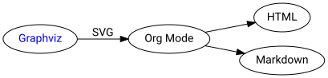
:end:

The following code overrides HTML and Markdown exports
to include SVGs.

#+begin_src emacs-lisp :results silent :tangle "lisp/sacha-org-export.el"
;;;###autoload
(defun sacha-ox-link-path (link _ info)
	(let* ((raw-path (org-element-property :path link)))
		(setq raw-path
					(org-export-file-uri
					 (org-publish-file-relative-name raw-path info)))
		;; Possibly append `:html-link-home' to relative file
		;; name.
		(let ((home (and (plist-get info :html-link-home)
										 (org-trim (plist-get info :html-link-home)))))
			(when (and home
								 (plist-get info :html-link-use-abs-url)
								 (not (file-name-absolute-p raw-path)))
				(setq raw-path (concat (file-name-as-directory home) raw-path))))
		raw-path))

;;;###autoload
(defun sacha-org-html-link (link desc info)
	(if (and
			 (string= (org-element-property :type link) "file")
			 (not (plist-get (org-export-read-attribute :attr_html (org-element-parent-element link))
											 :data-link))
			 (org-export-inline-image-p link (plist-get info :html-inline-image-rules)))
			(let ((path (org-element-property :path link))
						(attr (org-export-read-attribute :attr_html (org-element-parent-element link))))
				(if (string= (file-name-extension path) "svg")
						(with-temp-buffer
              (set-buffer-multibyte t)
							(insert-file-contents path)
							(if attr
									(replace-regexp-in-string
									 "<svg "
									 (concat
										"<svg "
										(org-html--make-attribute-string attr)
										" ")
									 (buffer-string))
								(buffer-string)))
					(org-html-link link desc info)))
		(org-html-link link desc info)))

;;;###autoload
(defun sacha-org-md-link (link desc info)
	(if (and (string= (org-element-property :type link) "file")
					 (not (plist-get (org-export-read-attribute :attr_html (org-element-parent-element link))
											 :data-link)))
			(let ((path (org-element-property :path link)))
				(if (string= (file-name-extension path) "svg")
						(with-temp-buffer
							(insert-file-contents-literally path)
							(buffer-string))
					(org-md-link link desc info)))
		(org-md-link link desc info)))

;;;###autoload
(defun sacha-org-11ty-link (link desc info)
	(if (and (string= (org-element-property :type link) "file")
					 (not (plist-get (org-export-read-attribute :attr_html (org-element-parent-element link))
													 :data-link))
					 (not desc))
			(let ((path (org-element-property :path link))
						(attr (org-export-read-attribute :attr_html (org-element-parent-element link))))
				(if (string= (file-name-extension path) "svg")
						(with-temp-buffer
              (set-buffer-multibyte t)
							(insert-file-contents path)
							(if attr
									(replace-regexp-in-string
									 "<svg "
									 (concat
										"<svg "
										(org-html--make-attribute-string attr)
										" ")
									 (buffer-string))
								(buffer-string)))
					(org-11ty-link link desc info)))
		(org-11ty-link link desc info)))
#+end_src

#+begin_src emacs-lisp :results silent :tangle "lisp/sacha-org-export.el"
(with-eval-after-load 'ox-html
	(setf
	 (alist-get 'link (org-export-backend-transcoders (org-export-get-backend 'html)))
	 'sacha-org-html-link))
(with-eval-after-load 'ox-md
	(setf
	 (alist-get 'link (org-export-backend-transcoders (org-export-get-backend 'md)))
	 'sacha-org-md-link))
(with-eval-after-load 'ox-11ty
	(setf
	 (alist-get 'link (org-export-backend-transcoders (org-export-get-backend '11ty)))
	 'sacha-org-11ty-link))
#+end_src

**** Org Mode: Export HTML, copy files, and serve the results via simple-httpd so that media files work
:PROPERTIES:
:CUSTOM_ID: org-mode-publishing-html-export-html-copy-files-and-serve-via-simple-httpd
:EXPORT_DATE: 2026-03-14T16:43:37-0400
:EXPORT_ELEVENTY_PERMALINK: /blog/2026/03/org-mode-export-html-copy-files-and-serve-the-results-via-simple-httpd-so-that-media-files-work/
:EXPORT_ELEVENTY_FILE_NAME: blog/2026/03/org-mode-export-html-copy-files-and-serve-the-results-via-simple-httpd-so-that-media-files-work/
:EXPORT_MODIFIED: 2026-03-23T21:17:29-0400
:END:

#+begin_update
[2026-03-23]: _Update_ Oh, ignore all of this! For some reason, when I export the regular Org Mode way, my media files work. Maybe it was just a weird hiccup!
#+end_update

In Org Mode, when you use "Export to HTML - As HTML file and open", the resulting HTML file is loaded using a =file://= URL. This means you can't load any media files. In my post about [[https://sachachua.com/blog/2026/03/comparing-pronunciation-recordings-across-time/][pronunciation practice]], I wanted to test the playback without waiting for my 11ty-based static site generator to churn through the files.

package:simple-httpd lets you run a web server from Emacs. By default, the =httpd-root= is =~/public_html= and =httpd-port= is =8085=, but you can configure it to be somewhere else. Here I set it up to create a new temporary directory, and to delete that directory afterwards.

#+begin_src emacs-lisp :eval never-export
(use-package simple-httpd
  :config
  (setq httpd-root (make-temp-file "httpd" t))
  :hook
  (httpd-stop . sacha-simple-httpd-remove-temporary-root)
  (kill-emacs . httpd-stop))
#+end_src

#+begin_src emacs-lisp :eval never-export :tangle "lisp/sacha-web.el"
;;;###autoload
(defun sacha-simple-httpd-remove-temporary-root ()
  "Remove `httpd-root' only if it's a temporary directory."
  (when (file-in-directory-p httpd-root temporary-file-directory)
    (delete-directory httpd-root t)))
#+end_src

The following code exports your Org buffer or subtree to a file in that directory, copies all the referenced local files (if they're newer) and updates the links in the HTML, and then serves it via simple-httpd. Note that it just overwrites everything without confirmation, so if you refer to files with the same name, only the last one will be kept.

#+begin_src emacs-lisp
(with-eval-after-load 'ox
  (org-export-define-derived-backend 'sacha-html-served 'html
    :menu-entry
    '(?s "Export to HTML and Serve"
         ((?b "Buffer"  sacha-org-serve-buffer)
          (?s "Subtree" sacha-org-serve-subtree)))))
#+end_src

#+begin_src emacs-lisp :tangle "lisp/sacha-org-export.el"
;;;###autoload
(defun sacha-org-serve-buffer (&optional async _subtreep visible-only body-only ext-plist)
  (sacha-org-export-and-serve nil))

;;;###autoload
(defun sacha-org-serve-subtree (&optional async _subtreep visible-only body-only ext-plist)
  (sacha-org-export-and-serve t))

;; Based on org-11ty--copy-files-and-replace-links
;; Might be a good idea to use something DOM-based instead
(defun sacha-html-copy-files-and-replace-links (info &optional destination-dir)
  (let ((file-regexp "\\(?:src\\|href\\|poster\\)=\"\\(\\(file:\\)?.*?\\)\"")
        (destination-dir (or destination-dir (file-name-directory (plist-get info :file-path))))
        file-all-urls file-name beg
				new-file file-re
				unescaped)
    (unless (file-directory-p destination-dir)
      (make-directory destination-dir t))
    (unless (file-directory-p destination-dir)
      (error "%s is not a directory." destination-dir))
    (save-excursion
			(goto-char (point-min))
      (while (re-search-forward file-regexp nil t)
        (setq file-name (or (match-string 1) (match-string 2)))
				(unless (or (string-match "^#" file-name)
                    (get-text-property 0 'changed file-name))
					(setq file-name
                (replace-regexp-in-string
                 "\\?.+" ""
                 (save-match-data (if (string-match "^file:" file-name)
																		  (substring file-name 7)
																	  file-name))))
          (setq unescaped
                (replace-regexp-in-string
								 "%23" "#"
								 file-name))
					(setq new-file (concat
													(if info (plist-get info :permalink) "")
													(file-name-nondirectory unescaped)))
					(unless (org-url-p file-name)
            (let ((new-file-name (expand-file-name (file-name-nondirectory unescaped)
                                                   destination-dir)))
						  (condition-case err
                  (when (or (not (file-exists-p new-file-name))
                            (file-newer-than-file-p unescaped new-file-name))
							      (copy-file unescaped new-file-name t))
							  (error nil))
						  (when (file-exists-p new-file-name)
							  (save-excursion
								  (goto-char (point-min))
								  (setq file-re (concat "\\(?: src=\"\\| href=\"\\| poster=\"\\)\\(\\(?:file://\\)?" (regexp-quote file-name) "\\)"))
								  (while (re-search-forward file-re nil t)
									  (replace-match
                     (propertize
                      (save-match-data (replace-regexp-in-string "#" "%23" new-file))
                      'changed t)
										 t t nil 1)))))))))))

;;;###autoload
(defun sacha-org-export-and-serve (&optional subtreep)
  "Export current org buffer (or subtree if SUBTREEP) to HTML and serve via simple-httpd."
  (interactive "P")
  (require 'simple-httpd)
  (httpd-stop)
  (unless httpd-root (error "Set `httpd-root'."))
  (unless (file-directory-p httpd-root)
    (make-directory httpd-root t))
  (unless (file-directory-p httpd-root)
    (error "%s is not a directory." httpd-root))
  (let* ((out-file (expand-file-name (concat (file-name-base (buffer-file-name)) ".html")
                                     httpd-root))
         (html-file (org-export-to-file 'sacha-html-served out-file nil subtreep)))
    ;; Copy all the files and rewrite all the links
    (with-temp-file out-file
      (insert-file-contents out-file)
      (sacha-html-copy-files-and-replace-links
       `(:permalink "/") httpd-root))
    (httpd-start)
    (browse-url (format "http://localhost:%d/%s"
                        httpd-port
                        (file-name-nondirectory html-file)))))
#+end_src

Now I can use =C-c C-e= (=org-export-dispatch=), select the subtree with =C-s=, and use =s s=
to export a subtree to a webserver and have all the media files work. This took 0.46 seconds for my post on pronunciation practice and automatically opens the page in a browser window. In comparison, my 11ty static site generator took 5.18 seconds for a subset of my site (1630 files copied, 214 files generated), and I haven't yet hooked up monitoring it to Emacs, so I have to take an extra step to open the page in the browser when I think it's finished. I think exporting to HTML and serving it with simple-httpd will be much easier for simple cases like this, and then I can export to 11ty once I'm done with the basic checks.

*** 11ty static site generation
:PROPERTIES:
:CUSTOM_ID: 11ty
:END:

#+begin_src emacs-lisp
(use-package ox-11ty
  :if sacha-laptop-p
  :load-path "~/proj/ox-11ty"
	:preface (load "~/proj/ox-11ty-autoloads.el" nil t)
	:config
	(setq org-html-toplevel-hlevel 3)
	(setq org-11ty-skip-private-files-regexp "\\(Inbox\\|organizer\\|business\\)\.org\\|gpg$\\|private\\|secret")
	(advice-add 'org-11ty--front-matter :filter-return #'sacha-org-11ty-rewrite-tags))
#+end_src

#+begin_src emacs-lisp :tangle "lisp/sacha-org-11ty.el"
(defvar sacha-org-11ty-serve-process nil)

;;;###autoload
(defun sacha-org-11ty-rewrite-tags (info)
	"Turn OneWordTags into one-word-tags."
	(require 's)
	(dolist (field '(:categories :tags))
		(when (plist-get info field)
			(plist-put info field
								 (mapcar (lambda (s)
													 (if (string-match "^_" s)
															 s
														 (s-dashed-words s)))
												 (plist-get info field)))))
	info)

(defvar sacha-11ty-remote-dir "/ssh:web:/var/www/static-blog")
(defvar sacha-11ty-base-dir "~/proj/static-blog")
(defvar sacha-11ty-site-dir (expand-file-name "_site" sacha-11ty-base-dir))
(defvar sacha-11ty-local-dir (expand-file-name "_local" sacha-11ty-base-dir))

;;;###autoload
(defun sacha-org-11ty-unpublish-current-post ()
	(interactive)
	(cond
	 ((derived-mode-p 'org-mode)
		(when (org-entry-get (point) "EXPORT_ELEVENTY_FILE_NAME")
			(let ((filename (org-entry-get (point) "EXPORT_ELEVENTY_FILE_NAME")))
				(dolist (dir (list sacha-11ty-site-dir sacha-11ty-local-dir sacha-11ty-remote-dir sacha-11ty-base-dir))
					(condition-case nil
							(when (and dir (file-directory-p (expand-file-name filename dir)))
								(delete-directory (expand-file-name filename dir) t))
						(error nil)))
				(org-delete-property "EXPORT_ELEVENTY_FILE_NAME")
				(org-delete-property "EXPORT_DATE")
				(org-delete-property "EXPORT_ELEVENTY_PERMALINK"))))
	 ((derived-mode-p '(html-mode web-mode))
		;; called from an index.html or page.html, maybe?
		(let* ((file (buffer-file-name))
					 (json-file (concat (file-name-sans-extension (buffer-file-name))
															".11tydata.json"))
					 (json-data (and (file-exists-p json-file)
													 (json-read-file json-file))))
			;; delete the published files
			(when (alist-get 'permalink json-data)
				(dolist (dir (list sacha-11ty-site-dir sacha-11ty-local-dir sacha-11ty-remote-dir))
					(condition-case nil
							(when (and dir (file-directory-p
															(expand-file-name (concat "." (alist-get 'permalink json-data)) dir)))
								(delete-directory (expand-file-name (concat "." (alist-get 'permalink json-data)) dir) t))
						(error nil))))
			;; delete the .json and the .html file
			(when (file-exists-p json-file)
				(delete-file json-file))
			(kill-buffer (current-buffer))
			(delete-file file)))))

(defalias 'sacha-org-11ty-delete-current-post #'sacha-org-11ty-unpublish-current-post)

;;;###autoload
(defun sacha-org-11ty-copy-permalink ()
	(interactive)
	(kill-new (concat "https://sachachua.com" (org-entry-get (point) "EXPORT_ELEVENTY_PERMALINK"))))

;;;###autoload
(defun sacha-org-11ty-browse-local ()
	(interactive)
	(unless (seq-find (lambda (o) (string-match "--serve" (assoc-default 'args (cdr o) nil "")))
										(proced-process-attributes))
		(let ((default-directory "~/proj/static-blog"))
			(setq sacha-org-11ty-serve-process (start-process "serve" nil "make" "serve"))))
	(browse-url "http://localhost:8080/blog"))

;;;###autoload
(defun sacha-org-11ty-serve-stop ()
	(interactive)
	(if (process-live-p sacha-org-11ty-serve-process)
			(stop-process sacha-org-11ty-serve-process)
		(when-let ((proc (seq-find (lambda (o) (string-match "--serve" (assoc-default 'args (cdr o) nil "")))
															 (proced-process-attributes))))
			(call-process "kill" nil nil nil (number-to-string) (car proc)))))


;;;###autoload
(defun sacha-org-11ty-prepare-subtree ()
  (interactive)
  (unless (or (org-entry-get (point) "EXPORT_DATE")
              (org-entry-get-with-inheritance "DATE"))
    (org-entry-put (point) "EXPORT_DATE" (format-time-string "%Y-%m-%dT%T%z")))
  (let ((path (concat "blog/" (format-time-string "%Y/%m/")
                      (sacha-make-slug (org-get-heading t t t t))
                      "/")))
    (unless (org-entry-get (point) "EXPORT_ELEVENTY_PERMALINK")
      (org-entry-put (point) "EXPORT_ELEVENTY_PERMALINK" (concat "/" path)))
    (unless (org-entry-get (point) "EXPORT_ELEVENTY_FILE_NAME")
      (org-entry-put (point) "EXPORT_ELEVENTY_FILE_NAME" path))))

(with-eval-after-load '11ty
	(advice-add
	 'org-11ty-export-to-11tydata-and-html
	 :before
	 (lambda (&optional _ subtreep &rest _)
		 (when (and subtreep (not (org-entry-get-with-inheritance "EXPORT_ELEVENTY_PERMALINK")))
			 (sacha-org-11ty-prepare-subtree)))))

;;;###autoload
(defun sacha-org-11ty-rename-subtree ()
	(interactive)
	(let ((new-path (concat "blog/" (format-time-string "%Y/%m/")
													(sacha-make-slug (org-get-heading t t t t))
													"/")))
		(when (not (string= new-path (org-entry-get (point) "EXPORT_ELEVENTY_FILE_NAME")))
			(when
					(file-exists-p (expand-file-name
													(org-entry-get (point) "EXPORT_ELEVENTY_FILE_NAME")
													sacha-11ty-base-dir))
				(rename-file (expand-file-name
											(org-entry-get (point) "EXPORT_ELEVENTY_FILE_NAME")
											sacha-11ty-base-dir)
										 (expand-file-name
											new-path
											sacha-11ty-base-dir)))
			(org-entry-put (point) "EXPORT_ELEVENTY_PERMALINK" (concat "/" path))
			(org-entry-put (point) "EXPORT_ELEVENTY_FILE_NAME" path))))
;;;###autoload
(defun sacha-11ty-convert-to-njk ()
  (interactive)
  (let* ((filename (buffer-file-name))
         (old-buffer (current-buffer))
         (new-name (concat (file-name-base filename) ".njk")))
    (save-buffer)
    (rename-file filename new-name)
    (find-file new-name)
    (kill-buffer old-buffer)))

;;;###autoload
(defun sacha-11ty-browse-page ()
  (interactive)
  (if (org-entry-get-with-inheritance "EXPORT_ELEVENTY_PERMALINK")
      (browse-url (concat "http://localhost:8080" (org-entry-get-with-inheritance "EXPORT_ELEVENTY_PERMALINK")))
    (let* ((json-object-type 'plist)
           (data (json-read-file (concat (file-name-base (buffer-file-name)) ".11tydata.json"))))
      (browse-url (concat "http://localhost:8080" (plist-get data :permalink))) )))

;;;###autoload
(defun sacha-org-11ty-pathname ()
	(if (derived-mode-p 'org-mode)
			(file-name-directory (org-entry-get-with-inheritance "EXPORT_ELEVENTY_FILE_NAME"))
		(let ((url (thing-at-point 'url)))
			(when url
				(url-file-directory (url-filename (url-generic-parse-url url)))))))

;;;###autoload
(defun sacha-org-11ty-find-post (url)
	(interactive (list (sacha-org-11ty-pathname)))
	;; check in posts.org
	(find-file "~/sync/orgzly/posts.org")
	(let ((pos (org-find-property "EXPORT_ELEVENTY_PERMALINK" url)))
		(when pos (goto-char pos))))

;;;###autoload
(defun sacha-org-11ty-find-file (file)
  (interactive
	 (list
		(completing-read
		 (if (sacha-org-11ty-pathname)
				 (format "Post (%s): " (concat "/" (sacha-org-11ty-pathname)))
			 "Post: ")
		 (mapcar (lambda (o) (replace-regexp-in-string "^~/proj/static-blog\\|index.html$" "" o))
						 (directory-files-recursively "~/proj/static-blog/blog" "index\\.html" nil))
		 nil nil nil nil (concat "/" (sacha-org-11ty-pathname)))))
  (find-file
	 (expand-file-name
		"index.html"
		(expand-file-name
		 (concat "." file)
		 "~/proj/static-blog"))))

;;;###autoload
(defun sacha-org-11ty-post-to-mastodon (&optional post-automatically)
  (interactive (list current-prefix-arg))
  (let ((message (concat (org-entry-get (point) "ITEM") " https://sachachua.com" (org-entry-get (point) "EXPORT_ELEVENTY_PERMALINK"))))
    (if post-automatically
        (sacha-mastodon-toot-public-string message)
      (mastodon-toot)
      (insert message))))

;; https://kitchingroup.cheme.cmu.edu/blog/2013/05/05/Getting-keyword-options-in-org-files/
;;;###autoload
(defun sacha-org-keywords ()
  "Parse the buffer and return a cons list of (property . value).
This is extracted from lines like:
,#+PROPERTY: value"
  (org-element-map (org-element-parse-buffer 'element) 'keyword
    (lambda (keyword) (cons (org-element-property :key keyword)
                            (org-element-property :value keyword)))))

;;;###autoload
(defun sacha-11ty-copy-file-and-insert-into-org (filename caption)
  (interactive (list (read-file-name "File: ")
                     (read-string "Caption: ")))
	(let ((path (expand-file-name
							 (file-name-nondirectory filename)
							 (expand-file-name
								(org-entry-get-with-inheritance
								 "EXPORT_ELEVENTY_FILE_NAME")
								(assoc-default "ELEVENTY_BASE_DIR" (sacha-org-keywords)))
							 )))
		(copy-file filename path t)
		(insert "#+CAPTION: " caption "\n"
						(org-link-make-string (concat "file:" path)) "\n")))
#+end_src

#+begin_src emacs-lisp :tangle "lisp/sacha-org.el"
;;;###autoload
(defun sacha-org-replace-with-permalink ()
	(interactive)
	(let* ((elem (org-element-context))
				 (path (org-element-property :path elem))
				 (description (org-element-property :description elem))
				 (type (org-element-property :type elem))
				 (permalink (org-entry-get (point) "EXPORT_ELEVENTY_PERMALINK" t))
				 (base-url sacha-blog-base-url))
		(when (member type '("file" "audio" "video"))
			(delete-region (org-element-begin elem) (org-element-end elem))
			(insert (org-link-make-string (concat
																		 (if (string= type "file") "" (concat type ":"))
																		 base-url permalink (file-name-nondirectory path))
																		description)))))
#+end_src

**** DONE Linking to blog topics
CLOSED: [2024-10-18 Fri 17:55]
:PROPERTIES:
:Effort:   0:30
:QUANTIFIED: Emacs
:CUSTOM_ID: org-mode-publishing-11ty-static-site-generation-linking-to-blog-topics
:END:
:LOGBOOK:
- State "DONE"       from "STARTED"    [2024-10-18 Fri 17:55]
CLOCK: [2024-10-18 Fri 17:43]--[2024-10-18 Fri 17:51] =>  0:08
:END:

#+begin_src emacs-lisp :tangle lisp/sacha-org.el
;;;###autoload
(defun sacha-org-topic-open (link &rest _)
	"Find the post."
	(if (string-match "\\(.*\\)#\\(.+\\)" link)
			(let ((file (match-string 1 link))
						(anchor (match-string 2 link)))
				(find-file (format "~/sync/topics/%s.org" file))
				(goto-char (org-find-property "CUSTOM_ID" anchor)))
		(find-file (format "~/sync/topics/%s.org" link))))

;;;###autoload
(defun sacha-org-topic-export (link desc format _)
	(let ((path (concat (if (eq format '11ty) "/" "https://sachachua.com/")
											"topic/"
											(replace-regexp-in-string
											 "\\.html$" "/"
											 (replace-regexp-in-string
												"^/\\|index.html$" ""
												(replace-regexp-in-string "^index" ""
																									link))))))
		(pcase format
			((or 'html '11ty) (format "<a href=\"%s\">%s</a>" path (or desc link)))
      ('latex (format "\\href{%s}{%s}" path desc))
      ('texinfo (format "@uref{%s,%s}" path desc))
      ('ascii (if desc (format "%s (%s)" desc path)
								path)))))

;;;###autoload
(defun sacha-org-topic-complete ()
	(format "%stopic/%s/"
					sacha-blog-base-url
					(completing-read
					 "Topic: "
					 (mapcar (lambda (o) (file-name-base o))
									 (directory-files "~/sync/topics" "\\.org" nil)))))

;;;###autoload
(defun sacha-org-topic-store ()
	(when (and (derived-mode-p 'org-mode)
						 (buffer-file-name)
						 (string-match "/home/sacha/sync/topics/"
													 (expand-file-name (buffer-file-name))))
		(let ((props (org-collect-keywords '("TITLE")))
					(id (org-entry-get-with-inheritance "CUSTOM_ID")))
			(org-link-store-props
			 :link
			 (concat
				"topic:" (file-name-base (buffer-file-name))
				(if id
						(concat "#" id)
					""))
			 :description
			 (save-excursion
				 (if id (progn
									(goto-char (org-find-property "CUSTOM_ID" id))
									(org-entry-get (point) "ITEM"))
					 (car (assoc-default "TITLE" props #'string=))))))))
#+end_src

#+begin_src emacs-lisp
(with-eval-after-load 'org
  (org-link-set-parameters
	 "topic"
	 :follow #'sacha-org-topic-open
	 :store #'sacha-org-topic-store
	 :insert-description #'sacha-org-link-insert-description
	 :export #'sacha-org-topic-export
	 :complete #'sacha-org-topic-complete))
#+end_src

#+RESULTS:
:results:
(:follow sacha-org-topic-open :insert-description sacha-org-link-insert-description :export sacha-org-topic-export :complete sacha-org-topic-complete)
:end:

**** Linking to blog posts
:PROPERTIES:
:CUSTOM_ID: linking-to-blog-posts
:END:

#+begin_update
- [2024-01-19 Fri]: added link description
#+end_update

#+NAME: org-blog-link
#+begin_src emacs-lisp :tangle "lisp/sacha-org.el"
(defvar sacha-blog-base-url "https://sachachua.com/")

;;;###autoload
(defun sacha-org-blog-complete ()
  "Select a blog post and return its URL."
  (sacha-blog-url (sacha-consult-blog-posts-by-title)))

;;;###autoload
(defun sacha-org-blog-export (link desc format _)
	(let ((path (concat (if (eq format '11ty) "/" sacha-blog-base-url)
											(replace-regexp-in-string "\\.html$" "/"
																								(replace-regexp-in-string "^/\\|index.html$" ""
																																					link)))))
		(pcase format
			((or 'html '11ty) (format "<a href=\"%s\">%s</a>" path (or desc link)))
      ('latex (format "\\href{%s}{%s}" path desc))
      ('texinfo (format "@uref{%s,%s}" path desc))
      ('ascii (if desc (format "%s (%s)" desc path)
								path)))))

;;;###autoload
(defun sacha-11ty-html-filename (link)
	"Return the HTML file for LINK."
  (when (listp link) (setq link (assoc-default 'permalink link)))
	(setq link (replace-regexp-in-string (concat "^blog:\\|" (regexp-quote sacha-blog-base-url)) "" link))
	(when (string-match "^/" link) (setq link (concat "." link)))
  (if (file-exists-p link)
			link
		(or (catch 'found
					(dolist (f
									 (list
										(expand-file-name "index.html"
																			(expand-file-name
																			 link
																			 sacha-11ty-base-dir))
										(expand-file-name "index.html"
																			(expand-file-name
																			 link
																			 (expand-file-name "blog" sacha-11ty-base-dir)))
										(replace-regexp-in-string
										 "/$" ".html"
										 (expand-file-name
											link
											sacha-11ty-base-dir))))
						(if (and f (file-exists-p f))
								(throw 'found f))))
				(error "%s not found" link))))

;;;###autoload
(defun sacha-org-blog-open (link &rest _)
	"Find the post if it exists, or open the HTML."
	(with-current-buffer (find-file-noselect "~/sync/orgzly/posts.org")
		(let ((pos (org-find-property "EXPORT_ELEVENTY_PERMALINK" link)))
			(if pos
					(progn (goto-char pos) (switch-to-buffer (current-buffer)))
				(when-let ((filename (sacha-11ty-html-filename link)))
					(find-file filename))))))

;;;###autoload
(defun sacha-org-link-insert-description (link &optional description)
	(unless description
		(sacha-blog-title (sacha-org-link-as-url link))))

;;;###autoload
(defun sacha-org-blog-store ()
	(when (derived-mode-p 'org-mode)
		(let* ((props (org-collect-keywords '("ELEVENTY_PERMALINK"
																					"ELEVENTY_BASE_URL"
																					"TITLE")))
					 (permalink
						(or (org-entry-get-with-inheritance "EXPORT_ELEVENTY_PERMALINK")
								(car (assoc-default "ELEVENTY_PERMALINK" props #'string=)))))
			(when permalink
				(org-link-store-props
				 :link
				 (concat
					(replace-regexp-in-string "/$" "" sacha-blog-base-url) permalink
					(if (org-entry-get-with-inheritance "CUSTOM_ID")
							(concat "#" (org-entry-get-with-inheritance "CUSTOM_ID"))
						""))
				 :description
				 (save-excursion
					 (goto-char (or (org-find-property "EXPORT_ELEVENTY_PERMALINK" permalink)
													(point-min)))
					 (or (org-entry-get (point) "ITEM")
							 (car (assoc-default "TITLE" props #'string=)))))))))
#+end_src

#+begin_src emacs-lisp
(with-eval-after-load 'org
	(org-link-set-parameters
	 "blog"
	 :follow #'sacha-org-blog-open
	 :store #'sacha-org-blog-store
	 :insert-description #'sacha-org-link-insert-description
	 :export #'sacha-org-blog-export
	 :complete #'sacha-org-blog-complete))
#+end_src

***** DONE List all blog posts that match a category or title search
CLOSED: [2024-10-25 Fri 11:02]
:PROPERTIES:
:CREATED: [2024-10-25 Fri 10:48]
:Effort:   0:30
:QUANTIFIED: Emacs
:CUSTOM_ID: org-mode-publishing-11ty-static-site-generation-linking-to-blog-posts-list-all-blog-posts-that-match-a-category-or-title-search
:END:
:LOGBOOK:
- State "DONE"       from "STARTED"    [2024-10-25 Fri 11:02]
CLOCK: [2024-10-25 Fri 10:48]--[2024-10-25 Fri 11:02] =>  0:14
:END:
[[dotemacs:monthly-reviews][Monthly reviews]]

#+begin_src emacs-lisp :tangle "lisp/sacha-blog.el"
;;;###autoload
(defun sacha-11ty-list-all-matching-blog-posts (match)
	(interactive "MMatch: ")
	(mapc (lambda (o)
					(when (or (string-match match (alist-get 'title o))
										(member match (alist-get 'categories o)))
						(insert "- "
										(org-link-make-string
										 (concat sacha-blog-base-url (alist-get 'permalink o))
										 (alist-get 'title o))
										"\n")))
				(sacha-blog-posts)))
#+end_src

***** Making it easier to add a category to a blog post  :embark:
:PROPERTIES:
:Effort:   0:30
:QUANTIFIED: Coding
:CUSTOM_ID: org-mode-publishing-11ty-static-site-generation-linking-to-blog-posts-making-it-easier-to-add-a-category-to-a-blog-post
:END:
:LOGBOOK:
CLOCK: [2024-10-16 Wed 10:07]--[2024-10-16 Wed 10:22] =>  0:15
:END:

I want to be able to quickly add a category to a post when I'm looking at the file or when I'm working with a link.

#+begin_src emacs-lisp :tangle "lisp/sacha-blog.el"
  ;;;###autoload
  (defun sacha-11ty-complete-blog-post ()
    (completing-read
     "Post: "
     (mapcar (lambda (o)
  	     (file-name-directory (file-relative-name o sacha-11ty-base-dir)))
  	   (directory-files-recursively (expand-file-name "blog" sacha-11ty-base-dir) "index\\.html" nil))))
  ;;;###autoload
  (defun sacha-11ty-ripgrep ()
    (interactive)
    (consult-ripgrep (expand-file-name "blog" sacha-11ty-base-dir)))

  ;;;###autoload
  (defun sacha-11ty-post-categories (file)
    (assoc-default 'categories
  		 (let ((json-object-type 'alist)
  		       (json-array-type 'list))
  		   (json-read-file (sacha-11ty-json-filename file)))))

  ;;;###autoload
  (defun sacha-11ty-add-category-tag (cat)
    (interactive (list (sacha-11ty-complete-category "Category: ")))
    (org-set-tags (cons cat (org-get-tags))))

  ;;;###autoload
  (defun sacha-11ty-complete-category (prompt &optional categories)
    (let ((all-categories
  	 (json-read-file
  	  (expand-file-name "siteCategories.json"
  			    (expand-file-name "_data" sacha-11ty-base-dir)))))
      (completing-read
       (if categories
  	 (format  "%s(current: %s) "
  		  prompt
  		  (string-join categories ", "))
         prompt)
       (mapcar (lambda (c) (assoc-default 'slug c))
  	     all-categories))))

  ;;;###autoload
  (defun sacha-11ty-json-filename (path)
    (concat (file-name-sans-extension (sacha-11ty-html-filename path)) ".11tydata.json"))

  ;;;###autoload
  (defun sacha-11ty-change-details (file modify-func)
    (let* ((json-object-type 'alist)
  	 (json-array-type 'list)
  	 (json-file (sacha-11ty-json-filename file))
  	 (json (funcall modify-func (json-read-file json-file))))
      (when json
        (with-temp-file json-file
  	(insert (json-encode json)))
        json-file)))

  ;;;###autoload
  (defun sacha-11ty-add-category-to-post (file new-category)
    (interactive (list (buffer-file-name)
  		     (sacha-11ty-complete-category "Add category: "
  						(sacha-11ty-post-categories file))))
    (sacha-11ty-change-details
     file
     (lambda (json)
       (let ((categories (assoc-default 'categories json)))
         (if categories
  	   (unless (member new-category categories)
  	     (setcdr (assoc 'categories json)
  		     (cons new-category categories)))
  	 (setq json (cons (cons 'categories (cons new-category categories)) json)))
         json))))
#+end_src

Then it makes sense to be able to work with blog URLs from an Embark action:

#+begin_src emacs-lisp :lexical t :tangle "lisp/sacha-embark.el"
  ;;;###autoload
  (defun sacha-embark-org-blog-target ()
    "Identify when we're looking at a blog link."
    (cond
     ((and (derived-mode-p 'org-mode)
  	 (let ((context (org-element-context)))
  	   (and (org-element-type-p context 'link)
  		(cond
  		 ((string= (org-element-property :type context) "blog")
  		  (cons 'sacha-blog (org-element-property :path (org-element-context))))
  		 ((string-match "//sachachua.com\\(.+\\)" (org-element-property :path context))
  		  (cons 'sacha-blog (match-string 1 (org-element-property :path context))))))))
      )))

  ;;;###autoload
  (defun sacha-embark-org-blog-add-category (blog &optional category)
    (interactive (list (sacha-org-blog-complete)))
    (unless category
      (setq category
  	  (sacha-11ty-complete-category
  	   "Add category: "
  	   (sacha-11ty-post-categories (sacha-11ty-html-filename blog)))))
    (sacha-11ty-add-category-to-post (sacha-11ty-html-filename blog) category))

  ;;;###autoload
  (defun sacha-blog-url (path)
    (concat sacha-blog-base-url
            (replace-regexp-in-string (concat "^" (regexp-quote sacha-blog-base-url))
                                      ""
                                      (replace-regexp-in-string "^\\(blog:\\)?/" ""
                                                                (if (stringp path)
                                                                    path
                                                                  (assoc-default 'permalink path))))))

  ;;;###autoload
  (defun sacha-embark-org-blog-open-in-browser (path)
    (interactive (list (sacha-consult-blog-posts-by-title)))
    (browse-url (sacha-blog-url path)))

  ;;;###autoload
  (defun sacha-embark-blog-insert-link (post)
    (interactive (list (sacha-consult-blog-posts-by-title)))
    (when (looking-back "\\]\\]")         ; end of a link, add a space
      (insert ", "))
    (sacha-org-insert-link-dwim (sacha-blog-url post)
                             (and (listp post) (assoc-default 'title post))))

  ;;;###autoload
  (defun sacha-11ty-exported-org-filename (info)
    "Return the exported .org file for INFO, or nil if there isn't any."
    (when (stringp info) (setq info (sacha-blog-post-info-for-url info)))
    (let-alist info
      (let* ((org (and .permalink (expand-file-name "index.org" (expand-file-name (concat "." .permalink) sacha-11ty-base-dir)))))
        (cond
         ((and org (file-exists-p org))
          org)
         (.inputPath
          (expand-file-name .inputPath sacha-11ty-base-dir))))))

  ;;;###autoload
  (defun sacha-blog-post--position (info &optional find-file)
    "Return the file position marker for a blog post INFO.
  FIND-FILE is the file open function, defaulting to `consult--file-action'."
    (when (stringp info) (setq info (sacha-blog-post-info-for-url info)))
    (let (pos
          (files (delq nil
                       (list "~/sync/emacs/Sacha.org"
                             "~/sync/orgzly/posts.org"
                             (alist-get 'source_path info)
                             (sacha-11ty-exported-org-filename info))))
          (line-number (alist-get 'line_number info 0)))
      (when-let* ((source-path
                   (seq-find
                    (lambda (filename)
                      (with-current-buffer (find-file-noselect filename)
                        (save-excursion
                          (save-restriction
                            (widen)
                            (if (assoc-default 'anchor info)
                                (when-let* ((pos (org-find-property "CUSTOM_ID" (assoc-default 'anchor info))))
                                  (goto-char pos)
                                  (setq line-number (line-number-at-pos nil t))
                                  (buffer-file-name))
  			    (setq pos (org-find-property "EXPORT_ELEVENTY_PERMALINK" (assoc-default 'permalink info)))
  			    (when pos
                                (progn
                                  (goto-char pos)
                                  (when line-number
                                    (forward-line line-number))
                                  (setq line-number (line-number-at-pos nil t))
  				(buffer-file-name))))))))
                    files)))
        (consult--marker-from-line-column
         (funcall (or find-file #'consult--file-action) (file-truename source-path))
         line-number 0))))

  ;;;###autoload
  (defun sacha-blog-post-info-for-url (url &optional all-posts)
    "Return the alist for URL.
  The alist will have the following keys: permalink, date, title,
  categories, inputPath.  If URL has an anchor, add it as an anchor
  attribute.
  "
    (let (anchor entry)
      (if (listp url)
          url
        (when (string-match "#\\(.*\\)" url)
          (setq anchor (match-string 1 url))
          (setq url (replace-match "" nil nil url)))
        (setq url (replace-regexp-in-string
                   (concat "^" (regexp-quote sacha-11ty-base-dir)
                           "\\|^"
                           (regexp-quote (expand-file-name sacha-11ty-base-dir))
                           "\\|^"
                           (regexp-quote (file-truename sacha-11ty-base-dir))
                           "\\|index\\.org$\\|\\.org$") "" url))
        (when (string-match (regexp-quote sacha-blog-base-url) url)
          (setq url (substring url (match-end 0))))
        (when (string-match "\\?" url)
          (setq url (substring url 0 (match-beginning 0))))
        (unless (string-match "^/" url)
          (setq url (concat "/" url)))
        (setq entry
              (seq-find (lambda (o) (string= (alist-get 'permalink o) url))
                        (or all-posts (sacha-blog-posts))))
        (if anchor
            (cons `(anchor . ,anchor) entry)
          entry))))

  (ert-deftest sacha-blog-post-info-for-url--handle-hash ()
    "Tests `sacha-blog-post-info-for-url'."
    (should
     (equal
      (sacha-blog-post-info-for-url "/blog/2026/04/yayemacs-10-emacs-coaching-with-prot-packaging-emacs-lisp/#projects-experiment-with-learning-from-prot-yayemacs-10-emacs-coaching-with-prot-packaging-emacs-lisp-ideas-for-next-steps")
      '((anchor
         . "projects-experiment-with-learning-from-prot-yayemacs-10-emacs-coaching-with-prot-packaging-emacs-lisp-ideas-for-next-steps")
        (permalink
         . "/blog/2026/04/yayemacs-10-emacs-coaching-with-prot-packaging-emacs-lisp/")
        (date . "2026-04-04T02:23:03.000Z")
        (title
         . "#YayEmacs 10: Emacs coaching with Prot: Emacs workflows and streaming")
        (categories "emacs" "yay-emacs")
        (inputPath
         . "./blog/2026/04/yayemacs-10-emacs-coaching-with-prot-packaging-emacs-lisp/index.html")))))

  (ert-deftest sacha-blog-post-info-for-url ()
    (should
     (equal
      (sacha-blog-post-info-for-url
       "https://sachachua.com/blog/2025/10/added-multiple-timezone-support-to-casual-timezone-planner/"
       )
      '((permalink . "/blog/2025/10/added-multiple-timezone-support-to-casual-timezone-planner/")
        (date . "2025-10-08T13:53:11.000Z")
        (title . "Added multiple timezone support to casual-timezone-planner")
        (categories "emacs")
        (inputPath . "./blog/2025/10/added-multiple-timezone-support-to-casual-timezone-planner/index.html"))))
    (should
     (equal
      (sacha-blog-post-info-for-url
       "/blog/2021/03/org2blog-add-a-note-to-the-bottom-of-blog-posts-exported-from-sacha-config-file/")
      '((permalink . "/blog/2021/03/org2blog-add-a-note-to-the-bottom-of-blog-posts-exported-from-sacha-config-file/") (date . "2021-03-25T00:00:00.000Z") (title . "Add a note to the bottom of blog posts exported from my config file") (categories "emacs" "org") (inputPath . "./blog/2021/03/org2blog-add-a-note-to-the-bottom-of-blog-posts-exported-from-sacha-config-file.html")))))

  ;;;###autoload
  (defun sacha-blog-post--state ()
    "Blog post RAG search state function, managing preview window and cleanup."
    ;; These functions are closures captured when the state is initialized by consult--read
    (let ((preview (consult--jump-preview))
          (open (consult--temporary-files))
          (jump (consult--jump-state)))
      ;; The returned lambda is the actual preview function called by Consult
      (lambda (action cand)
        (unless cand
          (funcall open))
        (funcall preview action
                 (and (or (eq action 'preview))
                      (sacha-blog-post--position cand (and (not (eq action 'return)) open)))))))

  ;;;###autoload
  (defun sacha-11ty-current-post ()
    "Return the current blog post info if any."
    (cond
     ((derived-mode-p 'org-mode)
      (when (org-entry-get-with-inheritance "EXPORT_ELEVENTY_FILE_NAME")
        (let ((filename (org-entry-get-with-inheritance "EXPORT_ELEVENTY_FILE_NAME")))
          `((filename . ,filename)
            (permalink . ,(org-entry-get-with-inheritance "EXPORT_ELEVENTY_PERMALINK"))
            (title . ,(save-excursion
                        (save-restriction
                          (widen)
                          (goto-char (org-find-property "EXPORT_ELEVENTY_FILE_NAME" (org-entry-get-with-inheritance "EXPORT_ELEVENTY_FILE_NAME")))
                          (org-entry-get (point) "ITEM"))))
            (date . ,(org-entry-get-with-inheritance "EXPORT_DATE"))))))
     ((derived-mode-p '(html-mode web-mode))
      ;; called from an index.html or page.html, maybe?
      (let* ((file (buffer-file-name))
  	   (json-file (concat (file-name-sans-extension (buffer-file-name))
  			      ".11tydata.json"))
  	   (json-data (and (file-exists-p json-file)
  			   (json-read-file json-file))))
        (cons
         (cons 'filename file)
         json-data)))))

  ;;;###autoload
  (defun sacha-consult-blog-posts-by-title (&optional query)
    (interactive)
    (let* ((options
            (mapcar
             #'sacha-blog-format-for-completion
             (delq
              nil
              (append
               (list (sacha-11ty-current-post))
                                          ;todo: make a function to get the current blog post context
               (sort (sacha-blog-posts) :key (lambda (o) (alist-get 'date o)) :lessp #'string< :reverse t)
               nil))))
           (val (consult--read
                 options
                 :prompt "Search blog posts (exact): "
                 :category 'sacha-blog
                 :sort nil
                 :require-match nil
                 :state (sacha-blog-post--state)
                 :initial query)))
      nil
      (or (and (stringp val) (string-match "^https://\\|^/" val)
               (sacha-blog-post-info-for-url val))
          (get-text-property 0 'consult--candidate val)
          (assoc-default val options #'string=))))

  ;;;###autoload
  (defun sacha-blog-format-for-completion (result)
    (let-alist result
      (let* ((title (or .title "No Title"))
             (date (or .date "2000-01-01"))
             (year (substring date 0 4))
             (categories (string-join .categories ", "))
             (final-display
              (format "%-5s %s [%s]"
                      (propertize year 'face 'font-lock-comment-face) title categories)))
        (put-text-property 0 1 'consult--candidate result final-display)
        (cons final-display result))))
#+end_src

#+begin_src emacs-lisp :lexical t
  (with-eval-after-load 'embark
    (add-to-list 'embark-target-finders #'sacha-embark-org-blog-target)
    (defvar-keymap embark-sacha-blog-actions
      :parent embark-general-map
  		:doc "Shortcuts for my blog"
  		"h" #'sacha-blog-edit-html
  		"j" #'sacha-blog-edit-json
  		"e" #'sacha-blog-find-org
  		"c" #'sacha-embark-org-blog-add-category
      "i" #'sacha-embark-blog-insert-link
  		"b" #'sacha-embark-org-blog-open-in-browser)
    (add-to-list 'embark-keymap-alist '(sacha-blog . embark-sacha-blog-actions)))
#+end_src

Then I want to be able to add a category to all the blog posts in a region:

#+begin_src emacs-lisp :tangle "lisp/sacha-blog.el"
;;;###autoload
(defun sacha-11ty-add-category-to-all-posts-in-region (category beg end)
	(interactive (list (sacha-11ty-complete-category "Category: ")
										 (min (point) (mark))
										 (max (point) (mark))))
	(goto-char beg)
	(while (re-search-forward org-link-bracket-re end t)
		(sacha-11ty-add-category-to-post
		 (sacha-11ty-html-filename (org-element-property :raw-link (org-element-context)))
		 category)))
#+end_src

**** embark-11ty                                     :11ty:org:emacs:embark:
:PROPERTIES:
:CUSTOM_ID: embark-11ty
:END:

#+begin_src emacs-lisp :tangle "lisp/sacha-blog.el"
(defvar sacha-11ty-base-dir "~/proj/static-blog/")

;;;###autoload
(defun sacha-blog-edit-org (info)
	(interactive (list (sacha-consult-blog-posts-by-title)))
  (unless (listp info) (setq info (sacha-blog-post-info-for-url info)))
  (org-goto-marker-or-bmk (sacha-blog-post--position info)))

;;;###autoload
(defun sacha-blog-find-html (url)
  "Go to the HTML file for URL."
	(interactive (list (sacha-complete-blog-post-url)))
  (setq url (sacha-org-link-as-url url))
	(when (string-match "https://sachachua\\.com/\\(blog/.*\\)" url)
    (find-file
     (expand-file-name
      "index.html"
      (expand-file-name (match-string 1 url)
                        sacha-11ty-base-dir)))))

;;;###autoload
(defalias 'sacha-blog-find-org #'sacha-blog-edit-org)

#+end_src

#+begin_src emacs-lisp
(with-eval-after-load 'embark
	(define-key embark-url-map "v" #'sacha-blog-find-org)
	(define-key embark-org-link-map "v" #'sacha-blog-find-org))
#+end_src
**** Moving my Org post subtree to the 11ty directory :11ty:org:emacs:blogging:
:PROPERTIES:
:EXPORT_DATE: 2023-01-09T11:07:23-0500
:EXPORT_ELEVENTY_PERMALINK: /blog/2023/01/moving-sacha-org-post-subtree-to-the-11ty-directory/
:EXPORT_ELEVENTY_FILE_NAME: blog/2023/01/moving-sacha-org-post-subtree-to-the-11ty-directory/
:CUSTOM_ID: moving-sacha-org-post-subtree-to-the-11ty-directory
:END:

I sometimes want to move the Org source for my blog posts to the same
directory as the 11ty-exported HTML. This should make it easier to
update and reexport blog posts in the future. The following code
copies or moves the subtree to the 11ty export directory.

#+begin_src emacs-lisp :results silent :tangle "lisp/sacha-org.el"
;;;###autoload
(defun sacha-org-11ty-copy-subtree (&optional do-cut subtreep)
	"Copy the subtree for the current post to the 11ty export directory.
With prefix arg, move the subtree."
	(interactive (list current-prefix-arg))
	(let* ((info (org-combine-plists
								(org-export--get-export-attributes '11ty subtreep)
								(org-export--get-buffer-attributes)
								(org-export-get-environment '11ty subtreep)))
				 (file-properties
					(seq-filter (lambda (entry)
												(string-match (regexp-opt
																			 '("ELEVENTY_COLLECTIONS"
                                         "ELEVENTY_BASE_DIR"
                                         "ELEVENTY_BASE_URL"
																				 "TITLE"
																				 "ELEVENTY_CATEGORIES"
																				 "ELEVENTY_LAYOUT"))
																			(car entry)))
					            (org-element-map (org-element-parse-buffer) 'keyword
						            (lambda (el) (cons (org-element-property :key el)
																           (org-element-property :value el))))))
				 (entry-properties (org-entry-properties))
				 (filename (expand-file-name
										"index.org"
										(expand-file-name
										 (plist-get info :file-name)
										 (plist-get info :base-dir))))
				 (parent-pos
					(org-find-property
           "EXPORT_ELEVENTY_FILE_NAME"
					 (org-entry-get-with-inheritance "EXPORT_ELEVENTY_FILE_NAME")))
				 body)
		(unless (string= (buffer-file-name)
										 filename)
			(unless (file-directory-p (file-name-directory filename))
				(make-directory (file-name-directory filename) t))
			;; find the heading that sets the current EXPORT_ELEVENTY_FILE_NAME
			(if parent-pos
					(save-excursion
						(goto-char parent-pos)
						(org-copy-subtree 1 (if do-cut 'cut)))
				(setq body (buffer-string)))
			(with-temp-file filename
				(org-mode)
				(if subtreep
						(progn
							(insert
               (or
								(mapconcat
                 (lambda (o) (format "#+%s: %s" (car o) (cdr o)))
                 file-properties
                 "\n")
								"")
							 "\n")
							(org-yank))
					(insert body))))))
#+end_src

Then this adds a link to it:

#+begin_src emacs-lisp :results silent :tangle "lisp/sacha-org-export.el"
;;;###autoload
(defun sacha-org-export-filter-body-add-index-link (info)
  (when (and
				 (plist-get info :file-name)
				 (plist-get info :base-dir)
				 (file-exists-p (expand-file-name
												 "index.org"
												 (expand-file-name
													(plist-get info :file-name)
													(plist-get info :base-dir)))))
		(goto-char (point-max))
		(insert
		 (format "<div><a href=\"%sindex.org\">View Org source for this post</a></div>"
						 (plist-get info :permalink)))))
#+end_src

#+begin_src emacs-lisp :results silent
(with-eval-after-load 'ox-11ty
  (add-to-list 'org-11ty-process-export-functions #'sacha-org-export-filter-body-add-index-link))
#+end_src

Then I want to wrap the whole thing up in an export function:

#+begin_src emacs-lisp :tangle "lisp/sacha-org-export.el"
(defvar sacha-org-11ty-export-and-copy nil "*Non-nil means copy to site after specified delay (ex: \"5s\").")

;;;###autoload
(defun sacha-org-11ty-export (&optional async subtreep visible-only body-only ext-plist)
	(when (and subtreep (not (org-entry-get-with-inheritance "EXPORT_ELEVENTY_PERMALINK")))
		(sacha-org-11ty-prepare-subtree))
  (let* ((info (org-11ty--get-info subtreep visible-only))
         (file (org-11ty--base-file-name subtreep visible-only))
				 (permalink-slug (sacha-make-slug (plist-get info :permalink)))
				 (org-html-footnotes-section
					(format
					 "<div id=\"%s-footnotes\">\n<h3 class=\"footnotes\">%%s</h3>\n<div id=\"%s-text-footnotes\">\n%%s\n</div>\n</div>"
					 permalink-slug
					 permalink-slug)))
		(unless (or (string= (plist-get info :input-file)
										     (expand-file-name
											    "index.org"
											    (expand-file-name
											     (plist-get info :file-name)
											     (plist-get info :base-dir))))
                (plist-get (org-11ty--front-matter info) :no_source))
			(save-window-excursion
				(sacha-org-11ty-copy-subtree nil subtreep)))
		(org-11ty-export-to-11tydata-and-html async subtreep visible-only body-only ext-plist)
    (when sacha-org-11ty-export-and-copy
      (message "%s" "Scheduling copy...")
      (run-at-time sacha-org-11ty-export-and-copy nil
                   (lambda (url)
                     (sacha-org-11ty-copy-just-this-post
                      url))
                   (plist-get info :permalink)))))

;;;###autoload
(defun sacha-org-11ty-export-and-copy (&rest args)
  "Export and copy to website."
  (let ((sacha-org-11ty-export-and-copy "10"))
    (apply #'sacha-org-11ty-export args)))
#+end_src

Now to figure out how to override the export menu. Totally messy hack!

#+begin_src emacs-lisp
(with-eval-after-load 'ox-11ty
  ;; Only on my computer
	(map-put (caddr (org-export-backend-menu (org-export-get-backend '11ty)))
					 ?c (list "To Org, 11tydata.json, HTML" 'sacha-org-11ty-export))
  (map-put (caddr (org-export-backend-menu (org-export-get-backend '11ty)))
					 ?1 (list "...and copy to site" 'sacha-org-11ty-export-and-copy))
  )
#+end_src

**** Listing exported Org posts  :11ty:org:emacs:blogging:
:PROPERTIES:
:CUSTOM_ID: org-mode-publishing-11ty-static-site-generation-listing-exported-org-posts
:END:

Sometimes I want to process those exported files, but exclude some posts that are mostly long lists of links (Emacs News, monthly/weekly/yearly posts). This function returns a list of possibly-relevant filenames.

#+NAME: sacha-blog-org-files-except-reviews
#+begin_src emacs-lisp :tangle "lisp/sacha-blog.el"
;;;###autoload
(defun sacha-blog-org-files-except-reviews (after-date)
  "Return a list of recent .org files except for Emacs News and weekly/monthly/yearly reviews.
AFTER-DATE is in the form yyyy, yyyy-mm, or yyyy-mm-dd."
  (setq after-date (or after-date "2020"))
  (let ((after-month (substring after-date 0 7))
        (posts (sacha-blog-posts)))
    (seq-keep
     (lambda (filename)
       (when (not (string-match "[0-9][0-9][0-9][0-9]-[0-9][0-9]-[0-9][0-9]-emacs-news" filename))
         (when (string-match "/blog/\\([0-9]+\\)/\\([0-9]+\\)/" filename)
           (let ((month (match-string 2 filename))
                 (year (match-string 1 filename)))
             (unless (string> after-month
                              (concat year "-" month))
               (let ((info (sacha-blog-post-info-for-url (replace-regexp-in-string "~/proj/static-blog\\|index\\.org$\\|\\.org$" "" filename) posts)))
                 (let-alist info

                   (when (and
                          info
                          (string> .date after-date)
                          (not (seq-intersection .categories
                                                 '("emacs-news" "weekly" "monthly" "yearly")
                                                 'string=)))
                     filename))))))))
     (sort
      (directory-files-recursively "~/proj/static-blog/blog" "\\.org$")
      :lessp #'string<
      :reverse t))))
#+end_src

**** Include Mastodon, HN, Reddit fields in front matter
:PROPERTIES:
:CUSTOM_ID: org-mode-publishing-11ty-static-site-generation-include-mastodon-field-in-front-matter
:END:

#+begin_src emacs-lisp :tangle "lisp/sacha-org.el"
;;;###autoload
(defun sacha-org-11ty-add-mastodon-to-front-matter (front-matter info)
	(plist-put front-matter :mastodon (plist-get info :mastodon))
	(plist-put front-matter :hn (plist-get info :hn))
	(plist-put front-matter :reddit (plist-get info :reddit)))
#+end_src

#+begin_src emacs-lisp
(with-eval-after-load 'ox-11ty
	(pushnew
	 '(:mastodon "MASTODON" nil nil)
	 (org-export-backend-options (org-export-get-backend '11ty)))
	(pushnew
	 '(:hn "HN" nil nil)
	 (org-export-backend-options (org-export-get-backend '11ty)))
	(pushnew
	 '(:reddit "REDDIT" nil nil)
	 (org-export-backend-options (org-export-get-backend '11ty)))
	(add-hook 'org-11ty-front-matter-functions #'sacha-org-11ty-add-mastodon-to-front-matter))
#+end_src
**** Comments
:PROPERTIES:
:CUSTOM_ID: org-mode-publishing-11ty-static-site-generation-comments
:END:
#+begin_src emacs-lisp :tangle "lisp/sacha-blog.el"
;;;###autoload
(defun sacha-11ty-add-blog-comment (new-comment url)
	"Add COMMENT to URL.
COMMENT should be an alist with author, date (ISO8901 format), and message (HTML)."
	(let* ((filename (sacha-11ty-comment-file url))
				 (comments (sacha-11ty-comments url))
				 (comment-list (alist-get 'comments (alist-get 'disqus comments)))
				 (existing (and
										(alist-get 'postId new-comment)
										(seq-find (lambda (o)
																(string= (alist-get 'postId o)
																				 (alist-get 'postId new-comment)))
															comment-list))))
		(cond
		 (existing
			;; I think this is how you replace
			(setcar (member existing comment-list)
							new-comment))
		 (comment-list
			(push new-comment (alist-get 'comments (alist-get 'disqus comments)))
			(cl-incf (alist-get 'commentCount (alist-get 'disqus comments))))
		 (t
			(map-put! (alist-get 'disqus comments)
								'comments
								(list new-comment))
			(cl-incf (alist-get 'commentCount (alist-get 'disqus comments)))))
		(with-temp-file filename
			(insert
			 (json-encode comments))
			(json-pretty-print (point-min) (point-max)))
		filename))
#+end_src

*** TODO Copy Tasker task
:PROPERTIES:
:CUSTOM_ID: org-mode-publishing-copy-tasker-task
:END:

#+begin_src emacs-lisp :tangle "lisp/sacha-org.el"
;;;###autoload
(defun sacha-tasker-org-insert (url)
	(interactive "MTaskernet URL: ")
	(let* ((parts (url-path-and-query (url-generic-parse-url url)))
				 (params (url-parse-query-string (cdr parts)))
				 (xml-url (format
							 "https://taskernet.com/_ah/api/datashare/v1/sharedata/%s/%s?a=0&xml=true"
							 (url-hexify-string (car (assoc-default "user" params 'string=)))
							 (url-hexify-string (replace-regexp-in-string
																	 "\\+" " "
																	 (car (assoc-default "id" params 'string=))))))
				 (json-object-type 'alist)
				 (data (plz 'get
								 xml-url
								 :as
								 #'json-read))
				 filename)
		(setq filename (expand-file-name (concat (alist-get 'fileName data)
																						 "."
																						 (alist-get 'extension data)
																						 ".xml")
																		 sacha-download-dir))
		(with-temp-file filename
			(insert (alist-get 'shareData data)))
		(sacha-insert-file-as-org-include filename)
		(insert (org-link-make-string url "Import via Taskernet"))))
#+end_src

*** DONE Remove heading from TOC
CLOSED: [2024-10-25 Fri 10:17]
:PROPERTIES:
:CREATED:  [2024-10-24 Thu 13:08]
:Effort:   0:30
:QUANTIFIED: Emacs
:CUSTOM_ID: org-mode-publishing-remove-heading-from-toc
:END:
:LOGBOOK:
- State "DONE"       from "STARTED"    [2024-10-25 Fri 10:17]
:END:

#+begin_src emacs-lisp :tangle "lisp/sacha-org-export.el"
;;;###autoload
(defun sacha-org-html-toc (depth info &optional scope)
  "Build a table of contents.
DEPTH is an integer specifying the depth of the table.  INFO is
a plist used as a communication channel.  Optional argument SCOPE
is an element defining the scope of the table.  Return the table
of contents as a string, or nil if it is empty."
  (let ((toc-entries
	 (mapcar (lambda (headline)
		   (cons (org-html--format-toc-headline headline info)
			 (org-export-get-relative-level headline info)))
		 (org-export-collect-headlines info depth scope))))
    (when toc-entries
      (let* ((toc-id-counter (plist-get info :org-html--toc-counter))
             (toc (concat (format "<div class=\"text-table-of-contents toc-id%s\" role=\"doc-toc\">"
                                  (if toc-id-counter (format "-%d" toc-id-counter) ""))
			  (org-html--toc-text toc-entries)
			  "</div>\n")))
        (plist-put info :org-html--toc-counter (1+ (or toc-id-counter 0)))
	(if scope toc
	  (let ((outer-tag (if (org-html--html5-fancy-p info)
			       "nav"
			     "div")))
	    (concat (format "<%s class=\"table-of-contents toc-id%s\" role=\"doc-toc\">\n"
                            outer-tag
                            (if toc-id-counter (format "-%d" toc-id-counter) ""))
							;; (let ((top-level (plist-get info :html-toplevel-hlevel)))
							;; (format "<h%d>%s</h%d>\n"
							;;   top-level
							;;   (org-html--translate "Table of Contents" info)
							;;   top-level))
		    toc
		    (format "</%s>\n" outer-tag))))))))

;; (with-eval-after-load 'org
;;   (advice-add 'org-html-toc :override #'sacha-org-html-toc))
#+end_src

*** Counting words without blocks
:PROPERTIES:
:CUSTOM_ID: org-mode-publishing-counting-words-without-blocks
:END:

#+begin_src emacs-lisp :tangle "lisp/sacha-org.el"
;;;###autoload
(defun sacha-org-simplify-text (text)
  "Don't include source blocks or links."
  (with-temp-buffer
			(insert text)
			(org-mode)
			(goto-char (point-min))
			(while (re-search-forward org-link-any-re nil t)
        (replace-match
         (if (save-match-data (string-match "audio\\|vtime\\|video" (match-string 0)))
             ""
           (or (match-string 3) "(link)"))) )
			(goto-char (point-min))
			(while (re-search-forward "^ *#\\+begin" nil t)
			 (let* ((block (org-element-context))
              (text
               (if (or (eq (org-element-type block) 'quote-block)
                       (string= (org-element-property :type block)
                                "media-post"))
                   (buffer-substring
                    (org-element-contents-begin block)
                    (org-element-contents-end block))
                 "(block)")))
         (delete-region (org-element-begin block)
													    (org-element-end block))
         (insert text "\n")))
			(while (re-search-forward "\n\n+" nil t)
				(replace-match "\n"))
			(string-trim
			 (buffer-string))))

;;;###autoload
(defun sacha-org-subtree-text-without-blocks ()
	"Don't include source blocks or links. "
	(let (list)
		(save-excursion
			(save-restriction
				(org-back-to-heading)
				(org-narrow-to-subtree)
        (org-map-entries
         (lambda ()
           (push (buffer-substring-no-properties
                  (line-beginning-position)
                  (line-end-position))
                 list)
           (org-end-of-meta-data t)
           (unless (looking-at org-heading-regexp)
             (push
              (buffer-substring
               (point)
               (save-excursion
                 (or (outline-next-heading)
                     (point-max))))
              list)))
         nil 'tree)))
    (sacha-org-simplify-text (string-join (nreverse list) "\n"))))

;;;###autoload
(defun sacha-org-subtree-count-words-without-blocks ()
	(interactive)
	(let ((text (sacha-org-subtree-text-without-blocks)))
		(with-temp-buffer
			(insert text)
			(message "%s" (count-words--buffer-format)))))

;;;###autoload
(defun sacha-org-subtree-copy-words-without-blocks ()
	(interactive)
	(kill-new (sacha-org-subtree-text-without-blocks)))
#+end_src

*** Org Mode: Including portions of files between two regular expressions :org:emacs:
:PROPERTIES:
:EXPORT_DATE: 2023-01-08T08:29:01-0500
:EXPORT_ELEVENTY_PERMALINK: /blog/2023/01/org-mode-including-portions-of-files-between-two-regular-expressions/
:EXPORT_ELEVENTY_FILE_NAME: blog/2023/01/org-mode-including-portions-of-files-between-two-regular-expressions/
:CUSTOM_ID: org-mode-including-portions-of-files-between-two-regular-expressions
:END:

#+begin_update
- 2023-10-11 Wed: Include images inline.
- 2023-09-10: Use =consult-line= instead of =consult--line=.
#+end_update

I'd like to refer to snippets of code, but lines are too fragile to
use as references for code and posts that I want to easily update. I'd
like to specify a ~from-regexp~ and a ~to-regexp~ instead in order to
collect the lines between those regexps (including the ones with the
regexps themselves). ~org-export-expand-include-keyword~ looked a bit
hairy to extend since it uses regular expressions to match parameter
values. For this quick experiment, I decided to make a custom link
type instead. This allows me to refer to parts of code with a link like this:

~[[sacha-include:~/proj/static-blog/assets/css/style.css::from-regexp=Start of copy code&to-regexp=End of copy code&wrap=src js]]~

which will turn into this snippet from my stylesheet:
[[sacha-include:~/proj/static-blog/assets/css/style.css::from-regexp=Start of copy code&to-regexp=End of copy code&wrap=src js]]

Here's the Emacs Lisp code to do that. ~sacha-include-complete~ function
reuses ~sacha-include-open~ to narrow to the file, and
~sacha-include-complete~ uses ~consult-line~ so that we can specify the
prompt.

#+NAME: org-sacha-include-link
#+begin_src emacs-lisp
(org-link-set-parameters
 "sacha-include"
 :follow #'sacha-include-open
 :store #'sacha-include-store
 :export #'sacha-include-export
 :complete #'sacha-include-complete)
#+end_src

#+begin_src emacs-lisp :tangle "lisp/sacha-org.el"
;;;###autoload
(defun sacha-include-open (path &optional _)
	"Narrow to the region specified in PATH."
	(require 'org-protocol)
	(let (params start end)
		(if (string-match "^\\(.*+?\\)\\(?:::\\|\\?\\)\\(.*+\\)" path)
				(setq params (save-match-data (org-protocol-convert-query-to-plist (match-string 2 path)))
							path (match-string 1 path)))
		(find-file path)
		(if (plist-get params :name)
				(when (org-babel-find-named-block (plist-get params :name))
					(goto-char (org-babel-find-named-block (plist-get params :name)))
					(let ((block (org-element-context)))
						(narrow-to-region (org-element-begin block)
															(org-element-end block))))
			(setq start
						(or
						 (and
							(plist-get params :from-regexp)
							(progn
								(goto-char (point-min))
								(when (re-search-forward (url-unhex-string (plist-get params :from-regexp)))
									(line-beginning-position))))
						 (progn
							 (goto-char (point-min))
							 (point))))
			(setq end
						(or
						 (and
							(plist-get params :to-regexp)
							(progn
								(when (re-search-forward (url-unhex-string (plist-get params :to-regexp)))
									(line-end-position))))
						 (progn
							 (goto-char (point-max))
							 (point))))
			(when (or (not (= start (point-min)))
								(not (= end (point-max))))
				(narrow-to-region start end)))))

;;;###autoload
(defun sacha-include-store ()
  "Store a link to Org Babel named blocks."
  (when-let ((elem (and (derived-mode-p 'org-mode) (org-element-at-point))))
    (when (and (org-element-type-p elem 'src-block)
               (org-element-property :name elem))
      (org-link-store-props :type "sacha-include"
                            :link (concat "sacha-include:" (buffer-file-name) "?name="
                                          (org-element-property :name elem))
                            :text (org-entry-get (point) "ITEM")))))

;;;###autoload
(defun sacha-include-export (path _ format _)
	"Export PATH to FORMAT using the specified wrap parameter."
	(require 'org-protocol)
	(let (params body start end)
		(when (string-match "^\\(.*+?\\)\\(?:::\\|\\?\\)\\(.*+\\)" path)
			(setq params (save-match-data (org-protocol-convert-query-to-plist (match-string 2 path)))
						path (match-string 1 path)))
		(with-temp-buffer
			(insert-file-contents-literally path)
			(when (string-match "\\.org$" path)
				(org-mode))
			(if (plist-get params :name)
					(when (org-babel-find-named-block (plist-get params :name))
						(goto-char (org-babel-find-named-block (plist-get params :name)))
						(let ((block (org-element-context)))
							(setq start (org-element-begin block)
										end (org-element-end block))))
				(goto-char (point-min))
				(when (plist-get params :from-regexp)
					(re-search-forward (url-unhex-string (plist-get params :from-regexp)))
					(goto-char (match-beginning 0)))
				(setq start (point))
				(setq end (point-max))
				(when (plist-get params :to-regexp)
					(re-search-forward (url-unhex-string (plist-get params :to-regexp)))
					(setq end (match-beginning 0))))
			(setq body (buffer-substring start end)))
		(with-temp-buffer
			(when (plist-get params :wrap)
				(let* ((wrap (plist-get params :wrap))
							 block args)
					(when (string-match "\\<\\(\\S-+\\)\\( +.*\\)?" wrap)
						(setq block (match-string 1 wrap))
						(setq args (match-string 2 wrap))
						(setq body (format "#+BEGIN_%s%s\n%s\n#+END_%s\n"
															 block (or args "")
															 body
															 block)))))
			(when (plist-get params :summary)
				(setq body (format "#+begin_my_details %s\n%s\n#+end_my_details\n"
													 (plist-get params :summary)
													 body)))
			(insert body)
			(message "BODY: %s" body)
			(org-export-as format nil nil t))))

;;;###autoload
(defun sacha-include-complete ()
	"Include a section of a file from one line to another, specified with regexps."
	(interactive)
	(require 'consult)
	(let ((file (read-file-name "File: ")))
		(save-window-excursion
			(find-file file)
			(concat "sacha-include:"
							file
							"?from-regexp="
							(let ((curr-line (line-number-at-pos
																(point)
																consult-line-numbers-widen))
										(prompt "From line: "))
								(goto-char (point-min))
								(consult-line)
								(url-hexify-string
								 (regexp-quote (buffer-substring (line-beginning-position) (line-end-position)))))
							"&to-regexp="
							(let ((curr-line (line-number-at-pos
																(point)
																consult-line-numbers-widen))
										(prompt "To line: "))
								(goto-char (point-min))
								(consult-line
								 nil (point))
								(url-hexify-string
								 (regexp-quote (buffer-substring (line-beginning-position) (line-end-position)))))
							"&wrap=src " (replace-regexp-in-string "-mode$" "" (symbol-name major-mode))))))
#+end_src

#+RESULTS:
:results:
sacha-include-complete
:end:

This code displays the images inline.

#+begin_src emacs-lisp :tangle "lisp/sacha-org.el"
(eval-and-compile
  (require 'org-macs nil t))

;;;###autoload
(defun sacha-org-display-included-images (&optional include-linked refresh beg end)
	"Display inline images for sacha-include types."
	(interactive "P")
	(when (display-graphic-p)
		(when refresh
      (org-remove-inline-images beg end)
      (when (fboundp 'clear-image-cache) (clear-image-cache)))
    (let ((end (or end (point-max))))
      (org-with-point-at (or beg (point-min))))
		(let* ((case-fold-search t)
					 (file-extension-re "\\.svg")
					 (file-types-re (format "\\[\\[sacha-include:")))
			(while (re-search-forward file-types-re end t)
				(let* ((link (org-element-lineage (save-match-data (org-element-context)) 'link t))
							 (inner-start (match-beginning 1))
							 (path
								(cond
								 ((not link) nil)
								 ;; file link without a description
								 ((or (not (org-element-contents-begin link)) include-linked)
									(org-element-property :path link))
								 ((not inner-start) nil)
								 (t (org-with-point-at inner-start
											(and (looking-at
														(if (char-equal ?< (char-after inner-start))
																org-link-angle-re
															org-link-plain-re))
													 ;; File name must fill the whole
													 ;; description.
													 (= (org-element-contents-end link)
															(match-end 0))
													 (progn
                             (setq linktype (match-string 1))
                             (match-string 2))))))))
					(when (string-match "\\(.+\\)\\?" path)
						(setq path (match-string 1 path)))
					(when (and path (string-match-p file-extension-re path))
						(let ((file (expand-file-name path)))
              ;; Expand environment variables.
              (when file (setq file (substitute-in-file-name file)))
							(when (and file (file-exists-p file))
								(let ((width (org-display-inline-image--width link))
											(old (get-char-property-and-overlay
														(org-element-begin link)
														'org-image-overlay)))
									(if (and (car-safe old) refresh)
                      (image-flush (overlay-get (cdr old) 'display))
										(let ((image (org--create-inline-image file width)))
											(when image
												(let ((ov (make-overlay
																	 (org-element-begin link)
																	 (progn
																		 (goto-char
																			(org-element-end link))
																		 (skip-chars-backward " \t")
																		 (point)))))
                          ;; FIXME: See bug#59902.  We cannot rely
                          ;; on Emacs to update image if the file
                          ;; has changed.
                          (image-flush image)
                          (overlay-put ov 'evaporate t)
													(overlay-put ov 'display image)
													(overlay-put ov 'face 'default)
													(overlay-put ov 'org-image-overlay t)
													(overlay-put
													 ov 'modification-hooks
													 (list 'org-display-inline-remove-overlay))
													(when (boundp 'image-map)
														(overlay-put ov 'keymap image-map))
													(push ov org-inline-image-overlays))))))))))))))

#+end_src
*** ox-epub
:PROPERTIES:
:CUSTOM_ID: ox-epub
:END:

#+begin_src emacs-lisp
(use-package ox-epub
  :if sacha-laptop-p
	:defer t
  :config
	(setq org-epub-style-default
        (concat org-epub-style-default "\n  p.sacha-verse { white-space: pre }\n")))

#+end_src

*** DONE Add a note to the bottom of blog posts exported from my config file
     CLOSED: [2021-03-25 Thu 23:43]
     :PROPERTIES:
     :ID:       o2b:a2b0a30e-aece-45fd-a42d-44f9afd397c2
     :POST_DATE: [2021-03-25 Thu 23:37]
     :BLOG:     sacha
     :POSTID:   29700
     :EXPORT_MODIFIED: 2021-04-18
     :EXPORT_DATE: 2021-03-25
     :EXPORT_ELEVENTY_PERMALINK: /blog/2021/03/org2blog-add-a-note-to-the-bottom-of-blog-posts-exported-from-sacha-config-file/
     :EXPORT_ELEVENTY_FILE_NAME: downloaded/2021/03/org2blog-add-a-note-to-the-bottom-of-blog-posts-exported-from-sacha-config-file
     :EXPORT_ELEVENTY_CATEGORIES: emacs org
     :CUSTOM_ID: config-footer
     :END:
     :LOGBOOK:
     - State "DONE"       from "TODO"       [2021-03-25 Thu 23:43]
     :END:

     Update: 2021-04-18: Tweaked the code so that I could add it to
     the main =org-export-filter-body-functions= list now that I'm
     using Eleventy and ox-11ty.el instead of Wordpress and org2blog.

     I occasionally post snippets from my Emacs configuration file,
     drafting the notes directly in my literate config. I figured it
     might be a good idea to include a link to my config at the end of
     the posts, but I didn't want to scatter redundant links in my
     config file itself. Wouldn't it be cool if the link could be
     automatically added whenever I post a subtree from my config
     file? I think the code below accomplishes that.

     #+BEGIN_SRC emacs-lisp :tangle "lisp/sacha-org-export.el"
;;;###autoload
(defun sacha-org-export-filter-body-add-emacs-configuration-link (string backend info)
  (when (and (plist-get info :input-file) (string-match "\\.emacs\\.d/Sacha\\.org\\|sync/emacs/Sacha\\.org" (plist-get info :input-file)))
    (concat string
            (let ((id (org-entry-get-with-inheritance "CUSTOM_ID")))
              (format
							 (if (eq backend 'md)
									 "\nThis is part of my [Emacs configuration](https://sachachua.com/dotemacs%s)\n"
								 "\n<div class=\"note\">This is part of my <a href=\"https://sachachua.com/dotemacs%s\">Emacs configuration.</a></div>")
               (if id (concat "#" id) ""))))))
     #+END_SRC

#+BEGIN_SRC emacs-lisp
(with-eval-after-load 'ox
  (add-to-list 'org-export-filter-body-functions #'sacha-org-export-filter-body-add-emacs-configuration-link))
#+END_SRC

*** Copy linked file and change link
:PROPERTIES:
:CUSTOM_ID: copy-linked-file-and-change-link
:END:

#+begin_src emacs-lisp :tangle "lisp/sacha-org.el"
;;;###autoload
(defun sacha-org-copy-linked-file-and-change-link (destination)
	(interactive (list
								(cond
								 ((and (not current-prefix-arg) (file-directory-p "images/"))
									"images/")
								 ((org-entry-get-with-inheritance "EXPORT_ELEVENTY_FILE_NAME")
									(expand-file-name
									 (org-entry-get-with-inheritance "EXPORT_ELEVENTY_FILE_NAME")
									 (cadar (org-collect-keywords '("ELEVENTY_BASE_DIR")))))
								 (t
									(read-file-name (format "Copy %s to: "
																					(file-name-nondirectory (org-element-property :path (org-element-context)))))))))
	(let* ((elem (org-element-context))
				 (path (org-element-property :path elem))
				 (description (org-element-property :description elem)))
		(copy-file path destination t)
		(delete-region (org-element-begin elem) (org-element-end elem))
		(insert (org-link-make-string
						 (concat "file:"
										 (file-relative-name
											(if (file-directory-p destination)
													(expand-file-name (file-name-nondirectory path)
																						destination)
												destination)))
						 description))))

;;;###autoload
(defun sacha-embark-org-copy-linked-file-and-change-link (url destination)
	(interactive (list
								(read-string "Link: ")
								(read-file-name (format "Copy %s to: "
																				(file-name-nondirectory (org-element-property :path (org-element-context)))))))
	(sacha-org-copy-linked-file-and-change-link destination))

;;;###autoload
(defun sacha-org-copy-linked-files (destination beg end)
	(interactive (list
								(if (and (not current-prefix-arg) (file-directory-p "images/"))
										"images/"
									(read-file-name (format "Copy %s to: "
																					(file-name-nondirectory (org-element-property :path (org-element-context))))))
								(if (region-active-p) (region-beginning) (point-min))
								(if (region-active-p) (region-end) (point-max))))
	(goto-char beg)
	(while (re-search-forward "\\(file\\):" end t)
		(let* ((elem (org-element-context))
					 (path (org-element-property :path elem))
					 (description (org-element-property :description elem)))
			(when path
				(unless (string-match (concat "^" (regexp-quote (expand-file-name destination))) (expand-file-name path))
					(sacha-org-copy-linked-file-and-change-link destination))))))
#+end_src

#+begin_src emacs-lisp
(with-eval-after-load 'embark-org
	(keymap-set embark-org-link-map "r l" #'sacha-embark-org-copy-linked-file-and-change-link))
#+end_src

*** Org Mode: Create a quick timestamped note and capture a screenshot :emacs:org:
:PROPERTIES:
:ID:       o2b:95dacc89-9c51-4d02-a7c9-4e28bf7f961b
:POST_DATE: [2020-12-12 Sat 23:58]
:BLOG:     sacha
:POSTID:   29649
:CUSTOM_ID: org-mode-create-a-quick-timestamped-note-and-capture-a-screenshot
:END:

I wanted to be able to quickly create timestamped notes and possibly
capture a screenshot. Prompting for a value inside an
=org-capture-template= disrupts my screen a little, so maybe this will
make it as easy as possible. I could probably do this without going
through org-capture-templates, but I wanted to take advantage of the
fact that Org Mode will deal with the date tree and finding the right
position itself.

This uses the ~sacha-combined-screenshots~ and ~sacha-latest-screenshot~ functions from [[#image-dired-screenshots][Using image-dired to browse the latest screenshots from multiple directories]].

#+NAME: sacha-org-insert-screenshot
#+begin_src emacs-lisp :tangle "lisp/sacha-image.el"
;;;###autoload
(defun sacha-org-insert-screenshot (file &optional note)
  (interactive (list
                (if current-prefix-arg
                    (consult--read
                     (sacha-combined-screenshots)
                     :sort nil
                     :require-match t
                     :category 'file)
									(sacha-latest-screenshot))))
	(cond
	 ((derived-mode-p 'mastodon-toot-mode)
		(mastodon-toot--attach-media file (or note (read-string "Caption: "))))
	 ((derived-mode-p 'subed-mode)
		(insert "NOTE\n" (org-link-make-string (concat "file:" file)) "\n"))
	 (t
		(save-window-excursion
			(if (string-match "webm" file)
					(progn
						(mpv-play file)
						(insert "#+begin_media-post\n"
                    (org-link-make-string (concat "video:" file "?caption=" (or note (read-string "Caption: ")))) "\n"
                    "#+end_media-post\n"))
				(with-current-buffer (find-file-noselect file) (display-buffer (current-buffer)))
				(insert "#+CAPTION: " (or note (read-string "Caption: ")) "\n"
								(org-link-make-string (concat "file:" file)
                                      (concat "file:" file)
                                      )))))))

;;;###autoload
(defun sacha-copy-last-screenshot-to-file (new-filename)
  (interactive (list (read-file-name (format "Copy %s to: " (file-name-nondirectory (sacha-latest-screenshot))))))
  (copy-file (sacha-latest-screenshot) new-filename))

;;;###autoload
(defun sacha-copy-last-screenshot-and-insert-into-org (new-filename caption)
  (interactive (list (read-file-name (format "Copy %s to: " (file-name-nondirectory (sacha-latest-screenshot))))
                     (read-string "Caption: ")))
  (copy-file (sacha-latest-screenshot) new-filename t)
  (insert "#+CAPTION: " caption "\n"
          (org-link-make-string (concat "file:" (file-relative-name new-filename))) "\n"))

;;;###autoload
(defun sacha-convert-latest-recording ()
  (interactive)
  (let* ((latest (expand-file-name (sacha-latest-screenshot))))
    (pcase (file-name-extension latest)
      ("mkv"
       (message "Converting %s..." latest)
       (let ((new-file (new-file (concat (file-name-sans-extension latest) ".webm"))))
         (make-process :name "ffmpeg"
                       :buffer "*ffmpeg*"
                       :command
                       (list "ffmpeg" "-i" latest "-y" new-file)
                       :sentinel
                       (lambda (proc status)
                         (when (string-match "finished" status)
                           (message "%s done." new-file))))))
      ("svg"
       (let ((new-file (concat (file-name-sans-extension latest) ".png")))
         (call-process "convert" nil nil nil latest new-file)
         (kill-new new-file)
         (message "Converted %s to %s" latest new-file))))))
#+end_src

#+begin_src emacs-lisp :tangle "lisp/sacha-org.el"
;;;###autoload
(defun sacha-org-capture-prefill-template (template &rest values)
  "Pre-fill TEMPLATE with VALUES."
  (setq template (or template (org-capture-get :template)))
  (with-temp-buffer
    (insert template)
    (goto-char (point-min))
    (while (re-search-forward
            (concat "%\\("
                    "\\[\\(.+\\)\\]\\|"
                    "<\\([^>\n]+\\)>\\|"
                    "\\([tTuUaliAcxkKInfF]\\)\\|"
                    "\\(:[-a-zA-Z]+\\)\\|"
                    "\\^\\({\\([^}]*\\)}\\)"
                    "?\\([gGtTuUCLp]\\)?\\|"
                    "%\\\\\\([1-9][0-9]*\\)"
                    "\\)") nil t)
      (if (car values)
          (replace-match (car values) nil t))
      (setq values (cdr values)))
    (buffer-string)))

;;;###autoload
(defun sacha-capture-timestamped-note (time note)
  "Disable Helm and capture a quick timestamped note."
  (interactive (list (current-time) (read-string "Note: ")))
  (let ((helm-completing-read-handlers-alist '((org-capture . nil)))
        (entry (org-capture-select-template "p")))
    (org-capture-set-plist entry)
    (org-capture-get-template)
    (org-capture-set-target-location)
    (org-capture-put
     :template (org-capture-fill-template
                (sacha-org-capture-prefill-template (org-capture-get :template)
                                                 (format-time-string "%H:%M:%S,%3N")
                                                 note)))
    (org-capture-place-template)
    (org-capture-finalize)))

;;;###autoload
(defun sacha-capture-timestamped-note-with-screenshot (time note)
  "Include a link to the latest screenshot."
  (interactive (list (current-time) (read-string "Note: ")))
  (kill-new (sacha-latest-screenshot))
  (sacha-capture-timestamped-note time note))
#+end_src

*** Cleaning up export
:PROPERTIES:
:CUSTOM_ID: cleaning-up-export
:END:
Timestamps and section numbers make my published files look more
complicated than they are. Let's turn them off by default, and let's use fancy HTML5.

#+NAME: org-clean-up-export
#+begin_src emacs-lisp
(setq org-html-doctype "html5")
(setq org-html-html5-fancy t)
(setq org-export-with-section-numbers nil)
(setq org-html-include-timestamps nil)
(setq org-export-with-sub-superscripts nil)
(setq org-export-with-toc nil)
(setq org-html-toplevel-hlevel 2)
(setq org-export-htmlize-output-type 'css)
(setq org-export-with-broken-links t)
(setq org-ascii-text-width 10000)
(setq-default tab-width 2)
(setq org-publish-project-alist
      '(("stream"
         :base-directory "~/proj/stream"
         )
        ("emacs-config"
         :base-directory "~/.config/emacs"
         :publishing-directory "~/.config/emacs"
         :publishing-function sacha-org-html-publish-to-html-trustingly
         )
        ("book-notes"
         :base-directory "c:/sacha/Dropbox/books"
         :publishing-directory "c:/sacha/Dropbox/books/html"
         :publishing-function sacha-org-html-publish-to-html-trustingly
         :makeindex t)
				("topics"
				 :base-directory "~/sync/topics"
				 :publishing-directory "/tmp/topics"
				 :publishing-function sacha-org-11ty-publish-from-project)))
#+end_src

This makes it easier to publish my files:

#+begin_src emacs-lisp :tangle "lisp/sacha-org-export.el"
(defun sacha-org-11ty-publish-from-project (_ from-file _)
  (with-current-buffer (find-file-noselect from-file)
    (save-excursion
     (goto-char (point-min))
     (when (save-excursion (re-search-forward "ELEVENTY_PERMALINK" nil t))
       (sacha-org-11ty-export)))))
;(load "~/proj/dev/emacs-chats/build-site.el" t)
;(load "~/proj/dev/emacs-notes/build-site.el" t)
#+end_src

If a file is in a publishing project, publish it.

#+begin_src emacs-lisp :tangle "lisp/sacha-org-export.el"
;;;###autoload
(defun sacha-org-publish-maybe ()
  (require 'ox-publish)
  (interactive)
  (save-excursion
    (if (org-publish-get-project-from-filename
         (buffer-file-name (buffer-base-buffer)) 'up)
        (org-publish-current-file t)
      (sacha-org-html-export-trustingly))))
#+end_src

Make it easy to publish and browse a file.

#+begin_src emacs-lisp :tangle "lisp/sacha-org-export.el"
;;;###autoload
(defun sacha-org-publish-and-browse ()
  (interactive)
  (save-buffer)
  (sacha-org-publish-maybe)
  (browse-url (org-export-output-file-name ".html" nil default-directory)))
#+end_src

(I'm not sure I have an Apps keybinding at the moment...)

#+begin_src emacs-lisp
(keymap-global-set "<apps> b" 'sacha-org-publish-and-browse)
#+end_src

*** Publish without prompting
:PROPERTIES:
:CUSTOM_ID: publish-without-prompting
:END:

I want to be able to export without having to say yes to code blocks all the time.

#+begin_src emacs-lisp :tangle "lisp/sacha-org-export.el"
;;;###autoload
(defun sacha-org-html-export-trustingly ()
  (interactive)
  (let ((org-confirm-babel-evaluate nil))
    (org-html-export-to-html)))

;;;###autoload
(defun sacha-org-html-publish-to-html-trustingly (plist filename pub-dir)
  (let ((org-confirm-babel-evaluate nil))
    (org-html-publish-to-html plist filename pub-dir)))
#+end_src
*** Special blocks
:PROPERTIES:
:CUSTOM_ID: special-blocks
:END:

Example markup:

#+begin_src org
,#+begin_my_details Summary of details block
Details that will be displayed when the summary is clicked.
,#+end_my_details
#+end_src

#+NAME: org-special-blocks
#+begin_src emacs-lisp :lexical t
(use-package org-special-block-extras
  :if sacha-laptop-p
  :hook (org-mode . org-special-block-extras-mode)
	:init (setq org-special-block-add-html-extra nil)
  :config
  ;; Use short names like ‘defblock’ instead of the fully qualified name
  ;; ‘org-special-block-extras--defblock’
	(setcdr org-special-block-extras-mode-map nil)
	(org-defblock my_details (title "Details" title-color "Green" open "")
	 "Top level (HTML & 11ty)OSPE-RESPECT-NEWLINES? Enclose contents in a folded up box."
	 (message "my_details %s %s %s" title title-color open)
   (cond
    ((eq backend '11ty)
     (format
      "{%% details \"%s\" %s%%}\n%s\n{%% enddetails %%}"
      title (if (string= open "") "" ", \"open\"") contents))
    ((eq backend 'html)
     (format
      "<details class=\"code-details\"
                 style =\"padding: 1em;
                          border-radius: 15px;
                          font-size: 0.9em;
                          box-shadow: 0.05em 0.1em 5px 0.01em  #00000057;\"%s>
                  <summary>
                    <strong>
                      <font face=\"Courier\" size=\"3\" color=\"%s\">
                         %s
                      </font>
                    </strong>
                  </summary>
                  %s
               </details>"
      (if (string= open "") "" " open") title-color title contents))))
	(defalias 'org-block/details #'org-block/my_details)

  (org-defblock columns nil nil
								"Top level (HTML & wp & 11ty)OSPE-RESPECT-NEWLINES? Split into columns using Foundation."
								(format "<div class=\"row\">%s</div>" contents))
  (org-defblock column50 nil nil
								"Top level (HTML & wp & 11ty)OSPE-RESPECT-NEWLINES? Split into columns."
								(format "<div class=\"columns small-12 medium-6 large-6\">%s</div>" contents))
	(org-defblock short (yt nil video nil audio nil thumbnail nil)
								"Top level (HTML & 11ty)OSPE-RESPECT-NEWLINES? Mark up a YouTube short."
								(let ((yt-link (and yt (format "<a href=\"https://youtube.com/watch?v=%s\">watch this on YouTube</a>"
																							 (sacha-org-yt-id yt))))
											(video-link (and video
																			 (format "<a href=\"%s\">download the video</a>"
																							 (org-export-file-uri video))))
											(audio-link (and audio
																			 (format "<a href=\"%s\">download the audio</a>"
																							 (org-export-file-uri audio)))))
									(concat
									 "<div class=\"row\"><div class=\"columns\"><div style=\"width: 400px\">"
									 (if video
											 (sacha-org-video-export (concat "video:" (expand-file-name video) "?thumbnail=" (or thumbnail ""))
																						nil backend nil)
										 (sacha-org-yt-export yt nil backend nil))
									 "</div></div><div class=\"columns\">"
									 contents
									 "<p>You can "
									 (cond
										((and yt-link video-link audio-link) (format "%s, %s, or %s." yt-link video-link audio-link))
										((and yt-link video-link) (format "%s or %s." yt-link video-link))
										((and yt-link audio-link) (format "%s or %s." yt-link audio-link))
										((and video-link audio-link) (format "%s or %s." video-link audio-link))
										(video-link (format "%s." video-link))
										(audio-link (format "%s." audio-link)))
									 "</p></div></div>")))
	(org-defblock visual_book_note (title nil post nil image nil)
								"Top level (HTML & 11ty)OSPE-RESPECT-NEWLINES? Mark up a visual book note thumbnail."
								(format
								 "<figure class=\"book\">
<a href=\"%s\">
<div></div>
<figcaption>%s</figcaption>
</a>
</figure>"
								 post image title title))
	(org-defblock gallerylist ()
								"Top level (HTML & 11ty)OSPE-RESPECT-NEWLINES? Mark up a visual book note thumbnail."
								(if (eq backend '11ty)
										(concat "\n" contents "\n\n")
									(concat "<div class=\"gallerylist\">" contents "</div>"))))
#+end_src

And here's a little thing to convert a two-level list into my collapsible sections:

#+begin_src emacs-lisp :tangle "lisp/sacha-org.el"
;;;###autoload
(defun sacha-org-convert-list-to-collapsible-details ()
	(interactive)
	(let ((list (org-list-to-lisp t)))
		(mapc (lambda (o)
						(when (stringp (car o))
							(insert
							 (format
								"#+begin_my_details %s :open t\n%s#+end_my_details\n"
								(car o)
								(mapconcat
								 (lambda (s)
									 (concat "- " (string-trim (org-ascii--indent-string (car s) 2)) "\n"))
								 (cdr (cadr o)))))))
					(cdr list))))
                                        #+end_src
*** Abbreviations
:PROPERTIES:
:CUSTOM_ID: org-mode-publishing-abbreviations
:END:

There's an ~abbr~ HTML tag that I can use to provide inline abbreviations and definitions.

#+begin_src emacs-lisp :tangle "lisp/sacha-org-export.el"
;;;###autoload
(defun sacha-org-abbr-export (path desc backend info)
  "Export abbr links for Org mode.
PATH is the expansion/title.
DESC is the abbreviation text (optional).
BACKEND is the export backend.
INFO is a plist holding contextual information."
  (pcase backend
    ;; HTML export
    ((or 'html '11ty)
     (if desc
         (format "<abbr title=\"%s\" tabindex=\"0\">%s</abbr>"
                 (org-html-encode-plain-text path)
                 (org-html-encode-plain-text desc))
       (format "<abbr>%s</abbr>"
               (org-html-encode-plain-text path))))
    ('org
     (org-link-make-string (concat "abbr:" path) desc))
    ;; LaTeX export
    ('latex
     (if desc
         (format "\\abbr[%s]{%s}"
                 (org-latex-encode-plain-text path)
                 (org-latex-encode-plain-text desc))
       (format "\\abbr{%s}"
               (org-latex-encode-plain-text path))))

    ;; ASCII/plain text export
    ('ascii
     (if desc
         (format "%s (%s)" desc path)
       path))

    ;; Default for other backends
    (_
     (if desc
         (format "%s (%s)" desc path)
       path))))
#+end_src

#+begin_src emacs-lisp :tangle "lisp/sacha-org-export.el"
(with-eval-after-load 'org
	(org-link-set-parameters "abbr"	:export #'sacha-org-abbr-export))
#+end_src

*** Adding a custom header argument to Org Mode source blocks and using that argument during export :org:emacs:
:PROPERTIES:
:EXPORT_DATE: 2023-01-27T10:11:01-0500
:EXPORT_ELEVENTY_PERMALINK: /blog/2023/01/adding-a-custom-header-argument-to-org-mode-source-blocks-and-using-that-argument-during-export/
:EXPORT_ELEVENTY_FILE_NAME: blog/2023/01/adding-a-custom-header-argument-to-org-mode-source-blocks-and-using-that-argument-during-export/
:CUSTOM_ID: adding-a-custom-header-argument-to-org-mode-source-blocks-and-using-that-argument-during-export
:END:

I sometimes want to put long source blocks in a
~<details><summary>...</summary>...</details>~ block when I export to
HTML, so that they're tucked away in a collapsible block. I tried
using ~https://github.com/alhassy/org-special-block-extras~ to define
my own ~#+begin_my_details "summary text" ... #+end_my_details~ block,
but source blocks inside ~my_details~ doesn't get fontlocked properly
while in the Org file. I wanted to add a ~:summary~ attribute to the
regular src blocks, and to change the HTML export to wrap the code in
~details~ if the summary was specified.

#+begin_src emacs-lisp :tangle "lisp/sacha-org-export.el" :summary "Code for adding a :summary argument and using it during export"
(eval-and-compile
  (require 'org-macs nil t))
;;;###autoload
(defun sacha-org-html-src-block (src-block _contents info)
	(let* ((result
					(org-html-src-block
					 src-block
					 ;; todo: apply filter functions
					 _contents
					 info))
				 (block-info
					(org-with-point-at (org-element-property :begin src-block)
						(org-babel-get-src-block-info)))
				 (summary (assoc-default :summary (elt block-info 2))))
		(if (member summary '("%summary" ""))
				result
			(format "<details><summary>%s</summary>%s</details>"
							summary
							result))))

;;;###autoload
(defun sacha-org-11ty-src-block (src-block _contents info)
	(let* ((result (org-11ty-src-block src-block _contents info))
				 (block-info
					(org-with-point-at (org-element-property :begin src-block)
						(org-babel-get-src-block-info)))
				 (summary (assoc-default :summary (elt block-info 2))))
		(if (member summary '("%summary" ""))
				result
			(format "<details><summary>%s</summary>%s</details>"
							summary
							result))))
#+end_src

#+begin_src emacs-lisp
(setq org-babel-exp-code-template "#+begin_src %lang%switches%flags :summary %summary\n%body\n#+end_src")
(with-eval-after-load 'ox-html
	(map-put!
	 (org-export-backend-transcoders (org-export-get-backend 'html))
	 'src-block 'sacha-org-html-src-block))
(with-eval-after-load 'ox-11ty
	(map-put!
	 (org-export-backend-transcoders (org-export-get-backend '11ty))
	 'src-block 'sacha-org-11ty-src-block))
#+end_src

So now I can use it by specifying blocks like this:

#+begin_example
,#+begin_src emacs-lisp :summary "Code for adding a :summary argument and using it during export"
;; code goes here
,#+end_src
#+end_example

It took me a bit of digging around to figure this out. When I added
the ~:summary~ attribute, ~org-babel-get-src-block-info~ found it when
I was in the Org file, but by the time ~sacha-org-html-src-block~ was
called, the block had been replaced with a copy that didn't have the
header argument. I dug around using edebug's ~d~ command for
displaying the backtrace, stepping through various functions. I found
out that in the process for exporting source code blocks,
~org-babel-exp-code~ replaces the source block with the value of
~org-babel-exp-code-template~, substituting certain values. Adding the
~summary~ flag to that and retrieving the summary information using
~org-babel-get-src-block-info~ worked. I originally used ~advice-add~
to override ~org-html-src-block~, but I think I'll try replacing the
transcoder.

Adding custom header arguments could be useful for different
export-related tweaks (someone wanted to [[https://www.reddit.com/r/emacs/comments/fhac4x/how_can_i_create_a_custom_property_for_orgmode/][create an argument for
highlighting certain lines]] but hadn't figured it out in that
thread). If there's a more elegant way to do this, I'd love to find
out!

*** Stylesheet / header
:PROPERTIES:
:CUSTOM_ID: stylesheet-header
:END:
Might as well take advantage of my stylesheet:

#+NAME: org-styles
#+begin_src emacs-lisp
(setq org-html-head "
       <link rel=\"stylesheet\" type=\"text/css\" href=\"https://sachachua.com/assets/css/style.css\"></link>
       <link rel=\"stylesheet\" type=\"text/css\" href=\"https://sachachua.com/assets/css/org-export.css\"></link>
       <script src=\"https://ajax.googleapis.com/ajax/libs/jquery/1.11.0/jquery.min.js\"></script>")
(setq org-html-htmlize-output-type 'css)
(setq org-src-fontify-natively t)
#+end_src

*** Footer
:PROPERTIES:
:CUSTOM_ID: footer
:END:

Make it easy to scroll to the top:

#+begin_src emacs-lisp
(setq org-html-preamble "<a name=\"top\" id=\"top\"></a>")
(setq org-html-postamble "
       <style type=\"text/css\">
       .back-to-top {
           position: fixed;
           bottom: 2em;
           right: 0px;
           text-decoration: none;
           color: #000000;
           background-color: rgba(235, 235, 235, 0.80);
           font-size: 12px;
           padding: 1em;
           display: none;
       }

       .back-to-top:hover {
           background-color: rgba(135, 135, 135, 0.50);
       }
       </style>

       <div class=\"back-to-top\">
       <a href=\"#top\">Back to top</a> | <a href=\"mailto:sacha@sachachua.com\">E-mail me</a>
       </div>

       <script type=\"text/javascript\">
           var offset = 220;
           var duration = 500;
           jQuery(window).scroll(function() {
               if (jQuery(this).scrollTop() > offset) {
                   jQuery('.back-to-top').fadeIn(duration);
               } else {
                   jQuery('.back-to-top').fadeOut(duration);
               }
           });
       </script>
       <script src=\"https://sachachua.com/assets/js/misc.js\"></script>")
#+end_src

*** Copy region
:PROPERTIES:
:CUSTOM_ID: copy-region
:END:
Sometimes I want a region's HTML in my kill-ring/clipboard without any of the extra fluff:

#+begin_src emacs-lisp :tangle "lisp/sacha-org.el"
;;;###autoload
(defun sacha-org-copy-region-as-html (beg end &optional level)
  "Make it easier to copy code for Wordpress posts and other things."
  (interactive "r\np")
  (let ((org-export-html-preamble nil)
        (org-html-toplevel-hlevel (or level 3)))
    (kill-new
     (org-export-string-as (buffer-substring beg end) 'html t))))
#+end_src

Sometimes I want a subtree:

#+begin_src emacs-lisp :tangle "lisp/sacha-org.el"
;;;###autoload
(defun sacha-org-copy-subtree-as-html ()
  (interactive)
  (sacha-org-copy-region-as-html
   (org-back-to-heading)
   (org-end-of-subtree)))
#+end_src

*** UTF-8 checkboxes
:PROPERTIES:
:CUSTOM_ID: utf-8-checkboxes
:END:

This snippet turns =- [X]= into ☑ and =- [ ]= into ☐, but leaves =[-]= alone.
#+begin_src emacs-lisp
(setq org-html-checkbox-type 'unicode)
(setq org-html-checkbox-types
      '((unicode (on . "<span class=\"task-done\">&#x2611;</span>")
                 (off . "<span class=\"task-todo\">&#x2610;</span>")
                 (trans . "<span class=\"task-in-progress\">[-]</span>"))))
#+end_src
*** Beamer
:PROPERTIES:
:CUSTOM_ID: beamer
:END:
#+begin_src emacs-lisp
(with-eval-after-load 'org
  (require 'ox-latex)
  (add-to-list 'org-latex-classes
               '("beamer"
                 "\\documentclass\[presentation\]\{beamer\}"
                 ("\\section\{%s\}" . "\\section*\{%s\}")
                 ("\\subsection\{%s\}" . "\\subsection*\{%s\}")
                 ("\\subsubsection\{%s\}" . "\\subsubsection*\{%s\}")))
  (add-to-list 'org-latex-classes
               '("memoir"
                 "\\documentclass\{memoir\}"
                 ("\\section\{%s\}" . "\\section*\{%s\}")
                 ("\\subsection\{%s\}" . "\\subsection*\{%s\}")
                 ("\\subsubsection\{%s\}" . "\\subsubsection*\{%s\}"))))
#+end_src
*** PlantUML
:PROPERTIES:
:CUSTOM_ID: plantuml
:END:

     #+begin_src emacs-lisp
     (setq org-plantuml-jar-path (expand-file-name "/usr/share/plantuml/plantuml.jar"))
(add-to-list 'org-src-lang-modes '("plantuml" . plantuml))
#+end_src
*** ox-hugo
:PROPERTIES:
:CUSTOM_ID: ox-hugo
:END:

 #+begin_src emacs-lisp
(use-package ox-hugo
  :ensure t            ;Auto-install the package from Melpa (optional)
	:defer t
  :after ox)
 #+end_src
*** Org Mode: Asynchronous export and tangle of a large file           :org:
     :PROPERTIES:
     :CUSTOM_ID: org-async-export-and-tangle
     :END:

I have a pretty large [[https://sachachua.com/dotemacs][Emacs configuration file]]. It's annoying to wait
11 seconds for it to export to HTML or 12 seconds to tangle.
Fortunately, Org Mode allows me to export asynchronously. I tried it
out from =org-export-dispatch= (=C-c C-e=) by using the =C-a= option.
It worked pretty well, but it was a bit slow because it loaded my full
configuration. Fortunately, there's a way to use a smaller
configuration that focuses on just the packages needed.

#+NAME: org-async-variables
#+begin_src emacs-lisp
(setq org-export-async-init-file "~/.config/emacs/org-async-export-config.el")
(setq org-export-async-debug t)
#+end_src

I've named the source blocks, and this block assembles the config from
those named blocks by using noweb.

#+NAME: export-config
#+begin_src emacs-lisp :noweb no-export :tangle "~/.config/emacs/org-async-export-config.el" :results nil :eval no
<<org-async-variables>>
<<startup>>
<<system-info>>
<<package-setup>>
<<org-package-setup>>
(require 'ol)
<<org-babel-default-header-args>>
<<org-styles>>
<<org-special-blocks>>
<<org-clean-up-export>>
<<org-sacha-include-link>>
<<org-blog-link>>
<<org-dotemacs-link>>
<<org-yt-link>>
<<org-video-link>>
<<org-audio-link>>
<<org-captions-link>>
<<org-project-link>>
<<org-elisp-link>>
<<org-irc-link>>
<<org-protocol-link>>
<<org-journal-link>>
<<org-package-link>>
<<org-defun-link>>
<<org-defvar-link>>
<<sacha-mastodon-store-link>>
<<org-sketch-link>>
<<org-copy-link>>
<<org-config-link>>
#+end_src

I want my config file to be tangled and exported
to HTML regularly so that I don't forget to do so.
The following code exports my config, but only if
I saved it myself instead of when I auto-save it
by focusing away from Emacs.

#+begin_src emacs-lisp :noweb yes :tangle "lisp/sacha-org-export.el"
(defmacro sacha-org-debounce-idle-timer (seconds var body &rest args)
  `(progn
     (defvar ,var nil "Timer.")
     (when (timerp ,var) (cancel-timer ,var))
     (setq ,var (run-with-idle-timer ,seconds nil ,body ,@args))))
(defvar sacha-unfocusing nil "Non-nil when I'm in the middle of unfocusing.")
;;;###autoload
(defun sacha-org-async-export-and-tangle (&optional filename)
  (async-start
   `(lambda ()
      ;; make async emacs aware of packages (for byte-compilation)
      (package-initialize)
      (setq package-enable-at-startup nil)
      (require 'org)
			(setq-default tab-width 8)
			<<org-babel-default-header-args>>
      (org-babel-tangle-file ,(buffer-file-name))
      )
   (lambda (&rest results) (message "Tangled.")))
  (org-export-to-file 'html (or filename "index.html") t))
(defun sacha-org-export-and-tangle-if-saved-in-focus ()
	(interactive)
  (when (frame-focus-state)
    (message "Scheduling export...")
    (sacha-org-debounce-idle-timer
		 10
     sacha-export-org-config
     (lambda (buf)
       (with-current-buffer buf
         (sacha-org-async-export-and-tangle "index.html")))
     (current-buffer))))

;;;###autoload
(define-minor-mode sacha-org-export-and-tangle-when-saved-in-focus-mode
  "Toggle a mode for exporting and tangling when saved.
Interactively with no argument, this command toggles the mode.
A positive prefix argument enables the mode, any other prefix
argument disables it.  From Lisp, argument omitted or nil enables
the mode, `toggle' toggles the state."
  :group 'my
  (if sacha-org-export-and-tangle-when-saved-in-focus-mode
      (add-hook 'after-save-hook #'sacha-org-export-and-tangle-if-saved-in-focus nil t)
    (remove-hook 'after-save-hook #'sacha-org-export-and-tangle-if-saved-in-focus t)))

;;;###autoload
(defun sacha-org-save-and-tangle-sacha-config ()
	(when (string= (buffer-file-name) (expand-file-name "~/sync/emacs/Sacha.org")) (sacha-org-export-and-tangle-when-saved-in-focus-mode 1)))

;;;###autoload
(defun sacha-export-dotemacs (&optional sync)
	(interactive)
	(with-current-buffer (find-file-noselect "~/sync/emacs/Sacha.org")
		(org-babel-tangle)
    (if sync
        (org-export-to-file 'html "index.html")
		  (async-start
		   `(lambda ()
				  ;; make async emacs aware of packages (for byte-compilation)
				  (package-initialize)
				  (setq sacha-exporting t)
				  (load-file "~/sync/emacs/Sacha.el")
				  (find-file "~/sync/emacs/Sacha.org")
				  (org-export-to-file 'html "index.html"))
		   (lambda (&rest results) (message "Tangled and exported."))))))
;(use-package org
;  :hook ((org-mode . sacha-org-save-and-tangle-sacha-config)))
#+end_src

Let's see if this makes it easier for me to tweak things.
*** Plain text
:PROPERTIES:
:CUSTOM_ID: org-mode-publishing-plain-text
:END:

For Emacs News, I want to export links without punctuation, and I want to indent lists by 4 spaces instead of 2.
This makes my Emacs News export like this:

#+begin_example
- Org Mode:
    - Stop renting your life - own it https://curtismchale.ca/2025/08/23/stop-renting-your-life-own-it/ - Org Mode and tasks
    - TIL: Org Mode Can Sort Lists Automatically! https://www.reddit.com/r/emacs/comments/1musbn8/til_org_mode_can_sort_lists_automatically/ C-c ^ (org-sort)
    - Randy Ridenour: Creating Attendance Sheets with Org Mode https://randyridenour.net/posts/2025-08-23-creating-attendance-sheets-with-org-mode.html
#+end_example

instead of:

#+begin_example
- Org Mode:
  - [Stop renting your life - own it] (<https://curtismchale.ca/2025/08/23/stop-renting-your-life-own-it/>) - Org Mode and tasks
  - [TIL: Org Mode Can Sort Lists Automatically!] (<https://www.reddit.com/r/emacs/comments/1musbn8/til_org_mode_can_sort_lists_automatically/>) C-c ^ (org-sort)
  - [Randy Ridenour: Creating Attendance Sheets with Org Mode] (<https://randyridenour.net/posts/2025-08-23-creating-attendance-sheets-with-org-mode.html>)
#+end_example

#+begin_src emacs-lisp :tangle "lisp/sacha-org-export.el"
;;;###autoload
(defun sacha-plain-text-link (link contents info)
  "Export LINK in 'description URL' format."
  (let* ((type (org-element-property :type link))
         (path (org-element-property :path link))
         (raw-link (org-element-property :raw-link link))
         (description (or contents
													(and (string= type "fuzzy") path)
													path))
         (url (cond
               ((member type '("http" "https"))
                (concat type ":" path))
               ((string= type "file") path)
               (t raw-link))))
		(cond
     ((org-export-custom-protocol-maybe link description 'sacha-plain-text info))
     (t
			(if description
					(format "%s %s" description url)
				url)))))

;;;###autoload
(defun sacha-plain-text-item (item contents info)
  "Transcode an ITEM element with 4-space indentation."
	(replace-regexp-in-string "^\\(  \\)+" "\\1\\1"
														(org-ascii-item item contents info)))

;;;###autoload
(defun sacha-plain-text-export-to-buffer (&optional async subtreep visible-only body-only ext-plist)
  "Export current buffer to plain text buffer."
  (interactive)
  (org-export-to-buffer 'sacha-plain-text "*My Plain Text Export*"
    async subtreep visible-only body-only ext-plist))

;;;###autoload
(defun sacha-plain-text-export-to-file (&optional async subtreep visible-only body-only ext-plist)
  "Export current buffer to plain text file."
  (interactive)
  (let ((file (org-export-output-file-name ".txt" subtreep)))
    (org-export-to-file 'sacha-plain-text file
      async subtreep visible-only body-only ext-plist)))
#+end_src

#+begin_src emacs-lisp
(with-eval-after-load 'org
  (org-export-define-derived-backend 'sacha-plain-text 'ascii
    :translate-alist '((link . sacha-plain-text-link)
                       (item . sacha-plain-text-item))
    :menu-entry '(?p "Export to custom plain text"
                     ((?p "As plain text buffer" sacha-plain-text-export-to-buffer)
                      (?P "As plain text file" sacha-plain-text-export-to-file))))
  (add-to-list 'org-export-backends 'sacha-plain-text)
  (provide 'ox-sacha-plain-text))
#+end_src

*** PDF
:PROPERTIES:
:CUSTOM_ID: pdf
:END:

https://so.nwalsh.com/2020/01/05-latex , but I use letter paper instead of A4.

#+begin_src emacs-lisp
(setq org-latex-compiler "xelatex")
(setq org-latex-pdf-process
      (list (concat "latexmk -"
                    org-latex-compiler
                    " -recorder -synctex=1 -bibtex-cond %b")))
(setq org-latex-default-packages-alist
      '(("" "graphicx" t)
        ("" "grffile" t)
        ("" "longtable" nil)
        ("" "wrapfig" nil)
        ("" "rotating" nil)
        ("normalem" "ulem" t)
        ("" "amsmath" t)
        ("" "textcomp" t)
        ("" "amssymb" t)
        ("" "capt-of" nil)
        ("" "hyperref" nil)))
(setq org-latex-classes
'(("article"
"\\RequirePackage{fix-cm}
\\PassOptionsToPackage{svgnames}{xcolor}
\\documentclass[11pt]{article}
\\usepackage{fontspec}
\\setmainfont{Noto Sans}
\\setsansfont[Scale=MatchLowercase]{Noto Sans}
\\setmonofont[Scale=MatchLowercase]{Hack}
\\usepackage{sectsty}
\\allsectionsfont{\\sffamily}
\\usepackage{enumitem}
\\setlist[description]{style=unboxed,font=\\sffamily\\bfseries}
\\usepackage{listings}
\\lstset{frame=single,aboveskip=1em,
	framesep=.5em,backgroundcolor=\\color{AliceBlue},
	rulecolor=\\color{LightSteelBlue},framerule=1pt}
\\usepackage{xcolor}
\\newcommand\\basicdefault[1]{\\scriptsize\\color{Black}\\ttfamily#1}
\\lstset{basicstyle=\\basicdefault{\\spaceskip1em}}
\\lstset{literate=
	    {§}{{\\S}}1
	    {©}{{\\raisebox{.125ex}{\\copyright}\\enspace}}1
	    {«}{{\\guillemotleft}}1
	    {»}{{\\guillemotright}}1
	    {Á}{{\\'A}}1
	    {Ä}{{\\\"A}}1
	    {É}{{\\'E}}1
	    {Í}{{\\'I}}1
	    {Ó}{{\\'O}}1
	    {Ö}{{\\\"O}}1
	    {Ú}{{\\'U}}1
	    {Ü}{{\\\"U}}1
	    {ß}{{\\ss}}2
	    {à}{{\\`a}}1
	    {á}{{\\'a}}1
	    {ä}{{\\\"a}}1
	    {é}{{\\'e}}1
	    {í}{{\\'i}}1
	    {ó}{{\\'o}}1
	    {ö}{{\\\"o}}1
	    {ú}{{\\'u}}1
	    {ü}{{\\\"u}}1
	    {¹}{{\\textsuperscript1}}1
            {²}{{\\textsuperscript2}}1
            {³}{{\\textsuperscript3}}1
	    {ı}{{\\i}}1
	    {—}{{---}}1
	    {’}{{'}}1
	    {…}{{\\dots}}1
            {⮠}{{$\\hookleftarrow$}}1
	    {␣}{{\\textvisiblespace}}1,
	    keywordstyle=\\color{DarkGreen}\\bfseries,
	    identifierstyle=\\color{DarkRed},
	    commentstyle=\\color{Gray}\\upshape,
	    stringstyle=\\color{DarkBlue}\\upshape,
	    emphstyle=\\color{Chocolate}\\upshape,
	    showstringspaces=false,
	    columns=fullflexible,
	    keepspaces=true}
\\usepackage[margin=1in,left=1.5in]{geometry}
\\usepackage{parskip}
\\makeatletter
\\renewcommand{\\maketitle}{%
  \\begingroup\\parindent0pt
  \\sffamily
  \\Huge{\\bfseries\\@title}\\par\\bigskip
  \\LARGE{\\bfseries\\@author}\\par\\medskip
  \\normalsize\\@date\\par\\bigskip
  \\endgroup\\@afterindentfalse\\@afterheading}
\\makeatother
[DEFAULT-PACKAGES]
\\hypersetup{linkcolor=Blue,urlcolor=DarkBlue,
  citecolor=DarkRed,colorlinks=true}
\\AtBeginDocument{\\renewcommand{\\UrlFont}{\\ttfamily}}
[PACKAGES]
[EXTRA]"
("\\section{%s}" . "\\section*{%s}")
("\\subsection{%s}" . "\\subsection*{%s}")
("\\subsubsection{%s}" . "\\subsubsection*{%s}")
("\\paragraph{%s}" . "\\paragraph*{%s}")
("\\subparagraph{%s}" . "\\subparagraph*{%s}"))

("report" "\\documentclass[11pt]{report}"
("\\part{%s}" . "\\part*{%s}")
("\\chapter{%s}" . "\\chapter*{%s}")
("\\section{%s}" . "\\section*{%s}")
("\\subsection{%s}" . "\\subsection*{%s}")
("\\subsubsection{%s}" . "\\subsubsection*{%s}"))

("book" "\\documentclass[11pt]{book}"
("\\part{%s}" . "\\part*{%s}")
("\\chapter{%s}" . "\\chapter*{%s}")
("\\section{%s}" . "\\section*{%s}")
("\\subsection{%s}" . "\\subsection*{%s}")
("\\subsubsection{%s}" . "\\subsubsection*{%s}"))))
#+end_src
** Org roam
:PROPERTIES:
:CUSTOM_ID: org-roam
:END:

    #+begin_src emacs-lisp :eval no :tangle no
    (use-package org-roam
      :if sacha-laptop-p
      :ensure t
			:config
			(org-roam-db-autosync-mode)
      :hook
      (after-init . org-roam-mode)
      :custom
      (org-roam-directory "/home/sacha/sync/topics")
      :bind (:map org-roam-mode-map
              (("C-c n l" . org-roam)
               ("C-c n f" . org-roam-find-file)
               ("C-c n g" . org-roam-graph))
              :map org-mode-map
              (("C-c n i" . org-roam-insert))
              (("C-c n I" . org-roam-insert-immediate))))
              #+end_src
** Links
:PROPERTIES:
:CUSTOM_ID: org-links
:END:
*** Convert an inline link into a side note/footnote
:PROPERTIES:
:CUSTOM_ID: org-mode-links-convert-an-inline-link-into-a-side-note-footnote
:END:

#+begin_src emacs-lisp :tangle "lisp/sacha-org.el"
;;;###autoload
(defun sacha-org-convert-link-to-footnote (label)
  "Convert the link at point into a footnote."
  (interactive (list (read-string "Footnote label: ")))
  ;; Get the Org link path at point
  (when (org-in-regexp org-link-bracket-re 1)
    (let ((url (match-string 1)))
      (replace-match (match-string 2) 0)
      (skip-syntax-forward ".")
      (sacha-org-footnote-add (org-link-make-string (org-link-unescape url)
                                                 (sacha-org-link-default-description url nil))))))

;;;###autoload
(defun sacha-org-footnote-add (label &optional text)
  (interactive "MLabel: \n")
  (insert (format "[fn:%s]" label))
  (goto-char (org-footnote-create-definition label))
  (goto-char (line-end-position))
  (when text
    (insert text)))
#+end_src


*** Adding Org Mode link awesomeness elsewhere: sacha-org-insert-link-dwim  :org:
:PROPERTIES:
:CUSTOM_ID: sacha-org-insert-link-dwim
:EXPORT_DATE: 2025-09-21T15:11:16-0400
:EXPORT_ELEVENTY_PERMALINK: /blog/2025/09/adding-org-mode-link-awesomeness-elsewhere-sacha-org-insert-link-dwim/
:EXPORT_ELEVENTY_FILE_NAME: blog/2025/09/adding-org-mode-link-awesomeness-elsewhere-sacha-org-insert-link-dwim/
:EXPORT_MASTODON: https://social.sachachua.com/@sacha/statuses/01K5PY2YJ57735N9JM2S3VSDNA
:EXPORT_MODIFIED: 2025-09-23T14:31:51-0400
:END:

#+begin_update
[2025-09-23]: Changed my mind, I want the clipboard URL to be used by default. More bugfixes.
[2025-09-22]: Fix bug in ~sacha-page-title~. Add ~mastodon-toot-mode-map~.
#+end_update

I love so many things about [[https://orgmode.org/][Org Mode]]'s links. I can use ~C-c C-l~ (~org-insert-link~) to insert a link. If I've selected some text, ~C-c C-l~ turns the text into the link's description. I can define my own custom link types with interactive completion, default descriptions, and export formats. This is so nice, I want it in all the different places I write links in:

- Markdown, like on the [[https://emacsconf.org][EmacsConf wiki]]; then I don't have to remember Markdown's syntax for links
- [[https://codeberg.org/martianh/mastodon.el][mastodon.el]] toots
- Oddmuse, like on [[https://emacswiki.org][EmacsWiki]]
- HTML/Web mode
- Org Mode HTML export blocks

Some considerations inspired by [[https://xenodium.com/emacs-dwim-do-what-i-mean/][Emacs DWIM: do what ✨I✨ mean]], which I used as a starting point:

- I want Emacs to use the URL from the clipboard.
- If I haven't already selected some text, I want to use the page title or the custom link description as a default description.
- I want to be able to use my custom link types for completion, but I want it to insert the external web links if I'm putting the link into a non-Org Mode buffer (or in a source or export block that isn't Org Mode). For example, let's say I select ~dotemacs:sacha-org-insert-link-dwim~ with completion. In Org Mode, it should use that as the link target so that I can follow the link to my config and have it exported as an HTML link. In Markdown, it should be inserted as ~[Adding Org Mode niceties elsewhere: sacha-org-insert-link-dwim](https://sachachua.com/dotemacs#sacha-org-insert-link-dwim)~.

Mostly, this is motivated by my annoyance with having to work with different link syntaxes:

| HTML       | ~<a href="https://example.com">title</a>~ |
| Org        | ~[[https://example.com][title]]~          |
| Plain text | ~title https://example.com~               |
| Markdown   | ~[https://example.com](title)~            |
| Oddmuse    | ~[https://example.com title]~             |

I want things to Just Work.

#+begin_media-post

[[video:https://sachachua.com/blog/2025/09/adding-org-mode-link-awesomeness-elsewhere-sacha-org-insert-link-dwim/sacha-org-insert-link-dwim.webm?caption=Screencast showing how I insert links]]

Play by play:

1. vtime:0:00:00 inserting a custom dotemacs link with completion
2. vtime:0:00:11 inserting a link to a blog post
3. vtime:0:00:28 selecting text in an HTML export block and adding a link to it
4. vtime:0:00:48 adding a bookmark link as a plain text link in a Python src block
#+end_media-post

Here's the ~sacha-org-insert-link-dwim~ function, using ~sacha-org-link-as-url~ from [[dotemacs:web-link][Copy web link]] and ~sacha-org-set-link-target-with-search~ from [[dotemacs:completion-consult-consult-omni-using-web-searches-and-bookmarks-to-quickly-link-placeholders-in-org-mode][Using web searches and bookmarks to quickly link placeholders in Org Mode]]:

#+begin_src emacs-lisp :tangle "lisp/sacha-org.el"
;;;###autoload
(defun sacha-org-insert-link-dwim (&optional url title)
	"Like `org-insert-link' but with personal dwim preferences."
	(interactive)
	(let* ((point-in-link (and (derived-mode-p 'org-mode) (org-in-regexp org-link-any-re 1)))
				 (point-in-html-block (and (derived-mode-p 'org-mode)
																	 (let ((elem (org-element-context)))
																		 (and (eq (org-element-type elem) 'export-block)
																					(string= (org-element-property :type elem) "HTML")))))
				 (point-in-src-or-export-block
					(and (derived-mode-p 'org-mode)
							 (let ((elem (org-element-context)))
								 (and (member (org-element-type elem) '(src-block export-block))
											(not (string= (org-element-property :type elem) "Org"))
                      (>= (point) (org-element-property :post-affiliated elem))
                      (<= (point) (+ (length (org-element-property :value elem))
                                     (org-element-property :post-affiliated elem)))))))
				 (region-content (when (region-active-p)
													 (buffer-substring-no-properties (region-beginning)
																													 (region-end))))
         (bookmark-match (when region-content (sacha-org-bookmark-match region-content)))
         (url (cond
               (url url)
							 ((sacha-org-in-bracketed-text-link-p) nil)
               (bookmark-match bookmark-match)
							 ((not point-in-link)
                (sacha-org-read-link
								 ;; clipboard
								 (when (string-match-p "^http" (current-kill 0))
									 (current-kill 0))))))
				 (title (or title
                    region-content
										(when (or (string-match (regexp-quote "*new toot*") (buffer-name))
															(derived-mode-p '(markdown-mode web-mode oddmuse-mode))
															point-in-html-block
															point-in-src-or-export-block
															(not (and (derived-mode-p 'org-mode)
																				point-in-link)))
											(read-string "Title: "
																	 (or (sacha-org-link-default-description url nil)
																			 (sacha-page-title url)))))))
		;; resolve the links; see sacha-org-link-as-url in  https://sachachua.com/dotemacs#web-link
		(unless (and (derived-mode-p 'org-mode)
								 (not (or point-in-html-block point-in-src-or-export-block)))
			(setq url (sacha-org-link-as-url url)))
		(when (region-active-p) (delete-region (region-beginning) (region-end)))
		(cond
		 ((or (string-match (regexp-quote "*new toot*") (buffer-name))
					(derived-mode-p 'markdown-mode))
			(insert (format "[%s](%s)" title url)))
		 ((or (derived-mode-p '(web-mode html-mode)) point-in-html-block)
			(insert (format "<a href=\"%s\">%s</a>" url title)))
		 ((derived-mode-p 'oddmuse-mode)
			(insert (format "[%s %s]" url title)))
		 ((or point-in-src-or-export-block
					(not (derived-mode-p 'org-mode)))
			(insert title " " url))
     ((or (derived-mode-p 'message-mode)
          (derived-mode-p 'notmuch-message-mode))
      (insert title " " url))
		 ((and region-content url (not point-in-link))
			(insert (org-link-make-string url region-content)))
		 ((and url (not point-in-link))
			(insert (org-link-make-string
							 url
							 (or title
									 (read-string "Title: "
																(or (sacha-org-link-default-description url nil)
																		(sacha-page-title url)))))))
		 ;; bracketed [[plain text]]; see Using web searches and bookmarks to quickly link placeholders in Org Mode https://sachachua.com/dotemacs#completion-consult-consult-omni-using-web-searches-and-bookmarks-to-quickly-link-placeholders-in-org-mode
		 ((sacha-org-set-link-target-with-search))
		 ;; In Org Mode, edit the link
		 ((call-interactively 'org-insert-link)))))
#+end_src

Consistent keybindings mean less thinking.

#+begin_src emacs-lisp
(dolist (group '((org . org-mode-map)
								 (markdown-mode . markdown-mode-map)
								 (mastodon-toot . mastodon-toot-mode-map)
								 (web-mode . web-mode-map)
								 (oddmuse-mode . oddmuse-mode-map)
                 (notmuch . notmuch-message-mode-map)
								 (text-mode . text-mode-map)
								 (html-mode . html-mode-map)))
	(with-eval-after-load (car group)
		(keymap-set (symbol-value (cdr group))  "C-c C-l" #'sacha-org-insert-link-dwim)))
#+end_src

All right, let's dig into the details. This code
gets the page title so that we can use it as the
link's description. I like to simplify some page
titles. For example, when I link to Reddit or HN
discussions, I just want to use "Reddit" or "HN".

#+begin_src emacs-lisp :tangle "lisp/sacha-web.el"
;;;###autoload
(defun sacha-page-title (url)
	"Get the page title for URL. Simplify some titles."
	(condition-case nil
			(pcase url
				((rx "reddit.com") "Reddit")
				((rx "news.ycombinator.com") "HN")
				((rx "lobste.rs") "lobste.rs")
				(_
				 (with-current-buffer (url-retrieve-synchronously url)
					 (string-trim
						(replace-regexp-in-string
						 "[ \n]+" " "
						 (replace-regexp-in-string
							"\\(^Github - \\|:: Sacha Chua\\)" ""
							(or
							 (dom-texts (car
													 (dom-by-tag (libxml-parse-html-region
																				(point-min)
																				(point-max))
																			 'title)))
							 "")))))))
		(error nil)))
#+end_src

Let's use that as the default for ~https:~ links too.

#+begin_src emacs-lisp :tangle "lisp/sacha-org.el"
(defun sacha-org-link-https-insert-description (link desc)
	"Default to the page title."
	(unless desc (sacha-page-title link)))
#+end_src

#+begin_src emacs-lisp
(with-eval-after-load 'org
	(org-link-set-parameters "https" :insert-description #'sacha-org-link-https-insert-description))
#+end_src

I want to get the default description for a link,
even if it uses a custom link type. I extracted
this code from ~org-insert-link~.

#+begin_src emacs-lisp :tangle "lisp/sacha-org.el" :summary sacha-org-link-default-description, extracted from org-read-link
;;;###autoload
(defun sacha-org-link-default-description (link desc)
	"Return the default description for an Org Mode LINK.
This uses :insert-description if defined."
	(let* ((abbrevs org-link-abbrev-alist-local)
				 (all-prefixes (append (mapcar #'car abbrevs)
															 (mapcar #'car org-link-abbrev-alist)
															 (org-link-types)))
				 (type
          (cond
           ((and all-prefixes
                 (string-match (rx-to-string `(: string-start (submatch (or ,@all-prefixes)) ":")) link))
            (match-string 1 link))
           ((file-name-absolute-p link) "file")
           ((string-match "\\`\\.\\.?/" link) "file"))))
		(when (org-link-get-parameter type :insert-description)
			(let ((def (org-link-get-parameter type :insert-description)))
				(condition-case nil
						(cond
						 ((stringp def) def)
						 ((functionp def)
							(funcall def link desc)))
					(error
					 nil))))))
#+end_src

Now I want an Emacs Lisp function that interactively reads a link with completion, but doesn't actually insert it. I extracted this logic from ~org-read-link~.

#+begin_src emacs-lisp :tangle lisp/sacha-org.el :summary sacha-org-read-link, extracted from org-read-link
;;;###autoload
(defun sacha-org-read-link (&optional default)
	"Act like `org-insert-link'. Return link."
	(let* ((wcf (current-window-configuration))
				 (origbuf (current-buffer))
				 (abbrevs org-link-abbrev-alist-local)
				 (all-prefixes (append (mapcar #'car abbrevs)
															 (mapcar #'car org-link-abbrev-alist)
															 (org-link-types)))

				 link)
		(unwind-protect
				;; Fake a link history, containing the stored links.
				(let ((org-link--history
							 (append (mapcar #'car org-stored-links)
											 org-link--insert-history)))
					(setq link
								(org-completing-read
								 (org-format-prompt "Insert link" (or default (caar org-stored-links)))
								 (append
									(mapcar (lambda (x) (concat x ":")) all-prefixes)
									(mapcar #'car org-stored-links)
									;; Allow description completion.  Avoid "nil" option
									;; in the case of `completing-read-default' when
									;; some links have no description.
									(delq nil (mapcar 'cadr org-stored-links)))
								 nil nil nil
								 'org-link--history
								 (or default (caar org-stored-links))))
					(unless (org-string-nw-p link) (user-error "No link selected"))
					(dolist (l org-stored-links)
						(when (equal link (cadr l))
							(setq link (car l))))
					(when (or (member link all-prefixes)
										(and (equal ":" (substring link -1))
												 (member (substring link 0 -1) all-prefixes)
												 (setq link (substring link 0 -1))))
						(setq link (with-current-buffer origbuf
												 (org-link--try-special-completion link)))))
			(when-let* ((window (get-buffer-window "*Org Links*" t)))
				(quit-window 'kill window))
			(set-window-configuration wcf)
			(when (get-buffer "*Org Links*")
				(kill-buffer "*Org Links*")))
    (replace-regexp-in-string
     "^Link: " ""
		 (string-trim link))))
#+end_src

So now the ~sacha-org-insert-link-dwim~ function can read a link with completion (unless I'm getting it from the clipboard), get the default description from the link (using custom links' ~:insert-description~ or the webpage's title), and either wrap the link around the region or insert it in whatever syntax makes sense.

On a related note, you might also enjoy:
- [[dotemacs:org-bookmarks][Bookmarks]] - my custom link type for bookmark: that offers completion from resources.org
- [[dotemacs:linking-to-blog-posts][Linking to blog posts]] - my custom link type for blog posts
- [[dotemacs:git-projects][Using an Emacs Lisp macro to define quick custom Org Mode links to project files; plus URLs and search]]

And elsewhere:
- [[https://takeonrules.com/2025/09/20/generating-descriptions-of-org-insert-link/][Generating Descriptions of org-insert-link // Take on Rules]]
- [[https://takeonrules.com/2025/09/21/adding-more-link-description-defaults/][Adding More Link Description Defaults // Take on Rules]]
*** IDs
:PROPERTIES:
:CUSTOM_ID: ids
:END:
#+begin_src emacs-lisp
(setq org-id-method 'ts)
(setq org-id-link-to-org-use-id 'create-if-interactive-and-no-custom-id)
#+end_src

*** Quick links
:PROPERTIES:
:CUSTOM_ID: quick-links
:END:
#+begin_src emacs-lisp
(setq org-link-abbrev-alist
      '(("google" . "http://www.google.com/search?q=")
        ("gmap" . "http://maps.google.com/maps?q=%s")
        ))
#+end_src

*** Tag links
:PROPERTIES:
:CUSTOM_ID: custom-links
:END:

From http://endlessparentheses.com/use-org-mode-links-for-absolutely-anything.html?source=rss

#+begin_quote
(org-add-link-type
"tag" 'endless/follow-tag-link)

(defun endless/follow-tag-link (tag)
"Display a list of TODO headlines with tag TAG.
With prefix argument, also display headlines without a TODO keyword."
(org-tags-view (null current-prefix-arg) tag))
#+end_quote
*** Links to my config
:PROPERTIES:
:CUSTOM_ID: links-to-sacha-config
:END:

#+NAME: org-dotemacs-link
#+begin_src emacs-lisp :tangle "lisp/sacha-org.el"
;;;###autoload
(defvar sacha-emacs-config-url)
(defun sacha-org-dotemacs-export (path desc format _)
	"Export dotemacs link."
	(pcase format
   ((or 'html '11ty 'md)
	  (format "<a href=\"%s#%s\">%s</a>"
            sacha-emacs-config-url
            path (or desc path)))
	('ascii
   (if desc
	     (format "%s %s#%s"
               desc
               sacha-emacs-config-url
               path)
     (format "%s#%s"
               sacha-emacs-config-url
               path)))))

;;;###autoload
(defun sacha-org-dotemacs-complete ()
	"Prompt for dotemacs."
	(interactive)
	(with-current-buffer (find-file-noselect "~/sync/emacs/Sacha.org")
		(concat "dotemacs:" (org-read-property-value "CUSTOM_ID"))))

;;;###autoload
(defun sacha-org-dotemacs-insert-description (link &optional description)
	(unless description
		(with-current-buffer (find-file-noselect "~/sync/emacs/Sacha.org")
			(save-restriction
				(save-excursion
					(widen)
					(goto-char (org-find-property "CUSTOM_ID" (replace-regexp-in-string "^dotemacs:" "" link)))
					(org-entry-get (point) "ITEM"))))))

;;;###autoload
(defun sacha-org-dotemacs-open (path)
	(with-current-buffer (find-file-noselect "~/sync/emacs/Sacha.org")
		(when-let ((pos (org-find-property "CUSTOM_ID" (replace-regexp-in-string "^dotemacs:" "" path))))
			(switch-to-buffer (current-buffer))
			(goto-char pos))))

;;;###autoload
(defun sacha-org-dotemacs-store ()
	(when (and (string= (buffer-file-name)
											(expand-file-name "~/sync/emacs/Sacha.org"))
						 (org-entry-get (point) "CUSTOM_ID"))
		(org-link-store-props
		 :link (concat "dotemacs:" (org-entry-get (point) "CUSTOM_ID"))
		 :description (org-entry-get (point) "ITEM"))))
#+end_src

#+begin_src emacs-lisp
(org-link-set-parameters
 "dotemacs"
 :complete #'sacha-org-dotemacs-complete
 :store #'sacha-org-dotemacs-store
 :insert-description #'sacha-org-dotemacs-insert-description
 :export #'sacha-org-dotemacs-export
 :follow #'sacha-org-dotemacs-open)
#+end_src

**** TODO add dotemacs completion
:PROPERTIES:
:CREATED:  [2024-01-03 Wed 19:03]
:CUSTOM_ID: org-mode-links-links-to-sacha-config-add-dotemacs-completion
:END:

***** Config
:PROPERTIES:
:CUSTOM_ID: config
:END:

#+NAME: org-config-link
    #+begin_src emacs-lisp
(use-package org
  :config
  (org-link-set-parameters
   "config"
   :follow (lambda (id) (org-open-link-from-string (format "[[~/sync/emacs/Sacha.org::%s]]" id)))
   :export (lambda (link description format)
             (format "<a href=\"https://sachachua.com/dotemacs#%s\">%s</a>" link description))))

    #+end_src
*** YouTube
:PROPERTIES:
:CUSTOM_ID: youtube
:END:

#+NAME: org-yt-link
#+begin_src emacs-lisp :tangle "lisp/sacha-org-yt.el"
(defvar sacha-org-yt-iframe-format
  (concat "<div class=\"yt-video\"><iframe width=\"456\""
          " height=\"315\""
					" title=""YouTube video player\""
          " src=\"https://www.youtube-nocookie.com/embed/%s?enablejsapi=1\""
          " frameborder=\"0\""
          " allowfullscreen>%s</iframe><a href=\"%s\">Watch on YouTube</a></div>"))


;;;###autoload
(defun sacha-org-yt-id (path)
	(cond
	 ((string-match "\\(?:v=\\|tu\\.be/\\|live/\\)\\([^&]+\\)" path)
		(match-string 1 path))
	 ((string-match "\\(live_stream\\?channel.*\\)" path)
		(match-string 1 path))
	 (t path)))

;;;###autoload
(defun sacha-org-yt-export (path desc format _)
	"Export time link or embed."
	(pcase format
		((or 'html '11ty 'md)
		 (cond
			(desc (format "<a href=\"%s\">%s</a>" path (or desc path)))
			(t
			 (let* ((path-and-query (url-path-and-query (url-generic-parse-url path)))
							(url (car path-and-query))
							(params (and (cdr path-and-query) (url-parse-query-string (cdr path-and-query))))
							(id (cond
									 ((string-match "\\(?:v=\\|tu\\.be/\\|live/\\)\\([^&]+\\)" path)
										(match-string 1 path))
									 ((string-match "\\(live_stream\\?channel.*\\)" path)
										(match-string 1 path))
									 (t path)))
							(width (or (car (assoc-default "width" params 'string=)) "456"))
							(height (or (car (assoc-default "height" params 'string=)) "315"))
							(time (assoc-default "t" params 'string=)))
				 (if time
						 (format "<a href=\"%s\">%s</a>" path (or desc path))
					 (format "<div class=\"yt-video\"><iframe width=\"%s\" height=\"%s\" title=\"YouTube video player\" src=\"https://www.youtube-nocookie.com/embed/%s?enablejsapi=1\" frameborder=\"0\" allowfullscreen>%s</iframe><a href=\"%s\">Watch on YouTube</a></div>"
									 width height id desc path))))))
		('ascii
		 desc)))

;;;###autoload
(defun sacha-org-yt-convert-time (time)
	(let ((split-time (reverse (split-string time ":"))))
		(format "%sh%sm%ss"
						(or (elt split-time 2) "0")
						(or (elt split-time 1) "0")
						(or (elt split-time 0) "0"))))
(ert-deftest sacha-org-yt-convert-time ()
	(should
	 (string=
		(sacha-org-yt-convert-time "1:02")
		"0h1m02s")))

;;;###autoload
(defun sacha-org-yt-complete ()
	"Prompt for a timestamp and link to a video."
	(interactive)
	(let* ((url (read-string "URL: " (when (derived-mode-p 'org-mode)
																		 (org-entry-get (point) "YOUTUBE"))))
				 (time (read-string "Time: "))
				 (split-time (reverse (split-string time ":"))))
		(concat "yt:"
						url
						(if (string= time "")
								""
							(concat
							 (if (string-match "\\?" url) "&t=" "?t=")
							 (format "%sh%sm%ss"
											 (or (elt split-time 2) "0")
											 (or (elt split-time 1) "0")
											 (or (elt split-time 0) "0")))))))

;;;###autoload
(defun sacha-org-yt-insert-description (link &optional description)
	(unless description
		(when (string-match "t=\\([0-9hms]+\\)" link)
			(let ((split-time (cdr (reverse (split-string (match-string 1 link) "[hms]")))))
				(concat
				 (if (and (elt split-time 2) (not (string= (elt split-time 2) "0")))
						 (concat (elt split-time 2) ":")
					 "")
				 (if (elt split-time 1)
						 (concat (if (and (and (elt split-time 2) (not (string= (elt split-time 2) "0")))
															(< (length (elt split-time 1)) 2))
												 "0" "")
										 (elt split-time 1) ":")
					 "")
				 (concat (if (and (elt split-time 1) (< (length (elt split-time 0)) 2)) "0" "")
								 (elt split-time 0)))))))
(ert-deftest sacha-org-yt-insert-description ()
	(should
	 (string=
		(sacha-org-yt-insert-description "yt:somevideo?t=0h1m2s")
		"1:02"))
	(should
	 (string=
		(sacha-org-yt-insert-description "yt:somevideo?t=1h2m3s")
		"1:02:03")))

;;;###autoload
(defun sacha-org-yt-open (path)
	(browse-url path))
#+end_src

#+begin_src emacs-lisp :tangle "lisp/sacha-org.el"
;;;###autoload
(defun sacha-org-copy-region-as-plain-text (beg end)
	"Copy as plain text, removing links."
	(interactive "r")
	(save-restriction
		(narrow-to-region beg end)
		(kill-new (org-export-as 'ascii nil nil t))))

#+end_src

#+begin_src emacs-lisp
(org-link-set-parameters "yt" :complete #'sacha-org-yt-complete
												 :insert-description #'sacha-org-yt-insert-description
												 :export #'sacha-org-yt-export
												 :follow #'sacha-org-yt-open)
#+end_src

*** Videos
:PROPERTIES:
:CUSTOM_ID: videos
:END:

#+begin_src emacs-lisp
(org-link-set-parameters
 "video"
 :export #'sacha-org-video-export
 :follow #'sacha-org-video-follow
 :complete #'sacha-org-video-complete)
#+end_src

#+NAME: org-video-link
#+begin_src emacs-lisp :tangle "lisp/sacha-org-video.el"
;;;###autoload
(defun sacha-org-video-follow (path _)
	(cond
	 ((string-match "\\(https://.+\\):\\([0-9:]+\\)" path)
		(mpv-start (concat (match-string 1 path) "?t=" (sacha-org-yt-convert-time (match-string 2 path)))))
	 ((string-match "https:" path)
		(mpv-start path))
	 ((string-match "\\(.+?\\):\\([0-9:]+\\)" path)
		(mpv-start (expand-file-name (match-string 1 path))
							 (concat "--start=+" (match-string 2 path))))
	 (t (mpv-play (expand-file-name (replace-regexp-in-string "\\?.*" "" path))))))

;;;###autoload
(defun sacha-org-video-replace-with-permalink ()
	(interactive)
	(let* ((elem (org-element-context))
				 (path (org-element-property :path elem))
				 (description (org-element-property :description elem))
				 (permalink (org-entry-get (point) "EXPORT_ELEVENTY_PERMALINK" t)))
		(delete-region (org-element-begin elem) (org-element-end elem))
		(insert (org-link-make-string (concat "video:https://sachachua.com" permalink (file-name-nondirectory path))
																	description))))

;;;###autoload
(defun sacha-org-video-export (link desc format info)
	"Export PATH to FORMAT using the specified wrap parameter."
	(if desc
			(org-export-string-as (org-link-make-string link desc) format)
		(pcase format
			((or 'html '11ty 'md)
			 (let* ((parsed-url (url-generic-parse-url link))
              (path-and-query (url-path-and-query parsed-url))
							(url
               (if (string-match "^https://" link)
                   (concat (url-type parsed-url) "://" (url-domain parsed-url) (car path-and-query))
                 (concat "file://" (if (file-name-absolute-p (car path-and-query))
																		   (expand-file-name (car path-and-query))
																	   (car path-and-query)))))
							(params (and (cdr path-and-query) (url-parse-query-string (cdr path-and-query))))
							body)
				 (setq body
							 (format
								"<video%s%s src=\"%s\" %stype=\"%s\">%s%s%s</video>%s"
								(if (string= (or (car (assoc-default "controls" params 'string= '("1"))) "1") "0")
										""
									" controls=\"1\"")
								(if (string= (or (car (assoc-default "autoplay" params 'string= '("0"))) "0") "0")
										""
									" autoplay=\"1\"")
								url
								(if (assoc-default "thumbnail" params)
										(format "poster=\"%s\" "
														(car (assoc-default "thumbnail" params)))
									"")
								(mailcap-file-name-to-mime-type (car path-and-query))
								(if (assoc-default "captions" params)
			              (format "<track kind=\"subtitles\" label=\"Captions\" src=\"%s\" srclang=\"en\" default></track>"
                            (cond
                             ((string= (car (assoc-default "captions" params)) "t")
                              (concat (file-name-sans-extension url) ".vtt"))
                             ((string-match "^https://" (car (assoc-default "captions" params)))
                              (car (assoc-default "captions" params)))
                             (t
														  (expand-file-name (car (assoc-default "captions" params))))))
									"")
								(if (assoc-default "thumbnail" params)
										(format "<span>Video not supported. Thumbnail:<br /></span>"
														(car (assoc-default "thumbnail" params)))
									"")
                (if (string-match "^https://" url)
                    ""
                  (format " <a href=\"%s\">Download the video</a>"
								          (car path-and-query)))
								(if (assoc-default "captions-below" params)
										"<div class=\"captions\" style=\"display: none\"></div>"
									"")
								))
				 (when (assoc-default "caption" params)
					 (setq body (format "<figure>%s<figcaption><div>%s</div></figcaption></figure>"
															body
															(car (assoc-default "caption" params)))))
				 body))
			(_ link))))

;;;###autoload
(defun sacha-org-video-complete ()
	"Complete video reference."
	(interactive)
	(concat "video:" (read-file-name "File: ")))
#+end_src

*** Linking to a specific time in a video
:PROPERTIES:
:CUSTOM_ID: org-mode-links-linking-to-a-specific-time-in-a-video
:END:
#+begin_src emacs-lisp
(org-link-set-parameters
 "vtime"
 :export #'sacha-org-video-time-export
 :complete #'sacha-org-video-time-complete
 :follow #'sacha-org-video-time-follow)
#+end_src

#+begin_src emacs-lisp :tangle "lisp/sacha-org-vtime.el"
;;;###autoload
(defun sacha-org-video-time-follow (path _)
  ;; TODO: Look for the previous video and jump to the specified time
  (mpv-seek path)
  (mpv--enqueue '("set" "pause" "no") #'ignore))

;;;###autoload
(defun sacha-org-video-time-complete ()
  (interactive)
  (concat "vtime:" (format-seconds "%02h:%02m:%02s" (mpv-get-playback-position))))

;;;###autoload
(defun sacha-org-video-time-export (link desc format info)
	"Export PATH to FORMAT using the specified wrap parameter."
	(pcase format
		((or 'html '11ty 'md)
		 (when (string-match "\\([0-9]+:\\)?[0-9]+:[0-9]+" link)
			 (format "<span class=\"media-time\" data-start=\"%.3f\">%s</span>"
							 (save-match-data
								 (/ (compile-media-timestamp-to-msecs
										 (match-string 0 link)) 1000.0))
							 (match-string 0 link))))
		('org link)))
#+end_src

#+begin_src emacs-lisp :tangle "lisp/sacha-org-vtime.el"
(defun sacha-org-vtime-item-p ()
  (save-excursion
    (org-list-at-regexp-after-bullet-p
     "\\[\\[\\(vtime:\\(?:[0-9]+:\\)?[0-9]+:[0-9]+\\)\\]\\]")))

;;;###autoload
(defun sacha-org-vtime-insert-item-advice (fn &rest args)
  (let ((itemp (org-in-item-p))
        (pos (point)))
    (unless (or (not itemp)
		            (save-excursion
		              (goto-char itemp)
		              (org-invisible-p)))
      (if (sacha-org-vtime-item-p)
          ;; Insert another vtime link
          (sacha-org-vtime-item)
        (apply fn args)))))

(defun sacha-org-vtime-item ()
  (let ((itemp (org-in-item-p)) (pos (point)))
    (cond
     ;; In a timer list, insert with `org-list-insert-item',
     ;; then fix the list.
     ((and itemp (goto-char itemp) (sacha-org-vtime-item-p))
      (let* ((struct (org-list-struct))
	           (prevs (org-list-prevs-alist struct))
	           (s (concat (org-link-make-string (sacha-org-video-time-complete)) " - ")))
	      (setq struct (org-list-insert-item pos struct prevs nil s))
	      (org-list-write-struct struct (org-list-parents-alist struct))
	      (looking-at org-list-full-item-re)
	      (goto-char (match-end 0))
        (line-end-position)))
     ;; In a list of another type, don't break anything: throw an error.
     (itemp (goto-char pos) (error "This is not a vtime list"))
     ;; Else, start a new list.
     (t
      (forward-line 0)
      (org-indent-line)
      (insert  "- "
               (concat (org-link-make-string (sacha-org-video-time-complete)) " - "))))))
#+end_src

#+begin_src emacs-lisp
(with-eval-after-load 'org
  (advice-add 'org-insert-item :around 'sacha-org-vtime-insert-item-advice))
#+end_src
*** Audio
:PROPERTIES:
:CUSTOM_ID: audio
:END:

#+NAME: org-audio-link
#+begin_src emacs-lisp
(org-link-set-parameters
 "audio"
 :export #'sacha-org-audio-export
 :follow #'sacha-org-video-follow
 :complete #'sacha-org-audio-complete)

(org-link-set-parameters
 "audioi"
 :export #'sacha-org-audio-export
 :follow #'sacha-org-video-follow
 :complete #'sacha-org-audio-icon-complete)
#+end_src

#+begin_src emacs-lisp :tangle "lisp/sacha-org-audio.el"

;;;###autoload
(defun sacha-org-audio-replace-with-permalink ()
	(interactive)
	(let* ((elem (org-element-context))
				 (path (org-element-property :path elem))
				 (description (org-element-property :description elem))
				 (permalink (org-entry-get (point) "EXPORT_ELEVENTY_PERMALINK" t)))
		(delete-region (org-element-begin elem) (org-element-end elem))
		(insert (org-link-make-string (concat "audio:https://sachachua.com" permalink (file-name-nondirectory path))
																	description))))

;;;###autoload
(defun sacha-org-audio-export (link desc format info)
	"Export PATH to FORMAT using the specified wrap parameter."
	(pcase format
		((or 'html '11ty 'md 'sacha-html-served)
		 (let* ((parsed-url (url-generic-parse-url link))
            (path-and-query (url-path-and-query parsed-url))
						(params (and (cdr path-and-query) (url-parse-query-string (cdr path-and-query))))
						(element (or (assoc-default "element" params #'string=) "audio"))
            (url (if (string-match "^https://" link)
                     (concat (url-type parsed-url) "://" (url-domain parsed-url) (car path-and-query))
                   (concat "file://"
                           (if (file-name-absolute-p (car path-and-query))
															 (expand-file-name (car path-and-query))
														 (car path-and-query)))))
            (is-icon (or (assoc-default "icon" params 'string=)
                         (string= desc "▶️"))))
       (if is-icon
           (format
				    "<a href=\"%s\" class=\"audio-icon\"%s%s>%s</a>"
				    (concat (car path-and-query)
                    (if (string= (or (assoc-default "nocache" params 'string= "0") "1") "1")
						            (concat "?" (format-time-string "%Y-%m-%d"))
					            ""))
            (if (not (string= "" (or (car (assoc-default "title" params 'string=)) "")))
                (format " title=\"%s\"" (htmlize-attr-escape (decode-coding-string (car (assoc-default "title" params 'string=)) 'utf-8)))
              "")
            (if (not (string= "" (or (car (assoc-default "style" params 'string=)) "")))
                (format " style=\"%s\"" (htmlize-attr-escape (car (assoc-default "style" params 'string=))))
              "")
            desc)
         (format
				  "<div class=\"audio\">%s<%s%s%s%s preload=\"metadata\" src=\"%s%s\" type=\"%s\"><a href=\"%s\">Download the audio</a>%s</%s>%s</div>"
          (if desc (concat desc " ") "")
				  element
				  (if (string= (or (assoc-default "controls" params 'string= "1") "1") "0")
						  ""
					  " controls=\"1\"")
				  (if (string= (or (assoc-default "autoplay" params 'string= "0") "0") "0")
						  ""
					  " autoplay=\"1\"")
				  (if (assoc-default "id" params)
						  (format " id=\"%s\"" (car (assoc-default "id" params)))
					  "")
				  (car path-and-query)
				  (if (string= (or (assoc-default "nocache" params 'string= "0") "1") "1")
						  (concat "?" (format-time-string "%Y-%m-%d"))
					  "")
				  (mailcap-file-name-to-mime-type (car path-and-query))
				  (car path-and-query)
				  (if (assoc-default "captions" params)
						  (format "<track kind=\"captions\" label=\"Captions\" src=\"%s\" srclang=\"en\" default></track>"
										  (if (string= (car (assoc-default "captions" params)) "t")
                          (concat (file-name-sans-extension url) ".vtt")
											  (expand-file-name (car (assoc-default "captions" params)))))
					  "")
				  element
				  (if (assoc-default "captions-below" params)
              "<div class=\"captions\" style=\"display: none\"></div>"
					  "")))))
    ('org
     (org-link-make-string (concat "audio:" link) desc))
		(_ path)))

(ert-deftest sacha-org-audio-export ()
  (should
	 (string-match
	  "<audio controls=\"1\" id=\"play-this\" src=\"test.opus\" type=\"audio/ogg\"><a href=\"test.opus\">Download the audio</a><track kind=\"subtitles\" label=\"Captions\" src=\"test.vtt\" srclang=\"en\" default></track></audio>"
	  (sacha-org-audio-export
		 "test.opus?id=play-this&captions=test.vtt"
		 nil
		 'html
		 nil
		 )
	  )))

;;;###autoload
(defun sacha-org-audio-complete ()
	"Complete audio reference."
	(interactive)
	(concat "audio:" (read-file-name "File: ") "?captions=t&captions-below=t"))

;;;###autoload
(defun sacha-org-audio-icon-complete ()
	"Complete audio reference."
	(interactive)
	(concat "audio:" (read-file-name "File: ") "?icon=t"))
#+end_src


*** Captions
:PROPERTIES:
:CUSTOM_ID: org-captions
:END:

#+NAME: org-captions-link
#+begin_src emacs-lisp :tangle "lisp/sacha-org-captions.el"
(org-link-set-parameters
 "captions"
 :export #'sacha-org-captions-export
 :follow #'find-file
 :complete #'sacha-org-captions-complete)
#+end_src

#+begin_src emacs-lisp :tangle "lisp/sacha-org-captions.el"
;;;###autoload
(defun sacha-org-captions-format (file &optional separator)
	(let ((cues (subed-parse-file file)))
		(mapconcat (lambda (cue)
                 (concat
                  (if (and (elt cue 4) (not (string= (elt cue 4) "")))
                      (format "<div class=\"transcript-heading\"><span class=\"audio-time\" data-start=\"%f\">%s</span> <strong>%s</strong></div>"
                              (floor (/ (elt cue 1) 1000))
                              (format-seconds "%02h:%02m:%02s" (floor (/ (elt cue 1) 1000)))
                              (elt cue 4))
                    "")
								  (format "<span class=\"audio-time caption\" data-start=\"%f\" data-stop=\"%f\" >%s</span>"
												  (/ (elt cue 1) 1000.0)
												  (/ (elt cue 2) 1000.0)
												  (elt cue 3))))
							 cues (or separator " "))))

;;;###autoload
(defun sacha-org-captions-export (link desc format _)
	"Export PATH to FORMAT using the specified wrap parameter."
	(if desc
			(org-export-string-as (org-link-make-string link desc) format)
		(pcase format
			((or 'html '11ty 'md) (sacha-org-captions-format (car (url-path-and-query (url-generic-parse-url link)))))
			(_ path))))

;;;###autoload
(defun sacha-org-captions-complete ()
	"Complete audio reference."
	(interactive)
	(concat "captions:" (read-file-name "Captions: ")))

;;;###autoload
(defun sacha-org-captions-insert-as-html-block (file)
	(interactive "FFile: ")
	(insert "#+begin_export html\n" (sacha-org-captions-format file "\n") "\n#+end_export html\n"))
#+end_src
*** Using an Emacs Lisp macro to define quick custom Org Mode links to project files; plus URLs and search :org:emacs:coding:embark:
:PROPERTIES:
:CUSTOM_ID: git-projects
:EXPORT_DATE: 2024-01-07T08:07:09-0500
:EXPORT_ELEVENTY_PERMALINK: /blog/2024/01/using-an-emacs-lisp-macro-to-define-quick-custom-org-mode-links-to-project-files/
:EXPORT_ELEVENTY_FILE_NAME: blog/2024/01/using-an-emacs-lisp-macro-to-define-quick-custom-org-mode-links-to-project-files/
:EXPORT_ELEVENTY_WORDS: 885
:EXPORT_MODIFIED: 2025-03-27T13:36:43-0400
:END:

#+begin_update
- [2025-03-27]: Use sacha-org-project- as the prefix to avoid collisions.
- [2024-09-19 Thu]: Added function for replacing current link, bound to ~C-. r~ (~sacha-embark-replace-link-with-exported-url~)
- [2024-01-12 Fri] Added embark action to copy the exported link URL.
- [2024-01-11 Thu] Switched to using Github links since Codeberg's down.
- [2024-01-11 Thu] Updated sacha-copy-link to just return the link if called from Emacs Lisp. Fix getting the properties.
- [2024-01-08 Mon] Add tip from Omar about ~embark-around-action-hooks~
- [2024-01-08 Mon] Simplify code by using ~consult--grep-position~
#+end_update

#+begin_summary
Summary (882 words): Emacs macros make it easy to define sets of related functions for custom Org links. This makes it easier to link to projects and export or copy the links to the files in the web-based repos. You can also use that information to consult-ripgrep across lots of projects.
#+end_summary

I'd like to get better at writing notes while coding and at turning
those notes into blog posts and videos. I want to be able to link to
files in projects easily with the ability to complete, follow, and
export links. For example, ~[[subed:subed.el]]~ should become
[[subed:subed.el]], which opens the file if I'm in Emacs and exports a
link if I'm publishing a post. I've been making custom link types
using ~org-link-set-parameters~. I think it's time to make a macro
that defines that set of functions for me. Emacs Lisp macros are a
great way to write code to write code.

#+NAME: org-project-link
#+begin_src emacs-lisp :tangle "lisp/sacha-org-project.el"
(defvar sacha-project-web-base-list nil "Local path . web repo URLs for easy linking.")

;;;###autoload
(defmacro sacha-org-project-link (type file-path git-url)
  `(progn
		 (defun ,(intern (format "sacha-org-project-%s-complete" type)) ()
			 ,(format "Complete a file from %s." type)
			 (concat ,type ":" (completing-read "File: "
																					(projectile-project-files ,file-path))))
		 (defun ,(intern (format "sacha-org-project-%s-follow" type)) (link _)
			 ,(format "Open a file from %s." type)
			 (find-file
				(expand-file-name
				 link
				 ,file-path)))
		 (defun ,(intern (format "sacha-org-project-%s-export" type)) (link desc format _)
			 "Export link to file."
			 (setq desc (or desc link))
			 (when (and ,git-url link)
				 (setq link (concat ,git-url (replace-regexp-in-string "^/" "" link))))
			 (pcase format
				 ((or 'html '11ty) (format "<a href=\"%s\">%s</a>"
																	 link
																	 (or desc link)))
				 ('md (if desc (format "[%s](%s)" desc link)
								(format "<%s>" link)))
				 ('latex (format "\\href{%s}{%s}" link desc))
				 ('texinfo (format "@uref{%s,%s}" link desc))
				 ('ascii (format "%s (%s)" desc link))
				 (_ (format "%s (%s)" desc link))))
		 (org-link-set-parameters
				,type
				:complete (quote ,(intern (format "sacha-org-project-%s-complete" type)))
				:export (quote ,(intern (format "sacha-org-project-%s-export" type)))
				:follow (quote ,(intern (format "sacha-org-project-%s-follow" type))))
		 (cl-pushnew (cons (expand-file-name ,file-path) ,git-url)
								 sacha-project-web-base-list
								 :test 'equal)))
#+end_src

Then I can define projects this way:

#+begin_src emacs-lisp
(with-eval-after-load 'org
  (sacha-org-project-link "subed"
										   "~/proj/subed/subed/"
										   "https://github.com/sachac/subed/blob/main/subed/"
										   ;; "https://codeberg.org/sachac/subed/src/branch/main/subed/"
										   )
  (sacha-org-project-link "emacsconf-el"
										   "~/proj/emacsconf/lisp/"
										   "https://git.emacsconf.org/emacsconf-el/tree/")
  (sacha-org-project-link "subed-record"
										   "~/proj/subed-record/"
										   "https://github.com/sachac/subed-record/blob/main/"
										   ;; "https://codeberg.org/sachac/subed-record/src/branch/main/"
										   )
  (sacha-org-project-link "compile-media"
										   "~/proj/compile-media/"
										   "https://github.com/sachac/compile-media/blob/main/"
										   ;; "https://codeberg.org/sachac/compile-media/src/branch/main/"
										   )
  (sacha-org-project-link "ox-11ty"
										   "~/proj/ox-11ty/"
										   "https://github.com/sachac/ox-11ty/blob/master/")
  (sacha-org-project-link "11ty"
										   "~/proj/static-blog/"
										   "https://github.com/sachac/eleventy-blog-setup/blob/master/")
  (sacha-org-project-link "emacstv"
										   "~/proj/emacstv.github.io/"
										   "https://github.com/emacstv/emacstv.github.io/blob/master/")
  (sacha-org-project-link "quantified"
										   "~/proj/quantified/"
										   "https://github.com/sachac/quantified/blob/master/")
  (sacha-org-project-link "emacs-news"
										   "~/sync/emacs-news/"
										   "https://github.com/sachac/emacs-news/blob/master/")
  (sacha-org-project-link "speech-input"
										   "~/proj/speech-input/"
										   "https://codeberg.org/sachac/speech-input/src/branch/main/")
  (sacha-org-project-link "learn-lang"
										   "~/proj/learn-lang/"
										   "https://codeberg.org/sachac/learn-lang/src/branch/main/"))
#+end_src

#+RESULTS:
:results:
((/home/sacha/proj/ox-11ty/ . https://github.com/sachac/ox-11ty/blob/master/) (/home/sacha/proj/compile-media/ . https://codeberg.org/sachac/compile-media/src/branch/main/) (/home/sacha/proj/subed-record/ . https://codeberg.org/sachac/subed-record/src/branch/main/) (/home/sacha/proj/emacsconf/lisp/ . https://git.emacsconf.org/emacsconf-el/tree/) (/home/sacha/proj/subed/subed/ . https://codeberg.org/sachac/subed/src/branch/main/subed/))
:end:

And I can complete them with the usual ~C-c C-l~ (~org-insert-link~) process:

#+BEGIN_COMMENT
Demonstrate completion to subed-vtt
#+END_COMMENT

#+CAPTION: Completing a custom link with ~org-insert-link~
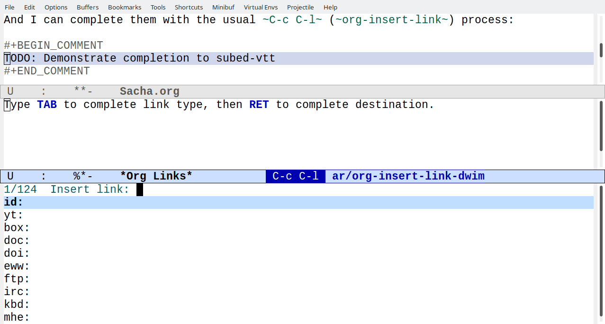

Sketches are handled by [[dotemacs:org-mode-sketch-links][my Org Mode sketch links]], but we can add them anyway.

#+begin_src emacs-lisp
(cl-pushnew (cons (expand-file-name "~/sync/sketches/") "https://sketches.sachachua.com/filename/")
						sacha-project-web-base-list
						:test 'equal)
#+end_src

I've been really liking being able to refer to various emacsconf-el
files by just selecting the link type and completing the filename, so
maybe it'll be easier to write about lots of other stuff if I extend
that to my other projects.

**** Copy web link
:PROPERTIES:
:CUSTOM_ID: web-link
:EXPORT_MODIFIED: 2024-01-20T07:44:20-0500
:END:

#+begin_update
- [2024-01-20]: Fix Wayback link handling.
- [2024-01-19]: Add Wayback machine.
#+end_update

Keeping a list of projects and their web versions also makes it easier
for me to get the URL for something. I try to post as much as possible
on the Web so that it's easier for me to find things again and so that
other people can pick up ideas from my notes. Things are a bit
scattered: [[https://sachachua.com][my blog]], repositories on [[https://github.com/sachac/][Github]] and [[https://codeberg.org/sachac/][Codeberg]], [[https://sketches.sachachua.com][my
sketches]]... I don't want to think about /where/ the code has ended
up, I just want to grab the URL. If I'm going to put the link into an
Org Mode document, that's super easy. I just take advantage of the
things I've added to ~org-store-link~. If I'm going to put it into an
e-mail or a toot or wherever else, I just want the bare URL.

I can think of two ways to approach this. One is a command that copies
just the URL by figuring it out from the buffer filename, which allows
me to special-case a bunch of things:

#+begin_src emacs-lisp :tangle "lisp/sacha-org.el"
;;;###autoload
(defun sacha-copy-link (&optional filename skip-links)
	"Return the URL of this file.
If FILENAME is non-nil, use that instead.
If SKIP-LINKS is non-nil, skip custom links.
If we're in a Dired buffer, use the file at point."
	(interactive)
	(setq filename (or filename
										 (if (derived-mode-p 'dired-mode) (dired-get-filename))
										 (buffer-file-name)))
	(if-let*
			((project-re (concat "\\(" (regexp-opt (mapcar 'car sacha-project-web-base-list)) "\\)"
													 "\\(.*\\)"))
			 (url (cond
						 ((and (derived-mode-p 'org-mode)
									 (eq (org-element-type (org-element-context)) 'link)
									 (not skip-links))
							(pcase (org-element-property :type (org-element-context))
								((or "https" "http")
								 (org-element-property :raw-link (org-element-context)))
								("yt"
								 (org-element-property :path (org-element-context)))
								;; if it's a custom link, visit it and get the link
								(_
								 (save-window-excursion
									 (org-open-at-point)
									 (sacha-copy-link nil t)))))
						 ;; links to my config usually have a CUSTOM_ID property
						 ((string= (buffer-file-name) (expand-file-name "~/sync/emacs/Sacha.org"))
							(concat "https://sachachua.com/dotemacs#" (org-entry-get-with-inheritance "CUSTOM_ID")))
						 ;; blog post drafts have permalinks
						 ((and (derived-mode-p 'org-mode) (org-entry-get-with-inheritance "EXPORT_ELEVENTY_PERMALINK"))
							(concat "https://sachachua.com" (org-entry-get-with-inheritance "EXPORT_ELEVENTY_PERMALINK")))
						 ;; some projects have web repos
						 ((string-match
							 project-re filename)
							(concat (assoc-default (match-string 1 filename) sacha-project-web-base-list)
											(url-hexify-string (match-string 2 filename)))))))
			(progn
				(when (called-interactively-p 'any)
					(kill-new url)
					(message "%s" url))
				url)
		(error "Couldn't figure out URL.")))
#+end_src

Another approach is to hitch a ride on the Org Mode link storage and
export functions and just grab the URL from whatever link I've stored
with ~org-store-link~, which I've bound to ~C-c l~. I almost always
have an HTML version of the exported link. We can even use XML parsing
instead of regular expressions.

#+begin_src emacs-lisp :tangle "lisp/sacha-org.el"
;;;###autoload
(defun sacha-org-link-as-url (link)
	"Return the final URL for LINK."
	(cond
	 ((string-match "^/" link)
		(concat sacha-blog-base-url (replace-regexp-in-string "^/" "" link)))
	 ((string-match "^\\(https://\\|file:\\)" link)
		link)
	 (t
		(dom-attr
		 (dom-by-tag
			(with-temp-buffer
				(insert (org-export-string-as link 'html t))
				(xml-parse-region (point-min) (point-max)))
			'a)
		 'href))))


;;;###autoload
(defun sacha-org-stored-link-as-url (&optional link insert)
	"Copy the stored link as a plain URL.
If LINK is specified, use that instead."
	(interactive (list nil current-prefix-arg))
	(setq link (or link (caar org-stored-links)))
	(let ((url (if link
								 (sacha-org-link-as-url link)
							 (error "No stored link"))))
		(when (called-interactively-p 'any)
			(if url
					(if insert (insert url) (kill-new url))
				(error "Could not find URL.")))
		url))

(ert-deftest sacha-org-stored-link-as-url ()
	(should
	 (string= (sacha-org-stored-link-as-url "[[dotemacs:web-link]]")
						"https://sachachua.com/dotemacs#web-link"))
	(should
	 (string= (sacha-org-stored-link-as-url "[[dotemacs:org-mode-sketch-links][my Org Mode sketch links]]")
						"https://sachachua.com/dotemacs#org-mode-sketch-links")))

;;;###autoload
(defun sacha-embark-org-copy-exported-url-as-wayback (link &rest _)
	(interactive "MLink: ")
	(let ((url	(sacha-embark-org-copy-exported-url link)))
		(when (not (string-match (regexp-quote "^https://web.archive.org") url))
			(setq url (concat "https://web.archive.org/web/" (format-time-string "%Y%m%d%H%M%S/")
												url)))
		(when (called-interactively-p 'any)
			(kill-new url)
			(message "Copied %s" url))
		url))

;;;###autoload
(defun sacha-embark-org-copy-exported-url (link &rest _)
	(interactive "MLink: \np")
	(let ((url (sacha-org-link-as-url link)))
		(when (and (derived-mode-p 'org-mode)
							 (org-entry-get-with-inheritance "EXPORT_ELEVENTY_PERMALINK")
							 (string-match "^/" url))
			;; local file links are copied to blog directories
			(setq url (concat "https://sachachua.com"
												(org-entry-get-with-inheritance "EXPORT_ELEVENTY_PERMALINK")
												(replace-regexp-in-string
												 "[\\?&].*"
												 ""
												 (file-name-nondirectory link)))))
		(when (called-interactively-p 'any)
			(kill-new url)
			(message "Copied %s" url))
		url))

;;;###autoload
(defun sacha-embark-replace-link-with-exported-url (link &rest _)
	(interactive (list (org-element-property :raw-link (org-element-context))))
	(sacha-insert-or-replace-link (sacha-org-link-as-url link)))
#+end_src

#+begin_src emacs-lisp :tangle "lisp/sacha-org.el"
(with-eval-after-load 'embark-org
	(mapc (lambda (map)
					(keymap-set map "u" #'sacha-embark-org-copy-exported-url)
					(keymap-set map "U" #'sacha-embark-org-copy-exported-url-as-wayback)
					(keymap-set map "r e" #'sacha-embark-replace-link-with-exported-url))
				(list embark-url-map embark-org-link-map embark-org-link-copy-map)))
#+end_src

We'll see which one I end up using. I think both approaches might come in handy.

**** Quickly search my code
:PROPERTIES:
:CUSTOM_ID: org-mode-links-using-an-emacs-lisp-macro-to-define-quick-custom-org-mode-links-to-project-files-plus-urls-and-search-quickly-search-sacha-code
:END:

Since ~sacha-project-web-base-list~ is a list of projects I often think
about or write about, I can also make something that searches through
them. That way, I don't have to care about where my code is.

#+begin_src emacs-lisp :tangle "lisp/sacha-consult.el"
;;;###autoload
(defun sacha-consult-ripgrep-code ()
  (interactive)
	(consult-ripgrep (mapcar 'car sacha-project-web-base-list)))
#+end_src

I can add ~.rgignore~ files in directories to tell ripgrep to ignore
things like ~node_modules~ or ~*.json~.

I also want to search my Emacs configuration at the same time,
although links to my config are handled by [[dotemacs:links-to-sacha-config][my dotemacs link type]] so
I'll leave the URL as nil. This is also the way I can handle other
unpublished directories.

#+begin_src emacs-lisp
(cl-pushnew (cons (expand-file-name "~/sync/emacs/Sacha.org") nil)
						sacha-project-web-base-list
						:test 'equal)
(cl-pushnew (cons (expand-file-name "~/proj/static-blog/_includes") nil)
						sacha-project-web-base-list
						:test 'equal)
(cl-pushnew (cons (expand-file-name "~/bin") nil)
						sacha-project-web-base-list
						:test 'equal)
#+end_src

Actually, let's throw my blog posts and Org files in there as well,
since I often have code snippets. If it gets to be too much, I can
always have different commands search different things.

#+begin_src emacs-lisp
(cl-pushnew (cons (expand-file-name "~/proj/static-blog/blog/") "https://sachachua.com/blog/")
						sacha-project-web-base-list
						:test 'equal)
(cl-pushnew (cons (expand-file-name "~/sync/orgzly") nil)
						sacha-project-web-base-list
						:test 'equal)
#+end_src

#+BEGIN_COMMENT
Demonstrate [[elisp:sacha-consult-ripgrep-code]] for defun file duration
#+END_COMMENT

#+CAPTION: Using sacha-consult-ripgrep-code
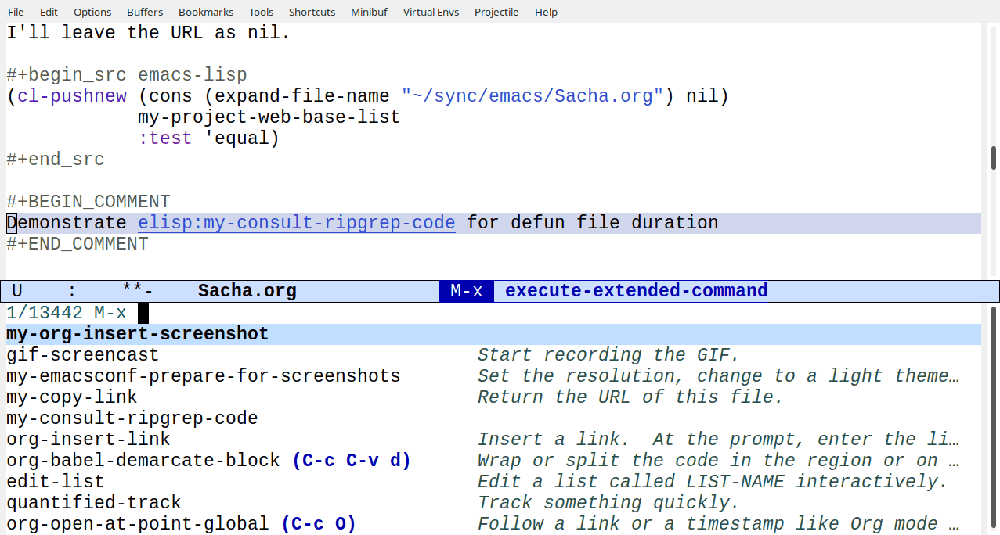

I don't have anything bound to ~M-s c~ (code) yet, so let's try that.

#+begin_src emacs-lisp
(keymap-global-set "M-s c" #'sacha-consult-ripgrep-code)
#+end_src

At some point, it might be fun to get Embark set up so that I can grab
a link to something right from the consult-ripgrep interface. In the
meantime, I can always jump to it and get the link.

***** Tip from Omar: embark-around-action-hooks
:PROPERTIES:
:CUSTOM_ID: org-mode-links-using-an-emacs-lisp-macro-to-define-quick-custom-org-mode-links-to-project-files-plus-urls-and-search-quickly-search-sacha-code-tip-from-omar-embark-around-action-hooks
:END:

[2024-01-07 Sun] I modified oantolin's suggestion from the comments to work with ~consult-ripgrep~, since ~consult-ripgrep~ gives me ~consult-grep~ targets instead of ~consult-location~:

#+begin_src emacs-lisp :tangle "lisp/sacha-embark.el"
;;;###autoload
(cl-defun embark-consult--at-location (&rest args &key target type run &allow-other-keys)
	"RUN action at the target location."
	(save-window-excursion
		(save-excursion
			(save-restriction
				(pcase type
					('consult-location (consult--jump (consult--get-location target)))
					('org-heading (org-goto-marker-or-bmk (get-text-property 0 'org-marker target)))
					('consult-grep (consult--jump (consult--grep-position target)))
					('file (find-file target)))
				(apply run args)))))
#+end_src

#+begin_src emacs-lisp
(cl-pushnew #'embark-consult--at-location (alist-get 'org-store-link embark-around-action-hooks))
#+end_src

I think I can use it with ~M-s c~ to search for the code, then ~C-.
C-c l~ on the matching line, where ~C-c l~ is my regular keybinding
for storing links. Thanks, Omar!

In general, I don't want to have to think about where something is on
my laptop or where it's published on the Web, I just want to write
about it. One step closer, yay Emacs!
*** Linking to headings that match a tag
:PROPERTIES:
:CUSTOM_ID: org-mode-links-linking-to-headings-that-match-a-tag
:END:
 #+begin_src emacs-lisp :eval no-export :tangle "lisp/sacha-org.el"
;;;###autoload
(defun sacha-org-insert-matching-heading-links (match)
	(interactive "MMatch: ")
	(let ((org-tags-exclude-from-inheritance (list match)))
		(insert
		 (string-join
			(org-map-entries
			 (lambda ()
				 (concat "- " (org-link-make-string
											 (car (org-link--file-link-to-here))
											 (org-entry-get (point) "ITEM"))
								 (if (org-entry-get (point) "EXPORT_DATE")
										 (format-time-string " (%Y)"
																				 (date-to-time (org-entry-get (point) "EXPORT_DATE")))
									 "")
								 "\n"))
			 match)))
		""))
#+end_src

*** Links from org-protocol
:PROPERTIES:
:CUSTOM_ID: links-from-org-protocol
:END:

So that I can easily add links at point. Formatted as an Org list for now.

#+begin_src emacs-lisp :tangle "lisp/sacha-org-protocol.el"
;;;###autoload
(defun sacha-org-protocol-insert-link (info)
  "Store and insert the link at point based on INFO."
  (org-protocol-store-link info)
  (with-current-buffer (window-buffer (selected-window))
    (insert "- ")
    (org-insert-last-stored-link 1)
    (insert "\n")))
(eval-after-load 'org-protocol
  '(add-to-list 'org-protocol-protocol-alist
                '("insert-link" :protocol "insert-link" :function sacha-org-protocol-insert-link)))

;; javascript:location.href = 'org-protocol://copy-thumbnail?thumbnail=' + encodeURIComponent(document.querySelector('meta[property=\"og:image\"]') ? document.querySelector('meta[property=\"og:image\"]').getAttribute('content') : '') + '&title=' + encodeURIComponent(document.title) + '&url=' + encodeURIComponent(location.href) + '&videoId=' + ((typeof(videoId) !== 'undefined' ? videoId : (document.querySelector('meta[itemprop=\"videoId\"]') ? document.querySelector('meta[itemprop=\"videoId\"]').getAttribute('content') : '')) || '')


;;;###autoload
(defun sacha-get-youtube-info (url)
  (with-current-buffer (url-retrieve-synchronously url)
    (goto-char (point-min))
    (prog1
        (list
         :url
         url
         :title
         (when (re-search-forward "<title>\\(.*?\\)</title>" nil t)
           (match-string 1))
         :duration
         (when (re-search-forward "approxDurationMs\":\"\\([0-9]+\\)\"" nil t)
           (format-seconds "%.2h:%.2m:%.2s%z" (/ (string-to-number (match-string 1)) 1000))))
      (kill-buffer))))

;;;###autoload
(defun sacha-link-video (list)
  (when (stringp list) (setq list (list :url list)))
  (with-current-buffer (url-retrieve-synchronously (concat "https://video.link/bookmarklet?url=" (url-encode-url (plist-get list :url))))
    (save-excursion
      (if (re-search-forward "<input type=\"text\" id=\"safeURL\" readonly=\"readonly\" value=\"\\(.*?\\)\"" nil t)
          (plist-put list :url (match-string-no-properties 1))
        (plist-put list :url (replace-regexp-in-string "watch" "watch_popup" (plist-get list :url)))))
    (when (string= (or (plist-get list :thumbnail) "") "")
      (save-excursion
        (when (re-search-forward "}}\n"
                 (plist-get info :thumbnail)
                 (plist-get info :title)
                 (plist-get info :url)
                 date
                 )
       (format "\n"
               (plist-get info :videoId)
               (plist-get info :title)
               (plist-get info :url)
               date))))
  nil)
#+end_src

#+begin_src emacs-lisp :tangle "lisp/sacha-org-protocol.el"
(eval-after-load 'org-protocol
  '(add-to-list 'org-protocol-protocol-alist
                '("copy-thumbnail" :protocol "copy-thumbnail" :function sacha-org-protocol-copy-thumbnail)))

#+end_src

#+begin_src emacs-lisp
(use-package org-protocol-capture-html
	:vc (:url "https://github.com/alphapapa/org-protocol-capture-html"))

#+end_src
*** Fix elisp links
:PROPERTIES:
:CUSTOM_ID: fix-elisp-links
:END:

#+NAME: org-elisp-link
#+begin_src emacs-lisp :tangle "lisp/sacha-org-export.el"
;;;###autoload
(defun sacha-org-elisp-link-export (link description format &optional arg)
  (pcase format
   ('html (format "<span title=\"%s\">%s</span>" (replace-regexp-in-string "\"" "&quot;" link) description))
   ((or 'icalendar 'ascii) description)
   ))
#+end_src

#+begin_src emacs-lisp
(org-link-set-parameters
 "elisp"
 :export 'sacha-org-elisp-link-export)
#+end_src
*** IRC
:PROPERTIES:
:CUSTOM_ID: irc
:END:

#+NAME: org-irc-link
#+begin_src emacs-lisp
(org-link-set-parameters
 "ircs"
 :export #'sacha-org-irc-export)
#+end_src

#+begin_src emacs-lisp :tangle "lisp/sacha-org-export.el"
;;;###autoload
(defun sacha-org-ircs-export (link description format)
   "Export an ircs link.
See `org-link-parameters' for details about LINK, DESCRIPTION and
FORMAT."
   (let ((desc (or description link)))
     (pcase format
       (`html (format "<a href=\"ircs:%s\">%s</a>" link desc))
       (`md (format "[%s](ircs:%s)" desc link))
       (_ nil))))
#+end_src
*** Dired
:PROPERTIES:
:CUSTOM_ID: org-dired
:END:

#+begin_src emacs-lisp :lexical t
(setq dired-dwim-target t)
#+end_src

#+begin_src emacs-lisp :lexical t :tangle "lisp/sacha-org.el"
;;;###autoload
(defun sacha-org-get-links-in-region (beg end)
  (save-excursion
    (let (results)
      (goto-char (min beg end))
      (while (re-search-forward org-any-link-re (max beg end) t)
        (add-to-list 'results (org-element-context)))
      results)))

;;;###autoload
(defun sacha-org-dired-file-links-in-region (beg end)
  "Display a Dired buffer for the file links in the selected region."
  (interactive "r")
  (let ((files
         (-map
          (lambda (x)
            (expand-file-name (org-link-unescape (plist-get (cadr x) :path))))
          (-filter
           (lambda (x)
             (string= (plist-get (cadr x) :type) "file"))
           (sacha-org-get-links-in-region beg end)))))
    (with-current-buffer (get-buffer-create "*Files*")
      (let ((inhibit-read-only t))
        (erase-buffer)
        (apply 'call-process "ls" nil t nil "-lR" files))
      (dired-virtual "/")
      (switch-to-buffer (current-buffer)))))
#+end_src

** Org protocol: following Org links from outside Emacs          :org:emacs:
:PROPERTIES:
:CUSTOM_ID: org-protocol-open
:EXPORT_DATE: 2023-09-26T09:42:45-0400
:EXPORT_ELEVENTY_PERMALINK: /blog/2023/09/org-protocol-following-org-links-from-outside-emacs/
:EXPORT_ELEVENTY_FILE_NAME: blog/2023/09/org-protocol-following-org-links-from-outside-emacs/
:END:

=_xor= had an interesting idea: can we use =org-protocol= to link to
things inside Emacs, so that we can have a webpage with bookmarks into
our Org files? Here's a quick hack that reuses =org-store-link= and
=org-link-open=.

#+NAME: org-protocol-link
#+begin_src emacs-lisp :tangle "lisp/sacha-org-protocol.el"
;;;###autoload
(defun org-protocol-open-link (info)
	"Process an org-protocol://open style url with INFO."
	(org-link-open (car (org-element-parse-secondary-string (plist-get info :link) '(link)))))
;;;###autoload
(defun org-protocol-copy-open-link (arg)
	(interactive "P")
	(kill-new (concat "org-protocol://open?link=" (url-hexify-string (org-store-link arg)))))

#+end_src

#+begin_src emacs-lisp
(with-eval-after-load 'org-protocol
	(add-to-list 'org-protocol-protocol-alist
							 '("org-open" :protocol "open" :function org-protocol-open-link)))
#+end_src

To make exporting and following easier, we also need a little code to
handle =org-protocol= links inside Org.

#+begin_src emacs-lisp :tangle "lisp/sacha-org-protocol.el"
(defun org-protocol-follow (path &rest _)
	"Follow the org-protocol link for PATH."
	(org-protocol-check-filename-for-protocol (concat "org-protocol:" path) nil nil))

(defun org-protocol-export (path desc format info)
	"Export an org-protocol link."
	(setq path (concat "org-protocol:" path))
	(setq desc (or desc path))
	(pcase format
    (`html (format "<a href=\"%s\">%s</a>" path desc))
		(`11ty (format "<a href=\"%s\">%s</a>" path desc))
    (`latex (org-latex-link path desc info))
    (`ascii (org-ascii-link path desc info))
		(`md (org-md-link path desc info))
    (_ path)))
#+end_src

#+begin_src emacs-lisp :tangle "lisp/sacha-org-protocol.el"
(with-eval-after-load 'org
	(org-link-set-parameters "org-protocol"
													 :follow #'org-protocol-follow
													 :export #'org-protocol-export))
#+end_src

Now I can use =org-protocol-copy-open-link= to copy a link to the
current location, and I can put it into my Org files.

Example bare link to the Org manual, which will work only if you have
=open= in the =org-protocol-protocol-alist=:

org-protocol://open?link=%5B%5Binfo%3Aorg%23Protocols%5D%5Borg%23Protocols%5D%5D

With a description:

[[org-protocol://open?link=%5B%5Binfo%3Aorg%23Protocols%5D%5Borg%23Protocols%5D%5D][Org manual - Protocols]]

** TODO Speed command for adding a custom ID to Org Mode posts
    :PROPERTIES:
    :CREATED:  [2021-04-13 Tue 19:28]
    :CUSTOM_ID: add-custom-id
    :ID:       o2b:e80c2eef-fed6-4658-8172-2d8d7cdd2588
    :BLOG:     sacha
    :POSTID:   29719
    :END:

  Nudged by [[https://amitp.blogspot.com/2021/04/automatically-generate-ids-for-emacs.html][Amit's post about adding custom IDs to Org headings]], I
  decided to write a speed command to add a custom ID with a reasonable
  default, and to make it happen whenever I post something from my Emacs
  config (like this one). I'm running out of brainspace for speed
  commands, so I'm going to try sticking it into a hydra so that I can
  add future things to the hydra instead. I'll probably figure out some
  kind of [[https://sachachua.com/blog/2021/04/emacs-making-a-hydra-cheatsheet-for-lispy/][cheat sheet thing]] for speed commands too.

#+begin_src emacs-lisp :tangle "lisp/sacha-org.el"
;;;###autoload
(defun sacha-make-slug (s)
  (thread-last
    s
    (learn-lang-replace-accents)
    (downcase)
    (replace-regexp-in-string "[^a-z0-9]+" "-")
    (replace-regexp-in-string "^-\\|-$" "")))

;;;###autoload
(defun sacha-org-set-custom-id (id)
  "Set the CUSTOM_ID property to ID at point."
  (interactive (list
                (let ((default-custom-id (sacha-make-slug (string-join (org-get-outline-path t) " "))))
                  (read-string (format "ID (%s): " default-custom-id) nil nil default-custom-id))))
  (org-entry-put (point) "CUSTOM_ID" id))

(defun sacha-org-assign-custom-ids ()
	(interactive)
	(let ((custom-ids
				 (org-map-entries (lambda () (org-entry-get (point) "CUSTOM_ID")) "CUSTOM_ID={.}")))
		(org-map-entries
		 (lambda ()
			 (let ((slug
							(replace-regexp-in-string
							 "^-\\|-$" ""
							 (replace-regexp-in-string "[^A-Za-z0-9]+" "-"
																				 (downcase (string-join (org-get-outline-path t) " "))))))
				 (while (member slug custom-ids)
					 (setq slug (read-string "Manually set custom ID: ")))
				 (org-entry-put (point) "CUSTOM_ID" slug)))
		 "-CUSTOM_ID={.}")))
#+end_src

[2026-04-11 Sat] I haven't been using hydras much...

#+begin_src emacs-lisp

(with-eval-after-load 'hydra
  (define-key hydra-base-map (kbd "<down>") 'sacha-hydra-pop)
  (define-key hydra-base-map (kbd "<up>") (lambda () (interactive) (sacha-hydra-go-and-push 'sacha-shortcuts/body)))


  (defhydra sacha-hydra/org-speed-commands ()
    ("i" sacha-org-set-custom-id "CUSTOM_ID" :exit t)
    ("<up>" sacha-hydra/org-mode/body :exit t)
    ("u" (sacha-hydra-go-and-push 'sacha-hydra/org-mode/body) :exit t :hint nil))
  (defhydra sacha-hydra/org-mode (:foreign-keys run)
    ("b" sacha-org-back-to-heading "Heading")
    ("n" org-forward-heading-same-level "Next")
    ("p" org-backward-heading-same-level "Previous")
    ("a" org-archive-subtree-default "Archive")
    ("j" sacha-org-mark-done-and-add-to-journal "Journal" :exit t)
    ("k" org-cut-subtree "Kill")
    ("<up>" (sacha-hydra-go-and-push 'sacha-shortcuts/body) :exit t hint nil)
    ("u" (sacha-hydra-go-and-push 'sacha-shortcuts/body) :exit t :hint nil)
    ("<f14>" nil "Exit" :exit t))
  (defhydra sacha-hydra/org-link ()
    ("RET" org-open-at-point "Open")
    ("e" org-insert-link "Edit")
    ("c" sacha-caption-show "Captions")
    ("w" sacha-org-link-element-copy-link "Copy link")
    ("u" (sacha-hydra-go-and-push 'sacha-hydra/org-mode/body) :exit t :hint nil)
    ("<up>" (sacha-hydra-go-and-push 'sacha-hydra/org-mode/body) :exit t :hint nil))
  (defhydra sacha-hydra/org-src ()
    ("e" org-babel-execute-src-block "Exec")
    ("E" sacha-org-execute-src-block-by-name "Exec by name")
    ("i" org-edit-special "Edit")
    ("d" org-babel-demarcate-block "Demarcate")
    ("g" org-babel-goto-named-src-block "Goto")
    ("r" org-babel-open-src-block-result "Result")
    ("x" org-babel-expand-src-block "Expand")
    ("t" (org-babel-tangle '(4)) "Tangle at point")
    ("T" (org-babel-tangle '(16)) "Tangle target file")
    ("u" (sacha-hydra-go-and-push 'sacha-hydra/org-mode/body) :exit t :hint nil)
    ("<up>" (sacha-hydra-go-and-push 'sacha-hydra/org-mode/body) :exit t :hint nil)
    )
  ;; Not in a lisp/ file because it's very idiosyncratic
  (defun sacha-hydra/dwim ()
    (interactive)
    (if (derived-mode-p 'org-mode)
        (let ((context (org-element-context)))
          (cond
           ((and (bolp) (looking-at org-outline-regexp))
            (sacha-hydra/org-speed-commands/body))
           ((org-in-src-block-p) (sacha-hydra/org-src/body))
           ((eq (org-element-type context) 'link) (sacha-hydra/org-link/body))
           (t (sacha-hydra/org-mode/body))))
      (sacha-shortcuts/body)))
  (define-key org-mode-map (kbd "<f14>") 'sacha-hydra/dwim)
  (keymap-global-set  "<f14>" 'sacha-hydra/dwim))
  #+end_src
** Journal
:PROPERTIES:
:CUSTOM_ID: journal
:END:

#+begin_src emacs-lisp :tangle "lisp/sacha-journal.el"
(defvar sacha-journal-category-map
  '(("Gross" . "Gross motor")
    ("Fine" . "Fine motor")
    ("8 - Kaizen" . "Kaizen")
    ("9 - Us" . "Us")
    ("Self-care" . "Self-care and independence"))
  "Alist of string replacements for journal categories.")
(defvar sacha-journal-categories
  '("Kaizen" "Us" "Field trip" "Gross motor" "Fine motor"
    "Sensory" "Language" "Music" "Art"
    "Self-care and independence" "Eating" "Sleep" "Emotion"
    "Household" "Social" "Pretend" "Cognition" "World" "Other" "Oops" "Thoughts" "Consulting" "Track" "Uncategorized")
  "List of categories to display.
      Unknown categories will be added to the end.")

;;;###autoload
(defun sacha-journal-date (o) (elt o 3))
;;;###autoload
(defun sacha-journal-note (o) (car o))
;;;###autoload
(defun sacha-journal-week-highlight (o) (elt o 4))
;;;###autoload
(defun sacha-journal-category (o) (elt o 1))
;;;###autoload
(defun sacha-journal-pictures (o) (when (string> (elt o 2) "") (split-string (elt o 2) ",")))
;;;###autoload
(defun sacha-journal-id (o) (elt o 7))
;;;###autoload
(defun sacha-journal-status (o) (elt o 8))
;;;###autoload
(defun sacha-journal-other (o) (elt o 9))
;;;###autoload
(defun sacha-journal-zidstring (o) (elt o 11))
;;;###autoload
(defun sacha-org-group-journal-entries (filtered &optional category-map categories)
  (setq category-map (or category-map sacha-journal-category-map))
  (setq categories (or categories sacha-journal-categories))
  (let* ((grouped (-group-by 'sacha-journal-category filtered))
         (mapped-list
          (mapcar
           (lambda (o)
             (cons (or (assoc-default (car o) category-map) (car o))
                   (cdr o)))
           grouped))
         (sorted-list
          (delq nil
                (append
                 (mapcar (lambda (cat)
                           (when (assoc-default cat mapped-list)
                             (cons cat (assoc-default cat mapped-list))))
                         categories)
                 (-remove (lambda (o) (member (car o) categories)) mapped-list)))))
    sorted-list))

;;;###autoload
(defun sacha-org-date-to-string (date &optional base-date)
  "Return the Org date specified by DATE.
      This is relative to BASE-DATE if specified."
  (org-read-date nil nil date nil (when base-date (org-read-date nil t base-date))))

(ert-deftest sacha-org-date-to-string ()
  (should (string= (sacha-org-date-to-string "++1" "2018-08-01") "2018-08-02")))

;;;###autoload
(defun sacha-org-filter-journal-csv (filename &optional from to highlight base-date)
  "Return a list of matching entries."
  (setq from (and from (substring (sacha-org-date-to-string from base-date) 0 10))
        to (and to (substring (sacha-org-date-to-string to base-date) 0 10)))
  (let* ((data (pcsv-parse-file filename))
         (filtered
          (-filter
           (lambda (o)
             (let ((date (sacha-journal-date o)))
               (and (or (null from) (not (string< date from)))
                    (or (null to) (string< date to))
                    (and (not (string= (sacha-journal-status o) "Deleted")))
                    (not (string-match "^!" (sacha-journal-note o)))
                    (string-equal
                     "true"
                     (cond
                      ((null highlight) "true")
                      ((string-equal highlight "week") (sacha-journal-week-highlight o))
                      (t "true"))))))
           data)))
    filtered))

;;;###autoload
(defun sacha-journal-read-category (&optional initial)
  (consult--read sacha-journal-categories :sort nil :prompt "Category: " :initial initial))

;;;###autoload
(defun sacha-journal-guess-category ()
	(when (derived-mode-p 'org-mode)
		(save-excursion
      (org-back-to-heading)
		  (org-end-of-meta-data)
		  (let ((text (buffer-substring-no-properties (point) (org-end-of-subtree))))
			  (if (string-match "#gardening" text)
					  "Household")))))

;;;###autoload
(defun sacha-journal-post (note &rest plist)
  (interactive (list (read-string "Note: ")
                     :Date (concat (org-read-date "Date: ") " 23:00")
                     :Category (sacha-journal-read-category (condition-case nil (sacha-journal-guess-category) (error nil)))
                     :Other (read-string "Other: ")))
  (setq plist (append `(:Note ,note) plist))
  (let ((url-request-method "POST")
        (url-request-extra-headers `(("Content-Type" . "application/json")
																		("Authorization" . ,(concat "Basic "
																																(base64-encode-string
																																 (concat sacha-journal-user ":" sacha-journal-password))))))
        (json-object-type 'plist)
        (url-request-data (encode-coding-string (json-encode-plist plist) 'utf-8))
        data)
    (with-current-buffer (url-retrieve-synchronously (concat sacha-journal-url "/api/entries"))
      (goto-char (point-min))
      (re-search-forward "^$")
      (setq data (json-read))
      (message "%s" (plist-get data :ZIDString))
      data)))

;;;###autoload
(defun sacha-journal-get-by-zidstring (zidstring)
  (sacha-journal-get (concat "api/entries/" zidstring)))

;;;###autoload
(defun sacha-journal-insert-ref (zidstring)
  (interactive (list (sacha-journal-completing-read)))
  (insert (org-link-make-string (concat "ref:" (sacha-journal-id-from-string zidstring)))))

;;;###autoload
(defun sacha-journal-edit (zidstring)
  (interactive (list (sacha-journal-completing-read)))
  (let* ((id (sacha-journal-id-from-string zidstring))
         (entry (and id (sacha-journal-get-by-zidstring id))))
    (if (null id)
        (sacha-journal-post zidstring
                         :Category (sacha-journal-read-category (plist-get entry :Category))
                         :Other (read-string "Other: " (plist-get entry :Other)))
      (plist-put entry :Note (read-string (format "Note (%s): " (plist-get entry :Note))))
      (plist-put entry :Category (sacha-journal-read-category (plist-get entry :Category)))
      (plist-put entry :Other (read-string "Other: " (plist-get entry :Other)))
      (sacha-journal-update entry))))

;;;###autoload
(defun sacha-journal-update (plist)
  "Update journal entry using PLIST."
  (let ((url-request-method "PUT")
        (url-request-data (json-encode-plist plist)))
    (sacha-json-request (concat sacha-journal-url "/api/entries/" (plist-get plist :ZIDString)))))
;; (sacha-journal-post "Hello, world")

;;;###autoload
(defun sacha-journal-get-entries (&optional from to search)
  "Return parsed CSV of entries limited by FROM, TO, and SEARCH."
  (with-current-buffer
      (url-retrieve-synchronously (format "%s/api/entries.csv?from=%s&to=%s&regex=1&q=%s"
                                          sacha-journal-url
                                          (or from "")
                                          (or to "")
                                          (or search "")))
		(set-buffer-multibyte t)
    (goto-char (point-min))
    (delete-region (point-min) (search-forward "\n\n"))
    (cdr (pcsv-parse-buffer))))

;;;###autoload
(defun sacha-journal-get (url)
	(let ((url-request-extra-headers
				 `(("Authorization" . ,(concat "Basic "
																			 (base64-encode-string
																				(concat sacha-journal-user ":" sacha-journal-password)))))))
		(sacha-json-request (concat sacha-journal-url "/" url))))
;;;###autoload
(defun sacha-journal-get-entry (zid) (sacha-journal-get (format "api/entries/zid/%s" zid)))
#+end_src

The following code lets me complete journal entries and get their ZIDs.

#+NAME: helm-journal
#+begin_src emacs-lisp :tangle "lisp/sacha-journal.el"
(defun sacha-json-request (url)
  (let ((json-object-type 'plist)
        (url-request-extra-headers (cons '("Content-Type" . "application/json") url-request-extra-headers)))
    (with-current-buffer (url-retrieve-synchronously url)
      (set-buffer-multibyte t)
      (goto-char (point-min))
      (re-search-forward "^$" nil t)
      (json-read))))

(defvar sacha-journal-search-cache nil "List of search results.")
;;;###autoload
(defun sacha-journal-search-query (query-str)
  (let* ((url-request-method "GET")
         (json-response (sacha-journal-get (format "api/entries?q=%s&limit=50&sort=date&regex=1"
                                                 query-str))))
    (setq sacha-journal-search-cache (mapcar (lambda (o)
              (cons
               (format "%s %s"
                       (plist-get o :ZIDString)
                       (plist-get o :Note))
               o))
            json-response))))

;;;###autoload
(defun sacha-journal-search-query-async (query-str next)
  (let* ((url-request-method "GET")
         (url-request-extra-headers (cons '("Content-Type" . "application/json") url-request-extra-headers)))
    (url-retrieve
     (format "%s/api/entries?q=%s&limit=50&sort=date&regex=1"
             sacha-journal-url
       query-str)
     (lambda (status)
       (goto-char (point-min))
       (re-search-forward "^$" nil t)
       (setq sacha-journal-search-cache
             (mapcar (lambda (o)
                       (cons
                        (format "%s %s"
                                (plist-get o :ZIDString)
                                (plist-get o :Note))
                        o))
                     (let ((json-object-type 'plist))
                       (json-read))))
       (funcall next 'flush)
       (if sacha-journal-search-cache (funcall next sacha-journal-search-cache))))))

;;;###autoload
(defun sacha-journal--async-search (next)
  (lambda (action)
    (cond
     ((eq action 'setup)                ;; Should figure out how to start
      (sacha-journal-search-query-async "" next))
     ((and (stringp action) (not (string= action "")))
      (sacha-journal-search-query-async action next))
     (t (funcall next action)))))

;;;###autoload
(defun sacha-journal-completing-read ()
  (interactive)
  (consult--read
   (thread-first (consult--async-sink)
     (consult--async-refresh-immediate)
     (sacha-journal--async-search)
     (consult--async-throttle)
     (consult--async-split))
   :sort nil
   :prompt "Entry: "
   :category 'journal))

;;;###autoload
(defun sacha-journal-id-from-string (s)
  (when (string-match "^[-0-9]+" s) (match-string 0 s)))

;;;###autoload
(defun sacha-journal-view (s)
  (interactive (list (sacha-journal-completing-read)))
  (sacha-org-journal-open (sacha-journal-id-from-string s)))

;;;###autoload
(defun sacha-journal-sketch-large (zid)
  "Create a large sketch based on ZID."
  (interactive (list (sacha-journal-completing-read)))
  (let ((filename (expand-file-name (format "%s.psd"
                                             (sacha-journal-id-from-string zid))
                                    sacha-sketch-inbox-directory)))
    (unless (file-exists-p filename)
      (copy-file sacha-sketch-large-template-file filename))
    (sacha-org-sketch-open filename)))
#+end_src

I should probably figure out how to switch this over to my Consult-based workflow:

#+begin_src emacs-lisp :lexical t :tangle "lisp/sacha-journal.el"
;;;###autoload
(defun sacha-journal-format-entry (type o)
  (cond
   ((eq type 'org-link-zid-only)
    (org-link-make-string (format "journal:%s" (cdr (assoc 'ZIDString o)))))
   ((eq type 'list-item-with-zid)
    (format "- %s (%s)\n"
            (assoc-default 'Note o)
            (org-link-make-string
             (format "journal:%s" (assoc-default 'ZIDString o)))))
   ((eq type 'list-item)
    (format "- %s\n" (assoc-default 'Note o)))
   ((eq type 'text)
    (assoc-default 'Note o))))

;;;###autoload
(defun sacha-journal-format-entries (type list)
  (mapconcat
   (lambda (o) (sacha-journal-format-entry type o))
   (reverse list)
   (cond
    ((eq type 'org-link-zid-only) ", ")
    ((eq type 'list-item-with-zid) "")
    ((eq type 'list-item) "")
    ((eq type 'text) " "))))
#+end_src

This lets me define a custom link type.

#+NAME: org-journal-link
#+begin_src emacs-lisp :tangle "lisp/sacha-journal.el"
;;;###autoload
(defun sacha-org-journal-open (id &optional arg)
  (browse-url (format "%s/zid/%s" sacha-journal-url id)))

;;;###autoload
(defun sacha-org-journal-export (link description format &optional arg)
  (let* ((path (concat "%s/zid/" sacha-journal-url link))
         (image (concat "%s/zid/" sacha-journal-url link))
         (desc (or description link)))
    (cond
     ((or (eq format 'html) (eq format 'wp))
      (if description
          (format "<a target=\"_blank\" href=\"%s\">%s</a>" path desc)
        (format "<a target=\"_blank\" href=\"%s\"><br />%s</a>" path image desc)))
     ((eq format 'latex) (format "\\href{%s}{%s}" path desc))
     ((eq format 'texinfo) (format "@uref{%s,%s}" path desc))
     ((eq format 'ascii) (format "%s <%s>" desc path))
     (t path))))

;;;###autoload
(defun sacha-org-journal-complete (&optional prefix)
  (cdr (assoc 'ZIDString (helm-comp-read "Entry: " 'sacha-helm-journal-search :volatile t))))
#+end_src

#+begin_src emacs-lisp
(with-eval-after-load 'org
  (org-link-set-parameters
   "journal"
   :follow 'sacha-org-journal-open
   :export 'sacha-org-journal-export
   :complete 'sacha-org-journal-complete))
#+end_src

#+begin_src emacs-lisp :tangle lisp/sacha-journal.el
;;;###autoload
(defun sacha-org-journal-summarize (from to &optional search category-map categories)
  (sacha-org-group-journal-entries (sacha-journal-get-entries from to search) category-map categories))

;;;###autoload
(defun sacha-org-journal-format-tree (groups &optional include)
  (mapconcat
   (lambda (o)
     (concat "- *" (car o) "*\n"
             (mapconcat
              (lambda (i)
                (concat "  - "
                        (if (member 'date include) (concat (sacha-journal-date i) " ") "")
                        (replace-regexp-in-string "\\\"" "\"" (sacha-journal-note i))
                        (if (member 'zid include) (concat " " (sacha-journal-zidstring i)) "")
                        ;; (if (string= "" (sacha-journal-category i))
                        ;;     ""
                        ;;   (format " (%s)" (sacha-journal-category i)))
                        "\n"))
              (reverse (cdr o)) "")))
   groups ""))

;;;###autoload
(defun sacha-org-summarize-journal-csv (from to &optional search category-map categories include)
  (interactive
   (list (org-read-date nil nil nil "From: ")
         (org-read-date nil nil nil "To: ")
         (read-string "Search: ")
         sacha-journal-category-map
         sacha-journal-categories
         nil))
  (let ((list (sacha-org-journal-format-tree
               (sacha-org-group-journal-entries
                (sacha-journal-get-entries from to search)
                category-map categories)
               include)))
    (if (called-interactively-p 'any) (insert list) list)))
#+end_src

#+begin_src emacs-lisp :tangle lisp/sacha-journal.el
;;;###autoload
(defun sacha-read-journal-category ()
  (completing-read "Category: " sacha-journal-categories))

;;;###autoload
(defun sacha-update-journal-entry (old-text new-text category)
  (interactive (list (read-string "Old: ")
                     (read-string "New: ")
                     (sacha-read-journal-category)))
  (sacha-send-intent "com.sachachua.journal.categorize"
                  (list (cons "text" old-text)
                        (cons "newtext" (or new-text old-text))
                        (cons "category" (or category "Uncategorized")))))

;;;###autoload
(defun sacha-create-journal-entry (new-text category)
  (interactive (list (read-string "Text: ")
                     (sacha-read-journal-category)))
  (sacha-update-journal-entry new-text new-text category))

;;;###autoload
(defun sacha-export-journal-entries ()
  "Trigger task to export. Phone must be unlocked."
  (interactive)
  (sacha-send-intent "com.sachachua.journal.export" '(("a" . "b"))))

#+end_src

#+begin_src emacs-lisp
(use-package csv
  :commands csv--read-line)
#+end_src

#+begin_src emacs-lisp :tangle lisp/sacha-journal.el
;;;###autoload
(defun sacha-prompt-for-uncategorized-entries ()
  (interactive)
  (let ((key-list '("Note" "Date" "highlight week" "Category" "month" "Time" "Link" "ELECT"))
        x new-text category done)
    (while (and (not (eobp)) (not done))
      (forward-char 1)
      (setq x (csv--read-line key-list))
      (when (string= (assoc-default "Category" x nil "") "")
        (setq text (read-string "Text: " (assoc-default "Note" x nil "")))
        (setq category (completing-read "Category: " (cons "." sacha-journal-categories)))
        (if (string= category ".")
            (setq done t)
          (sacha-update-journal-entry (assoc-default "Note" x nil "") text category))))))
#+end_src

*** Working with journal entries
:PROPERTIES:
:CUSTOM_ID: working-with-journal-entries
:END:

#+begin_src emacs-lisp :tangle lisp/sacha-journal.el
;;;###autoload
(defun sacha-journal-insert-matching-entries (from to match)
  (interactive (list (org-read-date "From: ") (org-read-date "To: ") (read-string "Match: ")))
  (insert
  (mapconcat
   (lambda (o)
     (format "- %s %s" (sacha-journal-zidstring o) (sacha-journal-note o)))
   (seq-filter (lambda (o) (string-match match (sacha-journal-other o)))
    (sacha-journal-get-entries from to))
   "\n")))
;;;###autoload
(defun sacha-journal-convert-to-refs (beg end)
  (interactive "r")
  (save-restriction
    (goto-char beg)
    (narrow-to-region beg end)
    (while (re-search-forward "^- \\([0-9][0-9][0-9][0-9]-[0-9][0-9]-[0-9][0-9]-[0-9][0-9]\\) .*?$" nil t)
      (replace-match "ref:\\1"))))
;;;###autoload
  (defun sacha-journal-get-refs-from-region (beg end)
    (interactive "r")
    (save-excursion
      (goto-char beg)
      (cl-loop for pos = (re-search-forward " \\([0-9][0-9][0-9][0-9]-[0-9][0-9]-[0-9][0-9]-[0-9][0-9]\\) " end t)
               while pos
               collect (match-string 1))))

;;;###autoload
(defun sacha-journal-add-tag (tag beg end)
  (interactive "MTag: \nr")
  (let* ((url-request-method "POST")
         (url-request-extra-headers '(("Content-Type" . "application/json")))
         (zids (sacha-journal-get-refs-from-region beg end))
         (json-object-type 'plist)
         (url-request-data (json-encode-plist (list :zids zids :tags (split-string tag " ")))))
    (pp (sacha-journal-get "api/entries/tag/bulk"))))

;;;###autoload
(defun sacha-journal-remove-tag (tag beg end)
  (interactive "MTag: \nr")
  (let* ((url-request-method "DELETE")
         (url-request-extra-headers '(("Content-Type" . "application/json")))
         (zids (sacha-journal-get-refs-from-region beg end))
         (json-object-type 'plist)
         (url-request-data (json-encode-plist (list :zids zids :tags (split-string tag " ")))))
    (pp (sacha-journal-get "api/entries/tag/bulk"))))

;;;###autoload
(defun sacha-journal-post-with-refs (note date other beg end)
  (interactive (list
                (read-string "Note: ")
                (concat (org-read-date "Date: ") " 23:00")
                (read-string "Other: ")
                (min (point) (mark))
                (max (point) (mark))))
  (sacha-journal-post note :Date date :Other (concat other "\n"
                                                  (mapconcat (lambda (o) (concat "ref:" o))
                                                             (sacha-journal-get-refs-from-region beg end)
                                                             " "))))

;;;###autoload
(defun sacha-journal-browse-current-day ()
	(interactive)
	(browse-url
	 (format "https://journal.sachachua.com/day/%s"
					 (format-time-string "%Y-%m-%d"
															 (sacha-filename-timestamp (buffer-file-name))))))
#+end_src
*** Tagging journal entries
:PROPERTIES:
:CUSTOM_ID: tagging-journal-entries
:END:

#+begin_src emacs-lisp :tangle lisp/sacha-journal.el
;;;###autoload
(defun sacha-journal-list-toggle-monthly-highlight ()
	(interactive)
	(let ((entry (tabulated-list-get-entry)))
		(setf (elt entry 3) (if (string-match "#monthly-highlight" (elt entry 3))
														(replace-regexp-in-string " ?#monthly-highlight" "" (elt entry 3))
													(string-trim (concat (elt entry 3) " #monthly-highlight"))))
		(sacha-journal-update
		 (list :ZIDString (elt entry 0)
					 :Other (elt entry 3)))
		(tabulated-list-print t t)))

;;;###autoload
(defun sacha-journal-list-echo ()
	(interactive)
	(message "%s -- %s" (elt (tabulated-list-get-entry) 2) (elt (tabulated-list-get-entry) 3)))

(defvar-keymap sacha-journal-list-mode-map
	:parent tabulated-list-mode-map
	"t" #'sacha-journal-list-toggle-monthly-highlight
	"v" #'sacha-journal-list-echo)

(define-derived-mode sacha-journal-list-mode tabulated-list-mode "Journal"
	"Major mode for journal entries."
	(setq tabulated-list-format [("ZID" 14 t)
															 ("Category" 10 t)
															 ("Note" 80 nil)
															 ("Other" 30 nil)])
	(tabulated-list-init-header)
	(tabulated-list-print t))

;;;###autoload
(defun sacha-journal-list (start end filter)
	(interactive (list (org-read-date "Start: ") (org-read-date "End: ")
										 (read-string "Filter: ")))
	(switch-to-buffer (get-buffer-create "*journal*"))
	(setq tabulated-list-entries
				(mapcar
				 (lambda (row)
					 (list
						(sacha-journal-zidstring row)
						(vector
						 (sacha-journal-zidstring row)
						 (sacha-journal-category row)
						 (replace-regexp-in-string "\n" " " (sacha-journal-note row))
						 (replace-regexp-in-string "\n" " " (sacha-journal-other row)))))
				 (sacha-journal-get-entries start end filter)))
	(sacha-journal-list-mode))
#+end_src

*** Photos  :images:
:PROPERTIES:
:CUSTOM_ID: photos
:END:

#+begin_src emacs-lisp :tangle lisp/sacha-image.el
;;;###autoload
(defun sacha-get-image-caption (file)
  (let ((caption (shell-command-to-string (format "exiftool -s -s -s -ImageDescription %s" (shell-quote-argument file)))))
    (when (> (length caption) 0) (format "#+CAPTION: %s" caption))))

;;;###autoload
(defun sacha-insert-image-link-with-caption (file)
  (let ((caption (sacha-get-image-caption file)))
    (insert (or caption "") (org-link-make-string file) "\n")))

;;;###autoload
(defun sacha-caption-current-image ()
  (interactive)
  (let ((link (org-element-link-parser)) caption)
    (when (and link (org-element-property :path link))
      (setq caption (sacha-get-image-caption (org-element-property :path link)))
      (when caption (insert caption)))))

;;;###autoload
(defun sacha-set-image-caption (file caption)
  (interactive (list (if (derived-mode-p 'dired-mode) (dired-get-filename) (buffer-file-name))
                     (read-string "Caption: ")))
  (shell-command (format "exiftool -ImageDescription=\"%s\" %s" (shell-quote-argument caption) (shell-quote-argument file))))
#+end_src

#+begin_src emacs-lisp :tangle lisp/sacha-image.el
(defvar sacha-photo-directory "/mnt/nfs/photos/inbox")
;;;###autoload
(defun sacha-get-photo-rating (file)
  (let ((rating (shell-command-to-string (concat "exiftool -s -s -s -Rating " (shell-quote-argument file)))))
    (string-to-number rating)))

;;;###autoload
(defun sacha-make-photo-list (start end &optional rating require-description)
  (interactive (list (org-read-date "Start: ") (org-read-date "End: ")))
  (-filter
   (lambda (filename)
     (and (string> (file-name-nondirectory filename) start)
          (string> end (file-name-nondirectory filename))
          (if rating (>= (sacha-get-photo-rating filename) rating) t)
          (if require-description (sacha-get-image-caption filename) t)))
   (directory-files sacha-photo-directory t ".*\\.jpg$")))

;;;###autoload
(defun sacha-org-get-photo (id)
  "Open the photo identified by ID."
  (car (directory-files sacha-photo-directory t (concat id ".*\\.jpg"))))

;;;###autoload
(defun sacha-org-open-photo (id)
  (find-file (sacha-org-get-photo id)))

                                        ;(sacha-make-photo-list "2018-06-10" "2018-06-15" nil t)
                                        ;(sacha-get-photo-rating  (sacha-org-get-photo "2018-06-10-18-16-31"))

;;;###autoload
(defun sacha-org-significant-moments (start end &optional rating)
  (interactive (list (org-read-date "Start: ") (org-read-date "End: ") 3))
  (let ((result
         (mapconcat (lambda (file)
                      (let ((caption (sacha-get-image-caption file)))
                        (if caption
                            (concat caption (org-link-make-string file) "\n")
                          (concat (org-link-make-string file) "\n"))))
                    (sacha-make-photo-list start end 3)
                    "\n")))
    (if (called-interactively-p 'any) (insert result) result)))
#+end_src
*** Moments
:PROPERTIES:
:CUSTOM_ID: org-mode-journal-moments
:END:

#+begin_src emacs-lisp :tangle lisp/sacha-journal.el
;;;###autoload
(defun sacha-journal-moments (date)
	(interactive (list (org-read-date "Start: ")))
	(sacha-journal-post (concat "Moments starting " date " #moment") :Date (concat date " 23:00") :Category "Thoughts"))
#+end_src
*** Slicing and dicing the journal entries
:PROPERTIES:
:CUSTOM_ID: org-mode-journal-slicing-and-dicing-the-journal-entries
:END:
#+begin_src emacs-lisp :tangle lisp/sacha-journal.el
;;;###autoload
(defun sacha-journal-filter-by-category (category list)
	(reverse (seq-filter (lambda (o) (string= (sacha-journal-category o) "Eating"))
											 list)))
;;;###autoload
(defun sacha-journal-group-by-month (list)
	(seq-group-by (lambda (o)
									(substring (sacha-journal-date o) 0 7))
								list))
;;;###autoload
(defun sacha-journal-filter-by-month (month-regexp list)
	(seq-filter (lambda (o)
								(string-match month-regexp
															(substring (sacha-journal-date o) 5 7)))
								list))
;;;###autoload
(defun sacha-journal-group-by-month-day (list)
	(seq-group-by (lambda (o)
									(substring (sacha-journal-date o) 5))
								list))
;;;###autoload
(defun sacha-journal-list-with-day (list)
	(mapconcat (lambda (o)
							 (concat "  - " (substring (sacha-journal-date o) 8) " "
											 (replace-regexp-in-string "#.*" "" (sacha-journal-note o))))
						 list
						 "\n"))
;;;###autoload
(defun sacha-journal-list-with-year (list)
	(mapconcat (lambda (o)
							 (concat "  - " (substring (sacha-journal-date o) 0 4) " "
											 (replace-regexp-in-string "#.*" "" (sacha-journal-note o))))
						 list
						 "\n"))
;;;###autoload
(defun sacha-journal-this-month-by-day (list)
	(mapconcat (lambda (group)
							 (format
								"- %s\n%s"
								(car group)
								(sacha-journal-list-with-year (cdr group))))
						 (cl-sort
							(sacha-journal-group-by-month-day
							 (sacha-journal-filter-by-month (format-time-string "%02m")
																					 list))
						'string<
						:key #'car)
					 "\n"))
                                         #+end_src

** Attachments
:PROPERTIES:
:CUSTOM_ID: attachments
:END:

Org lets you attach files to an Org file. Haven't gotten the hang of this yet, but looks interesting.

#+begin_src emacs-lisp
(use-package org-attach
  :ensure nil
  :config
  (setq org-attach-store-link-p 'attached)
  (setq org-attach-auto-tag nil))

#+end_src

** HTTP
:PROPERTIES:
:CUSTOM_ID: http
:END:

#+begin_src emacs-lisp
(use-package ob-http :defer t)
#+end_src

** Lilypond
:PROPERTIES:
:CUSTOM_ID: lilypond
:END:
#+begin_src emacs-lisp
(use-package lilypond-init
  :if sacha-laptop-p
  :load-path "~/vendor/lilypond/elisp"
  :config
  (setq org-babel-lilypond-arrange-mode t
        org-babel-lilypond-commands '("lilypond" "timidity" "timidity")
        org-babel-lilypond-gen-pdf nil
        org-babel-lilypond-display-pdf-post-tangle nil)
  :mode ("\\.ly\\'" . LilyPond-mode))
#+end_src
** Diagrams and graphics
:PROPERTIES:
:CUSTOM_ID: diagrams-and-graphics
:END:

Ooooh. Graphviz and Ditaa make it easier to create diagrams from Emacs. See [[http://sachachua.com/evil-plans]] for examples and source.

The ~pikchr-cli~ package in Ubuntu 24 is version 0.1.2 and does not have the ~--svg-only~ argument that ~pikchr-mode~ uses, so I followed the instructions at https://pikchr.org/home/doc/trunk/doc/download.md to download and compile pikchr.c.

#+begin_src emacs-lisp
;also includes Org Babel support
(use-package pikchr-mode
	:defer t
	:config
	(setq pikchr-executable "/home/sacha/vendor/pikchr/pikchr"))
#+end_src

#+begin_src emacs-lisp
(setq org-ditaa-jar-path "c:/sacha/Dropbox/bin/ditaa.jar")
(use-package org-contrib)
(use-package org
  :config
  (add-hook 'org-babel-after-execute-hook 'org-link-preview)
  (setq org-confirm-babel-evaluate (lambda (lang body)
																		 (pcase (or (buffer-file-name) "")
																			 ((rx (or "vendor" "emacstv")) t)
																			 ((rx (or "proj" "orgzly" "sync")) nil)
																			 (_ t))))
  (setq org-link-elisp-confirm-function
        (lambda (prompt)
          (if (and (buffer-file-name) (string-match "vendor" (buffer-file-name)))
              (y-or-n-p prompt)
            t)))
  (require 'ob-ledger)
  (org-babel-do-load-languages
   'org-babel-load-languages
   '((dot . t)
     (ditaa . t)
		 (pikchr . t)
     (forth . t)
		 (gnuplot . t)
		 (mermaid . t)
     (emacs-lisp . t)
     (plantuml . t)
     (lilypond . t)
     (python . t)
     (ruby . t)
     (shell . t)
     (calc . t)
     (js . t)
     (sqlite . t)
     (http . t)
		 (org . t)
     (ledger . t)
     (shell . t)
     (R . t)))
  (setq org-babel-python-command "python3")
  (setq python-shell-interpreter "python3")
	(add-to-list 'org-src-lang-modes '("html" . web))
  (add-to-list 'org-src-lang-modes '("dot" . graphviz-dot)))
#+end_src
*** Treemap visualization
:PROPERTIES:
:CUSTOM_ID: org-mode-diagrams-and-graphics-treemap-visualization
:END:

[[https://sachachua.com/blog/2025/01/treemap-visualization-of-an-org-mode-file/][Treemap visualization of an Org Mode file]]

#+begin_src emacs-lisp :eval never-export  :results none :tangle lisp/sacha-org-treemap.el
(defvar sacha-org-treemap-temp-file "~/Downloads/treemap.html") ; Firefox inside Snap can't access /tmp
(defvar sacha-org-treemap-command "treemap" "Executable to generate a treemap.")

;;;###autoload
(defun sacha-org-treemap-include-p (node)
	(not (or (eq (org-element-property :todo-type node) 'done)
					 (member "notree" (org-element-property :tags node))
					 (org-element-property-inherited :archivedp node 'with-self))))

;;;###autoload
(defun sacha-org-treemap-data (node &optional path)
	"Output the size of headings underneath this one."
	(let ((sub
				 (apply
					'append
					(org-element-map
							(org-element-contents node)
							'(headline)
						(lambda (child)
							(if (sacha-org-treemap-include-p child)
									(sacha-org-treemap-data
									 child
									 (append path
													 (list
														(org-no-properties
														 (org-element-property :raw-value node)))))
								(list
								 (list
									(-
									 (org-element-end child)
									 (org-element-begin child))
									(string-join
									 (cdr
										(append path
														(list
														 (org-no-properties
															(org-element-property :raw-value node))
														 (org-no-properties
															(org-element-property :raw-value child)))))
									 "/")
									nil))))
						nil nil 'headline))))
		(append
		 (list
			(list
			 (-
				(org-element-end node)
				(org-element-begin node)
				(apply '+ (mapcar 'car sub))
				)
			 (string-join
				(cdr
				 (append path
								 (list
									(org-no-properties (org-element-property :raw-value node)))))
				"/")
			 (sacha-org-treemap-include-p node)))
		 sub)))

;;;###autoload
(defun sacha-org-treemap ()
	"Generate a treemap."
	(interactive)
	(save-excursion
		(goto-char (point-min))
		(let ((file (expand-file-name (expand-file-name sacha-org-treemap-temp-file)))
					(data (cdr (sacha-org-treemap-data (org-element-parse-buffer)))))
			(with-temp-file file
				(call-process-region
				 (mapconcat
					(lambda (entry)
						(if (elt entry 2)
								(format "%d %s\n" (car entry)
												(replace-regexp-in-string org-link-bracket-re "\\2" (cadr entry)))
							""))
					data
					"")
				 nil
				 sacha-org-treemap-command nil t t))
			(browse-url (concat "file://" (expand-file-name sacha-org-treemap-temp-file))))))
#+end_src

** Org Babel, Mermaid JS, and fixing "Failed to launch the browser process" on Ubuntu 24 :org:
:PROPERTIES:
:CUSTOM_ID: mermaid
:EXPORT_DATE: 2025-01-10T14:16:20-0500
:EXPORT_ELEVENTY_PERMALINK: /blog/2025/01/org-babel-mermaid-js-and-fixing-failed-to-launch-the-browser-process-on-ubuntu-24/
:EXPORT_ELEVENTY_FILE_NAME: blog/2025/01/org-babel-mermaid-js-and-fixing-failed-to-launch-the-browser-process-on-ubuntu-24/
:END:

[[https://mermaid.js.org/][Mermaid]] makes pretty diagrams from text. It's
Javascript-based, so the command-line tool (mmdc)
uses Puppeteer to get the results of evaluating
the diagram in the browser. I was running into
some errors trying to get it to work from Org Mode
over [[https://github.com/arnm/ob-mermaid][ob-mermaid]] on Ubuntu 24, since apparently
[[https://github.com/puppeteer/puppeteer/issues/12818][AppArmor restricts Puppeteer]]. ([[https://github.com/mermaid-js/mermaid-cli/issues/730][Error: Failed to
launch the browser process! · Issue #730 ·
mermaid-js/mermaid-cli]]).

I put together a [[https://github.com/arnm/ob-mermaid/pull/33][pull request to modify
ob-mermaid-cli-path]] so that it doesn't get quoted
and can therefore have the aa-exec command needed
to work around that. With that modified
~org-babel-execute:mermaid~, I can then configure
~ob-mermaid~ like this:

#+begin_src emacs-lisp
(use-package ob-mermaid
	:load-path "~/vendor/ob-mermaid")
;; I need to override this so that the executable isn't quoted
(setq ob-mermaid-cli-path "aa-exec --profile chrome mmdc -c ~/.config/mermaid/config.json")
#+end_src

I also ran into a problem where the library that
Emacs uses to display SVGs could not handle the
~foreignObject~ elements used for the labels.
[[https://github.com/mermaid-js/mermaid-cli/issues/112][mermaid missing text in svg · Issue #112 ·
mermaid-js/mermaid-cli]] . Using the following
~~/.config/mermaid/config.json~ fixed it, and I
put the option in the ~ob-mermaid-cli-path~ above
so that it always gets loaded.

#+begin_src js :eval no :comments no :tangle "~/.config/mermaid/config.json"
{
  "flowchart": {
    "useMaxWidth": false,
    "htmlLabels": false
  }
}
#+end_src

Here's sample Mermaid markup and the file it creates:

#+begin_src mermaid :file mermaid-example.svg :exports both
mindmap
  root((test))
    Node 1
      Node 1A
      Node 1B
    Node 2
    Node 3
#+end_src

#+RESULTS:
:results:

:end:

Now I can see the labeled diagrams inside Emacs, too.

** Counting
:PROPERTIES:
:CUSTOM_ID: counting
:END:

Good way to remind myself that I have lots of STARTED tasks.

#+begin_src emacs-lisp :tangle lisp/sacha-org.el
;;;###autoload
(defun sacha-org-summarize-task-status ()
  "Count number of tasks by status.
      Probably should make this a dblock someday."
  (interactive)
  (let (result)
    (org-map-entries
     (lambda ()
       (let ((todo (elt (org-heading-components) 2)))
         (if todo
             (if (assoc todo result)
                 (setcdr (assoc todo result)
                         (1+ (cdr (assoc todo result))))
               (setq result (cons (cons todo 1) result)))))))
    (message "%s" (mapconcat (lambda (x) (format "%s: %d" (car x) (cdr x)))
                             result "\n"))))
#+end_src

** Spreadsheets
:PROPERTIES:
:CUSTOM_ID: spreadsheets
:END:
#+begin_src emacs-lisp :tangle lisp/sacha-org.el
;;;###autoload
(defun sacha-org-days-between (start end)
  "Number of days between START and END (exclusive).
      This includes START but not END."
  (- (calendar-absolute-from-gregorian (org-date-to-gregorian end))
     (calendar-absolute-from-gregorian (org-date-to-gregorian start))))
#+end_src

** Literate programming
:PROPERTIES:
:CUSTOM_ID: literate-programming
:END:
*** Editing source code
:PROPERTIES:
:CUSTOM_ID: editing-source-code
:END:
I don't want to get distracted by the same code in the other window, so I want org src to use the current window.

#+begin_src emacs-lisp
(setq org-src-window-setup 'current-window)
#+end_src

*** Copying and sharing code
:PROPERTIES:
:CUSTOM_ID: copying-and-sharing-code
:END:

#+begin_src emacs-lisp :tangle lisp/sacha-org.el
;;;###autoload
(defun sacha-copy-code-as-org-block-and-gist (beg end)
  (interactive "r")
  (let ((filename (or (file-name-base) ""))
        (mode (symbol-name major-mode))
        (contents
         (if (use-region-p) (buffer-substring beg end) (buffer-string)))
        (gist (if (use-region-p) (gist-region beg end) (gist-buffer))))
    (kill-new
     (format "\n%s\n#+begin_src %s\n%s\n#+end_src\n"
             (org-link-make-string (oref (oref gist :data) :html-url) filename)
             (replace-regexp-in-string "-mode$" "" mode)
             contents))))
     #+end_src
*** Tables
:PROPERTIES:
:CUSTOM_ID: tables
:END:

     Requires dash.

#+begin_src emacs-lisp :tangle lisp/sacha-org.el
;;;###autoload
(defun sacha-org-table-as-alist (table)
  "Convert TABLE to an alist. Remember to set :colnames no."
  (let ((headers (seq-map 'intern (car table))))
    (cl-loop for x in (cdr table) collect (-zip headers x))))
#+end_src
** Invoices
:PROPERTIES:
:CUSTOM_ID: invoices
:END:

#+begin_src emacs-lisp
(setq calendar-week-start-day 6) ;; My weeks start on Saturday
#+end_src

#+begin_src emacs-lisp :tangle lisp/sacha-org.el
;;;###autoload
(defun sacha-org-get-invoice-range-based-on-date (date)
  (let* ((invoice-date (org-date-to-gregorian date))
         (start (list (1- (car invoice-date)) 1 (elt invoice-date 2)))
         (end (list (car invoice-date) 1 (elt invoice-date 2))))
    (mapcar (lambda (date)
              (format-time-string "%F %H:%M" (encode-time 0 0 0 1 (elt date 0) (elt date 2))))
            (list start end))))

;;;###autoload
(defun sacha-org-quantified-get-hours-based-on-range (category start end)
  "Return the number of hours for the specified category."
  (/ (assoc-default category
                    (quantified-summarize-time start end)) 3600.0))

;; TODO: paginate
;;;###autoload
(defun sacha-org-quantified-get-detailed-hours-based-on-range (category start end)
  "Return a list of (date week-ending-date dow seconds) for CATEGORY from START to END."
  (let ((entries
         (quantified-parse-json
           (quantified-request (format "records.json?start=%s&end=%s&filter_string=%s&per_page=1000&split=split" start end (url-encode-url category))
                               nil "GET"))))
    (mapcar
     (lambda (entry)
       (let ((time (date-to-time (assoc-default 'timestamp entry))))
         (list
          (format-time-string "%F" time)
          (format-time-string "%F" (sacha-get-week-end-for-time time))
          (format-time-string "%a" time)
          (assoc-default 'duration entry))))
     entries)))

;;;###autoload
(defun sacha-get-week-end-for-time (time &optional week-ends-on-day)
  "WEEK-ENDS-ON-DAY: 0 is Sunday"
  (let* ((decoded (decode-time time))
         (dow (elt decoded 6))
         (end-week (or week-ends-on-day (% (+ 6 calendar-week-start-day) 7))))
    (encode-time
     (elt decoded 0)
     (elt decoded 1)
     (elt decoded 2)
     (+ (elt decoded 3)
        (% (+ 7 (- end-week dow)) 7))
     (elt decoded 4)
     (elt decoded 5))))

(ert-deftest sacha-org-get-week-ending-date ()
  (let ((calendar-week-start-day 6)
        (tests '(
                 ("2015-09-03" . "2015-09-04")
                 ("2015-12-01" . "2015-12-04")
                 ("2015-12-03" . "2015-12-04")
                 ("2015-12-04" . "2015-12-04")
                 ("2015-12-05" . "2015-12-11"))))
    (dolist (test tests)
      (should (string=
               (format-time-string
                "%F"
                (sacha-get-week-end-for-time (org-time-string-to-time (car test))))
               (cdr test)))
      (should (string=
               (format-time-string
                "%F"
                (sacha-get-week-end-for-time (org-time-string-to-time (car test)) 5))
               (cdr test))))))


;;;###autoload
(defun sacha-org-quantified-format-detailed-hours-as-table (list)
  "Return a table with rows for LIST.
        | Week ending ____ | Sat | Sun | Mon | Tue | Wed | Thu | Fri | Total |
        LIST elements should be in the form (date week-end-date dow seconds).
        See `sacha-org-quantified-get-detailed-hours-based-on-range'."
  ;; Group by week ending date
  (let ((days '("Sat" "Sun" "Mon" "Tue" "Wed" "Thu" "Fri")))
    (append
     (list (append '("Week ending") days '("Total")))
     (mapcar
      (lambda (row)
        (let ((day-values (-group-by (lambda (x) (elt x 2)) (cdr row)))
              (week-total 0))
          (append
           (list (format "Week ending %s" (format-time-string "%b %-e" (org-time-string-to-time (car row)))))
           (mapcar (lambda (day)
                     (if (assoc-default day day-values)
                         (format "%.1f"
                                 (apply '+
                                        (mapcar
                                         (lambda (day-val) (/ (elt day-val 3) 3600.0))
                                         (assoc-default day day-values))))
                       ""))
                   days)
           (list (format "%.1f"
                         (apply '+ (mapcar (lambda (day-val) (/ (elt day-val 3) 3600.0)) (cdr row)))))
           ))
        )
      (-sort (lambda (a b) (string< (car a) (car b))) (-group-by (lambda (x) (elt x 1)) list))))))


;;;###autoload
(defun sacha-org-quantified-hours-table ()
  (sacha-org-quantified-format-detailed-hours-as-table
   (apply 'sacha-org-quantified-get-detailed-hours-based-on-range
          (org-entry-get-with-inheritance "QUANTIFIED_CATEGORY")
          (sacha-org-get-invoice-range-based-on-date (org-entry-get-with-inheritance "INVOICE_DATE")))))

(ert-deftest sacha-org-get-invoice-range-based-on-date ()
  "Check if invoice range is sane."
  (should (equal (sacha-org-get-invoice-range-based-on-date "2015-12-05")
                 '("2015-11-01 00:00" "2015-12-01 00:00"))))
#+end_src

** Presentations
:PROPERTIES:
:CUSTOM_ID: presentations
:END:

#+begin_src emacs-lisp
(use-package org-re-reveal
	:config
	(setq org-re-reveal-revealjs-version "4")
	(setq org-re-reveal-history t)
	:defer t)
(use-package oer-reveal
	:defer t
	:config
	(setq oer-reveal-plugin-4-config
				"audioslideshow RevealAudioSlideshow plugin/audio-slideshow/plugin.js
anything RevealAnything https://cdn.jsdelivr.net/npm/reveal.js-plugins@latest/anything/plugin.js"))
#+end_src
*** Counting words
:PROPERTIES:
:CUSTOM_ID: counting-words
:END:

#+NAME: counting-words-in-notes
#+begin_src emacs-lisp :tangle lisp/sacha-org.el
(defvar sacha-org-note-words-target (* 140 20))
;;;###autoload
(defun sacha-org-collect-notes (&optional block-name)
	(let (results)
		(org-block-map
		 (lambda ()
			 (unless (org-in-commented-heading-p)
				 (let ((elem (org-element-at-point)))
					 (when (string= (downcase (org-element-property :type elem))
													(or block-name "notes"))
						 (push (string-trim
													(buffer-substring-no-properties
													 (org-element-property :contents-begin elem)
													 (org-element-property :contents-end elem)))
									 results))))))
		(reverse results)))

;;;###autoload
(defun sacha-org-count-words-in-notes (&optional target block-name)
	"Count words in #+begin_notes blocks.
If TARGET or `sacha-org-note-words-target' is specified, calculate percentage and words left.
If BLOCK-NAME is specified, use that block type instead."
	(interactive)
	(let ((notes (sacha-org-collect-notes)))
		(with-temp-buffer
			(insert (string-join notes "\n"))
			(let ((num (count-words-region (point-min) (point-max))))
				(if (or target sacha-org-note-words-target)
						(message "%d words (%.f%% of %d, %d to go)"
										 num
										 (/ (* 100.0 num) sacha-org-note-words-target)
										 sacha-org-note-words-target
										 (- sacha-org-note-words-target num))
					(message "%d words" num))))))

;;;###autoload
(defun sacha-org-create-notes-buffer ()
	(interactive)
	(let ((notes (sacha-org-collect-notes)))
		(with-current-buffer (get-buffer-create "*Notes*")
			(insert (string-join notes "\n\n"))
			(switch-to-buffer (current-buffer)))))
#+end_src
** Allow dashes in tags
:PROPERTIES:
:CUSTOM_ID: allow-dashes-in-tags
:END:

#+begin_src emacs-lisp :tangle lisp/sacha-org.el
;;;###autoload
(defun sacha-org-add-dashes-to-tag-regexps ()
  (setq org-complex-heading-regexp
        (concat "^\\(\\*+\\)"
                "\\(?: +" org-todo-regexp "\\)?"
                "\\(?: +\\(\\[#.\\]\\)\\)?"
                "\\(?: +\\(.*?\\)\\)??"
                "\\(?:[ \t]+\\(:[-[:alnum:]_@#%:]+:\\)\\)?"
                "[ \t]*$")
        org-complex-heading-regexp-format
        (concat "^\\(\\*+\\)"
                "\\(?: +" org-todo-regexp "\\)?"
                "\\(?: +\\(\\[#.\\]\\)\\)?"
                "\\(?: +"
                ;; Stats cookies can be stuck to body.
                "\\(?:\\[[0-9%%/]+\\] *\\)*"
                "\\(%s\\)"
                "\\(?: *\\[[0-9%%/]+\\]\\)*"
                "\\)"
                "\\(?:[ \t]+\\(:[-[:alnum:]_@#%%:]+:\\)\\)?"
                "[ \t]*$")
        org-todo-line-tags-regexp
        (concat "^\\(\\*+\\)"
                "\\(?: +" org-todo-regexp "\\)?"
                "\\(?: +\\(.*?\\)\\)??"
                "\\(?:[ \t]+\\(:[-[:alnum:]:_@#%]+:\\)\\)?"
                "[ \t]*$")))
#+end_src

#+begin_src emacs-lisp
(use-package org :hook (org-mode . sacha-org-add-dashes-to-tag-regexps))
#+end_src
** Convert from Markdown
:PROPERTIES:
:CUSTOM_ID: org-mode-convert-from-markdown
:END:

ChatGPT likes to output Markdown. I like to think in Org Mode.

#+begin_src emacs-lisp :tangle lisp/sacha-org.el
;;;###autoload
(defun sacha-org-convert-region-from-markdown (beg end)
	(interactive "r")
	(shell-command-on-region beg end "pandoc -t org" nil t))
#+end_src
** Copying information from my phone
:PROPERTIES:
:CUSTOM_ID: copying-information-from-sacha-phone
:END:

I have a tiny Tasker script that makes it easy to log timestamped
entries as files in a directory that I synchronize with Dropbox. This
code pulls that information into my ~/Dropbox/tasker/

#+begin_src emacs-lisp :tangle lisp/sacha-org.el
;;;###autoload
(defun sacha-read-phone-entries ()
  "Copy phone data to a summary Org file."
  (interactive)
  (mapc
   (lambda (filename)
     (let ((base (file-name-base filename)) contents timestamp category encoded-time date)
       (when (string-match "^[^ ]+ [^ ]+ \\([^ ]+\\) - \\(.*\\)" base)
         (setq time (seconds-to-time (/ (string-to-number (match-string 1 base)) 1000))
               encoded-time (decode-time time)
               date (list (elt encoded-time 4) (elt encoded-time 3) (elt encoded-time 5))
               category (match-string 2 base))
         (with-temp-buffer
           (insert-file-contents filename)
           (setq contents (s-trim (buffer-string))))
         (with-current-buffer
             (find-file "~/dropbox/tasker/summary.txt")
           (org-datetree-find-date-create date)
           (unless (save-excursion (re-search-forward (regexp-quote base) nil t))
             (goto-char (line-end-position))
             (insert "\n")
             (insert "**** " contents "  :" category ":\n" base "\n")
             (insert (format-time-string "[%Y-%m-%d %a %H:%M]\n" time))

             (if (member category '("Think" "Do"))
                 (save-excursion
                   (org-back-to-heading t)
                   (if (looking-at org-outline-regexp) (goto-char (1- (match-end 0))))
                   (unless (looking-at org-todo-regexp)
                     (org-todo "TODO"))))
             (if (string-match "^Energy \\([0-9]\\)" contents)
                 (org-set-property "ENERGY" (match-string 1 contents)))))
         (delete-file filename))))
   (directory-files "~/dropbox/tasker/data" t "\\.txt$")))
#+end_src

** Emacs packages, other settings for easy Emacs News generation
:PROPERTIES:
:CUSTOM_ID: emacs-news
:END:

*** ASCII export
:PROPERTIES:
:CUSTOM_ID: ascii-export
:END:

This setting puts Org ASCII export links right after the text instead of in a separate section:

#+begin_src emacs-lisp
(setq org-ascii-links-to-notes nil)
#+end_src

*** Reddit
:PROPERTIES:
:CUSTOM_ID: reddit
:END:

This one exports links from my secret =sacha-reddit-upvoted-json=. You
can get your Reddit upvoted JSON URL at
https://www.reddit.com/prefs/feeds/ .

#+begin_src emacs-lisp :tangle lisp/sacha-org.el
;;;###autoload
(defun sacha-reddit-list-upvoted (date)
  (interactive (list (org-read-date)))
  (let ((threshold (org-read-date nil t (concat (substring date 0 (min (length date) 10)) " 0:00")))
        (url sacha-reddit-upvoted-json)
        results)
    (while url
      (with-current-buffer (url-retrieve-synchronously url)
        (goto-char (point-min))
        (re-search-forward "^$")
        (let* ((data (json-read))
               (items (assoc-default 'children (assoc-default 'data data)))
               (after (assoc-default 'after (assoc-default 'data data)))
               (result
                (mapconcat
                 (lambda (item)
                   (let* ((o (assoc-default 'data item))
                          (title (assoc-default 'title o))
                          (url (helm-html-decode-entities-string (assoc-default 'url o)))
                          (date (seconds-to-time (assoc-default 'created_utc o)))
                          (permalink (concat "https://reddit.com" (assoc-default 'permalink o)))
                          (num-comments (assoc-default 'num_comments o 'eq 0)))
                     (when (time-less-p threshold date)
                       (if (and (> num-comments 0) (not (string-match "reddit\\.com" url)))
                           (format "- %s (%s)\n"
                                   (org-link-make-string (url-unhex-string url) title)
                                   (org-link-make-string (url-unhex-string permalink) "Reddit"))
                         (format "- %s\n" (org-link-make-string (url-unhex-string url) title))))))
                 items "")))

          (setq results (concat result "\n" results))
          (setq url
                (if (and after (> (length result) 0))
                    (concat sacha-reddit-upvoted-json "&after=" after)
                  nil)))))
    results))
;;  (sacha-reddit-list-upvoted "-mon")
#+end_src

Trying out reddigg:

#+begin_src emacs-lisp
(use-package reddigg :vc (:url "https://github.com/thanhvg/emacs-reddigg") :commands reddigg)
#+end_src
*** Sorting Org Mode lists using a sequence of regular expressions :emacs:org:
:PROPERTIES:
:ID:       o2b:ab84dc77-bea4-4e71-ae7f-e91fb34bfa28
:POST_DATE: [2017-12-21 Thu 12:08]
:POSTID:   29132
:BLOG:     sacha
:CUSTOM_ID: sorting-org-mode-lists-using-a-sequence-of-regular-expressions
:END:

I manually categorize Emacs News links into an Org unordered list, and
then I reorganize the list by using M-S-up (org-shiftmetaup) and
M-S-down (org-shiftmetadown). I decide to combine or split categories
depending on the number of links. I have a pretty consistent order.
John Wiegley suggested promoting Emacs Lisp and Emacs development
links at the top of the list. I like to sort the rest of the list
roughly by interest: general links first, then Org, then coding, then
other links at the bottom.

Here's some code that sorts Org lists in a custom sequence, with
unknown items at the bottom for easy re-ordering. It will take a list like:

#+begin_example
     - Other:
       - Link A
       - Link B
     - Emacs development:
       - Link A
       - Link B
     - Emacs Lisp:
       - Link A
       - Link B
#+end_example

and turn it into:

#+begin_example
     - Emacs Lisp:
       - Link A
       - Link B
     - Emacs development:
       - Link A
       - Link B
     - Other:
       - Link A
       - Link B
#+end_example

#+begin_src emacs-lisp :tangle lisp/sacha-org.el
;;;###autoload
(defun sacha-org-sort-list-in-custom-order (order)
  "Sort the current Org list so that items are in the specified order.
       ORDER is a list of regexps."
  (org-sort-list
   nil ?f
   (lambda ()
     (let ((case-fold-search t)
           (item
            (when (looking-at "[ \t]*[-+*0-9.)]+\\([ \t]+\\[[- X]\\]\\)?[ \t]+")
              (org-sort-remove-invisible (buffer-substring (match-end 0) (point-at-eol))))))
       (or (cl-position item order :test (lambda (a b) (string-match b a))) (1+ (length order)))))
   '<))
#+end_src

*** Package links
:PROPERTIES:
:CUSTOM_ID: package-links
:END:

#+NAME: org-package-link
#+begin_src emacs-lisp :tangle lisp/sacha-org-package.el
;;;###autoload
(defun sacha-org-package-open (package-name)
  (interactive "MPackage name: ")
  (describe-package (intern package-name)))

(ert-deftest sacha-org-package-export ()
  (should
   (string=
    (sacha-org-package-export "transcribe" "transcribe" 'html)
    "<a target=\"_blank\" href=\"https://elpa.gnu.org/packages/transcribe.html\">transcribe</a>"
    ))
  (should
   (string=
    (sacha-org-package-export "fireplace" "fireplace" 'html)
    "<a target=\"_blank\" href=\"http://melpa.org/#/fireplace\">fireplace</a>"
    )))
;;;###autoload
(defun sacha-org-package-export (link description format &optional arg)
  (let* ((package-info (car (assoc-default (intern link) package-archive-contents)))
         (package-source (and package-info (package-desc-archive package-info)))
         (path (format
                (cond
								 ((null package-source) link)
                 ((string= package-source "gnu") "https://elpa.gnu.org/packages/%s.html")
                 ((string= package-source "melpa") "https://melpa.org/#/%s")
                 ((string= package-source "nongnu") "https://elpa.nongnu.org/nongnu/%s.html")
                 (t (error 'unknown-source)))
                link))
         (desc (or description link)))
		(if package-source
				(cond
				 ((eq format '11ty) (format "<a target=\"_blank\" href=\"%s\">%s</a>" path desc))
				 ((eq format 'html) (format "<a target=\"_blank\" href=\"%s\">%s</a>" path desc))
				 ((eq format 'wp) (format "<a target=\"_blank\" href=\"%s\">%s</a>" path desc))
				 ((eq format 'latex) (format "\\href{%s}{%s}" path desc))
				 ((eq format 'texinfo) (format "@uref{%s,%s}" path desc))
				 ((eq format 'ascii) (format "%s <%s>" desc path))
				 ((eq format 'org) (org-link-make-string (concat "package:" link) description))
				 (t path))
			desc)))
;;;###autoload
(defun sacha-org-package-complete ()
	(require 'finder-inf nil t)
  (unless package--initialized
    (package-initialize t))
	(concat
	 "package:"
   ;; Load the package list if necessary (but don't activate them).
   (let ((packages (mapcar #'symbol-name (mapcar #'car package-archive-contents))))
		 (completing-read "Package: "
                      packages nil t nil nil))))

;;;###autoload
(defun sacha-org-package-link-description (link description)
	(unless description
		(when (string-match "package:\\(.+\\)" link)
			(match-string 1 link))))
#+end_src

#+begin_src emacs-lisp
(with-eval-after-load 'org
  (org-link-set-parameters
   "package"
   :follow 'sacha-org-package-open :export 'sacha-org-package-export :complete 'sacha-org-package-complete
   :insert-description #'sacha-org-package-link-description))
#+end_src

** Save when Emacs loses focus
:PROPERTIES:
:CUSTOM_ID: save-when-emacs-loses-focus
:END:

#+begin_src emacs-lisp :tangle lisp/sacha-org-export.el
;;;###autoload
(defun sacha-org-save-all-org-buffers ()
  (unless sacha-unfocusing
    (let ((sacha-unfocusing t))
      (sacha-org-debounce-idle-timer 10
                                  sacha-org-save-all-org-buffers-timer
                                  'org-save-all-org-buffers))))
#+end_src

#+begin_src emacs-lisp
(use-package org
  :config
  (add-function :after after-focus-change-function 'sacha-org-save-all-org-buffers))
#+end_src

** Clipboard
:PROPERTIES:
:CUSTOM_ID: clipboard
:END:

#+begin_src emacs-lisp :tangle lisp/sacha-org.el
;;;###autoload
(defun sacha-org-insert-clipboard ()
  "Convert clipboard contents from HTML to Org and then paste (yank)."
  (interactive)
  (insert (shell-command-to-string "xclip -o -selection clipboard -t text/html | pandoc -f html -t json | pandoc -f json -t org")))

;;;###autoload
(defun sacha-org-insert-clipboard-without-data-images ()
  "Convert clipboard contents from HTML to Org and then insert, but replace images with placeholders"
  (interactive)
	(insert
	 (with-temp-buffer
		 (shell-command "xclip -o -selection clipboard -t text/html" (current-buffer))
		 (goto-char (point-min))
		 (while (re-search-forward "]*?'>" nil t)
			 (replace-match "{{{ image }}}"))
		 (buffer-string))))

;;;###autoload
(defun sacha-org-convert-clipboard-to-org-without-data-images ()
  "Convert clipboard contents from HTML to Org and then insert, but replace images with placeholders"
  (interactive)
	(kill-new
	 (with-temp-buffer
		 (shell-command "xclip -o -selection clipboard -t text/html" (current-buffer))
		 (goto-char (point-min))
		 (while (re-search-forward "]*?'>" nil t)
			 (replace-match "{{{ image }}}"))
		 (goto-char (point-min))
		 (while (re-search-forward "<\\(tr\\)>" nil t)
			 (replace-match "{{{ image }}}"))
		 (buffer-string))))
#+end_src
** Setting properties
:PROPERTIES:
:CUSTOM_ID: setting-properties
:END:

#+begin_src emacs-lisp :tangle lisp/sacha-org.el
;;;###autoload
(defun sacha-org-set-property (property value)
  "In the current entry, set PROPERTY to VALUE.
Use the region if active."
  (interactive
	 (list
		(org-read-property-name)
    (when (region-active-p)
			(replace-regexp-in-string
			 "[ \n\t]+" " "
			 (buffer-substring (point) (mark))))))
  (org-set-property property value))
#+end_src

#+begin_src emacs-lisp
(use-package org
  :bind (:map org-mode-map
              ("C-c C-x p" . sacha-org-set-property)))
#+end_src

** Linking to and exporting function definitions in Org Mode     :emacs:org:
:PROPERTIES:
:EXPORT_DATE: 2023-01-02T21:34:25-0500
:EXPORT_ELEVENTY_PERMALINK: /blog/2023/01/linking-to-and-exporting-function-definitions-in-org-mode/
:EXPORT_ELEVENTY_FILE_NAME: blog/2023/01/linking-to-and-exporting-function-definitions-in-org-mode/
:CUSTOM_ID: linking-to-and-exporting-function-definitions-in-org-mode
:END:

#+begin_update
- [2024-01-11 Thu]: Added ?link=1 to copy the context link
- 2023-09-12: added a way to force the defun to start open with ?open=1
- 2023-09-05: fixed the completion to include =defun:=
#+end_update

I'd like to write more blog posts about little Emacs hacks, and I'd
like to do it with less effort. Including source code is handy even
when it's missing some context from other functions defined in the
same file, since sometimes people pick up ideas and having the source
code right there means less flipping between links. When I'm working
inside my config file or other literate programming documents, I can
just write my blog post around the function definitions. When I'm
talking about Emacs Lisp functions defined elsewhere, though, it's a
little more annoying to copy the function definition and put it in a
source block, especially if there are updates.

The following code creates a ~defun~ link type that exports the function
definition. It works for functions that can be located with
find-function, so only functions loaded from .el files, but that does
what I need for now. Probably once I post this, someone will mention a
much more elegant way to do things. Anyway, it makes it easier to use
~org-store-link~ to capture a link to the function, insert it into a
blog post, navigate back to the function, and export HTML.

#+NAME: org-defun-link
#+begin_src emacs-lisp :tangle lisp/sacha-org-def.el
;;;###autoload
(defun sacha-org-defun-complete ()
	"Return function definitions."
	(concat "defun:"
					(completing-read
					 "Function: "
					 #'help--symbol-completion-table
					 #'fboundp
					 'confirm
					 nil nil))) ; 	 (and fn (symbol-name fn)) ?

;;;###autoload
(defun sacha-org-defun-link-description (link description)
	"Add documentation string as part of the description"
	(unless description
		(when (string-match "defun:\\(.+\\)" link)
			(let ((symbol (intern (match-string 1 link))))
				(when (documentation symbol)
					(concat (symbol-name symbol) ": "
									(car (split-string (documentation symbol) "\n"))))))))

;;;###autoload
(defun sacha-org-defun-open-complete ()
	"Return function definitions."
	(concat "defun-open:"
					(completing-read
					 "Function: "
					 #'help--symbol-completion-table
					 #'fboundp
					 'confirm
					 nil nil)))

;;;###autoload
(defun sacha-org-defun-open-export (link description format _)
	(sacha-org-defun-export (concat link (if (string-match "\\?" link) "&open=1" "?open=1")) description format _))

;;;###autoload
(defun sacha-org-defun-export (link description format _)
	"Export the function."
	(let (symbol params path-and-query
        sacha-org-defun-open-special)
		(if (string-match "\\?" link)
				(setq path-and-query (url-path-and-query (url-generic-parse-url link))
							symbol (car path-and-query)
							params (url-parse-query-string (cdr path-and-query)))
			(setq symbol link))
		(save-window-excursion
			(sacha-org-defun-open symbol t)
			(let ((function-body
						 ;; get the whole babel block instead of the sexp at point
             (if (derived-mode-p 'org-mode)
						     (nth 2 (org-src--contents-area (org-element-at-point)))
               (thing-at-point 'defun)))
						body)
				(pcase format
					((or '11ty 'html)
					 (setq body
								 (if (assoc-default "bare" params 'string=)
										 (format "<div class=\"org-src-container\"><pre class=\"src src-emacs-lisp\">%s</pre></div>"
														 (org-html-do-format-code function-body "emacs-lisp" nil nil nil nil))
									 (format "<details%s><summary>%s</summary><div class=\"org-src-container\"><pre class=\"src src-emacs-lisp\">%s</pre></div></details>"
													 (if (assoc-default "open" params 'string=) " open"
														 "")
													 (or description
															 (and (documentation (intern symbol))
																		(concat
																		 symbol
																		 ": "
																		 (car (split-string (documentation (intern symbol)) "\n"))))
															 symbol)
													 (org-html-do-format-code function-body "emacs-lisp" nil nil nil nil))))
					 (when (assoc-default "link" params)
						 (setq body (format "%s<div><a href=\"%s\">Context</a></div>" body (sacha-copy-link))))
					 body)
					('latex
					 (org-latex-src-block `(test
																	(:language "emacs-lisp" :value ,function-body))
																function-body nil))
					('ascii function-body)
					(_ function-body))))))

;;;###autoload
(defun sacha-org-defun-store ()
	"Store a link to the function."
	(when (derived-mode-p 'emacs-lisp-mode)
		(org-link-store-props :type "defun"
													:link (concat "defun:" (lisp-current-defun-name)))))

(defvar sacha-org-defun-open-special t)

;;;###autoload
(defun sacha-org-defun-open (symbol &rest _)
	"Jump to the function definition.
If it's from a tangled file, follow the link."
  (interactive (list (symbol-at-point)))
  (when (symbolp symbol) (setq symbol (symbol-name symbol)))
  (cond
   ((fboundp (intern symbol)) (find-function (intern symbol)))
   ((boundp (intern symbol)) (find-variable (intern symbol))))
	(when (re-search-backward "^;; \\[\\[file:" nil t)
		(goto-char (match-end 0))
		(org-open-at-point-global)
		(when (re-search-forward (concat "( *\\(cl-\\)?defun +" (regexp-quote (replace-regexp-in-string "\\?.*$" "" symbol)))
														 nil t)
			(goto-char (match-beginning 0))
      (when (and sacha-org-defun-open-special
                 (org-in-src-block-p))
        (org-edit-special)
        (goto-char (point-min))
        (when (re-search-forward (concat "( *\\(cl-\\)?defun +" (regexp-quote (replace-regexp-in-string "\\?.*$" "" symbol)))
														     nil t)
          (goto-char (match-beginning 0)))))))

(org-link-set-parameters "defun" :follow #'sacha-org-defun-open
												 :export #'sacha-org-defun-export
												 :complete #'sacha-org-defun-complete
												 :insert-description #'sacha-org-defun-link-description
												 :store #'sacha-org-def-store)

(org-link-set-parameters "defun-open" :follow #'sacha-org-defun-open
												 :export #'sacha-org-defun-open-export
												 :complete #'sacha-org-defun-open-complete
												 :insert-description #'sacha-org-defun-link-description)
#+end_src

~sacha-copy-link~ is at [[dotemacs:web-link]].

#+begin_comment
For example, if I have something like the following Org markup:

#+begin_src org
[[defun:emacsconf-prep-agenda]]
#+end_src

I can pull in the definition of ~emacsconf-prep-agenda~ from
~emacsconf.el~, which you can find in the [[https://git.emacsconf.org/emacsconf-el][emacsconf-el]] repository.

[[defun:emacsconf-prep-agenda]]
#+end_comment

*** Still allow linking to the file
:PROPERTIES:
:ID:       20240108T074407.456930
:CUSTOM_ID: org-mode-linking-to-and-exporting-function-definitions-in-org-mode-still-allow-linking-to-the-file
:END:

Sometimes I want to link to a defun and sometimes I want to link to
the file itself. Maybe I can have a file link with the same kind of
scoping so that it kicks in only when ~defun:~ would also kick in.

#+begin_src emacs-lisp :tangle lisp/sacha-org-def.el
;;;###autoload
(defun sacha-org-defun-store-file-link ()
	"Store a link to the file itself."
	(when (derived-mode-p 'emacs-lisp-mode)
		(org-link-store-props :type "file"
													:link (concat "file:" (buffer-file-name)))))
#+end_src

#+begin_src emacs-lisp
(with-eval-after-load 'org
	(org-link-set-parameters "_file" :store #'sacha-org-defun-store-file-link))
#+end_src

** Including variables
:PROPERTIES:
:CUSTOM_ID: including-variables
:EXPORT_MODIFIED: 2024-01-20T15:49:07-0500
:END:
#+begin_update
[2024-01-20]: Fixed org-def-store thanks to oantolin's comment.
#+end_update

#+NAME: org-defvar-link
#+begin_src emacs-lisp :tangle lisp/sacha-org-def.el
;;;###autoload
(defun sacha-org-defvar-complete ()
	"Return variable definitions."
	(concat "defvar:"
					(completing-read
					 "Variable: "
					 #'help--symbol-completion-table
					 #'indirect-variable
					 'confirm
					 nil nil))) ; 	 (and fn (symbol-name fn)) ?
;;;###autoload
(defun sacha-org-defvar-link-description (link description)
	"Add documentation string as part of the description"
	(unless description
		(when (string-match "\\(?:defun\\|defvar\\):\\(.+\\)" link)
			(let* ((symbol (intern (match-string 1 link)))
						 (doc (documentation-property symbol 'variable-documentation symbol)))
				(when doc
					(concat (symbol-name symbol) ": "
									(car (split-string doc "\n"))))))))

;;;###autoload
(defun sacha-org-def-export (link description format _)
	"Export the variable-or-function."
	(let (symbol params path-and-query)
		(if (string-match "\\?" link)
				(setq path-and-query (url-path-and-query (url-generic-parse-url link))
							symbol (car path-and-query)
							params (url-parse-query-string (cdr path-and-query)))
			(setq symbol link))
		(save-window-excursion
			(if (functionp (intern symbol))
					(find-function (intern symbol))
				(find-variable (intern symbol)))
			(let ((body (buffer-substring (point)
																		(progn (forward-sexp) (point)))))
				(pcase format
					((or '11ty 'html)
					 (if (assoc-default "bare" params 'string= "")
							 (format "<div class=\"org-src-container\"><pre class=\"src src-emacs-lisp\">%s</pre></div>"
											 (org-html-do-format-code body "emacs-lisp" nil nil nil nil))

						 (format "<details%s><summary>%s</summary><div class=\"org-src-container\"><pre class=\"src src-emacs-lisp\">%s</pre></div></details>"
										 (if (assoc-default "open" params 'string=) " open"
											 "")
										 (or description
												 (and (functionp (intern symbol))
															(documentation (intern symbol))
															(concat
															 symbol
															 ": "
															 (car (split-string (documentation (intern symbol)) "\n"))))
												 symbol)
										 (org-html-do-format-code body "emacs-lisp" nil nil nil nil))
						 ))
					(`ascii body)
					(_ body))))))

;;;###autoload
(defun sacha-org-def-store ()
	"Store a link to the function."
	(when (derived-mode-p 'emacs-lisp-mode)
		(save-excursion
      (or (eobp) (forward-char 1))
      (condition-case nil
          (progn
            (beginning-of-defun)
			      (let ((data (read (current-buffer))))
				      (cond
               ((not (listp data)) nil)
               ((eq (car data) 'defun)
				        (org-link-store-props :type "defun"
															        :link (concat "defun:" (lisp-current-defun-name))))
               ((member (car data) '(defvar defcustom))
				        (org-link-store-props :type "defvar"
															        :link (format "defvar:%s" (cadr data)))))))
        (error nil)))))

;;;###autoload
(defun sacha-org-defvar-open (symbol _)
	"Jump to the function definition."
	(find-variable (intern (replace-regexp-in-string "\\?.*$" "" symbol))))

(org-link-set-parameters "defvar" :follow #'sacha-org-defvar-open
												 :export #'sacha-org-def-export
												 :complete #'sacha-org-defvar-complete
												 :insert-description #'sacha-org-defvar-link-description
												 ; :store #'sacha-org-def-store  ; already added by defun link
												 )
#+end_src
** Org - send things to the bottom of the list
:PROPERTIES:
:CUSTOM_ID: org-send-things-to-the-bottom-of-the-list
:END:
Handy for collecting items together.
#+begin_src emacs-lisp  :tangle lisp/sacha-org.el
;;;###autoload
(defun sacha-org-send-to-bottom-of-list ()
  "Send the current line to the bottom of the list."
  (interactive)
  (beginning-of-line)
  (let ((kill-whole-line t))
    (save-excursion
      (kill-line 1)
      (org-end-of-item-list)
      (yank))))
#+end_src
** Org Mode: Format Libby book highlights exported as JSON
:PROPERTIES:
:CREATED:  [2024-10-28 Mon 13:44]
:Effort:   0:30
:EXPORT_DATE: 2024-11-02T17:48:03-0400
:EXPORT_ELEVENTY_PERMALINK: /blog/2024/11/org-mode-format-libby-book-highlights-exported-as-json/
:EXPORT_ELEVENTY_FILE_NAME: blog/2024/11/org-mode-format-libby-book-highlights-exported-as-json/
:CUSTOM_ID: org-mode-org-mode-format-libby-book-highlights-exported-as-json
:END:
:LOGBOOK:
CLOCK: [2024-10-28 Mon 13:45]--[2024-10-28 Mon 14:00] =>  0:15
:END:

The [[https://www.torontopubliclibrary.ca/][Toronto Public Library]] (and many other
libraries) offers e-book access through Overdrive,
which I can read through the Libby app on my
phone. It turns out that I can select passages to
highlight. It also turns out that I can use the
Reading Journey view to [[https://help.libbyapp.com/en-us/6151.htm][export the highlights as
JSON]], even for books I've returned. This is what
the JSON looks like.

#+begin_src js :eval no
{
  "version": 1,
  "readingJourney": {
    "cover": {
      "contentType": "image/jpeg",
      "url": "https://img1.od-cdn.com/ImageType-100/7635-1/{B41A3269-BC2A-4497-8C71-0A3F1FA3C694}Img100.jpg",
      "title": "How to Take Smart Notes",
      "color": "#D9D9D9",
      "format": "ebook"
    },
    "title": {
      "text": "How to Take Smart Notes",
      "url": "https://share.libbyapp.com/title/5796521",
      "titleId": "5796521"
    },
    "author": "Sönke Ahrens",
    "publisher": "Sönke Ahrens",
    "isbn": "9781393776819",
    "percent": 0.313229455252918
  },
  "highlights": [
    {
      "timestamp": 1729898852000,
      "chapter": "13       Share Your Insight",
      "percent": 0.824912451361868,
      "color": "#FFB",
      "quote": "For every document I write, I have another called “xy-rest.doc,” and every single time I cut something, I copy it into the other document, convincing myself that I will later look through it and add it back where it might fit. Of"
    },
    {
      "timestamp": 1729898760000,
      "chapter": "13       Share Your Insight",
      "percent": 0.801566108949416,
      "color": "#FFB",
      "quote": "I always work on different manuscripts at the same time. With this method, to work on different things simultaneously, I never encounter any mental blockages"
    },
		...
 ]
}
#+end_src

I want to save those highlights in my ~books.org~
file for easy searching, grouping the highlights
by chapter. The following code helps with that:

#+begin_src emacs-lisp :tangle lisp/sacha-org.el
;;;###autoload
(defun sacha-org-insert-book-highlights-from-libby (url)
	(interactive "MURL: ")
	(let-alist (plz 'get url :as #'json-read)
		(insert
		 "* "
		 .readingJourney.title.text
		 " - "
		 .readingJourney.author
		 "\n")
		(org-set-property "ISBN" .readingJourney.isbn)
		(org-set-property "COVER" .readingJourney.cover.url)
		(org-set-property "TITLE" .readingJourney.title.text)
		(org-set-property "AUTHOR" .readingJourney.author)
		(insert (org-link-make-string .readingJourney.title.url .readingJourney.cover.url)
						"\n")
		;; sort the highlights by chapter
		(insert
		 (mapconcat
			(lambda (row)
				(concat "** " (replace-regexp-in-string " +" " " (car row)) "\n"
								(mapconcat (lambda (quote)
														 (concat "#+begin_quote\n"
																		 (alist-get 'quote quote)
																		 "\n#+end_quote\n\n"))
													 (cdr row)
													 "")
								"\n\n"))
			(seq-group-by
			 (lambda (o) (alist-get 'chapter o))
			 (sort .highlights
						 :key (lambda (o) (alist-get 'percent o))))))))
#+end_src

This is what the resulting document looks like:

#+begin_src org
,* How to Take Smart Notes - Sönke Ahrens
:PROPERTIES:
:ISBN:     9781393776819
:COVER:    https://img1.od-cdn.com/ImageType-100/7635-1/{B41A3269-BC2A-4497-8C71-0A3F1FA3C694}Img100.jpg
:TITLE:    How to Take Smart Notes
:AUTHOR:   Sönke Ahrens
:END:
[[https://share.libbyapp.com/title/5796521][https://img1.od-cdn.com/ImageType-100/7635-1/{B41A3269-BC2A-4497-8C71-0A3F1FA3C694}Img100.jpg]]
,** 1  Everything You Need to Know
,#+begin_quote
 never force myself to do anything I don’t feel like. Whenever I am stuck, I do something else.”
,#+end_quote

,#+begin_quote
Luhmann’s only real help was a housekeeper who cooked for him and his children during the week, not that extraordinary considering he had to raise three children on his own after his wife died early.
,#+end_quote

...
#+end_src
** STARTED Validation
:PROPERTIES:
:Effort:   0:30
:QUANTIFIED: Emacs
:ID:       20241123T091738.333004
:CUSTOM_ID: org-mode-validation
:END:
:LOGBOOK:
:END:

#+begin_src emacs-lisp :tangle lisp/sacha-org-validate.el
(defvar sacha-org-validate-functions
	'(sacha-org-validate-no-blank-titles
		sacha-org-validate-unique-outline-paths
		sacha-org-validate-no-syncthing-conflicts))
;;;###autoload
(defun sacha-org-validate ()
	(interactive)
	(unless (string-match "_archive\\'" (buffer-file-name))
		(run-hooks 'sacha-org-validate-functions)))
#+end_src

*** Keep only unique headings
:PROPERTIES:
:CUSTOM_ID: org-mode-validation-keep-only-unique-headings
:END:

#+begin_src emacs-lisp :eval never-export :tangle lisp/sacha-org-validate.el
;;;###autoload
(defun sacha-compare-org-headings (file)
	(interactive "FOther file: ")
	(let ((current (org-map-entries (lambda () (org-entry-get (point) "ITEM")) "LEVEL=1" 'file)))
		(find-file file)
		(goto-char
		 (catch 'done
			 (org-map-entries
				(lambda ()
					(when (member (org-entry-get (point) "ITEM") current)
						(throw 'done (point))))
				"LEVEL=1" 'file)))))

#+end_src

*** TODO No blank titles, no duplicate paths
:PROPERTIES:
:CREATED:  [2024-11-18 Mon 14:49]
:CUSTOM_ID: org-mode-validation-no-blank-titles-no-duplicate-paths
:END:

#+begin_src emacs-lisp :tangle lisp/sacha-org-validate.el
;;;###autoload
(defun sacha-org-validate-no-blank-titles ()
	(interactive)
	(let ((point (point)))
		(goto-char (point-min))
		(while (re-search-forward org-heading-regexp nil t)
			(unless (match-string 2)
				(error "Empty title")))
		(goto-char point)))

;;;###autoload
(defun sacha-org-validate-unique-outline-paths ()
	(interactive)
	(let ((point (point)))
		(goto-char (point-min))
		(let* ((paths (make-hash-table :test 'equal))
           (org-outline-path-cache nil)
					 (found (catch 'found
										(org-map-entries
										 (lambda ()
											 (let ((path (string-join (org-get-outline-path t t) "/")))
												 (if (gethash path paths)
														 (throw 'found (cons (point) path))
													 (puthash path (point) paths)))))
										nil)))
			(if found
					(progn
						(goto-char (car found))
						(error "Duplicate found: %s - previous %d" (cdr found) (gethash (cdr found) paths))
						found)
				(goto-char point)
				(when (called-interactively-p 'any) (message "No duplicates"))))))

;;;###autoload
(defun sacha-org-delete-duplicate-outline-paths-interactively ()
	(interactive)
	(let ((point (point))
				previous)
		(goto-char (point-min))
		(org-map-entries
		 (lambda ()
			 (let ((path (string-join (org-get-outline-path t t) "/")))
				 (when (assoc-default path previous #'string=)
					 (when (y-or-n-p "Delete this possible duplicate? ")
						 (org-cut-subtree)))
				 (push (cons path (point)) previous))))))

;;;###autoload
(defun sacha-org-validate-no-syncthing-conflicts ()
	(when (directory-files default-directory nil "sync-conflict.*\\.org")
		(message "Syncthing conflicts exist.")))
#+end_src
** Sorting completion candidates, such as sorting Org headings by level :emacs:org:
:PROPERTIES:
:EXPORT_DATE: 2026-02-26T14:08:59-0500
:EXPORT_ELEVENTY_PERMALINK: /blog/2026/02/sorting-completion-candidates-such-as-sorting-org-headings-by-level/
:EXPORT_ELEVENTY_FILE_NAME: blog/2026/02/sorting-completion-candidates-such-as-sorting-org-headings-by-level/
:EXPORT_MASTODON: https://social.sachachua.com/@sacha/statuses/01KJDNREMY8GE4DA5A48P5RD2R
:ARCHIVE_TIME: 2026-02-26 Thu 14:30
:ARCHIVE_FILE: ~/sync/orgzly/Inbox.org
:ARCHIVE_CATEGORY: Inbox
:EXPORT_MODIFIED: 2026-02-26T19:09:23-0500
:CUSTOM_ID: org-mode-sorting-completion-candidates-such-as-sorting-org-headings-by-level
:END:

#+begin_update
[2026-02-26]: Made the code even neater with =:key=, included the old code as well
#+end_update

At this week's [[https://emacs-berlin.org/][Emacs Berlin meetup]], someone wanted to know how to change the order of completion candidates. Specifically, they wanted to list the top level Org Mode headings before the second level headings and so on. They were using [[https://github.com/alphapapa/org-ql][org-ql]] to navigate Org headings, but since org-ql sorts its candidates by the number of matches according to the code in the =org-ql-completing-read= function, I wasn't quite sure how to get it to do what they wanted. (And I realized my org-ql setup was broken, so I couldn't fiddle with it live. Edit: Turns out I needed to update the package:peg package) Instead, I showed folks =consult-org-heading= which is part of the [[https://github.com/minad/consult][Consult]] package, which I like to use to jump around the headings in a single Org file. It's a short function that's easy to use as a starting point for something custom.

Here's some code that allows you to use =consult-org-heading= to jump to an Org heading in the current file with completions sorted by level.

#+begin_src emacs-lisp
(with-eval-after-load 'consult-org
  (advice-add
   #'consult-org--headings
   :filter-return
   (lambda (candidates)
     (sort candidates
           :key (lambda (o) (car (get-text-property 0 'consult-org--heading o)))))))
#+end_src

#+CAPTION: Screenshot showing where the candidates transition from top-level headings to second-level headings
[[https://sachachua.com/blog/2026/02/sorting-completion-candidates-such-as-sorting-org-headings-by-level/2026-02-26_13-42-58.png]]

My previous approach defined a different function based on =consult-org-heading=, but using the advice feels a little cleaner because it will also make it work for any other function that uses =consult-org--headings=. I've included the old code in case you're curious. Here, we don't modify the function's behaviour using advice, we just make a new function (=sacha-consult-org-heading=) that calls another function that processes the results a little (=sacha-consult-org--headings=).

#+begin_src emacs-lisp :tangle no :eval no :summary Old code, if you're curious
(defun sacha-consult-org--headings (prefix match scope &rest skip)
  (let ((candidates (consult-org--headings prefix match scope)))
    (sort candidates
          :lessp
          (lambda (a b)
            (let ((level-a (car (get-text-property 0 'consult-org--heading a)))
                  (level-b (car (get-text-property 0 'consult-org--heading b))))
              (cond
               ((< level-a level-b) t)
               ((< level-b level-a) nil)
               ((string< a b) t)
               ((string< b a) nil)))))))

(defun sacha-consult-org-heading (&optional match scope)
  "Jump to an Org heading.

MATCH and SCOPE are as in `org-map-entries' and determine which
entries are offered.  By default, all entries of the current
buffer are offered."
  (interactive (unless (derived-mode-p #'org-mode)
                 (user-error "Must be called from an Org buffer")))
  (let ((prefix (not (memq scope '(nil tree region region-start-level file)))))
    (consult--read
     (consult--slow-operation "Collecting headings..."
       (or (sacha-consult-org--headings prefix match scope)
           (user-error "No headings")))
     :prompt "Go to heading: "
     :category 'org-heading
     :sort nil
     :require-match t
     :history '(:input consult-org--history)
     :narrow (consult-org--narrow)
     :state (consult--jump-state)
     :annotate #'consult-org--annotate
     :group (and prefix #'consult-org--group)
     :lookup (apply-partially #'consult--lookup-prop 'org-marker))))
#+end_src

I also wanted to get this to work for =C-u org-refile=, which uses =org-refile-get-location=.
This is a little trickier because the table of completion candidates is a list of cons cells that don't store the level, and it doesn't pass the metadata to =completing-read= to tell it not to re-sort the results. We'll just fake it by counting the number of "/", which is the path separator used if =org-outline-path-complete-in-steps= is set to =nil=.

#+begin_src emacs-lisp
(with-eval-after-load 'org
  (advice-add
   'org-refile-get-location
   :around
   (lambda (fn &rest args)
     (let ((completion-extra-properties
            '(:display-sort-function
              (lambda (candidates)
                (sort candidates
                      :key (lambda (s) (length (split-string s "/"))))))))
       (apply fn args)))))
#+end_src

#+CAPTION: Screenshot of sorted refile entries
[[https://sachachua.com/blog/2026/02/sorting-completion-candidates-such-as-sorting-org-headings-by-level/2026-02-26_14-01-28.png]]

In general, if you would like completion candidates to be in a certain order, you can specify  =display-sort-function= either by calling =completing-read= with a collection that's a lambda function instead of a table of completion candidates, or by overriding it with =completion-category-overrides= if there's a category you can use or =completion-extra-properties= if not.

Here's a short example of passing a lambda to a completion function ([[https://manueluberti.eu/posts/2025-09-21-date-at-point/][thanks to Manuel Uberti]]):

#+begin_src emacs-lisp :tangle no :eval no
(defun mu-date-at-point (date)
  "Insert current DATE at point via `completing-read'."
  (interactive
   (let* ((formats '("%Y%m%d" "%F" "%Y%m%d%H%M" "%Y-%m-%dT%T"))
          (vals (mapcar #'format-time-string formats))
          (opts
           (lambda (string pred action)
             (if (eq action 'metadata)
                 '(metadata (display-sort-function . identity))
               (complete-with-action action vals string pred)))))
     (list (completing-read "Insert date: " opts nil t))))
  (insert date))
#+end_src

If you use =consult--read= from the [[https://github.com/minad/consult][Consult]] completion framework, there is a =:sort= property that you can set to either nil or your own function.

This entry is part of the [[https://sachachua.com/blog/2026/01/emacs-carnival-february-2026-completion/][Emacs Carnival for Feb 2026: Completion]].

** Vector search
:PROPERTIES:
:CUSTOM_ID: org-mode-vector-search
:END:

https://github.com/jkitchin/org-db-v3

John Kitchin just posted a different project - org-db-v3. Let's see if I can figure that out...
[[https://www.youtube.com/watch?v=t879-fipgtg][Fulltext, semantic text and image search in Emacs - YouTube]]

#+NAME: org-db-v3
#+begin_src emacs-lisp
(use-package org-db-v3
  :load-path "~/vendor/org-db-v3/elisp"
  :init
  (setq org-db-v3-auto-enable nil))
#+end_src

#+begin_src emacs-lisp :tangle lisp/sacha-similar.el
;;;###autoload
(defun sacha-org-db-v3-to-emacs-rag-search (query &optional limit filename-pattern)
  "Search org-db-v3 and transform the data to look like emacs-rag-search's output."
  (org-db-v3-ensure-server)
  (setq limit (or limit 100))
  (mapcar (lambda (o)
            `((source_path . ,(assoc-default 'filename o))
              (line_number . ,(assoc-default 'begin_line o))
              ,@o))
          (sort
           (assoc-default 'results
                          (plz 'post (concat (org-db-v3-server-url) "/api/search/semantic")
                            :headers '(("Content-Type" . "application/json"))
                            :body (json-encode `((query . ,query)
                                                 (limit . ,limit)
                                                 (filename_pattern . ,filename-pattern)))
                            :as #'json-read))
           :key (lambda (o) (alist-get 'similarity_score o))
           :reverse t)))
#+end_src
*** Indexing-related code
:PROPERTIES:
:CUSTOM_ID: org-mode-vector-search-indexing-related-code
:END:
Sample code for indexing my main files:

#+begin_src emacs-lisp :tangle no :eval no
(dolist (file '("~/sync/orgzly/organizer.org"
                "~/sync/orgzly/posts.org"
                "~/sync/orgzly/reading.org"
                "~/sync/orgzly/resources.org"))
  (org-db-v3-index-file-async file))
#+end_src

Sample code for indexing the Org copies of my blog posts:

#+begin_src emacs-lisp :tangle no :eval no
(mapc #'org-db-v3-index-file-async
      (sacha-blog-org-files-except-reviews))
#+end_src

Fixing the index:
#+begin_src emacs-lisp :tangle lisp/sacha-similar.el
;; Based on org-db-v3-reindex-database
;;;###autoload
(defun sacha-org-db-v3-remove-missing-files ()
  "Remove missing files currently in the database.
Fetches the list of files from the server and reindexes each one.
Also removes files that no longer exist from the database.
Uses non-blocking queue processing to keep Emacs responsive.
Skips remote Tramp files."
  (interactive)
  (org-db-v3-ensure-server)
  (plz 'get (concat (org-db-v3-server-url) "/api/files")
    :as #'json-read
    :then (lambda (response)
            (let* ((files (alist-get 'files response))
                   (count (length files))
                   (missing-files nil)
                   (existing-files nil)
                   (remote-files nil))

              ;; Classify files as existing, missing, or remote
              (dotimes (i count)
                (let ((filename (alist-get 'filename (elt files i))))
                  (cond
                   ((file-remote-p filename)
                    (push filename remote-files))
                   ((file-exists-p filename)
                    (push filename existing-files))
                   (t
                    (push filename missing-files)))))
              (if (zerop count)
                  (message "No files found in database")
                (when missing-files
                  (message "Removing %d missing file%s from database..."
                           (length missing-files)
                           (if (= (length missing-files) 1) "" "s"))
                  (dolist (filename missing-files)
                    (org-db-v3-delete-file-async filename)))
                )))
    :else (lambda (error)
            (message "Error fetching file list: %s" (plz-error-message error)))))
#+end_src
*** Consult-based interface for searching blog posts
:PROPERTIES:
:CUSTOM_ID: org-mode-vector-search-consult-based-interface-for-searching-blog-posts
:END:

#+NAME: sacha-blog-similar-link
#+begin_src emacs-lisp :tangle lisp/sacha-similar.el
;;;###autoload
(defun sacha-blog-similar-link (link)
  "Vector-search blog posts using `emacs-rag-search' and insert a link.
If called with \\[universal-argument\], use the current post's text.
If a region is selected, use that as the default QUERY.
HIDE-INITIAL means hide the initial query, which is handy if the query is very long."
  (interactive (list
                (if embark--command
                    (read-string "Link: ")
                  (sacha-blog-similar
                   (cond
                    (current-prefix-arg (sacha-11ty-post-text))
                    ((region-active-p)
                     (buffer-substring (region-beginning)
                                       (region-end))))
                   current-prefix-arg))))
  (sacha-embark-blog-insert-link link))

;;;###autoload
(defun sacha-embark-blog--inject-target-url (&rest args)
  "Replace the completion text with the URL."
  (delete-minibuffer-contents)
  (insert (sacha-blog-url (get-text-property 0 'consult--candidate (plist-get args :target)))))

;;;###autoload
(defun sacha-11ty-interactive-context (use-post)
  "Returns (query hide-initial) for use in interactive arguments.
If USE-POST is non-nil, query is the current post text and hide-initial is t.
If the region is active, returns that as the query."
  (list (cond
         (embark--command (read-string "Input: "))
         (use-post (sacha-11ty-post-text))
         ((region-active-p)
          (buffer-substring (region-beginning)
                            (region-end))))
        use-post))

;;;###autoload
(defun sacha-blog-similar (&optional query hide-initial)
  "Vector-search blog posts using org-db-v3 and present results via Consult.
If called with \\[universal-argument\], use the current post's text.
If a region is selected, use that as the default QUERY.
HIDE-INITIAL means hide the initial query, which is handy if the query is very long."
  (interactive (sacha-11ty-interactive-context current-prefix-arg))
  (consult--read
   (if hide-initial
       (sacha-org-db-v3-blog-post--collection query)
     (consult--dynamic-collection
         #'sacha-org-db-v3-blog-post--collection
       :min-input 3 :debounce 1))
   :lookup #'consult--lookup-cdr
   :prompt "Search blog posts (approx): "
   :category 'sacha-blog
   :sort nil
   :require-match t
   :state (sacha-blog-post--state)
   :initial (unless hide-initial query)))

(defvar sacha-blog-semantic-search-source 'org-db-v3)
;;;###autoload
(defun sacha-org-db-v3-blog-post--collection (input)
  "Perform the RAG search and format the results for Consult.
Returns a list of cons cells (DISPLAY-STRING . PLIST)."
  (let ((posts (sacha-blog-posts)))
    (mapcar (lambda (o)
              (sacha-blog-format-for-completion
               (append o
                       (sacha-blog-post-info-for-url (alist-get 'source_path o)
                                                  posts))))
            (seq-uniq
               (sacha-org-db-v3-to-emacs-rag-search input 100 "%static-blog%")
               (lambda (a b) (string= (alist-get 'source_path a)
                                      (alist-get 'source_path b)))))))

#+end_src

#+begin_src emacs-lisp
(with-eval-after-load 'embark
  (add-to-list 'embark-target-injection-hooks '(sacha-blog-similar-link sacha-embark-blog--inject-target-url)))
#+end_src
**** Index automatically
:PROPERTIES:
:CUSTOM_ID: org-mode-vector-search-consult-based-interface-for-searching-blog-posts-index-automatically
:END:
smaller topic pages, but not the big one?
exported blog posts
**** Handle sketches too
:PROPERTIES:
:ID:       20251029T143217.411782
:CUSTOM_ID: org-mode-vector-search-consult-based-interface-for-searching-blog-posts-handle-sketches-too
:END:

#+NAME: sacha-org-db-v3-index-recent-sketches
#+begin_src emacs-lisp :eval no :tangle lisp/sacha-similar.el
;;;###autoload
(defun sacha-org-db-v3-index-recent-sketches (after)
  (interactive (list
                (when current-prefix-arg
                  (org-read-date nil nil nil "After: " nil "-2w"))))
  (setq after (or after (org-read-date nil nil "-2w")))
  (mapcar #'org-db-v3-index-file-async
          (seq-remove
           (lambda (o) (string> after (file-name-base o)))
           (directory-files "~/sync/sketches" t "\\.txt$"))))
#+end_src

#+NAME: org-db-v3-sketches
#+begin_src emacs-lisp :tangle lisp/sacha-similar.el
;;;###autoload
(defun sacha-org-db-v3-sketch--collection (input)
  "Perform the RAG search and format the results for Consult.
Returns a list of cons cells (DISPLAY-STRING . PLIST)."
  (mapcar
   (lambda (o)
     (cons (file-name-base (alist-get 'source_path o)) o))
   (seq-uniq
    (sacha-org-db-v3-to-emacs-rag-search input 100 "%sync/sketches%")
    (lambda (a b) (string= (alist-get 'source_path a)
                           (alist-get 'source_path b))))))

;;;###autoload
(defun sacha-sketch-similar (&optional query hide-initial)
  "Vector-search blog posts using `emacs-rag-search' and present results via Consult.
If called with \\[universal-argument\], use the current post's text.
If a region is selected, use that as the default QUERY.
HIDE-INITIAL means hide the initial query, which is handy if the query is very long."
  (interactive (sacha-11ty-interactive-context current-prefix-arg))
  (consult--read
   (if hide-initial
       (sacha-org-db-v3-sketch--collection query)
     (consult--dynamic-collection
         #'sacha-org-db-v3-sketch--collection
       :min-input 3 :debounce 1))
   :lookup #'consult--lookup-cdr
   :prompt "Search sketches (approx): "
   :category 'sketch
   :sort nil
   :require-match t
   :state (sacha-image--state)
   :initial (unless hide-initial query)))

;;;###autoload
(defun sacha-sketch-similar-insert (link)
  "Vector-search sketches and insert a link.
If called with \\[universal-argument\], use the current post's text.
If a region is selected, use that as the default QUERY.
HIDE-INITIAL means hide the initial query, which is handy if the query is very long."
  (interactive (list
                (if embark--command
                    (read-string "Sketch: ")
                  (apply #'sacha-sketch-similar
                         (sacha-11ty-interactive-context current-prefix-arg)))))
  (sacha-insert-sketch-and-text link))

;;;###autoload
(defun sacha-sketch-similar-link (link)
  "Vector-search sketches and insert a link.
If called with \\[universal-argument\], use the current post's text.
If a region is selected, use that as the default QUERY.
HIDE-INITIAL means hide the initial query, which is handy if the query is very long."
  (interactive (list
                (if embark--command
                    (read-string "Sketch: ")
                  (apply #'sacha-sketch-similar
                         (sacha-11ty-interactive-context current-prefix-arg)))))
  (when (and (listp link) (alist-get 'source_path link))
    (setq link (sacha-image-filename (file-name-base link))))
  (insert (org-link-make-string (concat "sketchLink:" link) (file-name-base link))))
#+end_src

**** Multiple sources
:PROPERTIES:
:ID:       20251029T142407.998483
:CUSTOM_ID: org-mode-vector-search-consult-based-interface-for-searching-blog-posts-multiple-sources
:END:

#+begin_src emacs-lisp :lexical t
(with-eval-after-load 'consult
  (defvar sacha-consult-source-similar-blog-posts
    (list :name "Blog posts"
          :narrow ?b
          :category 'sacha-blog
          :state #'sacha-blog-post--state
          :async (consult--dynamic-collection
                     (lambda (input)
                       (seq-take
                        (sacha-org-db-v3-blog-post--collection input)
                        5)))
          :action #'sacha-embark-blog-insert-link))
#+end_src

#+NAME: sacha-consult-similar
#+begin_src emacs-lisp :lexical t :tangle lisp/sacha-similar.el
(defvar sacha-consult-source-similar-sketches
    (list :name "Sketches"
          :narrow ?s
          :category 'sketch
          :async (consult--dynamic-collection
                     (lambda (input)
                       (seq-take (sacha-org-db-v3-sketch--collection input) 5)))
          :state #'sacha-image--state
          :action #'sacha-insert-sketch-and-text)))

;;;###autoload
(defun sacha-consult-similar (query hide-initial)
  (interactive (sacha-11ty-interactive-context current-prefix-arg))
  (require 'consult)
  (if hide-initial
      (let ((new-sources
             (list
              (append
               (copy-sequence sacha-consult-source-similar-blog-posts)
               (list :items (seq-take (sacha-org-db-v3-blog-post--collection query) 5)))
              (append
               (copy-sequence sacha-consult-source-similar-sketches)
               (list :items (seq-take (sacha-org-db-v3-sketch--collection query) 5))))))
        (dolist (source new-sources)
          (cl-remf source :async))
        (consult--multi new-sources))
    (consult--multi '(sacha-consult-source-similar-blog-posts
                      sacha-consult-source-similar-sketches)
                    :initial query)))

;;;###autoload
(defun sacha-org-db-v3-index-recent-public (after)
  (interactive (list
                (when current-prefix-arg
                  (org-read-date nil nil nil "After: " nil "-2w"))))
  (setq after (or after (org-read-date nil nil "-2w")))
  (mapc #'org-db-v3-index-file-async
        (sacha-blog-org-files-except-reviews after))
  (sacha-org-db-v3-index-recent-sketches after))
#+end_src

*** emacs-rag-search?
:PROPERTIES:
:CUSTOM_ID: org-mode-vector-search-emacs-rag-search
:END:


[[https://www.youtube.com/watch?v=FwP3HQkrP28][Emacs RAG with LibSQL - Enabling semantic search of org-mode headings with Claude Code - YouTube]].

#+NAME: emacs-rag-search
#+begin_src emacs-lisp
(use-package emacs-rag
  :load-path "~/vendor/emacs-rag-libsql/emacs-rag"
  :commands (emacs-rag-menu emacs-rag--request)
  :config
  (setq emacs-rag-server-working-directory "~/vendor/emacs-rag-libsql/emacs-rag-server")
  (setq emacs-rag-server-command '("~/.local/bin/uv" "run" "emacs-rag-server" "serve"))
  (setq emacs-rag-indexed-extensions '("org" "txt" "md"))
  (setq emacs-rag-auto-index-on-save nil))
#+end_src

#+begin_src emacs-lisp :tangle lisp/sacha-similar.el
;;;###autoload
(defun sacha-emacs-rag-search (query limit)
  (assoc-default 'results
                 (emacs-rag--request "GET" "/search/vector" nil
                                     `((query . ,query)
                                       (limit . ,limit)
                                       (rerank . ,emacs-rag-search-enable-rerank)))))

;;;###autoload
(defun sacha-emacs-rag-search-blog-posts-hybrid (query &optional vector-weight limit)
  "Use hybrid search to search for QUERY.
Tune with VECTOR-WEIGHT
Start with LIMIT results and keep only unique blog posts."
  (interactive (list (if (region-active-p)
                         (buffer-substring (region-beginning)
                                           (region-end))
                       (read-string "Search: "))))
  (setq limit (or limit 100))
  (setq vector-weight (or vector-weight 0.5))
  (let* ((blog-posts (sacha-blog-posts))
         (results
          (seq-uniq
           (assoc-default 'results
                          (emacs-rag--request "GET" "/search/hybrid" nil
                                              `((query . ,query)
                                                (limit . ,limit)
                                                (vector_weight . ,vector-weight)
                                                (rerank . ,emacs-rag-search-enable-rerank))))
           (lambda (a b)
             (string= (assoc-default 'source_path a nil "")
                      (assoc-default 'source_path b nil ""))))))
    (seq-keep
     (lambda (o)
       (when (string-match "/blog/" (alist-get 'source_path o))
         (append
          o
          (sacha-blog-post-info-for-url (alist-get 'source_path o) blog-posts)
          nil)))
     results)))
#+end_src

* Multimedia
:PROPERTIES:
:CUSTOM_ID: multimedia
:END:

#+begin_src emacs-lisp
(setq visible-bell t)
(use-package epwgraph :load-path "~/proj/epwgraph")
#+end_src
** Emacs.tv
:PROPERTIES:
:CUSTOM_ID: multimedia-emacs-tv
:END:

#+begin_src emacs-lisp
(use-package emacstv
	:load-path "~/proj/emacstv.github.io")
#+end_src
** Timestamps
:PROPERTIES:
:CUSTOM_ID: multimedia-timestamps
:END:

#+begin_src emacs-lisp :tangle lisp/sacha-time.el
;;;###autoload
(defun sacha-filename-timestamp (file)
	(setq file (replace-regexp-in-string "^screen-" "" (file-name-base file)))
	(cond
	 ((string-match
		 "\\([0-9][0-9][0-9][0-9]\\)_?\\([0-9][0-9]\\)_?\\([0-9][0-9]\\)_\\([0-9][0-9]\\)_?\\([0-9][0-9]\\)_?\\([0-9][0-9]\\)"
		 file)
		(date-to-time (format "%s-%s-%s %s:%s:%s"
													(match-string 1 file)
													(match-string 2 file)
													(match-string 3 file)
													(match-string 4 file)
													(match-string 5 file)
													(match-string 6 file))))
	 (t
		(time-add (date-to-time (format "%s %s" (substring file 0 10) (substring file 11 19)))
							(float-time (/ (string-to-number (substring file 20 23)) 1000.0))))))

(cl-assert
 (string= (format-time-string "test-%F-%T-%3N" (sacha-filename-timestamp "screen-2024-09-20-13:18:08-024.png"))
					"test-2024-09-20-13:18:08-024")
 (string= (format-time-string "test-%F-%T-%3N" (sacha-filename-timestamp "screen-2024-09-20-13_1808-024.png"))
					"test-2024-09-20-13:18:08-024"))
#+end_src
** Images
:PROPERTIES:
:CUSTOM_ID: multimedia-images
:END:
:CUSTOM_ID: drawing

My sketch- and image-related code is scattered throughout my config. Here are some other headings:

- [[file:images/Sacha.org]]
- [[file:images/Sacha.org]]
- [[file:images/Sacha.org]]
- [[file:images/Sacha.org]]
- [[file:images/Sacha.org]]
- [[file:images/Sacha.org]]
- [[file:images/Sacha.org]]
- [[file:images/Sacha.org]]
- [[file:images/Sacha.org]]
- [[file:images/Sacha.org]]


*** Save edited text for sketch post                     :images:dotemacs:
:PROPERTIES:
:CUSTOM_ID: multimedia-images-save-edited-text-for-sketch-post
:END:

#+begin_src emacs-lisp :tangle lisp/sacha-org-sketch.el
;;;###autoload
(defun sacha-org-sketch-open-text-file (sketch)
  (interactive (list (sacha-complete-sketch-filename)))
	(find-file (concat (file-name-sans-extension sketch) ".txt"))
	(with-current-buffer (find-file-noselect sketch)
		(display-buffer-in-side-window
		 (current-buffer)
		 '((window-width . 0.5)
			 (side . right)))))
#+end_src


*** TODO Make header for Mastodon                                :drawing:
:PROPERTIES:
:CREATED:  [2024-09-30 Mon 20:58]
:CUSTOM_ID: multimedia-images-make-header-for-mastodon
:END:

*** Imagemagick
:PROPERTIES:
:CUSTOM_ID: imagemagick
:END:

https://xenodium.com/emacs-viewing-webp-images/
#+begin_src emacs-lisp
(setq image-use-external-converter t)
#+end_src
**** Rotate clockwise or counterclockwise
:PROPERTIES:
:CUSTOM_ID: multimedia-images-imagemagick-rotate-clockwise-or-counterclockwise
:END:

#+begin_src emacs-lisp :tangle lisp/sacha-image.el
;;;###autoload
(defun sacha-image-rotate-counterclockwise (image)
	(interactive "FImage: ")
	(call-process "mogrify" nil nil nil "-rotate" "270" image))
;;;###autoload
(defun sacha-image-rotate-clockwise (image)
	(interactive "FImage: ")
	(call-process "mogrify" nil nil nil "-rotate" "90" image))
#+end_src

**** TOBLOG Emacs: Extract part of an image to another file
:PROPERTIES:
:EXPORT_DATE: 2024-11-04T14:57:40-0500
:EXPORT_ELEVENTY_PERMALINK: /blog/2024/11/emacs-extract-part-of-an-image-to-another-file/
:EXPORT_ELEVENTY_FILE_NAME: blog/2024/11/emacs-extract-part-of-an-image-to-another-file/
:CUSTOM_ID: sacha-image-write-region
:END:
:LOGBOOK:
- State "DONE"       from "TODO"       [2024-11-04 Mon 13:13]
:END:

It turns out that image-mode allows you to open an
image and then crop it with ~i c~ (~image-crop~)
by drawing (or moving) a rectangle with the mouse,
all within Emacs.

Instead of cropping the original image, I want to
select a region and then write it to a different
file. I think the ability to select a portion of
an image by drawing/moving a rectangle is
generally useful, so let's start by defining a
function for that. The heavy lifting is done by
~image-crop--crop-image-1~, which tracks the mouse
and listens for events.

#+begin_src emacs-lisp :results silent :tangle lisp/sacha-image.el
;; Based on image-crop.
;;;###autoload
(defun sacha-image-select-rect (op)
	"Select a region of the current buffer's image.
OP should be a string describing the operation (ex: \"cut\").

`q':   Exit without changing anything.
`RET': Select this region.
`m':   Make mouse movements move the rectangle instead of altering the
       rectangle shape.
`s':   Same as `m', but make the rectangle into a square first."
	(unless (image-type-available-p 'svg)
    (error "SVG support is needed to crop and cut images"))
	(let ((image (image--get-image)))
    (unless (imagep image)
      (user-error "No image under point"))
    (when (overlays-at (point))
      (user-error "Can't edit images that have overlays"))
    ;; We replace the image under point with an SVG image that looks
    ;; just like that image.  That allows us to draw lines over it.
    ;; At the end, we replace that SVG with a cropped version of the
    ;; original image.
    (let* ((data (cl-getf (cdr image) :data))
					 (type (cond
									((cl-getf (cdr image) :format)
									 (format "%s" (cl-getf (cdr image) :format)))
									(data
									 (image-crop--content-type data))))
					 (image-scaling-factor 1)
           (orig-point (point))
					 (size (image-size image t))
					 (svg (svg-create (car size) (cdr size)
														:xmlns:xlink "http://www.w3.org/1999/xlink"
														:stroke-width 5))
           ;; We want to get the original text that's covered by the
           ;; image so that we can restore it.
           (image-start
            (save-excursion
              (let ((match (text-property-search-backward 'display image)))
                (if match
                    (prop-match-end match)
                  (point-min)))))
           (image-end
            (save-excursion
              (let ((match (text-property-search-forward 'display image)))
                (if match
                    (prop-match-beginning match)
                  (point-max)))))
					 (text (buffer-substring image-start image-end))
					 (inhibit-read-only t)
           orig-data svg-end)
      (with-temp-buffer
				(set-buffer-multibyte nil)
				(if (null data)
						(insert-file-contents-literally (cl-getf (cdr image) :file))
					(insert data))
				(let ((image-crop-exif-rotate nil))
					(image-crop--possibly-rotate-buffer image))
				(setq orig-data (buffer-string))
				(setq type (image-crop--content-type orig-data))
        (image-crop--process image-crop-resize-command
                             `((?w . 600)
                               (?f . ,(cadr (split-string type "/")))))
				(setq data (buffer-string)))
      (svg-embed svg data type t
								 :width (car size)
								 :height (cdr size))
			(with-temp-buffer
				(svg-insert-image svg)
				(switch-to-buffer (current-buffer))
        (setq svg-end (point))
				;; Area
				(let ((area
							 (condition-case _
									 (save-excursion
										 (forward-line 1)
										 (image-crop--crop-image-1
											svg op))
								 (quit nil))))
					(when area
						;;  scale to original
						(let* ((image-scaling-factor 1)
									 (osize (image-size (create-image orig-data nil t) t))
									 (factor (/ (float (car osize)) (car size)))
									 ;; width x height + left + top
									 (width (abs (truncate (* factor (- (cl-getf area :right)
																											(cl-getf area :left))))))
									 (height (abs (truncate (* factor (- (cl-getf area :bottom)
																											 (cl-getf area :top))))))
									 (left (truncate (* factor (min (cl-getf area :left)
																									(cl-getf area :right)))))
									 (top (truncate (* factor (min (cl-getf area :top)
																								 (cl-getf area :bottom))))))
							(list :left left :top top
										:width width :height height
										:right (+ left width)
										:bottom (+ top height)))))))))
#+end_src

Then we can use it to select part of an image, and
then use ImageMagick to extract that part of the
image:

#+begin_src emacs-lisp :tangle lisp/sacha-image.el
;;;###autoload
(defun sacha-image-write-region ()
  "Copy a section of the image under point to a different file.
This command presents the image with a rectangular area superimposed
on it, and allows moving and resizing the area to define which
part of it to crop.

While moving/resizing the cropping area, the following key bindings
are available:

`q':   Exit without changing anything.
`RET': Save the image.
`m':   Make mouse movements move the rectangle instead of altering the
       rectangle shape.
`s':   Same as `m', but make the rectangle into a square first."
  (interactive)
	(goto-char (point-min))
	(when-let* ((orig-data (buffer-string))
							(area (sacha-image-select-rect "write"))
							(inhibit-read-only t)
							(type (image-crop--content-type orig-data))
							(left (plist-get area :left))
							(top (plist-get area :top))
							(width (plist-get area :width))
							(height (plist-get area :height)))
		(with-temp-file (read-file-name "File: ")
			(set-buffer-multibyte nil)
			(insert orig-data)
			(image-crop--process image-crop-crop-command
													 `((?l . ,left)
                             (?t . ,top)
                             (?w . ,width)
                             (?h . ,height)
                             (?f . ,(cadr (split-string type "/"))))))))
#+end_src

~i w~ seems like a sensible shortcut for writing a region of an image.

#+begin_src emacs-lisp
(with-eval-after-load 'image
	(keymap-set image-map "i w" #'sacha-image-write-region))
#+end_src
**** TODO Make an image square
:PROPERTIES:
:CUSTOM_ID: multimedia-images-imagemagick-make-an-image-square
:END:

#+begin_src emacs-lisp :tangle lisp/sacha-image.el
;;;###autoload
(defun sacha-image-square (filename &optional output-filename)
	(interactive)
	(let* ((size (image-size (create-image filename) t))
				(args
				 (delq nil (list
										"-background"
										"white"
										"-gravity"
										"center"
										"-resize"
										(format "%sx%s"
														(max (car size) (cdr size))
														(max (car size) (cdr size)))
										"-extent"
										(format "%sx%s"
														(max (car size) (cdr size))
														(max (car size) (cdr size)))))))
		(apply 'call-process (if output-filename "convert" "mogrify") nil nil nil
					 (if output-filename
							 (append
								(list filename)
								args
								(list output-filename))
						 (append args (list filename)))
					 args)))
#+end_src

**** TODO Animate highlighting part of an image
:PROPERTIES:
:CUSTOM_ID: multimedia-images-imagemagick-animate-highlighting-part-of-an-image
:END:

#+begin_src emacs-lisp :tangle lisp/sacha-image.el
;;;###autoload
(defun sacha-image-get-coordinates ()
	(interactive)
	(when-let*
			((area (sacha-image-select-rect "select"))
			 (x1y1x2y2
				(format "%d,%d,%d,%d"
								(plist-get area :left)
								(plist-get area :top)
								(+ (plist-get area :left)
									 (plist-get area :width))
								(+ (plist-get area :top)
									 (plist-get area :height)))))
		(when (called-interactively-p 'any)
			(kill-new x1y1x2y2))
		x1y1x2y2))
#+end_src

Ex: 3,991,146,1041


#+begin_src sh :dir ~/proj/quick-notes/media
ffmpeg -y -loop 1 -i /home/sacha/recordings/2025-01-08_10-50-40.png -t 2 -filter_complex "split[original][copy];[copy]crop=x=0:y=0:w='100*N/2':h=100[cropped];[original]colorlevels=romax=0.2:gomax=0.2:bomax=0.2[dimmed];[dimmed][cropped]overlay" \
output.webm && mpv output.webm
#+end_src

#+RESULTS:
:results:
:end:


ffmpeg -loop 1 -i /home/sacha/recordings/2025-01-08_10-50-40.png -t 2 -vf "split[original][copy]; \
[copy]crop=w='iw-(iw-146)*(t/2)':h='ih-(ih-50)*(t/2)':x='0':y='991',pad=w=iw:h=ih[cropped]; \
[original]colorlevels=rimin=0.5:gimin=0.5:bimin=0.5[dimmed]; \
[dimmed][cropped]overlay" \
output.mp4

ffmpeg -loop 1 -i /home/sacha/recordings/2025-01-08_10-50-40.png -t 2 -vf "split[original][copy]; \
[copy]crop=w='w-(w-146)*(t/2)':h='h-(h-50)*(t/2)':x='0+(iw-146)*(t/4)':y='991+(ih-1041)*(t/4)',pad=w=iw:h=ih[cropped]; \
[original]colorlevels=rimin=0.5:gimin=0.5:bimin=0.5[dimmed]; \
[dimmed][cropped]overlay" \
output.mp4

ffmpeg -loop 1 -i /home/sacha/recordings/2025-01-08_10-50-40.png -t 2 -vf "split[original][copy]; \
[copy]crop=w='w-(w-146)*t/2':h='h-(h-50)*t/2':x='0+(iw-146)*t/4':y='991+(ih-1041)*t/4',pad=w=iw:h=ih[cropped]; \
[original]colorlevels=rimin=0.5:gimin=0.5:bimin=0.5[dimmed]; \
[dimmed][cropped]overlay" \
output.webm
*** Artrage
:PROPERTIES:
:CUSTOM_ID: artrage
:END:

#+begin_src emacs-lisp :tangle lisp/sacha-image.el
;;;###autoload
(defun sacha-artrage-export-png (directory &optional prefix)
  "Change an Artrage script file (arscript) to export images to DIRECTORY.
          If PREFIX is specified, use that instead of image-."
  (interactive "MPath: ")
  (unless (file-directory-p directory)
    (make-directory directory t))
  (while (re-search-forward "[0-9\\.]+s" nil t)
    (replace-match "0.000s"))
  (goto-char (point-min))
  (while (search-forward "<StrokeEvent>" nil t)
    (replace-match (concat
                    "EvType: Command    CommandID: ExportLayer    Idx: -1    Channels: NO    Path: \""
                    directory
                    "/" (or prefix "image-")
                    ".png\"
      <StrokeEvent>") t t)))

#+end_src
*** SVG                                                            :image:
:PROPERTIES:
:CUSTOM_ID: svg
:END:
    #+begin_src emacs-lisp
(auto-image-file-mode -1)
    #+end_src
**** Animating SVGs                                      :animation:video:
:PROPERTIES:
:CUSTOM_ID: how-can-i-generate-png-frames-that-step-through-the-highlights
:END:

Detailed notes are at [[https://sachachua.com/blog/2024/01/animating-svg-topic-maps-with-inkscape-emacs-ffmpeg-and-reveal-js/][Animating SVG topic maps with Inkscape, Emacs, FFmpeg, and Reveal.js]].

*****  Breaking up a PDF from Supernote
:PROPERTIES:
:CUSTOM_ID: multimedia-images-svg-animating-svgs-breaking-up-a-pdf-from-supernote
:END:

#+begin_src emacs-lisp :lexical t :tangle lisp/sacha-sketch.el
(defvar sacha-debug-buffer (get-buffer-create "*temp*"))
;;;###autoload
(defun sacha-sketch-convert-pdf (pdf-file)
	"Returns the SVG filename."
	(interactive "FPDF: ")
	(if-let ((links (and (file-exists-p (concat (file-name-sans-extension pdf-file) ".svg"))
											 (dom-by-tag
												(car (xml-parse-file (concat (file-name-sans-extension pdf-file) ".svg")))
												'a))))
			;; copy links over
			(let ((temp-file (concat (make-temp-name "svg-conversion") ".svg"))
						new-file)
				(unwind-protect
						(progn
							(call-process "pdftocairo" nil sacha-debug-buffer nil "-svg" (expand-file-name pdf-file)
														temp-file)
							(setq new-file (car (xml-parse-file temp-file)))
							(dolist (link links)
								(dom-append-child new-file link))
							(with-temp-file (file-exists-p (concat (file-name-sans-extension pdf-file) ".svg"))
								(svg-print new-file)))
					(error
					 (delete-file temp-file))))
		(delete-file (concat (file-name-sans-extension pdf-file) ".svg"))
		(call-process "pdftocairo" nil sacha-debug-buffer nil "-svg" (expand-file-name pdf-file)
									(expand-file-name (concat (file-name-sans-extension pdf-file) ".svg"))))
	(concat (file-name-sans-extension pdf-file) ".svg"))

;;;###autoload
(defun sacha-sketch-change-fill-to-style (dom)
	"Inkscape handles these better when we split paths."
	(dolist (path (dom-by-tag dom 'path))
		(when (dom-attr path 'fill)
			(dom-set-attribute
			 path 'style
			 (if (dom-attr path 'style)
					 (concat (dom-attr path 'style) ";fill:" (dom-attr path 'fill))
				 (concat "fill:" (dom-attr path 'fill))))
			(dom-remove-attribute path 'fill)))
	dom)

;;;###autoload
(defun sacha-sketch-recolor (dom color-map &optional selector)
	"Colors are specified as ((\"#input\" . \"#output\") ...)."
	(if (symbolp color-map)
			(setq color-map
 						(assoc-default color-map sacha-sketch-color-map)))
	(let ((map-re (regexp-opt (mapcar 'car color-map))))
		(dolist (path (if selector (dom-search dom selector)
										(dom-by-tag dom 'path)))
			(dolist (attr '(style fill))
				(when (and (dom-attr path attr)
									 (string-match map-re (dom-attr path attr)))
					(dom-set-attribute
					 path attr
					 (replace-regexp-in-string
						map-re
						(lambda (match)
							(assoc-default match color-map))
						(or (dom-attr path attr) "")))))))
	dom)

;;;###autoload
(defun sacha-sketch-add-bg (dom)
	;; add background rectangle
	(unless (dom-search dom (lambda (elem) (and (dom-attr elem 'class) (string-match "\\<background\\>" (dom-attr elem 'class)))))
		(let* ((view-box (mapcar 'string-to-number (split-string (dom-attr dom 'viewBox))))
					 (bg-node (dom-node 'rect `((x . 0)
																			(y . 0)
																			(class . "background")
																			(width . ,(elt view-box 2))
																			(height . ,(elt view-box 3))
																			(fill . "#ffffff")))))
			(if (dom-by-id dom "surface1")
					(push bg-node (cddr (car (dom-by-id dom "surface1"))))
				(push bg-node (cddr (car dom))))))
	dom)

;;;###autoload
(defun sacha-sketch-clean (dom)
	"Remove USE and IMAGE tags."
	(dolist (use (dom-by-tag dom 'use))
		(dom-remove-node dom use))
	(dolist (use (dom-by-tag dom 'image))
		(dom-remove-node dom use))
	dom)

;;;###autoload
(defun sacha-sketch-rotate (dom)
	(let* ((old-width (dom-attr dom 'width))
				 (old-height (dom-attr dom 'height))
				 (view-box (mapcar 'string-to-number (split-string (dom-attr dom 'viewBox))))
				 (rotate (format "rotate(90) translate(0 %s)" (- (elt view-box 3)))))
		(dom-set-attribute dom 'width old-height)
		(dom-set-attribute dom 'height old-width)
		(dom-set-attribute dom 'viewBox (format "0 0 %d %d" (elt view-box 3) (elt view-box 2)))
		(dolist (g (dom-by-tag dom 'g))
			(dom-set-attribute g 'transform rotate)))
	dom)

;;;###autoload
(defun sacha-sketch-mix-blend-mode-darken (dom &optional selector)
	(dolist (p (if (functionp selector) (dom-search dom selector) (or selector (dom-by-tag dom 'path))))
		(when (and (dom-attr p 'style)
							 (not (string-match "mix-blend-mode" (dom-attr p 'style))))
			(dom-set-attribute
			 p 'style
			 (replace-regexp-in-string ";;\\|^;" ""
																 (concat
																	(or (dom-attr p 'style) "")
																	";mix-blend-mode:darken")))))
	dom)

;;;###autoload
(defun sacha-sketch-color-to-hex (dom &optional selector)
	(dolist (p (if (functionp selector) (dom-search dom selector)
							 (or selector (dom-search dom
																				(lambda (p) (or (dom-attr p 'style)
																												(dom-attr p 'fill)))))))
		(dolist (attr '(style fill))
			(when (dom-attr p attr)
				(dom-set-attribute
				 p attr
				 (replace-regexp-in-string
					"rgb(\\([0-9\\.]+\\)%, *\\([0-9\\.%]+\\)%, *\\([0-9\\.]+\\)%)"
					(lambda (s)
						(color-rgb-to-hex
						 (* 0.01 (string-to-number (match-string 1 s)))
						 (* 0.01 (string-to-number (match-string 2 s)))
						 (* 0.01 (string-to-number (match-string 3 s)))
						 2))
					(dom-attr p attr))))))
	dom)

;; default for now, but will support more colour schemes someday
(defvar sacha-sketch-color-map
	'((blue
		 ("#9d9d9d" . "#2b64a9")
		 ("#9c9c9c" . "#2b64a9")
		 ("#c9c9c9" . "#b3e3f1")
		 ("#c8c8c8" . "#b3e3f1")
		 ("#cacaca" . "#b3e3f1")
		 ("#a6d2ff" . "#ffffff"))
		(t
		 ("#9d9d9d" . "#888888")
		 ("#9c9c9c" . "#888888")
		 ("#cacaca" . "#f6f396")
		 ("#c8c8c8" . "#f6f396")
		 ("#a6d2ff" . "#ffffff")
		 ("#c9c9c9" . "#f6f396"))))

(cl-defun sacha-sketch-svg-prepare (file &key color-map color-scheme new-file)
	"Clean up SVG for publishing."
	(when (string= (file-name-extension file) "pdf")
		(setq file (sacha-sketch-convert-pdf file)))
	(let ((dom (xml-parse-file file)))
		(setq dom (sacha-sketch-clean dom))
		(setq dom (sacha-sketch-color-to-hex dom))
		(setq dom (sacha-sketch-add-bg dom))
		(setq dom (sacha-sketch-change-fill-to-style dom))
		(setq dom (sacha-sketch-recolor dom
																 (or color-map
																		 color-scheme
																		 t)))
		(with-temp-file (or new-file file) (svg-print (car dom)))
		(or new-file file)))
#+end_src

#+begin_src emacs-lisp :lexical t :tangle lisp/sacha-sketch.el
;;;###autoload
(defun sacha-sketch-regroup (dom groups)
	"Move matching paths to their own group.
GROUPS is specified as ((id . (lambda (elem) ..)))."
	(dolist (group groups)
		(when-let* ((matches (dom-search dom
																		 (lambda (elem)
																			 (funcall (cdr group) elem))))
								(node (dom-node 'g `((id . ,(car group))))))
			(dolist (p matches)
				(dom-remove-node dom p)
				(dom-append-child node p))
			(dom-append-child dom node)))
	dom)
;;;###autoload
(defun sacha-sketch-break-apart (dom selector)
	"Break paths apart.
SELECTOR can be a function that takes the node as an argument and returns non-nil,
or a list of nodes."
	(dolist (path (if (functionp selector) (dom-search dom selector) selector))
		(let ((parent (dom-parent dom path)))
			;; break apart
			(when (dom-attr path 'd)
				(dolist (part (split-string (dom-attr path 'd) "M " t " +"))
					(dom-add-child-before
					 parent
					 (dom-node 'path `((style . ,(or (dom-attr path 'style) ""))
														 (fill . ,(or (dom-attr path 'fill) ""))
														 (d . ,(concat "M " part))))
					 path))
				(dom-remove-node dom path))))
	dom)

;;;###autoload
(cl-defun sacha-sketch-convert-pdf-and-break-up-paths (pdf-file &key rotate color-map color-scheme selector)
	"Convert PDF to SVG and break up paths."
	(interactive (list (read-file-name
											(format "PDF (%s): "
															(sacha-latest-file "~/Dropbox/Supernote/EXPORT/" "pdf"))
											"~/Dropbox/Supernote/EXPORT/"
											(sacha-latest-file "~/Dropbox/Supernote/EXPORT/" "pdf")
											t
											nil
											(lambda (s) (string-match "pdf" s)))))

	(let (dom
				(new-file (expand-file-name (concat (file-name-sans-extension pdf-file) "-split.svg"))))
		(sacha-sketch-svg-prepare
		 file :color-map color-map :color-scheme color-scheme :new-file new-file)
		(setq dom (xml-parse-file new-file))
		(when rotate (setq dom (sacha-sketch-rotate dom)))
		(setq dom (sacha-sketch-break-apart dom (or selector
																						 (dom-by-tag dom 'path))))
		(with-temp-file new-file
			(svg-print (car dom)))
		new-file))
#+end_src

:PROPERTIES:
:CUSTOM_ID: svg-breaking-up-supernote
:END:

***** Identifying paths
:PROPERTIES:
:CUSTOM_ID: svg-identifying-paths
:END:

#+begin_src emacs-lisp :tangle lisp/sacha-svg.el
(defvar sacha-svg-auto-resize-timer nil)
;; based on image-mode
;;;###autoload
(defun sacha-svg-resize-with-window (window)
	(when (numberp image-auto-resize-on-window-resize)
    (when sacha-svg-auto-resize-timer
      (cancel-timer sacha-svg-auto-resize-timer))
    (setq sacha-svg-auto-resize-timer
          (run-with-idle-timer 1 nil
                               #'sacha-svg-fit-to-window window))))
;;;###autoload
(defun sacha-svg-fit-to-window (window)
	(when (window-live-p window)
    (with-current-buffer (window-buffer window)
      (let ((spec (get-text-property (point-min) 'display)))
        (when (eq (car-safe spec) 'image)
          (let* ((image-width  (plist-get (cdr spec) :max-width))
                 (image-height (plist-get (cdr spec) :max-height))
                 (edges (window-inside-pixel-edges window))
                 (window-width  (- (nth 2 edges) (nth 0 edges)))
                 (window-height (- (nth 3 edges) (nth 1 edges))))
            ;; If the size has been changed manually (with `+'/`-'),
            ;; then :max-width/:max-height is nil.  In that case, do
            ;; no automatic resizing.
            (when (and image-width image-height
                       ;; Don't do resizing if we have a manual
                       ;; rotation (from the `r' command), either.
                       (not (plist-get (cdr spec) :rotation))
                       (or (not (= image-width  window-width))
                           (not (= image-height window-height))))
              (unless image-fit-to-window-lock
                (unwind-protect
                    (progn
                      (setq-local image-fit-to-window-lock t)
                      (ignore-error remote-file-error
												(setcdr spec
																(plist-put
																 (plist-put (cdr spec) :max-width window-width)
																 :max-height window-height))
												(put-text-property (point-min) (1+ (point-min))
																					 'display spec)))
                  (setq image-fit-to-window-lock nil))))))))))

;;;###autoload
(defun sacha-svg-bounding-box (node)
	"Return (x1 y1 x2 y2) for NODE.

Note: Relative paths don't work very well yet, so it's probably
better to set Inkscape's Preferences - Input/Output - SVG output
- Path string format - Absolute."
	(require 's)
	(pcase (dom-tag node)
		('rect
		 (list
			(string-to-number (dom-attr node 'x))
			(string-to-number (dom-attr node 'y))
			(+ (string-to-number (dom-attr node 'x)) (string-to-number (dom-attr node 'width)))
			(+ (string-to-number (dom-attr node 'y)) (string-to-number (dom-attr node 'height)))))
		('path
		 (let ((path (dom-attr node 'path))
					 (x1 most-positive-fixnum)
					 (y1 most-positive-fixnum)
					 (x2 most-negative-fixnum)
					 (y2 most-negative-fixnum)
					 (x 0)
					 (y 0)
					 (i 0))
			 (dolist (seg (s-slice-at " *[MCmc] *" path))
				 (unless (string= (string-trim seg) "")
					 (setq seg (split-string seg "[ ,]") i 0)
					 (let ((points (mapcar 'string-to-number (cdr seg))))
						 (pcase (car seg)
							 ((or "m" "M")
								(if (or (eq (car seg) "M") (= i 0))
										;; starting points are always absolute
										(setq x (car points)
													y (cadr points))
									;; m, so relative movement
									(setq x (+ x (car points))
												y (+ y (cadr points))))
								(when (< x x1) (setq x1 x))
								(when (< y y1) (setq y1 y))
								(when (> x x2) (setq x2 x))
								(when (> y y2) (setq y2 y)))
							 ("c"
								(let ((old-x x) (old-y y))
									(dolist (set (seq-partition points 6))
										;; relative movement? still very fuzzy on how this should work
										(setq x (+ x (elt set 4))
													y (+ y (elt set 5)))
										(when (< x x1) (setq x1 x))
										(when (< y y1) (setq y1 y))
										(when (> x x2) (setq x2 x))
										(when (> y y2) (setq y2 y))))
								)
							 ("C"
								(dolist (set (seq-partition points 2))
									(setq x (elt set 0))
									(setq y (elt set 1))
									(when (and x y)
										(when (< x x1) (setq x1 x))
										(when (< y y1) (setq y1 y))
										(when (> x x2) (setq x2 x))
										(when (> y y2) (setq y2 y))))))
						 (cl-incf i))))
			 (list x1 y1 x2 y2)))
		)
	)
#+end_src

#+begin_src emacs-lisp :tangle tests/sacha-svg-test.el :summary "Tests for sacha-svg-bounding-box"
(ert-deftest sacha-svg-bounding-box ()
	(should (equal (sacha-svg-bounding-box "M 15.838959,27.678234 C 15.838959,27.678234 50.667557,45.01362 62.948412,30.731177 75.229269,16.448732 98.309577,20.617771 102.23147,26.236269")))
	(should
	 (equal (sacha-svg-bounding-box "M 1025.609375 852.070312 C 1025.660156 853.179688 1026.097656 854.332031 1026.914062 854.871094 C 1028.179688 855.707031 1033.238281 855.589844 1033.761719 854.746094 C 1034.320312 853.839844 1032.726562 851.054688 1031.199219 850.105469 C 1030.3125 849.554688 1029.003906 849.210938 1027.953125 849.207031 C 1027.144531 849.207031 1026.625 849.296875 1026.109375 849.976562 C 1025.710938 850.496094 1025.574219 851.332031 1025.609375 852.070312")
					'(1025.609375 849.207031 1033.761719 854.871094)))
	(should
	 (equal (sacha-svg-bounding-box "m 1160.0156,382.75391 c 0.3867,4.04296 1.2696,9.02343 1.1719,12.88281 -1.6953,1.875 -5.8711,0.25781 -8.3906,1.05469 -0.6055,0.26171 -0.9063,0.65234 -0.9063,1.28906 0,0.64844 0.2969,0.98047 0.8907,1.21094 2.5664,0.20703 5.1289,0.41406 7.6953,0.62109 1.3672,1 0.9218,4.21484 3.4453,4.29297 0.7344,0.0273 1.0742,-0.29688 1.2109,-0.88281 0.035,-1.375 -0.625,-2.5 0.457,-3.56641 2.9375,-1.20313 5.8711,-2.41016 8.8086,-3.61328 0.9727,-0.47656 1.793,-1.08203 1.7539,-2.0625 -0.035,-0.99219 -0.8789,-1.27344 -1.871,-1.17969 -2.9336,0.74219 -5.8672,1.48047 -8.7969,2.22266 -1.8281,-2.50782 -1.6758,-7.36328 -2.1953,-11.23828 -0.2813,-0.95704 -1.1446,-1.80469 -2.1875,-1.86719 -0.7305,-0.043 -0.9922,0.26953 -1.086,0.83594 m 11.9219,24.23828 c 0.7188,2.97656 1.4375,5.94922 2.1563,8.92187 -0.027,1.29297 -1.125,3.60156 -2.3438,4.05078 -1.1836,0.44141 -3.1602,-0.78515 -4.4961,-1.76172 -1.5625,-1.13671 -2.7851,-2.75781 -4.0351,-4.40234 -2.625,-2.01953 0.1328,-5.14844 -1.3594,-6.60156 -0.9766,-0.60938 -2.9571,0.32812 -3.1133,1.64844 -0.5391,1.83984 -0.3594,4.5 0.7695,6.35546 1.9532,2.94532 5.1953,6.72266 8.3203,7.9336 1.6993,0.57422 4.7149,0.65625 6.3125,0.19531 1.0039,-0.28906 1.4297,-0.96094 1.8633,-2.05078 0.8008,-1.99609 1.5196,-4.24609 1.375,-6.26953 -0.8554,-2.90625 -0.9883,-6.82031 -3.4179,-8.94922 -1.0157,-0.50781 -1.875,-0.0508 -2.0313,0.92969 m -13.3789,26.9375 c -0.078,1.33593 -0.1328,2.92187 0.293,4.17968 0.9453,1.51172 1.8867,3.02344 2.8281,4.53907 -0.6524,0.73828 -1.3086,1.47656 -1.9609,2.21484 -0.7305,2.76172 -0.875,9.38672 0.1484,12.29297 1.0859,2.86719 4.3516,4.23047 7.0312,5.91016 1.9375,0.79296 4.3946,0.40234 6.3516,-0.21485 0.6641,-0.21094 1.2969,-0.46875 1.6484,-0.96484 0.5274,-0.7461 0.5274,-2.09766 -0.027,-2.64844 -1.9102,0.008 -3.8203,0.0156 -5.7305,0.0273 -1.7773,-0.49218 -4.207,-1.9414 -5.6484,-3.60156 -1.8672,-2.39453 -0.8125,-5.0625 -0.9766,-7.5625 0.1758,-1.18359 0.8164,-2.70703 1.8867,-3.11328 2.5977,0.14844 5.1915,0.29688 7.7891,0.44531 1.0625,-0.0664 1.918,-0.27734 2.8945,-1.19531 1.2657,-1.19531 2.086,-2.81641 2.3008,-4.16406 0.3164,-2 0.1094,-4.34375 -0.5312,-6.33203 -0.2149,-0.66016 -0.4805,-1.29297 -1.0157,-1.63282 -0.4882,-0.30859 -1.1914,-0.30078 -1.6093,0.0156 -1.4844,1.51562 0.1953,4.54687 -0.2383,6.68359 -0.2969,0.9375 -1.3047,1.9961 -2.2344,2.72266 -0.9765,0.76562 -1.7734,1.05469 -2.7187,0.95703 -1.461,-0.14844 -3.1953,-1.41797 -4.5274,-2.86328 -1.2578,-1.37109 -2.5078,-3.19922 -2.7187,-4.59375 -0.1289,-0.86719 0.2734,-1.10938 1.1289,-0.38672 1.3867,1.78125 2.7695,3.55859 4.1562,5.33594 0.586,0.28515 1.2813,0.2539 1.7071,-0.125 0.6796,-0.60547 0.6523,-1.85156 0.25,-2.94922 -0.6368,-1.73828 -2.043,-3.77734 -3.1602,-5.26953 -0.7656,-1.01953 -1.668,-1.77344 -2.8086,-1.94922 -0.6992,-0.10938 -1.5234,0.004 -2.2461,0.37891 -1.6445,0.85937 -2.1758,2.46093 -2.2617,3.86328 m -44.8516,12.89843 c -0.1562,7.03125 -0.1875,14.48047 0.1016,21.36719 0.2305,0.60938 0.5703,0.91016 1.1914,0.91406 0.625,0 0.9648,-0.30078 1.1953,-0.89843 0.6914,-3.53125 -0.582,-10 0.8906,-11.95313 4.9375,6.73438 15.668,16.79688 20.3321,24.84766 -1.0469,9.58203 -3.8399,19.17187 -6.2578,28.75 -1.8321,3.38672 -3.668,6.77344 -5.5039,10.16015 -0.1485,1.13672 0.3281,2.05469 1.3789,2.11329 1.0625,0.0586 2.0625,-0.78516 2.8046,-1.76954 1.8125,-2.41406 3.2461,-5.60937 4.129,-8.1914 2.9101,-11.14063 5.621,-21.85156 7.3515,-33.25781 -3.9726,-6.83594 -13.1719,-14.88672 -17.6406,-20.35938 -1.8203,-2.29297 -6.4102,-8.75 -6.3594,-9.76953 0.035,-0.78906 2.4805,-1.89844 3.8164,-2.04688 1.668,0.19141 3.3321,0.38672 5,0.57813 0.875,-0.26563 1.3047,-1.26953 0.7383,-2.34766 -0.3984,-0.7539 -1.0117,-1.07031 -1.7031,-1.26562 -2.0547,-0.57031 -5.2188,-0.38281 -7.2813,-0.0703 -1.6797,0.16015 -3.9687,1.58203 -4.1836,3.19921 m 35.4766,21.35547 c -0.668,0.67188 -0.7461,2.96485 0.039,3.65625 0.6523,0.56641 1.9531,0.3086 2.9531,-0.67578 0.9961,-0.98437 1.2695,-2.28515 0.6836,-2.9414 -0.7071,-0.79297 -3.0117,-0.70313 -3.6758,-0.0391 m 25.8633,-0.39062 c -2.7031,1.03906 -5.4024,2.07812 -8.1055,3.11719 -1.3398,-0.0742 -2.6836,-0.14844 -4.0234,-0.22266 -0.9102,0.23047 -1.3477,1.27734 -0.7813,2.34766 0.3946,0.75 1.0274,1.08203 1.7227,1.26953 1.3515,0.36328 2.9023,0.0469 4.2109,-0.27344 2.4883,-0.60547 6.1172,-1.4375 8.1797,-2.63281 0.7969,-0.46094 1.2578,-1.35938 1,-2.41016 -0.2578,-1.05469 -1.0547,-1.3125 -2.2031,-1.19531 m 0.2304,28.30078 c 0.4258,1.11719 -0.2382,2.55078 -1.375,2.75781 -1.871,-0.043 -4.7148,-3.05078 -6.0546,-5.01562 -0.4727,-0.92188 -0.4532,-1.77344 -0.012,-2.64063 0.4454,-0.87109 1.3633,-1.84765 2.0664,-1.92187 1.8711,0.53906 4.0547,4.24218 5.375,6.82031 m 3.0899,-2.16406 c -1.0859,-2.19141 -2.168,-4.38282 -3.25,-6.57422 1.2812,-0.79688 2.5586,-1.59375 3.8398,-2.39063 0.6172,-0.96093 0.6602,-3.09765 -0.1601,-3.80468 -2.2735,-1.32813 -4.2344,3.59765 -6.8633,3.10546 -3.6523,-0.54296 -7.3047,-1.08203 -10.957,-1.625 -2.8828,0.15625 -6.6953,-0.55468 -8.8477,0.5586 -0.6953,0.88281 -0.4726,2.82031 0.6484,3.00781 3.2657,0.89844 7.7657,1.15234 10.7071,1.50391 0.6289,0.41797 0.2226,6.12109 1.4258,8.48437 1.0195,1.99219 2.8632,3.76563 4.8945,5.17969 1.4844,1.03516 2.7617,1.15234 4.2695,1.03516 1.3711,-0.10547 3.086,-0.37891 3.8164,-1.3711 0.9766,-1.32812 0.7188,-5.28125 0.4766,-7.10937 M 1167,513.47266 1167.5273,514 1167,514.52734 1166.4727,514 1167,513.47266 m 10.8203,-7.64844 c 0.3906,2.33594 0.7774,4.66797 1.1641,7.0039 -0.4024,1.29297 -2.8242,3.76172 -4.0078,4.0625 -0.8868,0.22657 -1.586,-0.41796 -2.3125,-1.30468 -1.5469,-2.1836 -3.0938,-4.3711 -4.6407,-6.55469 -0.875,-0.5 -2.0898,-0.54297 -3.1992,0.0352 -1.1719,0.60937 -1.8789,1.70703 -2.1406,2.83203 -0.8633,2.57812 1.2852,4.94922 2.1484,7.125 -0.4062,1.29687 -0.8086,2.59375 -1.2148,3.89062 -0.3281,2.24219 -0.2422,4.94922 0.3203,7.21875 0.4297,1.72656 1.2578,3.50391 2.5195,5.2461 0.7696,1.0625 1.4141,1.71875 2.4258,1.92187 2.5938,0.52344 7.75,-0.74609 10.3945,-1.55078 1.0547,-0.32422 1.7735,-0.68359 1.9766,-1.78516 0.1992,-1.08984 -0.2422,-1.89843 -1.0703,-2.01953 -2.9961,0.375 -5.9961,0.75391 -8.9961,1.12891 -2.207,-1.27735 -4.4453,-4.15235 -4.6523,-6.15235 -0.086,-1.98828 0.4921,-4.85937 1.9531,-5.94531 2.5547,0.0547 5.1133,0.10938 7.6719,0.16406 1.5898,-0.55468 3.7968,-2.25 4.9414,-3.92187 1.125,-1.64063 1.375,-3.51953 1.2812,-5.1875 -0.3476,-2.22266 -0.8398,-5.41016 -2.5117,-6.94922 -0.9102,-0.53125 -1.8203,-0.11328 -2.0508,0.74219")
					nil 													; don't know what
					)))
#+end_src

#+begin_src emacs-lisp :summary "Tests for sacha-svg-bounding-box" :tangle lisp/sacha-svg.el
;;;###autoload
(defun sacha-svg-display (buffer-name svg &optional highlight-id full-window)
	"HIGHLIGHT-ID is a string ID or a node."
	(with-current-buffer (get-buffer-create buffer-name)
		(when highlight-id
			;; make a copy
			(setq svg (with-temp-buffer (svg-print svg) (car (xml-parse-region (point-min) (point-max)))))
			(if-let* ((path (if (stringp highlight-id) (dom-by-id svg highlight-id) highlight-id))
								(view-box (split-string (dom-attr svg 'viewBox)))
								(box (sacha-svg-bounding-box path))
								(parent (car path)))
					(progn
						;; find parents for possible rotation
						(while (and parent (not (dom-attr parent 'transform)))
							(setq parent (dom-parent svg parent)))
						(dom-set-attribute path 'style
															 (concat (dom-attr path 'style) "; stroke: 1px red; fill: #ff0000 !important"))
						;; add a crosshair
						(dom-append-child
						 (or parent svg)
						 (dom-node 'path
											 `((d .
														,(format "M %f,0 V %s M %f,0 V %s M 0,%f H %s M 0,%f H %s"
																		 (elt box 0)
																		 (elt view-box 3)
																		 (elt box 2)
																		 (elt view-box 3)
																		 (elt box 1)
																		 (elt view-box 2)
																		 (elt box 3)
																		 (elt view-box 2)))
												 (stroke-dasharray . "5,5")
												 (style . "fill:none;stroke:gray;stroke-width:3px")))))
				(error "Could not find %s" highlight-id)))
		(let* ((inhibit-read-only t)
					 (image (svg-image svg))
					 (edges (window-inside-pixel-edges (get-buffer-window))))
			(erase-buffer)
			(if full-window
					(progn
						(delete-other-windows)
						(switch-to-buffer (current-buffer)))
				(display-buffer (current-buffer)))
			(insert-image (append image
														(list :max-width
																	(floor (* 0.8 (- (nth 2 edges) (nth 0 edges))))
																	:max-height
																	(floor (* 0.8 (- (nth 3 edges) (nth 1 edges)))) )))
			;; (sacha-svg-resize-with-window (selected-window))
			;; (add-hook 'window-state-change-functions #'sacha-svg-resize-with-window t)
			(current-buffer))))

;;;###autoload
(cl-defun sacha-svg-identify-paths (filename &key selector node-func dom)
	"Prompt for IDs for each path in FILENAME."
	(interactive (list (read-file-name "SVG: " nil nil
																		 (lambda (f)
																			 (or (string-match "\\.svg$" f)
																					 (file-directory-p f))))))
	(let* ((dom (or dom (car (xml-parse-file filename))))
				 (paths (if (functionp selector)
										(dom-search dom selector)
									(or selector
											(dom-by-tag dom 'path))))
				 (vertico-count 3)
				 (ids (seq-keep (lambda (path)
													(and (dom-attr path 'id)
															 (unless (string-match "\\(path\\|rect\\)[0-9]+"
																										 (or (dom-attr path 'id) "path0"))
																 (dom-attr path 'id))))
												paths))
				 (edges (window-inside-pixel-edges (get-buffer-window)))
				 id)
		(sacha-svg-display "*image*" dom nil t)
		(dolist (path paths)
			;; display the image with an outline
			(unwind-protect
					(progn
						(sacha-svg-display "*image*" dom (dom-attr path 'id) t)
						(if (functionp node-func)
								(funcall node-func path dom)
							(setq id (completing-read
												(format "ID (%s): " (dom-attr path 'id))
												ids))
							;; already exists, merge with existing element
							(if-let* ((old (dom-by-id dom id)))
									(progn
										(dom-set-attribute
										 old
										 'd
										 (concat (dom-attr (dom-by-id dom id) 'd)
														 " "
														 ;; change relative to absolute
														 (replace-regexp-in-string "^m" "M"
																											 (dom-attr path 'd))))
										(dom-remove-node dom path)
										(setq id nil))
								(dom-set-attribute path 'id id)
								(add-to-list 'ids id)))))
			;; save the image just in case we get interrupted halfway through
			(with-temp-file filename
				(svg-print dom)))))

;;;###autoload
(defun sacha-svg-identify-rects (filename)
	(interactive (list (read-file-name "SVG: " nil nil
																		 (lambda (f)
																			 (or (string-match "\\.svg$" f)
																					 (file-directory-p f))))))
	(sacha-svg-identify-paths
	 filename
	 :selector
	 (lambda (elem)
		 (and (eq (dom-tag elem) 'rect)
					(not (and (dom-attr elem 'class)
										(string-match "\\<background\\>" (dom-attr elem 'class))))))))

;;;###autoload
(defun sacha-org-links-from-file (filename)
	"Return a list of (description . link) of the Org links in FILENAME."
	(when (file-exists-p filename)
		(let (results)
			(with-temp-buffer
				(insert-file-contents filename)
				(goto-char (point-min))
				(while (re-search-forward org-link-any-re nil t)
					(push (cons (match-string-no-properties 3)
											(or (match-string-no-properties 2)
													(match-string-no-properties 0)))
								results)))
			(reverse results))))

;;;###autoload
(defun sacha-svg-linkify-rects (filename)
	(interactive (list (read-file-name "SVG: " nil nil
																		 (lambda (f)
																			 (or (string-match "\\.svg$" f)
																					 (file-directory-p f))))))
	(let ((dom (car (xml-parse-file filename)))
				(links-from-text (sacha-org-links-from-file (concat (file-name-sans-extension filename) ".txt"))))
		(sacha-svg-identify-paths
		 filename
		 :dom
		 dom
		 :selector
		 (append
			;; not yet linked
			(dom-search dom
									(lambda (elem)
										(and (eq (dom-tag elem) 'rect)
												 (not (and (dom-attr elem 'class)
																	 (string-match "\\<background\\|link-rect\\>" (dom-attr elem 'class)))))))
			;; linked
			(dom-search dom
									(lambda (elem)
										(and (eq (dom-tag elem) 'rect)
												 (string-match "\\<link-rect\\>" (or (dom-attr elem 'class) ""))))))

		 :node-func
		 (lambda (elem dom)
			 (let* ((current-link-node (sacha-dom-closest dom elem 'a))
							(current-title-node (or (dom-by-tag elem 'title)
																			(dom-by-tag current-link-node 'title)))
							(title (string-trim
											(completing-read
											"Title: "
											(mapcar 'car links-from-text)
											nil nil
											(dom-text current-title-node))))
							(link (string-trim
										 (read-string
											 "URL: "
											 (or (dom-attr current-link-node 'href)
													 (assoc-default title links-from-text 'string=)))
										 )))
				 (cond
					((and current-link-node (not (string= link "")))
					 (dom-set-attribute elem
															'style
															"stroke: blue; stroke-dasharray: 4; fill: #006fff; fill-opacity: 0.25")
					 (dom-set-attribute current-link-node 'href link))
					((and current-link-node (string= link ""))
					 (dom-add-child-before
						(dom-parent dom current-link-node)
						elem)
					 (dom-remove-node current-link-node))
					((and (null current-link-node) (not (string= link "")))
					 (setq current-link-node (dom-node
																		'a
																		`((href . ,link)
																			(class . "link"))))
					 (dom-add-child-before (dom-parent dom elem) current-link-node elem)
					 (dom-remove-node dom elem)
					 (dom-append-child current-link-node elem)
					 (dom-remove-attribute elem 'fill)
					 (dom-set-attribute elem
															'style
															"stroke: blue; stroke-dasharray: 4; fill: #006fff; fill-opacity: 0.25")
					 (dom-set-attribute
						elem
						'class
						(if (dom-attr elem 'class)
								(concat (dom-attr elem 'class) " link-rect")
							"link-rect"))))
				 (cond
					((and (string= title "") current-title-node)
					 (dom-remove-node current-title-node))
					((and (not (string= title "")) (not current-title-node))
					 (dom-append-child current-link-node (dom-node 'title nil title)))
					((and (not (string= title "")) current-title-node)
					 (setf (car (dom-children current-title-node))
								 title))))))))

;;;###autoload
(defun sacha-svg-update-links-from-text (filename)
	(interactive (list (read-file-name
											"SVG: " nil
											(if (file-exists-p (concat (file-name-sans-extension (buffer-file-name)) ".svg"))
													(concat (file-name-sans-extension (buffer-file-name)) ".svg")
												(cdr (sacha-embark-image)))
											(lambda (f)
												(or (string-match "\\.svg$" f)
														(file-directory-p f))))))
	(let ((dom (car (xml-parse-file filename)))
				(links-from-text (sacha-org-links-from-file (concat (file-name-sans-extension filename) ".txt"))))
		(dolist (link (dom-by-tag dom 'a))
			(when (and
						 (assoc-default (dom-text (dom-by-tag link 'title))
														links-from-text)
						 (not (string=
									 (dom-attr link 'href)
									 (assoc-default (dom-text (dom-by-tag link 'title))
																	links-from-text))))
				(dom-set-attribute
				 link
				 'href
				 (assoc-default (dom-text (dom-by-tag link 'title))
												links-from-text))))
		(with-temp-file filename
			(svg-print dom))))


#+end_src
***** Linking paths
:PROPERTIES:
:CUSTOM_ID: multimedia-images-svg-animating-svgs-linking-paths
:END:

I may want to add hyperlinks around any path that has a title.

#+begin_src emacs-lisp :lexical t :tangle lisp/sacha-svg.el
;;;###autoload
(defun sacha-dom-closest (dom node tag)
	(let ((current node))
		(while (and current (not (eq (dom-tag current) tag)))
			(setq current (dom-parent dom current)))
		current))

;;;###autoload
(defun sacha-svg-save-links (widget &rest ignore)
	(let ((inputs (widget-get widget :inputs))
				(dom (widget-get widget :dom)))
		(dolist (input inputs)
			(let ((link (xml-escape-string (string-trim (widget-value (cdr input)))))
						(node (widget-get (cdr input) :node))
						(link-node (widget-get (cdr input) :link-node))
						parent)
				(cond
				 ;; remove link if linked
				 ((string= link "")
					(when link-node
						(setq parent (dom-parent dom link-node))
						(dolist (child (dom-children link-node))
							;; move all the parent's children to the grandparent
							(dom-add-child-before parent child link-node))
						(dom-remove parent link-node)
						(widget-put (cdr input) :link-node nil)))
				 ;; update link
				 (link-node
					(dom-set-attribute link-node 'href link))
				 ;; add a link
				 (t
					(let ((new-link (dom-node 'a `((href . ,link)))))
						(setq parent (dom-parent dom node))
						(dom-add-child-before parent new-link node)
						(dom-remove-node parent node)
						(dom-append-child new-link node)
						(widget-put (cdr input) :link-node new-link))))))
		(with-temp-file (widget-get widget :file)
			(svg-print dom))
		(find-file (widget-get widget :file))))

(defvar-local original-styles nil)

;; (defun
;; 		sacha-svg-highlight-from-widget (widget)
;; 	(let ((new-dom (copy-tree (widget-get widget :dom)))
;; 				(image (widget-get widget :image)))
;; 		(dom-by-id new-dom (dom-attr (widget-get widget :node) 'id))

;; 		(put-text-property 0 (length image) 'display (svg-image new-dom))

;; 		;; highlight the widget's node
;; 		;; update the image being displayed

;; 		)
;; 	)


;;;###autoload
(defun sacha-svg-link-rects (filename)
	"Add links to rects in FILENAME.
Exclude the background rect."
	(interactive (list (read-file-name "SVG: " nil nil (lambda (f)
																											 (or (string-match "\\.svg$" f)
																													 (file-directory-p f))))))
	(let* ((dom (car (xml-parse-file filename)))
				 (rects (seq-remove (lambda (elem)
															(and (dom-attr elem 'class)
																	 (string-match "\\<background\\>" (dom-attr elem 'class))))
														(dom-by-tag dom 'rect)))
				 image
				 inputs)
		(with-current-buffer (get-buffer-create "*svg*")
			(erase-buffer)
			(setq image
						(propertize "x" 'display (svg-image dom)))
			(widget-insert image "\n")
			(seq-map-indexed
			 (lambda (node i)
				 ;; save the original style for including later
				 (push (cons (dom-attr node 'id) (dom-attr node 'style))
							 original-styles)
				 (let ((link (sacha-dom-closest dom node 'a)))
					 (widget-insert (format "Rect %d: ") i)
					 (push (list
									title
									(widget-create 'editable-field
																 :image
																 image
																 :dom
																 dom
																 :node
																 node
																 :link-node
																 link
																 :help-echo
																 #'sacha-svg-highlight-from-widget
																 :format
																 "Link: %v"
																 :value
																 (and link (dom-attr link 'href)))
									(widget-create 'editable-field
																 :image
																 image
																 :dom
																 dom
																 :node
																 node
																 :help-echo
																 #'sacha-svg-highlight-from-widget
																 :link-node
																 link
																 :format
																 "Title: %v"
																 :value
																 (dom-text (or (dom-by-tag node 'title)
																							 (and link (dom-by-tag link 'title))))))
								 inputs)))
			 rects)
			(widget-create 'push-button
										 :file filename
										 :inputs inputs
										 :dom dom
										 :notify #'sacha-svg-save-links
										 "Save")

			(widget-setup)
			(widget-minor-mode)
			(goto-char (point-min))
			(switch-to-buffer (current-buffer)))))

;;;###autoload
(defun sacha-svg-link-groups-with-titles (filename)
	"Add links to paths in FILENAME.
Paths should have the title attribute."
	(interactive (list (read-file-name "SVG: " nil nil (lambda (f)
																											 (or (string-match "\\.svg$" f)
																													 (file-directory-p f))))))
	(let* ((dom (car (xml-parse-file filename)))
				 (titles (dom-by-tag dom 'title))
				 inputs)
		(with-current-buffer (get-buffer-create "*svg*")
			(erase-buffer)
			(dolist (node titles)
				(let ((title (dom-text node))
							(group (sacha-dom-closest dom node 'g))
							(link (sacha-dom-closest dom node 'a)))
					(when (and group title (> (length title) 0))
						(widget-insert title ": ")
						(push (cons title
												(widget-create 'editable-field
																			 :node
																			 node
																			 :link-node
																			 link
																			 :title
																			 title
																			 :value
																			 (and link (dom-attr link 'href))))
									inputs))))
			(widget-create 'push-button
										 :file filename
										 :inputs inputs
										 :dom dom
										 :notify #'sacha-svg-save-links
										 "Save")
			(widget-setup)
			(widget-minor-mode)
			(goto-char (point-min))
			(switch-to-buffer (current-buffer)))))
;; (sacha-svg-link-paths (sacha-latest-file "~/sync/sketches"))
#+end_src
***** Sorting paths
:PROPERTIES:
:CUSTOM_ID: svg-sorting-paths
:END:

#+begin_src emacs-lisp :tangle lisp/sacha-svg.el
;;;###autoload
(defun sacha-svg-reorder-paths (filename &optional ids output-filename)
	"Sort paths in FILENAME."
	(interactive (list (read-file-name "SVG: " nil nil (lambda (f) (string-match "\\.svg$" f)))
										 nil (read-file-name "Output: ")))
	(let* ((dom (car (xml-parse-file filename)))
				 (paths (dom-by-tag dom 'path))
				 (parent (dom-parent dom (car paths)))
				 (ids-left
					(nreverse (seq-keep (lambda (path)
																(unless (string-match "path[0-9]+" (or (dom-attr path 'id) "path0"))
																	(dom-attr path 'id)))
															paths)))
				 list)
		(when (called-interactively-p)
			(while ids-left
				(sacha-svg-display "*image*" dom (car ids-left))
				(let ((current (completing-read
												(format "ID (%s): "
																(car ids-left))
												ids-left nil nil nil nil (car ids-left)))
							node)
					(add-to-list 'ids current)
					(setq ids-left (seq-remove (lambda (o) (string= o current)) ids-left)))))
		(if ids ;; reorganize under the first path's parent
				(progn
					(dolist (id ids)
						(if-let ((node (car (dom-by-id dom id))))
								(progn
									(dom-remove-node dom node)
									(dom-append-child parent node))
							(message "Could not find %s" id)))
					(with-temp-file (or output-filename filename)
						(svg-print dom))))
		(nreverse (seq-keep (lambda (path)
													(unless (string-match "path[0-9]+" (or (dom-attr path 'id) "path0"))
														(dom-attr path 'id)))
												(dom-by-tag dom 'path)))))
#+end_src

#+begin_src emacs-lisp :eval no :tangle no
(sacha-svg-reorder-paths "~/proj/2023-12-audio-workflow/map.svg")
#+end_src

#+begin_src emacs-lisp :eval no :tangle no
(sacha-svg-reorder-paths "~/proj/2023-12-audio-workflow/map.svg"
											'("t-start" "h-audio" "h-capture" "t-but" "t-mic" "h-mic"
												"t-reviewing" "h-reviewing"
												"t-words" "h-words" "t-workflow" "h-workflow"
												"t-lapel"
												"h-lapel"
												"mic-recorder"
												"t-recorder"
												"h-recorder"
												"t-syncthing" "h-sync"
												"t-keywords" "h-keywords" "t-keyword-types"
												"t-lines"
												"h-lines"
												"t-align"
												"h-align"
												"arrow"
												"t-org" "h-org" "t-todo" "h-todo" "h-linked"
												"t-jump" "h-jump"
												"t-waveform" "h-waveform"
												"t-someday"
												"h-sections"
												"t-speech-recognition" "h-speech-recognition"
												"t-ai"
												"h-ai"
												"t-summary"
												"extra")
											"~/proj/2023-12-audio-workflow/map-output.svg"
											)
#+end_src
***** Animating paths in order
:PROPERTIES:
:CUSTOM_ID: svg-animating-paths-in-order
:END:

#+begin_src emacs-lisp :tangle lisp/sacha-svg.el
;;;###autoload
(defun sacha-animate-svg-paths (filename output-dir)
	"Add one path at a time. Save the resulting SVGs to OUTPUT-DIR."
	(unless (file-directory-p output-dir)
		(make-directory output-dir t))
	(let* ((dom (xml-parse-file filename))
				 (paths (seq-filter (lambda (e) (dom-attr e 'style))
														(dom-by-tag dom 'path)))
				 (total (length paths))
				 (frame-num (length paths))
				 result)
		(dolist (elem paths)
			(dom-set-attribute elem 'style
												 (concat
													(dom-attr elem 'style)
													";mix-blend-mode:darken")))
		(with-temp-file (expand-file-name (format "frame-%03d.svg" (1+ frame-num)) output-dir)
			(xml-print dom))
		(dolist (elem paths)
			(dom-set-attribute elem 'style
												 (concat
													(dom-attr elem 'style)
													";fill-opacity:0")))
		(dolist (elem paths)
			(with-temp-file (expand-file-name
											 (format "frame-%03d.svg"
															 (- total frame-num))
											 output-dir)
				(message "%03d" frame-num)
				(dom-set-attribute elem 'style
													 (concat (dom-attr elem 'style)
																	 ";fill-opacity:1"))
				(push (list (format "frame-%03d.svg"
														(1+ (- total frame-num)))
										(dom-attr elem 'id))
							result)
				(setq frame-num (1- frame-num))
				(xml-print dom)))
		(reverse result)))
#+end_src

Example:

#+begin_src emacs-lisp :tangle no :eval no
(sacha-animate-svg-paths "~/proj/2023-12-audio-workflow/map-output.svg"
											"~/proj/2023-12-audio-workflow/frames/")
#+end_src

for FILE in *.svg; do inkscape --export-type=png --export-dpi=96 --export-background-opacity=1 $FILE; done

One image per second
- ffmpeg -i frame-%03d.svg.png -vf palettegen palette.png
- ffmpeg -f image2 -framerate 1 -i frame-%03d.svg.png -loop -1 animation.gif
- ffmpeg -framerate 1 -i frame-%03d.svg.png -i palette.png -lavfi "paletteuse" -loop -1 animation.gif

#+begin_src emacs-lisp :tangle lisp/sacha-multimedia.el
;;;###autoload
(defun sacha-ffmpeg-animate-images (files output-file &optional framerate)
	"Make an animated GIF or WEBM out of FILES.
Save it to OUTPUT-FILE.
If FRAMERATE is specified, use that instead of 30."
	(setq framerate (or framerate 30))
	(if (string-match "\\.webm$" output-file)
			(let ((compile-media-ffmpeg-arguments
						 (append compile-media-ffmpeg-arguments
										 (list "-r"
													 (number-to-string framerate)))))
				(compile-media `((video ,@(mapcar (lambda (o) (list :source o :duration-ms (/ 1000.0 framerate)
																														:before-input
																														(list "-width" compile-media-output-video-width)))
																					files)))
											 output-file))
		(with-current-buffer (get-buffer-create "*gif*")
			(erase-buffer)
			(let ((frame-input (seq-mapcat (lambda (o) (list "-i" o)) files))
						(palette (make-temp-file "palette" nil ".png")))
				(insert "ffmpeg "
								(string-join (append frame-input (list "-vf" "palettegen" "-y" palette)) " ")
								"\n")
				(apply #'call-process "ffmpeg" nil t t
							 (append frame-input (list "-vf" "palettegen" "-y" palette)))
				(insert "ffmpeg "
								(string-join (append (list "-i" palette "-lavfi" "paletteuse")
																		 (list "-framerate" (number-to-string framerate))
																		 frame-input
																		 (list "-loop" "-1" "-y" output-file)) " ")
								"\n")
				(apply #'call-process "ffmpeg" nil t t
							 (append (list "-i" palette "-lavfi" "paletteuse")
											 (list "-framerate" (number-to-string framerate))
											 frame-input
											 (list "-loop" "-1" "-y" output-file)))
				(delete-file palette))
			(display-buffer (current-buffer))))
	output-file)
#+end_src
***** RevealJS CSS animation of sketches
:PROPERTIES:
:CUSTOM_ID: reveal-js-sketch-animation
:END:

#+NAME: revealjs-css-animation-code
#+begin_src emacs-lisp :tangle lisp/sacha-svg.el
;;;###autoload
(defun sacha-reveal-svg-animation (slide)
	(string-join
	 (seq-map-indexed
		(lambda (step-ids i)
			(format "%s { fill: #f6f396; transition: fill %ds; transition-delay: %ds }"
							(mapconcat
							 (lambda (id) (format "#slide-%s.present #%s" (car slide) id))
							 (split-string step-ids ",")
							 ", ")
							highlight-duration
							(* i highlight-duration)))
		(split-string (elt slide 1) ";"))
	 "\n"))

;;;###autoload
(defun sacha-reveal-svg-highlight-different-colors (slide)
	(let* ((colors '("#f6f396" "#c6c6c6")) ; reverse
				 (steps (split-string (elt slide 1) ";"))
				 (step-length 0.5))
		(string-join
	 	 (seq-map-indexed
			(lambda (step-ids i)
				(format "%s { fill: %s; opacity: 1 !important; transition: fill %.1fs; transition-delay: %.1fs }"
								(mapconcat
								 (lambda (id) (format "#slide-%s.present #%s" (car slide) id))
								 (split-string step-ids ",")
								 ", ")
								(elt colors (- (length steps) i 1))
								step-length
								(* i 0.5)))
			steps))))

;;;###autoload
(defun sacha-reveal-svg-progression-css (map-progression &optional highlight-duration)
	"Make the CSS.
map-progression should be a list of lists with the following format:
((\"slide-id\" \"prev1,prev2;cur1\" \"id-to-add1,id-to-add2\") ...)."
	(setq highlight-duration (or highlight-duration 2))
	(let (full)
		(format
		 "<style>%s</style>"
		 (mapconcat
			(lambda (slide)
				(setq full (append (split-string (elt slide 2) ",") full))
				(format "#slide-%s.present path { opacity: 0.2 }
%s { opacity: 1 !important }
%s"
								(car slide)
								(mapconcat (lambda (id) (format "#slide-%s.present #%s" (car slide) id))
													 full
													 ", ")
								(sacha-reveal-svg-highlight-different-colors slide)))
			map-progression
			"\n"))))
#+end_src
*** Finding sketches                                               :image:
:PROPERTIES:
:CUSTOM_ID: finding-sketches
:END:

#+begin_src emacs-lisp :tangle lisp/sacha-sketch.el
(defvar sacha-sketch-directories
  '("~/sync/sketches"
    "~/sync/private-sketches"))

;;;###autoload
(defun sacha-get-sketch-filenames-between-dates (start end &optional filter)
  "Returns index card filenames between START and END."
  (setq start (replace-regexp-in-string "[^0-9]" "" start))
  (setq end (replace-regexp-in-string "[^0-9]" "" end))
  (sacha-get-sketch-filenames
   (lambda (filename)
     (let ((f (replace-regexp-in-string "[^0-9]" "" (file-name-nondirectory filename))))
       (and (string> f start)
            (string> end f)
            (or (not filter) (string-match filter filename)))))))

;;;###autoload
(defun sacha-get-sketch-filenames (base &optional as-regexp)
  (sacha-get-image-filenames base as-regexp sacha-sketch-directories))
;;;###autoload
(defun sacha-get-image-filenames (base &optional as-regexp directories)
  "Check several directories for files matching BASE.
           Return the matching filenames, if any.
           If AS-REGEXP is non-nil, treat BASE as a regular expression.
           If BASE is a function, use that to filter."
	(when (and (stringp base) (string-match "^[0-9][0-9][0-9][0-9]-[0-9][0-9]-[0-9][0-9]-[0-9][0-9]" base))
		(setq base (match-string 0 base)))
  (let ((base-regexp (unless (functionp base)
                       (concat
                        "\\("
                        (if as-regexp base (regexp-quote base))
                        "\\)"
                        ".*\\(\\.\\(png\\|psd\\|tiff\\|jpe?g\\|svg\\)\\)$"))))
    (-filter
     (lambda (o) (not (string-match "\\.xmp" o)))
     (sort (-flatten
            (delq nil
                  (mapcar
                   (lambda (dir)
                     (and (file-directory-p dir)
                          (if (functionp base)
                              (-filter base (directory-files dir t ".*\\.\\(png\\|psd\\|tiff\\|jpe?g\\|svg\\)?$"))
                            (directory-files
                             dir t
                             base-regexp))))
                   (or directories sacha-image-directories))))
           'string<))))

;;;###autoload
(defun sacha-image-filename (base &optional as-regexp directories)
  "Check several directories for files matching BASE.
Return the first matching filename, if any.
If AS-REGEXP is non-nil, treat BASE as a regular expression."
  (when (and (listp base) (alist-get 'source_path base))
    (setq base (file-name-base (alist-get 'source_path base))))
  (if (file-exists-p base)
      base
    (car (sacha-get-image-filenames base as-regexp directories))))
;;;###autoload
(defun sacha-sketch-filename (base &optional as-regexp)
  (sacha-image-filename base as-regexp sacha-sketch-directories))
(defalias 'sacha-get-image-filename 'sacha-image-filename)
(defalias 'sacha-get-sketch-filename 'sacha-sketch-filename)

;;;###autoload
(defun sacha-list-sketches (regexp &optional full-filename directories)
  "Return a list of sketch filenames matching REGEXP."
  (interactive (list (read-string "Filter: ")))
  (let ((sacha-sketch-directories (or directories sacha-sketch-directories)))
    (funcall (if (called-interactively-p 'interactive)
                 (lambda (x) (insert (mapconcat (lambda (y) (concat "- " (org-link-make-string (concat "sketchLink:" y)))) x "\n"))) 'identity)
             (sort (-uniq
                    (mapcar (if full-filename 'identity
                              'file-name-nondirectory)
                            (sacha-get-sketch-filenames regexp t)))
                   'string>))))
#+end_src
*** Renaming and recoloring sketches                               :image:
:PROPERTIES:
:CUSTOM_ID: sketch-rename-recolor
:END:
[2024-02-07 Wed]

#+begin_src emacs-lisp :tangle lisp/sacha-sketch.el
;;;###autoload
(defun sacha-sketch-rename (file)
	(interactive "FFile: ")
	(sacha-image-rename-set
	 file
	 (sacha-image-recognize-get-new-filename file)))

;;;###autoload
(defun sacha-sketch-recolor-png (file &optional color-scheme)
	(interactive (list (read-file-name "File: ")
										 (completing-read "Scheme: " (mapcar (lambda (o) (symbol-name (car o)))
																												 sacha-sketch-color-map))))
	(setq color-scheme (or color-scheme 't))
	(call-process "/home/sacha/bin/recolor.py" nil nil nil
								"--colors"
								(mapconcat
								 (lambda (row)
									 (concat (car row) "," (cdr row)))
								 (assoc-default (if (stringp color-scheme)
																		(intern color-scheme)
																	color-scheme)
																sacha-sketch-color-map)
								 ",")
								(expand-file-name file))
	file)
(defalias 'sacha-image-recolor 'sacha-sketch-recolor-png)
#+end_src
*** TODO Interactively recolor a sketch
:PROPERTIES:
:CUSTOM_ID: interactively-recolor
:EXPORT_DATE: 2024-11-05T14:23:57-0500
:EXPORT_ELEVENTY_PERMALINK: /blog/2024/11/interactively-recolor-a-sketch/
:EXPORT_ELEVENTY_FILE_NAME: blog/2024/11/interactively-recolor-a-sketch/
:END:

I wanted to be able to change the colours used in
a sketch, all from Emacs. For this, I can reuse my
[[https://sachachua.com/blog/2022/08/recoloring-sacha-sketches-with-python/][Python script for analyzing colours and changing them]] and just add some Emacs Lisp to pick colours
from Emacs.

#+begin_columns
#+begin_column50
#+CAPTION: Selecting the colour to replace
#+ATTR_HTML: :data-link t :class box-shadow
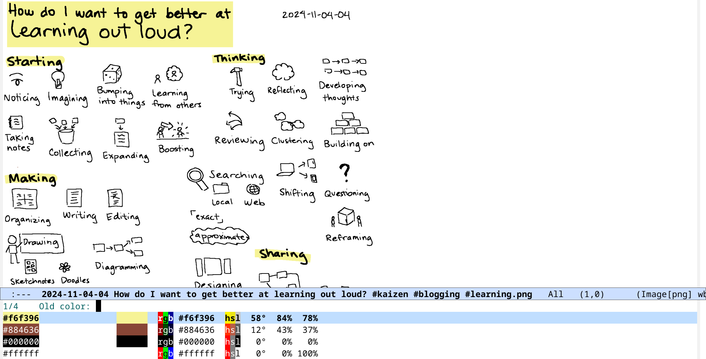
#+end_column50
#+begin_column50
#+CAPTION: Selecting the new colour
#+ATTR_HTML: :data-link t :class box-shadow
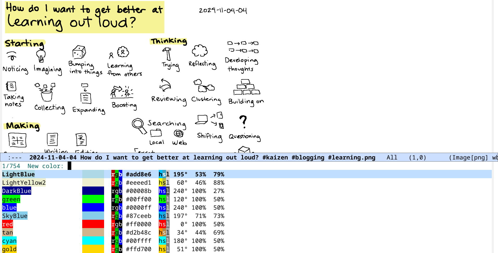
#+end_column50
#+end_columns

#+begin_src emacs-lisp :tangle lisp/sacha-image.el
(defvar sacha-recolor-command "/home/sacha/bin/recolor.py")

;;;###autoload
(defun sacha-image-colors-by-frequency (file)
	"Return the colors in FILE."
	(with-temp-buffer
		(call-process sacha-recolor-command nil t nil (expand-file-name file))
		(goto-char (point-min))
		(delete-region (point-min) (1+ (line-end-position)))
		(mapcar (lambda (o) (concat "#" (car (split-string o "[ \t]"))))
						(split-string (string-trim (buffer-string)) "\n"))))

;;;###autoload
(defun sacha-completing-read-color (prompt list)
	"Display PROMPT and select a color from LIST."
	(completing-read
	 (or prompt "Color: ")
	 (mapcar (lambda (o)
						 (faces--string-with-color o o))
					 list)))

;;;###autoload
(defun sacha-image-recolor-interactively (file)
	(interactive (list (read-file-name "File: " (concat sacha-sketches-directory "/") nil t
																		 nil
																		 (lambda (file) (string-match "\\.png\\'" file)))))
	(save-window-excursion
		(find-file file)

		;; Identify the colors by frequency
		(let (choice done)
			(while (not done)
				(let* ((by-freq (sacha-image-colors-by-frequency file))
							 (old-color (sacha-completing-read-color "Old color: " by-freq))
							 (new-color (read-color "New color: " t))
							 (temp-file (make-temp-file "recolor" nil (concat "." (file-name-extension file))))
							 color-map)
					(when (string-match "#\\(..\\)..\\(..\\)..\\(..\\).." new-color)
						(setq new-color (concat (match-string 1 new-color)
																		(match-string 2 new-color)
																		(match-string 3 new-color))))
					(setq color-map (replace-regexp-in-string "#" "" (concat old-color "," new-color)))
					(call-process sacha-recolor-command nil nil nil
												(expand-file-name file)
												"--colors"
												color-map
												"--output" temp-file)
					(find-file temp-file)
					(pcase (read-char-choice "(y)es, (m)ore, (r)edo, (c)ancel: " "yrc")
						(?y
						 (kill-buffer)
						 (rename-file temp-file file t)
						 (setq done t))
						(?m
						 (kill-buffer)
						 (rename-file temp-file file t))
						(?r
						 (kill-buffer)
						 (delete-file temp-file))
						(?c
						 (kill-buffer)
						 (delete-file temp-file)
						 (setq done t))))))))
#+end_src

#+RESULTS:
:results:
sacha-image-recolor-interactively
:end:

It would be nice to update the preview as I
selected things in the completion, which I might
be able to do by making a [[https://github.com/minad/consult][consult--read]] command
for it. It would be extra cool if I could use this
[[https://github.com/ozanmakes/emacs-webkit-color-picker/blob/master/webkit-color-picker.org][webkit-based color picker]]. Maybe someday!
*** Org Mode sketch: links                                         :image:
:PROPERTIES:
:CUSTOM_ID: org-mode-sketch-links
:END:

#+NAME: org-sketch-link
#+begin_src emacs-lisp :tangle lisp/sacha-org-image.el
;;;###autoload
(defun sacha-open-images-in-krita (files)
  (apply 'call-process "krita" nil 0 nil "--nosplash" files))
;;;###autoload
(defun sacha-open-images-in-gwenview (files)
  (apply 'call-process "gwenview" nil 0 nil "--slideshow" files))
;;;###autoload
(defun sacha-open-images-in-feh (files)
  (apply 'call-process "feh" nil nil nil "-D" "1" "-F" files))
;;;###autoload
(defun sacha-org-image-open (id &optional arg directories)
  "Open image named ID.
      If ARG is specified, prompt for application to open it in."
  (interactive (list
                (completing-read "Sketch ID: " (sacha-list-sketches "."))
                (current-prefix-arg)))
  (let* ((files (mapcar (lambda (o) (sacha-get-image-filename o (or sacha-image-directories))) (if (listp id) id (list id))))
         (input (if arg (read-char "(k)rita, (g)wenview, (f)eh: ") ?k)))
    (funcall
     (cond
      ((eq input ?g) 'sacha-open-images-in-gwenview)
      ((eq input ?f) 'sacha-open-images-in-feh)
      (t 'sacha-open-images-in-krita))
     files)))
;;;###autoload
(defun sacha-org-sketch-edit (id &optional arg)
  (sacha-org-image-open id arg sacha-sketch-directories))
;;;###autoload
(defun sacha-org-sketch-open (id &optional arg)
  (delete-other-windows)
  (with-selected-window (split-window-right)
    (find-file (sacha-get-image-filename
								id sacha-sketch-directories))))
;;;###autoload
(defun sacha-org-image-export (link description format info)
  (let* ((path (concat "https://sketches.sachachua.com/filename/" link))
         (image (concat "https://sketches.sachachua.com/static/" link))
         (backend (org-export-backend-name (plist-get info :back-end)))
         (desc (or description link)))
    (cond
     ((eq backend '11ty) (format "{%% sketchLink \"%s\", \"%s\" %%}" link desc))
     ((or (eq format 'html) (eq format 'wp))
      (if description
          (format "<a target=\"_blank\" href=\"%s\">%s</a>" path desc)
        (format "<div style=\"text-align: center\"><a target=\"_blank\" href=\"%s\"><br />%s</a></div>" path image desc)))
     ((eq format 'latex) (format "\\href{%s}{%s}" path desc))
     ((eq format 'texinfo) (format "@uref{%s,%s}" path desc))
     ((eq format 'md)
      (if (file-exists-p (expand-file-name link "~/sketches"))
          (format "" image)
        (format "" link)))
     ((eq format 'ascii) (format "%s <%s>" desc path))
     (t path))))

;;;###autoload
(defun sacha-org-image-export-link (link description format info)
  (let* ((backend (if (plist-get info :backend) (org-export-backend-name (plist-get info :back-end))
                    format))
         (desc (or description link)))
    (cond ((eq backend 'md)
           (format "[%s](%s)" desc link))
          ((eq backend '11ty)
           (format "{%% sketchLink \"%s\", \"%s\" %%}"
                   (replace-regexp-in-string "\"" "\\\"" (file-name-base link) nil t)
                   (replace-regexp-in-string "\"" "\\\"" desc nil t)))
          ((eq backend 'html)
           (format "<a href=\"https://sketches.sachachua.com/filename/%s\">%s</a>" (file-name-nondirectory link) desc))
          (t (format "[[%s][%s]]" link desc)))))

;;;###autoload
(defun sacha-org-image-export-thumb (link description format info)
  (let* ((path (concat "https://sketches.sachachua.com/filename/" link))
         (image (concat "https://sketches.sachachua.com/static/" link))
         (backend (org-export-backend-name (plist-get info :back-end)))
         (desc (replace-regexp-in-string "%23" "#" (or description link))))
    (cond
     ((eq backend '11ty) (format "{%% sketchThumb \"%s\", \"%s\" %%}" (file-name-base link) desc))
     ((or (eq format 'html) (eq format 'wp))
      (format "<div class=\"sketch-thumbnail\"><a target=\"_blank\" href=\"%s\"><br />%s</a></div>" path image desc))
     ((eq format 'latex) (format "\\href{%s}{%s}" path desc))
     ((eq format 'texinfo) (format "@uref{%s,%s}" path desc))
     ((eq format 'md)
      (if (file-exists-p (expand-file-name link "~/sketches"))
          (format "" image)
        (format "" link)))
     ((eq format 'ascii) (format "%s <%s>" desc path))
     (t path))))

;;;###autoload
(defun sacha-org-image-export-full (link description format info)
  (let* ((path (concat "https://sketches.sachachua.com/filename/" link))
         (image (concat "https://sketches.sachachua.com/static/" link))
         (backend (org-export-backend-name (plist-get info :back-end)))
         (desc (or description link)))
    (cond
     ((eq backend '11ty) (format "{%% sketchFull \"%s\", \"%s\" %%}" link desc))
     ((or (eq format 'html) (eq format 'wp))
      (if description
          (format "<figure><a target=\"_blank\" href=\"%s\"><br /></a><figcaption>%s</figcaption></figure>" path image desc)
        (format "<figure><a target=\"_blank\" href=\"%s\"><br /><figcaption>%s</figcaption></a></figure>" path image desc)))
     ((eq format 'latex) (format "\\href{%s}{%s}" path desc))
     ((eq format 'texinfo) (format "@uref{%s,%s}" path desc))
     ((eq format 'md)
      (if (file-exists-p (expand-file-name link "~/sketches"))
          (format "" image)
        (format "" link)))
     ((eq format 'ascii) (format "%s <%s>" desc path))
     (t path))))

;;;###autoload
(defun sacha-org-sketch-complete (&optional prefix)
  (concat "sketch:" (file-name-nondirectory (sacha-complete-sketch-filename))))
;;;###autoload
(defun sacha-org-sketch-complete-full (&optional prefix)
  (concat "sketchFull:" (file-name-nondirectory (sacha-complete-sketch-filename))))
;;;###autoload
(defun sacha-org-image-complete (&optional prefix)
  (concat "image:"
          (completing-read "Image: " (sacha-list-sketches "." nil sacha-image-directories))))
;; Based on https://emacs.stackexchange.com/questions/38098/org-mode-custom-youtube-link-syntax
;;;###autoload
(defun sacha-org-sketch-preview (start end path bracketp)
  "Include overlays for sketches."
  (when (display-graphic-p)
    (let ((filename (sacha-get-sketch-filename path))
          (refresh nil)
          (link (save-excursion
                  (goto-char start)
                  (org-element-lineage
                   (save-match-data (org-element-context))
                   '(link) t)))) ;; set this someday
      (when (and (not (org-element-property :contents-begin link)) filename)
        (let ((width
               ;; Apply `org-image-actual-width' specifications.
               (cond
                ((not (image-type-available-p 'imagemagick)) nil)
                ((eq org-image-actual-width t) nil)
                ((numberp org-image-actual-width) org-image-actual-width)
                ;; Pick this up from the paragraph someday
                ))
              (old (get-char-property-and-overlay start 'org-image-overlay)))
          (if (and (car-safe old) refresh)
              (image-refresh (overlay-get (cdr old) 'display))
            (let ((image (create-image filename
                                       (and width 'imagemagick)
                                       nil
                                       :width width)))
              (when image
                (let* ((ov (make-overlay start end)))
                  (overlay-put ov 'display image)
                  (overlay-put ov 'face 'default)
                  (overlay-put ov 'org-image-overlay t)
                  (overlay-put ov 'evaporate t)
                  (overlay-put
                   ov 'modification-hooks
                   (list 'org-display-inline-remove-overlay))
                  (push ov org-inline-image-overlays))))))))))

#+end_src

#+begin_src emacs-lisp
(use-package org
  :config
  (setq org-image-actual-width 600)
  (org-link-set-parameters
   "sketch"
   :follow 'sacha-org-sketch-open
   :export 'sacha-org-image-export-link
   :complete 'sacha-org-sketch-complete
   :activate-func nil)
  (org-link-set-parameters
   "sketchLink"
   :follow 'sacha-org-sketch-open
   :export 'sacha-org-image-export-link
   :complete 'sacha-org-sketch-complete
   :activate-func nil)
  (org-link-set-parameters
   "sketchThumb"
   :follow 'sacha-org-sketch-open
   :export 'sacha-org-image-export-thumb
   :complete 'sacha-org-sketch-complete
   :activate-func nil)
  (org-link-set-parameters
   "sketchFull"
   :follow 'sacha-org-sketch-open
   :export 'sacha-org-image-export-full
   :complete 'sacha-org-sketch-complete-full
   :activate-func nil))
  (org-link-set-parameters
   "image"
   :follow 'sacha-org-image-open
   :export 'sacha-org-image-export
   :complete 'sacha-org-image-complete))
#+end_src

*** Org Mode custom link: copy to clipboard                    :emacs:org:
:PROPERTIES:
:CUSTOM_ID: org-mode-copy
:EXPORT_DATE: 2024-01-16T07:57:50-0500
:EXPORT_ELEVENTY_PERMALINK: /blog/2024/01/org-mode-custom-link-copy-to-clipboard/
:EXPORT_ELEVENTY_FILE_NAME: blog/2024/01/org-mode-custom-link-copy-to-clipboard/
:END:

I have a tiny corporation for my consulting. I do
all of my own paperwork. I have lots of notes in
Org Mode for infrequent tasks like the tax-related
paperwork I do once a year. My notes include
checklists, links, and Org Babel blocks for
calculations. I often need to copy standard text
(ex: the name of the company) or parts of the
output of my Org Babel blocks (ex: tax collected)
so that I can fill in web forms on the Canada
Revenue Agency website.

This little snippet makes it easy to copy text for
pasting. It defines a custom Org link that starts
with ~copy:~. When I follow the link by clicking
on it or using ~C-c C-o~ (~org-open-at-point~), it
copies the text to the kill ring (which is what
Emacs calls the clipboard) so that I can paste it
anywhere. For example, ~[[copy:Hello world]]~
becomes a link to copy "Hello world". Copying
means never having to worry about typos or
accidentally selecting only part of the text.

#+NAME: org-copy-link
#+begin_src emacs-lisp :tangle lisp/sacha-org.el
;;;###autoload
(defun sacha-org-copy-export (link desc format)
	(pcase format
		('org (org-link-make-string (concat "copy:" link) desc))
		(_ desc)))
#+end_src

#+begin_src emacs-lisp
(use-package org
  :config
  (org-link-set-parameters
   "copy"
   :follow (lambda (link) (kill-new link))
	 :export #'sacha-org-copy-export))
#+end_src

I can use these links as part of my checklist so
that I can quickly fill in things like my business
name and other details. I can put sensitive
information like my social insurance number in a
GPG-encrypted file. (Just set up your GPG keys and
end a filename with ~.gpg~, and Emacs will take
care of transparently encrypting and decrypting
the file.)

I can also export those links as part of my Org
Babel output. For example, the following code
calculates the numbers I need to fill in a T5 form
for the other-than-eligible dividends that I issue
myself according to the [[https://www.canada.ca/en/revenue-agency/services/tax/businesses/topics/completing-slips-summaries/financial-slips-summaries/return-investment-income-t5/t5-slip/completing-t5-slip.html][T5 instructions from the CRA]].

#+begin_src emacs-lisp :results table replace :exports both :eval never-export
(let* ((box-10 1234) ; fake number for demo
       (box-11 (* 1.15 box-10))
       (box-12 (* 0.090301 box-11)))
  `((box-10 ,(format "[[copy:%.2f][%.2f]]" box-10 box-10))
    (box-11 ,(format "[[copy:%.2f][%.2f]]" box-11 box-11))
    (box-12 ,(format "[[copy:%.2f][%.2f]]" box-12 box-12))))
#+end_src

#+RESULTS:
:results:
| box-10 | [[copy:1234.00][1234.00]] |
| box-11 | [[copy:1419.10][1419.10]] |
| box-12 | [[copy:128.15][128.15]]  |
:end:

[[copy:Hello world]]

Hello world
On my computer, the numbers become links that I
can click and copy. Another little shortcut thanks
to Emacs and Org Mode!
*** Helm completion with sacha-helm-org-sketches
:PROPERTIES:
:CUSTOM_ID: helm-completion-with-sacha-helm-org-sketches
:END:

#+begin_src emacs-lisp :tangle lisp/sacha-helm.el
;;;###autoload
(defun sacha-helm-source-org-sketch-list ()
  (sacha-list-sketches "."))

;;;###autoload
(defun sacha-helm-org-insert-sketch-candidates (&optional candidates)
  (mapc (lambda (o)
          (org-insert-link nil (concat "sketch:" o))
          (insert "\n"))
        (helm-marked-candidates)))

;;;###autoload
(defun sacha-helm-open-sketches-in-krita (&optional candidates)
  (sacha-sketch-open-in-krita (helm-marked-candidates)))

;;;###autoload
(defun sacha-helm-open-sketches-in-gwenview (&optional candidates)
  (sacha-sketch-open-in-gwenview (helm-marked-candidates)))

;;;###autoload
(defun sacha-helm-open-sketches-in-feh (&optional candidates)
  (sacha-sketch-open-in-feh (helm-marked-candidates)))

(defvar sacha-helm-source-org-sketches
  '((name . "Sketches")
    (candidates . sacha-helm-source-org-sketch-list)
    (action . (("Insert" . sacha-helm-org-insert-sketch-candidates)
               ("Open in Krita" . sacha-helm-open-sketches-in-krita)
               ("Open in Gwenview" . sacha-helm-open-sketches-in-gwenview)
               ("Open as Feh slideshow" . sacha-helm-open-sketches-in-feh)))
    (persistent-action . sacha-helm-open-sketches-in-gwenview)))

;;;###autoload
(defun sacha-helm-org-sketches ()
  (interactive)
  (helm :sources '(sacha-helm-source-org-sketches)
        :buffer "*helm-org-sketches*"))
#+end_src

*** Button-based interface
:PROPERTIES:
:CUSTOM_ID: button-based-interface
:END:

This makes a buffer with big buttons so that I can easily tap them with my stylus.

#+begin_src emacs-lisp :tangle lisp/sacha-sketch.el
;;;###autoload
(defun sacha-set-up-sketch-buffer ()
  "Populate a widget buffer with a few handy buttons."
  (interactive)
  (with-current-buffer (get-buffer-create "*Done*")
    (let ((inhibit-read-only t))
      (erase-buffer)
      (widget-create 'push-button
                     :notify (lambda (&rest ignore)
                               (sacha-org-clock-in-and-track-by-name "Draw"))
                     "Track: Draw")
      (widget-create 'push-button
                     :notify (lambda (&rest ignore)
                               (sacha-org-clock-in-and-track-by-name "Draw journal entries"))
                     "Track: Journal")
      (widget-create 'push-button
                     :notify (lambda (&rest ignore)
                               (sacha-org-sketch-open (sacha-prepare-index-card-template)))
                     "New")
      (widget-create 'push-button
                     :notify (lambda (&rest ignore)
                               (sacha-org-sketch-open (sacha-prepare-large-template)))
                     "New large")
      (widget-create 'push-button
                     :notify (lambda (&rest ignore)
                               (sacha-org-sketch-open (sacha-prepare-index-card-template nil (org-read-date))))
                     "Date")
      (widget-create 'push-button
                     :notify (lambda (&rest ignore) (shell-command "~/bin/rotate-screen")) "Rotate")
      (insert "\n")
      (widget-create 'push-button
                     :notify (lambda (&rest ignore)
                               (shell-command "~/bin/add-output-png"))
                     "Add output.png")
      (widget-create 'push-button
                     :notify (lambda (&rest ignore)
                               (sacha-rotate-screen 0)
                               (kill-buffer)
                               (sacha-rename-scanned-cards))
                     "Process")
      (widget-create 'push-button
                     :notify (lambda (&rest ignore)
                               (sacha-rotate-screen 0)
                               (delete-window)
                               (sacha-rename-scanned-cards))
                     "Rename")
      (widget-create 'push-button
                     :notify (lambda (&rest ignore)
                               (sacha-rotate-screen 0)
                               (delete-window)
                               (sacha-convert-and-upload-cards))
                     "Upload")
      (widget-create 'push-button
                     :notify (lambda (&rest ignore)
                               (sacha-rotate-screen 0)
                               (org-clock-out)
                               (kill-buffer))
                     "Quit")
      (text-scale-set 10)
      (widget-setup)
      (widget-minor-mode)
      (pop-to-buffer (current-buffer))
      (goto-char (point-min))
      (current-buffer))))

;;;###autoload
(defun sacha-prepare-index-cards (n)
  (interactive (list (or current-prefix-arg 5)))
  (let ((counter 1)
        (directory "~/Dropbox/Inbox")
        (template sacha-index-card-template-file)
        (date (substring (org-read-date nil nil ".") 0 10))
        temp-file)
    (quantified-track "Drawing")
    (dotimes (i 5) (sacha-org-sketch-open (sacha-prepare-index-card-template)))
    (sacha-rotate-screen 180)
    (sacha-set-up-sketch-buffer)))

(defvar sacha-index-card-file-name nil "Most recent index card file name.")
;;;###autoload
(defun sacha-rotate-screen (degrees)
  (cond
   ((eq system-type 'windows-nt)
    (shell-command (format "c:/sacha/Dropbox/bin/orient /rotate:%d" degrees)))
   ((eq system-type 'gnu/linux)
    (shell-command (format "~/bin/rotate-screen %s"
                           (cond
                            ((= degrees 0) "normal")
                            ((= degrees 180) "inverted")
                            ((= degrees 90) "left")
                            ((= degrees 270) "right")))))))
#+end_src

#+begin_src emacs-lisp
(setq sacha-sketch-executable "krita"
      sacha-sketch-inbox-directory "~/Dropbox/Inbox"
      sacha-index-card-template-file "~/Dropbox/drawings/templates/0 - index.psd"
      sacha-sketch-large-template-file "/home/sacha/Dropbox/drawings/templates/0 - base.psd")
#+end_src

*** Templates                                                      :image:
:PROPERTIES:
:CUSTOM_ID: templates
:END:

#+begin_src emacs-lisp :tangle lisp/sacha-sketch.el
;;;###autoload
(defun sacha-prepare-drawing-template (&optional name date template)
  "Create the image file for NAME. Return the new filename."
  (let* ((date (or date (substring (org-read-date nil nil ".") 0 10)))
         (data (sacha-journal-post (or name "sketch") :Date date)))
    (setq name (expand-file-name
                (concat (assoc-default 'ZIDString data)
                        (if name
                            (concat " "
                                    (sacha-convert-sketch-title-to-filename (or name "")))

                              "")
                            "." (file-name-extension template))
                    "~/Dropbox/Inbox"))
    (copy-file (or template sacha-index-card-template-file) name)
    name))

;;;###autoload
(defun sacha-org-insert-new-index-card-link ()
  (interactive)
  (let ((filename
         (sacha-prepare-index-card-template)))
    (insert "[[sketch:" filename "]]\n")
    (save-window-excursion
      (sacha-rotate-screen 180)
      (shell-command
       (concat (shell-quote-argument sacha-sketch-executable)
               " " (shell-quote-argument filename) " &")))))

;;;###autoload
(defun sacha-prepare-index-card-template (&optional name date)
  "Create the image file for NAME. Return the new filename."
  (sacha-prepare-drawing-template name date sacha-index-card-template-file))

;;;###autoload
(defun sacha-prepare-large-template (&optional name date)
  "Create the image file for NAME. Return the new filename."
  (sacha-prepare-drawing-template name date sacha-sketch-large-template-file))


;;;###autoload
(defun sacha-prepare-index-card (&optional name date)
  "Prepare the index card for NAME.
              Rotate the screen and show a button to un-rotate the screen."
  (interactive (list (read-string "Name: ")
                     (substring (if current-prefix-arg (org-read-date) (org-read-date nil nil ".")) 0 10)))
  (setq sacha-index-card-file-name (sacha-prepare-index-card-template name date))
  (save-window-excursion
    (sacha-rotate-screen 180)
    (shell-command
     (concat (shell-quote-argument sacha-sketch-executable)
             " " (shell-quote-argument sacha-index-card-file-name) " &")))
  (sacha-set-up-sketch-buffer))

;;;###autoload
(defun sacha-prepare-index-card-for-subtree ()
  "Create an index card template for the current subtree."
  (interactive)
  (let* ((heading (elt (org-heading-components) 4)))
    (unless (org-entry-get (point) "Effort") (org-set-property "Effort" "0:15"))
    (if (derived-mode-p 'org-agenda-mode) (org-agenda-clock-in) (org-clock-in))
    (sacha-org-quantified-track "Drawing")
    (if (org-at-heading-p) (forward-line 1))
    (sacha-prepare-index-card heading)))

;;;###autoload
(defun sacha-helm-org-prepare-index-card-for-subtree (candidate)
  (let ((location (org-refile--get-location candidate sacha-helm-org-refile-locations)))
    (save-window-excursion
      (save-excursion
        (org-refile 4 nil location)
        (sacha-prepare-index-card-for-subtree)) t)))
#+end_src
*** Dot-grid box templates
:PROPERTIES:
:CUSTOM_ID: multimedia-images-dot-grid-box-templates
:END:

Related: [[https://sachachua.com/blog/2025/10/doodling-icons-in-a-grid/][Doodling icons in a grid]]

#+NAME: sacha-dot-grid-boxes-template
#+begin_src emacs-lisp :results silent :tangle lisp/sacha-svg-dot-grid.el
(require 'svg)
(defvar sacha-dot-grid-boxes-params
	'(:num-rows 5
		:num-cols 7
		:dot-size 3
		:line-width 3
		:dot-spacing 60
		:grid-color "#a6d2ff"
		:row-size 6
		:col-size 6
		:text-size 50
		:margin-top 2))
;;;###autoload
(cl-defun sacha-dot-grid-boxes-template (&key (num-rows 5)
                                           (num-cols 7)
                                           (dot-size 3)
																					 (line-width 3)
                                           (dot-spacing 60)
                                           (grid-color "#a6d2ff")
                                           (row-size 6)
                                           (col-size 6)
																					 (text-size 50)
                                           (margin-top 2))
  "Prepare an SVG with a dot grid within a table with solid gridlines.
Each dot is a solid circle of DOT-SIZE filled with GRID-COLOR spaced DOT-SPACING apart.
The gridlines are also GRID-COLOR. They should divide the image into ROWS and COLUMNS, which are ROW-SIZE * DOT-SPACING and COL-SIZE * DOT-SPACING apart.
The table has a top margin with the dot grid, and this is MARGIN-TOP * DOT-SPACING tall.
All dots are centered on their x, y coordinates.
The rest of the image's background is white."
  (let* ((width (* num-cols col-size dot-spacing))
         (height (* dot-spacing (+ margin-top (* num-rows row-size))))
         (margin-top-height (* margin-top dot-spacing))
				 (svg (svg-create width height)))
		(dotimes (row (+ (* num-rows row-size) margin-top))
      (dotimes (col (1+ (* num-cols col-size)))
        (let ((x (* col dot-spacing))
              (y (* row dot-spacing)))
          (svg-circle svg x y dot-size
											:fill-color grid-color
											:stroke-width 0))))
		(when (> text-size 0)
			(dotimes (i (* num-rows num-cols))
        (let ((x (* (% i num-cols) col-size dot-spacing))
              (y (+ margin-top-height (* (/ i num-cols) row-size dot-spacing))))
          (svg-text svg
										(number-to-string (1+ i))
										:x x :y (+ y text-size)
										:fill-color grid-color
										:font-size text-size
										:stroke-width 0))))
    (dotimes (col (1+ num-cols))
      (let ((x (* col col-size dot-spacing)))
        (svg-line svg x margin-top-height x height
									:stroke-color grid-color
									:stroke-width line-width)))
    (dotimes (row (1+ num-rows))
      (let ((y (+ margin-top-height (* row row-size dot-spacing))))
        (svg-line svg 0 y width y
									:stroke-color grid-color
									:stroke-width line-width)))
		svg))
#+end_src


#+begin_src emacs-lisp :tangle no :eval no :results silent
(with-temp-file "~/Dropbox/sketches/icon-grid.svg"
	(svg-print
	 (sacha-dot-grid-boxes-template)))
#+end_src

#+NAME: sacha-dot-grid-boxes-extract
#+begin_src emacs-lisp :results silent :tangle lisp/sacha-svg-dot-grid.el
;;;###autoload
(cl-defun sacha-dot-grid-boxes-list (&key (num-rows 5)
																			 (num-cols 7)
																			 (dot-spacing 60)
																			 (row-size 6)
																			 (col-size 6)
																			 (text-bottom 1)
																			 (margin-top 2)
																			 filename
																			 &allow-other-keys)
	"Return a list of boxes."
	(let* ((margin-top-height (* margin-top dot-spacing))
				 (max-image-size nil)
				 (size (image-size (create-image filename nil nil :scale 1) t))
				 (ratio (/ (car size) (* num-cols col-size dot-spacing 1.0)))
				 results)
		(message "Expected adjusted height %f actual height %f"
						 (* (+ margin-top (* num-rows row-size)) dot-spacing ratio)
						 (cdr size))
		(dotimes (i (* num-rows num-cols))
			(let* ((r (/ i num-cols))
						 (c (% i num-cols))
						 (y (* (+ margin-top-height (* r col-size dot-spacing)) ratio))
						 (x (* c row-size dot-spacing ratio))
						 (width (* col-size dot-spacing ratio))
						 (height (* (- row-size text-bottom) dot-spacing ratio)))
				(setq results (cons
											 `((r . ,r)
												 (c . ,c)
												 (i . ,i)
												 (x . ,(floor x))
												 (y . ,(floor y))
												 (w . ,(floor width))
												 (h . ,(floor height))
												 (x2 . ,(floor (+ x width)))
												 (y2 . ,(floor (+ y height))))
											 results))))
		(nreverse results)))

(defvar sacha-sketch-icon-directory "~/sync/sketches/icons")
;;;###autoload
(cl-defun sacha-dot-grid-boxes-extract (&rest args &key filename labels
																					 (output-dir sacha-sketch-icon-directory) force &allow-other-keys)
	(let* ((list (apply #'sacha-dot-grid-boxes-list args))
				 (base (file-name-base filename))
				 (ext (concat "." (file-name-extension filename)))
				 (id
					(if (string-match "^[0-9][0-9][0-9][0-9]-[0-9][0-9]-[0-9][0-9]-[0-9][0-9]" base)
							(match-string 0 base)
						""))
				 results
				 args)
		(dolist (icon list)
			(let-alist icon
				(let ((new-filename (expand-file-name
														 (concat (sacha-make-slug (elt labels .i)) "--"
																		 id
																		 (format "-%d-%d"
																						 .r .c)
																		 ext)
														 output-dir)))
					(push `((term . ,(elt labels .i))
									(icon . ,(file-name-nondirectory new-filename))
									(source . ,(file-name-nondirectory filename)))
								results)
					(when (or force (not (file-exists-p new-filename)))
						(setq args
									(list (expand-file-name filename)
												"-crop"
												(format "%dx%d+%d+%d" .w .h .x .y)
												"+repage"
												new-filename))
						(message "%s" (concat "convert " (mapconcat #'shell-quote-argument args " ")))
						(apply #'call-process "convert" nil nil nil args)))))
		(nreverse results)))

;;;###autoload
(defun sacha-dot-grid-boxes-labels (id)
	(with-temp-buffer
		(insert-file-contents (concat (file-name-sans-extension (sacha-get-sketch-filename id)) ".txt"))
		(goto-char (point-min))
		(re-search-forward "^ *$")
		(split-string (string-trim (buffer-substring (point) (point-max))) "\n")))
#+end_src

This updates the index.

#+NAME: sacha-dot-grid-boxes-process
#+begin_src emacs-lisp :results silent :tangle lisp/sacha-svg-dot-grid.el
;;;###autoload
(defun sacha-sketch-icon-update-index (list)
	(let (data
				(index-file (expand-file-name "index.json" sacha-sketch-icon-directory)))
		(with-temp-file index-file
			(setq data
						(if (file-exists-p index-file)
								(json-read-file index-file)
							'()))
			(dolist (entry list)
				;; Remove current entry
				(setq data (seq-remove (lambda (o)
																 (and (string-match (regexp-quote (alist-get 'source o)) (alist-get 'source entry))
																			(string= (alist-get 'term o) (alist-get 'term entry))
                                      (string= (alist-get 'icon o) (alist-get 'icon entry))))
															 data))
				;; Add a new entry
				(push
				 `((term . ,(alist-get 'term entry))
					 (icon . ,(alist-get 'icon entry))
					 (source . ,(alist-get 'source entry)))
				 data))
			(insert (json-encode (sort data :key (lambda (o) (alist-get 'term o)) :lessp #'string<))))))

;;;###autoload
(defun sacha-dot-grid-boxes-process (id &optional force)
	(interactive
	 (list
		(sacha-complete-sketch-filename "drawing")
		current-prefix-arg))
	(let* ((labels (sacha-dot-grid-boxes-labels id))
				 list)
		(cl-assert (= (% (length labels) 7) 0))
		(cl-assert (> (length labels) 1))
		(setq list
					(sacha-dot-grid-boxes-extract :output-dir sacha-sketch-icon-directory
																		 :num-rows (/ (length labels) 7)
																		 :filename (sacha-get-sketch-filename id)
																		 :labels labels
																		 :force force))
		(sacha-sketch-icon-update-index list)))

;;;###autoload
(defun sacha-dot-grid-boxes-process-all-icons ()
	(interactive)
	(dolist (source (sacha-sketches "icons")) (sacha-dot-grid-boxes-process source)))
#+end_src


*** Easily backfill my journal
CLOSED: [2015-07-19 Sun 11:53]
:PROPERTIES:
:Effort:   0:30
:QUANTIFIED: Emacs
:CUSTOM_ID: easily-backfill-sacha-journal
:END:
:LOGBOOK:
- State "DONE"       from "STARTED"    [2015-07-19 Sun 11:53]
  CLOCK: [2015-07-19 Sun 11:18]--[2015-07-19 Sun 11:53] =>  0:35
:END:

#+begin_src emacs-lisp :tangle lisp/sacha-journal.el
;;;###autoload
(defun sacha-draw-journal-entry (date)
  "Creates a blank journal entry for DATE and brings up the log."
  (interactive (list (org-read-date)))
  ;; Open the Quantified Awesome time log for that date
  (let ((filename (sacha-get-journal-entry date))
        (day (format-time-string "%A" (org-time-string-to-time date))))
    (if filename
        (sacha-org-sketch-open filename)
      ;; (browse-url (format "http://quantifiedawesome.com/records?start=%s&end=%s"
      ;;                     date
      ;;                     (format-time-string
      ;;                      "%Y-%m-%d"
      ;;                      (seconds-to-time
      ;;                       (+ (org-time-string-to-seconds date) 86400)))))
      (setq filename
            (sacha-prepare-index-card-template (concat day " #daily #journal") date))
      (sacha-org-sketch-open filename))))

;;;###autoload
(defun sacha-get-journal-entry (date)
  "Returns the filename for the journal sketch for DATE."
  (car
   (-filter (lambda (x) (not (string-match "weekly" x)))
            (sacha-get-sketch-filenames
             (format "%s.* .*#daily" date)
             t))))

;;;###autoload
(defun sacha-get-missing-journal-dates (start-date end-date)
  "Return a list of dates missing journal entries.
      Range is specified by START-DATE (inclusive) and END-DATE (exclusive)."
  (let* ((current-day (org-time-string-to-absolute end-date))
         (start-day (org-time-string-to-absolute start-date))
         current-date
         current-date-string
         missing-list)
    (while (>= current-day start-day)
      (setq current-date (calendar-gregorian-from-absolute current-day))
      (setq current-date-string (format "%04d-%02d-%02d" (elt current-date 2) (elt current-date 0) (elt current-date 1)))
      (unless (sacha-get-journal-entry current-date-string)
        (add-to-list 'missing-list current-date-string))
      (setq current-day (1- current-day)))
    missing-list))

;;;###autoload
(defun sacha-show-missing-journal-entries (since)
  (interactive (list (if current-prefix-arg (org-read-date) (org-read-date nil nil "-7"))))
  (let ((missing-dates (sacha-get-missing-journal-dates since (org-read-date nil nil "."))))
    (with-current-buffer (sacha-set-up-sketch-buffer)
      (mapc
       (lambda (date)
         (widget-create 'push-button
                        :date date
                        :notify (lambda (widget &rest ignore)
                                  (sacha-draw-journal-entry (plist-get (cdr widget) :date)))
                        date))
       missing-dates)
      (widget-setup)
      (widget-minor-mode))))
#+end_src

*** Rename scanned index cards
:PROPERTIES:
:CUSTOM_ID: rename-scanned-index-cards
:END:

#+begin_src emacs-lisp
(use-package s)
#+end_src

#+begin_src emacs-lisp :tangle lisp/sacha-image.el
;;;###autoload
(defun sacha-process-tiff (files)
  "Convert, display, rename, and upload FILES."
  (interactive (list (dired-get-marked-files)))
  (unless (listp files) (setq files (list files)))
  (save-window-excursion
    (apply 'call-process "mogrify" nil nil nil (append (list "-format" "png" "-quality" "1") files))
    (delete-other-windows)
    (setq files
          (mapcar
           (lambda (filename)
             (find-file (setq filename (s-append ".png" (s-chop-suffix ".tif" filename))))
             (let ((new-name
                    (read-string "New name: "
                                 (concat
                                  (if (string-match "/\\(\\([0-9]+-[0-9]+-[0-9]+\\)\\( ?.*\\)?\\)\\.png" filename)
                                      (match-string 1 filename)
                                    filename)
                                  " "))))
               (rename-file filename (concat new-name ".png"))
               (setq filename (expand-file-name (concat new-name ".png") (file-name-directory filename)))))
           files)))
  (find-file "~/Dropbox/Public/sharing/index.org")
  (goto-char (point-min))
  (when (re-search-forward (regexp-quote "#+ORGLST: sketchinbox"))
    (forward-line 1)
    (org-end-of-item-list)
    (apply 'call-process "up" nil t nil files)))

;;;###autoload
(defun sacha-convert-index-card-to-png (o)
  (lambda (o)
    (call-process "krita" nil nil nil o "--export" "--export-filename"
                  (concat (file-name-sans-extension o) ".png"))
    (rename-file o "~/Dropbox/Inbox/backup/" t)))

;;;###autoload
(defun sacha-convert-index-card-tiffs-to-pngs ()
  (interactive)
  (let ((pattern "^\\(IMG\\|[0-9]+-[0-9]+-[0-9]+\\).*.\\(tif\\|psd\\)$"))
    (when (directory-files "~/Dropbox/Inbox/" t pattern)
      ;; Convert the TIFFs first
      (mapc 'sacha-convert-index-card-to-png
            (directory-files "~/Dropbox/Inbox/" t pattern)))))

;;;###autoload
(defun sacha-convert-and-upload-cards ()
  "Trust in existing filenames, upload without modification."
  (interactive)
  (sacha-convert-index-card-tiffs-to-pngs)
  (sacha-upload-scanned-cards))

;;;###autoload
(defun sacha-rename-scanned-card (filename)
  (find-file filename)
  (delete-other-windows)
  (let ((base (file-name-sans-extension filename))
        notes)
    (when (string-match "/IMG.*\\|\\(\\([0-9]+-[0-9]+-[0-9]+\\)\\( ?.*\\)?\\)" base)
      (let ((kill-buffer-query-functions nil)
            old-name
            (new-name (read-string "New name: "
                                   (if (match-string 1 base)
                                       (concat (match-string 1 base))
                                     ""))))
        (while (and (string-match "^[0-9]+-[0-9]+-[0-9]+[a-z]" new-name)
                    (setq old-name (sacha-get-sketch-filename (match-string 0 new-name)))
                    (and old-name
                         (not (string= old-name filename))
                         (not (string= (file-name-nondirectory old-name)
                                       (concat (s-trim new-name) "." (file-name-extension filename))))))
          (setq new-name
                (read-string (format "Already exists (%s) - new name: " old-name)
                             new-name)))
        (when (string-match new-name "^\\(.*?\\) *| *\\(.*\\)")
          (with-current-buffer (find-file "~/sync/orgzly/Inbox.org")
            (goto-char (point-max))
            (insert "\n* " (match-string 1 new-name) "\n" (match-string 2 new-name))
            (save-buffer))
          (setq new-name (match-string 1 new-name)))
        (when (> (length new-name) 0)
          (revert-buffer t t)
          (rename-file filename (concat (s-trim new-name) "." (file-name-extension filename)) t)
          (kill-buffer))))))

;;;###autoload
(defun sacha-rename-scanned-cards ()
  "Display and rename the scanned or saved files."
  (interactive)
  (sacha-convert-index-card-tiffs-to-pngs)
  (mapc (lambda (o)
          (when (string= (file-name-extension o) "psd")
            (sacha-convert-index-card-to-png o)
            (setq o (concat (file-name-sans-extension o) ".png")))
          (sacha-rename-scanned-card o))
        (reverse (directory-files "~/Dropbox/Inbox/" t "^\\(IMG\\|[0-9]+-[0-9]+-[0-9]+\\).*.\\(psd\\|png\\|jpg\\)")))
  (sacha-upload-scanned-cards))

;;;###autoload
(defun sacha-clean-index-card-directory ()
  "Remove files marked for deletion and move private files."
  (shell-command "mv ~/Dropbox/Inbox/*delete* ~/Dropbox/Inbox/backup")
  (shell-command "mv ~/Dropbox/Inbox/*private* ~/cloud/private-sketches/"))

;;;###autoload
(defun sacha-upload-scanned-cards ()
  (interactive)
  (sacha-clean-index-card-directory)
  (with-current-buffer (get-buffer-create "*Files to be uploaded*")
    (erase-buffer)
    (insert (mapconcat 'identity (directory-files "~/Dropbox/Inbox" nil "^[0-9]+-[0-9]+-[0-9]+[^ ]? .*.\\(png\\|jpg\\)") "\n"))
    (goto-char (point-min))
    (switch-to-buffer (current-buffer))
    (delete-other-windows))
  (shell-command "~/bin/copy-sketches"))
#+end_src

I might tweak the files a little more after I rename them, so I don't
automatically upload them. When I'm happy with the files, I use a [[http://sachachua.com/blog/?p=27830&shareadraft=baba27830_54b92ac511e86][Node
script]] to upload the files to Flickr, move them to my =To blog=
directory, and copy Org-formatted text that I can paste into my
learning outline.

*** Automatically resize images
:PROPERTIES:
:CUSTOM_ID: automatically-resize-images
:END:

The =image+= package is handy for displaying the images so
that they're scaled to the window size.

#+begin_src emacs-lisp
(use-package image+
  :if sacha-laptop-p
  ;;    :load-path "~/elisp/Emacs-imagex"
  :commands (imagex-global-sticky-mode imagex-auto-adjust-mode)
  :init (progn (imagex-global-sticky-mode) (imagex-auto-adjust-mode)))
#+end_src

*** Get information for sketched books
:PROPERTIES:
:CUSTOM_ID: get-information-for-sketched-books
:END:

For sketchnotes of books, I set up the filename based on properties in
my Org Mode tree for that book.

#+begin_src emacs-lisp :tangle lisp/sacha-sketch.el
;;;###autoload
(defun sacha-prepare-sketchnote-file ()
  (interactive)
  (let* ((base-name (org-entry-get-with-inheritance  "BASENAME")))
    (unless base-name (error "Missing basename property"))
    (sacha-org-sketch-open (sacha-prepare-large-template base-name))))
#+end_src

By using Emacs Lisp functions to set up files that I'm going to use in
an external application, I minimize fussing about with the keyboard
while still being able to take advantage of structured information.

Do you work with external applications? Where does it make sense to
use Emacs Lisp to make setup or processing easier?

*** Make it easy to follow up on a sketch
:PROPERTIES:
:CUSTOM_ID: make-it-easy-to-follow-up-on-a-sketch
:END:

#+begin_src emacs-lisp :tangle lisp/sacha-sketch.el
;;;###autoload
(defun sacha-follow-up-on-sketch (filename)
  "Prompt for FILENAME to follow up on.
      Create an index card with it as a layer, and add the ref to the filename."
  (interactive (list (helm-read-file-name "Image: " :initial-input "~/sketches/")))
  ;; Allow the specification of a short identifier
  (unless (file-exists-p filename)
    (setq filename (car (directory-files "~/sketches" t (concat "^" filename)))))
  (let ((async-shell-command-buffer 'new-buffer)
        (index-card (sacha-prepare-index-card-template
                     (format "-- index card ref %s"
                             (and (string-match "^[^ \\.]+" (file-name-nondirectory filename))
                                  (match-string 0 (file-name-nondirectory filename)))))))
    (shell-command (format "convert %s %s -colorspace cmyk %s"
                           (shell-quote-argument (expand-file-name sacha-index-card-template-file))
                           (shell-quote-argument (expand-file-name filename))
                           (shell-quote-argument (expand-file-name index-card))))
    (shell-command (format "%s %s &"
                           (shell-quote-argument sacha-sketch-executable)
                           (shell-quote-argument (expand-file-name index-card))))
    (sacha-rotate-screen 180)
    (sacha-set-up-sketch-buffer)))
#+end_src

*** Digital index piles with Emacs
CLOSED: [2015-02-01 Sun 18:26]
:PROPERTIES:
:Effort:   2:00
:QUANTIFIED: Emacs
:ID:       o2b:243ed83f-244f-417d-b251-53a3fef813aa
:POSTID:   27923
:BLOG:     sacha
:ARCHIVE_TIME: 2015-05-07 Thu 22:17
:ARCHIVE_FILE: ~/.config/emacs/Sacha.org
:ARCHIVE_OLPATH: Inactive/infrequent things/Drawing
:ARCHIVE_CATEGORY: Sacha
:ARCHIVE_TODO: DONE
:CUSTOM_ID: digital-index-piles-with-emacs
:END:
:LOGBOOK:
- State "DONE"       from "STARTED"    [2015-02-01 Sun 18:26]
  CLOCK: [2015-02-01 Sun 17:30]--[2015-02-01 Sun 18:26] =>  0:56
  - State "DONE"       from "STARTED"    [2015-02-01 Sun 17:24]
  CLOCK: [2015-02-01 Sun 13:30]--[2015-02-01 Sun 15:26] =>  1:56
:END:

Somewhat daunted by the prospect of categorizing more than a hundred
sketches and blog posts for my monthly review, I spent some time
figuring out how to create the digital equivalent of sorting index
cards into various piles.

[[https://www.flickr.com/photos/sachac/16234413499/][2015-02-01 Digital piles of index cards -- index card #indexing #organization #pkm]]

In fact, wouldn't it be super-cool if the items could automatically
guess which category they should probably go in, prompting me only if
it wasn't clear?

I wanted to write a function that could take a list structured like this:

  - Keyword A
    - Previous links
  - Keyword B
    - Previous links
  - Link 1 with Keyword A
  - Link 2 with Keyword B
  - Link 3 with Keyword A
  - Link 4

    It should file Link 1 and 3 under Keyword A, Link 2 under Keyword B,
    and prompt me for the category for Link 4. At that prompt, I should be
    able to select Keyword A or Keyword B, or specify a new category.

    Inspired by John Kitchin's recent post on [[http://kitchingroup.cheme.cmu.edu/blog/2015/01/24/Anatosacha-of-a-helm-source/][defining a Helm source]], I
    wanted to get it to work with Helm.

    First step: I needed to figure out the structure of the list, maybe
    including a sample from the category to make it clearer what's
    included. =org-list.el= seemed to have useful functions for this.
    =org-list-struct= gave me the structure of the current list. Let's say
    that a category is anything whose text does not match
    =org-link-bracket-re=.

    #+begin_src emacs-lisp :tangle lisp/sacha-org.el
;;;###autoload
      (defun sacha-org-get-list-categories ()
        "Return a list of (category indent matching-regexp sample).
              List categories are items that don't contain links."
        (let ((list (org-list-struct)) last-category results)
          (save-excursion
            (mapc
             (lambda (x)
               (goto-char (car x))
               (let ((current-item
                      (buffer-substring-no-properties
                       (+ (point)
                          (elt x 1)
                          (length (elt x 2)))
                       (line-end-position))))
                 (if (string-match
                      org-link-bracket-re
                      (buffer-substring-no-properties
                       (point)
                       (line-end-position)))
                     ;; Link - update the last category
                     (when last-category
                       (if (< (elt x 1) (elt last-category 1))
                           (setq results
                                 (cons (append last-category
                                               (list
                                                (match-string-no-properties
                                                 3
                                                 (buffer-substring-no-properties
                                                  (point)
                                                  (line-end-position)))))
                                       (cdr results))))
                       (setq last-category nil))
                   ;; Category
                   (setq results
                         (cons
                          (setq last-category
                                (list
                                 current-item
                                 (elt x 1)
                                 (concat "^"
                                         (make-string (elt x 1) ?\ )
                                         (regexp-quote
                                          (concat (elt x 2)
                                                  current-item))
                                         "$")))
                          results)))))
             list))
          (append '(("x" 2 "^$" nil)) results)))
    #+end_src

    The next step was to write a function that guessed the list category
    based on the item text, and moved the item there.

    #+begin_src emacs-lisp :tangle lisp/sacha-helm.el
(defvar sacha-helm-org-list-candidates nil)
;;;###autoload
(defun sacha-helm-org-list-categories-init-candidates ()
  "Return a list of categories from this list in a form ready for Helm."
  (setq sacha-helm-org-list-candidates
        (mapcar (lambda (x)
                  (cons (if (elt x 3)
                            (format "%s - %s" (car x) (elt x 3))
                          (car x))
                        x))
                (sacha-org-get-list-categories))))
    #+end_src

#+NAME: sacha-org-move-current-item-to-category
#+begin_src emacs-lisp :tangle lisp/sacha-org.el
;;;###autoload
(defun sacha-org-move-current-item-to-category (category)
    "Move current list item under CATEGORY earlier in the list.
  CATEGORY can be a string or a list of the form (text indent regexp).
  Point should be on the next line to process, even if a new category
  has been inserted."
    (interactive (list (completing-read "Category: " (sacha-org-get-list-categories))))
    (when category
      (let* ((col (current-column))
             (item (point-at-bol))
             (struct (org-list-struct))
             (category-text (if (stringp category) category (elt category 0)))
             (category-indent (if (stringp category) 2 (+ 2 (elt category 1))))
             (category-regexp (if (stringp category) category (elt category 2)))
             (end (elt (car (last struct)) 6))
             (pos (point))
             s)
        (setq s (org-remove-indentation (buffer-substring-no-properties item (org-list-get-item-end item struct))))
        (save-excursion
          (if (string= category-text "x")
              (org-list-send-item item 'delete struct)
            (goto-char (caar struct))
            (if (re-search-forward (concat "^ *- +" category-regexp) end t)
                (progn
                  ;; needs a patch to ol.el to check if stringp
                  (org-list-send-item item (point-at-bol) struct)
                  (org-move-item-down)
                  (org-indent-item))
              (goto-char end)
              (org-list-insert-item
               (point-at-bol)
               struct (org-list-prevs-alist struct))
              (let ((old-struct (copy-tree struct)))
                (org-list-set-ind (point-at-bol) struct 0)
                (org-list-struct-fix-bul struct (org-list-prevs-alist struct))
                (org-list-struct-apply-struct struct old-struct))
              (goto-char (point-at-eol))
              (insert category-text)
              (org-list-send-item item 'end struct)
              (org-indent-item)
              (org-indent-item))
            (recenter))))))

;;;###autoload
(defun sacha-org-guess-list-category (&optional categories)
  (interactive)
  (require 'cl-lib)
  (unless categories
    (setq categories
          (sacha-helm-org-list-categories-init-candidates)))
  (let* ((beg (line-beginning-position))
         (end (line-end-position))
         (string (buffer-substring-no-properties beg end))
         (found
          (cl-member string
                     categories
                     :test
                     (lambda (string cat-entry)
                       (unless (string= (car cat-entry) "x")
                         (string-match (regexp-quote (downcase (car cat-entry)))
                                       string))))))
    (when (car found)
      (sacha-org-move-current-item-to-category
       (cdr (car found)))
      t)))
    #+end_src

    After that, I wrote a function that used Helm to prompt me for a
    category in case it couldn't guess the category. It took me a while to
    figure out that I needed to use =:init= instead of =:candidates=
    because I wanted to read information from the buffer before Helm
    kicked in.

    #+begin_src emacs-lisp :tangle lisp/sacha-org.el
(defvar sacha-org-browse-link-while-categorizing 'eww-readable
  "Set to nil to skip browsing.")

;;;###autoload
(defun sacha-org-guess-uncategorized ()
  "Interactively move linked list items to categories from the list.
        Try to guess categories based on substring matches."
  (interactive)
                                        ;(sacha-helm-org-list-categories-init-candidates)
  (let ((categories (sacha-org-get-list-categories))
        category)
    (while (and (looking-at "^[-+] \\[\\[\\([^]]+\\)\\]\\[\\([^]]+*\\)")
                (not (string= "done" category)))
      (save-excursion
        ;; (when (eq sacha-org-browse-link-while-categorizing 'eww-readable)
        ;;   (save-excursion (save-match-data (sacha-eww-browse-readable (match-string 1)))))
        (setq category (completing-read (match-string 2) categories))
        (unless (string= category "done")
          (sacha-org-move-current-item-to-category category))))))

;; From https://emacs.stackexchange.com/questions/36284/how-to-open-eww-in-readable-mode/47757
;;;###autoload
(defun sacha-eww-readable-nonce ()
  "Once-off call to `eww-readable' after EWW is done rendering."
  (unwind-protect
      (eww-readable)
    (remove-hook 'eww-after-render-hook #'sacha-eww-readable-nonce)))

;;;###autoload
(defun sacha-eww-browse-readable (url)
  (when (looking-at "^[-+] \\[\\[\\([^]]+\\)")
    (add-hook 'eww-after-render-hook #'sacha-eww-readable-nonce)
    (eww (match-string 1))))

    #+end_src

    Actually, it might be helpful to be able to sort lists by a keyword.

    #+begin_src emacs-lisp :tangle lisp/sacha-org.el
;;;###autoload
(defun sacha-org-sort-list-by-regexp (regexp)
  (interactive "MRegexp: ")
  (let ((sort-func
         (lambda ()
           (let ((line (buffer-substring-no-properties (point) (line-end-position))))
             (if (string-match regexp line)
                 (if (string-match org-link-bracket-re line)
                     (match-string 2 line)
                   "ZZZ")
               "ZZZZZ")))))
    (funcall
     (cond
      ((org-at-table-p) 'org-table-sort-lines)
      ((org-at-item-p) 'org-sort-list)
      (t 'org-sort-entries))
     nil ?f sort-func (lambda (a b) (if (and (stringp a) (stringp b)) (string< a b) t)))))
    #+end_src

    This one files sketches into the headings I've started using in questions.org.

    #+begin_src emacs-lisp :tangle lisp/sacha-sketch.el
;;;###autoload
(defun sacha-refile-sketches-to-questions ()
  (interactive)
  (while (looking-at "^  \\+ \\[\\[.*?\\]\\[\\(.*?\\) -- \\(.*?\\)\\]\\]\n")
    (let ((link (match-string 0))
          (title (match-string 1)))
      (save-excursion
        (if (save-match-data (search-forward (concat "* " title) nil t))
            (progn (forward-line) (insert (match-string 0)) (replace-match ""))
          (forward-line 1))))))
    #+end_src

*** Xournalpp and Krita
:PROPERTIES:
:CUSTOM_ID: xournalpp-and-krita
:END:

Let's try xournal++.


#+begin_src emacs-lisp
(use-package org-krita
  :ensure t
  :vc (:url "https://github.com/lepisma/org-krita" :files ("*.el" "resources"))
  :hook (org-mode . org-krita-mode))
(use-package org-xournalpp
  :disabled t
  :vc (:url "https://github.com/vherrmann/org-xournalpp" :files ("*.el" "resources"))
  :hook (org-mode . org-xournalpp-mode))
#+end_src

I think I prefer Krita because I'm more used to cropping with it.
Xournal++ uses vectors and makes it easier to insert space when
drawing notebook-style stuff, so that might be interesting too. I
probably want to write something that converts it to PNG for export.

*** Sketched books
:PROPERTIES:
:CUSTOM_ID: insert-point
:END:

Convenience functions to make my life easier when sketchnoting books.

#+begin_src emacs-lisp
(setq yas-indent-line 'fixed)
#+end_src

#+begin_src emacs-lisp :tangle lisp/sacha-sketch.el
;;;###autoload
(defun sacha-convert-sketch-title-to-filename (text)
  (setq text (replace-regexp-in-string "[?!]$" "" text))
  (setq text (replace-regexp-in-string "[?!:] " " - " text)))
(ert-deftest sacha-convert-sketch-title-to-filename ()
  (should (string= (sacha-convert-sketch-title-to-filename "Test") "Test"))
  (should (string= (sacha-convert-sketch-title-to-filename "Another Test!") "Another Test"))
  (should (string= (sacha-convert-sketch-title-to-filename "Does this work? Yes") "Does this work - Yes"))
  (should (string= (sacha-convert-sketch-title-to-filename "Title: Subtitle") "Title - Subtitle"))
  )

;;;###autoload
(defun sacha-convert-sketched-book-to-png ()
  "Convert TIFF to PNG."
  (interactive)
  (let ((basename (org-entry-get-with-inheritance "BASENAME")))
    (shell-command (format "convert \"c:/sacha/dropbox/inbox/%s.tif\" \"c:/sacha/dropbox/inbox/%s.png\""
                           basename
                           basename))))

;;;###autoload
(defun sacha-index-sketched-book ()
  "Add entries to sketched books index."
  (interactive)
  (let* ((title (org-entry-get-with-inheritance "SHORT_TITLE"))
         (author (org-entry-get-with-inheritance "AUTHOR"))
         (basename (org-entry-get-with-inheritance "BASENAME"))
         (base-file (format "~/Dropbox/Inbox/%s.png" basename)))
    (when (file-exists-p base-file)
      (copy-file base-file
                 (format "~/Dropbox/Packaging/sketched-books/%s.png" basename) t t))
    (find-file "~/Dropbox/Packaging/sketched-books/index.org")
    (vc-git-register (list (format "%s.png" basename)))
    (goto-char (point-min))
    (re-search-forward "<<insert-point>>")
    (insert (format "\n- [[file:%s.png][%s - %s (sketched %s)]]\n  [[file:%s.png]]\n\n"
                    basename
                    title
                    author
                    (substring basename 0 10)
                    basename))
    (find-file "~/Dropbox/Packaging/sketched-books/ebook.org")
    (goto-char (point-min))
    (re-search-forward "<<insert-point>>")
    (insert (format "\n* %s - %s (sketched %s)\n\n[[file:%s.png]]\n\n"
                    title
                    author
                    (substring basename 0 10)
                    basename))))

;;;###autoload
(defun sacha-package-sketched-book ()
  "Add the latest sketch and package the collection."
  (interactive)
  (shell-command
   (format "plink -A vagrant@127.0.0.1 -P 2222 \"cd ~/Dropbox/Packaging/sketched-books; git add '%s.png'; git commit -m 'Added %s - %s' -a; git push; make all\" &"
           (org-entry-get-with-inheritance "BASENAME")
           (org-entry-get-with-inheritance "SHORT_TITLE")
           (org-entry-get-with-inheritance "AUTHOR"))))

#+end_src

*** Other sketches
:PROPERTIES:
:CUSTOM_ID: other-sketches
:END:

Based on [[http://williamedwardscoder.tumblr.com/post/84505278488/making-image-mosaics]]
Aspect ratio is width / height

#+begin_src emacs-lisp :tangle lisp/sacha-sketch.el
;;;###autoload
(defun sacha-get-tile-dimensions (num-items orig-width orig-height target-aspect-ratio)
  (let ((rows 1) (cols 1)
        (current-aspect (/ orig-width (float orig-height)))
        add-col-aspect
        add-row-aspect)
    (while (< (* rows cols) num-items)
      (setq add-col-aspect (/ (* (1+ cols) (float orig-width))
                              (* rows orig-height))
            add-row-aspect (/ (* cols (float orig-width))
                              (* (1+ rows) orig-height)))
      (if (<  (abs (- add-col-aspect target-aspect-ratio))
              (abs (- add-row-aspect target-aspect-ratio)))
          (setq cols (1+ cols))
        (setq rows (1+ rows))))
    (cons cols rows)))
(ert-deftest sacha-get-tile-dimensions ()
  (should (equal (sacha-get-tile-dimensions 2 2 1 1) (cons 1 2)))
  (should (equal (sacha-get-tile-dimensions 4 2 1 0.5) (cons 1 4)))
  (should (equal (sacha-get-tile-dimensions 12 1 1 (/ 4.0 3.0)) (cons 4 3)))
  (should (equal (sacha-get-tile-dimensions 11 1 1 (/ 4.0 3.0)) (cons 4 3)))
  (should (equal (sacha-get-tile-dimensions 13 1 1 (/ 4.0 3.0)) (cons 4 4))))

;;;###autoload
(defun sacha-extract-image-filenames (beg end)
  "Return the filenames from the links in this region."
  (let (files)
    (save-excursion
      (goto-char (min beg end))
      (while (re-search-forward "sketch:" (max beg end) t)
        (let ((link (org-element-context)))
          (add-to-list 'files (org-element-property :path link))))
      files)))

;;;###autoload
(defun sacha-create-sketch-montage (files &optional tiles)
  "Combine the sketches in the region."
  (interactive
   (list
    (if (derived-mode-p 'dired-mode)
        (dired-get-marked-files)
      (mapcar 'sacha-get-sketch-filename
              (sacha-extract-image-filenames (min (point) (mark)) (max (point) (mark)))))
    (if current-prefix-arg (read-string "Tiling: "))))
  ;; Extract the links
  (let ((output-file "~/Dropbox/Inbox/output.png"))
    (unless tiles
      (setq tiles
            (format "%dx"
                    (car (sacha-get-tile-dimensions (length files) 1500 900 (/ 4.0 3))))))
    (with-temp-buffer
      (cd "~/Dropbox/Inbox/To blog")
      (apply 'call-process
             "montage" nil nil nil
             (append
              files
              (list
               "-geometry" "1500x900>+0+0"
               "-tile" tiles
               (expand-file-name output-file)))))
    (if (called-interactively-p 'any) (find-file output-file))))

;;;###autoload
(defun sacha-create-week-montage (beg end)
  (interactive "r")
  (let* ((date (org-read-date nil nil (unless current-prefix-arg "-fri")))
         (filename (format "Week ending %s #journal #weekly" date))
         (full-filename (sacha-get-sketch-filename filename)))
    (if full-filename
        (sacha-org-sketch-open full-filename)
      (sacha-create-index-card-montage
       (mapcar 'sacha-get-sketch-filename
               (sacha-extract-image-filenames (min (point) (mark)) (max (point) (mark))))
       "2x"
       (sacha-prepare-index-card-template filename)))))

;;;###autoload
(defun sacha-create-index-card-montage (files &optional tiling filename)
  "Prepare an index card with a montage of the selected sketches as a layer."
  (interactive
   (list
    (if (derived-mode-p 'dired-mode)
        (dired-get-marked-files)
      (mapcar 'sacha-get-sketch-filename
              (sacha-extract-image-filenames (min (point) (mark)) (max (point) (mark)))))))
  (let ((async-shell-command-buffer 'new-buffer)
        (index-card (or filename (sacha-prepare-index-card-template))))
    (sacha-create-sketch-montage files tiling)
    (shell-command
     (format "convert %s \\( %s -resize 1500x900 \\) -colorspace cmyk %s"
             (shell-quote-argument (expand-file-name sacha-index-card-template-file))
             (shell-quote-argument (expand-file-name "~/Dropbox/Inbox/output.png"))
             (shell-quote-argument (expand-file-name index-card))))
    (shell-command (format "%s %s &"
                           (shell-quote-argument sacha-sketch-executable)
                           (shell-quote-argument (expand-file-name index-card))))
    (sacha-rotate-screen 180)
    (sacha-set-up-sketch-buffer)))

#+end_src

add-output-png is:

#+begin_src sh :eval no :shebang "#!/bin/bash"
xdotool windowactivate --sync $(xdotool search --name krita | tail -1); sleep 1
xdotool key --delay 50 Alt+l n m ; sleep 3
xdotool type ~/Dropbox/Inbox/output.png ; sleep 1
xdotool key Return ; sleep 3
xdotool key Alt+l l ; sleep 1
xdotool key Tab Tab ; sleep 1
xdotool type 896 ; sleep 1
xdotool key Return
#+end_src

#+RESULTS:

*** Other sketch-related functions
:PROPERTIES:
:CUSTOM_ID: other-sketch-related-functions
:END:

#+begin_src emacs-lisp :tangle lisp/sacha-sketch.el
;;;###autoload
(defun sacha-show-sketches-as-slideshow (list &optional shuffle)
  "Display a quick slideshow of sketches in LIST.
          If LIST is a string, look up those sketch filenames in my Flickr copy."
  (interactive "MFilter: \nP")
  (apply 'call-process "feh" nil nil nil "-D" "1" "-F" (if shuffle "-z" """")
         (-filter (lambda (x) (string-match "photostream" x))
                  (if (stringp list)
                      (sacha-list-sketches list t)
                    list))))

(defvar sacha-org-index-card-source nil)
;;;###autoload
(defun sacha-org-prompt-index-cards ()
  "Display a buffer for easy selection of questions to work on."
  (interactive)
  (find-file "~/personal/questions.org")
  (let ((questions
         (cl-sort (org-map-entries 'org-heading-components "TODO=\"DRAW\"")
                  '< :key (lambda (x) (or (elt x 3) 100)))))
    (setq sacha-org-index-card-source (current-buffer))
    (sacha-rotate-screen 180)
    (sacha-set-up-sketch-buffer)
    (mapc (lambda (q)
            (widget-create 'push-button
                           :notify (lambda (widget &rest ignore)
                                     (sacha-org-sketch-open
                                      (sacha-prepare-index-card-template
                                       (widget-value widget)))
                                     (with-current-buffer sacha-org-index-card-source
                                       (save-excursion
                                         (goto-char (org-find-exact-headline-in-buffer (widget-value widget) sacha-org-index-card-source t))
                                         (org-set-property "Effort" "0:15")
                                         (org-clock-in)
                                         (org-todo "LINK")))
                                     (widget-delete widget))
                           (elt q 4))
            (insert "\n"))
          questions)
    (text-scale-set 5)
    (widget-setup)
    (widget-minor-mode)
    (goto-char (point-min))
    (when (functionp 'scroll-bar-mode) (scroll-bar-mode))
    (switch-to-buffer (current-buffer))))

;;;###autoload
(defun sacha-prepare-index-card-for-journal ()
  "Create an index card for my process journal."
  (interactive)
  (quantified-track "Drawing")
  (sacha-prepare-index-card "Journal"))

#+end_src

#+begin_src emacs-lisp
(with-eval-after-load 'org
  (let ((listvar (if (boundp 'org-speed-commands) 'org-speed-commands
                   'org-speed-commands-user)))
    (add-to-list listvar '("d" call-interactively 'sacha-prepare-index-card-for-subtree))))
#+end_src

*** SOMEDAY Write about half-page scans
:PROPERTIES:
:CREATED:  [2021-12-19 Sun 21:16]
:CUSTOM_ID: write-about-half-page-scans
:END:

#+begin_src emacs-lisp :tangle lisp/sacha-sketch.el
;;;###autoload
(defun sacha-write-about-half-page-scan (filename)
  (interactive (list (read-file-name (format "Sketch (%s): "
                                             (file-name-base (sacha-latest-file sacha-scan-directory)))
                                     (expand-file-name sacha-scan-directory)
                                     (sacha-latest-file sacha-scan-directory)
                                     nil
                                     (expand-file-name sacha-scan-directory)
                                     (lambda (f) (string-match "\\.\\(jpg\\|png\\)$" f)))))
  (let (new-name)
    (shell-command (concat "~/bin/prepare-half-page " (shell-quote-argument filename)))
    (if (string-match "[0-9]+-[0-9]+-[0-9]+\\([a-z]\\|-[0-9]+\\)? .*" (file-name-base filename))
        (progn
          (rename-file filename (expand-file-name (file-name-nondirectory filename) sacha-sketches-directory) t)
          (setq new-name filename))
      (save-window-excursion
        (find-file filename)
        (setq new-name (expand-file-name (concat (read-string "New name: ") "." (file-name-extension filename))
                                         sacha-sketches-directory))
        (rename-file filename new-name)))
    (sacha-write-about-sketch new-name)))
#+end_src
*** Doodles
:PROPERTIES:
:CUSTOM_ID: multimedia-images-doodles
:END:

#+begin_src emacs-lisp :tangle lisp/sacha-org.el
;;;###autoload
(defun sacha-org-copy-as-doodle ()
	(interactive)
	(cond
	 ((derived-mode-p 'dired-mode)
		(kill-new
		 (mapconcat
			(lambda (s)
				(format
				 "#+begin_center-doodle\n#+ATTR_HTML: :style max-height:100px :alt \n[[file:%s]]\n#+end_center-doodle"
				 s))
			(dired-get-marked-files) "\n\n")))
	 ((derived-mode-p 'image-mode)
		(kill-new
		 (format
				 "#+begin_center-doodle\n#+ATTR_HTML: :style max-height:100px :alt \n%s\n#+end_center-doodle"
				 (org-link-make-string (concat "file:" (buffer-file-name))))))
	))
#+end_src
*** Supernote                                                  :supernote:
:PROPERTIES:
:CUSTOM_ID: supernote
:END:
#+begin_src emacs-lisp :tangle lisp/sacha-supernote.el
(defvar sacha-supernote-export-dir "~/Dropbox/Supernote/EXPORT")
(defvar sacha-dropbox-sketches-dir "~/Dropbox/sketches")
;;;###autoload
(defun sacha-dropbox-sketches-dired () (interactive) (dired sacha-dropbox-sketches-dir))
;;;###autoload
(defun sacha-latest-sketch (&optional skip-download)
	(interactive "P")
	(let ((file
				 (or (condition-case nil
								 (and (not skip-download) (sacha-supernote-download-latest-exported-file))
							 (error nil))
						 (sacha-latest-file (list sacha-supernote-export-dir
																	 sacha-dropbox-sketches-dir)
														 "png\\|svg\\|jpe?g"))))
		(when (called-interactively-p 'any)
			(find-file file))
		file))

;;;###autoload
(defun sacha-supernote-process-latest (&optional skip-download)
  (interactive "P")
	(sacha-sketch-process (sacha-latest-sketch skip-download)))
#+end_src

#+begin_src emacs-lisp :tangle lisp/sacha-supernote.el
;;;###autoload
(defun sacha-supernote-open-latest ()
	(interactive)
	(find-file-other-window
	 (or (sacha-supernote-download-latest-exported-file)
			 (sacha-latest-file (list sacha-supernote-export-dir
														 sacha-dropbox-sketches-dir)
											 "png\\|svg\\|jpe?g"))))

;;;###autoload
(defun sacha-supernote-export-dired ()
  (interactive)
  (dired sacha-supernote-export-dir "-tl"))
#+end_src

#+begin_src emacs-lisp :tangle lisp/sacha-image.el
;;;###autoload
(defun sacha-image-autorotate (file)
	(let ((tags (sacha-image-tags file)))
		(cond
		 ((member "ccw" tags)
			(call-process "mogrify" nil nil nil "-rotate" "270" file)
			(sacha-image-rename-set file file (delete "ccw" tags)))
		 ((member "ccw" tags)
			(call-process "mogrify" nil nil nil "-rotate" "90" file)
			(sacha-image-rename-set file file (delete "cw" tags)))
		 (t file))))
#+end_src

#+begin_src emacs-lisp :tangle lisp/sacha-sketch.el
;;;###autoload
(defun sacha-sketch-process (file &optional do-crop)
  (interactive (list (read-file-name "File: ")))
	(condition-case nil
			(progn
				(sacha-image-recognize file)
				(setq file (sacha-sketch-rename file))

				(pcase (file-name-extension file)
					((or "svg" "pdf")
					 (setq file
								 (sacha-image-store
									(sacha-sketch-svg-prepare file))))
					((or "png" "jpg" "jpeg")
					 (setq file
								 (sacha-image-store
									(sacha-image-autorotate
									 (if do-crop
											 (sacha-image-autocrop file
										;; (sacha-sketch-recolor-png
										;;  file)
																					)
										 file)))))))
		(error nil))
	(find-file file)
	(find-file-other-window (concat (file-name-sans-extension file) ".txt"))
	file)
#+end_src

#+begin_src emacs-lisp :tangle lisp/sacha-supernote.el
;;;###autoload
(defun sacha-open-latest-export ()
  (interactive)
  (find-file (sacha-latest-file "~/Dropbox/Supernote/EXPORT")))

;;;###autoload
(defun sacha-copy-latest-export-filename ()
  (interactive)
  (kill-new (sacha-latest-file "~/Dropbox/Supernote/EXPORT")))

;;;###autoload
(defun sacha-supernote-copy-latest-download ()
  (interactive)
  (call-process "sn" nil nil nil (sacha-latest-file "~/Downloads"))
	(message "%s" (sacha-latest-file "~/Downloads")))
#+end_src

#+begin_src emacs-lisp :tangle lisp/sacha-supernote.el
(defvar sacha-supernote-inbox "~/Dropbox/Supernote/INBOX")
;;;###autoload
(defun sacha-save-manpage-to-supernote (path)
	(interactive (list (woman-file-name nil)))
	(unless (file-exists-p path) (setq path (woman-file-name path)))
	(let* ((base (file-name-base path))
				 (temp-html (make-temp-file base nil ".html")))
		(with-temp-buffer
			(insert-file-contents path)
			(call-process-region (point-min) (point-max) "man2html" t t)
			(when (re-search-backward "Invalid Man Page" nil t)
				(delete-file temp-html)
				(error "Could not convert."))
			(write-file temp-html))
		(call-process "ebook-convert" nil (get-buffer-create "*temp*") nil temp-html
									(expand-file-name (concat base ".epub") sacha-supernote-inbox))
		(delete-file temp-html)))
#+end_src

Info file:

#+begin_src emacs-lisp :tangle lisp/sacha-supernote.el
;;;###autoload
(defun sacha-supernote-save-info (path)
	(interactive (list (read-file-name "Texi: " nil nil
																		 (and Info-current-file
																					(file-exists-p (concat Info-current-file ".texi"))
																					(concat Info-current-file ".texi"))
																		 nil
																		 (lambda (f)
																			 (or
																				(string-match "\\.texi\\'" f)
																				(file-directory-p f))))))
	(call-process "texi2pdf" nil "*temp*" t (expand-file-name path)
								"-o"
								(expand-file-name (concat (file-name-base path) ".pdf")
																															sacha-supernote-inbox)))
#+end_src

And in general:

#+begin_src emacs-lisp :tangle lisp/sacha-supernote.el
(defvar sacha-supernote-css "~/proj/static-blog/assets/css/style.css")
;;;###autoload
(defun sacha-supernote-save ()
	(interactive)
	(cond
	 ((derived-mode-p 'Man-mode) (sacha-save-manpage-to-supernote Man-arguments))
	 ((derived-mode-p 'Info-mode)
		(sacha-supernote-save-info
		 (or (and Info-current-file
							(file-exists-p (concat Info-current-file ".texi"))
							(concat Info-current-file ".texi"))
				 (read-file-name
					"Texi: " nil nil nil nil
					(lambda (f)
						(or
						 (string-match "\\.texi\\'" f)
						 (file-directory-p f)))))))
	 ((derived-mode-p 'org-mode)
		(org-latex-export-to-pdf)
		(copy-file (concat (file-name-base (buffer-file-name)) ".pdf")
							 (expand-file-name (concat (file-name-base (buffer-file-name)) ".pdf")
																 sacha-supernote-inbox) t))
	 ((or (derived-mode-p 'html-mode)
				(derived-mode-p 'web-mode)
				(derived-mode-p 'markdown-mode))
		(call-process "pandoc" nil nil nil (buffer-file-name) "-t" "latex"
									"-o"
									(expand-file-name (concat (file-name-base (buffer-file-name)) ".pdf")
																		sacha-supernote-inbox)))
	 ((and (buffer-file-name) (string-match "\\.\\(pdf\\|epub\\)$" (buffer-file-name)))
		(copy-file (buffer-file-name)
							 (expand-file-name (file-name-nondirectory (buffer-file-name))
																 sacha-supernote-inbox)
							 t))
	 (t
		(let ((filename (expand-file-name
										 (concat (file-name-base (or (buffer-file-name)
																								 (format-time-string "%Y-%m-%d-%H-%M-%S")))
														 ".pdf")
										 sacha-supernote-inbox)))
			(with-current-buffer (htmlize-buffer)
				(call-process-region
				 (point-min) (point-max) "wkhtmltopdf" nil nil nil "--no-background" "-"
				 filename))))))

#+end_src

#+begin_src emacs-lisp
(setq htmlize-css-name-prefix "org-")
(setq htmlize-head-tags "<link rel=\"stylesheet\" href=\"https://sachachua.com/assets/css/style.css\" />")
#+end_src

**** Using Emacs Lisp to export TXT/EPUB/PDF from Org Mode to the Supernote via Browse and Access :supernote:org:emacs:
:PROPERTIES:
:CREATED:  [2024-09-29 Sun 07:58]
:EXPORT_LATEX_HEADER: \usepackage{setspace}
:EXPORT_DATE: 2024-09-29T08:27:21-0400
:EXPORT_ELEVENTY_PERMALINK: /blog/2024/09/using-emacs-lisp-to-export-txt-epub-pdf-from-org-mode-to-the-supernote-via-browse-and-access/
:EXPORT_ELEVENTY_FILE_NAME: blog/2024/09/using-emacs-lisp-to-export-txt-epub-pdf-from-org-mode-to-the-supernote-via-browse-and-access/
:CUSTOM_ID: supernote-org-upload
:END:

#+begin_export latex
\spacing{1.5}
#+end_export

I've been experimenting with the Supernote's
Browse and Access feature because I want to be
able to upload files quickly instead of waiting
for Dropbox to synchronize. Here's how to upload:

#+begin_src emacs-lisp :results silent :tangle lisp/sacha-supernote.el
(defvar sacha-supernote-ip-address)
;;;###autoload
(defun sacha-supernote-upload (filename &optional supernote-path)
	(interactive "FFile: ")
	(setq supernote-path (or supernote-path "/INBOX"))
	(let* ((boundary (mml-compute-boundary '()))
				 (url-request-method "POST")
				 (url-request-extra-headers
					`(("Content-Type" . ,(format "multipart/form-data; boundary=%s" boundary))))
				 (url-request-data
					(mm-url-encode-multipart-form-data
					 `(("file" . (("name" . "file")
												("filename" . ,(file-name-nondirectory filename))
												("content-type" . "application/octet-stream")
												("filedata" . ,(with-temp-buffer
																				 (insert-file-contents-literally filename)
																				 (buffer-substring-no-properties (point-min) (point-max)))))))
					 boundary)))
		(condition-case nil
				(with-current-buffer
						(url-retrieve-synchronously
						 (format "http://%s:8089%s" sacha-supernote-ip-address supernote-path))
					(re-search-backward "^$")
					(prog1 (json-read)
						(kill-buffer)))
			(error
			 (copy-file filename (expand-file-name (file-name-nondirectory filename) sacha-supernote-inbox) t)
			 (message "Copied %s to %s, please sync" (file-name-nondirectory filename) sacha-supernote-inbox)))))
#+end_src

HTML isn't supported. Text works, but it doesn't support annotation. PDF or EPUB could work.
It would make sense to register this as an export backend so that I can call it as part of the usual export process.

#+begin_src emacs-lisp :results silent :tangle lisp/sacha-supernote.el
;;;###autoload
(defun sacha-supernote-org-upload-as-text (&optional async subtree visible-only body-only ext-plist)
	"Export Org format, but save it with a .txt extension."
	(interactive (list nil current-prefix-arg))
	(let ((filename (org-export-output-file-name ".txt" subtree))
				(text (org-export-as 'org subtree visible-only body-only ext-plist)))
		;; consider copying instead of exporting so that #+begin_export html etc. is preserved
		(with-temp-file filename
			(insert text))
		(sacha-supernote-upload filename)))

;;;###autoload
(defun sacha-supernote-org-upload-as-pdf (&optional async subtree visible-only body-only ext-plist)
	(interactive (list nil current-prefix-arg))
	(sacha-supernote-upload (org-latex-export-to-pdf async subtree visible-only body-only ext-plist)))

;;;###autoload
(defun sacha-supernote-org-upload-as-epub (&optional async subtree visible-only body-only ext-plist)
	(interactive (list nil current-prefix-arg))
	(sacha-supernote-upload (org-epub-export-to-epub async subtree visible-only ext-plist)))
#+end_src

#+begin_src emacs-lisp :results silent :tangle lisp/sacha-supernote.el
(with-eval-after-load 'org
  (org-export-define-backend
		  'supernote nil
		  :menu-entry '(?S "Supernote"
										   ((?s "as PDF" sacha-supernote-org-upload-as-pdf)
											  (?e "as EPUB" sacha-supernote-org-upload-as-epub)
											  (?o "as Org" sacha-supernote-org-upload-as-text)))))
#+end_src

Adding this line to my Org file allows me to use ~\spacing{1.5}~ for 1.5 line spacing, so I can write in more annotations..

#+begin_example
,#+LATEX_HEADER+: \usepackage{setspace}
#+end_example

Sometimes I use custom blocks for HTML classes. When LaTeX complains about undefined environments, I can define them like this:

#+begin_example
,#+LATEX_HEADER+: \newenvironment{whatever_my_custom_environment_is_called}
#+end_example

Now I can export a subtree or file to my Supernote for easy review.

I wonder if multimodal AI models can handle annotated images with editing marks...

**** org-attaching the latest image from my Supernote via Browse and Access :supernote:org:
:PROPERTIES:
:CUSTOM_ID: supernote-browse
:ID:       20240926T080807.815726
:EXPORT_DATE: 2024-09-26T08:25:54-0400
:EXPORT_ELEVENTY_PERMALINK: /blog/2024/09/org-attaching-the-latest-image-from-sacha-supernote-via-browse-and-access/
:EXPORT_ELEVENTY_FILE_NAME: blog/2024/09/org-attaching-the-latest-image-from-sacha-supernote-via-browse-and-access/
:EXPORT_MODIFIED: 2024-09-29T20:32:58-0400
:END:

#+begin_update
[2024-09-29]: Use sketch links when possible. Recolor before cropping so that the grid is removed.
#+end_update

#+CAPTION: Diagram of different ways to get drawings off my Supernote A5X
[[sketchFull:2024-09-26-01 Supernote A5X Browse and Access #supernote.png]]

#+begin_my_details Text from sketch
Supernote A5X
- Screen mirroring (pixelated) -> Puppeteer screenshot (or maybe .mjpeg?)
- Browse & Access (HTTP) -> latest file: recognize text, recolor, crop, upload?
- Dropbox/Google Drive (slow) -> batch process: recognize text, recolor, upload

Bonus: Autocropping encourages me to just get stuff out there even if I haven't filled a page

ideas: remove template automatically? I wonder if I can use another color...

2024-09-26-01
#+end_my_details

I want to quickly get drawings from my Supernote A5X into Emacs so that I can include them in blog posts. Dropbox/Google Drive sync is slow because it synchronizes all the files. The Supernote can mirror its screen as an .mjpeg stream. I couldn't figure out how to grab a frame from that, but I did find out how to [[dotemacs:using-puppeteer-to-grab-an-image-from-the-supernote-s-screen-mirror][use Puppeteer to take an screenshot of the Supernote's screen mirror]]. Still, the resulting image is a little pixelated. If I turn on Browse and Access, the Supernote can serve directories and files as webpages. This lets me grab the latest file and process it. I don't often have time to fill a full A5 page with thoughts, so [[dotemacs:embark-image][autocropping]] the image encourages me to get stuff out there instead of holding on to things.

#+begin_src emacs-lisp
(setq sacha-supernote-ip-address "192.168.1.221")
#+end_src

#+begin_src emacs-lisp :tangle lisp/sacha-supernote.el
(defvar sacha-supernote-ip-address "192.168.1.221")
;;;###autoload
(defun sacha-supernote-get-exported-files ()
	(condition-case nil
			(let ((data (plz 'get (format "http://%s:8089/EXPORT" sacha-supernote-ip-address)))
						(list))
				(when (string-match "const json = '\\(.*\\)'" data)
					(sort
					 (alist-get 'fileList (json-parse-string (match-string 1 data) :object-type 'alist :array-type 'list))
					 :key (lambda (o) (alist-get 'date o))
					 :lessp 'string<
					 :reverse t)))
		(error nil)))
#+end_src

#+begin_src emacs-lisp :tangle lisp/sacha-sketch.el
;;;###autoload
(defun sacha-sketch-insert-latest-doodle ()
	(interactive)
	(let* ((file (sacha-latest-sketch)))
		(insert
		 (format
			"#+begin_right-doodle
,#+ATTR_HTML: :title
%s
,#+end_right-doodle"
			(org-link-make-string (concat "file:" file))))))
#+end_src

#+begin_src emacs-lisp :tangle lisp/sacha-supernote.el
;;;###autoload
(defun sacha-supernote-download-latest-exported-file ()
	"Save exported file in downloads dir."
	(interactive)
	(let* ((info (car (sacha-supernote-get-exported-files)))
				 (dest-dir sacha-download-dir)
				 (new-file (and info (expand-file-name (file-name-nondirectory (alist-get 'name info)) dest-dir)))
				 renamed)
		(when info
			(copy-file
			 (plz 'get (format "http://%s:8089%s" sacha-supernote-ip-address
												 (alist-get 'uri info))
				 :as 'file)
			 new-file
			 t)
			new-file)))
#+end_src

#+begin_src emacs-lisp :tangle lisp/sacha-sketch.el
;;;###autoload
(defun sacha-sketch-insert-latest ()
	(interactive)
	(let ((renamed (sacha-latest-sketch)))
		(when (and renamed (derived-mode-p 'org-mode))
			(if (string-match "^[0-9][0-9][0-9][0-9]-[0-9][0-9]-[0-9][0-9]-[0-9][0-9] "
												(file-name-base renamed))
					(org-insert-link nil (concat "sketchFull:" (file-name-base renamed)))
				;; insert the link
				(org-insert-link nil (concat "file:" renamed)))
			(org-redisplay-inline-images))))
#+end_src

#+begin_src emacs-lisp :tangle lisp/sacha-supernote.el
;;;###autoload
(defun sacha-supernote-org-attach-latest-exported-file ()
	(interactive)
	;; save the file to the screenshot directory
	(let ((info (car (sacha-supernote-get-exported-files)))
				new-file
				renamed)
		;; delete matching files
		(setq new-file (expand-file-name
										(replace-regexp-in-string " " "%20" (alist-get 'name info) (org-attach-dir))))
		(when (file-exists-p new-file)
			(delete-file new-file))
		(org-attach-attach
		 (format "http://%s:8089%s" sacha-supernote-ip-address
						 (alist-get 'uri info))
		 nil
		 'url)
		(setq new-file (sacha-latest-file (org-attach-dir)))
		;; recolor
		(sacha-sketch-recolor-png new-file)
		;; autocrop that image
		(sacha-image-autocrop new-file)
		;; possibly rename
		(setq renamed (sacha-image-recognize-get-new-filename new-file))
		(when renamed
			(setq renamed (expand-file-name renamed (org-attach-dir)))
			(rename-file new-file renamed t)
			(sacha-image-store renamed) ; file it in my archive
			(setq new-file renamed))
		;; use a sketch link if it has an ID
		(if (string-match "^[0-9][0-9][0-9][0-9]-[0-9][0-9]-[0-9][0-9]-[0-9][0-9] "
											(file-name-base renamed))
				(org-insert-link nil (concat "sketchFull:" (file-name-base renamed)))
			;; insert the link
			(org-insert-link nil (concat "attachment:" (replace-regexp-in-string "#" "%23" (file-name-nondirectory new-file)))))
		(org-redisplay-inline-images)))
#+end_src

**** DONE Using Puppeteer to grab an image from the SuperNote's screen mirror :supernote:
CLOSED: [2024-01-03 Wed 20:32]
:PROPERTIES:
:EXPORT_DATE: 2024-01-03T16:03:23-0500
:EXPORT_ELEVENTY_PERMALINK: /blog/2024/01/using-puppeteer-to-grab-an-image-from-the-supernote-s-screen-mirror/
:EXPORT_ELEVENTY_FILE_NAME: blog/2024/01/using-puppeteer-to-grab-an-image-from-the-supernote-s-screen-mirror/
:CUSTOM_ID: using-puppeteer-to-grab-an-image-from-the-supernote-s-screen-mirror
:END:
:LOGBOOK:
- State "DONE"       from              [2024-01-03 Wed 20:32]
- Note taken on [2024-01-03 Wed 20:32] \\
  blogged
:END:

[2024-09-13 Fri] I added a =mogrify= call to automatically trim the image.

Partly inspired by John Kitchin's video showing how to [[https://www.youtube.com/watch?v=rGGAr1AWkTc][copy
screenshots from his iPad and do optical character recognition]] so he
can use the images and text in Org Mode, I'd like to be able to draw
quick notes while I'm thinking through a topic on my computer.

[[https://krita.org/en/][Krita]] might work, but it's awkward to draw on my tablet PC's screen
when it's in laptop mode because of the angle. Flipping it to
tablet mode is a bit disruptive.

I can draw on my Supernote, which feels a bit more natural. I
have a good workflow for [[blog:/blog/2023/01/recolor-rename-and-file-sacha-sketches-automatically/][recoloring and renaming exported sketches]],
but exporting via Dropbox is a little slow since it synchronizes all
the folders. The SuperNote has a built-in screen mirroring mode with
an MJPEG that I can open in a web browser. Saving it to an image is a
little complicated, though. ffmpeg doesn't work with the MJPEG that it
streams, and I can't figure out how to get stuff out aside from using
a browser. I can work around this by using Puppeteer and getting a
screenshot. Here's a NodeJS snippet that saves that screenshot to a file.

#+begin_src js :tangle "~/bin/supernote-screenshot.js" :eval no
/* This file is tangled to ~/bin/supernote-screenshot.js from my config at https://sachachua.com/dotemacs
Usage: supernote-screenshot.js [filename]
Set SUPERNOTE_URL to the URL.
*/

const process = require('process');
const puppeteer = require('puppeteer');
const url = process.env['SUPERNOTE_URL'] || 'http://192.168.1.221:8080/screencast.mjpeg';
const scale = 0.5;
const delay = 2000;

async function takeSupernoteScreenshot() {
	const browser = await puppeteer.launch({headless: 'new'});
	const page = await browser.newPage();
	await page.setViewport({width: 2808 * scale, height: 3744 * scale, deviceScaleFactor: 1});
	page.goto(url);
	await new Promise((resolve, reject) => setTimeout(resolve, delay));
	let filename = process.argv[2] || 'screenshot.png';
	await page.screenshot({type: 'png', path: filename, fullPage: true});
	await browser.close();
}

takeSupernoteScreenshot();
#+end_src

Then I can call that from Emacs Lisp and run it through my usual [[dotemacs:org-mode-create-a-quick-timestamped-note-and-capture-a-screenshot][screenshot insertion process]]:

#+begin_src emacs-lisp :tangle lisp/sacha-supernote.el
;;;###autoload
(defun sacha-supernote-org-insert-screenshot-from-mirror ()
	"Copy the current image from the SuperNote mirror."
	(interactive)
	(let ((filename (expand-file-name (format-time-string "%Y-%m-%d-%H-%M-%S.png") "~/recordings")))
		(shell-command-to-string (concat "NODE_PATH=/usr/lib/node_modules node ~/bin/supernote-screenshot.js " (shell-quote-argument filename)))
		;; trim it
		(call-process "mogrify" nil nil nil "-trim" "+repage" filename)
		(shell-command-to-string (concat "~/bin/recolor.py --colors c0c0c0,f6f396 " (shell-quote-argument filename)))
		(call-interactively 'sacha-org-insert-screenshot)))
#+end_src

[2024-09-13 Fri] I already have some code elsewhere for using the Google Cloud Vision API to extract text from an image, so I should hook that up sometime.
Also, OpenAI supports multimodal requests, so I've been thinking about using AI to recognize text and diagrams like in [[https://www.reddit.com/r/Supernote/s/5cINfAEIAA][this Supernote to Markdown example]]. Fun fun fun!

** Audio
:PROPERTIES:
:CUSTOM_ID: multimedia-audio
:END:

Likewise, I have a number of headings that deal with audio.

- [[file:images/Sacha.org]](2023)
- [[file:images/Sacha.org]]
- [[file:images/Sacha.org]]
- [[file:images/Sacha.org]]
** FFmpeg
:PROPERTIES:
:CUSTOM_ID: multimedia-ffmpeg
:END:

#+begin_src emacs-lisp :tangle lisp/sacha-multimedia.el
;;;###autoload
(defun sacha-ffmpeg-save-last-frame-as-image (input-file output-image)
	(interactive "FInput: \nFOutput: ")
	(let ((args (list
							 "-sseof" "-2"
							 "-i"
							 (expand-file-name input-file)
							 "-update"
							 "1"
							 "-q:v"
							 "1"
							 "-y"
							 (expand-file-name output-image))))
		(with-current-buffer (get-buffer-create "*ffmpeg*")
			(insert "\nffmpeg "
							(mapconcat #'shell-quote-argument args " ") "\n")
			(apply 'call-process "ffmpeg" nil t nil args))))
#+end_src
** Subtitles with Subed                                              :audio:
    :PROPERTIES:
    :CUSTOM_ID: subed
    :END:
*** Reformat speaker in a two-speaker transcript
:PROPERTIES:
:CUSTOM_ID: multimedia-subtitles-with-subed-reformat-speaker-in-a-two-speaker-transcript
:END:
#+begin_src emacs-lisp :tangle lisp/sacha-subed.el
;;;###autoload
(defun sacha-subed-format-second-speaker (speaker-name)
  "Italicize and shift the subtitles for SPEAKER-NAME"
  (interactive "MSpeaker name: ")
  (goto-char (point-min))
  (let ((line-pos "80%")
        (first t))
    (while (re-search-forward
            (format "\n<v %s>\\(.+\\)</v>" (regexp-quote speaker-name))
            nil t)
      (replace-match
       (format " line:%s\n<v %s><i>%s</i></v>"
               line-pos
               speaker-name
               (if first
                   (concat speaker-name ": ")
                 (match-string 1))))
      (setq first nil))))
#+end_src

*** Interleave images with transcript
:PROPERTIES:
:CUSTOM_ID: multimedia-subtitles-with-subed-interleave-images-with-transcript
:END:

#+begin_src emacs-lisp :tangle lisp/sacha-subed.el
;;;###autoload
(defun sacha-subed-interleave-image-links (dir &optional offset-ms)
	(interactive (list (read-file-name "Directory: ")
										 (if current-prefix-arg (read-number "Offset (ms): "))))
	(setq offset-ms (or offset-ms 0))
	(let* ((start-of-recording (sacha-filename-timestamp (buffer-file-name)))
				 (subtitles (subed-subtitle-list))
				 (end-of-recording
					(time-add start-of-recording
										(seconds-to-time
										 (/
											(elt (car (last subtitles)) 2)
											1000.0))))
				 (files
					(sort
					 (seq-keep
						(lambda (f)
							(let ((time (sacha-filename-timestamp f)))
								(when (and
											 (not (time-less-p time start-of-recording))
											 (not (time-less-p end-of-recording time)))
									(cons
									 ;; ms
									 (* 1000 (float-time (time-subtract time start-of-recording)))
									 f))))
						(directory-files dir t "20250123.*\\.\\(jpg\\|png\\|svg\\|webm\\)"))
					 :key 'car)))
		;; Now I have the cues and the file timestamps.
		;; Do I want to add the comments to the current file or go streak to breaking it out?
		;; Let's break it out into a different buffer.
		(save-excursion
			(goto-char (point-min))
			(unless (subed-subtitle-msecs-start) (subed-forward-subtitle-time-start))
			(dolist (cue subtitles)
				(when (and files (>= (+ offset-ms (elt cue 1)) (caar files)))
					(let ((link (org-link-make-string (concat "file:" (cdar files)))))
						(setf (elt cue 4)
									(if (elt cue 4)
											(concat (elt cue 4) "\n" link)
										link))
						(subed-set-subtitle-comment (elt cue 4)))
					(pop files))
				(subed-forward-subtitle-time-start)))
		(with-current-buffer (get-buffer-create "*interleaved*")
			(erase-buffer)
			(org-mode)
			(insert (subed-subtitle-list-text subtitles t))
			(goto-char (point-min))
			(switch-to-buffer (current-buffer)))))

;;;###autoload
(defun sacha-subed-interleave-calculate-offset (filename)
	(interactive "FFile: ")
	(let ((start-of-recording (sacha-filename-timestamp (buffer-file-name)))
				(file-timestamp (sacha-filename-timestamp filename)))
		(message "%d"
						 (- (* 1000.0
									 (time-to-seconds (time-subtract file-timestamp start-of-recording)))
								(subed-subtitle-msecs-start)))))

#+end_src

#+RESULTS:
:results:
sacha-subed-interleave-image-links
:end:

*** TOBLOG Split a transcript into phrases for subtitles
:PROPERTIES:
:Effort:   0:30
:QUANTIFIED: Emacs
:CUSTOM_ID: multimedia-subtitles-with-subed-split-a-transcript-into-phrases-for-subtitles
:END:
:LOGBOOK:
CLOCK: [2024-10-21 Mon 12:13]--[2024-10-21 Mon 13:12] =>  0:59
:END:

#+begin_src emacs-lisp :tangle lisp/sacha-subed.el
;;;###autoload
(defun sacha-split-at-words ()
	(interactive)
	(while (not (eobp))
		(recenter)
		(remove-overlays (point-min) (point-max) 'sacha-split t)
		(save-excursion
			(forward-word 3)
			(dotimes (n 10)
				(let* ((word-start (point))
							 (word-end (progn (skip-syntax-forward "^ ") (point)))
							 (overlay (make-overlay word-start word-end)))
					(overlay-put overlay 'sacha-split t)
					(overlay-put overlay 'split-num n)
          (overlay-put overlay 'evaporate t)
					(overlay-put overlay 'before-string (propertize (format "%s" n)
																													'face '(:foreground "white"
																																							:background "blue")))

					(skip-syntax-forward " ")
					)))
		(let* ((input (read-char "Split: "))
					 (num (unless (= input 13) 		; enter
									(string-to-number (char-to-string input))))
					 (match (when num (seq-find (lambda (ov)
																				(and (overlay-get ov 'split-num)
																						 (= (overlay-get ov 'split-num) num)))
																			(overlays-in (point-min) (point-max))))))
			(if match
					(progn
						(goto-char (overlay-start match))
						(skip-syntax-backward " ")
						(delete-region (point) (overlay-start match))
						(insert "\n"))
				(forward-word 7)))))
;;;###autoload
(defun sacha-split-clear-overlays ()
	(interactive)
	(remove-overlays (point-min) (point-max) 'sacha-split t))
#+end_src

*** Transcript editing
:PROPERTIES:
:CUSTOM_ID: transcript-editing
:END:

#+begin_src emacs-lisp :tangle lisp/sacha-subed.el
;;;###autoload
(defun sacha-split-sentence-and-capitalize ()
  (interactive)
  (delete-char 1)
  (insert ".")
  (capitalize-word 1))
;;;###autoload
(defun sacha-split-sentence-delete-word-and-capitalize ()
  (interactive)
  (delete-char 1)
  (insert ".")
  (kill-word 1)
  (capitalize-word 1))
;;;###autoload
(defun sacha-delete-word-and-capitalize ()
  (interactive)
  (skip-syntax-backward "w")
  (kill-word 1)
  (capitalize-word 1))
#+end_src

#+begin_src emacs-lisp :tangle lisp/sacha-multimedia.el
;;;###autoload
(defun sacha-emms-player-mplayer-set-speed (speed)
  "Depends on mplayer's -slave mode"
  (interactive "MSpeed: ")
  (process-send-string emms-player-simple-process-name
                       (format "speed_set %s\n" speed)))

(defvar sacha-emms-player-mplayer-speed-increment 0.1)

;;;###autoload
(defun sacha-emms-player-mplayer-speed-up ()
  "Depends on mplayer's -slave mode"
  (interactive)
  (process-send-string emms-player-simple-process-name
                       (format "speed_incr %f\n" sacha-emms-player-mplayer-speed-increment)))
;;;###autoload
(defun sacha-emms-player-mplayer-slow-down ()
  "Depends on mplayer's -slave mode"
  (interactive)
  (process-send-string emms-player-simple-process-name
                       (format "speed_incr %f\n" (- 0 sacha-emms-player-mplayer-speed-increment))))


#+end_src

*** Remove underlining from WhisperX VTT
:PROPERTIES:
:CREATED:  [2024-10-16 Wed 20:43]
:CUSTOM_ID: remove-whisperx-underline
:END:
:LOGBOOK:
CLOCK: [2024-10-16 Wed 20:43]--[2024-10-16 Wed 20:50] =>  0:07
:END:

#+begin_src emacs-lisp :tangle lisp/sacha-subed.el
;;;###autoload
(defun sacha-subed-remove-whisperx-underlines ()
  "Remove underlines from the transcript.
If you called whisperx with --highlight_words, this function can remove the underlines."
	(interactive)
	(let (results)
		(dolist (cue (subed-subtitle-list))
			(let ((text (replace-regexp-in-string "</?u>" "" (elt cue 3))))
				(if (and results (string= text (elt (car results) 3)))
						(setf (elt (car results) 2) (elt cue 2))
					(setf (elt cue 3) text)
					(push cue results))))
		(goto-char (point-min))
		(subed-forward-subtitle-start-pos)
		(delete-region (point) (point-max))
		(subed-append-subtitle-list (reverse results))))
#+end_src

*** Adjust subtitles
:PROPERTIES:
:CUSTOM_ID: adjust-subtitles
:END:

#+begin_src emacs-lisp :tangle lisp/sacha-subed.el
;;;###autoload
(defun sacha-subed-move-succeeding-subtitles-based-on-mpv ()
  "Move current and succeeding subtitles so that current starts at MPV playing position."
	(interactive)
	(if subed-mpv-playback-position
			(subed-move-subtitles
			 (- subed-mpv-playback-position (subed-subtitle-msecs-start))
			 (point) (point-max))
		(error "Need playback position.")))

;;;###autoload
(defun sacha-subed-check-random ()
	(interactive)
	(let* ((list (subed-subtitle-list))
				 (pos (random (length list))))
		(subed-jump-to-subtitle-id
		 (subed-msecs-to-timestamp (elt (elt list pos) 1)))
		(subed-mpv-jump-to-current-subtitle)
		(subed-mpv-unpause)))
#+end_src

*** Extract part of a video
:PROPERTIES:
:CUSTOM_ID: extract-part-of-a-video
:END:

#+begin_src emacs-lisp :tangle lisp/sacha-subed.el
;;;###autoload
(defun sacha-subed-get-region-start-stop (beg end)
  (interactive "r")
  (cons (save-excursion
          (goto-char (min beg end))
          (subed-subtitle-msecs-start))
        (save-excursion
          (goto-char (max beg end))
          (subed-subtitle-msecs-stop))))

;;;###autoload
(defun sacha-extend-file-name (original name &optional extension)
  "Add NAME to the end of ORIGINAL, before the file extension."
  (concat (file-name-sans-extension original) " " name "."
          (or extension (file-name-extension original))))

;;;###autoload
(defun sacha-adjust-subtitles (offset)
  "Change all of the start and end times by OFFSET."
  (interactive (list (subed--string-to-msecs (read-string "Time: "))))
  (subed-for-each-subtitle (point-min) (point-max) nil
    (subed-adjust-subtitle-time-start offset t t)
    (subed-adjust-subtitle-time-stop offset t t))
  (subed-regenerate-ids))

;;;###autoload
(defun sacha-subed-write-adjusted-subtitles (source-file start-msecs end-msecs dest-file)
  (let ((s (with-current-buffer (find-file-noselect source-file)
             (buffer-substring-no-properties
              (subed-jump-to-subtitle-id-at-msecs start-msecs)
              (progn (subed-jump-to-subtitle-id-at-msecs end-msecs) (subed-jump-to-subtitle-end)))))
        (offset (- start-msecs)))
    (with-current-buffer (find-file-noselect dest-file)
      (erase-buffer)
      (insert s)
      (sacha-adjust-subtitles offset)
      (save-buffer)
      (buffer-file-name))))

;;;###autoload
(defun sacha-msecs-to-timestamp (msecs)
  "Convert MSECS to string in the format HH:MM:SS.MS."
  (concat (format-seconds "%02h:%02m:%02s" (/ msecs 1000))
          "." (format "%03d" (mod msecs 1000))))

;;;###autoload
(defun sacha-subed-make-animated-gif (beg end name)
  (interactive "r\nMName: ")
  (let* ((video-file (subed-guess-video-file))
         (msecs (sacha-subed-get-region-start-stop beg end))
         (new-file (sacha-extend-file-name video-file name "gif"))
         cmd)
    (when (> (length name) 0)
      (setq cmd
            (format "ffmpeg -y -i %s -ss %s -t %s -vf subtitles=%s -r 10 -c:a copy -shortest -async 1 %s"
                    (shell-quote-argument video-file)
                    (sacha-msecs-to-timestamp (car msecs))
                    (sacha-msecs-to-timestamp (- (cdr msecs) (car msecs)))
                    (shell-quote-argument (sacha-subed-write-adjusted-subtitles beg end name))
                    (shell-quote-argument new-file)))
      (message "%s" cmd)
      (kill-new cmd)
      (shell-command cmd))))

;;;###autoload
(defun sacha-subed-ffmpeg-make-mute-filter (segments)
  (mapconcat
   (lambda (s)
     (format "volume=enable='between(t,%.3f,%.3f)':volume=0"
             (/ (car s) 1000.0)
             (/ (cdr s) 1000.0)))
   segments ", "))

;;;###autoload
(defun sacha-subed-cut-video (beg end name video-file caption-file &optional kill-only)
  (interactive
   (append
    (if (use-region-p)
        (list (point) (mark))
      (list (save-excursion (subed-jump-to-subtitle-id))
            (save-excursion (subed-jump-to-subtitle-end))))
    (list
     (expand-file-name (read-file-name "New video filename: "))
     (if (derived-mode-p 'subed-mode) (expand-file-name (subed-media-file))
			 (read-file-name "Video: "))
     (if (derived-mode-p 'subed-mode) (expand-file-name (buffer-file-name))
			 (read-file-name "Captions: ")))))
  (let*
      ((msecs (sacha-subed-get-region-start-stop beg end))
       (new-file name)
       cmd)
    (when (> (length name) 0)
      (setq cmd
            (format "ffmpeg -y -i %s -i %s -ss %s -t %s -shortest -async 1 %s"
                    (shell-quote-argument caption-file)
                    (shell-quote-argument video-file)
                    (sacha-msecs-to-timestamp
                     (car msecs))
                    (sacha-msecs-to-timestamp
                     (-
                      (cdr msecs)
                      (car msecs)))
                    (shell-quote-argument new-file)))
      (message "%s" cmd)
      (if kill-only (kill-new cmd)
				(shell-command cmd)))))
#+end_src
*** Hide IDs and times
:PROPERTIES:
:CUSTOM_ID: hide-ids-and-times
:END:
#+begin_src emacs-lisp :tangle lisp/sacha-subed.el
(define-minor-mode sacha-subed-hide-nontext-minor-mode
  "Minor mode for hiding non-text stuff.")
;;;###autoload
(defun sacha-subed-hide-nontext-overlay (start end)
  (let ((new-overlay (make-overlay start end)))
    (overlay-put new-overlay 'invisible t)
    (overlay-put new-overlay 'intangible t)
    (overlay-put new-overlay 'evaporate t)
    (overlay-put new-overlay 'read-only t)
    (overlay-put new-overlay 'hide-non-text t)
    (with-silent-modifications
      (add-text-properties start end '(read-only t)))
    new-overlay))

;;;###autoload
(defun sacha-subed-hide-nontext ()
  (interactive)
  (remove-overlays (point-min) (point-max) 'invisible t)
  (when sacha-subed-hide-nontext-minor-mode
    (save-excursion
      (goto-char (point-min))
      (subed-jump-to-subtitle-id)
      (sacha-subed-hide-nontext-overlay (point-min) (subed-jump-to-subtitle-text))
      (let (next)
        (while (setq next (save-excursion (subed-forward-subtitle-text)))
          (subed-jump-to-subtitle-end)
          (sacha-subed-hide-nontext-overlay (1+ (point)) (1- next))
          (subed-forward-subtitle-text))))))

;;;###autoload
(defun sacha-subed-show-all ()
  (interactive)
  (let ((inhibit-read-only t))
    (with-silent-modifications
      (remove-text-properties (point-min) (point-max) '(read-only t))
      (remove-overlays (point-min) (point-max) 'invisible t))))

;;;###autoload
(defun sacha-ignore-read-only (f &rest args)
  (let ((inhibit-read-only t))
    (apply f args)
    (sacha-subed-hide-nontext)))

(advice-add 'subed-split-and-merge-dwim :around #'sacha-ignore-read-only)
(advice-add 'subed-split-subtitle :around #'sacha-ignore-read-only)
(advice-add 'subed-merge-with-next :around #'sacha-ignore-read-only)
(advice-add 'subed-merge-with-previous :around #'sacha-ignore-read-only)
(advice-add 'subed-regenerate-ids :around #'sacha-ignore-read-only)
(advice-add 'subed-kill-subtitle :around #'sacha-ignore-read-only)
#+end_src
*** Other subtitle code
:PROPERTIES:
:CUSTOM_ID: other-subtitle-code
:END:
#+begin_src emacs-lisp :tangle lisp/sacha-subed.el
;;;###autoload
(defun sacha-subed-forward-word (&optional arg)
  "Skip timestamps."
  (interactive "^p")
  (setq arg (or arg 1))
  (let ((end (or (save-excursion (subed-jump-to-subtitle-end)) (point))))
    (loop while (> arg 0)
          do
          (forward-word 1)
          (skip-syntax-forward "^\s")
          (setq arg (1- arg))
          (when (> (point) end)
            (subed-jump-to-subtitle-text)
            (forward-word 1)
            (skip-syntax-forward "^\s")
            (setq end (or (save-excursion (subed-jump-to-subtitle-end)) (point)))))))

;;;###autoload
(defun sacha-subed-backward-word (&optional arg)
  "Skip timestamps."
  (interactive "^p")
  (setq arg (or arg 1))
  (let ((end (or (save-excursion (subed-jump-to-subtitle-text)) (point))))
    (loop while (> arg 0)
          do
          (backward-word 1)
          (setq arg (1- arg))
          (when (< (point) end)
            (subed-backward-subtitle-text)
            (setq end (point))
            (subed-jump-to-subtitle-end)
            (backward-word 1)))))
#+end_src

#+begin_src emacs-lisp
(defhydra sacha-subed ()
  "Make it easier to split and merge"
  ("e" subed-jump-to-subtitle-end "End")
  ("s" subed-jump-to-subtitle-text "Start")
  ("f" sacha-subed-forward-word "Forward word")
  ("b" sacha-subed-backward-word "Backward word")
  ("w" avy-goto-word-1-below "Jump to word")
  ("n" subed-forward-subtitle-text "Forward subtitle")
  ("p" subed-backward-subtitle-text "Backward subtitle")
  (".p" (subed-split-and-merge-dwim 'prev) "Split and merge with previous")
  (".n" (subed-split-and-merge-dwim 'next) "Split and merge with next")
  ("mp" subed-merge-with-previous "Merge previous")
  ("mn" subed-merge-with-next "Merge next")
  ("j" subed-mpv-jump-to-current-subtitle "MPV current")
  ("1" (subed-mpv-playback-speed 1.0) "1x speed")
  ("2" (subed-mpv-playback-speed 0.7) "0.7x speed")
  ("3" (subed-mpv-playback-speed 0.5) "0.5x speed")
  (" " subed-mpv-pause "Pause")
  ("[" (subed-mpv-seek -1000) "-1s")
  ("]" (subed-mpv-seek 1000) "-1s")
  (";" (re-search-forward "[,\\.;]") "Search for break")
  ("uu" (subed-split-and-merge-dwim 'prev) "Split and merge with previous")
  ("hh" (subed-split-and-merge-dwim 'next) "Split and merge with next")
  ("hu" subed-merge-with-previous "Merge with previous")
  ("uh" subed-merge-with-next "Merge with next")
  ("lf" subed-mpv-find-video "Find video file")
  ("lu" subed-mpv-play-url "Find video at URL")
  ("x" kill-word "Kill word")
  ("S" save-buffer "Save")
  ("o" (insert "\n") (let ((fill-column (point-max))) (fill-paragraph))))
#+end_src

#+begin_src emacs-lisp
(use-package subed
  :if sacha-laptop-p
  :preface (load "~/proj/subed/subed-autoloads.el" nil t)
  :load-path "~/proj/subed/subed"
  :config
  (setq subed-subtitle-spacing 1)
  (setq subed-align-mfa-conda-env "/home/sacha/vendor/miniconda3/envs/aligner")
  (key-chord-define subed-mode-map "hu" 'sacha-subed/body)
  (key-chord-define subed-mode-map "ht" 'sacha-subed/body)
	(setq subed-loop-seconds-before 0 subed-loop-seconds-after 0)
  (setq subed-align-mfa-command '("mfa" "align"))
  (setq subed-align-mfa-conda-env "/home/sacha/vendor/miniconda3/envs/aligner")
	(setq subed-align-command
				'("/home/sacha/vendor/aeneas/venv/bin/python3" "-m" "aeneas.tools.execute_task"))
  :bind
  (:map subed-mode-map
        ("M-j" . avy-goto-char-timer)
        ("M-j" . subed-mpv-jump-to-current-subtitle)
        ("M-!" . subed-mpv-seek)))
(use-package subed-record
	:load-path "~/proj/subed-record"
  :config
  (remove-hook 'subed-sanitize-functions 'subed-sort)
	(setq subed-record-ffmpeg-args (split-string "-y -f pulse -i VirtualMicSink.monitor -r 48000"))
  :bind
  (:map subed-mode-map ("C-c C-c" . subed-record-compile-video)))
#+end_src


*** Simplify inserting audio links
:PROPERTIES:
:CUSTOM_ID: multimedia-subtitles-with-subed-simplify-inserting-audio-links
:END:

#+begin_src emacs-lisp :tangle lisp/sacha-subed.el
(defvar sacha-subed-audio-link-list nil)
;;;###autoload
(defun sacha-subed-remove-audio-links (beg end)
  (interactive (if (region-active-p)
                   (list (region-beginning)
                         (region-end))
                 (save-excursion
                   (org-back-to-heading)
                   (org-end-of-meta-data t)
                   (list (point)
                         (save-excursion (org-end-of-subtree)
                                         (point))))))
  (save-excursion
    (goto-char beg)
    (while (re-search-forward "vtime:[0-9:]+ +" nil t)
      (replace-match ""))))

;;;###autoload
(defun sacha-subed-load-audio-links (&optional op)
  (interactive (list
                (cond
                 ((null current-prefix-arg) 'insert)
                 ((equal current-prefix-arg '(4)) 'list)
                 ((equal current-prefix-arg '(16)) 'skip))))
  (cond
   ((derived-mode-p 'subed-mode)
    (setq sacha-subed-audio-link-list (subed-subtitle-list)))
   ((derived-mode-p 'org-mode)
    (save-excursion
      (unless (eq 'link (org-element-type (org-element-context)))
        (re-search-backward "\\(audio\\|video\\):"))
      (let ((filename
             (car
              (url-path-and-query (url-generic-parse-url (org-element-property :path (org-element-context)))))))
        (setq sacha-subed-audio-link-list
              (seq-filter
               (lambda (o)
                 (and (elt o 3) (not (string= (elt o 3) ""))))
               (subed-parse-file
                (concat (file-name-sans-extension filename)
                        ".vtt"))))))
    (pcase op
      ('insert (call-interactively #'sacha-subed-insert-audio-links))
      ('list (sacha-subed-insert-audio-links-as-list)))
    sacha-subed-audio-link-list)))

;;;###autoload
(defun sacha-subed-remove-audio-links (beg end)
  "Remove audio links from region."
  (interactive (cond
                ((region-active-p)
                 (list (region-beginning)
                       (region-end)))
                ((org-in-block-p '("media-post"))
                 (let ((block (org-element-lineage (org-element-context) 'special-block)))
                   (list
                    (org-element-begin block)
                    (org-element-end block))))
                (t
                 (list
                  (point-min) (point-max)))))
  (save-excursion
    (goto-char beg)
    (while (re-search-forward "vtime:[0-9:]+ " end t)
      (replace-match ""))))
#+end_src

#+begin_src emacs-lisp :tangle lisp/sacha-org.el
;;;###autoload
(defun sacha-org-next-item-or-paragraph (&optional by-sentence)
  (cond
   ((org-in-item-p)
    (condition-case nil
        (progn
          (org-next-item)
          (when (looking-at org-list-full-item-re)
            (goto-char (match-end 0))))
      (error nil)))
   (by-sentence (forward-sentence))
   (t
    (forward-paragraph)
    (skip-syntax-forward " ")
    (when (looking-at org-list-full-item-re)
      (goto-char (match-end 0)))
    ; Move to start of a list item
    (when (looking-at org-heading-regexp)
      (org-end-of-meta-data t))
    (skip-syntax-forward " "))))
#+end_src

#+begin_src emacs-lisp :tangle lisp/sacha-org-vtime.el
;;;###autoload
(defun sacha-org-vtime-link (o &optional keep-hours)
  (concat "vtime:"
          (if (or keep-hours (>= (elt o 1) (* 60 60 1000)))
              (substring (car o) 0 8)
            (substring (car o) 3 8))))
#+end_src

#+begin_src emacs-lisp :tangle lisp/sacha-subed.el
;;;###autoload
(defun sacha-subed-insert-next-audio-link (&optional by-sentence)
  (interactive (list current-prefix-arg))
  (let* ((candidates
          (seq-keep (lambda (o)
                      (unless (string= (string-trim (elt o 3)) "")
                        (cons (replace-regexp-in-string "<.+?>" "" (elt o 3))
                              (car o))))
                    sacha-subed-audio-link-list))
         (sentence
          (sacha-org-simplify-text
           (replace-regexp-in-string
            "\\*" ""
            (replace-regexp-in-string
             " *{.+?}" ""
             (let ((sentence (sentence-at-point))
                   (subs (buffer-substring (point) (line-end-position))))
               (if (and sentence (< (length sentence) (length subs)))
                   sentence
                 subs))))))
         (choice
          (or
           (cdr
            (seq-find
             (lambda (o)
               (subed-word-data-compare-normalized-string-distance
                sentence
                (replace-regexp-in-string
                 "\\*" ""
                 (replace-regexp-in-string " *{.+?}" "" (car o)))))
             candidates))
           (consult--read
            candidates
            :lookup 'consult--lookup-cdr
            :sort nil))))
    (save-excursion
      (insert "vtime:" (replace-regexp-in-string "\\.[0-9]+" "" choice) " "))
    (sacha-org-next-item-or-paragraph by-sentence)
    (setq sacha-subed-audio-link-list
          (seq-remove
           (lambda (o) (string= (car o) choice))
           sacha-subed-audio-link-list))))

;;;###autoload
(defun sacha-subed-insert-audio-links (&optional beg end do-load)
  (interactive (cond
                ((region-active-p)
                 (list (region-beginning)
                       (region-end)
                       current-prefix-arg))
                ((org-in-block-p '("media-post"))
                 (let ((block (org-element-lineage (org-element-context) 'special-block)))
                   (list
                    (org-element-begin block)
                    (org-element-end block)
                    current-prefix-arg)))
                (t
                 (list
                  (point-min) (point-max)
                  current-prefix-arg))))
  (setq beg (or beg (point)))
  (setq end (or end (point-max)))
  (when (or do-load (null sacha-subed-audio-link-list))
    (save-excursion
      (unless (eq 'link (org-element-type (org-element-context)))
        (re-search-backward "audio:" nil t))
      (let ((elem (org-element-context)))
        (when (and (eq 'link (org-element-type elem))
                   (string= "audio" (org-element-property :type elem)))
          (sacha-subed-load-audio-links)
          (sacha-org-next-item-or-paragraph)))))
  (save-restriction
    (narrow-to-region beg end)
    (while (and sacha-subed-audio-link-list
                (not (eobp)))
      (sacha-subed-insert-next-audio-link))))

;;;###autoload
(defun sacha-subed-insert-audio-links-as-list ()
  (interactive)
  (dolist (cue sacha-subed-audio-link-list)
    (insert "- " (sacha-org-vtime-link cue) " " (elt cue 3) "\n")))
#+end_src

#+RESULTS:
:results:
sacha-subed-insert-next-audio-link
:end:
*** Using Emacs to fix automatically generated subtitle timestamps   :emacs:
:PROPERTIES:
:ID:       o2b:6bd48025-ccdc-4a2a-8a19-fbf7727cb8e5
:POST_DATE: [2021-01-10 Sun 00:59]
:BLOG:     sacha
:POSTID:   29659
:CUSTOM_ID: using-emacs-to-fix-automatically-generated-subtitle-timestamps
:END:

I like how people are making more and more Emacs-related videos. I
think subtitles, transcripts, and show notes would go a long way to
helping people quickly search, skim, and squeeze these videos into
their day.

Youtube's automatically-generated subtitles overlap. I think some
players scroll the subtitles, but the ones I use just display them
in alternating positions. I like to have non-overlapping subtitles,
so here's some code that works with [[https://github.com/rndusr/subed][subed.el]] to fix the timestamps.

#+begin_src emacs-lisp :tangle lisp/sacha-subed.el
;;;###autoload
(defun sacha-subed-fix-timestamps ()
  "Change all ending timestamps to the start of the next subtitle."
  (interactive)
  (goto-char (point-max))
  (let ((timestamp (subed-subtitle-msecs-start)))
    (while (subed-backward-subtitle-time-start)
      (subed-set-subtitle-time-stop timestamp)
      (setq timestamp (subed-subtitle-msecs-start)))))
#+end_src

Then it's easy to [[https://sachachua.com/blog/2020/12/editing-subtitles-in-emacs-with-subed-with-synchronized-video-playback-through-mpv/][edit the subtitles]] (punctuation, capitalization,
special terms), especially with the shortcuts for splitting and
merging subtitles.

For transcripts with starting and ending timestamps per paragraph, I
like using the merge shortcut to merge all the subtitles for a
paragraph together. Here's a sample: https://emacsconf.org/2020/talks/05/

Tonight I edited automatically-generated subtitles for a screencast
that was about 40 minutes long. The resulting file had 1157
captions, so about 2 seconds each. I finished it in about 80
minutes, pretty much the 2x speed that I've been seeing. I can
probably get a little faster if I figure out good workflows for:

- jumping: avy muscle memory, maybe?
- splitting things into sentences and phrases
- fixing common speech recognition errors (ex: emax -> Emacs, which I handle with regex replaces; maybe a list of them?)

  I experimented with making a hydra for this before, but thinking
  about the keys to use slowed me down a bit and it didn't flow very
  well. Might be worth tinkering with.

  Transcribing from scratch takes me about 4-5x playtime. I haven't
  tweaked out my workflow for that one yet because I've only
  transcribed one talk with subed.el , and there's a pretty big
  backlog of talks that already have automatically generated
  subtitles to edit.

  So that's another thing I (or other people) can occasionally do to
  help out even if I don't have enough focused time to think about a
  programming challenge or do a podcast myself. And I get to learn
  more in the process, too. Fun!
*** Using word-level timing information when editing subtitles or captions in Emacs :emacs:
     :PROPERTIES:
     :EXPORT_DATE: 2021-03-18T16:30:30-0400
     :EXPORT_ELEVENTY_PERMALINK: /blog/2021/03/using-word-level-timing-information-when-editing-subtitles-or-captions-in-emacs/
     :EXPORT_ELEVENTY_FILE_NAME: blog/2021/03/using-word-level-timing-information-when-editing-subtitles-or-captions-in-emacs/
     :ID:       o2b:a3c2434a-c127-439f-9c66-a70a25baa78f
     :POST_DATE: [2021-03-18 Thu 16:30]
     :BLOG:     sacha
     :POSTID:   29685
     :CUSTOM_ID:  word-level
     :END:

#+begin_update
2022-10-26: [[/blog/2022/10/subed-el-word-level-timing-improvements/][Merged word-level timing support into subed.el]], so I don't need my old caption functions.
#+end_update

#+begin_update
2022-04-18: Switched to using yt-dlp.
#+end_update

I like to split captions at logical points, such as at the end of a
phrase or sentence. At first, I used subed.el to play the video for
the caption, pausing it at the appropriate point and then calling
=subed-split-subtitle= to split at the playback position. Then I
modified =subed-split-subtitle= to split at the video position that's
proportional to the text position, so that it's roughly in the right
spot even if I'm not currently listening. That got me most of the way
to being able to quickly edit subtitles.

It turns out that word-level timing is actually available from YouTube
if I download the autogenerated SRV2 file using yt-dlp, which I
can do with the following function:

#+begin_src emacs-lisp :tangle lisp/sacha-multimedia.el
;;;###autoload
(defun sacha-caption-download-srv2 (id)
  (interactive "MID: ")
  (require 'subed-word-data)
  (when (string-match "v=\\([^&]+\\)" id) (setq id (match-string 1 id)))
  (let ((default-directory "/tmp"))
    (call-process "yt-dlp" nil nil nil "--write-auto-sub" "--write-sub" "--no-warnings" "--sub-lang" "en" "--skip-download" "--sub-format" "srv2"
                  (concat "https://youtu.be/" id))
    (subed-word-data-load-from-file (sacha-latest-file "/tmp" "\\.srv2\\'"))))
#+end_src

#+begin_update
2022-10-26: I can also generate a SRV2-ish file using
torchaudio, which I can then load with
~subed-word-data-load-from-file~.
#+end_update

#+begin_src emacs-lisp :tangle lisp/sacha-multimedia.el
;;;###autoload
(defun sacha-caption-fix-common-errors (data)
  (mapc (lambda (o)
          (mapc (lambda (e)
                  (when (string-match (concat "\\<" (regexp-opt (if (listp e) (seq-remove (lambda (s) (string= "" s)) e)
                                                                  (list e)))
                                              "\\>")
                                      (alist-get 'text o))
                    (map-put! o 'text (replace-match (car (if (listp e) e (list e))) t t (alist-get 'text o)))))
                sacha-subed-common-edits))
        data))
#+end_src

Assuming I start editing from the beginning of the file, then the part
of the captions file after point is mostly unedited. That means I can
match the remainder of the current caption with the word-level timing
to try to figure out the time to use when splitting the subtitle,
falling back to the proportional method if the data is not available.

#+begin_src emacs-lisp :tangle lisp/sacha-subed.el
;;;###autoload
(defun subed-avy-set-up-actions ()
  (interactive)
  (make-local-variable 'avy-dispatch-alist)
  (add-to-list
   'avy-dispatch-alist
   (cons ?, 'subed-split-subtitle)))

;;;###autoload
(defun sacha-subed-maybe-save-place ()
  (when buffer-file-name (save-place-local-mode 1)))
#+end_src

#+begin_src emacs-lisp
(use-package subed
  :if sacha-laptop-p
  :load-path "~/proj/subed"
  :preface (load "~/proj/subed/subed-autoloads.el" nil t)
  :mode
  (("\\.vtt\\'" . subed-vtt-mode)
   ("\\.srt\\'" . subed-srt-mode)
   ("\\.ass\\'" . subed-ass-mode))
  :init
  (autoload 'subed-vtt-mode "subed-vtt" nil t)
  (autoload 'subed-srt-mode "subed-srt" nil t)
  (autoload 'subed-ass-mode "subed-ass" nil t)
  (autoload 'subed-txt-mode "subed-txt" nil t)
  :hook
  (subed-mode . display-fill-column-indicator-mode)
  (subed-mode . subed-avy-set-up-actions)
  :bind
  (:map subed-mode-map
        ("M-," . subed-split-subtitle)
        ("M-." . subed-merge-dwim))
	:config
	;; Remember cursor position between sessions
	(add-hook 'subed-mode-hook 'sacha-subed-maybe-save-place)
	;; Some reasonable defaults
	;; Replay subtitles as you adjust their start or stop time with M-[, M-], M-{, or M-}
	(add-hook 'subed-mode-hook 'subed-enable-replay-adjusted-subtitle)
	;; Loop over subtitles
	(add-hook 'subed-mode-hook 'subed-enable-loop-over-current-subtitle)
	;; Show characters per second
	(add-hook 'subed-mode-hook 'subed-enable-show-cps)
	(with-eval-after-load 'consult
		(advice-add 'consult-buffer :around
								(lambda (f &rest r)
									(let ((subed-auto-play-media nil))
										(apply f r)))))

	)
#+end_src

That way, I can use the word-level timing information for most of the
reformatting, but I can easily replay segments of the video if I'm
unsure about a word that needs to be changed.

If I want to generate a VTT based on the caption data, breaking it at
certain words, these functions help:

#+begin_src emacs-lisp :tangle lisp/sacha-multimedia.el
(defvar sacha-caption-breaks
  '("the" "this" "we" "we're" "I" "finally" "but" "and" "when")
  "List of words to try to break at.")
;;;###autoload
(defun sacha-caption-make-groups (list &optional threshold)
  (let (result
        current-item
        done
        (current-length 0)
        (limit (or threshold 70))
        (lower-limit 30)
        (break-regexp (concat "\\<" (regexp-opt sacha-caption-breaks) "\\>")))
    (while list
      (cond
       ((null (car list)))
       ((string-match "^\n*$" (alist-get 'text (car list)))
        (push (cons '(text . " ") (car list)) current-item)
        (setq current-length (1+ current-length)))
       ((< (+ current-length (length (alist-get 'text (car list)))) limit)
        (setq current-item (cons (car list) current-item)
              current-length (+ current-length (length (alist-get 'text (car list))) 1)))
       (t (setq done nil)
          (while (not done)
          (cond
           ((< current-length lower-limit)
            (setq done t))
           ((and (string-match break-regexp (alist-get 'text (car current-item)))
                 (not (string-match break-regexp (alist-get 'text (cadr current-item)))))
            (setq current-length (- current-length (length (alist-get 'text (car current-item)))))
            (push (pop current-item) list)
            (setq done t))
           (t
            (setq current-length (- current-length (length (alist-get 'text (car current-item)))))
            (push (pop current-item) list))))
          (push nil list)
          (setq result (cons (reverse current-item) result) current-item nil current-length 0)))
      (setq list (cdr list)))
    (reverse result)))

;;;###autoload
(defun sacha-caption-format-as-subtitle (list &optional word-timing)
  "Turn a LIST of the form (((start . ms) (end . ms) (text . s)) ...) into VTT.
If WORD-TIMING is non-nil, include word-level timestamps."
  (format "%s --> %s\n%s\n\n"
          (subed-vtt--msecs-to-timestamp (alist-get 'start (car list)))
          (subed-vtt--msecs-to-timestamp (alist-get 'end (car (last list))))
          (s-trim (mapconcat (lambda (entry)
                               (if word-timing
                                   (format " <%s>%s"
                                           (subed-vtt--msecs-to-timestamp (alist-get 'start entry))
                                           (string-trim (alist-get 'text entry)))
                                 (alist-get 'text entry)))
                             list ""))))

;;;###autoload
(defun sacha-caption-to-vtt (&optional data)
  (interactive)
  (with-temp-file "captions.vtt"
    (insert "WEBVTT\n\n"
            (mapconcat
             (lambda (entry) (sacha-caption-format-as-subtitle entry))
             (sacha-caption-make-groups
              (or data (sacha-caption-fix-common-errors subed-word-data--cache)))
             ""))))
#+end_src
*** Using WhisperX to get word-level timestamps for audio editing with Emacs and subed-record :emacs:subed:
:PROPERTIES:
:EXPORT_DATE: 2024-09-17T12:34:13-0400
:EXPORT_ELEVENTY_PERMALINK: /blog/2024/09/using-whisperx-to-get-word-level-timestamps-for-audio-editing-with-emacs-and-subed-record/
:EXPORT_ELEVENTY_FILE_NAME: blog/2024/09/using-whisperx-to-get-word-level-timestamps-for-audio-editing-with-emacs-and-subed-record/
:CUSTOM_ID: whisperx
:EXPORT_MODIFIED: 2024-12-09T08:01:16-0500
:END:

#+begin_update
- [2024-12-09]: Split whisperx to pass one file per call.
- [2024-11-16]: Removed ~highlight_words~, made ~max_line_width~ use the environment variable if specified.
- [2024-10-14]: Actually, WhisperX makes a JSON with word-level timing data, so let's use that instead.
#+end_update

I'm gradually shifting more things to this Lenovo
P52 to take advantage of its newer processor, 64
GB of RAM, and 2 TB drive. (Whee!) One of the
things I'm curious about is how I can make better
use of multimedia. I couldn't get [[https://github.com/ggerganov/whisper.cpp][whisper.cpp]] to
work on my Lenovo X230T, so I mostly relied on the
automatic transcripts from Google Recorder (with
timestamps generated by [[https://www.readbeyond.it/aeneas/][aeneas]]) or cloud-based
transcription services like [[https://deepgram.com/][Deepgram]].

I have a lot of silences in my voice notes when I
think out loud. [[https://github.com/ggerganov/whisper.cpp][whisper.cpp]] got stuck in loops
during silent parts, but [[https://github.com/m-bain/whisperX][WhisperX]] handles them
perfectly. WhisperX is also fast enough for me to
handle audio files locally instead of relying on
Deepgram. With the default model, I can process
the files faster than real-time:

| File length | Transcription time |
|-----------+------------------|
| 42s       | 17s              |
| 7m48s    | 1m41s           |

I used this command to get word-level timing data. ([[https://medium.com/@didierlacroix/the-power-of-single-word-subtitles-662f8c3891bd][Experimenting with options from this post]])

#+begin_src sh :eval no :tangle "~/bin/whisperx" :shebang "#!/bin/zsh"
MODEL="${MODEL:-medium}"
VENV_NVIDIA="/home/sacha/vendor/whisperx/.venv/lib/python3.12/site-packages/nvidia"
export LD_LIBRARY_PATH="$VENV_NVIDIA/cudnn/lib:$VENV_NVIDIA/cublas/lib:$VENV_NVIDIA/cuda_runtime/lib:$LD_LIBRARY_PATH"
LANGUAGE="${LANGUAGE:-en}"
PROMPT="${PROMPT:-Omit filler words. Keep in original language. Keywords: Sacha Chua, Emacs, Org Mode}"

export LD_LIBRARY_PATH="$(find /home/sacha/vendor/whisperx/.venv/lib/python3.12/site-packages/nvidia -maxdepth 2 -name lib -type d | tr '\n' ':')${LD_LIBRARY_PATH}"
if [[ "$MODEL" == *large* ]]; then
    DEVICE="cpu"
else
    DEVICE="cuda"
fi
echo $DEVICE
WHISPER_ARGS=(${(z)WHISPER_FLAGS})
MAX_LINE_WIDTH="${MAX_LINE_WIDTH:-50}"
for FILE in "$@"; do
    text="${FILE%.*}.txt"
    if [  -f "$text" ]; then
       echo "Skipping $FILE as it's already been transcribed."
    else
    		~/vendor/whisperx/.venv/bin/whisperx --model "$MODEL" --align_model WAV2VEC2_ASR_LARGE_LV60K_960H --compute_type int8 --print_progress True --max_line_width $MAX_LINE_WIDTH --language "$LANGUAGE" --device "$DEVICE" --segment_resolution chunk --max_line_count 1 --initial_prompt "$PROMPT" "$FILE" $WHISPER_FLAGS
		    rm -f "${FILE%.*}.srt"
    fi
done
#+end_src

Among other things, it makes a text file that looks like this:

#+begin_example
I often need to... I sometimes need to replace or navigate by symbols.
Casual symbol overlays a new package that adds those shortcuts so that I don't have to remember the other keywords for them.
#+end_example

and a JSON file that looks like this:

#+begin_src js :eval no
{"segments": [{"start": 0.427, "end": 7.751, "text": " I often need to... I sometimes need to replace or navigate by symbols.", "words": [{"word": "I", "start": 0.427, "end": 0.507, "score": 0.994}, {"word": "often", "start": 0.587, "end": 0.887, "score": 0.856}, {"word": "need", "start": 0.987, "end": 1.227, "score": 0.851}, {"word": "to...", "start": 1.267, "end": 1.508, "score": 0.738}, {"word": "I", "start": 4.329, "end": 4.429, "score": 0.778}, ...]}, ...]}
#+end_src

Sometimes I just want the text so that I can use [[dotemacs:transcript-keywords][an audio braindump as the starting point for a blog post or for notes]]. WhisperX is way more accurate than Google Recorder, so that will probably be easier once I update my workflow for that.

Sometimes I want to make an edited audio file that sounds smooth so that I can use it in a podcast, a video, or some audio notes. For that, I'd like word-level timing data so that I can cut out words or sections. Aeneas didn't give me word-level timestamps, but WhisperX does, so I can get the time information before I start editing. I can extract the word timestamps from the JSON like this:

#+begin_src emacs-lisp :tangle lisp/sacha-subed.el
;;;###autoload
(defun sacha-subed-word-tsv-from-whisperx-json (file)
	(interactive "FJSON: ")
	(let* ((json-array-type 'list)
				 (json-object-type 'alist)
				 (data (json-read-file file))
				 (filename (concat (file-name-sans-extension file) ".tsv"))
				 (base (seq-mapcat
								(lambda (segment)
									(seq-map (lambda (word)
														 (let-alist word
															 (list nil
																		 (and .start (* 1000 .start))
																		 (and .end (* 1000 .end))
																		 .word)))
													 (alist-get 'words segment)))
								(alist-get 'segments data)))
				 (current base)
				 (last-end 0))
		 ;; numbers at the end of a sentence sometimes don't end up with times
		 ;; so we need to fix them
		(while current
			(unless (elt (car current) 1)						; start
				(setf (elt (car current) 1) (1+ last-end)))
			(unless (elt (car current) 2)
				(setf (elt (car current) 2) (1- (elt (cadr current) 1))))
			(setq
			 last-end (elt (car current) 2)
			 current (cdr current)))
		(subed-create-file
		 filename
		 base
		 t
		 'subed-tsv-mode)
		(find-file filename)))
#+end_src

Here's my old code for parsing the highlighted VTT or SRT files that underline each word:

#+begin_src emacs-lisp :tangle lisp/sacha-subed.el
;;;###autoload
(defun sacha-subed-load-word-data-from-whisperx-highlights (file)
	"Return a list of word cues from FILE.
FILE should be a VTT or SRT file produced by whisperx with the
--highlight_words True option."
	(seq-keep (lambda (sub)
							(when (string-match "<u>\\(.+?\\)</u>" (elt sub 3))
								(setf (elt sub 3) (match-string 1 (elt sub 3)))
								sub))
						(subed-parse-file file)))

;;;###autoload
(defun sacha-subed-word-tsv-from-whisperx-highlights (file)
	(interactive "FVTT: ")
	(with-current-buffer (find-file-noselect (concat (file-name-nondirectory file) ".tsv"))
		(erase-buffer)
		(subed-tsv-mode)
		(subed-auto-insert)
    (mapc (lambda (sub) (apply #'subed-append-subtitle nil (cdr sub)))
					(sacha-subed-load-word-data-from-whisperx-highlights file))
		(switch-to-buffer (current-buffer))))
#+end_src

I like to use the TSV format for this one because
it's easy to scan down the right side.
Incidentally, this format is compatible with
[[https://www.audacityteam.org/][Audacity]] labels, so I could import that there if I
wanted. I like Emacs much more, though. I'm used
to having all my keyboard shortcuts at hand.

#+begin_example
0.427000	0.507000	I
0.587000	0.887000	often
0.987000	1.227000	need
1.267000	1.508000	to...
4.329000	4.429000	I
4.469000	4.869000	sometimes
4.950000	5.170000	need
5.210000	5.410000	to
5.530000	6.090000	replace
#+end_example

Once I've deleted the words I don't want to
include, I can merge subtitles for phrases so that
I can keep the pauses between words. A quick
heuristic is to merge subtitles if they don't have
much of a pause between them.

#+begin_src emacs-lisp :tangle lisp/sacha-subed.el
(defvar sacha-subed-merge-close-subtitles-threshold 500)
;;;###autoload
(defun sacha-subed-merge-close-subtitles (threshold)
	"Merge subtitles with the following one if there is less than THRESHOLD msecs gap between them."
	(interactive (list (read-number "Threshold in msecs: " sacha-subed-merge-close-subtitles-threshold)))
	(goto-char (point-min))
	(while (not (eobp))
		(let ((end (subed-subtitle-msecs-stop))
					(next-start (save-excursion
												(and (subed-forward-subtitle-time-start)
														 (subed-subtitle-msecs-stop)))))
			(if (and end next-start (< (- next-start end) threshold))
					(subed-merge-with-next)
				(or (subed-forward-subtitle-end) (goto-char (point-max)))))))
#+end_src

Then I can use ~subed-waveform-show-all~ to tweak the start and end timestamps.
Here I switch to another file I've been editing...

#+CAPTION: Screenshot of subed-waveform
#+ATTR_HTML: :data-link t
[[https://sachachua.com/blog/2024/09/using-whisperx-to-get-word-level-timestamps-for-audio-editing-with-emacs-and-subed-record/2024-09-17-12-06-12.svg]]

After that, I can [[blog:/blog/2023/12/using-subed-record-in-emacs-to-edit-audio-and-clean-up-oopses/][use subed-record to compile the
audio]] into an ~.opus~ file that sounds reasonably smooth.

[[audio:https://sachachua.com/blog/2024/09/using-whisperx-to-get-word-level-timestamps-for-audio-editing-with-emacs-and-subed-record/casual-symbol-overlay.opus?captions=/blog/2024/09/using-whisperx-to-get-word-level-timestamps-for-audio-editing-with-emacs-and-subed-record/casual-symbol-overlay.vtt]]

#+begin_export html
<span class="audio-time" data-start="0.000000" data-end="2.999000">I sometimes need to replace or navigate by symbols.</span>
<span class="audio-time" data-start="3.000000" data-end="4.339000"><a href="http://yummymelon.com/devnull/announcing-casual-symbol-overlay.html">casual-symbol-overlay</a></span>
<span class="audio-time" data-start="4.340000" data-end="5.684000">is a package that adds a</span>
<span class="audio-time" data-start="5.685000" data-end="9.279000">transient menu so that I don't have to remember the keyboard shortcuts for them.</span>
<span class="audio-time" data-start="9.280000" data-end="10.371000">I've added it to my</span>
<span class="audio-time" data-start="10.372000" data-end="11.612000">embark-symbol-keymap</span>
<span class="audio-time" data-start="11.613000" data-end="13.592000">so I can call it with embark-act.</span>
<span class="audio-time" data-start="13.593000" data-end="16.932000">That way it's just a C-. z away.</span>
#+end_export

I want to make lots of quick audio notes that I
can shuffle and listen to in order to remember
things I'm learning about Emacs (might even come
up with some kind of spaced repetition system),
and I'd like to make more videos someday too. I
think WhisperX, subed, and Org Mode will be fun
parts of my workflow.
*** Testing subtitle start times by skimming the first second
:PROPERTIES:
:CUSTOM_ID: sacha-subed-skim-starts
:END:

#+begin_src emacs-lisp :tangle lisp/sacha-subed.el
(defvar sacha-subed-skim-msecs 1000 "Number of milliseconds to play when skimming.")
;;;###autoload
(defun sacha-subed-skim-starts ()
	(interactive)
	(subed-mpv-unpause)
	(subed-disable-loop-over-current-subtitle)
	(catch 'done
		(while (not (eobp))
			(subed-mpv-jump-to-current-subtitle)
			(let ((ch
						 (read-char "(q)uit? " nil (/ sacha-subed-skim-msecs 1000.0))))
				(when ch
					(throw 'done t)))
			(subed-forward-subtitle-text)
			(when (and subed-waveform-minor-mode
								 (not subed-waveform-show-all))
				(subed-waveform-refresh))
			(recenter)))
	(subed-mpv-pause))
#+end_src
*** DONE Remove filler words at the start and upcase the next word :speechtotext:emacs:
CLOSED: [2024-11-21 Thu 13:06] SCHEDULED: <2024-11-21 Thu>
:PROPERTIES:
:CREATED:  [2024-11-10 Sun 11:02]
:CUSTOM_ID: filler-start
:EXPORT_DATE: 2024-11-21T13:06:10-0500
:EXPORT_ELEVENTY_PERMALINK: /blog/2024/11/remove-filler-words-at-the-start-and-upcase-the-next-word/
:EXPORT_ELEVENTY_FILE_NAME: blog/2024/11/remove-filler-words-at-the-start-and-upcase-the-next-word/
:EXPORT_MODIFIED: 2024-11-21T19:47:40-0500
:END:
:LOGBOOK:
- State "DONE"       from "TODO"       [2024-11-21 Thu 13:06]
:END:

#+begin_update
[2024-11-21]: Fixed the second filler words regexp, and make it work at the start of lines too. Thanks to [[https://mastodon.online/@arialdo/113522591084370172][@arialdo@mastodon.online]] for the feedback!
#+end_update

Like many people, I tend to use "So", "And", "You
know", and "Uh" to bridge between sentences when
thinking. WhisperX does a reasonable job of
detecting sentences and splitting them up anyway,
but it leaves those filler words in at the start
of the sentence. I usually like to remove these
from transcripts so that they read more smoothly.

Here's a short Emacs Lisp function that removes
those filler words when they start a sentence,
capitalizing the next word. When called
interactively, it prompts while displaying an
overlay. When called from Emacs Lisp, it changes
without asking for confirmation.

#+begin_src emacs-lisp :tangle lisp/sacha-transcribe.el
(defvar sacha-filler-words-regexp "\\(\\. \\|^\\)\\(?:So?\\|And\\|You know\\|Uh\\)\\(?:,\\|\\.\\.\\.\\)? \\(.\\)")
;;;###autoload
(defun sacha-remove-filler-words-at-start ()
	(interactive)
	(save-excursion
		(let ((case-fold-search nil))
			(while (re-search-forward sacha-filler-words-regexp nil t)
				(if (and (called-interactively-p) (not current-prefix-arg))
						(let ((overlay (make-overlay (match-beginning 0)
																				 (match-end 0))))
							(overlay-put overlay 'common-edit t)
              (overlay-put overlay 'evaporate t)
							(overlay-put
							 overlay 'display
							 (propertize (concat (match-string 0) " -> "
																	 (match-string 1)
																	 (upcase (match-string 2)))
													 'face 'modus-themes-mark-sel))
							(unwind-protect
									(pcase (save-match-data (read-char-choice "Replace (y/n/!/q)? " "yn!q"))
										(?!
										 (replace-match (concat (match-string 1) (upcase (match-string 2))) t)
										 (while (re-search-forward sacha-filler-words-regexp nil t)
											 (replace-match (concat (match-string 1) (upcase (match-string 2))) t)))
										(?y
										 (replace-match (concat (match-string 1) (upcase (match-string 2))) t))
										(?n nil)
										(?q (goto-char (point-max))))
								(delete-overlay overlay)))
					(replace-match (concat (match-string 1) (upcase (match-string 2))) t))))))
#+end_src

#+RESULTS:
:results:
sacha-remove-filler-words-at-start
:end:

*** Showing captions
:PROPERTIES:
:CUSTOM_ID: showing-captions
:END:
This tidbit displays a buffer with the text of the subtitles so that I can quickly skim it.

#+begin_src emacs-lisp :tangle lisp/sacha-multimedia.el
;;;###autoload
(defun sacha-caption-show (url)
  (interactive (list
                (let ((link (and (derived-mode-p 'org-mode)
                                 (org-element-context))))
                  (if (and link
                           (eq (org-element-type link) 'link))
                      (read-string (format "URL (%s): " (org-element-property :raw-link link)) nil nil
                                   (org-element-property :raw-link link))
                    (read-string "URL: ")))))
  (when (and (listp url) (org-element-property :raw-link url)) (setq url (org-element-property :raw-link url)))
  (delete-other-windows)
  (split-window-right)
	(if (string-match "http" url)
			(with-current-buffer-window "*Captions*"
					'display-buffer-same-window
					nil
				(org-mode)
				(save-excursion
					(sacha-org-insert-youtube-video-with-transcript url)))
		(unless (file-exists-p (concat (file-name-sans-extension url) ".vtt"))
			(sacha-deepgram-recognize-audio url))
		(find-file (concat (file-name-sans-extension url) ".vtt"))))
#+end_src
*** Edit text
:PROPERTIES:
:CUSTOM_ID: edit-text
:END:

#+begin_src emacs-lisp :tangle lisp/sacha-subed.el
;; Use the saved version of this instead of forcing the reevaluation
(defcustom sacha-subed-common-edits
	'("I"
    "I've"
    "I'm"
    "Mendeley"
    "JavaScript"
    "RSS"
		("stop section" "subsection")
		("EmacsConf" "EmacsCon" "emacs conf" "imaxconf")
    ("going to" "gonna")
    ("want to" "wanna")
    ("transient" "transit")
    ("C-c" "control c" "Ctrl+C")
    ("C-x" "control x" "Ctrl+X")
    ("C-f" "control f")
    ("" "uh" "um")
    ("Magit" "maggot")
    ("Emacs" "e-max" "emex" "emax" "bmx" "imax")
    ("Emacs News" "emacs news")
		("Emacs Lisp" "emacs list")
    ("ivy" "iv")
    ("UI" "ui")
    ("TECO" "tico")
    ("org-roam" "orgrim" "orgrom" "Org Rome")
    ("non-nil" "non-nail")
    ("commits" "comets")
    "SQL"
    "arXiv"
    "Montessori"
    "SVG"
    "YouTube" "GitHub" "GitLab" "OmegaT" "Linux" "SourceForge"
    "LaTeX"
    "Lisp"
    "Org"
    "IRC"
    "Reddit"
    "PowerPoint"
    "SQLite"
    "SQL"
    "I'll"
    ("<f9>" "F-9" "f9")
    "I'd"
    "PDFs"
    "PDF"
    "ASCII"
    ("Spacemacs" "spacemax")
    "Elisp"
		"Reddit"
		"TextMate"
		"macOS"
		"API"
		"IntelliSense"
    ("EXWM" "axwm")
    ("Emacs's" "emax's")
    ("BIDI" "bd")
    ("Perso-Arabic" "personal arabic")
    "Persian"
    "URL"
    "HTML"
		("vdo.ninja" "Video Ninja"))
	"Commonly-misrecognized words or words that need special capitalization."
	:group 'sachac
	:type '(repeat (choice string
												 (repeat string))))
#+end_src
#+begin_src emacs-lisp :tangle lisp/sacha-subed.el
;;;###autoload
(defun sacha-subed-add-common-edit (beg end replacement)
	"Add this word to the misrecognized words."
	(interactive
	 (let ((beg (if (region-active-p) (min (point) (mark))
								(skip-syntax-backward "w")
								(point)))
				 (end (if (region-active-p) (max (point) (mark))
								(save-excursion (forward-word 1) (point)))))
		 (list beg end
					 (completing-read
						(format "Replacement (%s): " (buffer-substring beg end))
						(mapcar (lambda (o) (if (stringp o) o (car o))) sacha-subed-common-edits)))))
	(customize-set-variable
	 'sacha-subed-common-edits
	 (cond
		((member replacement sacha-subed-common-edits)
		 (cons (list replacement (buffer-substring-no-properties beg end))
					 (delete replacement sacha-subed-common-edits)))
		((assoc replacement sacha-subed-common-edits)
		 (setcdr (assoc replacement sacha-subed-common-edits)
						 (append (list replacement) (cdr (assoc replacement sacha-subed-common-edits))))
		 sacha-subed-common-edits)
		(t
		 (push (list replacement (buffer-substring-no-properties beg end))
					 sacha-subed-common-edits))))
	(delete-region beg end)
	(insert replacement))

;;;###autoload
(defun sacha-subed-find-next-fix-point ()
  (when (re-search-forward
         (format "\\<%s\\>"
                 (downcase
                  (regexp-opt (seq-mapcat
                               (lambda (o)
                                 (if (listp o)
                                     (if (string= (car o) "") (cdr o) o)
                                   (list o)))
                               sacha-subed-common-edits))))
         nil t)
    (goto-char (match-beginning 0))
    (seq-find (lambda (o)
                (if (listp o)
                    (seq-find (lambda (s) (string= (downcase s) (downcase (match-string 0)))) o)
                  (string= (downcase o) (downcase (match-string 0)))))
              sacha-subed-common-edits)))

;;;###autoload
(defun sacha-subed-fix-common-error ()
  (interactive)
  (let ((entry (sacha-subed-find-next-fix-point)))
    (replace-match (if (listp entry) (car entry) entry) t t)))

;;;###autoload
(defun sacha-subed-fix-common-errors ()
  (interactive)
  (let (done entry correction)
    (while (and
            (not done)
            (setq entry (sacha-subed-find-next-fix-point)))
      (setq correction (if (listp entry) (car entry) entry))
			(if (called-interactively-p 'any)
					(let* ((c (read-char (format "%s (yn.): " correction))))
						(cond
						 ((= c ?y) (replace-match correction t t))
						 ((= c ?n) (goto-char (match-end 0)))
						 ((= c ?j) (subed-mpv-jump-to-current-subtitle))
						 ((= c ?.) (setq done t))))
				(replace-match correction t t)))))

;;;###autoload
(defun sacha-subed-fix-common-errors-from-start ()
  (goto-char (point-min))
  (sacha-subed-fix-common-errors))
#+end_src

*** Working with media
:PROPERTIES:
:CUSTOM_ID: working-with-media
:END:

You can get these from https://github.com/sachac
#+begin_src emacs-lisp
(use-package waveform :load-path "~/proj/waveform-el" :if sacha-laptop-p :defer t)
(use-package compile-media :load-path "~/proj/compile-media" :if sacha-laptop-p :defer t
	:autoload compile-media-timestamp-to-msecs
	)
#+end_src
*** DONE Working with sections defined by NOTE comments
CLOSED: [2024-12-12 Thu 19:50] SCHEDULED: <2024-12-13 Fri>
:PROPERTIES:
:CREATED:  [024-05-31 Fri 15:1]
:CUSTOM_ID: multimedia-subtitles-with-subed-working-with-sections-defined-by-note-comments
:END:
:LOGBOOK:
- State "DONE"       from "TODO"       [2024-12-12 Thu 19:50]
:END:

#+begin_src emacs-lisp :tangle lisp/sacha-subed.el
;;;###autoload
(defun sacha-subed-group-sections (subtitles)
	"Return a list of ((:comment ... :start-ms ... :stop-ms ... :subtitles ...) ...)."
	(reverse
	 (seq-reduce (lambda (prev val)
								 (if (elt val 4)
										 (cons
											(list :comment (elt val 4)
														:start-ms (elt val 1)
														:stop-ms (elt val 2)
														:subtitles (list val))
											prev)
									 (when (> (elt val 2) (plist-get (car prev) :stop-ms))
										 (setcar prev (plist-put (car prev) :stop-ms (elt val 2))))
									 (setcar
										prev
										(plist-put (car prev) :subtitles (nconc (plist-get (car prev) :subtitles)
																														(list val))))
									 prev))
							 (cdr subtitles)
							 (list
								(list :comment (elt (car subtitles) 4)
											:start-ms (elt (car subtitles) 1)
											:stop-ms (elt (car subtitles) 2)
											:subtitles (list (car subtitles)))))))

(ert-deftest sacha-subed-group-sections ()
 (should
	(equal (sacha-subed-group-sections '((nil 0 99 "Test" "Intro")
																		(nil 100 199 "A")
																		(nil 200 299 "B" "Conclusion")
																		(nil 300 399 "C")
																		(nil 400 499 "D")))
				 '((:comment "Intro" :start-ms 0 :stop-ms 199
										 :subtitles
										 ((nil 0 99 "Test" "Intro")
											(nil 100 199 "A")))
					 (:comment "Conclusion" :start-ms 200 :stop-ms 499
										 :subtitles
										 ((nil 200 299 "B" "Conclusion")
											(nil 300 399 "C") (nil 400 499 "D")))))))

;;;###autoload
(defun sacha-subed-mark-section ()
	"Return the start and end of the current section.
The current section is defined by NOTE comments."
	(interactive)
	(let* ((start
					(save-excursion
						(if (subed-subtitle-comment)
								(progn (subed-jump-to-subtitle-comment) (point))
							;; keep going backwards
							(while (and (not (bobp))
													(if (subed-backward-subtitle-start-pos)
															(not (subed-subtitle-comment))
														(goto-char (point-min)))))
							(subed-jump-to-subtitle-comment)
							(point))))
				 (end
					(save-excursion
						;; keep going backwards
						(while (and (not (eobp))
												(if (subed-forward-subtitle-start-pos)
														(not (subed-jump-to-subtitle-comment))
													(goto-char (point-max)))))
						(subed-jump-to-subtitle-comment))))
		(when (and start end)
			(push-mark start)
			(goto-char end)
			(activate-mark))))
#+end_src
*** Split up oops better
:PROPERTIES:
:CUSTOM_ID: split-up-oops-better
:END:

#+begin_src emacs-lisp :tangle lisp/sacha-transcribe.el
;;;###autoload
(defun sacha-split-oops ()
	"Look for oops and make it easier to split."
	(interactive)
	(let ((scan-window 300))
		(while (re-search-forward "oops[,\.]?[ \n]+" nil t)
			(let ((start (min (line-beginning-position) (- (point) scan-window)))
						start-search
						found
						search-for)
				(if (bolp)
						(progn
							(backward-char)
							(setq start (min (line-beginning-position) (- (point) scan-window))))
					(insert "\n"))
				(save-excursion
					(setq start-search (point))
					;; look for 1..5 words back
					(goto-char
					 (or
						(cl-loop
						 for n downfrom 5 downto 1
						 do
						 (save-excursion
							 (dotimes (_ n) (forward-word))
							 (setq search-for (downcase (string-trim (buffer-substring start-search (point)))))
							 (goto-char start-search)
							 (when (re-search-backward (regexp-quote search-for) start t)
								 (goto-char (match-beginning 0))
								 (cl-return (point)))))
						(and (call-interactively 'isearch-backward) (point))))
					(insert "\n"))))))
#+end_src

#+begin_src emacs-lisp
(setq subed-align-options "task_adjust_boundary_offset_percent=0.5")
#+end_src

#+begin_src emacs-lisp :tangle lisp/sacha-subed.el
;;;###autoload
(defun sacha-subed-delete-oops (&optional skip-only)
	(interactive (list current-prefix-arg))
	(atomic-change-group
		(subed-for-each-subtitle (point-min) (point-max) t
			(when (string-match "\\boops\\b" (subed-subtitle-text))
				(if skip-only
						(subed-set-subtitle-comment "#+SKIP")
					(subed-kill-subtitle))))))

(ert-deftest sacha-subed-delete-oops ()
	(let ((test '((nil 0 99 "Hello")
								(nil 100 199 "Hello oops")
								(nil 200 299 "Hello world")
								(nil 299 300 "Hello again oops"))))
		(should
		 (equal
			(with-temp-buffer
				(subed-vtt-mode)
				(subed-append-subtitle-list test)
				(sacha-subed-delete-oops)
				(subed-subtitle-list-text (subed-subtitle-list) t))
			"Hello\nHello world\n"))
		(should
		 (equal
			(with-temp-buffer
				(subed-vtt-mode)
				(subed-append-subtitle-list test)
				(sacha-subed-delete-oops t)
				(subed-subtitle-list-text (subed-subtitle-list) t))
			"Hello\n\n#+SKIP\n\nHello oops\nHello world\n\n#+SKIP\n\nHello again oops\n"))))

;;;###autoload
(defun sacha-subed-skip-oops ()
	(interactive)
	(sacha-subed-delete-oops t))

;;;###autoload
(defun sacha-subed-record-wpm ()
	(interactive)
	(let ((wpm (subed-wpm
							(seq-remove (lambda (o) (and (elt o 4) (string-match "skip" (elt o 4))))
													(subed-subtitle-list)))))
		(apply 'message
					  "%d wpm (%d words / %.1f minutes)" wpm)))

;;;###autoload
(defun sacha-subed-prepare-for-cleaning ()
	(interactive)
	(sacha-subed-delete-oops)
	(goto-char (point-min))
	(subed-forward-subtitle-id)
	(subed-set-subtitle-comment (concat "#+OUTPUT: " (file-name-sans-extension (buffer-file-name)) "-cleaned.opus")))

(defvar sacha-phone-recording-dir "~/sync/Phone")
;;;###autoload
(defun sacha-subed-copy-recording (filename destination)
	(interactive
	 (list
		(buffer-file-name)
		(file-name-directory
		 (read-file-name (format "Copy %s to: "
														 (file-name-base (buffer-file-name)))
										 nil nil nil nil #'file-directory-p))))
	(dolist (ext '("m4a" "txt" "json" "vtt"))
		(when (file-exists-p (concat (file-name-sans-extension filename) "." ext))
			(copy-file (concat (file-name-sans-extension filename) "." ext)
								 destination t)))
	(when (get-file-buffer filename)
		(kill-buffer (get-file-buffer filename))
		(dired destination)))

;;;###autoload
(defun sacha-subed-copy-latest-phone-recording (destination)
	"Copy the latest recording transcript and audio to DESTINATION."
	(interactive
	 (list
		(file-name-directory
		 (read-file-name (format "Move %s to: "
														 (file-name-base (sacha-latest-file sacha-phone-recording-dir ".txt")))
										 nil nil nil nil #'file-directory-p))))
	(let ((base (file-name-base (sacha-latest-file sacha-phone-recording-dir ".txt"))))
		(rename-file (expand-file-name (concat base ".txt") sacha-phone-recording-dir)
								 destination)
		(rename-file (expand-file-name (concat base ".m4a") sacha-phone-recording-dir)
								 destination)
		(find-file (expand-file-name (concat base ".txt") destination))
		(save-excursion (sacha-split-oops))
		(goto-char (point-min))
		(flush-lines "^$")
		(goto-char (point-min))
		(subed-forward-subtitle-id)
		(subed-set-subtitle-comment
		 (concat "#+OUTPUT: "
						 (file-name-base (buffer-file-name))
						 "-cleaned.opus"))))


#+end_src

#+RESULTS:
:results:
sacha-subed-record-wpm
:end:
*** TODO Org Mode: Insert YouTube video with separate captions       :emacs:
     :PROPERTIES:
     :ID:       o2b:60850240-1608-46ce-8e36-75f9ffaa5dc5
     :POST_DATE: [2021-04-01 Thu 23:43]
     :BLOG:     sacha
     :POSTID:   29703
     :CUSTOM_ID: org-youtube-captions
     :END:

   I'm playing around with some ideas for making it easier to post a
   video with its captions on a webpage or in an Org file so that it's
   easier to skim or search.

   This requires the =yt-dlp= command. I'm also learning how to use
   =dash.el='s threading macro, so you'll need to install that as well if
   you want to run it.

   #+begin_src emacs-lisp :results silent :tangle lisp/sacha-multimedia.el
;;;###autoload
(defun sacha-msecs-to-timestamp (msecs)
  "Convert MSECS to string in the format HH:MM:SS.MS."
  (concat (format-seconds "%02h:%02m:%02s" (/ msecs 1000))
          "." (format "%03d" (mod msecs 1000))))
   #+end_src

   #+begin_src emacs-lisp :results silent :tangle lisp/sacha-org-yt.el
(require 'dash)

;;;###autoload
(defun sacha-org-insert-youtube-video-with-transcript (url)
  (interactive "MURL: ")
  (let* ((id (if (string-match "\\(?:v=\\|youtu\\.be/\\)\\([^&]+\\)" url) (match-string 1 url) url))
         (temp-file (make-temp-name "org-youtube-"))
         (temp-file-name (concat temp-file ".en.srv1"))
         data)
    (when (and (call-process "yt-dlp" nil nil nil
                             "--write-sub" "--write-auto-sub"  "--no-warnings" "--sub-lang" "en" "--skip-download" "--sub-format" "srv1"
                             "-o" temp-file
                             (format "https://youtube.com/watch?v=%s" id))
               (file-exists-p temp-file-name))
      (insert
       (format "#+begin_export html
<iframe width=\"560\" height=\"315\" src=\"https://www.youtube.com/embed/%s\" title=\"YouTube video player\" frameborder=\"0\" allow=\"accelerometer; autoplay; clipboard-write; encrypted-media; gyroscope; picture-in-picture\" allowfullscreen></iframe>\n#+end_export\n" id)
       "\n"
       (mapconcat (lambda (o)
                    (format "| [[https://youtube.com/watch?v=%s&t=%ss][%s]] | %s |\n"
                            id
                            (dom-attr o 'start)
                            (sacha-msecs-to-timestamp (* 1000 (string-to-number (dom-attr o 'start))))
                            (->> (dom-text o)
                                 (replace-regexp-in-string "[ \n]+" " ")
                                 (replace-regexp-in-string "&#39;" "'")
                                 (replace-regexp-in-string "&quot;" "\""))))
                  (dom-by-tag (xml-parse-file temp-file-name) 'text)
                  ""))
      (delete-file temp-file-name))))
   #+end_src

   It makes an embedded Youtube video and a table with captions below it.
   The Org file doesn't look too bad, either.

   [[https://sachachua.com/blog/wp-content/uploads/2021/04/Screenshot_20210401_234956.png]]

   I decided to stick to standard Org syntax so that I can read it in
   Emacs too. With the current implementation, clicking on the timestamps
   jumps to that position in the video, but on the Youtube website. I
   haven't coded anything fancy like keeping the embedded video at a
   fixed position, controlling it from the clicks, or highlighting the
   current position. It's a start, though!

   Here's the output of running it with my talk from the last EmacsConf.

   #+begin_export html
   <iframe width="560" height="315" src="https://www.youtube.com/embed/RuK7lv1uyRo" title="YouTube video player" frameborder="0" allow="accelerometer; autoplay; clipboard-write; encrypted-media; gyroscope; picture-in-picture" allowfullscreen></iframe>
   #+end_export

   | [[https://youtube.com/watch?v=RuK7lv1uyRo&t=0s][00:00:00.000]] | I'm Sacha Chua, and welcome to EmacsConf 2020. |
   | [[https://youtube.com/watch?v=RuK7lv1uyRo&t=4s][00:00:04.000]] | To kick things off, here are ten cool things |
   | [[https://youtube.com/watch?v=RuK7lv1uyRo&t=7s][00:00:07.000]] | that people have been working on |
   | [[https://youtube.com/watch?v=RuK7lv1uyRo&t=8s][00:00:08.000]] | since the conference last year. |
   | [[https://youtube.com/watch?v=RuK7lv1uyRo&t=10s][00:00:10.000]] | If you want to follow the links |
   | [[https://youtube.com/watch?v=RuK7lv1uyRo&t=11s][00:00:11.000]] | or if you'd like to add something I've missed, |
   | [[https://youtube.com/watch?v=RuK7lv1uyRo&t=14s][00:00:14.000]] | add them to the collaborative pad |
   | [[https://youtube.com/watch?v=RuK7lv1uyRo&t=16s][00:00:16.000]] | if you're watching this live |
   | [[https://youtube.com/watch?v=RuK7lv1uyRo&t=17s][00:00:17.000]] | or check out the EmacsConf wiki page for this talk. |

   ... (omitted for brevity)

   # /home/sacha/screenshots/Screenshot_20210401_233420.png https://sachachua.com/blog/wp-content/uploads/2021/04/Screenshot_20210401_233420.png
   # /home/sacha/screenshots/Screenshot_20210401_234041.png https://sachachua.com/blog/wp-content/uploads/2021/04/Screenshot_20210401_234041.png
   # /home/sacha/screenshots/Screenshot_20210401_234956.png
*** Export transcript as list
:PROPERTIES:
:CUSTOM_ID: multimedia-subtitles-with-subed-export-transcript-as-list
:END:

#+begin_src emacs-lisp :tangle lisp/sacha-subed.el
(ert-deftest sacha-subed-org-format-by-speaker ()
  "Tests `sacha-subed-org-format-by-speaker'."
  (should
   (string=
    (sacha-subed-org-format-by-speaker
     '((nil 0 10 "<v Sacha>This is a test</v>")
       (nil 20 30 "<v Sacha>This is another</v>")
       (nil 40 50 "<v Guest>Next sentence</v>")))
    "Sacha: This is a test\nThis is another\n\nGuest: Next sentence")))


(defun sacha-subed-org-format-by-speaker (subtitles)
  "Return a string of

Speaker: text ...

Speaker: text ...
"
  (let (last-speaker)
    (replace-regexp-in-string
     "</?i>" ""
     (string-trim
      (mapconcat (lambda (sub)
                   (let ((text (elt sub 3)))
                     (if (string-match "<v \\([^>]+\\)>\\(.+\\)</v>" text)
                         (if (not (string= last-speaker (match-string 1 text)))
                             (progn
                               (setq last-speaker (match-string 1 text))
                               (format "\n%s: %s" last-speaker
                                       (replace-regexp-in-string
                                        (save-match-data (concat "^" (regexp-quote last-speaker) ": ")) ""
                                        (match-string 2 text))))
                           (match-string 2 text))
                       text)))
                 subtitles
                 "\n")))))


;;;###autoload
(cl-defun sacha-subed-as-org-list-with-times (file &key from to)
	(interactive "FVTT: ")
  (when (stringp from) (setq from (compile-media-timestamp-to-msecs from)))
  (when (stringp to) (setq to (compile-media-timestamp-to-msecs to)))
	(let ((s (mapconcat
						(lambda (o)
              (let ((text (org-ascii--indent-string
                           (sacha-subed-org-format-by-speaker
                            (plist-get o :subtitles))
                           2)))
							  (format "- @@html:<span class=\"audio-time\" data-start=\"%.3f\" data-stop=\"%.3f\">%s</span>@@: *%s*:\n%s\n\n"
  										  (/ (plist-get o :start-ms) 1000.0)
  										  (/ (plist-get o :stop-ms) 1000.0)
  										  (replace-regexp-in-string "^00:0?\\|\\.[0-9]+$" "" (sacha-msecs-to-timestamp (plist-get o :start-ms)))
  										  (plist-get o :comment)
                        text)))
						(sacha-subed-group-sections
						 (seq-filter (lambda (sub)
  												 (and (or (not from) (>= (elt sub 1) from))
  															(or (not to) (< (elt sub 2) to))))
  											 (subed-parse-file file)))
						"")))
		(if (called-interactively-p 'any)
				(insert s)
			s)))
#+end_src
*** Removing gaps and merging subtitles
:PROPERTIES:
:CUSTOM_ID: subed-gaps
:END:

#+begin_src emacs-lisp :tangle lisp/sacha-subed.el
;;;###autoload
(defun sacha-subed-remove-gaps (&optional threshold)
	"Remove gaps between cues below threshold.
If threshold is 0, remove all gaps."
	(interactive "NThreshold: ")
	(goto-char (point-min))
	(unless (subed-jump-to-subtitle-time-start)
		(subed-forward-subtitle-time-start))
	(subed-set-subtitle-time-start 0)
	(let (last-start)
		(subed-for-each-subtitle (point) (point-max) t
			(if (and last-start (< (- last-start (subed-subtitle-msecs-stop)) threshold))
					(subed-set-subtitle-time-stop (1- last-start)))
			(setq last-start (subed-subtitle-msecs-start)))))
;;;###autoload
(defun sacha-subed-merge-to-min-length (threshold)
	"Merge cues until the duration is at least THRESHOLD."
	(interactive "NThreshold (msecs): ")
	(goto-char (point-min))
	(while (not (eobp))
		(subed-jump-to-subtitle-text)
		(while (not (eobp))
			(let ((duration (- (subed-subtitle-msecs-stop)
												 (subed-subtitle-msecs-start)))
						(next-duration (save-excursion
														 (when (subed-forward-subtitle-start-pos)
															 (- (subed-subtitle-msecs-stop)
																	(subed-subtitle-msecs-start))))))
				(while (and next-duration (< (+ duration next-duration) threshold))
					(subed-merge-with-next)
					(setq duration (- (subed-subtitle-msecs-stop)
														(subed-subtitle-msecs-start))
								next-duration (save-excursion
																(when (subed-forward-subtitle-start-pos)
																	(- (subed-subtitle-msecs-stop)
																		 (subed-subtitle-msecs-start)))))))
			(unless (subed-forward-subtitle-start-pos)
				(goto-char (point-max))))))

#+end_src
*** Using scripts to correct transcripts
:PROPERTIES:
:CUSTOM_ID: multimedia-subtitles-with-subed-using-scripts-to-correct-transcripts
:END:

I usually write my scripts
with phrases that could be
turned into the subtitles.
I figured I might as well
combine that information
with the whisperX transcripts
which I use to cut out
my false starts and oopses.
To do that, I use
the ~string-distance~ function,
which calculates how similar
strings are, based on the
Levenshtein algorithm.
If I take each line of the script
and compare it with the list of words
in the transcription,
I can add one transcribed word
at a time, until I find the number
with the minimum distance
from my current script phrase.
This lets me approximately match strings
despite misrecognized words.
I use oopses to signal mistakes.
When I detect those, I look for
the previous script line that is closest
to the words I restart with.
I can then skip the previous lines
automatically.
When the script and the transcript are close,
I can automatically correct the words.
If not, I can use comments
to easily compare them at that point.
Even though I haven't optimized anything,
it runs well enough for my short videos.
With these subtitles as a base,
I can get timestamps with subed-align
and then there's just the matter
of tweaking the times
and adding the visuals.

#+begin_src emacs-lisp


;;  (sacha-combine-script-and-transcript '("I have a script" "that's broken up" "into phrases.") (split-string "I have, oops, I have a script oops. I have a script that's broken up in to faces." " ") "\\<oops\\>")
;;  (sacha-combine-script-and-transcript '("I already talk quickly," "so I'm not going to speed that up" "into phrases.") (split-string "I already talk pretty quickly. Oops. I already talk quickly, so I'm not going to speed that up, but I can trim the pauses in between phrases,"))
;; (subed-word-data-find-approximate-match "I already talk quickly" (split-string "I already talk pretty quickly oops I already talk quickly" " "))
#+end_src

** Creating
:PROPERTIES:
:CUSTOM_ID: multimedia-creating
:END:

See also [[dotemacs:subed]]

*** Prepare for EmacsConf screenshots or recordings
:PROPERTIES:
:CUSTOM_ID: prepare-for-emacsconf-screenshots-or-recordings
:END:

#+begin_src emacs-lisp :tangle lisp/sacha-emacsconf.el
;;;###autoload
(defun sacha-emacsconf-prepare-for-screenshots ()
	(interactive)
	(shell-command "xrandr --output LVDS-1 --mode 1280x720")
	(modus-themes-load-theme 'modus-operandi-tinted)
	(sacha-hl-sexp-update-overlay)
	(set-face-attribute 'default nil :height 170)
	(keycast-header-line-mode))

;;;###autoload
(defun sacha-emacsconf-back-to-normal ()
	(interactive)
	(shell-command "xrandr --output LVDS-1 --mode 1366x768")
	(modus-themes-load-theme (car modus-themes-to-toggle))
	(sacha-hl-sexp-update-overlay)
	(set-face-attribute 'default nil :height 115)
	(keycast-header-line-mode -1))
#+end_src
*** Preparing to record YouTube shorts
:PROPERTIES:
:CUSTOM_ID: youtube-shorts
:END:

#+begin_src emacs-lisp :tangle lisp/sacha-multimedia.el
;;;###autoload
(defun sacha-youtube-prepare-for-shorts ()
	(interactive)
	(keycast-header-line-mode 1)
	(modus-themes-load-theme (car modus-themes-to-toggle))
	(setq compile-media-output-video-width 1080
				compile-media-output-video-height 1920
				compile-media-output-video-fps 30)
	(shell-command "wmctrl -r :ACTIVE: -e 0,300,0,554,984"))
#+end_src

#+begin_src emacs-lisp :tangle lisp/sacha-multimedia.el
;;;###autoload
(defun sacha-prepare-for-landscape ()
	(let ((width 6) (height 9))
		(setq compile-media-output-video-width 1080
					compile-media-output-video-height 1920
					compile-media-output-video-fps 30)
	(shell-command "wmctrl -r :ACTIVE: -e 0,300,0,554,984")
	))
#+end_src
** Working with or renaming a set of files
:PROPERTIES:
:CUSTOM_ID: multimedia-working-with-or-renaming-a-set-of-files
:END:

#+begin_src emacs-lisp :tangle lisp/sacha-file.el
;;;###autoload
(defun sacha-file-set (file)
	(let ((base (file-name-base file)))
		(seq-filter (lambda (o) (string= base (file-name-base o)))
								(directory-files (or (file-name-directory file) default-directory) t))))

;;;###autoload
(defun sacha-refresh-dired-buffers (dir)
	(dolist (buf (match-buffers '(derived-mode . dired-mode)))
		(when (string= default-directory dir)
			(revert-buffer))))

;;;###autoload
(defun sacha-delete-file-set (file)
	(interactive (list (read-file-name
											"File: "
											nil
											(if (derived-mode-p 'dired-mode)
													(dired-get-filename)
												(buffer-file-name)))))
	(mapc #'delete-file (sacha-file-set file))
	(when (and (buffer-file-name)
						 (string= (file-name-base (buffer-file-name))
											(file-name-base file)))
		(let ((buffer-modified-p nil))
			(kill-buffer)))
	(sacha-refresh-dired-buffers (file-name-directory file)))


;;;###autoload
(defun sacha-delete-current-file-set ()
	(interactive)
	(sacha-delete-file-set (if (derived-mode-p 'dired-mode)
													(dired-get-filename)
												(buffer-file-name))))

;;;###autoload
(defun sacha-rename-file-set (file new-prefix &optional force)
	(interactive (let ((file (read-file-name "File: ")))
								 (list
									file
									(read-file-name (format "New prefix (%s): "
																					(file-name-base file)))
									current-prefix-arg)))
	(unless force
		(dolist (file (sacha-file-set file))
			(let ((new-file (concat
											 new-prefix
											 "."
											 (file-name-extension file))))
				(when (and (not (string= file new-file))
									 (file-exists-p new-file))
					(error "%s already exists."
								 new-file)))))
	(dolist (file (sacha-file-set file))
		(let ((new-file (expand-file-name
										 (concat
											new-prefix
											"."
											(file-name-extension file)))))
			(when (not (string= file new-file))
				(rename-file file new-file t))))
	(sacha-refresh-dired-buffers (file-name-directory file))
	(concat
	 new-prefix
	 "."
	 (file-name-extension file)))

;;;###autoload
(defun sacha-rename-current-file-set (new-name)
	(interactive (list (read-string "New name: "
																	(file-name-base
																	 (if (derived-mode-p 'dired-mode)
																			 (dired-get-filename)
																		 (buffer-file-name))))))
	(sacha-rename-file-set (if (derived-mode-p 'dired-mode)
													(dired-get-filename)
												(buffer-file-name))
											new-name))

;;;###autoload
(defun sacha-move-current-file-set (new-dir)
  (interactive (list (read-file-name "Destination: " "~/proj/" nil t nil 'file-directory-p)))
	(dolist (file (sacha-file-set
	               (if (derived-mode-p 'dired-mode)
										 (dired-get-filename)
									 (buffer-file-name))))
    (rename-file file (expand-file-name (file-name-nondirectory file) new-dir))))
#+end_src
** Elfeed
:PROPERTIES:
:CUSTOM_ID: multimedia-elfeed
:END:

Haven't quite figured out how to get this working.
I have ~elfeed-protocol-feeds~ set in my
.emacs.secrets file.

#+begin_src emacs-lisp
(use-package elfeed :defer t)
(use-package elfeed-protocol
	:after elfeed
	:defer t
	:custom
	(elfeed-use-curl nil)
	(elfeed-curl-extra-arguments '("--insecure"))
	(elfeed-protocol-enabled-protocols '(fever newsblur owncloud ttrss))
	(elfeed-protocol-fever-update-unread-only nil)
	(elfeed-protocol-fever-fetch-category-as-tag t)
	(elfeed-protocol-fever-maxsize 5)
	(elfeed-protocol-log-trace t)
	(elfeed-log-level 'debug)
	:config
	(elfeed-protocol-enable))
#+end_src
#+begin_src emacs-lisp
(use-package elfeed-tube
	:defer t
  :vc (:url "https://github.com/karthink/elfeed-tube")
  :after elfeed
  :commands
  (elfeed-tube-fetch)
  :config
  ;; (setq elfeed-tube-auto-save-p nil) ;; t is auto-save (not default)
  ;; (setq elfeed-tube-auto-fetch-p t) ;;  t is auto-fetch (default)
  (elfeed-tube-setup)
  :bind (:map elfeed-show-mode-map
              ("F" . elfeed-tube-fetch)
              ([remap save-buffer] . elfeed-tube-save)
              :map elfeed-search-mode-map
              ("F" . elfeed-tube-fetch)
              ([remap save-buffer] . elfeed-tube-save)))
(use-package elfeed-tube-mpv
  :vc (:url "https://github.com/karthink/elfeed-tube")
  :bind (:map elfeed-show-mode-map
              ("C-c C-f" . elfeed-tube-mpv-follow-mode)
              ("C-c C-w" . elfeed-tube-mpv-where)))
#+end_src

#+begin_src emacs-lisp
(use-package emms
	:defer t
	:config
	(require 'emms-player-simple)
  (require 'emms-source-file)
  (require 'emms-source-playlist)
	(require 'emms-player-mpv)
	(require 'emms-info-native)
	(require 'emms-info-exiftool)
	(emms-all)
  (add-to-list 'emms-info-functions 'emms-info-native)
  (add-to-list 'emms-info-functions 'emms-info-exiftool)

  (setq emms-player-list '(emms-player-mpv)))
#+end_src
* Coding
:PROPERTIES:
:CUSTOM_ID: coding
:END:

#+begin_src emacs-lisp
(editorconfig-mode 1)
(add-to-list 'exec-path "~/.local/bin")
#+end_src

** DONE Scan ~/bin and turn the scripts into interactive commands
CLOSED: [2015-12-14 Mon 21:24]
:PROPERTIES:
:Effort:   0:30
:ID:       o2b:39fb2260-d161-4a78-929c-5443f551a5fe
:POST_DATE: [2015-12-14 Mon 21:22]
:POSTID:   28517
:BLOG:     sacha
:CUSTOM_ID: scan-bin-and-turn-the-scripts-into-interactive-commands
:END:
:LOGBOOK:
- State "DONE"       from              [2015-12-14 Mon 21:24]
  CLOCK: [2015-12-14 Mon 20:51]--[2015-12-14 Mon 21:40] =>  0:49
:END:

I want to automate little things on my computer so that I don't have
to look up command lines or stitch together different applications.
Many of these things make sense to turn into shell scripts. That way,
I can call them from other programs and assign keyboard shortcuts to
them. Still, I spend most of my computer time in Emacs, and I don't
want to think about whether I've defined a command in Emacs Lisp or in
a shell script. Besides, I like the way [[http://sachachua.com/blog/2014/03/emacs-basics-call-commands-name-m-x-tips-better-completion-using-ido-helm/][Helm]] lets me type parts of
commands in order to select and call them.

Emacs Lisp allows you to define a macro that results in Emacs Lisp
code. In this case, I want to define interactive functions so I can
call them with =M-x=. In case I decide to call them from Emacs Lisp,
such as =(sacha-shell/rotate-screen "left")=, I want to be able to pass
arguments. I'm also using [[https://github.com/magnars/dash.el][dash.el]] to provide functions like =-filter=
and =-not=, although I could rewrite this to just use the standard
Emacs Lisp functions.

Here's the code that scans a given directory for executable files and
creates interactive functions, and some code that calls it for my [[https://github.com/sachac/scripts][~/bin]] directory.

#+begin_src emacs-lisp :tangle lisp/sacha-shell.el
(require 'dash)
;;;###autoload
(defmacro sacha-convert-shell-scripts-to-interactive-commands (directory)
  "Make the shell scripts in DIRECTORY available as interactive commands."
  (cons 'progn
        (-map
         (lambda (filename)
           (let ((function-name (intern (concat "sacha-shell/" (file-name-nondirectory filename)))))
             `(defun ,function-name (&rest args)
                (interactive)
                (cond
                 ((not (called-interactively-p 'any))
                  (shell-command-to-string (mapconcat 'shell-quote-argument (cons ,filename args) " ")))
                 ((region-active-p)
                  (apply 'call-process-region (point) (mark) ,filename nil (if current-prefix-arg t nil) t args))
                 (t
                  (apply 'call-process ,filename nil (if current-prefix-arg t nil) nil args))))))
         (-filter (-not #'file-directory-p)
                  (-filter #'file-executable-p (directory-files directory t))))))
#+end_src

#+begin_src emacs-lisp
(use-package dash
	:config
  (sacha-convert-shell-scripts-to-interactive-commands "~/bin"))
#+end_src

Let's see how that goes!

** CSVs
:PROPERTIES:
:CUSTOM_ID: csvs
:END:

#+begin_src emacs-lisp
(use-package pcsv :defer t)
#+end_src
** Whitespace
:PROPERTIES:
:CUSTOM_ID: whitespace
:END:

#+begin_src emacs-lisp
(use-package ws-butler
	:config (ws-butler-global-mode))
#+end_src

** Python
:PROPERTIES:
:CUSTOM_ID: python
:END:
#+begin_src emacs-lisp
(use-package elpy
	:defer t
	:config
	(elpy-enable)
	(setq python-shell-interpreter "ipython3"
				python-shell-interpreter-args "-i --simple-prompt")
	(setq python-indent-offset 4)
	(add-hook 'python-mode-hook
      (lambda ()
        (setq-local tab-width 4)
				(setq-local python-flymake-command '("flake8" "--append-config" "/home/sacha/.config/flake8" "-"))
				(setq-local python-check-command "flake8 --append-config /home/sacha/.config/flake8"))
			70)
	)
;; (use-package lsp-pyright
;;   :ensure t
;;   :hook (python-mode . (lambda ()
;;                           (require 'lsp-pyright)
;;                           (lsp))))
(require 'ansi-color)
(add-hook 'compilation-filter-hook 'colorize-compilation-buffer)
#+end_src

#+begin_src emacs-lisp :tangle lisp/sacha-code.el
;;;###autoload
(defun colorize-compilation-buffer ()
  (when (eq major-mode 'compilation-mode)
		(let ((inhibit-read-only t))
			(ansi-color-apply-on-region compilation-filter-start (point-max)))))
#+end_src
** Web development
:PROPERTIES:
:CUSTOM_ID: web-development
:END:

From [[https://themkat.net/2022/10/04/emacs_web_mode_mixed.html][Mixed content HTML files in Emacs web-mode with context-aware completion and documentation]]:

#+begin_src emacs-lisp
(use-package tide :defer t)
(use-package css-eldoc :defer t)
#+end_src

#+begin_src emacs-lisp :tangle lisp/sacha-code.el
;;;###autoload
(defun themkat/activate-tide ()
  (interactive)
  (tide-setup)
  (eldoc-mode 1)
  (tide-hl-identifier-mode 1))

;;;###autoload
(defun themkat/complete-web-mode ()
  (interactive)
  (let ((current-scope (web-mode-language-at-pos (point))))
    (cond ((string-equal "javascript" current-scope)
	   (company-tide 'interactive))
	  ((string-equal "css" current-scope)
	   (company-css 'interactive))
	  (t
	   (company-dabbrev-code 'interactive)))))

;;;###autoload
(defun themkat/eldoc-web-mode ()
  (let ((current-scope (web-mode-language-at-pos (point))))
    (cond ((string-equal "javascript" current-scope)
	   (tide-eldoc-function))
	  ((string-equal "css" current-scope)
	   (css-eldoc-function))
	  (t
	   nil))))
;;;###autoload
(defun themkat/setup-web-mode-mixed ()
  (web-mode)
  (themkat/activate-tide)
  (setq-local eldoc-documentation-function #'themkat/eldoc-web-mode))
#+end_src

#+begin_src emacs-lisp :tangle lisp/sacha-misc.el
(defvar sacha-copy-append "" "String to append.")
;;;###autoload
(defun sacha-copy-and-append (beg end string)
	(interactive (list (if (region-active-p) (region-beginning) (point-min))
										 (if (region-active-p) (region-end) (point-max))
										 (if current-prefix-arg
												 (read-string "Append: ")
											 sacha-copy-append)))
	(setq sacha-copy-append string)
	(kill-new (concat (buffer-substring beg end) string)))
#+end_src

#+begin_src emacs-lisp :tangle lisp/sacha-misc.el
;;;###autoload
(defun sacha-replace-buffer-with-clipboard ()
	(interactive)
	(erase-buffer)
	(insert (car kill-ring)))
#+end_src

#+begin_src emacs-lisp :tangle lisp/sacha-code.el
;; from FAQ at http://web-mode.org/ for smartparens
;;;###autoload
(defun sacha-sp-web-mode-is-code-context (id action context)
  (when (and (eq action 'insert)
             (not (or (get-text-property (point) 'part-side)
                      (get-text-property (point) 'block-side))))
    t))
#+end_src

#+begin_src emacs-lisp
;; Avoid lockfiles because they mess up React projects
(when sacha-laptop-p
  (setq create-lockfiles nil))


(use-package web-mode
  :if sacha-laptop-p
  :mode "\\(\\.html?\\|\\.njk\\)\\'"
	:custom
  (web-mode-enable-current-element-highlight t)
	(web-mode-markup-indent-offset 2)
  (web-mode-code-indent-offset 2)
	(web-mode-enable-auto-pairing nil)
  (web-mode-ac-sources-alist
   '(("css" . (ac-source-css-property))
     ("html" . (ac-source-words-in-buffer ac-source-abbrev))))
	:mode
  (("\\.html?$" . themkat/setup-web-mode-mixed))
	:bind
  ("C-c RET" . themkat/complete-web-mode)
	("C-c C-r" . sacha-copy-and-append))
#+end_src


** LSP
:PROPERTIES:
:CUSTOM_ID: lsp
:END:
https://emacs-lsp.github.io/lsp-mode/tutorials/reactjs-tutorial/
https://www.mattduck.com/lsp-python-getting-started.html

#+begin_src emacs-lisp :tangle lisp/sacha-code.el
;;;###autoload
(defun sacha-local-lsp ()
  (unless (file-remote-p default-directory)
    (lsp)))
#+end_src

#+begin_src emacs-lisp
(use-package lsp-mode
  :if sacha-laptop-p
  :config
  (setq lsp-headerline-breadcrumb-enable t
        gc-cons-threshold (* 100 1024 1024)
        read-process-output-max (* 1024 1024)
        company-idle-delay 0.5
        company-minimum-prefix-length 1
        create-lockfiles nil ;; lock files will kill `npm start'
				lsp-enable-file-watchers nil
				lsp-auto-register-remote-clients nil
        )
  (lsp-register-custom-settings
   '(("pyls.plugins.pyls_mypy.enabled" t t)
     ("pyls.plugins.pyls_mypy.live_mode" nil t)
     ("pyls.plugins.pyls_black.enabled" t t)
     ("pyls.plugins.pyls_isort.enabled" t t)))
	(add-to-list 'lsp-file-watch-ignored-directories "/blog\\'")
	(add-to-list 'lsp-file-watch-ignored-directories "/_site\\'")
	(add-to-list 'lsp-file-watch-ignored-directories "/_local\\'")
  :hook ((js-mode . sacha-local-lsp)
         (python-mode . sacha-local-lsp)
         (lsp-mode-hook . lsp-enable-which-key-integration)))
(use-package lsp-ui
  :if sacha-laptop-p
  :commands lsp-ui-mode
  :after lsp-mode)
(use-package dap-mode
  :if sacha-laptop-p
  :after lsp-mode)
#+end_src
** Turbo log
:PROPERTIES:
:CUSTOM_ID: turbo-log
:END:

#+begin_src emacs-lisp
(use-package tree-sitter-langs
  :ensure t
  :defer t)

(use-package tree-sitter
  :ensure t
  :after tree-sitter-langs
  :config
  (global-tree-sitter-mode))

(use-package turbo-log
  :vc (:url "https://github.com/Artawower/turbo-log")
  :bind (("C-s-l" . turbo-log-print)
         ("C-s-i" . turbo-log-print-immediately)
         ("C-s-h" . turbo-log-comment-all-logs)
         ("C-s-s" . turbo-log-uncomment-all-logs)
         ("C-s-[" . turbo-log-paste-as-logger)
         ("C-s-]" . turbo-log-paste-as-logger-immediately)
         ("C-s-d" . turbo-log-delete-all-logs))
  :config
  (setq turbo-log-msg-format-template "\"🚀: %s\"")
  (setq turbo-log-allow-insert-without-tree-sitter-p t))
  #+end_src

** Tab width of 2 is compact and readable
:PROPERTIES:
:CUSTOM_ID: tab-width-of-2-is-compact-and-readable
:END:
#+begin_src emacs-lisp
(setq-default tab-width 2)
#+end_src

** More indentation things
:PROPERTIES:
:CUSTOM_ID: more-indentation-things
:END:

From https://github.com/purcell/emacs.d/blob/master/lisp/init-editing-utils.el

#+begin_src emacs-lisp :tangle other-lisp/sanityinc.el
(defun sanityinc/kill-back-to-indentation ()
  "Kill from point back to the first non-whitespace character on the line.

From https://github.com/purcell/emacs.d/blob/master/lisp/init-editing-utils.el"
  (interactive)
  (let ((prev-pos (point)))
    (back-to-indentation)
    (kill-region (point) prev-pos)))
#+end_src

#+begin_src emacs-lisp
(keymap-global-set "C-M-<backspace>" 'sanityinc/kill-back-to-indentation)
#+end_src
** Alignment
:PROPERTIES:
:CUSTOM_ID: alignment
:END:
    From https://blog.lambda.cx/posts/emacs-align-columns/
    #+begin_src emacs-lisp :tangle lisp/sacha-misc.el
;;;###autoload
(defun sacha-align-non-space (beg end)
  "Align non-space columns in region BEG END."
  (interactive "r")
  (align-regexp beg end "\\(\\s-*\\)\\S-+" 1 1 t))
#+end_src
** YAML
:PROPERTIES:
:CUSTOM_ID: yaml
:END:

#+begin_src emacs-lisp
(use-package yaml-mode
  :if sacha-laptop-p
  :mode "\\.yml\\'")
#+end_src

** Expand region with expreg
:PROPERTIES:
:CUSTOM_ID: expreg
:END:

This is something I have to get the hang of too. It gradually expands the selection. Handy for Emacs Lisp.

#+begin_src emacs-lisp
(use-package expreg
  :defer t
  :bind
	("C-=" . expreg-expand)
	("C-+" . expreg-contract)
  ("C-<prior>" . expreg-expand)
  ("C-<next>" . expreg-contract))
#+end_src

** Compilation
:PROPERTIES:
:CUSTOM_ID: compilation
:END:

#+begin_src emacs-lisp
(eval-after-load 'python-mode
  '(keymap-set python-mode-map "C-c C-c" 'compile))
#+end_src

** Emacs Lisp
:PROPERTIES:
:CUSTOM_ID: emacs-lisp
:END:

Autocompile, but don't interrupt me with native compilation warnings.

#+begin_src emacs-lisp
  (use-package auto-compile
    :if sacha-laptop-p
    :config (auto-compile-on-load-mode)
		:defer t)
  (setq native-comp-async-report-warnings-errors nil)
#+end_src

#+begin_src emacs-lisp :tangle lisp/sacha-misc.el
;;;###autoload
(defun sacha-set-sentence-end-double-space ()
	(setq-local sentence-end-double-space t))
#+end_src

#+begin_src emacs-lisp
(setq eval-expression-print-length nil)
(setq print-length nil)
(setq edebug-print-length nil)
(add-hook 'emacs-lisp-mode-hook
					'sacha-set-sentence-end-double-space)
#+end_src

#+begin_src emacs-lisp
(use-package which-func)
#+end_src
#+begin_src emacs-lisp
(use-package let-completion :vc (:url "https://github.com/gggion/let-completion.el")
  :hook (emacs-lisp-mode . let-completion-mode))
#+end_src
*** Prefix for writing functions
:PROPERTIES:
:CUSTOM_ID: coding-emacs-lisp-prefix-for-writing-functions
:END:

#+begin_src emacs-lisp :tangle lisp/sacha-elisp.el
;;;###autoload
(defvar sacha-function-prefix "sacha-")
(defun sacha-function-prefix ()
  (if (and (buffer-file-name) (string-match "\\.el\\'" (buffer-file-name)))
      (concat (file-name-base (buffer-file-name)) "-")
    sacha-function-prefix))
#+end_src

#+begin_src emacs-lisp
(setq sacha-function-prefix "sacha-")
#+end_src

*** Easily override existing functions
:PROPERTIES:
:CUSTOM_ID: easily-override-existing-functions
:END:

#+begin_src emacs-lisp :tangle lisp/sacha-elisp.el
;;;###autoload
(defun sacha-override-function (symbol)
	(interactive (list (completing-read
											"Function: "
											#'help--symbol-completion-table
											#'fboundp
											'confirm nil nil)))
	(let (function-body function-name)
		(save-window-excursion
			(find-function (intern symbol))
			(setq function-name (lisp-current-defun-name))
			(setq function-body (buffer-substring (point)
																						(progn (forward-sexp) (point)))))
		(save-excursion
			(insert function-body (format "\n\n(advice-add '%s :override #'sacha-%s)\n" function-name function-name)))
		(save-excursion
			(forward-char 1)
			(forward-sexp 1)
			(skip-syntax-forward " ")
			(insert "sacha-")
			(forward-sexp 1)
			(skip-syntax-forward " ")
			(forward-char 1))))

#+end_src

*** Lispy
:PROPERTIES:
:CUSTOM_ID: lispy
:END:
    #+begin_src emacs-lisp
(use-package lispy :hook (emacs-lisp-mode . lispy-mode))
    #+end_src

Might need to tweak it because I use the Dvorak layout, so hjkl doesn't make as much sense for me.

#+begin_src emacs-lisp
(with-eval-after-load 'lispy
  (advice-add
   'lispy-tab
   :around
   (lambda (fn &rest args)
     (let ((print-length nil)
           (print-level nil))
       (apply fn args)))))
#+end_src

**** SOMEDAY Keep track of the number of times specified commands have been called
:PROPERTIES:
:CUSTOM_ID: keep-track-of-the-number-of-times-specified-commands-have-been-called
:END:

Skip this for now
     #+begin_src emacs-lisp :eval no :tangle no
(use-package keyfreq
  :after lispy
	:config
	(keyfreq-mode 1)
	(keyfreq-autosave-mode 1)
(setq keyfreq-excluded-commands
      '(self-insert-command
        forward-char
        backward-char
        previous-line
        next-line))
  :commands keyfreq-mode
  ;; :hook
  ;; (lispy-mode . keyfreq-mode)
  ;; (lispy-mode . keyfreq-autosave-mode)
;;  :config
  ;; (defvar sacha-keyfreq-included-commands (seq-filter (lambda (sym)
  ;;             (and (commandp sym)
  ;;                  (string-match "^lispy-" (symbol-name sym))))
  ;;           obarray))
  ;; (advice-add 'keyfreq-pre-command-hook :around
  ;;             (lambda (orig-fun)
  ;;               "Limit to `sacha-keyfreq-included-commands'."
  ;;               (let ((command real-last-command) count)
  ;;                 (when (and command (symbolp command)
  ;;                            (memq command sacha-keyfreq-included-commands))
  ;;                   (funcall orig-fun))))
  ;;             (list :name "track-lispy")))
)
     #+end_src
**** Emacs: Making a hydra cheatsheet for Lispy                      :emacs:
     :PROPERTIES:
     :ID:       o2b:912426e0-a60e-4a60-adac-c7781a0fa8eb
     :POST_DATE: [2021-04-13 Tue 00:57]
     :BLOG:     sacha
     :POSTID:   29718
     :CUSTOM_ID: hydra-lispy
     :END:

   I wanted to get the hang of Lispy thanks to Leo Vivier's presentation
   at EmacsSF, but there are [[https://oremacs.com/lispy/][a lot of keyboard shortcuts to explore]].
   In [[https://karl-voit.at/2021/04/10/GLT21-emacs-org-features/][Karl Voit's demo of Org Mode at GLT21]], he showed how he uses
   Hydra to make cheat sheets. That makes perfect sense, of course, as
   Hydra can display text and allow you to run commands while the text
   is displayed. I wanted to make a Hydra that would show me
   categorized commands to make it easier to look up and eventually
   remember them. I also wanted to skip the commands that I already knew or
   that I didn't want to focus on just yet.

   Fortunately, the function reference had a link to [[https://raw.githubusercontent.com/abo-abo/lispy/gh-pages/index.org][the Org file used to generate it]].
   I copied the tables, merged them together, named them
   with =#+NAME: bindings=, replaced the links with plain text, and added
   a third column with the category I wanted to put commands into.

   #+begin_my_details :summary Bindings
   #+NAME: bindings
   | key | function                      | column   |
   |-----+-------------------------------+----------|
   | <   | lispy-barf                    |          |
   | A   | lispy-beginning-of-defun      |          |
   | j   | lispy-down                    |          |
   | Z   | lispy-edebug-stop             |          |
   | B   | lispy-ediff-regions           |          |
   | G   | lispy-goto-local              |          |
   | h   | lispy-left                    |          |
   | N   | lispy-narrow                  |          |
   | y   | lispy-occur                   |          |
   | o   | lispy-other-mode              |          |
   | J   | lispy-outline-next            |          |
   | K   | lispy-outline-prev            |          |
   | P   | lispy-paste                   |          |
   | l   | lispy-right                   |          |
   | I   | lispy-shifttab                |          |
   | >   | lispy-slurp                   |          |
   | SPC | lispy-space                   |          |
   | xB  | lispy-store-region-and-buffer |          |
   | u   | lispy-undo                    |          |
   | k   | lispy-up                      |          |
   | v   | lispy-view                    |          |
   | V   | lispy-visit                   |          |
   | W   | lispy-widen                   |          |
   | D   | pop-tag-mark                  |          |
   | x   | see                           |          |
   | L   | unbound                       |          |
   | U   | unbound                       |          |
   | X   | unbound                       |          |
   | Y   | unbound                       |          |
   | H   | lispy-ace-symbol-replace      | Edit     |
   | c   | lispy-clone                   | Edit     |
   | C   | lispy-convolute               | Edit     |
   | n   | lispy-new-copy                | Edit     |
   | O   | lispy-oneline                 | Edit     |
   | r   | lispy-raise                   | Edit     |
   | R   | lispy-raise-some              | Edit     |
   | \   | lispy-splice                  | Edit     |
   | S   | lispy-stringify               | Edit     |
   | i   | lispy-tab                     | Edit     |
   | xj  | lispy-debug-step-in           | Eval     |
   | xe  | lispy-edebug                  | Eval     |
   | xT  | lispy-ert                     | Eval     |
   | e   | lispy-eval                    | Eval     |
   | E   | lispy-eval-and-insert         | Eval     |
   | xr  | lispy-eval-and-replace        | Eval     |
   | p   | lispy-eval-other-window       | Eval     |
   | q   | lispy-ace-paren               | Move     |
   | z   | lispy-knight                  | Move     |
   | s   | lispy-move-down               | Move     |
   | w   | lispy-move-up                 | Move     |
   | t   | lispy-teleport                | Move     |
   | Q   | lispy-ace-char                | Nav      |
   | -   | lispy-ace-subword             | Nav      |
   | a   | lispy-ace-symbol              | Nav      |
   | b   | lispy-back                    | Nav      |
   | d   | lispy-different               | Nav      |
   | f   | lispy-flow                    | Nav      |
   | F   | lispy-follow                  | Nav      |
   | g   | lispy-goto                    | Nav      |
   | xb  | lispy-bind-variable           | Refactor |
   | xf  | lispy-flatten                 | Refactor |
   | xc  | lispy-to-cond                 | Refactor |
   | xd  | lispy-to-defun                | Refactor |
   | xi  | lispy-to-ifs                  | Refactor |
   | xl  | lispy-to-lambda               | Refactor |
   | xu  | lispy-unbind-variable         | Refactor |
   | M   | lispy-multiline               | Other    |
   | xh  | lispy-describe                | Other    |
   | m   | lispy-mark-list               | Other    |
   #+end_my_details


   I wrote this Emacs Lisp code with the header arguments =#+begin_src emacs-lisp :var bindings=bindings :colnames yes=:

 #+begin_src emacs-lisp :var bindings=bindings :colnames yes :eval never-export
(eval
 (append
  '(defhydra sacha-lispy-cheat-sheet (:hint nil :foreign-keys run)
     ("<f14>" nil "Exit" :exit t))
  (cl-loop for x in bindings
           unless (string= "" (elt x 2))
           collect
           (list (car x)
                 (intern (elt x 1))
                 (when (string-match "lispy-\\(?:eval-\\)?\\(.+\\)"
                                     (elt x 1))
                   (match-string 1 (elt x 1)))
                 :column
                 (elt x 2)))))
(with-eval-after-load 'lispy
  (define-key lispy-mode-map (kbd "<f14>") 'sacha-lispy-cheat-sheet/body)
  (define-key lispy-mode-map (kbd "C-?") 'sacha-lispy-cheat-sheet/body))
(with-eval-after-load 'evil-lispy
  (evil-define-key nil evil-lispy-mode-map (kbd "<f14>") 'sacha-lispy-cheat-sheet/body))
   #+END_SRC

   Here's the result:

   #+CAPTION: Hydra-based cheat sheet
   [[https://sachachua.com/blog/wp-content/uploads/2021/04/Screenshot_20210413_002503.png]]

   I'm experimenting with having my Windows key be =F14= if tapped and
   =Super_L= if held down. I use KDE, so I [[https://zren.github.io/kde/#windowsmeta-key][disabled the Applications
   shortcut]] with:

   #+begin_example
kwriteconfig5 --file ~/.config/kwinrc --group ModifierOnlyShortcuts --key Meta ""
qdbus org.kde.KWin /KWin reconfigure
   #+end_example

   and then used =xcape -e 'Super_L=F14'= to make it work.

   Looking forward to getting the hang of this!
   # /home/sacha/screenshots/Screenshot_20210413_002503.png https://sachachua.com/blog/wp-content/uploads/2021/04/Screenshot_20210413_002503.png
*** Smartparens mode                                                 :drill:
:PROPERTIES:
:CUSTOM_ID: smartparens-mode
:END:

#+begin_src emacs-lisp
(use-package smartparens
  :if sacha-laptop-p
  :config
  (progn
    (require 'smartparens-config)
    (add-hook 'emacs-lisp-mode-hook 'smartparens-mode)
    (add-hook 'emacs-lisp-mode-hook 'show-smartparens-mode)

      ;;;;;;;;;;;;;;;;;;;;;;;;
    ;; keybinding management

    (define-key sp-keymap (kbd "C-c s r n") 'sp-narrow-to-sexp)
    (define-key sp-keymap (kbd "C-M-f") 'sp-forward-sexp)
    (define-key sp-keymap (kbd "C-M-b") 'sp-backward-sexp)
    (define-key sp-keymap (kbd "C-M-d") 'sp-down-sexp)
    (define-key sp-keymap (kbd "C-M-a") 'sp-backward-down-sexp)
    (define-key sp-keymap (kbd "C-S-a") 'sp-beginning-of-sexp)
    (define-key sp-keymap (kbd "C-S-d") 'sp-end-of-sexp)

    (define-key sp-keymap (kbd "C-M-e") 'sp-up-sexp)
    (define-key emacs-lisp-mode-map (kbd ")") 'sp-up-sexp)
    (define-key sp-keymap (kbd "C-M-u") 'sp-backward-up-sexp)
    (define-key sp-keymap (kbd "C-M-t") 'sp-transpose-sexp)

    (define-key sp-keymap (kbd "C-M-n") 'sp-next-sexp)
    (define-key sp-keymap (kbd "C-M-p") 'sp-previous-sexp)

    (define-key sp-keymap (kbd "C-M-k") 'sp-kill-sexp)
    (define-key sp-keymap (kbd "C-M-w") 'sp-copy-sexp)

    (define-key sp-keymap (kbd "M-<delete>") 'sp-unwrap-sexp)
    (define-key sp-keymap (kbd "M-<backspace>") 'sp-backward-unwrap-sexp)

    (define-key sp-keymap (kbd "C-<right>") 'sp-forward-slurp-sexp)
    (define-key sp-keymap (kbd "C-<left>") 'sp-forward-barf-sexp)
    (define-key sp-keymap (kbd "C-M-<left>") 'sp-backward-slurp-sexp)
    (define-key sp-keymap (kbd "C-M-<right>") 'sp-backward-barf-sexp)

    (define-key sp-keymap (kbd "M-D") 'sp-splice-sexp)
    (define-key sp-keymap (kbd "C-M-<delete>") 'sp-splice-sexp-killing-forward)
    (define-key sp-keymap (kbd "C-M-<backspace>") 'sp-splice-sexp-killing-backward)
    (define-key sp-keymap (kbd "C-S-<backspace>") 'sp-splice-sexp-killing-around)

    (define-key sp-keymap (kbd "C-]") 'sp-select-next-thing-exchange)
    (define-key sp-keymap (kbd "C-<left_bracket>") 'sp-select-previous-thing)
    (define-key sp-keymap (kbd "C-M-]") 'sp-select-next-thing)

    (define-key sp-keymap (kbd "M-F") 'sp-forward-symbol)
    (define-key sp-keymap (kbd "M-B") 'sp-backward-symbol)

    (define-key sp-keymap (kbd "C-c s t") 'sp-prefix-tag-object)
    (define-key sp-keymap (kbd "C-c s p") 'sp-prefix-pair-object)
    (define-key sp-keymap (kbd "C-c s c") 'sp-convolute-sexp)
    (define-key sp-keymap (kbd "C-c s a") 'sp-absorb-sexp)
    (define-key sp-keymap (kbd "C-c s e") 'sp-emit-sexp)
    (define-key sp-keymap (kbd "C-c s p") 'sp-add-to-previous-sexp)
    (define-key sp-keymap (kbd "C-c s n") 'sp-add-to-next-sexp)
    (define-key sp-keymap (kbd "C-c s j") 'sp-join-sexp)
    (define-key sp-keymap (kbd "C-c s s") 'sp-split-sexp)

      ;;;;;;;;;;;;;;;;;;
    ;; pair management

    (sp-local-pair 'minibuffer-inactive-mode "'" nil :actions nil)
    (sp-local-pair 'web-mode "<" nil :when '(sacha-sp-web-mode-is-code-context))

      ;;; markdown-mode
    (sp-with-modes '(markdown-mode gfm-mode rst-mode)
      (sp-local-pair "*" "*" :bind "C-*")
      (sp-local-tag "2" "**" "**")
      (sp-local-tag "s" "```scheme" "```")
      (sp-local-tag "<"  "<_>" "</_>" :transform 'sp-match-sgml-tags))

      ;;; tex-mode latex-mode
    (sp-with-modes '(tex-mode plain-tex-mode latex-mode)
      (sp-local-tag "i" "1d5f8e69396c521f645375107197ea4dfbc7b792quot;<" "1d5f8e69396c521f645375107197ea4dfbc7b792quot;>"))

      ;;; html-mode
    (sp-with-modes '(html-mode sgml-mode web-mode)
      (sp-local-pair "<" ">"))

      ;;; lisp modes
    (sp-with-modes sp--lisp-modes
      (sp-local-pair "(" nil :bind "C-("))))
#+end_src
*** Edit list                                                        :drill:embark:
:PROPERTIES:
:ID:       e9147cb0-bad0-421c-9396-4f9045d6ebbb
:DRILL_LAST_INTERVAL: 3.86
:DRILL_REPEATS_SINCE_FAIL: 2
:DRILL_TOTAL_REPEATS: 3
:DRILL_FAILURE_COUNT: 2
:DRILL_AVERAGE_QUALITY: 2.333
:DRILL_EASE: 2.36
:DRILL_LAST_QUALITY: 3
:DRILL_LAST_REVIEWED: [2013-02-27 Wed 21:18]
:CUSTOM_ID: edit-list
:END:

M-x edit-list makes it easier to edit an Emacs Lisp list.

#+begin_src emacs-lisp
(use-package edit-list
	:commands edit-list
	:config
	(with-eval-after-load 'embark
	  (define-key embark-variable-map "l" 'edit-list)))
#+end_src

*** General-purpose Emacs Lisp libraries
:PROPERTIES:
:CUSTOM_ID: libraries
:END:

#+begin_src emacs-lisp
(use-package dash :ensure t)
(use-package s :ensure t)
#+end_src

*** Let's try this setup
:PROPERTIES:
:CUSTOM_ID: let-s-try-this-setup
:END:

Copied from https://www.reddit.com/r/emacs/comments/1051bfu/comment/j38ymkn/?utm_source=reddit&utm_medium=web2x&context=3

#+begin_src emacs-lisp
(with-eval-after-load 'elisp-mode
	(define-key emacs-lisp-mode-map (kbd "C-c C-d C-d") 'describe-function)
	(define-key emacs-lisp-mode-map (kbd "C-c C-d d") 'describe-function)
	(define-key emacs-lisp-mode-map (kbd "C-c C-k") 'eval-buffer))

(use-package highlight-quoted
  :ensure t
  :hook
  (emacs-lisp-mode . highlight-quoted-mode))

(use-package eros
  :ensure t
  :hook
  (emacs-lisp-mode . eros-mode))

(use-package suggest
  :ensure t
  :defer t)

(use-package ipretty
  :defer t
  :ensure t
  :config
  (ipretty-mode 1))

;; Hide package namespaces
(use-package nameless
  :ensure t
  :after 'lispy
  :hook
  (emacs-lisp-mode .  nameless-mode)
  :bind
  (:map emacs-lisp-mode-map
        ("C-c -" . nameless-insert-name)
        ("_" . nameless-insert-name-or-self-insert)
   :map lispy-mode-map
        ("_" . nameless-insert-name-or-self-insert))
  :custom
  (nameless-global-aliases '())
  (nameless-private-prefix t))

(use-package erefactor
  :ensure t
  :defer t)

;; Emacs Lisp Static Analyzer
(use-package elsa
  :defer t
  :ensure t)
#+end_src
*** Edebug
:PROPERTIES:
:CUSTOM_ID: edebug
:END:

From https://xenodium.com/inline-previous-result-and-why-you-should-edebug/

#+begin_src emacs-lisp :tangle lisp/sacha-elisp.el
(require 'eros)
;;;###autoload
(defun adviced:edebug-previous-result (_ &rest r)
  "Adviced `edebug-previous-result'."
  (eros--make-result-overlay edebug-previous-result
    :where (point)
    :duration eros-eval-result-duration))

;;;###autoload
(defun adviced:edebug-compute-previous-result (_ &rest r)
  "Adviced `edebug-compute-previous-result'."
  (let ((previous-value (nth 0 r)))
    (if edebug-unwrap-results
        (setq previous-value
              (edebug-unwrap* previous-value)))
    (setq edebug-previous-result
          (edebug-safe-prin1-to-string previous-value))))
#+end_src

#+begin_src emacs-lisp
(advice-add #'edebug-previous-result
            :around
            #'adviced:edebug-previous-result)
(advice-add #'edebug-compute-previous-result
            :around
            #'adviced:edebug-compute-previous-result)
#+end_src
*** Testing
:PROPERTIES:
:CUSTOM_ID: testing
:END:
#+begin_src emacs-lisp
(use-package buttercup
	:hook '(buttercup-minor-mode . sacha-buttercup-set-up-imenu))
(use-package bug-hunter
  :load-path "~/vendor/elisp-bug-hunter")
(use-package package-lint :defer t)
#+end_src
**** ERT
:PROPERTIES:
:CUSTOM_ID: ert
:END:

From https://www.reddit.com/r/emacs/comments/1fub66z/comment/lpyv8no/:

#+begin_src emacs-lisp :tangle lisp/sacha-elisp.el
;;;###autoload
(defun sacha-eval-buf-and-run-ert-test-at-point ()
  "Evaluate the current buffer and run the ERT test at point."
  (interactive)
  (save-excursion
    (beginning-of-defun)
    (unless (looking-at "(ert-deftest\\s-+")
      (user-error "Not at an ERT test"))
    (goto-char (match-end 0))
    (let ((test-name (thing-at-point 'symbol)))
      (unless test-name
        (user-error "Couldn't get ERT test name"))
      (eval-buffer)
      (ert-run-tests-interactively test-name))))

;;;###autoload
(defun sacha-ert-visit-test-file (&optional base)
  (let* ((base (or base (buffer-file-name)))
         (filename
          (and base
               (seq-find
                #'file-exists-p
                (list
                 (expand-file-name
                  (concat "tests/" (file-name-base) "-test.el")
                  (file-name-directory base))
                 (expand-file-name
                  (concat "../tests/" (file-name-base) "-test.el")
                  (file-name-directory base))
                 (concat (file-name-sans-extension base) "-test.el"))))))
    (when filename
      (find-file filename))))

;;;###autoload
(defun sacha-ert-find-insert-point (func-name)
  (goto-char (point-min))
  (cond
   ((re-search-forward (format "(ert-deftest %s"
                               (if (symbolp func-name)
                                   (regexp-quote (symbol-name func-name))
                                 func-name)) nil t)
    (goto-char (match-beginning 0)))
   ((re-search-forward ";;; Code" nil t)
    (forward-line))
   ((re-search-forward "^$" nil t))
   (t (goto-char (point-max)))))

(declare-function which-function "which-function")
(require 'which-func)
;;;###autoload
(defun sacha-ert-deftest-from-function-at-point ()
  "Create an ERT test template for the function at point."
  (interactive)
  (let* ((func (which-function))
         (test-def (and func
                        (format
                         "(ert-deftest %s ()
  \"Tests `%s'.\"
  (should (equal (%s) t)))\n\n"
                         func func func))))
    (if (not func)
        (error "No function at point")
      ;; Open the test file
      (sacha-ert-visit-test-file)
      (sacha-ert-find-insert-point func)
      (insert test-def)
      (backward-char 7))))

#+end_src

#+begin_src emacs-lisp
(use-package ert
	:defer t
	:commands ert
	:config
	;; handle truncated lists
	(advice-add 'ert--pp-with-indentation-and-newline
							:around (lambda (oldfunc &rest args) (condition-case nil (apply oldfunc args) (error nil))))
	:bind
	(:map
	 emacs-lisp-mode-map ("C-c C-t" . #'sacha-eval-buf-and-run-ert-test-at-point)))
#+end_src


**** Buttercup
:PROPERTIES:
:CUSTOM_ID: buttercup
:END:
#+begin_src emacs-lisp :tangle lisp/sacha-elisp.el
(defvar sacha-buttercup-source-buffer nil)
(defvar sacha-buttercup-tests nil)
;;;###autoload
(defun sacha-buttercup-track-source ()
	(interactive)
	(setq sacha-buttercup-source-buffer (current-buffer))
	(setq sacha-buttercup-tests (sacha-buttercup-tests-and-positions)))

;;;###autoload
(defun sacha-buttercup-run-dwim ()
	(interactive)
	(let ((lexical-binding t))
		(if buttercup-minor-mode
				(sacha-buttercup-run-closest-at-point)
			(buttercup-run))))

;; (advice-remove 'buttercup-run 'sacha-buttercup-track-source)
;;;###autoload
(defun sacha-buttercup-run-closest-at-point ()
  "Run the buttercup suite at point."
  (interactive)
  (let ((lexical-binding t)
				start)
		(setq buttercup-suites nil)
    (save-selected-window
			(save-excursion
				(save-restriction
					;; go up until we find a describe form
					(while (not (looking-at "([[:space:]]*describe[[:space:]]+"))
						(backward-up-list nil t))
					(setq start (point))
					(forward-sexp)
					(narrow-to-region start (point))
					(eval-last-sexp nil)
					(sacha-buttercup-track-source)))
      (buttercup-run))
    (message "Suite executed successfully")))

;;;###autoload
(defun sacha-buttercup-find-test ()
	(interactive)
	(if (re-search-backward (make-string 40 ?=) nil t)
			(progn
				(forward-line)
				(let ((pos (assoc-default (buffer-substring (line-beginning-position)
																										(line-end-position))
																	sacha-buttercup-tests)))
					(when pos
						(pop-to-buffer sacha-buttercup-source-buffer)
						(goto-char pos))))
		(let ((tests (sacha-buttercup-tests-and-positions)))
			(goto-char (assoc-default (completing-read "Test: "
																								 (sacha-presorted-completion-table tests))
																tests)))))

;;;###autoload
(defun sacha-buttercup-test-name ()
	(save-excursion
		(let (list)
			(condition-case err
					(progn
						(while (not (bobp))
							(let ((form (save-excursion
														(ignore-errors
															(read (current-buffer))))))
								(when (listp form) (and (member (car form) '(describe it)))
											(setq list (cons (cadr form) list)))
								(backward-up-list nil t)))
						(string-join list " "))
				(error
				 (string-join list " "))))))

;;;###autoload
(defun sacha-buttercup-tests-and-positions-lookup ()
	"Return a list of test names and points, for easier jumping."
	;; This is a very inefficient implementation. I wonder how to walk the tree...
	(goto-char (point-min))
	(cl-loop while (re-search-forward "([[:space:]]*it[[:space:]]+\"" nil t)
					 collect (cons (sacha-buttercup-test-name) (point))))

;;;###autoload
(defun sacha-buttercup-tests-as-tree ()
	"Return the tests as nested lists ending with (description . point).
Useful as `imenu-create-index-function'."
	(goto-char (point-min))
	(let (result)
		(condition-case _
				(progn
					(down-list)
					(while (not (eobp))
						(cond
						 ((looking-at "describe\\_>")
							(forward-sexp)
							(setq result (cons
														(cons (read (current-buffer))
																	(save-restriction
																		(narrow-to-region
																		 (point)
																		 (progn
																			 (up-list)
																			 (1- (point))))
																		(sacha-buttercup-tests-as-tree)))
														result)))
						 ((looking-at "it\\_>")
							(forward-sexp)
							(setq result (cons
														(cons (read (current-buffer)) (point))
														result))
							(up-list)
							(down-list))
						 (t
							;; todo, handle other things
							(up-list)
							(down-list)))))
			(scan-error
			 ;; can't go down or forward
			 (reverse result)))))

;;;###autoload
(defun sacha-buttercup-set-up-imenu ()
	(setq-local imenu-generic-expression nil)
	(setq-local imenu-create-index-function #'sacha-buttercup-tests-as-tree))

;;;###autoload
(defun sacha-buttercup-tests-and-positions ()
	"Return test names and points to jump to."
	(save-excursion
		(goto-char (point-min))
		(condition-case _
				(progn
					(down-list)
					(let (breadcrumbs sym result)
						(catch 'done
							(while (not (eobp))
								(condition-case _
										(cond
										 ((looking-at "describe[[:space:]]+")
											(forward-sexp)
											(setq breadcrumbs (cons (read (current-buffer)) breadcrumbs))
											;; ignore :var and :var*
											(when (looking-at "[\n[:space:]]+:var\\*?")
												(read (current-buffer))
												(read (current-buffer)))
											(down-list))
										 ((looking-at "it[[:space:]]+")
											(forward-sexp)
											(setq result (cons (cons
																					(string-join
																					 (reverse
																						(delq nil
																									(cons (read (current-buffer)) breadcrumbs)))
																					 " ")
																					(point))
																				 result))
											(up-list)
											(down-list))
										 (t
											;; might be something else that includes describe or it, so we explore it
											(setq breadcrumbs (cons nil breadcrumbs))
											(down-list)
											))
									(scan-error
									 ;; At the innermost thing, time to start going forward
									 (condition-case _
											 (progn
												 ;; Try to go down. If we can, continue
												 ;; processing. If we can't, go up until we
												 ;; can go down.
												 (while (condition-case _
																		(down-list)
																	(error t))
													 (up-list)
													 (setq breadcrumbs (cdr breadcrumbs))))
										 (scan-error
											(error (throw 'done (reverse result)))))))))
						(reverse result)))
			(error nil))))


(ert-deftest sacha-buttercup-tests-and-positions ()
	(with-temp-buffer
		(insert "(describe \"test\"
	:var ((test))
	(it \"1\")
	(it \"2\")
	(describe \"b\"
		(before-each \"do this\")
		(it \"3\")
		(it \"4\"))
	(describe \"c\"
		(it \"5\")
		(it \"6\")
		(it \"7\")
		(describe \"d\"
			(it \"8\")))
	(describe \"e\"
		(it \"5\")
		(it \"6\")
		(it \"7\")
		(describe \"f\"
			(it \"8\")))
	)")
		(let ((tests (sacha-buttercup-tests-and-positions)))
			(expect (assoc "test 1" tests))
			(expect (assoc "test 2" tests))
			(expect (assoc "test b 3" tests))
			(expect (assoc "test b 4" tests))
			(expect (assoc "test c 5" tests))
			(expect (assoc "test e f 8" tests)))))
#+end_src
**** Undercover
:PROPERTIES:
:CUSTOM_ID: undercover
:END:

#+begin_src emacs-lisp
(use-package undercover
	:vc (:url "https://github.com/undercover-el/undercover.el")
	:defer t
	)
(use-package coverage :defer t)
#+end_src
*** Eldoc
:PROPERTIES:
:CUSTOM_ID: eldoc
:END:
Eldoc provides minibuffer hints when working with Emacs Lisp.
#+begin_src emacs-lisp
(use-package eldoc
  :if sacha-laptop-p
  :diminish eldoc-mode
  :commands turn-on-eldoc-mode
  :defer t
  :init
  (progn
    (add-hook 'emacs-lisp-mode-hook 'turn-on-eldoc-mode)
    (add-hook 'lisp-interaction-mode-hook 'turn-on-eldoc-mode)
    (add-hook 'ielm-mode-hook 'turn-on-eldoc-mode))
	:config
	(eldoc-add-command-completions "paredit-")
	(eldoc-add-command-completions "lispy-"))
#+end_src

Related:
- [[https://www.masteringemacs.org/article/seamlessly-merge-multiple-documentation-sources-eldoc][Seamlessly Merge Multiple Documentation Sources with Eldoc - Mastering Emacs]]

#+begin_src emacs-lisp
(add-to-list 'display-buffer-alist
             `(,(rx bos "*Flycheck errors*" eos)
               (display-buffer-in-side-window)
               (side . bottom)
               (reusable-frames . visible)
               (window-height . 0.33)))
#+end_src

#+begin_src emacs-lisp :tangle lisp/sacha-elisp.el
;;;###autoload
(defun mp-flycheck-eldoc (callback &rest _ignored)
   "Print flycheck messages at point by calling CALLBACK."
   (when-let ((flycheck-errors (and flycheck-mode (flycheck-overlay-errors-at (point)))))
     (mapc
      (lambda (err)
        (funcall callback
           (format "%s: %s"
                   (let ((level (flycheck-error-level err)))
                     (pcase level
                       ('info (propertize "I" 'face 'flycheck-error-list-info))
                       ('error (propertize "E" 'face 'flycheck-error-list-error))
                       ('warning (propertize "W" 'face 'flycheck-error-list-warning))
                       (_ level)))
                   (flycheck-error-message err))
           :thing (or (flycheck-error-id err)
                      (flycheck-error-group err))
           :face 'font-lock-doc-face))
      flycheck-errors)))
;;;###autoload
  (defun mp-flycheck-prefer-eldoc ()
    (add-hook 'eldoc-documentation-functions #'mp-flycheck-eldoc nil t)
    (setq eldoc-documentation-strategy 'eldoc-documentation-compose-eagerly)
    (setq flycheck-display-errors-function nil)
    (setq flycheck-help-echo-function nil))

;;;###autoload
(defun mp-eglot-eldoc ()
  (setq eldoc-documentation-strategy
        'eldoc-documentation-compose-eagerly))
#+end_src

#+begin_src emacs-lisp
(use-package flycheck
	:if sacha-laptop-p
  :hook (flycheck-mode . mp-flycheck-prefer-eldoc)
  :bind (:map flycheck-mode-map
              ("s-n" . flycheck-next-error))
  )
(use-package eglot
	:if sacha-laptop-p
  :preface
;;;###autoload
  :hook ((eglot-managed-mode . mp-eglot-eldoc)))
#+end_src

*** Refactoring                                                      :drill:
:PROPERTIES:
:ID:       99ac7ddb-08ef-46c4-8fa8-8a45164f9ef4
:DRILL_LAST_INTERVAL: 3.86
:DRILL_REPEATS_SINCE_FAIL: 2
:DRILL_TOTAL_REPEATS: 2
:DRILL_FAILURE_COUNT: 1
:DRILL_AVERAGE_QUALITY: 2.5
:DRILL_EASE: 2.36
:DRILL_LAST_QUALITY: 3
:DRILL_LAST_REVIEWED: [2013-02-27 Wed 21:18]
:CUSTOM_ID: refactoring
:END:

More things that I need to get used to...

#+begin_src emacs-lisp
;; C-c C-v l : elint current buffer in clean environment.
;; C-c C-v L : elint current buffer by multiple emacs binaries.
;;             See `erefactor-lint-emacsen'
;; C-c C-v r : Rename symbol in current buffer.
;;             Resolve `let' binding as long as i can.
;; C-c C-v R : Rename symbol in requiring modules and current buffer.
;; C-c C-v h : Highlight current symbol in this buffer
;;             and suppress `erefacthr-highlight-mode'.
;; C-c C-v d : Dehighlight all by above command.
;; C-c C-v c : Switch prefix bunch of symbols.
;;             ex: '(hoge-var hoge-func) -> '(foo-var foo-func)
;; C-c C-v ? : Display flymake elint warnings/errors

(use-package erefactor
  :if sacha-laptop-p
  :defer t
  :bind (:map emacs-lisp-mode-map ("C-c C-v" . erefactor-map)))

(use-package redshank
  :if sacha-laptop-p
  :disabled t
  :defer t
  :init (add-hook 'emacs-lisp-mode-hook 'redshank-mode))

#+end_src

*** Jumping to code
:PROPERTIES:
:CUSTOM_ID: jumping-to-code
:END:

#+begin_src emacs-lisp
(define-key emacs-lisp-mode-map (kbd "C-c .") 'find-function-at-point)
#+end_src
*** YE11: Fix find-function for Emacs Lisp from org-babel or scratch :org:emacs:elisp:stream:YayEmacs:
:PROPERTIES:
:CREATED: [2026-04-05 Sun 12:11]
:CUSTOM_ID: org-mode-org-babel-fix-find-function-when-i-ve-evaluated-something-from-org-babel
:Effort:   0:30
:QUANTIFIED: Emacs
:EXPORT_DATE: 2026-04-05T17:03:48-0400
:EXPORT_ELEVENTY_PERMALINK: /blog/2026/04/ye11-fix-find-function-for-emacs-lisp-from-org-babel-or-scratch/
:EXPORT_ELEVENTY_FILE_NAME: blog/2026/04/ye11-fix-find-function-for-emacs-lisp-from-org-babel-or-scratch/
:EXPORT_MASTODON: https://social.sachachua.com/@sacha/statuses/01KNFTFSC3D0K7XH1JW1XTF6QG
:END:
:LOGBOOK:
CLOCK: [2026-04-05 Sun 14:59]
CLOCK: [2026-04-05 Sun 14:59]--[2026-04-05 Sun 14:59] =>  0:00
:END:

[[video:https://archive.org/download/yay-emacs-11-fix-find-function-for-emacs-lisp-from-org-babel-or-scratch/ye11-find-function.mp4?captions=/home/sacha/sync/recordings/Yay Emacs 11: Fix find-function for Emacs Lisp from org-babel or scratch.vtt&thumbnail=~/recordings/2026-04-05-19-25-03.png]]

[[https://archive.org/details/yay-emacs-11-fix-find-function-for-emacs-lisp-from-org-babel-or-scratch][Watch on Internet Archive]], [[https://youtube.com/live/PKkV1Tbev_Y][watch/comment on YouTube]], [[file:~/sync/recordings/Yay Emacs 11: Fix find-function for Emacs Lisp from org-babel or scratch.vtt][download captions]], or [[mailto:sacha@sachachua.com][email me]]


Where can you define an Emacs Lisp function so
that you can use =find-function= to jump to it
again later?

- *A: In an indirect buffer* from Org Mode source
  block with your favorite eval function like
  =eval-defun= [[hint:nope][(hint)]]

  - =C-c '= (=org-edit-special=) inside the block; execute the defun with =C-M-x= (=eval-defun=), =C-x C-e= (=eval-last-sexp=), or =eval-buffer=.

    #+begin_src emacs-lisp :eval never-export :tangle no
    (defun sacha-test-1 () (message "Hello"))
    #+end_src

- *B: In an Org Mode file* by executing the block
  with C-c C-c [[hint:nope][(hint)]]

  #+begin_src emacs-lisp :eval never-export :tangle no
  (defun sacha-test-2 () (message "Hello"))
  #+end_src

- *C: In a .el file* [[hint:yup][(hint)]]

  [[file:/tmp/test-search-function.el]] : execute the defun with =C-M-x= (=eval-defun=), =C-x C-e= (=eval-last-sexp=), or =eval-buffer=

- *D: In a scratch buffer,* other temporary buffer,
  or really any buffer thanks to eval-last-sexp
  [[hint:nope][(hint)]]

  =(defun sacha-test-4 () (message "Hello"))=

Only option C works - it's gotta be in an .el file for
=find-function= to find it. But I love jumping to
function definitions using =find-function= or
=lispy-goto-symbol= (which is bound to =M-.= if
you use package:lispy and set up =lispy-mode=) so
that I can look at or change how something works.
It can be a little frustrating when I try to jump
to a definition and it says, "Don't know where
blahblahblah is defined." I just defined it five
minutes ago! It's there in one of my other
buffers, don't make me look for it myself.
Probably this will get fixed in Emacs core
someday, but no worries, we can work around it
today with a little bit of advice.

I did some digging around in the source code.
Turns out that =symbol-file= can't find the
function definition in the =load-history= variable
if you're not in a .el file, so
=find-function-search-for-symbol= gets called with
=nil= for the library, which causes the error.
([[https://github.com/emacs-mirror/emacs/blob/master/lisp/subr.el][emacs:subr.el]])

I wrote some advice that searches in any open
=emacs-lisp-mode= buffers or in a list of other
files, like my Emacs configuration.
This is how I activate it:

#+begin_src emacs-lisp :eval never-export
(setq sacha-elisp-find-function-search-extra '("~/sync/emacs/Sacha.org"))
(advice-add 'find-function-search-for-symbol :around #'sacha-elisp-find-function-search-for-symbol)
#+end_src

Now I should be able to jump to all those
functions wherever they're defined.

#+begin_src emacs-lisp :eval no :tangle no
(sacha-test-1)
(sacha-test-2)
(sacha-test-3)
(sacha-test-4)
#+end_src

Note that by default, =M-.= in =emacs-lisp-mode= uses =xref-find-definitions=, which seems to really want files. I haven't figured out a good workaround for that yet, but [[package:lispy][lispy-mode]] makes =M-.= work and gives me a bunch of other great shortcuts, so I'd recommend checking that out.

Here's the source code for the find function thing:

#+begin_src emacs-lisp :tangle lisp/sacha-elisp.el
(defvar sacha-elisp-find-function-search-extra
  nil
  "List of filenames to search for functions.")

;;;###autoload
(defun sacha-elisp-find-function-search-for-symbol (fn symbol type library &rest _)
  "Find SYMBOL with TYPE in Emacs Lisp buffers or `sacha-find-function-search-extra'.
Prioritize buffers that do not have associated files, such as Org Src
buffers or *scratch*. Note that the fallback search uses \"^([^ )]+\" so that
it isn't confused by preceding forms.

If LIBRARY is specified, fall back to FN.

Activate this with:

(advice-add 'find-function-search-for-symbol
 :around #'sacha-org-babel-find-function-search-for-symbol-in-dotemacs)"
  (if (null library)
      ;; Could not find library; search sacha-dotemacs-file just in case
      (progn
        (while (and (symbolp symbol) (get symbol 'definition-name))
          (setq symbol (get symbol 'definition-name)))
        (catch 'found
          (mapc
           (lambda (buffer-or-file)
             (with-current-buffer (if (bufferp buffer-or-file)
                                      buffer-or-file
                                    (find-file-noselect buffer-or-file))
               (let* ((regexp-symbol
                       (or (and (symbolp symbol)
                                (alist-get type (get symbol 'find-function-type-alist)))
                           (alist-get type find-function-regexp-alist)))
                      (form-matcher-factory
                       (and (functionp (cdr-safe regexp-symbol))
                            (cdr regexp-symbol)))
                      (regexp-symbol (if form-matcher-factory
                                         (car regexp-symbol)
                                       regexp-symbol))

                      (case-fold-search)
                      (regexp (if (functionp regexp-symbol) regexp-symbol
                                (format (symbol-value regexp-symbol)
                                        ;; Entry for ` (backquote) macro in loaddefs.el,
                                        ;; (defalias (quote \`)..., has a \ but
                                        ;; (symbol-name symbol) doesn't.  Add an
                                        ;; optional \ to catch this.
                                        (concat "\\\\?"
                                                (regexp-quote (symbol-name symbol)))))))
                 (save-restriction
                   (widen)
                   (with-syntax-table emacs-lisp-mode-syntax-table
                     (goto-char (point-min))
                     (if (if (functionp regexp)
                             (funcall regexp symbol)
                           (or (re-search-forward regexp nil t)
                               ;; `regexp' matches definitions using known forms like
                               ;; `defun', or `defvar'.  But some functions/variables
                               ;; are defined using special macros (or functions), so
                               ;; if `regexp' can't find the definition, we look for
                               ;; something of the form "(SOMETHING <symbol> ...)".
                               ;; This fails to distinguish function definitions from
                               ;; variable declarations (or even uses thereof), but is
                               ;; a good pragmatic fallback.
                               (re-search-forward
                                (concat "^([^ )]+" find-function-space-re "['(]?"
                                        (regexp-quote (symbol-name symbol))
                                        "\\_>")
                                nil t)))
                         (progn
                           (beginning-of-line)
                           (throw 'found
                                   (cons (current-buffer) (point))))
                       (when-let* ((find-expanded
                                    (when (trusted-content-p)
                                      (find-function--search-by-expanding-macros
                                       (current-buffer) symbol type
                                       form-matcher-factory))))
                         (throw 'found
                                 (cons (current-buffer)
                                       find-expanded)))))))))
           (delq nil
                 (append
                  (sort
                   (match-buffers '(derived-mode . emacs-lisp-mode))
                   :key (lambda (o) (or (buffer-file-name o) "")))
                  sacha-elisp-find-function-search-extra)))))
    (funcall fn symbol type library)))
#+end_src

I even figured out how to [[elisp:(ignore (ert "sacha-elisp--find-function-search-for-symbol--.*"))][write tests for it]]:

#+begin_src emacs-lisp :tangle tests/test-sacha-elisp.el
(ert-deftest sacha-elisp--find-function-search-for-symbol--in-buffer ()
  (let ((sym (make-temp-name "--test-fn"))
        buffer)
    (unwind-protect
        (with-temp-buffer
          (emacs-lisp-mode)
          (insert (format ";; Comment\n(defun %s () (message \"Hello\"))" sym))
          (eval-last-sexp nil)
          (setq buffer (current-buffer))
          (with-temp-buffer
            (let ((pos (sacha-elisp-find-function-search-for-symbol nil (intern sym) nil nil)))
              (should (equal (car pos) buffer))
              (should (equal (cdr pos) 12)))))
      (fmakunbound (intern sym)))))

(ert-deftest sacha-elisp--find-function-search-for-symbol--in-file ()
  (let* ((sym (make-temp-name "--test-fn"))
         (temp-file (make-temp-file
                     "test-" nil ".org"
                     (format
                      "#+begin_src emacs-lisp\n;; Comment\n(defun %s () (message \"Hello\"))\n#+end_src"
                      sym)))
         (sacha-elisp-find-function-search-extra (list temp-file))
         buffer)
    (unwind-protect
        (with-temp-buffer
          (let ((pos (sacha-elisp-find-function-search-for-symbol nil (intern sym) nil nil)))
            (should (equal (buffer-file-name (car pos)) temp-file))
            (should (equal (cdr pos) 35))))
      (delete-file temp-file))))
#+end_src


*** Sorting
:PROPERTIES:
:CUSTOM_ID: sorting
:END:

#+begin_src emacs-lisp :tangle lisp/sacha-elisp.el
;;;###autoload
(defun sacha-sort-sexps-in-region (beg end)
  "Can be handy for sorting out duplicates.
       Sorts the sexps from BEG to END. Leaves the point at where it
       couldn't figure things out (ex: syntax errors)."
  (interactive "r")
  (let ((input (buffer-substring beg end))
        list last-point form result)
    (save-restriction
      (save-excursion
        (narrow-to-region beg end)
        (goto-char (point-min))
        (setq last-point (point-min))
        (setq form t)
        (while (and form (not (eobp)))
          (setq form (ignore-errors (read (current-buffer))))
          (when form
            (add-to-list
             'list
             (cons
              (prin1-to-string form)
              (buffer-substring last-point (point))))
            (setq last-point (point))))
        (setq list (sort list (lambda (a b) (string< (car a) (car b)))))
        (delete-region (point-min) (point))
        (insert (mapconcat 'cdr list "\n"))))))
#+end_src
*** Evaluation
:PROPERTIES:
:CUSTOM_ID: evaluation
:END:

Borrowed from Steve Purcell's config. This pretty-prints the results.

#+begin_src emacs-lisp :tangle lisp/sacha-elisp.el
;;;###autoload
(defun sanityinc/eval-last-sexp-or-region (prefix)
  "Eval region from BEG to END if active, otherwise the last sexp."
  (interactive "P")
  (if (and (mark) (use-region-p))
      (eval-region (min (point) (mark)) (max (point) (mark)))
    (pp-eval-last-sexp prefix)))
#+end_src

#+begin_src emacs-lisp
(keymap-global-set "M-:" 'pp-eval-expression)
(keymap-set emacs-lisp-mode-map "C-x C-e" 'sanityinc/eval-last-sexp-or-region)
#+end_src
*** Auto insert
:PROPERTIES:
:CUSTOM_ID: auto-insert
:END:
#+begin_src emacs-lisp
(auto-insert-mode)
(with-eval-after-load 'auto-insert
	(add-to-list 'auto-insert-alist
							 '(("\\.el\\'" . "Emacs Lisp header")
								 "Short description: "
								 ";;; " (file-name-nondirectory (buffer-file-name)) " --- " str
     (make-string (max 2 (- 80 (current-column) 27)) ?\s)
     "-*- lexical-binding: t; -*-" '(setq lexical-binding t)
     "

;; Copyright (C) " (format-time-string "%Y") "  "
 (getenv "ORGANIZATION") | (progn user-full-name) "

;; Author: " (user-full-name)
'(if (search-backward "&" (line-beginning-position) t)
     (replace-match (capitalize (user-login-name)) t t))
'(end-of-line 1) " <" (progn user-mail-address) ">
"
;; Keywords and completing-read with a require-match don't give me a way to break out
;; ;; Keywords: "
;;  '(require 'finder)
;;  ;;'(setq v1 (apply 'vector (mapcar 'car finder-known-keywords)))
;;  '(setq v1 (mapcar (lambda (x) (list (symbol-name (car x))))
;; 		   finder-known-keywords)
;; 	v2 (mapconcat (lambda (x) (format "%12s:  %s" (car x) (cdr x)))
;; 	   finder-known-keywords
;; 	   "\n"))
;;  ((let ((minibuffer-help-form v2))
;;     (completing-read "Keyword, C-h: " v1 nil t))
;;     str ", ")
 ;; & -2
 "

\;; This program is free software; you can redistribute it and/or modify
\;; it under the terms of the GNU General Public License as published by
\;; the Free Software Foundation, either version 3 of the License, or
\;; (at your option) any later version.

\;; This program is distributed in the hope that it will be useful,
\;; but WITHOUT ANY WARRANTY; without even the implied warranty of
\;; MERCHANTABILITY or FITNESS FOR A PARTICULAR PURPOSE.  See the
\;; GNU General Public License for more details.

\;; You should have received a copy of the GNU General Public License
\;; along with this program.  If not, see <https://www.gnu.org/licenses/>.

\;;; Commentary:

\;; " _ "

\;;; Code:


\(provide '"
       (file-name-base (buffer-file-name))
       ")
\;;; " (file-name-nondirectory (buffer-file-name)) " ends here\n")))
#+end_src
*** Stubbing
:PROPERTIES:
:CUSTOM_ID: stubbing
:END:

From https://ag91.github.io/blog/2020/12/31/top-down-elisping-a-simple-snippet-to-stub-a-function-while-your-are-designing-your-code/

#+begin_src emacs-lisp :tangle lisp/sacha-elisp.el
;;;###autoload
(defun sacha-stub-elisp-defun ()
  "Stub an elisp function from symbol at point."
  (interactive)
  (let* ((fun (thing-at-point 'list 'no-properties)))
    (when fun
      (let* ((fun-list (car (read-from-string fun)))
             (name (symbol-name (nth 0 fun-list)))
             (args (cdr fun-list)))
        (save-excursion
          (or (search-backward "(defun" nil 't) (goto-char (point-min)))
          (insert
           (s-concat
            "(defun "
            name
            " "
            (format "%s" (--map (s-concat "arg" (number-to-string it)) (number-sequence 1 (length args))))
            "\n  \"SomeDocs\"\n  nil)\n\n")))))))

#+end_src

#+begin_src emacs-lisp
(keymap-set emacs-lisp-mode-map "C-:" #'sacha-stub-elisp-defun)
#+end_src
*** Helpful
:PROPERTIES:
:CUSTOM_ID: helpful
:END:
#+begin_src emacs-lisp
(use-package helpful
  :bind
  ([remap describe-key] . helpful-key)
  ([remap describe-command] . helpful-command)
  ([remap describe-variable] . helpful-variable)
  ([remap describe-function] . helpful-callable))
#+end_src
*** Looking up help
:PROPERTIES:
:CUSTOM_ID: coding-emacs-lisp-looking-up-help
:END:

From [[https://protesilaos.com/emacs/dotemacs][GNU Emacs configuration | Protesilaos Stavrou]]:

#+begin_src emacs-lisp
(keymap-global-set "C-h K" #'describe-keymap)
(keymap-global-set "C-h c" #'describe-char)
#+end_src
*** elisp-demos
:PROPERTIES:
:CUSTOM_ID: elisp-demos
:END:

elisp-demos lets you add text to a symbol's help documentation from
entries in an Org file. The Org file at
https://github.com/xuchunyang/elisp-demos has many examples. I've
modified my version to allow me to have personal note files and a
button to add more examples. My diff: https://github.com/xuchunyang/elisp-demos/compare/master...sachac:elisp-demos:user-files

#+begin_src emacs-lisp
(use-package elisp-demos
	:load-path "~/vendor/elisp-demos"
	:commands
	elisp-demos-advice-helpful-update
	elisp-demos-add-demo
	:init
	(with-eval-after-load 'helpful
		(advice-add 'helpful-update :after #'elisp-demos-advice-helpful-update))
	:custom
	elisp-demos-user-files '("~/sync/orgzly/elisp-demos.org"))
#+end_src
*** Democratize
:PROPERTIES:
:CUSTOM_ID: coding-emacs-lisp-democratize
:END:

Democratize is similar to elisp-demos. I found out about it from [[https://flandrew.srht.site/listful/sw-emacs-democratize.html][Democratize — Populate your help buffers with usage examples (Emacs package) — Listful Andrew]], and I want to give it a try.

#+begin_src emacs-lisp
(use-package xht
	:vc (:url "https://git.sr.ht/~flandrew/xht"))
(use-package democratize
	:vc (:url "https://git.sr.ht/~flandrew/democratize")
  :config
  (democratize-enable-examples-in-helpful)
  (democratize-enable-examples-in-help))
#+end_src

*** JSON
:PROPERTIES:
:CUSTOM_ID: coding-emacs-lisp-json
:END:
#+begin_src emacs-lisp
(setq json-object-type 'alist
			json-array-type 'list)
#+end_src
*** Useful libraries
:PROPERTIES:
:CUSTOM_ID: coding-emacs-lisp-useful-libraries
:END:
#+begin_src emacs-lisp
(use-package plz)
(use-package tzc)
#+end_src
*** Other useful functions
:PROPERTIES:
:CUSTOM_ID: coding-emacs-lisp-other-useful-functions
:END:
#+begin_src emacs-lisp :tangle lisp/sacha-misc.el
;;;###autoload
(defun sacha-weekly-average (count start end)
  "Report weekly average for COUNT from START to END."
  (/ (* 7.0 count) (days-between end start)))
#+end_src
*** Try getting the differences between two lists of strings in terms of edit operations :emacs:
:PROPERTIES:
:CUSTOM_ID: coding-emacs-lisp-try-getting-the-differences-between-two-lists-of-strings-in-terms-of-edit-operations
:END:

I want to be able to compare two lists of strings so that I can tell, for example, which sentences I've updated and therefore need to re-record. Diff can do that for me, but instead of having to split up the formatted output into different lines, it might be interesting to just reimplement it so that I can get the output format that I want.

I've moved this to the function =learn-lang-string-list-diff= in [[https://codeberg.org/sachac/learn-lang/src/branch/main/learn-lang.el][learn-lang/learn-lang.el]].

** Snippets
:PROPERTIES:
:CUSTOM_ID: snippets
:END:
#+begin_src emacs-lisp :tangle lisp/sacha-complete.el
;;;###autoload
(defun sacha-use-yasnippet-capf () (add-to-list 'completion-at-point-functions #'yasnippet-capf))
#+end_src

#+begin_src emacs-lisp

(use-package yasnippet
  :diminish yas-minor-mode
  :init (yas-global-mode)
  :config
	(push '(yasnippet backquote-change) warning-suppress-types)
	(yas-global-mode)
  (add-hook 'hippie-expand-try-functions-list 'yas-hippie-try-expand)
  (setq yas-key-syntaxes '("w_" "w_." "^ "))
  (setq yas-installed-snippets-dir "~/elisp/yasnippet-snippets")
  (setq yas-expand-only-for-last-commands nil)
  (yas-global-mode 1)
  (bind-key "\t" 'hippie-expand yas-minor-mode-map))

(use-package yasnippet-capf
  :after cape
  :config
  (add-to-list 'completion-at-point-functions #'yasnippet-capf)
  :hook
  (emacs-lisp-mode . sacha-use-yasnippet-capf)
  (lisp-interaction-mode . sacha-use-yasnippet-capf)
  (org-mode . sacha-use-yasnippet-capf)
  (js2-mode . sacha-use-yasnippet-capf)
  )
;;        (global-set-key (kbd "C-c y") (lambda () (interactive)
;;                                         (yas/load-directory "~/elisp/snippets")))
#+end_src

From http://emacswiki.org/emacs/Yasnippet
#+begin_src emacs-lisp :tangle lisp/sacha-complete.el
;;;###autoload
(defun shk-yas/helm-prompt (prompt choices &optional display-fn)
  "Use helm to select a snippet. Put this into `yas/prompt-functions.'"
  (interactive)
  (setq display-fn (or display-fn 'identity))
  (if (require 'helm-config)
      (let (tmpsource cands result rmap)
        (setq cands (mapcar (lambda (x) (funcall display-fn x)) choices))
        (setq rmap (mapcar (lambda (x) (cons (funcall display-fn x) x)) choices))
        (setq tmpsource
              (list
               (cons 'name prompt)
               (cons 'candidates cands)
               '(action . (("Expand" . (lambda (selection) selection))))
               ))
        (setq result (helm-other-buffer '(tmpsource) "*helm-select-yasnippet"))
        (if (null result)
            (signal 'quit "user quit!")
          (cdr (assoc result rmap))))
    nil))
#+end_src

From https://github.com/pcmantz/elisp/blob/master/sacha-bindings.el
#+begin_src emacs-lisp
(setq default-cursor-color "gray")
(setq yasnippet-can-fire-cursor-color "purple")
#+end_src

#+begin_src emacs-lisp :tangle lisp/sacha-complete.el
;; It will test whether it can expand, if yes, cursor color -> green.
;;;###autoload
(defun yasnippet-can-fire-p (&optional field)
  (interactive)
  (setq yas--condition-cache-timestamp (current-time))
  (let (templates-and-pos)
    (unless (and yas-expand-only-for-last-commands
                 (not (member last-command yas-expand-only-for-last-commands)))
      (setq templates-and-pos (if field
                                  (save-restriction
                                    (narrow-to-region (yas--field-start field)
                                                      (yas--field-end field))
                                    (yas--templates-for-key-at-point))
                                (yas--templates-for-key-at-point))))
    (and templates-and-pos (first templates-and-pos))))

;;;###autoload
(defun sacha-change-cursor-color-when-can-expand (&optional field)
  (interactive)
  (when (eq last-command 'self-insert-command)
    (set-cursor-color (if (sacha-can-expand)
                          yasnippet-can-fire-cursor-color
                        default-cursor-color))))

;;;###autoload
(defun sacha-can-expand ()
  "Return true if right after an expandable thing."
  (or (abbrev--before-point) (yasnippet-can-fire-p)))

;;;###autoload
(defun sacha-insert-space-or-expand ()
  "For binding to the SPC SPC keychord."
  (interactive)
  (condition-case nil (or (sacha-hippie-expand-maybe nil) (insert "  "))))
#+end_src

#+begin_src emacs-lisp
;; As pointed out by Dmitri, this will make sure it will update color when needed.
(remove-hook 'post-command-hook 'sacha-change-cursor-color-when-can-expand)
#+end_src

This requires me to modify the behaviour of hippie-expand so that it doesn't ding so much.
#+begin_src emacs-lisp :tangle lisp/sacha-complete.el
;;;###autoload
(defun sacha-hippie-expand-maybe (arg)
  "Try to expand text before point, using multiple methods.
      The expansion functions in `hippie-expand-try-functions-list' are
      tried in order, until a possible expansion is found.  Repeated
      application of `hippie-expand' inserts successively possible
      expansions.
      With a positive numeric argument, jumps directly to the ARG next
      function in this list.  With a negative argument or just \\[universal-argument],
      undoes the expansion."
  (interactive "P")
  (require 'hippie-exp)
  (if (or (not arg)
          (and (integerp arg) (> arg 0)))
      (let ((first (or (= he-num -1)
                       (not (equal this-command last-command)))))
        (if first
            (progn
              (setq he-num -1)
              (setq he-tried-table nil)))
        (if arg
            (if (not first) (he-reset-string))
          (setq arg 0))
        (let ((i (max (+ he-num arg) 0)))
          (while (not (or (>= i (length hippie-expand-try-functions-list))
                          (apply (nth i hippie-expand-try-functions-list)
                                 (list (= he-num i)))))
            (setq i (1+ i)))
          (setq he-num i))
        (if (>= he-num (length hippie-expand-try-functions-list))
            (progn (setq he-num -1) nil)
          (if (and hippie-expand-verbose
                   (not (window-minibuffer-p)))
              (message "Using %s"
                       (nth he-num hippie-expand-try-functions-list)))))
    (if (and (>= he-num 0)
             (eq (marker-buffer he-string-beg) (current-buffer)))
        (progn
          (setq he-num -1)
          (he-reset-string)
          (if (and hippie-expand-verbose
                   (not (window-minibuffer-p)))
              (message "Undoing expansions"))))))

#+end_src

** Show column number
:PROPERTIES:
:CUSTOM_ID: show-column-number
:END:

I sometimes need to know where I am in a line.
#+begin_src emacs-lisp
(column-number-mode 1)
#+end_src

** Don't show whitespace in diff, but show context
:PROPERTIES:
:CUSTOM_ID: don-t-show-whitespace-in-diff-but-show-context
:END:
#+begin_src emacs-lisp
(setq vc-diff-switches '("-b" "-B" "-u"))
(setq vc-git-diff-switches nil)
#+end_src

** Javascript
:PROPERTIES:
:CUSTOM_ID: javascript
:END:

Handy shortcuts:

#+begin_src emacs-lisp
(add-to-list 'auto-mode-alist '("\\.c?js\\'" . js-mode))
#+end_src

#+begin_src emacs-lisp
(use-package coffee-mode
  :if sacha-laptop-p
  :mode "\\.coffee\\'"
  :bind (:map coffee-mode-map ("C-c C-c" . compile)))
#+end_src

#+begin_src emacs-lisp
(use-package jasminejs-mode
  :if sacha-laptop-p
  :after js2-mode
  :hook ((js2-mode . jasminejs-mode)
         (jasminejs-mode-hook . jasminejs-add-snippets-to-yas-snippet-dirs)))
#+end_src

This makes script blocks easier to copy:

#+begin_src emacs-lisp :tangle lisp/sacha-code.el
(defvar sacha-javascript-test-regexp (concat (regexp-quote "/** Testing **/") "\\(.*\n\\)*")
  "Regular expression matching testing-related code to remove.
      See `sacha-copy-javascript-region-or-buffer'.")

;;;###autoload
(defun sacha-copy-javascript-region-or-buffer (beg end)
  "Copy the active region or the buffer, wrapping it in script tags.
      Add a comment with the current filename and skip test-related
      code. See `sacha-javascript-test-regexp' to change the way
      test-related code is detected."
  (interactive "r")
  (unless (region-active-p)
    (setq beg (point-min) end (point-max)))
  (kill-new
   (concat
    "<script type=\"text/javascript\">\n"
    (if (buffer-file-name) (concat "// " (file-name-nondirectory (buffer-file-name)) "\n") "")
    (replace-regexp-in-string
     sacha-javascript-test-regexp
     ""
     (buffer-substring (point-min) (point-max))
     nil)
    "\n</script>")))
#+end_src

This makes it easier to debug:

#+begin_src emacs-lisp :tangle lisp/sacha-code.el
(defvar sacha-debug-counter 1)
;;;###autoload
(defun sacha-insert-or-flush-debug (&optional reset beg end)
  (interactive "pr")
  (cond
   ((= reset 4)
    (save-excursion
      (flush-lines "console.log('DEBUG: [0-9]+" (point-min) (point-max))
      (setq sacha-debug-counter 1)))
   ((region-active-p)
    (save-excursion
      (goto-char end)
      (insert ");\n")
      (goto-char beg)
      (insert (format "console.log('DEBUG: %d', " sacha-debug-counter))
      (setq sacha-debug-counter (1+ sacha-debug-counter))
      (js2-indent-line)))
   (t
    ;; Wrap the region in the debug
    (insert (format "console.log('DEBUG: %d');\n" sacha-debug-counter))
    (setq sacha-debug-counter (1+ sacha-debug-counter))
    (backward-char 3)
    (js2-indent-line))))
#+end_src

And the rest of the js2 config:

#+begin_src emacs-lisp
(use-package js2-mode
  :if sacha-laptop-p
  :commands js2-mode
  :defer t
  :interpreter "node"
  :init (setq js-indent-level 2)
	:mode "\\.[mc]?js\\'"
  :bind (:map js2-mode-map
              ("C-x C-e" . js-send-last-sexp)
              ("C-M-x" . js-send-last-sexp-and-go)
              ("C-c d" . sacha-insert-or-flush-debug)
              ("C-c C-b" . js-send-buffer-and-go)
              ("C-c w" . sacha-copy-javascript-region-or-buffer))
  :config (js2-imenu-extras-setup))
#+end_src

#+begin_src emacs-lisp
(use-package coffee-mode
  :if sacha-laptop-p
  :defer t
  :config (setq-default coffee-js-mode 'js2-mode coffee-tab-width 2))
#+end_src
*** Node
:PROPERTIES:
:CUSTOM_ID: coding-javascript-node
:END:
#+begin_src emacs-lisp
(with-eval-after-load 'compile
  (add-to-list 'compilation-error-regexp-alist 'node)
  (add-to-list 'compilation-error-regexp-alist-alist
               '(node "^[[:blank:]]*at \\(?:.* (\\|\\)\\(.+?\\):\\([0-9]+\\):\\([0-9]+\\))?$" 1 2 3)))
#+end_src
*** Indium
:PROPERTIES:
:CUSTOM_ID: indium
:END:

     #+begin_src emacs-lisp
(use-package indium
:hook ((js2-mode . indium-interaction-mode)))
     #+end_src
*** React
:PROPERTIES:
:CUSTOM_ID: react
:END:

#+begin_src emacs-lisp
(use-package rjsx-mode
	:defer t
  :if sacha-laptop-p)
#+end_src
** Typescript
:PROPERTIES:
:CUSTOM_ID: coding-typescript
:END:

#+begin_src emacs-lisp
(use-package typescript-mode
	:mode "\\.ts\\'")
#+end_src
** HTML
:PROPERTIES:
:CUSTOM_ID: html
:END:

Convenience function for getting rid of annoying spans
offby1 says there's (setq nxml-sexp-element-flag t)

<span><span>Hello world</span></span>

#+begin_src emacs-lisp :tangle lisp/sacha-code.el
;;;###autoload
(defun sacha-clean-up-spans-in-region (beg end)
  (interactive "r")
  (save-excursion
    (let ((changed t))
      (while changed
        (setq changed nil)
        (goto-char beg)
        (while (re-search-forward "<span>\\([^<]*\\)</span>" end t)
          (replace-match "\\1")
          (setq changed t)))
      (setq changed t)
      (while changed
        (setq changed nil)
        (goto-char beg)
        (while (re-search-forward "<span>*\\(<a[^<]+>[^<]*</a>\\)</span>" end t)
          (replace-match "\\1")
          (setq changed t))))))

;;;###autoload
(defun sacha-clean-up-spans-in-string (string)
  (with-temp-buffer
    (insert string)
    (sacha-clean-up-spans-in-region (point-min) (point-max))
    (buffer-string)))

(ert-deftest sacha-clean-up-spans-in-string ()
  (should (string= (sacha-clean-up-spans-in-string "<span><span>Hello world</span></span>")
                   "Hello world"))
  (should (string= (sacha-clean-up-spans-in-string "<span><span><a href=\"http://example.com\">Hello another world</a></span></span>")
                   "<a href=\"http://example.com\">Hello another world</a>"))
  (should (string= (sacha-clean-up-spans-in-string "<span><h1>Leave alone</h1></span>") "<span><h1>Leave alone</h1></span>"))
  (should (string= (sacha-clean-up-spans-in-string "<span><a href=\"http://example.com\">Leave</a> alone</span>")
                   "<span><a href=\"http://example.com\">Leave</a> alone</span>")))

;; (ert "sacha-clean-up-spans-in-string")
#+end_src
** Shell
:PROPERTIES:
:CUSTOM_ID: shell
:END:

Make files executable if the first file has a shebang (ex: =#!/bin/bash#=)
#+begin_src emacs-lisp
(add-hook 'after-save-hook
          'executable-make-buffer-file-executable-if-script-p)
#+end_src
*** Shellcheck
:PROPERTIES:
:CUSTOM_ID: shellcheck
:END:
https://amitp.blogspot.com/2023/10/emacs-and-shellcheck.html

#+begin_src emacs-lisp :tangle lisp/sacha-consult.el
;;;###autoload
(defun sacha-consult-flymake-project ()
  (interactive)
  (consult-flymake t))

#+end_src

#+begin_src emacs-lisp
(use-package flymake
  :bind (("S-e" . flymake-show-project-diagnostics)))

(use-package sh-script
  :hook (sh-mode . flymake-mode))

(use-package flymake-shellcheck :defer t)
(use-package flymake
  :bind (("S-e" . sacha-consult-flymake-project))
  :custom
  (flymake-suppress-zero-counters t)
  :config
  (defface sacha-flymake-modeline-error-echo
    '((t :inherit 'flymake-error-echo :background "red"))
    "Mode line flymake errors")
  (defface sacha-flymake-modeline-warning-echo
    '((t :inherit 'flymake-warning-echo :background "orange"))
    "Mode line flymake warnings")
  (put 'flymake-error 'mode-line-face 'sacha-flymake-modeline-error-echo)
  (put 'flymake-warning 'mode-line-face 'sacha-flymake-modeline-warning-echo))
#+end_src

*** dwim-shell-command
:PROPERTIES:
:CUSTOM_ID: dwim-shell-command
:END:
#+begin_src emacs-lisp :tangle lisp/sacha-shell.el
;;;###autoload
(defun sacha-dwim-shell-command (prefix)
  "Execute DWIM shell command asynchronously using noweb templates.

Which files

  `dwim-shell-command' attempts to guess which file(s) you may want
  the command to operate on.

  1. If visiting a `dired' buffer, draw the marked file(s).
  2. If visiting any other buffer with an associated file, use that.

Templates

  Operate on drawn files using either the following:

    <<f>> (file path,used by default)
    <<fne>> (file path without extension)
    <<e>> (extension)
    <<td>> (generate a temporary directory)
    <<*>> (all files joined)
    <<cb>> (clipboard)
    <<n>>, <<1n>>, or <<An>> (for current iteration)

  For example:

    With drawn files '(\"path/to/image1.png\" \"path/to/image2.png\")

   \"convert '<<f>>' '<<fne>>.jpg'\" expands to

     \"convert 'path/to/image1.png' 'path/to/image1.jpg'\"
     \"convert 'path/to/image2.png' 'path/to/image2.jpg'\"

   while \"ls -lh <<*>>\" expands to

     \"ls -lh path/to/image1.png path/to/image2.png\"

Focus

  `dwim-shell-command' creates a process buffer to capture command
  output, but doesn't display or focus on it by default.  Instead,
  it tries to guess what's more convenient to focus on.

  While the process is busy, show a spinner in the minibuffer.  No
  focus changes.

  After process is finished:

  1. If there were any files created in the `default-directory',
  jump to a `dired' buffer and move point to the new file (via
  `dired-jump').

  2. If no new files were created, automatically switch focus to the
  process buffer and display its output.

    Note: You can prevent this automatic focus by prepending your
    command with whitespace.

      |
      V
    \" convert '<<f>>' '<<fne>>.jpg'\"

  3. If the shell command caused any errors, offer to focus the
  process buffer and display its output.

Quick exit

  Process buffers are read-only and can be quickly closed by
  pressing `q'.

Prefix

  With PREFIX, execute command that number of times."
  (interactive "p")
	(require 'dwim-shell-command)
  (let ((script (read-shell-command dwim-shell-command-prompt)))
    (unless (string-match "<<" script) (setq script (concat script " <<f>>")))
    (dwim-shell-command-on-marked-files
     dwim-shell-command-buffer-name script
     :repeat prefix
     :shell-util dwim-shell-command-shell-util
     :shell-args dwim-shell-command-shell-args
     :silent-success (string-prefix-p " " script)
     :error-autofocus (not dwim-shell-command-prompt-on-error))))

#+end_src

#+begin_src emacs-lisp
(use-package dwim-shell-command
  :if sacha-laptop-p
  :bind (([remap shell-command] . sacha-dwim-shell-command)
         :map dired-mode-map
         ([remap dired-do-async-shell-command] . sacha-dwim-shell-command)
         ([remap dired-do-shell-command] . sacha-dwim-shell-command)
         ([remap dired-smart-shell-command] . sacha-dwim-shell-command))
  )
#+end_src
*** Exec path from shell
:PROPERTIES:
:CUSTOM_ID: coding-shell-exec-path-from-shell
:END:

I need to copy some environment variables from my profile.

#+begin_src emacs-lisp
(use-package exec-path-from-shell
  :init
  (exec-path-from-shell-initialize)
  :custom
  (exec-path-from-shell-variables
   '("PATH" "MANPATH"
     "GOOGLE_API_KEY"
     "AZURE_SPEECH_KEY"
     "AZURE_SPEECH_REGION"
     "GEMINI_API_KEY"
     "GEMINI_PAID_API_KEY"
     "MISTRAL_API_KEY")
  ))
#+end_src
** Magit - nice git interface
:PROPERTIES:
:ID:       o2b:9a42a292-7b75-4c7f-8da2-7a0d8c22d0c6
:POST_DATE: [2014-10-31 Fri 23:26]
:POSTID:   27579
:BLOG:     sacha
:CUSTOM_ID: magit
:END:

<<magit>>

Thanks to sheijk for hints on tweaking magit to limit it to the current directory!

#+begin_src emacs-lisp :tangle lisp/sacha-git.el
(defvar sacha-magit-limit-to-directory nil "Limit magit status to a specific directory.")
;;;###autoload
(defun sacha-magit-stage-all-and-commit (message)
  (interactive (list (progn (magit-diff-unstaged) (read-string "Commit Message: "))))
  (magit-stage-modified)
  (magit-commit-create (list "-m" message))
  (call-interactively #'magit-push-current-to-pushremote))
;;;###autoload
(defun sacha-magit-status-in-directory (directory)
  "Displays magit status limited to DIRECTORY.
Uses the current `default-directory', or prompts for a directory
if called with a prefix argument. Sets `sacha-magit-limit-to-directory'
so that it's still active even after you stage a change. Very experimental."
  (interactive (list (expand-file-name
                        (if current-prefix-arg
                            (read-directory-name "Directory: ")
                          default-directory))))
    (setq sacha-magit-limit-to-directory directory)
    (magit-status directory))
#+end_src

#+begin_src emacs-lisp
(defvar sacha-magit-limit-to-directory)
(use-package magit
  :config
  (setq magit-diff-options '("-b")) ; ignore whitespace
  (setq sacha-magit-limit-to-directory nil)
  (defadvice magit-insert-untracked-files (around sacha activate)
    (if sacha-magit-limit-to-directory
        (magit-with-section (section untracked 'untracked "Untracked files:" t)
                            (let ((files (cl-mapcan
                                          (lambda (f)
                                            (when (eq (aref f 0) ??) (list f)))
                                          (magit-git-lines
                                           "status" "--porcelain" "--" sacha-magit-limit-to-directory))))
                              (if (not files)
                                  (setq section nil)
                                (dolist (file files)
                                  (setq file (magit-decode-git-path (substring file 3)))
                                  (magit-with-section (section file file)
                                                      (insert "\t" file "\n")))
                                (insert "\n"))))
      ad-do-it))

  (defadvice magit-insert-unstaged-changes (around sacha activate)
    (if sacha-magit-limit-to-directory
        (let ((magit-current-diff-range (cons 'index 'working))
              (magit-diff-options (copy-sequence magit-diff-options)))
          (magit-git-insert-section (unstaged "Unstaged changes:")
                                    #'magit-wash-raw-diffs
                                    "diff-files"
                                    "--" sacha-magit-limit-to-directory
                                    ))
      ad-do-it))

  (defadvice magit-insert-staged-changes (around sacha activate)
    "Limit to `sacha-magit-limit-to-directory' if specified."
    (if sacha-magit-limit-to-directory
        (let ((no-commit (not (magit-git-success "log" "-1" "HEAD"))))
          (when (or no-commit (magit-anything-staged-p))
            (let ((magit-current-diff-range (cons "HEAD" 'index))
                  (base (if no-commit
                            (magit-git-string "mktree")
                          "HEAD"))
                  (magit-diff-options (append '("--cached") magit-diff-options)))
              (magit-git-insert-section (staged "Staged changes:")
                                        (apply-partially #'magit-wash-raw-diffs t)
                                        "diff-index" "--cached" base "--" sacha-magit-limit-to-directory))))
      ad-do-it))
  :bind (("C-x v C-d" . sacha-magit-status-in-directory)
         ("C-c g" . magit-file-dispatch)
         ("C-x g" . magit-status)
         ("C-x v p" . magit-push)
         ("C-x v c" . sacha-magit-stage-all-and-commit)))
#+end_src

The proper way to implement this is probably to patch or override the
definition of magit-git-insert-section so that it takes a list of
options to add at the end of the command, but that can wait for another time (or braver souls).

*** TODO Make this better by adding a post command options variable
:PROPERTIES:
:CUSTOM_ID: make-this-better-by-adding-a-post-command-options-variable
:END:
*** Finding repos with uncommitted changes
:PROPERTIES:
:CUSTOM_ID: coding-magit-nice-git-interface-finding-repos-with-uncommitted-changes
:END:

Based on http://yitang.uk/2024/01/14/atomic-habit-in-emacs-keep-git-repos-clean/

#+begin_src emacs-lisp :tangle lisp/sacha-git.el
;;;###autoload
(defun sacha-git-find-unclean-repo (root-dir)
  "Find repo with modified files."
  ;; (interactive)
  (setq out nil)
  (dolist (dir (directory-files-recursively root-dir "\\.git$" t))
    (message "checking repo %s" dir)
    (let* ((git-dir (file-name-parent-directory dir))
           (default-directory git-dir))
      (unless (string= "" (shell-command-to-string "git status --untracked=no --porcelain"))
        (push git-dir out))))
  out)

;;;###autoload
(defun sacha-list-uncommitted-projects ()
	(interactive)
	(let ((s (string-join
						(seq-keep
						 (lambda (root)
							 (when-let ((repo (sacha-git-find-unclean-repo root)))
								 (concat "- "
												 (org-link-make-string
													(format "elisp:(magit-status \"%s\")"
																	(car repo))
													(file-name-nondirectory (replace-regexp-in-string "/$" "" root))))))
						 (seq-uniq
							(mapcar (lambda (row)
												(or (projectile-project-root
														 (car row))
														(car row)))
											(cons '("~/sync/emacs") sacha-project-web-base-list))))
						"\n")))
		(when (called-interactively-p 'any)
			(switch-to-buffer (get-buffer-create "*Uncommitted*"))
			(erase-buffer)
			(insert s)
			(org-mode))
		s))
#+end_src

#+begin_src emacs-lisp :tangle no :results drawer replace
(sacha-list-uncommitted-projects)
#+end_src

#+RESULTS:
:results:
- [[elisp:(magit-status "/home/sacha/sync/emacs/")][emacs]]
- [[elisp:(magit-status "/home/sacha/sync/orgzly/~/sync/.stversions/orgzly/~/sync/.stversions/orgzly/")][orgzly]]
- [[elisp:(magit-status "/home/sacha/sync/static-blog/")][static-blog]]
- [[elisp:(magit-status "/home/sacha/bin/")][bin]]
- [[elisp:(magit-status "/home/sacha/proj/ox-11ty/")][ox-11ty]]
- [[elisp:(magit-status "/home/sacha/proj/compile-media/")][compile-media]]
- [[elisp:(magit-status "/home/sacha/proj/subed-record/")][subed-record]]
- [[elisp:(magit-status "/home/sacha/proj/emacsconf/lisp/")][lisp]]
:end:
*** Use difftastic
:PROPERTIES:
:CUSTOM_ID: coding-magit-nice-git-interface-use-difftastic
:END:

From [[https://tsdh.org/posts/2022-08-01-difftastic-diffing-with-magit.html][Difftastic diffing with Magit]], modified GIT_EXTERNAL_DIFF to difftastic (installed with ~snap install difftastic~, and with ~TMPDIR~ set to ~~/tmp~ because the snap can't access ~/tmp~):

#+begin_src emacs-lisp :tangle lisp/sacha-git.el
;;;###autoload
(defun th/magit--with-difftastic (buffer command)
  "Run COMMAND with GIT_EXTERNAL_DIFF=difftastic then show result in BUFFER."
  (let ((process-environment
         (cons (concat "TMPDIR=~/tmp GIT_EXTERNAL_DIFF=difftastic --width="
                       (number-to-string (frame-width)))
               process-environment)))
    ;; Clear the result buffer (we might regenerate a diff, e.g., for
    ;; the current changes in our working directory).
    (with-current-buffer buffer
      (setq buffer-read-only nil)
      (erase-buffer))
    ;; Now spawn a process calling the git COMMAND.
    (make-process
     :name (buffer-name buffer)
     :buffer buffer
     :command command
     ;; Don't query for running processes when emacs is quit.
     :noquery t
     ;; Show the result buffer once the process has finished.
     :sentinel (lambda (proc event)
                 (when (eq (process-status proc) 'exit)
                   (with-current-buffer (process-buffer proc)
                     (goto-char (point-min))
                     (ansi-color-apply-on-region (point-min) (point-max))
                     (setq buffer-read-only t)
                     (view-mode)
                     (end-of-line)
                     ;; difftastic diffs are usually 2-column side-by-side,
                     ;; so ensure our window is wide enough.
                     (let ((width (current-column)))
                       (while (zerop (forward-line 1))
                         (end-of-line)
                         (setq width (max (current-column) width)))
                       ;; Add column size of fringes
                       (setq width (+ width
                                      (fringe-columns 'left)
                                      (fringe-columns 'right)))
                       (goto-char (point-min))
                       (pop-to-buffer
                        (current-buffer)
                        `(;; If the buffer is that wide that splitting the frame in
                          ;; two side-by-side windows would result in less than
                          ;; 80 columns left, ensure it's shown at the bottom.
                          ,(when (> 80 (- (frame-width) width))
                             #'display-buffer-at-bottom)
                          (window-width
                           . ,(min width (frame-width))))))))))))
;;;###autoload
(defun th/magit-show-with-difftastic (rev)
  "Show the result of \"git show REV\" with GIT_EXTERNAL_DIFF=difft."
  (interactive
   (list (or
          ;; If REV is given, just use it.
          (when (boundp 'rev) rev)
          ;; If not invoked with prefix arg, try to guess the REV from
          ;; point's position.
          (and (not current-prefix-arg)
               (or (magit-thing-at-point 'git-revision t)
                   (magit-branch-or-commit-at-point)))
          ;; Otherwise, query the user.
          (magit-read-branch-or-commit "Revision"))))
  (if (not rev)
      (error "No revision specified")
    (th/magit--with-difftastic
     (get-buffer-create (concat "*git show difftastic " rev "*"))
     (list "git" "--no-pager" "show" "--ext-diff" rev))))
;;;###autoload
(defun th/magit-diff-with-difftastic (arg)
  "Show the result of \"git diff ARG\" with GIT_EXTERNAL_DIFF=difft."
  (interactive
   (list (or
          ;; If RANGE is given, just use it.
          (when (boundp 'range) range)
          ;; If prefix arg is given, query the user.
          (and current-prefix-arg
               (magit-diff-read-range-or-commit "Range"))
          ;; Otherwise, auto-guess based on position of point, e.g., based on
          ;; if we are in the Staged or Unstaged section.
          (pcase (magit-diff--dwim)
            ('unmerged (error "unmerged is not yet implemented"))
            ('unstaged nil)
            ('staged "--cached")
            (`(stash . ,value) (error "stash is not yet implemented"))
            (`(commit . ,value) (format "%s^..%s" value value))
            ((and range (pred stringp)) range)
            (_ (magit-diff-read-range-or-commit "Range/Commit"))))))
  (let ((name (concat "*git diff difftastic"
                      (if arg (concat " " arg) "")
                      "*")))
    (th/magit--with-difftastic
     (get-buffer-create name)
     `("git" "--no-pager" "diff" "--ext-diff" ,@(when arg (list arg))))))
(transient-define-prefix th/magit-aux-commands ()
  "My personal auxiliary magit commands."
  ["Auxiliary commands"
   ("d" "Difftastic Diff (dwim)" th/magit-diff-with-difftastic)
	 ("s" "Difftastic Show" th/magit-show-with-difftastic)])

#+end_src

#+begin_src emacs-lisp
(with-eval-after-load 'magit
	(transient-append-suffix 'magit-dispatch "!"
		'("#" "My Magit Cmds" th/magit-aux-commands))
	(define-key magit-status-mode-map (kbd "#") #'th/magit-aux-commands))
#+end_src
** Forge
:PROPERTIES:
:CUSTOM_ID: forge
:END:
#+begin_src emacs-lisp :eval no :tangle no
(use-package forge
  :after magit)
#+end_src
** Checking things out
:PROPERTIES:
:CUSTOM_ID: checking-things-out
:END:

Based on http://xenodium.com/emacs-clone-git-repo-from-clipboard/ :

#+begin_src emacs-lisp :tangle lisp/sacha-git.el
(defvar sacha-git-clone-destination "~/vendor")
;;;###autoload
(defun sacha-git-clone-clipboard-url ()
  "Clone git URL in clipboard asynchronously and open in dired when finished."
  (interactive)
  (cl-assert (string-match-p "^\\(http\\|https\\|ssh\\)://" (current-kill 0)) nil "No URL in clipboard")
  (let* ((url (current-kill 0))
         (download-dir (expand-file-name sacha-git-clone-destination))
         (project-dir (concat (file-name-as-directory download-dir)
                              (file-name-base url)))
         (default-directory download-dir)
         (command (format "git clone %s" url))
         (buffer (generate-new-buffer (format "*%s*" command)))
         (proc))
    (when (file-exists-p project-dir)
      (if (y-or-n-p (format "%s exists. delete?" (file-name-base url)))
          (delete-directory project-dir t)
        (user-error "Bailed")))
    (switch-to-buffer buffer)
    (setq proc (start-process-shell-command (nth 0 (split-string command)) buffer command))
    (with-current-buffer buffer
      (setq default-directory download-dir)
      (shell-command-save-pos-or-erase)
      (require 'shell)
      (shell-mode)
      (view-mode +1))
    (set-process-sentinel proc (lambda (process state)
                                 (let ((output (with-current-buffer (process-buffer process)
                                                 (buffer-string))))
                                   (kill-buffer (process-buffer process))
                                   (if (= (process-exit-status process) 0)
                                       (progn
                                         (message "finished: %s" command)
                                         (dired project-dir))
                                     (user-error (format "%s\n%s" command output))))))
    (set-process-filter proc #'comint-output-filter)))
#+end_src

** git-messenger - shows commit message
:PROPERTIES:
:CUSTOM_ID: git-messenger-shows-commit-message
:END:

#+begin_src emacs-lisp
(use-package git-messenger
  :bind (("C-x v m" . git-messenger:popup-message)))
#+end_src

** Tag files
:PROPERTIES:
:CUSTOM_ID: tag-files
:END:

I don't often use a TAGS file, but when I do, I don't want to have
to set my tags file per project. I search for it in the directory
tree instead.

#+begin_src emacs-lisp :tangle lisp/sacha-navigate.el
;;;###autoload
(defun sacha-recursive-find-file (file &optional directory)
  "Find the first FILE in DIRECTORY or its parents."
  (setq directory (or directory (file-name-directory (buffer-file-name)) (pwd)))
  (if (file-exists-p (expand-file-name file directory))
      (expand-file-name file directory)
    (unless (string= directory "/")
      (sacha-recursive-find-file file (expand-file-name ".." directory)))))

;;;###autoload
(defun sacha-find-tags ()
  "Set the TAGS file."
  (set (make-variable-buffer-local 'tags-table-list) nil)
  (set (make-variable-buffer-local 'tags-file-name)
       (sacha-recursive-find-file "TAGS")))
#+end_src

#+begin_src emacs-lisp
(with-eval-after-load 'drupal-mode
  (add-hook 'drupal-mode-hook 'sacha-find-tags))
#+end_src

** Projects and projectile
:PROPERTIES:
:CUSTOM_ID: projects-and-projectile
:END:

#+begin_src emacs-lisp :tangle lisp/sacha-code.el
;;;###autoload
(defun sacha-projectile-open-notes ()
	(interactive)
	(find-file-other-window (expand-file-name "notes.org" (projectile-project-root))))
#+end_src

#+begin_src emacs-lisp
(use-package projectile
  :diminish projectile-mode
  :config
	(define-key projectile-mode-map (kbd "C-c p") 'projectile-command-map)
  (projectile-mode +1)
  (setq projectile-completion-system 'default)
  (setq projectile-enable-caching t)
  (setq projectile-indexing-method 'alien)
  (add-to-list 'projectile-globally-ignored-files "node_modules")
  (add-to-list 'projectile-globally-ignored-files ".cache")
  (add-to-list 'projectile-globally-ignored-files "_cache")
	(add-to-list 'projectile-globally-ignored-files "~")
	(add-to-list 'projectile-globally-ignored-files "#"))
;; Call with C-c p m m
(use-package makefile-executor
  :if sacha-laptop-p
  :defer t
  :config
  (add-hook 'makefile-mode-hook 'makefile-executor-mode))
#+end_src
*** Capturing notes to per-project files
:PROPERTIES:
:CUSTOM_ID: coding-projects-and-projectile-capturing-notes-to-per-project-files
:END:

Based on [[https://shreyas.ragavan.co/post/8f702ce2-8bb7-40a3-b44b-a47222c02909/][Juggling multiple projects and leveraging org-projectile | Shreyas Ragavan]]

#+begin_src emacs-lisp
(use-package org-project-capture :defer t)
(use-package org-projectile
	:after org-project-capture
	:config
	(setq org-projectile-per-project-filepath "notes.org")
	(org-projectile-per-project)
	(org-project-capture-per-project)
	(push (org-projectile-project-todo-entry) org-capture-templates)
	;; I have some remote files I don't want included.
	;; (setq org-agenda-files (append org-agenda-files (org-projectile-todo-files)))
	:bind
	(("C-c p n" . org-projectile-capture-for-current-project)))
#+end_src

** Exploring MELPA recipes
:PROPERTIES:
:CUSTOM_ID: exploring-melpa-recipes
:END:

#+begin_src emacs-lisp

#+end_src

** Ruby
:PROPERTIES:
:CUSTOM_ID: ruby
:END:

#+begin_src emacs-lisp  :eval no :tangle no
(use-package rinari :if sacha-laptop-p)
(use-package bundler :if sacha-laptop-p)
(use-package robe
  :if sacha-laptop-p
  :hook
  ((ruby-mode-hook . robe-mode)
   (robe-mode-hook . ac-robe-setup)
   (ruby-mode-hook . auto-complete-mode)))
(use-package haml-mode
  :if sacha-laptop-p
  :mode "\\.haml\\'")
#+end_src

#+begin_src emacs-lisp :eval no :tangle no
;;;###autoload
(defun sacha-rspec-verify-single ()
  "Runs the specified example at the point of the current buffer."
  (interactive)
  (rspec-run-single-file
   (concat
    (rspec-spec-file-for (buffer-file-name))
    ":"
    (save-restriction
      (widen)
      (number-to-string (line-number-at-pos))))
   (rspec-core-options)))

#+end_src

#+begin_src emacs-lisp :eval no :tangle no
(use-package rspec-mode
  :if sacha-laptop-p
  :config
  (progn
    (setq rspec-command-options "--fail-fast --format documentation")
    (bind-key "C-c , ," 'rspec-rerun rspec-mode-map)
    (fset 'rspec-verify-single 'sacha-rspec-verify-single)))

#+end_src

SASS

#+begin_src emacs-lisp :eval no :tangle no
(use-package sass-mode
  :if sacha-laptop-p
  :hook (sass-mode-hook . (lambda () (setq indent-tabs-mode nil))))
(setq-default indent-tabs-mode nil)
#+end_src

#+begin_src emacs-lisp
(use-package inf-ruby
	:defer t
	:config
	(setq inf-ruby-prompt-format
			(concat
			 (mapconcat
				#'identity
				'("\\(^%s> *\\)"					; Simple
					"\\(^(rdb:1) *\\)"			; Debugger
					"\\(^(rdbg[^)]*) *\\)"	; Ruby Debug Gem
					"\\(^(byebug) *\\)"			; byebug
					"\\(^\\(irb([^)]+)"			; IRB default
					"\\([[0-9]+] \\)?[Pp]ry ?([^)]+)"	; Pry
					"\\(^[^%s]+\\)"			 ; new rails console with project name and environment
					"\\(jruby-\\|JRUBY-\\)?[1-9]\\.[0-9]\\(\\.[0-9]+\\)*\\(-?p?[0-9]+\\)?" ; RVM
					"^rbx-head\\)")					 ; RVM continued
				"\\|")
			 ;; Statement and nesting counters, common to the last four.
			 " ?[0-9:]* ?%s *\\)")
			inf-ruby-first-prompt-pattern
			(format inf-ruby-prompt-format ">" ">" ">")
			inf-ruby-prompt-pattern
			(format inf-ruby-prompt-format "[?>]" "*>" "[\]>*\"'/`]")))
#+end_src
** Skewer
:PROPERTIES:
:CUSTOM_ID: skewer
:END:

This lets you send HTML, CSS, and Javascript fragments to Google
Chrome. You may need to start Chrome with =chrome
--allow-running-insecure-content=, if you're using the user script
with HTTPS sites.

#+begin_src emacs-lisp
(use-package skewer-mode
  :if sacha-laptop-p
  :hook
  ((js2-mode-hook . skewer-mode)
   (css-mode-hook . skewer-css-mode)
   (html-mode-hook . skewer-html-mode)))
#+end_src

** Autocomplete
:PROPERTIES:
:CUSTOM_ID: autocomplete
:END:

#+begin_src emacs-lisp
(with-eval-after-load 'company
	(define-key company-mode-map (kbd "<tab>") 'company-indent-or-complete-common))
(use-package company
  :if sacha-laptop-p
  ;:init (add-hook 'prog-mode-hook 'company-mode)
  )
(use-package company-posframe :if sacha-laptop-p :init (company-posframe-mode 1) :diminish)
#+end_src

** Tern - for Javascript
:PROPERTIES:
:CUSTOM_ID: tern-for-javascript
:END:

Let's skip this for now.

#+begin_src emacs-lisp :eval no :tangle no
(use-package tern
  :if sacha-laptop-p
  :bind (:map tern-mode-keymap ("C-c C-c" . compile))
  :hook (js2-mode-hook . tern-mode)
  :config
  (when (eq system-type 'windows-nt) (setq tern-command '("cmd" "/c" "tern"))))
#+end_src

** Docker
:PROPERTIES:
:CUSTOM_ID: docker
:END:

#+begin_src emacs-lisp
(use-package dockerfile-mode
  :mode ("Dockerfile\\'" . dockerfile-mode))
#+end_src

** Automation
:PROPERTIES:
:CUSTOM_ID: automation
:END:

#+begin_src elisp :tangle lisp/sacha-shell.el
;;;###autoload
(defun sacha-insert-xdotool-click-as-shell-command ()
  (interactive)
  (insert
   (shell-command-to-string "xdotool getmouselocation | sed -E 's/x:([0-9]+) y:([0-9]+) .*/xdotool mousemove \\1 \\2 click 1/'")))
#+end_src

#+RESULTS:
:results:
sacha-insert-xdotool-click-as-shell-command
:end:
*** Multiple cursors mode                                            :drill:
:PROPERTIES:
:ID:       o2b:61b0ffae-669b-4360-98fd-a6f0ea6f018e
:DRILL_LAST_INTERVAL: 3.86
:DRILL_REPEATS_SINCE_FAIL: 2
:DRILL_TOTAL_REPEATS: 2
:DRILL_FAILURE_COUNT: 1
:DRILL_AVERAGE_QUALITY: 2.5
:DRILL_EASE: 2.36
:DRILL_LAST_QUALITY: 3
:DRILL_LAST_REVIEWED: [2013-02-27 Wed 21:18]
:CUSTOM_ID: multiple-cursors-mode
:END:

I often define keyboard macros to process multiple lines in a region.
Maybe =multiple-cursors= will be an even better way. Looks promising!
[[http://emacsrocks.com/e13.html][See Emacs Rocks episode 13 (multiple-cursors) for a great demo]].

#+begin_src emacs-lisp
(use-package multiple-cursors
  :bind
  (("C-c m t" . mc/mark-all-like-this)
   ("C-c m m" . mc/mark-all-like-this-dwim)
   ("C-c m l" . mc/edit-lines)
   ("C-c m e" . mc/edit-ends-of-lines)
   ("C-c m a" . mc/edit-beginnings-of-lines)
   ("C-c m n" . mc/mark-next-like-this)
   ("C-c m p" . mc/mark-previous-like-this)
   ("C-c m s" . mc/mark-sgml-tag-pair)
   ("C-c m d" . mc/mark-all-like-this-in-defun)))
(use-package phi-search :defer t)
(use-package phi-search-mc :config (phi-search-mc/setup-keys) :defer t)
(use-package mc-extras :config (define-key mc/keymap (kbd "C-. =") 'mc/compare-chars) :defer t)
#+end_src

Thanks to [[http://irreal.org/blog/?p=1733][Irreal]] and [[http://planet.emacsen.org/][Planet Emacsen]] for the link!

** Eshell
:PROPERTIES:
:CUSTOM_ID: eshell
:END:
https://www.reddit.com/r/emacs/comments/b6n3t8/what_would_it_take_to_get_terminal_colors_in/
#+begin_src emacs-lisp
(use-package xterm-color
  :commands (xterm-color-filter))
(use-package eshell
  :after xterm-color
  :config
	(setq eshell-scroll-to-bottom-on-input t)
	(define-key eshell-mode-map (kbd "<tab>") #'company-complete)
  (define-key eshell-hist-mode-map (kbd "M-r") #'consult-history)
  (add-hook 'eshell-mode-hook
            (lambda ()
              (setenv "TERM" "xterm-256color")))
  (add-hook 'eshell-before-prompt-hook (setq xterm-color-preserve-properties t))
  (add-to-list 'eshell-preoutput-filter-functions 'xterm-color-filter)
  (setq eshell-output-filter-functions
        (remove 'eshell-handle-ansi-color eshell-output-filter-functions)))

#+end_src
*** Eshell completion
:PROPERTIES:
:CUSTOM_ID: coding-eshell-eshell-completion
:END:

[[https://www.emacs.dyerdwelling.family/emacs/20240827210257-emacs--enhancing-eshell-to-be-more-fishy/][Source]]

#+begin_src emacs-lisp
(use-package capf-autosuggest
   :hook
   (eshell-mode . capf-autosuggest-mode))
#+end_src
*** Correctly complete commands in subdirectories
:PROPERTIES:
:CUSTOM_ID: correctly-complete-commands-in-subdirectories
:END:

From https://www.n16f.net/blog/eshell-key-bindings-and-completion/
#+begin_src emacs-lisp :tangle lisp/sacha-eshell.el
;;;###autoload
(defun eshell--complete-commands-list ()
		"Generate list of applicable, visible commands."
		(let ((filename (pcomplete-arg)) glob-name)
			(if (file-name-directory filename)
					(if eshell-force-execution
							(pcomplete-dirs-or-entries nil #'file-readable-p)
						(pcomplete-executables))
				(if (and (> (length filename) 0)
								 (eq (aref filename 0) eshell-explicit-command-char))
						(setq filename (substring filename 1)
									pcomplete-stub filename
									glob-name t))
				(let* ((paths (eshell-get-path))
							 (cwd (file-name-as-directory
										 (expand-file-name default-directory)))
							 (path "") (comps-in-path ())
							 (file "") (filepath "") (completions ()))
					;; Go thru each path in the search path, finding completions.
					(while paths
						(setq path (file-name-as-directory
												(expand-file-name (or (car paths) ".")))
									comps-in-path
									(and (file-accessible-directory-p path)
											 (file-name-all-completions filename path)))
						;; Go thru each completion found, to see whether it should
						;; be used.
						(while comps-in-path
							(setq file (car comps-in-path)
										filepath (concat path file))
							(if (and (not (member file completions)) ;
											 (or (string-equal path cwd)
													 (not (file-directory-p filepath)))
											 (if eshell-force-execution
													 (file-readable-p filepath)
												 (file-executable-p filepath)))
									(setq completions (cons file completions)))
							(setq comps-in-path (cdr comps-in-path)))
						(setq paths (cdr paths)))
					;; Add aliases which are currently visible, and Lisp functions.
					(pcomplete-uniquify-list
					 (if glob-name
							 completions
						 (setq completions
									 (append (if (fboundp 'eshell-alias-completions)
															 (eshell-alias-completions filename))
													 (eshell-winnow-list
														(mapcar
														 (lambda (name)
															 (substring name 7))
														 (all-completions (concat "eshell/" filename)
																							obarray #'functionp))
														nil '(eshell-find-alias-function))
													 completions))
						 (append (and (or eshell-show-lisp-completions
															(and eshell-show-lisp-alternatives
																	 (null completions)))
													(all-completions filename obarray #'functionp))
										 completions)))))))
#+end_src
** SQLite
:PROPERTIES:
:CUSTOM_ID: coding-sqlite
:END:

From https://christiantietze.de/posts/2024/01/emacs-sqlite-mode-open-sqlite-files-automatically/

#+begin_src emacs-lisp :tangle lisp/sacha-code.el
;;;###autoload
(defun ct/sqlite-view-file-magically ()
    "Runs `sqlite-mode-open-file' on the file name visited by the
current buffer, killing it."
    (require 'sqlite-mode)
    (let ((file-name buffer-file-name))
      (kill-current-buffer)
      (sqlite-mode-open-file file-name)))
#+end_src

#+begin_src emacs-lisp
(use-package sqlite-mode
	:commands sqlite-mode-open-file
  :config
  (add-to-list 'magic-mode-alist '("SQLite format 3\x00" . ct/sqlite-view-file-magically)))
#+end_src
** Crontab
:PROPERTIES:
:CUSTOM_ID: coding-crontab
:END:

** TODO Write a function to help with crontab entries
:PROPERTIES:
:CUSTOM_ID: coding-write-a-function-to-help-with-crontab-entries
:END:

#+begin_src emacs-lisp :tangle lisp/sacha-bbb.el
;;;###autoload
(defun sacha-bbb-insert-translated-crontab-entries (time-zone start-time end-time)
  "Insert crontab entries.
Convert START-TIME and END-TIME from TIME-ZONE.
(Assume END-TIME is after START-TIME.)
Create a pair of crontab entries for the start (converted to local time)
and end."
  (interactive
   (progn
     (require 'tzc)
     (let* ((time-zone (completing-read "Timezone: " tzc-time-zones))
            (start-time
             (org-read-date t t nil "Start date and time: "))
            (end-time
             (org-read-date t t nil "End time: " start-time)))
       (list time-zone start-time end-time))))
  (when (stringp start-time)
    (setq start-time (org-read-date t t start-time)))
  (when (stringp end-time)
    (setq end-time (org-read-date t t end-time nil start-time)))
  (let ((tz-offset (format-time-string "%z" start-time time-zone))
         text)
     (setq start-time (date-to-time (concat (format-time-string "%Y-%m-%dT%H:%M:%S.000" start-time) tz-offset)))
     (setq end-time (date-to-time (concat (format-time-string "%Y-%m-%dT%H:%M:%S.000" end-time) tz-offset)))
     (setq text (concat
                 (format-time-string "%-M %-H %-d %-m * \n" start-time)
                 (format-time-string "%-M %-H %-d %-m * " end-time)))
     (when (called-interactively-p 'any)
       (insert text))
     text))

(ert-deftest sacha-bbb-insert-translated-crontab-entries ()
  (should (string= (sacha-bbb-insert-translated-crontab-entries
                    "Europe/Berlin"
                    "2025-11-12T07:00:00"
                    "2025-11-12T10:30:00")
                   "0 1 12 11 *
30 4 12 11 * ")))
#+end_src
** Documentation
:PROPERTIES:
:CUSTOM_ID: documentation
:END:

Hmm, disable this for now
#+begin_src emacs-lisp :eval no :tangle no
(use-package dash-docs
  :init
  (unless (file-directory-p (dash-docs-docsets-path))
    (make-directory (dash-docs-docsets-path)))
 :dash (python-mode "NumPy" "OpenCV Python" "Pandas")
 (web-mode "HTML" "CSS" "Handlebars" "jQuery")
 (haml-mode "Haml")
 (conf-mode "Nginx")
 (markdown-mode "Markdown")
 (js2-mode "NodeJS" "Express" "MomentJS" "jQuery")
 (emacs-lisp-mode "Emacs Lisp")
 (sh-mode "Bash"))
(use-package consult-dash
  :bind (("M-s d" . consult-dash))
  :config
  (consult-customize consult-dash :initial (thing-at-point 'symbol)))
#+end_src
dash-docs-search

* Internet Relay Chat
:PROPERTIES:
:CUSTOM_ID: internet-relay-chat
:END:

IRC is a great way to hang out with other Emacs geeks.
#+begin_src emacs-lisp
(use-package erc
	:defer t
	:commands erc-select
  :if sacha-laptop-p
  :config
  (setq erc-track-remove-disconnected-buffers t)
  (setq erc-hide-list '("PART" "QUIT" "JOIN"))
  (setq erc-autojoin-channels-alist '(("freenode.net"
                                       "#org-mode"
                                       "#emacs"
                                       "#emacs-beginners"
                                       "#emacs-ops")
                                      ("irc.chat.twitch.tv"
                                       "#sachachua")
																			("irc.tilde.chat"
																			 "#emacs.ch"))
        erc-server "irc.freenode.net"
        erc-nick "sachac"
        erc-track '("NICK" "333" "353" "JOIN" "PART" "AWAY")))
#+end_src

#+begin_src emacs-lisp :tangle lisp/sacha-irc.el
;;;###autoload
  (defun erc-cmd-OPME ()
    "Request chanserv to op me."
    (erc-message "PRIVMSG"
                 (format "chanserv op %s %s"
                         (erc-default-target)
                         (erc-current-nick)) nil))

;;;###autoload
  (defun erc-cmd-DEOPME ()
    "Deop myself from current channel."
    (erc-cmd-DEOP (format "%s" (erc-current-nick))))
;;;###autoload
  (defun erc-cmd-BAN (nick)
    (let* ((chan (erc-default-target))
           (who (erc-get-server-user nick))
           (host (erc-server-user-host who))
           (user (erc-server-user-login who)))
      (erc-server-send (format "MODE %s +b *!%s@%s" chan user host))))

;;;###autoload
  (defun erc-cmd-KICKBAN (nick &rest reason)
    (setq reason (mapconcat #'identity reason " "))
    (and (string= reason "")
         (setq reason nil))
    (erc-cmd-BAN nick)
    (erc-server-send (format "KICK %s %s %s"
                             (erc-default-target)
                             nick
                             (or reason
                                 "Kicked (kickban)"))))
;;;###autoload
  (defun sacha-erc-clean-up ()
    "Clean up dead ERC buffers."
    (interactive)
    (mapc #'kill-buffer (erc-buffer-list (lambda () (null (erc-server-process-alive)))))
    (erc-update-mode-line))
#+end_src
** Search logs
:PROPERTIES:
:CUSTOM_ID: search-logs
:END:

#+begin_src emacs-lisp :tangle lisp/sacha-irc.el
;;;###autoload
(defun sacha-search-irc-logs ()
  (interactive)
  (let ((default-directory "~/backups/server/home/.znc/users/sachac/moddata/log"))
		(consult-ripgrep default-directory)))
;;;###autoload
(defun sacha-irc-log-dired ()
  (interactive)
	(dired "~/backups/server/home/.znc/users/sachac/moddata/log"))
#+end_src
* Mastodon  :mastodon:
:PROPERTIES:
:CUSTOM_ID: mastodon
:END:

#+begin_src emacs-lisp
(use-package tp
	:vc (:url "https://codeberg.org/martianh/tp.el")
	)
(use-package mastodon
  :if sacha-laptop-p
	:load-path "~/vendor/mastodon.el/lisp"
  :config
  (require 'mastodon-tl)
  :bind
  (:map mastodon-mode-map
        ("g" . mastodon-tl-update)
        ;; see org-capture-templates addition
        ("o" . (lambda () (interactive) (org-capture nil "m")))
				:map mastodon-toot-mode-map)
  :commands (mastodon-http--api
						 mastodon-http--post
						 mastodon-mode
						 mastodon-http--get-search-json
						 mastodon-tl-get-local-timeline)
	:custom
  (mastodon-tl--display-media-p nil)
	(mastodon-instance-url "https://social.sachachua.com")
  (mastodon-active-user "sacha")
	(mastodon-group-notifications nil))
#+end_src

#+begin_src emacs-lisp :tangle lisp/sacha-mastodon.el
;;;###autoload
(defun sacha-mastodon-clear-auth ()
	"Fix alist-get: Wrong type argument: listp, (error . \"The access token is invalid\") error. Then you can use `mastodon-auth--access-token'."
	(interactive)
	(setq mastodon-client--active-user-details-plist nil)
	(delete-file (concat user-emacs-directory "mastodon.plstore"))
	(setq mastodon-auth--token-alist nil))

;;;###autoload
(defun sacha-mastodon-toot-public-string (message)
  (interactive "sMessage: ")
	(mastodon-toot--compose-buffer
	 nil nil nil
	 message)
	(condition-case nil (mastodon-toot-send)
		(error nil)))

;;;###autoload
(defun sacha-mastodon-show-sacha-followers ()
  (interactive)
  (mastodon-profile--make-profile-buffer-for
   (mastodon-profile--lookup-account-in-status (mastodon-auth--get-account-name) nil)
   "followers"
   #'mastodon-profile--add-author-bylines))

;;;###autoload
(defun sacha-yank-mastodon-link ()
  (interactive)
  (let* ((url (current-kill 0))
         (url-parsed (url-generic-parse-url url))
         (user (file-name-base (url-filename url-parsed))))
    (cond
     ((derived-mode-p 'oddmuse-mode) (insert "[" url " " user
                                             "@" (url-host url-parsed) "]"))
     ((derived-mode-p 'org-mode) (insert "[[" url "][" user
                                         "@" (url-host url-parsed) "]]"))
     (t (insert url)))))

(declare-function 'mastodon-notifications-get-mentions "mastodon-notifications")
#+end_src

I use [[https://tusky.app/][Tusky]] on my Android phone in order to share post content with
[[https://github.com/orgzly/orgzly-android][Orgzly]] (synchronized via [[https://syncthing.net/][Syncthing]]) so that I can add TODOs or notes
to my Org Mode files. The following code makes it easy to open links
to things that look like Mastodon URLs by using mastodon.el.

#+begin_src emacs-lisp
(autoload 'mastodon-url-lookup "mastodon")
(add-to-list 'browse-url-handlers '("https?://[^/]+/@[^/]+/.*" . sacha-mastodon-browse-url))
#+end_src

#+begin_src emacs-lisp :tangle lisp/sacha-mastodon.el
;;;###autoload
(defun sacha-mastodon-browse-url (url &rest _)
  "Open URL."
	(if (string-match "medium\\.com" url)
			(funcall browse-url-browser-function url)
		(mastodon-url-lookup url)))
#+end_src

(thanks, [[https://mas.to/@ParetoOptimalDev/109378647927115065][@ParetoOptimalDev]]!)
** Adding Mastodon toots as comments in my 11ty static blog
:PROPERTIES:
:CUSTOM_ID: mastodon-adding-mastodon-toots-as-comments-in-sacha-11ty-static-blog
:END:

Following up on [[https://mastodon.sdf.org/@mrg/114252708329917201][@mrg@mastodon.sdf.org]]'s recommendation of [[https://christianmoe.com/en/blog/2025/Comments-via-Mastodon.html][C. Moe | Comments via Mastodon]], I wanted to figure out how to copy that toot as a comment on [[dotemacs:moving-18-years-of-comments-out-of-disqus-and-into-sacha-11ty-static-site][Moving 18 years of comments out of Disqus and into my 11ty static site]].

I can start out with manually identifying which
blog post to attach the comment to and finding or
creating the appropriate comment info. To make
this easier, I've added inputPath to
[[https://sachachua.com/blog/all/index.json]].

#+begin_src emacs-lisp :exports code :tangle lisp/sacha-blog.el
;;;###autoload
(defun sacha-11ty-comment-file (url)
	(interactive (list (sacha-complete-blog-post-url)))
	(let* ((permalink (replace-regexp-in-string "^https?://[^/]+" "" url))
				 (post (seq-find (lambda (o)
														 (string= (alist-get 'permalink o)
																			permalink))
													 (json-read-file
														(expand-file-name "_site/blog/all/index.json" sacha-11ty-base-dir))))
				 (filename
					(if post
							(expand-file-name
							 (concat
								(file-name-sans-extension
								 (alist-get 'inputPath
														post
														))
								".json")
							 sacha-11ty-base-dir)
						(error "Could not find %s" permalink))))
		(when (called-interactively-p 'any)
			(find-file filename))
		filename))
;; (sacha-11ty-comment-file "https://sachachua.com/blog/2021/01/a-list-of-sharks-that-are-obligate-ram-ventilators/")
#+end_src

#+RESULTS:
:results:
sacha-11ty-comment-file
:end:

Now I need to read or create the comment structure.

#+begin_src emacs-lisp :tangle lisp/sacha-blog.el
;;;###autoload
(defun sacha-11ty-comments (url)
  (let ((filename (sacha-11ty-comment-file url))
        (json-array-type 'list)
        (json-object-type 'alist))
    (if (file-exists-p filename)
        (json-read-file filename)
      `((disqus
         (path . ,(replace-regexp-in-string "^https?://[^/]+" "" url))
         (commentCount . 0)
         (comments . nil))))))

;;(let-alist (sacha-11ty-comments "/blog/2021/01/a-list-of-sharks-that-are-obligate-ram-ventilators/") .disqus)
#+end_src

#+RESULTS:
:results:
sacha-11ty-comments
:end:

Let's massage the mastodon.el data structure into something I can add to it.

#+begin_src emacs-lisp :tangle lisp/sacha-mastodon.el
;;;###autoload
(defun sacha-mastodon-toot-comment-json ()
	(let* ((toot (mastodon-toot--base-toot-or-item-json)))
		(unless (string= (alist-get 'visibility toot) "public")
			(error "Not a public toot."))
		`((parentPostId . ,(alist-get 'in_reply_to_id toot))
			(postId . ,(alist-get 'id toot))
			(author . ,(format "<a href=\"%s\">@%s</a>"
												 (alist-get 'url (alist-get 'account toot))
												 (alist-get 'acct (alist-get 'account toot))))
			(date . ,(alist-get 'created_at toot))
			(message . ,(format "<div class=\"mastodon-body\">%s</div><div class=\"mastodon-source\">From <a href=\"%s\">Mastodon</a></div>"
													(alist-get 'content toot)
													(alist-get 'url toot))))))
#+end_src

#+RESULTS:
:results:
sacha-mastodon-toot-comment-json
:end:

I'm not going to worry about threading for now. I just want to add or update the comment.

#+begin_src emacs-lisp :tangle lisp/sacha-mastodon.el
;;;###autoload
(defun sacha-mastodon-toot-add-or-update-blog-comment (url)
	(interactive (list (sacha-complete-blog-post-url)))
	(find-file (sacha-11ty-add-blog-comment (sacha-mastodon-toot-comment-json))))
#+end_src

#+RESULTS:
:results:
sacha-mastodon-toot-add-or-update-blog-comment
:end:

** mastodon.el: Copy toot content as Org Mode           :mastodon:org:emacs:
:PROPERTIES:
:CUSTOM_ID: mastodon-mastodon-el-copy-toot-content-as-org-mode
:EXPORT_DATE: 2025-03-26T12:31:29-0400
:EXPORT_ELEVENTY_PERMALINK: /blog/2025/03/mastodon-el-copy-toot-content-as-org-mode/
:EXPORT_ELEVENTY_FILE_NAME: blog/2025/03/mastodon-el-copy-toot-content-as-org-mode/
:EXPORT_MASTODON: https://social.sachachua.com/@sacha/statuses/01JQ9NF4K6V8MY8S6KCWRYCZS3
:END:

Sometimes I want to copy a toot and include it in
my Org Mode notes, like when I post a thought and
then want to flesh it out into a blog post. This
code defines ~sacha-mastodon-org-copy-toot-content~,
which converts the toot text to Org Mode format
using Pandoc and puts it in the kill ring so I can
yank it somewhere else.

#+begin_src emacs-lisp :tangle lisp/sacha-mastodon.el
;;;###autoload
(defun sacha-mastodon-toot-at-url (&optional url)
	"Return JSON toot object at URL.
If URL is nil, return JSON toot object at point."
	(if url
			(let* ((search (format "%s/api/v2/search" mastodon-instance-url))
						 (params `(("q" . ,url)
											 ("resolve" . "t"))) ; webfinger
						 (response (mastodon-http--get-json search params :silent)))
				(car (alist-get 'statuses response)))
		(mastodon-toot--base-toot-or-item-json)))

;;;###autoload
(defun sacha-mastodon-org-copy-toot-content (&optional url)
	"Copy the current toot's content as Org Mode.
Use pandoc to convert.

When called with \\[universal-argument], prompt for a URL."
	(interactive (list
								(when current-prefix-arg
									(read-string "URL: "))))

	(let ((toot (sacha-mastodon-toot-at-url url)))
		(with-temp-buffer
			(insert (alist-get 'content toot))
			(call-process-region nil nil "pandoc" t t nil "-f" "html" "-t" "org")
			(kill-new
			 (concat
				(org-link-make-string
				 (alist-get 'url toot)
				 (concat "@" (alist-get 'acct (alist-get 'account toot))))
				":\n\n#+begin_quote\n"
				(string-trim (buffer-string)) "\n#+end_quote\n"))
			(message "Copied."))))
#+end_src

** mastodon.el: Mention people based on regexp
:PROPERTIES:
:CUSTOM_ID: mastodon-mastodon-el-mention-people-based-on-regexp
:END:

I haven't quite figured out handle autocompletion that works well for me.

#+begin_src emacs-lisp :tangle lisp/sacha-mastodon.el
(defvar sacha-org-contacts-file "~/sync/orgzly/people.org")
;;;###autoload
(defun sacha-mastodon-insert-handle-from-contacts ()
	(interactive)
	(let ((collection
				 (with-temp-buffer
					 (insert-file-contents sacha-org-contacts-file)
					 (org-mode)
					 (goto-char (point-min))
					 (org-map-entries
						(lambda ()
							(let ((handle (org-entry-get (point) "MASTODON"))
										(name (org-entry-get (point) "ITEM")))
								(cons (format "%s (%s)" name handle)
											handle)))
						"MASTODON={.}"))))
		(insert (assoc-default (completing-read "Name: " collection)
													 collection #'string= ""))))
#+end_src

#+begin_src emacs-lisp :tangle lisp/sacha-org-contacts.el
;;;###autoload
(defun sacha-org-contacts-all-alist ()
  "Return a list of all contacts in `org-contacts-files'.
Each element has the form (NAME . (FILE . POSITION))."
  (seq-mapcat
   (lambda (file)
     (unless (buffer-live-p (get-buffer (file-name-nondirectory file)))
       (find-file-noselect file))
     (with-current-buffer (find-file-noselect file)
       (org-map-entries
        (lambda ()
          (let* ((name (substring-no-properties (org-get-heading t t t t)))
                 (file (buffer-file-name))
                 (position (point))
                 (entry-properties (org-entry-properties position 'standard)))
            `(("NAME" . ,name)
              ("FILE" . ,file)
              ("POSITION" . ,position)
              ,@entry-properties))))))
   (org-contacts-files)))

;;;###autoload
(defun sacha-org-contacts-to-mention (text)
  (seq-filter
   (lambda (o) (and (assoc-default "MENTION_REGEXP" o #'string=)
                    (string-match (assoc-default "MENTION_REGEXP" o #'string=) text)))
   (sacha-org-contacts-all-alist)))
#+end_src

#+begin_src emacs-lisp :tangle lisp/sacha-mastodon.el
;;;###autoload
(defun sacha-mastodon-interested-handles (text)
  (seq-uniq
   (append
    (seq-keep
     (lambda (o)
       (assoc-default "MASTODON" o #'string=))
     (sacha-org-contacts-to-mention text))
    (with-temp-buffer
      (insert text)
      (goto-char (point-min))
      (cl-loop while (re-search-forward "@[\\.0-9A-Z_a-z-]+@[\\.0-9A-Z_a-z-]+" nil t)
               collect (match-string 0))))))

;;;###autoload
(defun sacha-mastodon-insert-interested-handles (text)
	(interactive (list (mastodon-toot--remove-docs)))
	(when-let* ((handles (sacha-mastodon-interested-handles text)))
		(save-excursion
			(unless (looking-at " ") (insert " "))
			(insert (string-join handles " ")))))
#+end_src

Let's generalize this.

#+begin_src emacs-lisp :tangle lisp/sacha-org-contacts.el
;;;###autoload
(defun sacha-org-contacts-best-contact (rec)
  (seq-find
   (lambda (type)
     (when (assoc-default type rec #'string=)
       type))
   '("MASTODON" "EMAIL" "X")))

;;;###autoload
(defun sacha-org-contacts-collect-context (contact text)
  "Return the list of links or keywords matching MENTION_REGEXP for CONTACT in TEXT."
  (with-temp-buffer
    (insert text)
    (goto-char (point-min))
    (org-mode)
    (let ((regexp (assoc-default "MENTION_REGEXP" contact #'string=))
          results)
      (while (re-search-forward regexp nil t)
        (let ((elem (org-element-context)))
          (if (eq (org-element-type elem) 'link)
              (push (org-element-property :raw-link elem)
                    results)
            (push (sentence-at-point) results))))
      (nreverse results))))

;;;###autoload
(defun sacha-org-contacts-suggest-mentions (text url)
  (interactive (list (if (region-active-p) (buffer-substring (region-beginning) (region-end))
                       (sacha-11ty-post-text))
                     (sacha-11ty-post-url)))

  (when-let* ((people (seq-group-by #'sacha-org-contacts-best-contact (sacha-org-contacts-to-mention text))))
    (with-current-buffer (get-buffer-create "*mentions*")
      (erase-buffer)
      (org-mode)
      (dolist (type '("MASTODON" "EMAIL" "X"))
        (when (assoc-default type people #'string=)
          (insert "* " type "\n\n"
                  (mapconcat (lambda (o)
                               (assoc-default type o #'string=))
                             (assoc-default type people #'string=) ", ")
                  "\n"
                  (string-join
                   (seq-mapcat
                    (lambda (o)
                      (sacha-org-contacts-collect-context o text))
                    (assoc-default type people #'string=))
                   "\n")
                  (if url (concat " " url) "")
                  "\n\n")))
      (goto-char (point-min))
      ;; collect the links
      (pop-to-buffer (current-buffer)))))
#+end_src

** mastodon.el: Collect handles in clipboard (Emacs kill ring) :mastodon:emacs:
:PROPERTIES:
:EXPORT_DATE: 2025-03-26T10:25:40-0400
:EXPORT_ELEVENTY_PERMALINK: /blog/2025/03/mastodon-el-collect-handles-in-kill-ring/
:EXPORT_ELEVENTY_FILE_NAME: blog/2025/03/mastodon-el-collect-handles-in-kill-ring/
:EXPORT_MASTODON: https://social.sachachua.com/@sacha/statuses/01JQ9ECZFN6KE1JNWHF680X345
:CUSTOM_ID: mastodon-mastodon-el-collect-handles-in-kill-ring
:END:

I sometimes want to thank a bunch of people for
contributing to a Mastodon conversation. The
following code lets me collect handles in a single
kill ring entry by calling it with my point over a
handle or a toot, or with an active region.

#+begin_src emacs-lisp :tangle lisp/sacha-mastodon.el
(defvar sacha-mastodon-handle "@sacha@social.sachachua.com")
;;;###autoload
(defun sacha-mastodon-copy-handle (&optional start-new beg end)
	"Append Mastodon handles to the kill ring.

Use the handle at point or the author of the toot.  If called with a
region, collect all handles in the region.

Append to the current kill if it starts with @. If not, start a new
kill. Call with \\[universal-argument] to always start a new list.

Omit my own handle, as specified in `sacha-mastodon-handle'."
	(interactive (list current-prefix-arg
										 (when (region-active-p) (region-beginning))
										 (when (region-active-p) (region-end))))
	(let ((handle
				 (if (and beg end)
						 ;; collect handles in region
						 (save-excursion
               (goto-char beg)
               (let (list)
                 ;; Collect all handles from the specified region
                 (while (< (point) end)
                   (let ((mastodon-handle (get-text-property (point) 'mastodon-handle))
                         (button (get-text-property (point) 'button)))
                     (cond
                      (mastodon-handle
											 (when (and (string-match "@" mastodon-handle)
																	(or (null sacha-mastodon-handle)
																			(not (string= sacha-mastodon-handle mastodon-handle))))
												 (cl-pushnew
													(concat (if (string-match "^@" mastodon-handle) ""
																		"@")
																	mastodon-handle)
													list
													:test #'string=))
											 (goto-char (next-single-property-change (point) 'mastodon-handle nil end)))
                      ((and button (looking-at "@"))
                       (let ((text-start (point))
                             (text-end (or (next-single-property-change (point) 'button nil end) end)))
												 (dolist (h (split-string (buffer-substring-no-properties text-start text-end) ", \n\t"))
													 (unless (and sacha-mastodon-handle (string= sacha-mastodon-handle h))
														 (cl-pushnew h list :test #'string=)))
												 (goto-char text-end)))
											(t
											 ;; collect authors of toots too
											 (when-let*
													 ((toot (mastodon-toot--base-toot-or-item-json))
														(author (and toot
																				 (concat "@"
																								 (alist-get
																									'acct
																									(alist-get 'account (mastodon-toot--base-toot-or-item-json)))))))
												 (unless (and sacha-mastodon-handle (string= sacha-mastodon-handle author))
													 (cl-pushnew
														author
														list
														:test #'string=)))
											 (goto-char (next-property-change (point) nil end))))))
                 (setq handle (string-join (seq-uniq list #'string=) " "))))
					 (concat "@"
									 (or
										(get-text-property (point) 'mastodon-handle)
										(alist-get
										 'acct
										 (alist-get 'account (mastodon-toot--base-toot-or-item-json))))))))
		(if (or start-new (null kill-ring) (not (string-match "^@" (car kill-ring))))
				(kill-new handle)
			(dolist (h (split-string handle " "))
				(unless (member h (split-string " " (car kill-ring)))
					(setf (car kill-ring) (concat (car kill-ring) " " h)))))
		(message "%s" (car kill-ring))))
#+end_src

Another perk of tooting from Emacs using [[https://codeberg.org/martianh/mastodon.el][mastodon.el]]. =)

** mastodon.el: Copy toot URL after posting; also, copying just this post with 11ty :mastodon:emacs:11ty:
    :PROPERTIES:
    :EXPORT_DATE: 2025-03-23T20:41:53-0400
    :EXPORT_ELEVENTY_PERMALINK: /blog/2025/03/mastodon-el-copy-toot-url-after-posting-also-copying-just-this-post-with-11ty/
    :EXPORT_ELEVENTY_FILE_NAME: blog/2025/03/mastodon-el-copy-toot-url-after-posting-also-copying-just-this-post-with-11ty/
    :EXPORT_MASTODON: https://social.sachachua.com/@sacha/statuses/01JQ2TC154Z4YXG35A52NQPKG8
    :CUSTOM_ID: mastodon-mastodon-el-copy-toot-url-after-posting-also-copying-just-this-post-with-11ty
    :END:

I often want to copy the toot URL after posting a
new toot about a blog post so that I can update
the blog post with it. Since I post from Emacs
using [[https://codeberg.org/martianh/mastodon.el][mastodon.el]], I can probably figure out how
to get the URL after tooting. A quick-and-dirty
way is to retrieve the latest status.

#+begin_src emacs-lisp :tangle lisp/sacha-mastodon.el
(defvar sacha-mastodon-toot-posted-hook nil "Called with the item.")

;;;###autoload
(defun sacha-mastodon-copy-toot-url (toot)
	(interactive (list (sacha-mastodon-latest-toot)))
	(kill-new (alist-get 'url toot)))
(add-hook 'sacha-mastodon-toot-posted-hook #'sacha-mastodon-copy-toot-url)

;;;###autoload
(defun sacha-mastodon-latest-toot ()
	(interactive)
	(require 'mastodon-http)
	(let* ((json-array-type 'list)
				 (json-object-type 'alist))
		(car
		 (mastodon-http--get-json
			(mastodon-http--api
			 (format "accounts/%s/statuses?count=1&limit=1&exclude_reblogs=t"
							 (mastodon-auth--get-account-id)))
			nil :silent))))

#+end_src

#+begin_src emacs-lisp
(with-eval-after-load 'mastodon-toot
	(when (functionp 'mastodon-toot-send)
		(advice-add
		 #'mastodon-toot-send
		 :after
		 (lambda (&rest _)
			 (run-hook-with-args 'sacha-mastodon-toot-posted-hook (sacha-mastodon-latest-toot)))))
	(when (functionp 'mastodon-toot--send)
		(advice-add
		 #'mastodon-toot--send
		 :after
		 (lambda (&rest _)
			 (run-hook-with-args 'sacha-mastodon-toot-posted-hook (sacha-mastodon-latest-toot))))))
#+end_src

I considered overriding the keybinding in
~mastodon-toot-mode-map~, but I figured using
advice would mean I can copy things even after
automated toots.

A more elegant way to do this might be to modify
~mastodon-toot-send~ to ~run-hook-with-args~ a
variable with the ~response~ as an argument, but
this will do for now.

I used a hook in my advice so that I can change
the behaviour from other functions. For example, I
have some code to compose a toot with [[dotemacs:mastodon-tooting-a-link-to-the-current-post][a link to
the current post]]. After I send a toot, I want to
check if the toot contains the current entry's
permalink. If it has and I don't have a Mastodon
toot field yet, maybe I can automatically set that
property, assuming I end up back in the Org Mode
file I started it from.

#+begin_src emacs-lisp :results silent :tangle lisp/sacha-mastodon.el
;;;###autoload
(defun sacha-mastodon-org-maybe-set-toot-url (toot)
	(cond
	 ((derived-mode-p 'org-mode)
		(let ((permalink (org-entry-get-with-inheritance "EXPORT_ELEVENTY_PERMALINK")))
			(when (and permalink
								 (string-match (regexp-quote permalink) (alist-get 'content toot))
								 (not (org-entry-get-with-inheritance "MASTODON")))
				(save-excursion
					(goto-char (org-find-property "EXPORT_ELEVENTY_PERMALINK"
																				permalink))
					(org-entry-put
					 (point)
					 "EXPORT_MASTODON"
					 (alist-get 'url toot))
					(message "Toot URL set: %s, republish if needed" toot)))))
	 (t
		(when (buffer-file-name)
			(let (filename data)
				(cond
				 ((string-match "\\.11tydata\\.json" (buffer-file-name))
					(setq data (json-parse-string (buffer-string) :object-type 'alist :array-type 'list)))
				 ((and (buffer-file-name)
							 (file-exists-p (concat (file-name-sans-extension (buffer-file-name)) ".11tydata.json")))
					(let ((json-object-type 'alist)
								(json-array-type 'list))
						(setq
						 filename (concat (file-name-sans-extension (buffer-file-name)) ".11tydata.json")
						 data (json-read-file filename)))))
				(when (and
							 data
							 (string-match (regexp-quote (alist-get 'permalink data)) (alist-get 'content toot))
							 (not (alist-get 'mastodon data)))
					(push (cons 'mastodon (alist-get 'url toot)) data)
					(if filename
							(with-temp-file filename
								(insert (json-encode data)))
						(erase-buffer)
						(insert (json-encode data)))))))))
(add-hook 'sacha-mastodon-toot-posted-hook #'sacha-mastodon-org-maybe-set-toot-url)
#+end_src

If I combine that with a development copy of my
blog that ignores most of my posts so it compiles
faster and a function that copies just the current
post's files over, I can quickly make a post
available at its permalink (which means the link
in the toot will work) before I recompile the rest
of the blog, which takes a number of minutes.

#+begin_src emacs-lisp :tangle lisp/sacha-blog.el
;;;###autoload
(defun sacha-org-11ty-copy-just-this-post (&optional url)
	(interactive)
	(cond
   (url
    (let* ((relative-path (replace-regexp-in-string
                           (concat "^" (regexp-quote sacha-blog-base-url) "\\|^/")
                           ""
                           url))
           (local (expand-file-name relative-path (expand-file-name "_local" sacha-11ty-base-dir)))
           (remote (concat "web:/var/www/static-blog/" relative-path))
           (remote-tramp (concat "/ssh:" remote)))
      (if (file-directory-p local)
          (progn
            (call-process "chmod" nil nil nil "ugo+rX" "-R" local)
            (unless (file-directory-p (file-name-directory remote-tramp))
              (make-directory (file-name-directory remote-tramp) t))
            (call-process "rsync" nil (get-buffer-create "*rsync*") nil "--chmod=ugo=rX" "-avzpe" "ssh"
                          local
                          remote)
            (if (string-match "^https://" url)
                (browse-url url)
              (browse-url (concat sacha-blog-base-url url))))
        (error "Could not find %s" local))))
	 ((derived-mode-p 'org-mode)
		(let* ((subtreep (not (org-before-first-heading-p)))
					 (params (org-combine-plists
										(org-export--get-export-attributes '11ty subtreep nil)
										(org-export--get-buffer-attributes)
										(org-export-get-environment '11ty subtreep)))
					 (file (plist-get params :file-name))
					 (permalink (plist-get params :permalink))
					 (local (expand-file-name file (expand-file-name "_local" (plist-get params :base-dir))))
					 (remote (concat "web:/var/www/static-blog/" file))
					 (remote-tramp (concat "/ssh:" remote)))
			(if (and permalink file (file-directory-p local))
					(progn
						(call-process "chmod" nil nil nil "ugo+rX" "-R" local)
						(unless (file-directory-p (file-name-directory remote-tramp))
							(make-directory (file-name-directory remote-tramp) t))
						(call-process "rsync" nil (get-buffer-create "*rsync*") nil "--chmod=ugo=rX" "-avzpe" "ssh"
													local
													remote)
						(browse-url (concat (replace-regexp-in-string "/$" "" sacha-blog-base-url)
																permalink)))
				(error "Could not find %s" local))))
	 ((or (derived-mode-p 'html-mode)
        (derived-mode-p 'web-mode))
		(let* ((json-object-type 'alist)
					 (permalink
						(alist-get 'permalink (json-read-file (concat (file-name-sans-extension (buffer-file-name)) ".11tydata.json"))))
					 (local (expand-file-name (concat "." permalink) (expand-file-name "_local" sacha-11ty-base-dir)))
					 (remote (concat "web:/var/www/static-blog" permalink)))
			(call-process "rsync" nil (get-buffer-create "*rsync*") nil "--chmod=ugo=rX" "-avzpe" "ssh"
										local
										remote)
			(browse-url (concat (replace-regexp-in-string "/$" "" sacha-blog-base-url)
													permalink))))))
#+end_src

The proper blog updates (index page, RSS/ATOM
feeds, category pages, prev/next links, etc.) can happen when the
publishing is finished.

So my draft workflow is:

1. Write the post.
2. Export it to the local ~NODE_ENV=dev npx eleventy --serve --quiet~ with [[https://github.com/sachac/ox-11ty][ox-11ty]].
3. Check that it looks okay locally.
4. Use ~sacha-org-11ty-copy-just-this-post~ and confirm that it looks fine.
5. Compose a toot with [[dotemacs:mastodon-tooting-a-link-to-the-current-post][sacha-mastodon-11ty-toot-post]]
   and check if sending it updates the Mastodon
   toot.
6. Re-export the post.
7. Run my blog publishing process. ~NODE_ENV=production npx eleventy --quiet~ and then rsync.

Let's see if this works...

** Storing Mastodon links in Org mode
:PROPERTIES:
:CUSTOM_ID: storing-mastodon-links-in-org-mode
:END:

This snippet makes it easier to store links to posts with
~org-store-link~ and to use them as automatic annotations in
~org-capture~. (2022-12-11: Now it links to media attachments, too!)

#+NAME: sacha-mastodon-store-link
#+begin_src emacs-lisp :tangle lisp/sacha-mastodon.el
;;;###autoload
(defun sacha-mastodon-store-link ()
  "Store links in Mastodon buffers."
  (when (derived-mode-p 'mastodon-mode)
    (let ((json (get-text-property (point) 'item-json)))
      (org-link-store-props
       :link (mastodon-toot--toot-url)
       :content (mastodon-tl--content json)
       :text
			 (concat
				(string-trim (mastodon-tl--render-text (mastodon-tl--content json)))
				(if (assoc-default 'media_attachments json)
						(concat "\n\n"
										(mapconcat
										 (lambda (attachment)
											 (org-link-make-string
												(assoc-default 'url attachment)
												(assoc-default 'description attachment)))
										 (assoc-default 'media_attachments json)
										 "\n"
										 )))
						"")
				))))

#+end_src

#+begin_src emacs-lisp
(use-package org
  :config
  (org-link-set-parameters
   "mastodon"
   :store 'sacha-mastodon-store-link)
	(with-eval-after-load 'org-capture
		(add-to-list 'org-capture-templates
								 `("m" "Mastodon" entry (file ,sacha-org-inbox-file)
									 "* %?\n\n#+begin_quote\n%:text\n#+end_quote\n\n%a"
									 :prepend t))))
#+end_src

** Collecting Emacs News from Mastodon  :emacs:mastodon:
:PROPERTIES:
:CUSTOM_ID: mastodon-news
:EXPORT_DATE: 2024-09-16T13:07:16-0400
:EXPORT_ELEVENTY_PERMALINK: /blog/2024/09/collecting-emacs-news-from-mastodon/
:EXPORT_ELEVENTY_FILE_NAME: blog/2024/09/collecting-emacs-news-from-mastodon/
:EXPORT_MODIFIED: 2025-03-06T13:13:39-0500
:END:

#+begin_update
[2025-03-06]: Use ~sacha-org-link-url-from-string~.
#+end_update

One of the things I like about browsing Mastodon in Emacs using
[[https://codeberg.org/martianh/mastodon.el][mastodon.el]] is that I can modify my workflow to make things easier.
For example, I often come across links that I'd like to save for Emacs
News. I want to boost the post and save it to an Org file, and I can
do that with a single keystroke. It uses the ~sacha-mastodon-store-link~ function
defined elsewhere in [[https://sachachua.com/dotemacs/#mastodon][my config]].

#+begin_src emacs-lisp :tangle lisp/sacha-mastodon.el
;;;###autoload
(defun sacha-mastodon-save-toot-for-emacs-news ()
	(interactive)
	;; store a link and capture the note
	(org-capture nil "📰")
	;; boost if not already boosted
	(unless (get-text-property
					 (car
						(mastodon-tl--find-property-range 'byline (point)))
					 'boosted-p)
		(mastodon-toot--toggle-boost-or-favourite 'boost)))

#+end_src

#+begin_src emacs-lisp
(with-eval-after-load 'org-capture
	(add-to-list
	 'org-capture-templates
   '("📰" "Emacs News" entry (file+headline "~/sync/orgzly/news.org" "Collect Emacs News")
     "* %a  :news:

,#+begin_quote
%:text
,#+end_quote

"
     :prepend t :immediate-finish t)))

(use-package mastodon
	:bind (:map mastodon-mode-map ("w" . sacha-mastodon-save-toot-for-emacs-news)))
#+end_src

This puts a bunch of notes in my
=~/sync/orgzly/news.org= file. Then I can use
=sacha-emacs-news-summarize-mastodon-items= to
summarize a bunch of items I've captured from
Mastodon, taking the title from the first link and
including a link to the toot using the author's
handle. This is what it looks like:

#+CAPTION: Quick screencast summarizing Mastodon toots
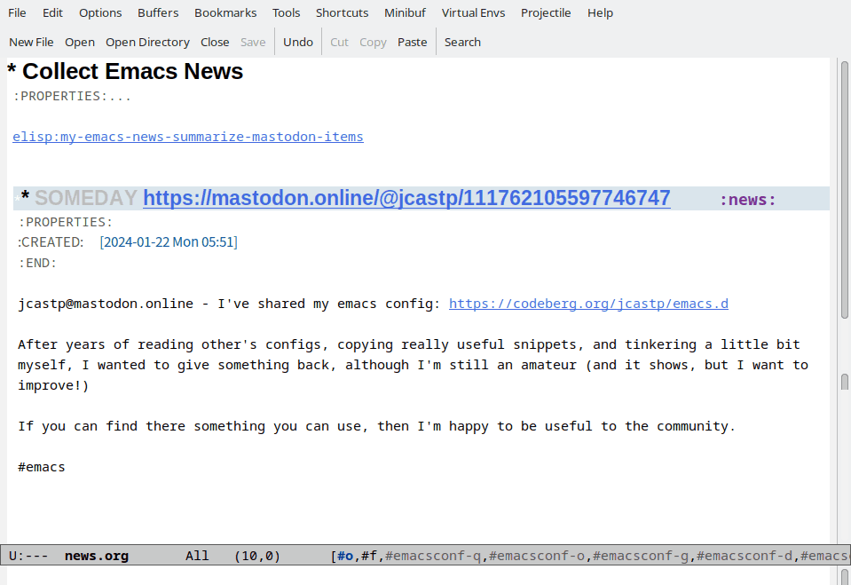


Here's the code that makes that happen:

#+begin_src emacs-lisp :tangle lisp/sacha-elisp.el
;;;###autoload
(defun sacha-match-groups (&optional object)
	"Return the matching groups, good for debugging regexps."
	(seq-map-indexed (lambda (entry i)
										 (list i entry
													 (and (car entry)
																(if object
																		(substring object (car entry) (cadr entry))
																	(buffer-substring (car entry) (cadr entry))))))
									 (seq-partition
										(match-data t)
										2)))
#+end_src

#+begin_src emacs-lisp :tangle lisp/sacha-org.el
;;;###autoload
(defun sacha-org-link-url-from-string (s)
	"Return the link URL from S."
	(if (string-match org-link-any-re s)
			(or
			 (match-string 7 s)
			 (match-string 2 s))))
#+end_src

#+begin_src emacs-lisp :tangle lisp/sacha-mastodon.el
;;;###autoload
(defun sacha-mastodon-get-note-info ()
	"Return (:handle ... :url ... :links ... :text) for the current subtree."
	(let ((url (let ((title (org-entry-get (point) "ITEM")))
							 (if (string-match org-link-any-re title)
									 (or
										(match-string 7 title)
										(match-string 2 title)))))
				beg end
				handle)
		(save-excursion
			(org-back-to-heading)
			(org-end-of-meta-data)
			(setq beg (point))
			(setq end (org-end-of-subtree))
      (unless url
        (goto-char beg)
        (when (re-search-forward org-any-link-re end t)
          (setq url (org-element-property :raw-link (org-element-context)))))
			(cond
       ((string-match "\\[\\[https://bsky\\.app/.+?\\]\\[\\(.+\\)\\]\\]" url)
				(setq handle (match-string 1 url)))
			 ((string-match "https://\\(.+?\\)/\\(@.+?\\)/" url)
				(setq handle (concat
											(match-string 2 url) "@" (match-string 1 url))))
			 ((string-match "https://\\(.+?\\)/\\(.+?\\)/p/[0-9]+\\.[0-9]+" url)
				(setq handle (concat
											"@" (match-string 2 url) "@" (match-string 1 url)))))
			(list
			 :handle handle
			 :url (if (string-match org-link-bracket-re url) (match-string 1 url) url)
			 :links (reverse (mapcar (lambda (o) (org-element-property :raw-link o))
															 (sacha-org-get-links-in-region beg end)))
			 :text (string-trim (buffer-substring-no-properties beg end))))))

(ert-deftest sacha-mastodon-get-note-info ()
 (should
	(equal
	 (with-temp-buffer
		 (insert "** SOMEDAY https://mastodon.online/@jcastp/111762105597746747         :news:
:PROPERTIES:
:CREATED:  [2024-01-22 Mon 05:51]
:END:

jcastp@mastodon.online - I've shared my emacs config: https://codeberg.org/jcastp/emacs.d

After years of reading other's configs, copying really useful snippets, and tinkering a little bit myself, I wanted to give something back, although I'm still an amateur (and it shows, but I want to improve!)

If you can find there something you can use, then I'm happy to be useful to the community.

#emacs
")
		 (org-mode)
		 (sacha-mastodon-get-note-info))
	 '(:handle "@jcastp@mastodon.online"
						 :url
						 "https://mastodon.online/@jcastp/111762105597746747"
						 :links
						 ("https://codeberg.org/jcastp/emacs.d")
						 :text
						 "jcastp@mastodon.online - I've shared my emacs config: https://codeberg.org/jcastp/emacs.d\n\nAfter years of reading other's configs, copying really useful snippets, and tinkering a little bit myself, I wanted to give something back, although I'm still an amateur (and it shows, but I want to improve!)\n\nIf you can find there something you can use, then I'm happy to be useful to the community.\n\n#emacs"))))
#+end_src

It turns headings into something like this:

  - [[https://gitlab.di.unimi.it/-/snippets/4][Insert a screenshot image in latex-mode with the help of org-download]] ([[https://mathstodon.xyz/@mmonga/113118159165252806][@mmonga@mathstodon.xyz]])

which I can then copy into my Emacs News Org Mode file and categorize with some keyboard shortcuts.

This works particularly well with [[dotemacs:mastodon-combined-timeline][my combined Mastodon timelines]], because then I can look through all the #emacs posts from mastodon.social, emacs.ch, and social.sachachua.com in one go.

** Copy Mastodon link for Emacs News
:PROPERTIES:
:CUSTOM_ID: copy-mastodon-link-for-emacs-news
:END:

#+begin_src emacs-lisp :tangle lisp/sacha-mastodon.el
;;;###autoload
(defun sacha-mastodon-copy-link-dwim (prefix)
	(interactive "P")
	(if prefix
			(mastodon-toot--copy-toot-url)
		(sacha-mastodon-copy-toot-as-author-link)))

;;;###autoload
(defun sacha-emacs-news-copy-mastodon-link ()
	(interactive)
	(let ((url (org-entry-get (point) "ITEM")))
		(when (string-match "https://\\(.+?\\)/\\(@.+?\\)/" url)
			(kill-new (org-link-make-string url (concat (match-string 2 url) "@" (match-string 1 url)))))))

;;;###autoload
(defun sacha-emacs-news-copy-mastodon-item (&optional name-only)
	(interactive (list current-prefix-arg))
	(let (s)
		(with-current-buffer
				(if (string-match "emacs-news/index.org" (buffer-file-name))
						(save-window-excursion
							(other-window 1)
							(current-buffer))
					(current-buffer))
			(let ((url (or (thing-at-point 'url)
										 (progn
											 (save-restriction
												 (org-back-to-heading)
												 (org-narrow-to-subtree)
												 (org-end-of-meta-data)
												 (if (re-search-forward org-link-any-re nil t)
														 (thing-at-point 'url)
													 (setq name-only t)
													 (org-entry-get (point) "ITEM")
													 )))))
						(toot (org-entry-get (point) "ITEM"))
						attrib)
				(when (string-match org-link-bracket-re toot)
					(setq toot (match-string 1 toot)))
				(when (string-match "https://\\(.+?\\)/\\(@.+?\\)/" toot)
					(setq attrib (org-link-make-string toot
																						 (concat
																							(match-string 2 toot) "@" (match-string 1 toot)))))
				(setq s
							(if name-only
									(format " (%s)" attrib)
								(format "- %s (%s)\n"
												(org-link-make-string
												 url
												 (sacha-page-title url))
												attrib)))))
		(when (called-interactively-p 'any)
			(if (string-match "emacs-news/index.org" (buffer-file-name))
					(insert s)
				(kill-new s)))
		s))
#+end_src

** Combining Mastodon timelines using mastodon.el                    :emacs:mastodon:
:PROPERTIES:
:EXPORT_DATE: 2024-09-13T12:55:25-0400
:EXPORT_ELEVENTY_PERMALINK: /blog/2024/09/combining-mastodon-timelines-using-mastodon-el/
:EXPORT_ELEVENTY_FILE_NAME: blog/2024/09/combining-mastodon-timelines-using-mastodon-el/
:EXPORT_MODIFIED: 2025-09-15T10:06:53-0400
:header-args:emacs-lisp+: :results silent :exports code :eval never-export
:CUSTOM_ID: mastodon-combined-timeline
:END:
:LOGBOOK:
- State "DONE"       from              [2024-09-13 Fri 14:09]
:END:

#+begin_update
- [2025-09-15]: Removed ~edited_at~ attribute.
- [2025-03-24]: Updated ~sacha-mastodon-follow-user~ to use ~alist-get~.
- [2024-11-04]: Make tag a parameter.
- [2024-10-07]: Added screenshot.
- [2024-09-16]: Read JSON arrays as lists to be compatible with the latest mastodon.el.
#+end_update

#+CAPTION: Screenshot of combined timeline in mastodon.el
#+ATTR_HTML: :data-link t
.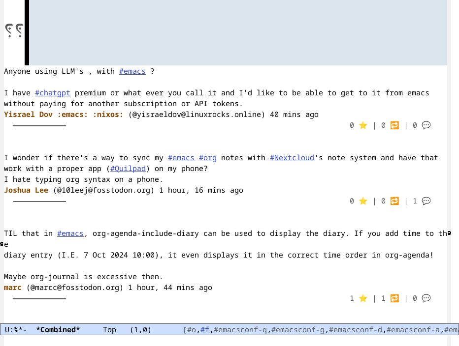

I like checking out the #emacs hashtag when I put together Emacs News. In the past, I usually browsed the hashtag timeline on emacs.ch, which also picked up updates from other people that emacs.ch was following. Now that [[https://sachachua.com/blog/2024/09/moving-from-sachac-emacs-ch-to-sacha-social-sachachua-com/][I've moved to @sacha@social.sachachua.com]] and [[https://emacs.ch/@emacs/113087752901949391][emacs.ch is winding down]], I wanted to see if there was a way for me to see a combined view using [[https://mastodon.social/api/v1/timelines/tag/emacs?count=40][mastodon.social's API feed]] (paging by
=max_id= as needed). I haven't enabled public
timeline feeds on my server, so I also need to reuse the OAuth mechanics from mastodon.el.

First, let's start by making a unified timeline. By digging around in =mastodon-tl.el=, I found that I could easily create a timeline view by passing it a vector of toot JSONs.

#+begin_src emacs-lisp :tangle lisp/sacha-mastodon.el
;;;###autoload
(defun sacha-mastodon-fetch-posts-after (base-url after-date)
	"Page backwards through BASE-URL using max_id for all the posts after AFTER-DATE."
	(require 'plz)
	(require 'mastodon-http)
	(let ((results [])
				(url base-url)
				(use-mastodon-el (not (string-match "^http" base-url)))
				(json-array-type 'list)
				page filtered)
		(while url
			(setq page (if use-mastodon-el
										 (mastodon-http--get-json (mastodon-http--api url) nil :silent)
									 (seq-map (lambda (o)
															(cons (cons 'external t) o))
														(plz 'get url :as #'json-read)))
						filtered (seq-filter (lambda (o) (string< after-date (assoc-default 'created_at o)))
																 page))
			(if filtered
					(progn
						(setq results (seq-concatenate 'vector filtered results)
									url (concat base-url (if (string-match "\\?" base-url) "&" "?")
															"max_id=" (assoc-default 'id (elt (last page) 0))))
						(message "%s %s" (assoc-default 'created_at (elt (last page) 0)) url))
				(setq url nil)))
		results))

;;;###autoload
(defun sacha-mastodon-combined-tag-timeline (later-than tag &optional servers)
	"Display items after LATER-THAN about TAG from SERVERS and the current mastodon.el account."
	(interactive (list
								(org-read-date nil nil nil nil nil "-Mon")
								"#emacs"
								'("mastodon.social" "fosstodon.org")))
	(setq servers (or servers '("mastodon.social" "fosstodon.org")))
	(require 'mastodon)
	(require 'mastodon-tl)
	(require 'mastodon-toot)
	(if (stringp later-than)
			(setq later-than (org-read-date nil nil later-than)))
	(setq tag (replace-regexp-in-string "#" "" tag))
	(let* ((limit 40)
				 (sources (cons (format "timelines/tag/%s?limit=%d" tag limit)
												(mapcar (lambda (s)
																	(format "https://%s/api/v1/timelines/tag/%s?limit=%d" s tag limit))
																servers)))
				 (combined
					(seq-map
					 ;; remove edited_at
					 (lambda (o) (assoc-delete-all 'edited_at o))
					 (sort
						(seq-reduce (lambda (prev val)
													(seq-union prev
																		 (condition-case nil
																				 (sacha-mastodon-fetch-posts-after val later-than)
																			 (error nil))
																		 (lambda (a b) (string= (assoc-default 'uri a)
																														(assoc-default 'uri b)))))
												sources [])
						(lambda (a b)
							(string< (assoc-default 'created_at b)
											 (assoc-default 'created_at a)))))))
		(with-current-buffer (get-buffer-create "*Combined*")
			(let ((inhibit-read-only t))
				(erase-buffer)
				(mastodon-tl--timeline combined)
				(mastodon-mode))
			(setq mastodon-tl--buffer-spec `(account ,(cons mastodon-active-user mastodon-instance-url) buffer-name ,(buffer-name)))
			(display-buffer (current-buffer)))))
#+end_src

#+begin_src emacs-lisp
(when (functionp 'memoize)
	(unless (get #'sacha-mastodon-fetch-posts-after :memoize-original-function)
		(memoize #'sacha-mastodon-fetch-posts-after)))
#+end_src

The tricky thing is that boosting and replying in
mastodon.el both use the toot IDs instead of the
toot URLs, so they only work for toots that came
in via my current mastodon.el account. Toots from
other timelines might not have been fetched by my
server yet. Adding an =external= property lets me
find that in the =item_json= text property in the
timeline buffer. For those toots, I can use
=(mastodon-url-lookup (mastodon-toot--toot-url))=
to open the toot in a new buffer that does allow
boosting or replying, which is probably enough for
my purposes.

#+begin_src emacs-lisp :results silent :exports code :tangle lisp/sacha-mastodon.el
;;;###autoload
(defun sacha-mastodon-lookup-toot ()
  (interactive)
  (mastodon-url-lookup (mastodon-toot--toot-url)))
#+end_src

When I go through Emacs News, I have a shortcut
that boosts a post and saves it to as an Org Mode
capture with a link to the toot. I sometimes want
to reply, too. So I just need to intervene before
boosting and replying. Boosting and favoriting
both use =mastodon-toot--action=, which looks up
the =base-item-id= text property. Replying looks
up the =item-json= property and gets the =id= from
it.

#+begin_src emacs-lisp :results silent :tangle lisp/sacha-elisp.el
;;;###autoload
(defun sacha-text-property-update-at-point (pos prop value)
	(let ((start (previous-single-property-change (or pos (point)) prop))
				(end (next-single-property-change (or pos (point)) prop)))
		(put-text-property (or start (point-min))
											 (or end (point-max))
											 prop value)))
#+end_src

#+begin_src emacs-lisp :results silent :tangle lisp/sacha-mastodon.el
;;;###autoload
(defun sacha-mastodon-update-external-item-id (&rest _)
	(when (mastodon-tl--field 'external (mastodon-tl--property 'item-json))
		;; ask the server to resolve it
		(let* ((response (mastodon-http--get-json (format "%s/api/v2/search" mastodon-instance-url)
																							`(("q" . ,(mastodon-toot--toot-url))
																								("resolve" . "t"))))
					 (id (alist-get 'id (seq-first (assoc-default 'statuses response))))
					 (inhibit-read-only t)
					 (json (get-text-property (point) 'item-json)))
			(when (and id json)
				(sacha-text-property-update-at-point (point) 'base-item-id id)
				(sacha-text-property-update-at-point (point) 'item-json
																					(progn
																						(setf (alist-get 'id json) id)
																						(setf (alist-get 'external json) nil)
																						json))))))
#+end_src

So now all I need to do is make sure that this is called before the relevant mastodon.el functions if I'm looking at an external toot.

#+begin_src emacs-lisp :results silent :eval never-export :exports code
(with-eval-after-load 'mastodon-tl
	(advice-add #'mastodon-toot--action :before #'sacha-mastodon-update-external-item-id)
	(advice-add #'mastodon-toot--reply :before #'sacha-mastodon-update-external-item-id)
	(advice-add #'mastodon-tl--thread :before #'sacha-mastodon-update-external-item-id))
#+end_src

The only thing is that I need to press RET after loading a thread with T (=mastodon-tl--thread=) for some reason, but that's okay. Now I can boost and save posts with my usual Emacs News shortcut, and I can reply easily too.

I'm curious: how many toots would I be missing if I looked at only one instance's hashtag? Let's look at the #emacs hashtag toots on 2024-09-12:

#+NAME: mastodon-comparison
#+begin_src emacs-lisp  :tangle lisp/sacha-elisp.el
;;;###autoload
(defun sacha-three-way-comparison (seq1 seq2 seq3 &optional test-fn)
	`(("1" ,@(seq-difference seq1 (seq-union seq2 seq3 test-fn) test-fn))
		("2" ,@(seq-difference seq2 (seq-union seq1 seq3 test-fn) test-fn))
		("3" ,@(seq-difference seq3 (seq-union seq1 seq2 test-fn) test-fn))
		("1&2" ,@(seq-difference (seq-intersection seq1 seq2 test-fn) seq3 test-fn))
		("1&3" ,@(seq-difference (seq-intersection seq1 seq3 test-fn) seq2 test-fn))
		("2&3" ,@(seq-difference (seq-intersection seq2 seq3 test-fn) seq1 test-fn))
		("1&2&3" ,@(seq-intersection (seq-intersection seq2 seq3 test-fn) seq1 test-fn))))

;;;###autoload
(defun sacha-three-way-comparison-report (label1 seq1 label2 seq2 label3 seq3 &optional test-fn)
	(let ((list (sacha-three-way-comparison seq1 seq2 seq3)))
		`((,(format "%s only" label1) ,@(assoc-default "1" list #'string=))
			(,(format "%s only" label2) ,@(assoc-default "2" list #'string=))
			(,(format "%s only" label3) ,@(assoc-default "3" list #'string=))
			(,(format "%s & %s" label1 label2) ,@(assoc-default "1&2" list #'string=))
			(,(format "%s & %s" label1 label3) ,@(assoc-default "1&3" list #'string=))
			(,(format "%s & %s" label2 label3) ,@(assoc-default "2&3" list #'string=))
			("all" ,@(assoc-default "1&2&3" list #'string=)))))
#+end_src

#+begin_src emacs-lisp :summary Mastodon comparison :eval no :results replace table :exports both :tangle no
(assert (equal (sacha-three-way-comparison '("A" "A&B" "A&C" "A&B&C" "A1")
																				'("B" "A&B" "A&B&C" "B&C")
																				'("C" "A&C" "A&B&C" "B&C"))
							 '(("1" "A" "A1")
								 ("2" "B")
								 ("3" "C")
								 ("1&2" "A&B")
								 ("1&3" "A&C")
								 ("2&3" "B&C")
								 ("1&2&3" "A&B&C"))))

(let* ((later-than "2024-09-12")
			 (earlier-than "2024-09-13")
			 (results
				(mapcar (lambda (o)
									(cons (car o)
												(seq-map (lambda (o) (assoc-default 'uri o))
																 (seq-filter (lambda (toot)
																							 (string< (assoc-default 'created_at toot)
																												earlier-than))
																						 (sacha-mastodon-fetch-posts-after
																							(format "%stimelines/tag/emacs?count=40" (cdr o))
																							later-than)))))
								`((mastodon-social . "https://mastodon.social/api/v1/")
									(emacs-ch . "https://emacs.ch/api/v1/")
									(sacha-instance . ""))))
			 (intersections
				(let-alist results
					(sacha-three-way-comparison-report
					 "mastodon.social"
					 .mastodon-social
					 "emacs.ch"
					 .emacs-ch
					 "my instance"
					 .sacha-instance
					 #'string=))))
	(mapcar
	 (lambda (row)
		 (list (elt row 0) (length (cdr row))
					 (string-join
						(seq-map-indexed (lambda (o i)
															 (org-link-make-string o (number-to-string (1+ i))))
														 (cdr row))
						" ")))
	 intersections))
#+end_src

#+begin_bordered
#+RESULTS: mastodon-comparison
:results:
| mastodon.social only          |  3 | [[https://ubuntu.social/users/askubuntu/statuses/113126414967731060][1]] [[https://fosstodon.org/users/yabozdar/statuses/113124526863236697][2]] [[https://kolektiva.social/users/capita_picat/statuses/113124061187135721][3]]                   |
| emacs.ch only                 |  1 | [[https://emacs.ch/users/pi/statuses/113121971331083227][1]]                       |
| my instance only              |  0 |                         |
| mastodon.social & emacs.ch    |  9 | [[https://mastodon.sdf.org/users/weigand/statuses/113126692283977409][1]] [[https://hostux.social/users/lfa/statuses/113126305338701924][2]] [[https://hostux.social/users/fsf/statuses/113125825197787920][3]] [[https://fosstodon.org/users/dliden/statuses/113125752869246982][4]] [[https://mas.to/users/evgandr/statuses/113125145671040666][5]] [[https://communick.news/post/1596509][6]] [[https://metalhead.club/users/stevoooo/statuses/113123854333728005][7]] [[https://hachyderm.io/users/fastloris/statuses/113127270000776260][8]] [[https://hostux.social/users/fsf/statuses/113126828026063155][9]]       |
| mastodon.social & my instance |  0 |                         |
| emacs.ch & my instance        |  1 | [[https://emacs.ch/users/pi/statuses/113126219575933425][1]]                       |
| all                           | 11 | [[https://social.howellcloud.org/users/james/statuses/113125822427655325][1]] [[https://fosstodon.org/users/robjperez/statuses/113125629561857570][2]] [[https://mastodon.sdf.org/users/bmp/statuses/113125454491301488][3]] [[https://sonomu.club/users/kf/statuses/113125290519531930][4]] [[https://mastodon.social/users/adbenitez/statuses/113125114284046731][5]] [[https://mastodon.social/users/lisp_discussions/statuses/113124797381303645][6]] [[https://mathstodon.xyz/users/lepisma/statuses/113124048647122410][7]] [[https://mastodon.communick.com/users/raphael/statuses/113123503889071870][8]] [[https://emacs.ch/users/ramin_hal9001/statuses/113123160658553524][9]] [[https://fosstodon.org/users/willbush/statuses/113123135443452059][10]] [[https://recurse.social/users/mclare/statuses/113126571790537222][11]] |
:end:
#+end_bordered

Here's an Euler diagram visualizing it.

#+CAPTION: #emacs posts on 2024-09-12 - an Euler diagram showing the table above
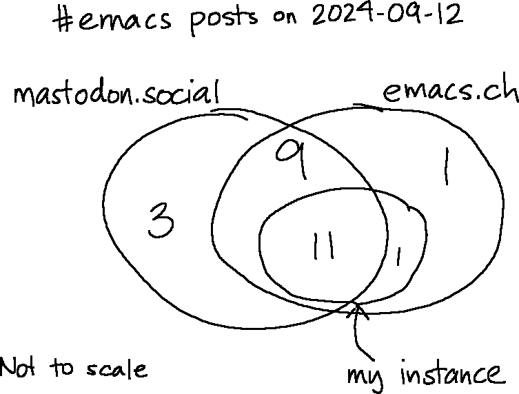

I love that I can tinker with mastodon.el to get
it to combine the timelines. (I'm crossing the
streams!) Yay Emacs!

** Following people
:PROPERTIES:
:CUSTOM_ID: following-people
:END:
I want to be able to follow people if I specify their ID.

#+begin_src emacs-lisp :tangle lisp/sacha-mastodon.el
;;;###autoload
(defun sacha-mastodon-follow-user (user-handle)
	"Follow HANDLE."
	(interactive "MHandle: ")
	(require 'mastodon-profile)
	(when (string-match "https?://\\(.+?\\)/\\(@.+\\)" user-handle)
		(setq user-handle (concat (match-string user-handle) "@" (match-string 1 user-handle))))
	(let* ((account (mastodon-profile--search-account-by-handle
                   user-handle))
				 (user-id (alist-get 'id account))
				 (name (if (not (string-empty-p (alist-get 'display_name account)))
                   (alist-get 'display_name account)
								 (alist-get 'username account)))
				 (url (mastodon-http--api (format "accounts/%s/%s" user-id "follow"))))
		(if account
				(mastodon-tl--do-user-action-function url name user-handle "follow")
			(message "Cannot find a user with handle %S" user-handle))))
#+end_src
** Tooting a link to the current post
:PROPERTIES:
:CUSTOM_ID: mastodon-tooting-a-link-to-the-current-post
:END:

#+begin_src emacs-lisp :tangle lisp/sacha-blog.el
;;;###autoload
(defun sacha-11ty-post-plist ()
	(cond
	 ((derived-mode-p 'org-mode)
		(let* ((subtreep (not (org-before-first-heading-p)))
					 (combined (org-combine-plists
											(org-export--get-export-attributes '11ty subtreep nil)
											(org-export--get-buffer-attributes)
											(org-export-get-environment '11ty subtreep))))
			(when (listp (plist-get combined :title))
				(plist-put combined :title (car (plist-get combined :title))))
			(plist-put combined :tags (org-get-tags))
			combined))
	 ((or (derived-mode-p 'js-mode)
				(derived-mode-p 'jsonian-mode)) ; probably looking at .11tydata.json
		(json-parse-string (buffer-string)
											 :object-type 'plist
											 :array-type 'list))
	 ((and (derived-mode-p 'html-mode)
				 (file-exists-p (concat (file-name-base (buffer-file-name)) ".11tydata.json")))
		(let ((json-object-type 'plist)
					(json-array-type 'list))
			(json-read-file
			 (concat (file-name-base (buffer-file-name)) ".11tydata.json"))))
	 (t (error "Could not find info."))))

;;;###autoload
(defun sacha-11ty-permalink ()
	"Get permalink for current post."
	(plist-get (sacha-11ty-post-plist) :permalink))

;;;###autoload
(defun sacha-11ty-tags ()
	"Get tags for current post."
	(plist-get (sacha-11ty-post-plist) :tags))

;;;###autoload
(defun sacha-11ty-post-url ()
  (when (org-entry-get-with-inheritance "EXPORT_ELEVENTY_PERMALINK")
    (concat (replace-regexp-in-string "/$" "" sacha-blog-base-url)
            (org-entry-get-with-inheritance "EXPORT_ELEVENTY_PERMALINK"))))

;;;###autoload
(defun sacha-11ty-post-text ()
	(save-excursion
		(goto-char
     (cond
      ((org-entry-get-with-inheritance "EXPORT_ELEVENTY_PERMALINK")
       (org-find-property "EXPORT_ELEVENTY_PERMALINK"
												  (org-entry-get-with-inheritance "EXPORT_ELEVENTY_PERMALINK")))
      (t (org-back-to-heading-or-point-min))))
    (if (org-before-first-heading-p)
        (buffer-string)
		  (org-end-of-meta-data)
		  (buffer-substring (point) (org-end-of-subtree)))))
#+end_src

#+begin_src emacs-lisp :tangle lisp/sacha-mastodon.el
;;;###autoload
(defun sacha-mastodon-11ty-toot-post ()
	"Compose a toot sharing this blog post on Mastodon."
	(interactive)
	(require 'mastodon)
	(require 'mastodon-toot)
	(let* ((info (sacha-11ty-post-plist))
				 (url (concat "https://sachachua.com" (plist-get info :permalink)))
				 (blog-text (sacha-11ty-post-text))
				 (title (plist-get info :title)))
		(mastodon-toot--compose-buffer
		 nil nil nil
		 (concat "[" (plist-get info :title) "]"
						 "(" url ") "
						 (mapconcat (lambda (tag) (concat "#" tag))
												(seq-remove (lambda (tag) (string-match "^_" tag))
																		(plist-get info :tags))
												" ")))
		(unless (string-match "^[0-9][0-9][0-9][0-9]-[0-9][0-9]-[0-9][0-9] Emacs News" title)
			(sacha-mastodon-insert-interested-handles (concat title "\n" blog-text)))))
#+end_src
** Compose a Mastodon toot with the current Org subtree
:PROPERTIES:
:CUSTOM_ID: mastodon-toot-subtree
:END:

I want to make it easier to microblog the current Org subtree.

#+begin_src emacs-lisp :tangle lisp/sacha-mastodon.el
;;;###autoload
(defun sacha-mastodon-toot-subtree ()
	(interactive)
	(let ((body (org-export-as 'md t nil t))
				(link (org-entry-get (point) "EXPORT_ELEVENTY_PERMALINK")))
		(mastodon-toot)
		(save-excursion
			(insert body)
			(when link (insert "\n\nBlog post: <" sacha-blog-base-url link ">\n")))))
#+end_src

The automatic link to my configuration is handled by a function that I add to ~org-export-filter-body-functions~:
[[dotemacs:config-footer]]

** Posting the latest screenshot with mastodon.el
:PROPERTIES:
:CUSTOM_ID: posting-the-latest-screenshot-with-mastodon-el
:END:

I want to make it easier to microblog the latest screenshot, or a
recent screenshot if I need to pick a different one. It might also be
a good time to add some text to the filename to make it easier to find
later on. I can use that text as alt-text for the image, too.

#+begin_src emacs-lisp :tangle lisp/sacha-mastodon.el
;;;###autoload
(defun sacha-mastodon-toot-screenshot (&optional filename description)
	"Compose a buffer and attach the latest screenshot.
Prompt for a description and add that to the filename as well.
When called with a prefix argument, prompt for the file.
Use consult to provide a preview."
	(interactive
	 (let ((filename
					(if current-prefix-arg
							(consult--read
							 (sacha-combined-screenshots)
							 :sort nil
							 :require-match t
							 :category 'file
							 :state (lambda (candidate state)
												(when candidate
													(with-current-buffer (find-file-noselect
																								candidate)
														(display-buffer (current-buffer))))))
						(sacha-latest-screenshot))))
		 (list
			filename
			(when (string-match "^[0-9][0-9][0-9][0-9]-[0-9][0-9]-[0-9][0-9]_[0-9][0-9]-[0-9][0-9]-[0-9][0-9]$" (file-name-base filename))
				(display-buffer (find-file-noselect filename))
				(read-string "Description: ")))))
	(let ((new-filename (if (string= (or description "") "")
													nil
												(expand-file-name
												 (concat (file-name-base filename) " " description
																 (file-name-extension filename))
												 (file-name-directory filename)))))
		(if new-filename
				(rename-file filename new-filename))
		(unless (string-match "new toot" (buffer-name)) ; can't match off major mode yet
			(mastodon-toot))
		(mastodon-toot--attach-media
		 (or new-filename filename) "image/png"
		 (or description
				 (when (string-match "^[0-9][0-9][0-9][0-9]-[0-9][0-9]-[0-9][0-9]_[0-9][0-9]-[0-9][0-9]-[0-9][0-9] \\(.+\\)" (save-match-data (file-name-base filename)))
					 (match-string 1 (save-match-data (file-name-base filename))))))))
#+end_src
** Mastodon keyboard shortcuts via Hydra
:PROPERTIES:
:CUSTOM_ID: mastodon-keyboard-shortcuts-via-hydra
:END:

Based on https://github.com/holgerschurig/emacs-doom-config/blob/master/config.el#L2397

#+begin_src emacs-lisp
 ;; Not in the following hydra, but mentioned in "M-x describe-mode". Also, the README.org
  ;; contains several functions that aren't in my hydra.
  ;;
  ;; TAB                     mastodon-tl--next-tab-item
  ;; D                       mastodon-toot--delete-and-redraft-toot
  ;; C-S-b                   mastodon-tl--unblock-user
  ;; S-TAB                   mastodon-tl--previous-tab-item
  ;; S-RET                   mastodon-tl--unmute-user
  ;; C-S-w                   mastodon-tl--unfollow-user
  ;; S-SPC                   scroll-down-command
  ;; <backtab>               mastodon-tl--previous-tab-item
  ;; C-M-i                   mastodon-tl--previous-tab-item
  ;; M-n                     mastodon-tl--next-tab-item
  ;; M-p                     mastodon-tl--previous-tab-item

  (defhydra sacha-mastodon-help (:color blue :hint nil)
    "
Timelines^^   Toots^^^^           Own Toots^^   Profiles^^      Users/Follows^^  Misc^^
^^-----------------^^^^--------------------^^----------^^-------------------^^------^^-----
_h_ome        _n_ext _p_rev       _r_eply       _A_uthors       follo_W_         _X_ lists
_l_ocal       _T_hread of toot^^  wri_t_e       user _P_rofile  _N_otifications  f_I_lter
_F_ederated   (un) _b_oost^^      _e_dit        ^^              _R_equests       _C_opy URL
fa_V_orites   (un) _f_avorite^^   _d_elete      _O_wn           su_G_estions     _S_earch
_#_ tagged    (un) p_i_n^^        ^^            _U_pdate own    _M_ute user      _H_elp
_@_ mentions  (un) boo_k_mark^^   show _E_dits  ^^              _B_lock user
boo_K_marks   _v_ote^^
trendin_g_
_u_pdate      _w_rite Emacs news  _o_rg  _s_creenshot
"
		;; my custom stuff
		("s" sacha-mastodon-toot-screenshot)
		("w" sacha-mastodon-save-toot-for-emacs-news)
		("o" (org-capture nil "m"))
		;; more general things
    ("h" (progn (require 'mastodon) mastodon-tl--get-home-timeline))

    ("l" mastodon-tl--get-local-timeline)
    ("F" mastodon-tl--get-federated-timeline)
    ("V" mastodon-profile--view-favourites)
    ("#" mastodon-tl--get-tag-timeline)
    ("@" (progn (require 'mastodon) (mastodon-notifications-get-mentions)))
    ("K" mastodon-profile--view-bookmarks)
    ("g" mastodon-search--trending-tags)
    ("u" mastodon-tl--update :exit nil)

    ("n" mastodon-tl--goto-next-toot)
    ("p" mastodon-tl--goto-prev-toot)
    ("T" mastodon-tl--thread)
    ("b" mastodon-toot--toggle-boost :exit nil)
    ("f" mastodon-toot--toggle-favourite :exit nil)
    ("i" mastodon-toot--pin-toot-toggle :exit nil)
    ("k" mastodon-toot--bookmark-toot-toggle :exit nil)
    ("c" mastodon-tl--toggle-spoiler-text-in-toot)
    ("v" mastodon-tl--poll-vote)

    ("A" mastodon-profile--get-toot-author)
    ("P" mastodon-profile--show-user)
    ("O" mastodon-profile-sacha-profile)
    ("U" mastodon-profile--update-user-profile-note)

    ("W" mastodon-tl--follow-user)
    ("N" mastodon-notifications-get)
    ("R" mastodon-profile--view-follow-requests)
    ("G" mastodon-tl--get-follow-suggestions)
    ("M" mastodon-tl--mute-user)
    ("B" mastodon-tl--block-user)

    ("r" mastodon-toot--reply)
    ("t" mastodon-toot)
    ("e" mastodon-toot--edit-toot-at-point)
    ("d" mastodon-toot--delete-toot)
    ("E" mastodon-toot--view-toot-edits)

    ("I" mastodon-tl--view-filters)
    ("X" mastodon-tl--view-lists)
    ("C" mastodon-toot--copy-toot-url)
    ("S" mastodon-search--search-query)
    ("H" describe-mode)

    ("q" nil :exit t)
  )
(use-package mastodon
 :bind ("s-m" . sacha-mastodon-help/body))
#+end_src

** Making it easier to toot my config
:PROPERTIES:
:CUSTOM_ID: mastodon-toot-config
:END:

The following snippet composes a toot buffer with a link to the
relevant section of my configuration file, or to the relevant blog
post if specified.

#+begin_src emacs-lisp :tangle lisp/sacha-mastodon.el
;;;###autoload
(defun sacha-mastodon-toot-config (&optional include-screenshot)
	"Toot this part of my config."
	(interactive (list current-prefix-arg))
	(let ((link (if (org-entry-get (point) "EXPORT_ELEVENTY_PERMALINK")
									(concat "https://sachachua.com" (org-entry-get (point) "EXPORT_ELEVENTY_PERMALINK"))
								(concat "https://sachachua.com/dotemacs/#" (org-entry-get (point) "CUSTOM_ID"))))
				text)
		(save-excursion
			(org-back-to-heading)
			(org-end-of-meta-data)
			(setq text (buffer-substring (point) (org-end-of-subtree))))
		(mastodon-toot)
		(insert text "\n\nLink: " link)))
#+end_src
** Org contacts
:PROPERTIES:
:CUSTOM_ID: mastodon-org-contacts
:END:
*** Capture
:PROPERTIES:
:CUSTOM_ID: mastodon-org-contacts-capture
:END:

#+begin_src emacs-lisp :tangle lisp/sacha-mastodon.el
;;;###autoload
(defun sacha-mastodon-org-contact-add ()
	"Add current toot author as a contact."
	(interactive)
	(let-alist (get-text-property (point) 'item-json)
		(with-current-buffer (find-file-noselect (car org-contacts-files))
			(if (org-find-property "MASTODON" .account.acct)
					(message "Already exists.")
				(org-insert-heading)
				(insert (format "%s\n:PROPERTIES:\n:NAME: %s\n:MASTODON: %s\n:ALIAS: %s\n:END:\n"
												.account.display_name
												.account.display_name
												.account.acct
												.account.username))
				(message "Added %s" .account.acct)))))
#+end_src
*** Completion
:PROPERTIES:
:CUSTOM_ID: mastodon-org-contacts-complete
:END:

#+begin_src emacs-lisp :tangle lisp/sacha-mastodon.el
;;;###autoload
(defun sacha-org-contacts-complete-mastodon (string)
	(let* ((completion-ignore-case org-contacts-completion-ignore-case)
				 (completion-list
					(cl-loop for contact in (org-contacts-filter)
									 ;; The contact name is always the car of the assoc-list
									 ;; returned by `org-contacts-filter'.
									 for contact-name = (car contact)
									 ;; Build the list of the Mastodon handles which have expired
									 for ignore-list = (org-contacts-split-property
																			(or (cdr (assoc-string org-contacts-ignore-property
																														 (nth 2 contact))) ""))
									 ;; Build the list of the user Mastodon handles.
									 for handle-list = (org-contacts-remove-ignored-property-values
																			ignore-list
																			(org-contacts-split-property
																			 (or (cdr (assoc-string "MASTODON"
																															(nth 2 contact))) "")))
									 nconc (cl-loop for handle in handle-list
																	collect (format "%s (%s)" contact-name handle))))
				 (completion-list (org-contacts-all-completions-prefix
													 string
													 (org-uniquify completion-list))))
		(when completion-list
			(org-contacts-make-collection-prefix completion-list))))

;;;###autoload
(defun sacha-mastodon-complete-contact ()
	"Suitable for adding to `completion-at-point-functions'."
	(interactive)
	(let ((beg
				 (save-excursion
					 (re-search-backward "\\(\\`\\|[\n:,]\\)[ \t]*")
					 (goto-char (match-end 0))
           (point)))
				(end (point)))
    (list beg
          end
          (completion-table-dynamic
           (lambda (string)
             (sacha-org-contacts-complete-mastodon string))))))
#+end_src

#+begin_src emacs-lisp
(with-eval-after-load 'mastodon-toot
	(with-eval-after-load 'org-contacts
		(add-hook 'mastodon-toot-mode-hook
							(lambda ()
								(add-hook 'completion-at-point-functions
													#'sacha-mastodon-complete-contact nil t)))))
#+end_src
** Copy Mastodon toot URL as author link
:PROPERTIES:
:CUSTOM_ID: mastodon-copy-mastodon-toot-url-as-author-link
:END:

#+begin_src emacs-lisp :tangle lisp/sacha-mastodon.el
;;;###autoload
(defun sacha-mastodon-copy-toot-as-author-link ()
	(interactive)
  (let* ((url (mastodon-toot--toot-url))
				 (handle (concat "@"
												 (let-alist (or (mastodon-tl--property 'base-toot)
																				(mastodon-tl--property 'item-json))
													 .account.acct))))
		;; figure out how to properly add to org-stored-links someday
		(kill-new (org-link-make-string url handle))
		(message "Link stored (%s, %s)." handle url)))
#+end_src

** Collect my recent toots in an Org file so that I can refile them
:PROPERTIES:
:CREATED:  [2022-12-13 Tue 15:55]
:CUSTOM_ID: mastodon-org-feed
:EXPORT_DATE: 2022-12-19T12:53:34-0500
:EXPORT_ELEVENTY_PERMALINK: /blog/2022/12/collect-sacha-recent-toots-in-an-org-file-so-that-i-can-refile-them/
:EXPORT_ELEVENTY_FILE_NAME: blog/2022/12/collect-sacha-recent-toots-in-an-org-file-so-that-i-can-refile-them/
:EXPORT_ELEVENTY_CATEGORIES: emacs mastodon org
:END:

I want to use my microblog posts on Mastodon as building blocks for
longer posts on my blog. Getting them into an Org file makes it easier
to link to them or refile them to other parts of my Org files so that
I can build up my notes.

#+begin_src emacs-lisp
(use-package pandoc :defer t)
(advice-add #'org-feed-add-items :after #'sacha-org-feed-sort)
(setq org-feed-alist '(("Mastodon" "https://emacs.ch/@sachac/with_replies.rss"
												"~/sync/orgzly/toots.org" "Toots"
												:formatter sacha-mastodon-org-feed-formatter)))
#+end_src

#+begin_src emacs-lisp :tangle lisp/sacha-mastodon.el
;;;###autoload
(defun sacha-mastodon-org-feed-formatter (entry)
	(concat "* " (pandoc-convert-stdio
								(dom-text (dom-by-tag
													 (with-temp-buffer
														 (insert "<item>"
																		 (plist-get entry :item-full-text)
																		 "</item>")
														 (xml-parse-region (point-min) (point-max)))
													 'description))
								"html" "org")
					"\n\n[" (format-time-string (cdr org-time-stamp-formats)
																			(date-to-time (plist-get entry :pubDate)))
"]\n" (plist-get entry :link)))

;;;###autoload
(defun sacha-org-feed-sort (pos entries)
	(save-excursion
    (goto-char pos)
    (when (looking-at org-complex-heading-regexp)
			(org-sort-entries nil ?T))))

#+end_src

Now I can use ~org-feed-update-all~ (~C-c C-x g~) to pull things into my toots.org file.

** Archive toots on my blog
:PROPERTIES:
:CUSTOM_ID: mastodon-insert-statuses
:END:

I want to compile my public microblog posts into
weekly posts so that they're archived on my blog.
It might make sense to make them list items or
subtrees so that I can move them around easily.

#+begin_src emacs-lisp :tangle lisp/sacha-mastodon.el
;;;###autoload
(defun sacha-mastodon-format-sacha-toots-since (date)
	(require 'mastodon-auth)
	(format "#+begin_toot_archive\n%s\n#+end_toot_archive\n"
					 (mapconcat
						(lambda (o)
							(format "- %s\n%s\n\n"
											(org-link-make-string (assoc-default 'url o)
																						"(toot)"
																						;(assoc-default 'created_at o)
																						)
											(org-ascii--indent-string
											 (string-trim (pandoc-convert-stdio (assoc-default 'content o) "html" "org"))
											 2))
							;; (format "#+begin_quote\n#+begin_export html\n%s\n#+end_export\n#+end_quote\n\n%s\n\n"
							;; 				(assoc-default 'content o)
							;; 				(org-link-make-string (assoc-default 'url o) (assoc-default 'created_at o)))
							)
						(seq-filter
						 (lambda (o)
							 (string= (assoc-default 'visibility o) "public"))
						 (sacha-mastodon-fetch-posts-after
							(format "accounts/%s/statuses?count=40&exclude_reblogs=t" (mastodon-auth--get-account-id))
							date))
						"")))

;;;###autoload
(defun sacha-mastodon-insert-sacha-toots-since (date)
	(interactive (list (org-read-date nil nil nil "Since date: ")))
	(insert (sacha-mastodon-format-sacha-toots-since date)))

;;;###autoload
(defun sacha-mastodon-roundup (date)
	(interactive (list (org-read-date nil nil nil "Date of post: ")))
	(org-insert-heading)
	(let ((start (org-read-date nil nil "--wed" nil (date-to-time date))))
		(insert "Wednesday weblog: Toots ending " start " :review:weblog:\n\n")
		(sacha-mastodon-insert-sacha-toots-since start)))
#+end_src
* Web
:PROPERTIES:
:CUSTOM_ID: web
:END:

#+begin_src emacs-lisp
(setq browse-url-firefox-program "firefox")
#+end_src

** Emacs: Open URLs or search the web, plus browse-url-handlers  :emacs:org:
:PROPERTIES:
:EXPORT_DATE: 2025-07-11T17:09:24-0400
:EXPORT_ELEVENTY_PERMALINK: /blog/2025/07/emacs-open-urls-or-search-the-web-plus-browse-url-handlers/
:EXPORT_ELEVENTY_FILE_NAME: blog/2025/07/emacs-open-urls-or-search-the-web-plus-browse-url-handlers/
:EXPORT_MODIFIED: 2025-07-14T13:11:07-0400
:CUSTOM_ID: web-emacs-open-urls-or-search-the-web-plus-browse-url-handlers
:END:

#+begin_update
- [2025-07-14]: Naturally, [[https://emacsninja.com/posts/cve-2025-1244-from-emacs-url-handler-to-rce.html][do this only with text you trust]]. =)
- [2025-07-12]: Use cl-pushnew instead of add-to-list, correct ~browse-url-browser-browser-function~ to ~browse-url-browser-function~, and add an example for eww.
#+end_update

On IRC, someone asked for help configuring Emacs
to have a keyboard shortcut that would either open
the URL at point or search the web for the region
or the word at point. I thought this was a great
idea that I would find pretty handy too.

Let's write the interactive function that
I'll call from my keyboard shortcut.

- First, let's check if there's an active region.
  If there isn't, let's assume we're looking at
  the thing at point (could be a URL, an e-mail
  address, a filename, or a word).
- If there are links, open them.
- Otherwise, if there are e-mail addresses,
  compose a message with all those email addresses
  in the "To" header.
- Are we at a filename? Let's open that.
- Otherwise, do a web search. Let's make that
  configurable. Most people will want to use a web
  browser to search their favorite search engine,
  such as DuckDuckGo or Google, so we'll make that
  the default.

#+begin_src emacs-lisp :tangle lisp/sacha-web.el
(defcustom sacha-search-web-handler "https://duckduckgo.com/html/?q="
	"How to search. Could be a string that accepts the search query at the end (URL-encoded)
or a function that accepts the text (unencoded)."
	:type '(choice (string :tag "Prefix URL to search engine.")
								 (function :tag "Handler function.")))

;;;###autoload
(defun sacha-open-url-or-search-web (&optional text-or-url)
	(interactive (list (if (region-active-p)
												 (buffer-substring (region-beginning) (region-end))
											 (or
												(and (derived-mode-p 'org-mode)
														 (let ((elem (org-element-context)))
															 (and (eq (org-element-type elem) 'link)
																		(buffer-substring-no-properties
																		 (org-element-begin elem)
																		 (org-element-end elem)))))
												(thing-at-point 'url)
												(thing-at-point 'email)
												(thing-at-point 'filename)
												(thing-at-point 'word)))))
		(catch 'done
			(let (links)
				(with-temp-buffer
					(insert text-or-url)
					(org-mode)
					(goto-char (point-min))
					;; We add all the links to a list first because following them may change the point
					(while (re-search-forward org-any-link-re nil t)
						(cl-pushnew (match-string-no-properties 0) links))
					(when links
						(dolist (link links)
							(org-link-open-from-string link))
						(throw 'done links))
					;; Try emails
					(while (re-search-forward thing-at-point-email-regexp nil t)
						(cl-pushnew (match-string-no-properties 0) links))
					(when links
						(compose-mail (string-join links ", "))
						(throw 'done links)))
				;; Open filename if specified, or do a web search
				(cond
				 ((ffap-guesser) (find-file-at-point))
				 ((functionp sacha-search-web-handler)
					(funcall sacha-search-web-handler text-or-url))
				 ((stringp sacha-search-web-handler)
					(browse-url (concat sacha-search-web-handler (url-hexify-string text-or-url))))))))
#+end_src

I've been really liking how [[https://sachachua.com/blog/2024/10/yay-emacs-inserting-links-with-consult-omni/][consult-omni lets me do quick searches as I type from within Emacs]],
which is actually really cool. I've even extended
it to search my bookmarks as well, so that I can
find things using my words for them and not trust
the internet's words for them. So if I wanted to
search using consult-omni, this is how I would do
it instead.

#+begin_src emacs-lisp
(setopt sacha-search-web-handler #'consult-omni)
#+end_src

Now I can bind that to ~C-c o~ in my config
with this bit of Emacs Lisp.

#+begin_src emacs-lisp
(keymap-global-set "C-c o" #'sacha-open-url-or-search-web)
#+end_src

Here's a quick demo:

[[video:https://sachachua.com/blog/2025/07/emacs-open-urls-or-search-the-web-plus-browse-url-handlers/2025-07-11_17.07.10.webm?caption=Screencast showing it in use]]

#+begin_my_details Play by play
1. Opening a URL: https://example.com
2. Opening several URLs in a region:
   - https://example.com
   - Other stuff can go here
   - https://emacsconf.org
3. Opening several e-mail addresses:
   - test@example.com
   - another.test@example.com
   - maybe also yet.another.test@example.com
4. A filename
   - ~/.config/emacs/init.el
5. [[elisp:(setopt sacha-search-web-handler "https://duckduckgo.com/html?q=")][With DuckDuckGo handling searches]]: ~(setopt sacha-search-web-handler "https://duckduckgo.com/html?q=")~
   - antidisestablishmentarianism
6. [[elisp:(setopt sacha-search-web-handler #'consult-omni)][With consult-omni handling searches]]: ~(setopt sacha-search-web-handler #'consult-omni)~
   - antidisestablishmentarianism
#+end_my_details

Depending on the kind of URL, I might want to look
at it in different browsers. For example, some
websites like https://emacswiki.org work perfectly
fine without JavaScript, so opening them in [[https://www.gnu.org/software/emacs/manual/html_mono/eww.html][EWW]]
(the Emacs Web Wowser) is great. Then it's right
there within Emacs for easy copying, searching,
etc. Some websites are a little buggy when run in
anything other than Chromium. For example,
[[https://mailchimp.com/][MailChimp]] and [[https://demo.bigbluebutton.org/][BigBlueButton]] (which is the
[[https://bbb.emacsverse.org][webconference server we use for EmacsConf]]) both
behave a bit better under [[https://www.google.com/chrome/][Google Chrome]]. There are
some URLs I want to ignore because they don't work
for me or they tend to be too paywalled, like
permalink.gmane.org and medium.com. I want to open
Mastodon URLs in [[https://codeberg.org/martianh/mastodon.el][mastodon.el]]. I want to open the
rest of the URLs in Firefox, which is my current
default browser.

To change the way Emacs opens URLs, you can
customize ~browse-url-browser-function~ and
~browse-url-handlers~. For example, to set up the
behaviour I described, I can use:

#+begin_src emacs-lisp
(setq browse-url-handlers
      (seq-union
       browse-url-handlers
			 '(("https?://?medium\\.com" . ignore)
				 ("https?://[^/]+/@[^/]+/.*" . mastodon-url-lookup)
				 ("https?://mailchimp\\.com" . browse-url-chrome)
				 ("https?://bbb\\.emacsverse\\.org" . browse-url-chrome)
				 ("https?://emacswiki.org" . eww))))
(setopt browse-url-browser-function 'browse-url-firefox)
#+end_src

If you wanted to use EWW as your default web
browser, you could use ~(setopt browse-url-browser-function 'eww)~ instead.

Could be a fun tweak. I wonder if something like
this might be handy for other people too!

** Checking URLs
:PROPERTIES:
:CUSTOM_ID: checking-urls
:END:

Out of this discussion: https://fosstodon.org/@fullyabstract/116092736652067422

#+begin_src emacs-lisp  :tangle lisp/sacha-web.el
(defvar sacha-check-dead-links-skip
  (regexp-opt
   '("news.ycombinator"
     "meejah.ca"
     "reddit"))
  "Some sites block automated link checking.")
(defvar sacha-check-dead-links-user-agent "Emacs link checker"
  "Some sites may let certain user agents through. Change this as desired.")

;;;###autoload
(defun sacha-check-dead-links ()
  "Look for dead links."
  (interactive)
  (let (pos)
    (setq pos
          (catch 'done
            (while (re-search-forward ffap-url-regexp nil t)
              (let* ((start (match-beginning 0))
                     (end (match-end 0))
                     (url (or (and (derived-mode-p 'org-mode)
                                   (org-element-property :raw-link (org-element-context)))
                              (ffap-url-at-point)))
                     (browse-url-handlers nil)
                     (url-user-agent sacha-check-dead-links-user-agent))
                (message "Checking %s" url)
                (unless (or (string-match sacha-check-dead-links-skip url)
                            (save-match-data
                              (condition-case nil
                                  (url-file-exists-p url)
                                (error nil))))
                  (goto-char start)
                  (browse-url url)
                  (if (y-or-n-p "Continue?")
                      (goto-char end)
                    (throw 'done (cons url (point)))))))))
    (goto-char (cdr pos))))
#+end_src

** Search
:PROPERTIES:
:CUSTOM_ID: search
:END:

#+begin_src emacs-lisp
(use-package engine-mode
	:defer t
  :config
  (defengine sacha-blog "https://www.google.ca/search?q=site:sachachua.com+%s" :keybinding "b")
  (defengine mail "https://mail.google.com/mail/u/0/#search/%s" :keybinding "m")
  (defengine google "https://google.com/search?q=%s" :keybinding "g")
  (defengine emacswiki "https://google.com/search?q=site:emacswiki.org+%s" :keybinding "e")
  (engine-mode)
  :hydra
  (sacha-engine-mode-hydra
   (:color blue)
   "Engine mode"
   ("b" engine/search-sacha-blog "blog")
   ("m" engine/search-mail "mail")
   ("g" engine/search-google "google")
   ("e" engine/search-emacswiki "emacswiki")))
#+end_src
** Parsing RSS and Atom feeds
:PROPERTIES:
:CUSTOM_ID: web-parsing-rss-and-atom-feeds
:END:

Related: [[https://sachachua.com/blog/2025/03/reading-more-blogs-emacs-lisp-listing-blogs-based-on-an-opml-file/][Reading more blogs; Emacs Lisp: Listing blogs based on an OPML file]]

#+begin_src emacs-lisp :tangle lisp/sacha-web.el
;;;###autoload
(defun sacha-rss-get-entries (url)
	"Return a list of the form ((:title ... :url ... :date ...) ...)."
	(with-current-buffer (url-retrieve-synchronously url)
		(set-buffer-multibyte t)
    (goto-char (point-min))
		(when (re-search-forward "<\\?xml\\|<rss" nil t)
			(goto-char (match-beginning 0))
			(sort
			 (let* ((feed (xml-parse-region (point) (point-max)))
							(is-rss (> (length (xml-get-children (car feed) 'entry)) 0)))
				 (if is-rss
						 (mapcar
							(lambda (entry)
								(list
								 :url
								 (or
									(xml-get-attribute
									 (car
										(or
										 (seq-filter (lambda (x) (string= (xml-get-attribute x 'rel) "alternate"))
																 (xml-get-children entry 'link))
										 (xml-get-children entry 'link)))
									 'href)
									(dom-text (dom-by-tag entry 'guid)))
								 :title
								 (elt (car (xml-get-children entry 'title)) 2)
								 :date
								 (date-to-time (elt (car (xml-get-children entry 'updated)) 2))))
							(xml-get-children (car feed) 'entry))
					 (mapcar (lambda (entry)
										 (list
											:url
											(or (caddr (car (xml-get-children entry 'link)))
													(dom-text (dom-by-tag entry 'guid)))
											:title
											(caddr (car (xml-get-children entry 'title)))
											:date
											(date-to-time (elt (car (xml-get-children entry 'pubDate)) 2))))
									 (xml-get-children (car (xml-get-children (car feed) 'channel)) 'item))))
			 :key (lambda (o) (plist-get o :date))
			 :lessp #'time-less-p
			 :reverse t))))
#+end_src

Making an OPML table:

#+begin_src emacs-lisp :tangle lisp/sacha-web.el
;;;###autoload
(defun sacha-opml-table (xml)
	(sort
	 (mapcar
		(lambda (o)
			(let ((latest (car (condition-case nil (sacha-rss-get-entries (dom-attr o 'xmlUrl))
													 (error nil)))))
				(list
				 (if latest
						 (format-time-string "%Y-%m-%d" (plist-get latest :date))
					 "")
				 (org-link-make-string
					(or (dom-attr o 'htmlUrl)
							(dom-attr o 'xmlUrl))
					(replace-regexp-in-string " *|" "" (dom-attr o 'text)))
				 (if latest
						 (org-link-make-string
							(plist-get latest :url)
							(or (plist-get latest :title) "(untitled)"))
					 ""))))
		(dom-search
		 xml
		 (lambda (o)
			 (and
				(eq (dom-tag o) 'outline)
				(dom-attr o 'xmlUrl)
				(dom-attr o 'text)))))
	 :key #'car
	 :reverse t))
#+end_src
** Spookfox
:PROPERTIES:
:CUSTOM_ID: spookfox
:END:
*** Link to current webpage from Spookfox  :toblog:
:PROPERTIES:
:CUSTOM_ID: web-spookfox-link-to-current-webpage-from-spookfox
:END:

#+begin_src emacs-lisp :tangle lisp/sacha-spookfox.el
;;;###autoload
(defun sacha-org-spookfox-complete ()
	(spookfox-js-injection-eval-in-active-tab "window.location.href" t))
#+end_src

#+begin_src emacs-lisp
(with-eval-after-load 'org
	(org-link-set-parameters
	 "spookfox"
	 :complete #'sacha-org-spookfox-complete
	 :insert-description #'sacha-org-link-insert-description))

#+end_src
*** STARTED Link to currently-selected text using Spookfox
:PROPERTIES:
:CREATED:  [2024-10-28 Mon 14:02]
:Effort:   0:15
:CUSTOM_ID: spookfox-fragment
:END:
:LOGBOOK:
CLOCK: [2024-10-28 Mon 14:02]--[2024-10-28 Mon 14:48] =>  0:46
:END:

#+begin_src emacs-lisp :tangle lisp/sacha-spookfox.el
;;;###autoload
(defun sacha-spookfox-link-to-fragment ()
	(interactive)
	(let ((url
				 (spookfox-js-injection-eval-in-active-tab "window.location.href + '#:~:text=' + encodeURIComponent(window.getSelection().toString())" t)))
		(when (called-interactively-p 'any)
			(insert url))
		url))
#+end_src

*** Running the current Org Mode Babel Javascript block from Emacs using Spookfox  :embark:emacs:org:spookfox:
:PROPERTIES:
:CUSTOM_ID: spookfox-babel
:EXPORT_DATE: 2024-01-19T08:12:17-0500
:EXPORT_ELEVENTY_PERMALINK: /blog/2024/01/running-the-current-org-mode-babel-javascript-block-in-spookfox/
:EXPORT_ELEVENTY_FILE_NAME: blog/2024/01/running-the-current-org-mode-babel-javascript-block-in-spookfox/
:END:

I often want to send Javascript from Emacs to the web browser. It's handy for testing code snippets or working with data on pages that require Javascript or authentication. I could start Google Chrome or Mozilla Firefox with their remote debugging protocols, copy the websocket URLs, and talk to the browser through  something like Puppeteer, but it's so much easier to use the [[https://github.com/bitspook/spookfox][Spookfox]] extension for Mozilla to execute code in the active tab.
~spookfox-js-injection-eval-in-active-tab~ lets you evaluate Javascript and get the results back in Emacs Lisp.

I wanted to be able to execute code even more
easily. This code lets me add a ~:spookfox t~
parameter to Org Babel Javascript blocks so that I
can run the block in my Firefox active tab.
For example, if I have ~(spookfox-init)~ set up, Spookfox connected, and https://planet.emacslife.com in my active tab, I can use it with the following code:

#+begin_src org
,#+begin_src js :eval never-export :spookfox t :exports results
[...document.querySelectorAll('.post > h2')].slice(0,5).map((o) => '- ' + o.textContent.trim().replace(/[ \n]+/g, ' ') + '\n').join('')
,#+end_src
#+end_src

#+begin_src js :eval never-export :spookfox t :exports results
window.location.href
#+end_src

#+RESULTS:
:results:
:end:

#+begin_src js :eval never-export :spookfox t :exports results
[...document.querySelectorAll('.post > h2')].slice(0,5).map((o) => '- ' + o.textContent.trim().replace(/[ \n]+/g, ' ') + '\n').join('')
#+end_src

#+RESULTS:
:results:
:end:

[[video:https://sachachua.com/blog/2024/01/running-the-current-org-mode-babel-javascript-block-in-spookfox/2024-01-19_08.16.31.webm?caption=Evaluating a Javascript block with :spookfox t]]

To do this, we wrap some advice around the ~org-babel-execute:js~ function that's called by ~org-babel-execute-src-block~.

#+begin_src emacs-lisp :tangle lisp/sacha-spookfox.el
;;;###autoload
(defun sacha-org-babel-execute:js-spookfox (old-fn body params)
	"Maybe execute Spookfox."
	(if (assq :spookfox params)
			(spookfox-js-injection-eval-in-active-tab
			 body t)
		(funcall old-fn body params)))
#+end_src

#+begin_src emacs-lisp
(with-eval-after-load 'ob-js
	(advice-add 'org-babel-execute:js :around #'sacha-org-babel-execute:js-spookfox))
#+end_src

I can also run the block in Spookfox without adding the parameter if I make an interactive function:

#+begin_src emacs-lisp :tangle lisp/sacha-spookfox.el
;;;###autoload
(defun sacha-spookfox-eval-org-block ()
	(interactive)
	(let ((block (org-element-context)))
		(when (and (eq (org-element-type block) 'src-block)
							 (string= (org-element-property :language block) "js"))
			(spookfox-js-injection-eval-in-active-tab
			 (nth 2 (org-src--contents-area block))
			 t))))
#+end_src

I can add that as an Embark context action:

#+begin_src emacs-lisp
(with-eval-after-load 'embark-org
	(define-key embark-org-src-block-map "f" #'sacha-spookfox-eval-org-block))
#+end_src

In Javascript buffers, I want the ability to send the current line, region, or buffer too, just like package:nodejs-repl does.

#+begin_src emacs-lisp :tangle lisp/sacha-spookfox.el
;;;###autoload
(defun sacha-spookfox-send-region (start end)
	(interactive "r")
	(spookfox-js-injection-eval-in-active-tab (buffer-substring start end) t))

;;;###autoload
(defun sacha-spookfox-send-buffer ()
	(interactive)
	(sacha-spookfox-send-region (point-min) (point-max)))

;;;###autoload
(defun sacha-spookfox-send-line ()
	(interactive)
	(sacha-spookfox-send-region (line-beginning-position) (line-end-position)))

;;;###autoload
(defun sacha-spookfox-send-last-expression ()
	(interactive)
	(sacha-spookfox-send-region (save-excursion (nodejs-repl--beginning-of-expression)) (point)))

(defvar-keymap sacha-js-spookfox-minor-mode-map
	:doc "Send parts of the buffer to Spookfox."
	"C-x C-e" 'sacha-spookfox-send-last-expression
	"C-c C-j" 'sacha-spookfox-send-line
	"C-c C-r" 'sacha-spookfox-send-region
	"C-c C-c" 'sacha-spookfox-send-buffer)

(define-minor-mode sacha-js-spookfox-minor-mode "Send code to Spookfox.")
#+end_src

I usually edit Javascript files with package:js2-mode, so I can use ~sacha-js-spookfox-minor-mode~ in addition to that.

I can turn the minor mode on automatically for ~:spookfox t~ source blocks. There's no ~org-babel-edit-prep:js~ yet, I think, so we need to define it instead of advising it.

#+begin_src emacs-lisp :tangle lisp/sacha-spookfox.el
;;;###autoload
(defun org-babel-edit-prep:js (info)
	(when (assq :spookfox (nth 2 info))
		(sacha-js-spookfox-minor-mode 1)))
#+end_src

Let's try it out by sending the last line repeatedly:

#+begin_src js :eval never-export :spookfox t :exports results
window.location = 'https://example.com';
document.querySelector('h1').style.fontSize = Math.floor(Math.random() * 10 + 10) + 'px';
#+end_src

#+RESULTS:
:results:
:end:

[[video:https://sachachua.com/blog/2024/01/running-the-current-org-mode-babel-javascript-block-in-spookfox/2024-01-19_08.26.35.webm?caption=Sending the current line]]

I used to do this kind of interaction with [[https://github.com/skeeto/skewer-mode][Skewer]], which also has some extra stuff for evaluating CSS and HTML. Skewer hasn't been updated in a while, but maybe I should also check that out again to see if I can get it working.

Anyway, now it's just a little bit easier to tinker with Javascript!

*** Using Spookfox to scroll Firefox up and down from Emacs      :web:emacs:
:PROPERTIES:
:EXPORT_DATE: 2023-01-30T11:02:57-0500
:EXPORT_ELEVENTY_PERMALINK: /blog/2023/01/using-spookfox-to-scroll-firefox-up-and-down-from-emacs/
:EXPORT_ELEVENTY_FILE_NAME: blog/2023/01/using-spookfox-to-scroll-firefox-up-and-down-from-emacs/
:CUSTOM_ID: spookfox-scroll
:END:

I open lots of pages in the process of making Emacs News. I like to
open the pages in Mozilla Firefox, but I want the keyboard focus to
stay with Emacs so that I can quickly categorize the links. I also
sometimes want to scroll the page up or down. While reading the
[[https://bitspook.in/blog/reading-and-not-forgetting/][Reading, and not forgetting]] post, I came across [[https://github.com/bitspook/spookfox][Spookfox]], which
bridges Emacs and Firefox using an Firefox add-on and websockets.
After I started spookfox and connected to it by clicking on the
extension in Firefox, I was able to interact with it from Emacs Lisp.
I feel a little nervous about it security-wise, but at least it's only
listening on the local port. There might be another way to do it with
the Marionette support in Firefox, but I haven't looked into it yet.

#+begin_src emacs-lisp
(use-package spookfox
  ; :files ("lisp/*.el" "lisp/apps/*.el"))
	:load-path ("~/vendor/spookfox/lisp" "~/vendor/spookfox/lisp/apps")
	:when sacha-laptop-p
	:config
	(require 'spookfox-tabs)
	;(require 'spookfox-org-tabs)
	(require 'spookfox-js-injection)
	(add-to-list 'spookfox-enabled-apps 'spookfox-tabs)
	(with-eval-after-load 'spookfox-org-tabs (add-to-list 'spookfox-enabled-apps 'spookfox-org-tabs))
	(add-to-list 'spookfox-enabled-apps 'spookfox-js-injection)
	;; (spookfox-init) ; don't automatically enable it; run (spookfox-init) to manually enable
	)
#+end_src

Anyway, this code seems to do the job of scrolling my Firefox window:

#+NAME: sacha-spookfox-scroll
#+begin_src emacs-lisp :tangle lisp/sacha-spookfox.el
;;;###autoload
(defun sacha-spookfox-scroll-down ()
	(interactive)
 	(spookfox-js-injection-eval-in-active-tab "window.scrollBy(0, document.documentElement.clientHeight);" t))

;;;###autoload
(defun sacha-spookfox-scroll-up ()
	(interactive)
 	(spookfox-js-injection-eval-in-active-tab "window.scrollBy(0, -document.documentElement.clientHeight);"))
#+end_src

#+begin_src emacs-lisp
(keymap-global-set "C-s-v" 'sacha-spookfox-scroll-down)
(keymap-global-set "S-s-v" 'sacha-spookfox-scroll-up)
#+end_src

This code opens a tab without switching keyboard focus away from Emacs:

#+NAME: sacha-spookfox-background-tab
#+begin_src emacs-lisp :tangle lisp/sacha-spookfox.el
;;;###autoload
(defun sacha-spookfox-background-tab (url &rest args)
	"Open URL as a background tab."
	(if spookfox--connected-clients
			(spookfox-tabs--request (cl-first spookfox--connected-clients) "OPEN_TAB" `(:url ,url))
		(browse-url url)))
#+end_src

My Emacs News code for processing my upvoted Reddit posts can
automatically grab the links from Reddit link posts, but sometimes
people post Reddit text or image posts and then include the link to
the actual project in the post body or a comment instead.

#+begin_src emacs-lisp :tangle lisp/sacha-elisp.el
;;https://emacs.stackexchange.com/questions/41801/how-to-stop-completing-read-ivy-completing-read-from-sorting
;;;###autoload
(defun sacha-presorted-completion-table (completions)
  (lambda (string pred action)
    (if (eq action 'metadata)
        '(metadata
					(cycle-sort-function . identity)
					(display-sort-function . identity))
      (complete-with-action action completions string pred))))
#+end_src

#+begin_src emacs-lisp :lexical t :tangle lisp/sacha-spookfox.el
;;;###autoload
(defun sacha-spookfox-get-links ()
	(seq-uniq
 	 (spookfox-eval-js-in-active-tab "[...(document.querySelector('[data-testid=post-container]')?.parentElement || document).querySelectorAll('a')].map(a => a.href).filter(a => a && (!window.location.host.match(/reddit/) || !a.match(/redd\.?it/)) && !a.match(window.location.host))" t)))

;;;###autoload
(defun sacha-spookfox-complete-link (&optional prompt)
	(completing-read
	 (or prompt "Link: ")
	 (sacha-presorted-completion-table
		(sacha-spookfox-get-links))))

;;;###autoload
(defun sacha-spookfox-insert-link-from-page (link)
	(interactive (list (sacha-spookfox-complete-link)))
	(insert (org-link-make-string link (sacha-page-title link))))

;;;###autoload
(defun sacha-spookfox-open-link-from-page (link)
	(interactive (list (sacha-spookfox-complete-link)))
	(sacha-spookfox-background-tab link))

;;;###autoload
(defun sacha-spookfox-insert-link-to-tab ()
	(interactive)
	(let ((tab (spookfox-request-active-tab)))
		(insert (org-link-make-string
						 (plist-get tab :url)
						 (plist-get tab :title)))))
#+end_src
*** Emacs and Spookfox: org-capture the current tab from Firefox or a link from the page
:PROPERTIES:
:CUSTOM_ID: spookfox-insert-url
:END:

I want to quickly capture notes based on the current tab in Firefox or
a link from the page's main body. I have the [[https://addons.mozilla.org/en-CA/firefox/addon/org-capture/][Org Capture Firefox
extension]] and ~Ctrl-Shift-L~ seems to be the keyboard shortcut for
capturing with it, so I probably just have to get the hang of using
it.

I also want to make it easier to add notes even when I've already
switched back to Emacs. I could use ~s-2~ to shift to Firefox (I have
some Autokey shortcuts for focusing specific applications; ~s-1~ is
Emacs), but sometimes I just want to add a link at point.

#+begin_src emacs-lisp :tangle lisp/sacha-spookfox.el
;;;###autoload
(defun sacha-spookfox-insert-url ()
	(interactive)
	(insert (spookfox-js-injection-eval-in-active-tab "window.location.href" t)))
;;;###autoload
(defun sacha-spookfox-insert-org-link ()
	(interactive)
	(insert (apply #'org-link-make-string
								 (append (spookfox-js-injection-eval-in-active-tab "[window.location.href, document.title]" t) nil))))
#+end_src

#+begin_src emacs-lisp
(with-eval-after-load 'org
	(cl-pushnew
	 `("f" "Firefox" entry
			(file ,sacha-org-inbox-file)
			"* %^{Note}\n:PROPERTIES:\n:CREATED: %U\n:END:\n\n%(apply #'org-link-make-string
								 (append (spookfox-js-injection-eval-in-active-tab \"[window.location.href, document.title]\" t) nil))")
	 org-capture-templates)
	(cl-pushnew
	 `("F" "Firefox link" entry
			(file ,sacha-org-inbox-file)
			"* %^{Note}\n:PROPERTIES:\n:CREATED: %U\n:END:\n\n%(org-link-make-string
(sacha-spookfox-complete-link))")
	 org-capture-templates))
#+end_src

This uses ~sacha-spookfox-complete-link~ from [[dotemacs:spookfox]].

* Self-tracking, statistics, and other data transformations
:PROPERTIES:
:CUSTOM_ID: self-tracking-statistics-and-other-data-transformations
:END:
** Quantified Awesome
:PROPERTIES:
:CUSTOM_ID: clock-in
:END:
<<clock-in>>

#+begin_src emacs-lisp :tangle lisp/sacha-org.el
(require 'quantified nil t)

(defmacro sacha-org-with-current-task (&rest body)
  "Execute BODY with the point at the subtree of the current task."
  (declare (debug t))
  `(if (derived-mode-p 'org-agenda-mode)
       (save-window-excursion
         (org-agenda-switch-to)
         ,@body)
     ,@body))

;;;###autoload
(defun sacha-org-clock-in-and-track ()
  "Start the clock running. Clock into Quantified Awesome."
  (interactive)
  (sacha-org-with-current-task
   (org-clock-in)
   (call-interactively 'sacha-org-quantified-track)
   ;(when (websocket-openp obs-websocket)  (sacha-stream-message (org-get-heading t t t t)))
   (cond
    ((org-entry-get (point) "AUTO")
     (org-link-open-from-string (org-entry-get (point) "AUTO")))
    (t
     (save-restriction
       (org-narrow-to-subtree)
       (org-next-link)
       (when (looking-at org-link-any-re)
         (org-open-at-point)))))))

(defmacro sacha-with-org-task (&rest body)
  "Run BODY within the current agenda task, clocked task, or cursor task."
  `(cond
    ((derived-mode-p 'org-agenda-mode)
     (let* ((marker (org-get-at-bol 'org-marker))
            (buffer (marker-buffer marker))
            (pos (marker-position marker)))
       (with-current-buffer buffer
         (save-excursion
           (save-restriction
             (widen)
             (goto-char pos)
             ,@body)))))
    ((and (derived-mode-p 'org-mode) (org-at-heading-p)) (save-excursion ,@body))
    ((org-clocking-p) (save-excursion (org-clock-goto) ,@body))
    ((derived-mode-p 'org-mode) ,@body)))

(defvar sacha-org-quantified-regexps
	'(("emacsconf" . "Emacs | Emacsconf")
		("emacs" . "Emacs")
		("consulting" . "E1 Gen"))
	"Alist of regexp . category.")

;;;###autoload
(defun sacha-org-quantified-track (&optional category note)
  "Create a tracking record using CATEGORY and NOTE.
      Default to the current task in the agenda, the currently-clocked
      entry, or the current subtree in Org."
  (interactive (list nil nil))
  (unless (and category note)
    (sacha-with-org-task
     (setq category (or category
                        (org-entry-get-with-inheritance "QUANTIFIED")))
     (cond
      ((null category)
			 (let* ((heading (org-get-heading))
							(guess (seq-find (lambda (entry)
																 (string-match (car entry)
																							 heading))
															 sacha-org-quantified-regexps)))
				 (setq category (or (cdr guess) (read-string "Category: "))))
       (org-set-property "QUANTIFIED" category))
      ((string= category ' "ask")
       (setq category (read-string "Category: "))))
     (setq note
           (concat
            (if (string= (or (org-entry-get-with-inheritance "QUANTIFIEDQUIET") "") "t")
                "!private "
              "")
            (or note (elt (org-heading-components) 4) (read-string "Note: "))))))
  (quantified-track (concat category " | " note)))

;;;###autoload
(defun sacha-org-quick-clock-in-task (location jump)
  "Track and clock in on the specified task.
      If JUMP is non-nil or the function is called with the prefix argument, jump to that location afterwards."
  (interactive (list (save-excursion (sacha-org-refile-get-location "Location")) current-prefix-arg))
  (when location
    (if jump
        (progn (org-refile 4 nil location) (sacha-org-clock-in-and-track))
      (save-window-excursion
        (org-refile 4 nil location)
        (sacha-org-clock-in-and-track)))))

#+end_src

#+begin_src emacs-lisp
(keymap-global-set "C-c q" 'sacha-org-quick-clock-in-task)
(with-eval-after-load 'org
	(keymap-set org-agenda-mode-map "!" 'sacha-org-clock-in-and-track))
#+end_src
*** Child time!
:PROPERTIES:
:CUSTOM_ID: self-tracking-statistics-and-other-data-transformations-quantified-awesome-child-time
:END:

#+begin_src emacs-lisp :tangle lisp/sacha-quantified.el
;;;###autoload
(defun sacha-childcare ()
	(interactive)
	(unwind-protect
			(when (org-clocking-p)
				(org-clock-out)))
	(quantified-track "Childcare"))
#+end_src

*** Make a tablist of my time entries
:PROPERTIES:
:CUSTOM_ID: quantified-tablist
:END:

#+begin_src emacs-lisp :tangle lisp/sacha-quantified.el
(define-derived-mode sacha-quantified-list-mode tablist-mode "Time"
	"Major mode for time entries"
	(setq tabulated-list-format [("id" 5)
															 ("timestamp" 25)
															 ("duration" 5)
															 ("full_name" 60)
															 ("note" 20)])
	(tabulated-list-init-header)
	(tabulated-list-print t))

;;;###autoload
(defun sacha-quantified-list (start end filter)
	(interactive (list (org-read-date nil nil nil "Start: ") (org-read-date nil nil nil "End: ")
										 (read-string "Filter: ")))
	(switch-to-buffer (get-buffer-create "*quantified*"))
	(setq filter (and filter
										(not (string= filter ""))
										(split-string filter " ")))
	(let ((json-array-type 'list)
				(json-object-type 'alist))
		(setq tabulated-list-entries
					(seq-keep
					 (lambda (o)
						 (let-alist o
							 (when (or (not filter)
												 (not (seq-find
															 (lambda (term)
																 (not
																	(or
																	 (string-match term .full_name)
																	 (string-match term (or .data.note "")))))
															 filter)))
								 (list
									.id
									(vector
									 (number-to-string .id)
									 (format-time-string "%a %b %d %l:%M%p" (parse-iso8601-time-string .timestamp))
									 (propertize (if .duration (format-seconds "%h:%.2m" .duration) "")
															 'duration .duration)
									 .full_name
									 (or .data.note ""))))))
					 (quantified-parse-json
						(quantified-request
						 (format
							"/records.json?start=%s&end=%s&auth_token=%s"
							(or start "")
							(or end "")
							(quantified-token))
						 nil "GET")))))
	(sacha-quantified-list-mode))
;;;###autoload
(defun sacha-quantified-list-sum-marked-duration ()
	(interactive)
	(let ((seconds (apply '+
																	(mapcar
																	 (lambda (o)
																		 (get-text-property 0 'duration
																												(aref (cdr o) 2)))
																	 (tablist-get-marked-items)))))
		(message "%s (%.1f)"
						 (format-seconds "%d:%z%.2h:%.2m" seconds)
						 (/ seconds 3600.0))))
;; (sacha-quantified-list "2024-09-30" nil "E1")
#+end_src

#+RESULTS:
:results:
sacha-quantified-list-sum-marked-duration
:end:

** Compare times and effort estimates
:PROPERTIES:
:CUSTOM_ID: compare-time
:END:
<<compare-time>>

This is for comparing times in column view and in tables.

#+begin_src emacs-lisp :tangle lisp/sacha-org.el
;;;###autoload
(defun sacha-compare-times (clocked estimated)
  (if (and (> (length clocked) 0) estimated)
      (format "%.2f"
              (/ (* 1.0 (org-hh:mm-string-to-minutes clocked))
                 (org-hh:mm-string-to-minutes estimated)))
    ""))
#+end_src

Use with =#+COLUMNS: %40ITEM %17Effort(Estimated){:} %CLOCKSUM=, =#+BEGIN: columnview :hlines 1= ... =#+END:=, and

#+begin_example
    #+TBLFM: $4='(sacha-compare-times $3 $2)
#+end_example

*** Using the calendar-date-echo-text variable to help plot a heatmap on a year-long calendar in Emacs :emacs:
:PROPERTIES:
:EXPORT_DATE: 2023-01-06T10:37:58-0500
:EXPORT_ELEVENTY_PERMALINK: /blog/2023/01/using-the-calendar-date-echo-text-variable-to-help-plot-a-heatmap-on-a-year-long-calendar-in-emacs/
:EXPORT_ELEVENTY_FILE_NAME: blog/2023/01/using-the-calendar-date-echo-text-variable-to-help-plot-a-heatmap-on-a-year-long-calendar-in-emacs/
:CUSTOM_ID: using-the-calendar-date-echo-text-variable-to-help-plot-a-heatmap-on-a-year-long-calendar-in-emacs
:END:

#+CAPTION: Sketch heatmap from 2008-2023
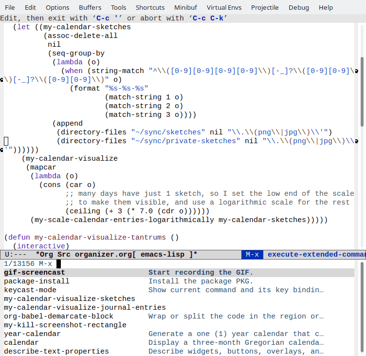

Building on [[https://sachachua.com/blog/2023/01/display-a-calendar-heat-map-using-emacs-lisp/][Display a calendar heat map using Emacs Lisp]],
I figured out how to use ~calendar-date-echo-text~ to store
the date so that I can pick it up when plotting the heatmap:

#+begin_src emacs-lisp
;; This seems to be the only way we can hack the date in for now
(setq calendar-date-echo-text '(apply #'format (list "%04d-%02d-%02d" year month day)))
#+end_src

#+begin_src emacs-lisp :tangle lisp/sacha-time.el
(defvar sacha-calendar-count-scaled)
;;;###autoload
(defun sacha-calendar-heat-map-using-echo-text (&rest _)
  (when sacha-calendar-count-scaled
		(save-excursion
			(goto-char (point-min))
			(while (not (eobp))
				(let* ((help (get-text-property (point) 'help-echo))
							 (next-change
								(or (next-single-property-change (point) 'help-echo)
										(point-max)))
							 (inhibit-read-only t)
							 (count-scaled (and help
																	(assoc-default
																	 help
																	 sacha-calendar-count-scaled))))
					(when (and help
										 (string-match "[0-9][0-9][0-9][0-9]-[0-9][0-9]-[0-9][0-9]" help)
										 count-scaled)
						(put-text-property
						 (point) (+ 2 (point))
						 'face (intern (format "calendar-scale-%d" count-scaled))))
					(goto-char next-change))))))
#+end_src

#+begin_src emacs-lisp
(advice-add #'calendar :after #'sacha-calendar-heat-map-using-echo-text)
(advice-add #'calendar-redraw :after #'sacha-calendar-heat-map-using-echo-text)
(advice-add #'year-calendar :after #'sacha-calendar-heat-map-using-echo-text)
#+end_src

So now I don't need the advice around ~calendar-generate-month~, just
the code that sets up the faces, loads the values, and figures out the
data.

#+begin_my_details Previous source code (tweaked foreground colours)
#+begin_src emacs-lisp :eval never-export :tangle lisp/sacha-time.el
(defface calendar-scale-1  '((((background light)) :foreground "black" :background "#eceff1")
                             (((background dark))  :foreground "white" :background "#263238")) "")
(defface calendar-scale-2  '((((background light)) :foreground "black" :background "#cfd8dc")
                             (((background dark))  :foreground "white" :background "#37474f")) "")
(defface calendar-scale-3  '((((background light)) :foreground "black" :background "#b0bec5")
                             (((background dark))  :foreground "white" :background "#455a64")) "")
(defface calendar-scale-4  '((((background light)) :foreground "black" :background "#90a4ae")
                             (((background dark))  :foreground "white" :background "#546e7a")) "")
(defface calendar-scale-5  '((((background light)) :foreground "black" :background "#78909c")
                             (((background dark))  :foreground "white" :background "#607d8b")) "")
(defface calendar-scale-6  '((((background light)) :foreground "white" :background "#607d8b")
                             (((background dark))  :foreground "black" :background "#78909c")) "")
(defface calendar-scale-7  '((((background light)) :foreground "white" :background "#546e7a")
                             (((background dark))  :foreground "black" :background "#90a4ae")) "")
(defface calendar-scale-8  '((((background light)) :foreground "white" :background "#455a64")
                             (((background dark))  :foreground "black" :background "#b0bec5")) "")
(defface calendar-scale-9  '((((background light)) :foreground "white" :background "#37474f")
                             (((background dark))  :foreground "black" :background "#cfd8dc")) "")
(defun sacha-count-calendar-entries (grouped-entries)
  (mapcar (lambda (entry) (cons (car entry) (length (cdr entry)))) grouped-entries))

(defface calendar-scale-10 '((((background light)) :foreground "white" :background "#263238")
                             (((background dark))  :foreground "black" :background "#eceff1")) "")

(defun sacha-scale-calendar-entries (grouped-entries &optional scale-max)
  (let* ((count (sacha-count-calendar-entries grouped-entries))
         (count-max (apply #'max (mapcar (lambda (o) (if (car o) (cdr o) 0)) count))))
    (mapcar (lambda (entry)
              (cons (car entry)
                    (/ (* 1.0 (or scale-max 1.0) (cdr entry)) count-max)))
            count)))

(defun sacha-scale-calendar-entries-logarithmically (grouped-entries &optional scale-max)
  (let* ((count (sacha-count-calendar-entries grouped-entries))
         (count-max (apply #'max (mapcar (lambda (o) (if (car o) (cdr o) 0)) count))))
    (mapcar (lambda (entry)
              (cons (car entry)
                    (/ (* 1.0 (or scale-max 1.0) (log (cdr entry))) (log count-max))))
            count)))

(defvar sacha-calendar-count-scaled nil "Values to display.")
#+end_src
#+end_my_details

Now I can have it display the last year of data or so.

#+begin_src emacs-lisp :tangle lisp/sacha-time.el
(defvar sacha-calendar-count-scaled)
;;;###autoload
(defun sacha-calendar-visualize (values)
  (setq sacha-calendar-count-scaled values)
	(let* ((date (calendar-current-date))
				 (month (calendar-extract-month date))
				 (year (calendar-extract-year date)))
		(year-calendar month (1- year))))
#+end_src

The code to load the data stays the same.

#+begin_my_details Loading the data
#+begin_src emacs-lisp :tangle lisp/sacha-time.el
;;;###autoload
(defun sacha-calendar-visualize-journal-entries ()
  (interactive)
  (sacha-calendar-visualize
   (mapcar
    (lambda (o)
      (cons
       (car o)
       (ceiling (+ 1 (* 7.0 (cdr o))))))
    (sacha-scale-calendar-entries
     (seq-group-by #'sacha-journal-date
                   (cdr (pcsv-parse-file "~/Downloads/entries.csv")))))))

;;;###autoload
(defun sacha-calendar-visualize-sketches ()
  (interactive)
  (let ((sacha-calendar-sketches
         (assoc-delete-all
          nil
          (seq-group-by
           (lambda (o)
             (when (string-match "^\\([0-9][0-9][0-9][0-9]\\)[-_]?\\([0-9][0-9]\\)[-_]?\\([0-9][0-9]\\)" o)
               (format "%s-%s-%s"
                       (match-string 1 o)
                       (match-string 2 o)
                       (match-string 3 o))))
           (append
            (directory-files "~/sync/sketches" nil "\\.\\(png\\|jpg\\)\\'")
            (directory-files "~/sync/private-sketches" nil "\\.\\(png\\|jpg\\)\\'"))))))
    (sacha-calendar-visualize
     (mapcar
      (lambda (o)
        (cons (car o)
              ;; many days have just 1 sketch, so I set the low end of the scale
              ;; to make them visible, and use a logarithmic scale for the rest
              (ceiling (+ 3 (* 7.0 (cdr o))))))
      (sacha-scale-calendar-entries-logarithmically sacha-calendar-sketches)))))

;;;###autoload
(defun sacha-calendar-visualize-tantrums ()
  (interactive)
  (sacha-calendar-visualize
   (mapcar
    (lambda (o)
      (cons
       (car o)
       (ceiling (* 10.0 (cdr o)))))
    (sacha-scale-calendar-entries
     (seq-group-by #'sacha-journal-date
                   (seq-filter (lambda (o) (string-match "tantrum\\|grump\\|angry\\|meltdown"
                                                           (sacha-journal-note o)))
                               (cdr (pcsv-parse-file "~/Downloads/entries.csv"))))))))

#+end_src
#+end_my_details

Here's the code from lawlist's StackOverflow answer that [[https://stackoverflow.com/questions/9547912/emacs-calendar-show-more-than-3-months][displays the Emacs calendar for a year]]:

#+begin_my_details Source code for showing an Emacs calendar year
#+begin_src emacs-lisp
;;;;;;;;;;;;;;;;;;;;;;;;;;;;;;;;;;;;;;;;;;;;;;;;;;;;;;;;;;;;;;;;;;;;;;;;;;;;;;;;;;
;;;                                                                            ;;;
;;; Scroll a yearly calendar by month -- in a forwards or backwards direction. ;;;
;;;                                                                            ;;;
;;; To try out this example, evaluate the entire code snippet and type:        ;;;
;;;                                                                            ;;;
;;;     M-x year-calendar                                                      ;;;
;;;                                                                            ;;;
;;; To scroll forward by month, type the key:  >                               ;;;
;;;                                                                            ;;;
;;; To scroll backward by month, type the key:  <                              ;;;
;;;                                                                            ;;;
;;;;;;;;;;;;;;;;;;;;;;;;;;;;;;;;;;;;;;;;;;;;;;;;;;;;;;;;;;;;;;;;;;;;;;;;;;;;;;;;;;

(eval-after-load "calendar" '(progn
  (define-key calendar-mode-map "<" 'lawlist-scroll-year-calendar-backward)
  (define-key calendar-mode-map ">" 'lawlist-scroll-year-calendar-forward) ))
#+end_src

#+begin_src emacs-lisp :tangle lisp/sacha-time.el
;; https://stackoverflow.com/questions/9547912/emacs-calendar-show-more-than-3-months
(defmacro lawlist-calendar-for-loop (var from init to final do &rest body)
  "Execute a for loop.
Evaluate BODY with VAR bound to successive integers from INIT to FINAL,
inclusive.  The standard macro `dotimes' is preferable in most cases."
  `(let ((,var (1- ,init)))
    (while (>= ,final (setq ,var (1+ ,var)))
      ,@body)))

;;;###autoload
(defun year-calendar (&optional month year)
  "Generate a one (1) year calendar that can be scrolled by month in each direction.
This is a modification of:  http://homepage3.nifty.com/oatu/emacs/calendar.html
See also:  http://ivan.kanis.fr/caly.el"
	(interactive)
  (require 'calendar)
  (let* ((current-year (number-to-string (nth 5 (decode-time (current-time)))))
         (month (if month month
           (string-to-number
             (read-string "Please enter a month number (e.g., 1):  " nil nil "1"))))
         (year (if year year
           (string-to-number
             (read-string "Please enter a year (e.g., 2014):  "
               nil nil current-year)))))
    (switch-to-buffer (get-buffer-create calendar-buffer))
    (when (not (eq major-mode 'calendar-mode))
      (calendar-mode))
    (setq displayed-month month)
    (setq displayed-year year)
    (setq buffer-read-only nil)
    (erase-buffer)
    ;; horizontal rows
    (lawlist-calendar-for-loop j from 0 to 3 do
      ;; vertical columns
      (lawlist-calendar-for-loop i from 0 to 2 do
        (calendar-generate-month
          ;; month
          (cond
            ((> (+ (* j 3) i month) 12)
              (- (+ (* j 3) i month) 12))
            (t
              (+ (* j 3) i month)))
          ;; year
          (cond
            ((> (+ (* j 3) i month) 12)
             (+ year 1))
            (t
              year))
          ;; indentation / spacing between months
          (+ 5 (* 25 i))))
      (goto-char (point-max))
      (insert (make-string (- 10 (count-lines (point-min) (point-max))) ?\n))
      (widen)
      (goto-char (point-max))
      (narrow-to-region (point-max) (point-max)))
    (widen)
    (goto-char (point-min))
    (setq buffer-read-only t)))

;;;###autoload
(defun lawlist-scroll-year-calendar-forward (&optional arg event)
  "Scroll the yearly calendar by month in a forward direction."
  (interactive (list (prefix-numeric-value current-prefix-arg)
                     last-nonmenu-event))
  (unless arg (setq arg 1))
  (save-selected-window
    (if (setq event (event-start event)) (select-window (posn-window event)))
    (unless (zerop arg)
      (let ((month displayed-month)
            (year displayed-year))
        (calendar-increment-month month year arg)
        (year-calendar month year)))
    (goto-char (point-min))
    (run-hooks 'calendar-move-hook)))

;;;###autoload
(defun lawlist-scroll-year-calendar-backward (&optional arg event)
  "Scroll the yearly calendar by month in a backward direction."
  (interactive (list (prefix-numeric-value current-prefix-arg)
                     last-nonmenu-event))
  (lawlist-scroll-year-calendar-forward (- (or arg 1)) event))
#+end_src
#+end_my_details

It might be fun to scroll by year:

#+begin_src emacs-lisp :tangle lisp/sacha-time.el
;;;###autoload
(defun sacha-scroll-year-calendar-forward-year (&optional arg event)
  "Scroll the yearly calendar by year in a forward direction."
  (interactive (list (prefix-numeric-value current-prefix-arg)
                     last-nonmenu-event))
  (unless arg (setq arg 1))
  (save-selected-window
    (if (setq event (event-start event)) (select-window (posn-window event)))
    (unless (zerop arg)
      (setq displayed-year (+ (or arg 1) displayed-year))
      (year-calendar displayed-month displayed-year))
    (goto-char (point-min))
    (run-hooks 'calendar-move-hook)))

;;;###autoload
(defun sacha-scroll-year-calendar-backward-year (&optional arg event)
  "Scroll the yearly calendar by month in a backward direction."
  (interactive (list (prefix-numeric-value current-prefix-arg)
                     last-nonmenu-event))
  (sacha-scroll-year-calendar-forward-year (- (or arg 1)) event))
(eval-after-load "calendar" '(progn
  (define-key calendar-mode-map "{" 'sacha-scroll-year-calendar-backward-year)
  (define-key calendar-mode-map "}" 'sacha-scroll-year-calendar-forward-year)))
#+end_src

I used ~M-x gif-screencast~ to make the animated GIF. Yay Emacs!
** Workrave
:PROPERTIES:
:CUSTOM_ID: workrave
:END:
#+begin_src emacs-lisp :tangle lisp/sacha-time.el
(defvar sacha-workrave-file (expand-file-name ".\\Workrave\\historystats" (getenv "AppData")))

;;;###autoload
(defun sacha-workrave-transform-statistics (&optional file)
  (interactive (list sacha-workrave-file))
  (with-current-buffer (find-file-noselect file)
    ;; D day month-1 year hour min day month-1 year hour min
    (let ((result "Date\tStart\tEnd\tClicks\tKeystrokes\n"))
      (goto-char (point-min))
      (while (re-search-forward "^D \\(.*\\)" nil t)
        (let ((dates (split-string (match-string 1))))
          (if (re-search-forward "^m \\(.*\\)" nil t)
              (let ((info (split-string (match-string 1))))
                (setq result
                      (concat result
                              (format "%d-%d-%s\t%s:%02d\t%s:%02d\t%s\t%s\n"
                                      (+ 1900 (string-to-number (elt dates 2))) ; year
                                      (1+ (string-to-number (elt dates 1))) ; month
                                      (elt dates 0) ; day
                                      (elt dates 3) ; start hour
                                      (string-to-number (elt dates 4)) ; start min
                                      (elt dates 8) ; end hour
                                      (string-to-number (elt dates 9)) ; end min
                                      (elt info 5) ; clicks
                                      (elt info 6) ; keystrokes
                                      )))))))
      (if (interactive-p)
          (kill-new result)
        result))))
#+end_src
** Blog
:PROPERTIES:
:CUSTOM_ID: blog
:END:
#+begin_src emacs-lisp :tangle lisp/sacha-blog.el
;;;###autoload
(defun sacha-strip-blog-share ()
  (interactive)
  (let (base)
    (save-excursion
      (goto-char (point-min))
      (while (re-search-forward
              "<div class=\"sharedaddy sd-sharing-enabled\">.*?<div class=\"sharing-clear\"></div></div></div></div>" nil t)
        (replace-match "")))))
#+end_src
** Time tracking, previous weekly review
:PROPERTIES:
:CUSTOM_ID: time-tracking-previous-weekly-review
:END:
#+begin_src emacs-lisp :tangle lisp/sacha-quantified.el
(defvar sacha-org-quantified-categories
  '(("Business"
     ("Earn" . "Business - Earn")
     ("E1" . "Business - Earn - Consulting - E1")
     ("Connect" . "Business - Connect")
     ("Build" . "Business - Build"))
    ("Discretionary"
     ("Social" . "Discretionary - Social")
     ("Productive" . "Discretionary - Productive")
     ("Sewing" . "Discretionary - Productive - Sewing")
     ("Writing" . "Discretionary - Productive - Writing")
     ("Emacs" . "Discretionary - Productive - Emacs")
     ("Play" . "Discretionary - Play"))
    ("Personal" ;("Biking" . "Personal - Bike")
     ("Routines" . "Personal - Routines"))
    ("Sleep" nil)
    ("Unpaid work"
     ("Commuting" . "Unpaid work - Subway")
     ("Cook" . "Unpaid work - Cook")
     ("Tidy" . "Unpaid work - Tidy up")))
  "Categories for time summary.")

;;;###autoload
(defun sacha-org-summarize-time-use (&optional start end)
  (interactive (list (org-read-date) (org-read-date)))
  (let ((time-summary (quantified-summarize-time start end))
        (categories sacha-org-quantified-categories)
        result)
    (setq result
          (mapconcat
           (lambda (a)
             (if (assoc (car a) time-summary)
                 (concat
                  (format "- %s: %.1f hours" (car a) (/ (cdr (assoc (car a) time-summary)) 3600.0))
                  (if (cdr a)
                      (let ((detail
                             (delq nil
                                   (mapcar (lambda (b)
                                             (if (assoc (cdr b) time-summary)
                                                 (format "%s: %.1f"
                                                         (car b)
                                                         (/ (cdr (assoc (cdr b) time-summary)) 3600.0))
                                               nil))
                                           (cdr a)))))
                        (if detail
                            (concat " (" (mapconcat 'identity detail ", ") ")")
                          ""))
                    "")
                  (if (string-equal (car a) "Sleep")
                      (format " - average of %.1f hours per day" (/ (cdr (assoc (car a) time-summary)) 3600.0 7.0))
                    "")
                  "\n")))
           categories ""))
    (if (called-interactively-p 'any)
        (insert result)
      result)))
#+end_src

*** List upcoming tasks so that I can see if I'm overloaded
:PROPERTIES:
:CUSTOM_ID: list-upcoming-tasks-so-that-i-can-see-if-i-m-overloaded
:END:

#+begin_src emacs-lisp :tangle lisp/sacha-org.el
;;;###autoload
(defun sacha-org-summarize-upcoming-week ()
  "Summarize upcoming tasks as a list."
  (interactive)
  (org-agenda nil "w")
  (let ((string (buffer-string))
        business relationships life)
    (with-temp-buffer
      (insert string)
      (goto-char (point-min))
      (while (re-search-forward sacha-weekly-review-line-regexp nil t)
        (cond
         ((string= (match-string 1) "routines") nil) ; skip routine tasks
         ((string= (match-string 1) "business")
          (add-to-list 'business (concat "  - [ ] " (match-string 3))))
         ((string= (match-string 1) "people")
          (add-to-list 'relationships (concat "  - [ ] " (match-string 3))))
         (t (add-to-list 'life (concat "  - [ ] " (match-string 3)))))))
    (setq string
          (concat
           "*Plans for next week*\n"
           "- Business\n"
           (mapconcat 'identity business "\n")
           "\n- Relationships\n"
           (mapconcat 'identity relationships "\n")
           "\n- Life\n"
           (mapconcat 'identity life "\n")))
    (if (called-interactively-p 'any)
        (kill-new string)
      string)))
#+end_src

This uses Org Agenda's log mode to summarize the tasks that I checked
off. I still need to match it up with the plans for the previous week
to see which items I'd planned ahead, and which ones were new tasks.
(Hmm, is it important to track those separately? I might just skip it.)

#+begin_src emacs-lisp :tangle lisp/sacha-org.el
;;;###autoload
(defun sacha-org-summarize-previous-week ()
  "Summarize previously-completed tasks as a list."
  (interactive)
  (save-window-excursion
    (org-agenda nil "w")
    (org-agenda-later -1)
    (org-agenda-log-mode 16)
    (let ((string (buffer-string))
          business relationships life)
      (with-temp-buffer
        (insert string)
        (goto-char (point-min))
        (while (re-search-forward sacha-weekly-review-line-regexp nil t)
          (cond
           ((string= (match-string 1) "routines") nil) ; skip routine tasks
           ((string= (match-string 1) "business")
            (add-to-list 'business (concat "  - " (match-string 2))))
           ((string= (match-string 1) "people")
            (add-to-list 'relationships (concat "  - " (match-string 2))))
           (t (add-to-list 'life (concat "  - " (match-string 2)))))))
      (setq string
            (concat
             "*Accomplished this week*\n\n"
             "- Business\n"
             (mapconcat 'identity business "\n")
             "\n- Relationships\n"
             (mapconcat 'identity relationships "\n")
             "\n- Life\n"
             (mapconcat 'identity life "\n")))
      (if (called-interactively-p 'any)
          (kill-new string)
        string))))

#+end_src

*** Compare time use
:PROPERTIES:
:CUSTOM_ID: compare-time-use
:END:
#+begin_src emacs-lisp :tangle lisp/sacha-quantified.el
;;;###autoload
(defun sacha-quantified-compare (start1 end1 start2 end2 &optional categories label1 label2)
  "Return a table comparing the times for START1 - END1 and START2 - END2."
	(interactive (list
								(org-read-date "Start of period 1")
								(org-read-date "End of period 1")
								(org-read-date "Start of period 2")
								(org-read-date "End of period 2")
								'("Business" "Discretionary - Play" "Unpaid work"
									"A+" "Discretionary - Family" "Discretionary - Social" "Sleep"
									"Discretionary - Productive" "Personal")))
  (let* ((start2 (org-read-date nil nil (or start2 "-sat")))
         (end2 (org-read-date nil nil (or end2 "+1")))
         (start1 (org-read-date nil nil (or start1 "-4sat")))
         (end1 (org-read-date nil nil (or end1 "-sat")))
         (time2 (quantified-summarize-time start2 end2))
         (time1 (quantified-summarize-time start1 end1))
         (label1 (or label1 "Period 1 %"))
         (label2 (or label2 "Period 2 %"))
         (total2 (* 0.01 (- (org-time-string-to-seconds end2) (org-time-string-to-seconds start2))))
         (total1 (* 0.01 (- (org-time-string-to-seconds end1) (org-time-string-to-seconds start1))))
         (keys (or categories (-union (mapcar 'car time1) (mapcar 'car time2))))
				 result)
    ;; Build a list comparing the two
		(setq result
					(append
					 `(("Category" ,label1 ,label2 "Diff %" "h/wk" "Diff h/wk") hline)
					 (sort
						(mapcar (lambda (key)
											(list
											 key
											 (format "%.1f" (/ (or (assoc-default key time1) 0) total1))
											 (format "%.1f" (/ (or (assoc-default key time2) 0) total2))
											 (format "%.1f" (- (/ (or (assoc-default key time2) 0) total2)
																				 (/ (or (assoc-default key time1) 0) total1)))
											 (format "%.1f" (* (/ (or (assoc-default key time2) 0) total1) 1.68))
											 (format "%.1f"
															 (* (- (/ (or (assoc-default key time2) 0) total2)
																		 (/ (or (assoc-default key time1) 0) total1)) 1.68))
											 )) keys)
						(lambda (a b)
							(<
							 (string-to-number (car (last b)))
							 (string-to-number (car (last a))))))))
		(when (called-interactively-p 'any)
			(insert (orgtbl-to-orgtbl result nil)))
		result))
#+end_src
* Emacs and my phone
:PROPERTIES:
:CUSTOM_ID: on-sacha-phone
:END:

I use Orgzly Revived on an Android phone, synchronizing my files with
Syncthing. (See =sacha-resolve-orgzly-syncthing= elsewhere in this
config.) Sometimes I use Termux, too.

#+begin_src emacs-lisp
(setq browse-url-browser-function 'browse-url-firefox)
(unless window-system
  (xterm-mouse-mode 1)
  (global-set-key [mouse-4] (lambda ()
                              (interactive)
                              (scroll-down 1)))
  (global-set-key [mouse-5] (lambda ()
                              (interactive)
                              (scroll-up 1))))
(use-package org
  :config
  (when sacha-phone-p
    (add-to-list 'org-file-apps '("\\.png\\'" . default))
    (add-to-list 'org-file-apps '("\\.jpg\\'" . default))
    (add-to-list 'org-file-apps '("\\.jpeg\\'" . default)))
  )
#+end_src

#+begin_src emacs-lisp :tangle lisp/sacha-misc.el
;;;###autoload
(defun sacha-format-intent (intent &optional params)
  "Return a command string for sending INTENT with PARAMS.
      PARAMS is an alist of (\"key\" . \"value\") pairs."
  (format "am broadcast --user 0 -a %s %s"
          intent
          (mapconcat
           (lambda (o)
             (format
              "-e %s %s"
              (shell-quote-argument (car o))
              (shell-quote-argument (cdr o))))
           params
           " ")))

;;;###autoload
(defun sacha-send-intent (intent &optional params)
  "Send broadcast INTENT to my phone.
      PARAMS is a plist of :key value pairs."
  (let ((command (sacha-format-intent intent params)))
    (if sacha-phone-p
        (shell-command command)
      (shell-command (format "ssh phone %s" (shell-quote-argument command))))))

#+end_src

** Syncthing
:PROPERTIES:
:CUSTOM_ID: syncthing
:END:

From https://www.reddit.com/r/emacs/comments/bqqqra/quickly_find_syncthing_conflicts_and_resolve_them/
In termux, you also need to =pkg install diffutils=.

#+begin_src emacs-lisp
(setq ediff-toggle-skip-similar t
      ediff-diff-options "-w"
      ediff-window-setup-function 'ediff-setup-windows-plain
      ediff-split-window-function 'split-window-horizontally)
#+end_src

#+begin_src emacs-lisp :tangle lisp/sacha-sync.el
;;;###autoload
(defun sacha-resolve-orgzly-syncthing ()
  (interactive)
  (ibizaman/syncthing-resolve-conflicts "~/sync/orgzly"))

;;;###autoload
(defun sacha-resolve-orgzly-ipad-syncthing ()
  (interactive)
  (ibizaman/syncthing-resolve-conflicts "~/sync/orgzly-ipad"))

;; https://www.reddit.com/r/emacs/comments/bqqqra/quickly_find_syncthing_conflicts_and_resolve_them/

;;;###autoload
(defun ibizaman/syncthing-resolve-conflicts (directory)
  "Resolve all conflicts under given DIRECTORY."
  (interactive "D")
  (let* ((all (ibizaman/syncthing--get-sync-conflicts directory))
         (chosen (ibizaman/syncthing--pick-a-conflict all)))
    (ibizaman/syncthing-resolve-conflict chosen)))


;;;###autoload
(defun ibizaman/syncthing-show-conflicts-dired (directory)
  "Open dired buffer at DIRECTORY showing all syncthing conflicts."
  (interactive "D")
  (find-name-dired directory "*.sync-conflict-*org"))

;;;###autoload
(defun ibizaman/syncthing-resolve-conflict-dired (&optional arg)
  "Resolve conflict of first marked file in dired or close to point with ARG."
  (interactive "P")
  (let ((chosen (car (dired-get-marked-files nil arg))))
    (ibizaman/syncthing-resolve-conflict chosen)))

;;;###autoload
(defun ibizaman/syncthing-resolve-conflict (conflict)
  "Resolve CONFLICT file using ediff."
  (let* ((normal (ibizaman/syncthing--get-normal-filename conflict)))
    (ibizaman/ediff-files
     (list conflict normal)
     `(lambda ()
        (when (y-or-n-p "Delete conflict file? ")
          (kill-buffer (get-file-buffer ,conflict))
          (delete-file ,conflict))))))


;;;###autoload
(defun ibizaman/syncthing--get-sync-conflicts (directory)
  "Return a list of all sync conflict files in a DIRECTORY."
  (seq-filter (lambda (o) (not (string-match "\\.stversions" o))) (directory-files-recursively directory "\\.sync-conflict-.*org$")))


(defvar ibizaman/syncthing--conflict-history nil
  "Completion conflict history")

;;;###autoload
(defun ibizaman/syncthing--pick-a-conflict (conflicts)
  "Let user choose the next conflict from CONFLICTS to investigate."
  (completing-read "Choose the conflict to investigate: " conflicts
                   nil t nil ibizaman/syncthing--conflict-history))


;;;###autoload
(defun ibizaman/syncthing--get-normal-filename (conflict)
  "Get non-conflict filename matching the given CONFLICT."
  (replace-regexp-in-string "\\.sync-conflict-.*\\(\\..*\\)$" "\\1" conflict))


;;;###autoload
(defun ibizaman/ediff-files (&optional files quit-hook)
  (interactive)
  (lexical-let ((files (or files (dired-get-marked-files)))
                (quit-hook quit-hook)
                (wnd (current-window-configuration)))
    (if (<= (length files) 2)
        (let ((file1 (car files))
              (file2 (if (cdr files)
                         (cadr files)
                       (read-file-name
                        "file: "
                        (dired-dwim-target-directory)))))
          (if (file-newer-than-file-p file1 file2)
              (ediff-files file2 file1)
            (ediff-files file1 file2))
          (add-hook 'ediff-after-quit-hook-internal
                    (lambda ()
                      (setq ediff-after-quit-hook-internal nil)
                      (when quit-hook (funcall quit-hook))
                      (set-window-configuration wnd))))
      (error "no more than 2 files should be marked"))))
#+end_src

* Clipboard
:PROPERTIES:
:CUSTOM_ID: clipboard
:END:

#+begin_src emacs-lisp
(use-package clipmon
  :disabled t
  :init (progn (setq clipmon-action 'kill-new clipmon-timeout nil clipmon-sound nil clipmon-cursor-color nil clipmon-suffix nil) (clipmon-mode)))
#+end_src

On my phone:

#+begin_src emacs-lisp
(use-package xclip :if sacha-phone-p) ; Turn on with xclip-mode
#+end_src
* Mail and news
:PROPERTIES:
:CUSTOM_ID: mail-and-news
:END:
** TOBLOG Send mail asynchronously
:PROPERTIES:
:CREATED: [2024-10-15 Tue 11:01]
:Effort:   0:15
:QUANTIFIED: Emacs
:CUSTOM_ID: async-smtpmail
:END:
:LOGBOOK:
- State "DONE"       from "STARTED"    [2024-10-15 Tue 11:17]
CLOCK: [2024-10-15 Tue 11:01]--[2024-10-15 Tue 11:17] =>  0:16
:END:

Based on [[https://github.com/jwiegley/emacs-async/blob/master/smtpmail-async.el][smtpmail-async]], but with the list of variables tweaked because ~mail-extr-all-top-level-domains~ was an ~#<obarray n=344>~ that couldn't get passed.

#+begin_src emacs-lisp :tangle lisp/sacha-mail.el
;;;###autoload
(defun sacha-async-smtpmail-send-it ()
  (let ((to          (message-field-value "To"))
        (buf-content (buffer-substring-no-properties
                      (point-min) (point-max))))
    (message "Delivering message to %s..." to)
    (async-start
     `(lambda ()
        (require 'smtpmail)
        (with-temp-buffer
          (insert ,buf-content)
          (set-buffer-multibyte nil)
          ;; Pass in the variable environment for smtpmail
          ,(async-inject-variables
            "\\`\\(smtpmail\\|async-smtpmail\\|user-mail\\)-\\|auth-sources\\|epg\\|nsm"
            nil "\\`\\(mail-header-format-function\\|smtpmail-address-buffer\\|mail-mode-abbrev-table\\)")
          (smtpmail-send-it)))
     `(lambda (&optional _ignore)
				(message "Delivering message to %s...done" ,to)))))
#+end_src

#+begin_src emacs-lisp
(setq send-mail-function 'sacha-async-smtpmail-send-it
      message-send-mail-function 'sacha-async-smtpmail-send-it)
#+end_src

** Notmuch
:PROPERTIES:
:CUSTOM_ID: notmuch
:END:

I use Notmuch with [[https://github.com/gauteh/lieer][Lieer]] to fetch my mail from Gmail.

#+begin_src emacs-lisp
(setq notmuch-message-headers '("Subject" "To" "Cc" "Date" "Reply-To"))
(use-package notmuch
  :if sacha-laptop-p
  :config (setq-default notmuch-search-oldest-first nil)
  (setq notmuch-fcc-dirs nil)
  (setq notmuch-archive-tags '("-inbox" "-flagged" "-unread" "-new")))
(use-package ol-notmuch
  :if sacha-laptop-p)
#+end_src

#+begin_src emacs-lisp :tangle lisp/sacha-notmuch.el
;;;###autoload
(defun sacha-notmuch-flagged ()
  (interactive)
  (notmuch-search "tag:flagged and not tag:trash"))
;;;###autoload
(defun sacha-notmuch-inbox ()
  (interactive)
  (notmuch-search "tag:inbox and not tag:trash"))
;;;###autoload
(defun sacha-notmuch-important-inbox ()
  (interactive)
  (notmuch-search "tag:primary and tag:inbox and not tag:trash"))
;;;###autoload
(defun sacha-notmuch-search-this-author ()
  (interactive)
  (notmuch-search (format "from:\"%s\""
                          (plist-get (get-text-property (point) 'notmuch-search-result) :authors))))
#+end_src
*** Act on current message with Embark  :embark:
:PROPERTIES:
:CUSTOM_ID: act-on-current-message-with-embark
:END:

#+begin_src emacs-lisp :tangle lisp/sacha-embark.el
;;;###autoload
(defun sacha-embark-mail-finder ()
	"Identify when we're in a notmuch message."
	(cond ((derived-mode-p 'notmuch-show-mode)
				 `(mail . ,(plist-get (plist-get (notmuch-show-get-message-properties) :headers) :From)))))
#+end_src

#+begin_src emacs-lisp
(with-eval-after-load 'embark
	(add-to-list 'embark-target-finders 'sacha-embark-mail-finder)
	)

#+end_src
*** Add comment to blog post
:PROPERTIES:
:CUSTOM_ID: mail-and-news-notmuch-add-comment-to-blog-post
:END:

#+begin_src emacs-lisp :tangle lisp/sacha-mail.el
;;;###autoload
(defun sacha-message-add-blog-comment (url)
	(interactive (list (sacha-complete-blog-post-url)))
	(save-excursion
		(goto-char (point-min))
		(let* ((author (when (re-search-forward "Name you want.+?: \\(.+\\)" nil t)
										 (match-string 1)))
					 (message (when (re-search-forward "Message: *\n?" nil t)
											(read-string "Message: "
																	 (buffer-substring (match-end 0)
																										 (if (re-search-forward "Can I share your comment" nil t)
																												 (match-beginning 0)
																											 (point-max))))))
					 (date (format-time-string "%FT%T%z" (date-to-time (message-field-value "Date"))))
					 (new-comment
						`((author . ,author)
							(date . ,date)
							(message . ,(format "<div class=\"email-body\">%s</div>"
																	(org-export-string-as message 'html t)
																	)))))
			(find-file (sacha-11ty-add-blog-comment new-comment url)))))
#+end_src

** Gnus
:PROPERTIES:
:ID:       o2b:c696259a-146e-4f47-8828-e7ca45cc2215
:POST_DATE: [2015-11-20 Fri 12:36]
:POSTID:   28485
:BLOG:     sacha
:CUSTOM_ID: gnus
:END:


I still use Gnus so that I can use [[http://gmane.org][Gmane]] to read mailing lists.

    I used to have my config in in =~/.gnus=, but people might find it
    handy, so I've added it to my public [[http://sachacuha.com/dotemacs][Emacs configuration]].

    #+begin_src emacs-lisp :tangle yes
(setq mml-secure-openpgp-encrypt-to-self t)
(setq gnus-select-method '(nnnil ""))
(setq gnus-secondary-select-methods
      '((nntp "news.gmane.io")
        ;; (nnmaildir "mail"
        ;;            (directory "~/Maildir/account.gmail")
        ;;            (directory-files nnheader-directory-files-safe)
        ;;           (get-new-mail nil))
        ;; (nnimap "imap.googlemail.com"
        ;;         (nnimap-address "imap.googlemail.com")
        ;;         (nnimap-server-port 993)
        ;;         (nnimap-stream ssl)
        ;; (nnimap-authenticator login))
        (nnimap "localhost"
          (nnimap-address "localhost")
          (nnimap-stream network)
          (nnimap-user "sacha")
          (nnimap-authenticator login)
          (nnimap-authinfo-file "~/.authinfo.gpg"))
        ))
(setq smtpmail-smtp-server "smtp.googlemail.com"
      smtpmail-smtp-service 587
      smtpmail-auth-credentials "~/.authinfo.gpg"
      send-mail-function 'smtpmail-send-it
      message-send-mail-function 'smtpmail-send-it
      gnus-check-new-newsgroups nil
      gnus-activate-level 2
      gnus-ignored-newsgroups "^to\\.\\|^[0-9. ]+\\( \\|$\\)\\|^[\"]\"[#'()]")
    #+end_src

    I now use Dovecot with OfflineIMAP for local IMAP access to my mail
    and synchronization with Gmail, but you can see the commented-out
    information for Gmail in case you prefer that. I have two-factor
    authentication enabled for Gmail, so I set up an app-specific password
    for Gnus. I have GPG set up for encryption, and an =~/.authinfo.gpg=
    file set up with something like:

    #+begin_example
      machine imap.gmail.com login sacha@sachachua.com password mysecretapppassword
      machine imap.gmail.com login sacha@sachachua.com password mysecretapppassword port 993
      machine smtp.gmail.com login sacha@sachachua.com password mysecretapppassword port 587
      machine localhost login sacha password mysecretlocalpassword port 993
      machine localhost login sacha password mysecretlocalpassword port 143
    #+end_example

    If you don't have GPG set up and you don't mind saving your passwords
    in the clear, you can set up an =~/.authinfo= file instead.

        #+begin_src emacs-lisp
(use-package gnus
	:defer t
	:commands gnus
  :config
  (require 'mm-decode)
  (setq mm-discouraged-alternatives
        '("text/html" "text/richtext")
        mm-automatic-display
        (-difference mm-automatic-display '("text/html" "text/enriched" "text/richtext"))))
    #+end_src

    Hide quoted text.

    #+begin_src emacs-lisp
(setq gnus-treat-hide-citation t)
    #+end_src

    Get smarter about filtering depending on what I reed or mark. I use =!= (tick) for marking threads as something that interests me.

    #+begin_src emacs-lisp
(setq gnus-use-adaptive-scoring t)
(setq gnus-default-adaptive-score-alist
      '((gnus-unread-mark)
        (gnus-ticked-mark (subject 10))
        (gnus-killed-mark (subject -5))
        (gnus-catchup-mark (subject -1))))
    #+end_src
*** Windows
:PROPERTIES:
:CUSTOM_ID: windows
:END:

#+begin_update
I don't use Windows much any more, but this is here in case it's helpful for people who still do.
#+end_update

    Sending e-mail on Windows was a bit of a pain. Fortunately, I
    eventually found something that works. I've configured [[http://emailrelay.sourceforge.net/][emailrelay]] to
    accept the mail and forward it to Gmail. The server starts with this
    batch file:

    #+begin_example
      start "emailrelay" "C:\Program Files (x86)\emailrelay\emailrelay.exe" --as-proxy smtp.gmail.com:25 --client-auth "C:/sacha/.emailrelay" --client-tls --log --pid-file "C:\Program Files (x86)\emailrelay\emailrelay.pid" --spool-dir C:\sacha\tmp\emailrelay
    #+end_example

    Sending queued mail works with this batch file:

    #+begin_example
      "c:\Program Files (x86)\emailrelay\emailrelay.exe" --as-client smtp.gmail.com:587 --client-auth c:\sacha\.emailrelay --client-tls --spool-dir c:\sacha\tmp\emailrelay
    #+end_example

    I should probably get around to using =--as-proxy= properly, since it still seems to hold mail until I explicitly send it.

    On Linux, it's simply a matter of setting up a mail server such as
    [[https://easyengine.io/tutorials/linux/ubuntu-postfix-gmail-smtp/][Postfix]].

    Hide HTML mail. I need to fiddle with this some more, since Gnus still
    tries to display them. Sometimes my Gnus crashes when it tries to
    display HTML mail.


** Approve or discard Mailman messages
:PROPERTIES:
:CUSTOM_ID: approve-or-discard-mailman-messages
:END:

The mailing lists for [[https://lists.gnu.org/mailman/listinfo/emacsconf-org][emacsconf-org]], [[https://lists.gnu.org/mailman/listinfo/emacsconf-org-private][emacsconf-org-private]],
[[https://lists.gnu.org/mailman/listinfo/emacsconf-submit][emacsconf-submit]], and [[https://lists.gnu.org/mailman/listinfo/emacs-tangents][emacs-tangents]] are all handled by the Mailman
program. We usually set mailing lists to moderated so that

#+begin_src emacs-lisp :tangle lisp/sacha-mail.el
;;;###autoload
(defun sacha-mailman-approve ()
  "Approve this mailing list message."
  (interactive)
	(goto-char (point-min))
	(when (re-search-forward "From: \\(\\(.+\\)-request@.*?\\)\nSubject: \\(confirm [0-9a-f]+\\)" nil t)
		(let* ((id (match-string 2)))
			(compose-mail (match-string 1) (match-string 3)
										`(("Approved" . ,(string-trim (shell-command-to-string
																									 (concat "pass " (match-string 2)))))))
			(message-send-and-exit))))

;;;###autoload
(defun sacha-mailman-discard ()
	"Discard the current message."
	(interactive)
	(goto-char (point-min))
	(when (re-search-forward "From: \\(\\(.+\\)-request@.*?\\)\nSubject: \\(confirm [0-9a-f]+\\)" nil t)
		(compose-mail (match-string 1) (match-string 3))
		(message-send-and-exit)))

;;;###autoload
(defun sacha-mailman-web (&optional list-id)
	"Open the web admin interface."
	(interactive
	 (list
		(if (and (derived-mode-p 'notmuch-show-mode)
						 (re-search-forward "\\(https://.+?/mailman/admindb/\\(.+\\)\\)" nil t))
			 (match-string 2)
		 (completing-read "List: " '("emacsconf-org" "emacsconf-org-private" "emacs-tangents"
																 "emacsconf-submit" "emacsconf-discuss"
																 "info-gnu-emacs")))))
	(goto-char (point-min))
	(browse-url (concat "https://lists.gnu.org/mailman/admindb/" list-id "?adminpw="
												(url-hexify-string (string-trim (shell-command-to-string
																												 (concat "pass " list-id)))))))
      #+end_src
* Collaboration
:PROPERTIES:
:CUSTOM_ID: collaboration
:END:

   #+begin_src emacs-lisp
(use-package crdt
  :vc (:url "https://github.com/zaeph/crdt.el")
  :commands (crdt-share-buffer crdt-connect)
  :load-path "~/vendor/crdt.el"
  :if sacha-laptop-p)

   #+end_src
** Bike Brigade
:PROPERTIES:
:CUSTOM_ID: collaboration-bike-brigade
:END:
*** Transforming HTML clipboard contents with Emacs to smooth out Mailchimp annoyances: dates, images, comments, colours :emacs:
:PROPERTIES:
:CUSTOM_ID: areas-transforming-html-clipboard-contents-with-emacs-to-smooth-out-mailchimp-annoyances-dates-images-comments-colours
:EXPORT_DATE: 2025-06-20T19:26:47-0400
:EXPORT_ELEVENTY_PERMALINK: /blog/2025/06/transforming-html-clipboard-contents-with-emacs-to-smooth-out-mailchimp-annoyances-dates-images-comments-colours/
:EXPORT_ELEVENTY_FILE_NAME: blog/2025/06/transforming-html-clipboard-contents-with-emacs-to-smooth-out-mailchimp-annoyances-dates-images-comments-colours/
:EXPORT_MASTODON: https://social.sachachua.com/@sacha/statuses/01JY8274M6CQC98Q64KYFTJE3C
:EXPORT_MODIFIED: 2025-09-17T10:11:16-0400
:END:

#+begin_update
[2025-09-17]: Minor tweaks to get it to work better with [[dotemacs:collaboration-bike-brigade-extract-information-from-google-docs-export-as-zipped-html][Getting a Google Docs draft ready for Mailchimp via Emacs]].
#+end_update

I've recently started handling the [[https://www.bikebrigade.ca/][Bike Brigade]]
newsletter, so now I'm itching to solve the little
bits of friction that get in my way when I work
with the rich-text [[https://mailchimp.com/][Mailchimp]] block editor.

I'm not quite ready to generate everything with
[[https://sachachua.com/topic/org/][Org Mode]]. Sometimes other people go in and edit
the newsletter through the web interface, so I
shouldn't just dump a bunch of HTML in. (We don't have the more expensive plan that would allow me to make editable templates.) I draft the newsletter as a Slack canvas so more people can weigh in with their suggestions:

#+ATTR_HTML: :class box-shadow
#+CAPTION: Screenshot of Slack canvas
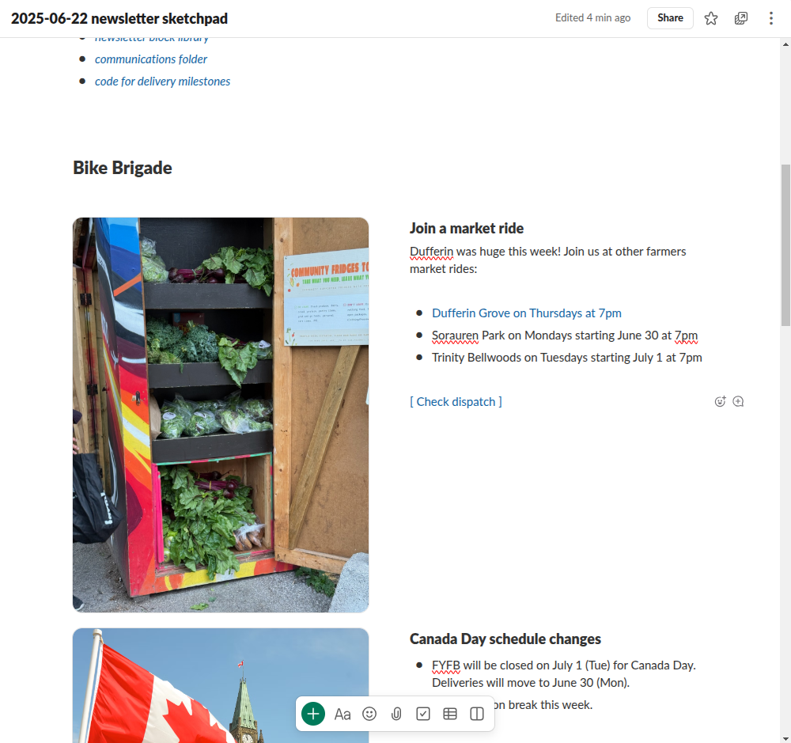

And then I redo it in Mailchimp:

#+ATTR_HTML: :class box-shadow
#+CAPTION: Screenshot of Mailchimp design
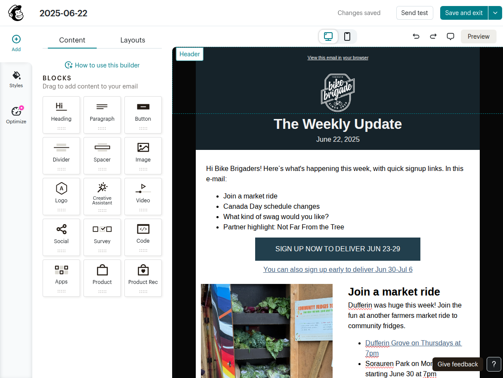

My process is roughly:

1. Duplicate blocks.
2. Copy the text for each item and paste it in. Adjust formatting.
3. Update the dates and links. Flip back and forth between the dispatch webpage and Mailchimp, getting the links and the dates just right.
4. Download images one by one.
5. Replace the images by uploading the saved images. Hunt through lots of files named image (3).png, image (4).png, and so on. Update their attributes and links.
6. Change text and link colours as needed by manually selecting the text, clicking on the colour button in the toolbar, and selecting the correct colour.
7. Change the text on each button. Switch to Slack, copy the link, switch back to Mailchimp, and update the link.

I think I can get [[https://sachachua.com/topic/emacs/][Emacs]] to make things easier.

#+begin_sticky-toc
#+TOC: headlines 2 local
#+end_sticky-toc

**** Automating buttons
:PROPERTIES:
:CUSTOM_ID: areas-transforming-html-clipboard-contents-with-emacs-to-smooth-out-mailchimp-annoyances-dates-images-comments-colours-automating-buttons
:END:

The newsletter includes a button to make it easier
to volunteer for deliveries. In case people want
to plan ahead, I also include a link to the
following week's signups.

Dates are fiddly and error-prone, so I want to
automate them. I can use a Mailchimp code block to
paste in some HTML directly, since I don't think
other people will need to edit this button. Here I
take advantage of ~org-read-date~'s clever date
parsing so that I can specify dates like ~+2Sun~
to mean two Sundays from now. That way, I don't
have to do any date calculations myself.

This code generates something like this:

#+ATTR_HTML: :class box-shadow
#+CAPTION: Screenshot of buttons


#+begin_details Text from the screenshot
SIGN UP NOW TO DELIVER JUN 23-29 \\
You can also sign up early to deliver Jun 30-Jul 6
#+end_details

Here's the code. It calculates the dates, formats
the HTML code. I use ~format-time-string~ to
format just the month part of the dates and
compare them to tell if I can skip the month part
of the end date. After the HTML is formatted, the
code uses [[https://github.com/jordansissel/xdotool][xdotool]] (a Linux command-line tool) to
switch to Google Chrome so that I can paste it in.

#+begin_src emacs-lisp :results replace :exports both :tangle lisp/sacha-brigade.el
;;;###autoload
(defun sacha-brigade-copy-signup-block (date)
	(interactive (list (if current-prefix-arg (org-read-date nil t nil "Date: ")
											 (org-read-date nil t "+Sun"))))
	(when (stringp date) (setq date (date-to-time date)))
	(let* ((newsletter-date (format-time-string "%Y-%m-%d" date))
				 (current-week (org-read-date nil t "++Mon" nil date))
				 (current-week-end (org-read-date nil t "++Sun" nil date))
				 (next-week (org-read-date nil t "+2Mon" nil date))
				 (next-week-end (org-read-date nil t "+3Sun" nil date))
				 result)
		(setq result (format
			"<table class=\"sign-up\" style=\"background-color: #223f4d; text-align: center; margin: auto; margin-top: 24px; margin-bottom: 12px;\"><tbody><tr><td><a href=\"https://dispatch.bikebrigade.ca/campaigns/signup?current_week=%s\" target=\"_blank\" class=\"sign-up mceButtonLink\" style=\"background-color:#223f4d;border-radius:0;border:2px solid #223f4d;color:#ffffff;display:block;font-family:'Helvetica Neue', Helvetica, Arial, Verdana, sans-serif;font-size:16px;font-weight:normal;font-style:normal;padding:16px 28px;text-decoration:none;text-align:center;direction:ltr;letter-spacing:0px\" rel=\"noreferrer\">SIGN UP NOW TO DELIVER %s-%s</a></td></tr></table>
<p style=\"text-align: center; font-family: 'Helvetica Neue', Helvetica, Arial, Verdana\"><a href=\"https://dispatch.bikebrigade.ca/campaigns/signup?current_week=%s\" style=\"color: #476584; margin-top: 12px; margin-bottom: 12px;\" target=\"_blank\">You can also sign up early to deliver %s-%s</a></p>"
			(format-time-string "%Y-%m-%d" current-week)
			(upcase (format-time-string "%b %-e" current-week))
			(upcase (format-time-string
			 (if (string= (format-time-string "%m" current-week)
										(format-time-string "%m" current-week-end))
					 "%-e"
				 "%b %-e")
			 current-week-end))
			(format-time-string "%Y-%m-%d" next-week)
			(format-time-string "%b %-e" next-week)
			(format-time-string
			 (if (string= (format-time-string "%m" next-week)
										(format-time-string "%m" next-week-end))
					 "%-e"
				 "%b %-e")
			 next-week-end)))
		(when (called-interactively-p 'any)
			(kill-new result)
			(shell-command "xdotool search  --onlyvisible --all Chrome windowactivate windowfocus"))
		result))
#+end_src

#+RESULTS:
:results:
sacha-brigade-copy-signup-block
:end:

Now I can use an Org Mode link like
~elisp:sacha-brigade-copy-signup-block~ to generate
the HTML code that I can paste into a Mailchimp
code block. The button link is underlined even
though the inline style says
~text-decoration:none~, but it's easy enough to
remove that with ~Ctrl+u~.

**** Transforming HTML
:PROPERTIES:
:CUSTOM_ID: areas-transforming-html-clipboard-contents-with-emacs-to-smooth-out-mailchimp-annoyances-dates-images-comments-colours-transforming-html
:END:

The rest of the newsletter is less
straightforward. I copy parts of the newsletter
draft from the canvas in Slack to the block editor
in Mailchimp. When I paste it in, I need to do a
lot to format the results neatly.

I think I'll want to use this technique of
transforming HTML data on the clipboard again in
the future, so let's start with a general way to
do it. This uses the [[https://github.com/astrand/xclip][xclip]] tool for command-line
copying and pasting in X11 environments. It parses
the HTML into a document object model (DOM), runs
it through various functions sequentially, and
copies the transformed results. Using DOMs instead
of regular expressions means that it's easier to
handle nested elements.

#+begin_src emacs-lisp :tangle lisp/sacha-web.el
;;;###autoload
(defun sacha-transform-html (functions text)
	"Apply FUNCTIONS to TEXT, which is parsed as HTML.
Each function is called with the DOM and should return a DOM.
Return the resulting HTML as a string."
	(with-temp-buffer
		(when (stringp text)
				(insert (concat "<div>"
												text
												"</div>")))
		(let ((dom (if (stringp text) (libxml-parse-html-region (point-min) (point-max))
								 text))) ; might already be a DOM
			(erase-buffer)
			(svg-print (seq-reduce
									(lambda (prev val)
										(funcall val prev))
									(or functions sacha-transform-html-clipboard-functions)
									dom))
			(buffer-string))))

(defvar sacha-transform-html-clipboard-functions nil "List of functions to call with the clipboard contents.
Each function should take a DOM node and return the resulting DOM node.")
;; Rich text can sometimes be finicky to paste, so maybe I'll default to working with plain text
;; if there's a code view I can use to paste in the HTML.
(defvar sacha-transform-html-clipboard-rich-text nil
	"Non-nil means copy as rich text instead of plain HTML.")
;;;###autoload
(defun sacha-transform-html-clipboard (&optional activate-app-afterwards functions text
																							as-rich-text)
	"Parse clipboard contents and transform it.
This calls FUNCTIONS, defaulting to `sacha-transform-html-clipboard-functions'.
If ACTIVATE-APP-AFTERWARDS is non-nil, use xdotool to try to activate that app's window."
	(when (region-active-p) (setq text (buffer-substring (region-beginning) (region-end))))
	(unless text
		(setq text (shell-command-to-string "unbuffer -p xclip -o -selection clipboard -t text/html 2>& /dev/null")))
	(when (string= text "") (error "Clipboard does not contain HTML."))
	(with-temp-buffer
		(insert (sacha-transform-html functions text))
		(if (or as-rich-text sacha-transform-html-clipboard-rich-text)
				(shell-command-on-region
					 (point-min) (point-max)
					 "xclip -i -selection clipboard -t text/html -filter 2>& /dev/null")
			(kill-new (buffer-substring-no-properties (point-min) (point-max)))))
	(when activate-app-afterwards
		(call-process "xdotool" nil nil nil "search" "--onlyvisible" "--all" activate-app-afterwards "windowactivate" "windowfocus")))
#+end_src

**** Saving images
:PROPERTIES:
:CUSTOM_ID: areas-transforming-html-clipboard-contents-with-emacs-to-smooth-out-mailchimp-annoyances-dates-images-comments-colours-transforming-html-saving-images
:END:

Images from Slack don't transfer cleanly to
Mailchimp. I can download images from Slack one at
a time, but Slack saves them with generic
filenames like ~image (2).png~. Each main
newsletter item has one image, so I'd like to
automatically save the image using the item title.

When I copy HTML from the Slack canvas, images are
included as data URIs. The markup looks like this:
~<img src='data:image/png;base64,iVBORw0KGgo...~
With the way I do the draft in Slack, images are
always followed by the item title as an ~h2~
heading. If there isn't a heading, the image just
doesn't get saved. If there's no image in a
section, the code clears the variable, so that's
fine too. I can parse and save the images like
this:

#+begin_src emacs-lisp :tangle lisp/sacha-web.el
;; Hmm, now I need to modify it to handle emojis in the text.
;; Emojis have :text: in the alt. I need to upload them.

;;;###autoload
(defun sacha-transform-html-save-images (dom dir &optional file-prefix transform-fn)
  "Returns a list of (section list).
list is a list of alists with the following keys:
- type (main, extra, emoji)
- alt
- filename"
	(let (last-image last-image-filename last-image-alt results last-image-node)
		(dom-search
     dom
		 (lambda (node)
			 (pcase (dom-tag node)
				 ('img
					(let* ((data (dom-attr node 'src))
                 (jpg (concat (file-name-sans-extension data)
                             ".jpg")))
            (when (file-exists-p jpg)
              (dom-set-attribute node 'src jpg)
              (setq data jpg))
            (when (or last-image last-image-filename)
              (cond
               ;; this image is after another image, so the previous image must be an extra one
							 (last-image
								(setq last-image-filename
											(expand-file-name
											 (format "%s%s-extra.%s"
															 (or file-prefix "")
															 (if transform-fn
																	 (funcall transform-fn (caar results))
																 (caar results))
															 (car last-image))
											 dir))
								(with-temp-file last-image-filename
									(set-buffer-file-coding-system 'binary)
									(insert (base64-decode-string (cdr last-image)))))
							 ;; this image is after another image, so the previous image must be an extra one
							 (last-image-filename
								(let ((new-filename
											 (expand-file-name
												(format "%s%s-extra.%s"
																(or file-prefix "")
																(if transform-fn
																		(funcall transform-fn (caar results))
																	(caar results))
																"jpg")
												dir)))
									(call-process "convert" nil nil nil last-image-filename
																new-filename)
									(setq last-image-filename new-filename))))
              (push
               (list
                (cons 'type 'extra)
                (cons 'filename last-image-filename)
                (cons 'alt last-image-alt))
               (cdr (car results)))
              (dom-remove-node dom node)
              (setq last-image-node nil)
              (setq last-image nil last-image-filename nil))
						(cond
             ((string-match "^:.+?:" (or (dom-attr node 'alt) ""))
              (setq last-image-node nil)
              (push
               (list
                (cons 'type 'emoji)
                (cons 'filename (dom-attr node 'src))
                (cons 'alt (dom-attr node 'alt)))
               (cdar results)))
						 ((string-match "^images/" data)
							(setq last-image nil
										last-image-filename data
										last-image-alt (dom-attr node 'alt)
                    last-image-node node))
						 ((string-match "^data:image/" data)
							(with-temp-buffer
								(insert data)
								(goto-char (point-min))
								(when (looking-at "data:image/\\([^;]+?\\);base64,")
									(setq last-image (cons (match-string 1)
																				 (buffer-substring (match-end 0) (point-max)))
												last-image-filename nil
												last-image-alt (dom-attr node 'alt)
                        last-image-node node)))))))
				 ('h2
					(when (not (string= (string-trim (dom-texts node)) ""))
						(cond
						 (last-image
							(setq last-image-filename
										(expand-file-name
										 (format "%s%s.%s"
														 (or file-prefix "")
														 (if transform-fn
																 (funcall transform-fn (dom-texts node))
															 (dom-texts node))
														 (car last-image))
										 dir))
							(with-temp-file last-image-filename
								(set-buffer-file-coding-system 'binary)
								(insert (base64-decode-string (cdr last-image)))))
						 (last-image-filename
							(let ((new-filename
										 (expand-file-name
											(format "%s%s.%s"
															(or file-prefix "")
															(if transform-fn
																	(funcall transform-fn (dom-texts node))
																(dom-texts node))
															(file-name-extension last-image-filename))
											dir)))
                (copy-file last-image-filename new-filename t)
								(setq last-image-filename new-filename))))
						(push (cons (string-trim (dom-texts node))
												`(((filename . ,last-image-filename)
					                 (alt . ,last-image-alt)
                           (type . main))))
									results)
            (when last-image-node
              (dom-remove-node dom last-image-node))
						(setq last-image nil
                  last-image-node nil
									last-image-filename nil))))))
		(nreverse results)))

#+end_src

I wrapped this in a small function for
newsletter-specific processing:

#+begin_src emacs-lisp :tangle lisp/sacha-web.el
;;;###autoload
(defun sacha-transform-html-slugify (s)
	(downcase
	 (replace-regexp-in-string
		"^-+\\|-$" ""
		(replace-regexp-in-string
		 "[^A-Za-z0-9]+" "-"
		 (string-trim s)))))
(defvar sacha-brigade-newsletter-images-directory "~/proj/bike-brigade/newsletter/images")
;;;###autoload
(defun sacha-brigade-newsletter-heading-to-image-file-name (heading)
	(replace-regexp-in-string
	 "[^-a-z0-9]" ""
	 (replace-regexp-in-string
		" +"
		"-"
		(string-trim (downcase heading)))))
;;;###autoload
(defun sacha-brigade-save-newsletter-images (dom)
	(sacha-transform-html-save-images
	 dom
	 sacha-brigade-newsletter-images-directory
	 (concat (substring (org-read-date nil nil "+Sun") 0 10)
					 "-news-")
	 #'sacha-transform-html-slugify))
#+end_src

For easier testing, I used ~xclip -o -selection
clipboard -t text/html > ~/Downloads/test.html~ to
save the clipboard. To run the code with the saved
clipboard, I can call it like this:

#+begin_src emacs-lisp :eval no :tangle no
(sacha-brigade-save-newsletter-images
 (with-temp-buffer (insert-file-contents "~/Downloads/test.html") (libxml-parse-html-region))
 )
#+end_src
**** Cleaning up
:PROPERTIES:
:CUSTOM_ID: areas-transforming-html-clipboard-contents-with-emacs-to-smooth-out-mailchimp-annoyances-dates-images-comments-colours-transforming-html-cleaning-up
:END:

Now that I've saved the images, I can remove them:

#+begin_src emacs-lisp :tangle lisp/sacha-web.el
;;;###autoload
(defun sacha-transform-html-remove-images (dom)
	(dolist (img (dom-by-tag dom 'img))
		(dom-remove-node dom img))
	dom)
#+end_src

I can also remove the italics that I use for comments.

#+begin_src emacs-lisp :tangle lisp/sacha-web.el
;;;###autoload
(defun sacha-transform-html-remove-italics (dom)
	(dolist (node (dom-by-tag dom 'i))
		(dom-remove-node dom node))
	dom)
#+end_src

Here's how I can test it:

#+begin_src emacs-lisp :eval no :tangle no
(sacha-transform-html-clipboard
 nil
 '(sacha-transform-html-remove-images
	 sacha-transform-html-remove-italics)
 (with-temp-buffer (insert-file-contents "~/Downloads/test.html") (buffer-string)))
#+end_src

**** Removing sections
:PROPERTIES:
:CUSTOM_ID: areas-transforming-html-clipboard-contents-with-emacs-to-smooth-out-mailchimp-annoyances-dates-images-comments-colours-transforming-html-removing-sections
:END:

I put longer comments and instructions under "Meta" headings, which I can automatically remove.

#+begin_src emacs-lisp :tangle lisp/sacha-brigade.el
(defvar sacha-brigade-section nil)
;;;###autoload
(defun sacha-brigade-remove-meta-recursively (node &optional recursing)
	"Remove <h1>Meta</h1> headings in NODE and the elements that follow them.
Resume at the next h1 heading."
	(unless recursing (setq sacha-brigade-section nil))
	(cond
	 ((eq (dom-tag node) 'h1)
		(setq sacha-brigade-section (string-trim (dom-texts node)))
		(if (string= sacha-brigade-section "Meta")
				nil
			node))
	 ((string= sacha-brigade-section "Meta")
		nil)
	 (t
		(let ((processed
					 (seq-keep
						(lambda (child)
							(if (stringp child)
									(unless (string= sacha-brigade-section "Meta")
										child)
								(sacha-brigade-remove-meta-recursively child t)))
						(dom-children node))))
			`(,(dom-tag node) ,(dom-attributes node) ,@processed)))))
#+end_src

Let's try it out:

#+begin_src emacs-lisp :eval no :tangle no
(sacha-transform-html-clipboard
 nil
 '(sacha-transform-html-remove-images
	 sacha-transform-html-remove-italics
	 sacha-brigade-remove-meta-recursively)
 (with-temp-buffer (insert-file-contents "~/Downloads/test.html") (buffer-string)))
#+end_src
**** Removing unneeded styles
:PROPERTIES:
:CUSTOM_ID: collaboration-transforming-html-clipboard-contents-with-emacs-to-smooth-out-mailchimp-annoyances-dates-images-comments-colours-removing-unneeded-styles
:END:

#+begin_src emacs-lisp :tangle lisp/sacha-web.el
;;;###autoload
(defun sacha-html-extract-css-rules (dom)
  "Extract CSS rules and return a hash table mapping class names to properties."
  (let* ((css-rules (make-hash-table :test 'equal))
				 (css-content (dom-texts (car (dom-by-tag dom 'style))))
				 (len (length css-content))
				 (start 0))
    (while (and (< start len)
								(string-match "\\([^{]+\\){\\([^}]+\\)}" css-content start))
      (let ((selector (match-string 1 css-content))
            (properties (match-string 2 css-content)))
        (puthash selector properties css-rules)
        (setq start (match-end 0))))
    css-rules))

;;;###autoload
(defun sacha-brigade-convert-span-style (node rules)
	(when (and (dom-attr node 'class)
						 (not (string= (string-trim (dom-texts node)) "")))
		(let ((styles
					 (when (dom-attr node 'class)
						 (string-join
							(seq-keep (lambda (class-name)
													(let ((prop (gethash (concat "." class-name) rules)))
														(when (and prop
																			 (string-match "font-weight:700\\|font-style:italic" prop))
															prop)))
												(split-string (dom-attr node 'class)))
							";"))))
			(unless (or (null styles) (string= styles ""))
				(dom-set-attribute node 'style styles)
				(dom-remove-attribute node 'class)
				node))))

;;;###autoload
(defun sacha-brigade-simplify-html (dom)
	(let ((css-rules (sacha-html-extract-css-rules dom)))
		(dolist (tag '(li b ul span p a h2 div))
			(dolist (node (dom-by-tag dom tag))
				(or (sacha-brigade-convert-span-style node css-rules)
						(dolist (attr '(style class id))
							(when (dom-attr node attr)
								(dom-remove-attribute node attr))))))
		;; remove comments
    (mapc (lambda (node) (dom-remove-node (dom-parent dom node) node))
          (dom-by-tag dom 'sup))
		;; remove blank paragraphs
		(dom-search
		 dom
		 (lambda (node)
			 (when (eq (dom-tag node) 'p))
			 (when (and (string= (string-trim (dom-texts node)) "")
									(not (dom-by-tag node 'img)))
				 (dom-remove-node (dom-parent dom node) node))))
		;; fix links
		(dolist (node (dom-by-tag dom 'a))
			(when (string-match "https://www\\.google\\.com\\/url" (dom-attr node 'href))
				(let ((args (url-parse-query-string
										 (cdr (url-path-and-query (url-generic-parse-url (dom-attr node 'href)))))))
					(dom-set-attribute node 'href (car (assoc-default "q" args 'string=))))))
		dom))
#+end_src
**** Formatting calls to action
:PROPERTIES:
:CUSTOM_ID: areas-transforming-html-clipboard-contents-with-emacs-to-smooth-out-mailchimp-annoyances-dates-images-comments-colours-transforming-html-formatting-calls-to-action
:END:

Mailchimp recommends using buttons for calls to
action so that they're larger and easier to click
than links. In my Slack canvas draft, I use [ link
text ] to indicate those calls to action. Wouldn't
it be nice if my code automatically transformed
those into centered buttons?

#+begin_src emacs-lisp :tangle lisp/sacha-brigade.el
;;;###autoload
(defun sacha-brigade-format-buttons (dom)
	(dolist (node (dom-by-tag dom 'a))
		(let ((text (dom-texts node)))
			(if (string-match "\\[ *\\(.+?\\) *\\]" text)
					;; button, wrap in a table
					(with-temp-buffer
						(insert
						 (format "<table><tbody><tr><td style=\"padding: 12px 0 12px 0\"><div style=\"margin-top: 12px\"><table align=\"center\" border=\"0\" cellpadding=\"0\" cellspacing=\"0\" role=\"presentation\" class=\"mceButtonContainer\" style=\"padding-top: 24px; margin: auto; margin-top: 12px; text-align: center\"><tbody><tr class=\"mceStandardButton\"><td style=\"background-color:#000000;border-radius:0;margin-top:12px;text-align:center\" valign=\"top\" class=\"mceButton\"><a href=\"%s\" target=\"_blank\" class=\"mceButtonLink\" style=\"background-color:#000000;border-radius:0;border:2px solid #000000;color:#ffffff;display:block;font-family:'Helvetica Neue', Helvetica, Arial, Verdana, sans-serif;font-size:16px;font-weight:normal;font-style:normal;padding:16px 28px;text-decoration:none;text-align:center;direction:ltr;letter-spacing:0px\" rel=\"noreferrer\">%s</a></td></tr></tbody></table></td></tr></table>"
										 (dom-attr node 'href)
										 (match-string 1 text)))
						(let ((parent-paragraph (sacha-dom-closest dom node 'p)))
							(dom-add-child-before
							 (dom-parent dom parent-paragraph)
							 (car (dom-by-tag (libxml-parse-html-region (point-min) (point-max)) 'div))
							 parent-paragraph)
							(dom-remove-node dom parent-paragraph))))))
	dom)
#+end_src

Now I can test those functions in combination:

#+begin_src emacs-lisp :eval no :tangle no
(sacha-transform-html-clipboard
 nil
 '(sacha-transform-html-remove-images
	 sacha-transform-html-remove-italics
	 sacha-brigade-remove-meta-recursively
	 sacha-brigade-format-buttons)
 (with-temp-buffer (insert-file-contents "~/Downloads/test.html") (buffer-string)))
#+end_src

#+ATTR_HTML: :class box-shadow
#+CAPTION: Screenshot of button


**** Changing link colours
:PROPERTIES:
:CUSTOM_ID: areas-transforming-html-clipboard-contents-with-emacs-to-smooth-out-mailchimp-annoyances-dates-images-comments-colours-transforming-html-changing-link-colours
:END:

I also want to change the link colours to match
the colour scheme. The newsletter has two parts
distinguished by background colours. Bike Brigade
updates use black text on a white background, and
community updates use white text on a dark blue
background so that they're visually distinct. For
contrast, I like to use light blue links in the
community section, which doesn't match the colour
of the links when I paste them in from Slack. This
meant manually recolouring the text and each of
the links in Mailchimp, which was tedious.

#+ATTR_HTML: :class box-shadow
#+CAPTION: Screenshot of community update colours


This code changes the colours of the links. It
also changes the colours of text by wrapping spans
around them. It skips the links we turned into
buttons.

#+begin_src emacs-lisp :tangle lisp/sacha-brigade.el
(defvar sacha-brigade-community-text-style "color: #ffffff")
(defvar sacha-brigade-community-link-style "color: #aed9ef")
;;;###autoload
(defun sacha-brigade-recolor-recursively (node)
	"Change the colors of links and text in NODE.
Ignore links with the class mceButtonLink.
Uses `sacha-brigade-community-text-style' and `sacha-brigade-community-link-style'."
	(pcase (dom-tag node)
		('table node) ; pass through, don't recurse further
		('a						; change the colour
		 (unless (string= (or (dom-attr node 'class) "") "mceButtonLink")
			 (dom-set-attribute node 'style sacha-brigade-community-link-style))
		 node)
		(_
		 (let ((processed
						(seq-map
						 (lambda (child)
							 (if (stringp child)
									 (dom-node 'span `((style . ,sacha-brigade-community-text-style)) child)
								 (sacha-brigade-recolor-recursively child)))
						 (dom-children node))))
			 `(,(dom-tag node) ,(dom-attributes node) ,@processed)))))
#+end_src

I can add that to the sequence:

#+begin_src emacs-lisp :eval no :tangle no
(sacha-transform-html-clipboard
 nil
 '(sacha-transform-html-remove-images
	 sacha-transform-html-remove-italics
	 sacha-brigade-remove-meta-recursively
	 sacha-brigade-format-buttons
	 sacha-brigade-recolor-recursively)
 (with-temp-buffer (insert-file-contents "~/Downloads/test.html") (buffer-string)))
#+end_src

**** Just the headings
:PROPERTIES:
:CUSTOM_ID: collaboration-transforming-html-clipboard-contents-with-emacs-to-smooth-out-mailchimp-annoyances-dates-images-comments-colours-just-the-headings
:END:

#+begin_src emacs-lisp :tangle lisp/sacha-brigade.el
;;;###autoload
(defun sacha-brigade-just-headings (dom)
	(let ((entries
				 (dom-node 'ul)))
		(dolist (tag (dom-by-tag dom 'h2))
			(let ((text (string-trim (dom-texts tag))))
				(unless (string= text "")
					(dom-append-child entries (dom-node 'li nil text)))))
		entries))
#+end_src
**** Wrapping it up
:PROPERTIES:
:CUSTOM_ID: areas-transforming-html-clipboard-contents-with-emacs-to-smooth-out-mailchimp-annoyances-dates-images-comments-colours-transforming-html-wrapping-it-up
:END:

Now that I've made all those little pieces, I can put them together in two interactive functions. The first function will be for the regular colour scheme, and the second function will be for the light-on-dark colour scheme. For convenience, I'll have it activate Google Chrome afterwards so that I can paste the results into the right block.

#+begin_src emacs-lisp :tangle lisp/sacha-brigade.el
;;;###autoload
(defun sacha-brigade-transform-html (&optional recolor file as-rich-text)
	(interactive (list nil (when current-prefix-arg (read-file-name "File: "))))
	(sacha-transform-html-clipboard
   "Chrome"
	 (append
		'(sacha-transform-html-remove-images
			sacha-transform-html-remove-italics
			sacha-brigade-remove-meta-recursively
			sacha-brigade-remove-styles
			sacha-brigade-format-buttons)
		(if recolor '(sacha-brigade-recolor-recursively)))
	 (when file
		 (with-temp-buffer (insert-file-contents file) (buffer-string)))
	 as-rich-text))

;;;###autoload
(defun sacha-brigade-transform-community-html (&optional file as-rich-text)
	(interactive (list (when current-prefix-arg (read-file-name "File: "))))
	(sacha-brigade-transform-html t file as-rich-text))

;;;###autoload
(defun sacha-brigade-transform-just-headings (&optional file as-rich-text)
	(interactive (list (when current-prefix-arg (read-file-name "File: "))))
	(sacha-transform-html-clipboard
   "Chrome"
	 '(sacha-brigade-just-headings)
	 (when file
		 (with-temp-buffer (insert-file-contents file) (buffer-string)))
	as-rich-text))

#+end_src

And then I can use links like this for quick shortcuts:

- ~[[elisp:(sacha-brigade-transform-html nil "~/Downloads/test.html")]]~
- ~[[elisp:(sacha-brigade-transform-community-html "~/Downloads/test.html")]]~
- ~[[elisp:(sacha-brigade-transform-html)]]~

Since this pastes the results as formatted text, it's
editable using the usual Mailchimp workflow. That
way, other people can make last-minute updates.

With embedded images, the saved HTML is about 8
MB. The code makes quick work of it. This saves
about 10-15 minutes per newsletter, so the time
investment probably won't [[https://xkcd.com/1205/][directly pay off]]. But it
also reduces annoyance, which is even more
important than raw time savings. I enjoyed
figuring all this out. I think this technique of
transforming HTML in the clipboard will come in
handy. By writing the functions as small,
composable parts, I can change how I want to
transform the clipboard.

**** Next steps
:PROPERTIES:
:CUSTOM_ID: areas-transforming-html-clipboard-contents-with-emacs-to-smooth-out-mailchimp-annoyances-dates-images-comments-colours-next-steps
:END:

It would be interesting to someday automate the campaign blocks while still making them mostly editable, as in the following examples:

- [[https://github.com/tan-yong-sheng/mailchimp_auto/][tan-yong-sheng/mailchimp_auto: A command line application to automate the email campaign creation process on MailChimp based on the google spreadsheet input]]
- [[https://dev.to/kylegalbraith/automating-sacha-newsletter-generation-with-mailchimp-google-sheets-and-aws-lambda-1n11][Automating My Newsletter Generation with MailChimp, Google Sheets, and AWS Lambda - DEV Community]]

Maybe someday!

(Also, hat tip to this [[https://www.reddit.com/r/emacs/comments/da9h10/why_does_shellcommand_hang_using_xclip_filter_to/][Reddit post]] that helped me
get xclip to work more reliably from within Emacs
by adding ~-filter 2>& /dev/null~ to the end of my
xclip call so it didn't hang.)

*** Getting a Google Docs draft ready for Mailchimp via Emacs and Org Mode :emacs:org:
:PROPERTIES:
:CUSTOM_ID: collaboration-bike-brigade-extract-information-from-google-docs-export-as-zipped-html
:EXPORT_DATE: 2025-09-17T10:07:10-0400
:EXPORT_ELEVENTY_PERMALINK: /blog/2025/09/getting-a-google-docs-draft-ready-for-mailchimp-via-emacs/
:EXPORT_ELEVENTY_FILE_NAME: blog/2025/09/getting-a-google-docs-draft-ready-for-mailchimp-via-emacs/
:EXPORT_MASTODON: https://social.sachachua.com/@sacha/statuses/01K5C0MFBEMCMVK59ACGSM7KP2
:EXPORT_MODIFIED: 2025-09-18T10:51:02-0400
:END:

#+begin_update
[2025-09-18]: Got it to include the dates in the TOC as well
#+end_update

I've been volunteering to help with the [[https://www.bikebrigade.ca/][Bike Brigade]] newsletter. I like that there are people who are out there helping improve food security by delivering food bank hampers to recipients. Collecting information for the newsletter also helps me feel more appreciation for the lively Toronto biking scene, even though I still can't make it out to most events. The general workflow is:
1. collect info
2. draft the newsletter somewhere other volunteers can give feedback on
3. convert the newsletter to Mailchimp
4. send a test message
5. make any edits requested
6. schedule the email campaign

We have the [[https://mailchimp.com/][Mailchimp]] Essentials plan, so I can't just export HTML for the whole newsletter. Someday I should experiment with services that might let me generate the whole newsletter from Emacs. That would be neat. Anyway, with Mailchimp's block-based editor, at least I can paste in HTML code for the text/buttons. That way, I don't have to change colours or define links by hand.

The logistics volunteers coordinate via [[https://slack.com][Slack]], so a Slack Canvas seemed like a good way to draft the newsletter. I've previously written about my workflow for [[https://sachachua.com/blog/2025/06/transforming-html-clipboard-contents-with-emacs-to-smooth-out-mailchimp-annoyances-dates-images-comments-colours/][copying blocks from a Slack Canvas and then using Emacs to transform the rich text]], including recolouring the links in the section with light text on a dark background. However, copying rich text from a Slack Canvas turned out to be unreliable. Sometimes it would copy what I wanted, and sometimes nothing would get copied. There was no way to export HTML from the Slack Canvas, either.

I switched to using [[https://docs.google.com][Google Docs]] for the drafts. It was a little less convenient to add items from Slack messages and I couldn't easily right-click to download the images that I pasted in. It was more reliable in terms of copying, but only if I used [[https://github.com/astrand/xclip][xclip]] to save the clipboard into a file instead of trying to do the whole thing in memory.

I finally got to spend a little time automating a new workflow. This time I exported the Google Doc as a zip that had the HTML file and all the images in a subdirectory. The HTML source is not very pleasant to work with. It has lots of extra markup I don't need. Here's what an entry looks like:

#+CAPTION: Exported HTML for an entry
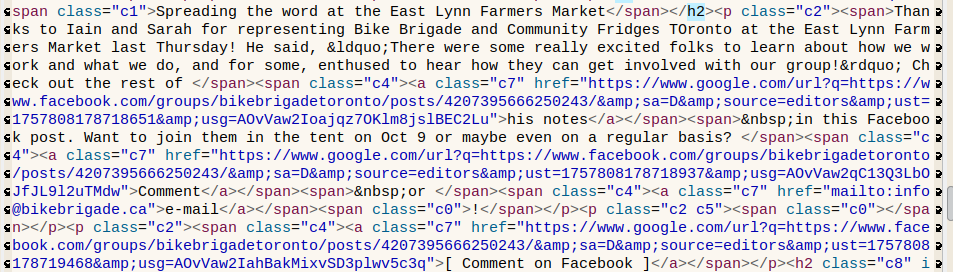

Things I wanted to do with the HTML:

- Remove the google.com/url redirection for the links. Mailchimp will add its own redirection for click-tracking, but at least the links can look simpler when I paste them in.
- Remove all the extra classes and styles.
- Turn [ call to action ] into fancier Mailchimp buttons.

Also, instead of transforming one block at a time, I decided to make an Org Mode document with all the different blocks I needed. That way, I could copy and paste things in quick succession.

Here's what the result looks like. It makes a table of contents, adds the sign-up block, and adds the different links and blocks I need to paste into Mailchimp.

#+CAPTION: Screenshot of newsletter Org file with blocks for easy copying
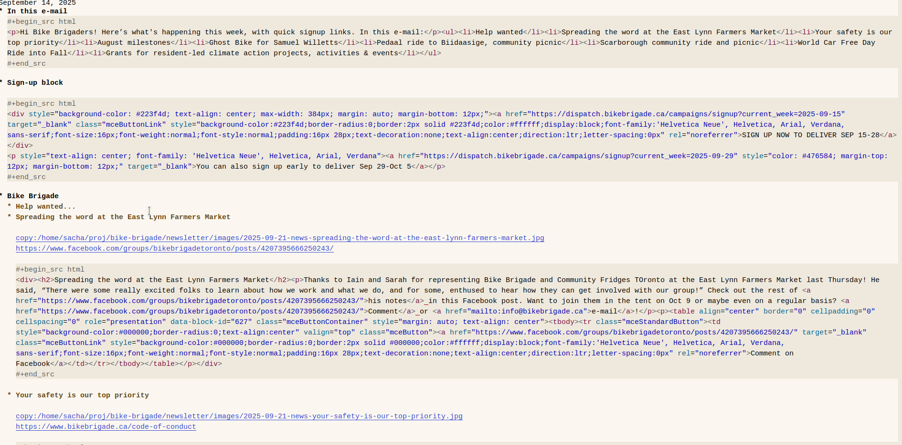

I need to copy and paste the image filenames into the upload dialog on Mailchimp, so I use my [[https://sachachua.com/blog/2024/01/org-mode-custom-link-copy-to-clipboard/][custom Org Mode link type for copying to the clipboard]]. For the HTML code, I use ~#+begin_src html ... #+end_src~ instead of ~#+begin_export html ... #+end_export~ so that I can use [[https://github.com/oantolin/embark][Embark]] and [[https://github.com/oantolin/embark/blob/master/embark-org.el][embark-org]] to quickly copy the contents of the source block. (That doesn't work for export blocks yet.) I have ~C-.~ bound to ~embark-act~, the source block is detected by the functions that ~embark-org.el~ added to ~embark-target-finders~, and the ~c~ binding in ~embark-org-src-block-map~ calls ~embark-org-copy-block-contents~. So all I need to do is ~C-. c~ in a block to copy its contents.

#+begin_src emacs-lisp :results silent :summary Here's the code to process the newsletter draft :tangle lisp/sacha-brigade.el
;;;###autoload
(defun sacha-brigade-process-latest-newsletter-draft (date)
	"Create an Org file with the HTML for different blocks."
	(interactive (list (if current-prefix-arg (org-read-date nil t nil "Date: ")
											 (org-read-date nil t "+Sun"))))
	(when (stringp date) (setq date (date-to-time date)))
	(let ((default-directory "~/Downloads/newsletter")
				file
				dom
				sections)
		(call-process "unzip" nil nil nil "-o" (sacha-latest-file "~/Downloads" "\\.zip$"))
		(setq file (sacha-latest-file default-directory))
		(with-temp-buffer
			(insert-file-contents-literally file)
			(goto-char (point-min))
			(setq dom (sacha-brigade-simplify-html (libxml-parse-html-region (point-min) (point-max))))
			(sacha-brigade-save-newsletter-images dom)
			(setq sections
						(sacha-html-group-by-tag
						 'h1
						 (dom-children
							(dom-by-tag
							 dom 'body)))))
		(with-current-buffer (get-buffer-create "*newsletter*")
			(erase-buffer)
			(org-mode)
			(insert
			 (format-time-string "%B %-e, %Y" date) "\n"
			 "* In this e-mail\n#+begin_src html\n"
			 "<p>Hi Bike Brigaders! Here’s what's happening this week, with quick signup links. In this e-mail:</p>"
			 (replace-regexp-in-string
				"<li>" "\n<li>"
				(with-temp-buffer
					(svg-print
					 (apply 'dom-node
									'ul nil
									(append
									 (sacha-brigade-toc-items (assoc-default "Bike Brigade" sections 'string=))
									 (sacha-brigade-toc-items (assoc-default "In our community" sections 'string=)))))
					(buffer-string)))
			 "\n<br />\n"
			 (sacha-brigade-copy-signup-block date)
			 "\n#+end_src\n\n")
			(dolist (sec '("Bike Brigade" "In our community"))
				(insert "* " sec "\n"
								(mapconcat
								 (lambda (group)
									 (let* ((item (apply 'dom-node 'div nil
																			 (append
																				(list (dom-node 'h2 nil (car group)))
																				(cdr group))))
													(image (sacha-brigade-image (car group))))
										 (format "** %s\n\n%s\n%s\n\n#+begin_src html\n%s\n#+end_src\n\n"
														 (car group)
														 (if image (org-link-make-string (concat "copy:" image)) "")
														 (or (sacha-html-last-link-href item) "")
														 (sacha-transform-html
															(delq nil
																		(list
																		 'sacha-transform-html-remove-images
																		 'sacha-transform-html-remove-italics
																		 'sacha-brigade-format-buttons
																		 (when (string= sec "In our community")
																			 'sacha-brigade-recolor-recursively)))
															item))))
								 (sacha-html-group-by-tag 'h2 (cdr (assoc sec sections 'string=)))
								 "")))
			(insert "* Other updates\n"
							(format "#+begin_src html\n<h2>Other updates</h2>%s\n#+end_src\n\n"
											(sacha-transform-html
											 '(sacha-transform-html-remove-images
												 sacha-transform-html-remove-italics)
											 (car (cdr (assoc "Other updates" sections 'string=))))))
			(goto-char (point-min))
			(display-buffer (current-buffer)))))

;;;###autoload
(defun sacha-brigade-toc-items (section-children)
	"Return a list of <li /> nodes."
	(mapcar
	 (lambda (group)
		 (let* ((text (dom-texts (cadr group)))
						(regexp (format "^%s \\([A-Za-z]+ [0-9]+\\)"
														(regexp-opt '("Mon" "Tue" "Wed" "Thu" "Fri" "Sat" "Sun"))))
						(match (when (string-match regexp text) (match-string 1 text))))
			 (dom-node 'li nil
								 (org-html-encode-plain-text
									(if match
											(format "%s: %s" match (car group))
										(car group))))))
	 (sacha-html-group-by-tag 'h2 section-children)))

;;;###autoload
(defun sacha-html-group-by-tag (tag dom-list)
	"Use TAG to divide DOM-LIST into sections. Return an alist of (section . children)."
	(let (section-name current-section results)
		(dolist (node dom-list)
			(if (and (eq (dom-tag node) tag)
							 (not (string= (string-trim (dom-texts node)) "")))
					(progn
						(when current-section
							(push (cons section-name (nreverse current-section))  results)
							(setq current-section nil))
						(setq section-name (string-trim (dom-texts node))))
				(when section-name
					(push node current-section))))
		(when current-section
			(push (cons section-name (reverse current-section))  results)
			(setq current-section nil))
		(nreverse results)))

;;;###autoload
(defun sacha-html-last-link-href (node)
	"Return the last link HREF in NODE."
	(dom-attr (car (last (dom-by-tag node 'a))) 'href))

;;;###autoload
(defun sacha-brigade-image (heading)
	"Find the latest image related to HEADING."
	(car
	 (nreverse
		(directory-files sacha-brigade-newsletter-images-directory
												t (regexp-quote (sacha-brigade-newsletter-heading-to-image-file-name heading))))))

#+end_src

Some of the functions it uses are in my config, particularly the section on [[dotemacs:areas-transforming-html-clipboard-contents-with-emacs-to-smooth-out-mailchimp-annoyances-dates-images-comments-colours][Transforming HTML clipboard contents with Emacs to smooth out Mailchimp annoyances: dates, images, comments, colours]].

Along the way, I learned that ~svg-print~ is a good way to [[https://sachachua.com/blog/2025/09/emacs-and-dom-el-quick-notes-on-parsing-html-and-turning-doms-back-into-html/][turn document object models back into HTML]].

When I saw two more events and one additional link that I wanted to include, I was glad I already had this code sorted out. It made it easy to paste the images and details into the Google Doc, reformat it slightly, and get the info through the process so that it ended up in the newsletter with a usefully-named image and correctly-coloured links.

I think this is a good combination of Google Docs for getting other people's feedback and letting them edit, and Org Mode for keeping myself sane as I turn it into whatever Mailchimp wants.

My next step for improving this workflow might be to check out other e-mail providers in case I can get Emacs to make the whole template. That way, I don't have to keep switching between applications and using the mouse to duplicate blocks and edit the code.
*** Bike Brigade: working with Mailchimp images
:PROPERTIES:
:CUSTOM_ID: collaboration-bike-brigade-working-with-mailchimp-images
:END:

All right, let's try uploading the files ourselves. This uses https://github.com/sachac/mailchimp-el .

#+begin_src emacs-lisp
(use-package mailchimp :load-path "~/proj/mailchimp-el" :vc (:url "https://github.com/sachac/mailchimp-el"))
#+end_src

#+begin_src emacs-lisp :tangle lisp/sacha-brigade.el
;;;###autoload
(defun sacha-brigade-reuse-or-upload-images (images)
  "Return an updated list of (section . images)."
	(let* ((base-regexp "^.+?-news-\\|\\(\\.[0-9][0-9]\\)?\\.\\(jpg\\||png\\)$")
         (recent-files
          (mapcar
           (lambda (o)
             (cons
              (cons 'base
                    (replace-regexp-in-string
                     base-regexp ""
                     (file-name-base (assoc-default 'name o))))
              o))
           (assoc-default 'files (mailchimp-recent-files 100))))
         results)
		(mapcar
		 (lambda (section)
       (setcdr
        section
        (mapcar
         (lambda (image)
			     (let* ((base
                   (if (eq (alist-get 'type image) 'emoji)
                       (replace-regexp-in-string "^:\\|:$" "" (alist-get 'alt image))
                     (and (assoc-default 'filename image)
                          (replace-regexp-in-string
                           base-regexp ""
                           (file-name-base (alist-get 'filename image))))))
                  (existing (and base (seq-find (lambda (o)
                                                  (string= base (alist-get 'base o)))
                                                recent-files))))
             (when base
               (let ((url
                      (if existing
                          (assoc-default 'full_size_url existing)
                        (alist-get
                         'full_size_url
                         (mailchimp-upload-file
                          (alist-get 'filename image)
                          (if (eq (alist-get 'type image) 'emoji)
                              (concat
                               (replace-regexp-in-string "^:\\|:$" "" (alist-get 'alt image))
                               "."
                               (file-name-extension (alist-get 'filename image)))))))))
				         (push (cons 'url url) image)
                 (push (cons (file-name-base (alist-get 'filename image)) url) results)))
				     image))
         (cdr section)))
       section)
		 images)))

;;;###autoload
(defun sacha-brigade-toc (sections)
	(replace-regexp-in-string
	 "<li>" "\n<li>"
	 (with-temp-buffer
		 (svg-print
			(apply 'dom-node
						 'ul nil
						 (append
							(sacha-brigade-toc-items (assoc-default "Bike Brigade" sections 'string=))
							(sacha-brigade-toc-items (assoc-default "In our community" sections 'string=)))))
		 (buffer-string))))

;;;###autoload
(defun sacha-brigade-remove-section-images (item)
  ;; remove the last image, because that's the image for the next section
  (when-let* ((last-image (car (last (dom-by-tag item 'img)))))
    (dom-remove-node item last-image))
  item)

;;;###autoload
(defun sacha-brigade-format-section (section images &optional recolor)
	(mapconcat
	 (lambda (group)
		 (let* ((item (apply 'dom-node 'div nil
												 (append
													(list (dom-node 'h2 nil (car group)))
													(cdr group))))
						(images (assoc-default (car group) images 'string=))
            (main-image (seq-find (lambda (o) (eq (alist-get 'type o) 'main)) images))
            (extra-image (seq-find (lambda (o) (eq (alist-get 'type o) 'extra)) images))
						(call-to-action (dom-attr (dom-search item (lambda (o)
																												 (and (eq (dom-tag o) 'a)
																															(string-match "^\\[ .+ \\]" (dom-texts o)))))
																			'href)))
       (if main-image
			     (format "<table width=\"100%%\" border=\"0\" cellspacing=\"0\" cellpadding=\"0\" align=\"center\" style=\"margin-top: 12px; margin-bottom: 12px;\"><tbody><tr class=\"mceRow\"><td colspan=\"1\" rowspan=\"1\" style=\"background-position:center;background-repeat:no-repeat;background-size:cover\" valign=\"top\"><table width=\"100%%\" border=\"0\" cellspacing=\"0\" cellpadding=\"0\"><tbody><tr><td colspan=\"12\" rowspan=\"1\" valign=\"top\" width=\"100%%\" class=\"mceColumn\" id=\"mceColumnId--38\"><table width=\"100%%\" border=\"0\" cellspacing=\"0\" cellpadding=\"0\"><tbody><tr><td colspan=\"1\" rowspan=\"1\" style=\"border:0;border-radius:0\" valign=\"top\" id=\"b812\"><table width=\"100%%\" border=\"0\" cellspacing=\"0\" cellpadding=\"0\" align=\"center\"><tbody><tr class=\"mceRow\"><td colspan=\"1\" rowspan=\"1\" style=\"background-position:center;background-repeat:no-repeat;background-size:cover;padding-top:0px;padding-bottom:0px\" valign=\"top\"><table style=\"table-layout:fixed\" width=\"100%%\" border=\"0\" cellspacing=\"24\" cellpadding=\"0\"><tbody><tr><td colspan=\"6\" rowspan=\"1\" style=\"padding-top:0;padding-bottom:0\" valign=\"top\" width=\"50%%\" class=\"mceColumn\" id=\"mceColumnId-809\"><table width=\"100%%\" border=\"0\" cellspacing=\"0\" cellpadding=\"0\"><tbody><tr><td colspan=\"1\" rowspan=\"1\" style=\"background-color:transparent;border:0;border-radius:0\" valign=\"top\" class=\"mceImageBlockContainer\" id=\"b808\"><table style=\"border-collapse:separate;margin:0;vertical-align:top;max-width:100%%;width:100%%;height:auto\" width=\"100%%\" border=\"0\" cellspacing=\"0\" cellpadding=\"0\" align=\"center\"><tbody><tr><td colspan=\"1\" rowspan=\"1\" style=\"border:0;border-radius:0;margin:0\" valign=\"top\">%s</td></tr></tbody></table></td></tr></tbody></table></td><td colspan=\"6\" rowspan=\"1\" style=\"padding-top:0;padding-bottom:0\" valign=\"top\" width=\"50%%\" class=\"mceColumn\" id=\"mceColumnId-811\"><table width=\"100%%\" border=\"0\" cellspacing=\"0\" cellpadding=\"0\"><tbody><tr><td colspan=\"1\" rowspan=\"1\" style=\"padding:12px\" valign=\"top\" class=\"mceGutterContainer\"><table style=\"border-collapse:separate\" width=\"100%%\" border=\"0\" cellspacing=\"0\" cellpadding=\"0\"><tbody><tr><td colspan=\"1\" rowspan=\"1\" style=\"padding-top:0;padding-bottom:0;padding-right:0;padding-left:0;border:0;border-radius:0\" valign=\"top\" id=\"b810\"><table style=\"border:0;background-color:transparent;border-radius:0;border-collapse:separate\" width=\"100%%\"><tbody><tr><td colspan=\"1\" rowspan=\"1\" qqstyle=\"padding-left:24px;padding-right:24px;\" class=\"mceTextBlockContainer\">%s</td></tr></tbody></table></td></tr></tbody></table></td></tr></tbody></table></td></tr></tbody></table></td></tr></tbody></table></td></tr></tbody></table></td></tr></tbody></table></td></tr>%s</tbody></table>"
							     (if call-to-action
									     (format "<a href=\"%s\" tabindex=\"-1\" style=\"display: block;\"><span style=\"background-color: transparent\"></span></a>"
													     call-to-action
													     (assoc-default 'url main-image)
													     (if (not (string= (assoc-default 'alt main-image) ""))
															     (assoc-default 'alt main-image)
														     (car group)))
								     (format ""
												     (assoc-default 'url main-image)
												     (if (not (string= (assoc-default 'alt main-image) ""))
														     (assoc-default 'alt main-image)
													     (car group))))
							     (sacha-transform-html
								    (delq nil
											    (list
											     'sacha-transform-html-remove-italics
											     'sacha-brigade-format-buttons
											     (when recolor
												     'sacha-brigade-recolor-recursively)))
								    item)
                   ;; extra images?
                   (if extra-image
                       (format "<tr><td colspan=\"2\" style=\"padding-top: 12px\"></td></tr>" (assoc-default 'url extra-image) (assoc-default 'alt extra-image nil ""))
                     ""))
         ;; No images
         (format "<table width=\"100%%\" border=\"0\" cellspacing=\"0\" cellpadding=\"0\" align=\"center\" style=\"margin-top: 12px; margin-bottom: 12px;\"><tbody>%s%s</tbody></table>"
                 (format "<tr><td colspan=\"2\" style=\"padding-top: 12px\">%s</td></tr>"
                         (sacha-transform-html
								          (delq nil
											          (list
											           'sacha-transform-html-remove-italics
											           'sacha-brigade-format-buttons
											           (when recolor
												           'sacha-brigade-recolor-recursively)))
								          item))
                 ;; extra images?
                 (if extra-image
                     (format "<tr><td colspan=\"2\" style=\"padding-top: 12px\"></td></tr>" (assoc-default 'url extra-image) (assoc-default 'alt extra-image nil ""))
                   "")
                 ))
       ))
	 (sacha-html-group-by-tag 'h2 section)
	 ""))

;;;###autoload
(cl-defun sacha-brigade-block (text &key (bg "#223f4d")
																 (style "padding-left:24px;padding-right:24px;padding-top:12px;padding-bottom:12px"))
	(format
	 "<table border=\"0\" cellpadding=\"0\" cellspacing=\"0\" width=\"100%%\" style=\"border-collapse:collapse\" role=\"presentation\"><tbody><tr><td style= \"padding-top:0;padding-bottom:0;padding-right:0;padding-left:0;border:0;border-radius:0\" valign=\"top\"><table width=\"100%%\" style= \"border:0;background-color:%s;border-radius:0\"><tbody><tr><td style=\"%s\" class=\"mceTextBlockContainer\"><div data-block-id=\"738\" class=\"mceText\" style= \"width:100%%\">%s</div></td></tr></tbody></table></td></tr></tbody></table>"
	 bg
	 style
	 text))

;;;###autoload
(defun sacha-brigade-update-images (dom images)
  "Replace image references.
IMAGES is an alist of (filename . URL)."
  (let ((all-images (mapcan 'cdr images))) ; todo: hash or alist
    (mapcar
     (lambda (node)
       (when-let* ((base (file-name-base (dom-attr node 'src)))
                   (url
                    (alist-get 'url
                               (seq-find
                                (lambda (o)
                                  (string= base
                                           (file-name-base (alist-get 'filename o))))
                                all-images))))
         (dom-set-attribute node 'src url)))
     (dom-by-tag dom 'img)))
  dom)

;;;###autoload
(defun sacha-brigade-process-latest-newsletter-draft-with-images (date)
	"Create an Org file with the HTML for different blocks."
	(interactive (list (if current-prefix-arg (org-read-date nil t nil "Date: ")
											 (org-read-date nil t "+Sun"))))
	(when (stringp date) (setq date (date-to-time date)))
	(let ((default-directory "~/proj/bike-brigade/temp_newsletter/")
				file
				images
				dom
				sections
				html)
                                        ;(call-process "unzip" nil nil nil "-o" (sacha-latest-file "~/Downloads" "\\.zip$"))
		(setq file (sacha-latest-file default-directory ".html"))
		(with-temp-buffer
			(insert-file-contents-literally file)
			(goto-char (point-min))
			(setq dom (libxml-parse-html-region (point-min) (point-max)))
			(setq images (sacha-brigade-reuse-or-upload-images
                    (sacha-brigade-save-newsletter-images dom)))
			(setq dom (sacha-brigade-simplify-html dom))
      (setq dom (sacha-brigade-update-images dom images))
			(setq sections
						(sacha-html-group-by-tag
						 'h1
						 (dom-children
							(dom-by-tag
							 dom 'body)))))
		(setq html
					(replace-regexp-in-string "<p><span></span></p>" ""
					                          (concat
					                           "<table class=\"newsletter\" margin=0 cellpadding=0 cellspacing=0 style=\"border-collapse:collapse\"><tbody><tr><td>"
					                           (sacha-brigade-block (format "<table style=\"margin: auto\"><tbody><tr><td style=\"text-align: center; color: #f3f3f3\"><div style=\"text-align: center; color: #f3f3f3\">%s</div></td></tr></table>"
																		                           (format-time-string "%B %-e, %Y" date))
														                           :bg "#16232a"
														                           :style "padding: 0px 24px 12px 24px")
					                           "<base href=\"\"><style>table { border-collapse: collapse !important } table.newsletter { border-collapse: collapse} .mceStandardButton a, table.sign-up a { text-decoration: none }</style><table><tbody><tr><td style=\"padding: 12px 24px 12px 24px\"><p>Hi Bike Brigaders! Here’s what's happening this week, with quick signup links. In this e-mail:</p>"
					                           (sacha-brigade-toc sections)
					                           ""
					                           (sacha-brigade-copy-signup-block date)
					                           (sacha-brigade-format-section (assoc-default "Bike Brigade" sections #'string=) images)
					                           "</td></tr></tbody></table><table style=\"background-color:#223f4d;\"><tbody><tr><td style=\"padding-left: 24px; padding-right: 24px\">"
					                           (sacha-brigade-block "<h1 style=\"text-align: center;\"><span style= \"color:#ffffff;\">In our community</span></h1>")
					                           (sacha-brigade-format-section (assoc-default "In our community" sections #'string=) images t)
					                           "</td></tr></tbody></table>"
					                           (if (assoc-default "Other updates" sections #'string=)
							                           (format "<table><tbody><tr><td style=\"padding: 12px 24px 12px 24px\"><h2>Other updates</h2>%s</td></tr></tbody></table>"
											                           (sacha-transform-html
												                          nil
												                          (car (assoc-default "Other updates" sections #'string=))))
						                           "")
					                           "</td></tr></tbody></table>")))
		(when (called-interactively-p 'any)
			(kill-new html))
		html))

#+end_src

*** Emacs: Updating a Mailchimp campaign using a template, sending test e-mails, and scheduling it
:PROPERTIES:
:CREATED: [2026-01-07 Wed 19:25]
:Effort:   1:00
:CUSTOM_ID: collaboration-bike-brigade-updating-mailchimp-directly
:EXPORT_DATE: 2026-01-17T12:59:01-0500
:EXPORT_ELEVENTY_PERMALINK: /blog/2026/01/emacs-updating-a-mailchimp-campaign-using-a-template-sending-test-e-mails-and-scheduling-a-campaign/
:EXPORT_ELEVENTY_FILE_NAME: blog/2026/01/emacs-updating-a-mailchimp-campaign-using-a-template-sending-test-e-mails-and-scheduling-a-campaign/
:END:
:LOGBOOK:
CLOCK: [2026-01-07 Wed 19:40]--[2026-01-07 Wed 21:07] =>  1:27
:END:

I'm helping other volunteers get on board with doing the [[https://bikebrigade.ca][Bike Brigade]] newsletter. Since not everyone has access to (or the patience for) [[https://mailchimp.com][MailChimp]], we've been using Google Docs to draft the newsletter and share it with other people behind the scenes. I've previously written about [[https://sachachua.com/blog/2025/09/getting-a-google-docs-draft-ready-for-mailchimp-via-emacs/][getting a Google Docs draft ready for Mailchimp via Emacs and Org Mode]], which built on my code for [[https://sachachua.com/blog/2025/06/transforming-html-clipboard-contents-with-emacs-to-smooth-out-mailchimp-annoyances-dates-images-comments-colours/][transforming HTML clipboard contents to smooth out Mailchimp annoyances: dates, images, comments, colours]]. Now I've figured out how to update, test, and schedule the MailChimp campaign directly from Emacs so that I don't even have to go into the MailChimp web interface at all. I added those functions to [[https://github.com/sachac/mailchimp-el][sachac/mailchimp-el]].

I used to manually download a ZIP of the Google Docs newsletter draft. I didn't feel like figuring out authentication and Google APIs from Emacs, so I did that in a NodeJS script instead. [[file:~/proj/bike-brigade/convert-newsletter.js][convert-newsletter.js]] can either create or download the latest newsletter doc from our Google Shared Drive. ([[https://github.com/WarrenWilkinson/google-api][google-api]] might be helpful if I want to do this in Emacs, not sure.) If I call convert-newsletter.js with the ~download~ argument, it unpacks the zip into ~~/proj/bike-brigade/temp_newsletter~, where my Emacs Lisp function for processing the latest newsletter draft with images can turn it into the HTML to insert into the HTML template I've previously created. I've been thinking about whether I want to move my HTML transformation code to NodeJS as well so that I could run the whole thing from the command-line and possibly have other people run this in the future, or if I should just leave it in Emacs for my convenience.

Updating the campaign through the Mailchimp API means that I don't have to log in, replicate the campaign, click on the code block, and paste in the code. Very nice, no clicks needed. I also use TRAMP to write the HTML to a file on my server (~sacha-bike-brigade-output-file~ is of the form ~/ssh:hostname:/path/to/file~) so that other volunteers can get a web preview without waiting for the test email.

#+begin_src emacs-lisp :results silent :tangle lisp/sacha-brigade.el
;;;###autoload
(defun sacha-brigade-next-campaign (&optional date)
  (setq date (or date (org-read-date nil nil "+Sun")))
  (seq-find
   (lambda (o)
     (string-match (concat "^" date)
                   (alist-get 'title (alist-get 'settings o))))
   (alist-get 'campaigns (mailchimp-campaigns 5))))

(defvar sacha-bike-brigade-output-file nil)

;;;###autoload
(defun sacha-brigade-download-newsletter-from-google-docs ()
  "Download the newsletter from Google Docs and puts it in ~/proj/bike-brigade/temp_newsletter/."
  (interactive)
  (let ((default-directory "~/proj/bike-brigade"))
    (delete-directory "~/proj/bike-brigade/temp_newsletter" t)
    (with-current-buffer (get-buffer-create "*Newsletter*")
      (erase-buffer)
      (display-buffer (current-buffer))
      (call-process "node" nil t t "convert-newsletter.js" "download"))))

;;;###autoload
(defun sacha-brigade-create-or-update-campaign (&optional use-local)
  (interactive (list current-prefix-arg))
  (let* ((date (org-read-date nil nil "+Sun"))
         (template-name "Bike Brigade weekly update")
         (list-name "Bike Brigade")
         (template-id
          (alist-get
           'id
           (seq-find
            (lambda (o)
              (string= template-name (alist-get 'name o)))
            (alist-get 'templates (mailchimp--request-json "templates")))))
         (list-id (seq-find
                   (lambda (o)
                     (string= list-name
                              (alist-get 'name o)))
                   (alist-get 'lists (mailchimp--request-json "lists"))))
         (campaign (sacha-brigade-next-campaign date))
         (body `((type . "regular")
                 (recipients (list_id . ,(alist-get 'id list-id)))
                 (settings
                  (title . ,date)
                  (subject_line . "Bike Brigade: Weekly update")
                  (from_name . "Bike Brigade")
                  (reply_to . "info@bikebrigade.ca")
                  (tracking
                   (opens . t)
                   (html_clicks . t))))))
    (unless campaign
      (setq campaign (mailchimp--request-json
                      "/campaigns"
                      :method "POST"
                      :body
                      body)))
    ;; Download the HTML
    (if use-local
        (progn
          (make-directory "~/proj/bike-brigade/temp_newsletter/" t)
          (let ((default-directory "~/proj/bike-brigade/temp_newsletter/"))
            (call-process "unzip" nil (get-buffer-create "*Newsletter*") nil
                          (sacha-latest-file sacha-download-dir ".zip")))
          (let ((default-directory "~/proj/bike-brigade/"))
            (call-process "node" nil (get-buffer-create "*Newsletter*") nil
                          "convert-newsletter.js"
                          "resize")))
      (sacha-brigade-download-newsletter-from-google-docs))
    ;; Upload to Mailchimp
    (mailchimp-campaign-update-from-template
     (alist-get 'id campaign)
     template-id
     (list
      (cons "main_content_area"
            (sacha-brigade-process-latest-newsletter-draft-with-images
             date))))
    (when sacha-bike-brigade-output-file
      (with-temp-file sacha-bike-brigade-output-file
        (insert (alist-get 'html (mailchimp--request-json (format "/campaigns/%s/content" (alist-get 'id campaign)))))))
    (browse-url (concat "https://sachachua.com/bike-brigade/" (file-name-nondirectory sacha-bike-brigade-output-file)))
    (message "%s" "Done!")))
#+end_src

#+RESULTS:
:results:
sacha-bike-brigade-create-or-update-campaign
:end:

Now to send the test e-mails...

#+begin_src emacs-lisp :tangle lisp/sacha-brigade.el
(defvar sacha-brigade-test-emails nil "Set to a list of e-mail addresses.")
;;;###autoload
(defun sacha-brigade-send-test-to-me ()
  (interactive)
  (mailchimp-campaign-send-test-email (sacha-brigade-next-campaign) user-mail-address))

;;;###autoload
(defun sacha-brigade-send-test ()
  (interactive)
  (if sacha-brigade-test-emails
      (mailchimp-campaign-send-test-email (sacha-brigade-next-campaign) sacha-brigade-test-emails)
    (error "Set `sacha-brigade-test-emails'.")))
#+end_src

And schedule it:

#+begin_src emacs-lisp :tangle lisp/sacha-brigade.el
;;;###autoload
(defun sacha-brigade-schedule ()
  (interactive)
  (let* ((campaign (sacha-brigade-next-campaign))
         (sched (format-time-string "%FT%T%z" (org-read-date t t "+Sun 11:00") t)))
    (mailchimp-campaign-schedule campaign sched)
    (message "Scheduled %s" (alist-get 'title (alist-get 'settings campaign)))))
#+end_src

Progress, bit by bit! Here's a screenshot showing the Google Docs draft on one side and my web preview in the other:

#+CAPTION: Google Docs and Mailchimp campaign preview
[[https://sachachua.com/blog/2026/01/emacs-updating-a-mailchimp-campaign-using-a-template-sending-test-e-mails-and-scheduling-a-campaign/2026-01-17_13-00-27.png]]

It'll be even cooler if I can get some of this working via systemd persistent tasks so that they happen automatically, or have some kind of way for the other newsletter volunteers to trigger a rebuild. Anyway, here's https://github.com/sachac/mailchimp-el in case the code is useful for anyone else.

* Streaming
   :PROPERTIES:
   :CUSTOM_ID: streaming
   :END:
** Mode for streaming
:PROPERTIES:
:CUSTOM_ID: streaming-mode-for-streaming
:END:

#+begin_src emacs-lisp
  (setq sacha-stream-inbox-file "~/sync/topics/live.org")
  (with-eval-after-load 'org-capture
    (add-to-list 'org-capture-templates
  	       `("u" "Update" item  ; Update for the livestream
  		 (file+headline ,sacha-stream-inbox-file "Updates")
  		 "- %U %?"))
    (add-to-list 'org-capture-templates
  	       `("l" "Timestamp" item
  		 (file+headline ,sacha-stream-inbox-file "Timestamps")
  		 "- %U %i%?")))
#+end_src

#+begin_src emacs-lisp :tangle lisp/sacha-stream.el
(defvar sacha-stream-old-variable-values nil "Alist of values to save.")
(defvar sacha-stream-inbox-file nil "File to save new items to.")
(defvar sacha-stream-url nil "*URL of current livestream.")
(defvar sacha-stream-inbox-target
  `(file+headline ,sacha-stream-inbox-file "Current / notes for next time"))
(defvar sacha-stream-variables-to-override
  `((custom-enabled-themes . (ef-trio-dark))
    (org-agenda-files . ("~/sync/stream/index.org" "~/sync/topics/live.org" "~/sync/stream/inbox.org"))
    (org-refile-targets
     .
     ((("~/sync/stream/index.org"
        "~/sync/stream/inbox.org"
        "~/sync/topics/live.org"
        "~/sync/orgzly/posts.org"
        "~/sync/emacs/Sacha.org"
        "~/sync/orgzly/news.org") . t)))
    (sacha-org-inbox-file . ,sacha-stream-inbox-file)
    (sacha-file-shortcuts .
                          (("C" "~/proj/emacs-calendar/README.org" "Emacs calendar")
                           ("e" "~/sync/emacs/Sacha.org" "Config")
                           ("E" "~/sync/emacs-news/index.org" "Emacs News")
                           ("f" "~/sync/orgzly/journal-fr.org" "French journal")
                           ("F" "~/sync/orgzly/french.org" "French")
                           ("i" "~/sync/topics/live.org" "Live")
                           ("s" "~/proj/stream/index.org" "Yay Emacs")
                           ("p" "~/sync/orgzly/posts.org" "Posts")
                           ("n" "~/sync/topics/now.org" "Now")
                           ("w" "~/sync/topics/workflows.org" "Workflows")))
    (org-capture-templates
     .
     (("r" "Note" entry
       ,sacha-stream-inbox-target
       "* %?\n:PROPERTIES:\n:CREATED: %U\n:END:\n\n%i\n\n- %a\n%U"
       :prepend t)
      ("u" "Update" item
       (file+headline ,sacha-stream-inbox-file "Updates")
       "- %U %?"
       :prepend t)
      ("F" "Firefox link" entry
       ,sacha-stream-inbox-target
       "* %^{Note}\n:PROPERTIES:\n:CREATED: %U\n:END:\n\n%(org-link-make-string\n(sacha-spookfox-complete-link))")
      ("f" "Firefox" entry
       ,sacha-stream-inbox-target
       "* %^{Note}\n:PROPERTIES:\n:CREATED: %U\n:END:\n\n%(apply #'org-link-make-string\n								 (append (spookfox-js-injection-eval-in-active-tab \"[window.location.href, document.title]\" t) nil))")
      ("📰" "Emacs News" entry
       (file+headline "~/sync/orgzly/news.org"
                      "Collect Emacs News")
       "* %a  :news:\n\n#+begin_quote\n%:text\n#+end_quote\n\n"
       :prepend t :immediate-finish t)
      ("m" "Mastodon" entry
       ,sacha-stream-inbox-target
       "* %?\n\n#+begin_quote\n%:text\n#+end_quote\n\n%a"
       :prepend t)

      ("t" "Task with annotation" entry
       ,sacha-stream-inbox-target
       "* TODO %?\n:PROPERTIES:\n:CREATED: %U\n:END:\n%a\n"
       :prepend t)
      ("i" "Interrupting task" entry
       ,sacha-stream-inbox-target
       "* STARTED %^{Task}\n:PROPERTIES:\n:CREATED: %U\n:END:\n%a\n"
       :clock-in :clock-resume :prepend t)
      ("T" "Task without annotation" entry
       ,sacha-stream-inbox-target
       "* TODO %^{Task}\n:PROPERTIES:\n:CREATED: %U\n:END:\n\n"
       :prepend t)
      ("c" "Contents to current clocked task" plain
       (clock) "%i%?\n%a" :empty-lines 1)
      ("." "Today" entry
       ,sacha-stream-inbox-target
       "* TODO %^{Task}\nSCHEDULED: %t\n:PROPERTIES:\n:CREATED: %U\n:END:\n"
       :immediate-finish t)
      ("v" "Video" entry
       ,sacha-stream-inbox-target
       "* TODO %^{Task}  :video:\nSCHEDULED: %t\n"
       :immediate-finish t)
      ("e" "Errand" entry
       ,sacha-stream-inbox-target
       "* TODO %^{Task}  :errands:\n:PROPERTIES:\n:CREATED: %U\n:END:\n"
       :immediate-finish t)
      ("n" "Note" entry
       ,sacha-stream-inbox-target
       "* %^{Note}\n:PROPERTIES:\n:CREATED: %U\n:END:\n"
       :immediate-finish t)
      ("N" "Note" entry
       ,sacha-stream-inbox-target
       "* %^{Note}\n:PROPERTIES:\n:CREATED: %U\n:END:\n"
       :prepend t)
      ("s" "Selection from browser" entry
       ,sacha-stream-inbox-target
       "* %a :website:\n:PROPERTIES:\n:CREATED: %U\n:END:\n#+begin_quote\n%i\n#+end_quote\n\n%?\n"
       :prepend t)
      ("S" "Screenshot" item
       (file+headline ,sacha-stream-inbox-file "Timestamps")
       "- %U [[file:%(sacha-latest-screenshot)]]%i%?")
      ("l" "Timestamp" item
       (file+headline ,sacha-stream-inbox-file "Timestamps")
       "- %U %i%?")
      ("q" "Quick note" item
       ,sacha-stream-inbox-target)
      ("w" "Web" entry (file ,sacha-stream-inbox-file)
       "* %a\n:PROPERTIES:\n:CREATED: %U\n:END:\n\n%i\n")
      ("W" "Web bookmark" entry
       (file "~/sync/orgzly/resources.org")
       "* %a\n:PROPERTIES:\n:CREATED: %U\n:END:\n\n%i\n"
       :prepend t)
      ("y" "Yay Emacs" entry
       (file+headline "~/proj/yayemacs/index.org"
                      "Notes for this session")
       "* %?\n:PROPERTIES:\n:CREATED: %U\n:END:\n\n\n%i\n\n%a\n")))))

;;;###autoload
(defun sacha-stream-override-variables ()
  "Save and override variables for streaming."
  (interactive)
  (if sacha-stream-old-variable-values
      (message "Values already saved? Not overriding.")
    (setq sacha-stream-old-variable-values
          (mapcar
           (lambda (var)
             (prog1 (cons (car var) (symbol-value (car var)))
               (set (car var)
                    (cdr var))))
           sacha-stream-variables-to-override)))
  (when (featurep 'org)
    (org-refile-cache-clear)))

;;;###autoload
(defun sacha-stream-restore-variables ()
  "Restore values saved in `sacha-stream-old-variable-values'."
  (interactive)
  (mapc
   (lambda (var) (set (car var) (cdr var)))
   sacha-stream-old-variable-values)
  (setq sacha-stream-old-variable-values nil)
  (when (featurep 'org)
    (org-refile-cache-clear)))

;;;###autoload
(defun sacha-stream-refresh-variables ()
  "Restore and override `sacha-stream-variables-to-override'."
  (interactive)
  (sacha-stream-restore-variables)
  (sacha-stream-override-variables))

(defvar sacha-stream-sensitive-files-regexps
  '("\\.gpg"
    "Inbox.org"
    "organizer.org"
    "business.org")
  "List of regexps matching files that would ideally not end up on stream.")

;;;###autoload
(defun sacha-stream-clean-up-buffers ()
  "Clean up buffers that might be sensitive."
  (interactive)
  (org-save-all-org-buffers)
  (let (remaining cleaned)
    (mapc
     (lambda (buf)
       (with-current-buffer buf
         (when (and (buffer-file-name)
                    (seq-find (lambda (o) (string-match o (buffer-file-name)))
                              sacha-stream-sensitive-files-regexps))
           (if (buffer-modified-p buf)
               (push (buffer-name buf) remaining)
             (push (buffer-name buf) cleaned)
             (kill-buffer buf)))))
     (buffer-list))
    (message "%s remaining, %s cleaned" remaining cleaned)))

;;;###autoload
(define-minor-mode sacha-stream-or-video-global-mode
  "On air or doing a video."
  :init-val nil
  :lighter "🎥"
  (if sacha-stream-or-video-global-mode
      (progn
        (sacha-stream-clean-up-buffers)
        (global-display-line-numbers-mode 1)
        (load-theme 'modus-vivendi t)
        (fontaine-set-preset 'presentation)
        (keycast-header-line-mode 1)
        (sacha-stream-override-variables)
        (cl-pushnew
         'sacha-marginalia-annotate-variable
         (alist-get 'variable marginalia-annotators)))
    (global-display-line-numbers-mode -1)
    ;; TODO: Pick this based on the time? We'll assume light background since I
    ;; probably won't be doing too much coding late at night anyway.
    (load-theme 'modus-operandi-tinted t)
    (fontaine-set-preset 'regular)
    (keycast-header-line-mode -1)
    (setf
     (alist-get 'variable marginalia-annotators)
     (remove
      'sacha-marginalia-annotate-variable
      (alist-get 'variable marginalia-annotators)))
    (sacha-stream-restore-variables))
  (sacha-navigate-set-up-file-shortcuts))
#+end_src

#+begin_src emacs-lisp
(use-package fontaine
  :config
  (setq fontaine-presets
        '((regular :default-height 100)
          (presentation :default-height 180))))
#+end_src
** Custom Org link type for hints (and sound effects)
:PROPERTIES:
:CUSTOM_ID: streaming-custom-org-link-type-for-hints-and-sound-effects
:END:

#+begin_src emacs-lisp :tangle lisp/sacha-org-hint.el
(defun sacha-org-hint-export (path desc format _)
	"Export hint."
	(pcase format
   ((or 'html '11ty 'md)
	  (format "<label class=\"hint\"><input type=\"checkbox\"> <span class=\"hint-desc\">%s</span><span class=\"hint-text\">%s</span></label>" desc path))
	('ascii
		desc)))

(defvar sacha-org-hint-functions nil
  "Functions to call with the hint as the argument.")

(defface sacha-org-hint-face
  '((t :inherit font-lock-keyword-face :weight bold))
  "Face for hints.")

(defun sacha-org-hint-open (path)
  "Display the hint at PATH."
  (let ((overlay (car (org-find-overlays 'sacha-org-hint)))
        (text (replace-regexp-in-string "^hint:" "" path))
        elem)
    (if overlay
        (delete-overlay overlay)
      (setq elem (org-element-context))
      (setq overlay (make-overlay (org-element-begin elem) (org-element-end elem)))
      (overlay-put overlay 'display text)
      (overlay-put overlay 'evaporate t)
      (overlay-put overlay 'sacha-org-hint text)
      (overlay-put overlay 'face 'sacha-org-hint-face)
      (run-hook-with-args 'sacha-org-hint-functions text))))

(defun sacha-org-hint-reset ()
  "Remove all hint overlays"
  (interactive)
  (remove-overlays (point-min) (point-max) 'sacha-org-hint))

(defun sacha-org-hint-play-sound (text)
  "Play sound for TEXT.
Match it against `sacha-org-hint-sound-alist'."
  (when-let* ((sound (assoc-default text sacha-org-hint-sound-alist #'string=)))
    (start-process "mpv" nil "mpv" (expand-file-name sound) "--no-video" "--force-window=no")))
#+end_src

To activate:

#+begin_src emacs-lisp
(with-eval-after-load 'org
  (setq sacha-org-hint-sound-alist
        '(("yup" . "~/proj/stream/correct.mp3")
          ("nope" . "~/proj/stream/wrong.mp3")))
  (setq sacha-org-hint-functions '(sacha-org-hint-play-sound))
  (org-link-set-parameters "hint"
												 :export #'sacha-org-hint-export
												 :follow #'sacha-org-hint-open))
#+end_src

** Chat
:PROPERTIES:
:CUSTOM_ID: streaming-chat
:END:

#+begin_src emacs-lisp :tangle lisp/sacha-stream.el
(defvar sacha-stream-chat-process nil)
(defvar sacha-stream-chat-command `("npx" "masterchat-cli" "stream" "-n" "-t" "all"))
(defvar sacha-stream-chat-buffer "*stream-chat*")
;;;###autoload
(defun sacha-stream-chat-start (&optional url)
  "Start the process if it's not already running."
  (interactive (if (process-live-p sacha-stream-chat-process)
                   nil
                 (list (read-string "URL: "))))
  (if url
      (unless (process-live-p sacha-stream-chat-process)
        (with-current-buffer (get-buffer-create sacha-stream-chat-buffer)
          (erase-buffer)
          (setq sacha-stream-chat-process
                (make-process
                 :name "stream-chat"
                 :command (append sacha-stream-chat-command (list url))
                 :buffer (get-buffer-create sacha-stream-chat-buffer)
                 :stderr (get-buffer-create "*stream-chat-err*"))))
        (display-buffer (current-buffer)))
    (if (string= (buffer-name) sacha-stream-chat-buffer)
        (bury-buffer)
      (switch-to-buffer sacha-stream-chat-buffer))))

;;;###autoload
(defun sacha-stream-chat-stop ()
  (interactive)
  (kill-process sacha-stream-chat-process))
#+end_src

#+begin_src emacs-lisp
(keymap-global-set "s-c" #'sacha-stream-chat-start)
#+end_src
** DONE Send currently-clocked task title to file, include in stream :stream:
CLOSED: [2026-01-23 Fri 12:35]
:PROPERTIES:
:Effort:   0:30
:QUANTIFIED: Emacs
:CUSTOM_ID: streaming-send-currently-clocked-task-title-to-file-include-in-stream
:END:
:LOGBOOK:
- State "DONE"       from "STARTED"    [2026-01-23 Fri 12:35]
CLOCK: [2026-01-23 Fri 12:35]--[2026-01-23 Fri 12:35] =>  0:00
CLOCK: [2026-01-23 Fri 12:35]--[2026-01-23 Fri 12:35] =>  0:00
CLOCK: [2026-01-23 Fri 12:29]--[2026-01-23 Fri 12:34] =>  0:05
CLOCK: [2026-01-23 Fri 12:29]--[2026-01-23 Fri 12:29] =>  0:00
CLOCK: [2026-01-23 Fri 12:27]--[2026-01-23 Fri 12:29] =>  0:02
:END:

#+begin_src emacs-lisp :tangle lisp/sacha-stream.el
(defvar sacha-stream-display-file nil)

;;;###autoload
(defun sacha-stream-obs-display-text (text)
  "Display TEXT in the current task area in my OBS."
  (interactive (list (read-string "Text: ")))
  (when sacha-stream-display-file
    (write-region (string-join (org-wrap text 100) "\n")
                  nil sacha-stream-display-file)))

;;;###autoload
(defun sacha-stream-obs-org-display-current-task ()
  "Display the current task on OBS."
  (interactive)
  (sacha-stream-obs-display-text
   (if (member "stream" (org-get-tags))
       (org-entry-get (point) "ITEM")
     "")))

;;;###autoload
(defun sacha-org-clear-streaming-task ()
  "Clear the text."
  (sacha-stream-obs-display-text ""))

#+end_src

#+begin_src emacs-lisp
(setq sacha-stream-display-file "~/proj/stream/current-task.txt")
(with-eval-after-load 'org-clock
  (add-hook 'org-clock-in-hook #'sacha-stream-obs-org-display-current-task)
  (add-hook 'org-clock-out-hook #'sacha-org-clear-streaming-task))
#+end_src

#+RESULTS:
:results:
| sacha-org-clear-streaming-task |
:end:
** Stream agenda
:PROPERTIES:
:CUSTOM_ID: streaming-stream-agenda
:END:

#+begin_src emacs-lisp :tangle lisp/sacha-stream.el
;;;###autoload
(defun sacha-stream-agenda ()
  (interactive)
  (org-agenda nil "s"))
#+end_src
** Simple streaming with FFmpeg
:PROPERTIES:
:CUSTOM_ID: simple-streaming
:EXPORT_MODIFIED: 2024-01-20T12:26:15-0500
:END:

#+begin_update
[2024-01-20]: As it turns out, my X230T can't
handle streaming with FFMmpeg. I get like half a
frame a second. I'll try using vdo.ninja to send
my screen over to another computer that might be
able to handle OBS.
#+end_update

My X230T can't handle OBS, but maybe I can stream with FFmpeg.
[[blog:/blog/2024/01/quick-notes-on-livestreaming-to-youtube-with-ffmpeg-on-a-lenovo-x230t/][Quick notes on livestreaming to YouTube with FFmpeg on a Lenovo X230T]]

#+NAME: streaming-setup
#+begin_src sh :tangle ~/bin/setup-laptop-for-streaming :eval never-export :shebang "#!/usr/bin/env bash" :summary streaming-setup
# From pacmd list-sources | egrep '^\s+name'
export LAPEL=alsa_input.usb-Jieli_Technology_USB_Composite_Device_433035383239312E-00.mono-fallback #
export YETI=alsa_input.usb-Blue_Microphones_Yeti_Stereo_Microphone_REV8-00.analog-stereo
export SYSTEM=alsa_output.pci-0000_00_1b.0.analog-stereo.monitor
# MIC=$LAPEL
# AUDIO_WEIGHTS="1 1"
export MIC=$YETI
export AUDIO_WEIGHTS="0.5 0.5"
export OFFSET=+1920,430
export SIZE=1280x720
export SCREEN=LVDS-1  # from xrandr
xrandr --output $SCREEN --mode 1280x720
#+end_src

#+RESULTS: streaming-setup
:results:
:end:

I switch to a larger size and a light theme. I also turn [[https://github.com/minad/consult][consult]] previews off to minimize the risk of leaking data through buffer previews.

[[dotemacs:prepare-for-emacsconf-screenshots-or-recordings]]

#+begin_comment
- [[elisp:sacha-emacsconf-prepare-for-screenshots]]
- https://studio.youtube.com/channel/UClT2UAbC6j7TqOWurVhkuHQ/livestreaming/dashboard
#+end_comment

#+begin_src sh :tangle ~/bin/stream-laptop :shebang "#!/usr/bin/env bash" :noweb yes :eval never-export :summary stream-laptop
source ~/bin/setup-laptop-for-streaming
DATE=$(date "+%Y-%m-%d-%H-%M-%S")
ffmpeg -f x11grab -framerate 30 -video_size $SIZE -i :0.0$OFFSET -f pulse -i $MIC -f pulse -i $SYSTEM -filter_complex "amix=inputs=2:weights=$AUDIO_WEIGHTS:duration=longest:normalize=0[audio]" -c:v libx264 -preset fast -maxrate 690k -bufsize 2000k -g 60 -vf format=yuv420p -c:a aac -b:a 96k -y -f tee -map 0:v -map '[audio]' -flags +global_header  "/home/sacha/recordings/$DATE.flv|[f=flv]rtmp://a.rtmp.youtube.com/live2/$YOUTUBE_KEY"
#+end_src

#+RESULTS:
:results:
:end:

#+begin_src sh :tangle ~/bin/record-laptop :shebang "#!/usr/bin/env bash" :noweb yes :eval never-export :summary record-laptop
source ~/bin/setup-laptop-for-streaming
DATE=$(date "+%Y-%m-%d-%H-%M-%S")
ffmpeg -f x11grab -framerate 30 -video_size $SIZE -i :0.0$OFFSET -f pulse -i $MIC -f pulse -i $SYSTEM -filter_complex "amix=inputs=2:weights=$AUDIO_WEIGHTS:duration=longest:normalize=0[audio]" -c:v libx264 -preset fast -maxrate 690k -bufsize 2000k -g 60 -vf format=yuv420p -c:a aac -b:a 96k -map 0:v -map '[audio]' -y "/home/sacha/recordings/$DATE.flv"
#+end_src

#+RESULTS:
:results:
:end:

Some code to start and stop the stream:

#+begin_src emacs-lisp :tangle lisp/sacha-multimedia.el
(defvar sacha-stream-process nil)
(defvar sacha-stream-type nil)
(defvar sacha-stream-offset-seconds 2 "Number of seconds to offset timestamps.")
(defvar sacha-stream-start-time nil)

;;;###autoload
(defun sacha-stream-toggle ()
	(interactive)
	(if (process-live-p sacha-stream-process)
			(sacha-stream-stop)
		(sacha-stream-start)))

;;;###autoload
(defun sacha-recording-toggle ()
	(interactive)
	(if (process-live-p sacha-stream-process)
			(sacha-recording-stop)
		(sacha-recording-start)))

;;;###autoload
(defun sacha-stream-start ()
	(interactive)
	(unless (process-live-p sacha-stream-process)
		(unless (getenv "YOUTUBE_KEY")
			(setenv "YOUTUBE_KEY" (auth-info-password (auth-source-search :host "https://studio.youtube.com"))))
		(setq sacha-stream-type 'stream)
		(setq sacha-stream-start-time (current-time))
		(setq sacha-stream-process (start-process "ffmpeg" (get-buffer-create "*stream-ffmpeg*")
																					 "bash" (expand-file-name "~/bin/stream-laptop")))
		(message "Streaming.")))

;;;###autoload
(defun sacha-recording-start ()
	(interactive)
	(unless (process-live-p sacha-stream-process)
		(setq sacha-stream-type 'record)
		(setq sacha-stream-start-time (current-time))
		(setq sacha-stream-process (start-process "ffmpeg" (get-buffer-create "*stream-ffmpeg*")
																					 "bash" (expand-file-name "~/bin/record-laptop")))
		(message "Recording.")))

;;;###autoload
(defun sacha-stream-stop ()
	(interactive)
	(when (process-live-p sacha-stream-process)
		(setq sacha-stream-type nil)
		(setq sacha-stream-start-time nil)
		(stop-process sacha-stream-process)
		(kill-process sacha-stream-process)))

(defalias 'sacha-recording-stop #'sacha-stream-stop)
;;;###autoload
(defun sacha-recordings-dired ()
	(interactive)
	(dired sacha-recordings-dir "-lt"))
#+end_src

Let's have relative timestamps:

#+begin_src emacs-lisp :tangle lisp/sacha-multimedia.el
;;;###autoload
(defun sacha-stream-insert-timestamp ()
	(interactive)
	(when sacha-stream-start-time
		(let ((time (format-seconds "%.2h:%z%.2m:%.2s"
																(- (time-to-seconds (current-time))
																	 (time-to-seconds sacha-stream-start-time)
																	 (if (eq sacha-stream-type 'stream) sacha-stream-offset-seconds 0)))))
			(insert (org-link-make-string
							 (concat "video:" (sacha-latest-file "~/recordings" "flv")
											 ":" time)
							 time)
							" "))))

;;;###autoload
(defun sacha-stream-set-recording-file ()
	(interactive)
	(org-entry-put (point) "RECORDING"
								 (sacha-latest-file "~/recordings" "flv")))
#+end_src

Ideas for next steps:

- Add a ~[REC]~ indicator to the modeline.
- Get video links to jump to the right spot, maybe based on org-media-note or subed
** Controlling my stream audio from Emacs: background music, typing sounds, and push to talk :emacs:
:PROPERTIES:
:ID:       o2b:466b53d1-3074-472a-870d-915b88401249
:POST_DATE: [2021-02-07 Sun 00:06]
:BLOG:     sacha
:POSTID:   29670
:CUSTOM_ID: controlling-sacha-stream-audio-from-emacs-background-music-typing-sounds-and-push-to-talk
:END:

#+begin_update
- 2021-02-11: Parsed =pacmd list-sources= so that I can mute/unmute devices by regular expression.
- 2021-02-07: Made it work with my USB microphone.
#+end_update

I was experimenting with streaming Emacs geeking around on [[https://twitch.tv/sachachua][twitch.tv]].
Someone asked me to have soft background music and typing sounds.
Since I'm a little clueless about music and don't want to bother with
hunting down nice royalty-free music, I figured I could just use the
[[https://en.wikipedia.org/wiki/Musikalisches_W%C3%BCrfelspiel#:~:text=The%20most%20well%2Dknown%20was,to%20create%20a%20musical%20piece.][Mozart dice game]] to programmatically generate music.

I installed the [[https://developer.aliyun.com/mirror/npm/package/mozart-dice-game][mozart-dice-game]] NPM package and used this bit of
Javascript to generate a hundred MIDI files.

#+begin_src js2 :exports code :eval no
const x = require('mozart-dice-game')
for (let i = 0; i < 100; i++) { x.saveMinuet('minuet' + String(i).padStart('3', '0') + '.mid'); }
#+end_src

Then I wrote this Emacs Lisp function to turn it on and off.

#+begin_src emacs-lisp :exports code :eval never-export :tangle lisp/sacha-multimedia.el
(defvar sacha-background-music-process nil "Process for playing background music")
;;;###autoload
(defun sacha-stream-toggle-background-music (&optional enable)
  (interactive)
  (if (or sacha-background-music-process
          (and (numberp enable) (< enable 0)))
      (progn
        (when (process-live-p sacha-background-music-process)
          (kill-process sacha-background-music-process))
        (setq sacha-background-music-process nil))
    (let ((files (directory-files "~/proj/music" t "mid\\'")))
      (setq sacha-background-music-process
            (apply
             'start-process
             "*Music*"
             nil
             (append (list "timidity" "-idlr" "--volume=10") files))))))
#+end_src

People also suggested typing sounds. I guess that's a good way to get
a sense of activity. The default selectric sound was a little too loud
for me, so we'll use the move sound for now. It would be nice to make
this more random-sounding someday.

#+begin_src emacs-lisp :tangle lisp/sacha-fun.el
;;;###autoload
(defun sacha-selectric-type-sound ()
  "Make the sound of typing."
  ;; Someday, randomize this or something
  (selectric-make-sound (expand-file-name "selectric-move.wav" selectric-files-path)))
#+end_src

#+begin_src emacs-lisp
(use-package selectric-mode
  :if sacha-laptop-p
  :diminish ""
	:defer t
	:commands selectric-mode
  :config
  (fset #'selectric-type-sound #'sacha-selectric-type-sound))
#+end_src

#+begin_update
[2024-01-10]: I'm using the Blue Yeti microphone now, so I can use the
hardware mute button instead of push to talk.
#+end_update

I was having a hard time remembering to go back on mute during
meetings, since the LED on the mute button wasn't working at the time
and the system tray icon was a little hard to notice. The LED has
mysteriously decided to start working again, but push-to-talk is handy
anyway. I want to be able to tap a key to toggle my microphone on and
off, and hold it down in order to make it push-to-talk. It looks like
my key repeat is less than 0.5 seconds, so I can set a timer that will
turn things off after a little while. This code doesn't pick up any
changes that happen outside Emacs, but it'll do for now. I used =pacmd list-sources= to list the sources and get the IDs.

#+begin_src emacs-lisp :tangle lisp/sacha-multimedia.el
;;;###autoload
(defun sacha-pacmd-set-device (regexp status)
  (with-current-buffer (get-buffer-create "*pacmd*")
    (erase-buffer)
    (shell-command "pacmd list-sources" (current-buffer))
    (goto-char (point-max))
    (let (results)
      (while (re-search-backward regexp nil t)
        (when (re-search-backward "index: \\([[:digit:]]+\\)" nil t)
          (setq results (cons (match-string 1) results))
          (shell-command-to-string (format "pacmd set-source-mute %s %d"
                                           (match-string 1)
                                           (if (equal status 'on) 0 1)))))
      results)))

(defvar sacha-mic-p nil "Non-nil means microphone is on")

;;;###autoload
(defun sacha-mic-off ()
  (interactive)
  (sacha-pacmd-set-device "Yeti" 'off)
  (sacha-pacmd-set-device "Internal Microphone" 'off)
  (setq sacha-mic-p nil))
;;;###autoload
(defun sacha-mic-on ()
  (interactive)
  (sacha-pacmd-set-device "Yeti" 'on)
  (sacha-pacmd-set-device "Internal Microphone" 'on)
  (setq sacha-mic-p t))
;;;###autoload
(defun sacha-mic-toggle ()
  (interactive)
  (if sacha-mic-p (sacha-mic-off) (sacha-mic-on)))

(defvar sacha-push-to-talk-mute-timer nil "Timer to mute things again.")
(defvar sacha-push-to-talk-last-time nil "Last time sacha-push-to-talk was run")
(defvar sacha-push-to-talk-threshold 0.5 "Number of seconds")

;;;###autoload
(defun sacha-push-to-talk-mute ()
  (interactive)
  (message "Muting.")
  (sacha-mic-off)
  (force-mode-line-update)
  (when obs-websocket-recording-p (sacha-obs-websocket-add-caption "[Microphone off]")))

;;;###autoload
(defun sacha-push-to-talk ()
  "Tap to toggle microphone on and off, or repeat the command to make it push to talk."
  (interactive)
  (cond
   ((null sacha-mic-p) ;; It's off, so turn it on
    (when (timerp sacha-push-to-talk-mute-timer)
      (cancel-timer sacha-push-to-talk-mute-timer))
    (sacha-mic-on)
    (when obs-websocket-recording-p (sacha-obs-websocket-add-caption "[Microphone on]"))
    (setq sacha-push-to-talk-last-time (current-time)))
   ((timerp sacha-push-to-talk-mute-timer) ;; Push-to-talk mode
    (cancel-timer sacha-push-to-talk-mute-timer)
    (setq sacha-push-to-talk-mute-timer
          (run-at-time sacha-push-to-talk-threshold nil #'sacha-push-to-talk-mute)))
   ;; Might be push to talk, if we're within the key repeating time
   ((< (- (time-to-seconds (current-time)) (time-to-seconds sacha-push-to-talk-last-time))
       sacha-push-to-talk-threshold)
    (setq sacha-push-to-talk-mute-timer
          (run-at-time sacha-push-to-talk-threshold nil #'sacha-push-to-talk-mute)))
   ;; It's been a while since I turned the mic on.
   (t (sacha-push-to-talk-mute))))

;(global-set-key (kbd "<f12>") #'sacha-push-to-talk)
#+end_src

#+begin_src emacs-lisp
(defvar sacha-mic-p)
(add-to-list 'mode-line-front-space '(:eval (if sacha-mic-p "*MIC*" "")))
#+end_src
** More background music
:PROPERTIES:
:CUSTOM_ID: more-background-music
:END:

#+begin_src emacs-lisp :tangle lisp/sacha-multimedia.el
;;;###autoload
(defun sacha-stream-emms-toggle-background ()
	(interactive)
	(unless (emms-playlist-buffer-list)
		(emms-play-directory "~/sync/Phone/music/freepd/"))
	(emms-pause)
	(emms-show))
#+end_src
** Show Emacs-related tasks
:PROPERTIES:
:CUSTOM_ID: show-emacs-related-tasks
:END:

#+begin_src emacs-lisp :tangle lisp/sacha-org.el
;;;###autoload
(defun sacha-show-emacs-tasks ()
  (interactive)
  (org-ql-search (org-agenda-files)
    '(and (todo)
          (parent (and (or (tags "stream")
                           (tags "project"))
                       (tags "emacs")
                       (not (tags "inactive")))))
    :title "Emacs-related project tasks"
    :sort '(date priority todo)
    :super-groups '((:auto-parent t))))
#+end_src

** General streaming configuration
:PROPERTIES:
:CUSTOM_ID: general-streaming-configuration
:END:
#+begin_src emacs-lisp
(defvar sacha-stream-captions-insert nil "Non-nil means insert into the current buffer.")
(defhydra sacha-stream ()
	("w" (org-open-link-from-string "[[file:~/proj/stream/index.org::#streaming-workflow][Streaming]]") "Workflow" :column "Setup")
  ;("a" sacha-show-emacs-tasks "Agenda")
	;("t" sacha-stream-insert-timestamp "Timestamp" :exit t)
  ;("bt" selectric-mode "Typing sounds")
  ;("bm" sacha-stream-toggle-background-music "Background music")
  ("y" (browse-url "https://studio.youtube.com/channel/UClT2UAbC6j7TqOWurVhkuHQ/livestreaming/dashboard") "Youtube")
	("ts" (browse-url "https://twitch.tv/sachachua") "View stream")
  ("tv" (browse-url "https://dashboard.twitch.tv/u/sachachua/stream-manager") "View manager")
  ;; ("s" sacha-stream-toggle
	 ;; 	(format "Streaming [%s]"
	 ;; 					(if (eq sacha-stream-type 'stream) "X" " "))
	 ;; 	:exit t
	 ;; 	:column "Streaming/recording")
  ("r" sacha-recording-toggle
		(format "Recording [%s]"
						(if (eq sacha-stream-type 'record) "X" " "))
		:exit t)
  ("r" (org-capture nil "y") "Capture" :column "During")
	("o" (org-open-link-from-string "[[file:~/proj/stream/index.org::#plans]]")
	 "Notes"
	 :exit t)
	("m" sacha-stream-message "Message" :exit t)
	("p" sacha-stream-publish-and-sync-notes "Publish" :exit t)
  ("v" (sacha-play-latest-recording) "Play last" :exit t))
(keymap-global-set "<f8>" #'sacha-stream/body)
(keymap-global-set "s-r" #'sacha-stream/body)
(keymap-global-set "s-R" #'ignore)
(keymap-global-set "s-v" #'sacha-stream/body)
(keymap-global-set "s-SPC" #'sacha-stream/body)
#+end_src
** Stream message
:PROPERTIES:
:CUSTOM_ID: streaming-stream-message
:END:

#+begin_src emacs-lisp :tangle lisp/sacha-multimedia.el
;;;###autoload
(defun sacha-stream-message (message)
	(interactive "MMessage: ")
	(with-temp-file "~/proj/stream/message.html"
		(insert "<style>body { font-size: large; color: white; font-family: sans-serif; padding: 10px; background-color: black }</style>"
						message))
	(shell-command "scp ~/proj/stream/message.html web:/var/www/yayemacs.com"))
#+end_src
** Playing recordings
:PROPERTIES:
:CUSTOM_ID: playing-recordings
:END:

    #+begin_src emacs-lisp
(use-package mpv :if sacha-laptop-p :defer t :commands mpv)
    #+end_src

#+begin_src emacs-lisp :tangle lisp/sacha-multimedia.el
(defvar sacha-recordings-dir "~/recordings/")
;;;###autoload
(defun sacha-delete-latest-recording ()
	(interactive)
	(delete-file (sacha-latest-file sacha-recordings-dir)))
;;;###autoload
(defun sacha-open-latest-recording ()
	(interactive)
	(find-file (sacha-latest-file sacha-recordings-dir)))
;;;###autoload
(defun sacha-play-latest-recording (&optional arg)
  (interactive "P")
  (let ((latest (sacha-latest-file sacha-recordings-dir)))
    (if (and arg (file-exists-p (sacha-obs-websocket-caption-file latest)))
        (with-current-buffer (find-file-noselect (sacha-obs-websocket-caption-file (sacha-latest-file sacha-recordings-dir)))
          (goto-char (point-min))
          (subed-mpv-find-video latest)
          (pop-to-buffer (current-buffer)))
      (mpv-play (sacha-latest-file sacha-recordings-dir)))))
;;;###autoload
(defun sacha-rename-last-recording ()
  (interactive)
  (let ((latest (sacha-latest-file sacha-recordings-dir))
				(new-name (read-string "New name: " (format-time-string "%Y-%m-%d-"))))
    (rename-file latest
                 (expand-file-name
                  (concat new-name
													(if (and (file-name-extension latest) (null (file-name-extension new-name)))
															(concat "." (file-name-extension latest))
														""))
                  sacha-recordings-dir))))

;;;###autoload
(defun sacha-upload-recording (recording tags)
  (interactive (list (let ((latest (sacha-latest-file sacha-recordings-dir "mkv\\|mp4\\|webm")))
                       (read-file-name "Recording: " sacha-recordings-dir latest t)
                       (read-string "Tags: " "emacs"))))
  (start-process "youtube-upload" nil "youtube-upload" recording "--privacy=unlisted" "--license=creativeCommon"
                 (format
                  "--tags=\"%s\""
                  tags)
                 "--open-link"
                 (format "--title=%s" (shell-quote-argument (file-name-base recording)))
                 (format "--client-secrets=%s" google-video-credentials)))
    #+end_src
** Stream notes
:PROPERTIES:
:CUSTOM_ID: stream-notes
:END:

#+begin_src emacs-lisp :tangle lisp/sacha-multimedia.el
;;;###autoload
(defun sacha-org-save-and-tangle-stream-notes ()
  (when (and (buffer-file-name)
						 (string= (expand-file-name (buffer-file-name))
											(expand-file-name "~/proj/stream/index.org")))
		(add-hook 'after-save-hook #'sacha-stream-publish-and-sync-notes nil t)))
;;;###autoload
(defun sacha-stream-publish-and-sync-notes ()
	(interactive)
	(with-current-buffer (find-file "~/proj/stream/index.org")
		(org-html-export-to-html)
		(let ((org-icalendar-timezone "America/Toronto")
					(org-icalendar-date-time-format ":%Y%m%dT%H%M%SZ"))
			(org-icalendar-export-to-ics))
		(shell-command "rsync -aze ssh ./ web:/var/www/yayemacs.com")))
#+end_src

#+begin_src emacs-lisp
(with-eval-after-load 'org
	(add-hook 'org-mode-hook 'sacha-org-save-and-tangle-stream-notes))
;; based on https://www.reddit.com/r/emacs/comments/57nps0/comment/d8umsr4/?context=3
(setq imp-default-user-filters '((org-mode . sacha-impatient-org-export-as-html-filter)
                                 (mhtml-mode . nil)
                                 (html-mode . nil)
                                 (web-mode  . nil)))
#+end_src

#+begin_src emacs-lisp :tangle lisp/sacha-web.el
;; based on https://www.reddit.com/r/emacs/comments/57nps0/comment/d8umsr4/?context=3
;;;###autoload
(defun sacha-imp-htmlize-filter (buffer)
  "Alternate htmlization of BUFFER before sending to clients."
  ;; leave the result in the current-buffer
  (let ((noninteractive t)
        (org-export-use-babel nil)
        (m (with-current-buffer buffer major-mode)))
    (case m
      (org-mode
       (insert
        (with-current-buffer buffer
          (org-export-as 'html))))
      (t
       (let ((html-buffer (save-match-data (htmlize-buffer buffer))))
         (insert-buffer-substring html-buffer)
         (kill-buffer html-buffer))))))

;;;###autoload
(defun sacha-impatient-org-export-as-html-filter (buffer)
  (let ((output-buffer (current-buffer))
        (log-message-max nil))
    (with-current-buffer buffer
      (let ((output (org-export-as 'html)))
				(with-current-buffer output-buffer (insert output))))))
#+end_src

#+begin_src emacs-lisp
(use-package impatient-mode
  :config
	(setq impatient-mode-delay 1)
	(setq httpd-port 8085)
	(imp-set-user-filter 'my/impatient-org-export-as-html-filter))
#+end_src
** Chapters
:PROPERTIES:
:CUSTOM_ID: streaming-chapters
:END:

#+begin_src emacs-lisp :tangle lisp/sacha-multimedia.el
;;;###autoload
(defun sacha-youtube-copy-chapters ()
	"Call from a VTT file with NOTE comments."
	(interactive)
	(let ((subtitles (subed-subtitle-list)))
		(kill-new
		 (concat (if (elt (car subtitles) 4)
								 ""
							 "0:00 Intro\n")
						 (mapconcat (lambda (o)
													(if (elt o 4)
															(concat (format-seconds "%m:%.2s" (/ (elt o 2) 1000))
																			" "
																			(elt o 4)
																			"\n")
														""))
												subtitles
												"")))))
#+end_src
** CANCELLED Try continuous streaming and the Google Speech Recognition API
CLOSED: [2023-03-23 Thu 22:27]
    :PROPERTIES:
    :CUSTOM_ID: speech-to-text
    :END:

With data logging $0.004 USD / 15 seconds

#+begin_src emacs-lisp :tangle lisp/sacha-multimedia.el
(defvar sacha-stream-captions-websocket nil)
(defvar sacha-stream-captions-history nil)
(defvar sacha-stream-captions-last-caption nil)
;;;###autoload
(defun sacha-stream-captions-insert () (interactive) (setq sacha-stream-captions-insert (not sacha-stream-captions-insert)))

(define-minor-mode sacha-stream-captions-minor-mode "Toggle the captions server."
  :lighter "CAP"
  :global t)

;;;###autoload
(defun sacha-get-last-n-chars (text limit)
  (if (< (length text) limit)
      text
    (substring text (- (length text) limit))))

;;;###autoload
(defun sacha-stream-captions-on-message (websocket frame)
  (let* ((payload (let ((json-object-type 'plist) (json-array-type 'list)) (json-read-from-string (websocket-frame-payload frame))))
         (type (plist-get payload :type))
         (caption (string-trim (plist-get (car (plist-get (car (plist-get (plist-get payload :stream) :results)) :alternatives)) :transcript))))

    (if (string= type "interim")
        (when (websocket-openp obs-websocket) (obs-websocket-send "SendCaptions" :text (sacha-get-last-n-chars caption 80)))
      (setq sacha-stream-captions-last-caption caption)
      (call-process "notify-send" nil nil nil caption)
      (sacha-obs-websocket-add-caption caption)
      (when sacha-stream-captions-insert (insert caption))
      (setq sacha-stream-captions-history (cons caption sacha-stream-captions-history)))))


;;;###autoload
(defun sacha-stream-captions-edit-last (caption)
  (interactive (list (read-string "Caption: " sacha-stream-captions-last-caption 'sacha-stream-captions-history sacha-stream-captions-last-caption)))
  (when (> (length caption) 0)
    (sacha-obs-websocket-add-caption caption)))
#+end_src

#+begin_src emacs-lisp
(keymap-global-set  "<f11>" 'sacha-stream-captions-edit-last)
#+end_src

#+begin_src emacs-lisp :tangle lisp/sacha-stream.el
;;;###autoload
(defun sacha-stream-captions-on-close (&rest args)
  (message "Captions websocket closed.")
  (sacha-stream-captions-minor-mode 0)
  (setq sacha-stream-captions-websocket nil))

;;;###autoload
(defun sacha-stream-captions-websocket-connect ()
  (interactive)
  (setq sacha-stream-captions-history nil)
  (sacha-stream-captions-minor-mode 1)
  (setq sacha-stream-captions-websocket (websocket-open "ws://localhost:8085"
                                                     :on-message #'sacha-stream-captions-on-message
                                                     :on-close #'sacha-stream-captions-on-close)))

(defvar sacha-stream-captions-process nil)
;;;###autoload
(defun sacha-stream-captions-start ()
  (interactive)
  (let ((default-directory "~/proj/speech"))
    (setq sacha-stream-captions-process (start-process "Stream captions" (get-buffer-create "*stream captions*") "node" "test.js"))
    (sleep-for 2)
    (sacha-stream-captions-websocket-connect)))

;;;###autoload
(defun sacha-stream-captions-sentinel (process event)
  (let ((status (process-status sacha-stream-captions-process)))
    (if (member status '(stop exit signal))
        (sacha-stream-captions-minor-mode -1))))
;;;###autoload
(defun sacha-stream-captions-stop ()
  (interactive)
  (stop-process sacha-stream-captions-process))
#+end_src
* Miscellaneous
:PROPERTIES:
:CUSTOM_ID: file-misc
:END:
** Ledger
:PROPERTIES:
:CUSTOM_ID: ledger-personal-finance-in-sacha-config
:END:

Make it easier to review my credit card transactions

#+begin_src emacs-lisp
(use-package ledger-mode
  :mode "\\.ledger$"
  :bind (:map ledger-mode-map
              ("C-c C-n" . sacha-ledger-change-account)
              ("C-c a" . sacha-ledger-set-unknown-account)
              ("C-c f" . (lambda () (interactive) (find-file (sacha-latest-file "~/Downloads"))))))
#+end_src

#+begin_src emacs-lisp
(use-package flycheck-ledger
  :after (flycheck ledger-mode)
	:hook (ledger-mode . flycheck-mode)
  :demand t)
#+end_src

#+begin_src emacs-lisp
(with-eval-after-load 'ledger
  (defadvice ledger-accounts-list (around sacha activate)
    "Cache"
    (setq ad-return-value (or sacha-ledger-account-list-cache
                              (setq sacha-ledger-account-list-cache ad-do-it)))))
#+end_src

#+begin_src emacs-lisp :tangle lisp/sacha-ledger.el
(defvar-local sacha-ledger-account-list-cache nil)

;;;###autoload
(defun sacha-ledger-set-unknown-account (account point)
  (interactive (list (ledger-read-account-with-prompt "Account") (point)))
  (let ((extents (ledger-navigate-find-xact-extents point)))
    (save-excursion
      (goto-char (car extents))
      (if (re-search-forward "Expenses:\\(Unknown\\|Play\\)" (cadr extents) t)
          (replace-match account t t)
        (goto-char point)
        (beginning-of-line)
        (when (re-search-forward "\\([^ \t]+\\)  " (line-end-position) nil)
          (replace-match account t t nil 1))))))

;;;###autoload
(defun sacha-ledger-go-to-beginning-of-entry ()
  "Move to the beginning of the current entry."
  (while (and (not (bobp))
              (eq (ledger-context-line-type (ledger-context-at-point))
                  'acct-transaction))
    (forward-line -1)))

;;;###autoload
(defun sacha-ledger-entry-date ()
  "Returns the date of the entry containing point or nil."
  (save-excursion
    (sacha-ledger-go-to-beginning-of-entry)
    (let ((context-info (ledger-context-other-line 0)))
      (when (eq (ledger-context-line-type context-info) 'entry)
        (goto-char (line-beginning-position))
        (if (looking-at "\\([-0-9\\./]+\\)")
            (match-string-no-properties 1))))))

;;;###autoload
(defun sacha-ledger-guess-mbna ()
  "Adds a sub-account for the dates for my credit card transactions."
  (interactive)
  (save-excursion
    (sacha-ledger-go-to-beginning-of-entry)
    (forward-line 1)
    (let ((amount 0) (date (sacha-ledger-entry-date)) month)
      (if (string-match "[0-9]+[-\\.]\\([0-9]+\\)[-\\.]\\([0-9]+\\)" date)
          (setq month (string-to-number (match-string 1 date))))
      ;; Is this a payment or a charge?
      (save-excursion
        (while (and (eq (ledger-context-line-type (ledger-context-at-point))
                        'acct-transaction)
                    (not (eobp)))
          (let ((context (ledger-context-at-point)))
            (if (ledger-context-field-value context 'amount)
                (if (string-match "MBNA" (ledger-context-field-value context 'account))
                    (setq amount (string-to-number (ledger-context-field-value context 'amount)))
                  (setq amount (- (string-to-number (ledger-context-field-value context 'amount)))))))
          (forward-line 1)))
      (save-excursion
        (while (and (eq (ledger-context-line-type (ledger-context-at-point))
                        'acct-transaction)
                    (not (eobp)))
          (let ((context (ledger-context-at-point)))
            (if (string-match "MBNA" (ledger-context-field-value context 'account))
                (if (re-search-forward "\\(MBNA\\)[ \t]*[-$\.0-9]*[ \t]*$" (line-end-position) t)
                    (replace-match
                     (concat "MBNA:"
                             (elt
                              '("January" "February" "March" "April" "May" "June" "July" "August" "September" "October" "November" "December")
                              (% (+ (if (> amount 0) 10 11) month) 12)))
                     t t nil 1))))
          (forward-line 1))))))

;;;###autoload
(defun sacha-ledger-change-account (account)
  (interactive (list (ledger-read-account-with-prompt (concat (ledger-xact-payee) ": "))))
  (beginning-of-line)
  (re-search-forward ledger-account-name-or-directive-regex)
  (replace-match (concat "  " account "  ") t t))

;;;###autoload
(defun sacha-ledger-fix-unknown ()
  (interactive)
  (while (re-search-forward "Expenses:Unknown.*$ \\(.+\\)" nil t)
    (sacha-ledger-change-account (ledger-read-account-with-prompt
                               (format "%s %s: " (s-trim (save-match-data (ledger-xact-payee)))
                                       (match-string 1))))))

#+end_src

#+begin_src emacs-lisp :tangle lisp/sacha-elisp.el
;;;###autoload
(defun sacha-latest-file (path &optional filter)
  "Return the newest file in PATH. Optionally filter by FILTER."
	(if (listp path)
			(car
			 (sort (mapcar (lambda (dir) (sacha-latest-file dir)) path)
						 #'file-newer-than-file-p))
		(car
		 (sort (seq-remove #'file-directory-p
											 (directory-files path 'full filter t))
					 #'file-newer-than-file-p))))
#+end_src
** SSH and --daemon
:PROPERTIES:
:CUSTOM_ID: ssh-and-daemon
:END:

From https://github.com/nhoffman/.emacs.d/blob/master/init.org

#+begin_src emacs-lisp :tangle lisp/sacha-net.el
;;;###autoload
(defun sacha-ssh-refresh ()
  "Reset the environment variable SSH_AUTH_SOCK"
  (interactive)
  (let (ssh-auth-sock-old (getenv "SSH_AUTH_SOCK"))
    (setenv "SSH_AUTH_SOCK"
            (car (split-string
                  (shell-command-to-string
                   "ls -t $(find /tmp/ssh-* -user $USER -name 'agent.*' 2> /dev/null)"))))
    (message
     (format "SSH_AUTH_SOCK %s --> %s"
             ssh-auth-sock-old (getenv "SSH_AUTH_SOCK")))))
#+end_src

#+begin_src emacs-lisp
(sacha-ssh-refresh)
#+end_src

** Encryption
:PROPERTIES:
:CUSTOM_ID: encryption
:END:

#+begin_src emacs-lisp
(setq epa-file-encrypt-to '("sacha@sachachua.com"))
(setq epa-pinentry-mode 'loopback)
(setq epg-pinentry-mode 'loopback)
#+end_src
** Stardew Valley
:PROPERTIES:
:CUSTOM_ID: miscellaneous-stardew-valley
:END:

#+begin_src emacs-lisp :tangle lisp/sacha-fun.el
;;;###autoload
(defun sacha-stardew-install-mod (file)
	(interactive (list (read-file-name "Zip: " "~/Downloads/")))
	(call-process "unzip"

								nil (get-buffer-create "*mods*") nil
								"-uo"
								file
								"-d" (expand-file-name "/home/sacha/.local/share/Steam/steamapps/common/Stardew Valley/Mods/"))
	(message "Installed %s" (file-name-base file))
	)

;;;###autoload
(defun sacha-stardew-install-latest-mod ()
	(interactive)
	(sacha-stardew-install-mod (sacha-latest-file "~/Downloads")))
#+end_src

* Other cool configs you may want to check out
:PROPERTIES:
:CUSTOM_ID: links
:END:
<<links>>

- [[http://doc.norang.ca/org-mode.html][Bernt Hansen]]: Lots of Org-related config. I picked up the graph-drawing stuff from this.
- [[https://github.com/bzg/dotemacs][Bastien Guerry]]: Org, Gnus, ERC - Explained in this [[http://sachachua.com/blog/2013/05/emacs-chat-bastien-guerry/][Emacs Chat (~1h)]]
- [[https://github.com/iani/emacs-prelude][Iannis Zannos]]: Explained in this [[https://www.youtube.com/watch?v=0F8aCbC9z3A][Emacs Chat (~1h)]]
- [[https://github.com/magnars/.emacs.d][Magnar Sveen]]: http://whattheemacsd.com/ has some explanations. [[http://sachachua.com/blog/2013/11/emacs-chat-magnar-sveen-emacs-rocks/][Emacs Chat (~1h)]]
- [[https://github.com/jwiegley/dot-emacs][John Wiegley]]: Also see his [[http://www.youtube.com/watch?v=RvPFZL6NJNQ][Emacs Lisp Development talk]] (sorry, sucky video) and [[http://www.youtube.com/watch?v=ytNsHmRLZGM][Emacs Chat video]]
* Inactive/infrequent things
:PROPERTIES:
:CUSTOM_ID: inactive-infrequent-things
:END:
** Old Flickr/Evernote export
:PROPERTIES:
:CUSTOM_ID: old-flickr-evernote-export
:END:

#+begin_src emacs-lisp :eval no :tangle no
;; I don't use these as much now that I have the functions above.
(defun sacha-evernote-extract-links (filename)
  "Extract note names and URLs from an ENEX file."
  (interactive)

  (goto-char (point-min))
  (let (list)
    (while (re-search-forward "<title>\\(.+?\\)</title>\\(.*?\n\\)*?.*?href=\"\\(.*?\\)\"" nil t)
      (setq list (cons (cons (match-string-no-properties 1) (match-string-no-properties 3)) list)))
    (delete-region (point-min) (point-max))
    (insert (mapconcat (lambda (x) (concat "- [[" (cdr x) "][" (car x) "]]")) list "\n"))))

(defun sacha-flickr-extract-this-week ()
  "Extract this week's sketch titles and URLs from the flickr_metadata CSV."
  (interactive)
  (let ((base-date (apply 'encode-time (org-read-date-analyze "-fri" nil '(0 0 0))))
        start end list)
    (setq start (format-time-string "%Y-%m-%d" (days-to-time (- (time-to-number-of-days base-date) 6))))
    (setq end (format-time-string "%Y-%m-%d" (days-to-time (1+ (time-to-number-of-days base-date)))))
    (setq list (csv-parse-buffer t))
    (erase-buffer)
    (insert
     (mapconcat (lambda (x) (concat "- [[" (car x) "][" (cdr x) "]]"))
                (sort
                 (delq nil
                       (mapcar (lambda (x)
                                 (let ((title (cdr (assoc "FileName" x))))
                                   (if (and (not (string< title start))
                                            (string< title end))
                                       (cons (cdr (assoc "URL" x)) title))))
                               list))
                 (lambda (a b) (string<  (cdr a) (cdr b)))
                 )
                "\n"))))
#+end_src
** Animation for Emacs chats                               :video:animation:
:PROPERTIES:
:CUSTOM_ID: animation-for-emacs-chats
:END:

#+begin_src emacs-lisp :tangle lisp/sacha-multimedia.el
;;;###autoload
(defun sacha-animate-emacs-chat ()
  (interactive)
  (text-scale-set 6)
  (erase-buffer)
  (sit-for 3)
  (let ((list '("Emacs Chat: Sacha Chua"
                "interviewed by Bastien Guerry"
                ""
                "July 24, 2013"
                "sachachua.com/emacs-chat"))
        (approx-width 41)
        (approx-height 16)
        row)
    (setq row (/ (- approx-height (length list)) 2))
    (mapcar
     (lambda (x)
       (animate-string x
                       row
                       (/ (- approx-width (length x)) 2))
       (setq row (1+ row)))
     list)))
#+end_src

** Oddmuse
:PROPERTIES:
:CUSTOM_ID: oddmuse
:END:

#+begin_src emacs-lisp
(use-package oddmuse
  :if sacha-laptop-p
  :load-path "~/vendor/oddmuse-el"
  :ensure nil
  :config (oddmuse-mode-initialize)
	:commands oddmuse-edit
  :hook (oddmuse-mode-hook .
                           (lambda ()
                             (unless (string-match "question" oddmuse-post)
                               (when (string-match "EmacsWiki" oddmuse-wiki)
                                 (setq oddmuse-post (concat "uihnscuskc=1;" oddmuse-post)))
                               (when (string-match "OddmuseWiki" oddmuse-wiki)
                                 (setq oddmuse-post (concat "ham=1;" oddmuse-post)))))))
#+end_src
** Beeminder
:PROPERTIES:
:CUSTOM_ID: beeminder
:END:
<<beeminder>>

https://github.com/sachac/beeminder.el

This bit of code lets me track sent messages in Gnus:

#+begin_src emacs-lisp :eval no :tangle no
(defun sacha-beeminder-track-message ()
  (save-excursion
    (goto-char (point-min))
    (when (re-search-forward "Newsgroups: .*emacs")
      (goto-char (point-min))
      (when (re-search-forward "Subject: \\(.*\\)" nil t)
        (beeminder-add-data "orgml" "1" (match-string 1))))))
#+end_src

And this loads the beeminder code:

#+begin_src emacs-lisp :eval no :tangle no
(use-package beeminder
  :disabled t
  :config (add-hook 'message-send-news-hook 'sacha-beeminder-track-message))
#+end_src


** Plover
   :PROPERTIES:
   :CUSTOM_ID: plover
   :END:

https://github.com/sachac/plover-websocket-el

#+begin_src emacs-lisp
(use-package plover-websocket
  :load-path "~/proj/plover-websocket-el"
  :after websocket
  :if sacha-laptop-p
	:defer t
  :config (setq plover-websocket-plover-command "cd ~/vendor/plover; tox -e launch")
  :hydra
  (sacha-plover (:exit t)
             ("<f1>" plover-websocket-connect "Open websocket")
             ("<f2>" plover-websocket-add-translation "Add translation")
             ("<f3>" plover-websocket-lookup "Lookup")
             ("<f4>" plover-websocket-configure "Configure")
             ("<f5>" plover-websocket-focus "Focus")
             ("<f6>" plover-websocket-toggle-plover "Toggle Plover")
             ("<f7>" plover-websocket-quit "Quit")
             ("<f8>" sacha-plover-drilling-time "Drill"))
  :bind
  ("<f6>" . #'sacha-plover/body))

#+end_src
*** Looking things up
:PROPERTIES:
:CUSTOM_ID: looking-things-up
:END:

#+begin_src emacs-lisp :tangle lisp/sacha-plover.el
;;;###autoload
  (defun sacha-plover-search-dictionary-for-strokes-jq (stroke-regexp)
    (json-parse-string
     (shell-command-to-string
      (format "cat ~/.config/plover/main.json | jq 'with_entries(if (.key|test(\"%s\")) then ( {key: .key, value: .value}) else empty end)'"
	      stroke-regexp))
     :object-type 'alist))
(defvar sacha-plover-main-dict
    (if (and sacha-laptop-p (file-exists-p "~/.config/plover/main.json"))
	      (mapcar (lambda (o) (cons (symbol-name (car o)) (cdr o)))
		(json-read-file "~/.config/plover/main.json"))))

;;;###autoload
  (defun sacha-plover-search-dictionary-for-strokes (stroke-regexp)
    (interactive "MStroke regexp: ")
    (let ((results (seq-filter (lambda (o) (string-match stroke-regexp (car o))) sacha-plover-main-dict)))
      (when (called-interactively-p 'any) (sacha-plover-display-dictionary-results results))
      results))
  (defvar sacha-plover-dict-cache nil "Alist of (filename . ((stroke . translation) ...))")
  (defvar sacha-plover-home "~/.config/plover")
;;;###autoload
  (defun sacha-plover-dict (&optional filename)
    (setq filename (expand-file-name (or filename "main.json") sacha-plover-home))
    (or (cdr (assoc-default filename sacha-plover-dict-cache))
	(let ((result (mapcar (lambda (o) (cons (symbol-name (car o)) (cdr o))) (json-read-file filename))))
	  (push (cons filename result) sacha-plover-dict-cache )
	  result)))

;;;###autoload
  (defun sacha-plover-search-dictionary-for-translation (translation &optional start file)
    (interactive "MTranslation: \nP")
    (let* ((regexp (concat "^" (regexp-quote translation) (unless start "$")))
	   (results (seq-filter (lambda (o) (string-match regexp (cdr o))) (sacha-plover-dict file))))
      (when (called-interactively-p 'any) (sacha-plover-display-dictionary-results results))
      results))

;;;###autoload
  (defun sacha-plover-display-dictionary-results (results)
    (with-current-buffer (get-buffer-create "*Plover*")
      (erase-buffer)
      (insert (format "%d entries\n" (length results))
	      (mapconcat (lambda (o) (format "%s\t%s" (car o) (cdr o))) results "\n"))
      (goto-char (point-min))
      (display-buffer (current-buffer))))

  (defmacro sacha-with-plover-fingerspelling (&rest body)
    `(progn
       (plover-websocket-send :translation "{PLOVER:SOLO_DICT:+commands.json,+fingerspelling.json}")
       (prog1 (progn ,@body)
	 (plover-websocket-send :translation "{PLOVER:END_SOLO_DICT}"))))

;;;###autoload
  (defun sacha-consult-plover-read-stroke-or-translation ()
    (interactive)
    (let ((dict (mapcar (lambda (o) (cons (format "%s: %s" (car o) (cdr o)) o))
			(sacha-plover-dict))))
      (sacha-with-plover-fingerspelling
       (consult--read
	dict
	:prompt "Strokes/translation: "
	:category 'plover-stroke))))

;;;###autoload
  (defun sacha-consult-plover-and-execute-strokes (choice)
    (interactive (list (sacha-consult-plover-read-stroke-or-translation)))
    (when (string-match "^\\([^ ]+\\): \\(.+\\)" choice)
      (plover-websocket-send :translation (match-string 2 choice) :force t :zero_last_stroke_length t)))

;;;###autoload
  (defun sacha-consult-plover-search-strokes (regexp solo-p)
    (interactive (list (with-plover-plain (read-string "Strokes: ")) current-prefix-arg))
    (consult--read
     (mapcar (lambda (o) (cons (format "%s: %s" (car o) (cdr o)) o))
	     (sacha-plover-search-dictionary-for-strokes (if solo-p (concat "^" regexp "\\(?:/\\|$\\)" ) (concat "^" regexp))))
     :prompt "Narrow: "))


  ;; (list
  ;;  (benchmark-run 2 (sacha-plover-search-dictionary-for-strokes-jq "^THER"))
  ;;  (benchmark-run 2 (sacha-plover-search-dictionary-for-translation "stenography" t "typey-type.json")
  ;; (benchmark-run 2 (sacha-plover-search-dictionary-for-translation "stenography" t))
  ;;  (benchmark-run 2 (sacha-plover-search-dictionary-for-strokes "^THER/")))

#+end_src

*** Adding steno hints as I type                                :steno:emacs:
:PROPERTIES:
:EXPORT_DATE: 2023-01-26T14:15:20-0500
:EXPORT_ELEVENTY_PERMALINK: /blog/2023/01/adding-steno-hints-as-i-type/
:EXPORT_ELEVENTY_FILE_NAME: blog/2023/01/adding-steno-hints-as-i-type/
:CUSTOM_ID: adding-steno-hints-as-i-type
:END:

When I type with steno, I want to see little hints. I borrowed some
code from company-posframe to display hints based on the last few
words, even ones I ended up fingerspelling or typing on my keyboard.
This makes it easier to learn new words if I have to spell them out.
There's probably a better way to do it, but this is a good start.

#+CAPTION: This is how the hint appears
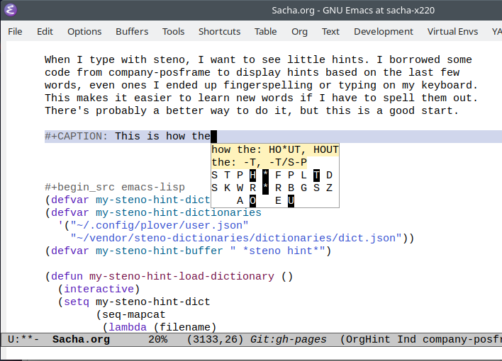

#+begin_src emacs-lisp :summary "Steno hint code" :exports both :results silent :tangle lisp/sacha-steno.el
(defvar sacha-steno-hint-dict nil)
(defvar sacha-steno-hint-dictionaries
	'("~/.config/plover/user.json"
		"~/vendor/steno-dictionaries/dictionaries/dict.json"))
(defvar sacha-steno-hint-buffer " *steno hint*")

;;;###autoload
(defun sacha-steno-hint-load-dictionary ()
	(interactive)
	(setq sacha-steno-hint-dict
				(seq-mapcat
				 (lambda (filename)
					 (with-temp-buffer
						 (insert-file-contents filename)
						 (goto-char (point-min))
						 (json-parse-buffer :object-type 'alist)))
				 sacha-steno-hint-dictionaries)))

;;;###autoload
(defun sacha-steno-hint-lookup (search)
	(let ((search-list (list search (downcase search))))
		(seq-group-by
		 'cdr
		 (seq-filter
			(lambda (entry)
				(member (cdr entry) search-list))
			sacha-steno-hint-dict))))

;;;###autoload
(defun sacha-steno-hint-find (&optional buffer)
	"Return a steno hint for the last 1-4 words, if any."
	(setq buffer (or buffer (current-buffer)))
	(when (buffer-live-p buffer)
		(with-current-buffer buffer
			(let ((pos (point)) result hint)
				(save-excursion
					(dotimes (i 4)
						(backward-word)
						(setq result
									(cons
									 (sacha-steno-hint-lookup
										(string-trim (buffer-substring-no-properties (point) pos)))
									 result)))
					(delq nil result))))))

(defvar sacha-steno-hint-display-functions '(sacha-steno-hint-show-posframe))

;;;###autoload
(defun sacha-steno-hint-show-posframe (result &optional command)
	(if (and result (or (null command)
											(member command '(self-insert-command org-self-insert-command))))
			(progn
				(with-current-buffer (get-buffer-create sacha-steno-hint-buffer)
					(erase-buffer)
					(insert
					 (propertize
						(mapconcat
						 (lambda (entries)
							 (mapconcat
								(lambda (entry)
									(concat
									 (car entry) ": "
									 (mapconcat (lambda (stroke)
																(symbol-name (car stroke)))
															(cdr entry) ", ")))
								entries "\n"))
						 result "\n")
						'face 'lispy-face-hint)
					 "\n"
					 (mapconcat 'sacha-steno-hint-propertized-layout
											 (split-string (symbol-name (car (cadar (car result)))) "/")
											 "\n\n")))
				(posframe-show sacha-steno-hint-buffer :position (point) :border-width 1))
		(posframe-hide sacha-steno-hint-buffer)))

(defvar sacha-steno-hint--timer nil)

;;;###autoload
(defun sacha-steno-hint-recent-when-idle ()
	(interactive)
	(when (timerp sacha-steno-hint--timer)
		(cancel-timer sacha-steno-hint--timer))
	(setq sacha-steno-hint--timer
				(run-with-idle-timer 0.1 nil #'sacha-steno-hint-recent (current-buffer) this-command)))

;;;###autoload
(defun sacha-steno-hint-recent (buffer command)
	(interactive)
	(setq sacha-steno-hint--timer nil)
	(run-hook-with-args 'sacha-steno-hint-display-functions (sacha-steno-hint-find buffer) command))

;;;###autoload
(defun sacha-steno-split-keys (s)
	"Return a list of individual steno keys for RTFCRE."
	(when (string-match "\\([STKPWHR]*\\)\\(-\\|\\([AOEU*]+\\)\\)\\([FRPBLGTSDZ]*\\)" s)
		(append
		 (mapcar (lambda (ch) (format "%s-" (char-to-string ch))) (match-string 1 s))
		 (mapcar 'char-to-string (match-string 3 s))
		 (mapcar (lambda (ch) (format "-%s" (char-to-string ch))) (match-string 4 s)))))
;; (sacha-steno-split-keys "HR-")
;; (sacha-steno-split-keys "HRAEUT")
;; (sacha-steno-split-keys "HR*T")

;;;###autoload
(defun sacha-steno-hint-propertized-layout (s)
	(let ((keys (sacha-steno-split-keys s))
				(steno-layout "STPH*FPLTD\nSKWR*RBGSZ\n  AO EU")
				after-mid)
		(mapconcat
		 (lambda (ch)
			 (setq ch (char-to-string ch))
			 (pcase ch
				 ("\n" (setq after-mid nil) "\n")
				 (" " "  ")
				 (_
					(let (found)
						(if (string-match "[AEOU*]" ch)
								(setq after-mid t
											found (member ch keys))
							(setq found
										(member
										 (if after-mid (concat "-" ch)
											 (concat ch "-"))
										 keys)))
						(if found
							(concat (propertize ch 'face '(:inverse-video t)) " ")
							(concat ch " "))))))
		 steno-layout
		 "")))

;;;###autoload
(defun sacha-steno-hint-window-change ()
	(when (posframe-workable-p)
		(unless (string= (buffer-name)
										 sacha-steno-hint-buffer)
			(when (and sacha-steno-hint-buffer
								 (get-buffer sacha-steno-hint-buffer))
				(posframe-hide sacha-steno-hint-buffer)))))

;;;###autoload
(define-minor-mode sacha-steno-hint-minor-mode
	"Show hints for recent words."
	:init-value nil
	:lighter "Hint"
	(if sacha-steno-hint-minor-mode
			(progn
				(unless sacha-steno-hint-dict (sacha-steno-hint-load-dictionary))
				(add-hook 'post-command-hook #'sacha-steno-hint-recent-when-idle nil t)
				(add-hook 'window-configuration-change-hook #'sacha-steno-hint-window-change))

		(remove-hook 'post-command-hook #'sacha-steno-hint-recent-when-idle t)
		(remove-hook 'window-configuration-change-hook #'sacha-steno-hint-window-change)
		(when (timerp sacha-steno-hint--timer)
			(cancel-timer sacha-steno-hint--timer))
		(when (and sacha-steno-hint-buffer
							 (get-buffer sacha-steno-hint-buffer))
			(posframe-delete sacha-steno-hint-buffer))))
#+end_src

*** Running Plover drills from Emacs
:PROPERTIES:
:CUSTOM_ID: running-plover-drills-from-emacs
:END:

I'm learning stenography because I deal with a lot of text, and it
seems interesting. I'd like to someday be able to live-caption
EmacsConf, meetups, and other technical things. I've got a lot of
muscle memory to pick up, which means drills drills drills drills.

#+begin_src emacs-lisp :tangle lisp/sacha-plover.el
(defvar sacha-plover-drills
  (append
   (mapcar (lambda (desc)
             (cons desc (concat "https://joshuagrams.github.io/steno-jig/learn-keyboard.html?drill=" (url-encode-url (replace-regexp-in-string "\\+" "%2B" desc)))))
           '("Left hand, bottom row"
             "Right hand, bottom row"
             "Left hand, top row"
             "Right hand, top row"
             "Right hand, full bottom row"
             "Right hand, full top row"
             "Vowels"
             "Left hand"
             "Right hand"
             "All keys"
             "Left + Right"
             "Left + Vowel"
             "Vowel + Right"
             "Left + Vowel + Right"
             "Columns: D, B, L, -N"
             "x"))
   (mapcar (lambda (desc)
             (cons desc (concat "https://joshuagrams.github.io/steno-jig/learn-plover.html?hints=yes&type=randomly&timeLimit=2&drill=" (url-encode-url (replace-regexp-in-string "\\+" "%2B" desc)))))
           '("One Syllable Words" "Consonant Clusters" "Where's the TRUFT?" "Dropping Unstressed Vowels" "Inversion" "The Fifth Vowel Key" "Long Vowel Chords" "Diphthong Chords" "Vowel Disambiguator Chords" "The Missing Keys" "The Remaining Missing Letters" "Review Through Missing Letters" "Digraphs" "Review Through Digraphs" "Common Compound Clusters" "Review Through Common Compound Clusters" "Common Briefs 1-20" "Common Briefs 21-40" "Common Briefs 41-60" "Common Briefs 61-80" "Common Briefs 81-100"))))

(defvar sacha-plover-drill-history nil "Previous drills")
(defvar sacha-plover-drill-file "~/proj/plover-notes/README.org")

;;;###autoload
(defun sacha-plover-stenojig-custom-drill (words)
  (interactive "MWords: ")
  (plover-websocket-resume-plover)
  (unwind-protect
    (progn
    (browse-url-chrome (concat "file:///home/sacha/vendor/steno-jig/from-url.html?go=true&type=randomly&timeLimit=2&name=test&hints=true&drillItems=" (url-encode-url words)))
    (read-string "Ignore this: "))
  (plover-websocket-suspend-plover)))

;;;###autoload
(defun sacha-plover-drill (drill)
  "Run a single Plover keyboard drill and capture stats in an Org table."
  (interactive (list (consult--read sacha-plover-drills :prompt "Drill: " :sort nil
                                    :history sacha-plover-drill-history
                                    :default (car sacha-plover-drill-history))))
  (unless (string= (downcase (string-trim drill)) "x")
    (let ((url (assoc-default drill sacha-plover-drills)))
      (plover-websocket-resume-plover)
      (when (string-match "learn-keyboard" url)
        (plover-websocket-send :translation "{PLOVER:TOGGLE_DICT:-main.json,-user.json}"))
      (switch-to-buffer (find-file sacha-plover-drill-file))
      (goto-char (point-min))
      (re-search-forward "#\\+NAME: drill\n")
      (insert (format "| %s | %s |  |\n"
                      (org-link-make-string url drill)
                      (format-time-string "[%Y-%m-%d %a %H:%M]")))
      (backward-char 3)
      (browse-url url)
      (read-string "Ignore this: ")
      (when (string-match "learn-keyboard" url)
        (plover-websocket-send :translation "{PLOVER:TOGGLE_DICT:+main.json,+user.json}"))
      (insert (read-string (format "Time (%s): " (string-join (reverse (sacha-plover-recent-stats drill)) ", "))))
      (end-of-line)
      (forward-char 1)
      t)))

;;;###autoload
(defun sacha-plover-recent-stats (drill-name)
  (mapcar
   (lambda (o) (substring-no-properties (elt o 2)))
   (seq-take
    (sort (seq-filter (lambda (o) (string-match (regexp-quote drill-name) (car o)))
	                    (org-with-wide-buffer
                       (save-excursion
                         (goto-char (point-min))
                         (if (re-search-forward "#\\+NAME: drill\n" nil t)
														(org-table-to-lisp)))))
          (lambda (a b) (string< (string-trim (elt b 1))
                                 (string-trim (elt a 1)))))
    3)))

;;;###autoload
 (defun sacha-plover-drilling-time ()
   "Keep drilling Plover.
Restore main dictionary and turn off Plover when done."
   (interactive)
   (quantified-track "Steno")
   (call-process "wmctrl" nil 0 nil "-i" "-a" (number-to-string (sacha-wmctl-get-id "emacs")))
   (while (sacha-plover-drill (consult--read sacha-plover-drills :prompt "Drill: " :sort nil
                                          :history 'sacha-plover-drill-history
                                          :default (car sacha-plover-drill-history)))))
  #+end_src
*** Making it easier to execute commands
:PROPERTIES:
:CUSTOM_ID: making-it-easier-to-execute-commands
:END:

#+begin_src emacs-lisp :lexical t
(setq enable-recursive-minibuffers t)
#+end_src

#+begin_src emacs-lisp :lexical t :tangle lisp/sacha-org.el
;;;###autoload
(defun sacha-org-replace-heading (new-text)
  (interactive (list (read-string (concat (org-get-heading t t t t) ": "))))
  (org-back-to-heading)
  (when (looking-at org-complex-heading-regexp)
    (replace-match new-text t t nil 4)))

#+end_src

#+begin_src emacs-lisp :lexical t :tangle lisp/sacha-plover.el
;;;###autoload
(defun sacha-plover-process-inbox-entries ()
  (interactive)
  (catch 'exit
    (while t
      (plover-websocket-send :stroke '["K-" "P-" "A-" "*"])
      (sacha-read-command-string
       (lambda () (concat (org-get-heading t t t t) ": "))
       '(("replace and post"
          (lambda () (interactive)
            (call-interactively 'sacha-org-replace-heading)
            (call-interactively 'sacha-org-mark-done-and-add-to-journal)
            (org-forward-heading-same-level 1)))
         ("edit" sacha-org-replace-heading)
         ("post" sacha-org-mark-done-and-add-to-journal)
         ("refile" org-refile)
         ("to do" org-todo)
         ("next" org-forward-heading-same-level)
         ("open link" (lambda () (interactive)
                        (save-excursion
                          (when (re-search-forward org-link-any-re nil t)
                            (goto-char (match-beginning 0))
                            (org-open-at-point)))))
         ("yesterday" (lambda ()  (interactive)
                        (save-excursion
                          (re-search-forward org-element--timestamp-regexp)
                          (goto-char (match-beginning 0))
                          (org-timestamp-down-day))))
         ("previous" org-backward-heading-same-level)
         ("new journal" sacha-journal-post)
         ("practice" (lambda () (interactive) (quantified-track "steno") (browse-url "https://didoesdigital.com/typey-type/progress")))
         ("lowercase" downcase-word)
         ("capitalize" capitalize-dwim)
         ("clean" sacha-org-clean-up-inbox)
         ("replace heading" sacha-org-replace-heading)
         ("cut subtree" org-cut-subtree)
         ("export subtree to 11ty" (lambda () (interactive) (org-11ty-export-to-11ty t t)))
         ("exit" (throw 'exit nil)))
       (lambda (input)
         (sacha-org-replace-heading input)
         (call-interactively 'sacha-org-mark-done-and-add-to-journal)
         (org-forward-heading-same-level 1))
       t))))

(defmacro sacha-read-command-string (prompt commands default-fn &optional include-commands)
  (declare (debug t))
  `(let* ((command
           (consult--read
            (append ,commands
                    (if ,include-commands
                        (let (res)
                          (mapatoms
                           (lambda (o)
                             (when (commandp o) (push (symbol-name o) res))))
                          res)))
            :prompt (cond
                     ((functionp ,prompt) (funcall ,prompt))
                     ((stringp ,prompt) ,prompt)
                     (t "Command: "))
            :category 'function
            :sort nil))
          (entry (assoc-default command ,commands)))
     (cond
      ((and entry (listp (car entry)))
       (if (functionp (car entry))
           (funcall (car entry))
         (eval (car entry) t)))
      (entry (call-interactively (car entry)))
      ((commandp (intern command)) (call-interactively (intern command)))
      ((functionp ,default-fn) (funcall ,default-fn command)))))

;;;###autoload
(defun sacha-read-commands ()
  (interactive)
  (cond
   ((derived-mode-p 'org-mode)
    (sacha-plover-process-inbox-entries))
   ((derived-mode-p 'subed-mode)
    (sacha-plover/edit-subtitles))))

#+end_src
*** Suggesting briefs
:PROPERTIES:
:CUSTOM_ID: suggesting-briefs
:END:

Only checks one dictionary for now, but probably good enough

#+begin_src emacs-lisp :tangle lisp/sacha-plover.el
;;;###autoload
(defun sacha-plover-briefpedia (translation)
  (interactive "MTranslation: ")
  (with-current-buffer (url-retrieve-synchronously (concat "http://briefpedia.com/AjaxTables3.php?search=" (url-encode-url translation)))
    (goto-char (point-min))
    (re-search-forward "^$")
    (while (re-search-forward "</?\\(th\\)[ >]" nil t)
			(replace-match "td" nil nil nil 1))
		(goto-char (point-min))
    (re-search-forward "^$")
    (save-excursion
      (insert "<div>")
      (goto-char (point-max)) (insert "</div>"))
    (let* ((data (xml-parse-region (point-min) (point-max)))
           (entries (mapcar (lambda (o) (string-trim (dom-text o))) (dom-by-tag (dom-by-id data "divEnglishTable") 'a)))
           (conflicts (seq-group-by 'car
                                    (mapcar (lambda (row) (mapcar (lambda (cell) (string-trim (dom-texts cell))) (dom-by-tag row 'td)))
                                            (cdr (dom-by-tag (dom-by-id data "divCrossTable") 'tr)))))
					 (result
						(mapcar (lambda (entry) (cons entry (mapcar 'cadr (assoc-default entry conflicts)))) entries)))
			(when (called-interactively-p 'any)
				(message "%s"
								 (mapconcat (lambda (entry)
															(concat (car entry)
																			(if (cdr entry)
																					(concat " ("
																									(string-join (cdr entry) ", ")
																									")")
																				"")))
														result
														"; ")))
			result)))

;;;###autoload
(defun sacha-plover-read-outline-for-brief (base-prompt)
  (let* ((prompt (or base-prompt "Outline: "))
         new-brief
         (brief (with-plover-plain (read-string prompt)))
         (sacha-conflicts (sacha-plover-check-for-conflict brief)))
    (while sacha-conflicts
      (setq prompt (format "%s%s conflicts %s (alt: %s): "
                           (if base-prompt (concat base-prompt "\n") "")
                           brief (car sacha-conflicts) (string-join (cdr sacha-conflicts) ", ")))
      (setq new-brief (with-plover-plain (read-string prompt)))
      (if (string= new-brief "")
          (setq sacha-conflicts nil)
        (setq brief new-brief)
        (setq sacha-conflicts (sacha-plover-check-for-conflict brief))))
    brief))

;;;###autoload
(defun sacha-plover-brief-with-check (translation)
  (interactive "MTranslation: ")
  (setq translation (string-trim translation))
  (let ((brief (sacha-plover-read-outline-for-brief (format "Outline for %s: " translation))))
    (when brief
      (kill-new (format "| %s | %s |" brief translation))
      (plover-websocket-add-translation brief translation))))

;;;###autoload
(defun sacha-plover-briefpedia-suggest (translation)
  (interactive "MTranslation: ")
  (setq translation (string-trim translation))
  (let* ((entries (sacha-plover-briefpedia translation))
         (current (sacha-plover-search-dictionary-for-translation translation))
         (brief
          (sacha-plover-read-outline-for-brief
           (concat
            (if current (format "Current: %s\n" (mapconcat 'car current "; ")) "")
            (if entries
                (concat (mapconcat
                         (lambda (entry)
                           (let ((dict-conflict (sacha-plover-check-for-conflict (car entry))))
                             (cond
                              ((and (cdr entry) dict-conflict)
                               (format "%s - dict conflict: %s (%s)\nbrief conflict: %s"
                                       (car entry)
                                       (car dict-conflict)
                                       (string-join (cdr dict-conflict) "; ")
                                       (string-join (cdr entry) "; ")))
                              ((cdr entry)
                               (format "%s - brief conflict: %s"
                                       (car entry)
                                       (string-join (cdr entry) "; ")))
                              (t (car entry)))))
                         entries
                         "\n")
                        "\nOutline: ")
              "No suggestions. Outline: ")))))
    (when brief
      (kill-new (format "| %s | %s |" brief translation))
      (plover-websocket-add-translation brief translation))))

;;;###autoload
(defun sacha-plover-check-for-conflict (outline)
  (let* ((case-fold-search nil)
         (translation (cdar (sacha-plover-search-dictionary-for-strokes (concat "^" outline "$"))))
         (alternatives (and translation (sacha-plover-search-dictionary-for-translation translation))))
    (if translation (cons translation (mapcar 'car alternatives)))))
#+end_src
*** Practising within Emacs
:PROPERTIES:
:CUSTOM_ID: practising-within-emacs
:END:
   Main function: =M-x sacha-practise-steno=, called in an Org table of =| translation | outline |=

 #+begin_src emacs-lisp :lexical t :tangle lisp/sacha-steno.el
;;;###autoload
(defun sacha-practise-steno-interleave (base item)
  "Interleave BASE words with item."
  (cons item
        (-interleave base (make-list (length base) item))))
;; Copied from elfeed--shuffle
;;;###autoload
(defun sacha-practise-steno-shuffle (seq)
  "Destructively shuffle SEQ."
  (let ((n (length seq)))
    (prog1 seq
      (dotimes (i n)
        (cl-rotatef (elt seq i) (elt seq (+ i (cl-random (- n i)))))))))
;;;###autoload
(defun sacha-practise-steno-repeat (seq times)
  (funcall 'append (make-list times seq)))
(defface sacha-practise-steno-correct '((t :foreground "green")) "Correct.")
(defface sacha-practise-steno-wrong '((t :foreground "red")) "Wrong.")
(defface sacha-practise-steno-highlight '((t :background "white" :foreground "black")) "Focus.")
(defface sacha-practise-steno-base '((t :height 150)) "Base.")
(defvar sacha-practise-steno-items nil)
(defvar sacha-practise-steno-index 0)
(defvar sacha-practise-steno-buffer-name "*Steno practice*")
(defvar sacha-practise-steno-start-of-input nil)
(defvar sacha-practise-steno-current-overlay nil)
(defvar sacha-practise-steno-previous-overlay nil)
(defvar sacha-practise-steno-highlight-overlay nil)
(defvar sacha-practise-steno-stroke-buffer nil)
(defvar sacha-practise-steno-for-review nil)

;; From https://stackoverflow.com/questions/1249497/command-to-center-screen-horizontally-around-cursor-on-emacs
;;;###autoload
(defun sacha-horizontal-recenter ()
  "Make the point horizontally centered in the window."
  (interactive)
  (let ((mid (/ (window-width) 2))
        (pixel-pos (car (window-absolute-pixel-position)))
        (pixel-mid (/ (window-pixel-width) 2))
        (line-len (save-excursion (end-of-line) (current-column)))
        (cur (current-column)))
    (while (< pixel-mid pixel-pos)
      (set-window-hscroll (selected-window)
                          (1+ (window-hscroll)))
      (setq pixel-pos (car (window-absolute-pixel-position))))))

;;;###autoload
(defun sacha-practise-steno--handle-correct ()
  (if sacha-practise-steno-previous-overlay
      (move-overlay sacha-practise-steno-previous-overlay (overlay-start sacha-practise-steno-previous-overlay)
                    (+ (overlay-end sacha-practise-steno-previous-overlay) (match-end 0)))
    (setq sacha-practise-steno-previous-overlay
          (make-overlay (overlay-end sacha-practise-steno-previous-overlay)
                        (+ (overlay-end sacha-practise-steno-previous-overlay) (match-end 0))))
    (overlay-put sacha-practise-steno-previous-overlay 'evaporate t)
    (overlay-put sacha-practise-steno-previous-overlay 'face 'sacha-practise-steno-correct)))

;;;###autoload
(defun sacha-practise-steno--mark-incorrect-and-fixed ()
  (let ((ov (make-overlay (overlay-end sacha-practise-steno-previous-overlay)
                          (+ (overlay-end sacha-practise-steno-previous-overlay) (match-beginning 0)))))
    (overlay-put ov 'face 'sacha-practise-steno-wrong)
    (overlay-put ov 'evaporate t))
  ;; make a new overlay
  (setq sacha-practise-steno-previous-overlay (copy-overlay sacha-practise-steno-previous-overlay))
  (move-overlay sacha-practise-steno-previous-overlay
                (+ (overlay-end sacha-practise-steno-previous-overlay) (match-beginning 0))
                (+ (overlay-end sacha-practise-steno-previous-overlay) (match-end 0)))
  (setq sacha-practise-steno-for-review (append sacha-practise-steno-for-review (list (elt sacha-practise-steno-items sacha-practise-steno-index))))
  ;; highlight the sample as incorrect, too
  (let ((incorrect-sample (copy-overlay sacha-practise-steno-highlight-overlay)))
    (overlay-put incorrect-sample 'face 'sacha-practise-steno-wrong)
    (save-excursion
      (goto-char (overlay-start sacha-practise-steno-highlight-overlay))
      (insert (make-string
               (+
                (if (bolp) 1 0)
                (match-beginning 0))
               ?\ )))))

;;;###autoload
(defun sacha-practise-steno--move-to-next-item ()
  (setq sacha-practise-steno-stroke-buffer nil)
  (setq sacha-practise-steno-index (1+ sacha-practise-steno-index))
  (move-overlay sacha-practise-steno-current-overlay (overlay-end sacha-practise-steno-previous-overlay) (point))
  (if (elt sacha-practise-steno-items sacha-practise-steno-index)
      (move-overlay sacha-practise-steno-highlight-overlay
                    (1+ (overlay-end sacha-practise-steno-highlight-overlay))
                    (+ (overlay-end sacha-practise-steno-highlight-overlay)
                       1 (length (car (elt sacha-practise-steno-items sacha-practise-steno-index)))))
    (when sacha-practise-steno-for-review
      (goto-char (point-max))
      (kill-new (mapconcat 'car sacha-practise-steno-for-review " "))
      (insert "\nFor review: " (mapconcat 'car sacha-practise-steno-for-review " ")))))

;;;###autoload
(defun sacha-practise-steno--handle-completed-item ()
  ;; extend the feedback overlay to the current point
  (if (= (match-beginning 0) 0)
      (sacha-practise-steno--handle-correct)
    ;; mark incorrect area
    (sacha-practise-steno--mark-incorrect-and-fixed))
  (sacha-practise-steno--move-to-next-item))

;;;###autoload
(defun sacha-practise-steno-check (&rest _)
  (interactive)
  (let* ((sample (car (elt sacha-practise-steno-items sacha-practise-steno-index)))
         (input (and (< (overlay-end sacha-practise-steno-previous-overlay) (point))
                     (buffer-substring-no-properties (overlay-end sacha-practise-steno-previous-overlay) (point)))))
    (when (and sample input)
      (if (string-match (concat " *" (regexp-quote sample) " *") input)
          (sacha-practise-steno--handle-completed-item)
        ;; still in progress
        (move-overlay sacha-practise-steno-current-overlay
                      (overlay-start sacha-practise-steno-current-overlay)
                      (1+ (point))))
      (sacha-horizontal-recenter))))

;;;###autoload
(defun sacha-practise-steno-store-strokes (payload)
  (when (and (plist-get payload :stroked) (string= (buffer-name) sacha-practise-steno-buffer-name))
    (let ((current-item (elt sacha-practise-steno-items sacha-practise-steno-index))
          (rtfcre (plist-get (plist-get payload :stroked) :rtfcre)))
      (save-excursion
        (goto-char (point-max))
        (insert (if (bolp) "" " ") rtfcre))
      (when (and (cadr current-item)
               (> (- (overlay-end sacha-practise-steno-current-overlay)
                     (overlay-start sacha-practise-steno-current-overlay))
                  (length (car current-item))))
        (setq sacha-practise-steno-stroke-buffer (append sacha-practise-steno-stroke-buffer (list rtfcre)))
        (momentary-string-display (format " (%s -> %s)"
                                          (string-join sacha-practise-steno-stroke-buffer " ")
                                          (cadr current-item))
                                  (point)
                                  ?\0
                                  "")))))

;;;###autoload
(defun sacha-practise-steno (items)
  "Display ITEMS for practicing.
ITEMS should be a list like ((word) (word) (word))."
  (interactive (list (let ((table (org-table-to-lisp)))
                       (if table
                           (if current-prefix-arg
                               (subseq table
                                       (1- (org-table-current-line))
                                       (min (length table) (+ (org-table-current-line) current-prefix-arg -1)))
                             table)
                         sacha-practise-steno-items))))
  (with-current-buffer (get-buffer-create sacha-practise-steno-buffer-name)
    (erase-buffer)
    (insert "\n" (mapconcat 'car items " ") "\n")
    (save-excursion (insert "\n\n"))
    (toggle-truncate-lines 1)
    (setq sacha-practise-steno-items items
          sacha-practise-steno-index 0
          sacha-practise-steno-start-of-input (point)
          sacha-practise-steno-for-review nil
          sacha-practise-steno-current-overlay (make-overlay (point) (1+ (point)))
          sacha-practise-steno-previous-overlay (make-overlay (point) (point))
          sacha-practise-steno-stroke-buffer nil
          sacha-practise-steno-highlight-overlay (make-overlay (1+ (point-min)) (+ 1 (point-min) (length (car (car items))))))
    (buffer-face-set "sacha-practise-steno-base")
    (overlay-put sacha-practise-steno-previous-overlay 'face 'sacha-practise-steno-correct)
    (overlay-put sacha-practise-steno-previous-overlay 'evaporate t)
    (overlay-put sacha-practise-steno-highlight-overlay 'face 'sacha-practise-steno-highlight)
    (overlay-put sacha-practise-steno-highlight-overlay 'evaporate t)
    (overlay-put sacha-practise-steno-current-overlay 'modification-hooks '(sacha-practise-steno-check))
    (overlay-put sacha-practise-steno-current-overlay 'insert-in-front-hooks '(sacha-practise-steno-check))
    (overlay-put sacha-practise-steno-current-overlay 'face 'sacha-practise-steno-wrong)
    (overlay-put sacha-practise-steno-current-overlay 'evaporate t)
    ;; (add-hook 'after-change-functions 'sacha-practise-steno-check nil t)
    (add-hook 'plover-websocket-on-message-payload-functions 'sacha-practise-steno-store-strokes)
    (switch-to-buffer (current-buffer))))

;;;###autoload
(defun sacha-practise-steno-word-list (words)
  (interactive (list (mapcar 'list (split-string (read-string "Words: ")))))
  (sacha-practise-steno words))


;; (call-interactively 'sacha-practise-steno)
 #+end_src

 #+RESULTS:
 :results:
 sacha-practise-steno-show
 :end:

*** Editing subtitles
:PROPERTIES:
:CUSTOM_ID: editing-subtitles
:END:

#+begin_src emacs-lisp :tangle lisp/sacha-subed.el
;;;###autoload
(defun sacha-subed-subtitle-set-text (text)
  (interactive "MNew text: ")
  (subed-jump-to-subtitle-text)
  (delete-region (point) (or (subed-jump-to-subtitle-end) (point)))
  (insert text))

;;;###autoload
(defun sacha-plover/edit-find-target (input)
  (or (looking-at (concat "\\b" (regexp-quote input) "\\b"))
      (re-search-forward (concat "\\b" (regexp-quote input) "\\b")
                         nil t)))
;;;###autoload
(defun sacha-plover/edit-subtitles ()
  (interactive)
  (catch 'exit
    (while t
      (sacha-read-command-string
       "Command: "
       '(("toggle" subed-mpv-toggle-pause)
         ("jump" (lambda () (interactive) (subed-mpv-jump-to-current-subtitle)))
         ("split [text before split]" subed-split-subtitle)
         ("center" recenter-top-bottom)
         (" previous" (lambda () (interactive) (subed-merge-with-previous) (fill-paragraph)))
         ("merge next" (lambda () (interactive) (subed-merge-with-next) (fill-paragraph)))
         ("slow" (lambda () (interactive) (subed-mpv-playback-speed 0.5)))
         ("fast" (lambda () (interactive) (subed-mpv-playback-speed 2)))
         ("scroll" scroll-up-command)
         ("fill" fill-paragraph)
         ("next [text]" search-forward)
         ("replace <text>")
         ("previous [text]" search-backward)
         ("cap [text]" capitalize-word)
         ("delete [text]" kill-word)
         (", [text]" (lambda () (interactive) (insert ",")))
         ("end [text] - adds period and capitalizes next word" (lambda () (interactive) (insert ".") (capitalize-word 1)))
         ("oops" 'undo)
         ("exit" (throw 'exit nil)))
       (lambda (input)
         (cond
          ((string-match "^split \\(.+\\) *$" input)
           (when (sacha-plover/edit-find-target (match-string 1 input))
             (goto-char (match-end 0))
             (subed-split-subtitle)
             (fill-paragraph)))
          ((string-match "^delete \\(.+\\) *$" input)
           (when (sacha-plover/edit-find-target (match-string 1 input))
             (replace-match "")))
          ((string-match "^, \\(.+\\) *$" input)
           (when (sacha-plover/edit-find-target (match-string 1 input))
             (goto-char (match-end 0))
             (insert ",")))
          ((string-match "^end \\(.+\\) *$" input)
           (when (sacha-plover/edit-find-target (match-string 1 input))
             (goto-char (match-end 0))
             (insert ".")
             (unless (save-excursion (subed-jump-to-subtitle-end))
               (subed-forward-subtitle-text))
             (capitalize-word 1)))
          ((string-match "^zap \\(.+\\)$" input)
           (delete-region (point)
                          (sacha-plover/edit-find-target (match-string 1 input))))
          ((string-match "^replace \\(.+\\)$" input)
           (kill-word 1)
           (insert (match-string 1 input)))
          ((string-match "^cap \\(.+\\) *$" input)
           (when (sacha-plover/edit-find-target (match-string 1 input))
             (replace-match (capitalize (match-string 0)) t t)))
          ((string-match "^... \\(.+\\) *$" input)
           (when (sacha-plover/edit-find-target (match-string 1 input))
             (insert "...")))
          ((string-match "^next \\(.+\\) *$" input)
           (sacha-plover/edit-find-target (match-string 1 input)))
          ((string-match "^previous \\(.+\\) *$" input)
           (re-search-backward (concat "\\b" (regexp-quote (match-string 1 input)) "\\b") nil t)
           (goto-char (match-end 0)))
          (t (re-search-forward (concat "\\b" (regexp-quote input) "\\b")))
          ;; (t (sacha-subed-subtitle-set-text input))
          ))
       nil))))
#+end_src

*** Using inotify to add Plover Clippy suggestions into Emacs
    :PROPERTIES:
    :EXPORT_DATE: 2021-06-18
    :EXPORT_ELEVENTY_PERMALINK: /blog/2021/06/using-inotify-to-add-plover-clippy-suggestions-into-emacs/
    :EXPORT_ELEVENTY_FILE_NAME: blog/2021/06/using-inotify-to-add-plover-clippy-suggestions-into-emacs/
    :CUSTOM_ID: plover_clippy_buffer
    :END:

Update 2021-06-19: Changed to a vertical layout, added extra notes, simplified

I don't have a lot of screen space on my laptop, so I don't usually
have the [[https://github.com/openstenoproject/plover][Plover]] suggestion window open as I type. I came up with a
[[https://github.com/sachac/plover-sacha-plugin/blob/main/plover_sacha_plugin/commands.py][Plover plugin]] to let me flash the last [[https://github.com/tckmn/plover_clippy][Plover Clippy]] suggestion as a
temporary notification. It went by too quickly, though, so I wrote
something that uses inotify to monitor the clippy.txt log and put it
an Emacs buffer instead. It results in text like this:

#+begin_example
Clippy
KHREUP PEU
added
ATD
#+end_example

#+begin_src emacs-lisp :tangle lisp/sacha-plover.el
(defvar sacha-clippy-recent-suggestions nil "Recent suggestions, limited by `sacha-clippy-recent-suggestions-limit`.")
(defvar sacha-clippy-recent-suggestions-limit nil "If non-nil, keep this many suggestions.")
(defvar sacha-clippy-extra-notes nil "Extra notes to add at the end.")
;;;###autoload
(defun sacha-clippy-last ()
  (let ((value (string-trim (shell-command-to-string "tail -1 ~/.config/plover/clippy.txt | cut -c 23-"))))
    (when (string-match "^\\(.*?\\)[ \t]+|| .*? -> \\(.+\\)" value)
      (cons (match-string 1 value) (match-string 2 value)))))

;;;###autoload
(defun sacha-clippy-show (&rest _)
  (interactive)
  (with-current-buffer (get-buffer-create "*Clippy*")
    (let ((last (sacha-clippy-last)))
      (if sacha-clippy-recent-suggestions-limit
          (progn
            (unless (equal last (car sacha-clippy-recent-suggestions))
              (setq sacha-clippy-recent-suggestions (seq-take (cons last sacha-clippy-recent-suggestions) sacha-clippy-recent-suggestions-limit)))
            (erase-buffer)
            (insert (mapconcat (lambda (o) (format "| %s | %s |\n"  (car o) (cdr o))) sacha-clippy-recent-suggestions "")))
        (unless (equal last (car sacha-clippy-recent-suggestions))
          (setq sacha-clippy-recent-suggestions (cons last sacha-clippy-recent-suggestions))
          (goto-char (point-min))
          (insert (format "| %s | %s |\n" (car last) (cdr last))))))
    (when (get-buffer-window (current-buffer))
      (set-window-point (get-buffer-window (current-buffer)) (point-min)))))

;;;###autoload
(defun sacha-insert-symbol (symbol-name)
  (interactive (list
                (let ((orig-buffer (current-buffer)))
                  (completing-read
                   "Insert symbol: "
                   #'help--symbol-completion-table
                   (lambda (vv)
                     ;; In case the variable only exists in the buffer
                     ;; the command we switch back to that buffer before
                     ;; we examine the variable.
                     (with-current-buffer orig-buffer
                       (or (get vv 'variable-documentation)
                           (functionp vv)
                           (and (boundp vv) (not (keywordp vv))))))))))
  (insert symbol-name))

;;;###autoload
(defun sacha-insert-variable-value (symbol-name)
  (interactive (list
                (let ((orig-buffer (current-buffer)))
                  (completing-read
                   "Insert variable: "
                   #'help--symbol-completion-table
                   (lambda (vv)
                     ;; In case the variable only exists in the buffer
                     ;; the command we switch back to that buffer before
                     ;; we examine the variable.
                     (with-current-buffer orig-buffer
                       (or (get vv 'variable-documentation)
                           (and (boundp vv) (not (keywordp vv))))))))))
  (insert (symbol-value (intern symbol-name))))

;;;###autoload
(defun sacha-insert-function (symbol-name)
	"Insert function name."
  (interactive (list
                (completing-read
                 "Insert function: "
                 #'help--symbol-completion-table
                 'functionp)))
  (insert symbol-name))

(defvar sacha-clippy-monitor nil)
;;;###autoload
(defun sacha-clippy-toggle-monitor ()
  (interactive)
  (if (inotify-valid-p sacha-clippy-monitor)
      (progn
        (message "Turning off")
        (inotify-rm-watch sacha-clippy-monitor))
    (message "Turning on")
    (setq sacha-clippy-monitor
          (inotify-add-watch
           (expand-file-name "~/.config/plover/clippy.txt") 'modify
           #'sacha-clippy-show))))
#+end_src

*** Stenoing interface
:PROPERTIES:
:CUSTOM_ID: stenoing-interface
:END:

#+begin_src emacs-lisp :tangle lisp/sacha-plover.el

(defvar sacha-plover-quick-notes "~/proj/plover-notes/scratch.org")
(defvar sacha-plover-current-stroke-buffer "*Current stroke*")
;;;###autoload
(defun sacha-plover-add-note (string)
  (interactive "MNote: ")
  (with-current-buffer (find-file-noselect sacha-plover-quick-notes)
    (goto-char (point-min))
    (insert string)
    (unless (bolp) (insert "\n"))))

;;;###autoload
(defun sacha-plover-add-last-clippy-to-notes ()
  (interactive)
  (sacha-plover-add-note (format "| %s | %s |\n" (caar sacha-clippy-recent-suggestions) (cdar sacha-clippy-recent-suggestions))))

;;;###autoload
(defun sacha-plover-scroll-notes ()
  (interactive)
  (message "Hello")
  (when (get-buffer-window (get-file-buffer sacha-plover-quick-notes))
    (with-selected-window (get-buffer-window (get-file-buffer sacha-plover-quick-notes))
      (scroll-up))))

;;;###autoload
(defun sacha-plover-scroll-notes-down ()
  (interactive)
  (message "World")
  (when (get-buffer-window (get-file-buffer sacha-plover-quick-notes))
    (with-selected-window (get-buffer-window (get-file-buffer sacha-plover-quick-notes))
      (scroll-down))))

;;;###autoload
(defun sacha-plover-spectra-last-clippy ()
  (interactive)
  (browse-url (format "http://localhost:8081/?outline=%s&translation=%s"
                      (car (split-string (cdar sacha-clippy-recent-suggestions) ", "))
                      (caar sacha-clippy-recent-suggestions))))

;;;###autoload
(defun sacha-plover-layout-windows ()
  "Organize my windows."
  (interactive)
  (delete-other-windows)
  (when plover-websocket-stroke-buffer-name
    (with-selected-window (split-window-below -4)
      (switch-to-buffer plover-websocket-stroke-buffer-name)))
  (with-selected-window (split-window-right 100)
    (switch-to-buffer (get-buffer-create "*Clippy*"))
    (when sacha-plover-quick-notes
      (with-selected-window (split-window-below 10)
        (switch-to-buffer (find-file sacha-plover-quick-notes))))))

;;;###autoload
(defun sacha-plover-clear-stroke-log ()
  (interactive)
  (with-current-buffer (get-buffer-create plover-websocket-stroke-buffer-name)
    (erase-buffer)))

#+end_src

#+begin_src emacs-lisp
(setq plover-websocket-stroke-buffer-name "*Stroke log*")
#+end_src
*** Cheat sheets
    :PROPERTIES:
    :CREATED:  [2021-05-26 Wed 15:38]
    :CUSTOM_ID: cheat-sheets
    :END:

  #+begin_src emacs-lisp :tangle lisp/sacha-steno.el
;;;###autoload
(defun sacha-steno-quick-help ()
	(interactive)
	(with-selected-window
			(display-buffer-at-bottom
			 (find-file-noselect "~/proj/plover-notes/cheat-sheet.txt")'())
    ;; ... mark it as dedicated to prevent focus from being stolen
    (set-window-dedicated-p (selected-window) t)
    ;; ... and shrink it immediately.
    (fit-window-to-buffer)))

(defhydra sacha-hydra/cheatsheet/plover ()
  "SKHW- symbols -LTZ modifiers TWR- journal phrases
newparSKWRAURBGS bsPW-FP capKPA !space!capTK-LS cap!spaceKPA rmspcTK-FPS*
number: dupeD, revEU, 00/#OD, 00Z, $DZ, timeK- or -BG
`KH-FG  ^KR-RT ~T*LD <AEPBGT =QA*LS >A*EPBGT |PAO*EUP \\_R*UND
-H-N --TK-RB ,KW-BG ;SKWR*RBGS :capSTPH-FPLT :KL-N !SKHRAPL
?H-F /OI .nspP-P ...SKWR-RBGS 'A*E,AE \"KW-GS,KR-GS
(PREN,* [PWR-BGT,* {TPR-BGT,* @KWRAT $TK-PL *STA*R
\\SPWHRAERB \\&SP-PBD #HAERB percPERS +PHR*US
retro KA*PD cap last *UPD cap all HRO*ERD lowered #* star AFPS add space TK-FPS del space
next HRO*ER lower KPA*L cap all
mode SPH-: RL lower R reset T Title -FPLT _RBGS")

(defhydra sacha-hydra/cheatsheet/jade-plover-phrasing ()
  "S: SWR I, KPWR you, KWHR he, SKWHR she, TWH they, TWR we, KPWH it, STKPWHR nothing
M: OE don't (AOE really don't OEU don't really)
AU didn't, E doesn't, O can't, A or U really, AOEU don't even
E: PB know, P want, RPL remember, BL believe, FG forget, R are
BG can, BGD could, BGT can't, BLG like, BLGT like to, BLGTS likes to
BLT believe that, BS said, BT be the, BTS be said to, BTZ say to
D had, F have, FGT forgot, FLG feel like, FLGT felt like, FLT felt
FPLT must, FR ever, FRB wish, FRBT wish to, FS was, FT have to, FTS has to, FZ has, GT get, L will, LG love, PBD need, PBG think, PBL mean,
PLD mind, PLG imagine, PLT might
"
  )

(defhydra sacha-hydra/cheatsheet/emily-symbols ()
  "SKHW+ A (spc before) O (spc after) * (cap)
        v   E         U     EU
FG ws   Tab Backspace Del   Esc
RPBG    Up  Left      Right Down
FPBL    ↑   ←         →     ↓
FRPBG   PgU Home      End   PgD
blank   ''  {*!}      {*?}  spc
FPL     (   [         <     {
RBG     )   ]         >     }
'F *L +G &FBG \"FP #FRLG $RPBL percFRPB
,B -PL .R /RP :LG ;RB =PBLG @FRPBLG \\FB \\^RPG
_BG `P |PB ~FPBG
-S 2x -T 3x -ST 4x"
  )
(defhydra sacha-hydra/cheatsheet/emily-modifiers ()
  "-LTZ F (C-) R (S-) P(s-) B(M-)
Z is STKPW
AO makes SKWR binary 0-9
Symbols with *, AO variants
TR tab delete backspace esc
KPWR up left down right
KPWHR pgup end home pgdown
blank esc tab return spc
TPH ( < [ {
KWR ) > ] }
P `
H '
!HR \"PH #TKHR $KPWH percPWHR &SKP *T +K ,W -TP .R /WH :TK ;WR
=TKPW ?TPW @TKPWHR \\PR ^KPR |PW ~TPWR")
  #+end_src

  #+RESULTS:
  :results:
  sacha-hydra/cheatsheet/emily-modifiers/body
  :end:

*** Coding with Plover
:PROPERTIES:
:CUSTOM_ID: coding-with-plover
:END:

#+begin_src emacs-lisp :tangle lisp/sacha-plover.el
;;;###autoload
(defun sacha-plover-insert-defun ()
  "Prompt for parts of a function definition."
  (interactive)
  (insert "(defun ")
  (plover-websocket-send :translation "{MODE:LOWER}{MODE:SET_SPACE:-}")
  (insert (replace-regexp-in-string "-$" "" (read-string "Function name: ")))
  (insert " (")
  (plover-websocket-send :translation "{MODE:SET_SPACE: }")
  (let ((args (replace-regexp-in-string "\\<optional\\>" "&optional" (string-trim (read-string "Args: ")))))
    (insert args)
    (insert ")\n")
    (if (y-or-n-p "Interactive? ")
        (if (string= args "")
            (insert "(interactive)\n")
          (insert "(interactive (list))\n"))))
  (plover-websocket-send :translation "{MODE:RESET}{}{-|}")
  (insert (format "\"%s\"\n"
                  (replace-regexp-in-string "\"" "\\\"" (string-trim (read-string "Docstring: ")))))
  (save-excursion (insert ")") (lispy--normalize-1))
  (plover-websocket-send :translation "{MODE:LOWER}"))

;;;###autoload
(defun sacha-plover-insert-defvar ()
  (interactive)
  "Define a variable."
  (insert "(defvar ")
  (plover-websocket-send :translation "{MODE:LOWER}{MODE:SET_SPACE:-}")
  (insert (replace-regexp-in-string "-$" "" (read-string "Variable name: ")))
  (insert " ")
  (plover-websocket-send :translation "{MODE:RESET}{}{-|}")
  (insert (string-trim (read-string "Default value: ")))
  (insert (format " \"%s\")\n"
                  (replace-regexp-in-string "\"" "\\\"" (string-trim (read-string "Docstring: "))))))
#+end_src

#+begin_src emacs-lisp :tangle lisp/sacha-org.el
;;;###autoload
(defun sacha-org-edit-special-dwim ()
  (interactive)
  (cond
    ((org-src-edit-buffer-p) (org-edit-src-exit))
    ((org-in-src-block-p) (org-edit-special))
    ((derived-mode-p 'org-mode)
     (org-insert-structure-template "src emacs-lisp")
     (org-edit-special))))
;;;###autoload
(defun sacha-org-execute-special-dwim ()
  (interactive)
  (cond
    ((org-src-edit-buffer-p) (eval-buffer))
    ((org-in-src-block-p) (org-babel-execute-src-block))
    (t (eval-buffer))))
#+end_src

*** Measuring WPM
:PROPERTIES:
:CUSTOM_ID: measuring-wpm
:END:

#+begin_src emacs-lisp :eval no :tangle no
(use-package typing-speed :if sacha-laptop-p :load-path "~/elisp"
  :config (setq typing-speed-window 120))
#+end_src

*** Displaying frequency-sorted completions with stroke hints
:PROPERTIES:
:CUSTOM_ID: displaying-frequency-sorted-completions-with-stroke-hints
:END:

#+begin_src emacs-lisp :tangle lisp/sacha-steno.el
(defvar sacha-company-strokedict--grep-executable "grep")

;;;###autoload
(defun sacha-company-strokedict--candidates (prefix)
  "Fetches the candidates matching PREFIX."
  (mapcar (lambda (o)
            (let ((data (split-string o "\t")))
              (propertize (car data) 'meta (cadr data))))
          (split-string
           (shell-command-to-string (concat
                                     sacha-company-strokedict--grep-executable
                                     " -i "
                                     (shell-quote-argument (concat "^" prefix))
                                     " "
                                     "~/.config/plover/annotated.txt -m 10"))
           "\n")))

;;;###autoload
(defun sacha-company-strokedict--annotation (candidate)
  (let ((stroke (get-text-property 0 'meta candidate)))
    (if stroke
        (format " (%s)" stroke)
      "")))

;;;###autoload
(defun sacha-company-strokedict (command &optional arg &rest ignored)
  "`company-mode' backend for user-provided dictionaries. Dictionary files are lazy
loaded."
  (interactive (list 'interactive))
  (cl-case command
    (interactive     (company-begin-backend 'sacha-company-strokedict))
    (candidates      (sacha-company-strokedict--candidates arg))
    (prefix  (when-let ((prefix (company-grab-word))) (substring-no-properties prefix)))
    (annotation (sacha-company-strokedict--annotation arg))
    (sorted          t)
    (duplicates      t)
    (no-cache        t)))
#+end_src

This code added stroke annotations from the Typey Type dictionary to the frequency-sorted word list from https://github.com/hermitdave/FrequencyWords/blob/master/content/2018/en/en_full.txt.

#+begin_src python :tangle "/tmp/annotate_words.py" :eval no
import json

with open("/home/sacha/tmp/en_full.txt") as f:
    lines = f.readlines()
with open("/home/sacha/.config/plover/dictionaries/typey-type.json") as f:
    typey = json.load(f)
typey_inv = {v: k for k, v in typey.items()}
with open("/home/sacha/.config/plover/dictionaries/combined.json") as f:
    combined = json.load(f)
combined_inv = {}
for k, v in combined.items():
    if v in combined_inv:
        combined_inv[v] = combined_inv[v] + ', ' + k
    else:
        combined_inv[v] = k
with open("/home/sacha/.config/plover/annotated.txt", "w") as f:
    for line in lines:
        word = line.split()[0]
        if word in typey_inv:
            f.write("%s\t%s\n" % (word, typey_inv[word]))
        elif word in combined:
            f.write("%s\t%s\n" % (word, combined[word]))
        else:
            f.write("%s\n" % word)
#+end_src


** Key chords
:PROPERTIES:
:CUSTOM_ID: key-chord
:END:

I'm on a Dvorak keyboard, so these might not work
for you. Experimenting with this. =key-chord= lets
you define keyboard shortcuts that use ordinary
keys typed in quick succession. I haven't been
using this lately, though...

Some code from http://emacsredux.com/blog/2013/04/28/switch-to-previous-buffer/
#+BEGIN_SRC emacs-lisp :tangle lisp/sacha-emacs.el
;;;###autoload
  (defun sacha-key-chord-define (keymap keys command)
    "Define in KEYMAP, a key-chord of two keys in KEYS starting a COMMAND.
        \nKEYS can be a string or a vector of two elements. Currently only elements
        that corresponds to ascii codes in the range 32 to 126 can be used.
        \nCOMMAND can be an interactive function, a string, or nil.
        If COMMAND is nil, the key-chord is removed.

        MODIFICATION: Do not define the transposed key chord.
        "
    (if (/= 2 (length keys))
        (error "Key-chord keys must have two elements"))
    ;; Exotic chars in a string are >255 but define-key wants 128..255 for those
    (let ((key1 (logand 255 (aref keys 0)))
          (key2 (logand 255 (aref keys 1))))
      (define-key keymap (vector 'key-chord key1 key2) command)))
#+END_SRC

#+BEGIN_SRC emacs-lisp
  (fset 'key-chord-define 'sacha-key-chord-define)
#+END_SRC

Now let's set up the actual keychords.

#+BEGIN_SRC emacs-lisp
  (use-package key-chord
    :if sacha-laptop-p
    :hydra (sacha-key-chord-commands
            ()
            "Main"
            ("k" kill-sexp)
            ("h" sacha-org-jump :color blue)
            ("x" sacha-org-finish-previous-task-and-clock-in-new-one "Finish and clock in" :color blue)
            ("b" helm-buffers-list :color blue)
            ("f" find-file :color blue)
            ("a" sacha-org-check-agenda :color blue)
            ("c" (call-interactively 'org-capture) "capture" :color blue)
            ("t" (org-capture nil "T") "Capture task")
            ("." repeat)
            ("C-t" transpose-chars)
            ("o" sacha-org-off-sacha-computer :color blue)
            ("w" sacha-engine-mode-hydra/body "web" :exit t)
            ("m" imenu :color blue)
            ("i" sacha-capture-timestamped-note-with-screenshot :exit t)
            ("n" sacha-capture-timestamped-note "Timestamped note" :exit t)
            ("q" quantified-track :color blue)
            ("r" sacha-describe-random-interactive-function)
            ("l" org-insert-last-stored-link)
            ("L" sacha-org-insert-link))
    :init
    (setq key-chord-one-key-delay 0.16)
    (setq key-chord-two-keys-delay 0.002)
    (key-chord-define-global "uu" 'undo)
    (key-chord-define-global "jr" 'sacha-goto-random-char-hydra/sacha-goto-random-char)
    (key-chord-define-global "kk" 'kill-whole-line)
    (key-chord-define-global "et" 'sacha-stream-message)
    (key-chord-define-global "em" 'embark-act)
    (key-chord-define-global ".t" 'sacha-stream/body)
    (key-chord-define-global "jj" 'avy-goto-word-1)
    (key-chord-define-global "yy" 'sacha-window-movement/body)
    (key-chord-define-global "jw" 'switch-window)
    (key-chord-define-global "jl" 'avy-goto-line)
    (key-chord-define-global "j." 'join-lines/body)
    (key-chord-define-global "FF" 'find-file)
    (key-chord-define-global "qq" 'sacha-quantified-hydra/body)
    (key-chord-define-global "hh" 'sacha-key-chord-commands/body)
    (key-chord-define-global "xx" 'er/expand-region)
    (key-chord-define-global "  " 'sacha-insert-space-or-expand)
    (key-chord-define-global "vv" 'god-mode-all)
    (key-chord-define-global "JJ" 'sacha-switch-to-previous-buffer)
    (key-chord-mode -1)) ;; disable for now
#+END_SRC

Hmm, good point about =C-t= being more useful as a Hydra than as =transpose-char=. It turns out I actually do use =C-t= a fair bit, but I can always add it back as an option.

#+begin_src emacs-lisp
  (keymap-global-set "C-t" 'sacha-key-chord-commands/body)
#+end_src

** Exwm
:PROPERTIES:
:CUSTOM_ID: exwm
:END:

Hmmm, I'm having a hard time getting used to this.

#+begin_src emacs-lisp :tangle no :eval no
(use-package exwm
  :if sacha-laptop-p
  :init
  (progn
    (require 'exwm-config)
    (exwm-config-default)
    (exwm-enable)
    (exwm-input-set-key (kbd "s-p") 'fhd/toggle-exwm-input-line-mode-passthrough)
    (exwm-input-set-key (kbd "s-i") #'fhd/exwm-input-toggle-mode)))
#+end_src

#+begin_src emacs-lisp :tangle no :eval no
;; https://emacs.stackexchange.com/questions/33326/how-do-i-cut-and-paste-effectively-between-applications-while-using-exwm
;;;###autoload
(defun fhd/exwm-input-line-mode ()
  "Set exwm window to line-mode and show mode line"
  (call-interactively #'exwm-input-grab-keyboard)
  (exwm-layout-show-mode-line))

;;;###autoload
(defun fhd/exwm-input-char-mode ()
  "Set exwm window to char-mode and hide mode line"
  (call-interactively #'exwm-input-release-keyboard)
  (exwm-layout-hide-mode-line))

;;;###autoload
(defun fhd/exwm-input-toggle-mode ()
  "Toggle between line- and char-mode"
  (interactive)
  (with-current-buffer (window-buffer)
    (when (eq major-mode 'exwm-mode)
      (if (equal (second (second mode-line-process)) "line")
          (fhd/exwm-input-char-mode)
        (fhd/exwm-input-line-mode)))))

;;;###autoload
(defun fhd/toggle-exwm-input-line-mode-passthrough ()
  (interactive)
  (if exwm-input-line-mode-passthrough
      (progn
        (setq exwm-input-line-mode-passthrough nil)
        (message "App receives all the keys now (with some simulation)"))
    (progn
      (setq exwm-input-line-mode-passthrough t)
      (message "emacs receives all the keys now")))
  (force-mode-line-update))
#+end_src
** Emacspeak
:PROPERTIES:
:CUSTOM_ID: emacspeak
:END:

#+begin_src emacs-lisp
(setq emacspeak-prefix (kbd "s-e"))
#+end_src

#+begin_src emacs-lisp :tangle lisp/sacha-emacspeak.el
;;;###autoload
  (defun sacha-emacspeak ()
    (interactive)
    (load-file "/home/sacha/vendor/emacspeak/lisp/emacspeak-setup.el")
    (setq emacspeak-use-auditory-icons t)
    (setq-default emacspeak-use-auditory-icons t)
    (setq-default dtk-quiet nil)
    (setq dtk-quiet nil))

;;;###autoload
  (defun sacha-emacspeak-quiet ()
    (interactive)
    (setq emacspeak-use-auditory-icons nil)
    (setq-default emacspeak-use-auditory-icons nil)
    (setq-default dtk-quiet t)
    (setq dtk-quiet t)
		(dtk-interp-sync)
		(ad-disable-regexp "emacspeak"))
    #+end_src

** TOBLOG Manage photos with geeqie  :image:
:PROPERTIES:
:CUSTOM_ID: manage-photos-with-geeqie
:END:

Opening images directly in Emacs seems a little slow. Geeqie is pretty
fast (after generating thumbnails) and can be remotely controlled via
the command-line. I wrote a few functions to help me flip through
images, add extra stuff to filenames, change dates, and insert
references.

#+begin_src emacs-lisp :tangle lisp/sacha-image.el
(defvar sacha-scan-directory "~/sync/scans/")
(defvar sacha-ipad-directory "~/sync/ipad")
(defvar sacha-portfolio-directory "~/sync/portfolio")
(defvar sacha-camera-directory "~/sync/camera")
(defvar sacha-private-sketches-directory "~/sync/private-sketches")
(defvar sacha-sketches-directory "~/sync/sketches")
;;;###autoload
(defun sacha-scans-dired () (interactive) (dired sacha-scan-directory "-lt"))
;;;###autoload
(defun sacha-geeqie-next ()
  (interactive)
  (shell-command "geeqie --remote -n"))
;;;###autoload
(defun sacha-geeqie-previous ()
  (interactive)
  (shell-command "geeqie --remote -b"))
;;;###autoload
(defun sacha-geeqie-filename ()
  (string-trim (shell-command-to-string "geeqie --remote --tell")))
;;;###autoload
(defun sacha-geeqie-insert-file-link ()
  (interactive)
  (insert (org-link-make-string (concat "file:" (string-trim (shell-command-to-string "geeqie --remote --tell"))))))
#+end_src

#+NAME: sacha-geeqie-view
#+begin_src emacs-lisp :tangle lisp/sacha-image.el
;;;###autoload
(defun sacha-geeqie-view (filenames)
  (interactive "f")
  (start-process-shell-command
   "geeqie" nil
	 (concat
    "geeqie --remote "
    (mapconcat
     (lambda (f)
       (concat "file:" (shell-quote-argument f)))
     (cond
      ((listp filenames) filenames)
      ((file-directory-p filenames)
       (list (car (seq-filter #'file-regular-p (directory-files filenames t)))))
      (t (list filenames)))
     " "))))
#+end_src

#+begin_src emacs-lisp :tangle lisp/sacha-image.el

(defvar sacha-rotate-jpeg-using-exiftran nil)

;;;###autoload
(defun sacha-rotate-image-clockwise (filename)
  (if (and sacha-rotate-jpeg-using-exiftran
					 (string-match "jpe?g" (file-name-extension filename)))
			(call-process "exiftran" nil nil nil "-i" "-9" filename)
		(call-process "mogrify" nil nil nil "-rotate" "90" filename)))

;;;###autoload
(defun sacha-rotate-image-counterclockwise (filename)
  (if (and sacha-rotate-jpeg-using-exiftran
					 (string-match "jpe?g" (file-name-extension filename)))
			(call-process "exiftran" nil nil nil "-i" "-2" filename)
		(call-process "mogrify" nil nil nil "-rotate" "270" filename)))

;;;###autoload
(defun sacha-geeqie-rotate-clockwise ()
  (interactive)
  (sacha-rotate-image-clockwise (sacha-geeqie-filename))
  (sacha-geeqie-view (sacha-geeqie-filename)))

;;;###autoload
(defun sacha-geeqie-rotate-counterclockwise ()
  (interactive)
  (sacha-rotate-image-counterclockwise (sacha-geeqie-filename))
  (sacha-geeqie-view (sacha-geeqie-filename)))

;;;###autoload
(defun sacha-rename-file-based-on-modification-time (filename)
  "Rename files to their modification time."
  (rename-file filename
							 (expand-file-name
								(concat
								 (format-time-string "%Y-%m-%d_%H%M%S"
																		 (file-attribute-modification-time (file-attributes filename)))
								 "."
								 (file-name-extension filename))
								(file-name-directory filename))))

;;;###autoload
(defun sacha-geeqie-change-date (filename new-time)
  (interactive (list (sacha-geeqie-filename)
										 (let ((org-read-date-prefer-future nil))
											 (org-read-date nil t))))
  (let ((new-file (expand-file-name
									 (replace-regexp-in-string
										"^[0-9]*"
										(format-time-string
										 "%Y%m%d"
										 new-time)
										(file-name-nondirectory filename))
									 (file-name-directory filename))))
		(rename-file filename new-file)
		(sacha-geeqie-view new-file)))

;;;###autoload
(defun sacha-geeqie-rename-current (old-filename new-filename)
  (interactive
   (list (sacha-geeqie-filename)
				 (read-string "Filename: " (concat (file-name-base (sacha-geeqie-filename)) " "))))
  (rename-file old-filename
							 (expand-file-name
								(concat new-filename "." (file-name-extension old-filename))
								(file-name-directory old-filename))))

;;;###autoload
(defun sacha-geeqie-crop-to-rectangle ()
  (interactive)
  (call-process
   "mogrify" nil nil nil "-crop"
   (string-trim (shell-command-to-string "geeqie --remote --get-rectangle"))
   (sacha-geeqie-filename))
  (sacha-geeqie-view (sacha-geeqie-filename)))

;;;###autoload
(defun sacha-geeqie-scans ()
  "Rename files and open the first one."
  (interactive)
  (mapc 'sacha-rename-file-based-on-modification-time (directory-files sacha-scan-directory t "^scan"))
  (call-process "geeqie" nil nil nil "--remote" (concat "file:" (shell-quote-argument (seq-find 'file-regular-p (directory-files "~/sync/scans" t "^[0-9].*\\(gif\\|png\\|jpg\\)"))))))

;;;###autoload
(defun sacha-geeqie-delete-and-next ()
  (interactive)
  (let ((file (sacha-geeqie-filename)))
		(sacha-geeqie-next)
		(delete-file file t)))

#+end_src

#+begin_src emacs-lisp
(use-package ewmctrl :defer t)
#+end_src

#+begin_src emacs-lisp :tangle lisp/sacha-image.el
;;;###autoload
(defun sacha-geeqie-setup ()
  (interactive)
  (shell-command "wmctrl -r :ACTIVE: -b remove,maximized_vert,maximized_horz; xdotool getactivewindow windowsize 50% 100%")
  (shell-command "geeqie &"))
#+end_src

#+begin_src emacs-lisp

(use-package pretty-hydra
  :config
  (pretty-hydra-define sacha-geeqie ()
    ("Open"
     (("oo" sacha-geeqie-setup "Setup")
			("op" (sacha-geeqie-view sacha-portfolio-directory) "Portfolio")
			("oc" (sacha-geeqie-view sacha-camera-directory) "Camera")
			("oi" (sacha-geeqie-view sacha-ipad-directory) "iPad")
			("ox" (sacha-geeqie-view "~/screenshots") "Screenshots")
			("os" sacha-geeqie-scans "Scans"))
     "Modify"
     (("[" sacha-geeqie-rotate-counterclockwise "CCW")
			("]" sacha-geeqie-rotate-clockwise "CW")
			("r" sacha-geeqie-rename-current "Rename")
			("d" sacha-geeqie-change-date "Change date")
			("c" sacha-geeqie-crop-to-rectangle "Crop")
			("k" (start-process "krita" nil "krita" (sacha-geeqie-filename)) "krita")
			("O" (shell-command (format "mogrify -auto-orient %s" (shell-quote-argument (sacha-geeqie-filename)))) "Rotate based on EXIF")
			("g" (start-process "gimp" nil "gimp" (sacha-geeqie-filename)) "gimp"))
     "Navigate"
     (("n" sacha-geeqie-next "Next")
			("p" sacha-geeqie-previous "Previous")
			("x" sacha-geeqie-delete-and-next "Delete"))
     "Save"
     (("p" (rename-file (sacha-geeqie-filename)
												(expand-file-name (file-name-nondirectory (sacha-geeqie-filename)) sacha-sketches-directory))
			 "Portfolio")
			("s" (rename-file (sacha-geeqie-filename)
												(expand-file-name (file-name-nondirectory (sacha-geeqie-filename)) sacha-sketches-directory))
			 "Sketch"))
     "Other"
     (("<up>" (forward-line -1) :hint nil)
			("<down>" forward-line :hint nil)

			("im" (insert (format "" (sacha-geeqie-filename))))
			("if" (insert (sacha-geeqie-filename) "\n")
			 "Insert filename")
			("v" (sacha-geeqie-view (string-trim (thing-at-point 'line))) "View")
			("il" (insert "- " (sacha-geeqie-filename) "\n") "Insert filename as list item")))))
#+end_src

#+begin_src emacs-lisp :tangle lisp/sacha-image.el
;;;###autoload
(defun sacha-move-portfolio-files ()
  (interactive)
  (mapc (lambda (f)
					(let ((new-dir
								 (cond
									((string-match "#private" f) sacha-private-sketches-directory)
									((string-match "#me\\>" f) sacha-sketches-directory)
									(t sacha-portfolio-directory))))
						(when new-dir (rename-file f (expand-file-name (file-name-nondirectory f) new-dir)))))
				(seq-filter
				 'file-regular-p
				 (directory-files sacha-scan-directory t "^[0-9]+.*#")))
  (shell-command-to-string "make-sketch-thumbnails"))
#+end_src

** EmacsConf
:PROPERTIES:
:CUSTOM_ID: emacsconf
:END:

#+begin_src emacs-lisp :tangle lisp/sacha-emacsconf.el
;;;###autoload
(defun sacha-emacsconf-search-mail (talk)
	(interactive (list (emacsconf-complete-talk)))
	(emacsconf-with-talk-heading talk
		(notmuch-search (format "from:%s or to:%s" (org-entry-get (point) "EMAIL")
														(org-entry-get (point) "EMAIL")))))
#+end_src

#+begin_src emacs-lisp
(use-package emacsconf
  :after hydra
  :bind (("C-c e" . emacsconf/body)
         ("M-g t" . emacsconf-go-to-talk))
	:init
	(require 'emacsconf-autoloads)
	:hook
	(message-send . emacsconf-mail-check-for-zzz-before-sending)
	:config
  (setq emacsconf-refresh-schedule-from-org t)
	(defhydra emacsconf
		(:exit t)
		("t" emacsconf-go-to-talk "talk")
		("n" emacsconf-mail-notmuch-search-for-talk "notmuch search")
		("f" emacsconf-cache-find-file "file")
		("c" (find-file emacsconf-org-file) "conf.org")

		("C" (let ((default-directory (file-name-directory emacsconf-org-file)))
					 (call-interactively #'projectile-find-file)) "org dir")
		("w" (let ((default-directory emacsconf-directory))
					 (call-interactively #'projectile-find-file)))
		("o" emacsconf-main-org-notebook-heading "org notes")
		("a" (let ((default-directory emacsconf-ansible-directory))
					 (call-interactively #'projectile-find-file)) "ansible")
		("A" emacsconf-prep-agenda "agenda")
		("I" emacsconf-extract-irc/body "IRC extract")
		("ie" emacsconf-insert-talk-email "email")
		("it" emacsconf-insert-talk-title "title")
		("O" (switch-to-buffer (erc-get-buffer "#emacsconf-org")))
		("l" (let ((default-directory "~/proj/emacsconf/lisp"))
					 (call-interactively #'projectile-find-file)))
		("b" emacsconf-backstage-dired "backstage")
		("u" emacsconf-upload-dired "upload")
		("vie" emacsconf-volunteer-insert-email "volunteer email")
		("U" emacsconf-res-upload-dired "upload"))
  :load-path "~/proj/emacsconf/lisp")
(keymap-global-set "M-g t" 'emacsconf-go-to-talk)
#+end_src
** ChatGPT, AI, and large-language models
:PROPERTIES:
:CUSTOM_ID: chatgpt-ai
:NUM_DRAFTS: 1
:END:

#+begin_src emacs-lisp
(use-package chat
  :disabled t
	:vc (:url "https://github.com/iwahbe/chat.el"))
(use-package org-ai
  :disabled t
	:vc (:url "https://github.com/rksm/org-ai"))
(use-package khoj
  :after org
	:disabled t
  :quelpa (khoj :fetcher github :repo "debanjum/khoj" :files (:defaults "src/interface/emacs/khoj.el"))
  :bind ("C-c s" . 'khoj))
#+end_src

#+begin_src emacs-lisp :tangle lisp/sacha-ai.el
;;;###autoload
(defun gptel-api-key-from-environment (&optional var)
  (lambda ()
    (getenv (or var                     ;provided key
                (thread-first           ;or fall back to <TYPE>_API_KEY
                  (type-of gptel-backend)
                  (symbol-name)
                  (substring 6)
                  (upcase)
                  (concat "_API_KEY"))))))
#+end_src

#+begin_src emacs-lisp
(use-package gptel
	:commands (gptel gptel-send gptel-set-topic gptel-menu)
	:defer t
	:config
  (setq sacha-gptel-groq
        (gptel-make-openai "Groq"
          :host "api.groq.com"
          :endpoint "/openai/v1/chat/completions"
          :stream t
          :key (gptel-api-key-from-environment "GROQ_API_KEY")
          :models '(llama-3.3-70b-versatile
                    llama-3.1-8b-instant
                    openai/gpt-oss-20b
                    openai/gpt-oss-120b)))
  (setq sacha-gptel-gemini
        (gptel-make-gemini "Gemini"
          :key (gptel-api-key-from-environment "GEMINI_API_KEY")
          :stream t
          :models '(gemini-3-flash-preview
                    gemini-2.5-flash
                    gemini-2.5-pro
                    gemini-2.5-flash-preview-09-2025
                    gemini-2.5-flash-lite)))
  (setq sacha-gptel-gemini-paid
        (gptel-make-gemini "Gemini - paid"
          :key (gptel-api-key-from-environment "GEMINI_PAID_API_KEY")
          :stream t
          :models '(gemini-3-flash-preview
                    gemini-2.5-flash
                    gemini-2.5-flash-preview-09-2025
                    gemini-2.5-flash-lite)))
  (setq sacha-gptel-mistral
        (gptel-make-openai "Mistral"
          :key (gptel-api-key-from-environment "MISTRAL_API_KEY")
          :host "api.mistral.ai"
          :endpoint "/v1/chat/completions"
          :stream t
          :models '(mistral-medium
                    mistral-large-2411)))
	(setq gptel-model 'gemini-3-flash-preview
				gptel-backend sacha-gptel-gemini
        gptel-log-level 'info)
	:hook
	(gptel-post-stream . gptel-auto-scroll)
	(gptel-post-response . gptel-end-of-response))

#+end_src


So that I don't have to use ~gptel-menu~ just to change the model:

#+begin_src emacs-lisp :tangle lisp/sacha-ai.el
;;;###autoload
(defun sacha-gptel-set-model ()
  "Interactively set the gptel model."
  (interactive)
  (require 'gptel-transient)
  (let* ((infix (get 'gptel--infix-provider 'transient--suffix))
         (reader (oref infix reader))
         (result (funcall reader "Model: ")))
    (setq gptel-backend (car result))
    (setq gptel-model (cadr result))))
#+end_src
*** agent-shell
:PROPERTIES:
:CUSTOM_ID: inactive-infrequent-things-chatgpt-ai-and-large-language-models-agent-shell
:END:

From https://github.com/xenodium/agent-shell :

#+begin_src emacs-lisp :tangle lisp/sacha-ai.el
;;;###autoload
(defun sacha-agent-shell-dot-subdir (subdir)
  (let* ((cwd (string-remove-suffix "/" (agent-shell-cwd)))
         (sanitized (replace-regexp-in-string "/" "-" (string-remove-prefix "/" cwd))))
    (expand-file-name subdir (locate-user-emacs-file (concat "agent-shell/" sanitized)))))

#+end_src

#+begin_src emacs-lisp
(use-package agent-shell
  :config
  (setopt agent-shell-preferred-agent-config (agent-shell-anthropic-make-claude-code-config))
  (setopt agent-shell-session-strategy 'prompt)
  (setopt agent-shell-dot-subdir-function #'sacha-agent-shell-dot-subdir)
)
#+end_src
*** Interact with Google Gemini web interface through Spookfox
:PROPERTIES:
:CUSTOM_ID: inactive-infrequent-things-chatgpt-ai-and-large-language-models-interact-with-google-gemini-web-interface-through-spookfox
:END:

Moved most of the code to [[learn-lang:learn-lang-spookfox.el]] , notably:

- learn-lang-spookfox-ai-flycheck-send
- learn-lang-spookfox-ai-send-text-and-get-json
- learn-lang-spookfox-ai-latest-response-html

#+begin_src emacs-lisp :tangle lisp/sacha-spookfox.el
;;;###autoload
(defun sacha-spookfox-ai-replace-with-code ()
  (interactive)
  (erase-buffer)
  (insert (learn-lang-spookfox-ai-get-latest-code)))

;;;###autoload
(defun sacha-spookfox-ai-ediff-with-code ()
  (interactive)
  (with-current-buffer (get-buffer-create "*ai*")
    (erase-buffer)
    (insert (learn-lang-spookfox-ai-get-latest-code)))
  (ediff-buffers (current-buffer) (get-buffer-create "*ai*")))
#+end_src

** Chronos timers
:PROPERTIES:
:CUSTOM_ID: chronos
:END:

Tip from zaeph. Might not use this much yet, as I don't spend that much time in front of my computer. Could be handy someday, though.

#+begin_src emacs-lisp :tangle no
(use-package chronos
 :config
 (add-hook 'chronos-expiry-functions #'chronos-desktop-notifications-notify)
 (add-hook 'chronos-expiry-functions #'chronos-buffer-notify))
#+end_src


** Idle timer
:PROPERTIES:
:CUSTOM_ID: idle-timer
:END:

This snippet is from John Wiegley -
http://lists.gnu.org/archive/html/emacs-orgmode/2010-03/msg00367.html.
It shows the org agenda when Emacs is idle.

Thanks to winner-mode, I can get back to my previous buffers with C-c
left.

#+begin_src emacs-lisp :eval no :tangle no
(defvar sacha-on-air nil "Non-nil means I'm on air, hide stuff.")

;;;###autoload
(defun sacha-jump-to-org-agenda-when-idle ()
  (interactive)
  (unless sacha-on-air
    (let ((buf (get-buffer "*Org Agenda*"))
        wind)
    (if buf
        (if (setq wind (get-buffer-window buf))
            (select-window wind)
          (if (called-interactively-p 'any)
              (progn
                (select-window (display-buffer buf t t))
                (org-fit-window-to-buffer)
                ;; (org-agenda-redo)
                )
            (with-selected-window (display-buffer buf)
              (org-fit-window-to-buffer)
              ;; (org-agenda-redo)
              )))
      (call-interactively 'org-agenda-list))))
  ;;(let ((buf (get-buffer "*Calendar*")))
  ;;  (unless (get-buffer-window buf)
  ;;    (org-agenda-goto-calendar)))
  )
#+end_src

#+begin_src emacs-lisp :eval no :tangle no
(run-with-idle-timer 300 t 'sacha-jump-to-org-agenda-when-idle)
#+end_src
** Completion at point?
:PROPERTIES:
:CUSTOM_ID: completion-at-point
:END:

https://protesilaos.com/codelog/2024-11-28-basic-emacs-configuration/

#+begin_src emacs-lisp
(use-package corfu :init (global-corfu-mode)
  :bind (:map corfu-map ("<tab>" . corfu-complete))
  :config
  (setq tab-always-indent 'complete)
  (setq corfu-preview-current nil)
  (setq corfu-min-width 20)

  (setq corfu-popupinfo-delay '(1.25 . 0.5))
  (corfu-popupinfo-mode 1) ; shows documentation after `corfu-popupinfo-delay'

  ;; Sort by input history (no need to modify `corfu-sort-function').
  (with-eval-after-load 'savehist
    (corfu-history-mode 1)
    (add-to-list 'savehist-additional-variables 'corfu-history))
	)
(use-package cape
	:bind (("M-/" . completion-at-point))
	:init
	(add-to-list 'completion-at-point-functions #'cape-dabbrev)
	(add-to-list 'completion-at-point-functions #'cape-file)
	(add-to-list 'completion-at-point-functions #'cape-elisp-block)
	(add-to-list 'completion-at-point-functions #'cape-abbrev)
	(add-to-list 'completion-at-point-functions #'cape-dict)
	(add-to-list 'completion-at-point-functions #'cape-line)

	)
#+end_src

** Enable minibuffer completion
:PROPERTIES:
:CUSTOM_ID: enable-minibuffer-completion
:END:
[2013-03-31] Superseded by ido-hacks?

It can be difficult to remember the full names of Emacs commands, so I
use =icomplete-mode= for minibuffer completion. This also makes it
easier to discover commands.

#+begin_src emacs-lisp :eval no :tangle no
(icomplete-mode 1)
#+end_src

** Encryption
:PROPERTIES:
:CUSTOM_ID: encryption
:END:

#+begin_src emacs-lisp :tangle no :eval no
(require 'org-crypt)
(org-crypt-use-before-save-magic)
(setq org-tags-exclude-from-inheritance (quote ("crypt")))

(setq org-crypt-key nil)
;; GPG key to use for encryption
;; Either the Key ID or set to nil to use symmetric encryption.

;;     (setq auto-save-default nil)
;; Auto-saving does not cooperate with org-crypt.el: so you need
;; to turn it off if you plan to use org-crypt.el quite often.
;; Otherwise, you'll get an (annoying) message each time you
;; start Org.

;; To turn it off only locally, you can insert this:
;;
;; # -*- buffer-auto-save-file-name: nil; -*-

#+end_src

** Tools for organizing
:PROPERTIES:
:CUSTOM_ID: tools-for-organizing
:END:

#+begin_src emacs-lisp :tangle lisp/sacha-image.el
;;;###autoload
(defun sacha-rename-bank-statements ()
  (interactive)
  (let ((months '("Jan" "Feb" "Mar" "Apr" "May" "Jun" "Jul" "Aug" "Sep" "Oct" "Nov" "Dec")))
    (cl-loop for i from 1 to 12 do
             (message "%d" i)
             (goto-char (point-min))
             (while (re-search-forward (elt months (1- i)) nil t)
               (ignore-errors
                 (replace-match (format "%02d" i))
                 )))))

;;;###autoload
(defun sacha-rename-scanned-receipts ()
  "Display and rename the scanned or saved files."
  (interactive)
  (delete-other-windows)
  (mapc (lambda (o)
          (find-file o)
          (let ((new-name (concat (read-string "New filename: ") ".jpg")))
            (kill-buffer)
            (unless (string= new-name ".jpg")
              (rename-file o new-name))))
        (or (if (derived-mode-p 'dired-mode)
                (dired-get-marked-files))
            (directory-files default-directory t "^[-_0-9]+\\.jpg"))))
#+end_src

** Fun and games
:PROPERTIES:
:CUSTOM_ID: fun-and-games
:END:
*** TODO Make memes from Emacs
:PROPERTIES:
:CREATED:  [2024-01-16 Tue 17:48]
:CUSTOM_ID: inactive-infrequent-things-fun-and-games-make-memes-from-emacs
:END:

#+begin_src emacs-lisp
(use-package meme
	:load-path "~/vendor/meme"
	:init (provide 'imgur)  ; fake this
	:defer t
	:commands meme
	:config
	(setq meme-dir "~/vendor/meme/images")
	(setq meme-font "Roboto"))
#+end_src

*** Cubing
:PROPERTIES:
:CUSTOM_ID: cubing
:END:
**** Rubik's Cube
:PROPERTIES:
:CUSTOM_ID: rubik-s-cube
:END:
#+begin_src emacs-lisp
(use-package eagle
  :disabled t
	:vc (:url "https://codeberg.org/akib/emacs-eagle.git")
	:defer t)
(use-package cube
	:vc (:url "https://codeberg.org/akib/emacs-cube.git")
	:defer t)
#+end_src
**** Diagrams
:PROPERTIES:
:CUSTOM_ID: diagrams
:END:

#+begin_src emacs-lisp :tangle lisp/sacha-fun.el
;; Start of cubing code
(defun sacha-cubing-pos (size n i)
	(list
	 (* (/ size n) (% i n))
	 (* (/ size n) (/ i n))))

;;;###autoload
(defun sacha-cubing-last-layer-arrows (arrows)
	"Draw ARROWS.
Arrows are defined as a list of lists of the form
((from to) (from to t) ...). Ex: '(sacha-cubing-last-layer-arrows '((3 1 t) (2 8 t)))
Cells are numbered from left to right, top to bottom, with the top left box being 0.
"
	(let* ((size 99)
				 (n 3)
				 (arrow-color "#000")
				 (svg (svg-create size size)))
		(svg--append
		 svg
		 (dom-node
			'defs
			nil
			(dom-node
			 'marker
			 '((id . "arrowhead")
				 (markerWidth . "10")
				 (markerHeight . "7")
				 (refX . "0")
				 (refY . "3.5")
				 (orient . "auto-start-reverse"))
			 (dom-node
				'polygon
				`((fill . ,arrow-color)
					(points . "0 0, 4 3.5, 0 7")))
			 )))
		(dotimes (i (* n n))
			(let ((pos (sacha-cubing-pos size n i)))
				(svg-rectangle
				 svg
				 (car pos)
				 (cadr pos)
				 (/ size n)
				 (/ size n)
				 :fill "#fff"
				 :stroke-width 1
				 :stroke "#666")))
		(dolist (arrow arrows)
			(let ((from (car arrow))
						(to (cadr arrow)))
				(apply 'svg-line
							 (append
								(list svg)
								(mapcar (lambda (o) (+ o (/ size (* 2 n))))
												(sacha-cubing-pos size n from))
								(mapcar (lambda (o) (+ o (/ size (* 2 n))))
												(sacha-cubing-pos size n to))
								(list
								 :stroke-width 2
								 :stroke arrow-color
								 :marker-start (if (elt arrow 2) "url(#arrowhead)")
								 :marker-end "url(#arrowhead)")))))
		(with-temp-buffer
			(svg-print svg)
			(buffer-string))))

(defvar sacha-cubing-colors '((?R  . "#ff0000")
													 (?G  . "#00ff00")
													 (?B  . "#0000ff")
													 (?O  . "#ed7117")
													 (?Y  . "#ffff00")
													 (?W  . "#ffffff")
													 (?\? . "#666666")))

;;;###autoload
(defun sacha-cubing-last-layer-with-sides (sides top arrows)
	"Draw a diagram of the top of the cube.
The style is similar to https://www.cubeskills.com/uploads/pdf/tutorials/pll-algorithms.pdf .
SIDES is a string specifying colors going clockwise from the back-left side.
TOP is a string specifying colors going from left to right, top to bottom.
Arrows are defined as a list of lists of the form ((from to) (from to t) ...).
Cells are numbered from left to right, top to bottom, with the top left box being 0.
Ex: (sacha-cubing-last-layer-with-sides \"ORRBOOGGGRBB\" \"YYYYYYYYY\" '((3 1 t) (2 8 t)))
"
	(let* ((size 99)
				 (n 3)
				 (side-size 10)
				 (cell-size (/ (- size (* 2 side-size)) n))
				 (arrow-color "#000")
				 (svg (svg-create size size)))
		(svg--append
		 svg
		 (dom-node
			'defs
			nil
			(dom-node
			 'marker
			 '((id . "arrowhead")
				 (markerWidth . "10")
				 (markerHeight . "7")
				 (refX . "0")
				 (refY . "3.5")
				 (orient . "auto-start-reverse"))
			 (dom-node
				'polygon
				`((fill . ,arrow-color)
					(points . "0 0, 4 3.5, 0 7"))))))
		;; Draw the sides. It's a string of colors going clockwise from back left
		(when sides
			(dotimes (i (* n 4))
				(apply 'svg-rectangle
							 (append
								(list svg)
								(pcase (/ i n)
									(0 (list (+ (* (% i n) cell-size) side-size)
													 0
													 cell-size
													 side-size))
									(1 (list (+ side-size (* n cell-size))
													 (+ (* (% i n) cell-size) side-size)
													 side-size
													 cell-size))
									(2 (list (+ (* (- n (% i n) 1) cell-size) side-size)
													 (+ (* n cell-size) side-size)
													 cell-size
													 side-size))
									(3 (list 0
													 (+ (* (- n (% i n) 1) cell-size) side-size)
													 side-size
													 cell-size)))
								(list
								 :stroke-width 1
								 :stroke "#666"
								 :fill (assoc-default (elt sides i)
																			sacha-cubing-colors
																			'eq
																			(assoc-default ?\? sacha-cubing-colors)))))))
		;; Draw the top face specified by a string of colors going from left to right, top to bottom
		(dotimes (i (* n n))
			(let ((pos (sacha-cubing-pos (* cell-size n) n i)))
				(svg-rectangle
				 svg
				 (+ side-size (car pos))
				 (+ side-size (cadr pos))
				 cell-size
				 cell-size
				 :fill (if top
									 (assoc-default (elt top i) sacha-cubing-colors
																	'eq
																	(assoc-default ?\? sacha-cubing-colors))
								 (assoc-default ?\? sacha-cubing-colors))
				 :stroke-width 1
				 :stroke "#666")))
		;; Draw the arrows
		(dolist (arrow arrows)
			(let ((from (car arrow))
						(to (cadr arrow)))
				(apply 'svg-line
							 (append
								(list svg)
								(mapcar (lambda (o) (+ side-size o (/ cell-size 2)))
												(sacha-cubing-pos (* n cell-size) n from))
								(mapcar (lambda (o) (+ side-size o (/ cell-size 2)))
												(sacha-cubing-pos (* n cell-size) n to))
								(list
								 :stroke-width 2
								 :stroke arrow-color
								 :opacity 0.5
								 :marker-start (if (elt arrow 2) "url(#arrowhead)")
								 :marker-end "url(#arrowhead)")))))
		(with-temp-buffer
			(svg-print svg)
			(buffer-string))))
;; end of cubing code
#+end_src
*** Minecraft
:PROPERTIES:
:CUSTOM_ID: minecraft
:END:

https://github.com/rasensuihei/mcf

#+begin_src emacs-lisp
(use-package mcf
	:load-path "~/vendor/mcf"
	:mode ("\\.mcfunction\\'" . mcf-mode)
	;; rcon settings are in my .emacs.secrets file
	:commands (mcf-rcon mcf-mode)
	)
#+end_src
*** Typing of Emacs
:PROPERTIES:
:CUSTOM_ID: typing-of-emacs
:END:
#+begin_src emacs-lisp :eval no :tangle no
(use-package typing :disabled t
  :init
  (autoload 'typing-of-emacs "typing" nil t)
  :config
  (progn
    (setq toe-starting-length 6)
    (setq toe-starting-time-per-word 2)
    (setq toe-max-length 20)))
#+end_src
** Speech synthesis (experimental)
:PROPERTIES:
:CUSTOM_ID: speech-synthesis-experimental
:END:

#+begin_src emacs-lisp
(use-package speechd-el)
(with-eval-after-load 'speechd-speak
  (setq speechd-speak-ignore-command-keys
        (append
         '(lispy-delete-backward
           lispy-delete
           python-indent-dedent-line-backspace)
         speechd-speak-ignore-command-keys)))
#+end_src

#+begin_src emacs-lisp :tangle lisp/sacha-tts.el
(defvar sacha-espeak-command "c:/program files (x86)/espeak/command_line/espeak.exe")
;;;###autoload
(defun sacha-say (string &optional speed)
  (interactive "MString: ")
  (setq speed (or speed 175))
  (call-process sacha-espeak-command nil nil nil string "-s" speed))
#+end_src

** Comparison-shopping with Org Mode                             :emacs:org:
:PROPERTIES:
:CUSTOM_ID: shopping
:EXPORT_DATE: 2022-12-26T11:29:34-0500
:EXPORT_ELEVENTY_PERMALINK: /blog/2022/12/comparison-shopping-with-org-mode/
:EXPORT_ELEVENTY_FILE_NAME: blog/2022/12/comparison-shopping-with-org-mode/
:EXPORT_ELEVENTY_CATEGORIES: emacs org
:END:

I don't like shopping. We're lucky to be able to choose, but I get
overwhelmed with all the choices. I'm trying to get the hang of it,
though, since I'll need to shop for lots of things for A- over the
years. One of the things that's stressful is comparing choices between
different webpages, especially if I want to get A-'s opinion on
something. Between the challenge of remembering things as we flip
between pages and the temptations of other products she sees along the
way... Ugh.

I think there are web browser extensions for shopping, but I prefer to
work within Org Mode so that I can capture links from my phone's web
browser, refile entries into different categories, organize them with
keyboard shortcuts, and tweak things the way I like. So if I have
subheadings with the ~NAME~, ~PRICE~, ~IMAGE~, and ~URL~ properties, I
can make a table that looks like this:

#+CAPTION: Comparison-shopping


using code that looks like this:

#+begin_src org
,#+begin_src emacs-lisp :eval yes :exports results :wrap EXPORT html
(sacha-org-format-shopping-subtree)
,#+end_src
#+end_src

and I can view the table by exporting the subtree with HTML using
~org-export-dispatch~ (~C-c C-e C-s h o~). When I add new items, I can
use ~C-u C-c C-e~ to reexport the subtree without navigating up to the
root.

Here's the very rough code I use for that:

#+begin_src emacs-lisp :tangle lisp/sacha-org.el
(defvar sacha-get-shopping-details-functions
	'(sacha-org-shopping-get-details-from-spookfox
		sacha-get-shopping-details-amazon
		sacha-get-shopping-details-uniqlo
		sacha-get-shopping-details-manually))

;;;###autoload
(defun sacha-get-shopping-details-manually (link)
	(when (string-match "theshoecompany\\|dsw" link)
		(browse-url link)
		(list
		 (cons 'url link)
		 (cons 'image (read-string "Image: "))
		 (cons 'price (read-string "Price: ")))))

;;;###autoload
(defun sacha-get-shopping-details-amazon (link)
	(when (string-match "amazon.ca" link)
		(with-current-buffer (url-retrieve-synchronously link)
			(goto-char (point-min))
			(re-search-forward "^$")
			(let ((doc (libxml-parse-html-region (point) (point-max))))
				(list (cons 'name (dom-text (dom-by-tag doc 'title)))
							(cons 'description (dom-texts (dom-by-id doc "productDescription")))
							(cons 'image (dom-attr (dom-by-tag (dom-by-id doc "imgTagWrapperId") 'img) 'src))
							(cons 'price
										(dom-texts (dom-by-id doc "priceblock_ourprice"))))))))

;;;###autoload
(defun sacha-shopping-reformat-ld-data (data)
  (let-alist data
    (list (cons 'name .name)
          (cons 'url (or .url .@id))
          (cons 'brand .brand.name)
          (cons 'description .description)
          (cons 'rating .aggregateRating.ratingValue)
          (cons 'ratingCount .aggregateRating.reviewCount)
          (cons 'image (cond
												((stringp .image) .image)
												((stringp .image.url) .image.url)
												(t (elt .image 0))))
          (cons 'price
                (assoc-default 'price (cond
																			 ((arrayp .offers)
																				(elt .offers 0))
																			 (t .offers)))))))

;;;###autoload
(defun sacha-get-shopping-details ()
  (goto-char (point-min))
  (let (data)
    (cond
     ((re-search-forward "  data-section-data
>" nil t)
      (setq data (json-read))
      (let-alist data
        (list (cons 'name .product.title)
              (cons 'brand .product.vendor)
              (cons 'description .product.description)
              (cons 'image (if (stringp .image) .image (concat "https:" .product.featured_image)))
              (cons 'price (/ .product.price 100.0)))))
     ((and (re-search-forward "<script type=\"application/ld\\+json\">" nil t)
           (null (re-search-forward "Fabric Fabric\\|angryballerinafabrics" nil t))) ; Carter's, Columbia?
      (setq data (json-read))
      (if (vectorp data) (setq data (elt data 0)))
      (if (assoc-default '@graph data)
          (setq data (assoc-default '@graph data)))
      (if (vectorp data) (setq data (elt data 0)))
			(sacha-shopping-reformat-ld-data data))
		 (t
			(goto-char (point-min))
      (re-search-forward "^$")
      (let* ((doc (libxml-parse-html-region (point) (point-max)))
						 (result
							`((name . ,(string-trim (dom-text (dom-by-tag doc "title"))))
								(description . ,(string-trim (dom-text (dom-by-tag doc "title")))))
							))
        (mapc (lambda (property)
                (let ((node
											 (dom-search
												doc
												(lambda (o)
													(delq nil
																(mapcar (lambda (p)
																					(or (string= (dom-attr o 'property) p)
																							(string-match p (or (dom-attr o 'class) ""))))
																				(cdr property)))))))
									(when node (add-to-list 'result (cons (car property)
																												(or (dom-attr node 'content)
																														(string-trim (dom-text node))))))))
              '((name "og:title" "pdp-product-title")
                (brand "og:brand")
                (url "og:url")
                (image "og:image")
                (description "og:description")
                (price "og:price:amount" "product:price:amount" "pdp-price-label")))
				result)
			))))
;;;###autoload
(defun sacha-org-insert-shopping-details ()
  (interactive)
	(save-excursion
		(org-insert-heading)
		(when (string-match "^https://" (car kill-ring))
			(save-excursion (yank)))
		(sacha-org-update-shopping-details)
		(when (org-entry-get (point) "NAME")
			(org-edit-headline (org-entry-get (point) "NAME")))))

;;;###autoload
(defun sacha-org-shopping-get-details-from-spookfox (&optional link)
	"Get shopping details from Spookfox for sites that use Javascript."
	(let* ((current-url
					(spookfox-js-injection-eval-in-active-tab "window.location.href" t))
				 (data
					(when (or (not link)
										(string= link current-url))
						(json-parse-string
						 (spookfox-js-injection-eval-in-active-tab
							"JSON.stringify({
name: window.rawData?.Product?.Name || document.querySelector('meta[property=\"og:title\"]')?.getAttribute('content'),
image: document.querySelector('meta[property=\"og:image\"]')?.getAttribute('content'),
description: window.rawData?.Product?.Description || document.querySelector('meta[property=\"og:description\"]')?.getAttribute('content'),
url: document.querySelector('link[rel=\"canonical\"]')?.getAttribute('href') || window.location.href,
price: window.rawData?.Product?.MinPrice || document.querySelector('.nl-price--total')?.textContent?.replace(/^\s*$/, '')
})"
							t)
						 :object-type 'alist))))
		(when (alist-get 'name data)
			data)))

;; (sacha-org-get-shopping-details-uniqlo "https://www.uniqlo.com/ca/en/products/E451023-000?colorCode=COL07&sizeCode=KSS020")
;;;###autoload
(defun sacha-org-update-shopping-details ()
  (interactive)
	(let (data)
		(if (and (< (point)
								(save-excursion (org-end-of-subtree)))
						 (re-search-forward org-link-any-re (save-excursion (org-end-of-subtree)) t))
				(let ((link (org-element-property :raw-link (org-element-context))))
					(setq
					 data
					 (or (run-hook-with-args-until-success 'sacha-get-shopping-details-functions link)
							 (with-current-buffer (url-retrieve-synchronously link)
								 (sacha-get-shopping-details)))))
			(setq data (sacha-org-shopping-get-details-from-spookfox)))
		(when data
			(let-alist data
				(org-entry-put (point) "NAME" \.name)
				(org-entry-put (point) "URL" \.url)
				(org-entry-put (point) "BRAND" \.brand)
				(org-entry-put (point) "DESCRIPTION" (replace-regexp-in-string "&#039;" "'" (replace-regexp-in-string "\n" " " (or \.description ""))))
				(org-entry-put (point) "IMAGE"
											 (if (string-match "https?" \.image)
													 \.image
												 (concat "https:" \.image)))
				(org-entry-put (point) "PRICE" (cond ((stringp \.price) \.price) ((numberp \.price) (format "%.2f" \.price)) (t "")))
				(if \.rating (org-entry-put (point) "RATING" (if (stringp \.rating) \.rating (format "%.1f" \.rating))))
				(if \.ratingCount (org-entry-put (point) "RATING_COUNT" (if (stringp \.ratingCount) \.ratingCount (number-to-string \.ratingCount))))))))

;;;###autoload
(defun sacha-org-format-shopping-subtree (&optional height large)
	(concat
	 "<style>body { max-width: 100% !important } #content { max-width: 100% !important } .item img { max-height: "
	 (or height "100px")
	 " } .item img:hover { max-height: " (or large "400px") " }</style><div style=\"display: flex; flex-wrap: wrap; align-items: flex-start\">"
	 (string-join
		(save-excursion
			(org-map-entries
			 (lambda ()
				 (if (org-entry-get (point) "URL")
						 (format
							"<div class=item style=\"width: %s\"><div><a href=\"%s\"></a></div>
<div>%s</div>
<div><a href=\"%s\">%s</a></div>
<div>%s</div>
<div>%s</div></div>"
							(or height "200px")
							(org-entry-get (point) "URL")
							(org-entry-get (point) "IMAGE")
							(or  (org-entry-get (point) "PRICE") "")
							(org-entry-get (point) "URL")
							(url-domain (url-generic-parse-url (org-entry-get (point) "URL")))
							(or (org-entry-get (point) "NAME") "")
							(or (org-entry-get (point) "NOTES") ""))
					 ""))
			 nil
			 (if (org-before-first-heading-p) nil 'tree)))
		"")
	 "</div>"))

;;;###autoload
(defun sacha-get-shopping-details-uniqlo (link)
	(when (string-match "https://www.uniqlo.com/ca/en/products/\\([^?]+\\)\\(\\?\\(.*\\)\\)?" link)
		(let ((code (match-string 1 link))
					(params (org-protocol-convert-query-to-plist (match-string 3 link)))
					item)
			(setq item
						(car
						 (assoc-default
							'items
							(assoc-default
							 'result
							 (with-current-buffer
									 (url-retrieve-synchronously
										(concat "https://www.uniqlo.com/ca/api/commerce/v3/en/products/" code))
								 (goto-char (point-min))
								 (re-search-forward "^$")
								 (json-parse-buffer :object-type 'alist :array-type 'list :null-object nil))))))
			(list
			 (cons 'price
						 (or (assoc-default
									'value
									(or
									 (assoc-default 'promo (assoc-default 'prices item))
									 (assoc-default 'base (assoc-default 'prices item))))
								 ""))
			 (cons 'image
						 (assoc-default
							'url
							(seq-find
							 (lambda (entry)
								 (or (null (plist-get params :colorCode))
										 (string=
											(concat "COL" (or (assoc-default 'colorCode entry) ""))
											(plist-get params :colorCode))))
							 (assoc-default 'main (assoc-default 'images item)))))
			 (cons 'price
						 (or (assoc-default
									'value
									(assoc-default
									 'promo
									 (assoc-default 'prices item)))
								 (assoc-default 'base (assoc-default 'prices item))
								 ""))
			 (cons 'name
						 (assoc-default 'name item))
			 (cons 'description
						 (concat (assoc-default 'longDescription item) " - "
										 (assoc-default 'washingDescription item)))
			 (cons 'url link)))))
#+end_src

#+RESULTS:
:results:
sacha-org-format-shopping-subtree
:end:

At some point, it would be nice to keep track of how I feel about
different return policies, and to add more rules for automatically
extracting information from different websites. ([[https://github.com/Chobbes/org-chef][org-chef]] might be a
good model.) In the meantime, this makes it a little less stressful to
look for stuff.

* Style stuff and other exports
:PROPERTIES:
:CUSTOM_ID: style-stuff
:END:

#+begin_export html
<style>
@font-face {
    font-family: 'sachacHand-Regular';
    font-display: swap;
    src: local('sachacHand Regular'), url(/assets/sachacHand-Regular.woff), url(https://sachachua.com/assets/sachacHand-Regular.woff);
}
h1, h2, h3, h4, h5, h6 {
    font-family: 'sachacHand-Regular',"Helvetica Neue","Helvetica",Helvetica,Arial,sans-serif;
    font-weight: normal;
}
h1 { font-size: 400% }
h2 { font-size: 285.7% }
h3 { font-size: 228.5% }
h4 { font-size: 171.4% }
h5 { font-size: 150% }
h6 { font-size: 100% }
/* copy code */
pre.src { margin: 0 }
.org-src-container {
		position: relative;
		margin: 0 0;
		padding: 1.75rem 0 1.75rem 1rem;
}
.org-src-container > details  { padding: 0; border: none }
details > .org-src-container { padding: 0; border: none }
summary .org-src-container { padding: 0 }
summary .org-src-container pre.src { margin: 0 }
.org-src-container button.copy-code, summary button.copy-code {
		position: absolute;
		top: 0px;
		right: 0px;
}
</style>
#+end_export

Update the URL as we scroll: ([[https://stackoverflow.com/questions/14660580/change-url-when-manually-scrolled-to-an-anchor][based on this]])

#+NAME: scrollspy
#+begin_export html
<script>
function updateHref() {
  let all = document.querySelectorAll('#text-table-of-contents .active > a');
  if (all.length == 0) return;
  let active = all[all.length - 1];
  if (active && active.href != window.location.hash) {
    let loc = window.location.toString().split('#')[0];
    let hash = active.href.split('#')[1];
    history.replaceState(null, null, loc + '#' + hash);
  }
}
window.addEventListener('DOMContentLoaded', function() {
  $(window).on('activate.bs.scrollspy', updateHref);
});
</script>
#+end_export

#+begin_export html
<div class="skip-collapsible"></div>
#+end_export

You can [[mailto:sacha@sachachua.com][e-mail me]] or @@html:<a rel="me" href="https://social.sachachua.com/@sacha">find me on Mastodon</a>@@.
* Index of sections by module
:PROPERTIES:
:CUSTOM_ID: index-of-sections-by-module
:NUM_DRAFTS: 1
:END:
:LOGBOOK:
- Note taken on [2026-04-10 Fri 10:43] \\
  - Je ne sais pas \(quoi\) l'école -> pourquoi: 'Quoi' means 'what'. To say 'why', use 'pourquoi'.
  - Est-ce \(que normal\) ? -> que c'est normal: You need the subject/verb 'c'est' (it is) after 'est-ce que'.
  - enseignante \(a retiré\) pour -> a pris sa retraite: 'Retirer' is transitive (to remove something). To say someone retired from their job, use 'prendre sa retraite'.
  - étaient souvent \(malade\) -> malades: The adjective must agree with the plural subject 'enseignantes'.
  - les \(issus\) technologiques -> problèmes: In French, 'issue' means an exit or an outcome. For 'issues' in the sense of 'problems', use 'problèmes' or 'soucis'.
  - tous \(tous les\) tâches -> toutes les: 'Tâche' (task) is feminine, so it should be 'toutes les'.
  - voudrais qu'elle \(prend\) la -> prenne: The verb 'vouloir que' requires the subjunctive mood ('prenne').
  - niveau d'effort \(elle veut\) faire -> qu'elle veut: You need the relative pronoun 'que' (or 'qu'') to link the noun to the clause.
  - météo dit \(que il devait pluvoir\) -> qu'il allait pleuvoir: First, 'que il' must contract to 'qu'il'. Second, 'pluvoir' is a typo for 'pleuvoir'. Third, 'allait pleuvoir' is more natural for a forecast.
  - sera juste \(nugeux\) -> nuageux: Spelling check: it's 'nuageux' (cloudy).
  - demande \(que ses amies sera\) disponibles -> si ses amies seront: Use 'si' (if/whether) for indirect questions. Also, the verb must be plural ('seront') to match 'amies'.
  - demande \(qu'est ce que une bonne façon à\) avancer -> quelle est la bonne façon d': 'Demander qu'est-ce que' is redundant; use 'quelle est' for 'what is'. Also, 'façon' takes the preposition 'de'.
  - Your use of the term 'sécher les cours' was spot on!
  - In French, 'une issue' is an exit (like an emergency exit). When you want to talk about technical issues, 'problèmes' is the standard word.
  - Remember that 'demander' followed by an indirect question uses 'si' (e.g., 'Je me demande si...') rather than 'que'.
:END:

This uses code defined in [[dotemacs:org-mode-org-babel-tangling-sacha-emacs-config-snippets-to-different-files-and-adding-boilerplate][Tangle Emacs config snippets to different files and add boilerplate]].

[[elisp:sacha-emacs-config-update-module-info]]

#+NAME: sacha-emacs-config-index-by-module
#+begin_src emacs-lisp :results raw replace :eval never-export :tangle no
(org-list-to-org
 (cons
  'unordered
       (sort
        (mapcar
         (lambda (o)
           (cons
            (org-link-make-string (format "file:lisp/%s.el" (file-name-base (car o)))
                                  (file-name-base (car o)))
            (list
             (cons 'unordered
                   (mapcar (lambda (link) (list (org-link-make-string (car link) (cdr link)))) (cdr o))))))
         sacha-emacs-config-module-links)
        :key 'car)))
#+end_src

#+RESULTS: sacha-emacs-config-index-by-module
- [[file:lisp/sacha-ai.el][sacha-ai]]
  - [[dotemacs:chatgpt-ai][ChatGPT, AI, and large-language models]]
  - [[dotemacs:inactive-infrequent-things-chatgpt-ai-and-large-language-models-agent-shell][agent-shell]]
- [[file:lisp/sacha-appearance.el][sacha-appearance]]
  - [[dotemacs:set-up-a-light-on-dark-color-scheme][Set up a color scheme]]
- [[file:lisp/sacha-bbb.el][sacha-bbb]]
  - [[dotemacs:coding-write-a-function-to-help-with-crontab-entries][Write a function to help with crontab entries]]
- [[file:lisp/sacha-blog.el][sacha-blog]]
  - [[dotemacs:completing-blog-posts][Completing blog posts]]
  - [[dotemacs:org-mode-publishing-11ty-static-site-generation-linking-to-blog-posts-list-all-blog-posts-that-match-a-category-or-title-search][List all blog posts that match a category or title search]]
  - [[dotemacs:org-mode-publishing-11ty-static-site-generation-linking-to-blog-posts-making-it-easier-to-add-a-category-to-a-blog-post][Making it easier to add a category to a blog post]]
  - [[dotemacs:embark-11ty][embark-11ty]]
  - [[dotemacs:org-mode-publishing-11ty-static-site-generation-listing-exported-org-posts][Listing exported Org posts]]
  - [[dotemacs:org-mode-publishing-11ty-static-site-generation-comments][Comments]]
  - [[dotemacs:mastodon-adding-mastodon-toots-as-comments-in-sacha-11ty-static-blog][Adding Mastodon toots as comments in my 11ty static blog]]
  - [[dotemacs:mastodon-mastodon-el-copy-toot-url-after-posting-also-copying-just-this-post-with-11ty][mastodon.el: Copy toot URL after posting; also, copying just this post with 11ty]]
  - [[dotemacs:mastodon-tooting-a-link-to-the-current-post][Tooting a link to the current post]]
  - [[dotemacs:blog][Blog]]
- [[file:lisp/sacha-brigade.el][sacha-brigade]]
  - [[dotemacs:areas-transforming-html-clipboard-contents-with-emacs-to-smooth-out-mailchimp-annoyances-dates-images-comments-colours-automating-buttons][Automating buttons]]
  - [[dotemacs:areas-transforming-html-clipboard-contents-with-emacs-to-smooth-out-mailchimp-annoyances-dates-images-comments-colours-transforming-html-removing-sections][Removing sections]]
  - [[dotemacs:areas-transforming-html-clipboard-contents-with-emacs-to-smooth-out-mailchimp-annoyances-dates-images-comments-colours-transforming-html-formatting-calls-to-action][Formatting calls to action]]
  - [[dotemacs:areas-transforming-html-clipboard-contents-with-emacs-to-smooth-out-mailchimp-annoyances-dates-images-comments-colours-transforming-html-changing-link-colours][Changing link colours]]
  - [[dotemacs:collaboration-transforming-html-clipboard-contents-with-emacs-to-smooth-out-mailchimp-annoyances-dates-images-comments-colours-just-the-headings][Just the headings]]
  - [[dotemacs:areas-transforming-html-clipboard-contents-with-emacs-to-smooth-out-mailchimp-annoyances-dates-images-comments-colours-transforming-html-wrapping-it-up][Wrapping it up]]
  - [[dotemacs:collaboration-bike-brigade-extract-information-from-google-docs-export-as-zipped-html][Getting a Google Docs draft ready for Mailchimp via Emacs and Org Mode]]
  - [[dotemacs:collaboration-bike-brigade-working-with-mailchimp-images][Bike Brigade: working with Mailchimp images]]
  - [[dotemacs:collaboration-bike-brigade-updating-mailchimp-directly][Emacs: Updating a Mailchimp campaign using a template, sending test e-mails, and scheduling it]]
- [[file:lisp/sacha-code.el][sacha-code]]
  - [[dotemacs:format-source][Format source]]
  - [[dotemacs:python][Python]]
  - [[dotemacs:web-development][Web development]]
  - [[dotemacs:lsp][LSP]]
  - [[dotemacs:javascript][Javascript]]
  - [[dotemacs:html][HTML]]
  - [[dotemacs:coding-sqlite][SQLite]]
- [[file:lisp/sacha-complete.el][sacha-complete]]
  - [[dotemacs:keybindings-extended-command-list][Extended command list]]
  - [[dotemacs:completion-emacs-completion-and-handling-accented-characters-with-orderless][Emacs completion and handling accented characters with orderless]]
  - [[dotemacs:snippets][Snippets]]
- [[file:lisp/sacha-consult.el][sacha-consult]]
  - [[dotemacs:org-mode-links-using-an-emacs-lisp-macro-to-define-quick-custom-org-mode-links-to-project-files-plus-urls-and-search-quickly-search-sacha-code][Quickly search my code]]
- [[file:lisp/sacha-elisp.el][sacha-elisp]]
  - [[dotemacs:coding-emacs-lisp-prefix-for-writing-functions][Prefix for writing functions]]
  - [[dotemacs:easily-override-existing-functions][Easily override existing functions]]
  - [[dotemacs:edebug][Edebug]]
  - [[dotemacs:ert][ERT]]
  - [[dotemacs:buttercup][Buttercup]]
  - [[dotemacs:eldoc][Eldoc]]
  - [[dotemacs:sorting][Sorting]]
  - [[dotemacs:evaluation][Evaluation]]
  - [[dotemacs:stubbing][Stubbing]]
  - [[dotemacs:mastodon-news][Collecting Emacs News from Mastodon]]
  - [[dotemacs:mastodon-combined-timeline][Combining Mastodon timelines using mastodon.el]]
  - [[dotemacs:spookfox-scroll][Using Spookfox to scroll Firefox up and down from Emacs]]
  - [[dotemacs:ledger-personal-finance-in-sacha-config][Ledger]]
- [[file:lisp/sacha-emacs.el][sacha-emacs]]
  - [[dotemacs:reload][Reload]]
  - [[dotemacs:repeatable-commands][Repeatable commands]]
  - [[dotemacs:which-key-and-which-key-posframe][which-key and which-key-posframe]]
  - [[dotemacs:org-mode-org-babel-tangling-sacha-emacs-config-snippets-to-different-files-and-adding-boilerplate][Tangle Emacs config snippets to different files and add boilerplate]]
  - [[dotemacs:key-chord][Key chords]]
- [[file:lisp/sacha-emacsconf.el][sacha-emacsconf]]
  - [[dotemacs:prepare-for-emacsconf-screenshots-or-recordings][Prepare for EmacsConf screenshots or recordings]]
  - [[dotemacs:emacsconf][EmacsConf]]
- [[file:lisp/sacha-emacspeak.el][sacha-emacspeak]]
  - [[dotemacs:emacspeak][Emacspeak]]
- [[file:lisp/sacha-embark.el][sacha-embark]]
  - [[dotemacs:embark-video][Using Embark to act on video]]
  - [[dotemacs:embark-audio][Using Embark to act on audio]]
  - [[dotemacs:using-embark-to-offer-context-sensitive-actions-for-org-elements][Using Embark to offer context-sensitive actions for Org elements]]
  - [[dotemacs:whichkey-embark][Whichkey and Embark]]
  - [[dotemacs:embark-image][Embark and images]]
  - [[dotemacs:embark-subed][Embark and subed]]
  - [[dotemacs:keybindings-embark-embark-and-erefactor-rename-symbol-in-buffer][Embark and erefactor-rename-symbol-in-buffer]]
  - [[dotemacs:org-mode-publishing-11ty-static-site-generation-linking-to-blog-posts-making-it-easier-to-add-a-category-to-a-blog-post][Making it easier to add a category to a blog post]]
  - [[dotemacs:org-mode-links-using-an-emacs-lisp-macro-to-define-quick-custom-org-mode-links-to-project-files-plus-urls-and-search-quickly-search-sacha-code-tip-from-omar-embark-around-action-hooks][Tip from Omar: embark-around-action-hooks]]
  - [[dotemacs:act-on-current-message-with-embark][Act on current message with Embark]]
- [[file:lisp/sacha-eshell.el][sacha-eshell]]
  - [[dotemacs:consult-directory-navigation][Consult directory navigation]]
  - [[dotemacs:correctly-complete-commands-in-subdirectories][Correctly complete commands in subdirectories]]
- [[file:lisp/sacha-file.el][sacha-file]]
  - [[dotemacs:multimedia-working-with-or-renaming-a-set-of-files][Working with or renaming a set of files]]
- [[file:lisp/sacha-fun.el][sacha-fun]]
  - [[dotemacs:controlling-sacha-stream-audio-from-emacs-background-music-typing-sounds-and-push-to-talk][Controlling my stream audio from Emacs: background music, typing sounds, and push to talk]]
  - [[dotemacs:miscellaneous-stardew-valley][Stardew Valley]]
  - [[dotemacs:diagrams][Diagrams]]
- [[file:lisp/sacha-git.el][sacha-git]]
  - [[dotemacs:magit][Magit - nice git interface]]
  - [[dotemacs:coding-magit-nice-git-interface-finding-repos-with-uncommitted-changes][Finding repos with uncommitted changes]]
  - [[dotemacs:coding-magit-nice-git-interface-use-difftastic][Use difftastic]]
  - [[dotemacs:checking-things-out][Checking things out]]
- [[file:lisp/sacha-helm.el][sacha-helm]]
  - [[dotemacs:helm-completion-with-sacha-helm-org-sketches][Helm completion with sacha-helm-org-sketches]]
  - [[dotemacs:digital-index-piles-with-emacs][Digital index piles with Emacs]]
- [[file:lisp/sacha-hydra.el][sacha-hydra]]
  - [[dotemacs:hydras][Hydra keyboard shortcuts]]
  - [[dotemacs:hydra-completion][Emacs Hydra: Allow completion when I can't remember the command name]]
- [[file:lisp/sacha-image.el][sacha-image]]
  - [[dotemacs:embark-image][Embark and images]]
  - [[dotemacs:keybindings-embark-converting-handwriting-to-text][Converting handwriting to text]]
  - [[dotemacs:keybindings-embark-renaming-and-storing][Renaming and storing]]
  - [[dotemacs:org-mode-create-a-quick-timestamped-note-and-capture-a-screenshot][Org Mode: Create a quick timestamped note and capture a screenshot]]
  - [[dotemacs:photos][Photos]]
  - [[dotemacs:multimedia-images-imagemagick-rotate-clockwise-or-counterclockwise][Rotate clockwise or counterclockwise]]
  - [[dotemacs:sacha-image-write-region][Emacs: Extract part of an image to another file]]
  - [[dotemacs:multimedia-images-imagemagick-make-an-image-square][Make an image square]]
  - [[dotemacs:multimedia-images-imagemagick-animate-highlighting-part-of-an-image][Animate highlighting part of an image]]
  - [[dotemacs:artrage][Artrage]]
  - [[dotemacs:interactively-recolor][Interactively recolor a sketch]]
  - [[dotemacs:rename-scanned-index-cards][Rename scanned index cards]]
  - [[dotemacs:supernote][Supernote]]
  - [[dotemacs:manage-photos-with-geeqie][Manage photos with geeqie]]
  - [[dotemacs:tools-for-organizing][Tools for organizing]]
- [[file:lisp/sacha-irc.el][sacha-irc]]
  - [[dotemacs:internet-relay-chat][Internet Relay Chat]]
  - [[dotemacs:search-logs][Search logs]]
- [[file:lisp/sacha-journal.el][sacha-journal]]
  - [[dotemacs:journal][Journal]]
  - [[dotemacs:working-with-journal-entries][Working with journal entries]]
  - [[dotemacs:tagging-journal-entries][Tagging journal entries]]
  - [[dotemacs:org-mode-journal-moments][Moments]]
  - [[dotemacs:org-mode-journal-slicing-and-dicing-the-journal-entries][Slicing and dicing the journal entries]]
  - [[dotemacs:easily-backfill-sacha-journal][Easily backfill my journal]]
- [[file:lisp/sacha-ledger.el][sacha-ledger]]
  - [[dotemacs:ledger-personal-finance-in-sacha-config][Ledger]]
- [[file:lisp/sacha-mail.el][sacha-mail]]
  - [[dotemacs:async-smtpmail][Send mail asynchronously]]
  - [[dotemacs:mail-and-news-notmuch-add-comment-to-blog-post][Add comment to blog post]]
  - [[dotemacs:approve-or-discard-mailman-messages][Approve or discard Mailman messages]]
- [[file:lisp/sacha-mastodon.el][sacha-mastodon]]
  - [[dotemacs:mastodon][Mastodon]]
  - [[dotemacs:mastodon-adding-mastodon-toots-as-comments-in-sacha-11ty-static-blog][Adding Mastodon toots as comments in my 11ty static blog]]
  - [[dotemacs:mastodon-mastodon-el-copy-toot-content-as-org-mode][mastodon.el: Copy toot content as Org Mode]]
  - [[dotemacs:mastodon-mastodon-el-mention-people-based-on-regexp][mastodon.el: Mention people based on regexp]]
  - [[dotemacs:mastodon-mastodon-el-collect-handles-in-kill-ring][mastodon.el: Collect handles in clipboard (Emacs kill ring)]]
  - [[dotemacs:mastodon-mastodon-el-copy-toot-url-after-posting-also-copying-just-this-post-with-11ty][mastodon.el: Copy toot URL after posting; also, copying just this post with 11ty]]
  - [[dotemacs:storing-mastodon-links-in-org-mode][Storing Mastodon links in Org mode]]
  - [[dotemacs:mastodon-news][Collecting Emacs News from Mastodon]]
  - [[dotemacs:copy-mastodon-link-for-emacs-news][Copy Mastodon link for Emacs News]]
  - [[dotemacs:mastodon-combined-timeline][Combining Mastodon timelines using mastodon.el]]
  - [[dotemacs:following-people][Following people]]
  - [[dotemacs:mastodon-tooting-a-link-to-the-current-post][Tooting a link to the current post]]
  - [[dotemacs:mastodon-toot-subtree][Compose a Mastodon toot with the current Org subtree]]
  - [[dotemacs:posting-the-latest-screenshot-with-mastodon-el][Posting the latest screenshot with mastodon.el]]
  - [[dotemacs:mastodon-toot-config][Making it easier to toot my config]]
  - [[dotemacs:mastodon-org-contacts-capture][Capture]]
  - [[dotemacs:mastodon-org-contacts-complete][Completion]]
  - [[dotemacs:mastodon-copy-mastodon-toot-url-as-author-link][Copy Mastodon toot URL as author link]]
  - [[dotemacs:mastodon-org-feed][Collect my recent toots in an Org file so that I can refile them]]
  - [[dotemacs:mastodon-insert-statuses][Archive toots on my blog]]
- [[file:lisp/sacha-misc.el][sacha-misc]]
  - [[dotemacs:embark-qr][Using Embark and qrencode to show a QR code for the Org Mode link at point]]
  - [[dotemacs:web-development][Web development]]
  - [[dotemacs:alignment][Alignment]]
  - [[dotemacs:on-sacha-phone][Emacs and my phone]]
- [[file:lisp/sacha-multimedia.el][sacha-multimedia]]
  - [[dotemacs:multimedia-ffmpeg][FFmpeg]]
  - [[dotemacs:transcript-editing][Transcript editing]]
  - [[dotemacs:word-level][Using word-level timing information when editing subtitles or captions in Emacs]]
  - [[dotemacs:showing-captions][Showing captions]]
  - [[dotemacs:org-youtube-captions][Org Mode: Insert YouTube video with separate captions]]
  - [[dotemacs:youtube-shorts][Preparing to record YouTube shorts]]
  - [[dotemacs:simple-streaming][Simple streaming with FFmpeg]]
  - [[dotemacs:controlling-sacha-stream-audio-from-emacs-background-music-typing-sounds-and-push-to-talk][Controlling my stream audio from Emacs: background music, typing sounds, and push to talk]]
  - [[dotemacs:more-background-music][More background music]]
  - [[dotemacs:streaming-stream-message][Stream message]]
  - [[dotemacs:playing-recordings][Playing recordings]]
  - [[dotemacs:stream-notes][Stream notes]]
  - [[dotemacs:streaming-chapters][Chapters]]
  - [[dotemacs:speech-to-text][Try continuous streaming and the Google Speech Recognition API]]
- [[file:lisp/sacha-navigate.el][sacha-navigate]]
  - [[dotemacs:about-this-file-backups-obscure-emacs-package-appreciation-backup-walker][Obscure Emacs package appreciation: backup-walker]]
  - [[dotemacs:hydras][Hydra keyboard shortcuts]]
  - [[dotemacs:tag-files][Tag files]]
- [[file:lisp/sacha-net.el][sacha-net]]
  - [[dotemacs:ssh-and-daemon][SSH and --daemon]]
- [[file:lisp/sacha-org-11ty.el][sacha-org-11ty]]
  - [[dotemacs:11ty][11ty static site generation]]
- [[file:lisp/sacha-org-audio.el][sacha-org-audio]]
  - [[dotemacs:audio][Audio]]
- [[file:lisp/sacha-org-babel.el][sacha-org-babel]]
  - [[dotemacs:org-mode-org-babel-tangling-sacha-emacs-config-snippets-to-different-files-and-adding-boilerplate][Tangle Emacs config snippets to different files and add boilerplate]]
  - [[dotemacs:org-mode-org-babel-detangle-just-the-current-block][Org Babel: Detangle just the current block]]
  - [[dotemacs:execute-subtree-by-custom-id][Run source blocks in an Org Mode subtree by custom ID]]
  - [[dotemacs:execute-named-babel-block][Execute named babel block]]
  - [[dotemacs:json][JSON]]
  - [[dotemacs:org-block-indentation][Fix block indentation]]
- [[file:lisp/sacha-org-bookmarks.el][sacha-org-bookmarks]]
  - [[dotemacs:org-bookmarks][Bookmarks]]
- [[file:lisp/sacha-org-captions.el][sacha-org-captions]]
  - [[dotemacs:org-captions][Captions]]
- [[file:lisp/sacha-org-contacts.el][sacha-org-contacts]]
  - [[dotemacs:mastodon-mastodon-el-mention-people-based-on-regexp][mastodon.el: Mention people based on regexp]]
- [[file:lisp/sacha-org-def.el][sacha-org-def]]
  - [[dotemacs:linking-to-and-exporting-function-definitions-in-org-mode][Linking to and exporting function definitions in Org Mode]]
  - [[dotemacs:org-mode-linking-to-and-exporting-function-definitions-in-org-mode-still-allow-linking-to-the-file][Still allow linking to the file]]
  - [[dotemacs:including-variables][Including variables]]
- [[file:lisp/sacha-org-export.el][sacha-org-export]]
  - [[dotemacs:org-mode-publishing-changing-org-mode-underlines-to-the-html-mark-element][Changing Org Mode underlines to the HTML mark element]]
  - [[dotemacs:org-inline-svg][Include inline SVGs in Org Mode HTML and Markdown exports]]
  - [[dotemacs:org-mode-publishing-html-export-html-copy-files-and-serve-via-simple-httpd][Org Mode: Export HTML, copy files, and serve the results via simple-httpd so that media files work]]
  - [[dotemacs:moving-sacha-org-post-subtree-to-the-11ty-directory][Moving my Org post subtree to the 11ty directory]]
  - [[dotemacs:org-mode-publishing-remove-heading-from-toc][Remove heading from TOC]]
  - [[dotemacs:config-footer][Add a note to the bottom of blog posts exported from my config file]]
  - [[dotemacs:cleaning-up-export][Cleaning up export]]
  - [[dotemacs:publish-without-prompting][Publish without prompting]]
  - [[dotemacs:org-mode-publishing-abbreviations][Abbreviations]]
  - [[dotemacs:adding-a-custom-header-argument-to-org-mode-source-blocks-and-using-that-argument-during-export][Adding a custom header argument to Org Mode source blocks and using that argument during export]]
  - [[dotemacs:org-async-export-and-tangle][Org Mode: Asynchronous export and tangle of a large file]]
  - [[dotemacs:org-mode-publishing-plain-text][Plain text]]
  - [[dotemacs:fix-elisp-links][Fix elisp links]]
  - [[dotemacs:save-when-emacs-loses-focus][Save when Emacs loses focus]]
- [[file:lisp/sacha-org-image.el][sacha-org-image]]
  - [[dotemacs:org-mode-sketch-links][Org Mode sketch: links]]
- [[file:lisp/sacha-org-package.el][sacha-org-package]]
  - [[dotemacs:package-links][Package links]]
- [[file:lisp/sacha-org-project.el][sacha-org-project]]
  - [[dotemacs:git-projects][Using an Emacs Lisp macro to define quick custom Org Mode links to project files; plus URLs and search]]
- [[file:lisp/sacha-org-protocol.el][sacha-org-protocol]]
  - [[dotemacs:links-from-org-protocol][Links from org-protocol]]
  - [[dotemacs:org-protocol-open][Org protocol: following Org links from outside Emacs]]
- [[file:lisp/sacha-org-sketch.el][sacha-org-sketch]]
  - [[dotemacs:multimedia-images-save-edited-text-for-sketch-post][Save edited text for sketch post]]
- [[file:lisp/sacha-org-treemap.el][sacha-org-treemap]]
  - [[dotemacs:org-mode-diagrams-and-graphics-treemap-visualization][Treemap visualization]]
- [[file:lisp/sacha-org-validate.el][sacha-org-validate]]
  - [[dotemacs:org-mode-validation][Validation]]
  - [[dotemacs:org-mode-validation-keep-only-unique-headings][Keep only unique headings]]
  - [[dotemacs:org-mode-validation-no-blank-titles-no-duplicate-paths][No blank titles, no duplicate paths]]
- [[file:lisp/sacha-org-video.el][sacha-org-video]]
  - [[dotemacs:videos][Videos]]
- [[file:lisp/sacha-org-vtime.el][sacha-org-vtime]]
  - [[dotemacs:org-mode-links-linking-to-a-specific-time-in-a-video][Linking to a specific time in a video]]
  - [[dotemacs:multimedia-subtitles-with-subed-simplify-inserting-audio-links][Simplify inserting audio links]]
- [[file:lisp/sacha-org-yt.el][sacha-org-yt]]
  - [[dotemacs:youtube][YouTube]]
  - [[dotemacs:org-youtube-captions][Org Mode: Insert YouTube video with separate captions]]
- [[file:lisp/sacha-org.el][sacha-org]]
  - [[dotemacs:using-embark-to-insert-files-as-org-includes][Using Embark to insert files as Org INCLUDEs]]
  - [[dotemacs:keybindings-embark-renaming-and-storing][Renaming and storing]]
  - [[dotemacs:hydras][Hydra keyboard shortcuts]]
  - [[dotemacs:consult-omni][consult-omni]]
  - [[dotemacs:completion-consult-consult-omni-using-web-searches-and-bookmarks-to-quickly-link-placeholders-in-org-mode][Using web searches and bookmarks to quickly link placeholders in Org Mode]]
  - [[dotemacs:inserting-code][Inserting code]]
  - [[dotemacs:11ty][11ty static site generation]]
  - [[dotemacs:org-mode-publishing-11ty-static-site-generation-linking-to-blog-topics][Linking to blog topics]]
  - [[dotemacs:linking-to-blog-posts][Linking to blog posts]]
  - [[dotemacs:moving-sacha-org-post-subtree-to-the-11ty-directory][Moving my Org post subtree to the 11ty directory]]
  - [[dotemacs:org-mode-publishing-11ty-static-site-generation-include-mastodon-field-in-front-matter][Include Mastodon, HN, Reddit fields in front matter]]
  - [[dotemacs:org-mode-publishing-copy-tasker-task][Copy Tasker task]]
  - [[dotemacs:org-mode-publishing-counting-words-without-blocks][Counting words without blocks]]
  - [[dotemacs:org-mode-including-portions-of-files-between-two-regular-expressions][Org Mode: Including portions of files between two regular expressions]]
  - [[dotemacs:copy-linked-file-and-change-link][Copy linked file and change link]]
  - [[dotemacs:org-mode-create-a-quick-timestamped-note-and-capture-a-screenshot][Org Mode: Create a quick timestamped note and capture a screenshot]]
  - [[dotemacs:special-blocks][Special blocks]]
  - [[dotemacs:copy-region][Copy region]]
  - [[dotemacs:org-mode-links-convert-an-inline-link-into-a-side-note-footnote][Convert an inline link into a side note/footnote]]
  - [[dotemacs:sacha-org-insert-link-dwim][Adding Org Mode link awesomeness elsewhere: sacha-org-insert-link-dwim]]
  - [[dotemacs:links-to-sacha-config][Links to my config]]
  - [[dotemacs:youtube][YouTube]]
  - [[dotemacs:web-link][Copy web link]]
  - [[dotemacs:org-mode-links-linking-to-headings-that-match-a-tag][Linking to headings that match a tag]]
  - [[dotemacs:org-dired][Dired]]
  - [[dotemacs:add-custom-id][Speed command for adding a custom ID to Org Mode posts]]
  - [[dotemacs:counting][Counting]]
  - [[dotemacs:spreadsheets][Spreadsheets]]
  - [[dotemacs:copying-and-sharing-code][Copying and sharing code]]
  - [[dotemacs:tables][Tables]]
  - [[dotemacs:invoices][Invoices]]
  - [[dotemacs:counting-words][Counting words]]
  - [[dotemacs:allow-dashes-in-tags][Allow dashes in tags]]
  - [[dotemacs:org-mode-convert-from-markdown][Convert from Markdown]]
  - [[dotemacs:copying-information-from-sacha-phone][Copying information from my phone]]
  - [[dotemacs:reddit][Reddit]]
  - [[dotemacs:sorting-org-mode-lists-using-a-sequence-of-regular-expressions][Sorting Org Mode lists using a sequence of regular expressions]]
  - [[dotemacs:clipboard][Clipboard]]
  - [[dotemacs:setting-properties][Setting properties]]
  - [[dotemacs:org-send-things-to-the-bottom-of-the-list][Org - send things to the bottom of the list]]
  - [[dotemacs:org-mode-org-mode-format-libby-book-highlights-exported-as-json][Org Mode: Format Libby book highlights exported as JSON]]
  - [[dotemacs:org-mode-copy][Org Mode custom link: copy to clipboard]]
  - [[dotemacs:digital-index-piles-with-emacs][Digital index piles with Emacs]]
  - [[dotemacs:multimedia-subtitles-with-subed-simplify-inserting-audio-links][Simplify inserting audio links]]
  - [[dotemacs:mastodon-news][Collecting Emacs News from Mastodon]]
  - [[dotemacs:clock-in][Quantified Awesome]]
  - [[dotemacs:compare-time][Compare times and effort estimates]]
  - [[dotemacs:list-upcoming-tasks-so-that-i-can-see-if-i-m-overloaded][List upcoming tasks so that I can see if I'm overloaded]]
  - [[dotemacs:streaming-send-currently-clocked-task-title-to-file-include-in-stream][Send currently-clocked task title to file, include in stream]]
  - [[dotemacs:show-emacs-related-tasks][Show Emacs-related tasks]]
  - [[dotemacs:shopping][Comparison-shopping with Org Mode]]
- [[file:lisp/sacha-plover.el][sacha-plover]]
  - [[dotemacs:looking-things-up][Looking things up]]
- [[file:lisp/sacha-quantified.el][sacha-quantified]]
  - [[dotemacs:self-tracking-statistics-and-other-data-transformations-quantified-awesome-child-time][Child time!]]
  - [[dotemacs:quantified-tablist][Make a tablist of my time entries]]
  - [[dotemacs:time-tracking-previous-weekly-review][Time tracking, previous weekly review]]
  - [[dotemacs:compare-time-use][Compare time use]]
- [[file:lisp/sacha-shell.el][sacha-shell]]
  - [[dotemacs:scan-bin-and-turn-the-scripts-into-interactive-commands][Scan ~/bin and turn the scripts into interactive commands]]
  - [[dotemacs:dwim-shell-command][dwim-shell-command]]
  - [[dotemacs:automation][Automation]]
- [[file:lisp/sacha-similar.el][sacha-similar]]
  - [[dotemacs:org-mode-vector-search][Vector search]]
  - [[dotemacs:org-mode-vector-search-indexing-related-code][Indexing-related code]]
  - [[dotemacs:org-mode-vector-search-consult-based-interface-for-searching-blog-posts][Consult-based interface for searching blog posts]]
  - [[dotemacs:org-mode-vector-search-consult-based-interface-for-searching-blog-posts-handle-sketches-too][Handle sketches too]]
  - [[dotemacs:org-mode-vector-search-consult-based-interface-for-searching-blog-posts-multiple-sources][Multiple sources]]
  - [[dotemacs:org-mode-vector-search-emacs-rag-search][emacs-rag-search?]]
- [[file:lisp/sacha-sketch.el][sacha-sketch]]
  - [[dotemacs:embark-image][Embark and images]]
  - [[dotemacs:completing-sketches][Completing sketches]]
  - [[dotemacs:multimedia-images-svg-animating-svgs-breaking-up-a-pdf-from-supernote][Breaking up a PDF from Supernote]]
  - [[dotemacs:finding-sketches][Finding sketches]]
  - [[dotemacs:sketch-rename-recolor][Renaming and recoloring sketches]]
  - [[dotemacs:button-based-interface][Button-based interface]]
  - [[dotemacs:templates][Templates]]
  - [[dotemacs:get-information-for-sketched-books][Get information for sketched books]]
  - [[dotemacs:make-it-easy-to-follow-up-on-a-sketch][Make it easy to follow up on a sketch]]
  - [[dotemacs:digital-index-piles-with-emacs][Digital index piles with Emacs]]
  - [[dotemacs:insert-point][Sketched books]]
  - [[dotemacs:other-sketches][Other sketches]]
  - [[dotemacs:other-sketch-related-functions][Other sketch-related functions]]
  - [[dotemacs:write-about-half-page-scans][Write about half-page scans]]
  - [[dotemacs:supernote][Supernote]]
  - [[dotemacs:supernote-browse][org-attaching the latest image from my Supernote via Browse and Access]]
- [[file:lisp/sacha-spookfox.el][sacha-spookfox]]
  - [[dotemacs:web-spookfox-link-to-current-webpage-from-spookfox][Link to current webpage from Spookfox]]
  - [[dotemacs:spookfox-fragment][Link to currently-selected text using Spookfox]]
  - [[dotemacs:spookfox-babel][Running the current Org Mode Babel Javascript block from Emacs using Spookfox]]
  - [[dotemacs:spookfox-scroll][Using Spookfox to scroll Firefox up and down from Emacs]]
  - [[dotemacs:spookfox-insert-url][Emacs and Spookfox: org-capture the current tab from Firefox or a link from the page]]
  - [[dotemacs:inactive-infrequent-things-chatgpt-ai-and-large-language-models-interact-with-google-gemini-web-interface-through-spookfox][Interact with Google Gemini web interface through Spookfox]]
- [[file:lisp/sacha-subed.el][sacha-subed]]
  - [[dotemacs:embark-subed][Embark and subed]]
  - [[dotemacs:multimedia-subtitles-with-subed-interleave-images-with-transcript][Interleave images with transcript]]
  - [[dotemacs:multimedia-subtitles-with-subed-split-a-transcript-into-phrases-for-subtitles][Split a transcript into phrases for subtitles]]
  - [[dotemacs:transcript-editing][Transcript editing]]
  - [[dotemacs:adjust-subtitles][Adjust subtitles]]
  - [[dotemacs:extract-part-of-a-video][Extract part of a video]]
  - [[dotemacs:hide-ids-and-times][Hide IDs and times]]
  - [[dotemacs:other-subtitle-code][Other subtitle code]]
  - [[dotemacs:multimedia-subtitles-with-subed-simplify-inserting-audio-links][Simplify inserting audio links]]
  - [[dotemacs:using-emacs-to-fix-automatically-generated-subtitle-timestamps][Using Emacs to fix automatically generated subtitle timestamps]]
  - [[dotemacs:word-level][Using word-level timing information when editing subtitles or captions in Emacs]]
  - [[dotemacs:whisperx][Using WhisperX to get word-level timestamps for audio editing with Emacs and subed-record]]
  - [[dotemacs:sacha-subed-skim-starts][Testing subtitle start times by skimming the first second]]
  - [[dotemacs:edit-text][Edit text]]
  - [[dotemacs:multimedia-subtitles-with-subed-working-with-sections-defined-by-note-comments][Working with sections defined by NOTE comments]]
  - [[dotemacs:split-up-oops-better][Split up oops better]]
  - [[dotemacs:multimedia-subtitles-with-subed-export-transcript-as-list][Export transcript as list]]
  - [[dotemacs:subed-gaps][Removing gaps and merging subtitles]]
- [[file:lisp/sacha-supernote.el][sacha-supernote]]
  - [[dotemacs:supernote][Supernote]]
  - [[dotemacs:supernote-org-upload][Using Emacs Lisp to export TXT/EPUB/PDF from Org Mode to the Supernote via Browse and Access]]
  - [[dotemacs:supernote-browse][org-attaching the latest image from my Supernote via Browse and Access]]
- [[file:lisp/sacha-svg-dot-grid.el][sacha-svg-dot-grid]]
  - [[dotemacs:multimedia-images-dot-grid-box-templates][Dot-grid box templates]]
- [[file:lisp/sacha-svg-test.el][sacha-svg-test]]
  - [[dotemacs:svg-identifying-paths][Identifying paths]]
- [[file:lisp/sacha-svg.el][sacha-svg]]
  - [[dotemacs:svg-identifying-paths][Identifying paths]]
  - [[dotemacs:multimedia-images-svg-animating-svgs-linking-paths][Linking paths]]
  - [[dotemacs:svg-sorting-paths][Sorting paths]]
  - [[dotemacs:svg-animating-paths-in-order][Animating paths in order]]
  - [[dotemacs:reveal-js-sketch-animation][RevealJS CSS animation of sketches]]
- [[file:lisp/sacha-sync.el][sacha-sync]]
  - [[dotemacs:syncthing][Syncthing]]
- [[file:lisp/sacha-time.el][sacha-time]]
  - [[dotemacs:multimedia-timestamps][Timestamps]]
  - [[dotemacs:using-the-calendar-date-echo-text-variable-to-help-plot-a-heatmap-on-a-year-long-calendar-in-emacs][Using the calendar-date-echo-text variable to help plot a heatmap on a year-long calendar in Emacs]]
  - [[dotemacs:workrave][Workrave]]
- [[file:lisp/sacha-transcribe.el][sacha-transcribe]]
  - [[dotemacs:filler-start][Remove filler words at the start and upcase the next word]]
  - [[dotemacs:split-up-oops-better][Split up oops better]]
- [[file:lisp/sacha-tts.el][sacha-tts]]
  - [[dotemacs:keybindings-foot-pedal][Foot pedal]]
  - [[dotemacs:speech-synthesis-experimental][Speech synthesis (experimental)]]
- [[file:lisp/sacha-web.el][sacha-web]]
  - [[dotemacs:org-mode-publishing-html-export-html-copy-files-and-serve-via-simple-httpd][Org Mode: Export HTML, copy files, and serve the results via simple-httpd so that media files work]]
  - [[dotemacs:sacha-org-insert-link-dwim][Adding Org Mode link awesomeness elsewhere: sacha-org-insert-link-dwim]]
  - [[dotemacs:web-emacs-open-urls-or-search-the-web-plus-browse-url-handlers][Emacs: Open URLs or search the web, plus browse-url-handlers]]
  - [[dotemacs:checking-urls][Checking URLs]]
  - [[dotemacs:web-parsing-rss-and-atom-feeds][Parsing RSS and Atom feeds]]
  - [[dotemacs:areas-transforming-html-clipboard-contents-with-emacs-to-smooth-out-mailchimp-annoyances-dates-images-comments-colours-transforming-html][Transforming HTML]]
  - [[dotemacs:areas-transforming-html-clipboard-contents-with-emacs-to-smooth-out-mailchimp-annoyances-dates-images-comments-colours-transforming-html-saving-images][Saving images]]
  - [[dotemacs:areas-transforming-html-clipboard-contents-with-emacs-to-smooth-out-mailchimp-annoyances-dates-images-comments-colours-transforming-html-cleaning-up][Cleaning up]]
  - [[dotemacs:collaboration-transforming-html-clipboard-contents-with-emacs-to-smooth-out-mailchimp-annoyances-dates-images-comments-colours-removing-unneeded-styles][Removing unneeded styles]]
  - [[dotemacs:stream-notes][Stream notes]]
